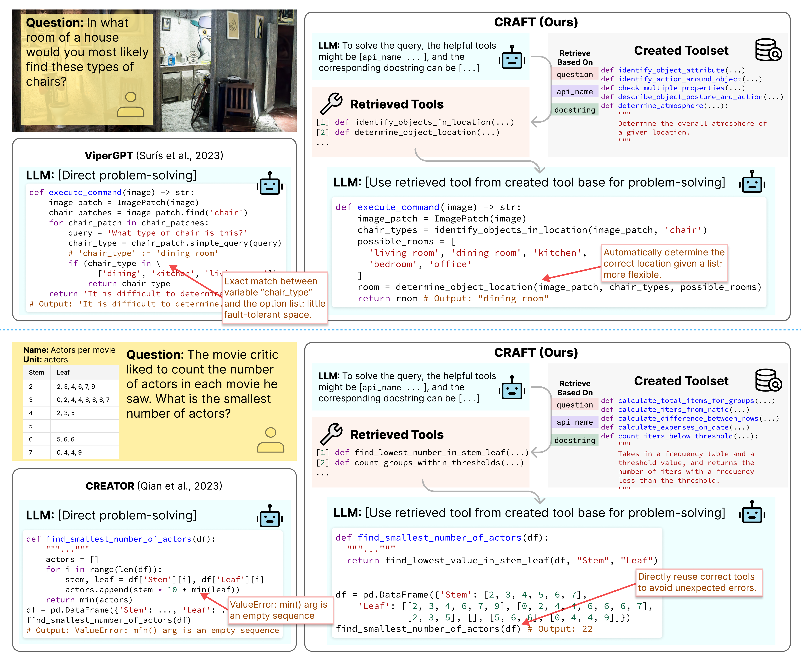
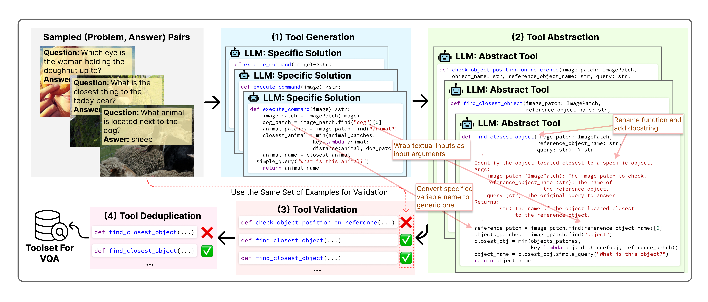
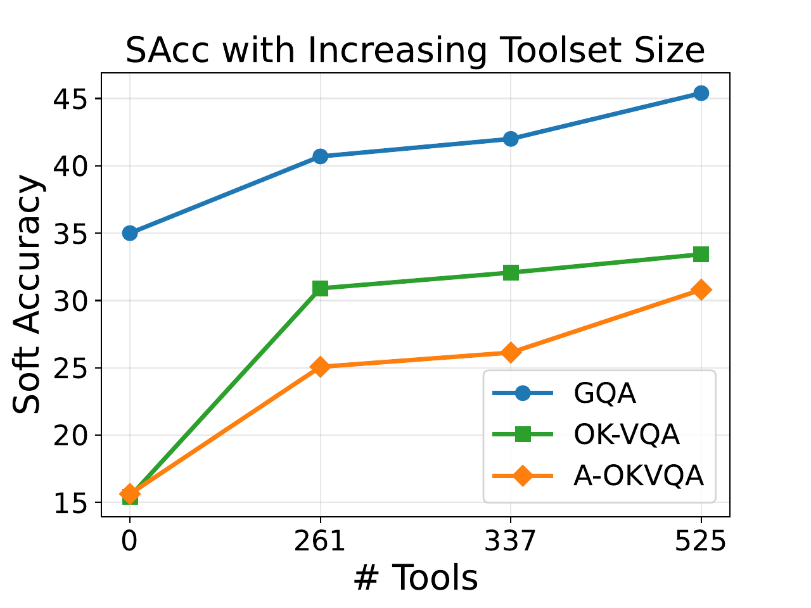
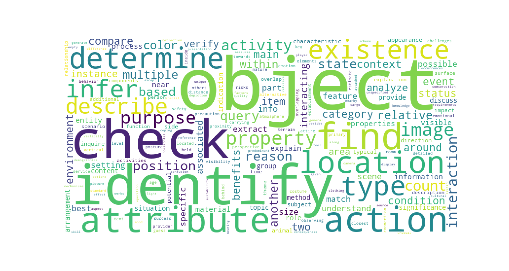

#  CRAFT: Customizing LLMs by Creating  
and Retrieving from Specialized Toolsets CRAFT: Customizing LLMs by Creating  
and Retrieving from Specialized Toolsets

## Abstract

Large language models (LLMs) are often augmented with tools to solve complex tasks. By generating code snippets and executing them through task-specific Application Programming Interfaces (APIs), they can offload certain functions to dedicated external modules, such as image encoding and performing calculations. However, most existing approaches to augment LLMs with tools are constrained by general-purpose APIs and lack the flexibility for tailoring them to specific tasks. In this work, we present **CRAFT**, a general tool creation and retrieval framework for LLMs. It creates toolsets specifically curated for the tasks and equips LLMs with a component that retrieves tools from these sets to enhance their capability to solve complex tasks. For each task, we collect specific code solutions by prompting GPT-4 to solve the training examples. Following a validation step ensuring the correctness, these solutions are abstracted into code snippets to enhance reusability, and deduplicated for higher quality. At inference time, the language model retrieves snippets from the toolsets and then executes them or generates the output conditioning on the retrieved snippets. Our method is designed to be flexible and offers a plug-and-play approach to adapt off-the-shelf LLMs to unseen domains and modalities, without any finetuning. Experiments on vision-language, tabular processing, and mathematical reasoning tasks show that our approach achieves substantial improvements compared to strong baselines. In addition, our in-depth analysis reveals that: (1) consistent performance improvement can be achieved by scaling up the number of tools and the capability of the backbone models; (2) each component of our approach contributes to the performance gains; (3) the created tools are well-structured and reliable with low complexity and atomicity. [^1]

# Introduction

Large language models (LLMs) have emerged as transformative tools in AI, exhibiting capabilities in complex problem-solving, including reasoning, planning, and producing creative outputs . Recent evidence has shown that LLMs can dynamically interact with the environment through external tools, which grants them access to information beyond their pretrained parameters . For example, these models can generate code snippets and call APIs provided by visual tools like image encoding models, to solve problems that involve images or videos .

<figure id="fig:illustrative">

<figcaption> Previous approaches directly solve the given problem by generating code solutions, which may contain errors. CRAFT first creates a toolset that contains diverse, reusable, and correct tools that are executable code snippets. During inference, CRAFT employs a multi-view matching approach, incorporating information about the target problem, API names, and docstrings, to identify and utilize relevant tools, enhancing its problem-solving capabilities. </figcaption>
</figure>

Success has been achieved by integrating LLMs with large-scale, general-purpose tool collections . However, adapting LLMs to many domains and evolving applications involves working with more specialized APIs tailored to address specific challenges, which are often inadequately represented in general-purpose toolsets. In response, this work proposes to integrate LLMs with highly customizable toolsets that are curated for specific problems of interest.

Our approach, dubbed CRAFT, constructs a toolset customized for a given task (see Figure <a href="#fig:illustrative" data-reference-type="ref" data-reference="fig:illustrative">1</a>). In contrast to previous approaches that only incorporate one single type of tool  or create unverified and non-reusable tools , our toolset contains diverse, reusable, and correct APIs that can tackle various problems. This is achieved through an automated process, by instructing LLMs to generate specific code solutions to solve training problems of the task or related ones. The specific solutions are then abstracted into code snippets, which can later be instantiated to solve similar problems. Dedicated validation and deduplication steps ensure the correctness of the tools and reduce redundancy, thereby enhancing the quality of the toolset.

At inference time, precisely identifying and retrieving relevant tools for the given problems is challenging, especially given the constructed large toolset. Existing solutions typically rely on pre-selected tools , heuristic-based tool selection strategy , and simple similarity measure , which may be unsuitable or insufficient to pinpoint the related tools from a large toolset given the problems. CRAFT implements a retrieval component that takes into account the target problem, the names of the tools (a.k.a, APIs), and their docstrings through a multi-view matching function. The retrieved snippets are then added to the prompt of LLMs so that the retrieved tools can be invoked in the generated code solutions.

The empirical effectiveness of CRAFT is validated through experiments on visual question answering, tabular processing, and mathematical reasoning tasks. Compared to strong baselines, CRAFT achieves an average of 43.16% relative improvement in F1 score compared to the best baselines in vision-language tasks, where the LLMs are required to interact with various visual tools to encode the images. Through our carefully designed analysis, we find (1) the performance continually increases as the number of tools and the capability of the backbone models increase; (2) Each component design incorporated in CRAFT contributes to the performance gains; (3) the created tools exhibit atomicity and possess low complexity, underscoring their robust structures and reliability.

The contribution of this work is two-fold. First, we introduce CRAFT, a broadly applicable framework to customize LLMs to various tasks and domains via tool creation and retrieval. Second, we release the created toolsets that include diverse, reusable, and correct tools, which are useful for various downstream tasks. Estimatedly, it costs around 2,500$ in total for the toolsets construction.

# CRAFT

We introduce CRAFT to address the challenges faced by prior research in the following two aspects: (1) **Tool Creation:** The establishment of an extensive toolset of diverse, reusable, and correct tools, in contrast to the reliance on limited examples ; (2) **Tool Retrieval:** The effective retrieval of relevant tools from a large toolset, tailored to the specific question, thereby departing from the conventional approach of simplistic similarity matching . By instantiating the retrieved code and adding it to the prompt, LLMs can then use the tools by calling the function to perform complex operations rather than implement every detail from scratch.

## Tool Creation

Based on a source dataset, namely a general instruction dataset or a training dataset that contains problem-answer pairs, CRAFT constructs the toolset through four steps: **Generation**, **Abstraction**, **Verification**, and **Deduplication**, which are illustratied in Figure <a href="#fig:pipeline" data-reference-type="ref" data-reference="fig:pipeline">2</a> and will be described as follows.

<figure id="fig:pipeline">

<figcaption>The toolset construction pipeline creates diverse, reusable, and correct tools that are executable code snippets, which can generalize LLMs to specialized domains and tasks.</figcaption>
</figure>

**Generation.** To create a toolset containing diverse tools that can be adopted to address various problems, we apply an iterative approach to sample problem-answer pairs from the source dataset. At a high level, the generation step involves iteratively sampling problems from the source dataset, generating code solutions, and filtering out incorrect ones. We use $`Q`$ to denote the set of sampled problems and $`R_{i}`$ to denote the set of remaining problems after the $`i`$-th iteration. $`Q`$ is initialized with $`n`$ random samples from the entire source dataset and $`R_i`$ is initialized as the rest. At each iteration, we use the highest similarity between each $`q_r \in R_i`$ and any $`q_s \in Q`$ as the similarity between each $`q_r`$ and set $`Q`$. To enhance the diversity of the toolset, $`Q`$ is updated by adding $`k`$ problems that are least similar to $`Q`$, where $`k`$ represents the desired number of samples for each iteration. This min-max sampling strategy is: $`Q \leftarrow Q \cup  \operatorname{argTopK}_{ \operatorname{min}} \left(  \max_{q_s \in Q}  \operatorname{sim}(q_r, q_s) \ | \ q_r \in R_i \right)`$. Function $`\operatorname{argTopK}_{\operatorname{min}}`$ returns the indices of the top $`k`$ elements with the smallest values from a set, which is set to 100 in our implementation, and $`\operatorname{sim}\left(  \cdot  \right)`$ denotes the cosine similarity of the representation vectors computed by SimCSE, a state-of-the-art sentence representation learning method based on contrastive learning .

For each problem $`q_r \in Q`$, we instruct GPT-4  to generate a specific solution in Python that can be executed by an interpreter to get the answer. The prompts are shown in Appendix <a href="#sec:prompt" data-reference-type="ref" data-reference="sec:prompt">8</a>. We keep those code solutions that are bug-free and can produce correct outputs, and discard everything else to ensure the correctness of the created tools.

**Abstraction.** The generated code solutions are tailored for the given problems, keeping them from being useful for others. The abstraction step aims to promote the reusability of the toolset, ensuring that each tool can be adopted to tackle a broader range of similar problems. This abstraction step is achieved by instructing GPT-4 to replace all specific variable names with general ones (e.g., `cat`$`\rightarrow`$`animal`, `desk`$`\rightarrow`$`object`) and wrap textual inputs of internal function calls as arguments of the tool (e.g., `date = df["date"]`$`\rightarrow`$`date = df[column_name]`, where the value of `column_name` is passed in by tool users) within the code piece, substituting them with more generic counterparts to adapt to similar problems (see Figure <a href="#fig:pipeline" data-reference-type="ref" data-reference="fig:pipeline">2</a>). In addition, we instruct GPT-4 to assign a suitable and general function name and compose a corresponding docstring to elucidate the functionality of created tools. The prompt is described in Appendix <a href="#sec:prompt" data-reference-type="ref" data-reference="sec:prompt">8</a>.

**Validation.** The validation step ensures the correctness of the created tools. This is achieved by examining whether the abstract tool functions can solve the original problems. Specifically, we offer GPT-4 access to the abstract tool function, with the expectation that it will address the original problems by supplying appropriate arguments to the tool function. The tools that fail to derive the correct answers given the original problems are discarded.

**Deduplication.** To reduce the redundancy in the toolset and improve its diversity, we perform a deduplication step to streamline the toolset and mitigate potential confusion stemming from redundant tools (e.g., same function names). We organize created tools into groups based on function names and the corresponding number of input arguments. Each group contains tools that have the same function names and the number of input arguments. For groups that contain more than one tool, we prompt GPT-4 to decide on the most comprehensive tool with extensive applications within the groups, using the prompt shown in Appendix <a href="#sec:prompt" data-reference-type="ref" data-reference="sec:prompt">8</a>.

## Tool Retrieval

Retrieving relevant tools from the large constructed toolset is challenging. For better retrieval outcomes, we prompt the LLM to “describe what it needs”. During inference, the evaluated LLM is asked to generate the function names $`f_t`$ and the docstrings $`d_t`$ based on the target problem $`q_t`$. Then CRAFT adopts a similarity measuring strategy that takes into account three key aspects of the created tool $`t_i`$: (1) The original problem used for creating the tool **$`q_i`$**; (2) The tool’s function name **$`f_i`$**; (3) The docstring of the function **$`d_i`$**. For each tool $`t_i`$, this results in a tuple $`(q_{i},f_i,d_{i})`$. We conduct multi-view matching, searching tools via $`q_t`$, $`f_t`$, and $`d_t`$ respectively in the toolset $`T`$. Specifically, we have:
``` math
T_{q_t} =  \operatorname{argTopK}_{ \operatorname{max}} \left(  \operatorname{sim}(q_i, q_t) \ |  \ t_i \in T  \right)
% \{ \text{Tools} ~ | ~ \text{yield Top-} K \text{ similarity scores, } \operatorname{sim}(q_i, q_t) \}
```
where $`\operatorname{argTopK}_{\operatorname{max}}`$ is a function that returns the indices of the top $`k`$ elements with the maximum values from a set, $`\operatorname{sim}\left(  \cdot  \right)`$ measures the similarity between two sentences using SimCSE embeddings, and $`T_{q_t}`$ is a list of $`k`$ tools retrieved by matching problems. We then perform the similar retrieval by matching function names and docstring, obtaining $`T_{f_t}`$ and $`T_{d_t}`$ respectively. Next, the three lists of tools are aggregated and ranked by their frequency of occurrences. We then retrieve the three most frequent tools by majority vote. Finally, we filter out those that occur only once, if any. In extreme cases, it is also possible that all tools appear only once, i.e. the retrieved tool set is empty, then LLMs would directly perform code generation to solve question without invoking task-specific tools.

After retrieval, the code snippets of tools are added to the prompt of LLMs for code generation to solve a given question. LLMs can invoke the tools (a.k.a, APIs) embedded in the code. Subsequently, the retrieved tool functions and LLM-generated code solutions are instantiated into executable code, and then they are executed to obtain the final predictions.

#### Summary and Discussion.

CRAFT creates a specialized toolset offline, and retrieves useful tools from the toolset in inference time. In toolset creation, we apply an iterative problem-sampling strategy based on similarity for diversity, followed by generating code solutions using GPT-4. To ensure the reusability of the created tools, we abstract the specific solutions into high-level tools that can tackle various kinds of problems by instructing GPT-4. To ensure the tools’ correctness, we evaluate the tools on the original problems and discard those outputting incorrect answers. Finally, we deduplicate the tools to reduce redundancy, and finally obtain a toolset. In inference, we apply a multi-view matching algorithm regarding the target problem, function name, and docstring between those in the toolset to retrieve related tools.

We highlight several advantages of CRAFT. At a high level, by leveraging the tool creation paradigm, we can effectively utilize the domain-specific data to customize the LLMs without extensive fine-tuning, rendering CRAFT a **training-free** and **plug-and-play** approach. Due to CRAFT’s flexibility in accommodating various domains and tasks, it is **broadly applicable** across a spectrum of problem categories. In the concrete implementation, each tool is instantiated as an executable code snippet and is targeted at small atomic problems, such as identifying the color of an object. This ensures the **explainability** of the created tools. We can easily incorporate human efforts to examine the problematic tools and fix the errors. In addition, this allows for the decomposition of complex problems into multiple manageable steps, facilitating the **compositionality** of these created tools during inference.

# Experiment

## Experimental Setting

#### Evaluation Tasks, Datasets, and Metrics.

To demonstrate the versatility of CRAFT, we select three distinct tasks for evaluation, spanning visual question answering (VQA), tabular processing, and mathematical reasoning:

- **VQA**: The goal is to answer questions based on the information available in an associated image. We use three complex visual reasoning datasets, including GQA , OK-VQA , and A-OKVQA . The GQA problems are more complex and require compositional reasoning to answer, while OK-VQA and A-OKVQA mainly use external real-world knowledge of objects or actions in the image. For evaluation, we formalize the VQA task as an open-ended generation problem and use the soft accuracy (SAcc) metric . In addition, we observe that LM-generated functions often produce descriptive responses instead of concise phrases, which hurts the exact match between predictions and ground-truth answers. This can potentially cause an underestimation of the performance, so we also use the F1 score for evaluation, which is frequently employed in extractive question-answering tasks .

- **Tabular Processing:** It evaluates an LLM’s ability to process structured data in tables. We use TabMWP , a dataset with each sample containing one table and one corresponding problem in natural language. To handle the task, LLMs should understand the natural language descriptions of the problems, extract relevant information from the accompanying tables, and finally perform calculations based on the extracted information. We use the accuracy based on the exact match to measure model performance.

- **Mathematical Reasoning:** LLMs are expected to solve mathematical problems written in natural language, leveraging both their understanding of textual inputs and complex reasoning capabilities. We use the algebra subset of MATH , containing 881 challenging competition-level algebra problems. Evaluating CRAFT on all subsets goes beyond our budget constraint but we believe CRAFT is equally applicable to other math problems. The models’ performance is evaluated using accuracy.

#### Baselines.

We compare CRAFT with baseline methods of four categories:

- **Basic Reasoning without Tools:** This line of methods solves downstream problems solely based on the intrinsic reasoning ability of LLMs without access to any external tool. We use the chain-of-thought prompting (**CoT**) , which prompts LLMs to generate the rationales before answers *without* using tools. However, it does not apply to the VQA task since LLMs cannot process visual information without external visual tools.

- **Tool Learning:** We compare with approaches that directly leverage existing tools to assist the problem-solving process. In this case, LLMs only learn to use the human-provided tools without creating and retrieving tools. We compare to two approaches: (1) **Vanilla** stands for utilizing the most basic tools, such as Python Interpreter for all three tasks, and extra vision models to solve VQA problems. Specifically, the vanilla tool-using method for VQA is ViperGPT , and that for the other two tasks is Program-of-Thoughts reasoning . (2) **External library:** Therefore, we also explore the possibility of exploiting external tool functions in the Python libraries to enhance the vanilla methods. For VQA, we use Numpy , SciPy , Scikit-Image , and Mahotas . For the remaining two tasks, we substitute Scikit-Image and Mahotas with Pandas and SymPy .

- **Different LLM-Created Tools:** We compare with previous tool creation approaches, including **LATM**  and **CREATOR** . Specifically, LATM samples 3 examples from the training set to create a tool for the task, which is further verified by 3 samples from the validation set. The created tool is then applied to all test cases. CREATOR creates one specific tool for each test case in the inference time. For fair comparisons, we remove the format checking and rectifying process used in the original work and only meausre the one-pass accuracy.

- **Alternative Retrieval Methods:** We compare with previous tool retrieval approaches, which focus on the similarity measure between the problem and the API names. We include two prevalent measures, namely SimCSE and BM25 similarity, following and respectively. The baseline retrieval methods are also based on our created toolset for fair comparison.

In this work, we implement CRAFT and all baselines based on the GPT-3.5-Turbo  backbone because: (1) It is more cost-effective compared to alternatives like GPT-4, with affordable cost and strong performance; (2) The Turbo-0613 version is specially optimized for the tool-learning purpose. Conversely, alternative backbone models (e.g., CodeLlama ) demonstrate near-random performance in our setting, which can be attributed to their suboptimal tool-using capabilities. The concrete implementation details are described in Appendix <a href="#sec:implement" data-reference-type="ref" data-reference="sec:implement">7</a>.

## Experimental Results

<div class="adjustbox">

max width=

<div id="tab:main_results">

<table>
<caption>The experimental results of CRAFT and four categories of baselines on three tasks. SAcc denotes soft accuracy, which is widely used for VQA. F1 is supplemented to tackle the issue of underestimated performance caused by the descriptive responses of LLMs. Acc denotes the accuracy. </caption>
<thead>
<tr>
<th colspan="2" style="text-align: left;">GPT-3.5-Turbo</th>
<th colspan="2" style="text-align: center;"><strong>GQA</strong></th>
<th style="text-align: left;"></th>
<th colspan="2" style="text-align: center;"><strong>OK-VQA</strong></th>
<th style="text-align: left;"></th>
<th colspan="2" style="text-align: center;"><strong>A-OKVQA</strong></th>
<th style="text-align: center;"><strong>TabMWP</strong></th>
<th style="text-align: center;"><strong>MATH<span class="math inline"><sub>alg</sub></span></strong></th>
</tr>
</thead>
<tbody>
<tr>
<td style="text-align: left;"><span>3-4</span></td>
<td style="text-align: left;">Method</td>
<td style="text-align: center;">SAcc</td>
<td style="text-align: center;">F1</td>
<td style="text-align: left;"></td>
<td style="text-align: center;">SAcc</td>
<td style="text-align: center;">F1</td>
<td style="text-align: left;"></td>
<td style="text-align: center;">SAcc</td>
<td style="text-align: center;">F1</td>
<td style="text-align: center;">Acc</td>
<td style="text-align: center;">Acc</td>
</tr>
<tr>
<td style="text-align: left;">Basic Reasoning</td>
<td style="text-align: left;">CoT</td>
<td style="text-align: center;">-</td>
<td style="text-align: center;">-</td>
<td style="text-align: left;"></td>
<td style="text-align: center;">-</td>
<td style="text-align: center;">-</td>
<td style="text-align: left;"></td>
<td style="text-align: center;">-</td>
<td style="text-align: center;">-</td>
<td style="text-align: center;">75.2</td>
<td style="text-align: center;">50.9</td>
</tr>
<tr>
<td rowspan="2" style="text-align: left;">Tool Learning</td>
<td style="text-align: left;">Vanilla</td>
<td style="text-align: center;">35.0</td>
<td style="text-align: center;">36.9</td>
<td style="text-align: left;"></td>
<td style="text-align: center;">15.4</td>
<td style="text-align: center;">24.7</td>
<td style="text-align: left;"></td>
<td style="text-align: center;">15.6</td>
<td style="text-align: center;">23.0</td>
<td style="text-align: center;">80.6</td>
<td style="text-align: center;">58.2</td>
</tr>
<tr>
<td style="text-align: left;">External</td>
<td style="text-align: center;">34.2</td>
<td style="text-align: center;">37.8</td>
<td style="text-align: left;"></td>
<td style="text-align: center;">16.8</td>
<td style="text-align: center;">25.3</td>
<td style="text-align: left;"></td>
<td style="text-align: center;">14.45</td>
<td style="text-align: center;">22.9</td>
<td style="text-align: center;">83.1</td>
<td style="text-align: center;">41.1</td>
</tr>
<tr>
<td rowspan="2" style="text-align: left;">Different Tools</td>
<td style="text-align: left;">LATM</td>
<td style="text-align: center;">29.4</td>
<td style="text-align: center;">30.3</td>
<td style="text-align: left;"></td>
<td style="text-align: center;">7.8</td>
<td style="text-align: center;">11.8</td>
<td style="text-align: left;"></td>
<td style="text-align: center;">6.5</td>
<td style="text-align: center;">11.4</td>
<td style="text-align: center;">9.3</td>
<td style="text-align: center;">30.3</td>
</tr>
<tr>
<td style="text-align: left;">CREATOR</td>
<td style="text-align: center;">34.3</td>
<td style="text-align: center;">38.4</td>
<td style="text-align: left;"></td>
<td style="text-align: center;">16.7</td>
<td style="text-align: center;">27.3</td>
<td style="text-align: left;"></td>
<td style="text-align: center;">17.3</td>
<td style="text-align: center;">25.8</td>
<td style="text-align: center;">81.0</td>
<td style="text-align: center;">65.0</td>
</tr>
<tr>
<td rowspan="2" style="text-align: left;">Alternative Retrieval</td>
<td style="text-align: left;">SimCSE</td>
<td style="text-align: center;">36.4</td>
<td style="text-align: center;">38.8</td>
<td style="text-align: left;"></td>
<td style="text-align: center;">18.4</td>
<td style="text-align: center;">28.9</td>
<td style="text-align: left;"></td>
<td style="text-align: center;">16.8</td>
<td style="text-align: center;">24.3</td>
<td style="text-align: center;">83.8</td>
<td style="text-align: center;">36.7</td>
</tr>
<tr>
<td style="text-align: left;">BM25</td>
<td style="text-align: center;">37.9</td>
<td style="text-align: center;">39.0</td>
<td style="text-align: left;"></td>
<td style="text-align: center;">13.4</td>
<td style="text-align: center;">24.3</td>
<td style="text-align: left;"></td>
<td style="text-align: center;">17.8</td>
<td style="text-align: center;">26.1</td>
<td style="text-align: center;"><strong>89.2</strong></td>
<td style="text-align: center;">35.9</td>
</tr>
<tr>
<td style="text-align: left;">This Work</td>
<td style="text-align: left;">CRAFT</td>
<td style="text-align: center;"><strong>45.4</strong></td>
<td style="text-align: center;"><strong>48.8</strong></td>
<td style="text-align: left;"></td>
<td style="text-align: center;"><strong>33.4</strong></td>
<td style="text-align: center;"><strong>43.0</strong></td>
<td style="text-align: left;"></td>
<td style="text-align: center;"><strong>30.8</strong></td>
<td style="text-align: center;"><strong>40.6</strong></td>
<td style="text-align: center;">88.4</td>
<td style="text-align: center;"><strong>68.1</strong></td>
</tr>
</tbody>
</table>

</div>

</div>

<span id="tab:main_results" label="tab:main_results"></span>

We present the results in Table <a href="#tab:main_results" data-reference-type="ref" data-reference="tab:main_results">1</a>. Particularly, we find that directly leveraging tools from external Python libraries fails to improve the performance, and in certain cases, may have a detrimental impact (e.g., in mathematical reasoning). This suggests that the relevance of tools affects the performance of augmented LLMs, motivating us to construct a high-quality tool base that customizes LLMs to each task. We observe that LATM struggles with all datasets and brings negative effects; CREATOR yields a notable enhancement in mathematical reasoning task performance, while its impact on other datasets appears marginal. This result suggests the necessity of sufficient and diverse tools to tackle problems of various categories in downstream datasets. For tool retrieval baselines, the performances vary across datasets. But in general, LLMs do not get substantial enhancement except on TabMWP, posing the need for better retrieval algorithms.

Overall, CRAFT demonstrates superior performance on all datasets, especially on the challenging VQA tasks. Significantly, CRAFT demonstrates a notable enhancement over the vanilla baseline, namely ViperGPT, with absolute SAcc improvements of 10.4, 18.0, and 15.2 observed on the GQA, OK-VQA, and A-OKVQA datasets, respectively. In addition, based on the same created toolset, the retrieval approach incorporated in CRAFT demonstrates overall better performance compared to alternative ones, which exhibit a certain level of performance variance. One exception is the comparison with BM25 on TabMWP. This discrepancy can be attributed to the presence of relatively straightforward patterns within this dataset, which do not sufficiently showcase the advantages of our approach in tool retrieval.

# Further Analysis.

In this section, we conduct an in-depth analysis for CRAFT on VQA datasets. This task is particularly pertinent for assessing the impact of external tool augmentation, given that LLMs lack the capability to directly process images. Thus, it serves as a key testbed for measuring the influence of external tools.

<span id="sec:ablation_study" label="sec:ablation_study"></span>

<div id="tab:ablation">

<table>
<caption>Results of further analysis, encompassing ablation study on abstraction and retrieval components, as well as the comparison between ViperGPT and CRAFT with different backbones.</caption>
<thead>
<tr>
<th colspan="2" style="text-align: left;">GPT-3.5-Turbo</th>
<th colspan="2" style="text-align: center;"><strong>GQA</strong></th>
<th style="text-align: left;"></th>
<th colspan="2" style="text-align: center;"><strong>OK-VQA</strong></th>
<th style="text-align: left;"></th>
<th colspan="2" style="text-align: center;"><strong>A-OKVQA</strong></th>
<th style="text-align: left;"></th>
</tr>
</thead>
<tbody>
<tr>
<td style="text-align: left;"><span>3-4</span></td>
<td style="text-align: left;">SAcc</td>
<td style="text-align: center;">F1</td>
<td style="text-align: center;"></td>
<td style="text-align: left;">SAcc</td>
<td style="text-align: center;">F1</td>
<td style="text-align: center;"></td>
<td style="text-align: left;">SAcc</td>
<td style="text-align: center;">F1</td>
<td style="text-align: center;"></td>
<td style="text-align: left;"></td>
</tr>
<tr>
<td colspan="2" style="text-align: left;">ViperGPT</td>
<td style="text-align: center;">35.0</td>
<td style="text-align: center;">36.9</td>
<td style="text-align: left;"></td>
<td style="text-align: center;">15.4</td>
<td style="text-align: center;">24.7</td>
<td style="text-align: left;"></td>
<td style="text-align: center;">15.6</td>
<td style="text-align: center;">23.0</td>
<td style="text-align: left;"></td>
</tr>
<tr>
<td colspan="2" style="text-align: left;">CRAFT</td>
<td style="text-align: center;"><strong>45.4</strong></td>
<td style="text-align: center;"><strong>48.8</strong></td>
<td style="text-align: left;"></td>
<td style="text-align: center;"><strong>33.4</strong></td>
<td style="text-align: center;"><strong>43.0</strong></td>
<td style="text-align: left;"></td>
<td style="text-align: center;"><strong>30.8</strong></td>
<td style="text-align: center;"><strong>40.6</strong></td>
<td style="text-align: left;"></td>
</tr>
<tr>
<td style="text-align: left;"><span>3-10</span></td>
<td style="text-align: left;">w/o Abstraction</td>
<td style="text-align: center;">37.1</td>
<td style="text-align: center;">39.7</td>
<td style="text-align: left;"></td>
<td style="text-align: center;">31.0</td>
<td style="text-align: center;">41.4</td>
<td style="text-align: left;"></td>
<td style="text-align: center;">28.0</td>
<td style="text-align: center;">39.3</td>
<td style="text-align: left;"></td>
</tr>
<tr>
<td style="text-align: left;"></td>
<td style="text-align: left;">w/o Problem</td>
<td style="text-align: center;">42.4</td>
<td style="text-align: center;">45.8</td>
<td style="text-align: left;"></td>
<td style="text-align: center;">32.7</td>
<td style="text-align: center;">42.3</td>
<td style="text-align: left;"></td>
<td style="text-align: center;">29.8</td>
<td style="text-align: center;">38.7</td>
<td style="text-align: left;"></td>
</tr>
<tr>
<td style="text-align: left;"></td>
<td style="text-align: left;">w/o Name</td>
<td style="text-align: center;">36.4</td>
<td style="text-align: center;">38.3</td>
<td style="text-align: left;"></td>
<td style="text-align: center;">26.8</td>
<td style="text-align: center;">35.7</td>
<td style="text-align: left;"></td>
<td style="text-align: center;">21.7</td>
<td style="text-align: center;">30.6</td>
<td style="text-align: left;"></td>
</tr>
<tr>
<td style="text-align: left;"></td>
<td style="text-align: left;">w/o Docstring</td>
<td style="text-align: center;">37.3</td>
<td style="text-align: center;">39.1</td>
<td style="text-align: left;"></td>
<td style="text-align: center;">29.8</td>
<td style="text-align: center;">38.8</td>
<td style="text-align: left;"></td>
<td style="text-align: center;">25.0</td>
<td style="text-align: center;">34.0</td>
<td style="text-align: left;"></td>
</tr>
<tr>
<td colspan="2" rowspan="2" style="text-align: left;">GPT-4</td>
<td colspan="2" style="text-align: center;"><strong>GQA</strong></td>
<td style="text-align: left;"></td>
<td colspan="2" style="text-align: center;"><strong>OK-VQA</strong></td>
<td style="text-align: left;"></td>
<td colspan="2" style="text-align: center;"><strong>A-OKVQA</strong></td>
<td style="text-align: left;"></td>
</tr>
<tr>
<td style="text-align: center;">F1</td>
<td style="text-align: center;"></td>
<td style="text-align: left;">SAcc</td>
<td style="text-align: center;">F1</td>
<td style="text-align: center;"></td>
<td style="text-align: left;">SAcc</td>
<td style="text-align: center;">F1</td>
<td style="text-align: center;"></td>
<td style="text-align: left;"></td>
</tr>
<tr>
<td colspan="2" style="text-align: left;">ViperGPT</td>
<td style="text-align: center;">51.4</td>
<td style="text-align: center;">53.7</td>
<td style="text-align: left;"></td>
<td style="text-align: center;">36.7</td>
<td style="text-align: center;">47.2</td>
<td style="text-align: left;"></td>
<td style="text-align: center;">32.8</td>
<td style="text-align: center;">42.4</td>
<td style="text-align: left;"></td>
</tr>
<tr>
<td colspan="2" style="text-align: left;">CRAFT</td>
<td style="text-align: center;"><strong>55.6</strong></td>
<td style="text-align: center;"><strong>58.8</strong></td>
<td style="text-align: left;"></td>
<td style="text-align: center;"><strong>39.0</strong></td>
<td style="text-align: center;"><strong>49.1</strong></td>
<td style="text-align: left;"></td>
<td style="text-align: center;"><strong>35.3</strong></td>
<td style="text-align: center;"><strong>44.8</strong></td>
<td style="text-align: left;"></td>
</tr>
</tbody>
</table>

</div>

<span id="tab:ablation" label="tab:ablation"></span>

## Does Abstraction Facilitate Tool Use?

#### Setup.

Abstraction is a crucial step in constructing the toolset, converting solutions for specific problems into general-purpose tools that are applicable to diverse problems with a common pattern. In this section, we explore its efficacy with an ablation study. To scrutinize this, we establish a control group, where the toolset is created ablating the abstraction step. To ensure compatibility, we prompt GPT-4 to assign a distinctive function name and docstring for each solution to facilitate the multi-view retrieval approach for fair comparison.

#### Results.

Table <a href="#tab:ablation" data-reference-type="ref" data-reference="tab:ablation">2</a> shows a clear performance drop when the abstraction step is ablated, confirming its importance. Moreover, comparing abstraction-ablated CRAFT with ViperGPT, improvements are achieved across all three datasets, especially on OK-VQA and A-OKVQA. We identify two potential reasons that can elucidate the improvement. First, the created toolset is large and diverse enough, facilitating the adoption of specific tools without abstraction for addressing new problems. Second, as retrieved tools offer a correct approach to problem-solving, LLMs can efficiently adapt these strategies to address new problems.

## Is Every Matching in the Retrieval Triplet Equally Important?

#### Setup.

CRAFT retrieves tools based on multi-view matching. We demonstrate its effectiveness in Section <a href="#sec:main_results" data-reference-type="ref" data-reference="sec:main_results">3.2</a>. Next, we respectively ablate problems, function names, and docstring from the matching process to investigate their influence on performance.

#### Results.

As demonstrated in Table <a href="#tab:ablation" data-reference-type="ref" data-reference="tab:ablation">2</a>, it is clear that the removal of any of the three similarity measures from our multi-view matching function adversely impacts performance, thereby validating the rationale behind our design strategy. Among them, the function names appear the most important one, resulting in more than 6.6 absolute SAcc drop when ablated.

## Does CRAFT still Work for More Powerful Backbone Models?

#### Setup.

In previous experiments, CRAFT is implemented using GPT-3.5-Turbo as the backbone. In this analysis, we evaluate CRAFT when using the more powerful GPT-4 as the backbone. Due to the budget limits, we only compare CRAFT with the vanilla baseline ViperGPT without tool creation.

#### Results.

The results in Table <a href="#tab:ablation" data-reference-type="ref" data-reference="tab:ablation">2</a> demonstrate that CRAFT achieves consistently better performance with GPT-4, confirming that CRAFT is helpful even with more capable backbone models. However, it’s noteworthy that while the improvement of CRAFT on GPT-4 is pronounced, it is less obvious compared to the impact on GPT-3.5-Turbo. We hypothesize that this result is in line with the conclusions of recent work, which finds that LLMs can benefit from the guidance of more capable models while gaining no improvement from the guidance of itself . The tools, created by GPT-4, may provide comparatively fewer insights for itself, thereby limiting the potential benefits of external tool augmentation.

## Can CRAFT Improve Performance as the Toolset Gets Larger?

#### Setup.

<figure id="fig:tool_scaling">
<div class="center">

</div>
<figcaption>The performance of CRAFT improves as the toolset scales up. </figcaption>
</figure>

A feature of CRAFT distinctive from prior approaches is the extensibility of the toolsets. We examine the utility of extension by manipulating the toolset’s size and tracking performance trends. To elaborate, the iterative problem sampling strategy detailed in Section <a href="#sec:tool_base_construction" data-reference-type="ref" data-reference="sec:tool_base_construction">2.1</a> is initialized with a total of 11 epochs. In this analysis, the sizes of the toolset are modified through the exclusive inclusion of tools created at distinct epochs. We choose tools from the initial epoch, the final epoch, and the epoch in between, resulting in toolset sizes of 0 (no created tool for comparison), 261, 337, and 525, respectively.

#### Results.

The results in Figure <a href="#fig:tool_scaling" data-reference-type="ref" data-reference="fig:tool_scaling">3</a> show a consistent increase in soft accuracy as the toolset expands across 3 datasets, demonstrating the scalability and potential of CRAFT. The upward trend of soft accuracy continues, suggesting the potential for further improvement of CRAFT as the toolset keeps expanding. Significantly, the most substantial improvement is observed when transitioning from the absence of any created tools to the utilization of 261 tools. This validates the effectiveness of creating the specialized toolset to customize LLMs to various tasks and domains.

<div id="tab:tool_analysis">

<table>
<caption>Analysis of cyclomatic complexity and diversity of the toolsets.</caption>
<thead>
<tr>
<th style="text-align: left;">Task</th>
<th style="text-align: center;">VQA</th>
<th style="text-align: center;"><div id="tab:tool_analysis">
<table>
<caption>Analysis of cyclomatic complexity and diversity of the toolsets.</caption>
<tbody>
<tr>
<td style="text-align: center;">Tabular</td>
</tr>
<tr>
<td style="text-align: center;">Process</td>
</tr>
</tbody>
</table>
</div></th>
<th style="text-align: center;"><div id="tab:tool_analysis">
<table>
<caption>Analysis of cyclomatic complexity and diversity of the toolsets.</caption>
<tbody>
<tr>
<td style="text-align: center;">Mathematics</td>
</tr>
<tr>
<td style="text-align: center;">Reasoning</td>
</tr>
</tbody>
</table>
</div></th>
</tr>
</thead>
<tbody>
<tr>
<td style="text-align: left;">Avg. Cyclomatic Complexity</td>
<td style="text-align: center;">2.64</td>
<td style="text-align: center;">2.07</td>
<td style="text-align: center;">1.34</td>
</tr>
<tr>
<td style="text-align: left;"># Tools</td>
<td style="text-align: center;">525</td>
<td style="text-align: center;">181</td>
<td style="text-align: center;">282</td>
</tr>
<tr>
<td style="text-align: left;"># Classes of Tools</td>
<td style="text-align: center;">195</td>
<td style="text-align: center;">23</td>
<td style="text-align: center;">234</td>
</tr>
</tbody>
</table>

</div>

## What is Inside the Toolset?

We analyze the complexity and diversity of the code in toolsets. For complexity, we use the widely adopted cyclomatic complexity to measure the number of linearly independent paths, with the higher value indicating the code is more complicated and requires refactoring to make it more reliable. Good software should have a complexity of no more than 10, and a less complex toolset is desirable since it is less prone to trigger bugs. For diversity, we classify each tool into different groups. We use the number of distinct groups as the metric, with a larger number of tool groups indicating a wider range of problems that our toolset can address.

We calculate the complexity using Lizard Python library[^3], and present the average complexity of tools for each task in Table <a href="#tab:tool_analysis" data-reference-type="ref" data-reference="tab:tool_analysis">5</a>. We observe that the created toolsets for 3 tasks exhibit relatively low complexity, indicating that the tools are well-structured and reliable. We then adopt the Louvain community detection method , a graph-based community dividing algorithm, to group different tools. As shown in Table <a href="#tab:tool_analysis" data-reference-type="ref" data-reference="tab:tool_analysis">5</a>, for VQA, tabular process, and mathematics reasoning, there are 195, 23, and 234, distinct classes out of 525, 181, and 282 tools respectively. This suggests that the MATH dataset has the most diverse patterns, followed by VQA, while problems in the TabMWP dataset are more homogeneous and can be well-solved using fewer created tools.

<div class="adjustbox">

max width=

<div id="tab:scaling_model">

<table>
<caption>Ablation Study and Comparison between ViperGPT and CRAFT with GPT-4 being the backbone.</caption>
<thead>
<tr>
<th colspan="2" style="text-align: left;">GPT-3.5-Turbo</th>
<th colspan="2" style="text-align: center;"><strong>OK-VQA</strong></th>
<th style="text-align: left;"></th>
<th colspan="2" style="text-align: center;"><strong>GQA</strong></th>
<th style="text-align: left;"></th>
<th colspan="2" style="text-align: center;"><strong>A-OKVQA</strong></th>
<th style="text-align: left;"></th>
</tr>
</thead>
<tbody>
<tr>
<td style="text-align: left;"><span>3-4</span></td>
<td style="text-align: left;">Acc</td>
<td style="text-align: center;">F1</td>
<td style="text-align: center;"></td>
<td style="text-align: left;">Acc</td>
<td style="text-align: center;">F1</td>
<td style="text-align: center;"></td>
<td style="text-align: left;">Acc</td>
<td style="text-align: center;">F1</td>
<td style="text-align: center;"></td>
<td style="text-align: left;"></td>
</tr>
<tr>
<td colspan="2" style="text-align: left;">ViperGPT</td>
<td style="text-align: center;">36.7</td>
<td style="text-align: center;">47.2</td>
<td style="text-align: left;"></td>
<td style="text-align: center;">51.4</td>
<td style="text-align: center;">53.7</td>
<td style="text-align: left;"></td>
<td style="text-align: center;">32.8</td>
<td style="text-align: center;">42.4</td>
<td style="text-align: left;"></td>
</tr>
<tr>
<td colspan="2" style="text-align: left;">CRAFT</td>
<td style="text-align: center;"><strong>39.0</strong></td>
<td style="text-align: center;"><strong>49.1</strong></td>
<td style="text-align: left;"></td>
<td style="text-align: center;"><strong>55.6</strong></td>
<td style="text-align: center;"><strong>58.8</strong></td>
<td style="text-align: left;"></td>
<td style="text-align: center;"><strong>35.3</strong></td>
<td style="text-align: center;"><strong>44.8</strong></td>
<td style="text-align: left;"></td>
</tr>
<tr>
<td style="text-align: left;"><span>3-10</span></td>
<td style="text-align: left;">w/o Abstraction</td>
<td style="text-align: center;">31.0</td>
<td style="text-align: center;">41.4</td>
<td style="text-align: left;"></td>
<td style="text-align: center;">37.1</td>
<td style="text-align: center;">39.7</td>
<td style="text-align: left;"></td>
<td style="text-align: center;">28.0</td>
<td style="text-align: center;">39.3</td>
<td style="text-align: left;"></td>
</tr>
<tr>
<td style="text-align: left;"></td>
<td style="text-align: left;">w/o Query</td>
<td style="text-align: center;">32.7</td>
<td style="text-align: center;">42.3</td>
<td style="text-align: left;"></td>
<td style="text-align: center;">42.4</td>
<td style="text-align: center;">45.8</td>
<td style="text-align: left;"></td>
<td style="text-align: center;">29.8</td>
<td style="text-align: center;">38.7</td>
<td style="text-align: left;"></td>
</tr>
<tr>
<td style="text-align: left;"></td>
<td style="text-align: left;">w/o Name</td>
<td style="text-align: center;">26.8</td>
<td style="text-align: center;">35.7</td>
<td style="text-align: left;"></td>
<td style="text-align: center;">36.4</td>
<td style="text-align: center;">38.3</td>
<td style="text-align: left;"></td>
<td style="text-align: center;">21.7</td>
<td style="text-align: center;">30.6</td>
<td style="text-align: left;"></td>
</tr>
<tr>
<td style="text-align: left;"></td>
<td style="text-align: left;">w/o Docstring</td>
<td style="text-align: center;">29.8</td>
<td style="text-align: center;">38.8</td>
<td style="text-align: left;"></td>
<td style="text-align: center;">37.3</td>
<td style="text-align: center;">39.1</td>
<td style="text-align: left;"></td>
<td style="text-align: center;">25.0</td>
<td style="text-align: center;">34.0</td>
<td style="text-align: left;"></td>
</tr>
<tr>
<td colspan="2" rowspan="2" style="text-align: left;">GPT-4</td>
<td colspan="2" style="text-align: center;"><strong>OK-VQA</strong></td>
<td style="text-align: left;"></td>
<td colspan="2" style="text-align: center;"><strong>GQA</strong></td>
<td style="text-align: left;"></td>
<td colspan="2" style="text-align: center;"><strong>A-OKVQA</strong></td>
<td style="text-align: left;"></td>
</tr>
<tr>
<td style="text-align: center;">F1</td>
<td style="text-align: center;"></td>
<td style="text-align: left;">Acc</td>
<td style="text-align: center;">F1</td>
<td style="text-align: center;"></td>
<td style="text-align: left;">Acc</td>
<td style="text-align: center;">F1</td>
<td style="text-align: center;"></td>
<td style="text-align: left;"></td>
</tr>
<tr>
<td colspan="2" style="text-align: left;">ViperGPT</td>
<td style="text-align: center;">36.7</td>
<td style="text-align: center;">47.2</td>
<td style="text-align: left;"></td>
<td style="text-align: center;">51.4</td>
<td style="text-align: center;">53.7</td>
<td style="text-align: left;"></td>
<td style="text-align: center;">32.8</td>
<td style="text-align: center;">42.4</td>
<td style="text-align: left;"></td>
</tr>
<tr>
<td colspan="2" style="text-align: left;">CRAFT</td>
<td style="text-align: center;"><strong>39.0</strong></td>
<td style="text-align: center;"><strong>49.1</strong></td>
<td style="text-align: left;"></td>
<td style="text-align: center;"><strong>55.6</strong></td>
<td style="text-align: center;"><strong>58.8</strong></td>
<td style="text-align: left;"></td>
<td style="text-align: center;"><strong>35.3</strong></td>
<td style="text-align: center;"><strong>44.8</strong></td>
<td style="text-align: left;"></td>
</tr>
</tbody>
</table>

</div>

</div>

<span id="tab:scaling_model" label="tab:scaling_model"></span>

# Related Work

## Tool Learning with LLMs

LLMs, when integrated with real-world Application Programming Interfaces (APIs), gain the capability to actively interact with a range of external systems (a.k.a, tools) . The pioneering work connects GPT-3  with the web browser to access latest information, and hires human annotators to provide demonstrations of web searching . Further research expands upon this concept by encompassing a broader range of tools, such as calculators, calendars, interpreter, physical simulator, and maps , and explores the application of weakly-supervised methods, such as bootstrapping . More recently, progress has been achieved through the process of distilling the tool using the ability of closed-source LLMs (ChatGPT ) to the open-source LLMs. The key idea revolves around allowing ChatGPT to produce synthetic data exemplifying the usage of specified APIs. Subsequently, this synthetic data is leveraged for the refinement of open-sourced LLMs . In this work, we extend our approach beyond mere dependence on existing tools. We adapt LLMs to diverse downstream tasks through the creation of customized tools and the retrieval of relevant tools during inference.

## Tool Creation & Retrieval

While the exploration on tool creation and retrieval is relatively limited compared to tool learning with LLMs, we identify some preliminary efforts in this domain. For tool creation, proposes an approach wherein tools are created through the utilization of three training samples, and their efficacy is subsequently assessed using three validation samples. Consequently, the resulting toolbase is constrained in quantity. This approach hinges on the assumption that there exists a notable similarity between the distributions of the training and testing data. Consequently, the tools produced can be readily incorporated. Similarly, adopts a strategy that involves generating tools exclusively based on the provided query. As a result, the created tools lack reusability, thereby undermining the fundamental purpose of tool creation. For tool retrieval, existing research primarily includes pre-selection of human-curated tools tailored to specific problems , employing heuristic-based methods for tool selection , and adopting a straightforward similarity metric between user queries and API names . In this work, we motivate to create a large tool base that can be effectively utlized on related downstream tasks and address the challenge of retrieving the relevant tools from the large tool base.

# Conclusion

In conclusion, this paper presents CRAFT, a general framework for tool creation and retrieval to generalize LLMs for diverse domains and tasks. The framework’s effectiveness is demonstrated through improved performance in challenging tasks, alongside insights into component contributions, constructed toolsets, and scalability.

# Limitations and Future Work

We identify two limitations in this work that are worth future exploration. First, although the basic idea in CRAFT is widely applicable in principle, it is currently based on code generation for tool creation. This indicates that CRAFT is only suitable for tasks that can be solved via writing code solutions. We plan to expand this scope by exploring the use of pseudocode to generalize CRAFT to more tasks. Second, the effectiveness of CRAFT is greatly affected by the tool-using ability of backbone models. In our pilot exploration, some open-source models achieve near-random performance in the challenging tool-manipulation setting. Future work includes eliciting the tool manipulation ability in open-source models, such as the pilot exploration in .

# References

<div class="thebibliography">

Stanislaw Antol, Aishwarya Agrawal, Jiasen Lu, Margaret Mitchell, Dhruv Batra, C. Lawrence Zitnick, and Devi Parikh visual question answering In *2015 IEEE International Conference on Computer Vision, ICCV 2015, Santiago, Chile, December 7-13, 2015*, pp. 2425–2433. IEEE Computer Society, 2015. . URL <https://doi.org/10.1109/ICCV.2015.279>. **Abstract:** We propose the task of free-form and open-ended Visual Question Answering (VQA). Given an image and a natural language question about the image, the task is to provide an accurate natural language answer. Mirroring real-world scenarios, such as helping the visually impaired, both the questions and answers are open-ended. Visual questions selectively target different areas of an image, including background details and underlying context. As a result, a system that succeeds at VQA typically needs a more detailed understanding of the image and complex reasoning than a system producing generic image captions. Moreover, VQA is amenable to automatic evaluation, since many open-ended answers contain only a few words or a closed set of answers that can be provided in a multiple-choice format. We provide a dataset containing ~0.25M images, ~0.76M questions, and ~10M answers (www.visualqa.org), and discuss the information it provides. Numerous baselines for VQA are provided and compared with human performance. (@DBLP:conf/iccv/AntolALMBZP15)

Vincent D Blondel, Jean-Loup Guillaume, Renaud Lambiotte, and Etienne Lefebvre Fast unfolding of communities in large networks *Journal of statistical mechanics: theory and experiment*, 2008 (10): P10008, 2008. **Abstract:** We propose a simple method to extract the community structure of large networks. Our method is a heuristic method that is based on modularity optimization. It is shown to outperform all other known community detection methods in terms of computation time. Moreover, the quality of the communities detected is very good, as measured by the so-called modularity. This is shown first by identifying language communities in a Belgian mobile phone network of 2 million customers and by analysing a web graph of 118 million nodes and more than one billion links. The accuracy of our algorithm is also verified on ad hoc modular networks. (@blondel2008fast)

Tom B. Brown, Benjamin Mann, Nick Ryder, Melanie Subbiah, Jared Kaplan, Prafulla Dhariwal, Arvind Neelakantan, Pranav Shyam, Girish Sastry, Amanda Askell, Sandhini Agarwal, Ariel Herbert-Voss, Gretchen Krueger, Tom Henighan, Rewon Child, Aditya Ramesh, Daniel M. Ziegler, Jeffrey Wu, Clemens Winter, Christopher Hesse, Mark Chen, Eric Sigler, Mateusz Litwin, Scott Gray, Benjamin Chess, Jack Clark, Christopher Berner, Sam McCandlish, Alec Radford, Ilya Sutskever, and Dario Amodei Language models are few-shot learners In Hugo Larochelle, Marc’Aurelio Ranzato, Raia Hadsell, Maria-Florina Balcan, and Hsuan-Tien Lin (eds.), *Advances in Neural Information Processing Systems 33: Annual Conference on Neural Information Processing Systems 2020, NeurIPS 2020, December 6-12, 2020, virtual*, 2020. URL <https://proceedings.neurips.cc/paper/2020/hash/1457c0d6bfcb4967418bfb8ac142f64a-Abstract.html>. **Abstract:** Recent work has demonstrated substantial gains on many NLP tasks and benchmarks by pre-training on a large corpus of text followed by fine-tuning on a specific task. While typically task-agnostic in architecture, this method still requires task-specific fine-tuning datasets of thousands or tens of thousands of examples. By contrast, humans can generally perform a new language task from only a few examples or from simple instructions - something which current NLP systems still largely struggle to do. Here we show that scaling up language models greatly improves task-agnostic, few-shot performance, sometimes even reaching competitiveness with prior state-of-the-art fine-tuning approaches. Specifically, we train GPT-3, an autoregressive language model with 175 billion parameters, 10x more than any previous non-sparse language model, and test its performance in the few-shot setting. For all tasks, GPT-3 is applied without any gradient updates or fine-tuning, with tasks and few-shot demonstrations specified purely via text interaction with the model. GPT-3 achieves strong performance on many NLP datasets, including translation, question-answering, and cloze tasks, as well as several tasks that require on-the-fly reasoning or domain adaptation, such as unscrambling words, using a novel word in a sentence, or performing 3-digit arithmetic. At the same time, we also identify some datasets where GPT-3’s few-shot learning still struggles, as well as some datasets where GPT-3 faces methodological issues related to training on large web corpora. Finally, we find that GPT-3 can generate samples of news articles which human evaluators have difficulty distinguishing from articles written by humans. We discuss broader societal impacts of this finding and of GPT-3 in general. (@DBLP:conf/nips/BrownMRSKDNSSAA20)

Tianle Cai, Xuezhi Wang, Tengyu Ma, Xinyun Chen, and Denny Zhou Large language models as tool makers *ArXiv*, 2023. **Abstract:** Recent research has highlighted the potential of large language models (LLMs) to improve their problem-solving capabilities with the aid of suitable external tools. In our work, we further advance this concept by introducing a closed-loop framework, referred to as LLMs A s Tool Makers (LATM), where LLMs create their own reusable tools for problem-solving. Our approach consists of two phases: 1) tool making: an LLM acts as the tool maker that crafts tools for a set of tasks. 2) tool using: another LLM acts as the tool user, which applies the tool built by the tool maker for problem-solving. On the problem-solving server side, tool-making enables continual tool generation and caching as new requests emerge. This framework enables subsequent requests to access cached tools via their corresponding APIs, enhancing the efficiency of task resolution. Recognizing that tool-making requires more sophisticated capabilities, we assign this task to a powerful, albeit resource-intensive, model. Conversely, the simpler tool-using phase is delegated to a lightweight model. This strategic division of labor allows the once-off cost of tool-making to be spread over multiple instances of tool-using, significantly reducing average costs while maintaining strong performance. Furthermore, our method offers a functional cache through the caching and reuse of tools, which stores the functionality of a class of requests instead of the natural language responses from LLMs, thus extending the applicability of the conventional cache mechanism. We evaluate our approach across various complex reasoning tasks, including Big-Bench tasks. With GPT-4 as the tool maker and GPT-3.5 as the tool user, LATM demonstrates performance equivalent to using GPT-4 for both roles, but with a significantly reduced inference cost. (@Cai2023LargeLM)

ChatGPT URL <https://chat.openai.com/> **Abstract:** In this paper we study in what order a crawler should visit the URLs it has seen, in order to obtain more "important" pages first. Obtaining important pages rapidly can be very useful when a crawler cannot visit the entire Web in a reasonable amount of time. We define several importance metrics, ordering schemes, and performance evaluation measures for this problem. We also experimentally evaluate the ordering schemes on the Stanford University Web. Our results show that a crawler with a good ordering scheme can obtain important pages significantly faster than one without. (@chatgpt)

ChatGPT Plugins URL <https://openai.com/blog/chatgpt-plugins> **Abstract:** In this paper we study in what order a crawler should visit the URLs it has seen, in order to obtain more "important" pages first. Obtaining important pages rapidly can be very useful when a crawler cannot visit the entire Web in a reasonable amount of time. We define several importance metrics, ordering schemes, and performance evaluation measures for this problem. We also experimentally evaluate the ordering schemes on the Stanford University Web. Our results show that a crawler with a good ordering scheme can obtain important pages significantly faster than one without. (@chatgpt_plugins)

Wenhu Chen, Xueguang Ma, Xinyi Wang, and William W. Cohen Program of thoughts prompting: Disentangling computation from reasoning for numerical reasoning tasks *CoRR*, abs/2211.12588, 2022. . URL <https://doi.org/10.48550/arXiv.2211.12588>. **Abstract:** Recently, there has been significant progress in teaching language models to perform step-by-step reasoning to solve complex numerical reasoning tasks. Chain-of-thoughts prompting (CoT) is by far the state-of-art method for these tasks. CoT uses language models to perform both reasoning and computation in the multi-step ‘thought’ process. To disentangle computation from reasoning, we propose ‘Program of Thoughts’ (PoT), which uses language models (mainly Codex) to express the reasoning process as a program. The computation is relegated to an external computer, which executes the generated programs to derive the answer. We evaluate PoT on five math word problem datasets (GSM, AQuA, SVAMP, TabMWP, MultiArith) and three financial-QA datasets (FinQA, ConvFinQA, TATQA) for both few-shot and zero-shot setups. Under both few-shot and zero-shot settings, PoT can show an average performance gain over CoT by around 12\\}% across all the evaluated datasets. By combining PoT with self-consistency decoding, we can achieve SoTA performance on all math problem datasets and near-SoTA performance on financial datasets. All of our data and code are released in Github https://github.com/wenhuchen/Program-of-Thoughts (@DBLP:journals/corr/abs-2211-12588)

Wenhu Chen, Xueguang Ma, Xinyi Wang, and William W. Cohen Program of thoughts prompting: Disentangling computation from reasoning for numerical reasoning tasks *CoRR*, abs/2211.12588, 2022. **Abstract:** Recently, there has been significant progress in teaching language models to perform step-by-step reasoning to solve complex numerical reasoning tasks. Chain-of-thoughts prompting (CoT) is by far the state-of-art method for these tasks. CoT uses language models to perform both reasoning and computation in the multi-step ‘thought’ process. To disentangle computation from reasoning, we propose ‘Program of Thoughts’ (PoT), which uses language models (mainly Codex) to express the reasoning process as a program. The computation is relegated to an external computer, which executes the generated programs to derive the answer. We evaluate PoT on five math word problem datasets (GSM, AQuA, SVAMP, TabMWP, MultiArith) and three financial-QA datasets (FinQA, ConvFinQA, TATQA) for both few-shot and zero-shot setups. Under both few-shot and zero-shot settings, PoT can show an average performance gain over CoT by around 12\\}% across all the evaluated datasets. By combining PoT with self-consistency decoding, we can achieve SoTA performance on all math problem datasets and near-SoTA performance on financial datasets. All of our data and code are released in Github https://github.com/wenhuchen/Program-of-Thoughts (@chen2022program)

Yangyi Chen, Karan Sikka, Michael Cogswell, Heng Ji, and Ajay Divakaran Measuring and improving chain-of-thought reasoning in vision-language models *CoRR*, abs/2309.04461, 2023. . URL <https://doi.org/10.48550/arXiv.2309.04461>. **Abstract:** Vision-language models (VLMs) have recently demonstrated strong efficacy as visual assistants that can parse natural queries about the visual content and generate human-like outputs. In this work, we explore the ability of these models to demonstrate human-like reasoning based on the perceived information. To address a crucial concern regarding the extent to which their reasoning capabilities are fully consistent and grounded, we also measure the reasoning consistency of these models. We achieve this by proposing a chain-of-thought (CoT) based consistency measure. However, such an evaluation requires a benchmark that encompasses both high-level inference and detailed reasoning chains, which is costly. We tackle this challenge by proposing a LLM-Human-in-the-Loop pipeline, which notably reduces cost while simultaneously ensuring the generation of a high-quality dataset. Based on this pipeline and the existing coarse-grained annotated dataset, we build the CURE benchmark to measure both the zero-shot reasoning performance and consistency of VLMs. We evaluate existing state-of-the-art VLMs, and find that even the best-performing model is unable to demonstrate strong visual reasoning capabilities and consistency, indicating that substantial efforts are required to enable VLMs to perform visual reasoning as systematically and consistently as humans. As an early step, we propose a two-stage training framework aimed at improving both the reasoning performance and consistency of VLMs. The first stage involves employing supervised fine-tuning of VLMs using step-by-step reasoning samples automatically generated by LLMs. In the second stage, we further augment the training process by incorporating feedback provided by LLMs to produce reasoning chains that are highly consistent and grounded. We empirically highlight the effectiveness of our framework in both reasoning performance and consistency. (@DBLP:journals/corr/abs-2309-04461)

Luis Pedro Coelho Mahotas: Open source software for scriptable computer vision *arXiv preprint arXiv:1211.4907*, 2012. **Abstract:** Mahotas is a computer vision library for Python. It contains traditional image processing functionality such as filtering and morphological operations as well as more modern computer vision functions for feature computation, including interest point detection and local descriptors. The interface is in Python, a dynamic programming language, which is very appropriate for fast development, but the algorithms are implemented in C++ and are tuned for speed. The library is designed to fit in with the scientific software ecosystem in this language and can leverage the existing infrastructure developed in that language. Mahotas is released under a liberal open source license (MIT License) and is available from (http://github.com/luispedro/mahotas) and from the Python Package Index (http://pypi.python.org/pypi/mahotas). (@coelho2012mahotas)

Iddo Drori, Sarah Zhang, Reece Shuttleworth, Leonard Tang, Albert Lu, Elizabeth Ke, Kevin Liu, Linda Chen, Sunny Tran, Newman Cheng, et al A neural network solves, explains, and generates university math problems by program synthesis and few-shot learning at human level *Proceedings of the National Academy of Sciences*, 119 (32): e2123433119, 2022. **Abstract:** We demonstrate that a neural network pretrained on text and fine-tuned on code solves mathematics course problems, explains solutions, and generates questions at a human level. We automatically synthesize programs using few-shot learning and OpenAI’s Codex transformer and execute them to solve course problems at 81% automatic accuracy. We curate a dataset of questions from Massachusetts Institute of Technology (MIT)’s largest mathematics courses (Single Variable and Multivariable Calculus, Differential Equations, Introduction to Probability and Statistics, Linear Algebra, and Mathematics for Computer Science) and Columbia University’s Computational Linear Algebra. We solve questions from a MATH dataset (on Prealgebra, Algebra, Counting and Probability, Intermediate Algebra, Number Theory, and Precalculus), the latest benchmark of advanced mathematics problems designed to assess mathematical reasoning. We randomly sample questions and generate solutions with multiple modalities, including numbers, equations, and plots. The latest GPT-3 language model pretrained on text automatically solves only 18.8% of these university questions using zero-shot learning and 30.8% using few-shot learning and the most recent chain of thought prompting. In contrast, program synthesis with few-shot learning using Codex fine-tuned on code generates programs that automatically solve 81% of these questions. Our approach improves the previous state-of-the-art automatic solution accuracy on the benchmark topics from 8.8 to 81.1%. We perform a survey to evaluate the quality and difficulty of generated questions. This work automatically solves university-level mathematics course questions at a human level and explains and generates university-level mathematics course questions at scale, a milestone for higher education. (@drori2022neural)

Yao Fu, Hao Peng, Tushar Khot, and Mirella Lapata Improving language model negotiation with self-play and in-context learning from ai feedback 2023. **Abstract:** We study whether multiple large language models (LLMs) can autonomously improve each other in a negotiation game by playing, reflecting, and criticizing. We are interested in this question because if LLMs were able to improve each other, it would imply the possibility of creating strong AI agents with minimal human intervention. We ask two LLMs to negotiate with each other, playing the roles of a buyer and a seller, respectively. They aim to reach a deal with the buyer targeting a lower price and the seller a higher one. A third language model, playing the critic, provides feedback to a player to improve the player’s negotiation strategies. We let the two agents play multiple rounds, using previous negotiation history and AI feedback as in-context demonstrations to improve the model’s negotiation strategy iteratively. We use different LLMs (GPT and Claude) for different roles and use the deal price as the evaluation metric. Our experiments reveal multiple intriguing findings: (1) Only a subset of the language models we consider can self-play and improve the deal price from AI feedback, weaker models either do not understand the game’s rules or cannot incorporate AI feedback for further improvement. (2) Models’ abilities to learn from the feedback differ when playing different roles. For example, it is harder for Claude-instant to improve as the buyer than as the seller. (3) When unrolling the game to multiple rounds, stronger agents can consistently improve their performance by meaningfully using previous experiences and iterative AI feedback, yet have a higher risk of breaking the deal. We hope our work provides insightful initial explorations of having models autonomously improve each other with game playing and AI feedback. (@fu2023improving)

Luyu Gao, Aman Madaan, Shuyan Zhou, Uri Alon, Pengfei Liu, Yiming Yang, Jamie Callan, and Graham Neubig program-aided language models In Andreas Krause, Emma Brunskill, Kyunghyun Cho, Barbara Engelhardt, Sivan Sabato, and Jonathan Scarlett (eds.), *International Conference on Machine Learning, ICML 2023, 23-29 July 2023, Honolulu, Hawaii, USA*, volume 202 of *Proceedings of Machine Learning Research*, pp. 10764–10799. PMLR, 2023. URL <https://proceedings.mlr.press/v202/gao23f.html>. **Abstract:** Large language models (LLMs) have recently demonstrated an impressive ability to perform arithmetic and symbolic reasoning tasks, when provided with a few examples at test time ("few-shot prompting"). Much of this success can be attributed to prompting methods such as "chain-of-thought”, which employ LLMs for both understanding the problem description by decomposing it into steps, as well as solving each step of the problem. While LLMs seem to be adept at this sort of step-by-step decomposition, LLMs often make logical and arithmetic mistakes in the solution part, even when the problem is decomposed correctly. In this paper, we present Program-Aided Language models (PAL): a novel approach that uses the LLM to read natural language problems and generate programs as the intermediate reasoning steps, but offloads the solution step to a runtime such as a Python interpreter. With PAL, decomposing the natural language problem into runnable steps remains the only learning task for the LLM, while solving is delegated to the interpreter. We demonstrate this synergy between a neural LLM and a symbolic interpreter across 13 mathematical, symbolic, and algorithmic reasoning tasks from BIG-Bench Hard and other benchmarks. In all these natural language reasoning tasks, generating code using an LLM and reasoning using a Python interpreter leads to more accurate results than much larger models. For example, PAL using Codex achieves state-of-the-art few-shot accuracy on the GSM8K benchmark of math word problems, surpassing PaLM-540B which uses chain-of-thought by absolute 15% top-1. Our code and data are publicly available at http://reasonwithpal.com/ . (@DBLP:conf/icml/GaoMZ00YCN23)

Shen Gao, Zhengliang Shi, Minghang Zhu, Bowen Fang, Xin Xin, Pengjie Ren, Zhumin Chen, and Jun Ma Confucius: Iterative tool learning from introspection feedback by easy-to-difficult curriculum *CoRR*, abs/2308.14034, 2023. . URL <https://doi.org/10.48550/arXiv.2308.14034>. **Abstract:** Augmenting large language models (LLMs) with external tools has emerged as a promising approach to extending the capability of LLMs. Although some works employ open-source LLMs for the tool learning task, most of them are trained in a controlled environment in which LLMs only learn to execute the human-provided tools. However, selecting proper tools from the large toolset is also a crucial ability for the tool learning model to be applied in real-world applications. Existing methods usually directly employ self-instruction methods to train the model, which ignores differences in tool complexity. In this paper, we propose the Confucius, a novel tool learning framework to train LLM to use complicated tools in real-world scenarios, which contains two main phases: (1) We first propose a multi-stage learning method to teach the LLM to use various tools from an easy-to-difficult curriculum; (2) thenceforth, we propose the Iterative Self-instruct from Introspective Feedback (ISIF) to dynamically construct the dataset to improve the ability to use the complicated tool. Extensive experiments conducted on both controlled and real-world settings demonstrate the superiority of our tool learning framework in the real-world application scenarios compared to both tuning-free (e.g. ChatGPT, Claude) and tuning-based baselines (e.g. GPT4Tools). (@DBLP:journals/corr/abs-2308-14034)

Tianyu Gao, Xingcheng Yao, and Danqi Chen Simcse: Simple contrastive learning of sentence embeddings . **Abstract:** This paper presents SimCSE, a simple contrastive learning framework that greatly advances the state-of-the-art sentence embeddings. We first describe an unsupervised approach, which takes an input sentence and predicts itself in a contrastive objective, with only standard dropout used as noise. This simple method works surprisingly well, performing on par with previous supervised counterparts. We find that dropout acts as minimal data augmentation and removing it leads to a representation collapse. Then, we propose a supervised approach, which incorporates annotated pairs from natural language inference datasets into our contrastive learning framework, by using “entailment” pairs as positives and “contradiction” pairs as hard negatives. We evaluate SimCSE on standard semantic textual similarity (STS) tasks, and our unsupervised and supervised models using BERT base achieve an average of 76.3% and 81.6% Spearman’s correlation respectively, a 4.2% and 2.2% improvement compared to previous best results. We also show—both theoretically and empirically—that contrastive learning objective regularizes pre-trained embeddings’ anisotropic space to be more uniform, and it better aligns positive pairs when supervised signals are available. (@Gao2021SimCSESC)

Shibo Hao, Tianyang Liu, Zhen Wang, and Zhiting Hu Toolkengpt: Augmenting frozen language models with massive tools via tool embeddings *CoRR*, abs/2305.11554, 2023. . URL <https://doi.org/10.48550/arXiv.2305.11554>. **Abstract:** Augmenting large language models (LLMs) with external tools has emerged as a promising approach to solving complex problems. However, traditional methods, which finetune LLMs with tool demonstration data, can be both costly and restricted to a predefined set of tools. Recent in-context learning paradigm alleviates these issues, but the limited context length only allows for a few shots of demonstrations, leading to suboptimal understandings of the tools. Moreover, when there are numerous tools to choose from, in-context learning could completely fail to work. In this paper, we propose an alternative approach, $\\}textbf{ToolkenGPT}$, which combines the benefits of both sides. Our approach represents each $\\}underline{tool}$ as a to$\\}underline{ken}$ ($\\}textit{toolken}$) and learns an embedding for it, enabling tool calls in the same way as generating a regular word token. Once a toolken is triggered, the LLM is prompted to complete arguments for the tool to execute. ToolkenGPT offers the flexibility to plug in an arbitrary number of tools by expanding the set of toolkens on the fly. In addition, it improves tool use by allowing extensive demonstration data for learning the toolken embeddings. In diverse domains, including numerical reasoning, knowledge-based question answering, and embodied plan generation, our approach effectively augments LLMs with tools and substantially outperforms various latest baselines. ToolkenGPT demonstrates the promising ability to use relevant tools from a large tool set in complex scenarios. (@DBLP:journals/corr/abs-2305-11554)

Charles R Harris, K Jarrod Millman, Stéfan J Van Der Walt, Ralf Gommers, Pauli Virtanen, David Cournapeau, Eric Wieser, Julian Taylor, Sebastian Berg, Nathaniel J Smith, et al Array programming with numpy *Nature*, 585 (7825): 357–362, 2020. **Abstract:** Abstract Array programming provides a powerful, compact and expressive syntax for accessing, manipulating and operating on data in vectors, matrices and higher-dimensional arrays. NumPy is the primary array programming library for the Python language. It has an essential role in research analysis pipelines in fields as diverse as physics, chemistry, astronomy, geoscience, biology, psychology, materials science, engineering, finance and economics. For example, in astronomy, NumPy was an important part of the software stack used in the discovery of gravitational waves 1 and in the first imaging of a black hole 2 . Here we review how a few fundamental array concepts lead to a simple and powerful programming paradigm for organizing, exploring and analysing scientific data. NumPy is the foundation upon which the scientific Python ecosystem is constructed. It is so pervasive that several projects, targeting audiences with specialized needs, have developed their own NumPy-like interfaces and array objects. Owing to its central position in the ecosystem, NumPy increasingly acts as an interoperability layer between such array computation libraries and, together with its application programming interface (API), provides a flexible framework to support the next decade of scientific and industrial analysis. (@harris2020array)

Dan Hendrycks, Collin Burns, Saurav Kadavath, Akul Arora, Steven Basart, Eric Tang, Dawn Song, and Jacob Steinhardt Measuring mathematical problem solving with the math dataset *NeurIPS*, 2021. **Abstract:** Many intellectual endeavors require mathematical problem solving, but this skill remains beyond the capabilities of computers. To measure this ability in machine learning models, we introduce MATH, a new dataset of 12,500 challenging competition mathematics problems. Each problem in MATH has a full step-by-step solution which can be used to teach models to generate answer derivations and explanations. To facilitate future research and increase accuracy on MATH, we also contribute a large auxiliary pretraining dataset which helps teach models the fundamentals of mathematics. Even though we are able to increase accuracy on MATH, our results show that accuracy remains relatively low, even with enormous Transformer models. Moreover, we find that simply increasing budgets and model parameter counts will be impractical for achieving strong mathematical reasoning if scaling trends continue. While scaling Transformers is automatically solving most other text-based tasks, scaling is not currently solving MATH. To have more traction on mathematical problem solving we will likely need new algorithmic advancements from the broader research community. (@hendrycksmath2021)

Drew A. Hudson and Christopher D. Manning A new dataset for real-world visual reasoning and compositional question answering In *IEEE Conference on Computer Vision and Pattern Recognition, CVPR 2019, Long Beach, CA, USA, June 16-20, 2019*, pp. 6700–6709. Computer Vision Foundation / IEEE, 2019. . URL <http://openaccess.thecvf.com/content_CVPR_2019/html/Hudson_GQA_A_New_Dataset_for_Real-World_Visual_Reasoning_and_Compositional_CVPR_2019_paper.html>. **Abstract:** We introduce GQA, a new dataset for real-world visual reasoning and compositional question answering, seeking to address key shortcomings of previous VQA datasets. We have developed a strong and robust question engine that leverages Visual Genome scene graph structures to create 22M diverse reasoning questions, which all come with functional programs that represent their semantics. We use the programs to gain tight control over the answer distribution and present a new tunable smoothing technique to mitigate question biases. Accompanying the dataset is a suite of new metrics that evaluate essential qualities such as consistency, grounding and plausibility. A careful analysis is performed for baselines as well as state-of-the-art models, providing fine-grained results for different question types and topologies. Whereas a blind LSTM obtains a mere 42.1%, and strong VQA models achieve 54.1%, human performance tops at 89.3%, offering ample opportunity for new research to explore. We hope GQA will provide an enabling resource for the next generation of models with enhanced robustness, improved consistency, and deeper semantic understanding of vision and language. (@DBLP:conf/cvpr/HudsonM19)

Yaobo Liang, Chenfei Wu, Ting Song, Wenshan Wu, Yan Xia, Yu Liu, Yang Ou, Shuai Lu, Lei Ji, Shaoguang Mao, Yun Wang, Linjun Shou, Ming Gong, and Nan Duan Taskmatrix.ai: Completing tasks by connecting foundation models with millions of apis *CoRR*, abs/2303.16434, 2023. . URL <https://doi.org/10.48550/arXiv.2303.16434>. **Abstract:** Artificial Intelligence (AI) has made incredible progress recently. On the one hand, advanced foundation models like ChatGPT can offer powerful conversation, in-context learning and code generation abilities on a broad range of open-domain tasks. They can also generate high-level solution outlines for domain-specific tasks based on the common sense knowledge they have acquired. However, they still face difficulties with some specialized tasks because they lack enough domain-specific data during pre-training or they often have errors in their neural network computations on those tasks that need accurate executions. On the other hand, there are also many existing models and systems (symbolic-based or neural-based) that can do some domain-specific tasks very well. However, due to the different implementation or working mechanisms, they are not easily accessible or compatible with foundation models. Therefore, there is a clear and pressing need for a mechanism that can leverage foundation models to propose task solution outlines and then automatically match some of the sub-tasks in the outlines to the off-the-shelf models and systems with special functionalities to complete them. Inspired by this, we introduce TaskMatrix.AI as a new AI ecosystem that connects foundation models with millions of APIs for task completion. Unlike most previous work that aimed to improve a single AI model, TaskMatrix.AI focuses more on using existing foundation models (as a brain-like central system) and APIs of other AI models and systems (as sub-task solvers) to achieve diversified tasks in both digital and physical domains. As a position paper, we will present our vision of how to build such an ecosystem, explain each key component, and use study cases to illustrate both the feasibility of this vision and the main challenges we need to address next. (@DBLP:journals/corr/abs-2303-16434)

Tsung-Yi Lin, Michael Maire, Serge J. Belongie, James Hays, Pietro Perona, Deva Ramanan, Piotr Dollár, and C. Lawrence Zitnick Microsoft COCO: common objects in context In *Computer Vision - ECCV 2014 - 13th European Conference, Zurich, Switzerland, September 6-12, 2014, Proceedings, Part V*, 2014. **Abstract:** We present a new dataset with the goal of advancing the state-of-the-art in object recognition by placing the question of object recognition in the context of the broader question of scene understanding. This is achieved by gathering images of complex everyday scenes containing common objects in their natural context. Objects are labeled using per-instance segmentations to aid in precise object localization. Our dataset contains photos of 91 objects types that would be easily recognizable by a 4 year old. With a total of 2.5 million labeled instances in 328k images, the creation of our dataset drew upon extensive crowd worker involvement via novel user interfaces for category detection, instance spotting and instance segmentation. We present a detailed statistical analysis of the dataset in comparison to PASCAL, ImageNet, and SUN. Finally, we provide baseline performance analysis for bounding box and segmentation detection results using a Deformable Parts Model. (@lin2014coco)

Haotian Liu, Chunyuan Li, Qingyang Wu, and Yong Jae Lee Visual instruction tuning *ArXiv*, 2023. **Abstract:** Instruction tuning large language models (LLMs) using machine-generated instruction-following data has improved zero-shot capabilities on new tasks, but the idea is less explored in the multimodal field. In this paper, we present the first attempt to use language-only GPT-4 to generate multimodal language-image instruction-following data. By instruction tuning on such generated data, we introduce LLaVA: Large Language and Vision Assistant, an end-to-end trained large multimodal model that connects a vision encoder and LLM for general-purpose visual and language understanding.Our early experiments show that LLaVA demonstrates impressive multimodel chat abilities, sometimes exhibiting the behaviors of multimodal GPT-4 on unseen images/instructions, and yields a 85.1% relative score compared with GPT-4 on a synthetic multimodal instruction-following dataset. When fine-tuned on Science QA, the synergy of LLaVA and GPT-4 achieves a new state-of-the-art accuracy of 92.53%. We make GPT-4 generated visual instruction tuning data, our model and code base publicly available. (@Liu2023Llava)

Ruibo Liu, Jason Wei, Shixiang Shane Gu, Te-Yen Wu, Soroush Vosoughi, Claire Cui, Denny Zhou, and Andrew M. Dai Mind’s eye: Grounded language model reasoning through simulation In *The Eleventh International Conference on Learning Representations, ICLR 2023, Kigali, Rwanda, May 1-5, 2023*. OpenReview.net, 2023. URL <https://openreview.net/pdf?id=4rXMRuoJlai>. **Abstract:** Successful and effective communication between humans and AI relies on a shared experience of the world. By training solely on written text, current language models (LMs) miss the grounded experience of humans in the real-world – their failure to relate language to the physical world causes knowledge to be misrepresented and obvious mistakes in their reasoning. We present Mind’s Eye, a paradigm to ground language model reasoning in the physical world. Given a physical reasoning question, we use a computational physics engine (DeepMind’s MuJoCo) to simulate the possible outcomes, and then use the simulation results as part of the input, which enables language models to perform reasoning. Experiments on 39 tasks in a physics alignment benchmark demonstrate that Mind’s Eye can improve reasoning ability by a large margin (27.9% zero-shot, and 46.0% few-shot absolute accuracy improvement on average). Smaller language models armed with Mind’s Eye can obtain similar performance to models that are 100x larger. Finally, we confirm the robustness of Mind’s Eye through ablation studies. (@DBLP:conf/iclr/LiuWGWVCZD23)

Xiao Liu, Hanyu Lai, Hao Yu, Yifan Xu, Aohan Zeng, Zhengxiao Du, Peng Zhang, Yuxiao Dong, and Jie Tang Webglm: Towards an efficient web-enhanced question answering system with human preferences In Ambuj Singh, Yizhou Sun, Leman Akoglu, Dimitrios Gunopulos, Xifeng Yan, Ravi Kumar, Fatma Ozcan, and Jieping Ye (eds.), *Proceedings of the 29th ACM SIGKDD Conference on Knowledge Discovery and Data Mining, KDD 2023, Long Beach, CA, USA, August 6-10, 2023*, pp. 4549–4560. ACM, 2023. . URL <https://doi.org/10.1145/3580305.3599931>. **Abstract:** We present WebGLM, a web-enhanced question-answering system based on the General Language Model (GLM). Its goal is to augment a pre-trained large language model (LLM) with web search and retrieval capabilities while being efficient for real-world deployments. To achieve this, we develop WebGLM with strategies for the LLM-augmented retriever, bootstrapped generator, and human preference-aware scorer. Specifically, we identify and address the limitations of WebGPT (OpenAI), through which WebGLM is enabled with accuracy, efficiency, and cost-effectiveness advantages. In addition, we propose systematic criteria for evaluating web-enhanced QA systems. We conduct multi-dimensional human evaluation and quantitative ablation studies, which suggest the outperformance of the proposed WebGLM designs over existing systems. WebGLM with the 10-billion-parameter GLM (10B) is shown to perform better than the similar-sized WebGPT (13B) and even comparably to WebGPT (175B) in human evaluation. The code, demo, and data are at https://github.com/THUDM/WebGLM. (@DBLP:conf/kdd/LiuLYXZDZDT23)

Pan Lu, Liang Qiu, Kai-Wei Chang, Ying Nian Wu, Song-Chun Zhu, Tanmay Rajpurohit, Peter Clark, and Ashwin Kalyan Dynamic prompt learning via policy gradient for semi-structured mathematical reasoning In *International Conference on Learning Representations (ICLR)*, 2023. **Abstract:** Mathematical reasoning, a core ability of human intelligence, presents unique challenges for machines in abstract thinking and logical reasoning. Recent large pre-trained language models such as GPT-3 have achieved remarkable progress on mathematical reasoning tasks written in text form, such as math word problems (MWP). However, it is unknown if the models can handle more complex problems that involve math reasoning over heterogeneous information, such as tabular data. To fill the gap, we present Tabular Math Word Problems (TabMWP), a new dataset containing 38,431 open-domain grade-level problems that require mathematical reasoning on both textual and tabular data. Each question in TabMWP is aligned with a tabular context, which is presented as an image, semi-structured text, and a structured table. There are two types of questions: free-text and multi-choice, and each problem is annotated with gold solutions to reveal the multi-step reasoning process. We evaluate different pre-trained models on TabMWP, including the GPT-3 model in a few-shot setting. As earlier studies suggest, since few-shot GPT-3 relies on the selection of in-context examples, its performance is unstable and can degrade to near chance. The unstable issue is more severe when handling complex problems like TabMWP. To mitigate this, we further propose a novel approach, PromptPG, which utilizes policy gradient to learn to select in-context examples from a small amount of training data and then constructs the corresponding prompt for the test example. Experimental results show that our method outperforms the best baseline by 5.31% on the accuracy metric and reduces the prediction variance significantly compared to random selection, which verifies its effectiveness in selecting in-context examples. (@lu2023dynamic)

Kenneth Marino, Mohammad Rastegari, Ali Farhadi, and Roozbeh Mottaghi A visual question answering benchmark requiring external knowledge In *IEEE Conference on Computer Vision and Pattern Recognition, CVPR 2019, Long Beach, CA, USA, June 16-20, 2019*, pp. 3195–3204. Computer Vision Foundation / IEEE, 2019. . URL <http://openaccess.thecvf.com/content_CVPR_2019/html/Marino_OK-VQA_A_Visual_Question_Answering_Benchmark_Requiring_External_Knowledge_CVPR_2019_paper.html>. **Abstract:** Visual Question Answering (VQA) in its ideal form lets us study reasoning in the joint space of vision and language and serves as a proxy for the AI task of scene understanding. However, most VQA benchmarks to date are focused on questions such as simple counting, visual attributes, and object detection that do not require reasoning or knowledge beyond what is in the image. In this paper, we address the task of knowledge-based visual question answering and provide a benchmark, called OK-VQA, where the image content is not sufficient to answer the questions, encouraging methods that rely on external knowledge resources. Our new dataset includes more than 14,000 questions that require external knowledge to answer. We show that the performance of the state-of-the-art VQA models degrades drastically in this new setting. Our analysis shows that our knowledge-based VQA task is diverse, difficult, and large compared to previous knowledge-based VQA datasets. We hope that this dataset enables researchers to open up new avenues for research in this domain. (@DBLP:conf/cvpr/MarinoRFM19)

Thomas J McCabe Software complexity, crosstalk *Journal of Defense Software Engineering*, 1994. **Abstract:** Although large piezoresistive sensor arrays are vital in obtaining 2D pressure distributions in many applications, they suffer from crosstalk forming parasitic parallel paths as a result of their generic shared row-column architecture. Existing software based algorithms and post processing is the industrially utilized crosstalk suppression mechanism which is below par in meeting the desired measurement accuracy and shape accuracy requirements. However, several hardware based implementations based on the zero potential method have been proposed in literature to mitigate crosstalk and deliver reasonable measurements with repressed crosstalk. Nevertheless, they are often confined to smaller sensor array sizes meeting the requirements of low density applications like robotics where power consumption, design complexity, magnitude of external dimensions, cost of implementation and higher scanning rates are not the governing constraints during the design process. Adopting existing mechanisms directly into scanning large sensor arrays violate the aforementioned design constraints, thus, a novel approach is required. Here, we have proposed and implemented a readout circuit based on zero potential crosstalk suppression, with an improved decoder-transistor based scanning architecture, for a large piezoresistive sensor array containing 30000 sensels meeting the design constraints. The developed circuit was validated using a miniaturized resistor model in conjunction with circuit simulations in PSPICE to determine the propensity of the readout circuit to deliver a measurement accuracy (error less than 1%) while maintaining shape accuracy at the hardware level. (@mccabe1994software)

Wes McKinney et al pandas: a foundational python library for data analysis and statistics *Python for high performance and scientific computing*, 14 (9): 1–9, 2011. **Abstract:** In this paper we will discuss pandas, a Python library of rich data structures and tools for working with structured data sets common to statistics, finance, social sciences, and many other fields. The library provides integrated, intuitive routines for performing common data manipulations and analysis on such data sets. It aims to be the foundational layer for the future of statistical computing in Python. It serves as a strong complement to the existing scientific Python stack while implementing and improving upon the kinds of data manipulation tools found in other statistical programming languages such as R. In addition to detailing its design and features of pandas, we will discuss future avenues of work and growth opportunities for statistics and data analysis applications in the Python language. (@mckinney2011pandas)

Aaron Meurer, Christopher P Smith, Mateusz Paprocki, Ondřej Čertı́k, Sergey B Kirpichev, Matthew Rocklin, AMiT Kumar, Sergiu Ivanov, Jason K Moore, Sartaj Singh, et al Sympy: symbolic computing in python *PeerJ Computer Science*, 3: e103, 2017. **Abstract:** SymPy is an open source computer algebra system written in pure Python. It is built with a focus on extensibility and ease of use, through both interactive and programmatic applications. These characteristics have led SymPy to become a popular symbolic library for the scientific Python ecosystem. This paper presents the architecture of SymPy, a description of its features, and a discussion of select submodules. The supplementary material provide additional examples and further outline details of the architecture and features of SymPy. (@meurer2017sympy)

Grégoire Mialon, Roberto Dessı̀, Maria Lomeli, Christoforos Nalmpantis, Ramakanth Pasunuru, Roberta Raileanu, Baptiste Rozière, Timo Schick, Jane Dwivedi-Yu, Asli Celikyilmaz, Edouard Grave, Yann LeCun, and Thomas Scialom Augmented language models: a survey *CoRR*, abs/2302.07842, 2023. . URL <https://doi.org/10.48550/arXiv.2302.07842>. **Abstract:** This survey reviews works in which language models (LMs) are augmented with reasoning skills and the ability to use tools. The former is defined as decomposing a potentially complex task into simpler subtasks while the latter consists in calling external modules such as a code interpreter. LMs can leverage these augmentations separately or in combination via heuristics, or learn to do so from demonstrations. While adhering to a standard missing tokens prediction objective, such augmented LMs can use various, possibly non-parametric external modules to expand their context processing ability, thus departing from the pure language modeling paradigm. We therefore refer to them as Augmented Language Models (ALMs). The missing token objective allows ALMs to learn to reason, use tools, and even act, while still performing standard natural language tasks and even outperforming most regular LMs on several benchmarks. In this work, after reviewing current advance in ALMs, we conclude that this new research direction has the potential to address common limitations of traditional LMs such as interpretability, consistency, and scalability issues. (@DBLP:journals/corr/abs-2302-07842)

Reiichiro Nakano, Jacob Hilton, Suchir Balaji, Jeff Wu, Long Ouyang, Christina Kim, Christopher Hesse, Shantanu Jain, Vineet Kosaraju, William Saunders, Xu Jiang, Karl Cobbe, Tyna Eloundou, Gretchen Krueger, Kevin Button, Matthew Knight, Benjamin Chess, and John Schulman Webgpt: Browser-assisted question-answering with human feedback *CoRR*, abs/2112.09332, 2021. URL <https://arxiv.org/abs/2112.09332>. **Abstract:** We fine-tune GPT-3 to answer long-form questions using a text-based web-browsing environment, which allows the model to search and navigate the web. By setting up the task so that it can be performed by humans, we are able to train models on the task using imitation learning, and then optimize answer quality with human feedback. To make human evaluation of factual accuracy easier, models must collect references while browsing in support of their answers. We train and evaluate our models on ELI5, a dataset of questions asked by Reddit users. Our best model is obtained by fine-tuning GPT-3 using behavior cloning, and then performing rejection sampling against a reward model trained to predict human preferences. This model’s answers are preferred by humans 56% of the time to those of our human demonstrators, and 69% of the time to the highest-voted answer from Reddit. (@DBLP:journals/corr/abs-2112-09332)

OpenAI technical report *CoRR*, abs/2303.08774, 2023. . URL <https://doi.org/10.48550/arXiv.2303.08774>. **Abstract:** We report the development of GPT-4, a large-scale, multimodal model which can accept image and text inputs and produce text outputs. While less capable than humans in many real-world scenarios, GPT-4 exhibits human-level performance on various professional and academic benchmarks, including passing a simulated bar exam with a score around the top 10% of test takers. GPT-4 is a Transformer-based model pre-trained to predict the next token in a document. The post-training alignment process results in improved performance on measures of factuality and adherence to desired behavior. A core component of this project was developing infrastructure and optimization methods that behave predictably across a wide range of scales. This allowed us to accurately predict some aspects of GPT-4’s performance based on models trained with no more than 1/1,000th the compute of GPT-4. (@DBLP:journals/corr/abs-2303-08774)

Liangming Pan, Xiaobao Wu, Xinyuan Lu, Anh Tuan Luu, William Yang Wang, Min-Yen Kan, and Preslav Nakov Fact-checking complex claims with program-guided reasoning In Anna Rogers, Jordan L. Boyd-Graber, and Naoaki Okazaki (eds.), *Proceedings of the 61st Annual Meeting of the Association for Computational Linguistics (Volume 1: Long Papers), ACL 2023, Toronto, Canada, July 9-14, 2023*, pp. 6981–7004. Association for Computational Linguistics, 2023. . URL <https://doi.org/10.18653/v1/2023.acl-long.386>. **Abstract:** Liangming Pan, Xiaobao Wu, Xinyuan Lu, Anh Tuan Luu, William Yang Wang, Min-Yen Kan, Preslav Nakov. Proceedings of the 61st Annual Meeting of the Association for Computational Linguistics (Volume 1: Long Papers). 2023. (@DBLP:conf/acl/PanWLLWKN23)

Bhargavi Paranjape, Scott M. Lundberg, Sameer Singh, Hannaneh Hajishirzi, Luke Zettlemoyer, and Marco Túlio Ribeiro automatic multi-step reasoning and tool-use for large language models *CoRR*, abs/2303.09014, 2023. . URL <https://doi.org/10.48550/arXiv.2303.09014>. **Abstract:** Large language models (LLMs) can perform complex reasoning in few- and zero-shot settings by generating intermediate chain of thought (CoT) reasoning steps. Further, each reasoning step can rely on external tools to support computation beyond the core LLM capabilities (e.g. search/running code). Prior work on CoT prompting and tool use typically requires hand-crafting task-specific demonstrations and carefully scripted interleaving of model generations with tool use. We introduce Automatic Reasoning and Tool-use (ART), a framework that uses frozen LLMs to automatically generate intermediate reasoning steps as a program. Given a new task to solve, ART selects demonstrations of multi-step reasoning and tool use from a task library. At test time, ART seamlessly pauses generation whenever external tools are called, and integrates their output before resuming generation. ART achieves a substantial improvement over few-shot prompting and automatic CoT on unseen tasks in the BigBench and MMLU benchmarks, and matches performance of hand-crafted CoT prompts on a majority of these tasks. ART is also extensible, and makes it easy for humans to improve performance by correcting errors in task-specific programs or incorporating new tools, which we demonstrate by drastically improving performance on select tasks with minimal human intervention. (@DBLP:journals/corr/abs-2303-09014)

Aaron Parisi, Yao Zhao, and Noah Fiedel tool augmented language models *CoRR*, abs/2205.12255, 2022. . URL <https://doi.org/10.48550/arXiv.2205.12255>. **Abstract:** Transformer based language models (LMs) demonstrate increasing performance with scale across a wide variety of tasks. Scale alone however cannot enable models to solve tasks that require access to ephemeral, changing, or private data that was unavailable at training time. Many useful tasks may also benefit from LMs being able to access APIs that read or modify state. In this work, we present Tool Augmented Language Models (TALM), combining a text-only approach to augment language models with non-differentiable tools, and an iterative "self-play" technique to bootstrap performance starting from few tool demonstrations. TALM exhibits strong performance on both a knowledge-heavy QA task and a reasoning oriented math task with simple tools. At a given model scale, TALM significantly outperforms non-augmented LMs. We further demonstrate that TALM successfully performs out-of-distribution inferences on both QA and math tasks, where non-augmented LMs fail. Our results suggest that Tool Augmented Language Models are a promising direction to enrich LMs’ capabilities, with less dependence on scale. (@DBLP:journals/corr/abs-2205-12255)

Shishir G. Patil, Tianjun Zhang, Xin Wang, and Joseph E. Gonzalez Gorilla: Large language model connected with massive apis *CoRR*, abs/2305.15334, 2023. . URL <https://doi.org/10.48550/arXiv.2305.15334>. **Abstract:** Large Language Models (LLMs) have seen an impressive wave of advances recently, with models now excelling in a variety of tasks, such as mathematical reasoning and program synthesis. However, their potential to effectively use tools via API calls remains unfulfilled. This is a challenging task even for today’s state-of-the-art LLMs such as GPT-4, largely due to their inability to generate accurate input arguments and their tendency to hallucinate the wrong usage of an API call. We release Gorilla, a finetuned LLaMA-based model that surpasses the performance of GPT-4 on writing API calls. When combined with a document retriever, Gorilla demonstrates a strong capability to adapt to test-time document changes, enabling flexible user updates or version changes. It also substantially mitigates the issue of hallucination, commonly encountered when prompting LLMs directly. To evaluate the model’s ability, we introduce APIBench, a comprehensive dataset consisting of HuggingFace, TorchHub, and TensorHub APIs. The successful integration of the retrieval system with Gorilla demonstrates the potential for LLMs to use tools more accurately, keep up with frequently updated documentation, and consequently increase the reliability and applicability of their outputs. Gorilla’s code, model, data, and demo are available at https://gorilla.cs.berkeley.edu (@DBLP:journals/corr/abs-2305-15334)

Cheng Qian, Chi Han, Yi Ren Fung, Yujia Qin, Zhiyuan Liu, and Heng Ji Creator: Disentangling abstract and concrete reasonings of large language models through tool creation *ArXiv*, 2023. **Abstract:** Large Language Models (LLMs) have demonstrated significant progress in utilizing external APIs as tools for various tasks. However, their tool-using ability is limited by the availability of suitable APIs and the instability of implicit reasoning, particularly when simultaneously engaging in reasoning about plans and actual calculations. To address these limitations, we propose C REATOR , a novel framework that em-powers LLMs to create their own tools through documentation and code realization. C REATOR disentangles the LLM’s ability into two distinct phases: abstract tool creation and concrete decision execution, which results in improved LLM performance. We evaluate C REATOR on two established benchmarks: MATH, which consists of challenging math competition problems, and TabMWP, which includes diverse tabular contents for problem-solving. Remarkably, C REATOR significantly outperforms existing chain-of-thought (CoT), program-of-thought (PoT), and tool-using baselines on these two benchmarks. Additionally, we present a new dataset, Creation Challenge, comprising 2K diverse questions, to highlight the necessity and benefits of LLMs’ tool creation ability in effectively addressing these problems. Furthermore, our research reveals that leveraging LLMs as tool creators facilitates knowledge transfer, and LLMs exhibit varying levels of tool creation abilities, enabling them to flexibly tackle diverse situations. Our study represents a promising avenue for maximizing the potential of LLMs and advancing toward truly intelligent and adaptable AI systems. (@Qian2023CREATORDA)

Yujia Qin, Shengding Hu, Yankai Lin, Weize Chen, Ning Ding, Ganqu Cui, Zheni Zeng, Yufei Huang, Chaojun Xiao, Chi Han, Yi Ren Fung, Yusheng Su, Huadong Wang, Cheng Qian, Runchu Tian, Kunlun Zhu, Shihao Liang, Xingyu Shen, Bokai Xu, Zhen Zhang, Yining Ye, Bowen Li, Ziwei Tang, Jing Yi, Yuzhang Zhu, Zhenning Dai, Lan Yan, Xin Cong, Yaxi Lu, Weilin Zhao, Yuxiang Huang, Junxi Yan, Xu Han, Xian Sun, Dahai Li, Jason Phang, Cheng Yang, Tongshuang Wu, Heng Ji, Zhiyuan Liu, and Maosong Sun Tool learning with foundation models *CoRR*, abs/2304.08354, 2023. . URL <https://doi.org/10.48550/arXiv.2304.08354>. **Abstract:** Humans possess an extraordinary ability to create and utilize tools, allowing them to overcome physical limitations and explore new frontiers. With the advent of foundation models, AI systems have the potential to be equally adept in tool use as humans. This paradigm, i.e., tool learning with foundation models, combines the strengths of specialized tools and foundation models to achieve enhanced accuracy, efficiency, and automation in problem-solving. Despite its immense potential, there is still a lack of a comprehensive understanding of key challenges, opportunities, and future endeavors in this field. To this end, we present a systematic investigation of tool learning in this paper. We first introduce the background of tool learning, including its cognitive origins, the paradigm shift of foundation models, and the complementary roles of tools and models. Then we recapitulate existing tool learning research into tool-augmented and tool-oriented learning. We formulate a general tool learning framework: starting from understanding the user instruction, models should learn to decompose a complex task into several subtasks, dynamically adjust their plan through reasoning, and effectively conquer each sub-task by selecting appropriate tools. We also discuss how to train models for improved tool-use capabilities and facilitate the generalization in tool learning. Considering the lack of a systematic tool learning evaluation in prior works, we experiment with 18 representative tools and show the potential of current foundation models in skillfully utilizing tools. Finally, we discuss several open problems that require further investigation for tool learning. In general, we hope this paper could inspire future research in integrating tools with foundation models. (@DBLP:journals/corr/abs-2304-08354)

Yujia Qin, Shi Liang, Yining Ye, Kunlun Zhu, Lan Yan, Ya-Ting Lu, Yankai Lin, Xin Cong, Xiangru Tang, Bill Qian, Sihan Zhao, Runchu Tian, Ruobing Xie, Jie Zhou, Marc H. Gerstein, Dahai Li, Zhiyuan Liu, and Maosong Sun Toolllm: Facilitating large language models to master 16000+ real-world apis *ArXiv*, 2023. **Abstract:** Despite the advancements of open-source large language models (LLMs), e.g., LLaMA, they remain significantly limited in tool-use capabilities, i.e., using external tools (APIs) to fulfill human instructions. The reason is that current instruction tuning largely focuses on basic language tasks but ignores the tool-use domain. This is in contrast to the excellent tool-use capabilities of state-of-the-art (SOTA) closed-source LLMs, e.g., ChatGPT. To bridge this gap, we introduce ToolLLM, a general tool-use framework encompassing data construction, model training, and evaluation. We first present ToolBench, an instruction-tuning dataset for tool use, which is constructed automatically using ChatGPT. Specifically, the construction can be divided into three stages: (i) API collection: we collect 16,464 real-world RESTful APIs spanning 49 categories from RapidAPI Hub; (ii) instruction generation: we prompt ChatGPT to generate diverse instructions involving these APIs, covering both single-tool and multi-tool scenarios; (iii) solution path annotation: we use ChatGPT to search for a valid solution path (chain of API calls) for each instruction. To enhance the reasoning capabilities of LLMs, we develop a novel depth-first search-based decision tree algorithm. It enables LLMs to evaluate multiple reasoning traces and expand the search space. Moreover, to evaluate the tool-use capabilities of LLMs, we develop an automatic evaluator: ToolEval. Based on ToolBench, we fine-tune LLaMA to obtain an LLM ToolLLaMA, and equip it with a neural API retriever to recommend appropriate APIs for each instruction. Experiments show that ToolLLaMA demonstrates a remarkable ability to execute complex instructions and generalize to unseen APIs, and exhibits comparable performance to ChatGPT. Our ToolLLaMA also demonstrates strong zero-shot generalization ability in an out-of-distribution tool-use dataset: APIBench. (@Qin2023ToolLLMFL)

Pranav Rajpurkar, Jian Zhang, Konstantin Lopyrev, and Percy Liang Squad: 100, 000+ questions for machine comprehension of text In Jian Su, Xavier Carreras, and Kevin Duh (eds.), *Proceedings of the 2016 Conference on Empirical Methods in Natural Language Processing, EMNLP 2016, Austin, Texas, USA, November 1-4, 2016*, pp. 2383–2392. The Association for Computational Linguistics, 2016. . URL <https://doi.org/10.18653/v1/d16-1264>. **Abstract:** Pranav Rajpurkar, Jian Zhang, Konstantin Lopyrev, Percy Liang. Proceedings of the 2016 Conference on Empirical Methods in Natural Language Processing. 2016. (@DBLP:conf/emnlp/RajpurkarZLL16)

Baptiste Rozière, Jonas Gehring, Fabian Gloeckle, Sten Sootla, Itai Gat, Xiaoqing Ellen Tan, Yossi Adi, Jingyu Liu, Tal Remez, Jérémy Rapin, Artyom Kozhevnikov, Ivan Evtimov, Joanna Bitton, Manish Bhatt, Cristian Canton-Ferrer, Aaron Grattafiori, Wenhan Xiong, Alexandre Défossez, Jade Copet, Faisal Azhar, Hugo Touvron, Louis Martin, Nicolas Usunier, Thomas Scialom, and Gabriel Synnaeve Code llama: Open foundation models for code *CoRR*, abs/2308.12950, 2023. . URL <https://doi.org/10.48550/arXiv.2308.12950>. **Abstract:** We release Code Llama, a family of large language models for code based on Llama 2 providing state-of-the-art performance among open models, infilling capabilities, support for large input contexts, and zero-shot instruction following ability for programming tasks. We provide multiple flavors to cover a wide range of applications: foundation models (Code Llama), Python specializations (Code Llama - Python), and instruction-following models (Code Llama - Instruct) with 7B, 13B, 34B and 70B parameters each. All models are trained on sequences of 16k tokens and show improvements on inputs with up to 100k tokens. 7B, 13B and 70B Code Llama and Code Llama - Instruct variants support infilling based on surrounding content. Code Llama reaches state-of-the-art performance among open models on several code benchmarks, with scores of up to 67% and 65% on HumanEval and MBPP, respectively. Notably, Code Llama - Python 7B outperforms Llama 2 70B on HumanEval and MBPP, and all our models outperform every other publicly available model on MultiPL-E. We release Code Llama under a permissive license that allows for both research and commercial use. (@DBLP:journals/corr/abs-2308-12950)

Timo Schick, Jane Dwivedi-Yu, Roberto Dessı̀, Roberta Raileanu, Maria Lomeli, Luke Zettlemoyer, Nicola Cancedda, and Thomas Scialom Toolformer: Language models can teach themselves to use tools *CoRR*, abs/2302.04761, 2023. . URL <https://doi.org/10.48550/arXiv.2302.04761>. **Abstract:** Language models (LMs) exhibit remarkable abilities to solve new tasks from just a few examples or textual instructions, especially at scale. They also, paradoxically, struggle with basic functionality, such as arithmetic or factual lookup, where much simpler and smaller models excel. In this paper, we show that LMs can teach themselves to use external tools via simple APIs and achieve the best of both worlds. We introduce Toolformer, a model trained to decide which APIs to call, when to call them, what arguments to pass, and how to best incorporate the results into future token prediction. This is done in a self-supervised way, requiring nothing more than a handful of demonstrations for each API. We incorporate a range of tools, including a calculator, a Q\\}&A system, two different search engines, a translation system, and a calendar. Toolformer achieves substantially improved zero-shot performance across a variety of downstream tasks, often competitive with much larger models, without sacrificing its core language modeling abilities. (@DBLP:journals/corr/abs-2302-04761)

Dustin Schwenk, Apoorv Khandelwal, Christopher Clark, Kenneth Marino, and Roozbeh Mottaghi A benchmark for visual question answering using world knowledge In Shai Avidan, Gabriel J. Brostow, Moustapha Cissé, Giovanni Maria Farinella, and Tal Hassner (eds.), *Computer Vision - ECCV 2022 - 17th European Conference, Tel Aviv, Israel, October 23-27, 2022, Proceedings, Part VIII*, volume 13668 of *Lecture Notes in Computer Science*, pp. 146–162. Springer, 2022. . URL <https://doi.org/10.1007/978-3-031-20074-8_9>. **Abstract:** The Visual Question Answering (VQA) task aspires to provide a meaningful testbed for the development of AI models that can jointly reason over visual and natural language inputs. Despite a proliferation of VQA datasets, this goal is hindered by a set of common limitations. These include a reliance on relatively simplistic questions that are repetitive in both concepts and linguistic structure, little world knowledge needed outside of the paired image, and limited reasoning required to arrive at the correct answer. We introduce A-OKVQA , a crowdsourced dataset composed of a diverse set of about 25K questions requiring a broad base of commonsense and world knowledge to answer. In contrast to the existing knowledge-based VQA datasets, the questions generally cannot be answered by simply querying a knowledge base, and instead require some form of commonsense reasoning about the scene depicted in the image. We demonstrate the potential of this new dataset through a detailed analysis of its contents and baseline performance measurements over a variety of state-of-the-art vision–language models. http://a-okvqa.allenai.org/ 1 Introduction The original conception of the Visual Question Answering (VQA) problem was as a Visual Turing Test \[ 15\]. Can we give a computer an image and expect it to answer any question we ask to fool us into thinking it is a human? To truly solve this Turing Test, the computer would need to mimic several human capabilities including: visual recognition in the wild, language understanding, basic reasoning capabilities and a background knowledge about the world. Since the VQA problem was formulated, many of these aspects have been studied. Early datasets mostly studied the perception and language understanding problem on natural image datasets \[ 2,34,16\]. Other datasets studied complex chains of reasoning about procedurally generated images \[ 25\]. More recently, datasets include questions which require factual \[36, 56, 57\] or commonsense knowledge \[66\]. But, to a large extent, VQA has been a victim of its own success. With the advent of large-scale pre-training of vision and language models \[ 67,62,32,33,12,43,8\] and other breakthroughs in multi-modal architectures, much of the low-hanging fruit in the field has been plucked and many of the benchmark datasets have seen saturated performance. Even performance on the newer knowledge- based datasets has been improved by such models \[ 67\]. So how can we continue developing yet more challenging d (@DBLP:conf/eccv/SchwenkKCMM22)

Yongliang Shen, Kaitao Song, Xu Tan, Dongsheng Li, Weiming Lu, and Yueting Zhuang Hugginggpt: Solving AI tasks with chatgpt and its friends in huggingface *CoRR*, abs/2303.17580, 2023. . URL <https://doi.org/10.48550/arXiv.2303.17580>. **Abstract:** Solving complicated AI tasks with different domains and modalities is a key step toward artificial general intelligence. While there are numerous AI models available for various domains and modalities, they cannot handle complicated AI tasks autonomously. Considering large language models (LLMs) have exhibited exceptional abilities in language understanding, generation, interaction, and reasoning, we advocate that LLMs could act as a controller to manage existing AI models to solve complicated AI tasks, with language serving as a generic interface to empower this. Based on this philosophy, we present HuggingGPT, an LLM-powered agent that leverages LLMs (e.g., ChatGPT) to connect various AI models in machine learning communities (e.g., Hugging Face) to solve AI tasks. Specifically, we use ChatGPT to conduct task planning when receiving a user request, select models according to their function descriptions available in Hugging Face, execute each subtask with the selected AI model, and summarize the response according to the execution results. By leveraging the strong language capability of ChatGPT and abundant AI models in Hugging Face, HuggingGPT can tackle a wide range of sophisticated AI tasks spanning different modalities and domains and achieve impressive results in language, vision, speech, and other challenging tasks, which paves a new way towards the realization of artificial general intelligence. (@DBLP:journals/corr/abs-2303-17580)

Kurt Shuster, Jing Xu, Mojtaba Komeili, Da Ju, Eric Michael Smith, Stephen Roller, Megan Ung, Moya Chen, Kushal Arora, Joshua Lane, Morteza Behrooz, William Ngan, Spencer Poff, Naman Goyal, Arthur Szlam, Y-Lan Boureau, Melanie Kambadur, and Jason Weston Blenderbot 3: a deployed conversational agent that continually learns to responsibly engage *CoRR*, abs/2208.03188, 2022. . URL <https://doi.org/10.48550/arXiv.2208.03188>. **Abstract:** We present BlenderBot 3, a 175B parameter dialogue model capable of open-domain conversation with access to the internet and a long-term memory, and having been trained on a large number of user defined tasks. We release both the model weights and code, and have also deployed the model on a public web page to interact with organic users. This technical report describes how the model was built (architecture, model and training scheme), and details of its deployment, including safety mechanisms. Human evaluations show its superiority to existing open-domain dialogue agents, including its predecessors (Roller et al., 2021; Komeili et al., 2022). Finally, we detail our plan for continual learning using the data collected from deployment, which will also be publicly released. The goal of this research program is thus to enable the community to study ever-improving responsible agents that learn through interaction. (@DBLP:journals/corr/abs-2208-03188)

Yifan Song, Weimin Xiong, Dawei Zhu, Cheng Li, Ke Wang, Ye Tian, and Sujian Li Restgpt: Connecting large language models with real-world applications via restful apis *CoRR*, abs/2306.06624, 2023. . URL <https://doi.org/10.48550/arXiv.2306.06624>. **Abstract:** Tool-augmented large language models (LLMs) have achieved remarkable progress in tackling a broad range of tasks. However, existing methods are mainly restricted to specifically designed tools and fail to fulfill complex instructions, having great limitations when confronted with real-world scenarios. In this paper, we explore a more realistic scenario by connecting LLMs with RESTful APIs, which adhere to the widely adopted REST software architectural style for web service development. To address the practical challenges of tackling complex instructions, we propose RestGPT, which exploits the power of LLMs and conducts a coarse-to-fine online planning mechanism to enhance the abilities of task decomposition and API selection. RestGPT also contains an API executor tailored for calling RESTful APIs, which can meticulously formulate parameters and parse API responses. To fully evaluate the performance of RestGPT, we propose RestBench, a high-quality benchmark which consists of two real-world scenarios and human-annotated instructions with gold solution paths. Experiments show that RestGPT is able to achieve impressive results in complex tasks and has strong robustness, which paves a new way towards AGI. RestGPT and RestBench is publicly available at https://restgpt.github.io/. (@DBLP:journals/corr/abs-2306-06624)

Dı́dac Surı́s, Sachit Menon, and Carl Vondrick Vipergpt: Visual inference via python execution for reasoning *CoRR*, abs/2303.08128, 2023. . URL <https://doi.org/10.48550/arXiv.2303.08128>. **Abstract:** Answering visual queries is a complex task that requires both visual processing and reasoning. End-to-end models, the dominant approach for this task, do not explicitly differentiate between the two, limiting interpretability and generalization. Learning modular programs presents a promising alternative, but has proven challenging due to the difficulty of learning both the programs and modules simultaneously. We introduce ViperGPT, a framework that leverages code-generation models to compose vision-and-language models into subroutines to produce a result for any query. ViperGPT utilizes a provided API to access the available modules, and composes them by generating Python code that is later executed. This simple approach requires no further training, and achieves state-of-the-art results across various complex visual tasks. (@DBLP:journals/corr/abs-2303-08128)

D’idac Sur’is, Sachit Menon, and Carl Vondrick Vipergpt: Visual inference via python execution for reasoning . **Abstract:** Answering visual queries is a complex task that requires both visual processing and reasoning. End-to-end models, the dominant approach for this task, do not explicitly differentiate between the two, limiting interpretability and generalization. Learning modular programs presents a promising alternative, but has proven challenging due to the difficulty of learning both the programs and modules simultaneously. We introduce ${\\}color{green}{\\}text{ViperGPT}}}$, a framework that leverages code-generation models to compose vision-and-language models into subroutines to produce a result for any query. ${\\}color{green}{\\}text{ViperGPT}}}$ utilizes a provided API to access the available modules, and composes them by generating Python code that is later executed. This simple approach requires no further training, and achieves state-of-the-art results across various complex visual tasks. (@Suris2023ViperGPTVI)

Qiaoyu Tang, Ziliang Deng, Hongyu Lin, Xianpei Han, Qiao Liang, and Le Sun Toolalpaca: Generalized tool learning for language models with 3000 simulated cases. *CoRR*, abs/2306.05301, 2023. . URL <https://doi.org/10.48550/arXiv.2306.05301>. **Abstract:** Enabling large language models to utilize real-world tools effectively is crucial for achieving embodied intelligence. Existing approaches to tool learning have either primarily relied on extremely large language models, such as GPT-4, to attain generalized tool-use abilities in a zero-shot manner, or utilized supervised learning to train limited scopes of tools on compact models. However, it remains uncertain whether smaller language models can achieve generalized tool-use abilities without tool-specific training. To address this question, this paper introduces ToolAlpaca, a novel framework designed to automatically generate a diverse tool-use corpus and learn generalized tool-use abilities on compact language models with minimal human intervention. Specifically, ToolAlpaca first automatically creates a highly diversified tool-use corpus by building a multi-agent simulation environment. The corpus contains 3938 tool-use instances from more than 400 real-world tool APIs spanning 50 distinct categories. Subsequently, the constructed corpus is employed to fine-tune compact language models, resulting in two models, namely ToolAlpaca-7B and ToolAlpaca-13B, respectively. Finally, we evaluate the ability of these models to utilize previously unseen tools without specific training. Experimental results demonstrate that ToolAlpaca achieves effective generalized tool-use capabilities comparable to those of extremely large language models like GPT-3.5, demonstrating that learning generalized tool-use ability is feasible for compact language models. (@DBLP:journals/corr/abs-2306-05301)

Hugo Touvron, Thibaut Lavril, Gautier Izacard, Xavier Martinet, Marie-Anne Lachaux, Timothée Lacroix, Baptiste Rozière, Naman Goyal, Eric Hambro, Faisal Azhar, Aurélien Rodriguez, Armand Joulin, Edouard Grave, and Guillaume Lample Llama: Open and efficient foundation language models *CoRR*, abs/2302.13971, 2023. . URL <https://doi.org/10.48550/arXiv.2302.13971>. **Abstract:** We introduce LLaMA, a collection of foundation language models ranging from 7B to 65B parameters. We train our models on trillions of tokens, and show that it is possible to train state-of-the-art models using publicly available datasets exclusively, without resorting to proprietary and inaccessible datasets. In particular, LLaMA-13B outperforms GPT-3 (175B) on most benchmarks, and LLaMA-65B is competitive with the best models, Chinchilla-70B and PaLM-540B. We release all our models to the research community. (@DBLP:journals/corr/abs-2302-13971)

Hugo Touvron, Louis Martin, Kevin Stone, Peter Albert, Amjad Almahairi, Yasmine Babaei, Nikolay Bashlykov, Soumya Batra, Prajjwal Bhargava, Shruti Bhosale, Dan Bikel, Lukas Blecher, Cristian Canton-Ferrer, Moya Chen, Guillem Cucurull, David Esiobu, Jude Fernandes, Jeremy Fu, Wenyin Fu, Brian Fuller, Cynthia Gao, Vedanuj Goswami, Naman Goyal, Anthony Hartshorn, Saghar Hosseini, Rui Hou, Hakan Inan, Marcin Kardas, Viktor Kerkez, Madian Khabsa, Isabel Kloumann, Artem Korenev, Punit Singh Koura, Marie-Anne Lachaux, Thibaut Lavril, Jenya Lee, Diana Liskovich, Yinghai Lu, Yuning Mao, Xavier Martinet, Todor Mihaylov, Pushkar Mishra, Igor Molybog, Yixin Nie, Andrew Poulton, Jeremy Reizenstein, Rashi Rungta, Kalyan Saladi, Alan Schelten, Ruan Silva, Eric Michael Smith, Ranjan Subramanian, Xiaoqing Ellen Tan, Binh Tang, Ross Taylor, Adina Williams, Jian Xiang Kuan, Puxin Xu, Zheng Yan, Iliyan Zarov, Yuchen Zhang, Angela Fan, Melanie Kambadur, Sharan Narang, Aurélien Rodriguez, Robert Stojnic, Sergey Edunov, and Thomas Scialom Llama 2: Open foundation and fine-tuned chat models *CoRR*, abs/2307.09288, 2023. . URL <https://doi.org/10.48550/arXiv.2307.09288>. **Abstract:** In this work, we develop and release Llama 2, a collection of pretrained and fine-tuned large language models (LLMs) ranging in scale from 7 billion to 70 billion parameters. Our fine-tuned LLMs, called Llama 2-Chat, are optimized for dialogue use cases. Our models outperform open-source chat models on most benchmarks we tested, and based on our human evaluations for helpfulness and safety, may be a suitable substitute for closed-source models. We provide a detailed description of our approach to fine-tuning and safety improvements of Llama 2-Chat in order to enable the community to build on our work and contribute to the responsible development of LLMs. (@DBLP:journals/corr/abs-2307-09288)

Stefan Van der Walt, Johannes L Schönberger, Juan Nunez-Iglesias, François Boulogne, Joshua D Warner, Neil Yager, Emmanuelle Gouillart, and Tony Yu scikit-image: image processing in python *PeerJ*, 2: e453, 2014. **Abstract:** scikit-image is an image processing library that implements algorithms and utilities for use in research, education and industry applications. It is released under the liberal Modified BSD open source license, provides a well-documented API in the Python programming language, and is developed by an active, international team of collaborators. In this paper we highlight the advantages of open source to achieve the goals of the scikit-image library, and we showcase several real-world image processing applications that use scikit-image. More information can be found on the project homepage, http://scikit-image.org. (@van2014scikit)

Pauli Virtanen, Ralf Gommers, Travis E Oliphant, Matt Haberland, Tyler Reddy, David Cournapeau, Evgeni Burovski, Pearu Peterson, Warren Weckesser, Jonathan Bright, et al Scipy 1.0: fundamental algorithms for scientific computing in python *Nature methods*, 17 (3): 261–272, 2020. (@virtanen2020scipy)

Xingyao Wang, Zihan Wang, Jiateng Liu, Yangyi Chen, Lifan Yuan, Hao Peng, and Heng Ji evaluating llms in multi-turn interaction with tools and language feedback *CoRR*, abs/2309.10691, 2023. URL <https://doi.org/10.48550/arXiv.2309.10691>. **Abstract:** To solve complex tasks, large language models (LLMs) often require multiple rounds of interactions with the user, sometimes assisted by external tools. However, current evaluation protocols often emphasize benchmark performance with single-turn exchanges, neglecting the nuanced interactions among the user, LLMs, and external tools, while also underestimating the importance of natural language feedback from users. These oversights contribute to discrepancies between research benchmark evaluations and real-world use cases. We introduce MINT, a benchmark that evaluates LLMs’ ability to solve tasks with multi-turn interactions by (1) using tools and (2) leveraging natural language feedback. To ensure reproducibility, we provide an evaluation framework where LLMs can access tools by executing Python code and receive users’ natural language feedback simulated by GPT-4. We repurpose a diverse set of established evaluation datasets focusing on reasoning, coding, and decision-making and carefully curate them into a compact subset for efficient evaluation. Our analysis of 20 open- and closed-source LLMs offers intriguing findings. (a) LLMs generally benefit from tools and language feedback, with performance gains (absolute, same below) of 1-8% for each turn of tool use and 2-17% with natural language feedback. (b) Better single-turn performance does not guarantee better multi-turn performance. (c) Surprisingly, on the LLMs evaluated, supervised instruction-finetuning (SIFT) and reinforcement learning from human feedback (RLHF) generally hurt multi-turn capabilities. We expect MINT can help measure progress and incentivize research in improving LLMs’ capabilities in multi-turn interactions, especially for open-source communities where multi-turn human evaluation can be less accessible compared to commercial LLMs with a larger user base. (@wang2023mint)

Jason Wei, Xuezhi Wang, Dale Schuurmans, Maarten Bosma, Ed Huai hsin Chi, F. Xia, Quoc Le, and Denny Zhou Chain of thought prompting elicits reasoning in large language models volume abs/2201.11903, 2022. **Abstract:** We explore how generating a chain of thought – a series of intermediate reasoning steps – significantly improves the ability of large language models to perform complex reasoning. In particular, we show how such reasoning abilities emerge naturally in sufficiently large language models via a simple method called chain of thought prompting, where a few chain of thought demonstrations are provided as exemplars in prompting. Experiments on three large language models show that chain of thought prompting improves performance on a range of arithmetic, commonsense, and symbolic reasoning tasks. The empirical gains can be striking. For instance, prompting a 540B-parameter language model with just eight chain of thought exemplars achieves state of the art accuracy on the GSM8K benchmark of math word problems, surpassing even finetuned GPT-3 with a verifier. (@Wei2022ChainOT)

Chenfei Wu, Shengming Yin, Weizhen Qi, Xiaodong Wang, Zecheng Tang, and Nan Duan Visual chatgpt: Talking, drawing and editing with visual foundation models *CoRR*, abs/2303.04671, 2023. . URL <https://doi.org/10.48550/arXiv.2303.04671>. **Abstract:** ChatGPT is attracting a cross-field interest as it provides a language interface with remarkable conversational competency and reasoning capabilities across many domains. However, since ChatGPT is trained with languages, it is currently not capable of processing or generating images from the visual world. At the same time, Visual Foundation Models, such as Visual Transformers or Stable Diffusion, although showing great visual understanding and generation capabilities, they are only experts on specific tasks with one-round fixed inputs and outputs. To this end, We build a system called \\}textbf{Visual ChatGPT}, incorporating different Visual Foundation Models, to enable the user to interact with ChatGPT by 1) sending and receiving not only languages but also images 2) providing complex visual questions or visual editing instructions that require the collaboration of multiple AI models with multi-steps. 3) providing feedback and asking for corrected results. We design a series of prompts to inject the visual model information into ChatGPT, considering models of multiple inputs/outputs and models that require visual feedback. Experiments show that Visual ChatGPT opens the door to investigating the visual roles of ChatGPT with the help of Visual Foundation Models. Our system is publicly available at \\}url{https://github.com/microsoft/visual-chatgpt}. (@DBLP:journals/corr/abs-2303-04671)

Qiantong Xu, Fenglu Hong, Bo Li, Changran Hu, Zhengyu Chen, and Jian Zhang On the tool manipulation capability of open-source large language models *CoRR*, abs/2305.16504, 2023. . URL <https://doi.org/10.48550/arXiv.2305.16504>. **Abstract:** Recent studies on software tool manipulation with large language models (LLMs) mostly rely on closed model APIs. The industrial adoption of these models is substantially constrained due to the security and robustness risks in exposing information to closed LLM API services. In this paper, we ask can we enhance open-source LLMs to be competitive to leading closed LLM APIs in tool manipulation, with practical amount of human supervision. By analyzing common tool manipulation failures, we first demonstrate that open-source LLMs may require training with usage examples, in-context demonstration and generation style regulation to resolve failures. These insights motivate us to revisit classical methods in LLM literature, and demonstrate that we can adapt them as model alignment with programmatic data generation, system prompts and in-context demonstration retrievers to enhance open-source LLMs for tool manipulation. To evaluate these techniques, we create the ToolBench, a tool manipulation benchmark consisting of diverse software tools for real-world tasks. We demonstrate that our techniques can boost leading open-source LLMs by up to 90% success rate, showing capabilities competitive to OpenAI GPT-4 in 4 out of 8 ToolBench tasks. We show that such enhancement typically requires about one developer day to curate data for each tool, rendering a recipe with practical amount of human supervision. (@DBLP:journals/corr/abs-2305-16504)

Lifan Yuan, Yangyi Chen, Ganqu Cui, Hongcheng Gao, Fangyuan Zou, Xingyi Cheng, Heng Ji, Zhiyuan Liu, and Maosong Sun Revisiting out-of-distribution robustness in NLP: benchmark, analysis, and llms evaluations *CoRR*, abs/2306.04618, 2023. . URL <https://doi.org/10.48550/arXiv.2306.04618>. **Abstract:** This paper reexamines the research on out-of-distribution (OOD) robustness in the field of NLP. We find that the distribution shift settings in previous studies commonly lack adequate challenges, hindering the accurate evaluation of OOD robustness. To address these issues, we propose a benchmark construction protocol that ensures clear differentiation and challenging distribution shifts. Then we introduce BOSS, a Benchmark suite for Out-of-distribution robustneSS evaluation covering 5 tasks and 20 datasets. Based on BOSS, we conduct a series of experiments on pre-trained language models for analysis and evaluation of OOD robustness. First, for vanilla fine-tuning, we examine the relationship between in-distribution (ID) and OOD performance. We identify three typical types that unveil the inner learning mechanism, which could potentially facilitate the forecasting of OOD robustness, correlating with the advancements on ID datasets. Then, we evaluate 5 classic methods on BOSS and find that, despite exhibiting some effectiveness in specific cases, they do not offer significant improvement compared to vanilla fine-tuning. Further, we evaluate 5 LLMs with various adaptation paradigms and find that when sufficient ID data is available, fine-tuning domain-specific models outperform LLMs on ID examples significantly. However, in the case of OOD instances, prioritizing LLMs with in-context learning yields better results. We identify that both fine-tuned small models and LLMs face challenges in effectively addressing downstream tasks. The code is public at \\}url{https://github.com/lifan-yuan/OOD_NLP}. (@DBLP:journals/corr/abs-2306-04618)

Yuchen Zhuang, Yue Yu, Kuan Wang, Haotian Sun, and Chao Zhang Toolqa: A dataset for LLM question answering with external tools *CoRR*, abs/2306.13304, 2023. . URL <https://doi.org/10.48550/arXiv.2306.13304>. **Abstract:** Large Language Models (LLMs) have demonstrated impressive performance in various NLP tasks, but they still suffer from challenges such as hallucination and weak numerical reasoning. To overcome these challenges, external tools can be used to enhance LLMs’ question-answering abilities. However, current evaluation methods do not distinguish between questions that can be answered using LLMs’ internal knowledge and those that require external information through tool use. To address this issue, we introduce a new dataset called ToolQA, which is designed to faithfully evaluate LLMs’ ability to use external tools for question answering. Our development of ToolQA involved a scalable, automated process for dataset curation, along with 13 specialized tools designed for interaction with external knowledge in order to answer questions. Importantly, we strive to minimize the overlap between our benchmark data and LLMs’ pre-training data, enabling a more precise evaluation of LLMs’ tool-use reasoning abilities. We conducted an in-depth diagnosis of existing tool-use LLMs to highlight their strengths, weaknesses, and potential improvements. Our findings set a new benchmark for evaluating LLMs and suggest new directions for future advancements. Our data and code are freely available to the broader scientific community on GitHub. (@DBLP:journals/corr/abs-2306-13304)

</div>

# Appendix

# CRAFT Implementation Details

#### Tool Creation.

For VQA, we sample problems from general instruction datasets, constructing a comprehensive toolset without relying on strong supervised signals. We adopt LLaVA , a substantial and diverse collection of vision-related queries, to facilitate the creation of a wide array of tools. Since LLaVA is designed in a conversational style, we construct another instruction dataset based on COCO-2017 to complement problem diversity. The construction process follows the procedure in , instantiating an interactive process to ask GPT-3.5-Turbo to generate a question-answering pair based on a caption of an image, followed by a filtering step. We prompt Turbo to make the answer concise instead of conversational. However, some questions generated in this manner are image-independent and can be answered by language models alone. Hence, we apply a filtering strategy by sending each question to Turbo and asking it if the question can be directly answered without images. We only select those samples that require visual data for answering. We sample 2,000 problems from the above instruction datasets, with 1,000 being from the primary random sampling epoch and another 1,000 from the subsequent 10 epochs, each contributing 100 problems per epoch. We employ ViperGPT to generate specific code solutions. For tabular processing and mathematics reasoning, since there are no high-quality instruction datasets specified for these two tasks, we construct toolsets based on the training split of downstream datasets, i.e. TabMWP and MATH (algebra). For these tasks, we sample 500 problems from the above instruction datasets, 200 from the first random sampling epoch, and another 300 from the following 3 epochs, each yielding 100 problems per epoch.

#### Tool Retrieval.

In this work, we empirically set the number of retrieved tools $`k`$ to 10 for $`q_t`$, 5 for $`f_t`$, and 10 for $`d_t`$. Corresponding internal code implementations and docstrings will be incorporated into the prompt of the backbone model for subsequent utilization.

<figure id="fig:wordcloud">

<figcaption>The word cloud of function names in the tool base. </figcaption>
</figure>

# Prompt

## Prompt to Filter Image-dependent Questions in VQA Dataset

    [breaklines=true,fontsize=]
    You will be given a function named `llm_query`. The function Answers a text question using GPT-3 for reasoning and inference. Since GPT-3 cannot process visual information, the question must be image-independent.
    Then, you will be given a query. You need to decide if this llm_query function is able to **directly** solve this query. Directly answer yes or no.
    Tips: If the query requires visual information of an image to solve, you should answer no. Otherwise, if the query is an image-independent inference task that can be solved by LLM reasoning or a search engine, you should answer yes.

    Query: Why isn't Song Hee taking customers?
    Answer: yes

    Query: Why might one of the news anchors look angry, and the other look concerned?
    Answer: no

    Query: {query}
    Answer:

## Evaluate the Specific Generation for VQA

    [breaklines=true,fontsize=]
    Given the question for the visual question answering task: {question}
    Does the following predicted answer have the same meaning as the reference answer in the context of the question?
    Predicted Answer: {prediction}
    Reference Answer: {reference}
    You should compare the answers based on your understanding of the task, question, and answers, rather than relying on some superficial patterns like word overlap.
    Directly answer Yes or No.

## Tool Creation

### VQA

    [breaklines=true,fontsize=]
    **Rewriting Code to Create a Generic Tool Function**

    **Purpose:** Given a query and its corresponding code solution, your task is to rewrite and abstract the code to create a general tool function that can be applied to similar queries. The tool function should solve a higher-level question that encompasses the original query and extend the code's functionality to make it more versatile and widely applicable.

    Consider the following principles:

    1. Understand the purpose of the query and infer a higher-level question that can be addressed by the tool function.
    2. The generic tool function should solve queries of the same type, based on common reasoning steps rather than specific object types.
    3. When enhancing the tool function's versatility according to the higher-level question, avoid assuming new attributes or methods of the `ImagePatch` classes.
    4. Name the function honestly to ensure its functionality is not overclaimed. 
    5. Avoid using redundant and unused variables or intermediate steps in the tool function. Ensure that every step in the code has a purpose and directly contributes to the desired outcome.
    6. Replace specific strings or variable names with general variables to enhance the tool's applicability to various queries.
    7. Provide a docstring and an example of how to call the tool function to solve a specific query.
    8. End your answer with the format 'The final generic tool with docstring is: ...' and 'The example to call the tool is: ...'.
    ---

    **Example**
    Query: Is there a backpack to the right of the man?
    Specific code solution: 
    def execute_command(image)->str:
        image_patch = ImagePatch(image)
        man_patches = image_patch.find("man")
        if len(man_patches) == 0:
            # If no man is found, query the image directly with simple_query instead of returning a long string like "There is no man."
            return image_patch.simple_query("Is there a backpack to the right of the man?")
        man_patch = man_patches[0]
        backpack_patches = image_patch.find("backpack")
        if len(backpack_patches) == 0:
            return "no"
        for backpack_patch in backpack_patches:
            if backpack_patch.horizontal_center > man_patch.horizontal_center:
                return "yes"
        return "no"

    Abstract tool:
    The final generic tool with docstring is:
    def check_existence_around_object_horizontally(image_patch: ImagePatch, object_name: str, reference_object_name: str, relative_horizontal_position: str, query: str) -> str:
        '''Check the existence of an object on either the left or right side of another object.
        
        Args:
            image_patch (ImagePatch): The image patch to check.
            object_name (str): The name of the object to check for existence.
            reference_object_name (str): The name of the reference object.
            relative_horizontal_position (str): The relative relative_horizontal_position position of the checked object to the reference object. Options: ["left", "right"].
            query (str): The original query to answer.
           
        Returns:
            str: "yes" if the object exists, "no" otherwise.
        '''
        
        assert relative_horizontal_position in ["left", "right"]
        reference_patches = image_patch.find(reference_object_name)
        if len(reference_patches) == 0:
            # If no reference object is found, query the image directly with simple_query instead of returning a long string like "There is no {reference_object_name}."
            return image_patch.simple_query(query)
        reference_patch = reference_patches[0]
        object_patches = image_patch.find(object_name)
        if len(object_patches) == 0:
            return "no"
        for object_patch in object_patches:
            if relative_horizontal_position == "left":
                flag = object_patch.horizontal_center < reference_patch.horizontal_center
            elif relative_horizontal_position == "right":
                flag = object_patch.horizontal_center > reference_patch.horizontal_center
            if flag:
                return "yes"
        return "no"

    The example to call the tool is: check_existence_around_object_horizontally(image_patch, "backpack", "man", "right", "Is there a backpack to the right of the man?")


    **Begin!**
    Query: {query}
    Specific code solution: 
    {solution}

    Abstract tool:

### Tabular Processing

    [breaklines=true,fontsize=]
    **Rewriting Code to Create a Generic Tool Function**

    **Purpose:** Given a query and its corresponding code solution, your task is to rewrite and abstract the code to create a general tool function that can be applied to similar queries. The tool function should solve a higher-level question that encompasses the original query and extend the code's functionality to make it more versatile and widely applicable.

    Consider the following principles:

    1. The generic tool function should solve queries of the same type, based on common reasoning steps without mentioning specific object names or entity terms.
    2. Name the function and write the docstring concerning both the core reasoning pattern and data organization format, without referencing specific objects.
    3. Replace specific strings or variable names with general variables to enhance the tool's applicability to various queries. All columns names used inside the tool should be passed in as arguments.
    4. Call the tool function to solve the original query. End your answer with the format '# The final generic tool with docstring is: ...' and '# The example to call the tool is: ...'.
    ---

    **Example**
    *Table*
    Name: Orange candies per bag
    Unit: bags
    Content:
    Stem | Leaf 
    2 | 2, 3, 9
    3 | 
    4 | 
    5 | 0, 6, 7, 9
    6 | 0
    7 | 1, 3, 9
    8 | 5
    *Query* 
    A candy dispenser put various numbers of orange candies into bags. How many bags had at least 32 orange candies?
    *Specific code solution*
    ```python
    import pandas as pd
    def count_bags_with_32_orange_candies(df):
        """
        This function takes in a pandas dataframe of orange candies per bag, and returns the number of bags that have at least 32 orange candies.
        Args:
        df (pandas.DataFrame): A pandas DataFrame object containing the number of orange candies per bag.
        The dataframe should contain "Stem" and "Leaf" columns.
        Returns:
        int: The number of bags that have at least 32 orange candies.
        """
        # prepare a list to calculate candies in each bag
        candies = []
        # calculate the total number of orange candies in each bag
        for i in range(len(df)):
            stem = df['Stem'][i]
            leaf = df['Leaf'][i]
            for j in range(len(leaf)):
                candies.append(stem * 10 + leaf[j])
        # filter the bags where the total number of orange candies is greater than or equal to 32
        filtered = [candy for candy in candies if candy >= 32]
        # count the number of items
        num_bags = len(filtered)
        return num_bags

    data = {
        "Stem": [2, 3, 4, 5, 6, 7, 8],
        "Leaf": [[2, 3, 9], [], [], [0, 6, 7, 9], [0], [1, 3, 9], [5]]
    }

    df = pd.DataFrame(data)
    count_bags_with_32_orange_candies(df=df)
    ```

    Abstrcted tool function:
    We're creating a generic tool function from specific code that counts the number of bags with at least a certain threshold of candies based on a stem-and-leaf plot. The original code combines the stem and leaf values to calculate the total number of candies in each bag, filters the bags with candies greater than or equal to the threshold value, and counts the number of such bags. We generalize the problem to create a flexible function for any stem-and-leaf plot of items and various threshold values. We replace specific columns, item names, and threshold values with generic variables like stem_col, leaf_col, item_threshold, and data_frame.
    ```python
    # The final generic tool with docstring is:
    def count_groups_above_threshold_in_stem_leaf(data_frame, stem_col, leaf_col, item_threshold):
        """
        This function takes in a pandas DataFrame representing a stem-and-leaf plot of groups and a threshold value, and returns the number of groups that have values greater than or equal to the threshold.
        
        Args:
        data_frame (pd.DataFrame): A pandas DataFrame containing the stem-and-leaf plot of items with columns specified by stem_col and leaf_col.
        stem_col (str): The column name for the stem values.
        leaf_col (str): The column name for the leaf values.
        item_threshold (int): The threshold value for filtering items.
        
        Returns:
        int: The number of items with values greater than or equal to the threshold.
        """
        # Initialize the list to calculate items in each group
        items = []
        
        # Calculate the total value of items in each group
        for i in range(len(data_frame)):
            stem = data_frame[stem_col][i]
            leaf = data_frame[leaf_col][i]
            for j in range(len(leaf)):
                items.append(stem * 10 + leaf[j])
        
        # Filter the items where the total value is greater than or equal to the threshold
        filtered = [item for item in items if item >= item_threshold]
        
        # Count the number of items
        num_items = len(filtered)
        
        return num_items

    # The example to call the tool is:
    data = {
        "Stem": [2, 3, 4, 5, 6, 7, 8],
        "Leaf": [[2, 3, 9], [], [], [0, 6, 7, 9], [0], [1, 3, 9], [5]]
    }

    df = pd.DataFrame(data)
    count_groups_above_threshold_in_stem_leaf(data_frame=df, stem_col="Stem", leaf_col="Leaf", item_threshold=32)
    ```

    *Table*
    pasta with meat sauce | $6.49
    pasta with mushrooms | $9.05
    spaghetti and meatballs | $7.43
    mushroom pizza | $9.28
    *Query*
    How much money does Jayla need to buy 5 orders of pasta with meat sauce and 3 orders of pasta with mushrooms?
    *Specific code solution*
    ```python
    import pandas as pd

    def calculate_total_cost(menu_df, orders):
        """
        This function takes in a pandas DataFrame representing a menu table and a dictionary of orders, and returns the total cost of the orders using pandas.
        Args:
        menu_df (pd.DataFrame): A pandas DataFrame containing menu items and their prices with columns 'Item' and 'Price'.
        orders (dict): A dictionary where the keys are menu item names and the values are the number of orders for each item.
        Returns:
        float: The total cost of the orders.
        """
        # Initialize the total cost
        total_cost = 0.0
        
        # Iterate through the menu items and calculate the cost for each ordered item
        for item, quantity in orders.items():
            # Filter the DataFrame for the specific item
            item_df = menu_df[menu_df['Item'] == item]
            if not item_df.empty:
                item_price = item_df['Price'].values[0]
                total_cost += quantity * item_price
        
        return total_cost

    # Example usage:
    menu_data = {
        'Item': ["pasta with meat sauce", "pasta with mushrooms", "spaghetti and meatballs", "mushroom pizza"],
        'Price': [6.49, 9.05, 7.43, 9.28]
    }

    menu_df = pd.DataFrame(menu_data)

    orders = {"pasta with meat sauce": 5, "pasta with mushrooms": 3}
    calculate_total_cost(menu_df, orders)
    ```

    Abstrcted tool function:
    We're creating a generic tool function from specific code that calculates the total cost of items based on a table of item prices per unit and a dictionary of item quantities. We identify the core reasoning of the specific code is to calculate the total cost based on item prices and quantities for each item, i.e. total_cost = unit_price * item_quantity. The original code iterates through item names, filters the table for each item, and calculates the cost based on quantities. We generalize the problem to create a flexible function for any table of item prices and a dictionary of quantities. We replace specific columns and item names with generic variables like item_col, price_col, and item_quantities. We refactor the code with these variables, creating the new function calculate_total_cost_from_unit_prices_and_quantities.
    ```python
    # The final generic tool with docstring is:
    def calculate_total_cost_from_unit_prices_and_quantities(item_prices_df, item_col, unit_price_col, item_quantities):
        """
        This function takes in a pandas DataFrame representing a table of item prices and a dictionary of item quantities, and returns the total cost of the items based on the prices and quantities.
        
        Args:
        item_prices_df (pd.DataFrame): A pandas DataFrame containing item names and their prices.
        item_col (str): The column name for the item names.
        unit_price_col (str): The column name for the item prices.
        item_quantities (dict): A dictionary where the keys are item names and the values are the quantities of each item.
        
        Returns:
        float: The total cost of the items.
        """
        # Initialize the total cost
        total_cost = 0.0
        
        # Iterate through the item names and calculate the quantity for each item based on quantities
        for item_name, quantity in item_quantities.items():
            # Filter the DataFrame for the specific item name
            item_price_df = item_prices_df[item_prices_df[item_col] == item_name]
            if not item_price_df.empty:
                item_price = item_price_df[unit_price_col].values[0]
                total_cost += quantity * item_price
        
        return total_cost

    # The example to call the tool is:
    item_prices_data = {
        'Item': ["pasta with meat sauce", "pasta with mushrooms", "spaghetti and meatballs", "mushroom pizza"],
        'Price': [6.49, 9.05, 7.43, 9.28]
    }

    item_prices_df = pd.DataFrame(item_prices_data)

    item_quantities = {"pasta with meat sauce": 5, "pasta with mushrooms": 3}
    calculate_total_cost_from_unit_prices_and_quantities(item_prices_df, "Item", "Price", item_quantities)
    ```

    **Begin!**
    *Table*
    ===table===
    *Query*
    ===qst===
    *Specific code solution*
    ```python
    ===specific solution===
    ```

    Abstracted tool function:

### Mathematics Reasoning

    [breaklines=true,fontsize=]
    **Rewriting Code to Create a Generic Tool Function**

    **Purpose:** Given a table, query and its corresponding code solution, your task is to rewrite and abstract the code to create a general tool function that can be applied to similar queries. The tool function should solve a higher-level question that encompasses the original query and extend the code's functionality to make it more versatile and widely applicable.

    Consider the following principles:

    1. The generic tool function should solve queries of the same type, based on common reasoning steps without mentioning specific object names or entity terms.
    2. Name the function and write the docstring concerning both the core reasoning pattern and data organization format, without referencing specific objects.
    3. Replace specific strings or variable names with general variables to enhance the tool's applicability to various queries. All columns names used inside the tool should be passed in as arguments.
    4. Call the tool function to solve the original query. End your answer with the format '# The final generic tool with docstring is: ...' and '# The example to call the tool is: ...'.
    ---

    **Example**
    Let \\[f(x) =\n\\begin{cases}\n3x^2 + 2&\\text{if } x\\le 3, \\\\\nax - 1 &\\text{if } x>3.\n\\end{cases}\n\\]Find $a$ if the graph of $y=f(x)$ is continuous (which means the graph can be drawn without lifting your pencil from the paper).
    Specific code solution: 
    ```python
    from sympy import symbols, Eq, solve

    def find_a():
        """
        Finds the value of 'a' that makes the graph of the given piecewise function continuous.
        
        Returns:
        float: The value of 'a' that makes the graph continuous.
        """
        a, x = symbols('a x')

        # Define the piecewise function pieces
        left_side = 3*x**2 + 2
        right_side = a*x - 1

        # Find the value at the point of continuity (x = 3)
        left_value_at_3 = left_side.subs(x, 3)
        right_value_at_3 = right_side.subs(x, 3)

        # Create an equation to solve for 'a' based on the condition of continuity
        equation = Eq(left_value_at_3, right_value_at_3)

        # Solve the equation and return the value of 'a'
        solution = solve(equation, a)
        
        return solution[0]

    find_a()
    ```
    Abstrcted tool function:
    assistant
    We're creating a generic tool function from specific code that finds the value of a variable in a piecewise function that ensures continuity. The code calculates the appropriate value of a variable by ensuring that the left and right sides of the piecewise function at the point of continuity are equal. We generalize the problem to create a flexible function for any piecewise function, ensuring continuity at a specified point.
    ```python
    from sympy import symbols, Eq, solve

    # The final generic tool with docstring is:
    def find_constant_for_continuity(x, constant, func1, func2, continuity_point):
        """
        Find the constant that makes a piecewise function continuous at a given point.

        Parameters:
        x (symbol): The symbol for the independent variable.
        constant (symbol): The symbol for the constant.
        func1 (function): The first piece of the piecewise function.
        func2 (function): The second piece of the piecewise function.
        continuity_point (float): The x-value where the two functions should be continuous.

        Returns:
        float: The constant value that makes the function continuous.
        """

        # Evaluate the functions at the point of continuity
        func1_at_cont_point = func1.subs(x, continuity_point)
        func2_at_cont_point = func2.subs(x, continuity_point)

        # Create an equation to solve for the constant based on the condition of continuity
        equation = Eq(func1_at_cont_point, func2_at_cont_point)

        # Solve the equation and return the value of the constant
        solution = solve(equation, constant)

        return solution[0]

    # The example to call the tool is:
    x, constant = symbols('x constant')
    func1 = 3*x**2 + 2
    func2 = constant*x - 1
    continuity_point = 3
    find_constant_for_continuity(x, constant, func1, func2, continuity_point)
    ```


    Query: If $f(3)=1$ and $f(2x)=2f(x)$ for all $x$, find $f^{-1}(64)$.
    Specific code solution: 
    ```python
    def find_inverse_value(base_value, base_result, target_result):
        """
        Finds the value of the inverse function based on the given properties of the original function.
        
        Args:
        base_value (float): The input value for the original function, f(x).
        base_result (float): The result of the original function, f(base_value).
        target_result (float): The value for which the inverse result needs to be found, f^{-1}(target_result).
        
        Returns:
        float: The value of the inverse function, x, such that f^{-1}(target_result) = x.
        """
        current_value = base_value
        current_result = base_result

        while current_result != target_result:
            current_value *= 2
            current_result *= 2

        return current_value


    # Set the initial values and find the value of the inverse function f^(-1)(target_result)
    inverse_value = find_inverse_value(base_value=3, base_result=1, target_result=64)
    ```
    Abstrcted tool function:
    We're creating a generic tool function from specific code that finds the value of an inverse function based on a set of rules for an original function. The original code solves for the inverse function by iterating over a multiplier rule and updating the corresponding values of the original function. We generalize the problem to create a flexible function for any linear combination rule with a common multiplier, a base input-output pair, and a target output value for the inverse function. We replace specific values and multipliers with generic variables like base_input, base_output, target_inverse_output, and common_multiplier.
    ```python
    # The final generic tool with docstring is:
    def find_inverse_value_linear(base_input, base_output, target_inverse_output, common_multiplier):
        """
        Find the value of the inverse function based on a linear combination rule for the original function.

        Parameters:
        base_input (float): The input value for the original function, f(x).
        base_output (float): The result of the original function, f(base_input).
        target_inverse_output (float): The output value for which the inverse result needs to be found, f^(-1)(target_inverse_output).
        common_multiplier (float): The common multiplier between the original function's input and output values.

        Returns:
        float: The value of the inverse function, x, such that f^(-1)(target_inverse_output) = x.
        """
        current_input = base_input
        current_output = base_output

        while current_output != target_inverse_output:
            current_input *= common_multiplier
            current_output *= common_multiplier

        return current_input

    # The example to call the tool is:
    find_inverse_value_linear(base_input=3, base_output=1, target_inverse_output=64, common_multiplier=2)
    ```

    **Begin!**
    Query: ===qst===
    Specific code solution: 
    ```python
    ===specific solution===
    ```

    Abstrcted tool function:

## Tool Deduplication

    [breaklines=true,fontsize=]
    Here are several tools with similar functionalities. Your task is to select the most generic one, which can be widely applied and frequently reused across various scenarios. Your decision should be based on your understanding of typical use cases of VQA tasks and the capabilities of the tools, rather than relying on superficial patterns like the frequency of tool names.

    Tips: 
    1. Consider the level of specificity of the strings in the code to assess its generalizability.
    2. Evaluate the tool's functionalities and options to determine its versatility.

    ### Format ###
    Tools are listed below:

    No. 0:
    Tool 1

    No. 1:
    Tool 2

    ...

    No. N:
    Tool N

    Please respond with the numeric number preceding the most general tool using just one token, e.g.: N


    ### Input ###
    The tools are:

    {}

    Please provide your answer by entering the numeric number preceding the most general tool using only one token: 

## Tool Retrieval

### VQA

    [breaklines=true,fontsize=]
    Given a query, convert it into a declarative command and then a brief and concise imperative instruction. 
    Next, infer tool functions that can be used based on the instruction. 
    Finally, infer the docstring of the tool functions.

    Consider the following principles:
    1. The instruction should reflect the action to take, rather than emphasizing specific noun phrases. So you should prioritize using general terms like `object`, `people`, and `action`, and so on, instead of directly saying specific names like `desk`, `american president`, and `stuffed animal`.
    2. Use tool function names following the format `verb_noun` with less than five words. Consider utilizing the most frequently used words in function names listed below.
    3. The docstring of the tool function should be general and abstract, not specific to the query. Consider utilizing the most frequently used words in function docstrings listed below.
    4. End your answer with the format 'The useful functions are: [...]' and 'The final answer is: ...', where '[...]' is a list of useful functions and '...' is the returned answer.
    5. The most frequently used words in function names: ['object', 'identify', 'check', 'objects', 'find', 'attribute', 'action', 'location', 'determine', 'existence', 'infer', 'type', 'describe', 'property', 'image', 'purpose', 'activity', 'count', 'interaction', 'state']
    6. The most frequently used words in function docstrings: ['specific', 'object', 'identify', 'check', 'image', 'certain', 'given', 'another', 'objects', 'find', 'type', 'existence', 'attribute', 'determine', 'action', 'possible', 'list', 'two', 'infer', 'number']

    Query: What is visible on the desk?
    Let's think step by step:
    First, the corresponding declarative command of the query is 'Identify the visible objects on the desk'. After abstracting, the general instruction should be 'Identify the objects on the specific surface.'.
    So considering the naming rules of tool functions, the relevant and useful functions could be named as 'identify_objects' or 'identify_objects_on_surface'.
    Finally, we can infer that the docstring of the tool function could be 'Identify the objects on the specified surface.'.
    The useful functions are: ['identify_objects', 'identify_objects_on_surface'].
    The final answer is: Identify the objects on the specified surface.

    Query: Which american president is most associated with the stuffed animal seen here?
    Let's think step by step:
    First, the corresponding declaritive command of the query is 'Search the american president most associated with the stuffed animal seen here'.\n\n"\
    After abstracting, the general instruction should be 'Search people most associated with the specific object.'.\n\n"\
    So considering the naming rules of tool functions, the relevant and useful functions could be named as 'search_people_associated_with_object'.\n\n"\
    Finally, we can infer that the docstring of the tool function could be 'Search for people most associated with the specific object.'.\n\n"\
    The useful functions are: ['search_people_associated_with_object'].\n\n"\
    The final answer is: Search for people most associated with a specific object.

    Query: {query}
    Let's think step by step:

### Tabular Processing

    [breaklines=true,fontsize=]
    Given a table and a corresponding query, please summary the task goal and briefly describe the row and column of the table.
    Next, infer generic table processing tool functions that can achieve the task goal.
    Finally, infer the docstring of the tool functions.

    Consider following principles:
    1. Generic tool function names should be less than eight words in length. Consider utilizing the most frequently used words in function names listed below.
    2. The docstring should summaize the task goal and table format. Be general and abstract, not specific to the query. Consider utilizing the most frequently used words in function docstrings listed below.
    3. End your answer with the format 'The useful functions are: [...]' and 'The final answer is: ...', where '[...]' is a list of useful functions and '...' is the returned answer.
    4. The most frequently used words in function names: ['count', 'difference', 'items', 'total', 'value', 'calculate', 'frequency', 'stem', 'leaf', 'groups', 'table', 'two', 'get', 'item', 'cost', 'specific', 'entities', 'column', 'threshold', 'find', 'group', 'unit', 'probability']
    5. The most frequently used words in function docstrings: ['two', 'number', 'item', 'column', 'items', 'specific', 'frequency', 'values', 'name', 'total', 'difference', 'value', 'groups', 'specified', 'table', 'given', 'row', 'stemandleaf', 'based', 'plot', 'entities', 'target', 'names']

    *Table*
    Name: Orange candies per bag
    Unit: bags
    Content:
    Stem | Leaf 
    2 | 2, 3, 9
    3 | 
    4 | 
    5 | 0, 6, 7, 9
    6 | 0
    7 | 1, 3, 9
    8 | 5
    *Query*
    A candy dispenser put various numbers of orange candies into bags. How many bags had at least 32 orange candies?
    Let's think step by step:
    To solve the problem, we should count the number of bags with at least a certain threshold of candies based on a stem-and-leaf plot. The code should combine stem and leaf values to calculate the total number of candies in each bag, filter the bags with candies greater than or equal to the threshold value, and count the number of such bags. 
    Considering the naming rules of tool functions, the relevant and useful functions could be named as 'count_groups_above_threshold_in_stem_leaf' or 'count_items_above_threshold_based_on_numeric_combination'.
    Finally, we can infer that the docstring of the tool function could be 'Given a threshold value and a pandas DataFrame representing a stem-and-leaf plot of groups, count the number of groups that have values greater than or equal to the threshold.'
    The useful functions are: ['count_groups_above_threshold_in_stem_leaf', 'count_items_above_threshold_based_on_numeric_combination'].
    The final answer is: Given a threshold value and a pandas DataFrame representing a stem-and-leaf plot of groups, count the number of groups that have values greater than or equal to the threshold.


    *Table*
    pasta with meat sauce | $6.49
    pasta with mushrooms | $9.05
    spaghetti and meatballs | $7.43
    mushroom pizza | $9.28
    *Query*
    How much money does Jayla need to buy 5 orders of pasta with meat sauce and 3 orders of pasta with mushrooms?
    Let's think step by step:
    To solve the problem, we should calculate the total cost of items based on a table of item prices per unit and a dictionary of item quantities. The code should calculate the total cost by using the formula total_cost = unit_price * item_quantity for each item, iterating through item names, filtering the table for each item, and calculating the cost based on quantities.
    Considering the naming rules of tool functions, the relevant and useful functions could be named as 'calculate_total_cost_from_unit_prices_and_quantities' or 'calculate_total_quantity_from_items_and_coefficients'.
    Finally, we can infer that the docstring of the tool function could be 'Calculate the total cost of the items based on a pandas DataFrame representing a table of item prices and a dictionary of item quantities.'
    The useful functions are: ['calculate_total_cost_from_unit_prices_and_quantities', 'calculate_total_quantity_from_items_and_coefficients'].
    The final answer is: Calculate the total cost of the items based on a pandas DataFrame representing a table of item prices and a dictionary of item quantities.

    *Table*
    {}
    *Query*
    {}
    Let's think step by step:

### Mathematics Reasoning

    [breaklines=true,fontsize=]
    Given a query, please infer the core mathematical skill for the solution.
    Next, infer generic mathematical tool functions that can perform the core skill.
    Finally, infer the docstring of the tool functions.

    Consider the following principles:
    1. Generic tool function names should be less than eight mathematic terms in length. Consider utilizing the most frequently used words in function names listed below.
    2. The docstring should summarize the task goal. Be general and abstract, not specific to the query. Consider utilizing the most frequently used words in function docstrings listed below.
    3. End your answer with the format 'The useful functions are: [...]' and 'The final answer is: ...', where '[...]' is a list of useful functions and '...' is the returned answer.
    4. The most frequently used words in function names: ['find', 'calculate', 'sum', 'value', 'expression', 'difference', 'number', 'items', 'total', 'time', 'target', 'inverse', 'generic', 'constant', 'max', 'squares', 'proportional', 'product', 'consecutive', 'evaluate', 'x', 'term', 'factor', 'largest']
    5. The most frequently used words in function docstrings: ['number', 'given', 'calculate', 'based', 'two', 'total', 'find', 'value', 'sum', 'time', 'target', 'items', 'certain', 'numbers', 'amount', 'cost', 'first', 'distance']

    Query: Let \\[f(x) =\n\\begin{cases}\n3x^2 + 2&\\text{if } x\\le 3, \\\\\nax - 1 &\\text{if } x>3.\n\\end{cases}\n\\]Find $a$ if the graph of $y=f(x)$ is continuous (which means the graph can be drawn without lifting your pencil from the paper).
    Let's think step by step:
    To solve the problem, we should ensure the continuity of the function by equating the two function expressions at the boundary (x=3). The code should substitute x with 3 in both expressions, equate them, and solve for the unknown variable 'a'.
    Considering the naming rules of tool functions, the relevant and useful functions could be named as 'solve_continuous_piecewise_function' or 'find_constant_for_continuity'.
    Finally, we can infer that the docstring of the tool function could be 'Find the constant that makes a piecewise function continuous at a given point.'
    The useful functions are: ['solve_continuous_piecewise_function', 'find_constant_for_continuity'].
    The final answer is: 'Find the constant that makes a piecewise function continuous at a given point.

    Query: If $f(3)=1$ and $f(2x)=2f(x)$ for all $x$, find $f^{-1}(64)$
    Let's think step by step:
    To solve the problem, we should first understand the relationship between the given function and its inverse. Then, we need to use the provided information about the function and its properties to deduce the value of the inverse function at a given input. The code should analyze the properties to establish a connection (which is a linear relationship here) between the function and its inverse, and subsequently evaluate the result for the specific input.
    Considering the naming rules of tool functions, the relevant and useful functions could be named as 'find_inverse_value_linear' or 'find_inverse_value_based_on_properties'.
    Finally, we can infer that the docstring of the tool function could be 'Find the value of the inverse function based on a linear combination rule for the original function.'
    The useful functions are: ['find_inverse_value_linear', 'find_inverse_value_based_on_properties'].
    The final answer is: 'Find the value of the inverse function based on a linear combination rule for the original function.

    Query: {query}
    Let's think step by step:

[^1]: The code is available at <https://github.com/lifan-yuan/CRAFT>.

[^2]: Equal contribution. The first author conducts this research during an internship at UIUC.

[^3]: <https://github.com/terryyin/lizard>
