# 

## Abstract

Classical clustering methods do not provide users with direct control of the clustering results, and the clustering results may not be consistent with the relevant criterion that a user has in mind. In this work, we present a new methodology for performing image clustering based on user-specified text criteria by leveraging modern vision-language models and large language models. We call our method **I**mage **C**lustering Conditioned on **T**ext **C**riteria (IC$`|`$TC), and it represents a different paradigm of image clustering. IC$`|`$TC requires a minimal and practical degree of human intervention and grants the user significant control over the clustering results in return. Our experiments show that IC$`|`$TC can effectively cluster images with various criteria, such as human action, physical location, or the person’s mood, while significantly outperforming baselines. [^1]

# Introduction

Image clustering has been studied as a prototypical unsupervised learning task, and it has been used to organize large volumes of visual data , to reduce the cost of labeling an unlabeled image dataset , and to enhance image retrieval systems . Modern deep image clustering methods are often evaluated against pre-defined class labels of datasets viewed as the ground truth.

In practice, however, a user may have a criterion in mind for how to cluster or organize a set of images. The user may even want multiple clustering results of the same dataset based on different criteria. (See Figure <a href="#fig:main" data-reference-type="ref" data-reference="fig:main">3</a>.) But, classical clustering methods offer no direct mechanism for the user to control the clustering criterion; the clustering criteria for existing methods are likely determined by the inductive biases of the neural networks and the loss function, data augmentations, and feature extractors used within the method. This necessitates a new paradigm in image clustering, enabling diverse outcomes from a single dataset based on user-specified criteria and revolutionizing the conventional, implicitly dictated clustering processes.

Recently, language and multi-modal foundation models have received significant recent interest due to their ability to understand and follow human instructions at an unprecedented level. Large language models (LLMs) perform remarkably well on a wide range of natural language tasks such as understanding, summarizing, and reasoning in zero- or few-shot settings. Vision-language models (VLMs)  interpret natural language instructions in visual contexts and produce responses that seemingly exhibit in-depth image analyses and complex reasoning.

In this work, we present a new methodology based on foundation models for performing image clustering based on user-specified criteria provided in natural language text. We call our method **I**mage **C**lustering Conditioned on **T**ext **C**riteria (IC$`|`$TC), and it represents a different paradigm of image clustering: the user directs the method with the relevant clustering criterion, the same dataset can be clustered with multiple different criteria, and if the clustering results are not satisfactory, the user can edit the text criterion to iteratively refine the clustering results. IC$`|`$TC requires a minimal and practical degree of human intervention and grants the user significant control over the clustering results in return, and we argue that this makes IC$`|`$TC more practical and powerful compared to the classical purely unsupervised clustering methods.

<figure id="fig:main">
<figure id="fig:main-1">
<p><br />
<br />
<br />
</p>
<figcaption> Sample images from the clustering results on the Stanford 40 Action dataset. Each result is obtained using a different text criterion: <code>Action</code>, <code>Location</code>, and <code>Mood</code>. </figcaption>
</figure>
<p><br />
</p>
<figure id="fig:main-2">
<p>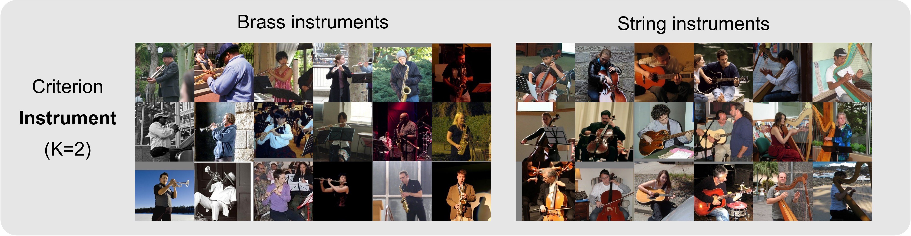<br />
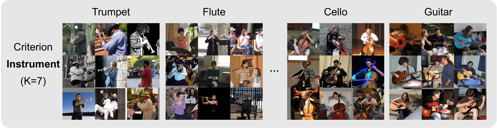<br />
</p>
<figcaption> Sample images from the clustering results on the PPMI dataset using the text criterion <code>Instrument</code> with different cluster numbers <span class="math inline"><em>K</em> = 2</span> and <span class="math inline">7</span>. </figcaption>
</figure>
<p><br />
</p>
<figcaption>Sample images from clustering results of IC<span class="math inline">|</span>TC. The method finds clusters consistent with the user-specified text criterion. Furthermore, IC<span class="math inline">|</span>TC provides cluster names (texts above each image cluster) along with the clusters, enhancing the interpretability of clustering results. </figcaption>
</figure>

## Contribution

Our main contributions are the proposal of the novel task of image clustering conditioned on text criteria and our method IC$`|`$TC for solving this task. The task is interesting because the setup where the user is willing and able to provide a textual description of the clustering criterion is practical, arguably more practical than the classical purely unsupervised clustering setup. The method IC$`|`$TC is interesting because it leverages modern multi-modal foundation models and solves the task well; our experiments demonstrate that IC$`|`$TC can indeed produce satisfactory clustering results consistent with the user-specified criteria.

# Task definition: Image clustering conditioned on iteratively refined text criteria

The main task we consider in this work is defined as follows: Given a set of images, a number of clusters $`K`$, and a user-specified criterion expressed in natural language, partition the set of images into $`K`$ clusters such that the semantic meanings of the clusters are distinguished in a manner that is consistent with the specified user criterion.

Recent image clustering methods find clusters that agree with pre-defined class labels for datasets such as CIFAR-10 ($`\sim`$<!-- -->90% accuracy). The semantic meanings of the clusters tend to correspond to the category of the foreground object, and the inductive biases of the neural networks and the loss function, data augmentations, and feature extractors used within the method are likely the cause of the clusters being chosen in this manner. In a given setup, however, the clusters returned by such classical clustering methods may not be consistent with the relevant criterion that a user has in mind.

#### Iterative refinement of text criteria.

Under our main task, the text criterion is chosen through a process of iterative refinement: The user specifies a text criterion, performs clustering, examines the clustering results, and, if not satisfied, edits the text criterion to iteratively refine the clustering results. Sometimes, a user-defined text criterion immediately leads to a clustering result that is sufficiently consistent with what the user has in mind, but if not, this iterative prompt engineering procedure provides a practical means for converging to desired results. In practice, hyperparameters of classical clustering algorithms are chosen through an iterative process where the user inspects the clustering output and adjusts the parameters accordingly. In this work, we explicitly acknowledge the process of iteratively determining the text criterion and consider it to be part of the main task.

#### Comparison with classical clustering.

Our task differs from classical clustering in that the user provides information characterizing the relevant criterion by which the images should be clustered. In contrast, classical clustering methods are purely unsupervised and use no such information.

Deep clustering methods are often evaluated against a pre-defined set of labels of a dataset, and such labels tend to focus on the type of object in the foreground. However, the question of how clustering algorithms could (or cannot) perform clustering with arbitrary criteria has been raised and studied in several prior works . The use of user-defined text criteria makes our task not an instance of (classical) unsupervised clustering, but providing a text criterion is a necessary and practical intervention from the user if the goal is to perform clustering with arbitrary criteria.

#### Comparison with zero-shot classification.

Our task differs from zero-shot classification in that zero-shot classification requires a pre-defined set of classes, and the goal is merely to assign images to these classes. In contrast, our task requires *both* finding the clusters and assigning images to the clusters. In fact, zero-shot classification can be considered an instance of our task when the user explicitly and precisely describes all $`K`$ clusters in the clustering criterion.

<figure id="fig:pipeline">
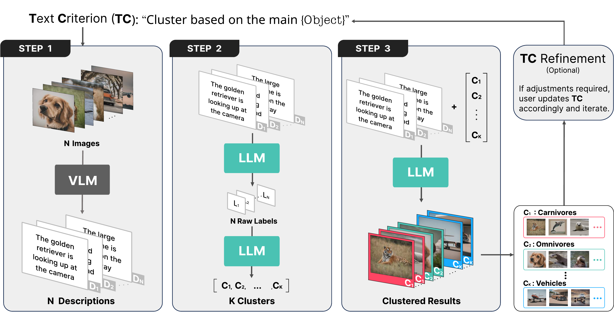
<figcaption>The IC<span class="math inline">|</span>TC method. (Step 1) Vision-language model (VLM) extracts detailed relevant textual descriptions of images. (Step 2) Large language model (LLM) identifies the names of the clusters. (Step 3) LLM conducts clustering by assigning each description to the appropriate cluster. The entire procedure is guided by a user-specified text criterion (<span class="math inline"><strong>T</strong><strong>C</strong></span>). (Optional <span class="math inline"><strong>T</strong><strong>C</strong></span> Refinement). The user can update the text criterion if the clustering results are unsatisfactory. See Appendix <a href="#appendix:example_pipe_output" data-reference-type="ref" data-reference="appendix:example_pipe_output">8.4</a> for an unabridged sample output.</figcaption>
</figure>

# IC$`|`$TC: **I**mage **C**lustering Conditioned on **T**ext **C**riteria

Our main method consists of 3 stages with an optional iterative outer loop. The user-specified text criterion $`\mathbf{TC}`$ is incorporated into 3 stages via text prompts roughly of the following form.
``` math
\begin{aligned}
        &\mathrm{P}_{\text{step1}}(\mathbf{TC}) = \texttt{"Characterize the image using a well-detailed description"} + \mathbf{TC} \\
        &\mathrm{P}_{\text{step2a}}(\mathbf{TC}) = \texttt{"Given a description of an image, label the image"} + \mathbf{TC} \\
    \!\!\!\!\!\!\!\!\!\!&\mathrm{P}_{\text{step2b}}(\mathbf{TC}, N, K) = \texttt{"Given a list of \{N\} labels, cluster them into \{K\} words"} + \mathbf{TC} \\
        &\mathrm{P}_\text{step3}(\mathbf{TC}) = \texttt{"Based on the image description,}\\ 
        % determine the most appropriate cluster"}+ \mathbf{TC}    \\
        &\hspace{2.0cm} 
        \texttt{determine the most appropriate cluster"}+ \mathbf{TC}       
    \end{aligned}
```
The precise prompt for each experimental setup in this work is specified in Appendix <a href="#text_prompt" data-reference-type="ref" data-reference="text_prompt">8.3.1</a>.

## Step 1: Extract salient features from the image

In Step 1, the vision-language model (VLM) extracts salient features from the image in the form of text descriptions.

<figure id="alg:seq1">
<div class="algorithmic">
<p>ALGORITHM BLOCK (caption below)</p>
<p>Image Dataset <span class="math inline">${\mathcal{D}}_{\sf img}$</span>, Text Criteria <span class="math inline"><strong>T</strong><strong>C</strong></span>, Descriptions <span class="math inline">$\mathcal{D}_{\sf des}\leftarrow$</span>[] <span class="math inline">$\mathcal{D}_{\sf des}$</span> <span class="math inline">$\mathcal{D}_{\sf des}$</span>.append( VLM<span class="math inline">(img</span>, <span class="math inline">P<sub>step1</sub>(<strong>T</strong><strong>C</strong>)</span> ) <span> <code>  //append image description to </code><span class="math inline">${\mathcal{D}}_{\sf des}$</span></span></p>
</div>
<figcaption>Vision-language model (VLM) extracts salient features</figcaption>
</figure>

The user’s criterion $`\mathbf{TC}`$ determines the relevant features the VLM should focus on. For example, the user may wish to cluster with respect to the mood of a person in the image or the overall mood (atmosphere) of the scene. In such cases, the $`\mathbf{TC}`$ may slightly vary:

<div class="adjustwidth">

0.5cm0.5cm

```
Criterion 1: Focus on the mood of the person in the center.
Criterion 2: Describe the general mood by inspecting the background.
```

</div>

## Step 2: Obtaining cluster names

In Step 2, the large language model (LLM) discovers the cluster names in two sub-steps. In Step 2a, the LLM outputs raw initial labels of the images. Since the number of distinct initial labels is usually larger than $`K`$, in Step 2b, the LLM aggregates the raw initial labels into appropriate names of $`K`$ clusters. (Combining Steps 2a and 2b and asking the LLM to discover $`K`$ cluster names from $`N`$ image descriptions is infeasible due to the limited token lengths of the LLMs.)

<figure id="alg:seq2">
<div class="algorithmic">
<p>ALGORITHM BLOCK (caption below)</p>
<p>Descriptions <span class="math inline">$\mathcal{D}_{\sf des}$</span>, Text Criteria <span class="math inline"><strong>T</strong><strong>C</strong></span>, Dataset size <span class="math inline"><em>N</em></span>, Number of clusters <span class="math inline"><em>K</em></span>, <span class="math inline">${\mathcal{L}}_{\sf raw}\leftarrow$</span>[] List of cluster names <span class="math inline">${\mathcal{C}}_{\sf name}$</span><br />
<span class="math inline">${\mathcal{L}}_{\sf raw}$</span>.append( LLM<span class="math inline">(description + P<sub>step2a</sub>(<strong>T</strong><strong>C</strong>))</span> ) <span><code>  //append raw label to </code><span class="math inline">${\mathcal{L}}_{\sf raw}$</span></span> <span class="math inline">${\mathcal{C}}_{\sf name}$</span> = LLM<span class="math inline">$({\mathcal{L}}_{\sf raw} + \mathrm{P}_{\text{step2b}}(\mathbf{TC},N,K))$</span> <span><code>  //Step 2b can be further optimized</code></span></p>
</div>
<figcaption>Large Language Model (LLM) obtains <span class="math inline"><em>K</em></span> cluster names</figcaption>
</figure>

The simplest instance of Step 2b, described above, directly provides $`{\mathcal{L}}_{\sf raw}`$, the full list of raw labels. However, we find that it is more efficient to convert $`{\mathcal{L}}_{\sf raw}`$ to a dictionary with labels being the keys and numbers of occurrences of the labels being the values. When the same raw label occurs many times, this optimization significantly reduces the token length of the input to the LLM of Step 2b.

Careful prompt engineering of $`\mathrm{P}_{\text{step2b}}(\mathbf{TC},N,K)`$ allows the user to refine the clusters to be consistent with the user’s criteria. For example, the user may append additional text prompts such as:

<div class="adjustwidth">

0.5cm0.5cm

```
When categorizing the classes, consider the following criteria: 
1. Merge similar clusters. For example, [sparrow, eagle, falcon, owl, hawk] should be combined into 'birds of prey.' 
2. Clusters should be differentiated based on the animal's habitat.
```

</div>

## Step 3: Clustering by assigning images

In Step 3, images are assigned to one of the final $`K`$ clusters. The text criterion $`\mathbf{TC}`$, text description of the images from Step 1, and the $`K`$ cluster names from Step 2 are provided to the LLM.

<figure id="alg:seq3">
<div class="algorithmic">
<p>ALGORITHM BLOCK (caption below)</p>
<p>Descriptions <span class="math inline">${\mathcal{D}}_{\sf des}$</span>, Text Criteria <span class="math inline"><strong>T</strong><strong>C</strong></span>, List of cluster names <span class="math inline">${\mathcal{C}}_{\sf name}$</span>, RESULT<span class="math inline">←</span>[] RESULT RESULT.append( LLM(<span class="math inline">description + P<sub>step3</sub>(<strong>T</strong><strong>C</strong>)</span>) ) <span><code>  //append assigned cluster</code></span></p>
</div>
<figcaption>Large Language Model (LLM) assigns clusters to images</figcaption>
</figure>

## Iteratively editing the algorithm through text prompt engineering

<figure id="alg:seq4">
<div class="algorithmic">
<p>ALGORITHM BLOCK (caption below)</p>
<p>Dataset <span class="math inline">${\mathcal{D}}_{\sf img}$</span>, Text Criteria <span class="math inline"><strong>T</strong><strong>C</strong></span>, ADJUST <span class="math inline">←</span> True RESULT <span class="math inline">←</span> <strong>do Steps 1–3</strong> conditioned on <span class="math inline"><strong>T</strong><strong>C</strong></span> ADJUST <span class="math inline">←</span> False <span class="math inline"><strong>T</strong><strong>C</strong></span> <span class="math inline">←</span> Update <span class="math inline"><strong>T</strong><strong>C</strong></span> <span> <code>  //user writes updated </code><span class="math inline"><strong>T</strong><strong>C</strong></span></span></p>
</div>
<figcaption>IC<span class="math inline">|</span>TC</figcaption>
</figure>

Our main method IC$`|`$TC is described above. Upon performing the clustering once, if the clusters are not sufficiently consistent with the specified text criterion $`\mathbf{TC}`$ or if the $`\mathbf{TC}`$ turns out to not precisely specify what the user had in mind, the user can update the $`\mathbf{TC}`$. This iterative process may continue until the clustering result is satisfactory, as judged by the user.

## Producing cluster labels

Classically, the unsupervised clustering task does not require the method to produce labels or descriptions of the output clusters. Notably, however, IC$`|`$TC produces names describing the clusters. This is a significant advantage of IC$`|`$TC as it makes the clustering results more directly and immediately interpretable.

# Experiments

We now present experimental results demonstrating the effectiveness of IC$`|`$TC. In this section, we partially describe the settings and results while deferring much of the details to the appendix. In particular, the precise text prompts used can be found in Appendix <a href="#text_prompt" data-reference-type="ref" data-reference="text_prompt">8.3.1</a>.

IC$`|`$TC crucially relies on the use of foundation models, specifically a vision-language model (VLM) and a large language model (LLM) that have undergone instruction tuning. In our experiments, we mainly use LLaVA for the VLM and GPT-4 for the LLM, but Section <a href="#analysis" data-reference-type="ref" data-reference="analysis">4.5</a> and Appendix <a href="#choice_fm" data-reference-type="ref" data-reference="choice_fm">8.2</a> presents ablation studies investigating how the performance is affected when other foundation models are used.

## Clustering with varying text criteria

In this experiment, we show that varying the text criterion $`\mathbf{TC}`$ indeed leads to varying clustering results of a single image dataset. The results demonstrate that IC$`|`$TC is highly flexible and can accommodate a variety of text criteria.

We use the Stanford 40 Action Dataset , which contains 9,532 images of humans performing various actions. The dataset comes with image labels describing a subject’s action among 40 classes, such as reading, phoning, blowing bubbles, playing violin, etc. We additionally define two different collections of labels. The first collection contains 10 classes describing the `location`, such as restaurant, store, sports facility, etc. The second collection contains 4 classes describing the `mood` of the scene, specifically joyful, adventurous, relaxed, and focused.

We utilize three text criteria, `Action`, `Location`, and `Mood`, to obtain three distinct clustering results. We evaluate the results based on how accurately the methods recover the three collections of labels described previously. This degree of control would be difficult or impossible for classical deep clustering methods. We compare our results against the prior deep clustering method SCAN and present the results in Table <a href="#tab_various_criteria" data-reference-type="ref" data-reference="tab_various_criteria">[tab_various_criteria]</a>. Image samples are in Figure <a href="#fig:main-1" data-reference-type="ref" data-reference="fig:main-1">1</a>.

(Note that we do not have the 9,532 ground truth labels for the `Location` and `Mood` criteria. Therefore, we evaluate accuracy by having a human provide ground truth labels on 100 randomly sampled images.)

## Clustering with varying granularity

In this experiment, we show that IC$`|`$TC can automatically control the granularity of clustering results by adjusting $`K`$, the number of clusters. We find that the cluster descriptions returned by IC$`|`$TC are highly interpretable and that the images are assigned to the clusters well for various values of $`K`$.

We use the People Playing Musical Instrument (PPMI) dataset  , which contains 1,200 images of humans interacting with 12 different musical instruments. We select 700 images across 7 classes from the original dataset to reduce the size and difficulty of the task.

We use the text criterion `Musical Instrument` with number of clusters $`K=2`$ and $`K=7`$. With $`K=7`$, images are indeed grouped into clusters such as violin, guitar, and other specific instruments, and 96.4% accuracy against the ground truth label of PPMI is achieved. With $`K=2`$, images are divided into 2 clusters of brass instrument and string instrument and achieve a 97.7% accuracy. To clarify, we did not specifically instruct IC$`|`$TC to group the 7 instruments into brass and string instruments; the hierarchical grouping was discovered by IC$`|`$TC.

As an additional experiment, we also cluster the same set of images with the text criterion `Location` and $`K=2`$. In this case, the images are divided into 2 clusters of indoor and outdoor, and achieve a 100.0% accuracy. We again compare our results against SCAN and present the results in Table <a href="#tab_various_criteria" data-reference-type="ref" data-reference="tab_various_criteria">[tab_various_criteria]</a>. Image samples are provided in Figure <a href="#ppmi_2_location" data-reference-type="ref" data-reference="ppmi_2_location">[ppmi_2_location]</a>.

## Comparison with classical clustering methods

In this experiment, we compare IC$`|`$TC against several classical clustering algorithms on CIFAR-10, STL-10, and CIFAR-100. The three datasets have 10, 10, and 20 classes and 10,000, 8,000, and 10,000 images, respectively. We use the text criterion `Object` with the number of clusters equal to the number of classes in the dataset. The results in Table <a href="#tab_existing" data-reference-type="ref" data-reference="tab_existing">[tab_existing]</a> show that IC$`|`$TC significantly outperforms classical clustering methods on CIFAR-10, STL-10 and CIFAR-100. Clustered sample images are provided in Appendix <a href="#tab_dataset" data-reference-type="ref" data-reference="tab_dataset">8.6</a>.

This comparison is arguably unfair against the classical clustering methods as they do not utilize foundation models or any pre-trained weights. Nevertheless, our results demonstrate that IC$`|`$TC is competitive when the goal is to cluster images based on the foreground object type.

## Fair clustering through text criterion refinement

Existing clustering methods sometimes exhibit biased results, and measures to mitigate such biases have been studied . Since foundation models are known to learn biases in their training data , IC$`|`$TC has the risk of propagating such biases into the clustering results. In this experiment, we show that by simply adding a prompt along the line of `"Do not consider gender"` to the text criterion, we can effectively mitigate biases in the clustering results.

FACET is a benchmark dataset for evaluating the robustness and algorithmic fairness of AI and machine-learning vision models. It comprises 32,000 diverse images labeled with several attributes, including 52 occupation classes. For this experiment, we sampled 20 images each for men and women from the craftsman, laborer, dancer, and gardener occupation classes, 160 images in total.

For this experiment, we define fairness to be achieved when each cluster maintains an equal proportion of genders. When we use the text criterion `Occupation`, IC$`|`$TC exhibited a gender bias. To mitigate this bias, we introduced a simple negative prompt, instructing IC$`|`$TC to not take gender into consideration and instead to focus on the activity. When the clustering was repeated, the results were promising: the gender ratio disparities in the craftsman and laborer clusters improved by $`27.2\%\rightarrow4.4\%`$ and $`11.6\%\rightarrow 3.2\%`$, respectively. Furthermore, the Dancer and Gardner clusters also experienced marginal reductions in disparities by $`2.8\%\rightarrow2.6\%`$ and $`10.6\%\rightarrow9.0\%`$, respectively. The results are shown in Figure <a href="#fig_fairness" data-reference-type="ref" data-reference="fig_fairness">[fig_fairness]</a>.

## Further analyses

#### Ablation studies of LLMs and VLMs.

We conduct an ablation study to evaluate whether LLMs actually serve a significant role in our methodology since one may wonder whether the vision-language model (VLMs) alone is sufficient. When we perform a ‘LLaVA only’ experiment that does not utilize an LLM, the performance is considerably lower. However, when we use LLMs of varying sizes, the performance is not affected significantly. The results and details are provided in Figure <a href="#fig_llmablation" data-reference-type="ref" data-reference="fig_llmablation">[fig_llmablation]</a> and Appendix <a href="#appendix:ablation study of llm" data-reference-type="ref" data-reference="appendix:ablation study of llm">7.2</a>. The results lead us to conclude that the LLM serves a crucial role (the VLM by itself is not sufficient), but the size of the LLM does not seem to be very important.

We also fix the LLM to GPT-4 and perform an ablation study on the choice of vision-language model (VLM). As an image captioning model, ClipCap  cannot perform text conditioning, and this leads to poor performance. Blip-2  and LLaVA  can extract information relevant to the text criteria, and they exhibit strong strong performance. The results and details are provided in Appendix <a href="#ablation_vlm" data-reference-type="ref" data-reference="ablation_vlm">7.1</a>.

#### Data Contamination.

When evaluating research using foundation models, the potential of data contamination is a significant concern . The datasets we use to measure accuracy, namely CIFAR10, STL-10, CIFAR-100, and Stanford 40 Action, may have been used in the training of LLaVA. If so, the validity of the accuracy measurements comes into question.

To address this concern, we conducted an experiment with synthetically generated images. Specifically, we use Stable Diffusion XL  and the CIFAR-10 labels to generate 1000 CIFAR-10-like images, and we call this dataset CIFAR-10-Gen. See Appendix <a href="#detail" data-reference-type="ref" data-reference="detail">8</a> for further details. On this synthetic data, IC$`|`$TC achieves 98.7% accuracy. The fact that the accuracy on CIFAR-10-Gen is no worse than the accuracy on the actual CIFAR-10 dataset gives us confidence that the strong performance of IC$`|`$TC is likely not due to data contamination.

(Strictly speaking, the training data for Stable Diffusion may contain the CIFAR-10 images, and if so, we are not completely free from the risk of data contamination. However, the CIFAR-10-Gen dataset does not seem to contain exact copies of CIFAR-10 images, and we argue that the synthetic generation significantly mitigates the risk of data contamination.)

# Related work

#### Image clustering.

Modern deep clustering methods adopt a multi-stage training approach. They begin with representation learning, which finds a representation that maps similar images to similar features, and then perform unsupervised clustering based on these feature representations. proposed specially designed representation learning for certain clustering criteria. However, these methods utilize the structures of the specific criteria, so they are not able to accommodate arbitrary criteria.

#### Foundation models.

In recent years, foundation models have been improving at a remarkable pace, and combined with instruction tuning , these foundation models can be applied more flexibly to downstream tasks. Vision-Language Models (VLMs)   can provide users with appropriate descriptions of given images according to the requirements of the input prompt. Large language models (LLMs) exhibit remarkable abilities in a wide range of natural language processing tasks such as text summarization. Recently, have shown computer vision problems with no direct connection to language can be successfully addressed using large language models.

# Conclusion

In this work, we presented Image Clustering Conditioned on Text Criteria (IC$`|`$TC), which represents a new paradigm of image clustering. By allowing the user to specify the desired clustering criterion in natural-language text, IC$`|`$TC grants the user significant control over the clustering results. Our experiments show that IC$`|`$TC can obtain clustering results that are not possible with prior classical clustering methods.

Since IC$`|`$TC is the first method of its kind, we expect there to be much room for improvement in follow-up work. More broadly speaking, we believe the idea of users directing computer vision tasks with natural language instructions is a promising direction of future research; it is a direction that is enabled by the recent significant advances in multi-modal vision-language foundation models.

# Acknowledgments

We thank Dimitris Papailiopoulos and Yong Jae Lee for providing insightful discussion. We thank Byeong-Uk Lee for providing valuable feedback on the manuscript.

# Ethics Statement

Our methodology provides users with direct control over the clustering results, but this agency could be used maliciously to produce unfair and discriminatory results. However, it is unlikely that our work will be responsible for new unfair results that could not already be produced with a malicious user’s direct and overt intervention. On the other hand, it is possible for biases already in foundation models to propagate into our clustering methodology. Section <a href="#ss:fair_clustering" data-reference-type="ref" data-reference="ss:fair_clustering">4.4</a> explicitly discusses this possibility and offers measures to mitigate such biases, and a well-intentioned user following the guidance of Section <a href="#ss:fair_clustering" data-reference-type="ref" data-reference="ss:fair_clustering">4.4</a> is unlikely to amplify biases in the foundation models through the use of our method.

# Reproducibility Statement

In this work, we use publically available datasets, describe the methodology in precise detail, and make our code available at <https://github.com/sehyunkwon/ICTC>. Of the two main foundation models we use, the vision-language model LLaVA is fully open-source. However, the large language model GPT-4 is a proprietary model, and we accessed it through the API offered by OpenAI. The API cost to conduct the experiments presented in this work was less than $3,000 (USD), so we argue that the proprietary API cost does not pose a significant barrier in terms of reproducibility. However, if OpenAI were to discontinue access to the GPT-4 version that we used, namely `api-version=2023-03-15-preview`, or if OpenAI discontinues access to GPT-4 altogether, then our experiments will no longer be exactly reproducible.

To address this concern, we carry out an ablation study that uses the open-source large language model Llama 2 and observe that a similar, albeit slight worse, performance is attained. See Figure <a href="#fig_llmablation" data-reference-type="ref" data-reference="fig_llmablation">[fig_llmablation]</a> and Appendix <a href="#appendix:ablation study of llm" data-reference-type="ref" data-reference="appendix:ablation study of llm">7.2</a>. Therefore, even if GPT-4 becomes unavailable in the future, the results of this work will be similarly reproducible by using Llama 2 or any other large language model of power comparable to or stronger than Llama 2 and GPT-4.

# References

<div class="thebibliography">

G. Adams, A. Fabbri, F. Ladhak, E. Lehman, and N. Elhadad From sparse to dense: GPT-4 summarization with chain of density prompting *arXiv:2309.04269*, 2023. **Abstract:** Selecting the “right” amount of information to include in a summary is a difficult task. A good summary should be detailed and entity-centric without being overly dense and hard to follow. To better understand this tradeoff, we solicit increasingly dense GPT-4 summaries with what we refer to as a “Chain of Density” (CoD) prompt. Specifically, GPT-4 generates an initial entity-sparse summary before iteratively incorporating missing salient entities without increasing the length. Summaries generated by CoD are more abstractive, exhibit more fusion, and have less of a lead bias than GPT-4 summaries generated by a vanilla prompt. We conduct a human preference study on 100 CNN DailyMail articles and find that that humans prefer GPT-4 summaries that are more dense than those generated by a vanilla prompt and almost as dense as human written summaries. Qualitative analysis supports the notion that there exists a tradeoff between informativeness and readability. 500 annotated CoD summaries, as well as an extra 5,000 unannotated summaries, are freely available on HuggingFace (https://huggingface.co/datasets/griffin/chain_of_density). (@adams2023sparse)

J.-B. Alayrac, J. Donahue, P. Luc, A. Miech, I. Barr, Y. Hasson, K. Lenc, A. Mensch, K. Millican, M. Reynolds, R. Ring, E. Rutherford, S. Cabi, T. Han, Z. Gong, S. Samangooei, M. Monteiro, J. Menick, S. Borgeaud, A. Brock, A. Nematzadeh, S. Sharifzadeh, M. Binkowski, R. Barreira, O. Vinyals, A. Zisserman, and K. Simonyan Flamingo: a visual language model for few-shot learning *Neural Information Processing Systems*, 2022. **Abstract:** Building models that can be rapidly adapted to novel tasks using only a handful of annotated examples is an open challenge for multimodal machine learning research. We introduce Flamingo, a family of Visual Language Models (VLM) with this ability. We propose key architectural innovations to: (i) bridge powerful pretrained vision-only and language-only models, (ii) handle sequences of arbitrarily interleaved visual and textual data, and (iii) seamlessly ingest images or videos as inputs. Thanks to their flexibility, Flamingo models can be trained on large-scale multimodal web corpora containing arbitrarily interleaved text and images, which is key to endow them with in-context few-shot learning capabilities. We perform a thorough evaluation of our models, exploring and measuring their ability to rapidly adapt to a variety of image and video tasks. These include open-ended tasks such as visual question-answering, where the model is prompted with a question which it has to answer; captioning tasks, which evaluate the ability to describe a scene or an event; and close-ended tasks such as multiple-choice visual question-answering. For tasks lying anywhere on this spectrum, a single Flamingo model can achieve a new state of the art with few-shot learning, simply by prompting the model with task-specific examples. On numerous benchmarks, Flamingo outperforms models fine-tuned on thousands of times more task-specific data. (@alayrac2022flamingo)

A. Awadalla, I. Gao, J. Gardner, J. Hessel, Y. Hanafy, W. Zhu, K. Marathe, Y. Bitton, S. Gadre, S. Sagawa, J. Jitsev, S. Kornblith, P. W. Koh, G. Ilharco, M. Wortsman, and L. Schmidt : An open-source framework for training large autoregressive vision-language models *arXiv:2308.01390*, 2023. **Abstract:** We introduce OpenFlamingo, a family of autoregressive vision-language models ranging from 3B to 9B parameters. OpenFlamingo is an ongoing effort to produce an open-source replication of DeepMind’s Flamingo models. On seven vision-language datasets, OpenFlamingo models average between 80 - 89% of corresponding Flamingo performance. This technical report describes our models, training data, hyperparameters, and evaluation suite. We share our models and code at https://github.com/mlfoundations/open_flamingo. (@awadalla2023openflamingo)

R. Bommasani, D. A. Hudson, E. Adeli, R. Altman, S. Arora, S. von Arx, M. S. Bernstein, J. Bohg, A. Bosselut, E. Brunskill, E. Brynjolfsson, S. Buch, D. Card, R. Castellon, N. Chatterji, A. Chen, K. Creel, J. Q. Davis, D. Demszky, C. Donahue, M. Doumbouya, E. Durmus, S. Ermon, J. Etchemendy, K. Ethayarajh, L. Fei-Fei, C. Finn, T. Gale, L. Gillespie, K. Goel, N. Goodman, S. Grossman, N. Guha, T. Hashimoto, P. Henderson, J. Hewitt, D. E. Ho, J. Hong, K. Hsu, J. Huang, T. Icard, S. Jain, D. Jurafsky, P. Kalluri, S. Karamcheti, G. Keeling, F. Khani, O. Khattab, P. W. Koh, M. Krass, R. Krishna, R. Kuditipudi, A. Kumar, F. Ladhak, M. Lee, T. Lee, J. Leskovec, I. Levent, X. L. Li, X. Li, T. Ma, A. Malik, C. D. Manning, S. Mirchandani, E. Mitchell, Z. Munyikwa, S. Nair, A. Narayan, D. Narayanan, B. Newman, A. Nie, J. C. Niebles, H. Nilforoshan, J. Nyarko, G. Ogut, L. Orr, I. Papadimitriou, J. S. Park, C. Piech, E. Portelance, C. Potts, A. Raghunathan, R. Reich, H. Ren, F. Rong, Y. Roohani, C. Ruiz, J. Ryan, C. Ré, D. Sadigh, S. Sagawa, K. Santhanam, A. Shih, K. Srinivasan, A. Tamkin, R. Taori, A. W. Thomas, F. Tramèr, R. E. Wang, W. Wang, B. Wu, J. Wu, Y. Wu, S. M. Xie, M. Yasunaga, J. You, M. Zaharia, M. Zhang, T. Zhang, X. Zhang, Y. Zhang, L. Zheng, K. Zhou, and P. Liang On the opportunities and risks of foundation models *arXiv:2108.07258*, 2022. **Abstract:** AI is undergoing a paradigm shift with the rise of models (e.g., BERT, DALL-E, GPT-3) that are trained on broad data at scale and are adaptable to a wide range of downstream tasks. We call these models foundation models to underscore their critically central yet incomplete character. This report provides a thorough account of the opportunities and risks of foundation models, ranging from their capabilities (e.g., language, vision, robotics, reasoning, human interaction) and technical principles(e.g., model architectures, training procedures, data, systems, security, evaluation, theory) to their applications (e.g., law, healthcare, education) and societal impact (e.g., inequity, misuse, economic and environmental impact, legal and ethical considerations). Though foundation models are based on standard deep learning and transfer learning, their scale results in new emergent capabilities,and their effectiveness across so many tasks incentivizes homogenization. Homogenization provides powerful leverage but demands caution, as the defects of the foundation model are inherited by all the adapted models downstream. Despite the impending widespread deployment of foundation models, we currently lack a clear understanding of how they work, when they fail, and what they are even capable of due to their emergent properties. To tackle these questions, we believe much of the critical research on foundation models will require deep interdisciplinary collaboration commensurate with their fundamentally sociotechnical nature. (@bommasani2022opportunities)

T. B. Brown, B. Mann, N. Ryder, M. Subbiah, J. Kaplan, P. Dhariwal, A. Neelakantan, P. Shyam, G. Sastry, A. Askell, et al Language models are few-shot learners *Neural Information Processing Systems*, 2020. **Abstract:** Recent work has demonstrated substantial gains on many NLP tasks and benchmarks by pre-training on a large corpus of text followed by fine-tuning on a specific task. While typically task-agnostic in architecture, this method still requires task-specific fine-tuning datasets of thousands or tens of thousands of examples. By contrast, humans can generally perform a new language task from only a few examples or from simple instructions - something which current NLP systems still largely struggle to do. Here we show that scaling up language models greatly improves task-agnostic, few-shot performance, sometimes even reaching competitiveness with prior state-of-the-art fine-tuning approaches. Specifically, we train GPT-3, an autoregressive language model with 175 billion parameters, 10x more than any previous non-sparse language model, and test its performance in the few-shot setting. For all tasks, GPT-3 is applied without any gradient updates or fine-tuning, with tasks and few-shot demonstrations specified purely via text interaction with the model. GPT-3 achieves strong performance on many NLP datasets, including translation, question-answering, and cloze tasks, as well as several tasks that require on-the-fly reasoning or domain adaptation, such as unscrambling words, using a novel word in a sentence, or performing 3-digit arithmetic. At the same time, we also identify some datasets where GPT-3’s few-shot learning still struggles, as well as some datasets where GPT-3 faces methodological issues related to training on large web corpora. Finally, we find that GPT-3 can generate samples of news articles which human evaluators have difficulty distinguishing from articles written by humans. We discuss broader societal impacts of this finding and of GPT-3 in general. (@brown2020language)

S. Cai, L. Qiu, X. Chen, Q. Zhang, and L. Chen Semantic-enhanced image clustering *American Association for Artificial Intelligence*, 2023. **Abstract:** Image clustering is an important and open challenging task in computer vision. Although many methods have been proposed to solve the image clustering task, they only explore images and uncover clusters according to the image features, thus being unable to distinguish visually similar but semantically different images. In this paper, we propose to investigate the task of image clustering with the help of visual-language pre-training model. Different from the zero-shot setting, in which the class names are known, we only know the number of clusters in this setting. Therefore, how to map images to a proper semantic space and how to cluster images from both image and semantic spaces are two key problems. To solve the above problems, we propose a novel image clustering method guided by the visual-language pre-training model CLIP, named Semantic-Enhanced Image Clustering (SIC). In this new method, we propose a method to map the given images to a proper semantic space first and efficient methods to generate pseudo-labels according to the relationships between images and semantics. Finally, we propose to perform clustering with consistency learning in both image space and semantic space, in a self-supervised learning fashion. The theoretical result of convergence analysis shows that our proposed method can converge at a sublinear speed. Theoretical analysis of expectation risk also shows that we can reduce the expectation risk by improving neighborhood consistency, increasing prediction confidence, or reducing neighborhood imbalance. Experimental results on five benchmark datasets clearly show the superiority of our new method. (@Cai_Qiu_Chen_Zhang_Chen_2023)

R. Caruana Clustering: Probably approximately useless? *ACM International Conference on Information & Knowledge Management*, 2013. (@Caruana2013)

R. Caruana, M. Elhawary, N. Nguyen, and C. Smith Meta clustering *International Conference on Data Mining*, 2006. **Abstract:** Clustering is ill-defined. Unlike supervised learning where labels lead to crisp performance criteria such as accuracy and squared error, clustering quality depends on how the clusters will be used. Devising clustering criteria that capture what users need is difficult. Most clustering algorithms search for optimal clusterings based on a pre-specified clustering criterion. Our approach differs. We search for many alternate clusterings of the data, and then allow users to select the clustering(s) that best fit their needs. Meta clustering first finds a variety of clusterings and then clusters this diverse set of clusterings so that users must only examine a small number of qualitatively different clusterings. We present methods for automatically generating a diverse set of alternate clusterings, as well as methods for grouping clusterings into meta clusters. We evaluate meta clustering on four test problems and two case studies. Surprisingly, clusterings that would be of most interest to users often are not very compact clusterings. (@metaclustering)

W.-L. Chiang, Z. Li, Z. Lin, Y. Sheng, Z. Wu, H. Zhang, L. Zheng, S. Zhuang, Y. Zhuang, J. E. Gonzalez, I. Stoica, and E. P. Xing Vicuna: An open-source chatbot impressing GPT-4 with 90%\* ChatGPT quality 2023. URL <https://lmsys.org/blog/2023-03-30-vicuna/>. **Abstract:** \<p\>We introduce Vicuna-13B, an open-source chatbot trained by fine-tuning LLaMA on user-shared conversations collected from ShareGPT. Preliminary evaluation ... (@vicuna2023)

J. H. Cho, U. Mall, K. Bala, and B. Hariharan : Unsupervised semantic segmentation using invariance and equivariance in clustering *Computer Vision and Pattern Recognition*, 2021. **Abstract:** We present a new framework for semantic segmentation without annotations via clustering. Off-the-shelf clustering methods are limited to curated, single-label, and objectcentric images yet real-world data are dominantly uncurated, multi-label, and scene-centric. We extend clustering from images to pixels and assign separate cluster membership to different instances within each image. However, solely relying on pixel-wise feature similarity fails to learn high-level semantic concepts and overfits to lowlevel visual cues. We propose a method to incorporate geometric consistency as an inductive bias to learn invariance and equivariance for photometric and geometric variations. With our novel learning objective, our framework can learn high-level semantic concepts. Our method, PiCIE (Pixel-level feature Clustering using Invariance and Equivariance), is the first method capable of segmenting both things and stuff categories without any hyperparameter tuning or task-specific pre-processing. Our method largely outperforms existing baselines on COCO \[31\] and Cityscapes \[8\] with +17.5 Acc. and +4.5 mIoU. We show that PiCIE gives a better initialization for standard supervised training. The code is available at https://github.com/janghyuncho/PiCIE. (@Cho_2021_CVPR)

A. Chowdhery, S. Narang, J. Devlin, M. Bosma, G. Mishra, A. Roberts, P. Barham, H. W. Chung, C. Sutton, S. Gehrmann, P. Schuh, K. Shi, S. Tsvyashchenko, J. Maynez, A. Rao, P. Barnes, Y. Tay, N. M. Shazeer, V. Prabhakaran, E. Reif, N. Du, B. C. Hutchinson, R. Pope, J. Bradbury, J. Austin, M. Isard, G. Gur-Ari, P. Yin, T. Duke, A. Levskaya, S. Ghemawat, S. Dev, H. Michalewski, X. García, V. Misra, K. Robinson, L. Fedus, D. Zhou, D. Ippolito, D. Luan, H. Lim, B. Zoph, A. Spiridonov, R. Sepassi, D. Dohan, S. Agrawal, M. Omernick, A. M. Dai, T. S. Pillai, M. Pellat, A. Lewkowycz, E. Moreira, R. Child, O. Polozov, K. Lee, Z. Zhou, X. Wang, B. Saeta, M. Díaz, O. Firat, M. Catasta, J. Wei, K. S. Meier-Hellstern, D. Eck, J. Dean, S. Petrov, and N. Fiedel : Scaling language modeling with pathways *arXiv:2204.02311*, 2022. **Abstract:** Large language models have been shown to achieve remarkable performance across a variety of natural language tasks using few-shot learning, which drastically reduces the number of task-specific training examples needed to adapt the model to a particular application. To further our understanding of the impact of scale on few-shot learning, we trained a 540-billion parameter, densely activated, Transformer language model, which we call Pathways Language Model PaLM. We trained PaLM on 6144 TPU v4 chips using Pathways, a new ML system which enables highly efficient training across multiple TPU Pods. We demonstrate continued benefits of scaling by achieving state-of-the-art few-shot learning results on hundreds of language understanding and generation benchmarks. On a number of these tasks, PaLM 540B achieves breakthrough performance, outperforming the finetuned state-of-the-art on a suite of multi-step reasoning tasks, and outperforming average human performance on the recently released BIG-bench benchmark. A significant number of BIG-bench tasks showed discontinuous improvements from model scale, meaning that performance steeply increased as we scaled to our largest model. PaLM also has strong capabilities in multilingual tasks and source code generation, which we demonstrate on a wide array of benchmarks. We additionally provide a comprehensive analysis on bias and toxicity, and study the extent of training data memorization with respect to model scale. Finally, we discuss the ethical considerations related to large language models and discuss potential mitigation strategies. (@Chowdhery2022PaLMSL)

Y. Cui, X. Z. Fern, and J. G. Dy Non-redundant multi-view clustering via orthogonalization *International Conference on Data Mining*, 2007. **Abstract:** Typical clustering algorithms output a single clustering of the data. However, in real world applications, data can often be interpreted in many different ways; data can have different groupings that are reasonable and interesting from different perspectives. This is especially true for high-dimensional data, where different feature subspaces may reveal different structures of the data. Why commit to one clustering solution while all these alternative clustering views might be interesting to the user. In this paper, we propose a new clustering paradigm for explorative data analysis: find all non-redundant clustering views of the data, where data points of one cluster can belong to different clusters in other views. We present a framework to solve this problem and suggest two approaches within this framework: (1) orthogonal clustering, and (2) clustering in orthogonal subspaces. In essence, both approaches find alternative ways to partition the data by projecting it to a space that is orthogonal to our current solution. The first approach seeks orthogonality in the cluster space, while the second approach seeks orthogonality in the feature space. We test our framework on both synthetic and high-dimensional benchmark data sets, and the results show that indeed our approaches were able to discover varied solutions that are interesting and meaningful. keywords: multi-view clustering, non-redundant clustering, orthogonalization (@Cui2007)

W. Dai, J. Li, D. Li, A. M. H. Tiong, J. Zhao, W. Wang, B. Li, P. Fung, and S. Hoi InstructBLIP: Towards general-purpose vision-language models with instruction tuning *arXiv:2305.06500*, 2023. **Abstract:** Large-scale pre-training and instruction tuning have been successful at creating general-purpose language models with broad competence. However, building general-purpose vision-language models is challenging due to the rich input distributions and task diversity resulting from the additional visual input. Although vision-language pretraining has been widely studied, vision-language instruction tuning remains under-explored. In this paper, we conduct a systematic and comprehensive study on vision-language instruction tuning based on the pretrained BLIP-2 models. We gather 26 publicly available datasets, covering a wide variety of tasks and capabilities, and transform them into instruction tuning format. Additionally, we introduce an instruction-aware Query Transformer, which extracts informative features tailored to the given instruction. Trained on 13 held-in datasets, InstructBLIP attains state-of-the-art zero-shot performance across all 13 held-out datasets, substantially outperforming BLIP-2 and larger Flamingo models. Our models also lead to state-of-the-art performance when finetuned on individual downstream tasks (e.g., 90.7% accuracy on ScienceQA questions with image contexts). Furthermore, we qualitatively demonstrate the advantages of InstructBLIP over concurrent multimodal models. All InstructBLIP models are open-sourced at https://github.com/salesforce/LAVIS/tree/main/projects/instructblip. (@dai2023instructblip)

T. Dinh, Y. Zeng, R. Zhang, Z. Lin, M. Gira, S. Rajput, J. yong Sohn, D. Papailiopoulos, and K. Lee : Language-interfaced fine-tuning for non-language machine learning tasks *Neural Information Processing Systems*, 2022. **Abstract:** Fine-tuning pretrained language models (LMs) without making any architectural changes has become a norm for learning various language downstream tasks. However, for non-language downstream tasks, a common practice is to employ task-specific designs for input, output layers, and loss functions. For instance, it is possible to fine-tune an LM into an MNIST classifier by replacing the word embedding layer with an image patch embedding layer, the word token output layer with a 10-way output layer, and the word prediction loss with a 10-way classification loss, respectively. A natural question arises: Can LM fine-tuning solve non-language downstream tasks without changing the model architecture or loss function? To answer this, we propose Language-Interfaced Fine-Tuning (LIFT) and study its efficacy and limitations by conducting an extensive empirical study on a suite of non-language classification and regression tasks. LIFT does not make any changes to the model architecture or loss function, and it solely relies on the natural language interface, enabling "no-code machine learning with LMs." We find that LIFT performs comparably well across a wide range of low-dimensional classification and regression tasks, matching the performances of the best baselines in many cases, especially for the classification tasks. We also report experimental results on the fundamental properties of LIFT, including inductive bias, robustness, and sample complexity. We also analyze the effect of pretraining on LIFT and a few properties/techniques specific to LIFT, e.g., context-aware learning via appropriate prompting, calibrated predictions, data generation, and two-stage fine-tuning. Our code is available at https://github.com/UW-Madison-Lee-Lab/LanguageInterfacedFineTuning. (@dinh2022lift)

N. Du, Y. Huang, A. M. Dai, S. Tong, D. Lepikhin, Y. Xu, M. Krikun, Y. Zhou, A. W. Yu, O. Firat, B. Zoph, L. Fedus, M. P. Bosma, Z. Zhou, T. Wang, E. Wang, K. Webster, M. Pellat, K. Robinson, K. Meier-Hellstern, T. Duke, L. Dixon, K. Zhang, Q. Le, Y. Wu, Z. Chen, and C. Cui aM: Efficient scaling of language models with mixture-of-experts *International Conference on Machine Learning*, 2022. **Abstract:** Scaling language models with more data, compute and parameters has driven significant progress in natural language processing. For example, thanks to scaling, GPT-3 was able to achieve strong results on in-context learning tasks. However, training these large dense models requires significant amounts of computing resources. In this paper, we propose and develop a family of language models named GLaM (Generalist Language Model), which uses a sparsely activated mixture-of-experts architecture to scale the model capacity while also incurring substantially less training cost compared to dense variants. The largest GLaM has 1.2 trillion parameters, which is approximately 7x larger than GPT-3. It consumes only 1/3 of the energy used to train GPT-3 and requires half of the computation flops for inference, while still achieving better overall zero-shot and one-shot performance across 29 NLP tasks. (@GLaM2022)

S. Geng, J. Yuan, Y. Tian, Y. Chen, and Y. Zhang HiCLIP: Contrastive language-image pretraining with hierarchy-aware attention *International Conference on Learning Representations*, 2023. **Abstract:** The success of large-scale contrastive vision-language pretraining (CLIP) has benefited both visual recognition and multimodal content understanding. The concise design brings CLIP the advantage in inference efficiency against other vision-language models with heavier cross-attention fusion layers, making it a popular choice for a wide spectrum of downstream tasks. However, CLIP does not explicitly capture the hierarchical nature of high-level and fine-grained semantics conveyed in images and texts, which is arguably critical to vision-language understanding and reasoning. To this end, we equip both the visual and language branches in CLIP with hierarchy-aware attentions, namely Hierarchy-aware CLIP (HiCLIP), to progressively discover semantic hierarchies layer-by-layer from both images and texts in an unsupervised manner. As a result, such hierarchical aggregation significantly improves the cross-modal alignment. To demonstrate the advantages of HiCLIP, we conduct qualitative analysis on its unsupervised hierarchy induction during inference, as well as extensive quantitative experiments on both visual recognition and vision-language downstream tasks. (@geng2023hiclip)

T. Gong, C. Lyu, S. Zhang, Y. Wang, M. Zheng, Q. Zhao, K. Liu, W. Zhang, P. Luo, and K. Chen : A vision and language model for dialogue with humans *arXiv:2305.04790*, 2023. **Abstract:** We present a vision and language model named MultiModal-GPT to conduct multi-round dialogue with humans. MultiModal-GPT can follow various instructions from humans, such as generating a detailed caption, counting the number of interested objects, and answering general questions from users. MultiModal-GPT is parameter-efficiently fine-tuned from OpenFlamingo, with Low-rank Adapter (LoRA) added both in the cross-attention part and the self-attention part of the language model. We first construct instruction templates with vision and language data for multi-modality instruction tuning to make the model understand and follow human instructions. We find the quality of training data is vital for the dialogue performance, where few data containing short answers can lead the model to respond shortly to any instructions. To further enhance the ability to chat with humans of the MultiModal-GPT, we utilize language-only instruction-following data to train the MultiModal-GPT jointly. The joint training of language-only and visual-language instructions with the \\}emph{same} instruction template effectively improves dialogue performance. Various demos show the ability of continuous dialogue of MultiModal-GPT with humans. Code, dataset, and demo are at https://github.com/open-mmlab/Multimodal-GPT (@gong2023multimodalgpt)

L. Gustafson, C. Rolland, N. Ravi, Q. Duval, A. Adcock, C.-Y. Fu, M. Hall, and C. Ross : Fairness in computer vision evaluation benchmark *arXiv:2309.00035*, 2023. **Abstract:** Computer vision models have known performance disparities across attributes such as gender and skin tone. This means during tasks such as classification and detection, model performance differs for certain classes based on the demographics of the people in the image. These disparities have been shown to exist, but until now there has not been a unified approach to measure these differences for common use-cases of computer vision models. We present a new benchmark named FACET (FAirness in Computer Vision EvaluaTion), a large, publicly available evaluation set of 32k images for some of the most common vision tasks - image classification, object detection and segmentation. For every image in FACET, we hired expert reviewers to manually annotate person-related attributes such as perceived skin tone and hair type, manually draw bounding boxes and label fine-grained person-related classes such as disk jockey or guitarist. In addition, we use FACET to benchmark state-of-the-art vision models and present a deeper understanding of potential performance disparities and challenges across sensitive demographic attributes. With the exhaustive annotations collected, we probe models using single demographics attributes as well as multiple attributes using an intersectional approach (e.g. hair color and perceived skin tone). Our results show that classification, detection, segmentation, and visual grounding models exhibit performance disparities across demographic attributes and intersections of attributes. These harms suggest that not all people represented in datasets receive fair and equitable treatment in these vision tasks. We hope current and future results using our benchmark will contribute to fairer, more robust vision models. FACET is available publicly at https://facet.metademolab.com/ (@gustafson2023facet)

H. Jégou and O. Chum Negative evidences and co-occurences in image retrieval: The benefit of PCA and whitening *European Conference on Computer Vision*, 2012. (@jegou2012)

X. Ji, J. F. Henriques, and A. Vedaldi Invariant information clustering for unsupervised image classification and segmentation *International Conference on Computer Vision*, 2019. **Abstract:** We present a novel clustering objective that learns a neural network classifier from scratch, given only unlabelled data samples. The model discovers clusters that accurately match semantic classes, achieving state-of-the-art results in eight unsupervised clustering benchmarks spanning image classification and segmentation. These include STL10, an unsupervised variant of ImageNet, and CIFAR10, where we significantly beat the accuracy of our closest competitors by 6.6 and 9.5 absolute percentage points respectively. The method is not specialised to computer vision and operates on any paired dataset samples; in our experiments we use random transforms to obtain a pair from each image. The trained network directly outputs semantic labels, rather than high dimensional representations that need external processing to be usable for semantic clustering. The objective is simply to maximise mutual information between the class assignments of each pair. It is easy to implement and rigorously grounded in information theory, meaning we effortlessly avoid degenerate solutions that other clustering methods are susceptible to. In addition to the fully unsupervised mode, we also test two semi-supervised settings. The first achieves 88.8% accuracy on STL10 classification, setting a new global state-of-the-art over all existing methods (whether supervised, semi-supervised or unsupervised). The second shows robustness to 90% reductions in label coverage, of relevance to applications that wish to make use of small amounts of labels. github.com/xu-ji/IIC. (@ji_2019_IIC)

C. Jia, Y. Yang, Y. Xia, Y.-T. Chen, Z. Parekh, H. Pham, Q. Le, Y.-H. Sung, Z. Li, and T. Duerig Scaling up visual and vision-language representation learning with noisy text supervision *International Conference on Machine Learning*, 2021. **Abstract:** Pre-trained representations are becoming crucial for many NLP and perception tasks. While representation learning in NLP has transitioned to training on raw text without human annotations, visual and vision-language representations still rely heavily on curated training datasets that are expensive or require expert knowledge. For vision applications, representations are mostly learned using datasets with explicit class labels such as ImageNet or OpenImages. For vision-language, popular datasets like Conceptual Captions, MSCOCO, or CLIP all involve a non-trivial data collection (and cleaning) process. This costly curation process limits the size of datasets and hence hinders the scaling of trained models. In this paper, we leverage a noisy dataset of over one billion image alt-text pairs, obtained without expensive filtering or post-processing steps in the Conceptual Captions dataset. A simple dual-encoder architecture learns to align visual and language representations of the image and text pairs using a contrastive loss. We show that the scale of our corpus can make up for its noise and leads to state-of-the-art representations even with such a simple learning scheme. Our visual representation achieves strong performance when transferred to classification tasks such as ImageNet and VTAB. The aligned visual and language representations enables zero-shot image classification and also set new state-of-the-art results on Flickr30K and MSCOCO image-text retrieval benchmarks, even when compared with more sophisticated cross-attention models. The representations also enable cross-modality search with complex text and text + image queries. (@align)

J. Kleinberg An impossibility theorem for clustering *Neural Information Processing Systems*, 2002. **Abstract:** Although the study of clustering is centered around an intuitively compelling goal, it has been very difficult to develop a unified framework for reasoning about it at a technical level, and profoundly diverse approaches to clustering abound in the research community. Here we suggest a formal perspective on the difficulty in finding such a unification, in the form of an impossibility theorem: for a set of three simple properties, we show that there is no clustering function satisfying all three. Relaxations of these properties expose some of the interesting (and unavoidable) trade-offs at work in well-studied clustering techniques such as single-linkage, sum-of-pairs, k-means, and k-median. (@impossiblethm)

S. Kwon, J. Y. Choi, and E. K. Ryu Rotation and translation invariant representation learning with implicit neural representations *International Conference on Machine Learning*, 2023. **Abstract:** In many computer vision applications, images are acquired with arbitrary or random rotations and translations, and in such setups, it is desirable to obtain semantic representations disentangled from the image orientation. Examples of such applications include semiconductor wafer defect inspection, plankton microscope images, and inference on single-particle cryo-electron microscopy (cryo-EM) micro-graphs. In this work, we propose Invariant Representation Learning with Implicit Neural Representation (IRL-INR), which uses an implicit neural representation (INR) with a hypernetwork to obtain semantic representations disentangled from the orientation of the image. We show that IRL-INR can effectively learn disentangled semantic representations on more complex images compared to those considered in prior works and show that these semantic representations synergize well with SCAN to produce state-of-the-art unsupervised clustering results. (@sehyun2023irlinr)

B. Li, Y. Zhang, L. Chen, J. Wang, J. Yang, and Z. Liu Otter: A multi-modal model with in-context instruction tuning *arXiv:2305.03726*, 2023. **Abstract:** Large language models (LLMs) have demonstrated significant universal capabilities as few/zero-shot learners in various tasks due to their pre-training on vast amounts of text data, as exemplified by GPT-3, which boosted to InstrctGPT and ChatGPT, effectively following natural language instructions to accomplish real-world tasks. In this paper, we propose to introduce instruction tuning into multi-modal models, motivated by the Flamingo model’s upstream interleaved format pretraining dataset. We adopt a similar approach to construct our MultI-Modal In-Context Instruction Tuning (MIMIC-IT) dataset. We then introduce Otter, a multi-modal model based on OpenFlamingo (open-sourced version of DeepMind’s Flamingo), trained on MIMIC-IT and showcasing improved instruction-following ability and in-context learning. We also optimize OpenFlamingo’s implementation for researchers, democratizing the required training resources from 1$\\}times$ A100 GPU to 4$\\}times$ RTX-3090 GPUs, and integrate both OpenFlamingo and Otter into Huggingface Transformers for more researchers to incorporate the models into their customized training and inference pipelines. (@li2023otter)

J. Li, D. Li, S. Savarese, and S. Hoi -2: Bootstrapping language-image pre-training with frozen image encoders and large language models *arXiv:2301.12597*, 2023. **Abstract:** The cost of vision-and-language pre-training has become increasingly prohibitive due to end-to-end training of large-scale models. This paper proposes BLIP-2, a generic and efficient pre-training strategy that bootstraps vision-language pre-training from off-the-shelf frozen pre-trained image encoders and frozen large language models. BLIP-2 bridges the modality gap with a lightweight Querying Transformer, which is pre-trained in two stages. The first stage bootstraps vision-language representation learning from a frozen image encoder. The second stage bootstraps vision-to-language generative learning from a frozen language model. BLIP-2 achieves state-of-the-art performance on various vision-language tasks, despite having significantly fewer trainable parameters than existing methods. For example, our model outperforms Flamingo80B by 8.7% on zero-shot VQAv2 with 54x fewer trainable parameters. We also demonstrate the model’s emerging capabilities of zero-shot image-to-text generation that can follow natural language instructions. (@li2023blip2)

L. H. Li\*, P. Zhang\*, H. Zhang\*, J. Yang, C. Li, Y. Zhong, L. Wang, L. Yuan, L. Zhang, J.-N. Hwang, K.-W. Chang, and J. Gao Grounded language-image pre-training *Computer Vision and Pattern Recognition*, 2022. **Abstract:** This paper presents a grounded language-image pretraining (GLIP) model for learning object-level, language-aware, and semantic-rich visual representations. GLIP unifies object detection and phrase grounding for pre-training. The unification brings two benefits: 1) it allows GLIP to learn from both detection and grounding data to improve both tasks and bootstrap a good grounding model; 2) GLIP can leverage massive image-text pairs by generating grounding boxes in a self-training fashion, making the learned representations semantic-rich. In our experiments, we pre-train GLIP on 27M grounding data, including 3M human-annotated and 24M web-crawled image-text pairs. The learned representations demonstrate strong zero-shot and few-shot transferability to various object-level recognition tasks. 1) When directly evaluated on COCO and LVIS (without seeing any images in COCO during pre-training), GLIP achieves 49.8 AP and 26.9 AP, respectively, surpassing many supervised baselines. \<sup xmlns:mml="http://www.w3.org/1998/Math/MathML" xmlns:xlink="http://www.w3.org/1999/xlink"\>1\</sup\> \<sup xmlns:mml="http://www.w3.org/1998/Math/MathML" xmlns:xlink="http://www.w3.org/1999/xlink"\>1\</sup\> Supervised baselines on COCO object detection: Faster-RCNN w/ ResNet50 (40.2) or ResNet101 (42.0), and DyHead w/ Swin-Tiny (49.7). 2) After fine-tuned on COCO, GLIP achieves 60.8 AP on val and 61.5 AP on test-dev, surpassing prior SoTA. 3) When transferred to 13 downstream object detection tasks, a 1-shot GLIP rivals with a fully-supervised Dynamic Head. Code will be released at https://github.com/microsoft/GLIP. (@li2021grounded)

P. Li, H. Zhao, and H. Liu Deep fair clustering for visual learning *Computer Vision and Pattern Recognition*, 2020. **Abstract:** Fair clustering aims to hide sensitive attributes during data partition by balancing the distribution of protected subgroups in each cluster. Existing work attempts to address this problem by reducing it to a classical balanced clustering with a constraint on the proportion of protected subgroups of the input space. However, the input space may limit the clustering performance, and so far only low-dimensional datasets have been considered. In light of these limitations, in this paper, we propose Deep Fair Clustering (DFC) to learn fair and clustering-favorable representations for clustering simultaneously. Our approach could effectively filter out sensitive attributes from representations, and also lead to representations that are amenable for the following cluster analysis. Theoretically, we show that our fairness constraint in DFC will not incur much loss in terms of several clustering metrics. Empirically, we provide extensive experimental demonstrations on four visual datasets to corroborate the superior performance of the proposed approach over existing fair clustering and deep clustering methods on both cluster validity and fairness criterion. (@li2020deep)

H. Liu, C. Li, Q. Wu, and Y. J. Lee Visual instruction tuning *Neural Information Processing Systems*, 2023. **Abstract:** Instruction tuning large language models (LLMs) using machine-generated instruction-following data has improved zero-shot capabilities on new tasks, but the idea is less explored in the multimodal field. In this paper, we present the first attempt to use language-only GPT-4 to generate multimodal language-image instruction-following data. By instruction tuning on such generated data, we introduce LLaVA: Large Language and Vision Assistant, an end-to-end trained large multimodal model that connects a vision encoder and LLM for general-purpose visual and language understanding.Our early experiments show that LLaVA demonstrates impressive multimodel chat abilities, sometimes exhibiting the behaviors of multimodal GPT-4 on unseen images/instructions, and yields a 85.1% relative score compared with GPT-4 on a synthetic multimodal instruction-following dataset. When fine-tuned on Science QA, the synergy of LLaVA and GPT-4 achieves a new state-of-the-art accuracy of 92.53%. We make GPT-4 generated visual instruction tuning data, our model and code base publicly available. (@liu2023llava)

F. Long, T. Yao, Z. Qiu, L. Li, and T. Mei : Unsupervised point cloud pre-training using transformation invariance in clustering *Computer Vision and Pattern Recognition*, 2023. **Abstract:** Feature invariance under different data transformations, i.e., transformation invariance, can be regarded as a type of self-supervision for representation learning. In this paper, we present PointClustering, a new unsupervised representation learning scheme that leverages transformation invariance for point cloud pre-training. PointClustering formulates the pretext task as deep clustering and employs transformation invariance as an inductive bias, following the philosophy that common point cloud transformation will not change the geometric properties and semantics. Technically, PointClustering iteratively optimizes the feature clusters and backbone, and delves into the transformation invariance as learning regularization from two perspectives: point level and instance level. Point-level invariance learning maintains local geometric properties through gathering point features of one instance across transformations, while instance-level invariance learning further measures clusters over the entire dataset to explore semantics of instances. Our PointClustering is architecture-agnostic and readily applicable to MLP-based, CNN-based and Transformer-based backbones. We empirically demonstrate that the models pre-learnt on the ScanNet dataset by PointClustering provide superior performances on six benchmark-s, across downstream tasks of classification and segmentation. More remarkably, PoinrClustering achieves an accuracy of 94.5% on ModelNet40 with Transformer backbone. Source code is available at https://github.com/FuchenUSTC/PointClustering. (@LongCVPR23)

A. D. McCarthy, T. Chen, and S. Ebner An exact no free lunch theorem for community detection *International Conference on Complex Networks and Their Applications*, 2020. **Abstract:** A precondition for a No Free Lunch theorem is evaluation with a loss function which does not assume a priori superiority of some outputs over others. A previous result for community detection by Peel et al. (2017) relies on a mismatch between the loss function and the problem domain. The loss function computes an expectation over only a subset of the universe of possible outputs; thus, it is only asymptotically appropriate with respect to the problem size. By using the correct random model for the problem domain, we provide a stronger, exact No Free Lunch theorem for community detection. The claim generalizes to other set-partitioning tasks including core–periphery separation, k-clustering, and graph partitioning. Finally, we review the literature of proposed evaluation functions and identify functions which (perhaps with slight modifications) are compatible with an exact No Free Lunch theorem. 1 I NTRODUCTION A myriad of tasks in machine learning and network science involve discovering structure in data. Especially as we process graphs with millions of nodes, analysis of individual nodes is untenable, while global properties of the graph ignore local details. It becomes critical to find an intermediate level of complexity, whether it be communities, cores and peripheries, or other structures. Points in metric space and nodes of graphs can be clustered, and hubs identified, using algorithms from network science. A longstanding theoretical question in machine learning has been whether an “ultimate” clustering algorithm is a possibility or merely a fool’s errand. Largely, the question was addressed by Wolpert (1996) as a No Free Lunch theorem , a claim about the limitations of algorithms with respect to their problem domain. When an appropriate function is chosen to quantify the error (or loss), no algorithm can be superior to any other: an improvement across one subset of the problem domain is balanced by diminished performance on another subset. This is jarring at first. Are we not striving to find the best algorithms for our tasks? Yes—but by making specific assumptions about the subset of problems we expect to encounter, we can be comfortable tailoring our algorithms to those problems and sacrificing performance on remote cases. As an example, the k-means algorithm for k-clustering is widely used for its simplicity and strength, but it assumes spherical clusters, equal variance in those clusters, and similar cluster sizes (equivalent to a homoscedastic Gaussian (@exactnflt)

S. Menon and C. Vondrick Visual classification via description from large language models *International Conference on Learning Representaions*, 2023. **Abstract:** Vision-language models (VLMs) such as CLIP have shown promising performance on a variety of recognition tasks using the standard zero-shot classification procedure – computing similarity between the query image and the embedded words for each category. By only using the category name, they neglect to make use of the rich context of additional information that language affords. The procedure gives no intermediate understanding of why a category is chosen, and furthermore provides no mechanism for adjusting the criteria used towards this decision. We present an alternative framework for classification with VLMs, which we call classification by description. We ask VLMs to check for descriptive features rather than broad categories: to find a tiger, look for its stripes; its claws; and more. By basing decisions on these descriptors, we can provide additional cues that encourage using the features we want to be used. In the process, we can get a clear idea of what features the model uses to construct its decision; it gains some level of inherent explainability. We query large language models (e.g., GPT-3) for these descriptors to obtain them in a scalable way. Extensive experiments show our framework has numerous advantages past interpretability. We show improvements in accuracy on ImageNet across distribution shifts; demonstrate the ability to adapt VLMs to recognize concepts unseen during training; and illustrate how descriptors can be edited to effectively mitigate bias compared to the baseline. (@menon2022visual)

I. M. Metaxas, G. Tzimiropoulos, and I. Patras : Controlling diversity in deep clustering *Computer Vision and Pattern Recognition*, 2023. **Abstract:** Clustering has been a major research topic in the field of machine learning, one to which Deep Learning has recently been applied with significant success. However, an aspect of clustering that is not addressed by existing deep clustering methods, is that of efficiently producing multiple, diverse partitionings for a given dataset. This is particularly important, as a diverse set of base clusterings are necessary for consensus clustering, which has been found to produce better and more robust results than relying on a single clustering. To address this gap, we propose Div-Clust, a diversity controlling loss that can be incorporated into existing deep clustering frameworks to produce multiple clusterings with the desired degree of diversity. We conduct experiments with multiple datasets and deep clustering frameworks and show that: a) our method effectively controls diversity across frameworks and datasets with very small additional computational cost, b) the sets of clusterings learned by DivClust include solutions that significantly outperform single-clustering baselines, and c) using an off-the-shelf consensus clustering algorithm, DivClust produces consensus clustering solutions that consistently outperform single-clustering baselines, effectively improving the performance of the base deep clustering framework. Code is available at https://github.com/ManiadisG/DivClust. (@divclust2023)

I. Misra and L. v. d. Maaten Self-supervised learning of pretext-invariant representations *Computer Vision and Pattern Recognition*, 2020. **Abstract:** The goal of self-supervised learning from images is to construct image representations that are semantically meaningful via pretext tasks that do not require semantic annotations. Many pretext tasks lead to representations that are covariant with image transformations. We argue that, instead, semantic representations ought to be invariant under such transformations. Specifically, we develop Pretext-Invariant Representation Learning (PIRL, pronounced as ‘pearl’) that learns invariant representations based on pretext tasks. We use PIRL with a commonly used pretext task that involves solving jigsaw puzzles. We find that PIRL substantially improves the semantic quality of the learned image representations. Our approach sets a new state-of-the-art in self-supervised learning from images on several popular benchmarks for self-supervised learning. Despite being unsupervised, PIRL outperforms supervised pre-training in learning image representations for object detection. Altogether, our results demonstrate the potential of self-supervised representations with good invariance properties. (@Misra_2020_CVPR)

R. Mokady, A. Hertz, and A. H. Bermano ClipCap: Clip prefix for image captioning *arXiv:2111.09734*, 2021. **Abstract:** Image captioning is a fundamental task in vision-language understanding, where the model predicts a textual informative caption to a given input image. In this paper, we present a simple approach to address this task. We use CLIP encoding as a prefix to the caption, by employing a simple mapping network, and then fine-tunes a language model to generate the image captions. The recently proposed CLIP model contains rich semantic features which were trained with textual context, making it best for vision-language perception. Our key idea is that together with a pre-trained language model (GPT2), we obtain a wide understanding of both visual and textual data. Hence, our approach only requires rather quick training to produce a competent captioning model. Without additional annotations or pre-training, it efficiently generates meaningful captions for large-scale and diverse datasets. Surprisingly, our method works well even when only the mapping network is trained, while both CLIP and the language model remain frozen, allowing a lighter architecture with less trainable parameters. Through quantitative evaluation, we demonstrate our model achieves comparable results to state-of-the-art methods on the challenging Conceptual Captions and nocaps datasets, while it is simpler, faster, and lighter. Our code is available in https://github.com/rmokady/CLIP_prefix_caption. (@mokady2021clipcap)

C. Niu and G. Wang : Semantic pseudo-labeling for image clustering *IEEE Transactions on Image Processing*, 31: 7264–7278, 2021. **Abstract:** The similarity among samples and the discrepancy between clusters are two crucial aspects of image clustering. However, current deep clustering methods suffer from the inaccurate estimation of either feature similarity or semantic discrepancy. In this paper, we present a Semantic Pseudo-labeling-based Image ClustEring (SPICE) framework, which divides the clustering network into a feature model for measuring the instance-level similarity and a clustering head for identifying the cluster-level discrepancy. We design two semantics-aware pseudo-labeling algorithms, prototype pseudo-labeling, and reliable pseudo-labeling, which enable accurate and reliable self-supervision over clustering. Without using any ground-truth label, we optimize the clustering network in three stages: 1) train the feature model through contrastive learning to measure the instance similarity, 2) train the clustering head with the prototype pseudo-labeling algorithm to identify cluster semantics, and 3) jointly train the feature model and clustering head with the reliable pseudo-labeling algorithm to improve the clustering performance. Extensive experimental results demonstrate that SPICE achieves significant improvements (~10%) over existing methods and establishes the new state-of-the-art clustering results on six image benchmark datasets in terms of three popular metrics. Importantly, SPICE significantly reduces the gap between unsupervised and fully-supervised classification; e.g., there is only a 2% (91.8% vs 93.8%) accuracy difference on CIFAR-10. Our code has been made publically available at https://github.com/niuchuangnn/SPICE. (@niu2021spice)

OpenAI -4 technical report *arXiv:2303.08774*, 2023. **Abstract:** We report the development of GPT-4, a large-scale, multimodal model which can accept image and text inputs and produce text outputs. While less capable than humans in many real-world scenarios, GPT-4 exhibits human-level performance on various professional and academic benchmarks, including passing a simulated bar exam with a score around the top 10% of test takers. GPT-4 is a Transformer-based model pre-trained to predict the next token in a document. The post-training alignment process results in improved performance on measures of factuality and adherence to desired behavior. A core component of this project was developing infrastructure and optimization methods that behave predictably across a wide range of scales. This allowed us to accurately predict some aspects of GPT-4’s performance based on models trained with no more than 1/1,000th the compute of GPT-4. (@openai2023gpt4)

L. Ouyang, J. Wu, X. Jiang, D. Almeida, C. Wainwright, P. Mishkin, C. Zhang, S. Agarwal, K. Slama, A. Ray, J. Schulman, J. Hilton, F. Kelton, L. Miller, M. Simens, A. Askell, P. Welinder, P. F. Christiano, J. Leike, and R. Lowe Training language models to follow instructions with human feedback *Neural Information Processing Systems*, 2022. **Abstract:** Making language models bigger does not inherently make them better at following a user’s intent. For example, large language models can generate outputs that are untruthful, toxic, or simply not helpful to the user. In other words, these models are not aligned with their users. In this paper, we show an avenue for aligning language models with user intent on a wide range of tasks by fine-tuning with human feedback. Starting with a set of labeler-written prompts and prompts submitted through the OpenAI API, we collect a dataset of labeler demonstrations of the desired model behavior, which we use to fine-tune GPT-3 using supervised learning. We then collect a dataset of rankings of model outputs, which we use to further fine-tune this supervised model using reinforcement learning from human feedback. We call the resulting models InstructGPT. In human evaluations on our prompt distribution, outputs from the 1.3B parameter InstructGPT model are preferred to outputs from the 175B GPT-3, despite having 100x fewer parameters. Moreover, InstructGPT models show improvements in truthfulness and reductions in toxic output generation while having minimal performance regressions on public NLP datasets. Even though InstructGPT still makes simple mistakes, our results show that fine-tuning with human feedback is a promising direction for aligning language models with human intent. (@NEURIPS2022_b1efde53)

S. Park, S. Han, S. Kim, D. Kim, S. Park, S. Hong, and M. Cha Improving unsupervised image clustering with robust learning *Computer Vision and Pattern Recognition*, 2021. **Abstract:** Unsupervised image clustering methods often introduce alternative objectives to indirectly train the model and are subject to faulty predictions and overconfident results. To overcome these challenges, the current research proposes an innovative model RUC that is inspired by robust learning. RUC’s novelty is at utilizing pseudo-labels of existing image clustering models as a noisy dataset that may include misclassified samples. Its retraining process can revise misaligned knowledge and alleviate the overconfidence problem in predictions. The model’s flexible structure makes it possible to be used as an add-on module to other clustering methods and helps them achieve better performance on multiple datasets. Extensive experiments show that the proposed model can adjust the model confidence with better calibration and gain additional robustness against adversarial noise. (@park2021improving)

J. Platt, M. Czerwinski, and B. Field Phototoc: automatic clustering for browsing personal photographs *International Conference on Information, Communications and Signal Processing*, 2003. **Abstract:** This paper presents photo table of contents (PhotoTOC), a system that helps users find digital photographs in their own collection of photographs. PhotoTOC is a browsing user interface that uses an overview+detail design. The detail view is a temporally ordered list of all of the user’s photographs. The overview of the user’s collection is automatically generated by an image clustering algorithm, which clusters on the creation time and the color of the photographs. PhotoTOC was tested on users’ own photographs against three other browsers. Searching for images with PhotoTOC was subjectively rated easier than all of the other browsers. This result shows that automatic organization of personal photographs facilitates efficient and satisfying search. (@phototoc2003)

A. Radford, J. W. Kim, C. Hallacy, A. Ramesh, G. Goh, S. Agarwal, G. Sastry, A. Askell, P. Mishkin, J. Clark, G. Krueger, and I. Sutskever Learning transferable visual models from natural language supervision . **Abstract:** State-of-the-art computer vision systems are trained to predict a fixed set of predetermined object categories. This restricted form of supervision limits their generality and usability since additional labeled data is needed to specify any other visual concept. Learning directly from raw text about images is a promising alternative which leverages a much broader source of supervision. We demonstrate that the simple pre-training task of predicting which caption goes with which image is an efficient and scalable way to learn SOTA image representations from scratch on a dataset of 400 million (image, text) pairs collected from the internet. After pre-training, natural language is used to reference learned visual concepts (or describe new ones) enabling zero-shot transfer of the model to downstream tasks. We study the performance of this approach by benchmarking on over 30 different existing computer vision datasets, spanning tasks such as OCR, action recognition in videos, geo-localization, and many types of fine-grained object classification. The model transfers non-trivially to most tasks and is often competitive with a fully supervised baseline without the need for any dataset specific training. For instance, we match the accuracy of the original ResNet-50 on ImageNet zero-shot without needing to use any of the 1.28 million training examples it was trained on. We release our code and pre-trained model weights at https://github.com/OpenAI/CLIP. (@pmlr-v139-radford21a)

R. Rombach, A. Blattmann, D. Lorenz, P. Esser, and B. Ommer High-resolution image synthesis with latent diffusion models *Computer Vision and Pattern Recognition*, 2022. **Abstract:** By decomposing the image formation process into a sequential application of denoising autoencoders, diffusion models (DMs) achieve state-of-the-art synthesis results on image data and beyond. Additionally, their formulation allows for a guiding mechanism to control the image generation process without retraining. However, since these models typically operate directly in pixel space, optimization of powerful DMs often consumes hundreds of GPU days and inference is expensive due to sequential evaluations. To enable DM training on limited computational resources while retaining their quality and flexibility, we apply them in the latent space of powerful pretrained autoencoders. In contrast to previous work, training diffusion models on such a representation allows for the first time to reach a near-optimal point between complexity reduction and detail preservation, greatly boosting visual fidelity. By introducing cross-attention layers into the model architecture, we turn diffusion models into powerful and flexible generators for general conditioning inputs such as text or bounding boxes and high-resolution synthesis becomes possible in a convolutional manner. Our latent diffusion models (LDMs) achieve new state of the art scores for image inpainting and class-conditional image synthesis and highly competitive performance on various tasks, including unconditional image generation, text-to-image synthesis, and super-resolution, while significantly reducing computational requirements compared to pixel-based DMs. (@Rombach_2022_CVPR)

B. C. Russell, T. Antonio, M. K. P, and W. T. Freeman Labelme: A database and web-based tool for image annotation *International Journal of Computer Vision*, 77: 157–173, 2008. **Abstract:** Central to the development of computer vision systems is the collection and use of annotated images spanning our visual world. Annotations may include information about the identity, spatial extent, and viewpoint of the objects present in a depicted scene. Such a database is useful for the training and evaluation of computer vision systems. Motivated by the availability of images on the Internet, we introduced a web-based annotation tool that allows online users to label objects and their spatial extent in images. To date, we have collected over 400 000 annotations that span a variety of different scene and object classes. In this paper, we show the contents of the database, its growth over time, and statistics of its usage. In addition, we explore and survey applications of the database in the areas of computer vision and computer graphics. Particularly, we show how to extract the real-world 3-D coordinates of images in a variety of scenes using only the user-provided object annotations. The output 3-D information is comparable to the quality produced by a laser range scanner. We also characterize the space of the images in the database by analyzing 1) statistics of the co-occurrence of large objects in the images and 2) the spatial layout of the labeled images. (@Russell2008)

V. Sanh, A. Webson, C. Raffel, S. Bach, L. Sutawika, Z. Alyafeai, A. Chaffin, A. Stiegler, A. Raja, M. Dey, M. S. Bari, C. Xu, U. Thakker, S. S. Sharma, E. Szczechla, T. Kim, G. Chhablani, N. Nayak, D. Datta, J. Chang, M. T.-J. Jiang, H. Wang, M. Manica, S. Shen, Z. X. Yong, H. Pandey, R. Bawden, T. Wang, T. Neeraj, J. Rozen, A. Sharma, A. Santilli, T. Fevry, J. A. Fries, R. Teehan, T. L. Scao, S. Biderman, L. Gao, T. Wolf, and A. M. Rush Multitask prompted training enables zero-shot task generalization *International Conference on Learning Representations*, 2022. **Abstract:** Large language models have recently been shown to attain reasonable zero-shot generalization on a diverse set of tasks (Brown et al., 2020). It has been hypothesized that this is a consequence of implicit multitask learning in language models’ pretraining (Radford et al., 2019). Can zero-shot generalization instead be directly induced by explicit multitask learning? To test this question at scale, we develop a system for easily mapping any natural language tasks into a human-readable prompted form. We convert a large set of supervised datasets, each with multiple prompts with diverse wording. These prompted datasets allow for benchmarking the ability of a model to perform completely held-out tasks. We fine-tune a pretrained encoder-decoder model (Raffel et al., 2020; Lester et al., 2021) on this multitask mixture covering a wide variety of tasks. The model attains strong zero-shot performance on several standard datasets, often outperforming models up to 16x its size. Further, our approach attains strong performance on a subset of tasks from the BIG-bench benchmark, outperforming models up to 6x its size. All trained models are available at https://github.com/bigscience-workshop/t-zero and all prompts are available at https://github.com/bigscience-workshop/promptsource. (@sanh2022multitask)

L. Schmarje, M. Santarossa, S.-M. Schröder, C. Zelenka, R. Kiko, J. Stracke, N. Volkmann, and R. Koch A data-centric approach for improving ambiguous labels with combined semi-supervised classification and clustering *European Conference on Computer Vision*, 2022. **Abstract:** Consistently high data quality is essential for the develop- ment of novel loss functions and architectures in the field of deep learn- ing. The existence of such data and labels is usually presumed, while acquiring high-quality datasets is still a major issue in many cases. In real-world datasets we often encounter ambiguous labels due to subjec- tive annotations by annotators. In our data-centric approach, we propose a method to relabel such ambiguous labels instead of implementing the handling of this issue in a neural network. A hard classification is by definition not enough to capture the real-world ambiguity of the data. Therefore, we propose our method ”Data-Centric Classification & Clus- tering (DC3)” which combines semi-supervised classification and cluster- ing. It automatically estimates the ambiguity of an image and performs a classification or clustering depending on that ambiguity. DC3 is general in nature so that it can be used in addition to many Semi-Supervised Learning (SSL) algorithms. On average, this results in a 7.6% better F1- Score for classifications and 7.9% lower inner distance of clusters across multiple evaluated SSL algorithms and datasets. Most importantly, we give a proof-of-concept that the classifications and clusterings from DC3 are beneficial as proposals for the manual refinement of such ambiguous labels. Overall, a combination of SSL with our method DC3 can lead to better handling of ambiguous labels during the annotation process.5 (@datacentric)

H. Touvron, T. Lavril, G. Izacard, X. Martinet, M.-A. Lachaux, T. Lacroix, B. Rozière, N. Goyal, E. Hambro, F. Azhar, et al Llama: Open and efficient foundation language models *arXiv:2302.13971*, 2023. **Abstract:** We introduce LLaMA, a collection of foundation language models ranging from 7B to 65B parameters. We train our models on trillions of tokens, and show that it is possible to train state-of-the-art models using publicly available datasets exclusively, without resorting to proprietary and inaccessible datasets. In particular, LLaMA-13B outperforms GPT-3 (175B) on most benchmarks, and LLaMA-65B is competitive with the best models, Chinchilla-70B and PaLM-540B. We release all our models to the research community. (@touvron2023llama)

H. Touvron, L. Martin, K. Stone, P. Albert, A. Almahairi, Y. Babaei, N. Bashlykov, S. Batra, P. Bhargava, S. Bhosale, D. Bikel, L. Blecher, C. C. Ferrer, M. Chen, G. Cucurull, D. Esiobu, J. Fernandes, J. Fu, W. Fu, B. Fuller, C. Gao, V. Goswami, N. Goyal, A. Hartshorn, S. Hosseini, R. Hou, H. Inan, M. Kardas, V. Kerkez, M. Khabsa, I. Kloumann, A. Korenev, P. S. Koura, M.-A. Lachaux, T. Lavril, J. Lee, D. Liskovich, Y. Lu, Y. Mao, X. Martinet, T. Mihaylov, P. Mishra, I. Molybog, Y. Nie, A. Poulton, J. Reizenstein, R. Rungta, K. Saladi, A. Schelten, R. Silva, E. M. Smith, R. Subramanian, X. E. Tan, B. Tang, R. Taylor, A. Williams, J. X. Kuan, P. Xu, Z. Yan, I. Zarov, Y. Zhang, A. Fan, M. Kambadur, S. Narang, A. Rodriguez, R. Stojnic, S. Edunov, and T. Scialom Llama 2: Open foundation and fine-tuned chat models *arXiv:2307.09288*, 2023. **Abstract:** In this work, we develop and release Llama 2, a collection of pretrained and fine-tuned large language models (LLMs) ranging in scale from 7 billion to 70 billion parameters. Our fine-tuned LLMs, called Llama 2-Chat, are optimized for dialogue use cases. Our models outperform open-source chat models on most benchmarks we tested, and based on our human evaluations for helpfulness and safety, may be a suitable substitute for closed-source models. We provide a detailed description of our approach to fine-tuning and safety improvements of Llama 2-Chat in order to enable the community to build on our work and contribute to the responsible development of LLMs. (@touvron2023llama2)

W. Van Gansbeke, S. Vandenhende, S. Georgoulis, M. Proesmans, and L. Van Gool Scan: Learning to classify images without labels *European Conference on Computer Vision*, 2020. **Abstract:** Can we automatically group images into semantically mean- ingful clusters when ground-truth annotations are absent? The task of unsupervised image classi cation remains an important, and open chal- lenge in computer vision. Several recent approaches have tried to tackle this problem in an end-to-end fashion. In this paper, we deviate from recent works, and advocate a two-step approach where feature learning and clustering are decoupled. First, a self-supervised task from represen- tation learning is employed to obtain semantically meaningful features. Second, we use the obtained features as a prior in a learnable clustering approach. In doing so, we remove the ability for cluster learning to de- pend on low-level features, which is present in current end-to-end learning approaches. Experimental evaluation shows that we outperform state- of-the-art methods by large margins, in particular +26 :6% on CIFAR10, +25:0% on CIFAR100-20 and +21 :3% on STL10 in terms of classi cation accuracy. Furthermore, our method is the rst to perform well on a large- scale dataset for image classi cation. In particular, we obtain promising results on ImageNet, and outperform several semi-supervised learning methods in the low-data regime without the use of any ground-truth annotations. The code is available at www.github.com/wvangansbeke/ Unsupervised-Classification.git . (@vangansbeke2020scan)

V. Viswanathan, K. Gashteovski, C. Lawrence, T. Wu, and G. Neubig Large language models enable few-shot clustering *arXiv:2307.00524*, 2023. **Abstract:** Unlike traditional unsupervised clustering, semi-supervised clustering allows users to provide meaningful structure to the data, which helps the clustering algorithm to match the user’s intent. Existing approaches to semi-supervised clustering require a significant amount of feedback from an expert to improve the clusters. In this paper, we ask whether a large language model can amplify an expert’s guidance to enable query-efficient, few-shot semi-supervised text clustering. We show that LLMs are surprisingly effective at improving clustering. We explore three stages where LLMs can be incorporated into clustering: before clustering (improving input features), during clustering (by providing constraints to the clusterer), and after clustering (using LLMs post-correction). We find incorporating LLMs in the first two stages can routinely provide significant improvements in cluster quality, and that LLMs enable a user to make trade-offs between cost and accuracy to produce desired clusters. We release our code and LLM prompts for the public to use. (@viswanathan2023large)

U. von Luxburg, R. C. Williamson, and I. Guyon Clustering: Science or art? *International Conference on Machine Learning Workshop on Unsupervised and Transfer Learning*, 2012. **Abstract:** We examine whether the quality of di erent clustering algorithms can be compared by a general, scienti cally sound procedure which is independent of particular clustering al- gorithms. We argue that the major obstacle is the diculty in evaluating a clustering algorithm without taking into account the context: why does the user cluster his data in the rst place, and what does he want to do with the clustering afterwards? We argue that clustering should not be treated as an application-independent mathematical problem, but should always be studied in the context of its end-use. Di erent techniques to evaluate clustering algorithms have to be developed for di erent uses of clustering. To simplify this procedure we argue that it will be useful to build a \\}taxonomy of clustering problems" to identify clustering applications which can be treated in a uni ed way and that such an e ort will be more fruitful than attempting the impossible \| developing \\}optimal" domain- independent clustering algorithms or even classifying clustering algorithms in terms of how they work. (@pmlr-v27-luxburg12a)

J. Wang, J. Yang, K. Yu, F. Lv, T. Huang, and Y. Gong Locality-constrained linear coding for image classification *Computer Vision and Pattern Recognition*, 2010. **Abstract:** The traditional SPM approach based on bag-of-features (BoF) requires nonlinear classifiers to achieve good image classification performance. This paper presents a simple but effective coding scheme called Locality-constrained Linear Coding (LLC) in place of the VQ coding in traditional SPM. LLC utilizes the locality constraints to project each descriptor into its local-coordinate system, and the projected coordinates are integrated by max pooling to generate the final representation. With linear classifier, the proposed approach performs remarkably better than the traditional nonlinear SPM, achieving state-of-the-art performance on several benchmarks. Compared with the sparse coding strategy \[22\], the objective function used by LLC has an analytical solution. In addition, the paper proposes a fast approximated LLC method by first performing a K-nearest-neighbor search and then solving a constrained least square fitting problem, bearing computational complexity of O(M + K \<sup xmlns:mml="http://www.w3.org/1998/Math/MathML" xmlns:xlink="http://www.w3.org/1999/xlink"\>2\</sup\> ). Hence even with very large codebooks, our system can still process multiple frames per second. This efficiency significantly adds to the practical values of LLC for real applications. (@ppmi_wang)

J. Wei, M. Bosma, V. Zhao, K. Guu, A. W. Yu, B. Lester, N. Du, A. M. Dai, and Q. V. Le Finetuned language models are zero-shot learners *International Conference on Learning Representations*, 2022. **Abstract:** This paper explores a simple method for improving the zero-shot learning abilities of language models. We show that instruction tuning – finetuning language models on a collection of tasks described via instructions – substantially improves zero-shot performance on unseen tasks. We take a 137B parameter pretrained language model and instruction-tune it on over 60 NLP tasks verbalized via natural language instruction templates. We evaluate this instruction-tuned model, which we call FLAN, on unseen task types. FLAN substantially improves the performance of its unmodified counterpart and surpasses zero-shot 175B GPT-3 on 20 of 25 tasks that we evaluate. FLAN even outperforms few-shot GPT-3 by a large margin on ANLI, RTE, BoolQ, AI2-ARC, OpenbookQA, and StoryCloze. Ablation studies reveal that number of finetuning datasets, model scale, and natural language instructions are key to the success of instruction tuning. (@wei2022finetuned)

D. Wolpert and W. Macready No free lunch theorems for optimization *IEEE Transactions on Evolutionary Computation*, 1 (1): 67–82, 1997. **Abstract:** A framework is developed to explore the connection between effective optimization algorithms and the problems they are solving. A number of "no free lunch" (NFL) theorems are presented which establish that for any algorithm, any elevated performance over one class of problems is offset by performance over another class. These theorems result in a geometric interpretation of what it means for an algorithm to be well suited to an optimization problem. Applications of the NFL theorems to information-theoretic aspects of optimization and benchmark measures of performance are also presented. Other issues addressed include time-varying optimization problems and a priori "head-to-head" minimax distinctions between optimization algorithms, distinctions that result despite the NFL theorems’ enforcing of a type of uniformity over all algorithms. (@Wolpert1997)

Y. Wu, Q. Tian, and T. Huang Discriminant-em algorithm with application to image retrieval *Computer Vision and Pattern Recognition*, 2000. **Abstract:** In many vision applications, the practice of supervised learning faces several difficulties, one of which is that insufficient labeled training data result in poor generalization. In image retrieval, we have very few labeled images from query and relevance feedback so that it is hard to automatically weight image features and select similarity metrics for image classification. This paper investigates the possibility of including an unlabeled data set to make up the insufficiency of labeled data. Different from most current research in image retrieval, the proposed approach tries to cast image retrieval as a transductive learning problem, in which the generalization of an image classifier is only defined on a set of images such as the given image database. Formulating this transductive problem in a probabilistic framework the proposed algorithm, Discriminant EM (D-EM) not only estimates the parameters of a generative model but also finds a linear transformation to relax the assumption of probabilistic structure of data distributions as well as select good features automatically. Our experiments show that D-EM has a satisfactory performance in image retrieval applications. D-EM algorithm has the potential to many other applications. (@Wu2000)

B. Yao and L. Fei-Fei Grouplet: A structured image representation for recognizing human and object interactions *Computer Vision and Pattern Recognition*, 2010. **Abstract:** Psychologists have proposed that many human-object interaction activities form unique classes of scenes. Recognizing these scenes is important for many social functions. To enable a computer to do this is however a challenging task. Take people-playing-musical-instrument (PPMI) as an example; to distinguish a person playing violin from a person just holding a violin requires subtle distinction of characteristic image features and feature arrangements that differentiate these two scenes. Most of the existing image representation methods are either too coarse (e.g. BoW) or too sparse (e.g. constellation models) for performing this task. In this paper, we propose a new image feature representation called "grouplet". The grouplet captures the structured information of an image by encoding a number of discriminative visual features and their spatial configurations. Using a dataset of 7 different PPMI activities, we show that grouplets are more effective in classifying and detecting human-object interactions than other state-of-the-art methods. In particular, our method can make a robust distinction between humans playing the instruments and humans co-occurring with the instruments without playing. (@ppmi_yao)

B. Yao, X. Jiang, A. Khosla, A. L. Lin, L. J. Guibas, and L. Fei-Fei Human action recognition by learning bases of action attributes and parts *International Conference on Computer Vision*, 2011. **Abstract:** In this work, we propose to use attributes and parts for recognizing human actions in still images. We define action attributes as the verbs that describe the properties of human actions, while the parts of actions are objects and poselets that are closely related to the actions. We jointly model the attributes and parts by learning a set of sparse bases that are shown to carry much semantic meaning. Then, the attributes and parts of an action image can be reconstructed from sparse coefficients with respect to the learned bases. This dual sparsity provides theoretical guarantee of our bases learning and feature reconstruction approach. On the PASCAL action dataset and a new "Stanford 40 Actions" dataset, we show that our method extracts meaningful high-order interactions between attributes and parts in human actions while achieving state-of-the-art classification performance. (@Yao2011HumanAR)

L. Yunfan, Y. Mouxing, P. Dezhong, L. Taihao, H. Jiantao, and P. Xi Twin contrastive learning for online clustering *International Journal of Computer Vision*, 130, 2022. **Abstract:** This paper proposes to perform online clus- tering by conducting twin contrastive learning (TCL) at the instance and cluster level. Speci cally, we nd that when the data is projected into a feature space with a dimensionality of the target cluster number, the rows and columns of its feature matrix correspond to the instance and cluster representation, respectively. Based on the observation, for a given dataset, the pro- posed TCL rst constructs positive and negative pairs through data augmentations. Thereafter, in the row and column space of the feature matrix, instance- and cluster-level contrastive learning are respectively con- ducted by pulling together positive pairs while pushing apart the negatives. To alleviate the in uence of intrin- sic false-negative pairs and rectify cluster assignments, we adopt a con dence-based criterion to select pseudo- labels for boosting both the instance- and cluster-level contrastive learning. As a result, the clustering perfor- mance is further improved. Besides the elegant idea of twin contrastive learning, another advantage of TCL is that it could independently predict the cluster assign- ment for each instance, thus e ortlessly tting online scenarios. Extensive experiments on six widely-used im- age and text benchmarks demonstrate the e ectiveness of TCL. The code will be released on GitHub. Corresponding author: Xi Peng. Y. Li, M. Yang, D. Peng, and X. Peng College of Computer Science, Sichuan University. Chengdu, China. E-mail:fyunfanli.gm, yangmouxing, pengx.gm g@gmail.com, pengdz@scu.edu.cn T. Li and J. Huang Zhejiang Lab. Hangzhou, China. E-mail: lith@zhejianglab.com, jthuang@zhejianglab.edu.cn Fig. 1 Our key observation and basic idea. By projecting data into a feature space with the dimensionality of cluster number, the element in the i-th row and k-th column of the feature matrix represents the probability of instance ibe- longing to cluster k. Namely, rows correspond to the cluster assignment probabilities, which are special representations of instances. More interestingly, if we look at the feature matrix from the column view, each column actually corresponds to the cluster distribution over the data, which could be seen as a special representation of the cluster. As a result, the instance- and cluster-level representation learning ( e.g., con- trastive learning) could be conducted in the row and column space, respectively. (@li2022tcl)

P. Zeng, Y. Li, P. Hu, D. Peng, J. Lv, and X. Peng Deep fair clustering via maximizing and minimizing mutual information: Theory, algorithm and metric *Computer Vision and Pattern Recognition*, 2023. **Abstract:** Fair clustering aims to divide data into distinct clusters while preventing sensitive attributes (e.g., gender, race, RNA sequencing technique) from dominating the clustering. Although a number of works have been conducted and achieved huge success recently, most of them are heuristical, and there lacks a unified theory for algorithm design. In this work, we fill this blank by developing a mutual information theory for deep fair clustering and accordingly designing a novel algorithm, dubbed FCMI. In brief, through maximizing and minimizing mutual information, FCMI is designed to achieve four characteristics highly expected by deep fair clustering, i.e., compact, balanced, and fair clusters, as well as informative features. Besides the contributions to theory and algorithm, another contribution of this work is proposing a novel fair clustering metric built upon information theory as well. Unlike existing evaluation metrics, our metric measures the clustering quality and fairness as a whole instead of separate manner. To verify the effectiveness of the proposed FCMI, we conduct experiments on six benchmarks including a single-cell RNA-seq atlas compared with 11 state-of-the-art methods in terms of five metrics. The code could be accessed from https://pengxi.me. (@zeng2023deep)

H. Zhang, P. Zhang, X. Hu, Y.-C. Chen, L. H. Li, X. Dai, L. Wang, L. Yuan, J.-N. Hwang, and J. Gao : Unifying localization and vision-language understanding *arXiv:2206.05836*, 2022. **Abstract:** We present GLIPv2, a grounded VL understanding model, that serves both localization tasks (e.g., object detection, instance segmentation) and Vision-Language (VL) understanding tasks (e.g., VQA, image captioning). GLIPv2 elegantly unifies localization pre-training and Vision-Language Pre-training (VLP) with three pre-training tasks: phrase grounding as a VL reformulation of the detection task, region-word contrastive learning as a novel region-word level contrastive learning task, and the masked language modeling. This unification not only simplifies the previous multi-stage VLP procedure but also achieves mutual benefits between localization and understanding tasks. Experimental results show that a single GLIPv2 model (all model weights are shared) achieves near SoTA performance on various localization and understanding tasks. The model also shows (1) strong zero-shot and few-shot adaption performance on open-vocabulary object detection tasks and (2) superior grounding capability on VL understanding tasks. Code will be released at https://github.com/microsoft/GLIP. (@zhang2022glipv2)

D. Zhu, J. Chen, X. Shen, X. Li, and M. Elhoseiny MiniGPT-4: Enhancing vision-language understanding with advanced large language models *arXiv:2304.10592*, 2023. **Abstract:** The recent GPT-4 has demonstrated extraordinary multi-modal abilities, such as directly generating websites from handwritten text and identifying humorous elements within images. These features are rarely observed in previous vision-language models. However, the technical details behind GPT-4 continue to remain undisclosed. We believe that the enhanced multi-modal generation capabilities of GPT-4 stem from the utilization of sophisticated large language models (LLM). To examine this phenomenon, we present MiniGPT-4, which aligns a frozen visual encoder with a frozen advanced LLM, Vicuna, using one projection layer. Our work, for the first time, uncovers that properly aligning the visual features with an advanced large language model can possess numerous advanced multi-modal abilities demonstrated by GPT-4, such as detailed image description generation and website creation from hand-drawn drafts. Furthermore, we also observe other emerging capabilities in MiniGPT-4, including writing stories and poems inspired by given images, teaching users how to cook based on food photos, and so on. In our experiment, we found that the model trained on short image caption pairs could produce unnatural language outputs (e.g., repetition and fragmentation). To address this problem, we curate a detailed image description dataset in the second stage to finetune the model, which consequently improves the model’s generation reliability and overall usability. Our code, pre-trained model, and collected dataset are available at https://minigpt-4.github.io/. (@zhu2023minigpt4)

</div>

# Ablation studies

## Ablation study of vision-language models

We fix the LLM to GPT-4 and perform an ablation study on the choice of vision-language model (VLM), specifically ClipCap , Blip-2 , and LLaVA , during Step 1. ClipCap is unable to take in a text prompt and therefore the text criterion is not reflected in the resulting caption. Blip-2 and LLaVA can perform instructed zero-shot image-to-text generation and demonstrate the ability to interpret natural language instructions within visual contexts, producing responses that suggest thorough image analyses in our setting. This capability allows them to be used effectively within IC$`|`$TC, and we expect that any recent VLMs can likewise be utilized. Results are presented in Tables <a href="#tab_ablation_vlm_object" data-reference-type="ref" data-reference="tab_ablation_vlm_object">1</a>, <a href="#tab_ablation_vlm_multiple" data-reference-type="ref" data-reference="tab_ablation_vlm_multiple">2</a>, and <a href="#tab_ablation_vlm_granularity" data-reference-type="ref" data-reference="tab_ablation_vlm_granularity">3</a>.

Ablation study of VLMs in CIFAR-10, STL-10 and CIFAR-100 datasets when using clustering criterion as `Object`.

<div id="tab_ablation_vlm_object">

<table>
<thead>
<tr>
<th style="text-align: center;">Method</th>
<th colspan="3" style="text-align: center;">CIFAR-10</th>
<th colspan="3" style="text-align: center;">STL-10</th>
<th colspan="3" style="text-align: center;">CIFAR-100</th>
</tr>
</thead>
<tbody>
<tr>
<td style="text-align: center;"><span>2-4</span>(lr)<span>5-7</span>(lr)<span>8-10</span></td>
<td style="text-align: center;">ACC <span class="math inline">↑</span></td>
<td style="text-align: center;">NMI <span class="math inline">↑</span></td>
<td style="text-align: center;">ARI <span class="math inline">↑</span></td>
<td style="text-align: center;">ACC <span class="math inline">↑</span></td>
<td style="text-align: center;">NMI <span class="math inline">↑</span></td>
<td style="text-align: center;">ARI <span class="math inline">↑</span></td>
<td style="text-align: center;">ACC <span class="math inline">↑</span></td>
<td style="text-align: center;">NMI <span class="math inline">↑</span></td>
<td style="text-align: center;">ARI <span class="math inline">↑</span></td>
</tr>
<tr>
<td style="text-align: center;">ClipCap</td>
<td style="text-align: center;">0.636</td>
<td style="text-align: center;">0.605</td>
<td style="text-align: center;">0.524</td>
<td style="text-align: center;">0.722</td>
<td style="text-align: center;">0.729</td>
<td style="text-align: center;">0.647</td>
<td style="text-align: center;">0.365</td>
<td style="text-align: center;">0.396</td>
<td style="text-align: center;">0.214</td>
</tr>
<tr>
<td style="text-align: center;">BLIP-2</td>
<td style="text-align: center;"><strong>0.975</strong></td>
<td style="text-align: center;"><strong>0.941</strong></td>
<td style="text-align: center;"><strong>0.947</strong></td>
<td style="text-align: center;"><strong>0.993</strong></td>
<td style="text-align: center;"><strong>0.982</strong></td>
<td style="text-align: center;"><strong>0.985</strong></td>
<td style="text-align: center;">0.584</td>
<td style="text-align: center;"><strong>0.690</strong></td>
<td style="text-align: center;"><strong>0.429</strong></td>
</tr>
<tr>
<td style="text-align: center;">LLaVA</td>
<td style="text-align: center;">0.910</td>
<td style="text-align: center;">0.823</td>
<td style="text-align: center;">0.815</td>
<td style="text-align: center;">0.986</td>
<td style="text-align: center;">0.966</td>
<td style="text-align: center;">0.970</td>
<td style="text-align: center;"><strong>0.589</strong></td>
<td style="text-align: center;">0.642</td>
<td style="text-align: center;">0.422</td>
</tr>
</tbody>
</table>

</div>

<span id="tab_ablation_vlm_object" label="tab_ablation_vlm_object"></span>

Ablation study of VLMs with Stanford 40 Actions dataset and clustering criteria `Action`, `Location` and `Mood`. N/W (Not Working) means: In Step 3, LLM responds that there is no appropriate label to assign the description obtained in Step 1. Accuracies labeled \* are evaluated by having a human provide ground truth labels on 100 randomly sampled images.

<div id="tab_ablation_vlm_multiple">

<table>
<thead>
<tr>
<th style="text-align: center;">Method</th>
<th colspan="3" style="text-align: center;"><code>Action</code></th>
<th colspan="3" style="text-align: center;"><code>Location</code></th>
<th colspan="3" style="text-align: center;"><code>Mood</code></th>
</tr>
</thead>
<tbody>
<tr>
<td style="text-align: center;"><span>2-4</span>(lr)<span>5-7</span>(lr)<span>8-10</span></td>
<td style="text-align: center;">ACC <span class="math inline">↑</span></td>
<td style="text-align: center;">NMI <span class="math inline">↑</span></td>
<td style="text-align: center;">ARI <span class="math inline">↑</span></td>
<td style="text-align: center;">ACC <span class="math inline">↑</span></td>
<td style="text-align: center;">NMI <span class="math inline">↑</span></td>
<td style="text-align: center;">ARI <span class="math inline">↑</span></td>
<td style="text-align: center;">ACC <span class="math inline">↑</span></td>
<td style="text-align: center;">NMI <span class="math inline">↑</span></td>
<td style="text-align: center;">ARI <span class="math inline">↑</span></td>
</tr>
<tr>
<td style="text-align: center;">ClipCap</td>
<td style="text-align: center;">0.250</td>
<td style="text-align: center;">0.374</td>
<td style="text-align: center;">0.086</td>
<td style="text-align: center;">0.41*</td>
<td style="text-align: center;">0.42*</td>
<td style="text-align: center;">0.16*</td>
<td style="text-align: center;">0.33*</td>
<td style="text-align: center;">0.06*</td>
<td style="text-align: center;">0.01*</td>
</tr>
<tr>
<td style="text-align: center;">BLIP-2</td>
<td style="text-align: center;">0.427</td>
<td style="text-align: center;">0.621</td>
<td style="text-align: center;">0.335</td>
<td style="text-align: center;">0.49*</td>
<td style="text-align: center;">0.54*</td>
<td style="text-align: center;">0.31*</td>
<td style="text-align: center;">N/W</td>
<td style="text-align: center;">N/W</td>
<td style="text-align: center;">N/W</td>
</tr>
<tr>
<td style="text-align: center;">LLaVA</td>
<td style="text-align: center;"><strong>0.774</strong></td>
<td style="text-align: center;"><strong>0.848</strong></td>
<td style="text-align: center;"><strong>0.718</strong></td>
<td style="text-align: center;"><strong>0.86*</strong></td>
<td style="text-align: center;"><strong>0.81*</strong></td>
<td style="text-align: center;"><strong>0.70*</strong></td>
<td style="text-align: center;"><strong>0.76*</strong></td>
<td style="text-align: center;"><strong>0.49*</strong></td>
<td style="text-align: center;"><strong>0.48*</strong></td>
</tr>
</tbody>
</table>

</div>

<span id="tab_ablation_vlm_multiple" label="tab_ablation_vlm_multiple"></span>

Ablation study of VLMs in People Playing Musical Instrument (PPMI) dataset with using clustering criteria as `Instrument` and varying granularity.

<div id="tab_ablation_vlm_granularity">

<table>
<thead>
<tr>
<th style="text-align: center;">Method</th>
<th colspan="3" style="text-align: center;"><code>Instrument, K=7</code></th>
<th colspan="3" style="text-align: center;"><code>Instrument, K=2</code></th>
</tr>
</thead>
<tbody>
<tr>
<td style="text-align: center;"><span>2-4</span>(lr)<span>5-7</span></td>
<td style="text-align: center;">ACC <span class="math inline">↑</span></td>
<td style="text-align: center;">NMI <span class="math inline">↑</span></td>
<td style="text-align: center;">ARI <span class="math inline">↑</span></td>
<td style="text-align: center;">ACC <span class="math inline">↑</span></td>
<td style="text-align: center;">NMI <span class="math inline">↑</span></td>
<td style="text-align: center;">ARI <span class="math inline">↑</span></td>
</tr>
<tr>
<td style="text-align: center;">ClipCap</td>
<td style="text-align: center;">0.318</td>
<td style="text-align: center;">0.164</td>
<td style="text-align: center;">0.114</td>
<td style="text-align: center;">0.642</td>
<td style="text-align: center;">0.049</td>
<td style="text-align: center;">0.078</td>
</tr>
<tr>
<td style="text-align: center;">BLIP-2</td>
<td style="text-align: center;">0.840</td>
<td style="text-align: center;">0.908</td>
<td style="text-align: center;">0.816</td>
<td style="text-align: center;"><strong>1.000</strong></td>
<td style="text-align: center;"><strong>1.000</strong></td>
<td style="text-align: center;"><strong>1.000</strong></td>
</tr>
<tr>
<td style="text-align: center;">LLaVA</td>
<td style="text-align: center;"><strong>0.964</strong></td>
<td style="text-align: center;"><strong>0.928</strong></td>
<td style="text-align: center;"><strong>0.920</strong></td>
<td style="text-align: center;">0.977</td>
<td style="text-align: center;">0.910</td>
<td style="text-align: center;">0.841</td>
</tr>
</tbody>
</table>

</div>

<span id="tab_ablation_vlm_granularity" label="tab_ablation_vlm_granularity"></span>

## Ablation study of large language models

On CIFAR-10, STL-10, and CIFAR-100, we fix the vision-language model (VLM) to LLaVA and perform an ablation study on the choice of large language model (LLM). We use Llama-2 with various sizes  and test the downstream task performance. For ablation purposes, we have kept the text prompts for all three steps the same as those used for experiments utilizing GPT-3.5 and GPT-4 . The performance tended to improve as the number of parameters increased, though the gain was not significant (Figure <a href="#fig_llmablation" data-reference-type="ref" data-reference="fig_llmablation">[fig_llmablation]</a>).

For GPT-3.5 and GPT-4, which had the best performances, we conducted additional comparisons across all datasets (Table <a href="#tab_gpt_ablation" data-reference-type="ref" data-reference="tab_gpt_ablation">4</a>). To clarify, LLaVA + GPT-3.5 indicates the usage of GPT-3.5 for Steps 1 and 3. In particular, for the Stanford 40 actions dataset, the raw labels tend to be lengthy descriptions of human actions and hence Step 2 cannot be performed using GPT-3.5 due to its token limits. The performance gap between LLaVA + GPT-3.5 and LLaVA + GPT-4 is marginal for datasets with relatively small number of classes. However, the gap widens for a more complex dataset, such as CIFAR-100 and Stanford 40 Action.

<div id="tab_gpt_ablation">

<table>
<caption>Experiment Results comparing the performance of IC<span class="math inline">|</span>TC using GPT-3.5 and GPT-4.</caption>
<thead>
<tr>
<th style="text-align: center;">Method</th>
<th colspan="3" style="text-align: center;">CIFAR-10</th>
<th colspan="3" style="text-align: center;">STL-10</th>
<th colspan="3" style="text-align: center;">CIFAR-100</th>
<th colspan="3" style="text-align: center;">Stanford 40 Action</th>
<th colspan="3" style="text-align: center;">PPMI 7 classes</th>
<th colspan="3" style="text-align: center;">PPMI 2 classes</th>
</tr>
</thead>
<tbody>
<tr>
<td style="text-align: center;"><span>2-4</span>(lr)<span>5-7</span>(lr)<span>8-10</span>(lr)<span>11-13</span>(lr)<span>14-16</span>(lr)<span>17-19</span></td>
<td style="text-align: center;">ACC <span class="math inline">↑</span></td>
<td style="text-align: center;">NMI <span class="math inline">↑</span></td>
<td style="text-align: center;">ARI <span class="math inline">↑</span></td>
<td style="text-align: center;">ACC <span class="math inline">↑</span></td>
<td style="text-align: center;">NMI <span class="math inline">↑</span></td>
<td style="text-align: center;">ARI <span class="math inline">↑</span></td>
<td style="text-align: center;">ACC <span class="math inline">↑</span></td>
<td style="text-align: center;">NMI <span class="math inline">↑</span></td>
<td style="text-align: center;">ARI <span class="math inline">↑</span></td>
<td style="text-align: center;">ACC <span class="math inline">↑</span></td>
<td style="text-align: center;">NMI <span class="math inline">↑</span></td>
<td style="text-align: center;">ARI <span class="math inline">↑</span></td>
<td style="text-align: center;">ACC <span class="math inline">↑</span></td>
<td style="text-align: center;">NMI <span class="math inline">↑</span></td>
<td style="text-align: center;">ARI <span class="math inline">↑</span></td>
<td style="text-align: center;">ACC <span class="math inline">↑</span></td>
<td style="text-align: center;">NMI <span class="math inline">↑</span></td>
<td style="text-align: center;">ARI <span class="math inline">↑</span></td>
</tr>
<tr>
<td style="text-align: center;">LLaVA + GPT-3.5</td>
<td style="text-align: center;"><strong>0.914</strong></td>
<td style="text-align: center;">0.820</td>
<td style="text-align: center;"><strong>0.820</strong></td>
<td style="text-align: center;">0.977</td>
<td style="text-align: center;">0.947</td>
<td style="text-align: center;">0.950</td>
<td style="text-align: center;">0.513</td>
<td style="text-align: center;">0.611</td>
<td style="text-align: center;">0.385</td>
<td style="text-align: center;">0.714</td>
<td style="text-align: center;">0.756</td>
<td style="text-align: center;">0.636</td>
<td style="text-align: center;">0.963</td>
<td style="text-align: center;">0.926</td>
<td style="text-align: center;">0.918</td>
<td style="text-align: center;">0.937</td>
<td style="text-align: center;">0.713</td>
<td style="text-align: center;">0.764</td>
</tr>
<tr>
<td style="text-align: center;">LLaVA + GPT-4</td>
<td style="text-align: center;">0.910</td>
<td style="text-align: center;">0<strong>0.823</strong></td>
<td style="text-align: center;">0.815</td>
<td style="text-align: center;"><strong>0.986</strong></td>
<td style="text-align: center;"><strong>0.966</strong></td>
<td style="text-align: center;"><strong>0.970</strong></td>
<td style="text-align: center;"><strong>0.589</strong></td>
<td style="text-align: center;"><strong>0.642</strong></td>
<td style="text-align: center;"><strong>0.422</strong></td>
<td style="text-align: center;"><strong>0.774</strong></td>
<td style="text-align: center;"><strong>0.848</strong></td>
<td style="text-align: center;"><strong>0.718</strong></td>
<td style="text-align: center;"><strong>0.964</strong></td>
<td style="text-align: center;"><strong>0.928</strong></td>
<td style="text-align: center;"><strong>0.921</strong></td>
<td style="text-align: center;"><strong>0.977</strong></td>
<td style="text-align: center;"><strong>0.842</strong></td>
<td style="text-align: center;"><strong>0.911</strong></td>
</tr>
</tbody>
</table>

</div>

<span id="tab_gpt_ablation" label="tab_gpt_ablation"></span>

## The necessity of Step 2 and Step 3

IC$`|`$TC uses the vision-language model (VLM) to extract salient features from images needed for clustering. Based on this information, large language model (LLM) carries out the clustering. Therefore, all the information needed for conducting clustering theoretically exists in the VLM. Then, is the LLM truly necessary? And do we really need Steps 2 and 3? We answer this question and experimentally show that the LLM and Steps 2 and 3 are essential components of our method.

### K-means clustering on the embedding space of LLaVA

We conduct K-means clustering on the embedding space of the vision-language model (VLM). In this experiment, we employ LLaVA for the VLM. To clarify, an LLM is not used in this approach. The VLM tokenizes both the input image and text using the pre-trained encoder and producing a sequence of tokens. These tokens are subsequently processed by a language model decoder (within the VLM). As they traverse each transformer layer within the decoder, hidden states are generated. We use the final hidden states from this process. There are two primary options for utilizing these last hidden states: 1. (Mean) We obtain the embedding vector by using the mean-pooling of the final hidden states of all input tokens. This offers a representation of the entire input sequence. 2. (Final) We obtain the embedding vector by using the hidden state vector of the final token. It often encapsulates a cumulative representation of the entire input sequence, making it useful for tasks such as next-token prediction. In both cases, the performance of K-means clustering on the embedding space of LLaVA was notably worse compared to IC$`|`$TC.

K-means clustering on the embedding space of Stanford 40 Actions dataset using LLaVA. Accuracies labeled \* are evaluated by having a human provide ground truth labels on 100 randomly sampled images.

<div id="tab_k-means_stanford40">

<table>
<thead>
<tr>
<th style="text-align: center;">Method</th>
<th colspan="3" style="text-align: center;"><code>Action</code></th>
<th colspan="3" style="text-align: center;"><code>Location</code></th>
<th colspan="3" style="text-align: center;"><code>Mood</code></th>
</tr>
</thead>
<tbody>
<tr>
<td style="text-align: center;"><span>2-4</span>(lr)<span>5-7</span>(lr)<span>8-10</span></td>
<td style="text-align: center;">ACC <span class="math inline">↑</span></td>
<td style="text-align: center;">NMI <span class="math inline">↑</span></td>
<td style="text-align: center;">ARI <span class="math inline">↑</span></td>
<td style="text-align: center;">ACC <span class="math inline">↑</span></td>
<td style="text-align: center;">NMI <span class="math inline">↑</span></td>
<td style="text-align: center;">ARI <span class="math inline">↑</span></td>
<td style="text-align: center;">ACC <span class="math inline">↑</span></td>
<td style="text-align: center;">NMI <span class="math inline">↑</span></td>
<td style="text-align: center;">ARI <span class="math inline">↑</span></td>
</tr>
<tr>
<td style="text-align: center;">LLaVA (Final)</td>
<td style="text-align: center;">0.256</td>
<td style="text-align: center;">0.356</td>
<td style="text-align: center;">0.140</td>
<td style="text-align: center;">0.34*</td>
<td style="text-align: center;">0.39*</td>
<td style="text-align: center;">0.16*</td>
<td style="text-align: center;">0.42*</td>
<td style="text-align: center;">0.20*</td>
<td style="text-align: center;">0.12*</td>
</tr>
<tr>
<td style="text-align: center;">LLaVA (Mean)</td>
<td style="text-align: center;">0.498</td>
<td style="text-align: center;">0.588</td>
<td style="text-align: center;">0.356</td>
<td style="text-align: center;">0.39*</td>
<td style="text-align: center;">0.40*</td>
<td style="text-align: center;">0.14*</td>
<td style="text-align: center;">0.46*</td>
<td style="text-align: center;">0.24*</td>
<td style="text-align: center;">0.18*</td>
</tr>
<tr>
<td style="text-align: center;">SCAN</td>
<td style="text-align: center;">0.397</td>
<td style="text-align: center;">0.467</td>
<td style="text-align: center;">0.272</td>
<td style="text-align: center;">0.45*</td>
<td style="text-align: center;">0.53*</td>
<td style="text-align: center;">0.26*</td>
<td style="text-align: center;">0.25*</td>
<td style="text-align: center;">-</td>
<td style="text-align: center;">-</td>
</tr>
<tr>
<td style="text-align: center;">IC<span class="math inline">|</span>TC</td>
<td style="text-align: center;"><strong>0.774</strong></td>
<td style="text-align: center;"><strong>0.848</strong></td>
<td style="text-align: center;"><strong>0.718</strong></td>
<td style="text-align: center;"><strong>0.86*</strong></td>
<td style="text-align: center;"><strong>0.81*</strong></td>
<td style="text-align: center;"><strong>0.70*</strong></td>
<td style="text-align: center;"><strong>0.76*</strong></td>
<td style="text-align: center;"><strong>0.49*</strong></td>
<td style="text-align: center;"><strong>0.48*</strong></td>
</tr>
</tbody>
</table>

</div>

<span id="tab_k-means_stanford40" label="tab_k-means_stanford40"></span>

### LLava only

With LLaVA’s remarkable image-to-language instruction-following capability, we can also prompt LLaVA to directly predict the label of the provided image, along with the $`\mathbf{TC}`$ provided by the user. The text prompt we used is presented in Table <a href="#prompt_llava_only" data-reference-type="ref" data-reference="prompt_llava_only">6</a>. Using the predicted labels for each image, we can evaluate the clustering performance with the Adjusted Rand Index (ARI) and Normalized Mutual Information (NMI). Note that even if the number of distinct predicted labels differs from the ground truth labels, both ARI and NMI remain applicable. In the Stanford 40 Actions dataset, where the clustering criterion was `Action`, the number of distinct predicted labels was overwhelmingly greater than that of the ground truth, rendering the performance evaluation meaningless. For both the CIFAR-10 and STL-10 datasets, when the clustering criterion was set to `Object`, we achieved reasonable performance. This was not the case for CIFAR-100. Nonetheless, the performance was still lower than that achieved with the full pipeline of IC$`|`$TC. Results are presented in Table <a href="#tab_existing" data-reference-type="ref" data-reference="tab_existing">[tab_existing]</a>.

<div id="prompt_llava_only">

| Dataset | Step | Text Prompts |
|:---|:---|:---|
| CIFAR-10, STL-10 CIFAR-100 | Step 1 | `Provide a one-word label of the main object in this image. Answer in the following format: "Answer: {answer`"} |

Prompts used for LLaVA only experiments; clustering based on `Object`.

</div>

<span id="prompt_llava_only" label="prompt_llava_only"></span>

## Can we skip step 2a?

Our method discovers the clusters’ names in Step 2a and Step 2b. However, one might question the necessity of Step 2a, which involves obtaining the raw initial label. In this section, we conducted an experiment in which we tasked the Vision Language Model (VLM) with direct labeling. So, the pipeline for this experiment is Step 1 $`\rightarrow`$ Step 2b $`\rightarrow`$ Step 3. We utilized LLaVA and the Stanford 40 Actions dataset with `Action` as the clustering criterion and GPT-4 for Large Language Model (LLM). Both Step 2b and Step 3 utilized the same text prompt as described in Table <a href="#appendix:prompt_action" data-reference-type="ref" data-reference="appendix:prompt_action">9</a>.

The specific prompt provided to the VLM for skipping Step 2a was:
``` math
\begin{aligned}
        &\mathrm{P}_{\text{step1}} = \texttt{"What is the main action of the person? Answer in words."}   
    \end{aligned}
```

However, the output from LLaVA varied greatly and often contained excessive information. Because the variety of the labels was so great, the number of tokens exceeded the maximum limit of 32k for GPT-4. We therefore concluded that Step 2a was essential.

## Do we really need clustering criterion in step 2 and step 3?

To determine whether the criterion is truly beneficial for Step 2 and Step 3, we kept Step 1 unchanged and removed the text criterion $`\mathbf{TC}`$ from Steps 2 and 3. We used the Stanford 40 Actions dataset and employed `Action` as the clustering criterion. The specific prompt provided to this experiment is:

Removing criterion from Step 2 & Step 3

<div id="tab_skip_removing">

<table>
<thead>
<tr>
<th style="text-align: center;">Method</th>
<th colspan="3" style="text-align: center;"><code>Action</code></th>
</tr>
</thead>
<tbody>
<tr>
<td style="text-align: center;"><span>2-4</span></td>
<td style="text-align: center;">ACC <span class="math inline">↑</span></td>
<td style="text-align: center;">NMI <span class="math inline">↑</span></td>
<td style="text-align: center;">ARI <span class="math inline">↑</span></td>
</tr>
<tr>
<td style="text-align: center;">Removing criterion from Step 2 &amp; Step 3 (Appendix <a href="#section:removing clustering criterion" data-reference-type="ref" data-reference="section:removing clustering criterion">7.5</a>)</td>
<td style="text-align: center;">0.152</td>
<td style="text-align: center;">0.181</td>
<td style="text-align: center;">0.063</td>
</tr>
<tr>
<td style="text-align: center;">Full pipeline</td>
<td style="text-align: center;">0.774</td>
<td style="text-align: center;">0.848</td>
<td style="text-align: center;">0.718</td>
</tr>
</tbody>
</table>

</div>

<span id="tab_skip_removing" label="tab_skip_removing"></span>

The results revealed that most of the cluster names discovered in step 2 had little to no relevance to `Action`. It was challenging to identify any consistent criteria among these cluster names. Consequently, the clustering executed in Step 3 deviated significantly from the ground truth defined by `Action`, resulting in diminished performance as shown in Table <a href="#tab_skip_removing" data-reference-type="ref" data-reference="tab_skip_removing">7</a>.

# Experimental Details and Samples

## Datasets Details

In table <a href="#app_dataset_details" data-reference-type="ref" data-reference="app_dataset_details">8</a>, we listed the information of the datasets we used for all experiments.

#### CIFAR-10-Gen

We used Stable Diffusion XL to generate all images. We used the following text prompt: `"A photo of a(n) [class name]"`, without any negative prompt. We used default parameters for Stable Diffusion. We generated the images in 1024 $`\times`$ 1024 resolution, and resized them to 32 $`\times`$ 32 before use.

<div id="app_dataset_details">

<table style="width:70%;">
<caption>Datasets overview</caption>
<colgroup>
<col />
<col />
<col />
<col />
<col style="width: 70%" />
</colgroup>
<thead>
<tr>
<th style="text-align: left;">Dataset</th>
<th style="text-align: left;">Criterion</th>
<th style="text-align: center;"># of data</th>
<th style="text-align: center;">Classes</th>
<th style="text-align: left;">Names of classes</th>
</tr>
</thead>
<tbody>
<tr>
<td rowspan="3" style="text-align: left;">Standford 40 Action</td>
<td style="text-align: left;"><code>Action</code></td>
<td style="text-align: center;">9,532</td>
<td style="text-align: center;">40</td>
<td style="text-align: left;">blowing bubbles, reading, phoning, playing violin, brushing teeth, drinking, running, playing guitar, riding a horse, taking photos of people taking photo, jumping, looking through a microscope, shooting an arrow, watching TV, playing basketball, waving hands, texting message, throwing frisby, using a computer, cooking, shaving beard, cutting trees or firewood, pushing a cart, hugging, smoking, playing harp, directing traffic, looking at photos, walking the dog, playing cello, applying cream, writing on a book or paper, holding an umbrella, feeding a horse, fishing, riding a bike, gardening, fixing a bike or car, cleaning the floor, doing laundry</td>
</tr>
<tr>
<td style="text-align: left;"><code>Location</code></td>
<td style="text-align: center;">9,532</td>
<td style="text-align: center;">10</td>
<td style="text-align: left;">residential Area, public event or gathering, sports facility, natural environment, educational institution, urban area or city street, restaurant, workplace, transportation hub, store or market</td>
</tr>
<tr>
<td style="text-align: left;"><code>Mood</code></td>
<td style="text-align: center;">9,532</td>
<td style="text-align: center;">4</td>
<td style="text-align: left;">joyful, focused, adventurous, relaxed</td>
</tr>
<tr>
<td rowspan="2" style="text-align: left;">PPMI</td>
<td style="text-align: left;"><code>Musical Instrument</code></td>
<td style="text-align: center;">700</td>
<td style="text-align: center;">7</td>
<td style="text-align: left;">saxophone, guitar, trumpet, violin, cello, flute, harp</td>
</tr>
<tr>
<td style="text-align: left;"><code>Musical Instrument</code></td>
<td style="text-align: center;">700</td>
<td style="text-align: center;">2</td>
<td style="text-align: left;">brass instruments, string instruments</td>
</tr>
<tr>
<td style="text-align: left;">CIFAR-10</td>
<td style="text-align: left;"><code>Object</code></td>
<td style="text-align: center;">10,000</td>
<td style="text-align: center;">10</td>
<td style="text-align: left;">airplane, automobile, bird, cat, deer, dog, frog, horse, ship, truck</td>
</tr>
<tr>
<td style="text-align: left;">STL-10</td>
<td style="text-align: left;"><code>Object</code></td>
<td style="text-align: center;">8,000</td>
<td style="text-align: center;">10</td>
<td style="text-align: left;">airplane, bird, car, cat, deer, dog, horse, monkey, ship, truck</td>
</tr>
<tr>
<td style="text-align: left;">CIFAR-100</td>
<td style="text-align: left;"><code>Object</code></td>
<td style="text-align: center;">10,000</td>
<td style="text-align: center;">20<sup><span class="math inline">*</span></sup></td>
<td style="text-align: left;">aquatic mammals, fish, flowers, food containers, fruit and vegetables, household electrical devices, household, furniture, insects, large carnivores, large man-made outdoor things, large natural, outdoor scenes, large omnivores and herbivores, medium-sized mammals, non-insect invertebrates, people, reptiles, small mammals, trees, vehicles 1, vehicles 2</td>
</tr>
<tr>
<td style="text-align: left;">CIFAR-10-Gen</td>
<td style="text-align: left;"><code>Object</code></td>
<td style="text-align: center;">1,000</td>
<td style="text-align: center;">10</td>
<td style="text-align: left;">airplane, automobile, bird, cat, deer, dog, frog, horse, ship, truck</td>
</tr>
</tbody>
</table>

</div>

[^2]

## Model Details

 IC$`|`$TC crucially relies on the usage of VLMs and LLMs that follow human instructions. Although using foundation models naïvely suffices for simple criteria, the performance diminishes rapidly for more complex tasks. Hence it is crucial that both the VLM and the LLM adhere to the human instruction, including $`\mathbf{TC}`$ in our case.

The instruction following abilities of GPT-3.5 and GPT-4 models are well established. Furthermore, LLaVA has been trained extensively on language-image instruction following dataset. Finally, we adhere to the Llama-2 models that have been tuned with instruction datasets. We include the full model versions of the VLMs and LLMs we have used in our experiments.

| Model             | Version                                          |
|:------------------|:-------------------------------------------------|
| Blip-2            | `blip2-flan-t5-xxl`                              |
| LLaVA             | `llava-v1-0719-336px-lora-merge-vicuna-13b-v1.3` |
| GPT-3.5-16k-turbo | `api-version=2023-03-15-preview`                 |
| GPT-4, GPT-4-32k  | `api-version=2023-03-15-preview`                 |
| Llama-2-7b        | `meta-llama/Llama-2-7b-chat-hf`                  |
| Llama-2-13b       | `meta-llama/Llama-2-13b-chat-hf`                 |
| Llama-2-70b       | `meta-llama/Llama-2-70b-chat-hf`                 |

Model versions for the VLMs and LLMs

## Prompt Details

### Guidelines for Text Prompts

#### Text Criteria ($`\mathbf{TC}`$) for all three steps.

We emphasize here that it is important to provide the user-specified text criteria throughout all three stages. For example in the Stanford 40 Actions dataset, it is crucial in Step 1 to obtain descriptive answers, from the VLM model, that analyze the main action of the person in the image. Utilizing a general prompt such as `"Describe the image"` results in the LLaVA model producing text descriptions that only roughly describes various aspects of the image, hence failing to capture the details of the human action required for clustering such granular dataset. A well-expressed set of text criteria is required to retrieve meaningful class labels and to be able to classify the images into such granular classes.

#### Steps 1 and 3.

For Step 1, we followed the LLaVA instructions to retrieve detailed image descriptions as described in Appendix A of S. For low-resolution datasets such as CIFAR-10 and CIFAR-100, prepending the prompt `"Provide a brief description ..."` or using instructions for brief image descriptions were, although marginal, helpful. Finetuning the text prompt used in Step 3 can be helpful when the output from Step 2 is unsatisfactory or noisy. In such cases, it was beneficial to append specific prompts. For example, if the clustered classes had two or more classes that were strict superclasses/subclasses of each other, we appended: `"Be as specific as possible to choose the closest object from the given list"`. Generally speaking, we found Steps 1 or 3 less sensitive to the specific text prompts, while for Step 2, it was much more important to finetune the text prompt carefully.

#### Step 2.

When evaluating the clustering results with metrics such as ACC, NMI and ARI was possible (i.e., when the dataset has ground truth labels), we discovered that the outputs from Step 2 have the most influence on the final evaluation.

Here are the two major cases where the user may wish to tune their text prompts (and text criteria **TC**) for Step 2:

1.  The user wishes to enforce certain levels of granularity in the clustered classes

2.  The clustered classes are not optimal: i.e., includes duplicates, super/subclasses, classes that are too broad such as “object", etc.

For the first case, it is crucial to provide text prompts instructing the LLM to split or merge classes at a certain level in the hierarchy. For example, the user may wish to split the class “animals" but such a broad class can be split up according to multiple criteria, such as habitat, feed, species, etc. Hence it is crucial to provide an appropriate $`\mathbf{TC}`$. Alternatively, the user may wish to merge certain classes together, such as in our PPMI experiment with $`K=2`$ and criterion based on `Musical Instruments`. Compared to the case when $`K=7`$, by enforcing $`K=2`$, we expect the algorithm to discover superclasses that can encompass the original classes. While the full prompt can be found in Table <a href="#table:ppmi-musical-instruments" data-reference-type="ref" data-reference="table:ppmi-musical-instruments">10</a>, in short, the addition of the following prompt was important:

<div class="adjustwidth">

0.5cm0.5cm

```
When categorizing classes, consider the following criteria:

1. Each cluster should have roughly the same number of images.
2. Merge clusters with similar meanings with a superclass.
```

</div>

Finally, after turning the raw labels into a dictionary, we tried filtering out less frequent raw labels, where the threshold value was considered as a hyperparameter. Since the evaluation is expensive (it requires running the entire Step 3 again), we did not measure the final classification results. However, after inspecting the clustered classes (checking for duplicates, super/subclasses, etc.), we concluded that using threshold values such as $`5`$ or $`10`$ was helpful in getting a better set of clustered classes.

#### Providing raw labels: dictionary vs. full list.

Step 2-2 requires feeding the entire list of raw labels to the LLM. While our algorithm converts the list of raw labels into a dictionary, we also tried feeding the entire list of labels to the LLM.

In order to instruct the LLMs to perform clustering tasks, we need to provide the set of raw labels and their number of occurrences. Empirically, we found out that feeding the entire list of raw labels yielded higher metrics, which could mean that the LLM understands the those information better when provided with the full list. However, this approach quickly goes out of scale with a larger dataset, due to the token limits of the LLMs. Hence, we have used dictionaries throughout our experiment.

When the raw labels were noisy (i.e., long-tail of labels with few occurrences), or the class labels were lengthy (e.g. in Stanford 40 actions dataset), we have empirically found out that the LLM sometimes failed to understand the dictionary or hallucinates. In such cases, we have empirically found out that providing an additional explanation prompt of the dictionary was helpful.

<div class="adjustwidth">

0.3cm0.3cm

```
For example, if the input is given as "{'a': 15, 'b': 25, 'c': 17}", 
it means that the label 'a', 'b', and 'c' appeared 15, 25, 17 times 
in the data, respectively.
```

</div>

### Text Prompt Examples

Below are tables of the text prompts that yielded the best results in our experiments, for every experiment we conducted. We have used the exact same prompt after replacing the placeholders such as `[__LEN__]`, `[__NUM_CLASSES_CLUSTER__]` and `[__CLASSES__]` appropriately. In particular, `[__CLASSES__]` refers to the list of $`K`$ clusters that our algorithm discovers (output of Step 2).  

<div id="appendix:prompt_action">

<table style="width:90%;">
<caption>Text Prompts for 40-class <code>Action</code> based clustering: Stanford 40 Action</caption>
<colgroup>
<col />
<col style="width: 90%" />
</colgroup>
<thead>
<tr>
<th style="text-align: left;">Steps</th>
<th style="text-align: left;">Prompt</th>
</tr>
</thead>
<tbody>
<tr>
<td style="text-align: left;">Step 1</td>
<td style="text-align: left;"><code>Characterize the image using a well-detailed description. Describe the person’s main action in words.</code></td>
</tr>
<tr>
<td style="text-align: left;"><span>1-2</span> Step 2a</td>
<td style="text-align: left;"><code>You will be given a description of an image of a person performing an action. Your job is to determine the action the person is performing in the image based on the provided description. Please respond in the following format: "Answer: </code><span><code>action</code></span><code>". For example, given the following description:</code><br />
<br />
<code>"""</code><br />
<code>In the image, two young women are riding camels in the desert. They are sitting on the camels, which are carrying them across the sandy terrain. The women are wearing shorts and sandals, and they appear to be enjoying their ride. The camels are walking in the desert, and the background features a sandy landscape with some vegetation. This scene captures a moment of adventure and exploration in the desert, as the women experience the unique and exotic environment on the back of these animals.</code><br />
<code>"""</code><br />
<br />
<code>Then an exemplar answer would be "Answer: Riding a camel".</code></td>
</tr>
<tr>
<td style="text-align: left;"><p><span>1-2</span></p>
<p>Step 2b</p></td>
<td style="text-align: left;"><p><code>You will be provided a list of [__LEN__] human actions and the number of occurrences in a given dataset. Your job is to cluster [__LEN__] words into [__NUM_CLASSES_CLUSTER__] actions. Provide your answer as a list of [__NUM_CLASSES_CLUSTER__] words, each word representing a human action.</code><br />
<br />
</p>
<p><code>For example, if the input is given as "{’a’: 15, ’b’: 25, ’c’: 17}", it means that the label ’a’, ’b’, and ’c’ appeared 15, 25, 17 times in the data, respectively.</code><br />
<br />
</p>
<p><code>When categorizing classes, consider the following criteria:</code><br />
<br />
</p>
<p><code>1. Each cluster should have roughly the same number of images.</code><br />
<code>2. Each cluster should not have multiple classes of different actions.</code><br />
</p>
<p><code>Now you will be given a list of human actions and the number of classes, and the list of classes you answered previously.</code><br />
<br />
</p>
<p><code>Please output a list of human actions of length [__NUM_CLASSES_CLUSTER__], in the following format: "{index}: {actions}". Make sure that you strictly follow the length condition, which means that {index} must range from 1 to [__NUM_CLASSES_CLUSTER__].</code></p></td>
</tr>
<tr>
<td style="text-align: left;"><p><span>1-2</span></p>
<p>Step 3</p></td>
<td style="text-align: left;"><code>Your job is to classify an action the person in an image is performing. Based on the image description, determine the most appropriate human action category that best classifies the main action in the image. You must choose from the following options: [__CLASSES__].</code><br />
<br />
<code>Give your answer in the following format: "Answer: {action}". Be as specific as possible to choose the closest action from the given list. If a situation arises where nothing is allocated, please assign it to the action that has the closest resemblance.</code></td>
</tr>
</tbody>
</table>

</div>

<span id="appendix:prompt_action" label="appendix:prompt_action"></span>

<table style="width:95%;">
<caption>Text Prompts for 4-class <code>Mood</code> based clustering: Stanford 40 Action</caption>
<colgroup>
<col />
<col style="width: 95%" />
</colgroup>
<thead>
<tr>
<th style="text-align: left;">Steps</th>
<th style="text-align: left;">Prompt</th>
</tr>
</thead>
<tbody>
<tr>
<td style="text-align: left;">Step 1</td>
<td style="text-align: left;"><code>Describe the mood of the image.</code></td>
</tr>
<tr>
<td style="text-align: left;"><span>1-2</span> Step 2a</td>
<td style="text-align: left;"><code>You will be given a description of the mood. Your job is to determine the mood based on the provided description. Please respond in the following format: "Answer: {mood}". For example, given the following description:</code><br />
<br />
<code>"""</code><br />
<code>In the image, two young women are riding camels in the desert. They are sitting on the camels, which are carrying them across the sandy terrain. The women are wearing shorts and sandals, and they appear to be enjoying their ride. The camels are walking in the desert, and the background features a sandy landscape with some vegetation. This scene captures a moment of adventure and exploration in the desert, as the women experience the unique and exotic environment on the back of these animals.</code><br />
<code>"""</code><br />
<br />
<code>Then an exemplar answer would be "Answer: Enjoying"</code></td>
</tr>
<tr>
<td style="text-align: left;"><p><span>1-2</span></p>
<p>Step 2b</p></td>
<td style="text-align: left;"><p><code>You will be provided a list of [__LEN__] moods and the number of occurrences in a given dataset. Your job is to cluster [__LEN__] words into [__NUM_CLASSES_CLUSTER__] categories. Provide your answer as a list of [__NUM_CLASSES_CLUSTER__] words, each word representing the mood.</code><br />
<br />
</p>
<p><code>For example, if the input is given as "{’a’: 15, ’b’: 25, ’c’: 17}", it means that the label ’a’, ’b’, and ’c’ appeared 15, 25, 17 times in the data, respectively.</code><br />
<br />
</p>
<p><code>When categorizing classes, consider the following criteria:</code><br />
<br />
</p>
<p><code>1. Each cluster should have roughly the same number of images.</code><br />
<code>2. Merge clusters with similar meanings.</code><br />
<code>3. Each cluster should not have multiple classes of different moods.</code><br />
<code>4. Each cluster represents a general mood and should not be too specific.</code><br />
</p>
<p><code>Now you will be given a list of locations and the number of classes, and the list of classes you answered previously.</code><br />
<br />
</p>
<p><code>Please output a list of musical instruments of length [__NUM_CLASSES_CLUSTER__], in the following format: "{index}: {mood}". Make sure that you strictly follow the length condition, which means that {index} must range from 1 to [__NUM_CLASSES_CLUSTER__].</code></p></td>
</tr>
<tr>
<td style="text-align: left;"><p><span>1-2</span></p>
<p>Step 3</p></td>
<td style="text-align: left;"><code>Your job is to classify an object in the image. Based on the image description, determine the most appropriate category that best classifies the main object in the image. You must choose from the following options: [__CLASSES__].</code><br />
<br />
<code>Give your answer in the following format: "Answer: {object}". If a situation arises where nothing is allocated, please assign it to the object that has the closest resemblance.</code></td>
</tr>
</tbody>
</table>

<table style="width:95%;">
<caption>Text Prompts for 10/2-class <code>Location</code> based clustering: Stanford 40 Action, PPMI</caption>
<colgroup>
<col />
<col style="width: 95%" />
</colgroup>
<thead>
<tr>
<th style="text-align: left;">Steps</th>
<th style="text-align: left;">Prompt</th>
</tr>
</thead>
<tbody>
<tr>
<td style="text-align: left;">Step 1</td>
<td style="text-align: left;"><code>Describe where the person is located.</code></td>
</tr>
<tr>
<td style="text-align: left;"><span>1-2</span> Step 2a</td>
<td style="text-align: left;"><code>You will be given a description of the location. Your job is to determine the location where the person exists based on the provided description. Please respond in the following format: "Answer: {location}". For example, given the following description:</code><br />
<br />
<code>"""</code><br />
<code>In the image, two young women are riding camels in the desert. They are sitting on the camels, which are carrying them across the sandy terrain. The women are wearing shorts and sandals, and they appear to be enjoying their ride. The camels are walking in the desert, and the background features a sandy landscape with some vegetation. This scene captures a moment of adventure and exploration in the desert, as the women experience the unique and exotic environment on the back of these animals.</code><br />
<code>"""</code><br />
<br />
<code>Then an exemplar answer would be "Answer: Desert".</code></td>
</tr>
<tr>
<td style="text-align: left;"><p><span>1-2</span></p>
<p>Step 2b</p></td>
<td style="text-align: left;"><p><code>You will be provided a list of [__LEN__] objects and the number of occurrences in a given dataset. Your job is to cluster [__LEN__] words into [__NUM_CLASSES_CLUSTER__] categories. Provide your answer as a list of [__NUM_CLASSES_CLUSTER__] words, each word representing a location.</code><br />
<br />
</p>
<p><code>For example, if the input is given as "{’a’: 15, ’b’: 25, ’c’: 17}", it means that the label ’a’, ’b’, and ’c’ appeared 15, 25, 17 times in the data, respectively.</code><br />
<br />
</p>
<p><code>When categorizing classes, consider the following criteria:</code><br />
<br />
</p>
<p><code>1. Each cluster should have roughly the same number of images.</code><br />
<code>2. Merge clusters with similar meanings.</code><br />
<code>3. Each cluster should not have multiple classes of different locations.</code><br />
<code>4. Each cluster represents a general location and should not be too specific.</code><br />
</p>
<p><code>Now you will be given a list of locations and the number of classes, and the list of classes you answered previously.</code><br />
<br />
</p>
<p><code>Please output a list of musical instruments of length [__NUM_CLASSES_CLUSTER__], in the following format: "{index}: {instrument}". Make sure that you strictly follow the length condition, which means that {index} must range from 1 to [__NUM_CLASSES_CLUSTER__].</code></p></td>
</tr>
<tr>
<td style="text-align: left;"><p><span>1-2</span></p>
<p>Step 3</p></td>
<td style="text-align: left;"><code>Your job is to classify an object in the image. Based on the image description, determine the most appropriate category that best classifies the main object in the image. You must choose from the following options: [__CLASSES__].</code><br />
<br />
<code>Give your answer in the following format: "Answer: {object}". If a situation arises where nothing is allocated, please assign it to the object that has the closest resemblance.</code></td>
</tr>
</tbody>
</table>

<div id="table:ppmi-musical-instruments">

<table style="width:95%;">
<caption>Text Prompts for 7/2-class <code>Musical Instrument</code> based clustering: PPMI</caption>
<colgroup>
<col />
<col style="width: 95%" />
</colgroup>
<thead>
<tr>
<th style="text-align: left;">Steps</th>
<th style="text-align: left;">Prompt</th>
</tr>
</thead>
<tbody>
<tr>
<td style="text-align: left;">Step 1</td>
<td style="text-align: left;"><code>Characterize the image using a well-detailed description. Which musical instrument is the person playing?</code></td>
</tr>
<tr>
<td style="text-align: left;"><span>1-2</span> Step 2a</td>
<td style="text-align: left;"><code>You will be given a description of an image of a person playing a musical instrument. Your job is to determine the musical instrument within the image based on the provided description. Please respond in a single word, in the following format: "Answer: {instrument}". For example, given the following description:</code><br />
<br />
<code>"""</code><br />
<code>The image features a young woman playing a grand piano, showcasing her musical talent and skill. The grand piano is a large, elegant, and sophisticated instrument, often used in classical music performances and concerts. The woman is sitting at the piano, her hands positioned on the keys, and she is likely in the process of playing a piece of music. The scene captures the beauty and artistry of music-making, as well as the dedication and passion of the performer.</code><br />
<code>"""</code><br />
<br />
<code>Then an exemplar answer would be "Answer: Piano".</code></td>
</tr>
<tr>
<td style="text-align: left;"><span>1-2</span> Step 2b</td>
<td style="text-align: left;"><p><code>You will be provided a list of [__LEN__] objects and the number of occurrences in a given dataset. Your job is to cluster [__LEN__] words into [__NUM_CLASSES_CLUSTER__] categories.</code><br />
<br />
</p>
<p><code>For example, if the input is given as "{’a’: 15, ’b’: 25, ’c’: 17}", it means that the label ’a’, ’b’, and ’c’ appeared 15, 25, 17 times in the data, respectively.</code><br />
<br />
</p>
<p><code>Your job is to cluster [__LEN__] words into [__NUM_CLASSES_CLUSTER__] categories. Provide your answer as a list of [__NUM_CLASSES_CLUSTER__] words, each word representing a musical instrument.</code><br />
<br />
<code>Now you will be given a list of musical instruments and the number of classes, and the list of classes you answered previously.</code><br />
<br />
</p>
<p><sup><span class="math inline">*</span></sup><code>When categorizing classes, consider the following criteria:</code><br />
<sup><span class="math inline">*</span></sup><code>1. Each cluster should have roughly the same number of images.</code><br />
<sup><span class="math inline">*</span></sup><code>2. Merge clusters with similar meanings with a superclass.</code><br />
<br />
</p>
<p><code>Please output a list of musical instruments of length [__NUM_CLASSES_CLUSTER__], in the following format: "{index}: {instrument}". Make sure that you strictly follow the length condition, which means that {index} must range from 1 to [__NUM_CLASSES_CLUSTER__].</code></p></td>
</tr>
<tr>
<td style="text-align: left;"><span>1-2</span> Step 3</td>
<td style="text-align: left;"><code>Your job is to classify a musical instrument the person is playing in the image. Based on the image description, determine the most appropriate instrument that best classifies the main musical instrument in the image. You must choose from the following options: [__CLASSES__].</code><br />
<br />
<code>Give your answer in the following format: "Answer: {instrument}". Be as specific as possible to choose the closest instrument from the given list. If a situation arises where nothing is allocated, please assign it to the instrument that has the closest resemblance.</code></td>
</tr>
</tbody>
</table>

</div>

[^3]

Text Prompts for 10-class `Object` based clustering: CIFAR-10, STL-10

<table style="width:90%;">
<colgroup>
<col />
<col style="width: 90%" />
</colgroup>
<thead>
<tr>
<th style="text-align: left;">Steps</th>
<th style="text-align: left;">Prompt</th>
</tr>
</thead>
<tbody>
<tr>
<td style="text-align: left;">Step 1</td>
<td style="text-align: left;"><code>Provide a brief description of the object in the given image.</code></td>
</tr>
<tr>
<td style="text-align: left;"><span>1-2</span> Step 2a</td>
<td style="text-align: left;"><code>You will be given a description of an image. Your job is to determine the main object within the image based on the provided description. Please respond in a single word. For example, given the following description:</code><br />
<br />
<code>"""</code><br />
<code>The image features a large tree in the middle of a green field, with its branches casting a shadow on the grass. The tree appears to be a willow tree, and its branches are covered in green leaves. The sun is shining, creating a beautiful, serene atmosphere in the scene.</code><br />
<code>"""</code><br />
<br />
<code>An exemplar answer is "Answer: Tree".</code></td>
</tr>
<tr>
<td style="text-align: left;"><p><span>1-2</span></p>
<p>Step 2b</p></td>
<td style="text-align: left;"><code>You will be provided a list of [__LEN__] objects and the number of occurrences in a given dataset. Your job is to cluster [__LEN__] words into [__NUM_CLASSES_CLUSTER__] categories. Provide your answer as a list of [__NUM_CLASSES_CLUSTER__] words, each word representing a category.</code><br />
<br />
<code>You must provide your answer in the following format "Answer {index}: {object}", where {index} is the index of the category and {object} is the object name representing the category. For example, if you think the first category is "object", then you should provide your answer as "Answer 1: object".</code><br />
<br />
<code>Also note that different species have to be in different categories.</code><br />
<br />
<code>Also, please provide a reason you chose the word for each category. You can provide your reason in the following format "Reason {index}: {reason}", where {index} is the index of the category and {reason} is the reason you chose the word for the category.</code></td>
</tr>
<tr>
<td style="text-align: left;"><span>1-2</span> Step 3</td>
<td style="text-align: left;"><code>Your job is to classify an object in the image. Based on the image description, determine the most appropriate category that best classifies the main object in the image. You must choose from the following options: [__CLASSES__].</code><br />
<br />
<code>Give your answer in the following format: "Answer: {object}". If a situation arises where nothing is allocated, please assign it to the object that has the closest resemblance.</code></td>
</tr>
</tbody>
</table>

<table style="width:90%;">
<caption>Text Prompts for 20-class <code>Object</code> based clustering: CIFAR-100</caption>
<colgroup>
<col />
<col style="width: 90%" />
</colgroup>
<thead>
<tr>
<th style="text-align: left;">Steps</th>
<th style="text-align: left;">Prompt</th>
</tr>
</thead>
<tbody>
<tr>
<td style="text-align: left;">Step 1</td>
<td style="text-align: left;"><code>Provide a brief description of the main object in the given image. Focus on the main object.</code></td>
</tr>
<tr>
<td style="text-align: left;"><span>1-2</span> Step 2a</td>
<td style="text-align: left;"><code>You will be given a description of an image. Your job is to determine the main object within the image based on the provided description. Please respond in a single word. For example, given the following description:</code><br />
<br />
<code>"""</code><br />
<code>The image shows a city skyline with several tall buildings, including skyscrapers, in the background. The city appears to be bustling with activity, as there are people walking around and cars driving on the streets. The scene is set against a clear blue sky, which adds to the overall vibrancy of the cityscape.</code><br />
<code>"""</code><br />
<br />
<code>An exemplar answer is "Answer: Building".</code></td>
</tr>
<tr>
<td style="text-align: left;"><p><span>1-2</span></p>
<p>Step 2b</p></td>
<td style="text-align: left;"><code>You will be provided a list of [__LEN__] objects and the number of occurrences in a given dataset. Your job is to cluster [__LEN__] words into [__NUM_CLASSES_CLUSTER__] categories. Provide your answer as a list of [__NUM_CLASSES_CLUSTER__] words, each word representing a category.</code><br />
<br />
<code>You must provide your answer in the following format "Answer {index}: {object}", where {index} is the index of the category and {object} is the object representing the category. For example, if you think the first category is "station", then you should provide your answer as "Answer 1: station".</code><br />
<br />
<code>When categorizing classes, consider the following criteria:</code><br />
<br />
<code>1. The sizes of each cluster should be similar. For instance, no cluster should have too many elements allocated, while certain clusters should not have too few elements assigned.</code><br />
<code>2. Merge similar clusters. For example, [sparrow, eagle, falcon, owl, hawk] should be combined into a single cluster called ’birds of prey’.</code><br />
<code>3. The cluster should be differentiated based on where the animals live.</code><br />
<br />
<code>Please output a list of objects of length [__NUM_CLASSES_CLUSTER__], in the following format: "{index}: {object}". Make sure that you strictly follow the length condition, which means that {index} must range from 1 to [__NUM_CLASSES_CLUSTER__]</code></td>
</tr>
<tr>
<td style="text-align: left;"><span>1-2</span> Step 3</td>
<td style="text-align: left;"><p><code>Your job is to classify an image. Based on the image description, determine the most appropriate category that best classifies the main object in the image. You must choose from the following options: [__CLASSES__].</code><br />
<br />
</p>
<p><code>Give your answer in the following format: "Answer: {object}". Be as specific as possible to choose the closest object from the given list. If a situation arises where nothing is allocated, please assign it to the object that has the closest resemblance.</code></p></td>
</tr>
</tbody>
</table>

## Sample Outputs

Here we display some sample images from Stanford 40 Action and CIFAR-100 dataset, and include the outputs for each stage where the clustering criteria were `action` and `object`, respectively.

### Stanford 40 Action

#### Sample Images and Outputs for all stages.

| Images | 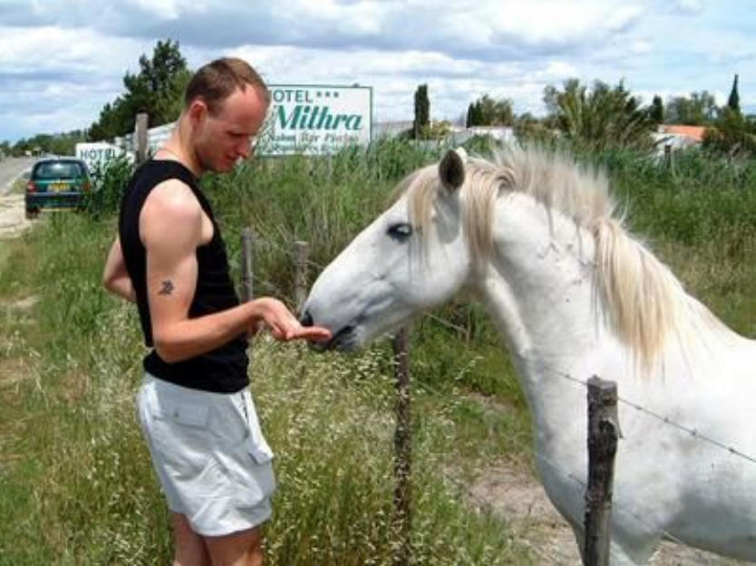 | 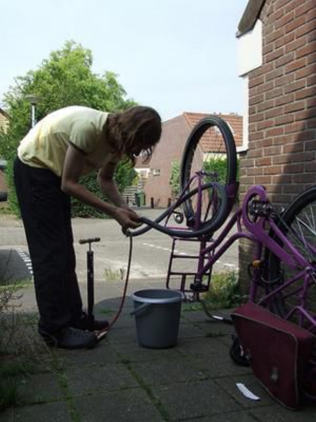 |
|:---|:---|:---|
| Step 1 Output | `The image features a man standing in a field, wearing a black shirt, and reaching out to pet a white horse. The man is leaning over the fence, which is made of wood, and appears to be interacting with the horse in a friendly manner. The man’s main action is petting the horse, which is a common way to establish a bond and show affection between humans and animals.` | `The image features a young woman in a yellow shirt, who is kneeling down and working on a pink bicycle. She is actively engaged in the process of cleaning the bicycle, which is parked on the sidewalk next to a building. The woman is using a bucket and a hose to wash the bike, ensuring that it is clean and well-maintained.` |
| Step 2a Output | Petting a horse | Cleaning a bicycle |
| Step 3 Output | Interacting with horse | Repairing bicycle |
| Ground Truth | Feeding a horse | Fixing a bike |

Sample outputs for Stanford 40 Action data

#### Output of Step 2a.

`clapping hands: 14, taking a picture: 49, celebrating a goal: 9, posing for a photo: 28, giving a speech: 31, celebrating: 17, applauding: 6, waving to the crowd: 6, waving to a crowd: 7, waving hello: 10, clapping: 6, performing on stage: 9, giving a presentation: 11, dancing: 13, posing for a picture: 7, playing guitars: 7, taking a selfie: 41, having a conversation: 8, smoking a cigarette: 207, waving: 27, playing a guitar: 226, posing for a photograph: 9, throwing a frisbee: 62, blowing bubbles: 210, eating a lollipop: 12, blowing a bubble: 17, brushing teeth: 92, brushing her teeth: 50, brushing his teeth: 22, drinking coffee: 25, using a computer: 29, drinking from a cup: 15, cleaning the floor: 52, vacuuming the floor: 30, sweeping the floor: 87, mopping the floor: 6, cleaning the kitchen: 13, climbing a rock wall: 97, rock climbing: 116, waving at the camera: 8, waving his hand: 10, writing on a chalkboard: 38, teaching a lesson: 6, teaching: 7, writing on a blackboard: 31, writing on a whiteboard: 13, writing: 13, studying or doing homework: 15, writing on a piece of paper: 11, doing homework: 18, writing or drawing: 14, drawing or writing: 6, writing or taking notes: 6, `$`\cdots`$` `

#### Output of Step 2b.

`[clapping, taking a picture, celebrating, giving a speech, waving, performing on stage, playing guitar, taking a selfie, smoking a cigarette, throwing a frisbee, blowing bubbles, brushing teeth, drinking coffee, using a computer, cleaning the floor, climbing, cooking, preparing food, cutting down a tree, gardening, drinking beverage, reading a book, using cell phone or laptop, interacting with horse, fishing, repairing bicycle, repairing car, walking in rain with umbrella, jumping, examining under microscope, observing through telescope, talking on phone, playing violin, pouring drink, pushing cart or stroller, riding bicycle or horse, studying or teaching, running or jogging, practicing archery, washing dishes or cleaning sink]`

### CIFAR-100

#### Sample Images and Outputs for all stages.

| Images |  |  |
|:---|:---|:---|
| Step 1 Output | `The main object in the image is a wooden table with a round top.` | `The main object in the image is a large alligator laying on the ground in a grassy area.` |
| Step 2a Output | Table | Crocodile |
| Step 3 Output | Furniture | Reptile |
| Ground Truth | Household furniture | Reptiles |

Sample outputs for CIFAR-100 data

#### Output of Step 2a.

`bear: 198, rock: 54, squirrel: 107, person: 61, beaver: 24, duck: 7, animal: 52, seal: 82, monkey: 47, cat: 85, rat: 15, fox: 80, gorilla: 25, rabbit: 99, dog: 188, bowl: 111, mouse: 97, shoes: 10, deer: 30, elephant: 97, paper: 7, apple: 88, face: 51, fish: 229, dolphin: 68, shark: 100, pole: 11, whale: 86, palm tree: 79, bird: 79, polar bear: 15, hand: 15, horse: 65, snake: 115, airplane: 12, dinosaur: 54, otter: 10, sculpture: 8, raccoon: 85, groundhog: 21, turtle: 87, foot: 6, cloud: 52, tree: 462, man: 107, alligator: 26, boat: 28, kangaroo: 72, statue: 18, car: 31, chair: 146, rocket: 73, rodent: 16, woman: 105, frog: 9, flower: 252, arrow: 6, caterpillar: 52, plate: 47, ball: 25, stingray: 19, lighthouse: 6, cake: 6, cow: 91, train: 136, church: 9, road: 85, line: 7, bicycle: 96, sunset: 25, sun: 8, water: 14, trees: 12, forest: 8, grass: 20, beach: 12, ocean: 7, camel: 76, chimpanzee: 27, motorcycle: 94, triceratops: 7, hedgehog: 7, toy: 18, opossum: 17, skunk: 32, hamster: 67, lobster: 13, spider web: 7, baby: 85, child: 12, girl: 82, crocodile: 11, tank: 86, scooter: 8, bus: 81, van: 26, bulldozer: 39, lawnmower: 39, lawn mower: 22, trolley: 33, streetcar: 9, excavator: 19, `$`\cdots`$

#### Output of Step 2b.

`[animal, bird, fish, mammal, reptile, insect, plant, flower, fruit, vehicle, furniture, building, electronic device, kitchen utensil, clothing item, toy, musical instrument, sports equipment, natural landscape, human]`

## Confusion Matrices

<figure>
<figure>
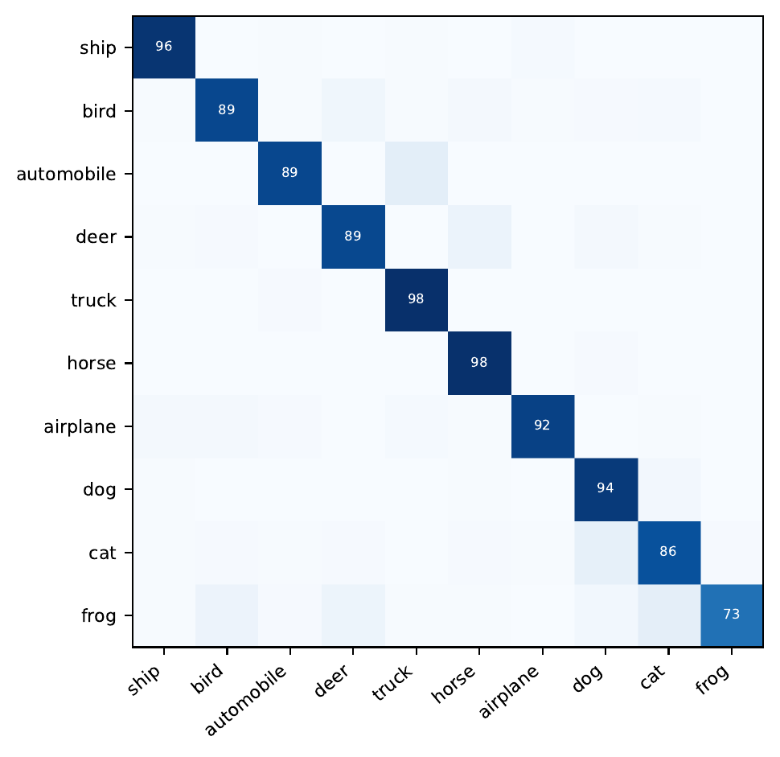
<figcaption>CIFAR-10 (<code>Object</code>)</figcaption>
</figure>
<p> </p>
<figure>

<figcaption>STL-10 (<code>Object</code>)</figcaption>
</figure>
<p> </p>
<figure>
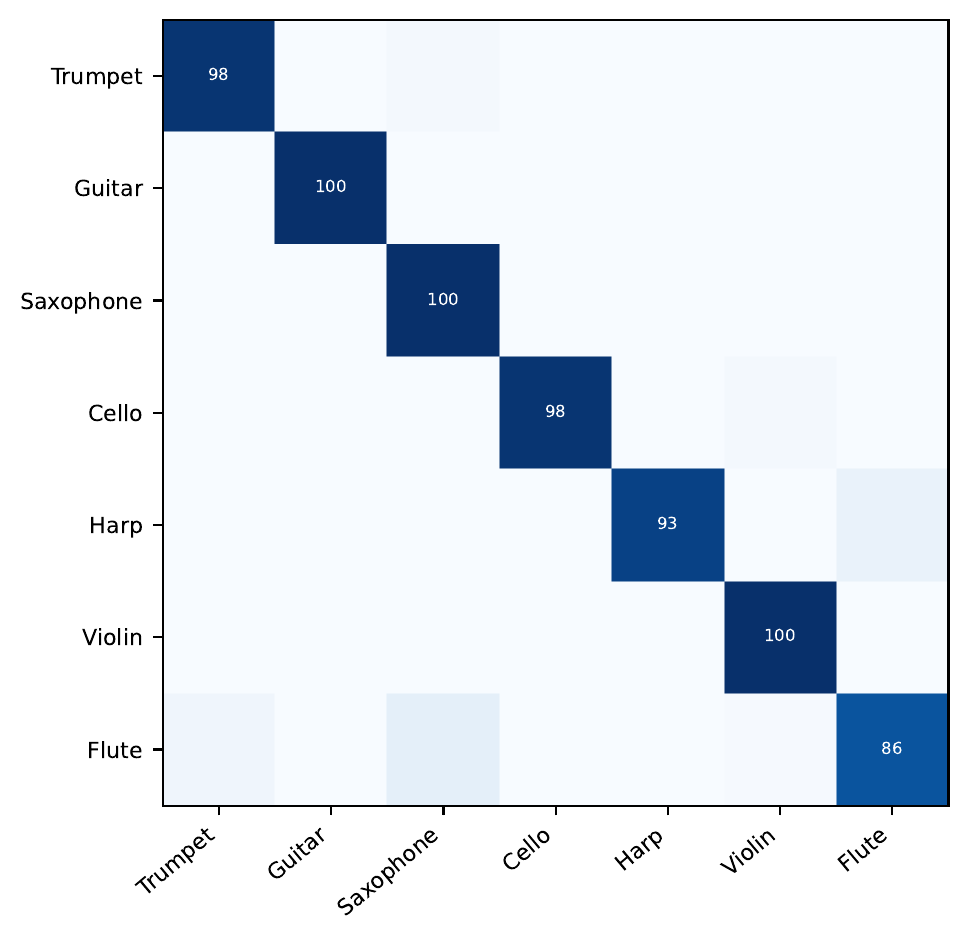
<figcaption>PPMI (<code>M.I.</code>)</figcaption>
</figure>
<figcaption>CIFAR-10, STL-10, PPMI confusion matrices.</figcaption>
</figure>

<figure>
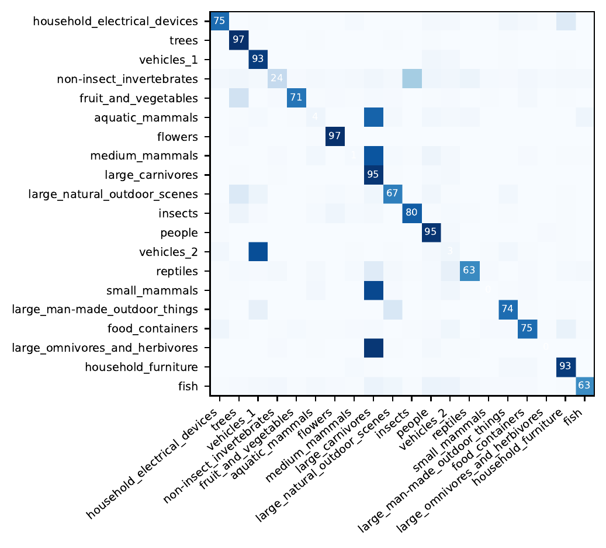
<figcaption>CIFAR-100 (<code>Object</code>) confusion matrix.</figcaption>
</figure>

<figure>
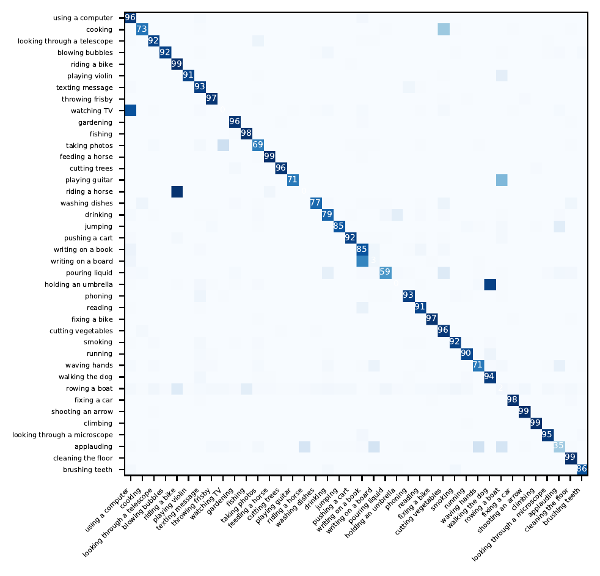
<figcaption>Stanford 40 Actions (<code>Action</code>) confusion matrix.</figcaption>
</figure>

## Clustering Examples

<figure id="fig:app-example-cifar10">
<p>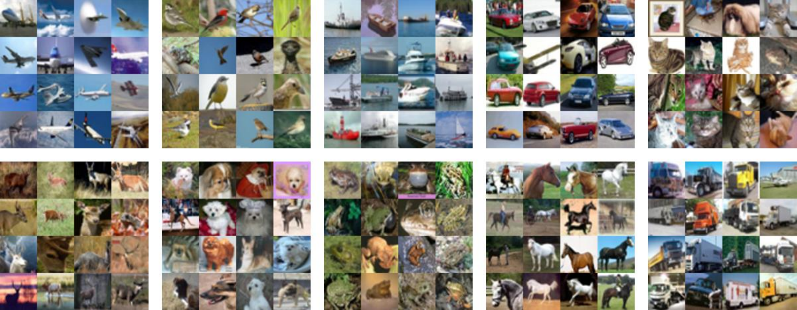<br />
</p>
<figcaption>CIFAR-10; The number of clusters <span class="math inline"><em>K</em> = 10</span>. Clustering based on <code>Object</code>.</figcaption>
</figure>

<figure id="fig:app-example-stl10">
<p><br />
</p>
<figcaption>STL-10; The number of clusters <span class="math inline"><em>K</em> = 10</span>. Clustering based on <code>Object</code>.</figcaption>
</figure>

<figure id="fig:app-example-cifar100">
<p><br />
</p>
<figcaption>CIFAR-100; The number of clusters <span class="math inline"><em>K</em> = 20</span>. Clustering based on <code>Object</code>.</figcaption>
</figure>

<figure id="fig:app-example-stanford-40-actions">
<p><br />
</p>
<figcaption>Stanford 40 Actions; The number of clusters <span class="math inline"><em>K</em> = 40</span>. Clustering based on <code>Action</code>.</figcaption>
</figure>

<figure id="fig:app-example-stanford-40-location-10">
<p><br />
</p>
<figcaption>Stanford 40 Actions; The number of clusters <span class="math inline"><em>K</em> = 10</span>. Clustering based on <code>Location</code>.</figcaption>
</figure>

<figure id="fig:app-example-stanford-40-mood">
<p>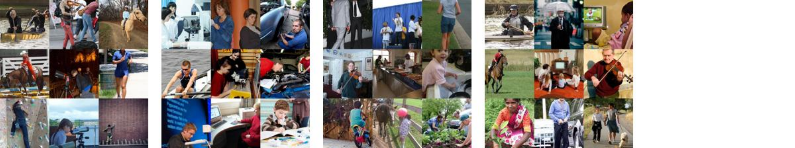<br />
</p>
<figcaption>Stanford 40 Actions; The number of clusters <span class="math inline"><em>K</em> = 4</span>. Clustering based on <code>Mood</code>.</figcaption>
</figure>

<figure id="fig:app-example-ppmi-2">
<p><br />
</p>
<figcaption>PPMI; The number of clusters <span class="math inline"><em>K</em> = 2</span>. Clustering based on <code>Musical instrument</code>.</figcaption>
</figure>

<figure id="fig:app-example-ppmi-7">
<p>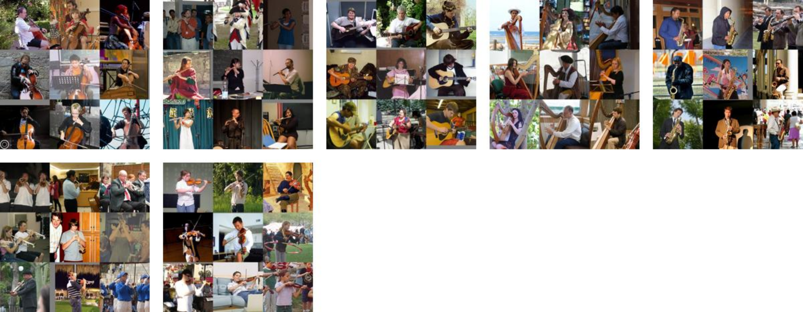<br />
</p>
<figcaption>PPMI; The number of clusters <span class="math inline"><em>K</em> = 7</span>. Clustering based on <code>Musical instrument</code>.</figcaption>
</figure>

## Fairness Experiment Text Prompts

<table style="width:90%;">
<caption>Original Prompts for Clustering based on <code>Occupation</code> on FACET dataset</caption>
<colgroup>
<col />
<col style="width: 90%" />
</colgroup>
<thead>
<tr>
<th style="text-align: left;">Steps</th>
<th style="text-align: left;">Prompt</th>
</tr>
</thead>
<tbody>
<tr>
<td style="text-align: left;">Step 1</td>
<td style="text-align: left;"><code>Given the image, can you provide a description focusing on the occupation of the person depicted?</code></td>
</tr>
<tr>
<td style="text-align: left;"><span>1-2</span> Step 2a</td>
<td style="text-align: left;"><code>You will receive a description of an image depicting an individual. Based on the provided description, deduce the person’s occupation and respond in just a few words. For instance, if given the description:</code><br />
<br />
<code>"""</code><br />
<code>The image shows an individual in a white protective suit, gloves, and a face mask, standing near a building. This attire indicates the person’s profession is associated with healthcare, safety, or environmental defense. Their attire, especially the use of personal protective equipment (PPE), implies the nature of their job necessitates protection. The building suggests an urban or industrial context</code><br />
<code>"""</code><br />
<br />
<code>Your answer should simply be "Nurse".</code></td>
</tr>
<tr>
<td style="text-align: left;"><p><span>1-2</span></p>
<p>Step 2b</p></td>
<td style="text-align: left;"><p><code>You have a list containing [__LEN__] unique expressions denoting different occupations. Their frequency of occurrence is represented as a dictionary. In this dictionary, each key signifies an occupation, and its corresponding value indicates the number of times that occupation appears in the list. Taking the example of {’riding a bicycle’: 299, ’fishing’: 258}, this means ’riding a bicycle’ has been mentioned 299 times, while ’fishing’ was mentioned 258 times.</code><br />
<br />
</p>
<p><code>Your task is to organize these 160 expressions into 4 distinct categories or clusters. Each of these clusters will correspond to a broader category of occupation.</code><br />
<br />
</p>
<p><code>Submit your response in the format: ’Answer {index}: {category}’, where {index} represents the category number, and {category} is the descriptive term for that cluster. As an illustration, if you categorize the first cluster as ’Activities’, then your response should be ’Answer 1: Activities’.</code><br />
<br />
</p>
<p><code>Please write the answer in a single occupation. For example, do not answer like ’A and B occupations’.</code><br />
<code>For creating these categories, adhere to the following guidelines:</code><br />
<br />
</p>
<p><code>1. Endeavor to keep the sizes of the clusters relatively uniform. Meaning, avoid having one cluster that’s significantly larger or smaller than the others.</code><br />
</p>
<p><code>2. Group occupations with similar implications or meanings together.</code><br />
</p>
<p><code>3. The broader categories should be distinct from one another, emphasizing different aspects or types of occupations.</code></p></td>
</tr>
<tr>
<td style="text-align: left;"><p><span>1-2</span></p>
<p>Step 3</p></td>
<td style="text-align: left;"><p><code>Based on the provided image description, classify the depicted occupation into one of the following categories:[__CLASSES__]</code><br />
<br />
</p>
<p><code>If none of the categories seem like a perfect fit, choose the one that most closely aligns with the description.</code><br />
<br />
</p>
<p><code>Please provide only the category as your answer without justification.</code></p></td>
</tr>
</tbody>
</table>

<table style="width:90%;">
<caption>Modified Prompts for Fair Clustering in FACET dataset based on <code>Occupation</code></caption>
<colgroup>
<col />
<col style="width: 90%" />
</colgroup>
<thead>
<tr>
<th style="text-align: left;">Steps</th>
<th style="text-align: left;">Prompt</th>
</tr>
</thead>
<tbody>
<tr>
<td style="text-align: left;">Step 3 - Fair</td>
<td style="text-align: left;"><p><code>Based on the provided image description, classify the depicted occupation into one of the following categories:[__CLASSES__]</code><br />
<br />
</p>
<p><code>If none of the categories seem like a perfect fit, choose the one that most closely aligns with the description.</code><br />
<br />
</p>
<p><strong><code>If a man is doing a job that requires physical strength and effort and is making artistic product, he must be classified as an artistic occupation.</code></strong><br />
<br />
</p>
<p><code>Please provide only the category as your answer without justification.</code></p></td>
</tr>
</tbody>
</table>

[^1]: Our code is available at <https://github.com/sehyunkwon/ICTC>

[^2]: $`^*`$ Remark. The CIFAR-100 dataset has 100 classes, but also has 20-superclass labels (and hence is sometimes referred to as CIFAR-100-20). Since the usage of CIFAR-100-20 dataset is more common in the clustering literature, we also use the 20-superclass labels for our experiments.

[^3]: $`^*`$ Only to be added when $`K=2`$.
