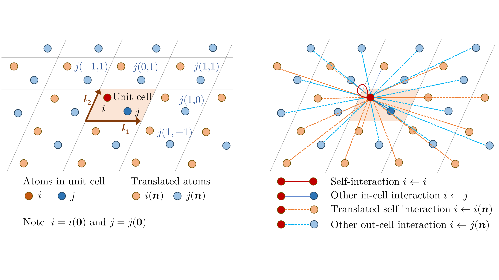
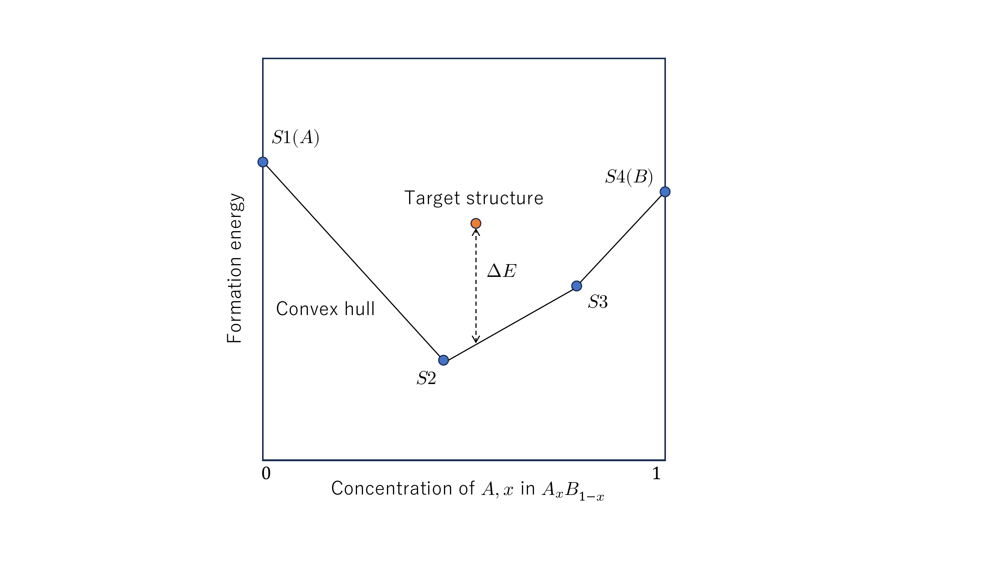

# Crystalformer: Infinitely Connected Attention for Periodic Structure Encoding

## Abstract

Predicting physical properties of materials from their crystal structures is a fundamental problem in materials science. In peripheral areas such as the prediction of molecular properties, fully connected attention networks have been shown to be successful. However, unlike these finite atom arrangements, crystal structures are infinitely repeating, periodic arrangements of atoms, whose fully connected attention results in *infinitely connected attention*. In this work, we show that this infinitely connected attention can lead to a computationally tractable formulation, interpreted as *neural potential summation*, that performs infinite interatomic potential summations in a deeply learned feature space. We then propose a simple yet effective Transformer-based encoder architecture for crystal structures called *Crystalformer*. Compared to an existing Transformer-based model, the proposed model requires only 29.4% of the number of parameters, with minimal modifications to the original Transformer architecture. Despite the architectural simplicity, the proposed method outperforms state-of-the-art methods for various property regression tasks on the Materials Project and JARVIS-DFT datasets.

# Introduction

Predicting physical properties of materials from their crystal structures without actually synthesizing materials is important for accelerating the discovery of new materials with desired properties . While physical simulation methods such as density functional theory (DFT) calculations can accurately simulate such properties, their high computational load largely limits their applicability, for example, in large-scale screening of potentially valuable materials. Thus, high-throughput machine learning (ML)-based approaches are actively studied  .

Since crystal structures and molecules are both 3D arrangements of atoms, they share similar challenges in their encoding for property prediction, such as permutation invariance and SE(3) invariance (i.e., rotation and translation invariance). Hence, similar approaches using graph neural networks (GNNs) are popular for invariantly encoding these 3D structures .

Against this mainstream of GNN variants, approaches based on Transformer encoders  are emerging recently and showing superior performance in property prediction of molecules  and crystal structures  . Particularly, Graphormer by adopts fully connected attention between atoms in a molecule, by following the standard Transformer architecture, and showed excellent prediction performance.

Crystal structures, however, have a unique structural feature —periodicity— that produces infinitely repeating periodic arrangements of atoms in 3D space. Because of the periodicity, fully connected attention between atoms in a crystal structure leads to a non-trivial formulation, namely *infinitely connected attention* (see Fig. <a href="#fig:crystal" data-reference-type="ref" data-reference="fig:crystal">1</a>), which involves infinite series over repeated atoms. The previous method, called Matformer , avoids such a formulation and presents itself rather as a hybrid of Transformer and message passing GNN. Thus, whether the standard Transformer architecture is effectively applicable to crystal structure encoding is still an open question.

In this work, we interpret this infinitely connected attention as a physics-inspired infinite summation of interatomic potentials performed deeply in abstract feature space, which we call *neural potential summation*. In this view, attention weights are formulated as interatomic distance-decay potentials, which make the infinitely connected attention approximately tractable.

By using this formulation, we propose a simple yet effective Transformer encoder for crystal structures called *Crystalformer*, establishing a novel Transformer framework for periodic structure encoding. Compared to the previous work by , we aim to develop the formalism for more faithful Transformer-based crystal structure encoding. The resulting architecture is shown to require only 29.4% of the total number of parameters of their Matformer to achieve better performance, while sharing useful invariance properties. We also point out that a direct extension of Graphormer  for periodic structures leads to inadequate modeling of periodicity, which the proposed framework overcomes. We further show that the proposed framework using the infinitely connected attention formulation is beneficial for efficiently incorporating long-range interatomic interactions.

Quantitative comparisons using Materials Project and JARVIS-DFT datasets show that the proposed method outperforms several neural-network-based state-of-the-art methods  for various crystal property prediction tasks. We release our code online.

# Preliminaries

We begin with introducing the unit cell representation of crystal structures and recapping standard self-attention in Transformer encoders with relative position representations.

<figure id="fig:crystal">

<figcaption><strong>2D diagrams of crystal structure and infinitely connected attention.</strong></figcaption>
</figure>

## Crystal structures

Assume a periodic structure system on a lattice in 3D space, which consists of finite sets of points and their attributes, $`\mathcal{P} = \{{\bm{p}}_1, {\bm{p}}_2, ..., {\bm{p}}_{N} \}`$ and $`\mathcal{X}^0 = \{{\bm{x}}_1^0, {\bm{x}}_2^0, ..., {\bm{x}}_{N}^0 \}`$, in a unit cell as well as lattice vectors, $`\bm{l}_1,\bm{l}_2,\bm{l}_3 \in \mathbb{R}^3`$, defining the unit cell translations. As a crystal structure, each $`\bm{p}_i \in \mathbb{R}^3`$ and $`\bm{x}^0_i \in \mathbb{R}^d`$ represent the Cartesian coordinate and species of an atom in the unit cell, respectively. Any point in the system is then located at a translated position, or an *image*, of a unit-cell point as
``` math
\bm{p}_{i(\bm{n})} = \bm{p}_i + n_1\bm{l}_1 + n_2\bm{l}_2 + n_3\bm{l}_3,
```
where three integers in $`\bm{n}=(n_1,n_2,n_3)\in \mathbb{Z}^3`$ define a 3D translation with $`\bm{l}_1,\bm{l}_2,\bm{l}_3`$. See Fig. <a href="#fig:crystal" data-reference-type="ref" data-reference="fig:crystal">1</a> (left) for an illustration. For brevity, let $`i`$ denote the index of the $`i`$-th unit-cell point without translation, and let $`i(\bm{n})`$ denote the index of a translated image of $`i`$ (including $`i`$ itself as $`i(\bm{0})`$). $`\sum_{\bm{n}}`$ denotes the infinite series over $`\mathbb{Z}^3`$. Indices $`j`$ and $`j(\bm{n})`$ are used similarly.

## Self-attention with relative positions

Self-attention  with relative position representations  transforms an ordered finite sequence of feature vectors to another, as $`(\bm{x}_1, ..., \bm{x}_N) \to (\bm{y}_1, ..., \bm{y}_N)`$:
``` math
\bm{y}_i = \frac{1}{Z_i} {\sum_{j=1}^N \exp\big({\bm{q}_i^T \bm{k}_{j}}/\sqrt{d_K} + \phi_{ij}\big) \big(\bm{v}_{j} +\bm{\psi}_{ij}\big)},
\label{eq:std_attention}
```
where query $`\bm{q}`$, key $`\bm{k}`$, value $`\bm{v}`$ are linear projections of input $`\bm{x}`$, $`Z_i = \sum_{j=1}^N  \exp({\bm{q}_i^T \bm{k}_{j}}/\sqrt{d_K} + \phi_{ij})`$ is the normalizer of softmax attention weights, and $`d_K`$ is the dimensionality of $`\bm{k}`$ and $`\bm{q}`$. Since each input $`\bm{x}_i`$ is position-agnostic and so are pairwise similarity $`\bm{q}_i^T\bm{k}_j/\sqrt{d_K}`$ and value $`\bm{v}_j`$, they are augmented with scalar $`\phi_{ij}`$ and vector $`\bm{\psi}_{ij}`$ biases that encode/embed the relative position, $`j-i`$.

# Crystalformer

We consider a problem of estimating physical properties of a given crystal structure. Following and , we represent a physical state of the whole structure as a finite set of abstract state variables for the atoms in the unit cell, $`\mathcal{X} = \{\bm{x}_1,\bm{x}_2,...,\bm{x}_{N}\}`$, assuming that any atom in the structure shares the state with its corresponding unit-cell atom, as $`\bm{x}_{i(\bm{n})} = \bm{x}_i`$ . Given input state $`\mathcal{X}^0`$ that only symbolically represents the species of the unit-cell atoms, we evolve state $`\mathcal{X}^0`$, through repeated interactions between atom-wise states, to another $`\mathcal{X}'`$ reflecting the target properties for prediction. To this end, we propose an attention operation for state $`\mathcal{X}`$, which is induced by the input structure specified with the unit cell points $`\{\bm{p}_1,\bm{p}_2,...,\bm{p}_N \}`$ and lattice vectors $`\{\bm{l}_1,\bm{l}_2,\bm{l}_3\}`$.

## Infinitely connected attention as neural potential summation

Inspired by Graphormer ’s fully connected attention for atoms in a molecule, we formulate similar dense attention for a crystal structure for its state evolution. Compared to finite graph representations in GNNs, this dense formulation more faithfully represents the physical phenomena occurring inside crystal structures and should provide a good starting point for discussion. Because of the crystal periodicity, such attention amounts to pairwise interactions between the unit-cell atoms $`i`$ as queries and all the infinitely repeated atoms $`j(\bm{n})`$ in the structure as keys/values as
``` math
\bm{y}_i = \frac{1}{Z_i} {\sum_{j=1}^N\sum_{\bm{n}} \exp\left({\bm{q}_i^T \bm{k}_{j(\bm{n})}}/\sqrt{d_K} + \phi_{ij(\bm{n})}\right) \left(\bm{v}_{j(\bm{n})} +\bm{\psi}_{ij(\bm{n})}\right)}, \label{eq:attention}
```
where $`Z_i = \sum_{j=1}^N \sum_{\bm{n}} \exp({\bm{q}_i^T \bm{k}_{j(\bm{n})}}/\sqrt{d_K} + \phi_{ij(\bm{n})})`$. Notice $`\bm{k}_{j(\bm{n})} = \bm{k}_j`$ and $`\bm{v}_{j(\bm{n})} = \bm{v}_j`$ since $`\bm{x}_{j(\bm{n})} = \bm{x}_j`$. Fig. <a href="#fig:crystal" data-reference-type="ref" data-reference="fig:crystal">1</a> (right) illustrates these dense connections.

We regard this infinitely connected attention in Eq. (<a href="#eq:attention" data-reference-type="ref" data-reference="eq:attention">[eq:attention]</a>) as a *neural potential summation*. In physical simulations, energy calculations typically involve infinite summation $`\sum_{j(\bm{n}) \neq i} \Phi(\|\bm{p}_{j(\bm{n})}-\bm{p}_i\|)v_{j(\bm{n})}`$ for potential function $`\Phi(r)`$ and physical quantity $`v`$ (*e.g.*, electric charge). Analogously, Eq. (<a href="#eq:attention" data-reference-type="ref" data-reference="eq:attention">[eq:attention]</a>) computes the state of each unit-cell atom, $`\bm{y}_i`$, by summing abstract influences, $`(\bm{v}_{j(\bm{n})} + \bm{\psi}_{ij(\bm{n})})`$, from all the atoms in the structure, $`j(\bm{n})`$, with their weights provided by abstract interatomic scalar potentials, $`\exp(\bm{q}_i^T\bm{k}_{j(\bm{n})}/\sqrt{d_K} + \phi_{ij(\bm{n})})/Z_i`$. Since $`\bm{q}_i^T\bm{k}_{j(\bm{n})}/\sqrt{d_K}`$ and $`\bm{v}_{j(\bm{n})}`$ are position-agnostic, they are augmented with relative position encodings, $`\phi_{ij(\bm{n})}`$ and $`\bm{\psi}_{ij(\bm{n})}`$, to reflect the interatomic spatial relation (*i.e.*, $`\bm{p}_{j(\bm{n})}-\bm{p}_{i}`$). Thus, $`\exp(\phi_{ij(\bm{n})})`$ is interpreted as a spatial dependency factor of the interatomic potential between $`i`$ and $`j(\bm{n})`$, and $`\bm{\psi}_{ij(\bm{n})}`$ as an abstract position-dependent influence on $`i`$ from $`j(\bm{n})`$.

Compared to the standard finite-element self-attention in Eq. (<a href="#eq:std_attention" data-reference-type="ref" data-reference="eq:std_attention">[eq:std_attention]</a>), the main challenge in computing Eq. (<a href="#eq:attention" data-reference-type="ref" data-reference="eq:attention">[eq:attention]</a>) is the presence of infinite series $`\sum_{\bm{n}}`$ owing to the crystal periodicity.

<figure id="fig:attention">

<figcaption><strong>Pseudo-finite periodic attention with periodic spatial and edge encoding in a matrix-tensor diagram.</strong> Scalar <span class="math inline"><em>α</em><sub><em>i</em><em>j</em></sub></span> and vector <span class="math inline"><strong>β</strong><sub><em>i</em><em>j</em></sub></span> integrate the spatial relations between unit-cell atom <span class="math inline"><em>i</em></span> and the <span class="math inline"><em>j</em></span>’s all repeated atoms, allowing the infinitely connected attention to be performed as standard fully connected attention for finite unit-cell atoms. (Unlike usual notation, <span class="math inline"><em>X</em>, <em>Q</em>, <em>K</em>, <em>V</em>, <em>Y</em></span> here denote column-vector-based feature matrices for better consistency with the notation in the main text.)</figcaption>
</figure>

**Pseudo-finite periodic attention.** With simple algebra (see Appendix <a href="#appen:derivation_pseudo" data-reference-type="ref" data-reference="appen:derivation_pseudo">8</a>), we can rewrite Eq. (<a href="#eq:attention" data-reference-type="ref" data-reference="eq:attention">[eq:attention]</a>) as
``` math
\bm{y}_i = \frac{1}{Z_i}{\sum_{j=1}^N \exp\left({\bm{q}_i^T \bm{k}_j}/\sqrt{d_K} +  \alpha_{ij}\right) \big( \bm{v}_j} + \bm{\beta}_{ij} \big), \label{eq:real_space_attention}
```
where
``` math
\begin{aligned}
\alpha_{ij} &= \log\sum_{\bm{n}}\exp\left(\phi_{ij(\bm{n})}\right), \label{eq:alpha}\\
% \end{equation}
% \begin{equation}
\bm{\beta}_{ij} &= \frac{1}{Z_{ij}}\sum_{\bm{n}}\exp \left(\phi_{ij(\bm{n})} \right) \bm{\psi}_{ij(\bm{n})},\label{eq:beta}
\end{aligned}
```
and $`Z_{ij} = {\exp(\alpha_{ij})}`$. Eq. (<a href="#eq:real_space_attention" data-reference-type="ref" data-reference="eq:real_space_attention">[eq:real_space_attention]</a>) now resembles the standard finite-element attention in Eq. (<a href="#eq:std_attention" data-reference-type="ref" data-reference="eq:std_attention">[eq:std_attention]</a>), if $`\alpha_{ij}`$ and $`\bm{\beta}_{ij}`$ are viewed as quantities encoding the relative position between $`i`$ and $`j`$ in finite element set $`\{1,2,...,N\}`$. In reality, $`\alpha_{ij}`$ is the log-sum of spatial dependencies $`\exp(\phi_{ij(\bm{n})})`$ between $`i`$ and the $`j`$’s all images. Likewise, $`\bm{\beta}_{ij}`$ is the softmax-weighted average of position-dependent influences $`\bm{\psi}_{ij(\bm{n})}`$ on $`i`$ from the $`j`$’s all images, weighted by their spatial dependencies. We call $`\alpha_{ij}`$ and $`\bm{\beta}_{ij}`$ the *periodic spatial encoding* and *periodic edge encoding*, respectively, and call the infinitely connected attention with these encodings the *pseudo-finite periodic attention*. If $`\alpha_{ij}`$ and $`\bm{\beta}_{ij}`$ are tractably computed, this attention can be performed similarly to the standard finite-element attention, as shown in Fig. <a href="#fig:attention" data-reference-type="ref" data-reference="fig:attention">2</a>.

**Distance decay attention.** In the physical world, spatial dependencies between two atoms tend to decrease as their distance increases. To approximate such dependencies with $`\exp ( \phi_{ij(\bm{n})} )`$, we adopt the following Gaussian distance decay function as a simple choice among other possible forms.
``` math
\exp ( \phi_{ij(\bm{n})} )= \exp \left( -\|\bm{p}_{j(\bm{n})} - \bm{p}_i \|^2 / 2 \sigma_i^2 \right) \label{eq:gaussian}
```
Here, $`\sigma_i > 0`$ is a scalar variable controlling the Gaussian tail length. When $`\sigma_i`$ is not too large, series $`\sum_{\bm{n}}`$ in Eqs. (<a href="#eq:alpha" data-reference-type="ref" data-reference="eq:alpha">[eq:alpha]</a>) and (<a href="#eq:beta" data-reference-type="ref" data-reference="eq:beta">[eq:beta]</a>) converges quickly as $`\|\bm{n} \|`$ grows with a provable error bound (see Appendix <a href="#appen:bound" data-reference-type="ref" data-reference="appen:bound">9</a>), thus making $`\alpha_{ij}`$ and $`\bm{\beta}_{ij}`$ computationally tractable. To ensure the tractability, we model $`\sigma_i`$ as a function of current state $`\bm{q}_i`$ with a fixed upper bound, as $`\sigma_i < \sigma_\text{ub}`$ (see Appendix <a href="#appen:sigma" data-reference-type="ref" data-reference="appen:sigma">10</a> for the complete definition of $`\sigma_i`$). We found that, although allowing relatively long tails (*e.g.*, $`\sigma_\text{ub} = 7`$Å) is still tractable, the use of a shorter tail bound (*e.g.*, $`2`$Å) empirically leads to better results. The methodology to eliminate the bound for $`\sigma_i`$ is further discussed in Sec. <a href="#sec:dicussion" data-reference-type="ref" data-reference="sec:dicussion">6</a>.

**Value position encoding for periodicity-aware modeling.** Value position encoding $`\bm{\psi}_{ij(\bm{n})}`$ in Eq. (<a href="#eq:attention" data-reference-type="ref" data-reference="eq:attention">[eq:attention]</a>) represents position-dependent influences on $`i`$ from $`j(\bm{n})`$, and is another key to properly encoding periodic structures. In fact, attention without $`\bm{\psi}_{ij(\bm{n})}`$ cannot distinguish between crystal structures consisting of the same single unit-cell atom with different lattice vectors. This is obvious since Eq. (<a href="#eq:attention" data-reference-type="ref" data-reference="eq:attention">[eq:attention]</a>) with $`\bm{\psi}_{ij(\bm{n})} = \bm{0}`$ and $`N = 1`$ degenerates to $`\bm{y}_1 = \bm{v}_1`$, which is completely insensible to the input lattice vectors (see Appendix <a href="#appen:necessity" data-reference-type="ref" data-reference="appen:necessity">11</a> for more discussions). As a simple choice for $`\bm{\psi}_{ij(\bm{n})}`$, we borrow edge features used by existing GNNs . These edge features are Gaussian radial basis functions $`\bm{b}(r) = (b_1, b_2, ..., b_K)^T`$ defined as
``` math
%b_k(r) = \exp\left( -\sfrac{(r-\mu_k)^2}{2(r_\text{max}/K)^2} \right),
b_k(r) = \exp\left(-{(r-\mu_k)^2} / {2(r_\text{max}/K)^2} \right),\label{eq:gaussian_rbf}
```
where $`\mu_k = k r_\text{max}/K`$, and $`K`$ and $`r_\text{max}`$ are hyperparameters. Intuitively, vector $`\bm{b}(r)`$ quantizes scalar distance $`r`$ via soft one-hot encoding using $`K`$ bins equally spaced between 0 and $`r_\text{max}`$. We provide $`\bm{\psi}_{ij(\bm{n})}`$ as a linear projection of $`\bm{b}(r)`$ with trainable weight matrix $`W^E`$ as
``` math
\bm{\psi}_{ij(\bm{n})} = W^E \bm{b}\left(\| \bm{p}_{j(\bm{n})} - \bm{p}_i\|\right).\label{eq:psi_rbf}
```

**Implementation details.** <span id="sec:details" label="sec:details"></span> When computing $`\alpha_{ij}`$ and $`\bm{\beta}_{ij}`$ in Eqs. (<a href="#eq:alpha" data-reference-type="ref" data-reference="eq:alpha">[eq:alpha]</a>) and (<a href="#eq:beta" data-reference-type="ref" data-reference="eq:beta">[eq:beta]</a>), the Gaussian functions in series $`\sum_{\bm{n}}`$ mostly decays rapidly within a relatively small range of $`\|\bm{n}\|_\infty \le 2`$ (*i.e.*, supercell of $`5^3`$ unit cells), but structures with small unit cells often require larger ranges. We thus adaptively change the range of $`\bm{n}`$ for each $`i`$ to sufficiently cover a radius of $`3.5 \sigma_i`$ in Å. This is done by setting the range of $`n_1`$ as $`-\max(R_1,2) \le n_1 \le \max(R_1,2)`$ where $`R_1 = \lceil 3.5\sigma_i\| \bm{l}_2 \times \bm{l}_3 \|/\det(\bm{l}_1,\bm{l}_2,\bm{l}_3) \rceil`$ ($`\lceil \cdot \rceil`$ is the ceiling function) and doing similarly for $`n_2`$ and $`n_3`$. For Eq. (<a href="#eq:gaussian_rbf" data-reference-type="ref" data-reference="eq:gaussian_rbf">[eq:gaussian_rbf]</a>) we use $`K=64`$ and $`r_\text{max}=14\text{\AA}`$.

<figure id="fig:architecture">

<figcaption><strong>Network architecture of Crystalformer.</strong></figcaption>
</figure>

## Network architecture

As illustrated in Fig. <a href="#fig:architecture" data-reference-type="ref" data-reference="fig:architecture">3</a>, the Crystalformer architecture basically follows the original Transformer encoder architecture  with stacked self-attention blocks, each consisting of two residual blocks connecting a multi-head attention (MHA) layer and a shallow feed-forward network (FFN). As an important difference from the original architecture, our self-attention block entirely removes Layer Normalization. We found that a normalization-free architecture with an improved weight initialization strategy proposed by is beneficial to stabilize the training.

Given a set of trainable embedding vectors (atom embeddings) representing the species of the unit-cell atoms as initial state $`\mathcal{X}^0`$, Crystalformer transforms it to abstract state $`\mathcal{X}'`$ through four stacked self-attention blocks using the attention formulation provided in Sec. <a href="#sec:infinite_attention" data-reference-type="ref" data-reference="sec:infinite_attention">3.1</a>. The atom-wise states in $`\mathcal{X}'`$ are then aggregated into a single vector via the global average pooling. This material-wise feature is further converted through a FFN of linear, ReLU, and final linear layers to predict the target properties. More architectural details are provided in Appendix <a href="#appen:architecture" data-reference-type="ref" data-reference="appen:architecture">12</a>.

# Related work

**Invariant encoders.** Crystal structure encoders for property prediction must satisfy various invariance properties against artificial differences in data representations. The most elementary one is the permutation invariance, which was initially studied by and and is widely adopted into the GNN framework. Our method is permutation-invariant thanks to the Transformer architecture. The translation and rotation invariance, or the SE(3) invariance, are also essential for ML on 3D point clouds, including molecules and materials. Our method simply employs the fully distance-based modeling to ensure the SE(3) invariance. Recent point-cloud encoders, such as convolution-based and Transformer-based  methods, exploit richer information while maintaining the SE(3) invariance. These techniques can be possibly incorporated to our framework with proper extensions for crystal structures. Lastly, the periodic invariance (*i.e.*, supercell invariance and periodic-boundary shift invariance) has recently been pointed out by as a property particularly important for crystal structure encoders. Our formalism provides a periodic-invariant encoder, if $`\alpha`$ and $`\bm{\beta}`$ are computed until convergence (see Appendix <a href="#appen:invariance" data-reference-type="ref" data-reference="appen:invariance">13</a>).

**GNNs for crystal structure encoding.** The initial successful work on encoding crystal structures with neural networks can be traced back to CGCNN by . Their multi-edge distance graph represents crystal structures as finite graphs, and has provided a foundation for the GNN framework for crystal structures. Almost concurrently, extended their molecular encoder, SchNet, for crystal structures using a similar approach. Subsequently, several GNNs adopting similar approaches have been proposed for universal property prediction not limited to energy prediction. MEGNet  proposed to sequentially update atom, bond, and global state attributes through GNN layers. GATGNN  incorporated attention mechanisms into convolution and pooling layers of the GNN framework. iCGCNN  and ALIGNN  proposed 3-body interaction GNNs to exploit interatomic angular information, while GeoCGNN  used rotation-invariant plane-wave-based edge features to encode directional information. recently proposed Ewald message passing for exploiting long-range interatomic interactions with GNNs.

PotNet  proposed a new type of physics-informed edge feature that embeds the infinite summation value of several known interatomic potentials and allows a standard fully-connected GNN to be informed of crystal periodicity. (We more discuss PotNet in Appendix <a href="#appen:potnet" data-reference-type="ref" data-reference="appen:potnet">14</a>.)

Apart from material-level property prediction, M3GNet  extended MEGNet for interatomic potential prediction. Our focus is apart from the line of these studies in the GNN framework, and we aim to establish an effective Transformer framework for crystal structure encoding in a standard fashion of the Transformer using fully connected attention.

**Transformers.** The Transformer was originally proposed by for machine translation in natural language processing (NLP), as a sequence-to-sequence model in an encoder-decoder architecture. Since then, it has been widely applied to various tasks in many fields, such as NLP, computer vision, and speech processing , using its encoder-decoder or encoder-only architecture. Compared to standard convolutional neural network encoders, Transformer encoders have an outstanding ability to model complex interdependencies among input elements (*e.g.*, resolving ambiguous meanings of words in sentence context) and have great flexibility in handling irregularly structured or unordered data such as point clouds . These capabilities should benefit the encoding of crystal structures and molecules because atoms in these structures interact with each other in complex ways to determine their states, and also they are structured in 3D space rather than regularly ordered. While there have been attempts to partly replace key modules of GNNs with attention mechanisms, first presented a complete Transformer architecture (Graphormer) for graph encoding and showed state-of-the-art performance for molecular property prediction. Later, proposed Matformer as a Transformer-inspired encoder for crystal structures. Matformer fixes the periodic invariance break in existing GNNs by using radius nearest neighbors (radius-NN) instead of k-NN for graph construction. Note that works on language models for materials by and are clearly distinguished from ours.

**Graphormer**  is specifically designed for finite graphs such as molecules and does not ensure distance-decay attention, which leads to its inapplicability to periodic structures. Moreover, even an extended model mending this problem suffers from another modeling problem of periodicity, such as discussed in Sec.<a href="#sec:infinite_attention" data-reference-type="ref" data-reference="sec:infinite_attention">3.1</a>. The problem is that Graphormer encodes all the spatial information, including distance edge features, as only softmax biases (*i.e.*, $`\phi_{ij}`$ in Eq. (<a href="#eq:std_attention" data-reference-type="ref" data-reference="eq:std_attention">[eq:std_attention]</a>)) and does not use value position encoding (*i.e.*, $`\bm{\psi}_{ij}`$). Such a formulation is fine for molecules but fails to distinguish between crystal structures of the same single atom in differently sized unit cells. We will show that this modeling issue leads to performance degradation in Sec. <a href="#sec:ablation" data-reference-type="ref" data-reference="sec:ablation">5.4</a>.

**Matformer**  employs finite graphs with radius-NN edges similarly to GNNs. Their abstract feature-based attention does not ensure distance decay and is thus inapplicable to the infinitely connected edges. Moreover, they modify the original Transformer in various ways, by extending query/key/value by concatenation as $`\bm{q}_{ij} = (\bm{q}_i|\bm{q}_i|\bm{q}_i), \bm{k}_{ij} = (\bm{k}_i|\bm{k}_j|\bm{e}_{ij}), \bm{v}_{ij} = (\bm{v}_i|\bm{v}_j|\bm{e}_{ij})`$ ($`\bm{e}_{ij}`$ an edge feature), changing the scaled dot product to Hadamard product, softmax to sigmoid function, etc. We consider that the lack of explicit distance decay attention required such modifications, as they report worse results with standard softmax attention. They also propose self-connecting edges (*i.e.*, a part of the orange dashed edges in Fig. <a href="#fig:crystal" data-reference-type="ref" data-reference="fig:crystal">1</a> (right)) although unsuccessful. By contrast, we employ much denser edges made possible by explicit distance-decay attention. This formulation leads to an architectural framework closely following the original Transformer (see Figs. <a href="#fig:attention" data-reference-type="ref" data-reference="fig:attention">2</a> and <a href="#fig:architecture" data-reference-type="ref" data-reference="fig:architecture">3</a>), specifically its relative-position-based  and normalization-free  variants.

# Experiments

We perform regression tasks of several important material properties, comparing with several neural-network-based state-of-the-art methods . Following our most relevant work by , we use the following datasets with DFT-calculated properties.

**Materials Project (MEGNet)** is a collection of 69,239 materials from the Materials Project database retrieved by . Following , we perform regression tasks of formation energy, bandgap, bulk modulus, and shear modulus.

**JARVIS-DFT (3D 2021)** is a collection of 55,723 materials by . Following , we perform regression tasks of formation energy, total energy, bandgap, and energy above hull (E hull). For bandgap, the dataset provides property values obtained by DFT calculation methods using the OptB88vdW functional (OPT) or the Tran-Blaha modified Becke-Johnson potential (MBJ). While MBJ is considered more accurate , we use both for evaluation.

Thanks to the great effort by and , many relevant methods are evaluated on these datasets with consistent and reproducible train/validation/test splits. We partly borrow their settings and results for a fair comparison. Doing so also helps to reduce the computational load needed for comparisons.

## Training settings

For each regression task in the Materials Project dataset, we train our model by optimizing the mean absolute error loss function via stochastic gradient descent (SGD) with a batch size of 128 materials for 500 epochs. We initialize the attention layers by following . We use the Adam optimizer  with weight decay  of $`10^{-5}`$ and clip the gradient norm at 1. For the hyperparameters of Adam we follow ; we use the initial learning rate $`\alpha`$ of $`5\times 10^{-4}`$ and decay it according to $`\alpha \sqrt{4000/(4000+t)}`$ by the number of total training steps $`t`$, and use $`(\beta_1, \beta_2) = (0.9, 0.98)`$. For test and validation model selection, we use stochastic weight averaging (SWA)  by averaging the model weights for the last 50 epochs with a fixed learning rate. For the JARVIS-DFT dataset, we use increased batch size and total epochs, as specified in Appendix <a href="#appen:training" data-reference-type="ref" data-reference="appen:training">15</a>, for its relatively smaller dataset size.

<span id="table:results_mp" label="table:results_mp"></span>

<div class="tabular">

lS\[table-format=1.4\]cS\[table-format=1.4\]S\[table-format=1.4\] & Formation energy & Bandgap & Bulk modulus & Shear modulus  
& 60000 / 5000 / 4239 & 60000 / 5000 / 4239 & 4664 / 393 / 393 & 4664 / 392 / 393  
(r)2-5 Method & eV/atom & eV & log(GPa) & log(GPa)  
CGCNN  & 0.031 & 0.292 & 0.047 &0.077  
SchNet  & 0.033 & 0.345 & 0.066 & 0.099  
MEGNet  & 0.030 & 0.307 & 0.060 & 0.099  
GATGNN  & 0.033 & 0.280 & 0.045 & 0.075  
M3GNet  & 0.024 & 0.247 & 0.050 & 0.087  
ALIGNN  & 0.022 & 0.218 & 0.051 & 0.078  
Matformer  & 0.021 & 0.211 & 0.043 & 0.073  
PotNet  & <u>0.0188</u> & 0.204 & 0.040 & **0.065  
Crystalformer (proposed) & **0.0186** & **0.198** & **0.0377** & <u>0.0689</u>  
Crystalformer w/o SWA & 0.0198 & <u>0.201</u> & <u>0.0399</u> & 0.0692  **

</div>

  

<span id="table:results_jarvis" label="table:results_jarvis"></span>

<div class="tabular">

lS\[table-format=1.4\]S\[table-format=1.4\]S\[table-format=1.3\]S\[table-format=1.3\]S\[table-format=1.4\] & Form. energy & Total energy & Bandgap (OPT) & Bandgap (MBJ) & E hull  
& 44578 / 5572 / 5572 & 44578 / 5572 / 5572 & 44578 / 5572 / 5572 & 14537 / 1817 / 1817 & 44296 / 5537 / 5537  
(r)2-6 Method & eV/atom & eV/atom & eV & eV & eV  
CGCNN & 0.063 & 0.078 & 0.20 & 0.41& 0.17  
SchNet & 0.045 & 0.047 & 0.19 & 0.43 & 0.14  
MEGNet & 0.047 & 0.058 & 0.145 & 0.34 & 0.084  
GATGNN & 0.047 & 0.056 & 0.17 & 0.51 & 0.12  
M3GNet & 0.039 & 0.041 & 0.145 & 0.362 & 0.095  
ALIGNN & 0.0331 & 0.037 & 0.142 & 0.31 & 0.076  
Matformer & 0.0325 & 0.035 & 0.137 & 0.30 & 0.064  
PotNet & **0.0294 & **0.032 & **0.127 & **0.27 & 0.055  
Crystalformer (proposed) & & **0.0320 & & & **0.0463  
Crystalformer w/o SWA & 0.0319 & & 0.131 & 0.275 &   ************

</div>

<div id="table:ablation">

| Model | Type | Time/Epoch | Total | Test/Mater. | \# Params. | \# Params./Block |
|:---|:--:|:--:|:--:|:--:|:--:|:--:|
| PotNet | GNN | 43 s | 5.9 h | 313 ms | 1.8 M | 527 K |
| Matformer | Transformer | 60 s | 8.3 h | 20.4 ms | 2.9 M | 544 K |
| Crystalformer | Transformer | 32 s | 7.2 h |  6.6 ms | 853 K | 206 K |
| —– w/o $`\bm{\psi}`$ / $`\bm{\beta}`$ | Transformer | 12 s | 2.6 h |  5.9 ms | 820 K | 198 K |

**Ablation studies on the validation sets of the JARVIS-DFT 3D 2021 dataset.**

</div>

<div id="table:ablation">

| Settings | $`\bm{\psi}`$ | \# Blocks | Form. E. | Total E. | Bandgap (OPT) | Bandgap (MBJ) | E hull |
|:---|:--:|:--:|:--:|:--:|:--:|:--:|:--:|
| Proposed |  | 4 | **0.0301** | **0.0314** | **0.133** | **0.287** | **0.0487** |
| Simplified |  | 4 | 0.0541 | 0.0546 | 0.140 | 0.308 | 0.0517 |

**Ablation studies on the validation sets of the JARVIS-DFT 3D 2021 dataset.**

</div>

## Crystal property prediction

Tables <a href="#table:results_mp" data-reference-type="ref" data-reference="table:results_mp">[table:results_mp]</a> and <a href="#table:results_jarvis" data-reference-type="ref" data-reference="table:results_jarvis">[table:results_jarvis]</a> summarize the mean absolute errors (MAEs) for totally nine regression tasks of the Materials Project and JARVIS-DFT datasets, comparing our method with eight existing methods [^1]. Our method consistently outperforms all but PotNet in all the tasks, even without SWA (*i.e.*, evaluating a model checkpoint with the best validation score). Meanwhile, our method is competitive to PotNet. This is rather remarkable, considering that 1) PotNet exploits several known forms of interatomic potentials to take advantage of a strong inductive bias while we approximate them with simple Gaussian potentials, and that 2) our model is more efficient as shown in the next section. It is also worth noting that our method performs well for the bulk and shear modulus prediction tasks, even with limited training data sizes without any pre-training, which supports the validity of our model.

## Model efficiency comparison

Table <a href="#tab:efficiency" data-reference-type="ref" data-reference="tab:efficiency">[tab:efficiency]</a> summarizes the running times [^2] and model sizes, comparing with PotNet  and Matformer  as the current best GNN-based and Transformer-based models. Notably, the total number of parameters in our model is only 48.6% and 29.4% of the number in PotNet and Matformer, respectively. We believe that our neural potential summation induces a strong inductive bias and leads to a more compact model. Although our total training time is relatively long, our inference speed is the fastest. Note that PotNet reduces its training time by precomputing infinite potential summations for training data. For reference, we also show the efficiency of our model without $`\bm{\psi}`$/$`\bm{\beta}`$, indicating that the computations for $`\bm{\beta}`$ largely dominate the entire training process.

## Ablation studies

We compare the proposed model with its simplified version removing value position encoding $`\bm{\psi}`$, as a variant close to Graphormer . Table <a href="#table:ablation" data-reference-type="ref" data-reference="table:ablation">2</a> shows consistent performance improvements by the inclusion of $`\bm{\psi}`$, most notably on the formation and total energy predictions but less so on the others. In Appendix <a href="#appen:interpretation" data-reference-type="ref" data-reference="appen:interpretation">16</a>, we discuss this behavior in terms of the definitions of these metrics, and also show further performance improvements by changing the number of self-attention blocks.

# Limitations and discussion

**Angular and directional information.** We currently adopt fully distance-based formulations for position econdings $`\phi`$ and $`\bm{\psi}`$ to ensure SE(3) invariance. Although straightforward, such formulations limit the expressive power and the addition of angular/directional information is preferred . Some existing works on SE(3)-invariant GNNs explore this direction by using 3-body interactions  or plane-wave-based edge features . Others propose SE(3)-equivariant encoding techniques for a similar purpose . Extending Crystalformer to a 3-body, higher-order Transformer , incorporating plane wave features into $`\bm{\psi}`$, or introducing SE(3)-equivariant transformations are possible future directions.

**Forms of interatomic potentials.** Explicitly exposing distance-decay functions in attention helps the physical interpretation of our model. Our current setting limits them to the Gaussian decay function, intending to approximate the sum of various potentials in the real world, such as the Coulomb potential ($`1/r`$) and the van der Waals potential ($`1/r^6`$). Despite the simplicity, the experiments show empirically good results, and we believe that the overall Transformer architecture (*i.e.*, MHA, FFN, and repeated attention blocks) helps to learn more complex potential forms than the Gaussian function. Still, we can explore other choices of functions by explicitly incorporating known potential forms into our model. This can be done by assigning different forms of $`\exp(\phi)`$ for different heads of MHA, which possibly leads to further performance gains or model efficiency. We leave it as our future work.

**Attention in Fourier space for long-range interactions.** Gaussian tail length $`\sigma_i`$ in Eq. (<a href="#eq:gaussian" data-reference-type="ref" data-reference="eq:gaussian">[eq:gaussian]</a>) is upper-bounded by a certain constant, $`\sigma_\text{ub} \simeq 2\text{\AA}`$, to avoid excessively long-tailed functions, thus making $`\alpha`$ and $`\bm{\beta}`$ computationally tractable. Despite the empirical success, such a bound possibly overlooks the presence of long-range interactions, such as the Coulomb potential. Here, our infinite-series formulation becomes advantageous for computing such long-range interactions, with the help of *reciprocal space*. Reciprocal space, or Fourier space, is analogous to the frequency domain of time-dependent functions, and appears in the 3D Fourier transform of spatial functions. When Eq. (<a href="#eq:alpha" data-reference-type="ref" data-reference="eq:alpha">[eq:alpha]</a>) is written as $`\alpha_{ij} = \log f(\bm{p}_j - \bm{p}_i)`$ with spatial function $`f(\bm{r})`$, $`f`$ is a periodic function that can be expressed in reciprocal space via Fourier series. In reciprocal space, $`f`$’s infinite series of Gaussian functions of distances in real space becomes an infinite series of Gaussian functions of spatial frequencies. (See Appendix <a href="#appen:simple_model_reci" data-reference-type="ref" data-reference="appen:simple_model_reci">17</a> for detailed formulations.) These two expressions are complementary in that short-tail and long-tail potentials decay rapidly in real and reciprocal space, respectively. We use these two expressions for parallel heads of each MHA, by computing their $`\alpha`$ and $`\bm{\beta}`$ differently in real or reciprocal space. To ensure the tractability in reciprocal space, $`\sigma_i`$ should be lower-bounded as $`\sigma_i > \sigma_\text{lb}`$. By setting the bounds for the two spaces as $`\sigma_\text{lb} < \sigma_\text{ub}`$, this dual-space MHA can cover the entire range of interactions in theory. As a tentative experiment, we evaluate this dual-space variant of Crystalformer on the JARVIS-DFT dataset. Results in Table <a href="#table:reciprocal" data-reference-type="ref" data-reference="table:reciprocal">[table:reciprocal]</a> in Appendix <a href="#appen:dual_space_results" data-reference-type="ref" data-reference="appen:dual_space_results">17.4</a> show that adding the reciprocal-space attention results in worse performance for formation and total energy, comparable for bandgap, and much better for E hull predictions. Adaptively switching each MHA head between the two attention forms depending on the task will lead to stable improvements.

# Conclusions

We have presented Crystalformer as a Transformer encoder for crystal structures. It stands on fully connected attention between periodic points, namely infinitely connected attention, with physically-motivated distance-decay attention to ensure the tractability. The method has shown successful results in various property prediction tasks with high model efficiency. We have further discussed its extension to a reciprocal space representation for efficiently computing long-range interatomic interactions. We hope that this simple and physically-motivated Transformer framework provides a perspective in terms of both ML and materials science to promote further interdisciplinary research. As Transformer-based large language models are revolutionizing AI, how Crystalformer with large models can absorb knowledge from large-scale material datasets is also an ambitious open question.

### Author Contributions

T.T. conceived the core idea of the method, implemented it, conducted the experiments, and wrote the paper and rebuttal with other authors. R.I. suggested the Fourier space attention, provided knowledge of physics simulation and materials science, and helped with the paper writing and rebuttal. Y.S. provided a codebase for crystal encoders, provided materials science knowledge, and helped with the experiments, survey of crystal encoders, and paper writing. N.C. provided ML knowledge and helped with the experiments, survey of invariant encoders, and paper writing. K.S. provided materials science knowledge and helped with the paper writing. Y.U. co-led our materials-related collaborative projects, provided ML knowledge, and helped with the experiments and paper writing. K.O. co-led our materials-related collaborative projects, provided materials science knowledge, and helped with the paper writing.

### Acknowledgments

This work is partly supported by JST-Mirai Program, Grant Number JPMJMI19G1. Y.S. was supported by JST ACT-I grant number JPMJPR18UE during the early phase of this project. The computational resource of AI Bridging Cloud Infrastructure (ABCI) provided by the National Institute of Advanced Industrial Science and Technology (AIST) was partly used for numerical experiments.

# References

<div class="thebibliography">

Chi Chen and Shyue Ping Ong A universal graph deep learning interatomic potential for the periodic table *Nature Computational Science*, 2 (11): 718–728, Nov 2022. ISSN 2662-8457. . URL <https://doi.org/10.1038/s43588-022-00349-3>. **Abstract:** Abstract Interatomic potentials (IAPs), which describe the potential energy surface of a collection of atoms, are a fundamental input for atomistic simulations. However, existing IAPs are either fitted to narrow chemistries or too inaccurate for general applications. Here, we report a universal IAP for materials based on graph neural networks with three-body interactions (M3GNet). The M3GNet IAP was trained on the massive database of structural relaxations performed by the Materials Project over the past 10 years and has broad applications in structural relaxation, dynamic simulations and property prediction of materials across diverse chemical spaces. About 1.8 million potentially stable materials were identified from a screening of 31 million hypothetical crystal structures, demonstrating a machine learning-accelerated pathway to the discovery of synthesizable materials with exceptional properties. (@chen22m3gnet)

Chi Chen, Weike Ye, Yunxing Zuo, Chen Zheng, and Shyue Ping Ong Graph networks as a universal machine learning framework for molecules and crystals *Chemistry of Materials*, 31 (9): 3564–3572, May 2019. ISSN 0897-4756. . **Abstract:** Graph networks are a new machine learning (ML) paradigm that supports both relational reasoning and combinatorial generalization. Here, we develop universal MatErials Graph Network (MEGNet) models for accurate property prediction in both molecules and crystals. We demonstrate that the MEGNet models outperform prior ML models such as the SchNet in 11 out of 13 properties of the QM9 molecule data set. Similarly, we show that MEGNet models trained on ∼60 000 crystals in the Materials Project substantially outperform prior ML models in the prediction of the formation energies, band gaps, and elastic moduli of crystals, achieving better than density functional theory accuracy over a much larger data set. We present two new strategies to address data limitations common in materials science and chemistry. First, we demonstrate a physically intuitive approach to unify four separate molecular MEGNet models for the internal energy at 0 K and room temperature, enthalpy, and Gibbs free energy into a single free energy MEGNet model by incorporating the temperature, pressure, and entropy as global state inputs. Second, we show that the learned element embeddings in MEGNet models encode periodic chemical trends and can be transfer-learned from a property model trained on a larger data set (formation energies) to improve property models with smaller amounts of data (band gaps and elastic moduli). (@chen2019megnet)

Jiucheng Cheng, Chunkai Zhang, and Lifeng Dong A geometric-information-enhanced crystal graph network for predicting properties of materials *Communications Materials*, 2 (1): 92, Sep 2021. ISSN 2662-4443. . URL <https://doi.org/10.1038/s43246-021-00194-3>. **Abstract:** Abstract Graph neural networks (GNNs) have been used previously for identifying new crystalline materials. However, geometric structure is not usually taken into consideration, or only partially. Here, we develop a geometric-information-enhanced crystal graph neural network (GeoCGNN) to predict the properties of crystalline materials. By considering the distance vector between each node and its neighbors, our model can learn full topological and spatial geometric structure information. Furthermore, we incorporate an effective method based on the mixed basis functions to encode the geometric information into our model, which outperforms other GNN methods in a variety of databases. For example, for predicting formation energy our model is 25.6%, 14.3% and 35.7% more accurate than CGCNN, MEGNet and iCGCNN models, respectively. For band gap, our model outperforms CGCNN by 27.6% and MEGNet by 12.4%. (@cheng21geocgnn)

Kamal Choudhary and Brian DeCost Atomistic line graph neural network for improved materials property predictions *npj Computational Materials*, 7 (1): 185, Nov 2021. ISSN 2057-3960. . URL <https://doi.org/10.1038/s41524-021-00650-1>. **Abstract:** Abstract Graph neural networks (GNN) have been shown to provide substantial performance improvements for atomistic material representation and modeling compared with descriptor-based machine learning models. While most existing GNN models for atomistic predictions are based on atomic distance information, they do not explicitly incorporate bond angles, which are critical for distinguishing many atomic structures. Furthermore, many material properties are known to be sensitive to slight changes in bond angles. We present an Atomistic Line Graph Neural Network (ALIGNN), a GNN architecture that performs message passing on both the interatomic bond graph and its line graph corresponding to bond angles. We demonstrate that angle information can be explicitly and efficiently included, leading to improved performance on multiple atomistic prediction tasks. We ALIGNN models for predicting 52 solid-state and molecular properties available in the JARVIS-DFT, Materials project, and QM9 databases. ALIGNN can outperform some previously reported GNN models on atomistic prediction tasks with better or comparable model training speed. (@choudhary21alignn)

Kamal Choudhary, Kevin F. Garrity, Andrew C. E. Reid, Brian DeCost, Adam J. Biacchi, Angela R. Hight Walker, Zachary Trautt, Jason Hattrick-Simpers, A. Gilad Kusne, Andrea Centrone, Albert Davydov, Jie Jiang, Ruth Pachter, Gowoon Cheon, Evan Reed, Ankit Agrawal, Xiaofeng Qian, Vinit Sharma, Houlong Zhuang, Sergei V. Kalinin, Bobby G. Sumpter, Ghanshyam Pilania, Pinar Acar, Subhasish Mandal, Kristjan Haule, David Vanderbilt, Karin Rabe, and Francesca Tavazza The joint automated repository for various integrated simulations (jarvis) for data-driven materials design *npj Computational Materials*, 6 (1): 173, Nov 2020. ISSN 2057-3960. . URL <https://doi.org/10.1038/s41524-020-00440-1>. **Abstract:** Abstract The Joint Automated Repository for Various Integrated Simulations (JARVIS) is an integrated infrastructure to accelerate materials discovery and design using density functional theory (DFT), classical force-fields (FF), and machine learning (ML) techniques. JARVIS is motivated by the Materials Genome Initiative (MGI) principles of developing open-access databases and tools to reduce the cost and development time of materials discovery, optimization, and deployment. The major features of JARVIS are: JARVIS-DFT, JARVIS-FF, JARVIS-ML, and JARVIS-tools. To date, JARVIS consists of ≈40,000 materials and ≈1 million calculated properties in JARVIS-DFT, ≈500 materials and ≈110 force-fields in JARVIS-FF, and ≈25 ML models for material-property predictions in JARVIS-ML, all of which are continuously expanding. JARVIS-tools provides scripts and workflows for running and analyzing various simulations. We compare our computational data to experiments or high-fidelity computational methods wherever applicable to evaluate error/uncertainty in predictions. In addition to the existing workflows, the infrastructure can support a wide variety of other technologically important applications as part of the data-driven materials design paradigm. The JARVIS datasets and tools are publicly available at the website: https://jarvis.nist.gov . (@choudhary20jarvis)

Kamal Choudhary, Brian DeCost, Chi Chen, Anubhav Jain, Francesca Tavazza, Ryan Cohn, Cheol Woo Park, Alok Choudhary, Ankit Agrawal, Simon J. L. Billinge, Elizabeth Holm, Shyue Ping Ong, and Chris Wolverton Recent advances and applications of deep learning methods in materials science *npj Computational Materials*, 8 (1): 59, Apr 2022. ISSN 2057-3960. . URL <https://doi.org/10.1038/s41524-022-00734-6>. **Abstract:** Deep learning (DL) is one of the fastest growing topics in materials data science, with rapidly emerging applications spanning atomistic, image-based, spectral, and textual data modalities. DL allows analysis of unstructured data and automated identification of features. Recent development of large materials databases has fueled the application of DL methods in atomistic prediction in particular. In contrast, advances in image and spectral data have largely leveraged synthetic data enabled by high quality forward models as well as by generative unsupervised DL methods. In this article, we present a high-level overview of deep-learning methods followed by a detailed discussion of recent developments of deep learning in atomistic simulation, materials imaging, spectral analysis, and natural language processing. For each modality we discuss applications involving both theoretical and experimental data, typical modeling approaches with their strengths and limitations, and relevant publicly available software and datasets. We conclude the review with a discussion of recent cross-cutting work related to uncertainty quantification in this field and a brief perspective on limitations, challenges, and potential growth areas for DL methods in materials science. The application of DL methods in materials science presents an exciting avenue for future materials discovery and design. (@choudhary22recent)

Bernard Deconinck, Matthias Heil, Alexander Bobenko, Mark van Hoeij, and Marcus Schmies Computing riemann theta functions *Mathematics of Computation*, 73 (247): 1417–1442, 2004. ISSN 00255718, 10886842. URL <http://www.jstor.org/stable/4099903>. **Abstract:** The Riemann theta function is a complex-valued function of $g$ complex variables. It appears in the construction of many (quasi-)periodic solutions of various equations of mathematical physics. In this paper, algorithms for its computation are given. First, a formula is derived allowing the pointwise approximation of Riemann theta functions, with arbitrary, user-specified precision. This formula is used to construct a uniform approximation formula, again with arbitrary precision. (@Deconinck2004)

Claudia Draxl and Matthias Scheffler The nomad laboratory: from data sharing to artificial intelligence *Journal of Physics: Materials*, 2 (3): 036001, may 2019. . URL <https://dx.doi.org/10.1088/2515-7639/ab13bb>. **Abstract:** Abstract The Novel Materials Discovery (NOMAD) Laboratory is a user-driven platform for sharing and exploiting computational materials science data. It accounts for the various aspects of data being a crucial raw material and most relevant to accelerate materials research and engineering. NOMAD, with the NOMAD Repository, and its code-independent and normalized form, the NOMAD Archive, comprises the worldwide largest data collection of this field. Based on its findable accessible, interoperable, reusable data infrastructure, various services are offered, comprising advanced visualization, the NOMAD Encyclopedia, and artificial-intelligence tools. The latter are realized in the NOMAD Analytics Toolkit. Prerequisite for all this is the NOMAD metadata, a unique and thorough description of the data, that are produced by all important computer codes of the community. Uploaded data are tagged by a persistent identifier, and users can also request a digital object identifier to make data citable. Developments and advancements of parsers and metadata are organized jointly with users and code developers. In this work, we review the NOMAD concept and implementation, highlight its orthogonality to and synergistic interplay with other data collections, and provide an outlook regarding ongoing and future developments. (@draxl2019nomad)

Alexandre Agm Duval, Victor Schmidt, Alex Hernández-Garcı́a, Santiago Miret, Fragkiskos D. Malliaros, Yoshua Bengio, and David Rolnick et: Frame averaging equivariant GNN for materials modeling In Andreas Krause, Emma Brunskill, Kyunghyun Cho, Barbara Engelhardt, Sivan Sabato, and Jonathan Scarlett (eds.), *Proceedings of the 40th International Conference on Machine Learning*, volume 202 of *Proceedings of Machine Learning Research*, pp. 9013–9033. PMLR, 23–29 Jul 2023. URL <https://proceedings.mlr.press/v202/duval23a.html>. **Abstract:** Applications of machine learning techniques for materials modeling typically involve functions known to be equivariant or invariant to specific symmetries. While graph neural networks (GNNs) have proven successful in such tasks, they enforce symmetries via the model architecture, which often reduces their expressivity, scalability and comprehensibility. In this paper, we introduce (1) a flexible framework relying on stochastic frame-averaging (SFA) to make any model E(3)-equivariant or invariant through data transformations. (2) FAENet: a simple, fast and expressive GNN, optimized for SFA, that processes geometric information without any symmetrypreserving design constraints. We prove the validity of our method theoretically and empirically demonstrate its superior accuracy and computational scalability in materials modeling on the OC20 dataset (S2EF, IS2RE) as well as common molecular modeling tasks (QM9, QM7-X). A package implementation is available at https://faenet.readthedocs.io. (@duval23faenet)

Nihang Fu, Lai Wei, Yuqi Song, Qinyang Li, Rui Xin, Sadman Sadeed Omee, Rongzhi Dong, Edirisuriya M. Dilanga Siriwardane, and Jianjun Hu Material transformers: deep learning language models for generative materials design *Mach. Learn. Sci. Technol.*, 4 (1): 15001, 2023. . URL <https://doi.org/10.1088/2632-2153/acadcd>. **Abstract:** Abstract Pre-trained transformer language models (LMs) on large unlabeled corpus have produced state-of-the-art results in natural language processing, organic molecule design, and protein sequence generation. However, no such models have been applied to learn the composition patterns for the generative design of material compositions. Here we train a series of seven modern transformer models (GPT, GPT-2, GPT-Neo, GPT-J, BLMM, BART, and RoBERTa) for materials design using the expanded formulas of the ICSD, OQMD, and Materials Projects databases. Six different datasets with/out non-charge-neutral or EB samples are used to benchmark the generative design performances and uncover the biases of modern transformer models for the generative design of materials compositions. Our experiments show that the materials transformers based on causal LMs can generate chemically valid material compositions with as high as 97.61% to be charge neutral and 91.22% to be electronegativity balanced, which has more than six times higher enrichment compared to the baseline pseudo-random sampling algorithm. Our LMs also demonstrate high generation novelty and their potential in new materials discovery is proved by their capability to recover the leave-out materials. We also find that the properties of the generated compositions can be tailored by training the models with selected training sets such as high-bandgap samples. Our experiments also show that different models each have their own preference in terms of the properties of the generated samples and their running time complexity varies a lot. We have applied our materials transformers to discover a set of new materials as validated using density functional theory calculations. All our trained materials transformer models and code can be accessed freely at http://www.github.com/usccolumbia/MTransformer . (@fu23materialt)

Xiao Shi Huang, Felipe Perez, Jimmy Ba, and Maksims Volkovs Improving transformer optimization through better initialization In *Proceedings of the 37th International Conference on Machine Learning*, volume 119 of *Proceedings of Machine Learning Research*, pp. 4475–4483. PMLR, 13–18 Jul 2020. **Abstract:** The Transformer architecture has achieved con- siderable success recently; the key component of the Transformer is the attention layer that en- ables the model to focus on important regions within an input sequence. Gradient optimization with attention layers can be notoriously difficult requiring tricks such as learning rate warmup to prevent divergence. As Transformer models are becoming larger and more expensive to train, re- cent research has focused on understanding and improving optimization in these architectures. In this work our contributions are two-fold: we first investigate and empirically validate the source of optimization problems in the encoder-decoder Transformer architecture; we then propose a new weight initialization scheme with theoretical justi- fication, that enables training without warmup or layer normalization. Empirical results on public machine translation benchmarks show that our approach achieves leading accuracy, allowing to train deep Transformer models with 200 layers in both encoder and decoder (over 1000 atten- tion/MLP blocks) without difficulty. Code for this work is available here: https://github. com/layer6ai-labs/T-Fixup . (@huang20improving)

Pavel Izmailov, Dmitrii Podoprikhin, Timur Garipov, Dmitry Vetrov, and Andrew Gordon Wilson Averaging weights leads to wider optima and better generalization 2018. URL <http://arxiv.org/abs/1803.05407>. **Abstract:** Deep neural networks are typically trained by optimizing a loss function with an SGD variant, in conjunction with a decaying learning rate, until convergence. We show that simple averaging of multiple points along the trajectory of SGD, with a cyclical or constant learning rate, leads to better generalization than conventional training. We also show that this Stochastic Weight Averaging (SWA) procedure finds much flatter solutions than SGD, and approximates the recent Fast Geometric Ensembling (FGE) approach with a single model. Using SWA we achieve notable improvement in test accuracy over conventional SGD training on a range of state-of-the-art residual networks, PyramidNets, DenseNets, and Shake-Shake networks on CIFAR-10, CIFAR-100, and ImageNet. In short, SWA is extremely easy to implement, improves generalization, and has almost no computational overhead. (@izmailov2018averaging)

Jinwoo Kim, Saeyoon Oh, and Seunghoon Hong Transformers generalize deepsets and can be extended to graphs &amp; hypergraphs In M. Ranzato, A. Beygelzimer, Y. Dauphin, P.S. Liang, and J. Wortman Vaughan (eds.), *Advances in Neural Information Processing Systems*, volume 34, pp. 28016–28028. Curran Associates, Inc., 2021. URL <https://proceedings.neurips.cc/paper_files/paper/2021/file/ec0f40c389aeef789ce03eb814facc6c-Paper.pdf>. **Abstract:** We present a generalization of Transformers to any-order permutation invariant data (sets, graphs, and hypergraphs). We begin by observing that Transformers generalize DeepSets, or first-order (set-input) permutation invariant MLPs. Then, based on recently characterized higher-order invariant MLPs, we extend the concept of self-attention to higher orders and propose higher-order Transformers for order-$k$ data ($k=2$ for graphs and $k\>2$ for hypergraphs). Unfortunately, higher-order Transformers turn out to have prohibitive complexity $\\}mathcal{O}(n^{2k})$ to the number of input nodes $n$. To address this problem, we present sparse higher-order Transformers that have quadratic complexity to the number of input hyperedges, and further adopt the kernel attention approach to reduce the complexity to linear. In particular, we show that the sparse second-order Transformers with kernel attention are theoretically more expressive than message passing operations while having an asymptotically identical complexity. Our models achieve significant performance improvement over invariant MLPs and message-passing graph neural networks in large-scale graph regression and set-to-(hyper)graph prediction tasks. Our implementation is available at https://github.com/jw9730/hot. (@kim21hypergraphs)

SEOHYUN KIM, JaeYoo Park, and Bohyung Han Rotation-invariant local-to-global representation learning for 3d point cloud In H. Larochelle, M. Ranzato, R. Hadsell, M.F. Balcan, and H. Lin (eds.), *Advances in Neural Information Processing Systems*, volume 33, pp. 8174–8185. Curran Associates, Inc., 2020. URL <https://proceedings.neurips.cc/paper_files/paper/2020/file/5d0cb12f8c9ad6845110317afc6e2183-Paper.pdf>. **Abstract:** We propose a local-to-global representation learning algorithm for 3D point cloud data, which is appropriate to handle various geometric transformations, especially rotation, without explicit data augmentation with respect to the transformations. Our model takes advantage of multi-level abstraction based on graph convolutional neural networks, which constructs a descriptor hierarchy to encode rotation-invariant shape information of an input object in a bottom-up manner. The descriptors in each level are obtained from a neural network based on a graph via stochastic sampling of 3D points, which is effective in making the learned representations robust to the variations of input data. The proposed algorithm presents the state-of-the-art performance on the rotation-augmented 3D object recognition and segmentation benchmarks, and we further analyze its characteristics through comprehensive ablative experiments. (@kim2020rigcn)

Diederik P. Kingma and Jimmy Ba Adam: A method for stochastic optimization In Yoshua Bengio and Yann LeCun (eds.), *3rd International Conference on Learning Representations, ICLR 2015, San Diego, CA, USA, May 7-9, 2015, Conference Track Proceedings*, 2015. URL <http://arxiv.org/abs/1412.6980>. **Abstract:** We introduce Adam, an algorithm for first-order gradient-based optimization of stochastic objective functions, based on adaptive estimates of lower-order moments. The method is straightforward to implement, is computationally efficient, has little memory requirements, is invariant to diagonal rescaling of the gradients, and is well suited for problems that are large in terms of data and/or parameters. The method is also appropriate for non-stationary objectives and problems with very noisy and/or sparse gradients. The hyper-parameters have intuitive interpretations and typically require little tuning. Some connections to related algorithms, on which Adam was inspired, are discussed. We also analyze the theoretical convergence properties of the algorithm and provide a regret bound on the convergence rate that is comparable to the best known results under the online convex optimization framework. Empirical results demonstrate that Adam works well in practice and compares favorably to other stochastic optimization methods. Finally, we discuss AdaMax, a variant of Adam based on the infinity norm. (@kingma14adam)

Scott Kirklin, James E. Saal, Bryce Meredig, Alex Thompson, Jeff W. Doak, Muratahan Aykol, Stephan Rühl, and Chris Wolverton The open quantum materials database (oqmd): assessing the accuracy of dft formation energies *npj Computational Materials*, 1 (1): 15010, Dec 2015. ISSN 2057-3960. . URL <https://doi.org/10.1038/npjcompumats.2015.10>. **Abstract:** Abstract The Open Quantum Materials Database (OQMD) is a high-throughput database currently consisting of nearly 300,000 density functional theory (DFT) total energy calculations of compounds from the Inorganic Crystal Structure Database (ICSD) and decorations of commonly occurring crystal structures. To maximise the impact of these data, the entire database is being made available, without restrictions, at www.oqmd.org/download . In this paper, we outline the structure and contents of the database, and then use it to evaluate the accuracy of the calculations therein by comparing DFT predictions with experimental measurements for the stability of all elemental ground-state structures and 1,670 experimental formation energies of compounds. This represents the largest comparison between DFT and experimental formation energies to date. The apparent mean absolute error between experimental measurements and our calculations is 0.096 eV/atom. In order to estimate how much error to attribute to the DFT calculations, we also examine deviation between different experimental measurements themselves where multiple sources are available, and find a surprisingly large mean absolute error of 0.082 eV/atom. Hence, we suggest that a significant fraction of the error between DFT and experimental formation energies may be attributed to experimental uncertainties. Finally, we evaluate the stability of compounds in the OQMD (including compounds obtained from the ICSD as well as hypothetical structures), which allows us to predict the existence of ~3,200 new compounds that have not been experimentally characterised and uncover trends in material discovery, based on historical data available within the ICSD. (@Kirklin2015oqmd)

Arthur Kosmala, Johann Gasteiger, Nicholas Gao, and Stephan Gunnemann Ewald-based long-range message passing for molecular graphs In *International Conference on Machine Learning*, 2023. **Abstract:** Neural architectures that learn potential energy surfaces from molecular data have undergone fast improvement in recent years. A key driver of this success is the Message Passing Neural Network (MPNN) paradigm. Its favorable scaling with system size partly relies upon a spatial distance limit on messages. While this focus on locality is a useful inductive bias, it also impedes the learning of long-range interactions such as electrostatics and van der Waals forces. To address this drawback, we propose Ewald message passing: a nonlocal Fourier space scheme which limits interactions via a cutoff on frequency instead of distance, and is theoretically well-founded in the Ewald summation method. It can serve as an augmentation on top of existing MPNN architectures as it is computationally inexpensive and agnostic to architectural details. We test the approach with four baseline models and two datasets containing diverse periodic (OC20) and aperiodic structures (OE62). We observe robust improvements in energy mean absolute errors across all models and datasets, averaging 10% on OC20 and 16% on OE62. Our analysis shows an outsize impact of these improvements on structures with high long-range contributions to the ground truth energy. (@kosmala23ewald)

Yi-Lun Liao and Tess Smidt Equiformer: Equivariant graph attention transformer for 3d atomistic graphs In *The Eleventh International Conference on Learning Representations*, 2023. URL <https://openreview.net/forum?id=KwmPfARgOTD>. **Abstract:** Despite their widespread success in various domains, Transformer networks have yet to perform well across datasets in the domain of 3D atomistic graphs such as molecules even when 3D-related inductive biases like translational invariance and rotational equivariance are considered. In this paper, we demonstrate that Transformers can generalize well to 3D atomistic graphs and present Equiformer, a graph neural network leveraging the strength of Transformer architectures and incorporating SE(3)/E(3)-equivariant features based on irreducible representations (irreps). First, we propose a simple and effective architecture by only replacing original operations in Transformers with their equivariant counterparts and including tensor products. Using equivariant operations enables encoding equivariant information in channels of irreps features without complicating graph structures. With minimal modifications to Transformers, this architecture has already achieved strong empirical results. Second, we propose a novel attention mechanism called equivariant graph attention, which improves upon typical attention in Transformers through replacing dot product attention with multi-layer perceptron attention and including non-linear message passing. With these two innovations, Equiformer achieves competitive results to previous models on QM9, MD17 and OC20 datasets. (@liao2023equiformer)

Tianyang Lin, Yuxin Wang, Xiangyang Liu, and Xipeng Qiu A survey of transformers *AI Open*, 3: 111–132, 2022. ISSN 2666-6510. . URL <https://www.sciencedirect.com/science/article/pii/S2666651022000146>. **Abstract:** Transformers have achieved great success in many artificial intelligence fields, such as natural language processing, computer vision, and audio processing. Therefore, it is natural to attract lots of interest from academic and industry researchers. Up to the present, a great variety of Transformer variants (a.k.a. X-formers) have been proposed, however, a systematic and comprehensive literature review on these Transformer variants is still missing. In this survey, we provide a comprehensive review of various X-formers. We first briefly introduce the vanilla Transformer and then propose a new taxonomy of X-formers. Next, we introduce the various X-formers from three perspectives: architectural modification, pre-training, and applications. Finally, we outline some potential directions for future research. (@lin22surveyt)

Yuchao Lin, Keqiang Yan, Youzhi Luo, Yi Liu, Xiaoning Qian, and Shuiwang Ji Efficient approximations of complete interatomic potentials for crystal property prediction In Andreas Krause, Emma Brunskill, Kyunghyun Cho, Barbara Engelhardt, Sivan Sabato, and Jonathan Scarlett (eds.), *Proceedings of the 40th International Conference on Machine Learning*, volume 202 of *Proceedings of Machine Learning Research*, pp. 21260–21287. PMLR, 23–29 Jul 2023. URL <https://proceedings.mlr.press/v202/lin23m.html>. **Abstract:** We study property prediction for crystal materials. A crystal structure consists of a minimal unit cell that is repeated infinitely in 3D space. How to accurately represent such repetitive structures in machine learning models remains unresolved. Current methods construct graphs by establishing edges only between nearby nodes, thereby failing to faithfully capture infinite repeating patterns and distant interatomic interactions. In this work, we propose several innovations to overcome these limitations. First, we propose to model physics-principled interatomic potentials directly instead of only using distances as in many existing methods. These potentials include the Coulomb potential, London dispersion potential, and Pauli repulsion potential. Second, we model the complete set of potentials among all atoms, instead of only between nearby atoms as in existing methods. This is enabled by our approximations of infinite potential summations, where we extend the Ewald summation for several potential series approximations with provable error bounds. Finally, we propose to incorporate our computations of complete interatomic potentials into message passing neural networks for representation learning. We perform experiments on the JARVIS and Materials Project benchmarks for evaluation. Results show that the use of interatomic potentials and complete interatomic potentials leads to consistent performance improvements with reasonable computational costs. Our code is publicly available as part of the AIRS library (https://github.com/divelab/AIRS/tree/main/OpenMat/PotNet). (@lin2023potnet)

Ilya Loshchilov and Frank Hutter Decoupled weight decay regularization In *7th International Conference on Learning Representations, ICLR 2019, New Orleans, LA, USA, May 6-9, 2019*. OpenReview.net, 2019. URL <https://openreview.net/forum?id=Bkg6RiCqY7>. **Abstract:** L$\_2$ regularization and weight decay regularization are equivalent for standard stochastic gradient descent (when rescaled by the learning rate), but as we demonstrate this is \\}emph{not} the case for adaptive gradient algorithms, such as Adam. While common implementations of these algorithms employ L$\_2$ regularization (often calling it "weight decay" in what may be misleading due to the inequivalence we expose), we propose a simple modification to recover the original formulation of weight decay regularization by \\}emph{decoupling} the weight decay from the optimization steps taken w.r.t. the loss function. We provide empirical evidence that our proposed modification (i) decouples the optimal choice of weight decay factor from the setting of the learning rate for both standard SGD and Adam and (ii) substantially improves Adam’s generalization performance, allowing it to compete with SGD with momentum on image classification datasets (on which it was previously typically outperformed by the latter). Our proposed decoupled weight decay has already been adopted by many researchers, and the community has implemented it in TensorFlow and PyTorch; the complete source code for our experiments is available at https://github.com/loshchil/AdamW-and-SGDW (@loshchilov19adamw)

Steph-Yves Louis, Yong Zhao, Alireza Nasiri, Xiran Wang, Yuqi Song, Fei Liu, and Jianjun Hu Graph convolutional neural networks with global attention for improved materials property prediction *Phys. Chem. Chem. Phys.*, 22: 18141–18148, 2020. . URL <http://dx.doi.org/10.1039/D0CP01474E>. **Abstract:** The development of an efficient and powerful machine learning (ML) model for materials property prediction (MPP) remains an important challenge in materials science. While various techniques have been proposed to extract physicochemical features in MPP, graph neural networks (GNN) have also shown very strong capability in capturing effective features for high-performance MPP. Nevertheless, current GNN models do not effectively differentiate the contributions from different atoms. In this paper we develop a novel graph neural network model called GATGNN for predicting properties of inorganic materials. GATGNN is characterized by its composition of augmented graph-attention layers (AGAT) and a global attention layer. The application of AGAT layers and global attention layers respectively learn the local relationship among neighboring atoms and overall contribution of the atoms to the material’s property; together making our framework achieve considerably better prediction performance on various tested properties. Through extensive experiments, we show that our method is able to outperform existing state-of-the-art GNN models while it can also provide a measurable insight into the correlation between the atoms and their material property. Our code can found on - https://github.com/superlouis/GATGNN. (@louis20gatgnn)

Cheol Woo Park and Chris Wolverton Developing an improved crystal graph convolutional neural network framework for accelerated materials discovery *Phys. Rev. Mater.*, 4: 063801, Jun 2020. . URL <https://link.aps.org/doi/10.1103/PhysRevMaterials.4.063801>. **Abstract:** The recently proposed crystal graph convolutional neural network (CGCNN) offers a highly versatile and accurate machine learning (ML) framework by learning material properties directly from graph-like representations of crystal structures ("crystal graphs"). Here, we develop an improved variant of the CGCNN model (iCGCNN) that outperforms the original by incorporating information of the Voronoi tessellated crystal structure, explicit 3-body correlations of neighboring constituent atoms, and an optimized chemical representation of interatomic bonds in the crystal graphs. We demonstrate the accuracy of the improved framework in two distinct illustrations: First, when trained/validated on 180,000/20,000 density functional theory (DFT) calculated thermodynamic stability entries taken from the Open Quantum Materials Database (OQMD) and evaluated on a separate test set of 230,000 entries, iCGCNN achieves a predictive accuracy that is significantly improved, i.e., 20% higher than that of the original CGCNN. Second, when used to assist high-throughput search for materials in the ThCr2Si2 structure-type, iCGCNN exhibited a success rate of 31% which is 310 times higher than an undirected high-throughput search and 2.4 times higher than that of the original CGCNN. Using both CGCNN and iCGCNN, we screened 132,600 compounds with elemental decorations of the ThCr2Si2 prototype crystal structure and identified a total of 97 new unique stable compounds by performing 757 DFT calculations, accelerating the computational time of the high-throughput search by a factor of 130. Our results suggest that the iCGCNN can be used to accelerate high-throughput discoveries of new materials by quickly and accurately identifying crystalline compounds with properties of interest. (@park20icgcnn)

Robert Pollice, Gabriel dos Passos Gomes, Matteo Aldeghi, Riley J. Hickman, Mario Krenn, Cyrille Lavigne, Michael Lindner-D’Addario, AkshatKumar Nigam, Cher Tian Ser, Zhenpeng Yao, and Alán Aspuru-Guzik Data-driven strategies for accelerated materials design *Accounts of Chemical Research*, 54 (4): 849–860, Feb 2021. ISSN 0001-4842. . URL <https://doi.org/10.1021/acs.accounts.0c00785>. **Abstract:** ConspectusThe ongoing revolution of the natural sciences by the advent of machine learning and artificial intelligence sparked significant interest in the material science community in recent years. The intrinsically high dimensionality of the space of realizable materials makes traditional approaches ineffective for large-scale explorations. Modern data science and machine learning tools developed for increasingly complicated problems are an attractive alternative. An imminent climate catastrophe calls for a clean energy transformation by overhauling current technologies within only several years of possible action available. Tackling this crisis requires the development of new materials at an unprecedented pace and scale. For example, organic photovoltaics have the potential to replace existing silicon-based materials to a large extent and open up new fields of application. In recent years, organic light-emitting diodes have emerged as state-of-the-art technology for digital screens and portable devices and are enabling new applications with flexible displays. Reticular frameworks allow the atom-precise synthesis of nanomaterials and promise to revolutionize the field by the potential to realize multifunctional nanoparticles with applications from gas storage, gas separation, and electrochemical energy storage to nanomedicine. In the recent decade, significant advances in all these fields have been facilitated by the comprehensive application of simulation and machine learning for property prediction, property optimization, and chemical space exploration enabled by considerable advances in computing power and algorithmic efficiency.In this Account, we review the most recent contributions of our group in this thriving field of machine learning for material science. We start with a summary of the most important material classes our group has been involved in, focusing on small molecules as organic electronic materials and crystalline materials. Specifically, we highlight the data-driven approaches we employed to speed up discovery and derive material design strategies. Subsequently, our focus lies on the data-driven methodologies our group has developed and employed, elaborating on high-throughput virtual screening, inverse molecular design, Bayesian optimization, and supervised learning. We discuss the general ideas, their working principles, and their use cases with examples of successful implementations in data-driven material discovery and design efforts. Furthermore, we elaborate on potential pitfalls and remaining challenges of these methods. Finally, we provide a brief outlook for the field as we foresee increasing adaptation and implementation of large scale data-driven approaches in material discovery and design campaigns. (@pollice21datadriven)

Sergey N Pozdnyakov and Michele Ceriotti Incompleteness of graph neural networks for points clouds in three dimensions *Machine Learning: Science and Technology*, 3 (4): 045020, nov 2022. . URL <https://dx.doi.org/10.1088/2632-2153/aca1f8>. **Abstract:** Abstract Graph neural networks (GNN) are very popular methods in machine learning and have been applied very successfully to the prediction of the properties of molecules and materials. First-order GNNs are well known to be incomplete, i.e. there exist graphs that are distinct but appear identical when seen through the lens of the GNN. More complicated schemes have thus been designed to increase their resolving power. Applications to molecules (and more generally, point clouds), however, add a geometric dimension to the problem. The most straightforward and prevalent approach to construct graph representation for molecules regards atoms as vertices in a graph and draws a bond between each pair of atoms within a chosen cutoff. Bonds can be decorated with the distance between atoms, and the resulting ‘distance graph NNs’ (dGNN) have empirically demonstrated excellent resolving power and are widely used in chemical ML, with all known indistinguishable configurations being resolved in the fully-connected limit, which is equivalent to infinite or sufficiently large cutoff. Here we present a counterexample that proves that dGNNs are not complete even for the restricted case of fully-connected graphs induced by 3D atom clouds. We construct pairs of distinct point clouds whose associated graphs are, for any cutoff radius, equivalent based on a first-order Weisfeiler-Lehman (WL) test. This class of degenerate structures includes chemically-plausible configurations, both for isolated structures and for infinite structures that are periodic in 1, 2, and 3 dimensions. The existence of indistinguishable configurations sets an ultimate limit to the expressive power of some of the well-established GNN architectures for atomistic machine learning. Models that explicitly use angular or directional information in the description of atomic environments can resolve this class of degeneracies. (@pozdnyakov22incomplete)

Charles Ruizhongtai Qi, Hao Su, Kaichun Mo, and Leonidas J. Guibas Pointnet: Deep learning on point sets for 3d classification and segmentation In *2017 IEEE Conference on Computer Vision and Pattern Recognition, CVPR 2017, Honolulu, HI, USA, July 21-26, 2017*, pp. 77–85. IEEE Computer Society, 2017. . URL <https://doi.org/10.1109/CVPR.2017.16>. **Abstract:** Point cloud is an important type of geometric data structure. Due to its irregular format, most researchers transform such data to regular 3D voxel grids or collections of images. This, however, renders data unnecessarily voluminous and causes issues. In this paper, we design a novel type of neural network that directly consumes point clouds, which well respects the permutation invariance of points in the input. Our network, named PointNet, provides a unified architecture for applications ranging from object classification, part segmentation, to scene semantic parsing. Though simple, PointNet is highly efficient and effective. Empirically, it shows strong performance on par or even better than state of the art. Theoretically, we provide analysis towards understanding of what the network has learnt and why the network is robust with respect to input perturbation and corruption. (@qi17pointnet)

Zheng Qin, Hao Yu, Changjian Wang, Yulan Guo, Yuxing Peng, and Kai Xu Geometric transformer for fast and robust point cloud registration In *IEEE/CVF Conference on Computer Vision and Pattern Recognition (CVPR)*, 2022. **Abstract:** We study the problem of extracting accurate correspondences for point cloud registration. Recent keypoint-free methods bypass the detection of repeatable keypoints which is difficult in low-overlap scenarios, showing great potential in registration. They seek correspondences over down-sampled superpoints, which are then propagated to dense points. Superpoints are matched based on whether their neighboring patches overlap. Such sparse and loose matching requires contextual features capturing the geometric structure of the point clouds. We propose Geometric Transformer to learn geometric feature for robust superpoint matching. It encodes pair-wise distances and triplet-wise angles, making it robust in low-overlap cases and invariant to rigid transformation. The simplistic design attains surprisingly high matching accuracy such that no RANSAC is required in the estimation of alignment transformation, leading to 100 times acceleration. Our method improves the inlier ratio by 17∼30 percentage points and the registration recall by over 7 points on the challenging 3DLoMatch benchmark. Our code and models are available at https://github.com/qinzheng93/GeoTransformer. (@qin2022geometric)

Patrick Reiser, Marlen Neubert, André Eberhard, Luca Torresi, Chen Zhou, Chen Shao, Houssam Metni, Clint van Hoesel, Henrik Schopmans, Timo Sommer, and Pascal Friederich Graph neural networks for materials science and chemistry *Communications Materials*, 3 (1): 93, Nov 2022. ISSN 2662-4443. . URL <https://doi.org/10.1038/s43246-022-00315-6>. **Abstract:** Abstract Machine learning plays an increasingly important role in many areas of chemistry and materials science, being used to predict materials properties, accelerate simulations, design new structures, and predict synthesis routes of new materials. Graph neural networks (GNNs) are one of the fastest growing classes of machine learning models. They are of particular relevance for chemistry and materials science, as they directly work on a graph or structural representation of molecules and materials and therefore have full access to all relevant information required to characterize materials. In this Review, we provide an overview of the basic principles of GNNs, widely used datasets, and state-of-the-art architectures, followed by a discussion of a wide range of recent applications of GNNs in chemistry and materials science, and concluding with a road-map for the further development and application of GNNs. (@reiser2022graph)

K. T. Schütt, H. E. Sauceda, P.-J. Kindermans, A. Tkatchenko, and K.-R. Müller *The Journal of Chemical Physics*, 148 (24): 241722, 03 2018. ISSN 0021-9606. . URL <https://doi.org/10.1063/1.5019779>. **Abstract:** Deep learning has led to a paradigm shift in artificial intelligence, including web, text and image search, speech recognition, as well as bioinformatics, with growing impact in chemical physics. Machine learning in general and deep learning in particular is ideally suited for representing quantum-mechanical interactions, enabling to model nonlinear potential-energy surfaces or enhancing the exploration of chemical compound space. Here we present the deep learning architecture SchNet that is specifically designed to model atomistic systems by making use of continuous-filter convolutional layers. We demonstrate the capabilities of SchNet by accurately predicting a range of properties across chemical space for \\}emph{molecules and materials} where our model learns chemically plausible embeddings of atom types across the periodic table. Finally, we employ SchNet to predict potential-energy surfaces and energy-conserving force fields for molecular dynamics simulations of small molecules and perform an exemplary study of the quantum-mechanical properties of C$\_{20}$-fullerene that would have been infeasible with regular ab initio molecular dynamics. (@schutt18schnet)

Kristof Schütt, Pieter-Jan Kindermans, Huziel Enoc Sauceda Felix, Stefan Chmiela, Alexandre Tkatchenko, and Klaus-Robert Müller Schnet: A continuous-filter convolutional neural network for modeling quantum interactions In *Advances in Neural Information Processing Systems*, volume 30, 2017. **Abstract:** Deep learning has the potential to revolutionize quantum chemistry as it is ideally suited to learn representations for structured data and speed up the exploration of chemical space. While convolutional neural networks have proven to be the first choice for images, audio and video data, the atoms in molecules are not restricted to a grid. Instead, their precise locations contain essential physical information, that would get lost if discretized. Thus, we propose to use continuous-filter convolutional layers to be able to model local correlations without requiring the data to lie on a grid. We apply those layers in SchNet: a novel deep learning architecture modeling quantum interactions in molecules. We obtain a joint model for the total energy and interatomic forces that follows fundamental quantum-chemical principles. This includes rotationally invariant energy predictions and a smooth, differentiable potential energy surface. Our architecture achieves state-of-the-art performance for benchmarks of equilibrium molecules and molecular dynamics trajectories. Finally, we introduce a more challenging benchmark with chemical and structural variations that suggests the path for further work. (@schutt17schnet)

Peter Shaw, Jakob Uszkoreit, and Ashish Vaswani Self-attention with relative position representations In *North American Chapter of the Association for Computational Linguistics*, 2018. URL <https://api.semanticscholar.org/CorpusID:3725815>. **Abstract:** Peter Shaw, Jakob Uszkoreit, Ashish Vaswani. Proceedings of the 2018 Conference of the North American Chapter of the Association for Computational Linguistics: Human Language Technologies, Volume 2 (Short Papers). 2018. (@shaw18relative)

Ashish Vaswani, Noam Shazeer, Niki Parmar, Jakob Uszkoreit, Llion Jones, Aidan N Gomez, Ł ukasz Kaiser, and Illia Polosukhin Attention is all you need In I. Guyon, U. Von Luxburg, S. Bengio, H. Wallach, R. Fergus, S. Vishwanathan, and R. Garnett (eds.), *Advances in Neural Information Processing Systems*, volume 30. Curran Associates, Inc., 2017. URL <https://proceedings.neurips.cc/paper_files/paper/2017/file/3f5ee243547dee91fbd053c1c4a845aa-Paper.pdf>. **Abstract:** The dominant sequence transduction models are based on complex recurrent or convolutional neural networks in an encoder-decoder configuration. The best performing models also connect the encoder and decoder through an attention mechanism. We propose a new simple network architecture, the Transformer, based solely on attention mechanisms, dispensing with recurrence and convolutions entirely. Experiments on two machine translation tasks show these models to be superior in quality while being more parallelizable and requiring significantly less time to train. Our model achieves 28.4 BLEU on the WMT 2014 English-to-German translation task, improving over the existing best results, including ensembles by over 2 BLEU. On the WMT 2014 English-to-French translation task, our model establishes a new single-model state-of-the-art BLEU score of 41.8 after training for 3.5 days on eight GPUs, a small fraction of the training costs of the best models from the literature. We show that the Transformer generalizes well to other tasks by applying it successfully to English constituency parsing both with large and limited training data. (@vaswani17transformer)

Lai Wei, Qinyang Li, Yuqi Song, Stanislav Stefanov, Edirisuriya M. Dilanga Siriwardane, Fanglin Chen, and Jianjun Hu Crystal transformer: Self-learning neural language model for generative and tinkering design of materials *CoRR*, abs/2204.11953, 2022. . URL <https://doi.org/10.48550/arXiv.2204.11953>. **Abstract:** Self-supervised neural language models have recently achieved unprecedented success, from natural language processing to learning the languages of biological sequences and organic molecules. These models have demonstrated superior performance in the generation, structure classification, and functional predictions for proteins and molecules with learned representations. However, most of the masking-based pre-trained language models are not designed for generative design, and their black-box nature makes it difficult to interpret their design logic. Here we propose BLMM Crystal Transformer, a neural network based probabilistic generative model for generative and tinkering design of inorganic materials. Our model is built on the blank filling language model for text generation and has demonstrated unique advantages in learning the "materials grammars" together with high-quality generation, interpretability, and data efficiency. It can generate chemically valid materials compositions with as high as 89.7\\}% charge neutrality and 84.8\\}% balanced electronegativity, which are more than 4 and 8 times higher compared to a pseudo random sampling baseline. The probabilistic generation process of BLMM allows it to recommend tinkering operations based on learned materials chemistry and makes it useful for materials doping. Combined with the TCSP crysal structure prediction algorithm, We have applied our model to discover a set of new materials as validated using DFT calculations. Our work thus brings the unsupervised transformer language models based generative artificial intelligence to inorganic materials. A user-friendly web app has been developed for computational materials doping and can be accessed freely at \\}url{www.materialsatlas.org/blmtinker}. (@wei22crystalt)

Tian Xie and Jeffrey C. Grossman Crystal graph convolutional neural networks for an accurate and interpretable prediction of material properties *Phys. Rev. Lett.*, 120: 145301, Apr 2018. . URL <https://link.aps.org/doi/10.1103/PhysRevLett.120.145301>. **Abstract:** The use of machine learning methods for accelerating the design of crystalline materials usually requires manually constructed feature vectors or complex transformation of atom coordinates to input the crystal structure, which either constrains the model to certain crystal types or makes it difficult to provide chemical insights. Here, we develop a crystal graph convolutional neural networks framework to directly learn material properties from the connection of atoms in the crystal, providing a universal and interpretable representation of crystalline materials. Our method provides a highly accurate prediction of density functional theory calculated properties for eight different properties of crystals with various structure types and compositions after being trained with $1{0}^{4}$ data points. Further, our framework is interpretable because one can extract the contributions from local chemical environments to global properties. Using an example of perovskites, we show how this information can be utilized to discover empirical rules for materials design. (@xie18cgcnn)

Jianyun Xu, Xin Tang, Yushi Zhu, Jie Sun, and Shiliang Pu Sgmnet: Learning rotation-invariant point cloud representations via sorted gram matrix In *IEEE/CVF International Conference on Computer Vision (ICCV)*, 2021. **Abstract:** Recently, various works that attempted to introduce rotation invariance to point cloud analysis have devised point-pair features, such as angles and distances. In these methods, however, the point-pair is only comprised of the center point and its adjacent points in a vicinity, which may bring information loss to the local feature representation. In this paper, we instead connect each point densely with all other points in a local neighborhood to compose the point-pairs. Specifically, we present a simple but effective local feature representation, called sorted Gram matrix(SGM), which is not only invariant to arbitrary rotations, but also models the pair-wise relationship of all the points in a neighbor-hood. In more detail, we utilize vector inner product to model distance- and angle-information between two points, and in a local patch it naturally forms a Gram matrix. In order to guarantee permutation invariance, we sort the correlation value in Gram matrix for each point, therefore this geometric feature names sorted Gram matrix. Furthermore, we mathematically prove that the Gram matrix is rotation-invariant and sufficient to model the inherent structure of a point cloud patch. We then use SGM as features in convolution, which can be readily integrated as a drop-in module into any point-based networks. Finally, we evaluated the proposed method on two widely used datasets, and it outperforms previous state-of-the-arts on both shape classification and part segmentation tasks by a large margin. (@xu2021sgmnet)

Keqiang Yan, Yi Liu, Yuchao Lin, and Shuiwang Ji Periodic graph transformers for crystal material property prediction In S. Koyejo, S. Mohamed, A. Agarwal, D. Belgrave, K. Cho, and A. Oh (eds.), *Advances in Neural Information Processing Systems*, volume 35, pp. 15066–15080. Curran Associates, Inc., 2022. **Abstract:** We consider representation learning on periodic graphs encoding crystal materials. Different from regular graphs, periodic graphs consist of a minimum unit cell repeating itself on a regular lattice in 3D space. How to effectively encode these periodic structures poses unique challenges not present in regular graph representation learning. In addition to being E(3) invariant, periodic graph representations need to be periodic invariant. That is, the learned representations should be invariant to shifts of cell boundaries as they are artificially imposed. Furthermore, the periodic repeating patterns need to be captured explicitly as lattices of different sizes and orientations may correspond to different materials. In this work, we propose a transformer architecture, known as Matformer, for periodic graph representation learning. Our Matformer is designed to be invariant to periodicity and can capture repeating patterns explicitly. In particular, Matformer encodes periodic patterns by efficient use of geometric distances between the same atoms in neighboring cells. Experimental results on multiple common benchmark datasets show that our Matformer outperforms baseline methods consistently. In addition, our results demonstrate the importance of periodic invariance and explicit repeating pattern encoding for crystal representation learning. (@yan22matformer)

Chengxuan Ying, Tianle Cai, Shengjie Luo, Shuxin Zheng, Guolin Ke, Di He, Yanming Shen, and Tie-Yan Liu Do transformers really perform badly for graph representation? In M. Ranzato, A. Beygelzimer, Y. Dauphin, P.S. Liang, and J. Wortman Vaughan (eds.), *Advances in Neural Information Processing Systems*, volume 34, pp. 28877–28888. Curran Associates, Inc., 2021. URL <https://proceedings.neurips.cc/paper_files/paper/2021/file/f1c1592588411002af340cbaedd6fc33-Paper.pdf>. **Abstract:** The Transformer architecture has become a dominant choice in many domains, such as natural language processing and computer vision. Yet, it has not achieved competitive performance on popular leaderboards of graph-level prediction compared to mainstream GNN variants. Therefore, it remains a mystery how Transformers could perform well for graph representation learning. In this paper, we solve this mystery by presenting Graphormer, which is built upon the standard Transformer architecture, and could attain excellent results on a broad range of graph representation learning tasks, especially on the recent OGB Large-Scale Challenge. Our key insight to utilizing Transformer in the graph is the necessity of effectively encoding the structural information of a graph into the model. To this end, we propose several simple yet effective structural encoding methods to help Graphormer better model graph-structured data. Besides, we mathematically characterize the expressive power of Graphormer and exhibit that with our ways of encoding the structural information of graphs, many popular GNN variants could be covered as the special cases of Graphormer. (@ying21graphormer)

Hao Yu, Zheng Qin, Ji Hou, Mahdi Saleh, Dongsheng Li, Benjamin Busam, and Slobodan Ilic Rotation-invariant transformer for point cloud matching In *IEEE/CVF Conference on Computer Vision and Pattern Recognition (CVPR)*, 2023. **Abstract:** The intrinsic rotation invariance lies at the core of matching point clouds with handcrafted descriptors. However, it is widely despised by recent deep matchers that obtain the rotation invariance extrinsically via data augmentation. As the finite number of augmented rotations can never span the continuous \<tex xmlns:mml="http://www.w3.org/1998/Math/MathML" xmlns:xlink="http://www.w3.org/1999/xlink"\>$SO(3)$\</tex\> space, these methods usually show instability when facing rotations that are rarely seen. To this end, we introduce RoITr, a Rotation-Invariant Transformer to cope with the pose variations in the point cloud matching task. We contribute both on the local and global levels. Starting from the local level, we introduce an attention mechanism embedded with Point Pair Feature (PPF)-based coordinates to describe the pose-invariant geometry, upon which a novel attention-based encoder-decoder architecture is constructed. We further propose a global transformer with rotation-invariant cross-frame spatial awareness learned by the self-attention mechanism, which significantly improves the feature distinctiveness and makes the model robust with respect to the low overlap. Experiments are conducted on both the rigid and non-rigid public benchmarks, where RoITr outperforms all the state-of-the-art models by a considerable margin in the low-overlapping scenarios. Especially when the rotations are enlarged on the challenging 3DLoMatch benchmark, RoITr surpasses the existing methods by at least 13 and 5 percentage points in terms of Inlier Ratio and Registration Recall, respectively. Code is publicly available \<sup xmlns:mml="http://www.w3.org/1998/Math/MathML" xmlns:xlink="http://www.w3.org/1999/xlink"\>1\</sup\> \<sup xmlns:mml="http://www.w3.org/1998/Math/MathML" xmlns:xlink="http://www.w3.org/1999/xlink"\>1\</sup\> https://github.com/haoyu94/RoITr. (@yu2023roitr)

Manzil Zaheer, Satwik Kottur, Siamak Ravanbakhsh, Barnabas Poczos, Russ R Salakhutdinov, and Alexander J Smola Deep sets In I. Guyon, U. Von Luxburg, S. Bengio, H. Wallach, R. Fergus, S. Vishwanathan, and R. Garnett (eds.), *Advances in Neural Information Processing Systems*, volume 30. Curran Associates, Inc., 2017. URL <https://proceedings.neurips.cc/paper_files/paper/2017/file/f22e4747da1aa27e363d86d40ff442fe-Paper.pdf>. **Abstract:** We study the problem of designing models for machine learning tasks defined on \\}emph{sets}. In contrast to traditional approach of operating on fixed dimensional vectors, we consider objective functions defined on sets that are invariant to permutations. Such problems are widespread, ranging from estimation of population statistics \\}cite{poczos13aistats}, to anomaly detection in piezometer data of embankment dams \\}cite{Jung15Exploration}, to cosmology \\}cite{Ntampaka16Dynamical,Ravanbakhsh16ICML1}. Our main theorem characterizes the permutation invariant functions and provides a family of functions to which any permutation invariant objective function must belong. This family of functions has a special structure which enables us to design a deep network architecture that can operate on sets and which can be deployed on a variety of scenarios including both unsupervised and supervised learning tasks. We also derive the necessary and sufficient conditions for permutation equivariance in deep models. We demonstrate the applicability of our method on population statistic estimation, point cloud classification, set expansion, and outlier detection. (@zaheer17deepsets)

Jiahao Zeng, Decheng Wang, and Peng Chen A survey on transformers for point cloud processing: An updated overview *IEEE Access*, 10: 86510–86527, 2022. . **Abstract:** In recent years, the popularity of depth sensors and three-dimensional (3D) scanners has led to the rapid development of 3D point clouds. A transformer is a type of deep neural network mainly based on a self-attention mechanism, which was first applied in the field of natural language processing. Due to its strong capabilities for capturing contextual information, researchers are focusing on applying transformers to point cloud processing tasks. In various point cloud benchmarks, transformer-based models have exhibited similar or better performances than other types of networks, such as PointNet++ and PointCNN. Given their excellent performances, transformers have attracted growing attention in area of point cloud processing. In this paper, we review these point cloud transformer models by categorizing them in two main tasks: high-/mid-level vision and low-level vison, and we analyze their advantages and disadvantages. Furthermore, we also review the formulation of transformers and their base component: the self-attention mechanism. In addition, we compare common datasets for point cloud processing to help researchers select the most suitable datasets for their tasks. Finally, we discuss the challenges and briefly examine several future research directions for point cloud transformers. (@zeng22transformerpoint)

Xuan Zhang, Limei Wang, Jacob Helwig, Youzhi Luo, Cong Fu, Yaochen Xie, Meng Liu, Yuchao Lin, Zhao Xu, Keqiang Yan, Keir Adams, Maurice Weiler, Xiner Li, Tianfan Fu, Yucheng Wang, Haiyang Yu, YuQing Xie, Xiang Fu, Alex Strasser, Shenglong Xu, Yi Liu, Yuanqi Du, Alexandra Saxton, Hongyi Ling, Hannah Lawrence, Hannes Stärk, Shurui Gui, Carl Edwards, Nicholas Gao, Adriana Ladera, Tailin Wu, Elyssa F. Hofgard, Aria Mansouri Tehrani, Rui Wang, Ameya Daigavane, Montgomery Bohde, Jerry Kurtin, Qian Huang, Tuong Phung, Minkai Xu, Chaitanya K. Joshi, Simon V. Mathis, Kamyar Azizzadenesheli, Ada Fang, Alán Aspuru-Guzik, Erik Bekkers, Michael Bronstein, Marinka Zitnik, Anima Anandkumar, Stefano Ermon, Pietro Liò, Rose Yu, Stephan Günnemann, Jure Leskovec, Heng Ji, Jimeng Sun, Regina Barzilay, Tommi Jaakkola, Connor W. Coley, Xiaoning Qian, Xiaofeng Qian, Tess Smidt, and Shuiwang Ji Artificial intelligence for science in quantum, atomistic, and continuum systems *arXiv preprint arXiv:2307.08423*, 2023. URL <https://github.com/divelab/AIRS>. **Abstract:** Advances in artificial intelligence (AI) are fueling a new paradigm of discoveries in natural sciences. Today, AI has started to advance natural sciences by improving, accelerating, and enabling our understanding of natural phenomena at a wide range of spatial and temporal scales, giving rise to a new area of research known as AI for science (AI4Science). Being an emerging research paradigm, AI4Science is unique in that it is an enormous and highly interdisciplinary area. Thus, a unified and technical treatment of this field is needed yet challenging. This work aims to provide a technically thorough account of a subarea of AI4Science; namely, AI for quantum, atomistic, and continuum systems. These areas aim at understanding the physical world from the subatomic (wavefunctions and electron density), atomic (molecules, proteins, materials, and interactions), to macro (fluids, climate, and subsurface) scales and form an important subarea of AI4Science. A unique advantage of focusing on these areas is that they largely share a common set of challenges, thereby allowing a unified and foundational treatment. A key common challenge is how to capture physics first principles, especially symmetries, in natural systems by deep learning methods. We provide an in-depth yet intuitive account of techniques to achieve equivariance to symmetry transformations. We also discuss other common technical challenges, including explainability, out-of-distribution generalization, knowledge transfer with foundation and large language models, and uncertainty quantification. To facilitate learning and education, we provide categorized lists of resources that we found to be useful. We strive to be thorough and unified and hope this initial effort may trigger more community interests and efforts to further advance AI4Science. (@zhang2023artificial)

Zhiyuan Zhang, Binh-Son Hua, and Sai-Kit Yeung Shellnet: Efficient point cloud convolutional neural networks using concentric shells statistics In *IEEE/CVF International Conference on Computer Vision (ICCV)*, 2019. **Abstract:** Deep learning with 3D data has progressed significantly since the introduction of convolutional neural networks that can handle point order ambiguity in point cloud data. While being able to achieve good accuracies in various scene understanding tasks, previous methods often have low training speed and complex network architecture. In this paper, we address these problems by proposing an efficient end-to-end permutation invariant convolution for point cloud deep learning. Our simple yet effective convolution operator named ShellConv uses statistics from concentric spherical shells to define representative features and resolve the point order ambiguity, allowing traditional convolution to perform on such features. Based on ShellConv we further build an efficient neural network named ShellNet to directly consume the point clouds with larger receptive fields while maintaining less layers. We demonstrate the efficacy of ShellNet by producing state-of-the-art results on object classification, object part segmentation, and semantic scene segmentation while keeping the network very fast to train. (@zhang2019shellnet)

</div>

# Derivation of pseudo-finite periodic attention

Starting from Eq. (<a href="#eq:attention" data-reference-type="ref" data-reference="eq:attention">[eq:attention]</a>), we can show that
``` math
\begin{aligned}
\bm{y}_i &= \frac{1}{Z_i} {\sum_{j=1}^N\sum_{\bm{n}} \exp\big({\bm{q}_i^T \bm{k}_{j(\bm{n})}}/\sqrt{d_K} + \phi_{ij(\bm{n})}\big) \big(\bm{v}_{j(\bm{n})} +\bm{\psi}_{ij(\bm{n})}\big)}\\
&= \frac{1}{Z_i} {\sum_{j=1}^N\sum_{\bm{n}} \exp\big({\bm{q}_i^T \bm{k}_{j}}/\sqrt{d_K} + \phi_{ij(\bm{n})}\big) \big(\bm{v}_{j} +\bm{\psi}_{ij(\bm{n})}\big)}\\
&= \frac{1}{Z_i} {\sum_{j=1}^N \exp\big({\bm{q}_i^T \bm{k}_{j}}/\sqrt{d_K} \big) \sum_{\bm{n}} \exp( \phi_{ij(\bm{n})}) ( \bm{v}_{j} +\bm{\psi}_{ij(\bm{n})})}\\
&= \frac{1}{Z_i} {\sum_{j=1}^N \exp\big({\bm{q}_i^T \bm{k}_{j}}/\sqrt{d_K} \big) \exp(\alpha_{ij}) ( \bm{v}_{j} +\frac{\sum_{\bm{n}} \exp( \phi_{ij(\bm{n})})\bm{\psi}_{ij(\bm{n})}}{\exp(\alpha_{ij})})}\\
&= \frac{1}{Z_i} {\sum_{j=1}^N \exp\big({\bm{q}_i^T \bm{k}_{j}}/\sqrt{d_K} + \alpha_{ij} \big)  ( \bm{v}_{j} +\bm{\beta}_{ij})},
\end{aligned}
```
which equals Eq. (<a href="#eq:real_space_attention" data-reference-type="ref" data-reference="eq:real_space_attention">[eq:real_space_attention]</a>).

# Bound for approximation error

The computations of $`\alpha_{ij}`$ and $`\bm{\beta}_{ij}`$ involve the following infinite summation:
``` math
Z_{ij} = \sum_{\bm{n}} \exp \left(-\frac{\| \bm{p}_j + L\bm{n} - \bm{p}_i \|^2}{2\sigma_i^2} \right)%\\
%&= \sum_{\bm{r} \in \Lambda_{ij}} \exp \left(-\| \bm{r} \|^2 \right)
```
where $`L = [\bm{\ell}_1, \bm{\ell}_2, \bm{\ell}_3]`$. As explained in the implementation details (Sec. <a href="#sec:details" data-reference-type="ref" data-reference="sec:details">[sec:details]</a>), we approximate $`Z_{ij}`$ by finite summation:
``` math
\tilde{Z}_{ij} = \sum_{n_1=-R_1}^{R_1} \sum_{n_2=-R_2}^{R_2}\sum_{n_3=-R_3}^{R_3} \exp \left(-\frac{\| \bm{p}_j + L\bm{n} - \bm{p}_i \|^2}{2\sigma_i^2} \right),
```
where ranges $`R_1,R_2,R_3 \in \mathbb{Z_+}`$ are adaptively determined so that the summed points (*i.e.*, $`\bm{p}_j + L\bm{n} - \bm{p}_i`$) sufficiently cover a spherical radius of $`c\sigma_i`$ in 3D space ($`c`$ is set to 3.5) while ensuring $`R_1,R_2,R_3 \ge 2`$. This derives an upper bound for the residual error between $`Z_{ij}`$ and $`\tilde{Z}_{ij}`$ as
``` math
\epsilon_{ij} \triangleq Z_{ij} - \tilde{Z}_{ij} \le \sum_{\bm{r} \in \Lambda_{ij}, \| \bm{r}\| \ge R} \exp \left(-\| \bm{r} \|^2 \right),
```
where $`\Lambda_{ij} = \{ \frac{1}{\sqrt{2}\sigma_i}(L\bm{n} + \bm{p}_j - \bm{p}_i) \vert \bm{n}\in \mathbb{Z}^3 \}`$, $`R = \max(c/\sqrt{2}, R')`$, $`R' = \min \{ \frac{1}{\sqrt{2}\sigma_i} \| \bm{p}_j + L\bm{n} - \bm{p}_i \| \, \vert \bm{n} \in \mathbb{Z}^3 , \max(|n_1|,|n_2|,|n_3|) > 2\}`$.

Here, prove the following inequality:
``` math
\sum_{\bm{r} \in \Lambda, \| \bm{r}\| \ge R} \| \bm{r}\|^p \exp \left(-\| \bm{r} \|^2 \right) \le \frac{d+p}{2} \left( \frac{2}{\rho} \right)^d \Gamma \left( \frac{d}{2}, \left( R-\frac{\rho}{2} \right)^2 \right),
```
where $`\Lambda = \{ X\bm{n} + \bm{x} \vert \bm{n}\in \mathbb{Z}^d\}`$, $`X \in \mathbb{R}^{d \times d}`$ is a full-rank matrix, $`\bm{x} \in \mathbb{R}^d`$, $`\rho = \min \{ \|X\bm{n} \| \, \vert \bm{n} \in \mathbb{Z}^d, \bm{n} \neq \bm{0}\}`$, and $`\Gamma(z,x) = \int_x^\infty t^{z-1}e^{-t} dt`$, the incomplete Gamma function.

Substituting $`p = 0`$, $`d = 3`$, and $`X = \frac{1}{\sqrt{2}\sigma_i}L`$ into this inequality derives a bound for our residual error:
``` math
\epsilon_{ij} \le  \frac{3}{2} \left( \frac{2}{\rho} \right)^3 \Gamma \left( \frac{3}{2}, \left( R-\frac{\rho}{2} \right)^2 \right),
```
where $`\rho = \min \{ \frac{1}{\sqrt{2}\sigma_i} \|L\bm{n} \| \, \vert \bm{n} \in \mathbb{Z}^d, \bm{n} \neq \bm{0}\}`$.

# Definition of $`\sigma_i`$.

To increase the expressive power of the model, we treat tail length $`\sigma_i`$ of the Gaussian potential in Eq. (<a href="#eq:gaussian" data-reference-type="ref" data-reference="eq:gaussian">[eq:gaussian]</a>) as a variable parameterized via current state $`\bm{q}_i`$. Here, the exponent of the Gaussian function, $`\phi_{ij(\bm{n})} = -\|\bm{p}_{j(\bm{n})} - \bm{p}_i \|^2 / 2 \sigma_i^2`$, is intended to represent the relative position encoding by , whose original form is $`\phi_{ij} = \bm{q}_i^T \bm{a}_{ij}`$ with embedding $`\bm{a}_{ij}`$ of relative position $`j-i`$. As such a linear form of $`\bm{q}_i`$ should ease the training of the network, we model $`\sigma_i^{-2}`$ instead of $`\sigma_i`$ as a function:
``` math
\sigma_i^{-2} = r_0^{-2}\rho((\bm{q}_i^T \bm{w}-m)/s)
```
where $`r_0`$ is a hyperparameter determining a distance scale of spatial dependencies in Å, $`\bm{w}`$ is a trainable weight vector, $`m`$ and $`s`$ are constant parameters, and $`\rho:\mathbb{R} \to \mathbb{R}^+`$ is a function to ensure a positive value for $`\sigma^{-2}_i`$.

The adjustment of $`r_0`$ could be difficult, since it has to bridge between network’s internal states (*i.e.*, $`\bm{q}_i^T \bm{w}`$) and physical distances (*i.e.*, $`\sigma_i`$) across different scales. To ease it, we design $`\rho`$ so that the initial values of $`\rho`$ and hence $`\sigma_i`$ are distributed around 1 and $`r_0`$, respectively. To this end, we initialize $`m`$ and $`s`$ as the mean and standard deviation of the values of $`\bm{q}_i^T \bm{w}`$ computed for the mini-batch samples at the initial training step. Then, for $`\rho`$ we introduce a *shifted exponential linear unit* (shifted ELU):
``` math
\rho(x;a,b) = (1-b)\text{ELU} (a x/(1-b)) + 1,
```
where $`\text{ELU} (x) = \exp(x)-1`$ if $`x < 0`$ and $`\text{ELU} (x) = x`$ otherwise. Assuming that $`x`$ initially follows $`\mathcal{N}(0,1)`$, shifted ELU $`\rho(x;a,b)`$ is designed to be 1) $`\rho(0) = 1`$ so that $`\sigma_i`$ is initially distributed around $`r_0`$, 2) lower-bounded as $`\rho(x) > b`$ so that $`\sigma_i <  r_0/\sqrt{b}`$ to avoid excessively long tails, and 3) linear response with derivative $`a`$ for $`x \ge 0`$ to increase the training stability. We empirically set the hyperparameters to $`(r_0, a, b) = (1.4, 0.1, 0.5)`$.

# Necessity of value position encoding

discuss that value position encoding is required depending on the application, and we show that crystal structure encoding is indeed such a case.

As mentioned in the main texts, Eq. (<a href="#eq:attention" data-reference-type="ref" data-reference="eq:attention">[eq:attention]</a>) without value position encoding $`\bm{\psi}_{ij(\bm{n})}`$ cannot distinguish between crystal structures of the same single atom in differently sized unit cells. This can be confirmed by substituting $`\mathcal{X} = \{ \bm{x}_1 \}`$ or $`N=1`$ into Eq. (<a href="#eq:real_space_attention" data-reference-type="ref" data-reference="eq:real_space_attention">[eq:real_space_attention]</a>) as below.
``` math
\begin{aligned}
\bm{y}_1 &= \frac{1}{Z_1} { \exp\big({\bm{q}_1^T \bm{k}_{1}}/\sqrt{d_K} + \alpha_{11} \big)  ( \bm{v}_{1} +\bm{\beta}_{11})}\\
&= \bm{v}_{1} +\bm{\beta}_{11}\\
&= \bm{v}_{1} + \frac{\sum_{\bm{n}} \exp( \phi_{11(\bm{n})})\bm{\psi}_{11(\bm{n})}}{\sum_{\bm{n}} \exp( \phi_{11(\bm{n})})}
\end{aligned}
```
Note that the lattice information (*i.e.*, $`\bm{\ell}_1,\bm{\ell}_2,\bm{\ell}_3`$) is used only in key position encoding $`\phi_{11(\bm{n})}`$ and value position encoding $`\bm{\psi}_{11(\bm{n})}`$ for $`\alpha_{11}`$ and $`\bm{\beta}_{11}`$, and does not exist in $`\bm{q},\bm{k},\bm{v}`$ in the initial state. The above equations show that when $`N=1`$, the weight of $`(\bm{v}_{1} +\bm{\beta}_{11})`$ is canceled out by $`Z_1`$ and therefore the lattice information is only present in $`\bm{\beta}_{11}`$. Without value position encoding (*i.e.*, $`\bm{\psi}_{11(\bm{n})} = \bm{0}`$), the attention formula becomes $`\bm{y}_1 = \bm{v}_1`$, showing that result $`\bm{y}_1`$ does not reflect how the atom is repeated in 3D space by $`\bm{\ell}_1,\bm{\ell}_2,\bm{\ell}_3`$.

From a materials science perspective, crystal structures of single unit-cell atoms are called *monatomic structures* and represent an important class of existing materials. Well-known monatomic structures of the same atom include graphite and diamond. They have the single unit-cell atom of Carbon but have different lattice vectors and thus different crystal structures. These differences make graphite a soft substance used for pencil tops while making diamond the hardest substance in the world. The value position encoding is thus required to distinguish such important materials.

# Detailed network architecture

Table <a href="#tab:architecture" data-reference-type="ref" data-reference="tab:architecture">6</a> shows the detailed specifications of the proposed Crystalformer architecture. Note that changing the ReLU activation function to GELU in the FFNs of the self-attention blocks did not lead to meaningful performance improvements.

<div id="tab:architecture">

<table>
<caption><strong>Detailed network architecture.</strong></caption>
<thead>
<tr>
<th style="text-align: left;">Blocks</th>
<th style="text-align: left;">Output dims</th>
<th style="text-align: left;">Specifications</th>
</tr>
</thead>
<tbody>
<tr>
<td style="text-align: left;">Atom embedding</td>
<td style="text-align: center;"><span class="math inline">(128, <em>N</em>)</span></td>
<td style="text-align: left;"><div id="tab:architecture">
<table>
<caption><strong>Detailed network architecture.</strong></caption>
<tbody>
<tr>
<td style="text-align: left;"><span class="math inline">{<strong>e</strong><sub><em>k</em></sub><sup>atom</sup>|<em>k</em> = AtomicNumber(<em>i</em>), <em>i</em> = 1, 2, ..., <em>N</em>}</span></td>
</tr>
<tr>
<td style="text-align: left;">where <span class="math inline"><strong>e</strong><sup>atom</sup></span>’s are initialized by <span class="math inline">𝒩(0, 128<sup>−0.5</sup>)</span></td>
</tr>
</tbody>
</table>
</div></td>
</tr>
<tr>
<td style="text-align: left;">Self-attention block <span class="math inline">×</span> 4</td>
<td style="text-align: center;"><span class="math inline">(128, <em>N</em>)</span></td>
<td style="text-align: left;"><div id="tab:architecture">
<table>
<caption><strong>Detailed network architecture.</strong></caption>
<tbody>
<tr>
<td style="text-align: left;">Model dim <span class="math inline"><em>d</em></span>: 128</td>
</tr>
<tr>
<td style="text-align: left;">Number of heads: 8</td>
</tr>
<tr>
<td style="text-align: left;">Query/Key/Value dims: 16</td>
</tr>
<tr>
<td style="text-align: left;">FFN: Linear-ReLU-Linear (dims: <span class="math inline">128 → 512 → 128</span>)</td>
</tr>
<tr>
<td style="text-align: left;">Activation func: ReLU</td>
</tr>
<tr>
<td style="text-align: left;">Normalization: No</td>
</tr>
</tbody>
</table>
</div></td>
</tr>
<tr>
<td style="text-align: left;">Pooling</td>
<td style="text-align: center;">128</td>
<td style="text-align: left;">Global average pooling</td>
</tr>
<tr>
<td style="text-align: left;">Feed forward</td>
<td style="text-align: center;">1</td>
<td style="text-align: left;"><div id="tab:architecture">
<table>
<caption><strong>Detailed network architecture.</strong></caption>
<tbody>
<tr>
<td style="text-align: left;">Linear with output dim: 128</td>
</tr>
<tr>
<td style="text-align: left;">ReLU</td>
</tr>
<tr>
<td style="text-align: left;">Linear with output dim: 1 (target property dim.)</td>
</tr>
</tbody>
</table>
</div></td>
</tr>
</tbody>
</table>

</div>

# Invariance properties

## Definitions

Following notation by , we represent a crystal structure with a tuple of three matrices, $`(X, P, L)`$, where $`X = [\bm{x}_1, ..., \bm{x}_N] \in \mathbb{R}^{d \times N}`$ is the states of $`N`$ unit-cell atoms, $`P = [\bm{p}_1, ..., \bm{p}_N] \in \mathbb{R}^{3 \times N}`$ is the 3D Cartesian coordinates of these atoms, and $`L = [\bm{\ell}_1,\bm{\ell}_2,\bm{\ell}_3] \in \mathbb{R}^{3\times 3}`$ is the lattice vector matrix. The coordinates of the $`N`$ unit-cell points are defined to be within the unit cell region defined by $`L`$, that is, they have fractional coordinates of $`L^{-1}P \in [0,1)^{3 \times N}`$. When the overall network architecture is seen as function $`f(X,P,L) \to \mathcal{X}`$, they satisfy the following invariance properties.

#### Definition 1: Unit cell permutation invariance.

*A function $`f : (X, P, L) \to \mathcal{X}`$ is unit cell permutation invariant such that for any permutation function $`\sigma: \{1,2,..,N \} \to \{1,2,..,N \}`$, we have $`f(X, P, L) = f(\sigma(X), \sigma(P), L)`$, where $`\sigma(X) = [\bm{x}_{\sigma(1)}, ..., \bm{x}_{\sigma(N)}]`$ and $`\sigma(P) = [\bm{p}_{\sigma(1)}, ..., \bm{p}_{\sigma(N)}]`$.*

#### Definition 2: Unit cell E(3) invariance.

*A function $`f : (X, P, L) \to \mathcal{X}`$ is unit cell E(3) invariant such that for all $`R \in \mathbb{R}^{3\times 3}`$, $`R^T = R^{-1}`$, $`\det(R)=\pm 1`$, and $`\bm{b} \in \mathbb{R}^3`$, we have $`f(X, P, L) = f(X, T\bar{P}, RL)`$, where $`T = [R, \bm{b}] \in \mathbb{R}^{3\times 4}`$ is a rigid transformation, $`R`$ is a rotation matrix, $`\bm{b}`$ is a translation vector, and $`\bar{P} \in \mathbb{R}^{4 \times N}`$ is the homogeneous coordinates of $`P`$ in 3D space. (Note that the definition gives unit cell SE(3) invariance when $`R`$ is restricted to rotation matrix, as $`\det(R)= 1`$.)*

Due to the arbitrary choice of extracting a unit cell structure from the infinitely expanding crystal structure in 3D space, there is an infinite number of invariants $`(\hat{X}, \hat{P}, \hat{L})`$ that represent the same crystal structure as $`(X, P, L)`$. Similarly to the notation by , we define such a unit-cell slice of a given crystal structure as
``` math
(\hat{X}, \hat{P}, \hat{L}) = \Phi(X, P, L, \bm{k}, \bm{p}).
```
The slice is parameterized via a periodic boundary scale, $`\bm{k} \in \mathbb{Z}^3_+`$, that defines a supercell of $`L`$ as
``` math
\hat{L} = [k_1 \bm{\ell}_1, k_2 \bm{\ell}_2, k_3 \bm{\ell}_3],
```
and a periodic boundary shift, $`\bm{p} \in \mathbb{R}^3`$, that provides a corner point of the periodic boundaries. The unit-cell atoms in the slice are then provided as a collection of the atoms contained in new unit cell $`\hat{L}`$ with the scaled and shifted periodic boundaries as
``` math
\begin{aligned}
\hat{P} = \{\bm{p}_i+L\bm{n}-\bm{p} | \hat{L}^{-1}(\bm{p}_i+L\bm{n}-\bm{p}) \in [0,1)^3, i \in \{1,...,N\}, \bm{n} \in \mathbb{Z}^3 \},\\
\hat{X} = \{\bm{x}_i | \hat{L}^{-1}(\bm{p}_i+L\bm{n}-\bm{p}) \in [0,1)^3, i \in \{1,...,N\}, \bm{n} \in \mathbb{Z}^3 \}.
\end{aligned}
```

The periodic invariance described by is then summarized as follow.

#### Definition 3: Periodic invariance.

*A unit cell E(3) invariant function $`f : (X, P,L) \to \mathcal{X}`$ is periodic invariant if $`f(X, P,L) = f(\Phi(X, P, L, \bm{k}, \bm{p}))`$ holds for all $`\bm{k} \in \mathbb{Z}_+^3`$ and $`\bm{p} \in \mathbb{R}^3`$.*

## Proofs of invariance

#### Proof of unit cell permutation invariance.

Let us represent overall network transformation $`f`$ as
``` math
f(X,P,L) = o(h(g(X,P,L))),
```
where $`X' = g(X,P,L)`$ is the transformation by stacked self-attention blocks, $`\bm{z} = h(X')`$ is a global pooling operation, and $`o(\bm{z})`$ is the final output network given global feature vector $`\bm{z}`$. We can easily show that $`g`$ is *permutation equivariant* such that $`\sigma(X') = g(\sigma(X), \sigma(P), L)`$ holds for any permutation $`\sigma`$. (This is obvious from that fact that substituting $`i \gets \sigma(i)`$ and $`j(\bm{n}) \gets \sigma(j)(\bm{n})`$ into the right-hand side of Eq. (<a href="#eq:attention" data-reference-type="ref" data-reference="eq:attention">[eq:attention]</a>) yields $`y_{\sigma(i)}`$ and thus the attention operation by Eq. (<a href="#eq:attention" data-reference-type="ref" data-reference="eq:attention">[eq:attention]</a>) is permutation equivariant.) We can then prove that $`f(\sigma(X),\sigma(P),L) = o(h(\sigma(X'))) = o(h(X)) = f(X,P,L)`$ holds if $`h`$ is a permutation invariant pooling operation such as the global mean or max pooling.

#### Proof of unit cell E(3) invariance.

In $`f`$, the spatial information (*i.e.*, unit-cell atom positions $`P`$ and lattice vectors $`L`$) is only used by the position encodings, $`\phi_{ij(\bm{n})}`$ and $`\bm{\psi}_{ij(\bm{n})}`$, in Eq. (<a href="#eq:attention" data-reference-type="ref" data-reference="eq:attention">[eq:attention]</a>). Currently, they are defined to simply encode relative distances as
``` math
\begin{aligned}
    \phi_{ij(\bm{n})} &= \phi(\|\bm{p}_{i} - \bm{p}_{j(\bm{n})} \|),\\
    \bm{\psi}_{ij(\bm{n})} &= \psi(\|\bm{p}_{i} - \bm{p}_{j(\bm{n})} \|),
\end{aligned}
```
thus invariant to rigid transformation $`(P',L') \gets (T\bar{P}, RL)`$ as
``` math
\begin{aligned}
\|\bm{p}'_{i} - \bm{p}'_{j(\bm{n})} \| &= 
\|\bm{p}'_{i} - (\bm{p}'_j + L'\bm{n} )\| \\
&= \|(R\bm{p}_{i} +\bm{b})- (R\bm{p}_{j}+\bm{b} +RL\bm{n}) \| \\
&= \|R(\bm{p}_{i} - \bm{p}_{j(\bm{n})})\|\\
&= \|\bm{p}_{i} - \bm{p}_{j(\bm{n})} \|.
\end{aligned}
```
Note that our framework allows the use of directional information by using relative position $`(\bm{p}_{i} - \bm{p}_{j(\bm{n})})`$ instead of relative distance $`\|\bm{p}_{i} - \bm{p}_{j(\bm{n})} \|`$, provided that $`\phi(\bm{r})`$ and $`\psi(\bm{r})`$ are rotation invariant.

#### Proof of periodic invariance.

It is sufficient to show that Eq. (<a href="#eq:attention" data-reference-type="ref" data-reference="eq:attention">[eq:attention]</a>) is invariant for minimum repeatable unit-cell representation $`(X, P, L)`$ and its invariant representation $`(\hat{X}, \hat{P}, \hat{L}) = \Phi(X,P,L,\bm{k},\bm{p})`$. Periodic invariance of Eq. (<a href="#eq:attention" data-reference-type="ref" data-reference="eq:attention">[eq:attention]</a>) is intuitively understandable, because Eq. (<a href="#eq:attention" data-reference-type="ref" data-reference="eq:attention">[eq:attention]</a>) recovers the original, infinitely expanding crystal structure from its unit cell representation and attends to all the atoms in it with relative position encoding. A formal proof is provided below.

Comparing $`(X, P, L)`$ and $`(\hat{X}, \hat{P}, \hat{L})`$, each unit-cell point $`i \in \{1,...,N \}`$ in $`(X, P, L)`$ is populated to $`k_1k_2k_3`$ unit-cell points in $`(\hat{X}, \hat{P}, \hat{L})`$, which we index by $`i[\bm{m}]`$ where $`\bm{m} = (m_1,m_2,m_3)^T \in \mathbb{Z}^3`$ and $`0 \le m_1 \le k_1-1, 0 \le m_2 \le k_2-1, 0 \le m_3 \le k_3-1`$ (or simply $`\bm{0} \le \bm{m} \le \bm{k}-\bm{1}`$). These populated points $`i[\bm{m}]`$ in $`(\hat{X}, \hat{P}, \hat{L})`$ have the same state:
``` math
\hat{\bm{x}}_{i[\bm{m}]} = \bm{x}_i,
```
and periodically shifted positions:
``` math
\hat{\bm{p}}_{i[\bm{m}]} = \bm{p}_i + L(\bm{m}+{\bm{c}}_i) - \bm{p},
```
where $`{\bm{c}}_i \in \mathbb{Z}^3`$ is a constant chosen appropriately for each $`i`$ so that $`\hat{\bm{p}}_{i[\bm{m}]}`$ for all $`\bm{m}`$: $`\bm{0} \le \bm{m} \le \bm{k}-\bm{1}`$ reside within the unit cell region of $`\hat{L}`$ (*i.e.*, $`\hat{L}^{-1}\hat{\bm{p}}_{i[\bm{m}]} \in [0,1)^3`$).

By simply applying Eq. (<a href="#eq:attention" data-reference-type="ref" data-reference="eq:attention">[eq:attention]</a>) for $`(\hat{X},\hat{P},\hat{L})`$, we obtain
``` math
\hat{\bm{y}}_{i} = \frac{1}{\hat{Z}_i} {\sum_{j=1}^{k_1k_2k_3{N}}\sum_{\bm{n}} \exp\big({\hat{\bm{q}}_i^T \hat{\bm{k}}_{j}}/\sqrt{d_K} + \hat{\phi}_{ij(\bm{n})}\big) \big(\hat{\bm{v}}_{j} +\hat{\bm{\psi}}_{ij(\bm{n})}\big)}, \label{eq:invariant_attention}
```
where $`\hat{\bm{q}}`$, $`\hat{\bm{k}}`$, and $`\hat{\bm{v}}`$ are key, query, and value of $`\hat{\bm{x}}`$ in $`\hat{X}`$. Scalar $`\hat{\phi}_{ij(\bm{n})}`$ and vector $`\hat{\bm{\psi}}_{ij(\bm{n})}`$ encode the interatomic spatial relation as $`\phi(\hat{\bm{p}}_{j(\bm{n})} - \hat{\bm{p}}_{i})`$ and $`\psi(\hat{\bm{p}}_{j(\bm{n})} - \hat{\bm{p}}_{i})`$, respectively, where $`\hat{\bm{p}}_{j(\bm{n})} = \hat{\bm{p}}_j + \hat{L}\bm{n}`$. We rewrite Eq. (<a href="#eq:invariant_attention" data-reference-type="ref" data-reference="eq:invariant_attention">[eq:invariant_attention]</a>) by rewriting populated point $`i`$ as $`i[\bm{m}]`$ and $`j`$ as $`j[\bm{m}']`$, obtaining
``` math
\hat{\bm{y}}_{i[\bm{m}]} = \frac{1}{\hat{Z}_{i[\bm{m}]}} {\sum_{j=1}^{N}}\sum_{\bm{m}'}\sum_{\bm{n}}\exp\big({\hat{\bm{q}}_{i[\bm{m}]}^T \hat{\bm{k}}_{j[\bm{m}']}}/\sqrt{d_K} + \hat{\phi}_{i[\bm{m}]j[\bm{m}'](\bm{n})}\big) \big(\hat{\bm{v}}_{j[\bm{m}']} +\hat{\bm{\psi}}_{i[\bm{m}]j[\bm{m}'](\bm{n})}\big),
```
where $`\sum_{\bm{m}'}`$ is short for $`\sum_{m_1'=0}^{k_1-1} \sum_{m_2'=0}^{k_2-1}\sum_{m_3'=0}^{k_3-1}`$ with $`\bm{m}' = (m_1',m_2',m_3')^T`$. Since $`\hat{\bm{x}}_{i[\bm{m}]}`$ in $`\hat{X}`$ equals $`\bm{x}_i`$ in $`X`$, we substitute $`\hat{\bm{q}}_{i[\bm{m}]} = {\bm{q}}_i`$, $`\hat{\bm{k}}_{j[\bm{m}']} = {\bm{k}}_j`$, and $`\hat{\bm{v}}_{j[\bm{m}']} = {\bm{v}}_j`$ to obtain
``` math
\hat{\bm{y}}_{i[\bm{m}]} = \frac{1}{\hat{Z}_{i[\bm{m}]}} {\sum_{j=1}^{N}}\sum_{\bm{m}'}\sum_{\bm{n}}\exp\big({{\bm{q}}_{i}^T {\bm{k}}_{j}}/\sqrt{d_K} + \hat{\phi}_{i[\bm{m}]j[\bm{m}'](\bm{n})}\big) \big({\bm{v}}_{j} +\hat{\bm{\psi}}_{i[\bm{m}]j[\bm{m}'](\bm{n})}\big).
```
Similarly to Eq. (<a href="#eq:real_space_attention" data-reference-type="ref" data-reference="eq:real_space_attention">[eq:real_space_attention]</a>), this infinitely connected attention can be written in the following pseudo-finite periodic attention form:
``` math
\hat{\bm{y}}_{i[\bm{m}]} = \frac{1}{\hat{Z}_{i[\bm{m}]}}{\sum_{j=1}^N \exp\big({\bm{q}_i^T \bm{k}_j}/\sqrt{d_K} +  \hat{\alpha}_{i[\bm{m}]j}\big) (\bm{v}_j} + \hat{\bm{\beta}}_{i[\bm{m}]j}), \label{eq:invariant_real_space_attention}
```
where
``` math
\begin{aligned}
\hat{\alpha}_{i[\bm{m}]j} &= \log\sum_{\bm{n}}\sum_{\bm{m}'}\exp\big(\hat{\phi}_{i[\bm{m}]j[\bm{m}'](\bm{n})}\big), \label{eq:invariant_alpha}\\
\hat{\bm{\beta}}_{i[\bm{m}]j} &= \frac{1}{\hat{Z}_{i[\bm{m}]j}}\sum_{\bm{n}}\sum_{\bm{m}'}\exp (\hat{\phi}_{i[\bm{m}]j[\bm{m}'] (\bm{n})} ) \hat{\bm{\psi}}_{i[\bm{m}]j[\bm{m}'](\bm{n})},\label{eq:invariant_beta}
\end{aligned}
```
and $`\hat{Z}_{i[\bm{m}]j} = {\exp(\hat{\alpha}_{i[\bm{m}]j})}`$. Here, $`\hat{\phi}_{i[\bm{m}]j[\bm{m}'] (\bm{n})}`$ encodes the interatomic spatial relation:
``` math
\begin{aligned}
\hat{\bm{p}}_{j[\bm{m}'](\bm{n})} - \hat{\bm{p}}_{i[\bm{m}]} &= (\hat{\bm{p}}_{j[\bm{m}']} + \hat{L}\bm{n}) - \hat{\bm{p}}_{i[\bm{m}]}\label{eq:relative_pos_periodic_invariance0}\\
&= ({\bm{p}}_{j} + L\bm{m}' + L\bm{c}_j - \bm{p} + \hat{L}\bm{n}) - ({\bm{p}}_i + L\bm{m} + L\bm{c}_i - \bm{p})\\
&= {\bm{p}}_{j} + (\hat{L}\bm{n} + L\bm{m}') + L(\bm{c}_j - \bm{m} -\bm{c}_i)- {\bm{p}}_i.
%&= {\bm{p}}_{j} + L(\bm{n}' + \bm{c})- {\bm{p}}_i
%&= ({\bm{p}}_{j} + (n_1k_1+m_1')\bm{\ell}_1+(n_2k_2+m_2')\bm{\ell}_2+(n_3k_3+m_3')\bm{\ell}_3) - {\bm{p}}_i  + L(\bm{c}_j - \bm{m} -\bm{c}_i)
\end{aligned}
```
Notice here that
``` math
\begin{aligned}
\hat{L}\bm{n} + L\bm{m}' &= (n_1k_1+m_1')\bm{\ell}_1+(n_2k_2+m_2')\bm{\ell}_2+(n_3k_3+m_3')\bm{\ell}_3\\
&= L\bm{n}',
\end{aligned}
```
where $`\bm{n}' = (n_1k_1+m_1', n_2k_2+m_2', n_3k_3+m_3')^T \in \mathbb{Z}^3`$. Thus, we obtain
``` math
\hat{\bm{p}}_{j[\bm{m}'](\bm{n})} - \hat{\bm{p}}_{i[\bm{m}]} = {\bm{p}}_{j} + L(\bm{n}' + \bm{c}) - {\bm{p}}_i, \label{eq:relative_pos_periodic_invariance}
```
where $`\bm{c} = (\bm{c}_j - \bm{m} -\bm{c}_i) \in \mathbb{Z}^3`$. Because $`\sum_{\bm{n}}\sum_{\bm{m}'}`$ for terms of $`\bm{n}'`$ is equivalent to infinite series $`\sum_{\bm{n}'}`$ over all $`\bm{n}' \in \mathbb{Z}^3`$, we obtain the following equivalence:
``` math
\begin{aligned}
\hat{\alpha}_{i[\bm{m}]j} &= \log\sum_{\bm{m}'}\sum_{\bm{n}}\exp\big({\phi}(\hat{\bm{p}}_{j[\bm{m}'](\bm{n})} - \hat{\bm{p}}_{i[\bm{m}]}) \big)\\
&= \log\sum_{\bm{n}'}\exp\big({\phi}( {\bm{p}}_{j} + L(\bm{n}' + \bm{c}) - {\bm{p}}_i) \big)\\
&= \log\sum_{\bm{n}'}\exp\big({\phi}_{ij(\bm{n}'+\bm{c})} \big). \label{eq:alpha_hat_last}
\end{aligned}
```
Therefore, $`\hat{\alpha}_{i[\bm{m}]j}`$ converges to the same value of $`\alpha_{ij}`$ in Eq. (<a href="#eq:alpha" data-reference-type="ref" data-reference="eq:alpha">[eq:alpha]</a>), if they converge. Likewise, $`\hat{\bm{\beta}}_{i[\bm{m}]j}`$ converges to the same value of $`\bm{\beta}_{ij}`$ in Eq. (<a href="#eq:beta" data-reference-type="ref" data-reference="eq:beta">[eq:beta]</a>). Provided that $`\hat{\alpha}_{i[\bm{m}]j} = \alpha_{ij}`$ and $`\hat{\bm{\beta}}_{i[\bm{m}]j} = \bm{\beta}_{ij}`$, the right-hand side of Eq. (<a href="#eq:invariant_real_space_attention" data-reference-type="ref" data-reference="eq:invariant_real_space_attention">[eq:invariant_real_space_attention]</a>) equals the right-hand side of Eq. (<a href="#eq:real_space_attention" data-reference-type="ref" data-reference="eq:real_space_attention">[eq:real_space_attention]</a>), thus proving $`\hat{\bm{y}}_{i[\bm{m}]} = \bm{y}_i`$.

At the overall architecture level, the above result indicates that applying the stacked self-attention blocks for an invariant representation, as $`\hat{X}' = g(\Phi(X,P,L,\bm{k},\bm{p}))`$, gives $`k_1k_2k_3`$ duplicates of $`X' = g(X,P,L)`$. For these $`\hat{X}'`$ and $`X'`$, pooling operation $`h`$ such as global mean or max pooling holds the invariance: $`h(\hat{X}') = h([X', ..., X']) = h(X')`$. Thus, overall network transformation $`f`$ is periodic invariant.

# Difference from PotNet

PotNet is a GNN-based crystal-structure encoder proposed by . PotNet shares similarity with Crystalformer in that it uses infinite summations of interatomic potentials to model the periodicity of crystal structures. However, in addition to the obvious difference of being a GNN or a Transformer, *there is a more fundamental or conceptual difference in their representations of potential summations*. To see this, let us discuss how these methods perform state evolution.

**State evolution in PotNet.** Using our notation, the PotNet’s state evolution can be essentially expressed as
``` math
\bm{x}_i' \gets g \left( \bm{x}_i, \sum_{j=1}^N f(\bm{x}_i, \bm{x}_j, \bm{e}_{ij}) \right),
```
where $`f`$ and $`g`$ are learnable GNN layers that perform message passing on all pairs of hidden state variables $`(\bm{x}_i, \bm{x}_j)`$ and edge features $`\bm{e}_{ij}`$ between them. Thus, PotNet presents itself in a standard GNN framework for fully connected graphs of nodes of unit-cell atoms. The most important part of PotNet is its edge feature $`\bm{e}_{ij}`$, which is an *embedding* of an infinite summation of scalar potentials. This summation is defined for each unit-cell atom pair $`(i,j)`$ as
``` math
S_{ij} = \sum_{\bm{n}} \Phi(\|\bm{p}_{j(\bm{n})} - \bm{p}\|)
```
using a scalar potential function $`\Phi(r): \mathbb{R_+} \to \mathbb{R}`$. PotNet exploits three known forms of actual interatomic potentials, that is, Coulomb potential $`1/r`$, London dispersion potential $`1/r^6`$, and Pauli repulsion potential $`e^{-\alpha r}`$, via their summation:
``` math
\Phi(r) = \kappa_1/r + \kappa_2/r^6 + \kappa_3 e^{-\alpha r},
```
where $`\kappa_1,\kappa_2,\kappa_3,\alpha`$ are hyperparameters. Edge feature $`\bm{e}_{ij}`$ is then provided as its embedding expanded and encoded via radial basis functions (RBF) and multi-layer perceptron (MLP) as
``` math
\bm{e}_{ij} = \text{MLP}(\text{RBF}(S_{ij})).
```
Here, we see that *PotNet exploits the infinite summations of known interatomic potentials to derive physics- and periodicity-informed edge features $`\bm{e}_{ij}`$, to be processed in a standard GNN framework.*

**State evolution in Crystalformer.** The core part of our state evolution is the attention operation provided in Eq. (<a href="#eq:attention" data-reference-type="ref" data-reference="eq:attention">[eq:attention]</a>) and written again below:
``` math
\bm{y}_i = \frac{1}{Z_i} \sum_{j=1}^N \sum_{\bm{n}} \exp(\bm{q}_i^T\bm{k}_j/\sqrt{d_K} + \phi_{ij(\bm{n})}) (\bm{v}_j + \bm{\psi}_{ij(\bm{n})})
```

As described in Sec. <a href="#sec:infinite_attention" data-reference-type="ref" data-reference="sec:infinite_attention">3.1</a>, *this attention operation, as a whole, is interpreted as an infinite summation of interatomic potentials defined and performed in an abstract feature space*.

One may find some similarities of our $`\alpha_{ij}`$ and $`\bm{\beta}_{ij}`$ with $`S_{ij}`$ and $`\bm{e}_{ij}`$ of PotNet, because they enable a standard fully-connected Transformer or a fully-connected GNN to incorporate the crystal periodicity. However, our $`\alpha_{ij}`$ and $`\bm{\beta}_{ij}`$ are rather bi-products of the explicit potential summation in feature space performed as the infinitely connected attention, whereas $`S_{ij}`$ is a potential summation calculated in potential space before the GNN message passing (typically as preprocessing) and $`\bm{e}_{ij}`$ is an abstract embedding of $`S_{ij}`$.

**Summary.**

- PotNet proposes a new type of physics-informed edge feature by using the values of infinite summations of interatomic potentials. This edge feature implicitly embeds the information of crystal periodicity and can thus allow a standard fully-connected GNN to be informed of crystal periodicity.

- Crystalformer deeply fuses the calculations of infinite potential summations with neural networks, by performing the infinitely connected attention as an infinite potential summation expressed in abstract feature space. This attention operation can be performed in a standard fully-connected Transformer by using proposed position encoding $`\alpha_{ij}`$ and $`\bm{\beta}_{ij}`$.

# Hyperparameters for the JARVIS-DFT dataset

Compared to the Materials Project dataset, the JARVIS-DFT dataset is relatively small in both its training set size and average system size (*i.e.*, average number of atoms in unit cells, which is approximately 10 atoms in the JARVIS-DFT while 30 in the Materials Project). To account for these differences, we increase the batch size and number of total epochs as shown in Table <a href="#table:hyperparams" data-reference-type="ref" data-reference="table:hyperparams">7</a>.

<span id="table:hyperparams" label="table:hyperparams"></span>

<div id="table:hyperparams">

|  | Form. energy | Total energy | Bandgap (OPT) | Bandgap (MBJ) | E hull |
|:---|:--:|:--:|:--:|:--:|:--:|
| Training set size | 44578 | 44578 | 44578 | 14537 | 44296 |
| Batch size | 256 | 256 | 256 | 256 | 256 |
| Total epochs | 800 | 800 | 800 | 1600 | 800 |

**Hyperparameters for the JARVIS-DFT dataset.**

</div>

# Detailed ablation studies

## Physical interpretations of results in Table <a href="#table:ablation" data-reference-type="ref" data-reference="table:ablation">2</a>

Table <a href="#table:ablation" data-reference-type="ref" data-reference="table:ablation">2</a> indicates the inclusion of the value position encoding yields greater improvements for the formation energy and total energy while relatively limited improvements for the bandgap and energy above hull (E hull). This result can be understood from the fact that *the formation energy and total energy are absolute energy metrics, whereas the bandgap and energy above hull are relative energy metrics that evaluate gaps between two energy levels, as $`\Delta E = E_1 - E_0`$*.

The accurate prediction of such energy gaps is generally difficult, because it needs accurate predictions of both $`E_1`$ and $`E_0`$. Furthermore, even when an algorithmic improvement in the prediction method leads to improvements in absolute energy prediction (e.g., formation energy prediction), it does not necessarily lead to improvements in energy gap prediction. Specifically, assume that an improved algorithm predicts energies $`E_1' = E_1 + \Delta_1`$ and $`E_0' = E_0 + \Delta_0`$ as better predictions than $`E_1`$ and $`E_0`$, respectively. These improvements can directly lead to lower prediction errors of absolute energy metrics. However, when improvements $`\Delta_1`$ and $`\Delta_0`$ are made by the same mechanism, it may be possible that $`\Delta_1 \simeq \Delta_0`$ so that they are canceled out in energy gaps $`\Delta E' = E_1' - E_0'`$.

We conjecture that the limited improvements in the bandgap and energy above hull prediction are due to these difficulties of energy gap prediction.

## Changing the number of self-attention blocks

We further study the effects of the number of self-attention blocks. We here utilize the simplified variant because of its relatively good performance and high efficiency (Table <a href="#tab:efficiency" data-reference-type="ref" data-reference="tab:efficiency">[tab:efficiency]</a>). The results in Table <a href="#table:ablation_block" data-reference-type="ref" data-reference="table:ablation_block">8</a> suggest that the performance moderately mounts on a plateau with four or more blocks.

<div id="table:ablation_block">

| Settings | \# Blocks | Form. E. | Total E. | Bandgap (OPT) | Bandgap (MBJ) | E hull |
|:---|:--:|:--:|:--:|:--:|:--:|:--:|
| Simplified | 1 | 0.0664 | 0.0669 | 0.171 | 0.368 | 0.1313 |
|  | 2 | 0.0627 | 0.0609 | 0.153 | 0.329 | 0.0965 |
|  | 3 | 0.0558 | 0.0569 | 0.145 | 0.320 | 0.0676 |
|  | 4 | 0.0541 | 0.0546 | <u>0.140</u> | <u>0.308</u> | 0.0517 |
|  | 5 | 0.0525 | 0.0543 | 0.143 | 0.309 | 0.0484 |
|  | 6 | <u>0.0503</u> | <u>0.0533</u> | <u>0.140</u> | 0.323 | <u>0.0430</u> |
|  | 7 | **0.0498** | **0.0515** | **0.131** | **0.298** | **0.0407** |

**Ablation studies by changing the number of self-attention blocks.**

</div>

Given the good performance of the seven-block setting, we test a seven-block variant of the proposed full model on the Materials Project and JARVIS-DFT datasets. The results in Tables <a href="#table:layer7_mp" data-reference-type="ref" data-reference="table:layer7_mp">[table:layer7_mp]</a> and <a href="#table:layer7_jarvis" data-reference-type="ref" data-reference="table:layer7_jarvis">[table:layer7_jarvis]</a> show that the larger model achieves slightly better accuracies, especially when the training set is large enough. Investigating how the performance changes with larger-scale datasets  is left as a future topic.

<span id="table:layer7_mp" label="table:layer7_mp"></span>

<div class="tabular">

lS\[table-format=1.4\]cS\[table-format=1.4\]S\[table-format=1.4\] & Formation energy & Bandgap & Bulk modulus & Shear modulus  
& 60000 / 5000 / 4239 & 60000 / 5000 / 4239 & 4664 / 393 / 393 & 4664 / 392 / 393  
blocks (default) & 0.0186 & 0.198 & 0.0377 & **0.0689  
7 blocks & **0.0185 & **0.184 & **0.0372 & 0.0717  ********

</div>

  

<span id="table:layer7_jarvis" label="table:layer7_jarvis"></span>

<div class="tabular">

lS\[table-format=1.4\]S\[table-format=1.4\]S\[table-format=1.3\]S\[table-format=1.3\]S\[table-format=1.4\] & Form. energy & Total energy & Bandgap (OPT) & Bandgap (MBJ) & E hull  
& 44578 / 5572 / 5572 & 44578 / 5572 / 5572 & 44578 / 5572 / 5572 & 14537 / 1817 / 1817 & 44296 / 5537 / 5537  
blocks (default) & 0.0306 & 0.0320 & 0.128 & **0.274 & 0.0463  
7 blocks & **0.0297 & **0.0312 & **0.127 & 0.275 & **0.0461  **********

</div>

# Reciprocal space attention for long-range interactions

## Background

Before presenting our attention formulation in reciprocal space, we briefly introduce its background from physical simulations. In physical simulations, the difficulty of computing long-range interactions in periodic systems is well known. Given potential function $`\Phi(r)`$ and physical quantities $`\{ v_1,...,v_N \}`$ (*e.g.*, electric charges) associated with unit-cell atoms, these simulations typically involve the summation of interatomic interactions:
``` math
V_i = \sum_{j(\bm{n}) \neq i} \Phi(\|\bm{p}_{j(\bm{n})} - \bm{p}_i\|) v_j,
```
where $`\sum_{j(\bm{n}) \neq i}`$ sums for all the atoms $`j(\bm{n})`$ in the structure, as $`\sum_{j=1}^N \sum_{\bm{n}}`$, except for $`j(\bm{n}) = i`$. Its direct computation expanding $`\bm{n}`$ causes inefficiency for long-range $`\Phi(r)`$ due to slow convergence. Thus, DFT calculations often employ an efficient calculation method called Ewald summation.

In Ewald summation, potential $`\Phi(r)`$ is represented as the sum of short-range and long-range terms as
``` math
\Phi(r) = \Phi_\text{short}(r) + \Phi_\text{long}(r).
```
In this manner, the summation of interactions is divided into two parts as
``` math
V_i = \sum_{j(\bm{n}) \neq i}  \Phi_\text{short}(\|\bm{p}_{j(\bm{n})} - \bm{p}_i\|) v_j + \sum_{j(\bm{n}) \neq i}    \Phi_\text{long}(\|\bm{p}_{j(\bm{n})} - \bm{p}_i\|) v_j.
```
The first part is the sum of fast-decay potentials in distance, which can be efficiently computed directly in real space. On the other hand, long-range potentials have concentrated low-frequency components and thus have fast decay in frequency. Therefore, the second part can be efficiently computed in reciprocal space via its Fourier series expansion.

## Reciprocal space attention

recently proposed Ewald message passing in the GNN framework, which performs graph convolutions in both real and reciprocal space. We also import the idea of Ewald summation into our Transformer framework.

To obtain reciprocal-space representations of $`\alpha_{ij}`$ and $`\bm{\beta}_{ij}`$ in Eqs. (<a href="#eq:alpha" data-reference-type="ref" data-reference="eq:alpha">[eq:alpha]</a>) and (<a href="#eq:beta" data-reference-type="ref" data-reference="eq:beta">[eq:beta]</a>), it is sufficient to derive for infinite series $`\sum_{\bm{n}}\exp (\phi_{ij(\bm{n})} ) \bm{\psi}_{ij(\bm{n})}`$ in the right-hand side of Eq. (<a href="#eq:beta" data-reference-type="ref" data-reference="eq:beta">[eq:beta]</a>). We rewrite it as $`f(\bm{p}_{j} - \bm{p}_{i})`$ using the following 3D spatial function:
``` math
\begin{aligned}
f(\bm{r}) &= \sum_{\bm{n}}\exp \Big( \phi_{i}(\bm{r} + n_1\bm{l}_1+n_2\bm{l}_2+n_3\bm{l}_3) \Big) \bm{\psi}_i(\bm{r} + n_1\bm{l}_1+n_2\bm{l}_2+n_3\bm{l}_3).
\label{eq:f_r_real}
\end{aligned}
```
With this spatial function, $`\alpha_{ij}`$ and $`\bm{\beta}_{ij}`$ are expressed as
``` math
\begin{aligned}
\alpha_{ij} &= \log f(\bm{p}_{j} - \bm{p}_{i} | \bm{\psi}_i \gets 1), \label{eq:alpha_reci}\\
\bm{\beta}_{ij} &= \frac{1}{Z_{ij}} f(\bm{p}_{j} - \bm{p}_{i}) \label{eq:beta_reci},
\end{aligned}
```
where $`f(\cdot | \bm{\psi}_i \gets 1)`$ denotes substitution $`\bm{\psi}_i \gets 1`$ into Eq. (<a href="#eq:f_r_real" data-reference-type="ref" data-reference="eq:f_r_real">[eq:f_r_real]</a>).

Since $`f`$ is a periodic function, it can be alternatively expressed via Fourier series expansion with $`f`$’s Fourier coefficient $`F(\bm{\omega}_{\bm{m}})`$ as
``` math
\begin{aligned}
f(\bm{r}) &= \sum_{\bm{m} \in \mathbb{Z}^3} F(\bm{\omega}_{\bm{m}}) \exp \big( \bm{i} \bm{\omega}_{\bm{m}} \cdot \bm{r}\big),
\label{eq:f_r_reci}
\end{aligned}
```
where $`\bm{i}`$ is the imaginary unit and
``` math
\bm{\omega}_{\bm{m}} = 
m_1 \bar{\bm{l}}_1 + m_2 \bar{\bm{l}}_2 + m_3 \bar{\bm{l}}_3
```
is a 3D vector analogous to the angular frequency of the Fourier transform. $`\bm{\omega}_{\bm{m}}`$ is defined with three integers $`\bm{m} = (m_1,m_2,m_3) \in \mathbb{Z}^3`$ with reciprocal lattice vectors:
``` math
(\bar{\bm{l}}_1,\bar{\bm{l}}_2,\bar{\bm{l}}_3) = (\frac{2\pi}{V} \bm{l}_2\times \bm{l}_3, \frac{2\pi}{V} \bm{l}_3\times \bm{l}_1, \frac{2\pi}{V} \bm{l}_1\times \bm{l}_2)
```
where $`V = (\bm{l}_1 \times \bm{l}_2) \cdot \bm{l}_3`$ is the cell volume. Fourier coefficient $`F(\bm{\omega}_{\bm{m}})`$ is obtained via 3D integration:
``` math
\begin{aligned}
F(\bm{\omega}_{\bm{m}}) &= \frac{1}{V}\iiint_{\mathbb{R}^3_{\text{cell}}} f(\bm{r}) \exp \big( -\bm{i} \bm{\omega}_{\bm{m}} \cdot \bm{r}\big) dxdydz\\
&= \frac{1}{V}\iiint_{\mathbb{R}^3} \exp \big( \phi_{i}(\bm{r})\big) \bm{\psi}_i(\bm{r}) \exp \big( -\bm{i} \bm{\omega}_{\bm{m}} \cdot \bm{r}\big) dxdydz, \label{eq:fourier_integ}
\end{aligned}
```
where $`\mathbb{R}^3_{\text{cell}} \subset \mathbb{R}^3`$ is the 3D domain of the unit cell. Intuitively, $`F(\bm{\omega}_{\bm{m}})`$ with small or large $`\|\bm{m}\|`$ represents a low or high frequency component of $`f(\bm{r})`$.

Computing $`\alpha_{ij}`$ and $`\bm{\beta}_{ij}`$ with Eqs. (<a href="#eq:alpha_reci" data-reference-type="ref" data-reference="eq:alpha_reci">[eq:alpha_reci]</a>) and (<a href="#eq:beta_reci" data-reference-type="ref" data-reference="eq:beta_reci">[eq:beta_reci]</a>) in reciprocal space using Fourier series in Eq. ($`\ref{eq:f_r_reci}`$) is effective when potential function $`\exp (\phi_{ij(\bm{n})} )`$ is long-tailed, because $`F(\bm{\omega}_{\bm{m}})`$ in such a case decays rapidly as $`\|\bm{m}\|`$ increases.

## Gaussian distance decay attention in reciprocal space.

The reciprocal-space representation of $`\alpha_{ij}`$ in the case of the Gaussian distance decay function in Eq. (<a href="#eq:gaussian" data-reference-type="ref" data-reference="eq:gaussian">[eq:gaussian]</a>) is expressed as follows.
``` math
\alpha_{ij} = \log \left[ 
\frac{(2\pi\bar{\sigma}_i^2)^{3/2}}{V}\sum_{\bm{m}} \exp\Big(-\frac{\bar{\sigma}_i^2\|\bm{\omega_{\bm{m}}}\|^2}{2}\Big)  \cos\Big(\bm{\omega}_{\bm{m}}\cdot (\bm{p}_{j}-\bm{p}_{i})\Big)  \right]\label{eq:alpha_reci_gauss}
```
Eq. (<a href="#eq:alpha_reci_gauss" data-reference-type="ref" data-reference="eq:alpha_reci_gauss">[eq:alpha_reci_gauss]</a>) is essentially an infinite series of Gaussian functions of frequencies $`\|\bm{\omega_{\bm{m}}}\|`$, which rapidly decay as frequencies increase. On the other hand, we omit $`\bm{\beta}_{ij}`$ in the reciprocal-space attention by assuming $`\bm{\psi}_{ij(\bm{n})} = \bm{\beta}_{ij} = \bm{0}`$, because its analytic solution does not exist for our current $`\bm{\psi}_{ij(\bm{n})}`$ provided in Eq. (<a href="#eq:psi_rbf" data-reference-type="ref" data-reference="eq:psi_rbf">[eq:psi_rbf]</a>). Exploring an effective form of $`\bm{\psi}_{ij(\bm{n})}`$ for the reciprocal-space attention is left as future work.

When $`\bar{\sigma}^2_i = {\sigma}^2_i`$, the two expressions of $`\alpha_{ij}`$ with Eqs. (<a href="#eq:alpha" data-reference-type="ref" data-reference="eq:alpha">[eq:alpha]</a>) and (<a href="#eq:alpha_reci_gauss" data-reference-type="ref" data-reference="eq:alpha_reci_gauss">[eq:alpha_reci_gauss]</a>) become theoretically equivalent. Similarly to Ewald summation, however, we want to use the real-space attention for short-range interactions and the reciprocal-space attention for long-range interactions. To this end, we treat $`{\sigma}_i`$ and $`\bar{\sigma}_i`$ as independent variables by following a parameterization method in Appendix <a href="#appen:sigma" data-reference-type="ref" data-reference="appen:sigma">10</a>. Specifically, we parameterize $`\bar{\sigma}^2_i`$ as
``` math
\bar{\sigma}_i^2 = \bar{r}_0^2\rho((\bm{q}_i^T \bar{\bm{w}}-m)/s; \bar{a}, \bar{b}).
```
In this way, $`\bar{\sigma}_i`$ is lower bounded as $`\bar{\sigma}_i > \sigma_{\text{lb}}`$ with $`\sigma_{\text{lb}} = \bar{r}_0 \sqrt{\bar{b}}`$. We use $`(\bar{r_0}, \bar{a}, \bar{b}) = (2.2, 0.1, 0.5)`$ for $`\bar{\sigma}_i`$. Now $`\sigma_i`$ and $`\bar{\sigma}_i`$ have an upper and lower bound, respectively, as $`\sigma_i < \sigma_\text{ub} \simeq 1.98\text{\AA}`$ and $`\bar{\sigma}_i > \sigma_\text{lb} \simeq 1.56\text{\AA}`$. Therefore, *the combined use of the real-space and reciprocal-space attention can cover the entire range of interactions in principle*. We compute Eq. (<a href="#eq:alpha_reci_gauss" data-reference-type="ref" data-reference="eq:alpha_reci_gauss">[eq:alpha_reci_gauss]</a>) with a fixed range of $`\|\bm{m}\|_\infty \le 2`$. Note that because of the symmetry, we can reduce the range of $`m_1`$ as $`0 \le m_1 \le 2`$ by doubling the summed values for $`m_1 > 0`$.

## Results using the dual space attention

As discussed in Sec. <a href="#sec:dicussion" data-reference-type="ref" data-reference="sec:dicussion">6</a>, we evaluate a variant of our method by changing half the heads of each MHA to the reciprocal attention provided in Appendix <a href="#appen:gaussian_reciprocal" data-reference-type="ref" data-reference="appen:gaussian_reciprocal">17.3</a>. Table <a href="#table:reciprocal" data-reference-type="ref" data-reference="table:reciprocal">[table:reciprocal]</a> shows the results with this dual-space attention.

<div class="tabular">

lS\[table-format=1.4\]S\[table-format=1.4\]S\[table-format=1.3\]S\[table-format=1.3\]S\[table-format=1.4\] Method & Form. energy & Total energy & Bandgap (OPT) & Bandgap (MBJ) & E hull  
Crystalformer (real space) & **0.0306 & **0.0320 & 0.128 & **0.274 & 0.0463  
Crystalformer (dual space) & 0.0343 & 0.0353 & **0.126 & 0.283 & **0.0284  **********

</div>

We observe that the dual-space variant yields a significant improvement in the energy above hull prediction. Although its exact mechanism is unknown, we provide hypothetical interpretations below, as we do for results in Table <a href="#table:ablation" data-reference-type="ref" data-reference="table:ablation">2</a> in Appendix <a href="#appen:interpretation" data-reference-type="ref" data-reference="appen:interpretation">16</a>. In short, we conjecture that it is related to the fact that *the energy above hull is the only metric in Table <a href="#table:reciprocal" data-reference-type="ref" data-reference="table:reciprocal">[table:reciprocal]</a> that involves the energy evaluation of different crystal structures than the targeted one*.

A more in-depth discussion needs to know the definition of the energy above hull. Let’s again express it as $`\Delta E = E_1 - E_0`$, where $`E_1`$ corresponds to the formation energy of the target structure and $`E_0`$ is the so-called convex hull provided by stable phases of the target structure. As we know, substances around us change their phases between solid, liquid, and gas depending on the temperature and pressure. Likewise, a crystal structure has multiple stable phases with different structures within the solid state. For example, a structure with a chemical formula of $`AB`$ has phases that have different structures with chemical formulas of $`A_{x}B_{1-x}`$, $`x \in [0,1]`$ (i.e., structures with the same element composition but different ratios of elements). When we plot $`y = \text{FormationEnergy}(A_{x}B_{1-x})`$ for all possible phase structures of $`AB`$, we can draw a convex hull of the plots, as in Fig. <a href="#fig:ehull" data-reference-type="ref" data-reference="fig:ehull">4</a>, which will have some corner points that represent stable phases of $`AB`$ (*i.e.*, S1 to S4 in Fig. <a href="#fig:ehull" data-reference-type="ref" data-reference="fig:ehull">4</a>). The energy above hull is then defined as the vertical deviation between the formation energy of the target structure and the line of the convex hull, essentially representing the instability of the target structure.

<figure id="fig:ehull">

<figcaption><strong>Energy above hull.</strong> Image courtesy of <em>Ma, J., Hegde, V., Munira, K., Xie, Y., Keshavarz, S., Mildebrath, D., Wolverton, C., Ghosh, A., &amp; Butler, W. (2017). Computational investigation of half-Heusler compounds for spintronics applications. Phys. Rev. B, 95, 024411.</em></figcaption>
</figure>

When $`E_1`$ and $`E_0`$ involve the energy evaluation of different structures, it may be possible that the inclusion of long-range interactions has a positive impact on some of the stable phases of a given structure in $`E_0`$ while not so for the given structure itself in $`E_1`$. This asymmetric relation between $`E_1`$ and $`E_0`$ may mitigate the aforementioned cancellation effect and may lead to improved prediction of $`E_0`$ and $`\Delta E`$.

[^1]: Except for M3GNet, their MAEs are cited from previous works . We ran M3GNet by using the code provided in Materials Graph Library (<https://github.com/materialsvirtuallab/matgl>).

[^2]: We evaluated the running times of all the methods by using a single NVIDIA RTX A6000 and a single CPU core on the same machine. We used the codes of PotNet and Matformer in the AIRS OpenMat library . The inference time of PotNet is dominated by the precomputation of potential summations (309 ms).
