# Neural Active Learning Beyond Bandits

## Abstract

We study both stream-based and pool-based active learning with neural network approximations. A recent line of works proposed bandit-based approaches that transformed active learning into a bandit problem, achieving both theoretical and empirical success. However, the performance and computational costs of these methods may be susceptible to the number of classes, denoted as $`K`$, due to this transformation. Therefore, this paper seeks to answer the question: "How can we mitigate the adverse impacts of $`K`$ while retaining the advantages of principled exploration and provable performance guarantees in active learning?" To tackle this challenge, we propose two algorithms based on the newly designed exploitation and exploration neural networks for stream-based and pool-based active learning. Subsequently, we provide theoretical performance guarantees for both algorithms in a non-parametric setting, demonstrating a slower error-growth rate concerning $`K`$ for the proposed approaches. We use extensive experiments to evaluate the proposed algorithms, which consistently outperform state-of-the-art baselines.

# Introduction

Active learning is one of the primary areas in machine learning to investigate the learning technique on a small subset of labeled data while acquiring good generalization performance compared to passive learning . There are mainly two settings of active learning: stream-based and pool-based settings. For the stream-based setting, the learner is presented with an instance drawn from some distribution in each round and is required to decide on-the-fly whether or not to query the label from the oracle. For the pool-based setting, the learner aims to select one or multiple instances from the unlabeled pool and hand them over to the oracle for labeling. It repeats this process until the label budget is exhausted . The essence of active learning is to exploit the knowledge extracted from labeled instances and explore the unlabeled data to maximize information acquisition for long-term benefits.

Using neural networks (NNs) to perform active learning has been explored extensively in recent works . However, they often lack a provable performance guarantee despite strong empirical performance. To address this issue, a recent line of works proposed the bandit-based approaches to solve the active learning problem, which are equipped with principled exploration and theoretical performance guarantee. In contextual bandits , the learner is presented with $`K`$ arms (context vectors) and required to select one arm in each round. Then, the associated reward is observed. transformed the online $`K`$-class classification into a bandit problem. Specifically, in one round of stream-based active learning, a data instance $`\mathbf{x}_t \in \mathbb{R}^d`$ is transformed into $`K`$ long vectors corresponding to $`K`$ arms, matching $`K`$ classes: $`\mathbf{x}_{t, 1} = [\mathbf{x}_t^\top,  \mathbf{0}^\top, \cdots,   \mathbf{0}^\top]^\top, \dots, \mathbf{x}_{t, K}=[\mathbf{0}^\top, \cdots,   \mathbf{0}^\top, \mathbf{x}_t^\top]^\top`$, where $`\mathbf{x}_{t, k} \in \mathbb{R}^{dK}, k \in [K]`$. Then, the learner uses an NN model to calculate a score for each arm and selects an arm based on these scores. The index of the selected arm represents the index of the predicted class. This design enables researchers to utilize the exploration strategy and analysis in contextual bandits to solve the active learning problem. Note can only handle the stream-based setting of active learning.

<div id="table:streamperformance">

<table>
<caption>Test accuracy and running time compared to bandit-based methods in stream-based setting.</caption>
<thead>
<tr>
<th style="text-align: center;"></th>
<th style="text-align: center;">Adult</th>
<th style="text-align: center;">MT</th>
<th style="text-align: center;">Letter</th>
<th style="text-align: center;">Covertype</th>
<th style="text-align: center;">Shuttle</th>
<th style="text-align: center;">Fashion</th>
</tr>
</thead>
<tbody>
<tr>
<td style="text-align: center;"># Number of classes</td>
<td style="text-align: center;">2</td>
<td style="text-align: center;">2</td>
<td style="text-align: center;">2</td>
<td style="text-align: center;">7</td>
<td style="text-align: center;">7</td>
<td style="text-align: center;">10</td>
</tr>
<tr>
<td style="text-align: center;"></td>
<td colspan="6" style="text-align: center;">Accuracy</td>
</tr>
<tr>
<td style="text-align: center;">NeurAL-NTK <span class="citation" data-cites="wang2021neural"></span></td>
<td style="text-align: center;">80.3 <span class="math inline">±</span> 0.12</td>
<td style="text-align: center;">76.9 <span class="math inline">±</span> 0.15</td>
<td style="text-align: center;">79.3 <span class="math inline">±</span> 0.21</td>
<td style="text-align: center;">61.9 <span class="math inline">±</span> 0.08</td>
<td style="text-align: center;">95.3 <span class="math inline">±</span> 0.20</td>
<td style="text-align: center;">64.5 <span class="math inline">±</span> 0.16</td>
</tr>
<tr>
<td style="text-align: center;">I-NeurAL <span class="citation" data-cites="ban2022improved"></span></td>
<td style="text-align: center;">84.2 <span class="math inline">±</span> 0.22</td>
<td style="text-align: center;"><span> 79.4 <span class="math inline">±</span> 0.16</span></td>
<td style="text-align: center;">82.9 <span class="math inline">±</span> 0.06</td>
<td style="text-align: center;"><span> 65.2 <span class="math inline">±</span> 0.19</span></td>
<td style="text-align: center;">99.3 <span class="math inline">±</span>0.12</td>
<td style="text-align: center;">73.5 <span class="math inline">±</span> 0.28</td>
</tr>
<tr>
<td style="text-align: center;"><span class="smallcaps">NeurOnAl</span>-S</td>
<td style="text-align: center;"><strong>84.8 <span class="math inline">±</span> 0.51</strong></td>
<td style="text-align: center;"><strong>83.7 <span class="math inline">±</span> 0.17</strong></td>
<td style="text-align: center;"><strong>86.5 <span class="math inline">±</span> 0.16</strong></td>
<td style="text-align: center;"><strong>74.4 <span class="math inline">±</span> 0.19</strong></td>
<td style="text-align: center;"><strong>99.5 <span class="math inline">±</span> 0.09</strong></td>
<td style="text-align: center;"><strong>83.2 <span class="math inline">±</span>0.38</strong></td>
</tr>
<tr>
<td style="text-align: center;"></td>
<td colspan="6" style="text-align: center;">Running Time</td>
</tr>
<tr>
<td style="text-align: center;">NeurAL-NTK <span class="citation" data-cites="wang2021neural"></span></td>
<td style="text-align: center;">163.2 <span class="math inline">±</span> 1.31</td>
<td style="text-align: center;">259.4 <span class="math inline">±</span> 2.48</td>
<td style="text-align: center;">134.0 <span class="math inline">±</span> 3.44</td>
<td style="text-align: center;">461.2 <span class="math inline">±</span> 1.26</td>
<td style="text-align: center;">384.7 <span class="math inline">±</span> 1.86</td>
<td style="text-align: center;">1819.4 <span class="math inline">±</span> 10.84</td>
</tr>
<tr>
<td style="text-align: center;">I-NeurAL <span class="citation" data-cites="ban2022improved"></span></td>
<td style="text-align: center;"><span class="math inline">102.4 ± 7.53</span></td>
<td style="text-align: center;"><span class="math inline">46.2 ± 5.58</span></td>
<td style="text-align: center;"><span class="math inline">232.2 ± 3.80</span></td>
<td style="text-align: center;"><span class="math inline">1051.7 ± 5.85</span></td>
<td style="text-align: center;">503.1 <span class="math inline">±</span> 9.66</td>
<td style="text-align: center;"><span class="math inline">1712.7 ± 12.8</span></td>
</tr>
<tr>
<td style="text-align: center;"><span class="smallcaps">NeurOnAl</span>-S</td>
<td style="text-align: center;"><span class="math inline"><strong>54.7</strong> <strong>±</strong> <strong>3.21</strong></span></td>
<td style="text-align: center;"><span class="math inline"><strong>10.5</strong> <strong>±</strong> <strong>0.39</strong></span></td>
<td style="text-align: center;"><span class="math inline"><strong>92.1</strong> <strong>±</strong> <strong>3.4</strong></span></td>
<td style="text-align: center;"><span class="math inline"><strong>166.4</strong> <strong>±</strong> <strong>0.59</strong></span></td>
<td style="text-align: center;"><span class="math inline"><strong>101.2</strong> <strong>±</strong> <strong>2.32</strong></span></td>
<td style="text-align: center;"><span class="math inline"><strong>116.3</strong> <strong>±</strong> <strong>3.39</strong></span></td>
</tr>
</tbody>
</table>

</div>

However, bandit-based approaches bear the following two limitations. First, as the instance $`\mathbf{x}_t`$ is transformed into $`K`$ arms, it is required to calculate a score for all $`K`$ arms respectively, producing a cost of $`K`$ times forward-propagation computation of neural networks. This computation cost is scaled by $`K`$. Second, the transformed long vector (arm) has $`(Kd)`$ dimensions, in contrast to the $`d`$ dimensions of the original instance as the input of the NN model. This potentially amplifies the effects of $`K`$ on an active learning algorithm’s performance. We empirically evaluate as shown in Table <a href="#table:streamperformance" data-reference-type="ref" data-reference="table:streamperformance">1</a>. The results indicate a noticeable degradation in both test accuracy and running time as $`K`$ increases.

In response, in this paper, we aim to mitigate the adverse effects of $`K`$ on the bandit-based approach in active learning. Our methods are built upon and beyond . adopted the idea of to employ two neural networks, one for exploitation and another for exploration. As previously mentioned, these two neural networks take the transformed $`Kd`$-dimension arm as input. Moreover, in each round, decomposed the label vector $`\mathbf{y}_t \in \{0, 1\}^K`$ into $`K`$ rewards (scalars), necessitating the training of two neural networks $`K`$ times for each arm. Next, we summarize our key ideas and contributions to reduce the input dimension back to $`d`$ and the number of forward propagations to $`1`$ in each round while preserving the essence of exploitation and exploration of neural networks.

*Methodology*. (1) We extend the loss function in active learning from 0-1 loss to Bounded loss, which is more flexible and general. Instead, restricted the loss to be 0-1 loss, because they had to define the reward of each class (arm) due to their bandit-based methodology. (2) We re-designed the input and output exploitation and exploration neural networks to directly take the $`d`$-dimension instance as input and output the predicted probabilities for $`K`$ classes synchronously, mitigating the curse of $`K`$. The connection between exploitation and exploration neural networks is also reconstructed beyond the standard bandit setting. In other words, we avoid the transformation of active learning to the standard bandit setting. This is the first main contribution of this paper. (3) To facilitate efficient and effective exploration, we introduce the end-to-end embedding (Definition <a href="#defembding" data-reference-type="ref" data-reference="defembding">1</a>) as the input of the exploration neural network, which removes the dependence of the input dimension while preserving the essential information. (4) In addition to our proposed stream-based algorithm, referred to <span class="smallcaps">NeurOnAl</span>-S, we also propose a pool-based active learning algorithm, <span class="smallcaps">NeurOnAl</span>-P. We bring the redesigned exploitation and exploration network into pool-based setting and propose a novel gap-inverse-based selection strategy tailored for pool-based active learning. This is our second main contribution. Note that the stream-based algorithms cannot be directly converted into the pool-based setting, as discussed in Appendix <a href="#sec:connectionforstreamandpool" data-reference-type="ref" data-reference="sec:connectionforstreamandpool">9</a>.

*Theoretical analysis*. We provide the regret upper bounds for the proposed stream-based algorithm under low-noise conditions on the data distribution. Our results indicate the cumulative regret of <span class="smallcaps">NeurOnAl</span>-S grows slower than that of concerning $`K`$ by a multiplicative factor at least $`\mathcal{O}(\sqrt{T \log (1 + \lambda_0)})`$ and up to $`\widetilde{\mathcal{O}}(\sqrt{md})`$, where $`\lambda_0`$ is the smallest eigenvalue of Neural Tangent Kernel (NTK) and $`m`$ is the width of the neural network. This finding helps explain why our algorithms outperform the bandit-based algorithms, particularly when $`K`$ is large, as shown in Table <a href="#table:streamperformance" data-reference-type="ref" data-reference="table:streamperformance">1</a>. In the binary classification task, our regret bounds directly remove the dependence of effective dimension $`\Tilde{d}`$, which measures the actual underlying dimension in the RKHS space spanned by NTK, discussed in Sec. <a href="#sec:analysis" data-reference-type="ref" data-reference="sec:analysis">5</a>. We also provide a performance analysis for the proposed pool-based algorithm in the non-parametric setting, tailored for neural network models. In contrast, previous works focus on the regime either in parametric settings that require a finite VC dimension or a linear mapping function assumption . The above theoretical results are our third main contribution. In addition,

*Empirical evaluation*. In the end, we perform extensive experiments to evaluate the proposed algorithms for both stream-based and pool-based algorithms compared to state-of-the-art baselines. Our evaluation encompasses various metrics, including test accuracy and running time, and we have carried out ablation studies to investigate the impact of hyper-parameters and label budgets. This is our fourth main contribution.

# Related Work

Active learning has been studied for decades and adapted to many real-world applications . There are several strategies in active learning to smartly query labels, such as diversity sampling , and uncertainty sampling . Neural networks have been widely used in various scenarios. The Contextual bandit is a powerful tool for decision-making and has been used for active learning. Works that use neural networks to perform active learning, according to the model structure, can be classified into online-learning-based and bandit-based methods. For most of the methods, their neural models take the instance as input and calculate the predicted scores for each class synchronously. For example, exploit the neural networks for active learning to improve the empirical performance. As mentioned before, this type of related work often lacks the principled exploration and provable guarantee in a non-parametric setting.

The primary focus of theoretical research in active learning is to determine the convergence rate of the population loss (regret) of the hypothesis produced by the algorithm in relation to the number of queried labels $`N`$. In the parametric setting, the convergence rates of the regret are of the form $`\nu N^{1/2} + e^{-\sqrt{N}}`$, where $`\nu`$ is the population loss of the best function in the class with finite VC-dimension, e.g., . With the realizable assumption (i.e., when the Bayes optimal classifier lies in the function class), minimax active learning rates of the form $`N^{-\frac{\alpha +1}{2}}`$ are shown in to hold for adaptive algorithms that do not know beforehand the noise exponent $`\alpha`$ (Defined in Sec. <a href="#sec:analysis" data-reference-type="ref" data-reference="sec:analysis">5</a>). In non-parametric settings, worked under smoothness (Holder continuity/smoothness) assumptions, implying more restrictive assumptions on the marginal data distribution. achieved the minimax active learning rate $`N^{- \frac{\beta(\alpha +1)}{2 \beta + d}}`$ for $`\beta`$-Holder classes, where exponent $`\beta`$ plays the role of the complexity of the class of functions to learn. focused on the pool-based setting and achieve the $`(\frac{d}{N})^{\alpha+1/\alpha+2}`$ minimax rate, but their analysis are built on the linear mapping function. investigated active learning with nearest-neighbor classifiers and provided a data-dependent minimax rate based on the noisy-margin properties of the random sample. introduce the expected variance with Gaussian processes criterion for neural active learning. and represent the closest works related to the analysis of neural networks in active learning. Both and our work utilized the theory of NTK, making their results directly comparable. established a connection between their regret upper bound and the training error of a neural network function class. However, they did not provide a clear trade-off between the training error and the function class radius, making it challenging to compare with our theoretical results.

# Problem Definition

In this paper, we consider the $`K`$-class classification problem for both stream-based and pool-based active learning.

Let $`\mathcal{X}`$ denote the input space over $`\mathbb{R}^d`$ and $`\mathcal{Y}`$ represent the label space over $`\{0,1\}^K`$. $`\mathcal{D}`$ is some unknown distribution over $`\mathcal{X}\times \mathcal{Y}`$. For any round $`t \in [T] = \{1, 2, \dots, T\}`$, an instance $`\mathbf{x}_t`$ is drawn from the marginal distribution $`\mathcal{D}_{\mathcal{X}}`$. Accordingly, the associated label $`\mathbf{y}_t`$ is drawn from the conditional distribution $`\mathcal{D}_{\mathcal{Y}|\mathbf{x}_t}`$, in which the dimension with value $`1`$ indicates the ground-truth class of $`\mathbf{x}_t`$. For the clarity of presentation, we use $`\mathbf{y}_{t,k}, k \in [K]`$ to represent the $`K`$ possible predictions, i.e., $`\mathbf{y}_{t, 1} = [1, 0, \dots, 0]^\top, \dots, \mathbf{y}_{t, K} = [0, 0, \dots, 1]^\top`$.

Given an instance $`\mathbf{x}_t \sim \mathcal{D}_{\mathcal{X}}`$, the learner is required to make a prediction $`\mathbf{y}_{t, \widehat{k}}, \widehat{k}\in [K]`$ based on some function. Then, the label $`\mathbf{y}_t`$ is observed. A loss function $`\ell: \mathcal{Y}\times \mathcal{Y}\rightarrow [0, 1]`$, represented by $`\ell(\mathbf{y}_{t, \widehat{k}}, \mathbf{y}_t)`$, reflects the quality of this prediction. We investigate the non-parametric setting of active learning. Specifically, we make the following assumption for the conditional distribution of the loss.

<div id="asmp:reali" class="assumption">

**Assumption 1**. The conditional distribution of the loss given $`\mathbf{x}_t`$ is defined by some unknown function $`\mathbf{h}: \mathcal{X}\rightarrow [0, 1]^K`$, such that
``` math
\label{eq:hfunction}

\forall k \in [K], \mathbb{E}_{\mathbf{y}_t \sim \mathcal{D}_{\mathcal{Y}|\mathbf{x}_t}} \left[  \ell (\mathbf{y}_{t, k}, \mathbf{y}_t)  | \mathbf{x}_t \right] = \mathbf{h}(\mathbf{x}_t)[k],
```
where $`\mathbf{h}(\mathbf{x}_t)[k]`$ represents the value of the $`k^{\textrm{th}}`$ dimension of $`\mathbf{h}(\mathbf{x}_t)`$.

</div>

Assumption <a href="#asmp:reali" data-reference-type="ref" data-reference="asmp:reali">1</a> is the standard formulation in . Related works restricted $`\ell`$ to be 0-1 loss. In contrast, we only assume $`\ell`$ is bounded for the sake of generality.

Stream-based. For stream-based active learning, at each round $`t \in [T]`$, the learner receives an instance $`\mathbf{x}_t \sim \mathcal{D}_\mathcal{X}`$. Then, the learner is compelled to make a prediction $`\mathbf{y}_{t, \widehat{k}}`$, and at the same time, decides on-the-fly whether or not to observe the label $`\mathbf{y}_t`$.

Then, the goal of active learning is to minimize the *Population Cumulative Regret*. Given the data distribution $`\mathcal{D}`$ and the number of rounds $`T`$, the Population Cumulative Regret is defined as:
``` math
\mathbf{R}_{stream}(T) := 
\sum_{t=1}^{T} \Big[ \underset{(\mathbf{x}_t, \mathbf{y}_t) \sim \mathcal{D}}{\mathbb{E}}  [ \ell( \mathbf{y}_{t, \widehat{k}},  \mathbf{y}_t) ]  -  \underset{ (\mathbf{x}_t, \mathbf{y}_t) \sim D} {\mathbb{E}} [ \ell (\mathbf{y}_{t,k^\ast}, \mathbf{y}_t)] \Big],
```
where $`\mathbf{y}_{t, k^\ast}`$ is the prediction induced by the Bayes-optimal classifier with respect to $`\mathbf{x}_t`$ in round $`t`$, i.e., $`k^\ast = \arg \min_{k \in[K]} \mathbf{h}(\mathbf{x}_t)[k]`$. The Population Regret reflects the generalization performance of a model in $`T`$ rounds of stream-based active learning.

At the same time, the goal of the learner is to minimize the expected label query cost: $`\mathbf{N}(T) := \sum_{t=1}^T \underset{\mathbf{x}_t \sim \mathcal{D}_\mathcal{X}}{\mathbb{E}}[\mathbf{I}_t | \mathbf{x}_t]`$, where $`\mathbf{I}_t`$ is an indicator of the query decision in round $`t`$ such that $`\mathbf{I}_t = 1`$ if $`\mathbf{y}_t`$ is observed; $`\mathbf{I}_t = 0`$, otherwise.

Pool-based. The goal pool-based active learning is to maximize the performance of a model with a limited label budget given the pool of instances. In a round, assume there is an instance pool $`\mathbf{P}_t = \{ \mathbf{x}_1, \mathbf{x}_2, \dots, \mathbf{x}_B\}`$ with $`B`$ instances, which are drawn from $`\mathcal{D}_\mathcal{X}`$. Then, for any $`\mathbf{x}_t \in \mathbf{P}_t`$, the learner is able to request a label from the conditional distribution $`\mathbf{y}_t \sim \mathcal{D}_{\mathcal{Y}|\mathbf{x}_t}`$ with one unit of budget cost. The total number of queries is set as $`Q`$. Let $`\mathbf{y}_{t, \widehat{k}}`$ be the prediction of $`\mathbf{x}_t \in \mathbf{P}_t`$ by some hypothesis. Then, the Population Cumulative Regret for pool-based active learning is defined as:
``` math
\mathbf{R}_{pool}(Q) :=  
\sum_{t=1}^{Q} \Big[ \underset{(\mathbf{x}_t, \mathbf{y}_t) \sim \mathcal{D}}{\mathbb{E}}  [ \ell( \mathbf{y}_{t, \widehat{k}},  \mathbf{y}_t) ]  -  \underset{ (\mathbf{x}_t, \mathbf{y}_t) \sim D} {\mathbb{E}} [ \ell (\mathbf{y}_{t,k^\ast}, \mathbf{y}_t)] \Big],
```
where $`k^\ast = \arg \min_{k \in[K]} \mathbf{h}(\mathbf{x}_t)[k]`$. $`\mathbf{R}_{pool}(Q)`$ reflects the generalization performance of a model in $`Q`$ rounds of pool-based active learning.

# Proposed Algorithms

In this section, we present the proposed algorithms for both stream-based and pool-based active learning. The proposed NN models incorporate two neural networks for exploitation and exploration. The exploitation network directly takes the instance as input and outputs the predicted probabilities for $`K`$ classes synchronously, instead of taking the transformed $`K`$ long vectors as input and computing the probabilities sequentially. The exploration network has a novel embedding as input to incorporate the information of $`K`$ classes in the exploitation network simultaneously instead of calculating $`K`$ embeddings for $`K`$ arms sequentially as in bandit-based approaches.

Exploitation Network $`\mathbf{f}_1`$. The exploitation network $`\mathbf{f}_1`$ is a neural network which learns the mapping from input space $`\mathcal{X}`$ to the loss space $`[0, 1]^K`$. In round $`t \in [T]`$, we denote the network by $`\mathbf{f}_1(\cdot ; \boldsymbol \theta^1_{t})`$, where the superscript of $`\boldsymbol \theta_{t}^1`$ indicates the network and the subscript indicates the index of the round after updates for inference. $`\mathbf{f}_1`$ is defined as a fully-connected neural network with $`L`$-depth and $`m`$-width:
``` math
\mathbf{f}_1 (\mathbf{x}_{t}; \boldsymbol \theta^1) := \sqrt{m} \mathbf{W}^1_L\sigma(\mathbf{W}^1_{L-1} \dots \sigma(\mathbf{W}^1_1 \mathbf{x}_{t}))) \in \mathbb{R}^K,
```
where $`\mathbf{W}_1^1 \in \mathbb{R}^{m \times d}, \mathbf{W}_{l}^1  \in \mathbb{R}^{m \times m}`$, for $`2 \leq l \leq L-1`$, $`\mathbf{W}_L^1 \in \mathbb{R}^{K \times m}`$, $`\boldsymbol \theta^1 = [\text{vec}(\mathbf{W}^1_1)^\top, \dots, \text{vec}(\mathbf{W}^1_L)^\top]^\top \in \mathbb{R}^{p_1}`$, and $`\sigma`$ is the ReLU activation function $`\sigma(\mathbf{x}) =  \max\{0, \mathbf{x}\}`$. We randomly initialize $`\boldsymbol \theta^1`$ denoted by $`\boldsymbol \theta_1^1`$, where each entry is drawn from normal distribution $`N(0, 2/m)`$ for $`\mathbf{W}_l^1, l \in [L-1]`$, and each entry is drawn from $`N(0, 1/(Km))`$ for $`\mathbf{W}^1_L`$.

Note that we take the basic fully-connected network as an example for the sake of analysis in over-parameterized networks, and $`\mathbf{f}_1`$ can be easily replaced with other advanced models depending on the tasks. Given an instance $`\mathbf{x}_{t}`$, $`\mathbf{f}_1(\mathbf{x}_t ; \boldsymbol \theta^1_{t})`$ can be considered as the estimation for $`\ell (\mathbf{y}_{t, k}, \mathbf{y}_{t}), k \in [K]`$.

In round $`t`$, after receiving the label $`\mathbf{y}_t`$, we conduct stochastic gradient descent to update $`\boldsymbol \theta^1`$, based on the loss function $`\mathcal{L}_{t, 1} (\boldsymbol \theta^1_{t})`$, such as $`\mathcal{L}_{t, 1} (\boldsymbol \theta^1_{t}) = \sum_{k \in [K]} \big( \mathbf{f}_1(\mathbf{x}_t;\boldsymbol \theta^1_{t})[k] -  \ell(\mathbf{y}_{t,k}, \mathbf{y}_t) \big)^2/2`$, where $`\mathbf{f}_1(\mathbf{x}_t;\boldsymbol \theta^1_{t})[k]`$ represents the value of the $`k^{\textrm{th}}`$ dimension of $`\mathbf{f}_1(\mathbf{x}_t;\boldsymbol \theta^1_{t})`$.

Exploration Network $`\mathbf{f}_2`$. The exploration network $`\mathbf{f}_2`$ learns the uncertainty of estimating $`\mathbf{f}_1(\cdot ; \boldsymbol \theta^1)`$. In round $`t \in [T]`$, given an instance $`\mathbf{x}_t`$ and the estimation $`\mathbf{f}_1(\mathbf{x}_t ; \boldsymbol \theta^1_{t})`$, the input of $`\mathbf{f}_2`$ is a mapping or embedding $`\phi(\mathbf{x}_t)`$ that incorporates the information of both $`\mathbf{x}_t`$ and the discriminative information of $`\boldsymbol \theta^1_{t}`$. We introduce the following embedding $`\phi(\mathbf{x}_t)`$:

<div id="defembding" class="definition">

**Definition 1** (End-to-end Embedding). *Given the exploitation network $`\mathbf{f}_1(\cdot; \boldsymbol \theta_{t}^1)`$ and an input context $`\mathbf{x}_{t}`$, its end-to-end embedding is defined as
``` math
\phi(\mathbf{x}_{t})^\top = \left( \sigma(\mathbf{W}^1_1 \mathbf{x}_t)^\top   ,        \text{vec}(\nabla_{\mathbf{W}^1_L} \mathbf{f}_1(\mathbf{x}_t; \boldsymbol \theta^1_t))^\top  \right) \in \mathbb{R}^{m + Km},
```
where the first term is the output of the first layer of $`\mathbf{f}_1`$ and the second term is the partial derivative of $`\mathbf{f}_1`$ with respect to the parameters of the last layer. $`\phi(\mathbf{x}_{t})`$ is usually normalized.*

</div>

<figure id="alg:activelearning">
<div class="algorithmic">
<p>ALGORITHM BLOCK (caption below)</p>
<p><span class="math inline"><em>T</em>, <em>K</em></span>, <span class="math inline"><strong>f</strong><sub>1</sub>, <strong>f</strong><sub>2</sub></span>, <span class="math inline"><em>η</em><sub>1</sub>, <em>η</em><sub>2</sub></span> (learning rate), <span class="math inline"><em>γ</em></span> (exploration para.), <span class="math inline"><em>δ</em></span> (confidence para.), <span class="math inline"><em>S</em></span> (norm para.) Initialize <span class="math inline"><strong>θ</strong><sub>1</sub><sup>1</sup>, <strong>θ</strong><sub>1</sub><sup>2</sup></span>; <span class="math inline">$\widehat{\boldsymbol \theta}^1_1 =\boldsymbol \theta^1_1 ; \widehat{\boldsymbol \theta}_1^2 = \boldsymbol \theta^2_1, \Omega_1 = \{(\widehat{\boldsymbol \theta}^1_1, \widehat{\boldsymbol \theta}_1^2)\}$</span> Receive an instance <span class="math inline"><strong>x</strong><sub><em>t</em></sub> ∼ 𝒟<sub>𝒳</sub></span> <span class="math inline"><strong>f</strong>(<strong>x</strong><sub><em>t</em></sub>; <strong>θ</strong><sub><em>t</em></sub>) = <strong>f</strong><sub>1</sub>(<strong>x</strong><sub><em>t</em></sub>; <strong>θ</strong><sub><em>t</em></sub><sup>1</sup>) + <strong>f</strong><sub>2</sub>(<em>ϕ</em>(<strong>x</strong><sub><em>t</em></sub>); <strong>θ</strong><sub><em>t</em></sub><sup>2</sup>)</span></p>
<p><span class="math inline"><em>k̂</em> = arg min<sub><em>k</em> ∈ [<em>K</em>]</sub><strong>f</strong>(<strong>x</strong><sub><em>t</em></sub>; <strong>θ</strong><sub><em>t</em></sub>)[<em>k</em>]</span> <span class="math inline"><em>k</em><sup>∘</sup> = arg min<sub><em>k</em> ∈ ([<em>K</em>] \ { <em>k̂</em> })</sub><strong>f</strong>(<strong>x</strong><sub><em>t</em></sub>; <strong>θ</strong><sub><em>t</em></sub>)[<em>k</em>]</span> Predict <span class="math inline"><strong>y</strong><sub><em>t</em>, <em>k̂</em></sub></span> <span class="math inline">$\mathbf{I}_t = \mathbbm{1}\{|\mathbf{f}(\mathbf{x}_{t}; \boldsymbol \theta_{t})[\widehat{k}] -  \mathbf{f}(\mathbf{x}_{t}; \boldsymbol \theta_{t})[k^\circ]| &lt; 2 \gamma \boldsymbol \beta_t \} \in \{0, 1\}$</span>; <span class="math inline">$\boldsymbol \beta_t = \sqrt{\frac{ K S^2 }{t}} +  \sqrt{  \frac{2  \log ( 3T/\delta)}{t}}$</span> Observe <span class="math inline"><strong>y</strong><sub><em>t</em></sub></span> and <span class="math inline"><em>ℓ</em></span>, if <span class="math inline"><strong>I</strong><sub><em>t</em></sub> = 1</span>; <span class="math inline"><strong>y</strong><sub><em>t</em></sub> = <strong>y</strong><sub><em>t</em>, <em>k̂</em></sub></span>, otherwise <span class="math inline">$\widehat{\boldsymbol \theta}^1_{t+1} = \widehat{\boldsymbol \theta}^1_{t} -   \eta_1 \triangledown_{\widehat{\boldsymbol \theta}^1}  \mathcal{L}_{t, 1} (\widehat{\boldsymbol \theta}^1_{t})$</span> <span class="math inline">$\widehat{\boldsymbol \theta}^2_{t+1} = \widehat{\boldsymbol \theta}^2_{t} -  \eta_2 \triangledown_{\widehat{\boldsymbol \theta}^2}  \mathcal{L}_{t, 2} (\widehat{\boldsymbol \theta}^2_{t})$</span> <span class="math inline">$\Omega_{t+1} = \Omega_{t} \cup \{(\widehat{\boldsymbol \theta}_{t+1}^1, \widehat{\boldsymbol \theta}_{t+1}^2) \}$</span> Draw <span class="math inline">(<strong>θ</strong><sub><em>t</em> + 1</sub><sup>1</sup>, <strong>θ</strong><sub><em>t</em> + 1</sub><sup>2</sup>)</span> uniformly from <span class="math inline"><em>Ω</em><sub><em>t</em> + 1</sub></span> <span class="math inline"><strong>θ</strong><sub><em>T</em></sub></span></p>
</div>
<figcaption> <span class="smallcaps">NeurOnAl</span>-S </figcaption>
</figure>

The first term $`\sigma(\mathbf{W}^1_1 \mathbf{x}_t)^\top`$ can be thought of as an embedding to transform $`\mathbf{x}_t \in \mathbb{R}^d`$ into another space in $`\mathbb{R}^m`$, as the input dimension $`d`$ can be a very large number. Thus, we leverage the representation power of $`\mathbf{f}_1`$ and minimize the dependence on $`d`$ for $`\mathbf{f}_2`$. The last layer might play the more important role in terms of classification ability and hence we only take the gradient of the last layer which incorporates the discriminative information of $`\boldsymbol \theta^1_{t}`$, to reduce the computation cost.

Then, specifically, given an embedding $`\phi(\mathbf{x}_{t})`$, $`\mathbf{f}_2`$ is defined as:
``` math
\mathbf{f}_2 (\phi(\mathbf{x}_{t}); \boldsymbol \theta^2) := \sqrt{m}\mathbf{W}^2_L\sigma(\mathbf{W}^2_{L-1}  \dots \sigma(\mathbf{W}^2_1 \phi(\mathbf{x}_{t}))) \in \mathbb{R}^{K},
```
where $`\mathbf{W}_1^2 \in \mathbb{R}^{m \times (m+Km)}, \mathbf{W}_{l}^2  \in \mathbb{R}^{m \times m}`$, for $`2 \leq l \leq L-1`$, $`\mathbf{W}_L^2 \in \mathbb{R}^{K \times m}`$, $`\boldsymbol \theta^2 = [\text{vec}(\mathbf{W}^2_1)^\top, \dots, \text{vec}(\mathbf{W}^2_L)^\top]^\top \in \mathbb{R}^{p_2}`$, and $`\sigma`$ is the ReLU activation function $`\sigma(\mathbf{x}) =  \max\{0, \mathbf{x}\}`$. Similarly, we randomly initialize $`\boldsymbol \theta^2`$ denoted by $`\boldsymbol \theta_1^2`$, where each entry is drawn from Normal distribution $`N(0, 2/m)`$ for $`\mathbf{W}_l^2, l \in [L-1]`$, and each entry is drawn from $`N(0, 1/Km)`$ for $`\mathbf{W}^2_L`$.

In round $`t`$, after receiving $`\mathbf{y}_t`$, the label for training $`\mathbf{f}_2`$ is the estimated error of $`\mathbf{f}_1(\cdot ; \boldsymbol \theta^1)[k]`$, represented by $`(\ell(\mathbf{y}_{t,k}, \mathbf{y}_t) - \mathbf{f}_1(\mathbf{x}_t;\boldsymbol \theta^1_{t})[k] )`$. Therefore, we conduct stochastic gradient descent to update $`\boldsymbol \theta^2`$, based on the loss $`\mathcal{L}_{t, 2} (\boldsymbol \theta^2_t)`$, such as $`\mathcal{L}_{t, 2} (\boldsymbol \theta^2_t) =  \sum_{k \in [K]} \Big( \mathbf{f}_2(\phi(\mathbf{x}_t);\boldsymbol \theta^2_{t})[k]   - \big( \ell(\mathbf{y}_{t,k}, \mathbf{y}_t) - \mathbf{f}_1(\mathbf{x}_t;\boldsymbol \theta^1_{t})[k]\big ) \Big)^2/2`$, where $`\mathbf{f}_2(\phi(\mathbf{x}_t);\boldsymbol \theta^2_{t})[k]`$ represents the value of the $`k^{\textrm{th}}`$ dimension of $`\mathbf{f}_2( \phi(\mathbf{x}_t);\boldsymbol \theta^2_{t})`$.

Stream-based Algorithm. Our proposed stream-based active learning algorithm is described in Algorithm <a href="#alg:activelearning" data-reference-type="ref" data-reference="alg:activelearning">1</a>. In a round, when receiving a data instance, we calculate its exploitation-exploration score and then make a prediction (Lines 3-7), where $`k^\circ`$ is used in the decision-maker (Line 8). When $`\mathbf{I}_t =1`$, which indicates that the uncertainty of this instance is high, we query the label of this data instance to attain new information; otherwise, we treat our prediction as the pseudo label (Line 9). Finally, we use the SGD to train and update the parameters of NN models (Lines 10-13). Here, we draw the parameters from the pool $`\Omega_t`$ for the sake of analysis to bound the expected approximation error of one round. One can use the mini-batch SGD to avoid this issue in implementation.

Pool-based Algorithm. Our proposed pool-based active learning algorithm is described in Algorithm <a href="#alg:pool" data-reference-type="ref" data-reference="alg:pool">2</a>. In each round, we calculate the exploitation and exploration scores, and then calculate the prediction gap $`w`$ for each data instance (Lines 4-9). Then, we form a distribution of data instances (Lines 10-13), $`P`$, where Lines 11-12 are inspired by the selection scheme in . The intuition behind this is as follows. The prediction gap $`w_i`$ reflects the uncertainty of this data instance. Smaller $`w_i`$ shows the larger uncertainty of $`\mathbf{x}_i`$. Thus, the smaller $`w_i`$, the higher the drawing probability $`p_i`$ (Line 11). Finally, we draw a data instance according to the sampling probability $`P`$ and conduct SGD to update the neural networks.

<figure id="alg:pool">
<div class="algorithmic">
<p>ALGORITHM BLOCK (caption below)</p>
<p><span class="math inline"><em>Q</em>, <em>B</em>, <em>K</em></span>, <span class="math inline"><strong>f</strong><sub>1</sub>, <strong>f</strong><sub>2</sub></span>, <span class="math inline"><em>η</em><sub>1</sub>, <em>η</em><sub>2</sub></span>, <span class="math inline"><em>μ</em>, <em>γ</em></span> Initialize <span class="math inline"><strong>θ</strong><sub>1</sub><sup>1</sup>, <strong>θ</strong><sub>1</sub><sup>2</sup></span> Draw <span class="math inline"><em>B</em></span> instances, <span class="math inline"><strong>P</strong><sub><em>t</em></sub></span>, from <span class="math inline">𝒟<sub>𝒳</sub></span> <span class="math inline"><strong>f</strong>(<strong>x</strong><sub><em>i</em></sub>; <strong>θ</strong><sub><em>t</em></sub>) = <strong>f</strong><sub>1</sub>(<strong>x</strong><sub><em>i</em></sub>; <strong>θ</strong><sub><em>t</em></sub><sup>1</sup>) + <strong>f</strong><sub>2</sub>(<em>ϕ</em>(<strong>x</strong><sub><em>i</em></sub>); <strong>θ</strong><sub><em>t</em></sub><sup>2</sup>)</span> <span class="math inline"><em>k̂</em> = arg min<sub><em>k</em> ∈ [<em>K</em>]</sub><strong>f</strong>(<strong>x</strong><sub><em>i</em></sub>; <strong>θ</strong><sub><em>t</em></sub>)[<em>k</em>]</span> <span class="math inline"><em>k</em><sup>∘</sup> = arg min<sub><em>k</em> ∈ ([<em>K</em>] \ { <em>k̂</em> })</sub><strong>f</strong>(<strong>x</strong><sub><em>i</em></sub>; <strong>θ</strong><sub><em>t</em></sub>)[<em>k</em>]</span> <span class="math inline"><em>w</em><sub><em>i</em></sub> = <strong>f</strong>(<strong>x</strong><sub><em>i</em></sub>; <strong>θ</strong><sub><em>t</em></sub>)[<em>k̂</em>] − <strong>f</strong>(<strong>x</strong><sub><em>i</em></sub>; <strong>θ</strong><sub><em>t</em></sub>)[<em>k</em><sup>∘</sup>]</span> <span class="math inline"><em>w</em><sub><em>î</em></sub> = min<sub><em>i</em> ∈ [<em>B</em>]</sub><em>w</em><sub><em>i</em></sub></span> For each <span class="math inline"><em>i</em> ≠ <em>î</em></span>, <span class="math inline">$p_{i} =  \frac{w_{\hat{i}} }{ \mu w_{\hat{i}} + \gamma (w_i -  w_{\hat{i}}) }$</span> <span class="math inline"><em>p</em><sub><em>î</em></sub> = 1 − ∑<sub><em>i</em> = <em>î</em></sub><em>p</em><sub><em>i</em></sub></span> Draw one instance <span class="math inline"><strong>x</strong><sub><em>t</em></sub></span> from <span class="math inline"><strong>P</strong><sub><em>t</em></sub></span> according to probability distribution <span class="math inline"><em>P</em></span> formed by <span class="math inline"><em>p</em><sub><em>i</em></sub></span> Query <span class="math inline"><strong>x</strong><sub><em>t</em></sub></span>, Predict <span class="math inline"><strong>y</strong><sub><em>t</em>, <em>k̂</em></sub></span>, and observe <span class="math inline"><strong>y</strong><sub><em>t</em></sub></span> Update <span class="math inline"><strong>θ</strong><sup>1</sup>, <strong>θ</strong><sup>2</sup></span> as Lines 11-12 in Algorithm <a href="#alg:activelearning" data-reference-type="ref" data-reference="alg:activelearning">1</a> <span class="math inline"><strong>θ</strong><sub><em>Q</em></sub></span></p>
</div>
<figcaption> <span class="smallcaps">NeurOnAl</span>-P </figcaption>
</figure>

# Regret Analysis

In this section, we provide the regret analysis for both the proposed stream-based and pool-based active learning algorithms.

Existing works such as studied active learning in binary classification, where the label space $`\mathcal{Y}\in [0, 1]`$ can be parametrized by the Mammen-Tsybakov low noise condition : There exist absolute constants $`c >0`$ and $`\alpha \geq 0`$, such that for all $`0<\epsilon < 1/2, \mathbf{x}\in \mathcal{X}, k \in \{0, 1\}`$, $`\mathbb{P}(|\mathbf{h}(\mathbf{x})[k] - \frac{1}{2}| \leq \epsilon) \leq c \epsilon^\alpha`$. For simplicity, we are interested in the two extremes: $`\alpha = 0`$ results in no assumption whatsoever on $`\mathcal{D}`$ while $`\alpha = \infty`$ gives the hard-margin condition on $`\mathcal{D}`$. These two conditions can be directly extended to the $`K`$-class classification task. Next, we will provide the regret analysis and comparison with .

Our analysis is associated with the NTK matrix $`\mathbf{H}`$ defined in <a href="#ntkdef" data-reference-type="ref" data-reference="ntkdef">2</a>. There are two complexity terms in as well as in Neural Bandits . The assumption $`\mathbf{H}\succeq \lambda_0 \mathbf{I}`$ is generally held in this literature to guarantee that there exists a solution for NTK regression. The first complexity term is $`S = \sqrt{\mathbf{h}^\top \mathbf{H}^{-1} \mathbf{h}}`$ where $`\mathbf{h}= [\mathbf{h}(\mathbf{x}_1)[1], \mathbf{h}(\mathbf{x}_1)[2], \dots, \mathbf{h}(\mathbf{x}_T)[K] ]^\top \in \mathbb{R}^{TK}`$. $`S`$ is to bound the optimal parameters in NTK regression: there exists $`\boldsymbol \theta^\ast \in \mathbb{R}^p`$ such that $`\mathbf{h}(\mathbf{x}_t)[k] = \langle \nabla_{\boldsymbol \theta} \mathbf{f}(\mathbf{x}_t; \boldsymbol \theta^\ast)[k], \boldsymbol \theta^\ast - \boldsymbol \theta_1\rangle`$ and $`\| \boldsymbol \theta^\ast - \boldsymbol \theta_1\|_2 \leq S`$. The second complexity term is the effective dimension $`\tilde{d}`$, defined as $`\tilde{d} = \frac{\log \det(\mathbf{I} + \mathbf{H} )}{\log (1 + TK)}`$, which describes the actual underlying dimension in the RKHS space spanned by NTK. used the term $`L_{\mathbf{H}}`$ to represent $`\tilde{d}`$: $`L_{\mathbf{H}} =\log \det(\mathbf{I} + \mathbf{H} ) = \tilde{d} \log (1 + TK)`$. We provide the upper bound and lower bound of $`L_{\mathbf{H}}`$ in Appendix <a href="#sec:tilded" data-reference-type="ref" data-reference="sec:tilded">10</a>: $`TK \log(1 +\lambda_0)  \leq   L_{\mathbf{H}} \leq \widetilde{\mathcal{O}}(mdK)`$.

First, we present the regret and label complexity analysis for Algorithm <a href="#alg:activelearning" data-reference-type="ref" data-reference="alg:activelearning">1</a> in binary classification, which is directly comparable to .

<div class="restatable">

theoremlownoisetheo \[Binary Classification\] <span id="theo:lownoisetheo" label="theo:lownoisetheo"></span> Given $`T`$, for any $`\delta \in (0, 1),`$ $`\lambda_0 > 0`$, suppose $`K=2`$, $`\|\mathbf{x}_t\|_2 = 1, t \in [T]`$, $`\mathbf{H}  \succeq \lambda_0 \mathbf{I}`$, $`m \geq  \widetilde{ \Omega}(\text{poly} (T, L, S) \cdot \log(1/\delta)), \eta_1 = \eta_2 = \Theta(\frac{ S }{m\sqrt{2T}})`$. Then, with probability at least $`1 -\delta`$ over the initialization of $`\boldsymbol \theta^1_1, \boldsymbol \theta^2_1`$, Algorithm <a href="#alg:activelearning" data-reference-type="ref" data-reference="alg:activelearning">1</a> achieves the following regret bound:
``` math
\begin{aligned}
\mathbf{R}_{stream}(T) \leq \widetilde{\mathcal{O}}( (S^2 )^{\frac{\alpha+1}{\alpha+2}} T^{\frac{1}{\alpha + 2}}),  \\
\mathbf{N}(T) \leq \widetilde{\mathcal{O}}( (S^2 )^{\frac{\alpha}{\alpha+2}} T^{\frac{2}{\alpha + 2}}).
\end{aligned}
```

</div>

Compared to , Theorem <a href="#theo:lownoisetheo" data-reference-type="ref" data-reference="theo:lownoisetheo">[theo:lownoisetheo]</a> removes the term $`\widetilde{\mathcal{O}} \left ( {L_{\mathbf{H}}}^{\frac{2(\alpha +1)}{\alpha+2}}  T^{\frac{1}{\alpha +2}} \right)`$ and further improve the regret upper bound by a multiplicative factor $`{L_\mathbf{H}}^{\frac{\alpha +1}{\alpha+2}}`$. For the label complexity $`\mathbf{N}(T)`$, compared to , Theorem <a href="#theo:lownoisetheo" data-reference-type="ref" data-reference="theo:lownoisetheo">[theo:lownoisetheo]</a> removes the term $`\widetilde{\mathcal{O}} \left ( {L_\mathbf{H}}^{\frac{2\alpha}{\alpha+2}}  T^{\frac{2}{\alpha +2}} \right)`$ and further improve the regret upper bound by a multiplicative factor $`{L_\mathbf{H}}^{\frac{\alpha}{\alpha+2}}`$.

Next, we show the regret bound for the stream-based active learning algorithm (Algorithm <a href="#alg:activelearning" data-reference-type="ref" data-reference="alg:activelearning">1</a>) in $`K`$-classification, without any assumption on the distribution $`\mathcal{D}`$ (Tsybakov noise $`\alpha = 0`$).

<div class="restatable">

theoremactivenomargin \[Stream-based\]. <span id="theo:activenomargin" label="theo:activenomargin"></span> Given $`T`$, for any $`\delta \in (0, 1),`$ $`\lambda_0 > 0`$, suppose $`\|\mathbf{x}_t\|_2 = 1, t \in [T]`$, $`\mathbf{H}  \succeq \lambda_0 \mathbf{I}`$, $`m \geq  \widetilde{ \Omega}(\text{poly} (T, K, L, S) \cdot \log(1/\delta)), \eta_1 = \eta_2 = \Theta(\frac{ S }{m\sqrt{TK}})`$. Then, with probability at least $`1 -\delta`$ over the initialization of $`\boldsymbol \theta^1_1, \boldsymbol \theta^2_1`$, Algorithm <a href="#alg:activelearning" data-reference-type="ref" data-reference="alg:activelearning">1</a> achieves the following regret bound:
``` math
\begin{aligned}
\mathbf{R}_{stream}(T) \leq  \mathcal{O}(\sqrt{T}) \cdot \left(\sqrt{K}S +\sqrt{  2 \log ( 3T/\delta) } \right)
\end{aligned}
```
where $`\mathbf{N}(T) \leq  \mathcal{O}(T)`$.

</div>

Theorem <a href="#theo:activenomargin" data-reference-type="ref" data-reference="theo:activenomargin">[theo:activenomargin]</a> shows that <span class="smallcaps">NeurOnAl</span>-S achieves a regret upper bound of $`\widetilde{\mathcal{O}}(\sqrt{TK}S)`$. Under the same condition ($`\alpha`$ = 0), obtains the regret upper bound: $`\mathbf{R}_{stream}(T)  \leq \widetilde{\mathcal{O}} \left( \sqrt{  T L_{\mathbf{H}}} S   + \sqrt{T} L_{\mathbf{H}} \right)`$. This core term is further bounded by $`\widetilde{\mathcal{O}}( \sqrt{T} \cdot \sqrt{ TK  \log(1 +\lambda_0)} S)  \leq   \widetilde{\mathcal{O}} \left( \sqrt{  T L_{\mathbf{H}}} S \right )  \leq \widetilde{\mathcal{O}}( \sqrt{  T mdK}S)`$ . Concerning $`K`$, Theorem <a href="#theo:activenomargin" data-reference-type="ref" data-reference="theo:activenomargin">[theo:activenomargin]</a> results in regret-growth rate $`\sqrt{K} \cdot \widetilde{\mathcal{O}}(\sqrt{T}S)`$ in contrast with $`\sqrt{K} \cdot \widetilde{\mathcal{O}}(\sqrt{Tmd}S)`$ at most in . Therefore, our regret bound has a slower growth rate concerning $`K`$ compared to by a multiplicative factor at least $`\mathcal{O}(\sqrt{T \log(1+\lambda_0)})`$ and up to $`\widetilde{\mathcal{O}}(\sqrt{md})`$. In binary classification, we reduce the regret bound by $`\widetilde{\mathcal{O}}(\sqrt{T} L_{\mathbf{H}})`$, i.e., remove the dependency of $`\tilde{d}`$, and further improve the regret bound by a multiplicative factor at least $`\mathcal{O}(\sqrt{T \log(1+\lambda_0)})`$.

The regret analysis of introduced two other forms of complexity terms: $`\widetilde{\mathcal{O}}(\sqrt{T} \cdot(\sqrt{\mu} + \nu ))`$. $`\mu`$ is the data-dependent term interpreted as the minimal training error of a function class on the data, while $`\nu`$ is the function class radius. had implied that when $`\nu`$ has the order of $`\widetilde{\mathcal{O}}(\text{poly}(T))`$, $`\mu`$ can decrease to $`\widetilde{\mathcal{O}}(1)`$. But, their regret bounds also depend on $`\mathcal{O}(\nu)`$. This indicates that their regret analysis is invalid when $`\nu`$ has $`\mathcal{O}(T)`$. Since did not provide the upper bound and trade-off of $`\mu`$ and $`\nu`$ or build the connection with NTK, their results are not readily comparable to ours.

For the label complexity, Theorem <a href="#theo:activenomargin" data-reference-type="ref" data-reference="theo:activenomargin">[theo:activenomargin]</a> has the trivial $`\mathcal{O}(T)`$ complexity which is the same as . This turns into the active learning minimax rate of $`\mathbf{N}(T)^{-1/2}`$, which is indeed the best rate under $`\alpha = 0`$ . Next, we provide the analysis under the following margin assumption.

<div id="assum:margin" class="assumption">

**Assumption 2** (). Given an instance $`\mathbf{x}_t`$ and the label $`\mathbf{y}_t`$, $`\mathbf{x}_t`$ has a unique optimal class if there exists $`\epsilon > 0`$ such that
``` math
\forall t \in [T],  \mathbf{h}(\mathbf{x}_t)[k^\ast]   - \mathbf{h}(\mathbf{x}_t)[k^\circ]  \geq \epsilon,
```
where $`k^\ast = \arg \min_{k \in [K]}\mathbf{h}(\mathbf{x}_t)[k]`$ and $`k^\circ = \arg \min_{k \in ([K] \setminus  \{ k^\ast\})} \mathbf{h}(\mathbf{x}_t)[k]`$. 0◻

</div>

Assumption <a href="#assum:margin" data-reference-type="ref" data-reference="assum:margin">2</a> describes that there exists a unique Bayes-optimal class for each input instance. Then, we have the following theorem.

<div class="restatable">

theoremactivelearningregretbound \[Stream-based\]. <span id="theo:activelearningregretbound" label="theo:activelearningregretbound"></span> <span id="theo:onlinelearningregretbound" label="theo:onlinelearningregretbound"></span> Given $`T`$, for any $`\delta \in (0, 1), \gamma > 1`$, $`\lambda_0 > 0`$, suppose $`\|\mathbf{x}_t\|_2 = 1, t \in [T]`$, $`\mathbf{H}  \succeq \lambda_0 \mathbf{I}`$, $`m \geq  \widetilde{ \Omega}(\text{poly} (T, K, L, S)\cdot \log(1/\delta)), \eta_1 = \eta_2 = \Theta(\frac{ S }{m\sqrt{TK}})`$, and Assumption <a href="#assum:margin" data-reference-type="ref" data-reference="assum:margin">2</a> holds. Then, with probability at least $`1 -\delta`$ over the initialization of $`\boldsymbol \theta^1_1, \boldsymbol \theta^2_1`$, Algorithm <a href="#alg:activelearning" data-reference-type="ref" data-reference="alg:activelearning">1</a> achieves the following regret bound and label complexity:
``` math
\mathbf{R}_{stream}(T) \leq  \mathcal{O}((KS^2 +  \log(3T/\delta))/\epsilon) , \ \mathbf{N}(T) \leq  \mathcal{O}((KS^2 +  \log(3T/\delta))/\epsilon^2).
```

</div>

Theorem <a href="#theo:onlinelearningregretbound" data-reference-type="ref" data-reference="theo:onlinelearningregretbound">[theo:onlinelearningregretbound]</a> provides the regret upper bound and label complexity of $`\widetilde{\mathcal{O}}(K S^2)`$ for <span class="smallcaps">NeurOnAl</span>-S under margin assumption. With $`\alpha \rightarrow \infty`$, obtained $`\widetilde{\mathcal{O}}( L_{\mathbf{H}} ( L_{\mathbf{H}} + S^2)) \leq  \widetilde{\mathcal{O}}(mdK (mdK + S^2))`$. Therefore, with margin assumption, the regret of <span class="smallcaps">NeurOnAl</span>-S grows slower than by a multiplicative factor up to $`\mathcal{O}(md)`$ with respect to $`K`$. achieved $`\widetilde{\mathcal{O}}(\nu^2 + \mu)`$, but the results are not directly comparable to ours, as discussed before.

<div id="theo:poolregret" class="theorem">

**Theorem 1** (Pool-based). *For any $`1> \delta > 0`$, $`\lambda_0 > 0,`$ by setting $`\mu =Q`$ and $`\gamma = \sqrt{ Q / ( KS^2)}`$, suppose $`\|\mathbf{x}_t\|_2 = 1`$ for all instances, $`\mathbf{H}  \succeq \lambda_0 \mathbf{I}`$, $`m \geq  \widetilde{ \Omega}(\text{poly} (Q, K, L, R)\cdot \log(1/\delta)), \eta_1 = \eta_2 = \Theta(\frac{ 1 }{mLK})`$. Then, with probability at least $`1-\delta`$ over the initilization of $`\boldsymbol \theta^1_1, \boldsymbol \theta^2_1`$, Algorithm <a href="#alg:pool" data-reference-type="ref" data-reference="alg:pool">2</a> achieves:
``` math
\mathbf{R}_{pool}(Q)   \leq  \mathcal{O}(\sqrt{QK}S ) +  \mathcal{O}\left( \sqrt{\frac{Q}{KS^2}} \right) \cdot \log (2 \delta^{-1}) + 
\mathcal{O}( \sqrt{Q \log(3\delta^{-1})} ).
```*

</div>

Theorem <a href="#theo:poolregret" data-reference-type="ref" data-reference="theo:poolregret">1</a> provides a performance guarantee of $`\widetilde{\mathcal{O}}(\sqrt{QK}S)`$ for <span class="smallcaps">NeurOnAl</span>-P in the non-parametric setting with neural network approximator. This result shows that the pool-based algorithm can achieve a regret bound of the same complexity as the stream-based algorithm (Theorem <a href="#theo:activenomargin" data-reference-type="ref" data-reference="theo:activenomargin">[theo:activenomargin]</a>) with respect to the number of labels. Meanwhile, Theorem <a href="#theo:poolregret" data-reference-type="ref" data-reference="theo:poolregret">1</a> indicates the $`\widetilde{O}(\sqrt{1/Q})`$ minimax rate in the pool-based setting which matches the rate ($`\alpha`$ = 0) in . However, the results in only work with the linear separator, i.e., they assume $`\mathbf{h}`$ as the linear function with respect to the data instance $`\mathbf{x}`$. Note that only work on stream-based active learning.

# Experiments

In this section, we evaluate <span class="smallcaps">NeurOnAl</span> for both stream-based and pool-based settings on the following six public classification datasets: Adult, Covertype (CT), MagicTelescope (MT), Shuttle , Fashion , and Letter . For all NN models, we use the same width $`m = 100`$ and depth $`L = 2`$. Due to the space limit, we move additional results (figures) to Appendix <a href="#sec:appendsec" data-reference-type="ref" data-reference="sec:appendsec">8</a>.

Stream-based Setups. We use two metrics to evaluate the performance of each method: (1) test accuracy and (2) cumulative regret. We set $`T=10,000`$. After $`T`$ rounds of active learning, we evaluate all the methods on another $`10,000`$ unseen data points and report the accuracy. As MT does not have enough data points, we use $`5,000`$ data points for the evaluation. In each iteration, one instance is randomly chosen and the model predicts a label. If the predicted label is wrong, the regret is 1; otherwise 0. The algorithm can choose to observe the label, which will reduce the query budget by one. We restrict the query budget to avoid the situation of the algorithm querying every data point in the dataset, following . The default label budget is $`30\% \times T`$. We ran each experiment 10 times and reported the mean and std of results. We use three baselines for comparison in the stream-based setting: (1) NeurAL-NTK , (2) I-NeurAL , and (3) ALPS . Due to the space limit, we reported the cumulative regret and more details in Appendix <a href="#exp:streambased" data-reference-type="ref" data-reference="exp:streambased">8.1</a>.

Stream-based Results. To evaluate the effectiveness of <span class="smallcaps">NeurOnAl</span>-S, first, we report the test accuracy of bandit-based methods in Table <a href="#table:streamperformance" data-reference-type="ref" data-reference="table:streamperformance">1</a>, which shows the generalization performance of each method. From this table, we can see that the proposed <span class="smallcaps">NeurOnAl</span>-S consistently trains the best model compared to all the baselines for each dataset, where <span class="smallcaps">NeurOnAl</span>-S achieves non-trivial improvements under the same label budget with the same width and depth of NN models. Compared to bandit-based approaches, NeurAL-NTK and I-NeurAL, <span class="smallcaps">NeurOnAl</span>-S has new input and output, which enable us to better exploit the full feedback in active learning instead of bandit feedback and to explore more effectively. The results of ALPS are placed in Table <a href="#table:streamperformance2" data-reference-type="ref" data-reference="table:streamperformance2">3</a>. ALPS manages to select the best pre-trained hypotheses for the data. However, the model parameters are fixed before the online active learning process. Hence, ALPS is not able to take the new knowledge obtained by queries into account and its performance is highly limited by the hypothesis class. Table <a href="#table:streamperformance" data-reference-type="ref" data-reference="table:streamperformance">1</a> shows the running time of <span class="smallcaps">NeurOnAl</span>-S compared to bandit-based approaches. <span class="smallcaps">NeurOnAl</span>-S achieves the best empirical performance and significantly saves the time cost. The speed-up is boosted when $`K`$ is large. This is because of <span class="smallcaps">NeurOnAl</span>-S’s new NN model structure to calculate the predicted score synchronously. In contrast, bandit-based approaches calculate the score sequentially, of which the computational cost is scaled by $`K`$. We also conduct the ablation study for different label budgets in the active learning setting placed in Appendix <a href="#sec:appendsec" data-reference-type="ref" data-reference="sec:appendsec">8</a>.

<div id="fig:testing_acc">

<table>
<caption>Testing accuracy (%) and running time on all methods in <strong>Pool-based</strong> Setting</caption>
<thead>
<tr>
<th style="text-align: center;"></th>
<th style="text-align: center;">Adult</th>
<th style="text-align: center;">MT</th>
<th style="text-align: center;">Letter</th>
<th style="text-align: center;">Covertype</th>
<th style="text-align: center;">Shuttle</th>
<th style="text-align: center;">Fashion</th>
</tr>
</thead>
<tbody>
<tr>
<td style="text-align: center;"></td>
<td colspan="6" style="text-align: center;">Accuracy</td>
</tr>
<tr>
<td style="text-align: center;">CoreSet</td>
<td style="text-align: center;">76.7 <span class="math inline">±</span> 1.13</td>
<td style="text-align: center;">75.1 <span class="math inline">±</span> 0.79</td>
<td style="text-align: center;">80.6 <span class="math inline">±</span> 0.63</td>
<td style="text-align: center;">62.6 <span class="math inline">±</span> 3.11</td>
<td style="text-align: center;">97.7 <span class="math inline">±</span> 0.41</td>
<td style="text-align: center;">80.4 <span class="math inline">±</span> 0.08</td>
</tr>
<tr>
<td style="text-align: center;">BADGE</td>
<td style="text-align: center;">76.6 <span class="math inline">±</span> 0.49</td>
<td style="text-align: center;">71.6 <span class="math inline">±</span> 0.81</td>
<td style="text-align: center;">81.7 <span class="math inline">±</span> 0.57</td>
<td style="text-align: center;">64.8 <span class="math inline">±</span> 1.02</td>
<td style="text-align: center;">98.6 <span class="math inline">±</span> 0.39</td>
<td style="text-align: center;">76.1 <span class="math inline">±</span> 0.21</td>
</tr>
<tr>
<td style="text-align: center;">DynamicAL</td>
<td style="text-align: center;">72.4 <span class="math inline">±</span> 0.14</td>
<td style="text-align: center;">67.8 <span class="math inline">±</span> 1.01</td>
<td style="text-align: center;">63.2 <span class="math inline">±</span> 0.31</td>
<td style="text-align: center;">54.1 <span class="math inline">±</span> 0.12</td>
<td style="text-align: center;">78.7 <span class="math inline">±</span> 0.05</td>
<td style="text-align: center;">54.5 <span class="math inline">±</span> 0.19</td>
</tr>
<tr>
<td style="text-align: center;">ALBL</td>
<td style="text-align: center;">78.1 <span class="math inline">±</span> 0.45</td>
<td style="text-align: center;">73.9 <span class="math inline">±</span> 0.71</td>
<td style="text-align: center;">81.9 <span class="math inline">±</span> 0.47</td>
<td style="text-align: center;">65.3 <span class="math inline">±</span> 0.14</td>
<td style="text-align: center;">98.6 <span class="math inline">±</span> 0.37</td>
<td style="text-align: center;">77.6 <span class="math inline">±</span> 0.32</td>
</tr>
<tr>
<td style="text-align: center;"><span class="smallcaps">NeurOnAl</span>-P</td>
<td style="text-align: center;"><strong>79.1 <span class="math inline">±</span> 0.04</strong></td>
<td style="text-align: center;"><strong>81.3 <span class="math inline">±</span> 0.12</strong></td>
<td style="text-align: center;"><strong>83.7 <span class="math inline">±</span> 0.07</strong></td>
<td style="text-align: center;"><strong>67.6 <span class="math inline">±</span> 0.21</strong></td>
<td style="text-align: center;"><strong>99.5 <span class="math inline">±</span> 0.01</strong></td>
<td style="text-align: center;"><strong>81.1 <span class="math inline">±</span> 0.13</strong></td>
</tr>
<tr>
<td style="text-align: center;"></td>
<td colspan="6" style="text-align: center;">Running Time</td>
</tr>
<tr>
<td style="text-align: center;">CoreSet</td>
<td style="text-align: center;">43.1 <span class="math inline">±</span> 7.65</td>
<td style="text-align: center;">119.3 <span class="math inline">±</span> 4.42</td>
<td style="text-align: center;">228.3 <span class="math inline">±</span> 6.51</td>
<td style="text-align: center;">32.5 <span class="math inline">±</span> 10.94</td>
<td style="text-align: center;">10.9 <span class="math inline">±</span> 2.22</td>
<td style="text-align: center;">33.1 <span class="math inline">±</span> 6.32</td>
</tr>
<tr>
<td style="text-align: center;">BADGE</td>
<td style="text-align: center;">159.5 <span class="math inline">±</span> 4.61</td>
<td style="text-align: center;">212.5 <span class="math inline">±</span> 9.32</td>
<td style="text-align: center;">484.8 <span class="math inline">±</span> 7.04</td>
<td style="text-align: center;">545.7 <span class="math inline">±</span> 9.32</td>
<td style="text-align: center;">222.9 <span class="math inline">±</span> 5.13</td>
<td style="text-align: center;">437.8 <span class="math inline">±</span> 5.32</td>
</tr>
<tr>
<td style="text-align: center;">DynamicAL</td>
<td style="text-align: center;">24.3 <span class="math inline">±</span> 5.21</td>
<td style="text-align: center;">821.5 <span class="math inline">±</span> 6.14</td>
<td style="text-align: center;">382.3 <span class="math inline">±</span> 3.13</td>
<td style="text-align: center;">621.6 <span class="math inline">±</span> 3.21</td>
<td style="text-align: center;">483.4 <span class="math inline">±</span> 9.78</td>
<td style="text-align: center;">413.2 <span class="math inline">±</span> 7.14</td>
</tr>
<tr>
<td style="text-align: center;">ALBL</td>
<td style="text-align: center;">315.8 <span class="math inline">±</span> 4.31</td>
<td style="text-align: center;">343.5 <span class="math inline">±</span> 6.24</td>
<td style="text-align: center;">271.3 <span class="math inline">±</span> 6.32</td>
<td style="text-align: center;">481.3 <span class="math inline">±</span> 5.21</td>
<td style="text-align: center;">63.2 <span class="math inline">±</span> 2.16</td>
<td style="text-align: center;">92.1 <span class="math inline">±</span> 3.42</td>
</tr>
<tr>
<td style="text-align: center;"><span class="smallcaps">NeurOnAl</span>-P</td>
<td style="text-align: center;"><strong>17.2 <span class="math inline">±</span> 3.24</strong></td>
<td style="text-align: center;">140.1 <span class="math inline">±</span> 3.69</td>
<td style="text-align: center;"><strong>133.7 <span class="math inline">±</span> 12.8</strong></td>
<td style="text-align: center;"><strong>14.1 <span class="math inline">±</span> 5.81</strong></td>
<td style="text-align: center;">15.6 <span class="math inline">±</span> 8.03</td>
<td style="text-align: center;"><strong>25.5 <span class="math inline">±</span> 7.80</strong></td>
</tr>
</tbody>
</table>

</div>

<span id="fig:testing_acc" label="fig:testing_acc"></span>

Pool-based Setups. We use the test accuracy to evaluate the performance of each method. Following , we use batch active learning. In each active learning round, we select and query $`100`$ points for labels. After $`10`$ rounds of active learning, we evaluate all the methods on another $`10,000`$ unseen data points and report the accuracy. We run each experiment 10 times and report the mean and standard deviation of results. The four SOTA baselines are: (1) CoreSet , (2) BADGE , (3) DynamicAL , and (4) ALBL .

Pool-based results. To evaluate the effectiveness of <span class="smallcaps">NeurOnAl</span>-P, we report the test accuracy of all methods in Table <a href="#fig:testing_acc" data-reference-type="ref" data-reference="fig:testing_acc">2</a>. Our method, <span class="smallcaps">NeurOnAl</span>-P, can consistently outperform other baselines across all datasets. This indicates that these baselines without explicit exploration are easier to be trapped in sub-optimal solutions. Our method has a more effective network structure (including the principled exploration network), allowing us to exploit the full feedback and explore new knowledge simultaneously in active learning. Moreover, we use the inverse gap strategy to draw samples, which further balances exploitation and exploration. CoreSet always chooses the maximal distance based on the embeddings derived by the last layer of the exploitation neural network, which is prone to be affected by outlier samples. BADGE also works on the last layer of the exploitation network using the seed-based clustering method, and it is not adaptive to the state of the exploitation network. DynamicAL relies on the training dynamics of the Neural Tangent Kernel, but the rules it uses might only work on the over-parameterized neural networks based on the analysis. ALBL is a hybrid active learning algorithm that combines Coreset and Conf . ALBL shows a stronger performance but still is outperformed by our algorithm. As mentioned before, these baselines do not provide a theoretical performance guarantee. For the running time, as there are $`B`$ samples in a pool in each round, <span class="smallcaps">NeurOnAl</span>-P takes $`\mathcal{O}(2B)`$ to make a selection. For other baselines, CoreSet takes $`\mathcal{O}(2B)`$. In addition to $`\mathcal{O}(2B)`$ cost, BADGE and DynamicAL need to calculate the gradient for each sample, which is scaled by $`\mathcal{O}(B)`$. Thus, BADGE and DynamicAL are slow. ALBA is slow because it contains another algorithm, and thus, it has two computational costs in addition to neural models. We also conduct the hyper-parameter sensitivity study for different label budgets in the active learning setting placed in Appendix <a href="#poolbasedaddexp" data-reference-type="ref" data-reference="poolbasedaddexp">8.2</a>.

# Conclusion

In this paper, we propose two algorithms for both stream-based and pool-based active learning. The proposed algorithms mitigate the adverse effects of $`K`$ in terms of computational cost and performance. The proposed algorithms build on the newly designed exploitation and exploration neural networks, which enjoy a tighter provable performance guarantee in the non-parametric setting. Ultimately, we use extensive experiments to demonstrate the improved empirical performance in stream- and pool-based settings.

# Acknowledgement

This work is supported by National Science Foundation under Award No. IIS-2117902, IIS-2002540, IIS-2134079, Agriculture and Food Research Initiative (AFRI) grant no. 2020-67021-32799/project accession no.1024178 from the USDA National Institute of Food and Agriculture, MIT-IBM Watson AI Lab, and IBM-Illinois Discovery Accelerator Institute - a new model of an academic-industry partnership designed to increase access to technology education and skill development to spur breakthroughs in emerging areas of technology. The views and conclusions are those of the authors and should not be interpreted as representing the official policies of the funding agencies or the government.

# References

<div class="thebibliography">

Yasin Abbasi-Yadkori, Dávid Pál, and Csaba Szepesvári Improved algorithms for linear stochastic bandits In *Advances in Neural Information Processing Systems*, pp. 2312–2320, 2011. **Abstract:** We improve the theoretical analysis and empirical performance of algorithms for the stochastic multi-armed bandit problem and the linear stochastic multi-armed bandit problem. In particular, we show that a simple modification of Auer’s UCB algorithm (Auer, 2002) achieves with high probability constant regret. More importantly, we modify and, consequently, improve the analysis of the algorithm for the for linear stochastic bandit problem studied by Auer (2002), Dani et al. (2008), Rusmevichientong and Tsitsiklis (2010), Li et al. (2010). Our modification improves the regret bound by a logarithmic factor, though experiments show a vast improvement. In both cases, the improvement stems from the construction of smaller confidence sets. For their construction we use a novel tail inequality for vector-valued martingales. (@2011improved)

Naoki Abe and Philip M Long Associative reinforcement learning using linear probabilistic concepts In *ICML*, pp. 3–11. Citeseer, 1999. **Abstract:** Computing intelligence is built on several learning and optimization techniques. Incorporating cutting-edge learning techniques to balance the interaction between exploitation and exploration is therefore an inspiring field, especially when it is combined with IoT. The reinforcement learning techniques created in recent years have largely focused on incorporating deep learning technology to improve the generalization skills of the algorithm while ignoring the issue of detecting and taking full advantage of the dilemma. To increase the effectiveness of exploration, a deep reinforcement algorithm based on computational intelligence is proposed in this study, using intelligent sensors and the Bayesian approach. In addition, the technique for computing the posterior distribution of parameters in Bayesian linear regression is expanded to nonlinear models such as artificial neural networks. The Bayesian Bootstrap Deep Q-Network (BBDQN) algorithm is created by combining the bootstrapped DQN with the recommended computing technique. Finally, tests in two scenarios demonstrate that, when faced with severe exploration problems, BBDQN outperforms DQN and bootstrapped DQN in terms of exploration efficiency. (@abe1999associative)

Zeyuan Allen-Zhu, Yuanzhi Li, and Zhao Song A convergence theory for deep learning via over-parameterization In *International Conference on Machine Learning*, pp. 242–252. PMLR, 2019. **Abstract:** Deep neural networks (DNNs) have demonstrated dominating performance in many fields; since AlexNet, networks used in practice are going wider and deeper. On the theoretical side, a long line of works has been focusing on training neural networks with one hidden layer. The theory of multi-layer networks remains largely unsettled. In this work, we prove why stochastic gradient descent (SGD) can find $\\}textit{global minima}$ on the training objective of DNNs in $\\}textit{polynomial time}$. We only make two assumptions: the inputs are non-degenerate and the network is over-parameterized. The latter means the network width is sufficiently large: $\\}textit{polynomial}$ in $L$, the number of layers and in $n$, the number of samples. Our key technique is to derive that, in a sufficiently large neighborhood of the random initialization, the optimization landscape is almost-convex and semi-smooth even with ReLU activations. This implies an equivalence between over-parameterized neural networks and neural tangent kernel (NTK) in the finite (and polynomial) width setting. As concrete examples, starting from randomly initialized weights, we prove that SGD can attain 100% training accuracy in classification tasks, or minimize regression loss in linear convergence speed, with running time polynomial in $n,L$. Our theory applies to the widely-used but non-smooth ReLU activation, and to any smooth and possibly non-convex loss functions. In terms of network architectures, our theory at least applies to fully-connected neural networks, convolutional neural networks (CNN), and residual neural networks (ResNet). (@allen2019convergence)

Sanjeev Arora, Simon S Du, Wei Hu, Zhiyuan Li, Russ R Salakhutdinov, and Ruosong Wang On exact computation with an infinitely wide neural net In *Advances in Neural Information Processing Systems*, pp. 8141–8150, 2019. **Abstract:** How well does a classic deep net architecture like AlexNet or VGG19 classify on a standard dataset such as CIFAR-10 when its “width”— namely, number of channels in convolutional layers, and number of nodes in fully-connected internal layers — is allowed to increase to infinity? Such questions have come to the forefront in the quest to theoretically understand deep learning and its mysteries about optimization and generalization. They also connect deep learning to notions such as Gaussian processes and kernels. A recent paper \[Jacot et al., 2018\] introduced the Neural Tangent Kernel (NTK) which captures the behavior of fully-connected deep nets in the infinite width limit trained by gradient descent; this object was implicit in some other recent papers. An attraction of such ideas is that a pure kernel-based method is used to capture the power of a fully-trained deep net of infinite width. The current paper gives the first efficient exact algorithm for computing the extension of NTK to convolutional neural nets, which we call Convolutional NTK (CNTK), as well as an efficient GPU implementation of this algorithm. This results in a significant new benchmark for performance of a pure kernel-based method on CIFAR-10, being 10% higher than the methods reported in \[Novak et al., 2019\], and only 6% lower than the performance of the corresponding finite deep net architecture (once batch normalization etc. are turned off). Theoretically, we also give the first non-asymptotic proof showing that a fully-trained sufficiently wide net is indeed equivalent to the kernel regression predictor using NTK. (@arora2019exact)

Jordan Ash, Surbhi Goel, Akshay Krishnamurthy, and Sham Kakade Gone fishing: Neural active learning with fisher embeddings *Advances in Neural Information Processing Systems*, 34, 2021. **Abstract:** There is an increasing need for effective active learning algorithms that are compatible with deep neural networks. While there are many classic, well-studied sample selection methods, the non-convexity and varying internal representation of neural models make it unclear how to extend these approaches. This article introduces BAIT, a practical, tractable, and high-performing active learning algorithm for neural networks that addresses these concerns. BAIT draws inspiration from the theoretical analysis of maximum likelihood estimators (MLE) for parametric models. It selects batches of samples by optimizing a bound on the MLE error in terms of the Fisher information, which we show can be implemented efficiently at scale by exploiting linear-algebraic structure especially amenable to execution on modern hardware. Our experiments show that BAIT outperforms the previous state of the art on both classification and regression problems, and is flexible enough to be used with a variety of model architectures. (@ash2021gone)

Jordan T Ash, Chicheng Zhang, Akshay Krishnamurthy, John Langford, and Alekh Agarwal Deep batch active learning by diverse, uncertain gradient lower bounds *arXiv preprint arXiv:1906.03671*, 2019. **Abstract:** We design a new algorithm for batch active learning with deep neural network models. Our algorithm, Batch Active learning by Diverse Gradient Embeddings (BADGE), samples groups of points that are disparate and high-magnitude when represented in a hallucinated gradient space, a strategy designed to incorporate both predictive uncertainty and sample diversity into every selected batch. Crucially, BADGE trades off between diversity and uncertainty without requiring any hand-tuned hyperparameters. We show that while other approaches sometimes succeed for particular batch sizes or architectures, BADGE consistently performs as well or better, making it a versatile option for practical active learning problems. (@ash2019deep)

Pranjal Awasthi, Maria Florina Balcan, and Philip M Long The power of localization for efficiently learning linear separators with noise In *Proceedings of the forty-sixth annual ACM symposium on Theory of computing*, pp. 449–458, 2014. **Abstract:** We introduce a new approach for designing computationally efficient and noise tolerant algorithms for learning linear separators. We consider the malicious noise model of Valiant \[41, 32\] and the adversarial label noise model of Kearns, Schapire, and Sellie \[34\]. For malicious noise, where the adversary can corrupt an η of fraction both the label part and the feature part, we provide a polynomial-time algorithm for learning linear separators in Rd under the uniform distribution with nearly information-theoretically optimal noise tolerance of η = Ω(ε), improving on the Ω(&epsilon/d1/4) noise-tolerance of \[31\] and the Ω(ε2/log(d/ε) of \[35\]. For the adversarial label noise model, where the distribution over the feature vectors is unchanged, and the overall probability of a noisy label is constrained to be at most η, we give a polynomial-time algorithm for learning linear separators in Rd under the uniform distribution that can also handle a noise rate of η = Ω(ε). This improves over the results of \[31\] which either required runtime super-exponential in 1/ε (ours is polynomial in 1/ε) or tolerated less noise. (@awasthi2014power)

Maria-Florina Balcan and Phil Long Active and passive learning of linear separators under log-concave distributions In *Conference on Learning Theory*, pp. 288–316. PMLR, 2013. **Abstract:** We provide new results concerning label efficient, polynomial time, passive and active learning of linear separators. We prove that active learning provides an exponential improvement over PAC (passive) learning of homogeneouslinear separators under nearly log-concave distributions. Building on this, we provide a computationally efficient PAC algorithm with optimal (up to a constant factor) sample complexity for such problems. This resolves an open question of (Long, 1995, 2003; Bshouty et al., 2009) concerning the sample complexity of efficient PAC algorithms under the uniformdistribution in the unit ball. Moreover,it providesthe first bound for a polynomial-time PAC algorithm that is tight for an interesting infinite class of hypothesis functions under a general and natural class of data-distributions, providing significant progress towards a longstanding open question of (Ehrenfeucht et al., 1989; Blumer et al., 1989). We also provide new bounds for active and passive learning in the case that the data might not be linearly separable, both in the agnostic case and and underthe Tsybakovlow-noisecondition. To derive our results, we provide new structural results for (nearly) log-concave distributions, which might be of independent interest as well. (@balcan2013active)

Yikun Ban and Jingrui He Generic outlier detection in multi-armed bandit In *Proceedings of the 26th ACM SIGKDD International Conference on Knowledge Discovery & Data Mining*, pp. 913–923, 2020. **Abstract:** In this paper, we study the problem of outlier arm detection in multi-armed bandit settings, which finds plenty of applications in many high-impact domains such as finance, healthcare, and online advertising. For this problem, a learner aims to identify the arms whose expected rewards deviate significantly from most of the other arms. Different from existing work, we target the generic outlier arms or outlier arm groups whose expected rewards can be larger, smaller, or even in between those of normal arms. To this end, we start by providing a comprehensive definition of such generic outlier arms and outlier arm groups. Then we propose a novel pulling algorithm named GOLD to identify such generic outlier arms. It builds a real-time neighborhood graph based on upper confidence bounds and catches the behavior pattern of outliers from normal arms. We also analyze its performance from various aspects. In the experiments conducted on both synthetic and real-world data sets, the proposed algorithm achieves 98% accuracy while saving 83% exploration cost on average compared with state-of-the-art techniques. (@ban2020generic)

Yikun Ban and Jingrui He Local clustering in contextual multi-armed bandits In *Proceedings of the Web Conference 2021*, pp. 2335–2346, 2021. **Abstract:** We study identifying user clusters in contextual multi-armed bandits (MAB). Contextual MAB is an effective tool for many real applications, such as content recommendation and online advertisement. In practice, user dependency plays an essential role in the user’s actions, and thus the rewards. Clustering similar users can improve the quality of reward estimation, which in turn leads to more effective content recommendation and targeted advertising. Different from traditional clustering settings, we cluster users based on the unknown bandit parameters, which will be estimated incrementally. In particular, we define the problem of cluster detection in contextual MAB, and propose a bandit algorithm, LOCB, embedded with local clustering procedure. And, we provide theoretical analysis about LOCB in terms of the correctness and efficiency of clustering and its regret bound. Finally, we evaluate the proposed algorithm from various aspects, which outperforms state-of-the-art baselines. (@ban2021local)

Yikun Ban, Jingrui He, and Curtiss B Cook Multi-facet contextual bandits: A neural network perspective In *The 27th ACM SIGKDD Conference on Knowledge Discovery and Data Mining, Virtual Event, Singapore, August 14-18, 2021*, pp. 35–45, 2021. **Abstract:** Contextual multi-armed bandit has shown to be an effective tool in recommender systems. In this paper, we study a novel problem of multi-facet bandits involving a group of bandits, each characterizing the users’ needs from one unique aspect. In each round, for the given user, we need to select one arm from each bandit, such that the combination of all arms maximizes the final reward. This problem can find immediate applications in E-commerce, healthcare, etc. To address this problem, we propose a novel algorithm, named MuFasa, which utilizes an assembled neural network to jointly learn the underlying reward functions of multiple bandits. It estimates an Upper Confidence Bound (UCB) linked with the expected reward to balance between exploitation and exploration. Under mild assumptions, we provide the regret analysis of MuFasa. It can achieve the near-optimal $\\}widetilde{ \\}mathcal{O}}((K+1)\\}sqrt{T})$ regret bound where $K$ is the number of bandits and $T$ is the number of played rounds. Furthermore, we conduct extensive experiments to show that MuFasa outperforms strong baselines on real-world data sets. (@ban2021multi)

Yikun Ban, Yunzhe Qi, Tianxin Wei, and Jingrui He Neural collaborative filtering bandits via meta learning *ArXiv abs/2201.13395*, 2022. **Abstract:** Contextual multi-armed bandits provide powerful tools to solve the exploitation-exploration dilemma in decision making, with direct applications in the personalized recommendation. In fact, collaborative effects among users carry the significant potential to improve the recommendation. In this paper, we introduce and study the problem by exploring ‘Neural Collaborative Filtering Bandits’, where the rewards can be non-linear functions and groups are formed dynamically given different specific contents. To solve this problem, inspired by meta-learning, we propose Meta-Ban (meta-bandits), where a meta-learner is designed to represent and rapidly adapt to dynamic groups, along with a UCB-based exploration strategy. Furthermore, we analyze that Meta-Ban can achieve the regret bound of $\\}mathcal{O}(\\}sqrt{T \\}log T})$, improving a multiplicative factor $\\}sqrt{\\}log T}$ over state-of-the-art related works. In the end, we conduct extensive experiments showing that Meta-Ban significantly outperforms six strong baselines. (@ban2022neural)

Yikun Ban, Yuchen Yan, Arindam Banerjee, and Jingrui He -net: Exploitation-exploration neural networks in contextual bandits In *International Conference on Learning Representations*, 2022. URL <https://openreview.net/forum?id=X_ch3VrNSRg>. **Abstract:** In this paper, we propose a novel neural exploration strategy in contextual bandits, EE-Net, distinct from the standard UCB-based and TS-based approaches. Contextual multi-armed bandits have been studied for decades with various applications. To solve the exploitation-exploration tradeoff in bandits, there are three main techniques: epsilon-greedy, Thompson Sampling (TS), and Upper Confidence Bound (UCB). In recent literature, linear contextual bandits have adopted ridge regression to estimate the reward function and combine it with TS or UCB strategies for exploration. However, this line of works explicitly assumes the reward is based on a linear function of arm vectors, which may not be true in real-world datasets. To overcome this challenge, a series of neural bandit algorithms have been proposed, where a neural network is used to learn the underlying reward function and TS or UCB are adapted for exploration. Instead of calculating a large-deviation based statistical bound for exploration like previous methods, we propose "EE-Net", a novel neural-based exploration strategy. In addition to using a neural network (Exploitation network) to learn the reward function, EE-Net uses another neural network (Exploration network) to adaptively learn potential gains compared to the currently estimated reward for exploration. Then, a decision-maker is constructed to combine the outputs from the Exploitation and Exploration networks. We prove that EE-Net can achieve $\\}mathcal{O}(\\}sqrt{T\\}log T})$ regret and show that EE-Net outperforms existing linear and neural contextual bandit baselines on real-world datasets. (@ban2021ee)

Yikun Ban, Yuheng Zhang, Hanghang Tong, Arindam Banerjee, and Jingrui He Improved algorithms for neural active learning In Alice H. Oh, Alekh Agarwal, Danielle Belgrave, and Kyunghyun Cho (eds.), *Advances in Neural Information Processing Systems*, 2022. URL <https://openreview.net/forum?id=riIaC2ivcYA>. **Abstract:** We improve the theoretical and empirical performance of neural-network(NN)-based active learning algorithms for the non-parametric streaming setting. In particular, we introduce two regret metrics by minimizing the population loss that are more suitable in active learning than the one used in state-of-the-art (SOTA) related work. Then, the proposed algorithm leverages the powerful representation of NNs for both exploitation and exploration, has the query decision-maker tailored for $k$-class classification problems with the performance guarantee, utilizes the full feedback, and updates parameters in a more practical and efficient manner. These careful designs lead to an instance-dependent regret upper bound, roughly improving by a multiplicative factor $O(\\}log T)$ and removing the curse of input dimensionality. Furthermore, we show that the algorithm can achieve the same performance as the Bayes-optimal classifier in the long run under the hard-margin setting in classification problems. In the end, we use extensive experiments to evaluate the proposed algorithm and SOTA baselines, to show the improved empirical performance. (@ban2022improved)

Yuan Cao and Quanquan Gu Generalization bounds of stochastic gradient descent for wide and deep neural networks *Advances in Neural Information Processing Systems*, 32: 10836–10846, 2019. **Abstract:** We study the training and generalization of deep neural networks (DNNs) in the over-parameterized regime, where the network width (i.e., number of hidden nodes per layer) is much larger than the number of training data points. We show that, the expected $0$-$1$ loss of a wide enough ReLU network trained with stochastic gradient descent (SGD) and random initialization can be bounded by the training loss of a random feature model induced by the network gradient at initialization, which we call a \\}textit{neural tangent random feature} (NTRF) model. For data distributions that can be classified by NTRF model with sufficiently small error, our result yields a generalization error bound in the order of $\\}tilde{\\}mathcal{O}}(n^{-1/2})$ that is independent of the network width. Our result is more general and sharper than many existing generalization error bounds for over-parameterized neural networks. In addition, we establish a strong connection between our generalization error bound and the neural tangent kernel (NTK) proposed in recent work. (@cao2019generalization)

Rui M Castro and Robert D Nowak Minimax bounds for active learning *IEEE Transactions on Information Theory*, 54 (5): 2339–2353, 2008. **Abstract:** This paper analyzes the potential advantages and theoretical challenges of "active learning" algorithms. Active learning involves sequential sampling procedures that use information gleaned from previous samples in order to focus the sampling and accelerate the learning process relative to "passive learning" algorithms, which are based on nonadaptive (usually random) samples. There are a number of empirical and theoretical results suggesting that in certain situations active learning can be significantly more effective than passive learning. However, the fact that active learning algorithms are feedback systems makes their theoretical analysis very challenging. This paper aims to shed light on achievable limits in active learning. Using minimax analysis techniques, we study the achievable rates of classification error convergence for broad classes of distributions characterized by decision boundary regularity and noise conditions. The results clearly indicate the conditions under which one can expect significant gains through active learning. Furthermore, we show that the learning rates derived are tight for "boundary fragment" classes in d-dimensional feature spaces when the feature marginal density is bounded from above and below. (@castro2008minimax)

Gui Citovsky, Giulia DeSalvo, Claudio Gentile, Lazaros Karydas, Anand Rajagopalan, Afshin Rostamizadeh, and Sanjiv Kumar Batch active learning at scale *Advances in Neural Information Processing Systems*, 34, 2021. **Abstract:** The ability to train complex and highly effective models often requires an abundance of training data, which can easily become a bottleneck in cost, time, and computational resources. Batch active learning, which adaptively issues batched queries to a labeling oracle, is a common approach for addressing this problem. The practical benefits of batch sampling come with the downside of less adaptivity and the risk of sampling redundant examples within a batch – a risk that grows with the batch size. In this work, we analyze an efficient active learning algorithm, which focuses on the large batch setting. In particular, we show that our sampling method, which combines notions of uncertainty and diversity, easily scales to batch sizes (100K-1M) several orders of magnitude larger than used in previous studies and provides significant improvements in model training efficiency compared to recent baselines. Finally, we provide an initial theoretical analysis, proving label complexity guarantees for a related sampling method, which we show is approximately equivalent to our sampling method in specific settings. (@citovsky2021batch)

Gregory Cohen, Saeed Afshar, Jonathan Tapson, and Andre Van Schaik Emnist: Extending mnist to handwritten letters In *2017 international joint conference on neural networks (IJCNN)*, pp. 2921–2926. IEEE, 2017. **Abstract:** The MNIST dataset has become a standard benchmark for learning, classification and computer vision systems. Contributing to its widespread adoption are the understandable and intuitive nature of the task, the relatively small size and storage requirements and the accessibility and ease-of-use of the database itself. The MNIST database was derived from a larger dataset known as the NIST Special Database 19 which contains digits, uppercase and lowercase handwritten letters. This paper introduces a variant of the full NIST dataset, which we have called Extended MNIST (EMNIST), which follows the same conversion paradigm used to create the MNIST dataset. The result is a dataset that constitutes a more challenging classification task involving letters and digits, and one that shares the same image structure and parameters as the original MNIST task, allowing for direct compatibility with all existing classifiers and systems. Benchmark results using an online ELM algorithm are presented along with a validation of the conversion process through the comparison of the classification results on NIST digits and the MNIST digits. (@cohen2017emnist)

David A Cohn, Zoubin Ghahramani, and Michael I Jordan Active learning with statistical models *Journal of artificial intelligence research*, 4: 129–145, 1996. **Abstract:** For many types of machine learning algorithms, one can compute the statistically way to select training data. In this paper, we review how optimal data selection techniques have been used with feedforward neural networks. We then show how the same principles may be used to select data for two alternative, statistically-based learning architectures: mixtures of Gaussians and locally weighted regression. While the techniques for neural networks are computationally expensive and approximate, the techniques for mixtures of Gaussians and locally weighted regression are both efficient and accurate. Empirically, we observe that the optimality criterion sharply decreases the number of training examples the learner needs in order to achieve good performance. (@cohn1996active)

Sanjoy Dasgupta, Daniel J Hsu, and Claire Monteleoni A general agnostic active learning algorithm *Advances in neural information processing systems*, 20, 2007. **Abstract:** We present an agnostic active learning algorithm for any hypothesis class of bounded VC dimension under arbitrary data distributions. Most previous work on active learning either makes strong distributional assumptions, or else is computationally prohibitive. Our algorithm extends the simple scheme of Cohn, Atlas, and Ladner \[1\] to the agnostic setting, using reductions to supervised learning that harness generalization bounds in a simple but subtle manner. We provide a fall-back guarantee that bounds the algorithm’s label complexity by the agnostic PAC sample complexity. Our analysis yields asymptotic label complexity improvements for certain hypothesis classes and distributions. We also demonstrate improvements experimentally. (@dasgupta2007general)

Ofer Dekel, Claudio Gentile, and Karthik Sridharan Selective sampling and active learning from single and multiple teachers *The Journal of Machine Learning Research*, 13 (1): 2655–2697, 2012. **Abstract:** We present a new online learning algorithm in the selective sampling framework, where labels must be actively queried before they are revealed. We prove bounds on the regret of our algorithm and on the number of labels it queries when faced with an adaptive adversarial strategy of generating the instances. Our bounds both generalize and strictly improve over previous bounds in similar settings. Additionally, our selective sampling algorithm can be converted into an efficient statistical active learning algorithm. We extend our algorithm and analysis to the multiple-teacher setting, where the algorithm can choose which subset of teachers to query for each label. Finally, we demonstrate the effectiveness of our techniques on a real-world Internet search problem. (@dekel2012selective)

Giulia DeSalvo, Claudio Gentile, and Tobias Sommer Thune Online active learning with surrogate loss functions *Advances in Neural Information Processing Systems*, 34, 2021. **Abstract:** In physics and engineering, many processes are modeled using non-differentiable black-box simulators, making the optimization of such functions particularly challenging. To address such cases, inspired by the Gradient Theorem, we propose locality-aware surrogate models for active model-based black-box optimization. We first establish a theoretical connection between gradient alignment and the minimization of a Gradient Path Integral Equation (GradPIE) loss, which enforces consistency of the surrogate’s gradients in local regions of the design space. Leveraging this theoretical insight, we develop a scalable training algorithm that minimizes the GradPIE loss, enabling both offline and online learning while maintaining computational efficiency. We evaluate our approach on three real-world tasks - spanning automated in silico experiments such as coupled nonlinear oscillators, analog circuits, and optical systems - and demonstrate consistent improvements in optimization efficiency under limited query budgets. Our results offer dependable solutions for both offline and online optimization tasks where reliable gradient estimation is needed. (@desalvo2021online)

Bo Du, Zengmao Wang, Lefei Zhang, Liangpei Zhang, Wei Liu, Jialie Shen, and Dacheng Tao Exploring representativeness and informativeness for active learning *IEEE transactions on cybernetics*, 47 (1): 14–26, 2015. **Abstract:** How can we find a general way to choose the most suitable samples for training a classifier? Even with very limited prior information? Active learning, which can be regarded as an iterative optimization procedure, plays a key role to construct a refined training set to improve the classification performance in a variety of applications, such as text analysis, image recognition, social network modeling, etc. Although combining representativeness and informativeness of samples has been proven promising for active sampling, state-of-the-art methods perform well under certain data structures. Then can we find a way to fuse the two active sampling criteria without any assumption on data? This paper proposes a general active learning framework that effectively fuses the two criteria. Inspired by a two-sample discrepancy problem, triple measures are elaborately designed to guarantee that the query samples not only possess the representativeness of the unlabeled data but also reveal the diversity of the labeled data. Any appropriate similarity measure can be employed to construct the triple measures. Meanwhile, an uncertain measure is leveraged to generate the informativeness criterion, which can be carried out in different ways. Rooted in this framework, a practical active learning algorithm is proposed, which exploits a radial basis function together with the estimated probabilities to construct the triple measures and a modified best-versus-second-best strategy to construct the uncertain measure, respectively. Experimental results on benchmark datasets demonstrate that our algorithm consistently achieves superior performance over the state-of-the-art active learning algorithms. (@du2015exploring)

Dheeru Dua, Casey Graff, et al Uci machine learning repository . **Abstract:** The University of California–Irvine (UCI) Machine Learning (ML) Repository (UCIMLR) is consistently cited as one of the most popular dataset repositories, hosting hundreds of high-impact datasets. However, a significant portion, including 28.4% of the top 250, cannot be imported via the ucimlrepo package that is provided and recommended by the UCIMLR website. Instead, they are hosted as .zip files, containing nonstandard formats that are difficult to import without additional ad hoc processing. To address this issue, here we present lucie—load University California Irvine examples—a utility that automatically determines the data format and imports many of these previously non-importable datasets, while preserving as much of a tabular data structure as possible. lucie was designed using the top 100 most popular datasets and benchmarked on the next 130, where it resulted in a success rate of 95.4% vs. 73.1% for ucimlrepo. lucie is available as a Python package on PyPI with 98% code coverage. (@dua2017uci)

Dylan Foster and Alexander Rakhlin Beyond ucb: Optimal and efficient contextual bandits with regression oracles In *International Conference on Machine Learning*, pp. 3199–3210. PMLR, 2020. **Abstract:** A fundamental challenge in contextual bandits is to develop flexible, general-purpose algorithms with computational requirements no worse than classical supervised learning tasks such as classification and regression. Algorithms based on regression have shown promising empirical success, but theoretical guarantees have remained elusive except in special cases. We provide the first universal and optimal reduction from contextual bandits to online regression. We show how to transform any oracle for online regression with a given value function class into an algorithm for contextual bandits with the induced policy class, with no overhead in runtime or memory requirements. We characterize the minimax rates for contextual bandits with general, potentially nonparametric function classes, and show that our algorithm is minimax optimal whenever the oracle obtains the optimal rate for regression. Compared to previous results, our algorithm requires no distributional assumptions beyond realizability, and works even when contexts are chosen adversarially. (@foster2020beyond)

Dongqi Fu, Dawei Zhou, and Jingrui He Local motif clustering on time-evolving graphs In *KDD ’20: The 26th ACM SIGKDD Conference on Knowledge Discovery and Data Mining, Virtual Event, CA, USA, August 23-27, 2020*, pp. 390–400. ACM, 2020. **Abstract:** Graph motifs are subgraph patterns that occur in complex networks, which are of key importance for gaining deep insights into the structure and functionality of the graph. Motif clustering aims at finding clusters consisting of dense motif patterns. It is commonly used in various application domains, ranging from social networks to collaboration networks, from market-basket analysis to neuroscience applications. More recently, local clustering techniques have been proposed for motif-aware clustering, which focuses on a small neighborhood of the input seed node instead of the entire graph. However, most of these techniques are designed for static graphs and may render sub-optimal results when applied to large time-evolving graphs. To bridge this gap, in this paper, we propose a novel framework, Local Motif Clustering on Time-Evolving Graphs (L-MEGA), which provides the evolution pattern of the local motif cluster in an effective and efficient way. The core of L-MEGA is approximately tracking the temporal evolution of the local motif cluster via novel techniques such as edge filtering, motif push operation, and incremental sweep cut. Furthermore, we theoretically analyze the efficiency and effectiveness of these techniques on time-evolving graphs. Finally, we evaluate the L-MEGA framework via extensive experiments on both synthetic and real-world temporal networks. (@DBLP:conf/kdd/FuZH20)

Dongqi Fu, Dawei Zhou, Ross Maciejewski, Arie Croitoru, Marcus Boyd, and Jingrui He Fairness-aware clique-preserving spectral clustering of temporal graphs In *Proceedings of the ACM Web Conference 2023, WWW 2023, Austin, TX, USA, 30 April 2023 - 4 May 2023*, pp. 3755–3765. ACM, 2023. **Abstract:** With the widespread development of algorithmic fairness, there has been a surge of research interest that aims to generalize the fairness notions from the attributed data to the relational data (graphs). The vast majority of existing work considers the fairness measure in terms of the low-order connectivity patterns (e.g., edges), while overlooking the higher-order patterns (e.g., k-cliques) and the dynamic nature of real-world graphs. For example, preserving triangles from graph cuts during clustering is the key to detecting compact communities; however, if the clustering algorithm only pays attention to triangle-based compactness, then the returned communities lose the fairness guarantee for each group in the graph. Furthermore, in practice, when the graph (e.g., social networks) topology constantly changes over time, one natural question is how can we ensure the compactness and demographic parity at each timestamp efficiently. To address these problems, we start from the static setting and propose a spectral method that preserves clique connections and incorporates demographic fairness constraints in returned clusters at the same time. To make this static method fit for the dynamic setting, we propose two core techniques, Laplacian Update via Edge Filtering and Searching and Eigen-Pairs Update with Singularity Avoided. Finally, all proposed components are combined into an end-to-end clustering framework named F-SEGA, and we conduct extensive experiments to demonstrate the effectiveness, efficiency, and robustness of F-SEGA. (@DBLP:conf/www/Fu0MCBH23)

Claudio Gentile, Zhilei Wang, and Tong Zhang Achieving minimax rates in pool-based batch active learning In *International Conference on Machine Learning*, pp. 7339–7367. PMLR, 2022. **Abstract:** We consider a batch active learning scenario where the learner adaptively issues batches of points to a labeling oracle. Sampling labels in batches is highly desirable in practice due to the smaller number of interactive rounds with the labeling oracle (often human beings). However, batch active learning typically pays the price of a reduced adaptivity, leading to suboptimal results. In this paper we propose a solution which requires a careful trade off between the informativeness of the queried points and their diversity. We theoretically investigate batch active learning in the practically relevant scenario where the unlabeled pool of data is available beforehand ({\\}em pool-based} active learning). We analyze a novel stage-wise greedy algorithm and show that, as a function of the label complexity, the excess risk of this algorithm matches the known minimax rates in standard statistical learning settings. Our results also exhibit a mild dependence on the batch size. These are the first theoretical results that employ careful trade offs between informativeness and diversity to rigorously quantify the statistical performance of batch active learning in the pool-based scenario. (@gentile2022achieving)

Steve Hanneke A bound on the label complexity of agnostic active learning In *Proceedings of the 24th international conference on Machine learning*, pp. 353–360, 2007. **Abstract:** We study the label complexity of pool-based active learning in the agnostic PAC model. Specifically, we derive general bounds on the number of label requests made by the A2 algorithm proposed by Balcan, Beygelzimer & Langford (Balcan et al., 2006). This represents the first nontrivial general-purpose upper bound on label complexity in the agnostic PAC model. (@hanneke2007bound)

Steve Hanneke Adaptive rates of convergence in active learning In *COLT*. Citeseer, 2009. **Abstract:** We study the rates of convergence in classification error achievable by active learning in the presence of label noise. Additionally, we study the more general problem of active learning with a nested hierarchy of hypothesis classes, and propose an algorithm whose error rate provably converges to the best achievable error among classifiers in the hierarchy at a rate adaptive to both the complexity of the optimal classifier and the noise conditions. In particular, we state sufficient conditions for these rates to be dramatically faster than those achievable by passive learning. (@hanneke2009adaptive)

Steve Hanneke et al Theory of disagreement-based active learning *Foundations and Trends® in Machine Learning*, 7 (2-3): 131–309, 2014. **Abstract:** Active learning is a protocol for supervised machine learning, in which a learning algorithm sequentially requests the labels of selected data points from a large pool of unlabeled data. This contrasts with passive learning, where the labeled data are taken at random. The objective in active learning is to produce a highly-accurate classifier, ideally using fewer labels than the number of random labeled data sufficient for passive learning to achieve the same. This article describes recent advances in our understanding of the theoretical benefits of active learning, and implications for the design of effective active learning algorithms. Much of the article focuses on a particular technique, namely disagreement-based active learning, which by now has amassed a mature and coherent literature. It also briefly surveys several alternative approaches from the literature. The emphasis is on theorems regarding the performance of a few general algorithms, including rigorous proofs where appropriate. However, the presentation is intended to be pedagogical, focusing on results that illustrate fundamental ideas, rather than obtaining the strongest or most general known theorems. The intended audience includes researchers and advanced graduate students in machine learning and statistics, interested in gaining a deeper understanding of the recent and ongoing developments in the theory of active learning. (@hanneke2014theory)

Apivich Hemachandra, Zhongxiang Dai, Jasraj Singh, See-Kiong Ng, and Bryan Kian Hsiang Low Training-free neural active learning with initialization-robustness guarantees In *International Conference on Machine Learning*, pp. 12931–12971. PMLR, 2023. **Abstract:** Existing neural active learning algorithms have aimed to optimize the predictive performance of neural networks (NNs) by selecting data for labelling. However, other than a good predictive performance, being robust against random parameter initializations is also a crucial requirement in safety-critical applications. To this end, we introduce our expected variance with Gaussian processes (EV-GP) criterion for neural active learning, which is theoretically guaranteed to select data points which lead to trained NNs with both (a) good predictive performances and (b) initialization robustness. Importantly, our EV-GP criterion is training-free, i.e., it does not require any training of the NN during data selection, which makes it computationally efficient. We empirically demonstrate that our EV-GP criterion is highly correlated with both initialization robustness and generalization performance, and show that it consistently outperforms baseline methods in terms of both desiderata, especially in situations with limited initial data or large batch sizes. (@hemachandra2023training)

Wei-Ning Hsu and Hsuan-Tien Lin Active learning by learning In *Proceedings of the AAAI Conference on Artificial Intelligence*, volume 29, 2015. **Abstract:** Abstract This study examines the evidence for the effectiveness of active learning. It defines the common forms of active learning most relevant for engineering faculty and critically examines the core element of each method. It is found that there is broad but uneven support for the core elements of active, collaborative, cooperative and problem‐based learning. (@hsu2015active)

Arthur Jacot, Franck Gabriel, and Clément Hongler Neural tangent kernel: Convergence and generalization in neural networks In *Advances in neural information processing systems*, pp. 8571–8580, 2018. **Abstract:** At initialization, artificial neural networks (ANNs) are equivalent to Gaussian processes in the infinite-width limit, thus connecting them to kernel methods. We prove that the evolution of an ANN during training can also be described by a kernel: during gradient descent on the parameters of an ANN, the network function $f\_\\}theta$ (which maps input vectors to output vectors) follows the kernel gradient of the functional cost (which is convex, in contrast to the parameter cost) w.r.t. a new kernel: the Neural Tangent Kernel (NTK). This kernel is central to describe the generalization features of ANNs. While the NTK is random at initialization and varies during training, in the infinite-width limit it converges to an explicit limiting kernel and it stays constant during training. This makes it possible to study the training of ANNs in function space instead of parameter space. Convergence of the training can then be related to the positive-definiteness of the limiting NTK. We prove the positive-definiteness of the limiting NTK when the data is supported on the sphere and the non-linearity is non-polynomial. We then focus on the setting of least-squares regression and show that in the infinite-width limit, the network function $f\_\\}theta$ follows a linear differential equation during training. The convergence is fastest along the largest kernel principal components of the input data with respect to the NTK, hence suggesting a theoretical motivation for early stopping. Finally we study the NTK numerically, observe its behavior for wide networks, and compare it to the infinite-width limit. (@ntk2018neural)

Yoon-Yeong Kim, Kyungwoo Song, JoonHo Jang, and Il-chul Moon Lada: Look-ahead data acquisition via augmentation for deep active learning *Advances in Neural Information Processing Systems*, 34, 2021. **Abstract:** Active learning effectively collects data instances for training deep learning models when the labeled dataset is limited and the annotation cost is high. Besides active learning, data augmentation is also an effective technique to enlarge the limited amount of labeled instances. However, the potential gain from virtual instances generated by data augmentation has not been considered in the acquisition process of active learning yet. Looking ahead the effect of data augmentation in the process of acquisition would select and generate the data instances that are informative for training the model. Hence, this paper proposes Look-Ahead Data Acquisition via augmentation, or LADA, to integrate data acquisition and data augmentation. LADA considers both 1) unlabeled data instance to be selected and 2) virtual data instance to be generated by data augmentation, in advance of the acquisition process. Moreover, to enhance the informativeness of the virtual data instances, LADA optimizes the data augmentation policy to maximize the predictive acquisition score, resulting in the proposal of InfoMixup and InfoSTN. As LADA is a generalizable framework, we experiment with the various combinations of acquisition and augmentation methods. The performance of LADA shows a significant improvement over the recent augmentation and acquisition baselines which were independently applied to the benchmark datasets. (@kim2021lada)

Vladimir Koltchinskii Rademacher complexities and bounding the excess risk in active learning *The Journal of Machine Learning Research*, 11: 2457–2485, 2010. **Abstract:** Sequential algorithms of active learning based on the estimation of the level sets of the empirical risk are discussed in the paper. Localized Rademacher complexities are used in the algorithms to estimate the sample sizes needed to achieve the required accuracy of learning in an adaptive way. Probabilistic bounds on the number of active examples have been proved and several applications to binary classification problems are considered. (@koltchinskii2010rademacher)

Aryeh Kontorovich, Sivan Sabato, and Ruth Urner Active nearest-neighbor learning in metric spaces *Advances in Neural Information Processing Systems*, 29, 2016. **Abstract:** We propose a pool-based non-parametric active learning algorithm for general metric spaces, called MArgin Regularized Metric Active Nearest Neighbor (MARMANN), which outputs a nearest-neighbor classifier. We give prediction error guarantees that depend on the noisy-margin properties of the input sample, and are competitive with those obtained by previously proposed passive learners. We prove that the label complexity of MARMANN is significantly lower than that of any passive learner with similar error guarantees. Our algorithm is based on a generalized sample compression scheme and a new label-efficient active model-selection procedure. (@kontorovich2016active)

Lihong Li, Wei Chu, John Langford, and Robert E Schapire A contextual-bandit approach to personalized news article recommendation In *Proceedings of the 19th international conference on World wide web*, pp. 661–670, 2010. **Abstract:** Personalized web services strive to adapt their services (advertisements, news articles, etc) to individual users by making use of both content and user information. Despite a few recent advances, this problem remains challenging for at least two reasons. First, web service is featured with dynamically changing pools of content, rendering traditional collaborative filtering methods inapplicable. Second, the scale of most web services of practical interest calls for solutions that are both fast in learning and computation. In this work, we model personalized recommendation of news articles as a contextual bandit problem, a principled approach in which a learning algorithm sequentially selects articles to serve users based on contextual information about the users and articles, while simultaneously adapting its article-selection strategy based on user-click feedback to maximize total user clicks. The contributions of this work are three-fold. First, we propose a new, general contextual bandit algorithm that is computationally efficient and well motivated from learning theory. Second, we argue that any bandit algorithm can be reliably evaluated offline using previously recorded random traffic. Finally, using this offline evaluation method, we successfully applied our new algorithm to a Yahoo! Front Page Today Module dataset containing over 33 million events. Results showed a 12.5% click lift compared to a standard context-free bandit algorithm, and the advantage becomes even greater when data gets more scarce. (@2010contextual)

Lihui Liu, Boxin Du, Jiejun Xu, Yinglong Xia, and Hanghang Tong Joint knowledge graph completion and question answering In *Proceedings of the 28th ACM SIGKDD Conference on Knowledge Discovery and Data Mining*, pp. 1098–1108, 2022. **Abstract:** Knowledge graph reasoning plays a pivotal role in many real-world applications, such as network alignment, computational fact-checking, recommendation, and many more. Among these applications, knowledge graph completion (KGC) and multi-hop question answering over knowledge graph (Multi-hop KGQA) are two representative reasoning tasks. In the vast majority of the existing works, the two tasks are considered separately with different models or algorithms. However, we envision that KGC and Multi-hop KGQA are closely related to each other. Therefore, the two tasks will benefit from each other if they are approached adequately. In this work, we propose a neural model named BiNet to jointly handle KGC and multi-hop KGQA, and formulate it as a multi-task learning problem. Specifically, our proposed model leverages a shared embedding space and an answer scoring module, which allows the two tasks to automatically share latent features and learn the interactions between natural language question decoder and answer scoring module. Compared to the existing methods, the proposed BiNet model addresses both multi-hop KGQA and KGC tasks simultaneously with superior performance. Experiment results show that BiNet outperforms state-of-the-art methods on a wide range of KGQA and KGC benchmark datasets. (@liu2022joint)

Lihui Liu, Blaine Hill, Boxin Du, Fei Wang, and Hanghang Tong Conversational question answering with reformulations over knowledge graph *arXiv preprint arXiv:2312.17269*, 2023. **Abstract:** Conversational question answering (convQA) over knowledge graphs (KGs) involves answering multi-turn natural language questions about information contained in a KG. State-of-the-art methods of ConvQA often struggle with inexplicit question-answer pairs. These inputs are easy for human beings to understand given a conversation history, but hard for a machine to interpret, which can degrade ConvQA performance. To address this problem, we propose a reinforcement learning (RL) based model, CornNet, which utilizes question reformulations generated by large language models (LLMs) to improve ConvQA performance. CornNet adopts a teacher-student architecture where a teacher model learns question representations using human writing reformulations, and a student model to mimic the teacher model’s output via reformulations generated by LLMs. The learned question representation is then used by an RL model to locate the correct answer in a KG. Extensive experimental results show that CornNet outperforms state-of-the-art convQA models. (@liu2023conversational)

Zhuoming Liu, Hao Ding, Huaping Zhong, Weijia Li, Jifeng Dai, and Conghui He Influence selection for active learning In *Proceedings of the IEEE/CVF International Conference on Computer Vision*, pp. 9274–9283, 2021. **Abstract:** The existing active learning methods select the samples by evaluating the sample’s uncertainty or its effect on the diversity of labeled datasets based on different task-specific or model-specific criteria. In this paper, we propose the Influence Selection for Active Learning(ISAL) which selects the unlabeled samples that can provide the most positive influence on model performance. To obtain the influence of the unlabeled sample in the active learning scenario, we design the Untrained Unlabeled sample Influence Calculation(UUIC) to estimate the unlabeled sample’s expected gradient with which we calculate its influence. To prove the effectiveness of UUIC, we provide both theoretical and experimental analyses. Since the UUIC just depends on the model gradients, which can be obtained easily from any neural network, our active learning algorithm is task-agnostic and model-agnostic. ISAL achieves state-of-the-art performance in different active learning settings for different tasks with different datasets. Compared with previous methods, our method decreases the annotation cost at least by 12%, 13% and 16% on CIFAR10, VOC2012 and COCO, respectively. (@liu2021influence)

Andrea Locatelli, Alexandra Carpentier, and Samory Kpotufe Adaptivity to noise parameters in nonparametric active learning In *Proceedings of the 2017 Conference on Learning Theory, PMLR*, 2017. **Abstract:** This work addresses various open questions in the theory of active learning for nonparametric classification. Our contributions are both statistical and algorithmic: -We establish new minimax-rates for active learning under common \\}textit{noise conditions}. These rates display interesting transitions – due to the interaction between noise \\}textit{smoothness and margin} – not present in the passive setting. Some such transitions were previously conjectured, but remained unconfirmed. -We present a generic algorithmic strategy for adaptivity to unknown noise smoothness and margin; our strategy achieves optimal rates in many general situations; furthermore, unlike in previous work, we avoid the need for \\}textit{adaptive confidence sets}, resulting in strictly milder distributional requirements. (@locatelli2017adaptivity)

Enno Mammen and Alexandre B Tsybakov Smooth discrimination analysis *The Annals of Statistics*, 27 (6): 1808–1829, 1999. **Abstract:** Discriminant analysis for two data sets in $\\}mathbb{R}^d$ with probability densities $f$ and $g$ can be based on the estimation of the set $G = \\}{x: f(x) \\}geq g(x)\\}}$. We consider applications where it is appropriate to assume that the region $G$ has a smooth boundary or belongs to another nonparametric class of sets. In particular, this assumption makes sense if discrimination is used as a data analytic tool. Decision rules based on minimization of empirical risk over the whole class of sets and over sieves are considered. Their rates of convergence are obtained. We show that these rules achieve optimal rates for estimation of $G$ and optimal rates of convergence for Bayes risks. An interesting conclusion is that the optimal rates for Bayes risks can be very fast, in particular, faster than the “parametric” root-$n$ rate. These fast rates cannot be guaranteed for plug-in rules. (@mammen1999smooth)

Stanislav Minsker Plug-in approach to active learning *Journal of Machine Learning Research*, 13 (1), 2012. **Abstract:** We present a new active learning algorithm based on nonparametric estimators of the regression function. Our investigation provides probabilistic bounds for the rates of convergence of the generalization error achievable by proposed method over a broad class of underlying distributions. We also prove minimax lower bounds which show that the obtained rates are almost tight. (@minsker2012plug)

Jooyoung Moon, Jihyo Kim, Younghak Shin, and Sangheum Hwang Confidence-aware learning for deep neural networks In *international conference on machine learning*, pp. 7034–7044. PMLR, 2020. **Abstract:** Despite the power of deep neural networks for a wide range of tasks, an overconfident prediction issue has limited their practical use in many safety-critical applications. Many recent works have been proposed to mitigate this issue, but most of them require either additional computational costs in training and/or inference phases or customized architectures to output confidence estimates separately. In this paper, we propose a method of training deep neural networks with a novel loss function, named Correctness Ranking Loss, which regularizes class probabilities explicitly to be better confidence estimates in terms of ordinal ranking according to confidence. The proposed method is easy to implement and can be applied to the existing architectures without any modification. Also, it has almost the same computational costs for training as conventional deep classifiers and outputs reliable predictions by a single inference. Extensive experimental results on classification benchmark datasets indicate that the proposed method helps networks to produce well-ranked confidence estimates. We also demonstrate that it is effective for the tasks closely related to confidence estimation, out-of-distribution detection and active learning. (@moon2020confidence)

Eliya Nachmani, Yair Be’ery, and David Burshtein Learning to decode linear codes using deep learning In *2016 54th Annual Allerton Conference on Communication, Control, and Computing (Allerton)*, pp. 341–346. IEEE, 2016. **Abstract:** A novel deep learning method for improving the belief propagation algorithm is proposed. The method generalizes the standard belief propagation algorithm by assigning weights to the edges of the Tanner graph. These edges are then trained using deep learning techniques. A well-known property of the belief propagation algorithm is the independence of the performance on the transmitted codeword. A crucial property of our new method is that our decoder preserved this property. Furthermore, this property allows us to learn only a single codeword instead of exponential number of codewords. Improvements over the belief propagation algorithm are demonstrated for various high density parity check codes. (@nachmani2016learning)

Aldo Pacchiano, My Phan, Yasin Abbasi Yadkori, Anup Rao, Julian Zimmert, Tor Lattimore, and Csaba Szepesvari Model selection in contextual stochastic bandit problems *Advances in Neural Information Processing Systems*, 33: 10328–10337, 2020. **Abstract:** We study model selection in stochastic bandit problems. Our approach relies on a master algorithm that selects its actions among candidate base algorithms. While this problem is studied for specific classes of stochastic base algorithms, our objective is to provide a method that can work with more general classes of stochastic base algorithms. We propose a master algorithm inspired by CORRAL \\}cite{DBLP:conf/colt/AgarwalLNS17} and introduce a novel and generic smoothing transformation for stochastic bandit algorithms that permits us to obtain $O(\\}sqrt{T})$ regret guarantees for a wide class of base algorithms when working along with our master. We exhibit a lower bound showing that even when one of the base algorithms has $O(\\}log T)$ regret, in general it is impossible to get better than $\\}Omega(\\}sqrt{T})$ regret in model selection, even asymptotically. We apply our algorithm to choose among different values of $\\}epsilon$ for the $\\}epsilon$-greedy algorithm, and to choose between the $k$-armed UCB and linear UCB algorithms. Our empirical studies further confirm the effectiveness of our model-selection method. (@pacchiano2020model)

Remus Pop and Patric Fulop Deep ensemble bayesian active learning: Addressing the mode collapse issue in monte carlo dropout via ensembles *arXiv preprint arXiv:1811.03897*, 2018. **Abstract:** In image classification tasks, the ability of deep CNNs to deal with complex image data has proven to be unrivalled. However, they require large amounts of labeled training data to reach their full potential. In specialised domains such as healthcare, labeled data can be difficult and expensive to obtain. Active Learning aims to alleviate this problem, by reducing the amount of labelled data needed for a specific task while delivering satisfactory performance. We propose DEBAL, a new active learning strategy designed for deep neural networks. This method improves upon the current state-of-the-art deep Bayesian active learning method, which suffers from the mode collapse problem. We correct for this deficiency by making use of the expressive power and statistical properties of model ensembles. Our proposed method manages to capture superior data uncertainty, which translates into improved classification performance. We demonstrate empirically that our ensemble method yields faster convergence of CNNs trained on the MNIST and CIFAR-10 datasets. (@pop2018deep)

Yunzhe Qi, Yikun Ban, and Jingrui He Graph neural bandits In *Proceedings of the 29th ACM SIGKDD Conference on Knowledge Discovery and Data Mining*, pp. 1920–1931, 2023. **Abstract:** Contextual bandits algorithms aim to choose the optimal arm with the highest reward out of a set of candidates based on the contextual information. Various bandit algorithms have been applied to real-world applications due to their ability of tackling the exploitation-exploration dilemma. Motivated by online recommendation scenarios, in this paper, we propose a framework named Graph Neural Bandits (GNB) to leverage the collaborative nature among users empowered by graph neural networks (GNNs). Instead of estimating rigid user clusters as in existing works, we model the "fine-grained" collaborative effects through estimated user graphs in terms of exploitation and exploration respectively. Then, to refine the recommendation strategy, we utilize separate GNN-based models on estimated user graphs for exploitation and adaptive exploration. Theoretical analysis and experimental results on multiple real data sets in comparison with state-of-the-art baselines are provided to demonstrate the effectiveness of our proposed framework. (@qi2023graph)

Yunzhe Qi, Yikun Ban, Tianxin Wei, Jiaru Zou, Huaxiu Yao, and Jingrui He Meta-learning with neural bandit scheduler *Advances in Neural Information Processing Systems*, 36, 2024. **Abstract:** To benefit the learning of a new task, meta-learning has been proposed to transfer a well-generalized meta-model learned from various meta-training tasks. Existing meta-learning algorithms randomly sample meta-training tasks with a uniform probability, under the assumption that tasks are of equal importance. However, it is likely that tasks are detrimental with noise or imbalanced given a limited number of meta-training tasks. To prevent the meta-model from being corrupted by such detrimental tasks or dominated by tasks in the majority, in this paper, we propose an adaptive task scheduler (ATS) for the meta-training process. In ATS, for the first time, we design a neural scheduler to decide which meta-training tasks to use next by predicting the probability being sampled for each candidate task, and train the scheduler to optimize the generalization capacity of the meta-model to unseen tasks. We identify two meta-model-related factors as the input of the neural scheduler, which characterize the difficulty of a candidate task to the meta-model. Theoretically, we show that a scheduler taking the two factors into account improves the meta-training loss and also the optimization landscape. Under the setting of meta-learning with noise and limited budgets, ATS improves the performance on both miniImageNet and a real-world drug discovery benchmark by up to 13% and 18%, respectively, compared to state-of-the-art task schedulers. (@qi2024meta)

Pengzhen Ren, Yun Xiao, Xiaojun Chang, Po-Yao Huang, Zhihui Li, Brij B Gupta, Xiaojiang Chen, and Xin Wang A survey of deep active learning *ACM computing surveys (CSUR)*, 54 (9): 1–40, 2021. **Abstract:** Active learning (AL) attempts to maximize a model’s performance gain while annotating the fewest samples possible. Deep learning (DL) is greedy for data and requires a large amount of data supply to optimize a massive number of parameters if the model is to learn how to extract high-quality features. In recent years, due to the rapid development of internet technology, we have entered an era of information abundance characterized by massive amounts of available data. As a result, DL has attracted significant attention from researchers and has been rapidly developed. Compared with DL, however, researchers have a relatively low interest in AL. This is mainly because before the rise of DL, traditional machine learning requires relatively few labeled samples, meaning that early AL is rarely according the value it deserves. Although DL has made breakthroughs in various fields, most of this success is due to a large number of publicly available annotated datasets. However, the acquisition of a large number of high-quality annotated datasets consumes a lot of manpower, making it unfeasible in fields that require high levels of expertise (such as speech recognition, information extraction, medical images, etc.). Therefore, AL is gradually coming to receive the attention it is due. It is therefore natural to investigate whether AL can be used to reduce the cost of sample annotation while retaining the powerful learning capabilities of DL. As a result of such investigations, deep active learning (DeepAL) has emerged. Although research on this topic is quite abundant, there has not yet been a comprehensive survey of DeepAL-related works; accordingly, this article aims to fill this gap. We provide a formal classification method for the existing work, along with a comprehensive and systematic overview. In addition, we also analyze and summarize the development of DeepAL from an application perspective. Finally, we discuss the confusion and problems associated with DeepAL and provide some possible development directions. (@ren2021survey)

Ozan Sener and Silvio Savarese Active learning for convolutional neural networks: A core-set approach *arXiv preprint arXiv:1708.00489*, 2017. **Abstract:** Convolutional neural networks (CNNs) have been successfully applied to many recognition and learning tasks using a universal recipe; training a deep model on a very large dataset of supervised examples. However, this approach is rather restrictive in practice since collecting a large set of labeled images is very expensive. One way to ease this problem is coming up with smart ways for choosing images to be labelled from a very large collection (ie. active learning). Our empirical study suggests that many of the active learning heuristics in the literature are not effective when applied to CNNs in batch setting. Inspired by these limitations, we define the problem of active learning as core-set selection, ie. choosing set of points such that a model learned over the selected subset is competitive for the remaining data points. We further present a theoretical result characterizing the performance of any selected subset using the geometry of the datapoints. As an active learning algorithm, we choose the subset which is expected to yield best result according to our characterization. Our experiments show that the proposed method significantly outperforms existing approaches in image classification experiments by a large margin. (@sener2017active)

Burr Settles Active learning literature survey . **Abstract:** Active learning is a supervised machine learning technique in which the learner is in control of the data used for learning. That control is utilized by the learner to ask an oracle, typically a human with extensive knowledge of the domain at hand, about the classes of the instances for which the model learned so far makes unreliable predictions. The active learning process takes as input a set of labeled examples, as well as a larger set of unlabeled examples, and produces a classifier and a relatively small set of newly labeled data. The overall goal is to create as good a classifier as possible, without having to mark-up and supply the learner with more data than necessary. The learning process aims at keeping the human annotation effort to a minimum, only asking for advice where the training utility of the result of such a query is high. Active learning has been successfully applied to a number of natural language processing tasks, such as, information extraction, named entity recognition, text categorization, part-of-speech tagging, parsing, and word sense disambiguation. This report is a literature survey of active learning from the perspective of natural language processing. (@settles2009active)

Wei Tan, Lan Du, and Wray Buntine Diversity enhanced active learning with strictly proper scoring rules *Advances in Neural Information Processing Systems*, 34, 2021. **Abstract:** We study acquisition functions for active learning (AL) for text classification. The Expected Loss Reduction (ELR) method focuses on a Bayesian estimate of the reduction in classification error, recently updated with Mean Objective Cost of Uncertainty (MOCU). We convert the ELR framework to estimate the increase in (strictly proper) scores like log probability or negative mean square error, which we call Bayesian Estimate of Mean Proper Scores (BEMPS). We also prove convergence results borrowing techniques used with MOCU. In order to allow better experimentation with the new acquisition functions, we develop a complementary batch AL algorithm, which encourages diversity in the vector of expected changes in scores for unlabelled data. To allow high performance text classifiers, we combine ensembling and dynamic validation set construction on pretrained language models. Extensive experimental evaluation then explores how these different acquisition functions perform. The results show that the use of mean square error and log probability with BEMPS yields robust acquisition functions, which consistently outperform the others tested. (@tan2021diversity)

Dan Wang and Yi Shang A new active labeling method for deep learning In *2014 International joint conference on neural networks (IJCNN)*, pp. 112–119. IEEE, 2014. **Abstract:** Deep learning has been shown to achieve outstanding performance in a number of challenging real-world applications. However, most of the existing works assume a fixed set of labeled data, which is not necessarily true in real-world applications. Getting labeled data is usually expensive and time consuming. Active labelling in deep learning aims at achieving the best learning result with a limited labeled data set, i.e., choosing the most appropriate unlabeled data to get labeled. This paper presents a new active labeling method, AL-DL, for cost-effective selection of data to be labeled. AL-DL uses one of three metrics for data selection: least confidence, margin sampling, and entropy. The method is applied to deep learning networks based on stacked restricted Boltzmann machines, as well as stacked autoencoders. In experiments on the MNIST benchmark dataset, the method outperforms random labeling consistently by a significant margin. (@wang2014new)

Haonan Wang, Wei Huang, Andrew Margenot, Hanghang Tong, and Jingrui He Deep active learning by leveraging training dynamics *arXiv preprint arXiv:2110.08611*, 2021. **Abstract:** Active learning theories and methods have been extensively studied in classical statistical learning settings. However, deep active learning, i.e., active learning with deep learning models, is usually based on empirical criteria without solid theoretical justification, thus suffering from heavy doubts when some of those fail to provide benefits in real applications. In this paper, by exploring the connection between the generalization performance and the training dynamics, we propose a theory-driven deep active learning method (dynamicAL) which selects samples to maximize training dynamics. In particular, we prove that the convergence speed of training and the generalization performance are positively correlated under the ultra-wide condition and show that maximizing the training dynamics leads to better generalization performance. Furthermore, to scale up to large deep neural networks and data sets, we introduce two relaxations for the subset selection problem and reduce the time complexity from polynomial to constant. Empirical results show that dynamicAL not only outperforms the other baselines consistently but also scales well on large deep learning models. We hope our work would inspire more attempts on bridging the theoretical findings of deep networks and practical impacts of deep active learning in real applications. (@wang2021deep)

Haonan Wang, Wei Huang, Ziwei Wu, Hanghang Tong, Andrew J Margenot, and Jingrui He Deep active learning by leveraging training dynamics *Advances in Neural Information Processing Systems*, 35: 25171–25184, 2022. **Abstract:** Active learning theories and methods have been extensively studied in classical statistical learning settings. However, deep active learning, i.e., active learning with deep learning models, is usually based on empirical criteria without solid theoretical justification, thus suffering from heavy doubts when some of those fail to provide benefits in real applications. In this paper, by exploring the connection between the generalization performance and the training dynamics, we propose a theory-driven deep active learning method (dynamicAL) which selects samples to maximize training dynamics. In particular, we prove that the convergence speed of training and the generalization performance are positively correlated under the ultra-wide condition and show that maximizing the training dynamics leads to better generalization performance. Furthermore, to scale up to large deep neural networks and data sets, we introduce two relaxations for the subset selection problem and reduce the time complexity from polynomial to constant. Empirical results show that dynamicAL not only outperforms the other baselines consistently but also scales well on large deep learning models. We hope our work would inspire more attempts on bridging the theoretical findings of deep networks and practical impacts of deep active learning in real applications. (@wang2022deep)

Zhilei Wang, Pranjal Awasthi, Christoph Dann, Ayush Sekhari, and Claudio Gentile Neural active learning with performance guarantees *Advances in Neural Information Processing Systems*, 34, 2021. **Abstract:** We investigate the problem of active learning in the streaming setting in non-parametric regimes, where the labels are stochastically generated from a class of functions on which we make no assumptions whatsoever. We rely on recently proposed Neural Tangent Kernel (NTK) approximation tools to construct a suitable neural embedding that determines the feature space the algorithm operates on and the learned model computed atop. Since the shape of the label requesting threshold is tightly related to the complexity of the function to be learned, which is a-priori unknown, we also derive a version of the algorithm which is agnostic to any prior knowledge. This algorithm relies on a regret balancing scheme to solve the resulting online model selection problem, and is computationally efficient. We prove joint guarantees on the cumulative regret and number of requested labels which depend on the complexity of the labeling function at hand. In the linear case, these guarantees recover known minimax results of the generalization error as a function of the label complexity in a standard statistical learning setting. (@wang2021neural)

Tianxin Wei and Jingrui He Comprehensive fair meta-learned recommender system In *Proceedings of the 28th ACM SIGKDD Conference on Knowledge Discovery and Data Mining*, pp. 1989–1999, 2022. **Abstract:** In recommender systems, one common challenge is the cold-start problem, where interactions are very limited for fresh users in the systems. To address this challenge, recently, many works introduce the meta-optimization idea into the recommendation scenarios, i.e. learning to learn the user preference by only a few past interaction items. The core idea is to learn global shared meta-initialization parameters for all users and rapidly adapt them into local parameters for each user respectively. They aim at deriving general knowledge across preference learning of various users, so as to rapidly adapt to the future new user with the learned prior and a small amount of training data. However, previous works have shown that recommender systems are generally vulnerable to bias and unfairness. Despite the success of meta-learning at improving the recommendation performance with cold-start, the fairness issues are largely overlooked. In this paper, we propose a comprehensive fair meta-learning framework, named CLOVER, for ensuring the fairness of meta-learned recommendation models. We systematically study three kinds of fairness - individual fairness, counterfactual fairness, and group fairness in the recommender systems, and propose to satisfy all three kinds via a multi-task adversarial learning scheme. Our framework offers a generic training paradigm that is applicable to different meta-learned recommender systems. We demonstrate the effectiveness of CLOVER on the representative meta-learned user preference estimator on three real-world data sets. Empirical results show that CLOVER achieves comprehensive fairness without deteriorating the overall cold-start recommendation performance. (@wei2022comprehensive)

Tianxin Wei, Bowen Jin, Ruirui Li, Hansi Zeng, Zhengyang Wang, Jianhui Sun, Qingyu Yin, Hanqing Lu, Suhang Wang, Jingrui He, et al Towards universal multi-modal personalization: A language model empowered generative paradigm In *The Twelfth International Conference on Learning Representations*, 2023. **Abstract:** Developing a universal model that can effectively harness heterogeneous resources and respond to a wide range of personalized needs has been a longstanding community aspiration. Our daily choices, especially in domains like fashion and retail, are substantially shaped by multi-modal data, such as pictures and textual descriptions. These modalities not only offer intuitive guidance but also cater to personalized user preferences. However, the predominant personalization approaches mainly focus on the ID or text-based recommendation problem, failing to comprehend the information spanning various tasks or modalities. In this paper, our goal is to establish a Unified paradigm for Multi-modal Personalization systems (UniMP), which effectively leverages multi-modal data while eliminating the complexities associated with task- and modality-specific customization. We argue that the advancements in foundational generative modeling have provided the flexibility and effectiveness necessary to achieve the objective. In light of this, we develop a generic and extensible personalization generative framework, that can handle a wide range of personalized needs including item recommendation, product search, preference prediction, explanation generation, and further user-guided image generation. Our methodology enhances the capabilities of foundational language models for personalized tasks by seamlessly ingesting interleaved cross-modal user history information, ensuring a more precise and customized experience for users. To train and evaluate the proposed multi-modal personalized tasks, we also introduce a novel and comprehensive benchmark covering a variety of user requirements. Our experiments on the real-world benchmark showcase the model’s potential, outperforming competitive methods specialized for each task. (@wei2023towards)

Han Xiao, Kashif Rasul, and Roland Vollgraf Fashion-mnist: a novel image dataset for benchmarking machine learning algorithms . **Abstract:** We present Fashion-MNIST, a new dataset comprising of 28x28 grayscale images of 70,000 fashion products from 10 categories, with 7,000 images per category. The training set has 60,000 images and the test set has 10,000 images. Fashion-MNIST is intended to serve as a direct drop-in replacement for the original MNIST dataset for benchmarking machine learning algorithms, as it shares the same image size, data format and the structure of training and testing splits. The dataset is freely available at https://github.com/zalandoresearch/fashion-mnist (@xiao2017online)

Donggeun Yoo and In So Kweon Learning loss for active learning In *Proceedings of the IEEE/CVF conference on computer vision and pattern recognition*, pp. 93–102, 2019. **Abstract:** The performance of deep neural networks improves with more annotated data. The problem is that the budget for annotation is limited. One solution to this is active learning, where a model asks human to annotate data that it perceived as uncertain. A variety of recent methods have been proposed to apply active learning to deep networks but most of them are either designed specific for their target tasks or computationally inefficient for large networks. In this paper, we propose a novel active learning method that is simple but task-agnostic, and works efficiently with the deep networks. We attach a small parametric module, named “loss prediction module,” to a target network, and learn it to predict target losses of unlabeled inputs. Then, this module can suggest data that the target model is likely to produce a wrong prediction. This method is task-agnostic as networks are learned from a single loss regardless of target tasks. We rigorously validate our method through image classification, object detection, and human pose estimation, with the recent network architectures. The results demonstrate that our method consistently outperforms the previous methods over the tasks. (@yoo2019learning)

Chicheng Zhang Efficient active learning of sparse halfspaces In *Conference on Learning Theory*, pp. 1856–1880. PMLR, 2018. **Abstract:** We study the problem of efficient PAC active learning of homogeneous linear classifiers (halfspaces) in $\\}mathbb{R}^d$, where the goal is to learn a halfspace with low error using as few label queries as possible. Under the extra assumption that there is a $t$-sparse halfspace that performs well on the data ($t \\}ll d$), we would like our active learning algorithm to be {\\}em attribute efficient}, i.e. to have label requirements sublinear in $d$. In this paper, we provide a computationally efficient algorithm that achieves this goal. Under certain distributional assumptions on the data, our algorithm achieves a label complexity of $O(t \\}cdot \\}mathrm{polylog}(d, \\}frac 1 ε))$. In contrast, existing algorithms in this setting are either computationally inefficient, or subject to label requirements polynomial in $d$ or $\\}frac 1 ε$. (@zhang2018efficient)

Chicheng Zhang and Yinan Li Improved algorithms for efficient active learning halfspaces with massart and tsybakov noise In *Conference on Learning Theory*, pp. 4526–4527. PMLR, 2021. **Abstract:** We give a computationally-efficient PAC active learning algorithm for $d$-dimensional homogeneous halfspaces that can tolerate Massart noise (Massart and Nédélec, 2006) and Tsybakov noise (Tsybakov, 2004). Specialized to the $η$-Massart noise setting, our algorithm achieves an information-theoretically near-optimal label complexity of $\\}tilde{O}\\}left( \\}frac{d}{(1-2η)^2} \\}mathrm{polylog}(\\}frac1ε) \\}right)$ under a wide range of unlabeled data distributions (specifically, the family of "structured distributions" defined in Diakonikolas et al. (2020)). Under the more challenging Tsybakov noise condition, we identify two subfamilies of noise conditions, under which our efficient algorithm provides label complexity guarantees strictly lower than passive learning algorithms. (@zhang2021improved)

Chicheng Zhang, Jie Shen, and Pranjal Awasthi Efficient active learning of sparse halfspaces with arbitrary bounded noise *Advances in Neural Information Processing Systems*, 33: 7184–7197, 2020. **Abstract:** We study active learning of homogeneous $s$-sparse halfspaces in $\\}mathbb{R}^d$ under the setting where the unlabeled data distribution is isotropic log-concave and each label is flipped with probability at most $\\}eta$ for a parameter $\\}eta \\}in \\}big\[0, \\}frac12\\}big)$, known as the bounded noise. Even in the presence of mild label noise, i.e. $\\}eta$ is a small constant, this is a challenging problem and only recently have label complexity bounds of the form $\\}tilde{O}\\}big(s \\}cdot \\}mathrm{polylog}(d, \\}frac{1}{\\}epsilon})\\}big)$ been established in \[Zhang, 2018\] for computationally efficient algorithms. In contrast, under high levels of label noise, the label complexity bounds achieved by computationally efficient algorithms are much worse: the best known result of \[Awasthi et al., 2016\] provides a computationally efficient algorithm with label complexity $\\}tilde{O}\\}big((\\}frac{s \\}ln d}{\\}epsilon})^{2^{\\}mathrm{poly}(1/(1-2\\}eta))}} \\}big)$, which is label-efficient only when the noise rate $\\}eta$ is a fixed constant. In this work, we substantially improve on it by designing a polynomial time algorithm for active learning of $s$-sparse halfspaces, with a label complexity of $\\}tilde{O}\\}big(\\}frac{s}{(1-2\\}eta)^4} \\}mathrm{polylog} (d, \\}frac 1 \\}epsilon) \\}big)$. This is the first efficient algorithm with label complexity polynomial in $\\}frac{1}{1-2\\}eta}$ in this setting, which is label-efficient even for $\\}eta$ arbitrarily close to $\\}frac12$. Our active learning algorithm and its theoretical guarantees also immediately translate to new state-of-the-art label and sample complexity results for full-dimensional active and passive halfspace learning under arbitrary bounded noise. The key insight of our algorithm and analysis is a new interpretation of online learning regret inequalities, which may be of independent interest. (@zhang2020efficient)

Yuheng Zhang, Hanghang Tong, Yinglong Xia, Yan Zhu, Yuejie Chi, and Lei Ying Batch active learning with graph neural networks via multi-agent deep reinforcement learning *Proceedings of the AAAI Conference on Artificial Intelligence*, 36: 9118–9126, 2022. **Abstract:** Graph neural networks (GNNs) have achieved tremendous success in many graph learning tasks such as node classification, graph classification and link prediction. For the classification task, GNNs’ performance often highly depends on the number of labeled nodes and thus could be significantly hampered due to the expensive annotation cost. The sparse literature on active learning for GNNs has primarily focused on selecting only one sample each iteration, which becomes inefficient for large scale datasets. In this paper, we study the batch active learning setting for GNNs where the learning agent can acquire labels of multiple samples at each time. We formulate batch active learning as a cooperative multi-agent reinforcement learning problem and present a novel reinforced batch-mode active learning framework BiGeNe. To avoid the combinatorial explosion of the joint action space, we introduce a value decomposition method that factorizes the total Q-value into the average of individual Q-values. Moreover, we propose a novel multi-agent Q-network consisting of a graph convolutional network (GCN) component and a gated recurrent unit (GRU) component. The GCN component takes both the informativeness and inter-dependences between nodes into account and the GRU component enables the agent to consider interactions between selected nodes in the same batch. Experimental results on multiple public datasets demonstrate the effectiveness and efficiency of our proposed method. (@Zhang_Tong_Xia_Zhu_Chi_Ying_2022)

Fedor Zhdanov Diverse mini-batch active learning *arXiv preprint arXiv:1901.05954*, 2019. **Abstract:** We study the problem of reducing the amount of labeled training data required to train supervised classification models. We approach it by leveraging Active Learning, through sequential selection of examples which benefit the model most. Selecting examples one by one is not practical for the amount of training examples required by the modern Deep Learning models. We consider the mini-batch Active Learning setting, where several examples are selected at once. We present an approach which takes into account both informativeness of the examples for the model, as well as the diversity of the examples in a mini-batch. By using the well studied K-means clustering algorithm, this approach scales better than the previously proposed approaches, and achieves comparable or better performance. (@zhdanov2019diverse)

Dongruo Zhou, Lihong Li, and Quanquan Gu Neural contextual bandits with ucb-based exploration In *International Conference on Machine Learning*, pp. 11492–11502. PMLR, 2020. **Abstract:** We study the stochastic contextual bandit problem, where the reward is generated from an unknown function with additive noise. No assumption is made about the reward function other than boundedness. We propose a new algorithm, NeuralUCB, which leverages the representation power of deep neural networks and uses a neural network-based random feature mapping to construct an upper confidence bound (UCB) of reward for efficient exploration. We prove that, under standard assumptions, NeuralUCB achieves $\\}tilde O(\\}sqrt{T})$ regret, where $T$ is the number of rounds. To the best of our knowledge, it is the first neural network-based contextual bandit algorithm with a near-optimal regret guarantee. We also show the algorithm is empirically competitive against representative baselines in a number of benchmarks. (@zhou2020neural)

Jingbo Zhu and Matthew Ma Uncertainty-based active learning with instability estimation for text classification *ACM Transactions on Speech and Language Processing (TSLP)*, 8 (4): 1–21, 2012. **Abstract:** This article deals with pool-based active learning with uncertainty sampling. While existing uncertainty sampling methods emphasize selection of instances near the decision boundary to increase the likelihood of selecting informative examples, our position is that this heuristic is a surrogate for selecting examples for which the current learning algorithm iteration is likely to misclassify. To more directly model this intuition, this article augments such uncertainty sampling methods and proposes a simple instability -based selective sampling approach to improving uncertainty-based active learning, in which the instability degree of each unlabeled example is estimated during the learning process. Experiments on seven evaluation datasets show that instability-based sampling methods can achieve significant improvements over the traditional uncertainty sampling method. In terms of the average percentage of actively selected examples required for the learner to achieve 99% of its performance when training on the entire dataset, instability sampling and sampling by instability and density methods achieve better effectiveness in annotation cost reduction than random sampling and traditional entropy-based uncertainty sampling. Our experimental results have also shown that instability-based methods yield no significant improvement for active learning with SVMs when a popular sigmoidal function is used to transform SVM outputs to posterior probabilities. (@zhu2012uncertainty)

Yinglun Zhu and Robert D Nowak Active learning with neural networks: Insights from nonparametric statistics In Alice H. Oh, Alekh Agarwal, Danielle Belgrave, and Kyunghyun Cho (eds.), *Advances in Neural Information Processing Systems*, 2022. URL <https://openreview.net/forum?id=LRMmgkcoCnW>. **Abstract:** Deep neural networks have great representation power, but typically require large numbers of training examples. This motivates deep active learning methods that can significantly reduce the amount of labeled training data. Empirical successes of deep active learning have been recently reported in the literature, however, rigorous label complexity guarantees of deep active learning have remained elusive. This constitutes a significant gap between theory and practice. This paper tackles this gap by providing the first near-optimal label complexity guarantees for deep active learning. The key insight is to study deep active learning from the nonparametric classification perspective. Under standard low noise conditions, we show that active learning with neural networks can provably achieve the minimax label complexity, up to disagreement coefficient and other logarithmic terms. When equipped with an abstention option, we further develop an efficient deep active learning algorithm that achieves $\\}mathsf{polylog}(\\}frac{1}{\\}epsilon})$ label complexity, without any low noise assumptions. We also provide extensions of our results beyond the commonly studied Sobolev/H\\}"older spaces and develop label complexity guarantees for learning in Radon $\\}mathsf{BV}^2$ spaces, which have recently been proposed as natural function spaces associated with neural networks. (@zhu2022active)

</div>

# Experiments Details

In this section, we provide more experiments and details for both stream-based and pool-based settings.

<figure id="fig:regret_comp">
<p>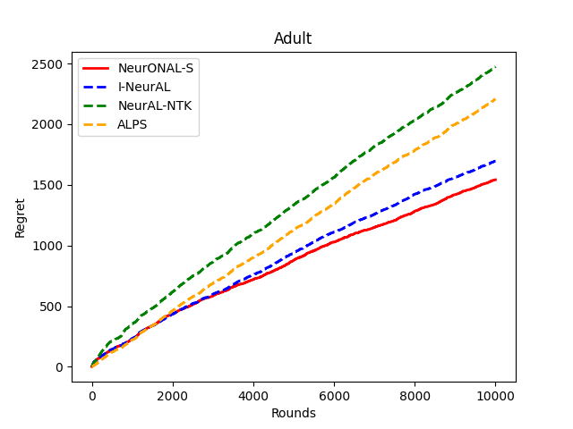 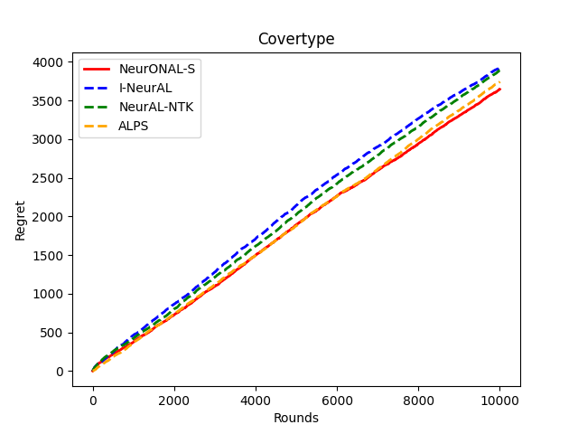 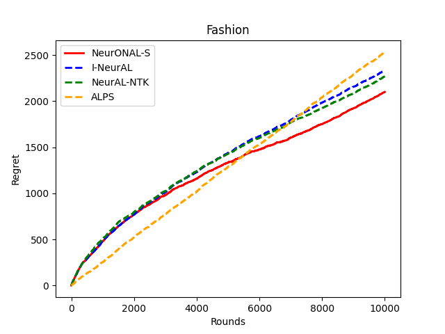 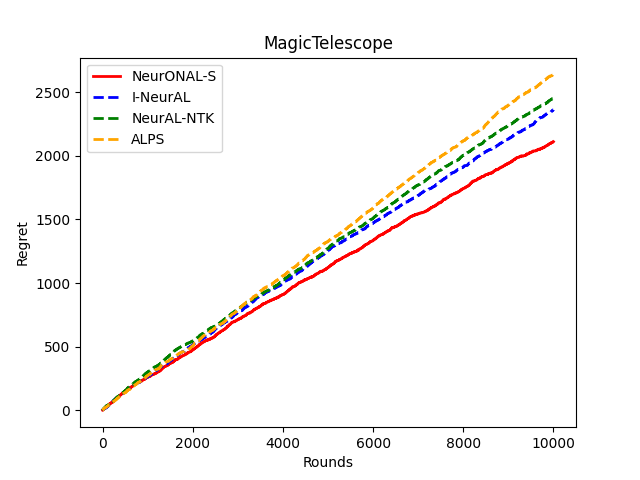  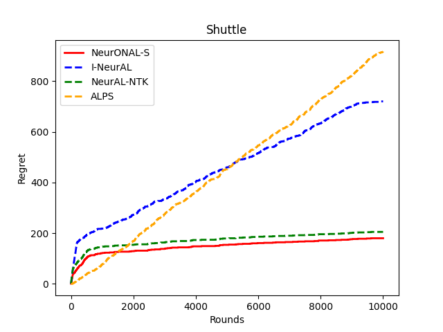</p>
<figcaption>Regret comparison on six datasets in the <strong>stream-based</strong> setting. <span class="smallcaps">NeurOnAl</span>-S outperforms baselines on most datasets.</figcaption>
</figure>

## Stream-Based

<div id="table:streamperformance2">

|  | Adult | MT | Letter | Covertype | Shuttle | Fashion |
|:--:|:--:|:--:|:--:|:--:|:--:|:--:|
| NeurAL-NTK | 80.1 $`\pm`$ 0.06 | 76.9 $`\pm`$ 0.1 | 79.6 $`\pm`$ 0.23 | 62.1 $`\pm`$ 0.02 | 96.2 $`\pm`$ 0.21 | 64.3 $`\pm`$ 0.13 |
| I-NeurAL | 84.1 $`\pm`$ 0.29 |  79.9 $`\pm`$ 0.14 | 82.9 $`\pm`$ 0.04 |  65.2 $`\pm`$ 0.16 | 99.3 $`\pm`$<!-- -->0.07 | 73.6 $`\pm`$ 0.29 |
| ALPS | 75.6 $`\pm`$ 0.19 | 35.9 $`\pm`$ 0.76 | 73.0 $`\pm`$ 0.41 | 36.2 $`\pm`$ 0.25 | 78.5 $`\pm`$ 0.21 | 74.3 $`\pm`$ 0.01 |
| <span class="smallcaps">NeurOnAl</span>-S | **84.7 $`\pm`$ 0.32** | **83.7 $`\pm`$ 0.16** | **86.8 $`\pm`$ 0.12** | **74.5 $`\pm`$ 0.15** | **99.7 $`\pm`$ 0.02** | **82.2 $`\pm`$<!-- -->0.18** |

Test accuracy of all methods in stream-based setting

</div>

Baselines. Given an instance, NeurAL-NTK is a method that predicts $`K`$ scores for $`K`$ classes sequentially, only based on the exploitation NN classifier with an Upper-Confidence-Bound (UCB). On the contrary, I-NeurAL predicts $`K`$ scores for $`K`$ classes sequentially, based on both the exploitation and exploration NN classifiers. NeurAL-NTK and I-NeurAL query for a label when the model cannot differentiate the Bayes-optimal class from other classes. Finally, ALPS makes a prediction by choosing a hypothesis (from a set of pre-trained hypotheses) that minimizes the loss of labeled and pseudo-labeled data, and queries based on the difference between hypotheses.

Implementation Details. We perform hyperparameter tuning on the training set. Each method has a couple of hyperparameters: the learning rate, number of epochs, batch size, label budget percentage, and threshold (if applicable). During hyperparameter tuning for all methods, we perform a grid search over the values $`\{0.0001, 0.0005, 0.001\}`$ for the learning rate, $`\{10, 20, 30, 40, 50, 60, 70, 80, 90\}`$ for the number of epochs, $`\{32, 64, 128, 256\}`$ for the batch size, $`\{0.1, 0.3, 0.5, 0.7, 0.9\}`$ for the label budget percentage and $`\{1, 2, 3, 4, 5, 6, 7, 8, 9\}`$ for the threshold (exploration) parameter. Here are the final hyperparameters in the form {learning rate, number of epochs, batch size, label budget percentage, and the turning hyperparameter}: NeurAL-NTK and ALPS use $`\{0.001, 40, 64, 0.3, 3\}`$, and I-NeurAL uses $`\{0.001, 40, 32, 0.3, 6\}`$. For <span class="smallcaps">NeurOnAl</span>-S, we set $`\mu = 1`$ for all experiments and conduct the grid search for $`\gamma`$ over $`\{1, 2, 3, 4, 5, 6, 7, 8, 9\}`$. In the end, <span class="smallcaps">NeurOnAl</span>-S uses $`\{0.0001, 40, 64, 0.3, 6\}`$ for all datasets. We set $`S  =1`$ as the norm parameter for <span class="smallcaps">NeurOnAl</span>-S all the time.

Cumulative Regret. Figure <a href="#fig:regret_comp" data-reference-type="ref" data-reference="fig:regret_comp">3</a> shows the regret comparison for each of the six datasets in 10,000 rounds of stream-based active learning. <span class="smallcaps">NeurOnAl</span>-S outperforms baselines on most datasets. This demonstrates that our designed NN model attains effectiveness in the active learning process, which is consistent with the best performance achieved by <span class="smallcaps">NeurOnAl</span>-S in testing accuracy.

Ablation study for label budget. Tables <a href="#ablation_3" data-reference-type="ref" data-reference="ablation_3">4</a> to <a href="#ablation_50" data-reference-type="ref" data-reference="ablation_50">6</a> show the <span class="smallcaps">NeurOnAl</span>-S in active learning with different budget percentages: 3%, 10%, 50 %. <span class="smallcaps">NeurOnAl</span>-S achieves the best performance in most of the experiments. With 3% label budget, almost all NN models are not well trained. Thus, <span class="smallcaps">NeurOnAl</span> does not perform stably. With 10% and 50% label budget, <span class="smallcaps">NeurOnAl</span> achieves better performance, because the advantages of NN models can better exploit and explore this label information.

<div id="ablation_3">

|  | Adult | Covertype | Fashion | MagicTelescope | Letter | Shuttle |
|:--:|:--:|:--:|:--:|:--:|:--:|:--:|
| I-NeurAL | 79.4% | 52.8% | 51.9% | 72.3% | 74.6% | 93.0% |
| NeurAL-NTK | 23.9% | 1.56% | 11.9% | 32.9% | 42.8% | 70.6% |
| ALPS | 24.2% | 36.8% | 10.0% | 64.9% | 72.7% | 79.4% |
| <span class="smallcaps">NeurOnAl</span>-S | **79.9%** | **65.6%** | 69.7% | **77.3%** | 74.2% | **99.8%** |

Test accuracy with 3% budget in stream-based setting

</div>

<div id="ablation_10">

|  | Adult | Covertype | Fashion | MagicTelescope | Letter | Shuttle |
|:--:|:--:|:--:|:--:|:--:|:--:|:--:|
| I-NeurAL | 80.5% | 55.4% | 71.4% | 77.9% | 81.8% | 99.2% |
| NeurAL-NTK | 70.5% | 59.9% | 38.7% | 34.3% | 53.8% | 75.9% |
| ALPS | 24.2% | 36.8% | 10.0% | 35.1% | 79.9% | 79.4% |
| <span class="smallcaps">NeurOnAl</span>-S | **79.5%** | **71.3%** | 81.3% | **82.1%** | **81.8%** | **99.8%** |

Test accuracy with 10% budget in stream-based setting

</div>

<div id="ablation_50">

|  | Adult | Covertype | Fashion | MagicTelescope | Letter | Shuttle |
|:--:|:--:|:--:|:--:|:--:|:--:|:--:|
| I-NeurAL | 83.4% | 65.9% | 82.5% | 77.9% | 85.8% | 99.7% |
| NeurAL-NTK | 76.9% | 73.1% | 56.8% | 81.6% | 79.3% | 97.1% |
| ALPS | 75.8% | 36.8% | 10.0% | 64.9% | 81.5% | 79.4% |
| <span class="smallcaps">NeurOnAl</span>-S | **84.6%** | **75.9%** | **85.4%** | **86.4%** | **86.9%** | **99.8%** |

Test accuracy with 50% budget in stream-based setting

</div>

## Pool-based

Baselines. BADGE uses gradient embeddings to model uncertainty - if the gradient in the last neural network layer is large, the uncertainty is also large. They pick random points to query using the k-meanss++ algorithm and repeat this process. DynamicAL introduces the concept of training dynamics into active learning. Given an instance, they assign it a pseudo-label and monitor how much the model changes. They query for the label of the point with the biggest change in the training dynamics. CoreSet has a simple but powerful approach. The algorithm chooses points to query based on the loss over the labeled points and the loss over the unlabelled points, i.e., the core-set loss. ALBL is a hybrid active learning algorithm that combines Coreset and Conf .

Implementation details. For all methods, we conduct the same grid search as the stream-based setting for the learning rate and number of epochs. For <span class="smallcaps">NeurOnAl</span>-P, we perform a grid search over $`\mu, \gamma \in \{500, 1000, 2000\}`$.

<figure id="fig:regret_poolaccuracy">
<p>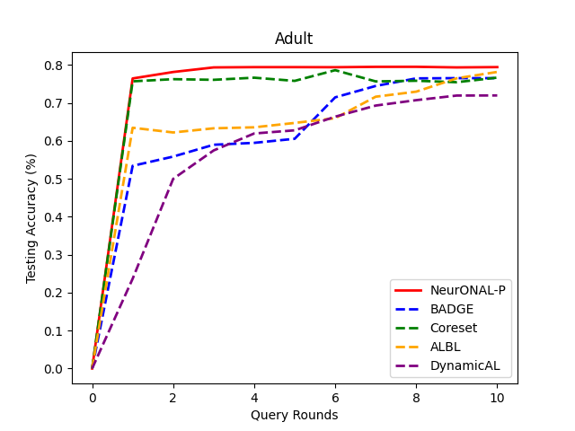 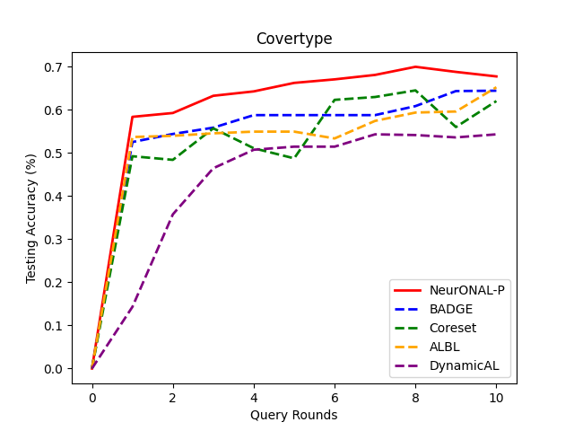 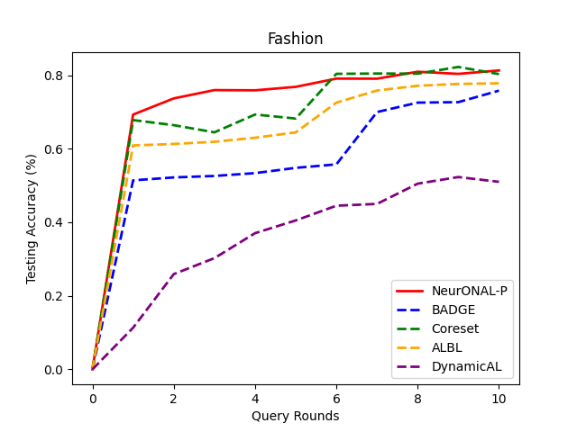 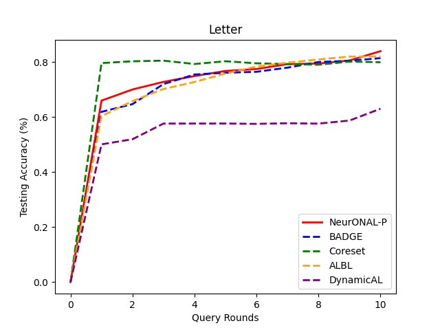 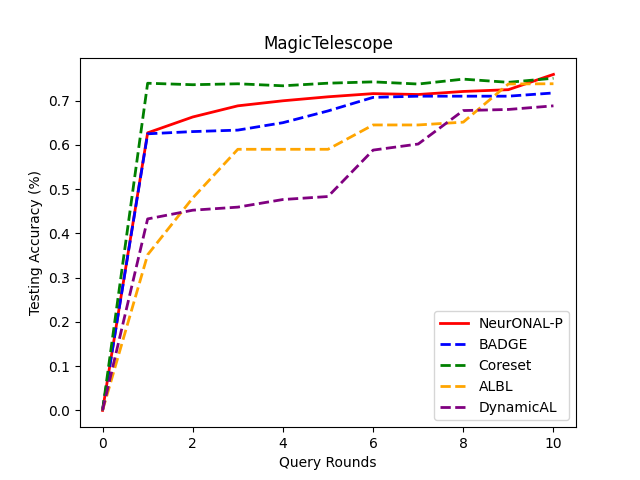 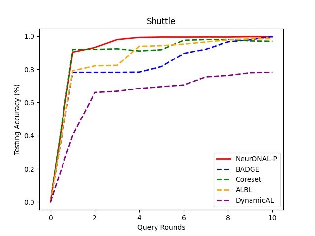</p>
<figcaption>Test accuracy versus the number of query rounds in <strong>pool-based</strong> setting on six datasets. <span class="smallcaps">NeurOnAl</span>-P outperforms baselines on all datasets.</figcaption>
</figure>

Testing accuracy. Figure <a href="#fig:regret_poolaccuracy" data-reference-type="ref" data-reference="fig:regret_poolaccuracy">4</a> shows the average test accuracy at each round. <span class="smallcaps">NeurOnAl</span>-P can outperform baselines in a few query rounds. Our method utilizes a highly effective network structure, including the principled exploration network and inverse-weight-based selection strategy. Unlike CoreSet, which solely relies on the embeddings derived from the last layer of exploitation neural networks to select samples based on maximum distance, our approach avoids susceptibility to outlier samples. Similarly, BADGE also operates on the last layer of the exploitation network using the seed-based clustering method, lacking adaptability to the state of the exploitation network. DynamicAL’s approach relies on the training dynamics of the Neural Tangent Kernel that usually requires very wide neural networks. ALBL is a blending approach, but it still suffers from the limitation of CoreSet.

Ablation study for $`\mu`$ and $`\gamma`$. Table <a href="#pool_ablation" data-reference-type="ref" data-reference="pool_ablation">7</a> shows <span class="smallcaps">NeurOnAl</span>-P with varying $`\mu`$ and $`\gamma`$ values (500, 1000, 2000) on four datasets. Intuitively, if $`\gamma`$ and $`\mu`$ is too small, <span class="smallcaps">NeurOnAl</span>-P will place more weights on the tail of the distribution of $`P`$. Otherwise, <span class="smallcaps">NeurOnAl</span>-P will focus more on the head of the distribution of $`P`$. From the results in the table, it seems that different datasets respond to different values of $`\mu`$ and $`\gamma`$. This sensitivity study roughly shows good values for $`\mu, \gamma`$.

<div id="pool_ablation">

|  |  |  |  |  |  |  |  |  |  |  |
|:---|:---|:---|:---|:---|:---|:---|:---|:---|:---|:---|
|  |  | Letter |  |  |  |  |  | Adult |  |  |
|  |  |  | $`\gamma`$ |  |  |  |  |  | $`\gamma`$ |  |
|  |  | 500 | 1000 | 2000 |  |  |  | 500 | 1000 | 2000 |
| 2-5 | 500 | 80.9% | 81.7% | 80.5% |  |  | 500 | **79.9**% | 79.4% | 78.9% |
| $`\mu`$ | 1000 | 77.9% | **83.9**% | 78.9% |  | $`\mu`$ | 1000 | 79.1% | 79.7% | 79.0% |
|  | 2000 | 81.7% | 81.8% | 80.1% |  |  | 2000 | 79.4% | 79.4% | 79.7% |
|  |  |  |  |  |  |  |  |  |  |  |
|  |  | Fashion |  |  |  |  |  | MT |  |  |
|  |  |  | $`\gamma`$ |  |  |  |  |  | $`\gamma`$ |  |
|  |  | 500 | 1000 | 2000 |  |  |  | 500 | 1000 | 2000 |
| 2-5 | 500 | 80.3% | 80.5% | 79.5% |  |  | 500 | 79.5% | 80.9% | 80.6% |
| $`\mu`$ | 1000 | 80.5% | 80.6% | 80.4% |  | $`\mu`$ | 1000 | 80.2% | 80.9% | 80.1% |
|  | 2000 | 80.8% | **80.9**% | 80.7% |  |  | 2000 | 80.5% | 80.6% | **81.3**% |

Testing Accuracy on four datasets (Letter, Adult, Fashion, and MT) with varying $`\mu`$ and $`\gamma`$ in pool-based setting

</div>

<span id="pool_ablation" label="pool_ablation"></span>

# Stream-based VS Pool-based

To answer the question "Can one directly convert the stream-based algorithm to the pool-based setting?", we implemented the idea that one uniformly samples data from the pool to feed it to the stream-based active learner. Denote the new algorithm by Neu-UniS, described as follows.

**Neu-UniS**: In a round of pool-based active learning, we uniformly draw a sample from the pool and feed it to the stream-based learner. If the stream-based learner decides to query the label, it costs one unit of the label budget; otherwise, we keep uniformly drawing a sample until the stream-based learner decides to query the label. Once the label is queried, we train the neural model based on the sample and label. We keep doing this process until we run out of the label budget. In this algorithm, the stream-based learner is set as <span class="smallcaps">NeurOnAl</span>-S (Algorithm 1 in the manuscript).

Under the same setting used in our pool-based experiments, the testing accuracy of Neu-UniS compared to our pool-based algorithm <span class="smallcaps">NeurOnAl</span>-P is reported in Table <a href="#tab:streamvspool" data-reference-type="ref" data-reference="tab:streamvspool">8</a>.

<div id="tab:streamvspool">

|  | Adult | Covertype | Fashion | MT | Letter | Shuttle |
|:--:|:--:|:--:|:--:|:--:|:--:|:--:|
| Neu-UniS | 78.0 | 59.4 | 78.6 | 71.3 | 79.4 | 97.9 |
| <span class="smallcaps">NeurOnAl</span>-P | **79.9** | **66.9** | **80.9** | **81.3** | **83.9** | **99.6** |

Test Accuracy of Neu-UniS and <span class="smallcaps">NeurOnAl</span>-P

</div>

<span id="tab:streamvspool" label="tab:streamvspool"></span>

Why does <span class="smallcaps">NeurOnAl</span>-P outperform Neu-UniS? Because Neu-UniS does not rank data instances and only randomly chooses the data instances that satisfy the query criterion. All the stream-based algorithms have one criterion to determine whether to query the label for this data point, such as Lines 8-9 in Algorithm 1. Suppose there are 200 data points. If the 100 data points among them satisfy the criterion, then Neu-UniS will randomly choose one from the 100 data points, because we uniformly draw a data point and feed it to stream-based learner in each round.

On the contrary, <span class="smallcaps">NeurOnAl</span>-P has a novel component (Lines 10-12 in Algorithm 2) to rank all the data points, and then draw a sample from the newly formed distribution, to balance exploitation and exploration. To the best of our knowledge, this is the first inverse-gap weighting strategy in active learning. Thus, its analysis is also novel.

In summary, stream-based algorithms cannot directly convert into pool-based algorithms, because they do not have the ranking component which is necessary in the pool-based setting. Existing works only focus on the stream-based setting and only focus on pool-based setting. We could hardly find existing works that incorporate both stream-based and pool-based settings.

# Upper Bound and Lower Bound for $`L_{\mathbf{H}}`$

<div id="ntkdef" class="definition">

**Definition 2** (NTK ). *Let $`\mathcal{N}`$ denote the normal distribution. Given the data instances $`\{\mathbf{x}_t\}_{t=1}^T`$, for all $`i, j \in [T]`$, define
``` math
\begin{aligned}
&\mathbf{H}_{i,j}^0 = \Sigma^{0}_{i,j} =  \langle \mathbf{x}_i, \mathbf{x}_j\rangle,   \ \ 
\mathbf{A}^{l}_{i,j} =
\begin{pmatrix}
\Sigma^{l}_{i,i} & \Sigma^{l}_{i,j} \\
\Sigma^{l}_{j,i} &  \Sigma^{l}_{j,j} 
\end{pmatrix} \\
&   \Sigma^{l}_{i,j} = 2 \mathbb{E}_{a, b \sim  \mathcal{N}(\mathbf{0}, \mathbf{A}_{i,j}^{l-1})}[ \sigma(a) \sigma(b)], \ \  \mathbf{H}_{i,j}^l = 2 \mathbf{H}_{i,j}^{l-1} \mathbb{E}_{a, b \sim \mathcal{N}(\mathbf{0}, \mathbf{A}_{i,j}^{l-1})}[ \sigma'(a) \sigma'(b)]  + \Sigma^{l}_{i,j}.
\end{aligned}
```
Then, the Neural Tangent Kernel matrix is defined as $`\mathbf{H} =  (\mathbf{H}^L + \Sigma^{L})/2`$.*

</div>

Then, we define the following gram matrix $`\mathbf{G}`$. Let $`g(x; \boldsymbol \theta_0) = \triangledown_{\boldsymbol \theta}f(x; \boldsymbol \theta_0) \in \mathbb{R}^p`$ and $`G = [g(\mathbf{x}_{1, 1}; \boldsymbol \theta_0)/\sqrt{m}, \dots, g(\mathbf{x}_{T, K}; \boldsymbol \theta_0)/\sqrt{m}] \in \mathbb{R}^{p \times TK}`$ where $`p = m + mKd+m^2(L-2)`$. Therefore, we have $`\mathbf{G} = G^\top G`$. Based on Theorem 3.1 in , when $`m \geq \Omega(T^4 K^6 \log (2TK/\delta) / \epsilon^4)`$, with probability at least $`1-\delta`$, we have
``` math
\|\mathbf{G}  - \mathbf{H}\|_F \leq \epsilon.
```
Then, we have the following bound:
``` math
\begin{aligned}
\log \det( \mathbf{I} + \mathbf{H}) & = \log \det \left(\mathbf{I} + \mathbf{G } + (\mathbf{H} - \mathbf{G})    \right) \\
&  \overset{(e_1)}{\leq}   \log \det (\mathbf{I} + \mathbf{G}) + \langle (\mathbf{I} + \mathbf{G})^{-1}, (\mathbf{H} -\mathbf{G})   \rangle\\
& \leq  \log \det (\mathbf{I} + \mathbf{G})  + \|  (\mathbf{I} + \mathbf{G})^{-1}  \|_F \| \mathbf{H}- \mathbf{G}\|_F\\
& \overset{(e_2)}{\leq}  \log \det (\mathbf{I} + \mathbf{G})  + \sqrt{T} \| \mathbf{H}- \mathbf{G}\|_F\\
& \overset{(e_3)}{\leq} \log \det (\mathbf{I} + \mathbf{G})  + 1\\
\end{aligned}
```
where $`(e_1)`$ is because of the concavity of $`\log \det (\cdot)`$, $`(e_2)`$ is by Lemma B.1 in with the choice of $`m`$, and $`(e_3)`$ is by the proper choice of $`\epsilon`$. Then, $`L_{\mathbf{H}}`$ can be bounded by:
``` math
\begin{aligned}
\log \det (\mathbf{I} + \mathbf{H})
&\leq  \log \det (\mathbf{I} + \mathbf{G})  + 1 \\
& \overset{ (e_1)}{ =} \log \det (\mathbf{I} + G G^\top)  + 1 \\
 & = \log \det \left(\mathbf{I} + \sum_{i=1}^{TK} g(\mathbf{x}_{i}; \boldsymbol \theta_0) g(\mathbf{x}_{i}; \boldsymbol \theta_0)^\top/m \right)  + 1 \\
& \overset{(e_2)}{\leq} p \cdot  \log (1 + \mathcal{O}(TK)/p)  + 1 \\
\end{aligned}
```
where $`(e_1)`$ is because of $`\det (\mathbf{I} + G^\top G) =  \det (\mathbf{I} + GG^\top)`$ and $`(e_2)`$ is an application of Lemma 10 in and $`\| g(\mathbf{x}_{i}; \boldsymbol \theta_0)\|_2 \leq \mathcal{O}(\sqrt{mL})`$ with $`L = 2`$. Because $`p= m + mKd+m^2 \times (L-2)`$, we have
``` math
L_{\mathbf{H}}  =  \log \det (\mathbf{I} + \mathbf{H}) \leq \widetilde{\mathcal{O}}(mKd).
```
For the lower bound of $`L_{\mathbf{H}}`$, we have
``` math
L_{\mathbf{H}}  =  \log   \det(\mathbf{I}+\mathbf{H}) \geq \log\left(\lambda_{\min}\left(\mathbf{I} + \mathbf{H}\right)^{TK}\right) = TK \log(1 + \lambda_0).
```

# Proof of Theorem <a href="#theo:activenomargin" data-reference-type="ref" data-reference="theo:activenomargin">[theo:activenomargin]</a> and Theorem <a href="#theo:onlinelearningregretbound" data-reference-type="ref" data-reference="theo:onlinelearningregretbound">[theo:onlinelearningregretbound]</a>

First, define the general neural structure:
``` math
\mathbf{f}(\mathbf{x}_{t}; \boldsymbol \theta) := \sqrt{m} \mathbf{W}_L\sigma(\mathbf{W}_{L-1} \dots \sigma(\mathbf{W}_1 \mathbf{x}_{t}))) \in \mathbb{R}^K,
```
where $`\boldsymbol \theta= [\text{vec}(\mathbf{W}_1)^\top, \dots, \text{vec}(\mathbf{W}_L)^\top]^\top \in \mathbb{R}^{p}`$. Following , given an instance $`\mathbf{x}`$, we define the outputs of hidden layers of the neural network:
``` math
\mathbf{g}_{t, 0} = \mathbf{x}_{t},  \mathbf{g}_{t,l} = \sigma(\mathbf{W}_l \mathbf{g}_{t, l-1}), l \in [L-1].
```
Then, we define the binary diagonal matrix functioning as ReLU:
``` math
\mathbf{D}_{t,l} = \text{diag}( \mathbbm{1}\{(\mathbf{W}_l \mathbf{g}_{t, l-1})_1 \}, \dots, \mathbbm{1}\{(\mathbf{W}_l \mathbf{g}_{t, l-1})_m \} ), l \in [L-1].
```
Accordingly, the neural network is represented by
``` math
\mathbf{f}(\mathbf{x}_t; \boldsymbol \theta) = \sqrt{m} \mathbf{W}_L (\prod_{l=1}^{L-1} \mathbf{D}_{t, l} \mathbf{W}_{l}) \mathbf{x}_t,
```
and we have the following gradient form:
``` math
\nabla_{\mathbf{W}_l}\mathbf{f}(\mathbf{x}_t; \boldsymbol \theta)   = 
\begin{cases}
\sqrt{m} \cdot [\mathbf{g}_{t, l-1}\mathbf{W}_L (\prod_{\tau=l+1}^{L-1} \mathbf{D}_{t, \tau} \mathbf{W}_\tau)]^\top, l \in [L-1] \\
\sqrt{m} \cdot \mathbf{g}_{t, L-1}^\top,   l = L .
\end{cases}
```
Let $`\boldsymbol \theta_1`$ be the random initialization of parameters of neural networks. Then, we define the following neural network function class: Given a constant $`R > 0`$, the function class is defined as
``` math
\label{eq:functionball}
    \mathcal{B}(\boldsymbol \theta_1, R) = \{ \boldsymbol \theta\in \mathbb{R}^{p}: \|\boldsymbol \theta- \boldsymbol \theta_1\|_2 \leq R / m^{1/2} \}.
```

<div id="lemma:caogud1" class="lemma">

**Lemma 1** (). *With probability at least $`1- \mathcal{O}(TL)\cdot \exp[-\Omega(m \omega^{2/3L})]`$, given $`\omega \leq \mathcal{O}(L^{-9/2}[\log (m)]^{-3/2})`$, for all $`\boldsymbol \theta, \boldsymbol \theta' \in \mathcal{B}(\boldsymbol \theta_1, R), i\in[T], l \in [L-1]`$
``` math
\begin{aligned}
\| \mathbf{g}_{t, l}   \| &\leq \mathcal{O}(1) \\
\| \mathbf{D}_{i, l} - \mathbf{D}_{i, l}'\|_2  &\leq \mathcal{O}(L\omega^{2/3} m).
\end{aligned}
```*

</div>

<div class="lemma">

**Lemma 2**. *With probability at least $`1 - \mathcal{O}(TL^2)\cdot \exp[-\Omega (m \omega^{2/3}L)]`$, uniformly over any diagonal matrices $`\mathbf{D}_{i, 1}'', \dots, \mathbf{D}_{i, L-1}'' \in [-1, 1]^{m \times m}`$ with at most $`\mathcal{O}(m \omega^{2/3}L)`$ non-zero entries, for any $`\boldsymbol \theta, \boldsymbol \theta' \in \mathcal{B}(\boldsymbol \theta_1; \omega)`$ with $`\omega \leq \mathcal{O}(L^{-6}[\log (m)]^{-3/2})`$, we have the following results:*

*``` math
\begin{aligned}
 &(1) \| \prod_{\tau \in l}(\mathbf{D}_{i, \tau} + \mathbf{D}_{i, \tau}'') \mathbf{W}_\tau\|_2 \leq \mathcal{O}(\sqrt{L})   \label{eq:results1}  \\
& (2) \|\mathbf{W}_L \prod_{\tau = l_1}^{L-1} (\mathbf{D}_{i, \tau} + \mathbf{D}_{i, \tau}'' ) \mathbf{W}_\tau \|_F \leq \mathcal{O}\left(\frac{1}{\sqrt{K}} \right)  \label{eq:results2} \\
& (3) \left \| \mathbf{W}_L' \prod_{\tau = l_1}^{L-1} ( \mathbf{D}_{i, \tau}'  +\mathbf{D}_{i, \tau}'') \mathbf{W}_\tau' - \mathbf{W}_L \prod_{\tau = l_1}^{L-1} \mathbf{D}_{i, \tau} \mathbf{W}_\tau      \right\|_F \leq \mathcal{O}\left( \frac{\omega^{1/3} L^2 \sqrt{\log (m)}}{ \sqrt{K}} \right)    \label{eq:caogu3}  .  
\end{aligned}
```*

</div>

<div class="proof">

*Proof.* Based on Lemma <a href="#lemma:caogud1" data-reference-type="ref" data-reference="lemma:caogud1">1</a>, with high probability at least $`1- \mathcal{O}(nL) \cdot \exp (-\Omega(L\omega^{2/3}m))`$, $`\| \mathbf{D}'_{i, l} + \mathbf{D}_{i, l}'' - \mathbf{D}_{i,l}^{(1)}\|_0 \leq \mathcal{O}(L \omega^{2/3} m) \|_0`$. Applying Lemma 8.6 in proves <a href="#eq:results1" data-reference-type="ref" data-reference="eq:results1">[eq:results1]</a>. Then, by lemma 8.7 in with $`s = \mathcal{O}(m\omega^{2/3}L)`$ to $`\mathbf{W}`$ and $`\mathbf{W}'`$, the results hold:
``` math
\label{eq:d31}
\begin{aligned}
\sqrt{m} \left\| \mathbf{W}_L^{(1)} \prod_{\tau = l_1}^{L-1}(\mathbf{D}'_{i, \tau} + \mathbf{D}_{i, \tau}'')\mathbf{W}_\tau' - \mathbf{W}_L^{(1)} \prod_{r = l_1}^{L-1} \mathbf{D}_{i, \tau}^{(1)}\mathbf{W}_\tau^{(1)} \right\|_2 \leq \mathcal{O}\left(\frac{\omega^{1/3} L^2 \sqrt{m \log  (m)}}{\sqrt{K}} \right)\\
\sqrt{m} \left \|\mathbf{W}_L^{(1)} \prod_{\tau = l_1}^{L-1} \mathbf{D}_{i, \tau} \mathbf{W}_\tau - \mathbf{W}_L^{(1)} \prod_{\tau = l_1} \mathbf{D}_{i, \tau}^{(1)} \mathbf{W}_{\tau}^{(1)} \right \|      \leq \mathcal{O}\left(\frac{\omega^{1/3} L^2 \sqrt{m \log (m)}}{\sqrt{K}}\right).
\end{aligned}
```
Moreover, using Lemma <a href="#lemma:caogud1" data-reference-type="ref" data-reference="lemma:caogud1">1</a> gain, we have
``` math
\label{eq:d32}
\begin{aligned}
\left\|  (\mathbf{W}_L' - \mathbf{W}_L^{(1)} ) \prod_{\tau = l_1}^{L-1}(\mathbf{D}_{i,\tau}'  + \mathbf{D}_{i, \tau}'') \mathbf{W}_\tau' \right \|_2 \leq \mathcal{O}(\sqrt{L} \omega)\leq \mathcal{O}\left(\frac{\omega^{1/3} L^2 \sqrt{m \log (m)}}{\sqrt{K}}\right) \\
\left \| (\mathbf{W}_L - \mathbf{W}^{(1)}_L) \prod_{\tau = l_1}^{L-1} \mathbf{D}_{i, \tau} \mathbf{W}_\tau   \right\|_2\leq  \mathcal{O}(\sqrt{L}\omega)   \leq \mathcal{O}\left(\frac{\omega^{1/3} L^2 \sqrt{m \log (m)}}{\sqrt{K}}\right)
\end{aligned}
```
Then, combining <a href="#eq:d31" data-reference-type="eqref" data-reference="eq:d31">[eq:d31]</a> and <a href="#eq:d32" data-reference-type="eqref" data-reference="eq:d32">[eq:d32]</a> leads the result. For, it has
``` math
\begin{aligned}
\left \|  \mathbf{W}_L \prod_{\tau = l_1}^{L-1}(\mathbf{D}_{i, \tau} + \mathbf{D}_{i, \tau}'') \mathbf{W}_\tau           \right \|_2  & \leq   \left \|    \mathbf{W}_L \prod_{\tau =l_1}^{L-1} (\mathbf{D}_{i, \tau} + \mathbf{D}_{i, \tau}'') \mathbf{W}_\tau - \mathbf{W}_L^{(1)} \prod_{\tau = l_1}^{L-1} \mathcal{D}_{i, \tau}^{(1)} \mathbf{W}^{(1)}_\tau \right\|_2  \\
& + \| \mathbf{W}_L^{(1)} \prod_{\tau = l_1}^{L-1} \mathbf{D}_{i, \tau}^{(1)} \mathbf{W}_{\tau}^{(1)}         \|_2 \\
& \overset{(a)}{\leq} \mathcal{O}\left(\frac{\omega^{1/3} L^2 \sqrt{m \log (m)}}{\sqrt{K}}\right)  +\mathcal{O}(\frac{1}{\sqrt{K}})  =\mathcal{O}(\frac{1}{\sqrt{K}} )
\end{aligned}
```
where $`(a)`$ is applying the and Lemma 7.4 in . The proof is completed. ◻

</div>

<div id="lemma:outputbound" class="lemma">

**Lemma 3**. *Suppose the derivative of loss function $`\mathcal{L}' \leq  \mathcal{O}(1)`$. With probability at least $`1- \mathcal{O}(TKL^2)\cdot \exp[-\Omega(m \omega^{2/3}L)]`$, for all $`t \in [T]`$, $`\| \boldsymbol \theta- \boldsymbol \theta_1    \| \leq \omega`$ and $`\omega \leq \mathcal{O}(L^{-6} [\log (m)]^{-3})`$, suppose $`\|\mathcal{L}_t(\boldsymbol \theta)'\|_2 \leq \sqrt{K}`$, it holds uniformly that
``` math
\begin{aligned}
& \| \nabla_{\boldsymbol \theta} \mathbf{f}(\mathbf{x}_t; \boldsymbol \theta) \|_2  \leq \mathcal{O}(\sqrt{Lm})  \label{eq:gradientbound} \\
& \|\nabla_{\boldsymbol \theta} \mathbf{f}(\mathbf{x}_t; \boldsymbol \theta)[k]\|\leq \mathcal{O}(\sqrt{Lm})  \label{eq:gradientboundk} \\
& \|   \nabla_{\boldsymbol \theta}\mathcal{L}_t(\boldsymbol \theta)      \|_2  \leq  \mathcal{O}\left(\sqrt{(K +L-1)m} \right)  
\end{aligned}
```*

</div>

<div class="proof">

*Proof.* By Lemma <a href="#lemma:caogud1" data-reference-type="ref" data-reference="lemma:caogud1">1</a>, the result holds:
``` math
\| \nabla_{\mathbf{W}_L} f(\mathbf{x}_t; \boldsymbol \theta)        \|_F = \| \sqrt{m}  \mathbf{g}_{t, L-1}         \|_2  \leq 
 \mathcal{O}(\sqrt{m}).
```
For $`l \in [L-1]`$, the results hold:
``` math
\begin{aligned}
\| \nabla_{\mathbf{W}_l} f(\mathbf{x}_t; \boldsymbol \theta)\|_F & = \sqrt{m} \| \mathbf{g}_{t, l-1}\mathbf{W}_L (\prod_{\tau=l+1}^{L-1} \mathbf{D}_{t, \tau} \mathbf{W}_\tau) \| \\  
& =  \sqrt{m} \cdot \|  \mathbf{g}_{t, l-1}     \|_2 \cdot \|   \mathbf{W}_L (\prod_{\tau=l+1}^{L-1} \mathbf{D}_{t, \tau} \mathbf{W}_\tau) \|_F \\
& \leq \mathcal{O}\left( \frac{\sqrt{m}}{\sqrt{K}} \right)
\end{aligned}
```
Thus, applying the union bound, for $`l \in [L], t \in [T], k \in [K]`$ it holds uniformly that
``` math
\| \nabla_{\boldsymbol \theta}  \mathbf{f}(\mathbf{x}_t; \boldsymbol \theta)\|_2 \leq     \sqrt{\sum_{l-1}^L \|   \nabla_{\mathbf{W}_l} \mathbf{f}(\mathbf{x}_i; \boldsymbol \theta)       \|_F^2  }  \leq  \mathcal{O}\left( \sqrt{\frac{K+L}{K}m} \right)  = \mathcal{O}(\sqrt{Lm}).
```
Let $`\mathbf{e}_k`$ be the $`k`$-th basis vector. Then, we have
``` math
\| \nabla_{\boldsymbol \theta}  \mathbf{f}(\mathbf{x}_t; \boldsymbol \theta)[k]\|_2 \leq \sqrt{\sum_{l-1}^L \|\mathbf{e}_k\|_2^2 \|   \nabla_{\mathbf{W}_l} \mathbf{f}(\mathbf{x}_i; \boldsymbol \theta)       \|_F^2  } \leq   \mathcal{O}(\sqrt{Lm}).
```
These prove <a href="#eq:gradientbound" data-reference-type="eqref" data-reference="eq:gradientbound">[eq:gradientbound]</a> and <a href="#eq:gradientboundk" data-reference-type="eqref" data-reference="eq:gradientboundk">[eq:gradientboundk]</a>. For $`\mathbf{W}_L`$, the result holds:
``` math
\|\nabla_{\mathbf{W}_L}\mathcal{L}_t(\boldsymbol \theta)     \|_F =  \|  \mathcal{L}_t(\boldsymbol \theta)'  \|_2 \cdot \| \nabla_{\mathbf{W}_L} f(\mathbf{x}_t; \boldsymbol \theta)\|_F \leq \mathcal{O}(\sqrt{Km}).
```
For $`l \in [L-1]`$, the results hold:
``` math
\|\nabla_{\mathbf{W}_l}\mathcal{L}_t(\boldsymbol \theta) \|_F = \|  \mathcal{L}_t(\boldsymbol \theta)'  \|_2 \cdot \| \nabla_{\mathbf{W}_l} f(\mathbf{x}_t; \boldsymbol \theta)\|_F \leq \mathcal{O}(\sqrt{m}).
```
Therefore, $`\|   \nabla_{\boldsymbol \theta}\mathcal{L}_t(\boldsymbol \theta)      \|_2 = \sqrt{  \sum_{l=1 }^L \|     \nabla_{\mathbf{W}_l}\mathcal{L}_t(\boldsymbol \theta)      \|_F^2   }  \leq \sqrt{(K+L-1)m}`$. ◻

</div>

<div id="lemma:functionntkbound" class="lemma">

**Lemma 4**. *With probability at least $`1- \mathcal{O}(TL^2K)\exp[-\Omega(m \omega^{2/3} L)]`$ over random initialization, for all $`t \in [T]`$, and $`\boldsymbol \theta, \boldsymbol \theta'`$ satisfying $`\| \boldsymbol \theta- \boldsymbol \theta_1 \|_2 \leq w`$ and $`\| \boldsymbol \theta' - \boldsymbol \theta_1 \|_2 \leq w`$ with $`\omega \leq \mathcal{O}(L^{-6} [\log m]^{-3/2})`$, , it holds uniformly that
``` math
| \mathbf{f}(\mathbf{x}_t; \boldsymbol \theta')[k] - \mathbf{f}(\mathbf{x}_t; \boldsymbol \theta)[k] -  \langle  \nabla_{\boldsymbol \theta} \mathbf{f}(\mathbf{x}_t; \boldsymbol \theta)[k], \boldsymbol \theta' - \boldsymbol \theta\rangle   | \leq \mathcal{O} \left ( \frac{\omega^{1/3}L^3 \sqrt{ m \log(m)}}{\sqrt{K}} \right) \|\boldsymbol \theta- \boldsymbol \theta'\|_2.
```*

</div>

<div class="proof">

*Proof.* Let $`F(\mathbf{x}_t; \boldsymbol \theta')[k] = \mathbf{f}(\mathbf{x}_t; \boldsymbol \theta)[k] - \langle  \nabla_{\boldsymbol \theta} \mathbf{f}(\mathbf{x}_t; \boldsymbol \theta)[k], \boldsymbol \theta' - \boldsymbol \theta\rangle`$ and $`\mathbf{e}_k \in \mathbb{R}^K`$ be the $`k`$-th basis vector. Then, we have
``` math
\begin{aligned}
 \mathbf{f}(\mathbf{x}_t; \boldsymbol \theta')[k] - F(\mathbf{x}_t; \boldsymbol \theta')[k] & =  -\sqrt{m} \sum_{l-1}^{L-1} \mathbf{e}_k^\top \mathbf{W}_L (\sum_{\tau = l+1}^{L-1} \mathbf{D}_{t, \tau}\mathbf{W}_\tau )\mathbf{D}_{t, \tau} (\mathbf{W}_l' - \mathbf{W}_l)\mathbf{g}_{i, l=1} \\
 & + \sqrt{m} \mathbf{e}_k^\top \mathbf{W}'_L(\mathbf{g}_{t, L-1}' - \mathbf{g}_{t, L-1}).
 \end{aligned}
```
Using Claim 8.2 in , there exist diagonal matrices $`\mathbf{D}_{t, l}'' \in \mathbb{R}^{m \times m}`$ with entries in $`[-1, 1]`$ such that $`\|\mathbf{D}_{t, l}''   \|_0 \leq \mathcal{O}(m \omega^{2/3})`$ and
``` math
\mathbf{g}_{t, L-1} - \mathbf{g}_{t, L-1}' = \sum_{l=1}^{L-1} \left[ \prod_{\tau = l+1}^{L-1} (\mathbf{D}_{t, \tau}' + \mathbf{D}_{t, \tau}'') \mathbf{W}_{\tau}'  \right] (\mathbf{D}_{t, l}' +\mathbf{D}_{t, l}'' )(\mathbf{W}_l - \mathbf{W}_l')\mathbf{g}_{t, l-1}.
```
Thus, we have
``` math
\begin{aligned}
|\mathbf{f}(\mathbf{x}_t; \boldsymbol \theta')[k] - F(\mathbf{x}_t; \boldsymbol \theta')[k] | & = \sqrt{m}\sum_{l=1}^{L-1} \mathbf{e}_k^\top \mathbf{W}_L'\left[     (\mathbf{D}_{t, \tau}' + \mathbf{D}_{t, \tau}'') \mathbf{W}_{\tau}'    (\mathbf{D}_{t, l}' +\mathbf{D}_{t, l}'' )(\mathbf{W}_l - \mathbf{W}_l')\mathbf{g}_{t, l-1}     \right] \\
& -\sqrt{m} \sum_{l-1}^{L-1}  \mathbf{e}_k^\top \mathbf{W}_L (\sum_{\tau = l+1}^{L-1} \mathbf{D}_{t, \tau}\mathbf{W}_\tau )\mathbf{D}_{t, l} (\mathbf{W}_l' - \mathbf{W}_l)\mathbf{g}_{i, l-1}\\
& \overset{(a)}{\leq}  \left ( \frac{\omega^{1/3}L^2 \sqrt{ m \log(m)}}{\sqrt{K}} \right) \cdot \sum_{l=1}^{L-1}  \|  \mathbf{g}_{t, l-1} \cdot \mathbf{W}_l' - \mathbf{W}_l \|_2 \\
&\overset{(b)}{\leq}  \left ( \frac{\omega^{1/3}L^3 \sqrt{ m \log(m)}}{\sqrt{K}} \right) \| \boldsymbol \theta-\boldsymbol \theta' \|_2
\end{aligned}
```
where $`(a)`$ is applying <a href="#eq:caogu3" data-reference-type="eqref" data-reference="eq:caogu3">[eq:caogu3]</a> and $`(b)`$ is based on Lemma <a href="#lemma:caogud1" data-reference-type="ref" data-reference="lemma:caogud1">1</a>. The proof is completed. ◻

</div>

Define $`\mathcal{L}_t(\boldsymbol \theta) = \| \mathbf{f}(\mathbf{x}_t; \boldsymbol \theta) -  \mathbf{l}_t  \|_2`$ and $`\mathcal{L}_{t, k} = |  \mathbf{f}(\mathbf{x}_t; \boldsymbol \theta)[k] -  \mathbf{l}_t[k]|`$, where $`\mathbf{l}_t \in \mathbb{R}^K`$ represents the corresponding label to train.

<div id="lemma:convexityofloss" class="lemma">

**Lemma 5** (Almost Convexity). *With probability at least $`1- \mathcal{O}(TL^2K)\exp[-\Omega(m \omega^{2/3} L)]`$ over random initialization, for any $`\epsilon > 0`$ and all $`t \in [T]`$, and $`\boldsymbol \theta, \boldsymbol \theta'`$ satisfying $`\| \boldsymbol \theta- \boldsymbol \theta_1 \|_2 \leq \omega`$ and $`\| \boldsymbol \theta' - \boldsymbol \theta_1 \|_2 \leq \omega`$ with $`\omega \leq \mathcal{O}\left(\epsilon^{3/4} L^{-9/4} (Km [\log m])^{-3/8} \right) \wedge \mathcal{O}( L^{-6} [\log m]^{-3/2})`$, it holds uniformly that
``` math
\mathcal{L}_t(\boldsymbol \theta')  \geq  \mathcal{L}_t(\boldsymbol \theta) + \sum_{k=1}^K  \langle \nabla_{\boldsymbol \theta}\mathcal{L}_{t,k}(\boldsymbol \theta), \boldsymbol \theta' -  \boldsymbol \theta\rangle  - \epsilon.
```*

</div>

<div class="proof">

*Proof.* Let $`\mathcal{L}_{t, k}(\boldsymbol \theta)`$ be the loss function with respect to $`\mathbf{f}(\mathbf{x}_t; \boldsymbol \theta')[k]`$. By convexity of $`\mathcal{L}`$, it holds uniformly that
``` math
\begin{aligned}
&\mathcal{L}_t(\boldsymbol \theta') - \mathcal{L}_t(\boldsymbol \theta)  \\
\overset{(a)}{\geq} & \sum_{k=1}^K  \mathcal{L}_{t,k}'(\boldsymbol \theta)  \left (  \mathbf{f}(\mathbf{x}_t; \boldsymbol \theta')[k]  -  \mathbf{f}(\mathbf{x}_t; \boldsymbol \theta)[k]  \right)  \\
\overset{(b)}{\geq}  &  \sum_{k=1}^K   \mathcal{L}_{t,k}'(\boldsymbol \theta) \langle \nabla \mathbf{f}(\mathbf{x}_t; \boldsymbol \theta)[k] ,  \boldsymbol \theta' -  \boldsymbol \theta\rangle  \\
 & -  \sum_{k=1}^K \left |  \mathcal{L}_{t,k}'(\boldsymbol \theta) \cdot [ \mathbf{f}(\mathbf{x}_t; \boldsymbol \theta')[k]  -  \mathbf{f}(\mathbf{x}_t; \boldsymbol \theta)[k] -   \langle \nabla \mathbf{f}(\mathbf{x}_t; \boldsymbol \theta)[k],  \boldsymbol \theta' -  \boldsymbol \theta\rangle  ] \right |          \\
 \overset{(c)}{\geq} &   \sum_{k=1}^K  \langle \nabla_{\boldsymbol \theta}\mathcal{L}_{t,k}(\boldsymbol \theta), \boldsymbol \theta' -  \boldsymbol \theta\rangle   -  \sum_{k=1}^K  |   \mathbf{f}(\mathbf{x}_t; \boldsymbol \theta')[k]  -  \mathbf{f}(\mathbf{x}_t; \boldsymbol \theta)[k] -   \langle \nabla \mathbf{f}(\mathbf{x}_t; \boldsymbol \theta)[k],  \boldsymbol \theta' -  \boldsymbol \theta\rangle  |  \\
 \overset{(d)}{\geq} &  \sum_{k=1}^K  \langle \nabla_{\boldsymbol \theta}\mathcal{L}_{t,k}(\boldsymbol \theta), \boldsymbol \theta' -  \boldsymbol \theta\rangle   -  K \cdot  \mathcal{O}\left(\frac{\omega^{4/3}L^3 \sqrt{ m \log m})}{\sqrt{K}} \right)  \\
 \overset{(e)}{\geq} & \sum_{k=1}^K  \langle \nabla_{\boldsymbol \theta}\mathcal{L}_{t,k}(\boldsymbol \theta), \boldsymbol \theta' -  \boldsymbol \theta\rangle  - \epsilon
\end{aligned}
```
where $`(a)`$ is due to the convexity of $`\mathcal{L}_t`$, $`(b)`$ is an application of triangle inequality, $`(c)`$ is because of the Cauchy–Schwarz inequality, $`(d)`$ is the application of Lemma <a href="#lemma:functionntkbound" data-reference-type="ref" data-reference="lemma:functionntkbound">4</a>, and $`(e)`$ is by the choice of $`\omega`$. The proof is completed. ◻

</div>

<div id="lemma:empiricalregretbound" class="lemma">

**Lemma 6** (Loss Bound). *With probability at least $`1- \mathcal{O}(TL^2K)\exp[-\Omega(m \omega^{2/3} L)]`$ over random initialization and suppose $`R, \eta, m`$ satisfy the condition in Theorem <a href="#theo:activenomargin" data-reference-type="ref" data-reference="theo:activenomargin">[theo:activenomargin]</a>, the result holds that
``` math
\sum_{t=1}^T \mathcal{L}_t(\boldsymbol \theta_t)  \leq  \sum_{t=1}^T  \mathcal{L}_t(\boldsymbol \theta^\ast) + \mathcal{O}(\sqrt{TK}R).
```
where $`\boldsymbol \theta^\ast =  \arg \inf_{\boldsymbol \theta\in \mathcal{B}(\boldsymbol \theta_1, R)}  \sum_{t=1}^T  \mathcal{L}_t(\boldsymbol \theta)`$.*

</div>

<div class="proof">

*Proof.* Let $`w =   \mathcal{O}\left(\epsilon^{3/4} L^{-6} (Km )^{-3/8} [\log m]^{-3/2} \right)`$ such that the conditions of Lemma <a href="#lemma:convexityofloss" data-reference-type="ref" data-reference="lemma:convexityofloss">5</a> are satisfied. Next, we aim to show $`\|\boldsymbol \theta_t - \boldsymbol \theta_1 \|_2 \leq \omega`$, for any $`t \in [T]`$. The proof follows a simple induction. Obviously, $`\boldsymbol \theta_1`$ is in $`B(\boldsymbol \theta_1, R)`$. Suppose that $`\boldsymbol \theta_1, \boldsymbol \theta_2, \dots, \boldsymbol \theta_T \in \mathcal{B}(\boldsymbol \theta_1, R)`$. We have, for any $`t \in [T]`$,
``` math
\begin{aligned}
\|\boldsymbol \theta_T -\boldsymbol \theta_1\|_2 & \leq \sum_{t=1}^T \|\boldsymbol \theta_{t+1} -  \boldsymbol \theta_t \|_2 \leq \sum_{t=1}^T \eta \|\nabla \mathcal{L}_t(\boldsymbol \theta_t)\|_2 \leq  \sum_{t=1}^T \eta \mathcal{O}(\sqrt{L \kappa  m }) \\
&  \leq  T \cdot  \mathcal{O}(\sqrt{L \kappa  m })  \cdot \frac{R}{m\sqrt{TK}}  \leq \omega
\end{aligned}
```
when $`m > \widetilde{\Omega}(T^4L^{52}K R^8 \epsilon^{-6})`$. This also leads to $`\frac{R}{\sqrt{m}} \leq \omega`$.

In round $`t`$, therefore, based on Lemma <a href="#lemma:convexityofloss" data-reference-type="ref" data-reference="lemma:convexityofloss">5</a>, for any $`\|\boldsymbol \theta_t - \boldsymbol \theta'\|_2 \leq \omega`$, it holds uniformly

``` math
\begin{aligned}
\mathcal{L}_t(\boldsymbol \theta_t) - \mathcal{L}_t(\boldsymbol \theta')  
\leq &   \sum_{k-1}^K   \langle  \nabla_\theta \mathcal{L}_{t, k}(\boldsymbol \theta_t),  \boldsymbol \theta_t - \boldsymbol \theta' \rangle   + \epsilon ,\\ 
\end{aligned}
```
Then, it holds uniformly
``` math
\begin{aligned}
    \mathcal{L}_t(\boldsymbol \theta_t) - \mathcal{L}_t(\boldsymbol \theta'_t)  \overset{(a)}{\leq} &  \frac{  \langle  \boldsymbol \theta_t - \boldsymbol \theta_{t+1} , \boldsymbol \theta_t - \boldsymbol \theta'\rangle }{\eta}  + \epsilon ~\\
   \overset{(b)}{ = }  & \frac{ \| \boldsymbol \theta_t - \boldsymbol \theta' \|_2^2 + \|\boldsymbol \theta_t - \boldsymbol \theta_{t+1}\|_2^2 - \| \boldsymbol \theta_{t+1} - \boldsymbol \theta'\|_2^2 }{2\eta}  + \epsilon ~\\
  \leq& \frac{ \|\boldsymbol \theta_t  - \boldsymbol \theta'\|_2^2 - \|\boldsymbol \theta_{t+1} - \boldsymbol \theta'\|_2^2  }{2 \eta}     +  2 \eta  \| \nabla_{\boldsymbol \theta} \mathcal{L}_t (\boldsymbol \theta_t)\|_2^2  + \epsilon\\
\overset{(c)}{\leq}& \frac{ \|\boldsymbol \theta_t  - \boldsymbol \theta'\|_2^2 - \|\boldsymbol \theta_{t+1} - \boldsymbol \theta'\|_2^2  }{2 \eta}     + \eta (K+L-1)m + \epsilon
\end{aligned}
```
where $`(a)`$ is because of the definition of gradient descent, $`(b)`$ is due to the fact $`2 \langle A, B \rangle = \|A \|^2_F + \|B\|_F^2 - \|A  - B \|_F^2`$, $`(c)`$ is by $`\|\boldsymbol \theta_t - \boldsymbol \theta_{t+1}\|^2_2 = \| \eta \nabla_{\boldsymbol \theta} \mathcal{L}_t(\boldsymbol \theta_t)\|^2_2  \leq \mathcal{O}(\eta^2(K+L-1)m)`$.

Then, for $`T`$ rounds, we have
``` math
\begin{aligned}
   & \sum_{t=1}^T \mathcal{L}_t(\boldsymbol \theta_t) -  \sum_{t=1}^T  \mathcal{L}_t(\boldsymbol \theta_t')  \\ 
   \overset{(a)}{\leq} & \frac{\|\boldsymbol \theta_1 - \boldsymbol \theta'\|_2^2}{2 \eta} + \sum_{t =2}^T \|\boldsymbol \theta_t - \boldsymbol \theta' \|_2^2 ( \frac{1}{2 \eta} - \frac{1}{2 \eta}    )   + \sum_{t=1}^T (L+K-1) \eta m + T \epsilon    \\
   \leq & \frac{\|\boldsymbol \theta_1 - \boldsymbol \theta'\|_2^2}{2 \eta} + \sum_{t=1}^T (L+K-1) \eta m + T \epsilon    \\
   \leq & \frac{R^2}{ 2 m\eta} +  T (K+L-1)\eta m + T \epsilon  \\
   \overset{(b)}{\leq} & \mathcal{O}\left( \sqrt{TK}R \right)
   
\end{aligned}
```
where $`(a)`$ is by simply discarding the last term and $`(b)`$ is setting by $`\eta = \frac{R}{m \sqrt{T K}}`$, $`L \leq K`$, and $`\epsilon = \frac{ \sqrt{K}R }{ \sqrt{T}}`$. The proof is completed. ◻

</div>

<div class="lemma">

**Lemma 7**. *Let $`\mathbf{G} = [ \nabla_{\boldsymbol \theta_0}\mathbf{f}(\mathbf{x}_1;\boldsymbol \theta_0)[1],  \nabla_{\boldsymbol \theta_0}\mathbf{f}(\mathbf{x}_1;\boldsymbol \theta_0)[2], \dots,   \nabla_{\boldsymbol \theta_0}\mathbf{f}(\mathbf{x}_T;\boldsymbol \theta_0)[K]] /\sqrt{m} \in \mathbb{R}^{p \times TK}`$. Let $`\mathbf{H}`$ be the NTK defined in. Then, for any $`0<\delta\leq 1`$, suppose $`m = \Omega (\frac{T^4 K^4 L^6 \log (TKL/\delta)}{ \lambda_0^4})`$, then with probability at least $`1- \delta`$, we have
``` math
\begin{aligned}
\| \mathbf{G}^\top \mathbf{G} -  \mathbf{H}\|_F &\leq \lambda_0/2; \\
\mathbf{G}^\top\mathbf{G} & \succeq  \mathbf{H}/2.
\end{aligned}
```*

</div>

<div class="proof">

*Proof.* Using Theorem 3.1 in , for any $`\epsilon > 0`$ and $`\delta \in (0, 1)`$, suppose $`m = \Omega(\frac{L^6 \log(L/\delta)}{\epsilon^4})`$, for any $`i, j \in [T], k, k' \in [K]`$, with probability at least $`1- \delta`$, the result holds;
``` math
| \langle   \nabla_{\boldsymbol \theta_0} \mathbf{f}(\mathbf{x}_i; \boldsymbol \theta_0)[k],  \nabla_{\boldsymbol \theta_0} \mathbf{f}(\mathbf{x}_j; \boldsymbol \theta_0)[k'] \rangle/m - \mathbf{H}_{ik, jk'} | \leq \epsilon.
```
Then, take the union bound over $`[T]`$ and $`[K]`$ and set $`\epsilon = \frac{\lambda_0}{2TK}`$, with probability at least $`1 -\delta`$, the result hold
``` math
\begin{aligned}
\| \mathbf{G}^\top \mathbf{G}  - \mathbf{H}       \|_F & = \sqrt{  \sum_{i=1}^T \sum_{k=1}^K \sum_{j = 1}^T \sum_{k' = 1}^K      |  \langle \nabla_{\boldsymbol \theta_0} \mathbf{f}(\mathbf{x}_i; \boldsymbol \theta_0)[k],  \nabla_{\boldsymbol \theta_0} \mathbf{f}(\mathbf{x}_i; \boldsymbol \theta_0)[k'] \rangle/m - \mathbf{H}_{ik, jk'} |^2       }  \\
& \leq TK \epsilon = \frac{\lambda_0}{2}
\end{aligned}
```
where $`m  = \Omega( \frac{L^6 T^4 K^4 \log(T^2K^2L/\delta)}{\lambda_0})`$. ◻

</div>

<div id="lemma:boundbyntk" class="lemma">

**Lemma 8**. *Define $`\mathbf{u}= [ \ell(\mathbf{y}_{1, 1}, \mathbf{y}_1), \cdots,   \ell(\mathbf{y}_{T, K}, \mathbf{y}_T)] \in \mathbb{R}^{TK}`$ and $`S' = \sqrt{\mathbf{u}^\top \mathbf{H}^{-1} \mathbf{u}}`$. With probability at least $`1- \delta`$, the result holds:
``` math
\underset{\boldsymbol \theta\in \mathcal{B}(\boldsymbol \theta_0; S')}{\inf }   \sum_{t=1}^T\mathcal{L}_t(\boldsymbol \theta) \leq \sqrt{TK}S'
```*

</div>

<div class="proof">

*Proof.* Suppose the singular value decomposition of $`\mathbf{G}`$ is $`\mathbf{PAQ}^\top,   \mathbf{P} \in \mathbb{R}^{p \times TK},  \mathbf{A} \in \mathbb{R}^{TK \times TK},  \mathbf{Q} \in \mathbb{R}^{TK \times TK}`$, then, $`\mathbf{A} \succeq 0`$. Define $`\hat{\boldsymbol \theta}^\ast = \boldsymbol \theta_0 + \mathbf{P} \mathbf{A}^{-1} \mathbf{Q}^\top \mathbf{u}/\sqrt{m}`$. Then, we have
``` math
\sqrt{m} \mathbf{G}^\top (\boldsymbol \theta^\ast - \boldsymbol \theta_0) = \mathbf{QAP}^\top \mathbf{P}\mathbf{A}^{-1} \mathbf{Q}^{\top} \mathbf{u}= \mathbf{u}.
```
which leads to
``` math
\sum_{t=1}^T \sum_{k=1}^K | \ell(\mathbf{y}_{t, k}, \mathbf{y}_t) - \langle \nabla_{\boldsymbol \theta_0} \mathbf{f}(\mathbf{x}_t; \boldsymbol \theta_0)[k], \hat{\boldsymbol \theta}^\ast - \boldsymbol \theta_0 \rangle  | = 0.
```
Therefore, the result holds:
``` math
\|     \boldsymbol \theta^\ast - \boldsymbol \theta_0       \|_2^2 = \mathbf{u}^\top \mathbf{QA}^{-2}\mathbf{Q}^\top \mathbf{u}/m =  \mathbf{u}^\top (\mathbf{G}^\top \mathbf{G})^{-1} \mathbf{u}/m \leq  \mathbf{u}^\top\mathbf{H}^{-1} \mathbf{u}/m
```

Based on Lemma <a href="#lemma:functionntkbound" data-reference-type="ref" data-reference="lemma:functionntkbound">4</a>, given $`\omega = \frac{R}{m^{1/2}}`$ and initialize $`\mathbf{f}(\mathbf{x}_t; \boldsymbol \theta_0) \rightarrow \mathbf{0}`$, we have
``` math
\begin{aligned}
\sum_{t =1}^{T} \mathcal{L}_t(\boldsymbol \theta) &  \leq    \sum_{t=1}^T \sum_{k=1}^K | \mathbf{y}_t[k] - \langle \nabla_{\boldsymbol \theta_0} \mathbf{f}(\mathbf{x}_t; \boldsymbol \theta_0)[k], \boldsymbol \theta^\ast - \boldsymbol \theta_0)   |  + T K \cdot \mathcal{O}\left(\omega^{1/3} L^3 \sqrt{m \log (m)} \right) \cdot \|  \boldsymbol \theta- \boldsymbol \theta_0 \|_2 \\
& \leq   \sum_{t=1}^T \sum_{k=1}^K | \mathbf{y}_t[k] - \langle \nabla_{\boldsymbol \theta_0} \mathbf{f}(\mathbf{x}_t; \boldsymbol \theta_0)[k], \boldsymbol \theta^\ast - \boldsymbol \theta_0)   |  +   T K \cdot \mathcal{O}\left(\omega^{4/3} L^3 \sqrt{m \log (m)} \right) \\ 
& \leq   \sum_{t=1}^T \sum_{k=1}^K | \mathbf{y}_t[k] - \langle \nabla_{\boldsymbol \theta_0} \mathbf{f}(\mathbf{x}_t; \boldsymbol \theta_0)[k], \boldsymbol \theta^\ast - \boldsymbol \theta_0)   |  +  T K \cdot \mathcal{O}\left( (R/m^{1/2})^{4/3} L^3 \sqrt{m \log (m)} \right)\\
& \overset{(a}{\leq}     \sum_{t=1}^T \sum_{k=1}^K | \mathbf{y}_t[k] - \langle \nabla_{\boldsymbol \theta_0} \mathbf{f}(\mathbf{x}_t; \boldsymbol \theta_0)[k], \boldsymbol \theta^\ast - \boldsymbol \theta_0)   | +  \sqrt{TK}R
\end{aligned}
```
where $`(a)`$ is by the choice of $`m: m \geq \widetilde{\Omega}(T^3K^3 R^2)`$. Therefore, by putting them together, we have
``` math
\underset{\boldsymbol \theta\in \mathcal{B}(\boldsymbol \theta_0; R)}{\inf }   \sum_{t=1}^T\mathcal{L}_t(\boldsymbol \theta)
\leq       \sqrt{TK}S'.
```
where $`R =S' = \sqrt{ \mathbf{u}^\top \mathbf{H}^{-1}\mathbf{u}}`$. ◻

</div>

##  Main Lemmas

<div class="restatable">

lemmathetaboundmain <span id="lemma:thetaboundmain" label="lemma:thetaboundmain"></span> Suppose $`m, \eta_1, \eta_2`$ satisfy the conditions in Theorem <a href="#theo:onlinelearningregretbound" data-reference-type="ref" data-reference="theo:onlinelearningregretbound">[theo:onlinelearningregretbound]</a>. For any $`\delta \in (0, 1)`$, with probability at least $`1-\delta`$ over the initialization, it holds uniformly that
``` math
\begin{aligned}
\frac{1}{T} \sum_{t=1}^T \underset{\mathbf{y}_t \sim \mathcal{D}_{\mathcal{X}|\mathbf{x}_t}}{\mathbb{E}} \left[ \left \|  \mathbf{f}_1(\mathbf{x}_{t}; \widehat{\boldsymbol \theta}^1_{t})   - ( \mathbf{u}_t - \mathbf{f}_2(\phi(\mathbf{x}_{t}); \widehat{\boldsymbol \theta}^2_{t}))  \right \|_2  \wedge 1 | \mathcal{H}_{t-1} \right] \\
\leq   \mathcal{O}\left( \sqrt{ \frac{ K }{T}} \cdot S \right) +  2 \sqrt{ \frac{2  \log (3/\delta) }{T}}, 
\end{aligned}
```
where $`\mathbf{u}_t = [\ell(\mathbf{y}_{t,1}, \mathbf{y}_t), \dots,  \ell(\mathbf{y}_{t,K}, \mathbf{y}_t)]^\top`$, $`\mathcal{H}_{t-1} = \{\mathbf{x}_\tau, \mathbf{y}_\tau\}_{\tau = 1}^{t-1}`$ is historical data.

</div>

<div class="proof">

*Proof.* This lemma is inspired by Lemma 5.1 in . For any round $`t \in [T]`$, define
``` math
\begin{aligned}
V_{t} =& \underset{  \mathbf{u}_t }{\mathbb{E}} \left[  \|\mathbf{f}_2( \phi(\mathbf{x}_{t}); \widehat{\boldsymbol \theta}^2_{t}) - (\mathbf{u}_t -  \mathbf{f}_1(\mathbf{x}_{t}; \widehat{\boldsymbol \theta}^1_{t})  ) \|_2 \wedge 1 \right]  \\
&-  \| \mathbf{f}_2(\phi(\mathbf{x}_{t}); \widehat{\boldsymbol \theta}^2_{t})  - (\mathbf{u}_t -  \mathbf{f}_1(\mathbf{x}_{t}; \widehat{\boldsymbol \theta}^1_{t}) )  \|_2 \wedge 1
\end{aligned}
```
Then, we have
``` math
\begin{aligned}
\mathbb{E}[V_t| F_{t - 1}]  =&\underset{\mathbf{u}_t }{\mathbb{E}} \left[  \|  \mathbf{f}_2( \phi(\mathbf{x}_{t}); \widehat{\boldsymbol \theta}^2_{t})  - (\mathbf{u}_t - \mathbf{f}_1(\mathbf{x}_{t}; \widehat{\boldsymbol \theta}^1_{t}) )  \|_2 \wedge  1 \right] \\
& - \underset{\mathbf{u}_t }{\mathbb{E}} \left[ \| \mathbf{f}_2( \phi(\mathbf{x}_{t}); \widehat{\boldsymbol \theta}^2_{t})  - ( \mathbf{u}_t -  \mathbf{f}_1(\mathbf{x}_{t}; \widehat{\boldsymbol \theta}^1_{t}) ) \|_2 \wedge 1 | F_{t - 1} \right] \\
= & 0
\end{aligned}
```
where $`F_{t - 1}`$ denotes the $`\sigma`$-algebra generated by the history $`\mathcal{H}^1_{t -1}`$. Therefore, $`\{V_{t}\}_{t =1}^t`$ are the martingale difference sequence. Then, applying the Hoeffding-Azuma inequality and union bound, we have
``` math
\mathbb{P}\left[  \frac{1}{T}  \sum_{t=1}^T  V_{t}  -   \underbrace{ \frac{1}{T} \sum_{t=1}^T  \mathbb{E}[ V_{t} | \mathbf{F}_{t-1} ] }_{I_1}   > \sqrt{ \frac{2 \log ( 1/\delta)}{T}}  \right]  \leq \delta   \\
```
As $`I_1`$ is equal to $`0`$, with probability at least $`1-\delta`$, we have
``` math
\begin{aligned}
      &\frac{1}{T} \sum_{t=1}^T \underset{\mathbf{u}_t}{\mathbb{E}} \left[ \| \mathbf{f}_2( \phi(\mathbf{x}_{t}); \widehat{\boldsymbol \theta}^2_{t}) - ( \mathbf{u}_t -   \mathbf{f}_1(\mathbf{x}_{t}; \widehat{\boldsymbol \theta}^1_{t})) \|_2  \wedge 1\right] \\
 \leq & \frac{1}{T} \underbrace{  \sum_{t=1}^T   \| \mathbf{f}_2( \phi(\mathbf{x}_{t}); \widehat{\boldsymbol \theta}^2_{t})  - ( \mathbf{u}_t - \mathbf{f}_1(\mathbf{x}_{t}; \widehat{\boldsymbol \theta}^1_{t}) )\|_2 }_{I_2} +   \sqrt{ \frac{2 \log (1/\delta) }{T}}    \\
    \end{aligned}  
\label{eq:pppuper}
```

For $`I_2`$, applying the Lemma <a href="#lemma:empiricalregretbound" data-reference-type="ref" data-reference="lemma:empiricalregretbound">6</a> and Lemma <a href="#lemma:boundbyntk" data-reference-type="ref" data-reference="lemma:boundbyntk">8</a> to $`\boldsymbol \theta^2`$, we have
``` math
\label{eq9.58}
\begin{aligned}
I_2 & \leq  \mathcal{O}(\sqrt{TK }S').
\end{aligned}
```
Combining the above inequalities together and applying the union bound, with probability at least $`1 - \delta`$, we have
``` math
\begin{aligned}
& \frac{1}{T} \sum_{t=1}^T \underset{\mathbf{u}_t}{\mathbb{E}}\left[ \| \mathbf{f}_2( \phi(\mathbf{x}_{t}); \widehat{\boldsymbol \theta}^2_{t}) - ( \mathbf{u}_t -   \mathbf{f}_1(\mathbf{x}_{t}; \widehat{\boldsymbol \theta}^1_{t})) \|_2 \wedge 1 \right]  \\
\leq &   \mathcal{O}\left( \sqrt{ \frac{ K }{T}} \cdot S' \right) +   \sqrt{ \frac{2 \log (2/\delta) }{T}}.
\end{aligned}
```
Apply the Hoeffding-Azuma inequality again on $`S'`$, due to $`\mathbb{E}[S'] = S`$, the result holds:
``` math
\begin{aligned}
&\frac{1}{T} \sum_{t=1}^T \underset{\mathbf{u}_t}{\mathbb{E}}\left[ \| \mathbf{f}_2( \phi(\mathbf{x}_{t}); \widehat{\boldsymbol \theta}^2_{t}) - ( \mathbf{u}_t -   \mathbf{f}_1(\mathbf{x}_{t}; \widehat{\boldsymbol \theta}^1_{t})) \|_2 \wedge 1 \right]  \\
\leq & \mathcal{O}\left( \sqrt{ \frac{ K }{T}} \cdot S \right) + 2 \sqrt{ \frac{2 \log (3/\delta) }{T}},
\end{aligned}
```
where the union bound is applied. The proof is completed. ◻

</div>

Lemma <a href="#lemma:thetaboundactivelearning" data-reference-type="ref" data-reference="lemma:thetaboundactivelearning">9</a> is an variance of Lemma <a href="#lemma:thetaboundmain" data-reference-type="ref" data-reference="lemma:thetaboundmain">[lemma:thetaboundmain]</a>

<div id="lemma:thetaboundactivelearning" class="lemma">

**Lemma 9**. *Suppose $`m, \eta_1, \eta_2`$ satisfy the conditions in Theorem <a href="#theo:activelearningregretbound" data-reference-type="ref" data-reference="theo:activelearningregretbound">[theo:activelearningregretbound]</a>. For any $`\delta \in (0, 1)`$, with probability at least $`1-\delta`$ over the random initialization, for all $`t \in [T]`$, it holds uniformly that
``` math
\begin{aligned}
\underset{(\mathbf{x}_{t}, \mathbf{y}_t) \sim \mathcal{D}}{\mathbb{E}} \left[ \left \|  \mathbf{f}_1(\mathbf{x}_{t}; \boldsymbol \theta^1_{t})   - ( \mathbf{u}_t - \mathbf{f}_2(\phi(\mathbf{x}_{t}); \boldsymbol \theta^2_{t}))  \right \|_2  \wedge 1   |  \mathcal{H}^1_{t-1} \right] \\
\leq\mathcal{O}\left( \sqrt{ \frac{ K }{t}} \cdot S \right) + 2 \sqrt{ \frac{2 \log (3 T/\delta) }{t}} , 
\end{aligned}
```
where $`\mathbf{u}_t = (\ell(\mathbf{y}_{t,1}, \mathbf{y}_t), \dots,  \ell(\mathbf{y}_{t,K}, \mathbf{y}_t))^\top`$, $`\mathcal{H}_{t-1} = \{\mathbf{x}_\tau, \mathbf{y}_\tau\}_{\tau = 1}^{t-1}`$ is historical data, and the expectation is also taken over $`(\boldsymbol \theta^1_{t}, \boldsymbol \theta^2_{t})`$.*

</div>

<div class="proof">

*Proof.* For any round $`\tau \in [t]`$, define
``` math
\begin{aligned}
V_{\tau} =& \underset{(\mathbf{x}_{\tau}, \mathbf{y}_\tau) \sim \mathcal{D}}{\mathbb{E}} \left[  \|\mathbf{f}_2( \phi(\mathbf{x}_{\tau}); \widehat{\boldsymbol \theta}^2_{\tau}) - (\mathbf{u}_\tau -  \mathbf{f}_1(\mathbf{x}_{\tau}; \widehat{\boldsymbol \theta}^1_{\tau})  ) \|_2 \wedge 1 \right]  \\
&-  \| \mathbf{f}_2(\phi(\mathbf{x}_{\tau}); \widehat{\boldsymbol \theta}^2_{\tau})  - (\mathbf{u}_\tau -  \mathbf{f}_1(\mathbf{x}_{\tau}; \widehat{\boldsymbol \theta}^1_{\tau}) )  \|_2 \wedge 1
\end{aligned}
```
Then, we have
``` math
\begin{aligned}
\mathbb{E}[V_{\tau}| F_{\tau - 1}]  =&\underset{(\mathbf{x}_{\tau}, \mathbf{y}_\tau) \sim \mathcal{D}}{\mathbb{E}} \left[  \|  \mathbf{f}_2( \phi(\mathbf{x}_{\tau}); \widehat{\boldsymbol \theta}^2_{\tau})  - (\mathbf{u}_\tau - \mathbf{f}_1(\mathbf{x}_{\tau}; \widehat{\boldsymbol \theta}^1_{\tau}) )  \|_2  \wedge 1 \right] \\
& - \underset{(\mathbf{x}_{\tau}, \mathbf{y}_\tau) \sim \mathcal{D}}{\mathbb{E}} \left[ \| \mathbf{f}_2( \phi(\mathbf{x}_{\tau}); \widehat{\boldsymbol \theta}^2_{\tau})  - ( \mathbf{u}_\tau -  \mathbf{f}_1(\mathbf{x}_{\tau}; \widehat{\boldsymbol \theta}^1_{\tau}) ) \|_2  \wedge 1 | F_{\tau - 1} \right] \\
= & 0
\end{aligned}
```
where $`F_{\tau - 1}`$ denotes the $`\sigma`$-algebra generated by the history $`\mathcal{H}^1_{\tau -1}`$. Therefore, $`\{V_{\tau}\}_{\tau =1}^t`$ are the martingale difference sequence. Then, applying the Hoeffding-Azuma inequality and union bound, we have
``` math
\mathbb{P}\left[  \frac{1}{t}  \sum_{\tau=1}^t  V_{\tau}  -   \underbrace{ \frac{1}{t} \sum_{\tau=1}^t  \mathbb{E}[ V_{\tau} | \mathbf{F}_{\tau-1} ] }_{I_1}   > \sqrt{ \frac{2  \log ( 1/\delta)}{t}} \right]  \leq \delta   \\
```
As $`I_1`$ is equal to $`0`$, with probability at least $`1-\delta`$, we have
``` math
\begin{aligned}
      &\frac{1}{t} \sum_{\tau=1}^t \underset{(\mathbf{x}_{\tau}, \mathbf{y}_\tau) \sim \mathcal{D}}{\mathbb{E}} \left[ \| \mathbf{f}_2( \phi(\mathbf{x}_{\tau}); \widehat{\boldsymbol \theta}^2_{\tau}) - ( \mathbf{u}_\tau -   \mathbf{f}_1(\mathbf{x}_{\tau}; \widehat{\boldsymbol \theta}^1_{\tau})) \|_2 \wedge 1 \right] \\
 \leq & \frac{1}{t}\sum_{\tau=1}^t  \| \mathbf{f}_2( \phi(\mathbf{x}_{\tau}); \widehat{\boldsymbol \theta}^2_{\tau})  - ( \mathbf{u}_\tau - \mathbf{f}_1(\mathbf{x}_{\tau}; \widehat{\boldsymbol \theta}^1_{\tau}) )\|_2 +    \sqrt{ \frac{2  \log (1/\delta) }{t}}   \\
    \end{aligned}
```

Based on the the definition of $`\boldsymbol \theta_{t-1}^1, \boldsymbol \theta^2_{t-1}`$ in Algorithm <a href="#alg:activelearning" data-reference-type="ref" data-reference="alg:activelearning">1</a>, we have
``` math
\begin{aligned}
& \underset{  (\mathbf{x}_t, \mathbf{y}_t) \sim \mathcal{D}}{\mathbb{E}}  \underset{(\boldsymbol \theta^1, \boldsymbol \theta^2)}{\mathbb{E}} \left[ \| \mathbf{f}_1(\mathbf{x}_{t}; \boldsymbol \theta^1_{t})  -  (\mathbf{u}_t - \mathbf{f}_2(\mathbf{x}_{t}; \boldsymbol \theta^2_{t}) ) \|_2  \wedge 1 \right]  \\
= & \frac{1}{t} \sum_{\tau=1}^t  \underset{  ( \mathbf{x}_{\tau}, \mathbf{y}_\tau) \sim \mathcal{D}}{\mathbb{E}}  \left[   \| \mathbf{f}_1(\mathbf{x}_{\tau}; \widehat{\boldsymbol \theta}^1_{\tau})  - (\mathbf{u}_\tau - \mathbf{f}_2(\mathbf{x}_{\tau}; \widehat{\boldsymbol \theta}^2_{\tau}) )   \|_2 \wedge 1 \right].
\end{aligned}
```
Therefore, putting them together, we have
``` math
\label{eq9.57}
\begin{aligned}
 &  \underset{  (\mathbf{x}_t, \mathbf{y}_t) \sim \mathcal{D}}{\mathbb{E}}  \underset{(\boldsymbol \theta^1, \boldsymbol \theta^2)}{\mathbb{E}} \left[ \| \mathbf{f}_1(\mathbf{x}_{t}; \boldsymbol \theta^1_{t - 1})  - (\mathbf{u}_t  - \mathbf{f}_2(\mathbf{x}_{t}; \boldsymbol \theta^2_{t}))\|_2 \wedge 1 \right] \\
 \leq  & \frac{1}{t} \underbrace{\sum_{\tau=1}^t \| \mathbf{f}_2 ( \mathbf{x}_{\tau} ; \widehat{\boldsymbol \theta}_{\tau}^2 ) - ( \mathbf{u}_\tau  - \mathbf{f}_1(\mathbf{x}_{\tau}; \widehat{\boldsymbol \theta}_{\tau}^1)) \|_2 }_{I_2}   +  \sqrt{ \frac{2  \log (1/\delta) }{t}}  ~.
\end{aligned}
```

For $`I_2`$, which is an application of Lemma <a href="#lemma:empiricalregretbound" data-reference-type="ref" data-reference="lemma:empiricalregretbound">6</a> and Lemma <a href="#lemma:boundbyntk" data-reference-type="ref" data-reference="lemma:boundbyntk">8</a>, we have
``` math
\begin{aligned}
I_2 \leq \mathcal{O}(\sqrt{tK }S')
\end{aligned}
```
where $`(a)`$ is because of the choice of $`m`$.

Combining above inequalities together, with probability at least $`1 - \delta`$, we have
``` math
\begin{aligned}
\underset{  (\mathbf{x}_t, \mathbf{y}_t) \sim \mathcal{D}}{\mathbb{E}}  \left[ \left| \mathbf{f}_1(\mathbf{x}_{t}; \boldsymbol \theta^1_{t-1}) + \mathbf{f}_2(\phi(\mathbf{x}_{t}); \boldsymbol \theta^2_{t-1})   - \mathbf{u}_{t} \right| \right] \\
\leq   \mathcal{O}\left( \sqrt{ \frac{ K }{t}} \cdot S' \right)  +  \sqrt{ \frac{2  \log (2T/\delta) }{t}} .
\end{aligned}
```
where we apply union bound over $`\delta`$ to make the above events occur concurrently for all $`T`$ rounds. Apply the Hoeffding-Azuma inequality again on $`S'`$ completes the proof. ◻

</div>

<div class="restatable">

lemmacorrectlabelmain <span id="lemma:correctlabelmain" label="lemma:correctlabelmain"></span> Suppose $`m, \eta_1, \eta_2`$ satisfy the conditions in Theorem <a href="#theo:activelearningregretbound" data-reference-type="ref" data-reference="theo:activelearningregretbound">[theo:activelearningregretbound]</a>. For any $`\delta \in (0, 1), \gamma > 1`$, with probability at least $`1-\delta`$ over the random initialization, for all $`t \in [T]`$, when $`\mathbf{I}_t = 0`$, it holds uniformly that
``` math
\begin{aligned}
\underset{\mathbf{x}_t \sim \mathcal{D}_\mathcal{X}}{\mathbb{E}}[\mathbf{h}(\mathbf{x}_t)[\widehat{k}]] &= \underset{\mathbf{x}_t \sim \mathcal{D}_\mathcal{X}}{\mathbb{E}}[\mathbf{h}(\mathbf{x}_t)[k^\ast]],\\
\end{aligned}
```

</div>

<div class="proof">

*Proof.* As $`\mathbf{I}_t = 0`$, we have
``` math
|\mathbf{f}(\mathbf{x}_t; \boldsymbol \theta_t )[\widehat{k}] -  \mathbf{f}(\mathbf{x}_t; \boldsymbol \theta_t)[k^\circ]| = \mathbf{f}(\mathbf{x}_t; \boldsymbol \theta_t )[\widehat{k}] -  \mathbf{f}(\mathbf{x}_t; \boldsymbol \theta_t)[k^\circ]  \geq 2 \gamma \boldsymbol \beta_t.
```
In round $`t`$, based on Lemma <a href="#lemma:thetaboundactivelearning" data-reference-type="ref" data-reference="lemma:thetaboundactivelearning">9</a>, with probability at least $`1-\delta`$, the following event happens:
``` math
\label{eq:epsilonzero}
\widehat{\mathcal{E}}_0 = \left\{ \tau \in [t], k \in [K],     \underset{\mathbf{x}_\tau \sim \mathcal{D}_\mathcal{X}}{\mathbb{E}} \big[ |\mathbf{f}(\mathbf{x}_\tau; \boldsymbol \theta_\tau)[k] - \mathbf{h}(\mathbf{x}_\tau)[k]| \big] \leq  \boldsymbol \beta_{\tau} \right\}.
```

When $`\widehat{\mathcal{E}}_0`$ happens with probability at least $`1 - \delta`$, we have
``` math
\label{eq:920}
\begin{cases}
 \underset{\mathbf{x}_t \sim \mathcal{D}_\mathcal{X}}{\mathbb{E}}[\mathbf{f}(\mathbf{x}_t; \boldsymbol \theta_t )[\widehat{k}]] - \boldsymbol \beta_t  \leq  \underset{\mathbf{x}_t \sim \mathcal{D}_\mathcal{X}}{\mathbb{E}}[\mathbf{h}(\mathbf{x}_t)[\widehat{k}]] \leq  \underset{\mathbf{x}_t \sim \mathcal{D}_\mathcal{X}}{\mathbb{E}}[\mathbf{f}(\mathbf{x}_t; \boldsymbol \theta_t )[\widehat{k}]] + \boldsymbol \beta_t\\
   \underset{\mathbf{x}_t \sim \mathcal{D}_\mathcal{X}}{\mathbb{E}}[\mathbf{f}(\mathbf{x}_t; \boldsymbol \theta_t)[k^\circ]] - \boldsymbol \beta_t  \leq  \underset{\mathbf{x}_t \sim \mathcal{D}_\mathcal{X}}{\mathbb{E}}[\mathbf{h}(\mathbf{x}_t)[k^\circ]] \leq   \underset{\mathbf{x}_t \sim \mathcal{D}_\mathcal{X}}{\mathbb{E}} [\mathbf{f}(\mathbf{x}_t; \boldsymbol \theta_t)[k^\circ]] +  \boldsymbol \beta_t
\end{cases}
```

Then, with probability at least $`1-\delta`$,we have
``` math
\begin{aligned}
 \underset{\mathbf{x}_t \sim \mathcal{D}_\mathcal{X}}{\mathbb{E}}[\mathbf{h}(\mathbf{x}_t)[\widehat{k}] -  \mathbf{h}(\mathbf{x}_t)[k^\circ]] &  \geq  \underset{\mathbf{x}_t \sim \mathcal{D}_\mathcal{X}}{\mathbb{E}}[\mathbf{f}(\mathbf{x}_t; \boldsymbol \theta_t )[\widehat{k}] -  \mathbf{f}(\mathbf{x}_t; \boldsymbol \theta_t)[k^\circ]] -  2\boldsymbol \beta_t \\
 & \geq 2 \gamma \boldsymbol \beta_t   - 2  \boldsymbol \beta_t  \\
 & > 0  
 \end{aligned}
```
where the last inequality is because of $`\gamma > 1`$. Then, similarly, for any $`k' \in  ([K] \setminus \{\widehat{k}, k^\circ \})`$, we have $`\underset{\mathbf{x}_t \sim \mathcal{D}_\mathcal{X}}{\mathbb{E}}[\mathbf{h}(\mathbf{x}_t)[\widehat{k}] - \mathbf{h}(\mathbf{x}_t)] \geq 0`$. Thus, based on the definition of $`\mathbf{h}(\mathbf{x}_t)[k^\ast]`$, we have $`\underset{\mathbf{x}_t \sim \mathcal{D}_\mathcal{X}}{\mathbb{E}}[\mathbf{h}(\mathbf{x}_t)[\widehat{k}]] =  \underset{\mathbf{x}_t \sim \mathcal{D}_\mathcal{X}}{\mathbb{E}}[\mathbf{h}(\mathbf{x}_t)[k^\ast]]`$. The proof is completed. ◻

</div>

<div id="lemma:roundsbound" class="lemma">

**Lemma 10**. *When $`t \geq  \bar{\mathcal{T}}  = \widetilde{\mathcal{O}}( \frac{ \gamma^2( KS^2)}{\epsilon^2})`$, it holds that $`2 (\gamma + 1) \boldsymbol \beta_t \leq \epsilon`$.*

</div>

<div class="proof">

*Proof.* To achieve $`2 (\gamma + 1) \boldsymbol \beta_t \leq \epsilon`$, there exist constants $`C_1, C_2`$, such that
``` math
\begin{aligned}
t \geq  \frac{4(\gamma+1)^2 \cdot \left[ K S^2 +  \log (3 T/\delta) \right] }{\epsilon^2} \\
\Rightarrow   \sqrt{ \frac{ K S^2 }{t}} +   \sqrt{ \frac{ 2 \log (3T/\delta) }{t}} )  \leq \frac{\epsilon}{2 (\gamma + 1)}
\end{aligned}
```
The proof is completed. ◻

</div>

<div class="restatable">

lemmacorrrectnessaftertopt <span id="lemma:corrrectnessaftertopt" label="lemma:corrrectnessaftertopt"></span> Suppose $`m, \eta_1, \eta_2`$ satisfy the conditions in Theorem <a href="#theo:activelearningregretbound" data-reference-type="ref" data-reference="theo:activelearningregretbound">[theo:activelearningregretbound]</a>. Under Assumption <a href="#assum:margin" data-reference-type="ref" data-reference="assum:margin">2</a>, for any $`\delta \in (0, 1), \gamma > 1`$, with probability at least $`1 - \delta`$ over the random initialization, when $`t \geq \bar{\mathcal{T}}`$, it holds uniformly:
``` math
\begin{aligned}
 \underset{\mathbf{x}_t \sim \mathcal{D}_\mathcal{X}}{\mathbb{E}} [\mathbf{I}_t] & = 0,  \\
 \underset{\mathbf{x}_t \sim \mathcal{D}_\mathcal{X}}{\mathbb{E}}[\mathbf{h}(\mathbf{x}_t)[k^\ast] ] &  =  \underset{\mathbf{x}_t \sim \mathcal{D}_\mathcal{X}}{\mathbb{E}} [\mathbf{h}(\mathbf{x}_t)[\widehat{k}]]. 
\end{aligned}
```

</div>

<div class="proof">

*Proof.* Define the events
``` math
\begin{aligned}
\mathcal{E}_1 =  \left \{ t  \geq \bar{\mathcal{T}},   \underset{\mathbf{x}_t \sim \mathcal{D}_\mathcal{X}}{\mathbb{E}}[\mathbf{h}(\mathbf{x}_t)[k^\ast] - \mathbf{h}(\mathbf{x}_t)[\widehat{k}]] = 0 \right\}, \\
\mathcal{E}_2 =  \left \{ t  \geq \bar{\mathcal{T}},   \underset{\mathbf{x}_t \sim \mathcal{D}_\mathcal{X}}{\mathbb{E}}[\mathbf{f}(\mathbf{x}_t; \boldsymbol \theta_{t})[k^\ast] - \mathbf{f}(\mathbf{x}_t; \boldsymbol \theta_{t})[\widehat{k}]] = 0 \right\}, \\
\widehat{\mathcal{E}}_1 =  \left \{ t  \geq \bar{\mathcal{T}}, \underset{\mathbf{x}_t \sim \mathcal{D}_\mathcal{X}}{\mathbb{E}}[ \mathbf{f}(\mathbf{x}_t; \boldsymbol \theta_t)[k^\ast] - \mathbf{f}(\mathbf{x}_t; \boldsymbol \theta_t)[k^\circ] ]< 2\gamma \boldsymbol \beta_{t}  \right\}.
\end{aligned}
```

The proof is to prove that $`\widehat{\mathcal{E}}_1`$ will not happen. When $`\widehat{\mathcal{E}}_0`$ Eq. <a href="#eq:epsilonzero" data-reference-type="eqref" data-reference="eq:epsilonzero">[eq:epsilonzero]</a> happens with probability at least $`1 - \delta`$, we have
``` math
\label{eq:event1}
\begin{cases}
 \underset{\mathbf{x}_t \sim \mathcal{D}_\mathcal{X}}{\mathbb{E}}[\mathbf{f}(\mathbf{x}_t; \boldsymbol \theta_t)[k^\ast]] -   \boldsymbol \beta_t  \leq  \underset{\mathbf{x}_t \sim \mathcal{D}_\mathcal{X}}{\mathbb{E}}[\mathbf{h}(\mathbf{x}_t)[k^\ast]] \leq  \underset{\mathbf{x}_t \sim \mathcal{D}_\mathcal{X}}{\mathbb{E}}[\mathbf{f}(\mathbf{x}_t; \boldsymbol \theta_t)[k^\ast]] +   \boldsymbol \beta_t \\
   \underset{\mathbf{x}_t \sim \mathcal{D}_\mathcal{X}}{\mathbb{E}}[\mathbf{f}(\mathbf{x}_t; \boldsymbol \theta_t)[k^\circ]] - \boldsymbol \beta_t  \leq  \underset{\mathbf{x}_t \sim \mathcal{D}_\mathcal{X}}{\mathbb{E}}[\mathbf{h}(\mathbf{x}_t)[k^\circ]] \leq   \underset{\mathbf{x}_t \sim \mathcal{D}_\mathcal{X}}{\mathbb{E}} [\mathbf{f}(\mathbf{x}_t; \boldsymbol \theta_t)[k^\circ]] +    \boldsymbol \beta_t 
\end{cases}
```
Therefore, we have
``` math
\begin{aligned}
 \underset{\mathbf{x}_t \sim \mathcal{D}_\mathcal{X}}{\mathbb{E}}[\mathbf{h}(\mathbf{x}_t)[k^\ast] -  \mathbf{h}(\mathbf{x}_t)[k^\circ]] & \leq  \underset{\mathbf{x}_t \sim \mathcal{D}_\mathcal{X}}{\mathbb{E}}[\mathbf{f}(\mathbf{x}_t; \boldsymbol \theta_t)[k^\ast]] + \boldsymbol \beta_t - \left(  \underset{\mathbf{x}_t \sim \mathcal{D}_\mathcal{X}}{\mathbb{E}}[ \mathbf{f}(\mathbf{x}_t; \boldsymbol \theta_t)[k^\circ] ] - \boldsymbol \beta_t \right)\\
&\leq   \underset{\mathbf{x}_t \sim \mathcal{D}_\mathcal{X}}{\mathbb{E}}[\mathbf{f}(\mathbf{x}_t; \boldsymbol \theta_t)[k^\ast] - \mathbf{f}(\mathbf{x}_t; \boldsymbol \theta_t)[k^\circ]]  + 2 \boldsymbol \beta_t.
\end{aligned}
```
Suppose $`\widehat{\mathcal{E}}_1`$ happens, we have
``` math
\underset{\mathbf{x}_t \sim \mathcal{D}_\mathcal{X}}{\mathbb{E}}[\mathbf{h}(\mathbf{x}_t)[k^\ast] -  \mathbf{h}(\mathbf{x}_t)[k^\circ]]  \leq  2(\gamma+1) \boldsymbol \beta_t.
```
Then, based on Lemma <a href="#lemma:roundsbound" data-reference-type="ref" data-reference="lemma:roundsbound">10</a>, when $`t > \bar{\mathcal{T}}`$, $`2(\gamma+1) \boldsymbol \beta_t \leq \epsilon`$. Therefore, we have
``` math
\underset{\mathbf{x}_t \sim \mathcal{D}_\mathcal{X}}{\mathbb{E}}[\mathbf{h}(\mathbf{x}_t)[k^\ast] -  \mathbf{h}(\mathbf{x}_t)[k^\circ]]  \leq 2(\gamma+1) \boldsymbol \beta_t \leq \epsilon.
```
This contradicts Assumption <a href="#assum:margin" data-reference-type="ref" data-reference="assum:margin">2</a>, i.e., $`\mathbf{h}(\mathbf{x}_t)[k^\ast] -  \mathbf{h}(\mathbf{x}_t)[k^\circ]\geq \epsilon`$. Hence, $`\widehat{\mathcal{E}}_1`$ will not happen.

Accordingly, with probability at least $`1 -\delta`$, the following event will happen
``` math
\widehat{\mathcal{E}}_2 =  \left \{ t  \geq \bar{\mathcal{T}},  \underset{\mathbf{x}_t \sim \mathcal{D}_\mathcal{X}}{\mathbb{E}}[ \mathbf{f}(\mathbf{x}_t; \boldsymbol \theta_t)[k^\ast] - \mathbf{f}(\mathbf{x}_t; \boldsymbol \theta_t)[k^\circ]] \geq 2\gamma \boldsymbol \beta_{t}  \right\}.
```
Therefore, we have $`\mathbb{E}[\mathbf{f}(\mathbf{x}_t; \boldsymbol \theta_t)[k^\ast]]  > \mathbb{E}[\mathbf{f}(\mathbf{x}_t; \boldsymbol \theta_t)[k^\circ]]`$.

Recall that $`k^\ast = \arg \max_{k \in [K]} \mathbf{h}(\mathbf{x}_t)[k]`$ and $`\widehat{k}= \arg \max_{k \in [K]} \mathbf{f}(\mathbf{x}_t; \boldsymbol \theta_t)[k]`$. As
``` math
\begin{aligned}
\forall k \in ( [K] \setminus \{\widehat{k}\} ), \mathbf{f}(\mathbf{x}_t; \boldsymbol \theta_t)[k]   \leq  \mathbf{f}(\mathbf{x}_t; \boldsymbol \theta_t)[k^\circ] \\
\Rightarrow \forall  k \in ([K] \setminus \{ \widehat{k}\}), \underset{\mathbf{x}_t \sim \mathcal{D}_\mathcal{X}}{\mathbb{E}}[\mathbf{f}(\mathbf{x}_t; \boldsymbol \theta_t)[k] ]  \leq  \underset{\mathbf{x}_t \sim \mathcal{D}_\mathcal{X}}{\mathbb{E}}[ \mathbf{f}(\mathbf{x}_t; \boldsymbol \theta_t)[k^\circ]],
\end{aligned}
```
we have
``` math
\forall k \in ([K] \setminus \{ \widehat{k}\}),  \underset{\mathbf{x}_t \sim \mathcal{D}_\mathcal{X}}{\mathbb{E}}[\mathbf{f}(\mathbf{x}_t; \boldsymbol \theta_t)[k^\ast]]  > \underset{\mathbf{x}_t \sim \mathcal{D}_\mathcal{X}}{\mathbb{E}} [\mathbf{f}(\mathbf{x}_t; \boldsymbol \theta_t)[k]].
```
Based on the definition of $`\widehat{k}`$, we have
``` math
\label{eq:astequalhat}
\begin{aligned}
& \underset{\mathbf{x}_t \sim \mathcal{D}_\mathcal{X}}{\mathbb{E}} [\mathbf{f}(\mathbf{x}_t; \boldsymbol \theta_t)[k^\ast] ] = \underset{\mathbf{x}_t \sim \mathcal{D}_\mathcal{X}}{\mathbb{E}} [\mathbf{f}(\mathbf{x}_t; \boldsymbol \theta_t)[\widehat{k}]] = \underset{\mathbf{x}_t \sim \mathcal{D}_\mathcal{X}}{\mathbb{E}} [ \underset{ i\in [k] }{\max} \mathbf{f}(\mathbf{x}_t; \boldsymbol \theta_t)[k]]. 
\end{aligned}
```
This indicates $`\mathcal{E}_2`$ happens with probability at least $`1 -\delta`$.

Therefore, based on $`\widehat{\mathcal{E}}_2`$ and <a href="#eq:astequalhat" data-reference-type="eqref" data-reference="eq:astequalhat">[eq:astequalhat]</a>, the following inferred event $`\widehat{\mathcal{E}}_3`$ happens with probability at least $`1 -\delta`$:
``` math
\widehat{\mathcal{E}}_3 =  \left \{ t  \geq \bar{\mathcal{T}},  \underset{\mathbf{x}_t \sim \mathcal{D}_\mathcal{X}}{\mathbb{E}}[ \mathbf{f}(\mathbf{x}_t; \boldsymbol \theta_t)[\widehat{k}] - \mathbf{f}(\mathbf{x}_t; \boldsymbol \theta_t)[k^\circ]] \geq 2\gamma \boldsymbol \beta_{t}  \right\}.
```
Then, based on Eq. <a href="#eq:event1" data-reference-type="ref" data-reference="eq:event1">[eq:event1]</a>, we have
``` math
\label{eq:hlowerbound}
 \begin{aligned}
 \mathbb{E}[ \mathbf{h}(\mathbf{x}_t)[\widehat{k}] -  \mathbf{h}(\mathbf{x}_t)[k^\circ]] &  \geq \mathbb{E}[\mathbf{f}(\mathbf{x}_t; \boldsymbol \theta_t)[\widehat{k}]] - \boldsymbol \beta_t  - \left(  \mathbb{E}[\mathbf{f}(\mathbf{x}_t; \boldsymbol \theta_t)[k^\circ]] + \boldsymbol \beta_t \right) \\
 & =  \mathbb{E}[\mathbf{f}(\mathbf{x}_t; \boldsymbol \theta_t)[\widehat{k}] -  \mathbf{f}(\mathbf{x}_t; \boldsymbol \theta_t)[k^\circ]] - 2 \boldsymbol \beta_t\\
 & \overset{E_1}{\geq} 2 (\gamma -1)\boldsymbol \beta_t \\
 & > 0 
 \end{aligned}
```
where $`E_1`$ is because $`\widehat{\mathcal{E}}_3`$ happened with probability at least $`1-\delta`$. Therefore, we have
``` math
\underset{\mathbf{x}_t \sim \mathcal{D}_\mathcal{X}}{\mathbb{E}}[\mathbf{h}(\mathbf{x}_t)[\widehat{k}]] - \underset{\mathbf{x}_{t} \sim \mathcal{D}_\mathcal{X}}{\mathbb{E}}[\mathbf{h}(\mathbf{x}_t)[k^\circ]] > 0.
```
Similarly, we can prove that
``` math
\Rightarrow \forall k \in ([K] \setminus \{\widehat{k}\}),  \underset{\mathbf{x}_t \sim \mathcal{D}_\mathcal{X}}{\mathbb{E}}[\mathbf{h}(\mathbf{x}_t)[\widehat{k}]] - \underset{\mathbf{x}_{t} \sim \mathcal{D}_\mathcal{X}}{\mathbb{E}}[\mathbf{h}(\mathbf{x}_t)[k]] > 0.
```
Then, based on the definition of $`k^\ast`$, we have
``` math
\underset{\mathbf{x}_t \sim \mathcal{D}_\mathcal{X}}{\mathbb{E}}[\mathbf{h}(\mathbf{x}_t)[\widehat{k}]] =  \underset{\mathbf{x}_t \sim \mathcal{D}_\mathcal{X}}{\mathbb{E}}[\mathbf{h}(\mathbf{x}_t)[k^\ast]] =   \underset{\mathbf{x}_t \sim \mathcal{D}_\mathcal{X}}{\mathbb{E}}[\max_{k \in [K]} \mathbf{h}(\mathbf{x}_t)[k]].
```
Thus, the event $`\mathcal{E}_1`$ happens with probability at least $`1 - \delta`$. ◻

</div>

## Label Complexity

<div class="lemma">

**Lemma 11** (Label Complexity Analysis). *For any $`\delta \in (0, 1), \gamma \geq 1`$, suppose $`m`$ satisfies the conditions in Theorem <a href="#theo:activenomargin" data-reference-type="ref" data-reference="theo:activenomargin">[theo:activenomargin]</a>. Then, with probability at least $`1-\delta`$, we have
``` math
\mathbf{N}_T \leq  \bar{\mathcal{T}}.
```*

</div>

<div class="proof">

*Proof.* Recall that $`\mathbf{x}_{t, \widehat{i}} = \max_{\mathbf{x}_{t,i}, i \in [k]} \mathbf{f}(\mathbf{x}_t; \boldsymbol \theta_t)[k]`$, and $`\mathbf{x}_{t, i^\circ} = \max_{\mathbf{x}_{t,i}, i \in ([k] /\{ \mathbf{x}_{t, \widehat{i}} \}) } \mathbf{f}(\mathbf{x}_t; \boldsymbol \theta_t)[k]`$. With probability at least $`1-\delta`$, according to Eq. (<a href="#eq:epsilonzero" data-reference-type="ref" data-reference="eq:epsilonzero">[eq:epsilonzero]</a>) the event
``` math
\widehat{\mathcal{E}}_0 = \left\{ \tau \in [t], k \in [K],     \underset{\mathbf{x}_\tau \sim \mathcal{D}_\mathcal{X}}{\mathbb{E}} \left[  |\mathbf{f}(\mathbf{x}_\tau; \boldsymbol \theta_\tau)[k] - \mathbf{h}(\mathbf{x}_\tau)[k]| \right] \leq  \boldsymbol \beta_{\tau} \right\}
```
happens. Therefore, we have
``` math
\begin{cases}
 \underset{\mathbf{x}_t \sim \mathcal{D}_\mathcal{X}}{\mathbb{E}}[\mathbf{h}(\mathbf{x}_t)[\widehat{k}]] - \boldsymbol \beta_t  \leq    \underset{\mathbf{x}_t \sim \mathcal{D}_\mathcal{X}}{\mathbb{E}}[\mathbf{f}(\mathbf{x}_t; \boldsymbol \theta_t)[\widehat{k}]]
 \leq \underset{\mathbf{x}_t \sim \mathcal{D}_\mathcal{X}}{\mathbb{E}}[\mathbf{h}(\mathbf{x}_t)[\widehat{k}]] +  \boldsymbol \beta_t\\
 \underset{\mathbf{x}_t \sim \mathcal{D}_\mathcal{X}}{\mathbb{E}}[\mathbf{h}(\mathbf{x}_t)[k^\circ]] -  \boldsymbol \beta_t  \leq  \underset{\mathbf{x}_t \sim \mathcal{D}_\mathcal{X}}{\mathbb{E}}[\mathbf{f}(\mathbf{x}_t; \boldsymbol \theta_t)[k^\circ]]  \leq  \underset{\mathbf{x}_t \sim \mathcal{D}_\mathcal{X}}{\mathbb{E}}[\mathbf{h}(\mathbf{x}_t)[k^\circ]] +  \boldsymbol \beta_t.
\end{cases}
```
Then, we have
``` math
\label{eq:froundbound}
\begin{cases}
 \underset{\mathbf{x}_t \sim \mathcal{D}_\mathcal{X}}{\mathbb{E}}[ \mathbf{f}(\mathbf{x}_t; \boldsymbol \theta_t)[\widehat{k}] - \mathbf{f}(\mathbf{x}_t; \boldsymbol \theta_t)[k^\circ]   ] \leq   \underset{\mathbf{x}_t \sim \mathcal{D}_\mathcal{X}}{\mathbb{E}}[\mathbf{h}(\mathbf{x}_t)[\widehat{k}]]  -  \underset{\mathbf{x}_t \sim \mathcal{D}_\mathcal{X}}{\mathbb{E}}[\mathbf{h}(\mathbf{x}_t)[k^\circ]] + 2  \boldsymbol \beta_t \\
 \underset{\mathbf{x}_t \sim \mathcal{D}_\mathcal{X}}{\mathbb{E}}[ \mathbf{f}(\mathbf{x}_t; \boldsymbol \theta_t)[\widehat{k}] - \mathbf{f}(\mathbf{x}_t; \boldsymbol \theta_t)[k^\circ]   ] \geq  \underset{\mathbf{x}_t \sim \mathcal{D}_\mathcal{X}}{\mathbb{E}}[\mathbf{h}(\mathbf{x}_t)[\widehat{k}]]  -  \underset{\mathbf{x}_t \sim \mathcal{D}_\mathcal{X}}{\mathbb{E}}[\mathbf{h}(\mathbf{x}_t)[k^\circ]] - 2  \boldsymbol \beta_t.
\end{cases}
```
Let $`\epsilon_t =  | \underset{\mathbf{x}_t \sim \mathcal{D}_\mathcal{X}}{\mathbb{E}}[\mathbf{h}(\mathbf{x}_t)[\widehat{k}]]  -  \underset{\mathbf{x}_t \sim \mathcal{D}_\mathcal{X}}{\mathbb{E}}[\mathbf{h}(\mathbf{x}_t)[k^\circ]]|`$. Then, based on Lemma <a href="#lemma:roundsbound" data-reference-type="ref" data-reference="lemma:roundsbound">10</a> and Lemma <a href="#lemma:corrrectnessaftertopt" data-reference-type="ref" data-reference="lemma:corrrectnessaftertopt">[lemma:corrrectnessaftertopt]</a>, when $`t \geq \bar{\mathcal{T}}`$, we have
``` math
\label{eq:945}
  2(\gamma +1) \boldsymbol \beta_t \leq \epsilon \leq \epsilon_t \leq 1.
```
For any $`t \in [T]`$ and $`t < \bar{\mathcal{T}}`$, we have $`\underset{\mathbf{x}_t \sim \mathcal{D}_\mathcal{X}}{\mathbb{E}}[\mathbf{I}_t] \leq 1`$.

For the round $`t > \bar{\mathcal{T}}`$, based on Lemma <a href="#lemma:corrrectnessaftertopt" data-reference-type="ref" data-reference="lemma:corrrectnessaftertopt">[lemma:corrrectnessaftertopt]</a>, it holds uniformly $`\underset{\mathbf{x}_t \sim \mathcal{D}_\mathcal{X}}{\mathbb{E}}[\mathbf{h}(\mathbf{x}_t)[\widehat{k}]]  -  \underset{\mathbf{x}_t \sim \mathcal{D}_\mathcal{X}}{\mathbb{E}}[\mathbf{h}(\mathbf{x}_t)[k^\circ]] = \epsilon_t`$. Then, based on <a href="#eq:froundbound" data-reference-type="eqref" data-reference="eq:froundbound">[eq:froundbound]</a>, we have
``` math
\label{eq:948}
 \underset{\mathbf{x}_t \sim \mathcal{D}_\mathcal{X}}{\mathbb{E}}[  \mathbf{f}(\mathbf{x}_t; \boldsymbol \theta_t)[\widehat{k}] - \mathbf{f}(\mathbf{x}_t; \boldsymbol \theta_t)[k^\circ] ] \geq \epsilon_t - 2\boldsymbol \beta_t  \overset{E_2}{\geq} 2 \gamma \boldsymbol \beta_t,
```
where $`E_2`$ is because of Eq. (<a href="#eq:945" data-reference-type="ref" data-reference="eq:945">[eq:945]</a>).

According to Lemma <a href="#lemma:corrrectnessaftertopt" data-reference-type="ref" data-reference="lemma:corrrectnessaftertopt">[lemma:corrrectnessaftertopt]</a>, when $`t > \bar{\mathcal{T}}`$, $`\underset{\mathbf{x}_t \sim \mathcal{D}_\mathcal{X}}{\mathbb{E}}[\mathbf{f}(\mathbf{x}_t; \boldsymbol \theta_t)[k^\ast]] =  \underset{\mathbf{x}_t \sim \mathcal{D}_\mathcal{X}}{\mathbb{E}}[\mathbf{f}(\mathbf{x}_t; \boldsymbol \theta_t)[\widehat{k}]]`$. Thus, it holds uniformly
``` math
\mathbf{f}(\mathbf{x}_t; \boldsymbol \theta_t)[\widehat{k}] - \mathbf{f}(\mathbf{x}_t; \boldsymbol \theta_t)[k^\circ] \geq 2 \gamma \boldsymbol \beta_t, t > \bar{\mathcal{T}}.
```

Then, for the round $`t > \bar{\mathcal{T}}`$, we have $`\underset{\mathbf{x}_t \sim \mathcal{D}_\mathcal{X}}{\mathbb{E}}[\mathbf{I}_t] = 0`$.

Then, assume $`T> \bar{\mathcal{T}}`$, we have
``` math
\begin{aligned}
\mathbf{N}_T &= \sum_{t= 1}^T  \underset{\mathbf{x}_t \sim \mathcal{D}_\mathcal{X}}{\mathbb{E}}  \left [      \mathbbm{1}\{  \mathbf{f}(\mathbf{x}_t; \boldsymbol \theta_t)[\widehat{k}] - \mathbf{f}(\mathbf{x}_t; \boldsymbol \theta_t)[k^\circ] < 2 \gamma \boldsymbol \beta_t  \}   \right]\\
&\leq  \sum_{t= 1}^{\bar{\mathcal{T}}} 1 + \sum_{t = \bar{\mathcal{T}} +1}^T  \underset{\mathbf{x}_t \sim \mathcal{D}_\mathcal{X}}{\mathbb{E}}  \left [      \mathbbm{1}\{  \mathbf{f}(\mathbf{x}_t; \boldsymbol \theta_t)[\widehat{k}] - \mathbf{f}(\mathbf{x}_t; \boldsymbol \theta_t)[k^\circ] < 2 \gamma \boldsymbol \beta_t  \}   \right] \\
&=  \bar{\mathcal{T}} + 0.
\end{aligned}
```
Therefore, we have $`\mathbf{N}_T \leq \bar{\mathcal{T}}`$. ◻

</div>

<div class="proof">

*Proof.* Define $`R_t = \underset{\mathbf{x}_t \sim \mathcal{D}_\mathcal{X}}{\mathbb{E}} \big [ \mathbf{h}(\mathbf{x}_t)[\widehat{k}] - \mathbf{h}(\mathbf{x}_t)[k^\ast] \big ]`$.
``` math
\begin{aligned}
\mathbf{R}_{stream}(T) = & \sum_{t=1}^T R_t ( \mathbf{I}_t = 1  \vee    \mathbf{I}_t = 0) \\
 \leq  & \sum_{t=1}^T \max \{R_t ( \mathbf{I}_t = 1),   R_t ( \mathbf{I}_t = 0)  \}\\
\overset{(a)}{\leq}  &   \sum_{t=1}^T   \underset{ (\mathbf{x}_t, \mathbf{y}_t) \sim \mathcal{D}}{\mathbb{E}} [ \|\mathbf{f}(\mathbf{x}_{t}; \boldsymbol \theta_{t-1})  -  \mathbf{u}_t\|_2] \\
 \leq &   \sum_{t=1}^T  \mathcal{O}\left( \sqrt{ \frac{ K }{t}} \cdot S \right) +  \mathcal{O}\left( \sqrt{ \frac{2  \log (3 T/\delta) }{t}} \right) \\
 \leq  & \mathcal{O}(\sqrt{ T  K}S) +  \mathcal{O}\left( \sqrt{  2  T \log ( 3T/\delta) } \right),
\end{aligned}
```
where (a) is based on Lemma <a href="#lemma:correctlabelmain" data-reference-type="ref" data-reference="lemma:correctlabelmain">[lemma:correctlabelmain]</a>: $`R_t ( \mathbf{I}_t = 0)  = 0`$ . The proof is completed. ◻

</div>

<div class="proof">

*Proof.* Given $`\bar{\mathcal{T}}`$, we divide rounds into the follow two pars. Then, it holds that
``` math
\begin{aligned}
\mathbf{R}_{stream}(T) = & \sum_{t=1}^T R_t ( \mathbf{I}_t = 1  \vee    \mathbf{I}_t = 0) \\
 = & \sum_{t=1}^{\bar{\mathcal{T}}} R_t ( \mathbf{I}_t = 1) + \sum_{t = \bar{\mathcal{T}} + 1}^T R_t ( \mathbf{I}_t = 0) \\
 =  &  \underbrace{ \sum_{t=1}^{\bar{\mathcal{T}}}  \underset{\mathbf{x}_t \sim \mathcal{D}_\mathcal{X}}{\mathbb{E}} [ \mathbf{h}(\mathbf{x}_t)[\widehat{k}] - \mathbf{h}(\mathbf{x}_t)[k^\ast]  }_{I_1}  +   \underbrace{  \sum_{t = \bar{\mathcal{T}} + 1}^T   \underset{\mathbf{x}_t \sim \mathcal{D}_\mathcal{X}}{\mathbb{E}} [ \mathbf{h}(\mathbf{x}_t)[\widehat{k}] - \mathbf{h}(\mathbf{x}_t)[k^\ast]  }_{I_2}\\
\end{aligned}
```
For $`I_1`$, it holds that
``` math
\begin{aligned}
R_t (\mathbf{I}_t = 1) & = \underset{\mathbf{x}_t \sim \mathcal{D}_\mathcal{X}}{\mathbb{E}} \big [ \mathbf{h}(\mathbf{x}_t)[\widehat{k}] - \mathbf{h}(\mathbf{x}_t)[k^\ast] \big ]\\
    & = \underset{\mathbf{x}_t \sim \mathcal{D}_\mathcal{X}}{\mathbb{E}} \big[ \mathbf{h}(\mathbf{x}_t)[\widehat{k}] - \mathbf{f}(\mathbf{x}_{t}; \boldsymbol \theta_{t})[\widehat{k}]  + \mathbf{f}(\mathbf{x}_{t}; \boldsymbol \theta_{t})[\widehat{k}]   - \mathbf{h}(\mathbf{x}_t)[k^\ast] \big ] \\
    & \overset{(a)}{\leq}  \underset{\mathbf{x}_t \sim \mathcal{D}_\mathcal{X}}{\mathbb{E}}  \big [  \mathbf{h}(\mathbf{x}_t)[\widehat{k}] - \mathbf{f}(\mathbf{x}_{t}; \boldsymbol \theta_{t})[\widehat{k}]  + \mathbf{f}(\mathbf{x}_t; \boldsymbol \theta_t)[k^\ast]    - \mathbf{h}(\mathbf{x}_t)[k^\ast] \big] \\
    & \leq  \underset{\mathbf{x}_t \sim \mathcal{D}_\mathcal{X}}{\mathbb{E}} [|  \mathbf{h}(\mathbf{x}_t)[\widehat{k}] - \mathbf{f}(\mathbf{x}_{t}; \boldsymbol \theta_{t})[\widehat{k}]   | ] +  \underset{\mathbf{x}_t \sim \mathcal{D}_\mathcal{X}}{\mathbb{E}} [ | \mathbf{f}(\mathbf{x}_t; \boldsymbol \theta_t)[k^\ast]    - \mathbf{h}(\mathbf{x}_t)[k^\ast] | ] \\
     & \leq  2 \underset{\mathbf{x}_t \sim \mathcal{D}_\mathcal{X}}{\mathbb{E}} [ \|  \mathbf{h}(\mathbf{x}_t) - \mathbf{f}(\mathbf{x}_{t}; \boldsymbol \theta_{t})  \|_\infty     ]\\
    & \leq 2  \underset{ (\mathbf{x}_t, \mathbf{y}_t) \sim \mathcal{D}}{\mathbb{E}} [ \|\mathbf{f}(\mathbf{x}_{t}; \boldsymbol \theta_{t-1})  -  \mathbf{u}_t\|_2] \\
    & \overset{(b)}{\leq}  \mathcal{O}\left( \sqrt{ \frac{ K }{T}} \cdot S \right)  +  \mathcal{O}\left( \sqrt{ \frac{2 \log (3 T/\delta) }{t}} \right),
\end{aligned}
```
where $`(a)`$ is duo the selection criterion of <span class="smallcaps">NeurOnAl</span> and $`(b)`$ is an application of <a href="#lemma:thetaboundactivelearning" data-reference-type="ref" data-reference="lemma:thetaboundactivelearning">9</a>. Then,
``` math
\begin{aligned}
I_1 & \leq  \sum_{t=1}^{\bar{\mathcal{T}}}  \mathcal{O}\left( \sqrt{ \frac{ K }{T}} \cdot S \right) +  \mathcal{O}\left( \sqrt{ \frac{2  \log (3 T/\delta) }{t}} \right) \\
& \leq  (2 \sqrt{\bar{\mathcal{T}}} - 1) \big[ \sqrt{K}S + \sqrt{ 2 \log (3 T/\delta)}\big]
\end{aligned}
```

For $`I_2`$, we have $`R_t| (\mathbf{I}_t = 0)  =  \underset{\mathbf{x}_t \sim \mathcal{D}_{\mathcal{X}} }{\mathbb{E}} [ \mathbf{h}(\mathbf{x}_t)[\widehat{k}] - \mathbf{h}(\mathbf{x}_t)[k^\ast]] = 0`$ based on Lemma <a href="#lemma:corrrectnessaftertopt" data-reference-type="ref" data-reference="lemma:corrrectnessaftertopt">[lemma:corrrectnessaftertopt]</a>.

Therefore, it holds that:
``` math
\mathbf{R}_{stream}(T)\leq  (2 \sqrt{\bar{\mathcal{T}}} - 1) \big[  \sqrt{K}S + \sqrt{ 2  \log (3 T/\delta)}\big].
```
The proof is completed. ◻

</div>

# Analysis in Binary Classification

First, we provide the noise condition used in .

<div id="assump:lownoise" class="assumption">

**Assumption 3** ( Mammen-Tsybakov low noise ). There exist absolute constants $`c >0`$ and $`\alpha \geq 0`$, such that for all $`0<\epsilon < 1/2, \mathbf{x}\in \mathcal{X}, k \in \{0, 1\}`$,
``` math
\mathbb{P}(|\mathbf{h}(\mathbf{x})[k] - \frac{1}{2}| \leq \epsilon) \leq c \epsilon^\alpha
```
.

</div>

Then, we provide the following theorem.

In comparison, with assumption <a href="#assump:lownoise" data-reference-type="ref" data-reference="assump:lownoise">3</a>, achieves the following results:
``` math
\begin{aligned}
\mathbf{R}_{stream}(T) \leq \widetilde{\mathcal{O}} \left ( {L_{\mathbf{H}}}^{\frac{2(\alpha +1)}{\alpha+2}}  T^{\frac{1}{\alpha +2}} \right) +   \widetilde{\mathcal{O}} \left( {L_\mathbf{H}}^{\frac{\alpha +1}{\alpha+2}} (S^2)^{\frac{\alpha+1}{\alpha+2}}   T^{\frac{1}{\alpha +2}} \right),  \\
\mathbf{N}(T) \leq \widetilde{\mathcal{O}} \left ( {L_\mathbf{H}}^{\frac{2\alpha}{\alpha+2}}  T^{\frac{2}{\alpha +2}} \right) +   \widetilde{\mathcal{O}} \left( {L_\mathbf{H}}^{\frac{\alpha}{\alpha+2}} (S^2)^{\frac{\alpha}{\alpha+2}}   T^{\frac{2}{\alpha +2}} \right).
\end{aligned}
```

For the regret $`\mathbf{R}_{stream}(T)`$, compared to , Theorem <a href="#theo:lownoisetheo" data-reference-type="ref" data-reference="theo:lownoisetheo">[theo:lownoisetheo]</a> removes the term $`\widetilde{\mathcal{O}} \left ( {L_{\mathbf{H}}}^{\frac{2(\alpha +1)}{\alpha+2}}  T^{\frac{1}{\alpha +2}} \right)`$ and further improve the regret upper bound by a multiplicative factor $`{L_\mathbf{H}}^{\frac{\alpha +1}{\alpha+2}}`$. For the label complexity $`\mathbf{N}(T)`$, compared to , Theorem <a href="#theo:lownoisetheo" data-reference-type="ref" data-reference="theo:lownoisetheo">[theo:lownoisetheo]</a> removes the term $`\widetilde{\mathcal{O}} \left ( {L_\mathbf{H}}^{\frac{2\alpha}{\alpha+2}}  T^{\frac{2}{\alpha +2}} \right)`$ and further improve the regret upper bound by a multiplicative factor $`{L_\mathbf{H}}^{\frac{\alpha}{\alpha+2}}`$. It is noteworthy that $`L_\mathbf{H}`$ grows linearly with respect to $`T`$, i.e., $`L_\mathbf{H} \geq T \log (1 + \lambda_0)`$.

<div class="proof">

*Proof.* First, we define
``` math
\begin{aligned}
\Delta_t &= \mathbf{h}(\mathbf{x}_t)[\widehat{k}] - \mathbf{h}(\mathbf{x}_t)[k^\circ] \\
\widehat{\Delta}_t  &= f(\mathbf{x}_t;\boldsymbol \theta_t)[\widehat{k}]   -  f(\mathbf{x}_t;\boldsymbol \theta_t)[k^\circ] + 2\boldsymbol \beta_t \\
T_{\epsilon} & = \sum_{t=1}^T \mathbb{E}_{\mathbf{x}_t \sim \mathcal{D}_\mathcal{X}}[ \mathbbm{1} \{\Delta_t^2 \leq \epsilon^2\}].
\end{aligned}
```

<div id="lemma:lownoisent" class="lemma">

**Lemma 12**. *Suppose the conditions of Theorem <a href="#theo:lownoisetheo" data-reference-type="ref" data-reference="theo:lownoisetheo">[theo:lownoisetheo]</a> are satisfied. With probability at least $`1-\delta`$, the following result holds:
``` math
\mathbf{N}_T \leq  \mathcal{O}\left(  T_\epsilon +   \frac{1}{\epsilon^2}      ( S^2 + \log( 3T/\delta))    \right).
```*

</div>

<div class="proof">

*Proof.* First, based on Lemma <a href="#lemma:correctlabelmain" data-reference-type="ref" data-reference="lemma:correctlabelmain">[lemma:correctlabelmain]</a>, with probability at least $`1 -\delta`$, we have $`0  \leq \widehat{\Delta}_t - \Delta_t \leq  4 \boldsymbol \beta_t`$. Because $`\widehat{\Delta}_t \geq 0`$, then $`\widehat{\Delta}_t \leq 4 \boldsymbol \beta_t`$ implies $`\Delta_t \leq 4 \boldsymbol \beta_t`$.

Then, we have
``` math
\begin{aligned}
    \mathbf{I}_t & = \mathbf{I}_t \mathbbm{1} \{\widehat{\Delta}_t \leq 4\boldsymbol \beta_t \} \\
  &  \leq \mathbf{I}_t \mathbbm{1} \{  \widehat{\Delta}_t \leq 4\boldsymbol \beta_t,  4\boldsymbol \beta_t \geq \epsilon \} + \mathbf{I}_t \mathbbm{1} \{\widehat{\Delta}_t \leq 4\boldsymbol \beta_t,  4\boldsymbol \beta_t < \epsilon \}  \\
    &\leq \frac{16 \mathbf{I}_t \boldsymbol \beta_t^2}{ \epsilon^2} \wedge 1 + \mathbbm{1} \{ 
   \Delta_t^2 \leq \epsilon^2 \}.
\end{aligned}
```
Thus, we have
``` math
\begin{aligned}
\mathbf{N}_T & = \sum_{t=1}^T \mathbb{E}_{\mathbf{x}_t \sim \mathcal{D}_\mathcal{X}}[ \mathbf{I}_t \mathbbm{1} \{\widehat{\Delta}_t \leq 4\boldsymbol \beta_t \} ] \\
& \leq  \frac{1}{\epsilon^2} \sum_{t=1}^T ( 16 \mathbf{I}_t\boldsymbol \beta_t^2 \wedge \epsilon^2) +  T_\epsilon \\
& \leq  \frac{1}{\epsilon^2} \sum_{t=1}^T (16 \mathbf{I}_t\boldsymbol \beta_t^2 \wedge \frac{1}{4}) +  T_\epsilon \\
& \leq  \frac{16}{\epsilon^2} (2 S^2 + 2\log( 3T/\delta))   + T_\epsilon \\
& = \mathcal{O}( \frac{1}{\epsilon^2}      (2 S^2 + 2\log( 3T/\delta))  ) + T_\epsilon.
 \end{aligned}
```
The proof is completed. ◻

</div>

<div id="lemma:lownoisert" class="lemma">

**Lemma 13**. *Suppose the conditions of Theorem <a href="#theo:lownoisetheo" data-reference-type="ref" data-reference="theo:lownoisetheo">[theo:lownoisetheo]</a> are satisfied. With probability at least $`1-\delta`$, the following result holds:
``` math
\mathbf{R}_T \leq \mathcal{O}\left(\epsilon T_\epsilon + \frac{1}{\epsilon} ( S^2 + \log( 3T/\delta)) \right)
```*

</div>

<div class="proof">

*Proof.*
``` math
\begin{aligned}
\mathbf{R}_T &= \sum_{t=1}^T \underset{\mathbf{x}_t \sim \mathcal{D}_\mathcal{X}}{\mathbb{E}} \big [  \mathbf{h}(\mathbf{x}_t)[\widehat{k}] - \mathbf{h}(\mathbf{x}_t)[k^\ast] \big ]  \\
& \leq  \sum_{t=1}^T \underset{\mathbf{x}_t \sim \mathcal{D}_\mathcal{X}}{\mathbb{E}} [ |\Delta_t|]\\
&=  \sum_{t=1}^T  \underset{\mathbf{x}_t \sim \mathcal{D}_\mathcal{X}}{\mathbb{E}} [ |\Delta_t| \mathbbm{1}\{|\Delta_t| > \epsilon \}   ] + \sum_{t=1}^T  \underset{\mathbf{x}_t \sim \mathcal{D}_\mathcal{X}}{\mathbb{E}} [ |\Delta_t| \mathbbm{1}\{|\Delta_t| \leq \epsilon \}   ] 
\end{aligned}
```
where the second term is upper bounded by $`\epsilon T_\epsilon`$. For the first term, we have
``` math
\begin{aligned}
& \sum_{t=1}^T  \underset{\mathbf{x}_t \sim \mathcal{D}_\mathcal{X}}{\mathbb{E}} [ |\Delta_t| \mathbbm{1}\{|\Delta_t| > \epsilon \}   ] \\
 \leq &\frac{1}{\epsilon} \sum_{t=1}^T  \underset{\mathbf{x}_t \sim \mathcal{D}_\mathcal{X}}{\mathbb{E}} [ |\Delta_t|^2  ] \wedge \epsilon\\
\overset{(a)}{\leq} & \frac{1}{\epsilon} \sum_{t=1}^T  \underset{\mathbf{x}_t \sim \mathcal{D}_\mathcal{X}}{\mathbb{E}} [ |\Delta_t|^2 \mathbbm{1}\{\Delta_t \leq 2 \boldsymbol \beta_t \} ] \wedge \epsilon  +   \frac{1}{\epsilon} \sum_{t=1}^T  \underset{\mathbf{x}_t \sim \mathcal{D}_\mathcal{X}}{\mathbb{E}} [ |\Delta_t|^2 \mathbbm{1}\{\Delta_t > 2 \boldsymbol \beta_t \} ] \wedge \epsilon  \\
 \leq & \frac{1}{\epsilon}  \sum_{t=1}^T 4\boldsymbol \beta_t^2 \wedge \frac{1}{2}  \\
\leq & \mathcal{O}\left(        \frac{1}{\epsilon}  (2 S^2 + 2\log( 3T/\delta)) \right)
\end{aligned}
```
where the second term in $`(a)`$ is zero based on the Lemma <a href="#lemma:corrrectnessaftertopt" data-reference-type="ref" data-reference="lemma:corrrectnessaftertopt">[lemma:corrrectnessaftertopt]</a>. The proof is completed. ◻

</div>

Then, because $`\mathbf{x}_1, ..., \mathbf{x}_T`$ are generated i.i.d. with Assumption <a href="#assump:lownoise" data-reference-type="ref" data-reference="assump:lownoise">3</a>. Then, applying Lemma 23 in , with probability at least $`1 - \delta`$, the result holds:
``` math
T_{\epsilon} \leq 3 T \epsilon^\alpha + \mathcal{O}(\log \frac{\log T}{\delta}).
```
Using the above bound of $`T_\epsilon`$ back into both Lemma <a href="#lemma:lownoisent" data-reference-type="ref" data-reference="lemma:lownoisent">12</a> and Lemma <a href="#lemma:lownoisert" data-reference-type="ref" data-reference="lemma:lownoisert">13</a>, and then optimizing over $`\epsilon`$ in the two bounds separately complete the proof:
``` math
\begin{aligned}
\mathbf{R}_T \leq \mathcal{O}( (S^2 + \log(3T/\delta))^{\frac{\alpha+1}{\alpha+2}} T^{\frac{1}{\alpha + 2}}),  \\
\mathbf{N}_T \leq \mathcal{O}( (S^2  + \log(3T/\delta) )^{\frac{\alpha}{\alpha+2}} T^{\frac{2}{\alpha + 2}}).
\end{aligned}
```
 ◻

</div>

# Analysis for Pool-based Setting

Define $`\mathcal{L}_t(\boldsymbol \theta_t) = \|\mathbf{f}(\mathbf{x}_t; \boldsymbol \theta_t) -  \mathbf{u}_t\|_2^2/2`$, $`\mathcal{L}_{t, k}(\boldsymbol \theta_t) = (\mathbf{f}(\mathbf{x}_t; \boldsymbol \theta_t)[k] -  \mathbf{u}_t[k] )^2/2`$, and $`\mathbf{u}_t = [\ell(\mathbf{y}_{t, 1}, \mathbf{y}_t), \dots, l(\mathbf{y}_{t, K}, \mathbf{y}_t)]`$.

<div id="lemma:convexityofloss2" class="lemma">

**Lemma 14** (Almost Convexity). *With probability at least $`1- \mathcal{O}(TL^2K)\exp[-\Omega(m \omega^{2/3} L)]`$ over random initialization, for all $`t \in [T]`$, and $`\boldsymbol \theta, \boldsymbol \theta'`$ satisfying $`\| \boldsymbol \theta- \boldsymbol \theta_1 \|_2 \leq \omega`$ and $`\| \boldsymbol \theta' - \boldsymbol \theta_1 \|_2 \leq \omega`$ with $`\omega \leq \mathcal{O}(L^{-6} [\log m]^{-3/2})`$, it holds uniformly that
``` math
\mathcal{L}_{t}(\boldsymbol \theta')  \geq \mathcal{L}_{t}(\boldsymbol \theta)/2 + \sum_{k=1}^K  \langle \nabla_{\boldsymbol \theta}\mathcal{L}_{t,k}(\boldsymbol \theta), \boldsymbol \theta' -  \boldsymbol \theta\rangle  - \epsilon.
```
where $`\omega \leq \mathcal{O}\left(( K m \log m)^{-3/8} L^{-9/4} \epsilon^{3/4} \right)`$.*

</div>

<div class="proof">

*Proof.* Let $`\mathcal{L}_{t, k}(\boldsymbol \theta)`$ be the loss function with respect to $`\mathbf{f}(\mathbf{x}_t; \boldsymbol \theta')[k]`$. By convexity of $`\mathcal{L}_t`$, it holds uniformly that
``` math
\begin{aligned}
&\| \mathbf{f}(\mathbf{x}_t; \boldsymbol \theta') - \mathbf{u}_t \|_2^2/2 -  \|  \mathbf{f}(\mathbf{x}_t; \boldsymbol \theta) - \mathbf{u}_t       \|_2^2/2  \\
\geq & \sum_{k=1}^K  \mathcal{L}_{t,k}'(\boldsymbol \theta)  \left (  \mathbf{f}(\mathbf{x}_t; \boldsymbol \theta')[k]  -  \mathbf{f}(\mathbf{x}_t; \boldsymbol \theta)[k]  \right)  \\
\overset{(b)}{\geq}  &  \sum_{k=1}^K   \mathcal{L}_{t,k}'(\boldsymbol \theta) \langle \nabla \mathbf{f}(\mathbf{x}_t; \boldsymbol \theta)[k] ,  \boldsymbol \theta' -  \boldsymbol \theta\rangle  \\
 & -  \sum_{k=1}^K \left |  \mathcal{L}_{t,k}'(\boldsymbol \theta) \cdot [ \mathbf{f}(\mathbf{x}_t; \boldsymbol \theta')[k]  -  \mathbf{f}(\mathbf{x}_t; \boldsymbol \theta)[k] -   \langle \nabla \mathbf{f}(\mathbf{x}_t; \boldsymbol \theta)[k],  \boldsymbol \theta' -  \boldsymbol \theta\rangle  ] \right |          \\
 \overset{(c)}{\geq} &   \sum_{k=1}^K  \langle \nabla_{\boldsymbol \theta}\mathcal{L}_{t,k}(\boldsymbol \theta), \boldsymbol \theta' -  \boldsymbol \theta\rangle \\  
 & -  \sum_{k=1}^K  \left( |  \mathbf{f}(\mathbf{x}_t; \boldsymbol \theta)[k]  -   \mathbf{u}_t [k]  |   \cdot  |   \mathbf{f}(\mathbf{x}_t; \boldsymbol \theta')[k]  -  \mathbf{f}(\mathbf{x}_t; \boldsymbol \theta)[k] -   \langle \nabla \mathbf{f}(\mathbf{x}_t; \boldsymbol \theta)[k],  \boldsymbol \theta' -  \boldsymbol \theta\rangle  | \right)  \\
 \overset{(d)}{\geq} &  \sum_{k=1}^K  \langle \nabla_{\boldsymbol \theta}\mathcal{L}_{t,k}(\boldsymbol \theta), \boldsymbol \theta' -  \boldsymbol \theta\rangle   -  \mathcal{O}\left(\frac{\omega^{4/3}L^3 \sqrt{ m \log m})}{\sqrt{K}} \right) \cdot  \sum_{k=1}^K \left |  \mathbf{f}(\mathbf{x}_t; \boldsymbol \theta)[k]  -   \mathbf{u}_t [k]  \right|  \\
\overset{(e)}{\geq} & \sum_{k=1}^K  \langle \nabla_{\boldsymbol \theta}\mathcal{L}_{t,k}(\boldsymbol \theta), \boldsymbol \theta' -  \boldsymbol \theta\rangle  -  \mathcal{O}\left(\frac{\omega^{4/3}L^3 \sqrt{ m \log m})}{\sqrt{K}} \right) \cdot  \sum_{k=1}^K \left(  \left |  \mathbf{f}(\mathbf{x}_t; \boldsymbol \theta)[k]  -   \mathbf{u}_t [k]  \right|^2 + \frac{1}{4} \right) \\
\end{aligned}
```
where $`(a)`$ is due to the convexity of $`\mathcal{L}_t`$, $`(b)`$ is an application of triangle inequality, $`(c)`$ is because of the Cauchy–Schwarz inequality, and $`(d)`$ is the application of Lemma <a href="#lemma:functionntkbound" data-reference-type="ref" data-reference="lemma:functionntkbound">4</a> and Lemma <a href="#lemma:outputbound" data-reference-type="ref" data-reference="lemma:outputbound">3</a>, $`(e)`$ is by the fact $`x \leq x^2  + \frac{1}{4}`$. Therefore, the results hold
``` math
\begin{aligned}
&\| \mathbf{f}(\mathbf{x}_t; \boldsymbol \theta') - \mathbf{u}_t \|_2^2/2 -  \|  \mathbf{f}(\mathbf{x}_t; \boldsymbol \theta) - \mathbf{u}_t       \|_2^2/2  \\
\leq  &\sum_{k=1}^K  \langle \nabla_{\boldsymbol \theta}\mathcal{L}_{t,k}(\boldsymbol \theta), \boldsymbol \theta' -  \boldsymbol \theta\rangle  -  \mathcal{O}\left(\frac{\omega^{4/3}L^3 \sqrt{ m \log m})}{\sqrt{K}} \right) \cdot  \|  \mathbf{f}(\mathbf{x}_t; \boldsymbol \theta)   - \mathbf{u}_t  \|_2^2 \\ 
 & -  \left(\frac{\omega^{4/3}L^3 \sqrt{ m \log m})}{\sqrt{K}} \right) \cdot \frac{K}{4} \\
\overset{(a)}{\leq}  &\sum_{k=1}^K  \langle \nabla_{\boldsymbol \theta}\mathcal{L}_{t,k}(\boldsymbol \theta), \boldsymbol \theta' -  \boldsymbol \theta\rangle  - \frac{1}{4} \cdot \|  \mathbf{f}(\mathbf{x}_t; \boldsymbol \theta)   - \mathbf{u}_t  \|_2^2 \\
  & -  \left(\frac{\omega^{4/3}L^3 \sqrt{ m \log m})}{\sqrt{K}} \right) \cdot \frac{K}{4} \\
\end{aligned}
```
where $`(a)`$ holds when $`\omega \leq  \mathcal{O}\left(4^{-3/4}  K^{3/8} ( m \log m)^{-3/8} L^{-9/4} \right)`$.

In the end, when $`\omega \leq \mathcal{O}\left(4^{-3/4} ( K m \log m)^{-3/8} L^{-9/4} \epsilon^{3/4} \right)`$, the result hold:
``` math
\begin{aligned}
&\| \mathbf{f}(\mathbf{x}_t; \boldsymbol \theta') - \mathbf{u}_t \|_2^2/2 -  \|  \mathbf{f}(\mathbf{x}_t; \boldsymbol \theta) - \mathbf{u}_t       \|_2^2/4  \\
\leq  &\sum_{k=1}^K  \langle \nabla_{\boldsymbol \theta}\mathcal{L}_{t,k}(\boldsymbol \theta), \boldsymbol \theta' -  \boldsymbol \theta\rangle - \epsilon.
\end{aligned}
```
The proof is completed. ◻

</div>

<div id="lemma:boundloss1" class="lemma">

**Lemma 15**. *With the probability at least $`1- \mathcal{O}(TL^2K)\exp[-\Omega(m \omega^{2/3} L)]`$ over random initialization, for all $`t \in [T]`$, $`\|\boldsymbol \theta' - \boldsymbol \theta_1 \| \leq \omega`$, and$`\omega \leq \mathcal{O}(L^{-9/2} [\log m]^{-3})`$, the results hold:
``` math
\mathbf{f}(\mathbf{x}_t; \boldsymbol \theta')  \leq \log m
```*

</div>

<div class="proof">

*Proof.* Using Lemma 7.1 in , we have $`\mathbf{g}_{t, L-1} \leq \mathcal{O}(1)`$, Then, Based on the randomness of $`\mathbf{W}_L`$, the result hold: $`\mathbf{f}(\mathbf{x}_t; \boldsymbol \theta') \leq \log m`$ (analogical analysis as Lemma 7.1). Using Lemma 8.2 in , we have $`\mathbf{g}_{t, L-1}' \leq \mathcal{O}(1)`$, and thus $`\mathbf{f}(\mathbf{x}_t; \boldsymbol \theta') \leq \log m`$ ◻

</div>

<div id="lemma:empiricalregretbound2" class="lemma">

**Lemma 16** (Loss Bound). *With probability at least $`1- \mathcal{O}(TL^2K)\exp[-\Omega(m \omega^{2/3} L)]`$ over random initialization, it holds that
``` math
\sum_{t=1}^T\|\mathbf{f}(\mathbf{x}_t; \boldsymbol \theta_t) - \mathbf{u}_t\|_2^2/2  \leq  \underset{\boldsymbol \theta' \in \mathcal{B}(\boldsymbol \theta_0; )}{\inf} \sum_{t=1}^T   \|\mathbf{f}(\mathbf{x}_t; \boldsymbol \theta') - \mathbf{u}_t\|_2^2   + 4 LKR^2
```
where $`\boldsymbol \theta^\ast =  \arg \inf_{\boldsymbol \theta\in \mathcal{B}(\boldsymbol \theta_1, R)}  \sum_{t=1}^T  \mathcal{L}_t(\boldsymbol \theta)`$.*

</div>

<div class="proof">

*Proof.* Let $`\omega \leq \mathcal{O}\left(( K m \log m)^{-3/8} L^{-9/4} \epsilon^{3/4} \right)`$, such that the conditions of Lemma <a href="#lemma:convexityofloss" data-reference-type="ref" data-reference="lemma:convexityofloss">5</a> are satisfied.

The proof follows a simple induction. Obviously, $`\boldsymbol \theta_1`$ is in $`\mathcal{B}(\boldsymbol \theta_1, R)`$. Suppose that $`\boldsymbol \theta_1, \boldsymbol \theta_2, \dots, \boldsymbol \theta_T \in \mathcal{B}(\boldsymbol \theta_1, R)`$. We have, for any $`t \in [T]`$,
``` math
\begin{aligned}
\|\boldsymbol \theta_T -\boldsymbol \theta_1\|_2 & \leq \sum_{t=1}^T \|\boldsymbol \theta_{t+1} -  \boldsymbol \theta_t \|_2 \leq \sum_{t=1}^T \eta \|\nabla \mathcal{L}_t(\boldsymbol \theta_t)\|_2 \\
& \leq \eta \cdot \sum_{t=1}^T \|   \mathbf{f}(\mathbf{x}_t; \boldsymbol \theta_t) - \mathbf{u}_t    \|_2 \cdot \| \nabla_{\boldsymbol \theta_t}  \mathbf{f}(\mathbf{x}_t; \boldsymbol \theta_t)     \|_2  \\
&  \leq  \eta \cdot \sqrt{Lm}   \sum_{t=1}^T \|   \mathbf{f}(\mathbf{x}_t; \boldsymbol \theta_t) - \mathbf{u}_t    \|_2 \\
& \overset{(a)}{ \leq}   \eta \cdot \sqrt{Lm} T \cdot \log m \\
& \overset{(b)}{\leq}  \omega
\end{aligned}
```
where $`(a)`$ is applying Lemma <a href="#lemma:boundloss1" data-reference-type="ref" data-reference="lemma:boundloss1">15</a> and $`(b)`$ holds when $`m \geq \widetilde{\Omega}(T^8K^{-1} L^{14} \epsilon^{-6})`$.

Moreover, when $`m >  \widetilde{\Omega}( R^8 T^8K^3 L^{18} \epsilon^{-6})`$, it leads to $`\frac{R}{\sqrt{m}} \leq \omega`$. In round $`t`$, based on Lemma <a href="#lemma:convexityofloss" data-reference-type="ref" data-reference="lemma:convexityofloss">5</a>, for any $`\|\boldsymbol \theta_t - \boldsymbol \theta'\|_2 /2\leq \omega`$, it holds uniformly
``` math
\begin{aligned}
\|\mathbf{f}(\mathbf{x}_t; \boldsymbol \theta_t) - \mathbf{u}_t\|_2^2/4 - \|\mathbf{f}(\mathbf{x}_t; \boldsymbol \theta') - \mathbf{u}_t\|_2^2/2
\leq \sum_{k=1}^K \langle  \nabla_\theta \mathcal{L}_{t, k}(\boldsymbol \theta_t),  \boldsymbol \theta_t - \boldsymbol \theta' \rangle   + \epsilon.
\end{aligned}
```
Then, it holds uniformly
``` math
\begin{aligned}
   & \|\mathbf{f}(\mathbf{x}_t; \boldsymbol \theta_t) - \mathbf{u}_t\|_2^2/4 - \|\mathbf{f}(\mathbf{x}_t; \boldsymbol \theta') - \mathbf{u}_t\|_2^2/2  \\
   \overset{(a)}{\leq} &  \frac{  \langle  \boldsymbol \theta_t - \boldsymbol \theta_{t+1} , \boldsymbol \theta_t - \boldsymbol \theta'\rangle }{\eta}  + \epsilon ~\\
   \overset{(b)}{ = }  & \frac{ \| \boldsymbol \theta_t - \boldsymbol \theta' \|_2^2 + \|\boldsymbol \theta_t - \boldsymbol \theta_{t+1}\|_2^2 - \| \boldsymbol \theta_{t+1} - \boldsymbol \theta'\|_2^2 }{2\eta}  + \epsilon ~\\
\overset{(c)}{\leq}& \frac{ \|\boldsymbol \theta_t  - \boldsymbol \theta'\|_2^2 - \|\boldsymbol \theta_{t+1} - \boldsymbol \theta'\|_2^2  }{2 \eta}     +  \eta \| \sum_{k=1}^K \nabla_{\boldsymbol \theta_t}\mathcal{L}_{t, k}(\boldsymbol \theta_t)\|_F^2   + \epsilon\\
\leq &  \frac{ \|\boldsymbol \theta_t  - \boldsymbol \theta'\|_2^2 - \|\boldsymbol \theta_{t+1} - \boldsymbol \theta'\|_2^2  }{2 \eta}   + \eta  \| \sum_{k=1}^K (  \mathbf{f}(\mathbf{x}_t; \boldsymbol \theta_t)[k] - \mathbf{u}_t[k] ) \cdot \nabla_{\boldsymbol \theta_t} \mathbf{f}(\mathbf{x}_t; \boldsymbol \theta_t)[k]           \|_2^2  + \epsilon\\
\leq &  \frac{ \|\boldsymbol \theta_t  - \boldsymbol \theta'\|_2^2 - \|\boldsymbol \theta_{t+1} - \boldsymbol \theta'\|_2^2  }{2 \eta}   + \eta m L  \sum_{k=1}^K | (  \mathbf{f}(\mathbf{x}_t; \boldsymbol \theta_t)[k] - \mathbf{u}_t[k] )|^2 + \epsilon \\
\leq &  \frac{ \|\boldsymbol \theta_t  - \boldsymbol \theta'\|_2^2 - \|\boldsymbol \theta_{t+1} - \boldsymbol \theta'\|_2^2  }{2 \eta}   + \eta m L K \|  \mathbf{f}(\mathbf{x}_t; \boldsymbol \theta_t) - \mathbf{u}_t \|_2^2 + \epsilon \\
\end{aligned}
```
where $`(a)`$ is because of the definition of gradient descent, $`(b)`$ is due to the fact $`2 \langle A, B \rangle = \|A \|^2_F + \|B\|_F^2 - \|A  - B \|_F^2`$, $`(c)`$ is by $`\|\boldsymbol \theta_t - \boldsymbol \theta_{t+1}\|^2_2 = \| \eta \nabla_{\boldsymbol \theta} \mathcal{L}_t(\boldsymbol \theta_t)\|^2_2  \leq \mathcal{O}(\eta^2KLm)`$.

Then, for $`T`$ rounds, we have
``` math
\begin{aligned}
   & \sum_{t=1}^T\|\mathbf{f}(\mathbf{x}_t; \boldsymbol \theta_t) - \mathbf{u}_t\|_2^2/4-  \sum_{t=1}^T   \|\mathbf{f}(\mathbf{x}_t; \boldsymbol \theta') - \mathbf{u}_t\|_2^2/2  \\ 
   \overset{(a)}{\leq} & \frac{\|\boldsymbol \theta_1 - \boldsymbol \theta'\|_2^2}{2 \eta} + \sum_{t =2}^T \|\boldsymbol \theta_t - \boldsymbol \theta' \|_2^2 ( \frac{1}{2 \eta} - \frac{1}{2 \eta}    )   + \sum_{t=1}^T\eta m L K \|  \mathbf{f}(\mathbf{x}_t; \boldsymbol \theta_t) - \mathbf{u}_t \|_2^2 + T \epsilon    \\
   \leq & \frac{\|\boldsymbol \theta_1 - \boldsymbol \theta'\|_2^2}{2 \eta} + \sum_{t=1}^T\eta m L K \|  \mathbf{f}(\mathbf{x}_t; \boldsymbol \theta_t) - \mathbf{u}_t \|_2^2 + T \epsilon    \\
   \leq & \frac{R^2}{ 2 m\eta} + \eta m L K \sum_{t=1}^T \|  \mathbf{f}(\mathbf{x}_t; \boldsymbol \theta_t) - \mathbf{u}_t \|_2^2 + T \epsilon  \\
   \leq & 5R^2 LK + \sum_{t=1}^T \|  \mathbf{f}(\mathbf{x}_t; \boldsymbol \theta_t) - \mathbf{u}_t \|_2^2 /8 
   
\end{aligned}
```
where $`(a)`$ is by simply discarding the last term and $`(b)`$ is setting by $`\eta = \frac{1}{m LK}`$ and $`\epsilon = \frac{ K R^2 L }{T}`$. Based on the above inequality, taking the infimum over $`\boldsymbol \theta' \in \cal\mathcal{B}(\boldsymbol \theta_1, R)`$, the results hold :
``` math
\sum_{t=1}^T\|\mathbf{f}(\mathbf{x}_t; \boldsymbol \theta_t) - \mathbf{u}_t\|_2^2/8 \leq  \underset{\boldsymbol \theta' \in \cal\mathcal{B}(\boldsymbol \theta_1, R) }{\inf} \sum_{t=1}^T   \|\mathbf{f}(\mathbf{x}_t; \boldsymbol \theta') - \mathbf{u}_t\|_2^2/2   + 5 LKR^2.
```

The proof is completed. ◻

</div>

<div id="lemma:boundbyntk2" class="lemma">

**Lemma 17**. *Let $`R = S' =  \sqrt{\mathbf{u}^\top \mathbf{h}^{-1} \mathbf{u}}`$. With probability at least $`1- \mathcal{O}(TL^2K)\exp[-\Omega(m \omega^{2/3} L)]`$ , the result holds that
``` math
\underset{\boldsymbol \theta\in \mathcal{B}(\boldsymbol \theta_0; R)}{\inf }   \sum_{t=1}^T\mathcal{L}_t(\boldsymbol \theta) \leq  \mathcal{O}(LK)
```*

</div>

<div class="proof">

*Proof.* Let $`\mathbf{G} = [ \nabla_{\boldsymbol \theta_0}\mathbf{f}(\mathbf{x}_1;\boldsymbol \theta_0)[1],  \nabla_{\boldsymbol \theta_0}\mathbf{f}(\mathbf{x}_1;\boldsymbol \theta_0)[2], \dots,   \nabla_{\boldsymbol \theta_0}\mathbf{f}(\mathbf{x}_T;\boldsymbol \theta_0)[K]] /\sqrt{m} \in \mathbb{R}^{p \times TK}`$. Suppose the singular value decomposition of $`\mathbf{G}`$ is $`\mathbf{PAQ}^\top,   \mathbf{P} \in \mathbb{R}^{p \times TK},  \mathbf{A} \in \mathbb{R}^{TK \times TK},  \mathbf{Q} \in \mathbb{R}^{TK \times TK}`$, then, $`\mathbf{A} \succeq 0`$.

Define $`\boldsymbol \theta^\ast  = \boldsymbol \theta_0 +  \mathbf{PA}^{-1}\mathbf{Q}^\top \mathbf{u}/\sqrt{m}`$. Then, we have
``` math
\sqrt{m} \mathbf{G}^\top (\boldsymbol \theta^\ast - \boldsymbol \theta_0) = \mathbf{QAP}^\top \mathbf{P}\mathbf{A}^{-1} \mathbf{Q}^{\top} \mathbf{u}= \mathbf{u}.
```
This leads to
``` math
\sum_{t=1}^T \sum_{k=1}^K | \mathbf{u}_t[k] - \langle \nabla_{\boldsymbol \theta_0} \mathbf{f}(\mathbf{x}_t; \boldsymbol \theta_0)[k], \boldsymbol \theta^\ast - \boldsymbol \theta_0 \rangle  | = 0.
```

Therefore, the result holds:
``` math
\|     \boldsymbol \theta^\ast - \boldsymbol \theta_0       \|_2^2 = \mathbf{u}^\top \mathbf{QA}^{-2}\mathbf{Q}^\top \mathbf{u}/m =  \mathbf{u}^\top (\mathbf{G}^\top \mathbf{G})^{-1} \mathbf{u}/m \leq 2 \mathbf{u}^\top\mathbf{H}^{-1} \mathbf{u}/m
```
Based on Lemma <a href="#lemma:functionntkbound" data-reference-type="ref" data-reference="lemma:functionntkbound">4</a> and initialize $`\bf(\mathbf{x}_t; \boldsymbol \theta_0) = \mathbf{0}, t \in [T]`$, we have
``` math
\begin{aligned}
\sum_{t =1}^{T} \mathcal{L}_t(\boldsymbol \theta^\ast) &  \leq    \sum_{t=1}^T \sum_{k=1}^K \left( \mathbf{u}_t[k] - \langle \nabla_{\boldsymbol \theta_0} \mathbf{f}(\mathbf{x}_t; \boldsymbol \theta_0)[k], \boldsymbol \theta^\ast - \boldsymbol \theta_0 \rangle -  \mathcal{O}(\omega^{4/3} L^3 \sqrt{m \log (m)} )  \right)^2   \\
& \leq   \sum_{t=1}^T \sum_{k=1}^K \left( \mathbf{u}_t[k] - \langle \nabla_{\boldsymbol \theta_0} \mathbf{f}(\mathbf{x}_t; \boldsymbol \theta_0)[k], \boldsymbol \theta^\ast - \boldsymbol \theta_0\rangle   \right)^2  +   T K \cdot \mathcal{O}(\omega^{8/3} L^6  m \log (m) ) \\ 
& \leq   \sum_{t=1}^T \sum_{k=1}^K  \left( \mathbf{u}_t[k] - \langle \nabla_{\boldsymbol \theta_0} \mathbf{f}(\mathbf{x}_t; \boldsymbol \theta_0)[k], \boldsymbol \theta^\ast - \boldsymbol \theta_0 \rangle   \right)^2  +   T K \cdot \mathcal{O}((S'/m^{1/2})^{8/3} L^6  m \log (m) )  \\
& \leq    \sum_{t=1}^T \sum_{k=1}^K ( \mathbf{u}_t[k] - \langle \nabla_{\boldsymbol \theta_0} \mathbf{f}(\mathbf{x}_t; \boldsymbol \theta_0)[k], \boldsymbol \theta^\ast - \boldsymbol \theta_0\rangle   )^2 +  \mathcal{O}(LK) \\
&\leq  \mathcal{O}(LK)
\end{aligned}
```
Because $`\boldsymbol \theta^\ast \in \mathcal{B}(\boldsymbol \theta_0, S')`$, the proof is completed. ◻

</div>

<div id="lemma:thetaboundactivelearningpool" class="lemma">

**Lemma 18**. *Suppose $`m, \eta_1, \eta_2`$ satisfy the conditions in Theorem <a href="#theo:poolregret" data-reference-type="ref" data-reference="theo:poolregret">1</a>. With probability at least $`1-\delta`$, for all $`t \in [Q]`$, it holds uniformly that
``` math
\begin{aligned}
\frac{1}{t} \sum_{\tau =1}^t \left[ \| \mathbf{f}_2( \phi(\mathbf{x}_{\tau}); \boldsymbol \theta^2_{\tau}) - ( \mathbf{h}(\mathbf{x}_\tau) -   \mathbf{f}_1(\mathbf{x}_{\tau}; \boldsymbol \theta^1_{\tau})) \|_2 \wedge 1 \right]   \leq & \sqrt{\frac{ \mathcal{O}(LKS^2)}{t}} + 2\sqrt{ \frac{2  \log (1/\delta) }{t}}
\end{aligned}
```
$`\mathbf{u}_t = (\ell(\mathbf{y}_{t,1}, \mathbf{y}_t), \dots,  \ell(\mathbf{y}_{t,K}, \mathbf{y}_t))^\top`$, $`\mathcal{H}_{t-1} = \{\mathbf{x}_\tau, \mathbf{y}_\tau\}_{\tau = 1}^{t-1}`$ is historical data, and the expectation is also taken over $`(\boldsymbol \theta^1_{t}, \boldsymbol \theta^2_{t})`$.*

</div>

<div class="proof">

*Proof.* Then, applying the Hoeffding-Azuma inequality as same as in Lemma <a href="#lemma:empiricalregretbound" data-reference-type="ref" data-reference="lemma:empiricalregretbound">6</a>, we have
``` math
\begin{aligned}
      &\frac{1}{t} \sum_{\tau =1}^t \left[ \| \mathbf{f}_2( \phi(\mathbf{x}_{\tau}); \boldsymbol \theta^2_{\tau}) - ( \mathbf{h}(\mathbf{x}_\tau) -   \mathbf{f}_1(\mathbf{x}_{\tau}; \boldsymbol \theta^1_{\tau})) \|_2 \wedge 1 \right] \\
 \leq & \frac{1}{t}\sum_{\tau=1}^t  \| \mathbf{f}_2( \phi(\mathbf{x}_{\tau}); \boldsymbol \theta^2_{\tau})  - ( \mathbf{u}_\tau - \mathbf{f}_1(\mathbf{x}_{\tau}; \boldsymbol \theta^1_{\tau}) )\|_2 +   \sqrt{ \frac{2  \log (1/\delta) }{t}}   \\
 \leq &  \frac{1}{t} \sqrt{ t \sum_{\tau=1}^t  \| \mathbf{f}_2( \phi(\mathbf{x}_{\tau}); \boldsymbol \theta^2_{\tau})  - ( \mathbf{u}_\tau - \mathbf{f}_1(\mathbf{x}_{\tau}; \boldsymbol \theta^1_{\tau}) )\|_2^2} +   \sqrt{ \frac{2  \log (1/\delta) }{t}}  \\
\overset{(a)}{\leq} & \sqrt{\frac{ \mathcal{O}(LKS'^2)}{t}} + \sqrt{ \frac{2  \log (1/\delta) }{t}} \\
\overset{(b)}{\leq} & \sqrt{\frac{ \mathcal{O}(LKS^2)}{t}} + 2\sqrt{ \frac{2  \log (1/\delta) }{t}}
    \end{aligned}
```
where $`(a)`$ is an application of Lemma <a href="#lemma:empiricalregretbound2" data-reference-type="ref" data-reference="lemma:empiricalregretbound2">16</a> and Lemma <a href="#lemma:boundbyntk2" data-reference-type="ref" data-reference="lemma:boundbyntk2">17</a> and $`(b)`$ is applying the Hoeffding-Azuma inequality again on $`S'`$. The proof is complete. ◻

</div>

<div id="lemma_per_round" class="lemma">

**Lemma 19**. *Suppose $`m, \eta_1, \eta_2`$ satisfy the conditions in Theorem <a href="#theo:poolregret" data-reference-type="ref" data-reference="theo:poolregret">1</a>. With probability at least $`1-\delta`$, the result holds:
``` math
\begin{aligned}
 \sum_{t=1}^Q \sum_{\mathbf{x}_i \in \mathbf{P}_t} p_{i} ( \mathbf{h}(\mathbf{x}_i)[\widehat{k}] - \mathbf{h}(\mathbf{x}_i)[k^\ast] ) \le  & \frac{\gamma}{4}  \sum_{t=1}^Q  \sum_{\mathbf{x}_i \in \mathbf{P}_t} p_i ( \mathbf{f}(\mathbf{x}_i; \boldsymbol \theta_t)[k^\ast]  - \mathbf{h}(\mathbf{x}_i)[k^\ast])^2 + \frac{Q}{\gamma} \\
&  +\sqrt{ Q K S^2 }  +   O(\log(1/\delta))
\end{aligned}
```*

</div>

<div class="proof">

*Proof.* For some $`\eta >0`$, we have

``` math
\begin{aligned}
    & \sum_{t=1}^Q \sum_{\mathbf{x}_i \in \mathbf{P}_t} p_i ( \mathbf{h}(\mathbf{x}_i)[\widehat{k}] - \mathbf{h}(\mathbf{x}_i)[k^\ast] ) -  \eta \sum_{t=1}^Q  \sum_{\mathbf{x}_i \in \mathbf{P}_t} p_i ( \mathbf{f}(\mathbf{x}_i; \boldsymbol \theta_t)[k^\ast]  - \mathbf{h}(\mathbf{x}_i)[k^\ast] )^2\\
= & \sum_{t=1}^Q  \sum_{\mathbf{x}_i \in \mathbf{P}_t } p_i [  ( \mathbf{h}(\mathbf{x}_i)[\widehat{k}] - \mathbf{h}(\mathbf{x}_i)[k^\ast] )  - \eta    ( \mathbf{f}(\mathbf{x}_i; \boldsymbol \theta_t)[k^\ast]  - \mathbf{h}(\mathbf{x}_i)[k^\ast] )^2    ]   \\
= & \sum_{t=1}^Q  \sum_{\mathbf{x}_i \in \mathbf{P}_t} p_i [  ( \mathbf{h}(\mathbf{x}_i)[\widehat{k}]  - \mathbf{f}(\mathbf{x}_i; \boldsymbol \theta_t)[\widehat{k}])  + (\mathbf{f}(\mathbf{x}_i; \boldsymbol \theta_t)[\widehat{k}]   - \mathbf{h}(\mathbf{x}_i)[k^\ast] ) - \eta    ( \mathbf{f}(\mathbf{x}_i; \boldsymbol \theta_t)[k^\ast]  - \mathbf{h}(\mathbf{x}_i)[k^\ast] )^2  ]     \\
\leq & \sum_{t=1}^Q  \sum_{\mathbf{x}_i \in \mathbf{P}_t} p_i [  ( \mathbf{h}(\mathbf{x}_i)[\widehat{k}]  - \mathbf{f}(\mathbf{x}_i; \boldsymbol \theta_t)[\widehat{k}])  + (\mathbf{f}(\mathbf{x}_i; \boldsymbol \theta_t)[k^\ast]   - \mathbf{h}(\mathbf{x}_i)[k^\ast] ) - \eta    ( \mathbf{f}(\mathbf{x}_i; \boldsymbol \theta_t)[k^\ast]  - \mathbf{h}(\mathbf{x}_i)[k^\ast] )^2  ]     \\
\overset{(a)}{\leq}  &  \sum_{t=1}^Q  \sum_{\mathbf{x}_i \in \mathbf{P}_t}  p_i   ( \mathbf{h}(\mathbf{x}_i)[\widehat{k}]  - \mathbf{f}(\mathbf{x}_i; \boldsymbol \theta_t)[\widehat{k}]) + \frac{Q}{4 \eta} \\
\overset{(b)}{\leq}  &  \sum_{t=1}^Q  \| \mathbf{u}_t - \mathbf{f}(\mathbf{x}_t; \boldsymbol \theta_t)\|_2 +  O(\log(1/\delta)) + \frac{Q}{4 \eta} \\
\overset{(c)}{\leq} & \sqrt{ Q K S^2 }  +   O(\log(1/\delta))  +   \frac{Q}{4 \eta}
\end{aligned}
```
where (a) is an application of AM-GM: $`x - \eta x^2 \leq \frac{1}{\eta}`$ and (b) is application of Lemma <a href="#lemma:regret_deviation" data-reference-type="ref" data-reference="lemma:regret_deviation">20</a>. (c) is based on Lemma <a href="#lemma:thetaboundactivelearningpool" data-reference-type="ref" data-reference="lemma:thetaboundactivelearningpool">18</a>. Then, replacing $`\eta`$ by $`\frac{\gamma}{4}`$ completes the proof. ◻

</div>

<div id="lemma:regret_deviation" class="lemma">

**Lemma 20**. *(Lemma 2, ) With probability $`1 - \delta`$, the result holds:
``` math
\sum_{t=1}^Q\sum_{\mathbf{x}_i \in \mathbf{P}_t} p_i \|\mathbf{f}(\mathbf{x}_i; \boldsymbol \theta_t) - \mathbf{h}(\mathbf{x}_i) \|^2_2 \leq 2 \sum_{t=1}^Q  \|\mathbf{f}(\mathbf{x}_t; \boldsymbol \theta_t) -  \mathbf{u}_t \|^2_2         + O(\log(1/\delta)).
```*

</div>

Finally, we show the proof of Theorem <a href="#theo:poolregret" data-reference-type="ref" data-reference="theo:poolregret">1</a>.

<div class="proof">

*Proof.* Assume the event in <a href="#lemma:regret_deviation" data-reference-type="ref" data-reference="lemma:regret_deviation">20</a> holds. We have
``` math
\begin{aligned}
 \mathbf{R}_{pool}(Q) & =  
\sum_{t=1}^{Q} \Big[ \underset{(\mathbf{x}_t, \mathbf{y}_t) \sim \mathcal{D}}{\mathbb{E}}  [ \ell( \mathbf{y}_{t, \widehat{k}},  \mathbf{y}_t) ]  -  \underset{ (\mathbf{x}_t, \mathbf{y}_t) \sim D} {\mathbb{E}} [ \ell (\mathbf{y}_{t,k^\ast}, \mathbf{y}_t )] \Big] \\ 
& = \sum_{t=1}^{Q}  \Big[ \underset{ \mathbf{x}_t \sim \mathcal{D}_\mathcal{X}}{\mathbb{E}}  [ \mathbf{h}(\mathbf{x}_t)[\widehat{k}] ]  -  \underset{ \mathbf{x}_t \sim \mathcal{D}_\mathcal{X}} {\mathbb{E}} [  \mathbf{h}(\mathbf{x}_t)[k^\ast] ] \Big] \\
& \overset{(a)}{\leq} \sum_{t=1}^{Q} \mathbb{E}[ \mathbf{h}(\mathbf{x}_t)[\widehat{k}] -   \mathbf{h}(\mathbf{x}_t)[k^\ast] ] + \sqrt{2Q\log(2/\delta)} \\
&  \leq \sum_{t=1}^{Q} \sum_{\mathbf{x}_i \in \mathbf{P}_t} p_i (\mathbf{h}(\mathbf{x}_i)[\widehat{k}] -   \mathbf{h}(\mathbf{x}_i)[k^\ast])     +  \sqrt{2Q\log(2/\delta)} \\
\end{aligned}
```
where $`(a)`$ is an application of Azuma-Hoeffding inequality.

Next, applying Lemma <a href="#lemma_per_round" data-reference-type="ref" data-reference="lemma_per_round">19</a> and Letting $`\xi  = \sqrt{ Q K S^2 }  +  O(\log(1/\delta))`$, we have

``` math
\begin{aligned} 
  \mathbf{R}_{pool}(Q) 
    & \overset{(a)}{\le} \frac{\gamma}{4} \sum_{t=1}^Q \sum_{\mathbf{x}_{i} \in \mathbf{P}_t} p_{i} (\mathbf{f}(\mathbf{x}_i; \boldsymbol \theta_t)[k^\ast] - \mathbf{h}(\mathbf{x}_{i})[k^\ast] )^2 + \frac{Q}{\gamma} +   \sqrt{2Q\log(2/\delta)}  + \xi   \\
    & \leq  \frac{\gamma}{4} \sum_{t=1}^Q \sum_{\mathbf{x}_{i} \in \mathbf{P}_t} p_{i} \| \mathbf{f}(\mathbf{x}_i; \boldsymbol \theta_t) - \mathbf{h}(\mathbf{x}_{i}) \|^2_2 + \frac{Q}{\gamma} +   \sqrt{2Q\log(2/\delta)} +  \xi  \\
 & \overset{(b)}{\le} \frac{\gamma}{2}  \sum_{t=1}^Q   \| \mathbf{f}(\mathbf{x}_i; \boldsymbol \theta_t) -    \mathbf{u}_t  ) \|^2    + \gamma \log ( \delta^{-1})/4  + \frac{Q}{\gamma} + 
 \sqrt{2Q\log(2/\delta)}  + \xi   \\
 & \overset{(c)}{\leq} \frac{\gamma}{2}  KS^2   +  \gamma \log (2 \delta^{-1}) /4  + \frac{Q}{\gamma} + 
 \sqrt{2Q\log(2/\delta)}  +  \sqrt{QKS^2} +  O(\log(1/\delta)) \\
 & \leq \sqrt{\mathcal{O}(QKS^2)} +  \sqrt{\frac{Q}{KS^2}} \cdot \mathcal{O}( \log ( \delta^{-1})) + 
\mathcal{O}( \sqrt{2 Q \log(3/\delta)} ) \\
\end{aligned}
```
where (a) follows from <a href="#lemma_per_round" data-reference-type="ref" data-reference="lemma_per_round">19</a>, (b) follows from <a href="#lemma:regret_deviation" data-reference-type="ref" data-reference="lemma:regret_deviation">20</a>, (c) is based on Lemma <a href="#lemma:thetaboundactivelearningpool" data-reference-type="ref" data-reference="lemma:thetaboundactivelearningpool">18</a>, and we apply the union bound to the last inequality and choose $`\gamma = \sqrt{\frac{Q} { K S^2 }}`$. Therefore:
``` math
\begin{aligned}
 \mathbf{R}_{pool}(Q)   \leq  \mathcal{O}(\sqrt{QK}S ) +  \mathcal{O}\left( \sqrt{\frac{Q}{KS^2}} \right) \cdot \log ( \delta^{-1}) +   
\mathcal{O}( \sqrt{2Q \log(3/\delta)} )
\end{aligned}
```

The proof is complete. ◻

</div>
