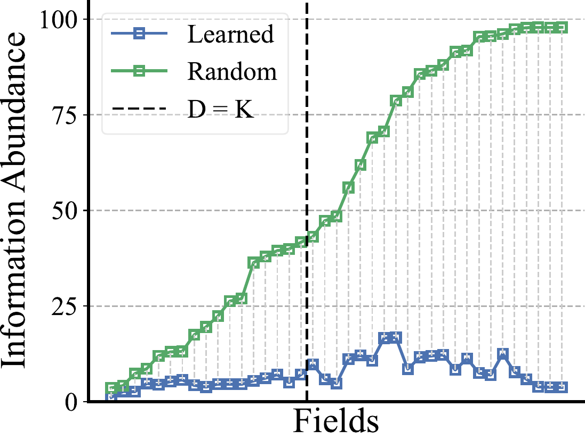
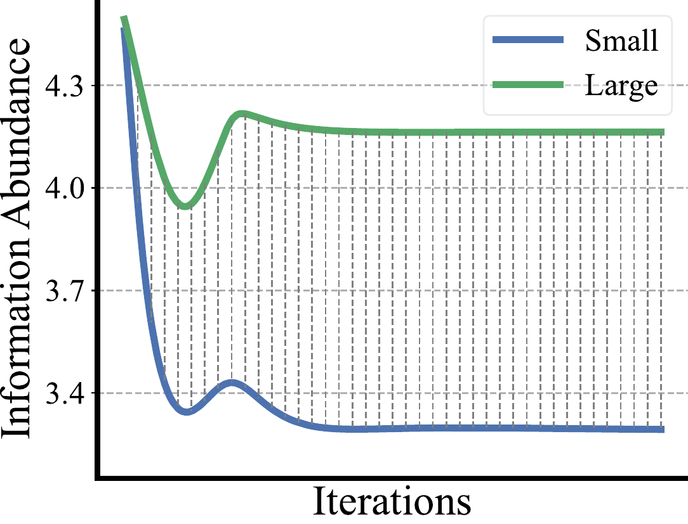
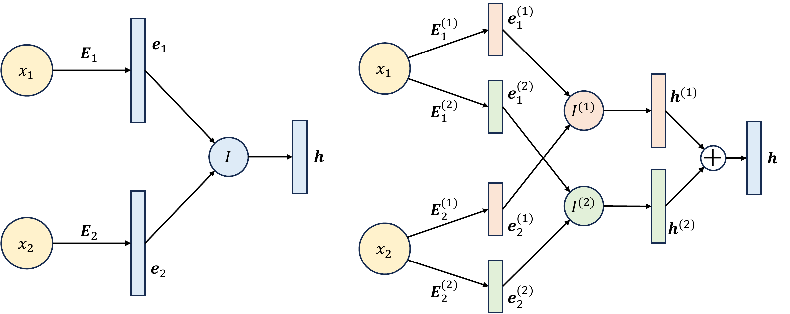
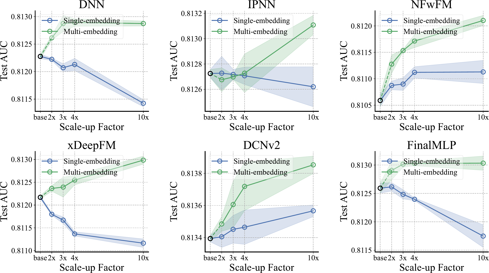

# On the Embedding Collapse When Scaling up Recommendation Models

## Abstract

Recent advances in deep foundation models have led to a promising trend of developing large recommendation models to leverage vast amounts of available data. However, we experiment to scale up existing recommendation models and observe that the enlarged models do not improve satisfactorily. In this context, we investigate the embedding layers of enlarged models and identify a phenomenon of *embedding collapse*, which ultimately hinders scalability, wherein the embedding matrix tends to reside in a low-dimensional subspace. Through empirical and theoretical analysis, we demonstrate that the feature interaction module specific to recommendation models has a *two-sided effect*. On the one hand, the interaction restricts embedding learning when interacting with collapsed embeddings, exacerbating the collapse issue. On the other hand, feature interaction is crucial in mitigating the fitting of spurious features, thereby improving scalability. Based on this analysis, we propose a simple yet effective *multi-embedding* design incorporating embedding-set-specific interaction modules to capture diverse patterns and reduce collapse. Extensive experiments demonstrate that this proposed design provides consistent scalability for various recommendation models.

# Introduction

Recommender systems are significant machine learning scenarios that predict users’ actions on items based on multi-field categorical data , which play an indispensable role in our daily lives to help people discover information about their interests and have been adopted in a wide range of online applications, such as E-commerce, social media, news feeds, and music streaming. Recently, researchers have developed deep-learning-based recommendation models to dig feature representations flexibly. These models have been successfully deployed across a multitude of application scenarios, thereby demonstrating their widespread adoption and effectiveness.

In recommender systems, there is a tremendous amount of Internet data, while mainstream models typically tuned with embedding size 10  do not adequately capture the magnitude of the available data. Motivated by the advancement of large foundation models , which benefit from increasing parameters, it would be a promising trend to scale up the recommendation model size. However, we experiment to increase the embedding size of mainstream recommendation models , as shown in Figure <a href="#subfig:intro-a" data-reference-type="ref" data-reference="subfig:intro-a">[subfig:intro-a]</a>, and find an unsatisfactory improvement or even performance drop. This suggests a deficiency in the scalability of existing architecture designs, constraining the maximum potential for recommender systems.

<figure id="fig:intro">

<figcaption>Unsatisfactory scalability of existing recommendation models. <strong>(a)</strong>: Increasing the embedding size does not improve remarkably or even hurts the model performance. <strong>(b)</strong>: Most embedding matrices do not learn large singular values and tend to be low-rank.</figcaption>
</figure>

We take a spectral analysis on the learned embedding matrices based on singular value decomposition and exhibit the normalized singular values in Figure <a href="#subfig:intro-b" data-reference-type="ref" data-reference="subfig:intro-b">[subfig:intro-b]</a>. Surprisingly, most singular values are significantly small, i.e., the learned embedding matrices are nearly low-rank, which we refer to as the *embedding collapse* phenomenon. With the enlarged model size, the model does not learn to capture a larger dimension of information, implying a learning process with ineffective parameter utilization, which restricts the scalability.

In this work, we study the mechanism behind the embedding collapse phenomenon through empirical and theoretical analysis. We shed light on the two-sided effect of the feature interaction module, the characteristic of recommendation models to model higher-order correlations, on model scalability. On the one hand, interaction with collapsed embeddings will constrain the embedding learning and, thus, in turn, aggravate the collapse issue. On the other hand, the feature interaction also plays a vital role in reducing overfitting when scaling up models.

Based on our analysis, we conclude the principle to mitigate collapse without suppressing feature interaction about how to design scalable models. We propose *multi-embedding* as a simple yet efficient design for model scaling. Multi-embedding scales the number of independent embedding sets and incorporates embedding-set-specific interaction modules to jointly capture diverse patterns. Our experimental results demonstrate that multi-embedding provides scalability for extensive mainstream models, pointing to a methodology of breaking through the size limit of recommender systems.

Our contributions can be summarized as:

- To the best of our knowledge, we are the first to point out the non-scalability issue for recommendation models and discover the embedding collapse phenomenon, which is an urgent problem to address for model scalability.

- We shed light on the two-sided effect of the feature interaction process on scalability based on the collapse phenomenon using empirical and theoretical analysis. Specifically, feature interaction leads to collapse while providing essential overfitting reduction.

- Following our concluded principle to mitigate collapse without suppressing feature interaction, we propose *multi-embedding* as a simple unified design, which consistently improves scalability for extensive state-of-the-art recommendation models.

# Preliminaries

Recommendation models aim to predict an action based on features from various fields. Throughout this paper, we consider the fundamental scenario of recommender systems, in which categorial features and binary outputs are involved. Formally, suppose there are $`N`$ fields, with the $`i`$-th field denoted as $`\mathcal{X}_i=\{1,2,...,D_i\}`$ where $`D_i`$ denotes the field cardinality. The value of $`D_i`$ may vary in a wide range, adding difficulty to recommender systems. Let
``` math
\mathcal{X}=\mathcal{X}_1\times\mathcal{X}_2\times...\times\mathcal{X}_N
```
and $`\mathcal{Y}=\{0,1\}`$, then recommendation models aim to learn a mapping from $`\mathcal{X}`$ to $`\mathcal{Y}`$. In addition to considering individual features from diverse fields, there have been numerous studies  within the area of recommender systems to model combined features using *feature interaction* modules. In this work, we investigate the following widely adopted architecture for mainstream models. A model comprises: (1) embedding layers $`{\bm{E}}_i\in\mathbb{R}^{D_i\times K}`$ for each field, with embedding size $`K`$; (2) an interaction module $`I`$ responsible for integrating all embeddings into a combined feature scalar or vector; and (3) a subsequent postprocessing module $`F`$ used for prediction purposes, such as MLP and MoE. The forward pass of such a model is formalized as
``` math
\begin{aligned}
    {\bm{e}}_i&={\bm{E}}_i^{\top}\bm{1}_{x_i},\ \forall i\in\{1,2,...,N\}, \\
    h&=I({\bm{e}}_1,{\bm{e}}_2,...,{\bm{e}}_n), \\
    \hat{y}&=F(h),
\end{aligned}
```
where $`\bm{1}_{x_i}`$ indicates the one-hot encoding of $`x_i\in\mathcal{X}_i`$, in other words, $`{\bm{e}}_i`$ refers to (transposed) $`x_i`$-th row of the embedding table $`{\bm{E}}_i`$.

# Embedding Collapse

Singular value decompostion has been widely used to measure the collapse phenomenon . In Figure <a href="#subfig:intro-b" data-reference-type="ref" data-reference="subfig:intro-b">[subfig:intro-b]</a>, we have shown that the learned embedding matrices of recommendation models are approximately low-rank with some extremely small singular values. To determine the degree of collapse for such matrices with low-rank tendencies, we propose *information abundance* as a generalized quantification.

<div class="definition">

**Definition 1** (Information Abundance). *Consider a matrix $`{\bm{E}}\in\mathbb{R}^{D\times K}`$ and its singular value decomposition $`{\bm{E}}={\bm{U}}{\bm{\Sigma}}{\bm{V}}=\sum\limits_{k=1}^K\sigma_k{\bm{u}}_k{\bm{v}}_k^\top`$, then the *information abundance* of $`{\bm{E}}`$ is defined as*

*``` math
\mathrm{IA}({\bm{E}})=\frac{\|\bm{\sigma}\|_1}{\|\bm{\sigma}\|_\infty},
```
i.e., the sum of all singular values normalized by the maximum singular value.*

</div>

<figure id="fig:ia-vis">

<figcaption>Visualization of information abundance on the Criteo dataset. The fields are sorted by their cardinalities.</figcaption>
</figure>

Intuitively, a matrix with high information abundance demonstrates a balanced distribution in vector space since it has similar singular values. In contrast, a matrix with low information abundance suggests that the components corresponding to smaller singular values can be compressed without significantly impacting the result. Compared with matrix rank, information abundance can be regarded as a simple extension by noticing that $`\mathrm{rank}({\bm{E}})=\|\bm{\sigma}\|_0`$, yet it is applicable for non-strictly low-rank matrices, especially for fields with $`D_i\gg K`$ which is possibly of rank $`K`$. We calculate the information abundance of embedding matrices for the enlarged DCNv2  and compare it with that of randomly initialized matrices, shown in Figure <a href="#fig:ia-vis" data-reference-type="ref" data-reference="fig:ia-vis">2</a>. It is observed that the information abundance of learned embedding matrices is extremely low, indicating the embedding collapse phenomenon.

# Feature Interaction Revisited

In this section, we delve deeper into the embedding collapse phenomenon for recommendation models. Our investigation revolves around two questions: (1) How is embedding collapse caused? (2) How to properly mitigate embedding collapse for scalability? Through empirical and theoretical studies, we shed light on the two-sided effect of the commonly employed feature interaction module on model scalability.

## Interaction-Collapse Law

To determine how feature interaction leads to embedding collapse, it is inadequate to directly analyze the raw embedding matrices since the learned embedding matrix results from interactions with all other fields, making it difficult to isolate the impact of field-pair-level interaction on embedding learning. To overcome this obstacle, we propose a solution involving experiments on a line of models equipped with *sub-embedding* modules generated from the raw embeddings and field individually designed for feature interaction. By examining the collapse of all these sub-embeddings, we can effectively discern the interaction effects between the two fields in a disentangled manner and establish a high-level law.

#### Evidence I: Experiments on FFM.

Field-aware factorization machines (FFM)  split an embedding matrix of field $`i`$ into multiple sub-embeddings with
``` math
{\bm{E}}_i=\left[{\bm{E}}_i^{\to 1},{\bm{E}}_i^{\to 2},...,{\bm{E}}_i^{\to(i-1)},{\bm{E}}_i^{\to(i+1)},...,{\bm{E}}_i^{\to N}\right],
```
where sub-embedding $`{\bm{E}}_i^{\to j}\in\mathbb{R}^{D_i\times K/(N-1)}`$ is only used when interacting field $`i`$ with field $`j`$ for $`j\neq i`$. To determine the collapse of sub-embedding matrices, we calculate $`\mathrm{IA}({\bm{E}}_i^{\to j})`$ for all $`i,j`$ and show them in Figure <a href="#subfig:evd1a" data-reference-type="ref" data-reference="subfig:evd1a">[subfig:evd1a]</a>. For convenience, we pre-sort the field indices by the ascending order of information abundance, i.e., $`i`$ is ordered according to $`\mathrm{IA}({\bm{E}}_i)`$, similar to $`j`$. We can observe that $`\mathrm{IA}({\bm{E}}_i^{\to j})`$ is approximately increasing along $`i`$, which is trivial since $`{\bm{E}}_i^{\to j}`$ is simply a split of $`{\bm{E}}_i`$. Interestingly, another correlation can be observed that the information abundance of sub-embeddings is co-influenced by the fields it interacts with, reflected by the increasing trend along $`j`$, especially with larger $`i`$. This is amazing in the sense that even using independent embeddings to represent the same field features, these embeddings get different information abundance after learning. For instance, we calculate the summation of $`\mathrm{IA}({\bm{E}}_i^{\to j})`$ over $`j`$ or $`i`$ to study the effect of the other single variable, shown in Figure <a href="#subfig:evd1b" data-reference-type="ref" data-reference="subfig:evd1b">[subfig:evd1b]</a> and Figure <a href="#subfig:evd1c" data-reference-type="ref" data-reference="subfig:evd1c">[subfig:evd1c]</a>. Both of them show an increasing trend, confirming the co-influence of $`i`$ and $`j`$.

<figure id="fig:evd12">
<p><br />
</p>
<p><br />
</p>
<figcaption>Visualization of information abundance of sub-embedding matrices for FFM (left) and DCNv2 (right), with field indices sorted by information abundance of corresponding raw embedding matrices. Higher or warmer indicates larger. It is observed that <span class="math inline">IA(<strong>E</strong><sub><em>i</em></sub><sup> → <em>j</em></sup>)</span> are co-influenced by both <span class="math inline">IA(<strong>E</strong><sub><em>i</em></sub>)</span> and <span class="math inline">IA(<strong>E</strong><sub><em>j</em></sub>)</span>.</figcaption>
</figure>

#### Evidence II: Experiments on DCNv2.

An improved deep & cross network (DCNv2)  incorporates a crossing network which is parameterized with transformation matrices $`{\bm{W}}_{i\to j}`$  over each field pair to project an embedding vector from field $`i`$ before interaction with field $`j`$. By collecting all projected embedding vectors, DCNv2 can be regarded to implicitly generate field-aware sub-embeddings $`{\bm{E}}_i^{\to 1},{\bm{E}}_i^{\to 2},...,{\bm{E}}_i^{\to N}`$ to interact with all fields from embedding matrix $`{\bm{E}}_i`$, with
``` math
{\bm{E}}_i^{\to j}={\bm{E}}_i{\bm{W}}_{i\to j}^\top.
```
DCNv2 consists of multiple stacked cross layers, and for simplification, we only discuss the first layer throughout this paper. Similar to Evidence I, we calculate $`\mathrm{IA}({\bm{E}}_i^{\to j})`$ together with the axis-wise summations and show them in the right part of Figure <a href="#fig:evd12" data-reference-type="ref" data-reference="fig:evd12">3</a>. Consistent with previous observation as FFM, the information abundance of sub-embedding matrices approximately increases along $`j`$ with the same $`i`$, even though they are projected from the same embedding matrix $`{\bm{E}}_i`$.

#### Summary: How is collapse caused in real-world scenarios?

In the cases of FFM and DCNv2, the sub-embeddings obtained from the raw embedding, either separated or projected, provide insights into the interactions between different fields. Evidence I&II highlight that the information abundance in a sub-embedding matrix is greatly impacted by the field it interacts with, or specifically, interacting with a field with a low-information-abundance embedding matrix will result in a more collapsed sub-embedding. By further considering the fact that sub-embeddings reflect the effect when fields interact, we conclude an inherent mechanism of feature interaction in recommendation models, leading us to propose the *interaction-collapse law* from a higher perspective:

<div class="tcolorbox">

*Finding 1 (Interaction-Collapse Law). In feature interaction of recommendation models, fields with low-information-abundance embeddings constrain the information abundance of other fields, resulting in collapsed embedding matrices.*

</div>

While the interaction-collapse law is derived from sub-embedding-based models, it is important to note that these sub-embeddings serve as analytical tools that reveal the underlying mechanism of feature interaction. Therefore, this law is applicable to general recommendation models instead of only the models with sub-embeddings. The interaction-collapse law generally suggests that feature interaction is the primary catalyst for collapse, thereby imposing constraints on the ideal scalability.

We now present how collapse is caused by feature interaction in recommendation models from a theoretical view. For simplicity, we consider an FM-style  feature interaction. Formally, the interaction process is defined by
``` math
h=\sum_{i=1}^N\sum_{j=1}^{i-1}{\bm{e}}_i^\top{\bm{e}}_j=\sum_{i=1}^N\sum_{j=1}^{i-1}\bm{1}_{x_i}^\top {\bm{E}}_i{\bm{E}}_j^\top \bm{1}_{x_j},
```
where $`h`$ is the combined feature as mentioned before. Without loss of generality, we discuss one specific row $`{\bm{e}}_1`$ of $`{\bm{E}}_1`$ and keep other embedding matrices fixed. Consider a minibatch with batch size $`B`$. Denote $`\sigma_{i,k}`$ as the $`k`$-th singular value of $`{\bm{E}}_i`$, similar for $`{\bm{u}}_{i,k}`$, $`{\bm{v}}_{i,k}`$. We have

``` math
\begin{aligned}
    \frac{\partial\mathcal{L}}{\partial {\bm{e}}_1}
    &=\frac1B\sum_{b=1}^B\frac{\partial\ell^{(b)}}{\partial h^{(b)}}\cdot\frac{\partial h^{(b)}}{\partial{\bm{e}}_1}
    =\frac1B\sum_{b=1}^B\frac{\partial\ell^{(b)}}{\partial h^{(b)}}\cdot\sum_{i=2}^N {\bm{E}}_k^\top\bm{1}_{x_i^{(b)}} \\
    % &=\frac1B\sum_{b=1}^B\frac{\partial\ell^{(b)}}{\partial h^{(b)}}\cdot\sum_{i=2}^N \left(\sum_{k=1}^K\sigma_{i,k}\vu_{i,k}\vv_{i,k}^\top\right)^\top\1_{x_i^{(b)}} \\
    &=\frac1B\sum_{b=1}^B\frac{\partial\ell^{(b)}}{\partial h^{(b)}}\cdot\sum_{i=2}^N \sum_{k=1}^K\sigma_{i,k}{\bm{v}}_{i,k}{\bm{u}}_{i,k}^\top\bm{1}_{x_i^{(b)}} \\
    &=\sum_{i=2}^N\sum_{k=1}^K\left(\frac1B\sum_{b=1}^B\frac{\partial\ell^{(b)}}{\partial h^{(b)}}{\bm{u}}_{i,k}^\top\bm{1}_{x_i^{(b)}}\right)\sigma_{i,k}{\bm{v}}_{i,k} \\
    &=\sum_{i=2}^N\sum_{k=1}^K \alpha_{i,k}\sigma_{i,k}{\bm{v}}_{i,k}=\sum_{i=2}^N{\bm{\theta}}_i
\end{aligned}
```

<figure id="fig:toy">

<figcaption><span class="math inline">IA(<strong>E</strong><sub>1</sub>)</span> w.r.t. training iterations for toy experiments. “Small” and “Large” refers to the cardinality of <span class="math inline">𝒳<sub>3</sub></span>.</figcaption>
</figure>

The equation means that the gradient can be decomposed into field-specific terms. We analyze the component $`{\bm{\theta}}_i`$ for a certain field $`i`$, which is further decomposed into spectral for the corresponding embedding matrix $`{\bm{E}}_i`$.

From the form of $`{\bm{\theta}}_i`$, it is observed that $`\{\alpha_{i,k}\}`$ are $`\bm{\sigma}_i`$-agnostic scalars determined by the training data and objective function. Thus, the variety of $`\bm{\sigma}_i`$ significantly influences the composition of $`{\bm{\theta}}_i`$. For those larger $`\sigma_{i,k}`$, the gradient component $`{\bm{\theta}}_i`$ will be weighted more heavily along the corresponding spectral $`{\bm{v}}_{i,k}`$. When $`{\bm{E}}_i`$ is low-information-abundance, the components of $`{\bm{\theta}}_i`$ weigh imbalancely, resulting in the degeneration of $`{\bm{e}}_1`$. Since different $`{\bm{e}}_1`$ affects only $`\alpha_{i,k}`$ instead of $`\sigma_{i,k}`$ and $`{\bm{v}}_{i,k}`$, all rows of $`{\bm{E}}_1`$ degenerates in similar manners and finally form a collapsed matrix.

To further illustrate, we conduct a toy experiment over synthetic data. Suppose there are $`N=3`$ fields, and we set $`D_3`$ to different values with $`D_3<K`$ and $`D_3\gg K`$ to simulate low-information-abundance and high-information-abundance cases, which matches the diverse range of the field cardinality in real-world scenarios. We train $`{\bm{E}}_1`$ while keeping $`{\bm{E}}_2,{\bm{E}}_3`$ fixed. Details of experiment setups are discussed in Appendix <a href="#apdx:toy" data-reference-type="ref" data-reference="apdx:toy">8</a>. We show the information abundance of $`{\bm{E}}_1`$ along the training process for the two cases in Figure <a href="#fig:toy" data-reference-type="ref" data-reference="fig:toy">4</a>. It is observed that interacting with a low-information-abundance matrix will result in a collapsed embedding matrix.

## Is it sufficient to avoid collapse for scalability?

Following our discussion above, we have shown that the feature interaction process of recommendation models leads to collapse and thus limits the model scalability. We now discuss its negative proposition, i.e., whether suppressing the feature interaction to mitigate collapse leads to model scalability. To answer this question, we design the following two experiments to compare standard models and models with feature interaction suppressed.

#### Evidence III: Regularization on DCNv2 to mitigate collapse.

Evidence II shows that a projection $`{\bm{W}}_{i\to j}`$ is learned to adjust information abundance for feature interaction. To further investigate the effect of the adjustment of $`{\bm{W}}_{i\to j}`$ on scalability, we introduce the following regularization with learnable parameter $`\lambda_{ij}`$
``` math
\ell_{reg}=\sum_{i=1}^N\sum_{j=1}^N\left\|{\bm{W}}_{i\to j}^\top {\bm{W}}_{i\to j}-\lambda_{ij} {\bm{I}}\right\|_{\mathrm{F}}^2
```
to regularize the projection matrix to be a multiplication of an unitary matrix. This way, $`{\bm{W}}_{i\to j}`$ will preserve all normalized singular values and maintain the information abundance after projection. We experiment with various embedding sizes and compare the changes in performance, the information abundances, and the optimization dynamics for standard and regularized models. Results are shown in Figure <a href="#fig:evd3" data-reference-type="ref" data-reference="fig:evd3">5</a>. As anticipated, regularization in DCNv2 helps learn embeddings with higher information abundance. Nevertheless, from the performance perspective, the model presents unexpected results whereby the scalability does not improve or worsen as the collapse is alleviated. We further find that such a model overfits during the learning process, with the training loss consistently decreasing and the validation AUC dropping.

<figure id="fig:evd3">

<figcaption>Experimental results of Evidence III. Restricting DCNv2 leads to higher information abundance, yet the model suffers from over-fitting, thus resulting in non-scalability.</figcaption>
</figure>

<figure id="fig:evd4">

<figcaption>Experimental results of Evidence IV. Despite higher information abundance, the performance of DNN drops w.r.t. model size.</figcaption>
</figure>

#### Evidence IV: Scaling up DCNv2 and DNN.

We now discuss DNN, which consists of a plain interaction module by concatenating all feature vectors from different fields and processing with an MLP, formulized by
``` math
{\bm{h}}=G([{\bm{e}}_1,{\bm{e}}_2,...,{\bm{e}}_N]).
```

Since DNN does not conduct explicit 2-order feature interaction , following our previous interaction-collapse law, it would suffer less from collapse. We compare the learned embeddings of DCNv2 and DNN and their performance with the growth of embedding size. Considering that different architectures or objectives may differ in modeling, we mainly discuss the performance trend as a fair comparison. Results are shown in Figure <a href="#fig:evd4" data-reference-type="ref" data-reference="fig:evd4">6</a>. DNN learns less-collapsed embedding matrices, reflected by higher information abundance than DCNv2. Yet, perversely, the AUC of DNN drops when increasing the embedding size, while DCNv2 sustains the performance. Such observations show that DNN falls into the issue of overfitting and lacks scalability, even though it suffers less from collapse.

#### Summary: Does suppressing collapse definitely improve scalability?

Regularized DCNv2 and DNN are both models with feature interaction suppressed, and they learn less-collapsed embedding matrices than DCNv2, as expected. Yet observations in evidence III&IV demonstrate that regularized DCNv2 and DNN are both non-scalable with the growth of model size and suffer from serious overfitting. We conclude the following finding:

<div class="tcolorbox">

*Finding 2. A less-collapsed model with feature interaction suppressed is insufficient for scalability due to overfitting concern.*

</div>

Such a finding is plausible, considering that feature interaction brings domain knowledge of higher-order correlations in recommender systems and helps form generalizable representations. When feature interaction is suppressed, models tend to fit noise as the embedding size increases, resulting in reduced generalization.

# Multi-embedding Design

In this section, we present a simple design of *multi-embedding*, which serves as an effective scaling design applicable to a wide range of model architecture designs. We introduce the overall architecture, present experimental results, and analyze how multi-embedding works.

## Multi-Embedding for better scalability

The two-sided effect of feature interaction for scalability implies a *principle* for model design. That is, a scalable model should be capable of less-collapsed embeddings within the existing feature interaction framework instead of removing interaction. Based on this principle, we propose *multi-embedding* or *ME* as a simple yet efficient design to improve scalability. Specifically, we scale up the number of independent and complete embedding sets instead of the embedding size, and incorporate embedding-set-specific feature interaction layers. Similar to previous works such as group convolution  and multi-head attention , such design allows the model to learn different interaction patterns jointly, while a single-embedding model would be limited to the only interaction pattern that causes severe collapse. This way, the model is capable of learning diverse embedding vectors to mitigate collapse while keeping the original interaction modules. Formally, a model with $`M`$ sets of embeddings is defined as
``` math
\begin{aligned}
    {\bm{e}}_i^{(m)}&=\left({\bm{E}}_i^{(m)}\right)^{\top}\bm{1}_{x_i},\ \forall i\in\{1,2,...,N\}, \\
    h^{(m)}&=I^{(m)}\left({\bm{e}}_1^{(m)},{\bm{e}}_2^{(m)},...,{\bm{e}}_N^{(m)}\right), \\
    h&=\frac1M\sum_{m=1}^M h^{(m)},\quad \hat{y}=F(h),
\end{aligned}
```
where $`m`$ stands for the index of embedding set. One requirement of multi-embedding is that there should be non-linearities such as ReLU in interaction $`I`$; otherwise, the model is equivalent to single-embedding and hence does not capture different patterns (see Appendix <a href="#apdx:non-linearity" data-reference-type="ref" data-reference="apdx:non-linearity">9</a>). As a solution, we add a non-linear projection after interaction for the model with linear interaction layers and reduce one MLP layer for $`F`$ to achieve a fair comparison. An overall architecture comparison of single-embedding and mult-embedding models with $`N=2`$ and $`M=2`$ is shown in Figure <a href="#fig:exp-me-arch" data-reference-type="ref" data-reference="fig:exp-me-arch">[fig:exp-me-arch]</a>.

<figure id="fig:scalability-criteo">


<figcaption>Scalability of multi-embedding on Criteo dataset.</figcaption>
</figure>

## Experiments

#### Setup.

We conduct our experiments on two datasets for recommender systems: Criteo  and Avazu , which are large and hard benchmark datasets widely used in recommender systems. We experiment on baseline models including DNN, IPNN , NFwFM , xDeepFM , DCNv2 , FinalMLP  and their corresponding multi-embedding variants with 2x, 3x, 4x and 10x model size[^2]. Here NFwFM is a variant of NFM  by replacing FM with FwFM. All experiments are performed with 8/1/1 training/validation/test splits, and we apply early stopping based on validation AUC. More details are shown in Appendix <a href="#apdx:exp-settings" data-reference-type="ref" data-reference="apdx:exp-settings">10.2</a>.

#### Results.

We repeat each experiment 3 times and report the average test AUC with different scaling factors of the model size. Results are shown in Table <a href="#tab:main-exp" data-reference-type="ref" data-reference="tab:main-exp">1</a>. For the experiments with single-embedding, we observe that all the models demonstrate poor scalability. Only DCNv2 and NFwFM show slight improvements with increasing embedding sizes, with gains of 0.00036 on Criteo and 0.00090 on Avazu, respectively. For DNN, xDeepFM, and FinalMLP, which rely highly on non-explicit interaction, the performance even drops (0.00136 on Criteo and 0.00118 on Avazu) when scaled up to 10x, as discussed in Section <a href="#subsec:generalizability" data-reference-type="ref" data-reference="subsec:generalizability">4.2</a>. In contrast to single-embedding, our multi-embedding shows consistent and remarkable improvement with the growth of the embedding size, and the highest performance is always achieved with the largest 10x size. For DCNv2 and NFwFM, multi-embedding gains 0.00099 on Critio and 0.00202 on Avazu by scaling up to 10x, which is never obtained by single-embedding. Over all models and datasets, compared with baselines, the largest models averagely achieve 0.00106 improvement on the test AUC[^3]. Multi-embedding provides a methodology to break through the non-scalability limit of existing models. We visualize the scalability of multi-embedding on Criteo dataset in Figure <a href="#fig:scalability-criteo" data-reference-type="ref" data-reference="fig:scalability-criteo">7</a>. The standard deviation and detailed scalability comparison are shown in Appendix <a href="#apdx:exp-results" data-reference-type="ref" data-reference="apdx:exp-results">10.3</a>.

<div id="tab:main-exp">

<table>
<caption>Test AUC for different models. Higher indicates better. Underlined and bolded values refer to the best performance with single-embedding (SE) and multi-embedding (ME), respectively.</caption>
<thead>
<tr>
<th colspan="2" style="text-align: center;">Model</th>
<th colspan="5" style="text-align: center;">Criteo</th>
<th colspan="5" style="text-align: center;">Avazu</th>
</tr>
</thead>
<tbody>
<tr>
<td style="text-align: center;"><span>3-7</span> (lr)<span>8-12</span></td>
<td style="text-align: center;"></td>
<td style="text-align: center;">base</td>
<td style="text-align: center;">2x</td>
<td style="text-align: center;">3x</td>
<td style="text-align: center;">4x</td>
<td style="text-align: center;">10x</td>
<td style="text-align: center;">base</td>
<td style="text-align: center;">2x</td>
<td style="text-align: center;">3x</td>
<td style="text-align: center;">4x</td>
<td style="text-align: center;">10x</td>
</tr>
<tr>
<td rowspan="2" style="text-align: center;">DNN</td>
<td style="text-align: center;">SE</td>
<td rowspan="2" style="text-align: center;"><u>0.81228</u></td>
<td style="text-align: center;"><u>0.81222</u></td>
<td style="text-align: center;">0.81207</td>
<td style="text-align: center;">0.81213</td>
<td style="text-align: center;">0.81142</td>
<td rowspan="2" style="text-align: center;">0.78744</td>
<td style="text-align: center;"><u>0.78759</u></td>
<td style="text-align: center;">0.78752</td>
<td style="text-align: center;">0.78728</td>
<td style="text-align: center;">0.78648</td>
</tr>
<tr>
<td style="text-align: center;">ME</td>
<td style="text-align: center;">0.81261</td>
<td style="text-align: center;"><strong>0.81288</strong></td>
<td style="text-align: center;"><strong>0.81289</strong></td>
<td style="text-align: center;"><strong>0.81287</strong></td>
<td style="text-align: center;">0.78805</td>
<td style="text-align: center;">0.78826</td>
<td style="text-align: center;">0.78862</td>
<td style="text-align: center;"><strong>0.78884</strong></td>
</tr>
<tr>
<td rowspan="2" style="text-align: center;">IPNN</td>
<td style="text-align: center;">SE</td>
<td rowspan="2" style="text-align: center;"><u>0.81272</u></td>
<td style="text-align: center;"><u>0.81273</u></td>
<td style="text-align: center;"><u>0.81272</u></td>
<td style="text-align: center;"><u>0.81271</u></td>
<td style="text-align: center;">0.81262</td>
<td rowspan="2" style="text-align: center;">0.78732</td>
<td style="text-align: center;"><u>0.78741</u></td>
<td style="text-align: center;">0.78738</td>
<td style="text-align: center;"><u>0.78750</u></td>
<td style="text-align: center;"><u>0.78745</u></td>
</tr>
<tr>
<td style="text-align: center;">ME</td>
<td style="text-align: center;">0.81268</td>
<td style="text-align: center;">0.81270</td>
<td style="text-align: center;">0.81273</td>
<td style="text-align: center;"><strong>0.81311</strong></td>
<td style="text-align: center;">0.78806</td>
<td style="text-align: center;">0.78868</td>
<td style="text-align: center;">0.78902</td>
<td style="text-align: center;"><strong>0.78949</strong></td>
</tr>
<tr>
<td rowspan="2" style="text-align: center;">NFwFM</td>
<td style="text-align: center;">SE</td>
<td rowspan="2" style="text-align: center;">0.81059</td>
<td style="text-align: center;">0.81087</td>
<td style="text-align: center;">0.81090</td>
<td style="text-align: center;"><u>0.81112</u></td>
<td style="text-align: center;"><u>0.81113</u></td>
<td rowspan="2" style="text-align: center;">0.78684</td>
<td style="text-align: center;">0.78757</td>
<td style="text-align: center;">0.78783</td>
<td style="text-align: center;"><u>0.78794</u></td>
<td style="text-align: center;">–</td>
</tr>
<tr>
<td style="text-align: center;">ME</td>
<td style="text-align: center;">0.81128</td>
<td style="text-align: center;">0.81153</td>
<td style="text-align: center;">0.81171</td>
<td style="text-align: center;"><strong>0.81210</strong></td>
<td style="text-align: center;">0.78868</td>
<td style="text-align: center;">0.78901</td>
<td style="text-align: center;"><strong>0.78932</strong></td>
<td style="text-align: center;">–</td>
</tr>
<tr>
<td rowspan="2" style="text-align: center;">xDeepFM</td>
<td style="text-align: center;">SE</td>
<td rowspan="2" style="text-align: center;"><u>0.81217</u></td>
<td style="text-align: center;">0.81180</td>
<td style="text-align: center;">0.81167</td>
<td style="text-align: center;">0.81137</td>
<td style="text-align: center;">0.81116</td>
<td rowspan="2" style="text-align: center;"><u>0.78743</u></td>
<td style="text-align: center;"><u>0.78750</u></td>
<td style="text-align: center;">0.78714</td>
<td style="text-align: center;">0.78735</td>
<td style="text-align: center;">0.78693</td>
</tr>
<tr>
<td style="text-align: center;">ME</td>
<td style="text-align: center;">0.81236</td>
<td style="text-align: center;">0.81239</td>
<td style="text-align: center;">0.81255</td>
<td style="text-align: center;"><strong>0.81299</strong></td>
<td style="text-align: center;">0.78848</td>
<td style="text-align: center;">0.78886</td>
<td style="text-align: center;">0.78894</td>
<td style="text-align: center;"><strong>0.78927</strong></td>
</tr>
<tr>
<td rowspan="2" style="text-align: center;">DCNv2</td>
<td style="text-align: center;">SE</td>
<td rowspan="2" style="text-align: center;">0.81339</td>
<td style="text-align: center;">0.81341</td>
<td style="text-align: center;">0.81345</td>
<td style="text-align: center;">0.81346</td>
<td style="text-align: center;"><u>0.81357</u></td>
<td rowspan="2" style="text-align: center;">0.78786</td>
<td style="text-align: center;">0.78835</td>
<td style="text-align: center;"><u>0.78854</u></td>
<td style="text-align: center;"><u>0.78852</u></td>
<td style="text-align: center;"><u>0.78856</u></td>
</tr>
<tr>
<td style="text-align: center;">ME</td>
<td style="text-align: center;">0.81348</td>
<td style="text-align: center;">0.81361</td>
<td style="text-align: center;"><strong>0.81382</strong></td>
<td style="text-align: center;"><strong>0.81385</strong></td>
<td style="text-align: center;">0.78862</td>
<td style="text-align: center;">0.78882</td>
<td style="text-align: center;">0.78907</td>
<td style="text-align: center;"><strong>0.78942</strong></td>
</tr>
<tr>
<td rowspan="2" style="text-align: center;">FinalMLP</td>
<td style="text-align: center;">SE</td>
<td rowspan="2" style="text-align: center;"><u>0.81259</u></td>
<td style="text-align: center;"><u>0.81262</u></td>
<td style="text-align: center;">0.81248</td>
<td style="text-align: center;">0.81240</td>
<td style="text-align: center;">0.81175</td>
<td rowspan="2" style="text-align: center;">0.78751</td>
<td style="text-align: center;"><u>0.78797</u></td>
<td style="text-align: center;"><u>0.78795</u></td>
<td style="text-align: center;">0.78742</td>
<td style="text-align: center;">0.78662</td>
</tr>
<tr>
<td style="text-align: center;">ME</td>
<td style="text-align: center;">0.81290</td>
<td style="text-align: center;"><strong>0.81302</strong></td>
<td style="text-align: center;"><strong>0.81303</strong></td>
<td style="text-align: center;"><strong>0.81303</strong></td>
<td style="text-align: center;">0.78821</td>
<td style="text-align: center;"><strong>0.78831</strong></td>
<td style="text-align: center;"><strong>0.78836</strong></td>
<td style="text-align: center;"><strong>0.78830</strong></td>
</tr>
</tbody>
</table>

</div>

## Analysis

#### Information abundance.

Multi-embedding models achieve remarkable scalability compared with single-embedding. We verify that such scalability originates from the mitigation of collapse. We compare the information abundance of single-embedding and multi-embedding DCNv2 with the 10x embedding size. As shown in Figure <a href="#subfig:ia-single-vs-multiple" data-reference-type="ref" data-reference="subfig:ia-single-vs-multiple">[subfig:ia-single-vs-multiple]</a>, multi-embedding offers higher information abundance and indicates less collapsed embedding matrices.

#### Variations of embeddings.

Multi-embedding utilizes embedding-set-specific interactions to enrich embedding learning. We analyze the information abundance for each embedding set as shown in Figure <a href="#subfig:multiple-ias" data-reference-type="ref" data-reference="subfig:multiple-ias">[subfig:multiple-ias]</a>. It is observed that the embedding matrices of different sets vary in information abundance.

#### Different interaction patterns.

To justify that the scalability of multi-embedding originates from different interaction patterns, we visualize $`\|{\bm{W}}_{i\to j}^{(m)}\|_{\mathrm{F}}`$ as the interaction pattern  for a multi-embedding DCNv2 model in Figure <a href="#subfig:vis-W" data-reference-type="ref" data-reference="subfig:vis-W">[subfig:vis-W]</a>. It is shown that the interaction layers learn various patterns. To further illustrate, we conduct an ablation study by restricting the divergence of $`\|{\bm{W}}_{i\to j}^{(m)}\|_{\mathrm{F}}`$ across all embedding sets. From results in Figure <a href="#subfig:weight-norm-align" data-reference-type="ref" data-reference="subfig:weight-norm-align">[subfig:weight-norm-align]</a>, it is observed that the divergence-restricted multi-embedding model does not show similar scalability as standard multi-embedding models, indicating multi-embedding works from the diversity of interaction layers.

<figure id="fig:exp-me-analysis">

<figcaption>Analysis of multi-embedding. <strong>(a)</strong>: Multi-embedding learns higher information abundance. <strong>(b)</strong>: Each embedding set learns diverse embeddings, relected by varying information abundance. <strong>(c)</strong>: Embedding-set-specific feature interaction layers capture different interaction patterns. <strong>(d)</strong>: Restricting diversity of <span class="math inline">∥<strong>W</strong><sub><em>i</em> → <em>j</em></sub><sup>(<em>m</em>)</sup>∥<sub>F</sub></span> across all embedding sets leads to non-scalability.</figcaption>
</figure>

# Related Works

#### Modules in recommender systems.

Plenty of existing works investigate the module design for recommender systems. A line of studies focuses on feature interaction process , which is specific for recommender systems. These works are built up to fuse domain-specific knowledge of recommender systems. In contrast to proposing new modules, our work starts from a view of machine learning and analyzes the existing models for scalability.

#### Collapse phenomenon.

Neural collapse or representation collapse describes the degeneration of representation vectors with restricted variation. This phenomenon is widely studied in supervised learning , unsupervised contrastive learning , transfer learning  and generative models . discuss the representation collapse in sparse MoEs. Inspired by these works, we realize the embedding collapse of recommendation models when regarding embedding vectors as representations by their definition, yet we are facing the setting of field-level interaction, which has not previously been well studied.

#### Intrinsic dimensions and compression theories.

To describe the complexity of data, existing works include intrinsic-dimension-based quantification  and pruning-based analysis . Our SVD-based concept of information abundance is related to these works.

# Conclusion

In this paper, we highlight the non-scalability issue of existing recommendation models and identify the embedding collapse phenomenon that hinders scalability. From empirical and theoretical analysis around embedding collapse, we conclude the two-sided effect of feature interaction on scalability, i.e., feature interaction causes collapse while reducing overfitting. We propose a unified design of multi-embedding to mitigate collapse without suppressing feature interaction. Experiments on benchmark datasets demonstrate that multi-embedding consistently improves model scalability.

# References

<div class="thebibliography">

Armen Aghajanyan, Akshat Shrivastava, Anchit Gupta, Naman Goyal, Luke Zettlemoyer, and Sonal Gupta Better fine-tuning by reducing representational collapse In *ICLR*, 2020. **Abstract:** Although widely adopted, existing approaches for fine-tuning pre-trained language models have been shown to be unstable across hyper-parameter settings, motivating recent work on trust region methods. In this paper, we present a simplified and efficient method rooted in trust region theory that replaces previously used adversarial objectives with parametric noise (sampling from either a normal or uniform distribution), thereby discouraging representation change during fine-tuning when possible without hurting performance. We also introduce a new analysis to motivate the use of trust region methods more generally, by studying representational collapse; the degradation of generalizable representations from pre-trained models as they are fine-tuned for a specific end task. Extensive experiments show that our fine-tuning method matches or exceeds the performance of previous trust region methods on a range of understanding and generation tasks (including DailyMail/CNN, Gigaword, Reddit TIFU, and the GLUE benchmark), while also being much faster. We also show that it is less prone to representation collapse; the pre-trained models maintain more generalizable representations every time they are fine-tuned. (@aghajanyan2020better)

Jose M Alvarez and Mathieu Salzmann Compression-aware training of deep networks In *NeurIPS*, 2017. **Abstract:** In recent years, great progress has been made in a variety of application domains thanks to the development of increasingly deeper neural networks. Unfortunately, the huge number of units of these networks makes them expensive both computationally and memory-wise. To overcome this, exploiting the fact that deep networks are over-parametrized, several compression strategies have been proposed. These methods, however, typically start from a network that has been trained in a standard manner, without considering such a future compression. In this paper, we propose to explicitly account for compression in the training process. To this end, we introduce a regularizer that encourages the parameter matrix of each layer to have low rank during training. We show that accounting for compression during training allows us to learn much more compact, yet at least as effective, models than state-of-the-art compression techniques. (@alvarez2017compression)

Alessio Ansuini, Alessandro Laio, Jakob H Macke, and Davide Zoccolan Intrinsic dimension of data representations in deep neural networks In *NeurIPS*, 2019. **Abstract:** Deep neural networks progressively transform their inputs across multiple processing layers. What are the geometrical properties of the representations learned by these networks? Here we study the intrinsic dimensionality (ID) of data-representations, i.e. the minimal number of parameters needed to describe a representation. We find that, in a trained network, the ID is orders of magnitude smaller than the number of units in each layer. Across layers, the ID first increases and then progressively decreases in the final layers. Remarkably, the ID of the last hidden layer predicts classification accuracy on the test set. These results can neither be found by linear dimensionality estimates (e.g., with principal component analysis), nor in representations that had been artificially linearized. They are neither found in untrained networks, nor in networks that are trained on randomized labels. This suggests that neural networks that can generalize are those that transform the data into low-dimensional, but not necessarily flat manifolds. (@ansuini2019intrinsic)

Heng-Tze Cheng, Levent Koc, Jeremiah Harmsen, Tal Shaked, Tushar Chandra, Hrishi Aradhye, Glen Anderson, Greg Corrado, Wei Chai, Mustafa Ispir, et al Wide & deep learning for recommender systems In *DLRS*, 2016. **Abstract:** Generalized linear models with nonlinear feature transformations are widely used for large-scale regression and classification problems with sparse inputs. Memorization of feature interactions through a wide set of cross-product feature transformations are effective and interpretable, while generalization requires more feature engineering effort. With less feature engineering, deep neural networks can generalize better to unseen feature combinations through low-dimensional dense embeddings learned for the sparse features. However, deep neural networks with embeddings can over-generalize and recommend less relevant items when the user-item interactions are sparse and high-rank. In this paper, we present Wide & Deep learning—jointly trained wide linear models and deep neural networks—to combine the benefits of memorization and generalization for recommender systems. We productionized and evaluated the system on Google Play, a commercial mobile app store with over one billion active users and over one million apps. Online experiment results show that Wide & Deep significantly increased app acquisitions compared with wide-only and deep-only models. We have also open-sourced our implementation in TensorFlow. (@wide_and_deep)

Weiyu Cheng, Yanyan Shen, and Linpeng Huang Adaptive factorization network: Learning adaptive-order feature interactions In *AAAI*, 2020. **Abstract:** Various factorization-based methods have been proposed to leverage second-order, or higher-order cross features for boosting the performance of predictive models. They generally enumerate all the cross features under a predefined maximum order, and then identify useful feature interactions through model training, which suffer from two drawbacks. First, they have to make a trade-off between the expressiveness of higher-order cross features and the computational cost, resulting in suboptimal predictions. Second, enumerating all the cross features, including irrelevant ones, may introduce noisy feature combinations that degrade model performance. In this work, we propose the Adaptive Factorization Network (AFN), a new model that learns arbitrary-order cross features adaptively from data. The core of AFN is a logarithmic transformation layer that converts the power of each feature in a feature combination into the coefficient to be learned. The experimental results on four real datasets demonstrate the superior predictive performance of AFN against the state-of-the-arts. (@afn)

Zewen Chi, Li Dong, Shaohan Huang, Damai Dai, Shuming Ma, Barun Patra, Saksham Singhal, Payal Bajaj, Xia Song, Xian-Ling Mao, et al On the representation collapse of sparse mixture of experts In *NeurIPS*, 2022. **Abstract:** Sparse mixture of experts provides larger model capacity while requiring a constant computational overhead. It employs the routing mechanism to distribute input tokens to the best-matched experts according to their hidden representations. However, learning such a routing mechanism encourages token clustering around expert centroids, implying a trend toward representation collapse. In this work, we propose to estimate the routing scores between tokens and experts on a low-dimensional hypersphere. We conduct extensive experiments on cross-lingual language model pre-training and fine-tuning on downstream tasks. Experimental results across seven multilingual benchmarks show that our method achieves consistent gains. We also present a comprehensive analysis on the representation and routing behaviors of our models. Our method alleviates the representation collapse issue and achieves more consistent routing than the baseline mixture-of-experts methods. (@chi2022representation)

Huifeng Guo, Ruiming Tang, Yunming Ye, Zhenguo Li, and Xiuqiang He Deepfm: a factorization-machine based neural network for ctr prediction In *arXiv preprint arXiv:1703.04247*, 2017. **Abstract:** Learning sophisticated feature interactions behind user behaviors is critical in maximizing CTR for recommender systems. Despite great progress, existing methods seem to have a strong bias towards low- or high-order interactions, or require expertise feature engineering. In this paper, we show that it is possible to derive an end-to-end learning model that emphasizes both low- and high-order feature interactions. The proposed model, DeepFM, combines the power of factorization machines for recommendation and deep learning for feature learning in a new neural network architecture. Compared to the latest Wide \\}& Deep model from Google, DeepFM has a shared input to its "wide" and "deep" parts, with no need of feature engineering besides raw features. Comprehensive experiments are conducted to demonstrate the effectiveness and efficiency of DeepFM over the existing models for CTR prediction, on both benchmark data and commercial data. (@deepfm)

Kartik Gupta, Thalaiyasingam Ajanthan, Anton van den Hengel, and Stephen Gould Understanding and improving the role of projection head in self-supervised learning In *arXiv preprint arXiv:2212.11491*, 2022. **Abstract:** Self-supervised learning (SSL) aims to produce useful feature representations without access to any human-labeled data annotations. Due to the success of recent SSL methods based on contrastive learning, such as SimCLR, this problem has gained popularity. Most current contrastive learning approaches append a parametrized projection head to the end of some backbone network to optimize the InfoNCE objective and then discard the learned projection head after training. This raises a fundamental question: Why is a learnable projection head required if we are to discard it after training? In this work, we first perform a systematic study on the behavior of SSL training focusing on the role of the projection head layers. By formulating the projection head as a parametric component for the InfoNCE objective rather than a part of the network, we present an alternative optimization scheme for training contrastive learning based SSL frameworks. Our experimental study on multiple image classification datasets demonstrates the effectiveness of the proposed approach over alternatives in the SSL literature. (@gupta2022understanding)

Xiangnan He and Tat-Seng Chua Neural factorization machines for sparse predictive analytics In *SIGIR*, 2017. **Abstract:** Many predictive tasks of web applications need to model categorical variables, such as user IDs and demographics like genders and occupations. To apply standard machine learning techniques, these categorical predictors are always converted to a set of binary features via one-hot encoding, making the resultant feature vector highly sparse. To learn from such sparse data effectively, it is crucial to account for the interactions between features. (@nfm)

Tianyu Hua, Wenxiao Wang, Zihui Xue, Sucheng Ren, Yue Wang, and Hang Zhao On feature decorrelation in self-supervised learning In *ICCV*, 2021. **Abstract:** In self-supervised representation learning, a common idea behind most of the state-of-the-art approaches is to enforce the robustness of the representations to predefined augmentations. A potential issue of this idea is the existence of completely collapsed solutions (i.e., constant features), which are typically avoided implicitly by carefully chosen implementation details. In this work, we study a relatively concise framework containing the most common components from recent approaches. We verify the existence of complete collapse and discover another reachable collapse pattern that is usually overlooked, namely dimensional collapse. We connect dimensional collapse with strong correlations between axes and consider such connection as a strong motivation for feature decorrelation (i.e., standardizing the covariance matrix). The gains from feature decorrelation are verified empirically to highlight the importance and the potential of this insight. (@hua2021feature)

Olivier Chapelle Jean-Baptiste Tien, joycenv Display advertising challenge 2014. URL <https://kaggle.com/competitions/criteo-display-ad-challenge>. **Abstract:** Display advertising is the major source of revenue for service and content providers on the Internet. Here, the authors explain the prevalent mechanisms for selling display advertising, including reservation contracts and real-time bidding. Discussing some of the important challenges in this market from optimization and economic perspectives, they also survey recent results and directions for future research. (@criteo)

Li Jing, Pascal Vincent, Yann LeCun, and Yuandong Tian Understanding dimensional collapse in contrastive self-supervised learning In *ICLR*, 2021. **Abstract:** Self-supervised visual representation learning aims to learn useful representations without relying on human annotations. Joint embedding approach bases on maximizing the agreement between embedding vectors from different views of the same image. Various methods have been proposed to solve the collapsing problem where all embedding vectors collapse to a trivial constant solution. Among these methods, contrastive learning prevents collapse via negative sample pairs. It has been shown that non-contrastive methods suffer from a lesser collapse problem of a different nature: dimensional collapse, whereby the embedding vectors end up spanning a lower-dimensional subspace instead of the entire available embedding space. Here, we show that dimensional collapse also happens in contrastive learning. In this paper, we shed light on the dynamics at play in contrastive learning that leads to dimensional collapse. Inspired by our theory, we propose a novel contrastive learning method, called DirectCLR, which directly optimizes the representation space without relying on an explicit trainable projector. Experiments show that DirectCLR outperforms SimCLR with a trainable linear projector on ImageNet. (@jing2021understanding)

Yuchin Juan, Yong Zhuang, Wei-Sheng Chin, and Chih-Jen Lin Field-aware Factorization Machines for CTR Prediction In *RecSys*, 2016. **Abstract:** Click-through rate (CTR) prediction plays an important role in computational advertising. Models based on degree-2 polynomial mappings and factorization machines (FMs) are widely used for this task. Recently, a variant of FMs, field-aware factorization machines (FFMs), outperforms existing models in some world-wide CTR-prediction competitions. Based on our experiences in winning two of them, in this paper we establish FFMs as an effective method for classifying large sparse data including those from CTR prediction. First, we propose efficient implementations for training FFMs. Then we comprehensively analyze FFMs and compare this approach with competing models. Experiments show that FFMs are very useful for certain classification problems. Finally, we have released a package of FFMs for public use. (@ffm)

Alexander Kirillov, Eric Mintun, Nikhila Ravi, Hanzi Mao, Chloe Rolland, Laura Gustafson, Tete Xiao, Spencer Whitehead, Alexander C Berg, Wan-Yen Lo, et al Segment anything In *arXiv preprint arXiv:2304.02643*, 2023. **Abstract:** We introduce the Segment Anything (SA) project: a new task, model, and dataset for image segmentation. Using our efficient model in a data collection loop, we built the largest segmentation dataset to date (by far), with over 1 billion masks on 11M licensed and privacy respecting images. The model is designed and trained to be promptable, so it can transfer zero-shot to new image distributions and tasks. We evaluate its capabilities on numerous tasks and find that its zero-shot performance is impressive – often competitive with or even superior to prior fully supervised results. We are releasing the Segment Anything Model (SAM) and corresponding dataset (SA-1B) of 1B masks and 11M images at https://segment-anything.com to foster research into foundation models for computer vision. (@sam)

Yehuda Koren, Robert Bell, and Chris Volinsky Matrix factorization techniques for recommender systems In *Computer*, 2009. **Abstract:** As the Netflix Prize competition has demonstrated, matrix factorization models are superior to classic nearest neighbor techniques for producing product recommendations, allowing the incorporation of additional information such as implicit feedback, temporal effects, and confidence levels. (@mf)

Alex Krizhevsky, Ilya Sutskever, and Geoffrey E Hinton Imagenet classification with deep convolutional neural networks In *NeurIPS*, 2012. **Abstract:** We trained a large, deep convolutional neural network to classify the 1.2 million high-resolution images in the ImageNet LSVRC-2010 contest into the 1000 different classes. On the test data, we achieved top-1 and top-5 error rates of 37.5% and 17.0% which is considerably better than the previous state-of-the-art. The neural network, which has 60 million parameters and 650,000 neurons, consists of five convolutional layers, some of which are followed by max-pooling layers, and three fully-connected layers with a final 1000-way softmax. To make training faster, we used non-saturating neurons and a very efficient GPU implementation of the convolution operation. To reduce overriding in the fully-connected layers we employed a recently-developed regularization method called dropout that proved to be very effective. We also entered a variant of this model in the ILSVRC-2012 competition and achieved a winning top-5 test error rate of 15.3%, compared to 26.2% achieved by the second-best entry. (@alexnet)

Ananya Kumar, Aditi Raghunathan, Robbie Jones, Tengyu Ma, and Percy Liang Fine-tuning can distort pretrained features and underperform out-of-distribution In *ICLR*, 2022. **Abstract:** When transferring a pretrained model to a downstream task, two popular methods are full fine-tuning (updating all the model parameters) and linear probing (updating only the last linear layer – the "head"). It is well known that fine-tuning leads to better accuracy in-distribution (ID). However, in this paper, we find that fine-tuning can achieve worse accuracy than linear probing out-of-distribution (OOD) when the pretrained features are good and the distribution shift is large. On 10 distribution shift datasets (Breeds-Living17, Breeds-Entity30, DomainNet, CIFAR $\\}to$ STL, CIFAR10.1, FMoW, ImageNetV2, ImageNet-R, ImageNet-A, ImageNet-Sketch), fine-tuning obtains on average 2% higher accuracy ID but 7% lower accuracy OOD than linear probing. We show theoretically that this tradeoff between ID and OOD accuracy arises even in a simple setting: fine-tuning overparameterized two-layer linear networks. We prove that the OOD error of fine-tuning is high when we initialize with a fixed or random head – this is because while fine-tuning learns the head, the lower layers of the neural network change simultaneously and distort the pretrained features. Our analysis suggests that the easy two-step strategy of linear probing then full fine-tuning (LP-FT), sometimes used as a fine-tuning heuristic, combines the benefits of both fine-tuning and linear probing. Empirically, LP-FT outperforms both fine-tuning and linear probing on the above datasets (1% better ID, 10% better OOD than full fine-tuning). (@kumar2022fine)

Elizaveta Levina and Peter Bickel Maximum likelihood estimation of intrinsic dimension In *NeurIPS*, 2004. **Abstract:** We propose a new method for estimating intrinsic dimension of a dataset derived by applying the principle of maximum likelihood to the distances between close neighbors. We derive the estimator by a Poisson process approximation, assess its bias and variance theoretically and by simulations, and apply it to a number of simulated and real datasets. We also show it has the best overall performance compared with two other intrinsic dimension estimators. (@levina2004maximum)

Jianxun Lian, Xiaohuan Zhou, Fuzheng Zhang, Zhongxia Chen, Xing Xie, and Guangzhong Sun xdeepfm: Combining explicit and implicit feature interactions for recommender systems In *SIGKDD*, 2018. **Abstract:** Combinatorial features are essential for the success of many commercial models. Manually crafting these features usually comes with high cost due to the variety, volume and velocity of raw data in web-scale systems. Factorization based models, which measure interactions in terms of vector product, can learn patterns of combinatorial features automatically and generalize to unseen features as well. With the great success of deep neural networks (DNNs) in various fields, recently researchers have proposed several DNN-based factorization model to learn both low- and high-order feature interactions. Despite the powerful ability of learning an arbitrary function from data, plain DNNs generate feature interactions implicitly and at the bit-wise level. In this paper, we propose a novel Compressed Interaction Network (CIN), which aims to generate feature interactions in an explicit fashion and at the vector-wise level. We show that the CIN share some functionalities with convolutional neural networks (CNNs) and recurrent neural networks (RNNs). We further combine a CIN and a classical DNN into one unified model, and named this new model eXtreme Deep Factorization Machine (xDeepFM). On one hand, the xDeepFM is able to learn certain bounded-degree feature interactions explicitly; on the other hand, it can learn arbitrary low- and high-order feature interactions implicitly. We conduct comprehensive experiments on three real-world datasets. Our results demonstrate that xDeepFM outperforms state-of-the-art models. We have released the source code of xDeepFM at https://github.com/Leavingseason/xDeepFM. (@xdeepfm)

Kelong Mao, Jieming Zhu, Liangcai Su, Guohao Cai, Yuru Li, and Zhenhua Dong Finalmlp: An enhanced two-stream mlp model for ctr prediction In *arXiv preprint arXiv:2304.00902*, 2023. **Abstract:** Click-through rate (CTR) prediction is one of the fundamental tasks for online advertising and recommendation. While multi-layer perceptron (MLP) serves as a core component in many deep CTR prediction models, it has been widely recognized that applying a vanilla MLP network alone is inefficient in learning multiplicative feature interactions. As such, many two-stream interaction models (e.g., DeepFM and DCN) have been proposed by integrating an MLP network with another dedicated network for enhanced CTR prediction. As the MLP stream learns feature interactions implicitly, existing research focuses mainly on enhancing explicit feature interactions in the complementary stream. In contrast, our empirical study shows that a well-tuned two-stream MLP model that simply combines two MLPs can even achieve surprisingly good performance, which has never been reported before by existing work. Based on this observation, we further propose feature gating and interaction aggregation layers that can be easily plugged to make an enhanced two-stream MLP model, FinalMLP. In this way, it not only enables differentiated feature inputs but also effectively fuses stream-level interactions across two streams. Our evaluation results on four open benchmark datasets as well as an online A/B test in our industrial system show that FinalMLP achieves better performance than many sophisticated two-stream CTR models. Our source code will be available at MindSpore/models. (@finalmlp)

Xudong Mao, Qing Li, Haoran Xie, Raymond YK Lau, Zhen Wang, and Stephen Paul Smolley Least squares generative adversarial networks In *ICCV*, 2017. **Abstract:** Unsupervised learning with generative adversarial networks (GANs) has proven hugely successful. Regular GANs hypothesize the discriminator as a classifier with the sigmoid cross entropy loss function. However, we found that this loss function may lead to the vanishing gradients problem during the learning process. To overcome such a problem, we propose in this paper the Least Squares Generative Adversarial Networks (LSGANs) which adopt the least squares loss function for the discriminator. We show that minimizing the objective function of LSGAN yields minimizing the Pearson X2 divergence. There are two benefits of LSGANs over regular GANs. First, LSGANs are able to generate higher quality images than regular GANs. Second, LSGANs perform more stable during the learning process. We evaluate LSGANs on LSUN and CIFAR-10 datasets and the experimental results show that the images generated by LSGANs are of better quality than the ones generated by regular GANs. We also conduct two comparison experiments between LSGANs and regular GANs to illustrate the stability of LSGANs. (@lsgan)

Takeru Miyato, Toshiki Kataoka, Masanori Koyama, and Yuichi Yoshida Spectral normalization for generative adversarial networks In *ICLR*, 2018. **Abstract:** One of the challenges in the study of generative adversarial networks is the instability of its training. In this paper, we propose a novel weight normalization technique called spectral normalization to stabilize the training of the discriminator. Our new normalization technique is computationally light and easy to incorporate into existing implementations. We tested the efficacy of spectral normalization on CIFAR10, STL-10, and ILSVRC2012 dataset, and we experimentally confirmed that spectrally normalized GANs (SN-GANs) is capable of generating images of better or equal quality relative to the previous training stabilization techniques. (@sngan)

OpenAI Gpt-4 technical report In *arXiv preprint arXiv:2303.08774*, 2023. **Abstract:** We report the development of GPT-4, a large-scale, multimodal model which can accept image and text inputs and produce text outputs. While less capable than humans in many real-world scenarios, GPT-4 exhibits human-level performance on various professional and academic benchmarks, including passing a simulated bar exam with a score around the top 10% of test takers. GPT-4 is a Transformer-based model pre-trained to predict the next token in a document. The post-training alignment process results in improved performance on measures of factuality and adherence to desired behavior. A core component of this project was developing infrastructure and optimization methods that behave predictably across a wide range of scales. This allowed us to accurately predict some aspects of GPT-4’s performance based on models trained with no more than 1/1,000th the compute of GPT-4. (@gpt4)

Junwei Pan, Jian Xu, Alfonso Lobos Ruiz, Wenliang Zhao, Shengjun Pan, Yu Sun, and Quan Lu Field-weighted factorization machines for click-through rate prediction in display advertising In *WWW*, 2018. **Abstract:** Click-through rate (CTR) prediction is a critical task in online display advertising. The data involved in CTR prediction are typically multi-field categorical data, i.e., every feature is categorical and belongs to one and only one field. One of the interesting characteristics of such data is that features from one field often interact differently with features from different other fields. Recently, Field-aware Factorization Machines (FFMs) have been among the best performing models for CTR prediction by explicitly modeling such difference. However, the number of parameters in FFMs is in the order of feature number times field number, which is unacceptable in the real-world production systems. In this paper, we propose Field-weighted Factorization Machines (FwFMs) to model the different feature interactions between different fields in a much more memory-efficient way. Our experimental evaluations show that FwFMs can achieve competitive prediction performance with only as few as 4% parameters of FFMs. When using the same number of parameters, FwFMs can bring 0.92% and 0.47% AUC lift over FFMs on two real CTR prediction data sets. (@fwfm)

Vardan Papyan, XY Han, and David L Donoho Prevalence of neural collapse during the terminal phase of deep learning training In *PNAS*, 2020. **Abstract:** Modern practice for training classification deepnets involves a Terminal Phase of Training (TPT), which begins at the epoch where training error first vanishes; During TPT, the training error stays effectively zero while training loss is pushed towards zero. Direct measurements of TPT, for three prototypical deepnet architectures and across seven canonical classification datasets, expose a pervasive inductive bias we call Neural Collapse, involving four deeply interconnected phenomena: (NC1) Cross-example within-class variability of last-layer training activations collapses to zero, as the individual activations themselves collapse to their class-means; (NC2) The class-means collapse to the vertices of a Simplex Equiangular Tight Frame (ETF); (NC3) Up to rescaling, the last-layer classifiers collapse to the class-means, or in other words to the Simplex ETF, i.e. to a self-dual configuration; (NC4) For a given activation, the classifier’s decision collapses to simply choosing whichever class has the closest train class-mean, i.e. the Nearest Class Center (NCC) decision rule. The symmetric and very simple geometry induced by the TPT confers important benefits, including better generalization performance, better robustness, and better interpretability. (@papyan2020prevalence)

Phil Pope, Chen Zhu, Ahmed Abdelkader, Micah Goldblum, and Tom Goldstein The intrinsic dimension of images and its impact on learning In *ICLR*, 2020. **Abstract:** It is widely believed that natural image data exhibits low-dimensional structure despite the high dimensionality of conventional pixel representations. This idea underlies a common intuition for the remarkable success of deep learning in computer vision. In this work, we apply dimension estimation tools to popular datasets and investigate the role of low-dimensional structure in deep learning. We find that common natural image datasets indeed have very low intrinsic dimension relative to the high number of pixels in the images. Additionally, we find that low dimensional datasets are easier for neural networks to learn, and models solving these tasks generalize better from training to test data. Along the way, we develop a technique for validating our dimension estimation tools on synthetic data generated by GANs allowing us to actively manipulate the intrinsic dimension by controlling the image generation process. Code for our experiments may be found here https://github.com/ppope/dimensions. (@pope2020intrinsic)

Yanru Qu, Han Cai, Kan Ren, Weinan Zhang, Yong Yu, Ying Wen, and Jun Wang Product-based neural networks for user response prediction In *ICDM*, 2016. **Abstract:** Predicting user responses, such as clicks and conversions, is of great importance and has found its usage inmany Web applications including recommender systems, websearch and online advertising. The data in those applicationsis mostly categorical and contains multiple fields, a typicalrepresentation is to transform it into a high-dimensional sparsebinary feature representation via one-hot encoding. Facing withthe extreme sparsity, traditional models may limit their capacityof mining shallow patterns from the data, i.e. low-order featurecombinations. Deep models like deep neural networks, on theother hand, cannot be directly applied for the high-dimensionalinput because of the huge feature space. In this paper, we proposea Product-based Neural Networks (PNN) with an embeddinglayer to learn a distributed representation of the categorical data, a product layer to capture interactive patterns between interfieldcategories, and further fully connected layers to explorehigh-order feature interactions. Our experimental results on twolarge-scale real-world ad click datasets demonstrate that PNNsconsistently outperform the state-of-the-art models on various metrics. (@ipnn)

Alec Radford, Jong Wook Kim, Chris Hallacy, Aditya Ramesh, Gabriel Goh, Sandhini Agarwal, Girish Sastry, Amanda Askell, Pamela Mishkin, Jack Clark, et al Learning transferable visual models from natural language supervision In *ICML*, 2021. **Abstract:** State-of-the-art computer vision systems are trained to predict a fixed set of predetermined object categories. This restricted form of supervision limits their generality and usability since additional labeled data is needed to specify any other visual concept. Learning directly from raw text about images is a promising alternative which leverages a much broader source of supervision. We demonstrate that the simple pre-training task of predicting which caption goes with which image is an efficient and scalable way to learn SOTA image representations from scratch on a dataset of 400 million (image, text) pairs collected from the internet. After pre-training, natural language is used to reference learned visual concepts (or describe new ones) enabling zero-shot transfer of the model to downstream tasks. We study the performance of this approach by benchmarking on over 30 different existing computer vision datasets, spanning tasks such as OCR, action recognition in videos, geo-localization, and many types of fine-grained object classification. The model transfers non-trivially to most tasks and is often competitive with a fully supervised baseline without the need for any dataset specific training. For instance, we match the accuracy of the original ResNet-50 on ImageNet zero-shot without needing to use any of the 1.28 million training examples it was trained on. We release our code and pre-trained model weights at https://github.com/OpenAI/CLIP. (@clip)

Steffen Rendle Factorization machines In *ICDM*, 2010. **Abstract:** In this paper, we introduce Factorization Machines (FM) which are a new model class that combines the advantages of Support Vector Machines (SVM) with factorization models. Like SVMs, FMs are a general predictor working with any real valued feature vector. In contrast to SVMs, FMs model all interactions between variables using factorized parameters. Thus they are able to estimate interactions even in problems with huge sparsity (like recommender systems) where SVMs fail. We show that the model equation of FMs can be calculated in linear time and thus FMs can be optimized directly. So unlike nonlinear SVMs, a transformation in the dual form is not necessary and the model parameters can be estimated directly without the need of any support vector in the solution. We show the relationship to SVMs and the advantages of FMs for parameter estimation in sparse settings. On the other hand there are many different factorization models like matrix factorization, parallel factor analysis or specialized models like SVD++, PITF or FPMC. The drawback of these models is that they are not applicable for general prediction tasks but work only with special input data. Furthermore their model equations and optimization algorithms are derived individually for each task. We show that FMs can mimic these models just by specifying the input data (i.e. the feature vectors). This makes FMs easily applicable even for users without expert knowledge in factorization models. (@fm)

Steffen Rendle, Walid Krichene, Li Zhang, and John Anderson Neural collaborative filtering vs. matrix factorization revisited In *RecSys*, 2020. **Abstract:** Embedding based models have been the state of the art in collaborative filtering for over a decade. Traditionally, the dot product or higher order equivalents have been used to combine two or more embeddings, e.g., most notably in matrix factorization. In recent years, it was suggested to replace the dot product with a learned similarity e.g. using a multilayer perceptron (MLP). This approach is often referred to as neural collaborative filtering (NCF). In this work, we revisit the experiments of the NCF paper that popularized learned similarities using MLPs. First, we show that with a proper hyperparameter selection, a simple dot product substantially outperforms the proposed learned similarities. Second, while a MLP can in theory approximate any function, we show that it is non-trivial to learn a dot product with an MLP. Finally, we discuss practical issues that arise when applying MLP based similarities and show that MLPs are too costly to use for item recommendation in production environments while dot products allow to apply very efficient retrieval algorithms. We conclude that MLPs should be used with care as embedding combiner and that dot products might be a better default choice. (@rendle2020neural)

Robin Rombach, Andreas Blattmann, Dominik Lorenz, Patrick Esser, and Björn Ommer High-resolution image synthesis with latent diffusion models In *CVPR*, 2022. **Abstract:** By decomposing the image formation process into a sequential application of denoising autoencoders, diffusion models (DMs) achieve state-of-the-art synthesis results on image data and beyond. Additionally, their formulation allows for a guiding mechanism to control the image generation process without retraining. However, since these models typically operate directly in pixel space, optimization of powerful DMs often consumes hundreds of GPU days and inference is expensive due to sequential evaluations. To enable DM training on limited computational resources while retaining their quality and flexibility, we apply them in the latent space of powerful pretrained autoencoders. In contrast to previous work, training diffusion models on such a representation allows for the first time to reach a near-optimal point between complexity reduction and detail preservation, greatly boosting visual fidelity. By introducing cross-attention layers into the model architecture, we turn diffusion models into powerful and flexible generators for general conditioning inputs such as text or bounding boxes and high-resolution synthesis becomes possible in a convolutional manner. Our latent diffusion models (LDMs) achieve new state of the art scores for image inpainting and class-conditional image synthesis and highly competitive performance on various tasks, including unconditional image generation, text-to-image synthesis, and super-resolution, while significantly reducing computational requirements compared to pixel-based DMs. (@stablediffusion)

Weiping Song, Chence Shi, Zhiping Xiao, Zhijian Duan, Yewen Xu, Ming Zhang, and Jian Tang Autoint: Automatic feature interaction learning via self-attentive neural networks In *CIKM*, 2019. **Abstract:** Click-through rate (CTR) prediction, which aims to predict the probability of a user clicking on an ad or an item, is critical to many online applications such as online advertising and recommender systems. The problem is very challenging since (1) the input features (e.g., the user id, user age, item id, item category) are usually sparse and high-dimensional, and (2) an effective prediction relies on high-order combinatorial features (a.k.a. cross features), which are very time-consuming to hand-craft by domain experts and are impossible to be enumerated. Therefore, there have been efforts in finding low-dimensional representations of the sparse and high-dimensional raw features and their meaningful combinations. In this paper, we propose an effective and efficient method called the AutoInt to automatically learn the high-order feature interactions of input features. Our proposed algorithm is very general, which can be applied to both numerical and categorical input features. Specifically, we map both the numerical and categorical features into the same low-dimensional space. Afterwards, a multi-head self-attentive neural network with residual connections is proposed to explicitly model the feature interactions in the low-dimensional space. With different layers of the multi-head self-attentive neural networks, different orders of feature combinations of input features can be modeled. The whole model can be efficiently fit on large-scale raw data in an end-to-end fashion. Experimental results on four real-world datasets show that our proposed approach not only outperforms existing state-of-the-art approaches for prediction but also offers good explainability. Code is available at: \\}urlhttps://github.com/DeepGraphLearning/RecommenderSystems. (@autoint)

Will Cukierski Steve Wang Click-through rate prediction 2014. URL <https://kaggle.com/competitions/avazu-ctr-prediction>. **Abstract:** Click-through rate prediction is an essential task in industrial applications, such as online advertising. Recently deep learning based models have been proposed, which follow a similar Embedding&MLP paradigm. In these methods large scale sparse input features are first mapped into low dimensional embedding vectors, and then transformed into fixed-length vectors in a group-wise manner, finally concatenated together to fed into a multilayer perceptron (MLP) to learn the nonlinear relations among features. In this way, user features are compressed into a fixed-length representation vector, in regardless of what candidate ads are. The use of fixed-length vector will be a bottleneck, which brings difficulty for Embedding&MLP methods to capture user’s diverse interests effectively from rich historical behaviors. In this paper, we propose a novel model: Deep Interest Network (DIN) which tackles this challenge by designing a local activation unit to adaptively learn the representation of user interests from historical behaviors with respect to a certain ad. This representation vector varies over different ads, improving the expressive ability of model greatly. Besides, we develop two techniques: mini-batch aware regularization and data adaptive activation function which can help training industrial deep networks with hundreds of millions of parameters. Experiments on two public datasets as well as an Alibaba real production dataset with over 2 billion samples demonstrate the effectiveness of proposed approaches, which achieve superior performance compared with state-of-the-art methods. DIN now has been successfully deployed in the online display advertising system in Alibaba, serving the main traffic. (@avazu)

Yang Sun, Junwei Pan, Alex Zhang, and Aaron Flores Fm2: Field-matrixed factorization machines for recommender systems In *WWW*, 2021. **Abstract:** Click-through rate (CTR) prediction plays a critical role in recommender systems and online advertising. The data used in these applications are multi-field categorical data, where each feature belongs to one field. Field information is proved to be important and there are several works considering fields in their models. In this paper, we proposed a novel approach to model the field information effectively and efficiently. The proposed approach is a direct improvement of FwFM, and is named as Field-matrixed Factorization Machines (FmFM, or $FM^2$). We also proposed a new explanation of FM and FwFM within the FmFM framework, and compared it with the FFM. Besides pruning the cross terms, our model supports field-specific variable dimensions of embedding vectors, which acts as soft pruning. We also proposed an efficient way to minimize the dimension while keeping the model performance. The FmFM model can also be optimized further by caching the intermediate vectors, and it only takes thousands of floating-point operations (FLOPs) to make a prediction. Our experiment results show that it can out-perform the FFM, which is more complex. The FmFM model’s performance is also comparable to DNN models which require much more FLOPs in runtime. (@fmfm)

Zhen Tian, Ting Bai, Wayne Xin Zhao, Ji-Rong Wen, and Zhao Cao Eulernet: Adaptive feature interaction learning via euler’s formula for ctr prediction In *arXiv preprint arXiv:2304.10711*, 2023. **Abstract:** Learning effective high-order feature interactions is very crucial in the CTR prediction task. However, it is very time-consuming to calculate high-order feature interactions with massive features in online e-commerce platforms. Most existing methods manually design a maximal order and further filter out the useless interactions from them. Although they reduce the high computational costs caused by the exponential growth of high-order feature combinations, they still suffer from the degradation of model capability due to the suboptimal learning of the restricted feature orders. The solution to maintain the model capability and meanwhile keep it efficient is a technical challenge, which has not been adequately addressed. To address this issue, we propose an adaptive feature interaction learning model, named as EulerNet, in which the feature interactions are learned in a complex vector space by conducting space mapping according to Euler’s formula. EulerNet converts the exponential powers of feature interactions into simple linear combinations of the modulus and phase of the complex features, making it possible to adaptively learn the high-order feature interactions in an efficient way. Furthermore, EulerNet incorporates the implicit and explicit feature interactions into a unified architecture, which achieves the mutual enhancement and largely boosts the model capabilities. Such a network can be fully learned from data, with no need of pre-designed form or order for feature interactions. Extensive experiments conducted on three public datasets have demonstrated the effectiveness and efficiency of our approach. Our code is available at: https://github.com/RUCAIBox/EulerNet. (@eulernet)

Tom Tirer and Joan Bruna Extended unconstrained features model for exploring deep neural collapse In *ICML*, 2022. **Abstract:** The modern strategy for training deep neural networks for classification tasks includes optimizing the network’s weights even after the training error vanishes to further push the training loss toward zero. Recently, a phenomenon termed "neural collapse" (NC) has been empirically observed in this training procedure. Specifically, it has been shown that the learned features (the output of the penultimate layer) of within-class samples converge to their mean, and the means of different classes exhibit a certain tight frame structure, which is also aligned with the last layer’s weights. Recent papers have shown that minimizers with this structure emerge when optimizing a simplified "unconstrained features model" (UFM) with a regularized cross-entropy loss. In this paper, we further analyze and extend the UFM. First, we study the UFM for the regularized MSE loss, and show that the minimizers’ features can have a more delicate structure than in the cross-entropy case. This affects also the structure of the weights. Then, we extend the UFM by adding another layer of weights as well as ReLU nonlinearity to the model and generalize our previous results. Finally, we empirically demonstrate the usefulness of our nonlinear extended UFM in modeling the NC phenomenon that occurs with practical networks. (@tirer2022extended)

Ashish Vaswani, Noam Shazeer, Niki Parmar, Jakob Uszkoreit, Llion Jones, Aidan N Gomez, Łukasz Kaiser, and Illia Polosukhin Attention is all you need In *NeurIPS*, 2017. **Abstract:** The dominant sequence transduction models are based on complex recurrent or convolutional neural networks in an encoder-decoder configuration. The best performing models also connect the encoder and decoder through an attention mechanism. We propose a new simple network architecture, the Transformer, based solely on attention mechanisms, dispensing with recurrence and convolutions entirely. Experiments on two machine translation tasks show these models to be superior in quality while being more parallelizable and requiring significantly less time to train. Our model achieves 28.4 BLEU on the WMT 2014 English-to-German translation task, improving over the existing best results, including ensembles by over 2 BLEU. On the WMT 2014 English-to-French translation task, our model establishes a new single-model state-of-the-art BLEU score of 41.8 after training for 3.5 days on eight GPUs, a small fraction of the training costs of the best models from the literature. We show that the Transformer generalizes well to other tasks by applying it successfully to English constituency parsing both with large and limited training data. (@transformer)

Ruoxi Wang, Rakesh Shivanna, Derek Cheng, Sagar Jain, Dong Lin, Lichan Hong, and Ed Chi In *WWW*, 2021. **Abstract:** Learning effective feature crosses is the key behind building recommender systems. However, the sparse and large feature space requires exhaustive search to identify effective crosses. Deep & Cross Network (DCN) was proposed to automatically and efficiently learn bounded-degree predictive feature interactions. Unfortunately, in models that serve web-scale traffic with billions of training examples, DCN showed limited expressiveness in its cross network at learning more predictive feature interactions. Despite significant research progress made, many deep learning models in production still rely on traditional feed-forward neural networks to learn feature crosses inefficiently. In light of the pros/cons of DCN and existing feature interaction learning approaches, we propose an improved framework DCN-V2 to make DCN more practical in large-scale industrial settings. In a comprehensive experimental study with extensive hyper-parameter search and model tuning, we observed that DCN-V2 approaches outperform all the state-of-the-art algorithms on popular benchmark datasets. The improved DCN-V2 is more expressive yet remains cost efficient at feature interaction learning, especially when coupled with a mixture of low-rank architecture. DCN-V2 is simple, can be easily adopted as building blocks, and has delivered significant offline accuracy and online business metrics gains across many web-scale learning to rank systems at Google. (@dcnv2)

Wei Wen, Cong Xu, Chunpeng Wu, Yandan Wang, Yiran Chen, and Hai Li Coordinating filters for faster deep neural networks In *ICCV*, 2017. **Abstract:** Very large-scale Deep Neural Networks (DNNs) have achieved remarkable successes in a large variety of computer vision tasks. However, the high computation intensity of DNNs makes it challenging to deploy these models on resource-limited systems. Some studies used low-rank approaches that approximate the filters by low-rank basis to accelerate the testing. Those works directly decomposed the pre-trained DNNs by Low-Rank Approximations (LRA). How to train DNNs toward lower-rank space for more efficient DNNs, however, remains as an open area. To solve the issue, in this work, we propose Force Regularization, which uses attractive forces to enforce filters so as to coordinate more weight information into lower-rank space \<sup xmlns:mml="http://www.w3.org/1998/Math/MathML" xmlns:xlink="http://www.w3.org/1999/xlink"\>1\</sup\> . We mathematically and empirically verify that after applying our technique, standard LRA methods can reconstruct filters using much lower basis and thus result in faster DNNs. The effectiveness of our approach is comprehensively evaluated in ResNets, AlexNet, and GoogLeNet. In AlexNet, for example, Force Regularization gains 2× speedup on modern GPU without accuracy loss and 4:05× speedup on CPU by paying small accuracy degradation. Moreover, Force Regularization better initializes the low-rank DNNs such that the fine-tuning can converge faster toward higher accuracy. The obtained lower-rank DNNs can be further sparsified, proving that Force Regularization can be integrated with state-of-the-art sparsity-based acceleration methods. (@wen2017coordinating)

Weinan Zhang, Tianming Du, and Jun Wang Deep learning over multi-field categorical data: –a case study on user response prediction In *ECIR*, 2016. **Abstract:** Predicting user responses, such as click-through rate and conversion rate, are critical in many web applications including web search, personalised recommendation, and online advertising. Different from continuous raw features that we usually found in the image and audio domains, the input features in web space are always of multi-field and are mostly discrete and categorical while their dependencies are little known. Major user response prediction models have to either limit themselves to linear models or require manually building up high-order combination features. The former loses the ability of exploring feature interactions, while the latter results in a heavy computation in the large feature space. To tackle the issue, we propose two novel models using deep neural networks (DNNs) to automatically learn effective patterns from categorical feature interactions and make predictions of users’ ad clicks. To get our DNNs efficiently work, we propose to leverage three feature transformation methods, i.e., factorisation machines (FMs), restricted Boltzmann machines (RBMs) and denoising auto-encoders (DAEs). This paper presents the structure of our models and their efficient training algorithms. The large-scale experiments with real-world data demonstrate that our methods work better than major state-of-the-art models. (@mutli_field_cat)

Jieming Zhu, Quanyu Dai, Liangcai Su, Rong Ma, Jinyang Liu, Guohao Cai, Xi Xiao, and Rui Zhang Bars: Towards open benchmarking for recommender systems In *SIGIR*, 2022. **Abstract:** The past two decades have witnessed the rapid development of personalized recommendation techniques. Despite significant progress made in both research and practice of recommender systems, to date, there is a lack of a widely-recognized benchmarking standard in this field. Many existing studies perform model evaluations and comparisons in an ad-hoc manner, for example, by employing their own private data splits or using different experimental settings. Such conventions not only increase the difficulty in reproducing existing studies, but also lead to inconsistent experimental results among them. This largely limits the credibility and practical value of research results in this field. To tackle these issues, we present an initiative project (namely BARS) aiming for open benchmarking for recommender systems. In comparison to some earlier attempts towards this goal, we take a further step by setting up a standardized benchmarking pipeline for reproducible research, which integrates all the details about datasets, source code, hyper-parameter settings, running logs, and evaluation results. The benchmark is designed with comprehensiveness and sustainability in mind. It covers both matching and ranking tasks, and also enables researchers to easily follow and contribute to the research in this field. This project will not only reduce the redundant efforts of researchers to re-implement or re-run existing baselines, but also drive more solid and reproducible research on recommender systems. We would like to call upon everyone to use the BARS benchmark for future evaluation, and contribute to the project through the portal at: https://openbenchmark.github.io/BARS. (@bars)

Zhihui Zhu, Tianyu Ding, Jinxin Zhou, Xiao Li, Chong You, Jeremias Sulam, and Qing Qu A geometric analysis of neural collapse with unconstrained features In *NeurIPS*, 2021. **Abstract:** We provide the first global optimization landscape analysis of $Neural\\};Collapse$ – an intriguing empirical phenomenon that arises in the last-layer classifiers and features of neural networks during the terminal phase of training. As recently reported by Papyan et al., this phenomenon implies that ($i$) the class means and the last-layer classifiers all collapse to the vertices of a Simplex Equiangular Tight Frame (ETF) up to scaling, and ($ii$) cross-example within-class variability of last-layer activations collapses to zero. We study the problem based on a simplified $unconstrained\\};feature\\};model$, which isolates the topmost layers from the classifier of the neural network. In this context, we show that the classical cross-entropy loss with weight decay has a benign global landscape, in the sense that the only global minimizers are the Simplex ETFs while all other critical points are strict saddles whose Hessian exhibit negative curvature directions. In contrast to existing landscape analysis for deep neural networks which is often disconnected from practice, our analysis of the simplified model not only does it explain what kind of features are learned in the last layer, but it also shows why they can be efficiently optimized in the simplified settings, matching the empirical observations in practical deep network architectures. These findings could have profound implications for optimization, generalization, and robustness of broad interests. For example, our experiments demonstrate that one may set the feature dimension equal to the number of classes and fix the last-layer classifier to be a Simplex ETF for network training, which reduces memory cost by over $20\\}%$ on ResNet18 without sacrificing the generalization performance. (@zhu2021geometric)

</div>

# Details of Toy Expermient

In this section, we present the detailed settings of the toy experiment. We consider a scenario with $`N=3`$ fields and $`D_1=D_2=100`$. For each $`(x_1,x_2)\in \mathcal{X}_1\times\mathcal{X}_2`$, we randomly assign $`x_3\sim\mathcal{U}[\mathcal{X}_3]`$, $`y\sim\mathcal{U}\{0,1\}`$ and let $`({\bm{x}},y)`$ to be one piece of data, thus for different values of $`D_3`$, there are always $`100^2`$ pieces of data, and they follow the same distribution when reduced on $`\mathcal{X}_1\times\mathcal{X}_2`$. We set $`D_3=3`$ and $`D_3=100`$ to simulate the case with low-information-abundance and high-information-abundance, respectively. We randomly initialize all embedding matrices with normal distribution $`\mathcal{N}(0,1)`$, fix $`{\bm{E}}_2,{\bm{E}}_3`$ and only optimize $`{\bm{E}}_1`$ during training. We use full-batch SGD with the learning rate of 1. We train the model for 5,000 iterations in total.

# Non-Linearity for Multi-Embedding

We have mentioned that the embedding-set-specific feature interaction of multi-embedding should contain non-linearity, otherwise the model will degrade to a single-embedding model. For simplicity, we consider a stronger version of multi-embedding, where the combined features from different embedding sets are concatenated instead of averaged. To further illustrate, consider linear feature interaction modules $`I^{(m)}:\left(\mathbb{R}^K\right)^N\to\mathbb{R}^{h}`$, then we can define a linear feature interaction module $`I_{\text{all}}:\left(\mathbb{R}^{MK}\right)^N\to\mathbb{R}^{Mh}`$. For convenience, we denote $`[f(i)]_{i=1}^n`$ as $`[f(1),f(2),...,f(n)]`$, and $`{\bm{e}}_i=[{\bm{e}}_i^{m}]_{m=1}^M`$. The form of $`I_{\text{all}}`$ can be formulated by
``` math
I_{\text{all}}\left({\bm{e}}_1,{\bm{e}}_2,...,{\bm{e}}_N\right)=\left[I^{(m)}({\bm{e}}_1^{(m)},...,{\bm{e}}_N^{(m)})\right]_{m=1}^M.
```
This shows a multi-embedding model is equivalent to a model by concatenating all embedding sets. We will further show that the deduced model with $`I_{\text{all}}`$ is homogeneous to a single-embedding model with size $`MK`$, i.e., multi-embedding is similar to single-embedding with linear feature interaction modules. Denote the feature interaction module of single-embedding as $`I`$. Despite $`I_{\text{all}}`$ could have different forms from $`I`$, we further give three examples to show the homogeneity of $`I_{\text{all}}`$ and $`I`$.

#### DNN.

Ignoring the followed MLP, DNN incorporate a non-parametric interaction module by concatenating all fields together. Formally, we have
``` math
\begin{aligned}
    I({\bm{e}}_1,...,{\bm{e}}_N)&=\left[[{\bm{e}}_i^{(m)}]_{m=1}^M\right]_{i=1}^N, \\
    I_{\text{all}}({\bm{e}}_1,...,{\bm{e}}_N)&=\left[[{\bm{e}}_i^{(m)}]_{i=1}^N\right]_{m=1}^M.
\end{aligned}
```
In other words, $`I`$ and $`I_{\text{all}}`$ only differ in a permutation, thus multi-embedding and single-embedding are equivalent.

#### Projected DNN.

If we add a linear projection after DNN, then we can split the projection for fields and embedding sets, and derive
``` math
\begin{aligned}
    I({\bm{e}}_1,...,{\bm{e}}_N)&=\sum_{i=1}^N\sum_{m=1}^M{\bm{W}}_{i,m}{\bm{e}}_i^{(m)}, \\
    I_{\text{all}}({\bm{e}}_1,...,{\bm{e}}_N)&=\left[\sum_{i=1}^N{\bm{W}}_{i,m}{\bm{e}}_i^{(m)}\right]_{m=1}^M.
\end{aligned}
```
In other words, $`I`$ and $`I_{\text{all}}`$ only differ in a summation. Actually if we average the combined features for $`I_{\text{all}}`$ rather than concatenate to restore our proposed version of multi-embedding, then multi-embedding and single-embedding are equivalent by the scalar $`1/M`$.

#### DCNv2.

DCNv2 incorporates the following feature interaction by
``` math
I({\bm{e}}_1,...,{\bm{e}}_N)=\left[{\bm{e}}_i\odot\sum_{j=1}^N{\bm{W}}_{j\to i}{\bm{e}}_j\right]_{i=1}^N,
```
thus by splitting $`{\bm{W}}_{i\to j}`$ we have
``` math
\begin{aligned}
    I({\bm{e}}_1,...,{\bm{e}}_N)&=\left[[{\bm{e}}_i^{(m)}\odot\sum_{j=1}^N\sum_{m'=1}^M{\bm{W}}^{(m,m')}_{j\to i}{\bm{e}}^{(m')}_j]_{m=1}^M\right]_{i=1}^N \\
    I_{\text{all}}({\bm{e}}_1,...,{\bm{e}}_N)&=\left[[{\bm{e}}^{(m)}_i\odot\sum_{j=1}^N{\bm{W}}^{(m)}_{j\to i}{\bm{e}}^{(m)}_j]_{i=1}^N\right]_{m=1}^M.
\end{aligned}
```
By simply letting $`{\bm{W}}^{(m,m)}={\bm{W}}{(m)}`$ and $`{\bm{W}}^{(m,m')}={\bm{O}}`$ for $`m\neq m'`$, we convert a multi-embedding model into a single-embedding model under permutation. Therefore, multi-embedding is a special case of single-embedding for DCNv2.

#### Summary.

In summary, a linear feature interaction module will cause homogenity between single-embedding and multi-embedding. Hence it is necessary to use or introduce non-linearity in feature interaction module.

# Details of Experiment

## Dataset Description

The statistics of Criteo and Avazu are shown in Table <a href="#tab:stat" data-reference-type="ref" data-reference="tab:stat">2</a>. It is shown that the data amount is ample and $`D_i`$ can vary in a large range.

<div id="tab:stat">

| Dataset | \#Instances | \#Fields | $`\sum_i D_i`$ | $`\max\{D_i\}`$ | $`\min\{D_i\}`$ |
|:-------:|:-----------:|:--------:|:--------------:|:---------------:|:---------------:|
| Criteo  |    45.8M    |    39    |     1.08M      |      0.19M      |        4        |
|  Avazu  |    40.4M    |    22    |     2.02M      |      1.61M      |        5        |

Statistics of benchmark datasets for experiments.

</div>

<span id="tab:stat" label="tab:stat"></span>

## Experiment Settings

#### Specific multi-embedding design.

For DCNv2, DNN, IPNN and NFwFM, we add one non-linear projection after the stacked cross layers, the concatenation layer, the inner product layer and the field-weighted dot product layer, respectively. For xDeepFM, we directly average the output of the compressed interaction network, and process the ensembled DNN the same as the pure DNN model. For FinalMLP, we average the two-stream outputs respectively.

#### Hyperparameters.

For all experiments, we split the dataset into $`8:1:1`$ for training/validation/test with random seed 0. We use the Adam optimizer with batch size 2048, learning rate 0.001 and weight decay 1e-6. For base size, we use embedding size 50 for NFwFM considering the pooling, and 10 for all other experiments. We find the hidden size and depth of MLP does not matters the result, and for simplicity, we set hidden size to 400 and set depth to 3 (2 hidden layers and 1 output layer) for all models. We use 4 cross layers for DCNv2 and hidden size 16 for xDeepFM. All experiments use early stopping on validation AUC with patience 3. We repeat each experiment for 3 times with different random initialization. All experiments can be done with a single NVIDIA GeForce RTX 3090.

## Experimental Results

Here we present detailed experimental results with estimated standard deviation. Specifically, we show results on Criteo dataset in Table <a href="#tab:var-criteo" data-reference-type="ref" data-reference="tab:var-criteo">3</a> and Figure <a href="#fig:apdx-criteo" data-reference-type="ref" data-reference="fig:apdx-criteo">9</a> and Avazu dataset in Table <a href="#tab:var-avazu" data-reference-type="ref" data-reference="tab:var-avazu">4</a> and Figure <a href="#fig:apdx-avazu" data-reference-type="ref" data-reference="fig:apdx-avazu">10</a>.

<div id="tab:var-criteo">

<table>
<caption>Results on Criteo dataset. Higher indicates better.</caption>
<thead>
<tr>
<th colspan="2" style="text-align: center;">Model</th>
<th colspan="5" style="text-align: center;">Criteo</th>
</tr>
</thead>
<tbody>
<tr>
<td style="text-align: center;"><span>3-7</span></td>
<td style="text-align: center;"></td>
<td style="text-align: center;">base</td>
<td style="text-align: center;">2x</td>
<td style="text-align: center;">3x</td>
<td style="text-align: center;">4x</td>
<td style="text-align: center;">10x</td>
</tr>
<tr>
<td rowspan="2" style="text-align: center;">DNN</td>
<td style="text-align: center;">SE</td>
<td rowspan="2" style="text-align: center;">0.81228<span class="math inline"><sub>±0.00004</sub></span></td>
<td style="text-align: center;">0.81222<span class="math inline"><sub>±0.00002</sub></span></td>
<td style="text-align: center;">0.81207<span class="math inline"><sub>±0.00007</sub></span></td>
<td style="text-align: center;">0.81213<span class="math inline"><sub>±0.00011</sub></span></td>
<td style="text-align: center;">0.81142<span class="math inline"><sub>±0.00006</sub></span></td>
</tr>
<tr>
<td style="text-align: center;">ME</td>
<td style="text-align: center;">0.81261<span class="math inline"><sub>±0.00004</sub></span></td>
<td style="text-align: center;">0.81288<span class="math inline"><sub>±0.00015</sub></span></td>
<td style="text-align: center;">0.81289<span class="math inline"><sub>±0.00007</sub></span></td>
<td style="text-align: center;">0.81287<span class="math inline"><sub>±0.00005</sub></span></td>
</tr>
<tr>
<td rowspan="2" style="text-align: center;">IPNN</td>
<td style="text-align: center;">SE</td>
<td rowspan="2" style="text-align: center;">0.81272<span class="math inline"><sub>±0.00003</sub></span></td>
<td style="text-align: center;">0.81273<span class="math inline"><sub>±0.00013</sub></span></td>
<td style="text-align: center;">0.81272<span class="math inline"><sub>±0.00004</sub></span></td>
<td style="text-align: center;">0.81271<span class="math inline"><sub>±0.00007</sub></span></td>
<td style="text-align: center;">0.81262<span class="math inline"><sub>±0.00016</sub></span></td>
</tr>
<tr>
<td style="text-align: center;">ME</td>
<td style="text-align: center;">0.81268<span class="math inline"><sub>±0.00009</sub></span></td>
<td style="text-align: center;">0.81270<span class="math inline"><sub>±0.00002</sub></span></td>
<td style="text-align: center;">0.81273<span class="math inline"><sub>±0.00015</sub></span></td>
<td style="text-align: center;">0.81311<span class="math inline"><sub>±0.00008</sub></span></td>
</tr>
<tr>
<td rowspan="2" style="text-align: center;">NFwFM</td>
<td style="text-align: center;">SE</td>
<td rowspan="2" style="text-align: center;">0.81059<span class="math inline"><sub>±0.00012</sub></span></td>
<td style="text-align: center;">0.81087<span class="math inline"><sub>±0.00008</sub></span></td>
<td style="text-align: center;">0.81090<span class="math inline"><sub>±0.00012</sub></span></td>
<td style="text-align: center;">0.81112<span class="math inline"><sub>±0.00011</sub></span></td>
<td style="text-align: center;">0.81113<span class="math inline"><sub>±0.00022</sub></span></td>
</tr>
<tr>
<td style="text-align: center;">ME</td>
<td style="text-align: center;">0.81128<span class="math inline"><sub>±0.00017</sub></span></td>
<td style="text-align: center;">0.81153<span class="math inline"><sub>±0.00002</sub></span></td>
<td style="text-align: center;">0.81171<span class="math inline"><sub>±0.00012</sub></span></td>
<td style="text-align: center;">0.81210<span class="math inline"><sub>±0.00010</sub></span></td>
</tr>
<tr>
<td rowspan="2" style="text-align: center;">xDeepFM</td>
<td style="text-align: center;">SE</td>
<td rowspan="2" style="text-align: center;">0.81217<span class="math inline"><sub>±0.00003</sub></span></td>
<td style="text-align: center;">0.81180<span class="math inline"><sub>±0.00002</sub></span></td>
<td style="text-align: center;">0.81167<span class="math inline"><sub>±0.00008</sub></span></td>
<td style="text-align: center;">0.81137<span class="math inline"><sub>±0.00005</sub></span></td>
<td style="text-align: center;">0.81116<span class="math inline"><sub>±0.00009</sub></span></td>
</tr>
<tr>
<td style="text-align: center;">ME</td>
<td style="text-align: center;">0.81236<span class="math inline"><sub>±0.00006</sub></span></td>
<td style="text-align: center;">0.81239<span class="math inline"><sub>±0.00022</sub></span></td>
<td style="text-align: center;">0.81255<span class="math inline"><sub>±0.00011</sub></span></td>
<td style="text-align: center;">0.81299<span class="math inline"><sub>±0.00009</sub></span></td>
</tr>
<tr>
<td rowspan="2" style="text-align: center;">DCNv2</td>
<td style="text-align: center;">SE</td>
<td rowspan="2" style="text-align: center;">0.81339<span class="math inline"><sub>±0.00002</sub></span></td>
<td style="text-align: center;">0.81341<span class="math inline"><sub>±0.00007</sub></span></td>
<td style="text-align: center;">0.81345<span class="math inline"><sub>±0.00009</sub></span></td>
<td style="text-align: center;">0.81346<span class="math inline"><sub>±0.00011</sub></span></td>
<td style="text-align: center;">0.81357<span class="math inline"><sub>±0.00004</sub></span></td>
</tr>
<tr>
<td style="text-align: center;">ME</td>
<td style="text-align: center;">0.81348<span class="math inline"><sub>±0.00005</sub></span></td>
<td style="text-align: center;">0.81361<span class="math inline"><sub>±0.00014</sub></span></td>
<td style="text-align: center;">0.81382<span class="math inline"><sub>±0.00015</sub></span></td>
<td style="text-align: center;">0.81385<span class="math inline"><sub>±0.00005</sub></span></td>
</tr>
<tr>
<td rowspan="2" style="text-align: center;">FinalMLP</td>
<td style="text-align: center;">SE</td>
<td rowspan="2" style="text-align: center;">0.81259<span class="math inline"><sub>±0.00009</sub></span></td>
<td style="text-align: center;">0.81262<span class="math inline"><sub>±0.00007</sub></span></td>
<td style="text-align: center;">0.81248<span class="math inline"><sub>±0.00008</sub></span></td>
<td style="text-align: center;">0.81240<span class="math inline"><sub>±0.00002</sub></span></td>
<td style="text-align: center;">0.81175<span class="math inline"><sub>±0.00020</sub></span></td>
</tr>
<tr>
<td style="text-align: center;">ME</td>
<td style="text-align: center;">0.81290<span class="math inline"><sub>±0.00017</sub></span></td>
<td style="text-align: center;">0.81302<span class="math inline"><sub>±0.00005</sub></span></td>
<td style="text-align: center;">0.81303<span class="math inline"><sub>±0.00004</sub></span></td>
<td style="text-align: center;">0.81303<span class="math inline"><sub>±0.00012</sub></span></td>
</tr>
</tbody>
</table>

</div>

<figure id="fig:apdx-criteo">

<figcaption>Visualization of scalability on Criteo dataset.</figcaption>
</figure>

<div id="tab:var-avazu">

<table>
<caption>Results on Avazu dataset. Higher indicates better.</caption>
<thead>
<tr>
<th colspan="2" style="text-align: center;">Model</th>
<th colspan="5" style="text-align: center;">Avazu</th>
</tr>
</thead>
<tbody>
<tr>
<td style="text-align: center;"><span>3-7</span></td>
<td style="text-align: center;"></td>
<td style="text-align: center;">base</td>
<td style="text-align: center;">2x</td>
<td style="text-align: center;">3x</td>
<td style="text-align: center;">4x</td>
<td style="text-align: center;">10x</td>
</tr>
<tr>
<td rowspan="2" style="text-align: center;">DNN</td>
<td style="text-align: center;">SE</td>
<td rowspan="2" style="text-align: center;">0.78744<span class="math inline"><sub>±0.00008</sub></span></td>
<td style="text-align: center;">0.78759<span class="math inline"><sub>±0.00011</sub></span></td>
<td style="text-align: center;">0.78752<span class="math inline"><sub>±0.00031</sub></span></td>
<td style="text-align: center;">0.78728<span class="math inline"><sub>±0.00036</sub></span></td>
<td style="text-align: center;">0.78648<span class="math inline"><sub>±0.00013</sub></span></td>
</tr>
<tr>
<td style="text-align: center;">ME</td>
<td style="text-align: center;">0.78805<span class="math inline"><sub>±0.00017</sub></span></td>
<td style="text-align: center;">0.78826<span class="math inline"><sub>±0.00013</sub></span></td>
<td style="text-align: center;">0.78862<span class="math inline"><sub>±0.00026</sub></span></td>
<td style="text-align: center;">0.78884<span class="math inline"><sub>±0.00005</sub></span></td>
</tr>
<tr>
<td rowspan="2" style="text-align: center;">IPNN</td>
<td style="text-align: center;">SE</td>
<td rowspan="2" style="text-align: center;">0.78732<span class="math inline"><sub>±0.00020</sub></span></td>
<td style="text-align: center;">0.78741<span class="math inline"><sub>±0.00022</sub></span></td>
<td style="text-align: center;">0.78738<span class="math inline"><sub>±0.00010</sub></span></td>
<td style="text-align: center;">0.78750<span class="math inline"><sub>±0.00007</sub></span></td>
<td style="text-align: center;">0.78745<span class="math inline"><sub>±0.00018</sub></span></td>
</tr>
<tr>
<td style="text-align: center;">ME</td>
<td style="text-align: center;">0.78806<span class="math inline"><sub>±0.00012</sub></span></td>
<td style="text-align: center;">0.78868<span class="math inline"><sub>±0.00023</sub></span></td>
<td style="text-align: center;">0.78902<span class="math inline"><sub>±0.00009</sub></span></td>
<td style="text-align: center;">0.78949<span class="math inline"><sub>±0.00028</sub></span></td>
</tr>
<tr>
<td rowspan="2" style="text-align: center;">NFwFM</td>
<td style="text-align: center;">SE</td>
<td rowspan="2" style="text-align: center;">0.78684<span class="math inline"><sub>±0.00017</sub></span></td>
<td style="text-align: center;">0.78757<span class="math inline"><sub>±0.00020</sub></span></td>
<td style="text-align: center;">0.78783<span class="math inline"><sub>±0.00009</sub></span></td>
<td style="text-align: center;">0.78794<span class="math inline"><sub>±0.00022</sub></span></td>
<td style="text-align: center;">–</td>
</tr>
<tr>
<td style="text-align: center;">ME</td>
<td style="text-align: center;">0.78868<span class="math inline"><sub>±0.00038</sub></span></td>
<td style="text-align: center;">0.78901<span class="math inline"><sub>±0.00029</sub></span></td>
<td style="text-align: center;">0.78932<span class="math inline"><sub>±0.00035</sub></span></td>
<td style="text-align: center;">–</td>
</tr>
<tr>
<td rowspan="2" style="text-align: center;">xDeepFM</td>
<td style="text-align: center;">SE</td>
<td rowspan="2" style="text-align: center;">0.78743<span class="math inline"><sub>±0.00009</sub></span></td>
<td style="text-align: center;">0.78750<span class="math inline"><sub>±0.00025</sub></span></td>
<td style="text-align: center;">0.78714<span class="math inline"><sub>±0.00030</sub></span></td>
<td style="text-align: center;">0.78735<span class="math inline"><sub>±0.00004</sub></span></td>
<td style="text-align: center;">0.78693<span class="math inline"><sub>±0.00050</sub></span></td>
</tr>
<tr>
<td style="text-align: center;">ME</td>
<td style="text-align: center;">0.78848<span class="math inline"><sub>±0.00006</sub></span></td>
<td style="text-align: center;">0.78886<span class="math inline"><sub>±0.00026</sub></span></td>
<td style="text-align: center;">0.78894<span class="math inline"><sub>±0.00004</sub></span></td>
<td style="text-align: center;">0.78927<span class="math inline"><sub>±0.00019</sub></span></td>
</tr>
<tr>
<td rowspan="2" style="text-align: center;">DCNv2</td>
<td style="text-align: center;">SE</td>
<td rowspan="2" style="text-align: center;">0.78786<span class="math inline"><sub>±0.00022</sub></span></td>
<td style="text-align: center;">0.78835<span class="math inline"><sub>±0.00023</sub></span></td>
<td style="text-align: center;">0.78854<span class="math inline"><sub>±0.00010</sub></span></td>
<td style="text-align: center;">0.78852<span class="math inline"><sub>±0.00003</sub></span></td>
<td style="text-align: center;">0.78856<span class="math inline"><sub>±0.00016</sub></span></td>
</tr>
<tr>
<td style="text-align: center;">ME</td>
<td style="text-align: center;">0.78862<span class="math inline"><sub>±0.00011</sub></span></td>
<td style="text-align: center;">0.78882<span class="math inline"><sub>±0.00012</sub></span></td>
<td style="text-align: center;">0.78907<span class="math inline"><sub>±0.00011</sub></span></td>
<td style="text-align: center;">0.78942<span class="math inline"><sub>±0.00024</sub></span></td>
</tr>
<tr>
<td rowspan="2" style="text-align: center;">FinalMLP</td>
<td style="text-align: center;">SE</td>
<td rowspan="2" style="text-align: center;">0.78751<span class="math inline"><sub>±0.00026</sub></span></td>
<td style="text-align: center;">0.78797<span class="math inline"><sub>±0.00019</sub></span></td>
<td style="text-align: center;">0.78795<span class="math inline"><sub>±0.00017</sub></span></td>
<td style="text-align: center;">0.78742<span class="math inline"><sub>±0.00015</sub></span></td>
<td style="text-align: center;">0.78662<span class="math inline"><sub>±0.00025</sub></span></td>
</tr>
<tr>
<td style="text-align: center;">ME</td>
<td style="text-align: center;">0.78821<span class="math inline"><sub>±0.00013</sub></span></td>
<td style="text-align: center;">0.78831<span class="math inline"><sub>±0.00029</sub></span></td>
<td style="text-align: center;">0.78836<span class="math inline"><sub>±0.00018</sub></span></td>
<td style="text-align: center;">0.78830<span class="math inline"><sub>±0.00022</sub></span></td>
</tr>
</tbody>
</table>

</div>

<figure id="fig:apdx-avazu">

<figcaption>Visualization of scalability on Avazu dataset.</figcaption>
</figure>

[^1]: Work partially done while an intern at Tencent Inc.

[^2]: The embedding of NFwFM with 10x size on Avazu costs nearly 37.6GB memory, which exceeds our GPU memory limit. Therefore, we do not conduct 10x NFwFM on Avazu. On the other hand, the existing experiment with 4x is already sufficient for NFwFM on Avazu.

[^3]: A slightly higher AUC at 0.001-level is regarded significant 
