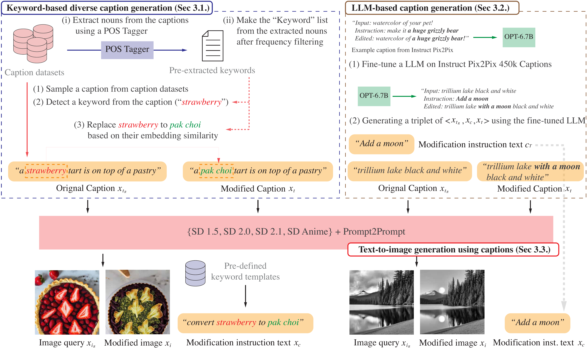
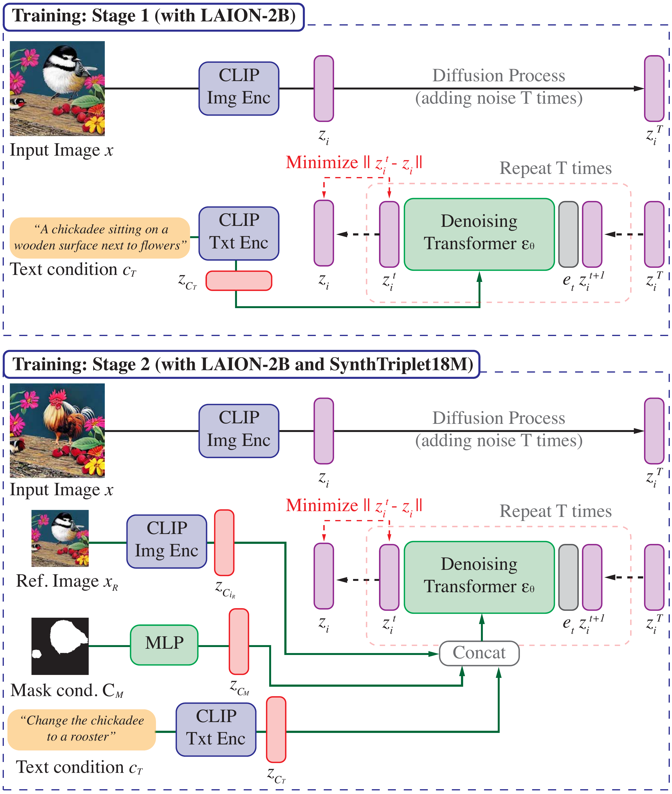
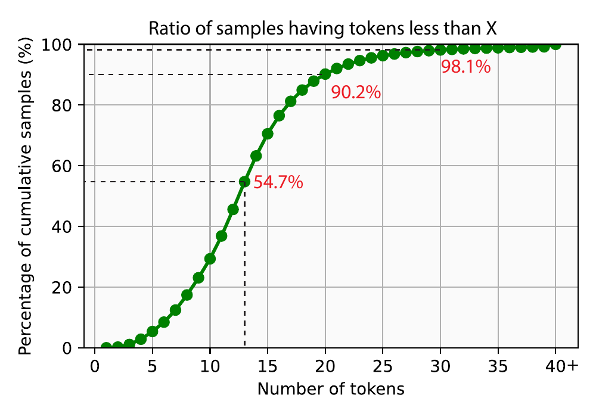
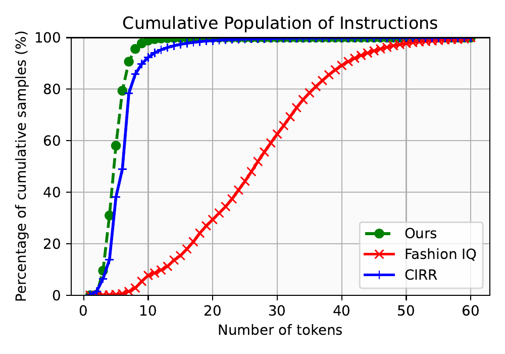

# CompoDiff: Versatile Composed Image Retrieval With Latent Diffusion

## Abstract

This paper proposes a novel diffusion-based model, CompoDiff, for solving Composed Image Retrieval (CIR) with latent diffusion and presents a newly created dataset of 18 million reference images, conditions, and corresponding target image triplets to train the model. CompoDiff not only achieves a new zero-shot state-of-the-art on a CIR benchmark such as FashionIQ but also enables a more versatile CIR by accepting various conditions, such as negative text and image mask conditions, which are unavailable with existing CIR methods. In addition, the CompoDiff features are on the intact CLIP embedding space so that they can be directly used for all existing models exploiting the CLIP space. The code and dataset used for the training, and the pre-trained weights are available at <https://github.com/navervision/CompoDiff>.

# Introduction

Imagine there is a virtual customer seeking a captivating cloth serendipitously found on social media but with different materials and colors. The customer needs a search engine that can process composed queries, , the reference cloth image along with texts specifying the preferred material and color. This task has been recently formulated as *Composed Image Retrieval (CIR)* as shown in the top of  
effig:teaser. CIR systems offer the benefits of visually similar item searches as image-to-image retrieval , while providing a high degree of freedom to depict the desired item as text-to-image retrieval . CIR also can be helpful for improving the search quality by iteratively taking user feedback by text conditions.

<figure id="fig:teaser">

<figcaption> <strong>Composed Image Retrieval (CIR) scenarios.</strong> Top row shows an example of a standard CIR scenario. From the second to the bottom row, we present versatile CIR scenarios with mixed conditions (, negative instruction and mask). All results are retrieved by our CompoDiff on LAION-5B images.</figcaption>
</figure>

To train a model for CIR tasks, we need a dataset of triplets $`\langle \ensuremath{x_{i_R}}, \ensuremath{x_{c}}, \ensuremath{x_i}\rangle`$[^1] consisting of a reference image ($`x_{i_R}`$), a condition ($`x_{c}`$), and the corresponding target image ($`x_i`$). However, obtaining such triplets can be costly and sometimes impossible. Fortunately, existing CIR benchmarks provide such training triplets, which allows CIR models to achieve promising performance within the train-validation split of each dataset. However, the amount of the training triplet is not sufficient (, 30K triplets for Fashion-IQ and 36K triplets for CIRR ) for learning generalizable CIR models, as pointed out in . Furthermore, the existing CIR methods usually consider a scenario where the condition ($`x_{c}`$) is given by a text ($`x_{c_T}`$). Therefore, the CIR models cannot handle more versatile conditions beyond a limited text one, , complex text conditions like negative prompts ($`x_{c_{T^{\text{-}}}}`$) or indicating where ($`x_{c_M}`$) the condition is applied (See  
effig:teaser). In short, the previous CIR models suffer from poor generalizability due to the small dataset scale and the limited types of conditions.

Recent methods address the scalability issue of CIR datasets by leveraging external knowledge from models pre-trained on large-scale datasets such as CLIP . CLIP4Cir fine-tunes the CLIP text encoder on the triplet dataset, but its zero-shot CIR performance is still lacking. In contrast, Pic2Word only fine-tunes projectors on top of frozen CLIP encoders with image-text pairs instead of triplets, achieving zero-shot CIR ability. However, its performance on CIR benchmarks, such as FashionIQ, falls short due to the lack of triplet-based training.

To resolve the data scale issue, we synthesized a vast set of high-quality **18M** triplets of $`\langle \ensuremath{x_{i_R}}, \ensuremath{x_{c}}, \ensuremath{x_i}\rangle`$ by leveraging the large-scale pre-trained generative models such as OPT , and Stable Diffusion . Our massive dataset, named **SynthTriplets18M**, is over 500 times larger than existing CIR datasets and covers a diverse and extensive range of conditioning cases. Our dataset leads to a significant performance improvement for any CIR model. , ARTEMIS trained exclusively with our dataset achieves outperforming zero-shot performance with 40.62 average recalls in FashionIQ, against the fine-tuned counterpart of 38.17. We also achieve state-of-the-art FashionIQ and CIRR results by pre-training the previous best model on SynthTriplets18M and fine-tuning it on the target dataset.

We also introduce a diffusion-based CIR model to compose versatile and complex conditions, named Composed Image Retrieval with Latent Diffusion (CompoDiff). Motivated by recent advances in diffusion models , we train a latent diffusion model translating the embedding of the reference image ($`z_{i_R}`$) to the embedding of the target image ($`z_i`$) guided by the embedding of the given condition ($`z_{c}`$). Thanks to the classifier-free guidance of the diffusion model, CompoDiff can easily handle versatile and complex conditions. As  
effig:teaser, CompoDiff can search images from a given Eiffel Tower image by compositionally instructing “with cherry blossom” (text condition $`x_{c_T}`$), “without France” (negative text condition $`x_{c_{T^{\text{-}}}}`$) or specifying desired locations (mask condition $`x_{c_M}`$), which is not possible with standard CIR scenario with limited text condition $`x_{c_T}`$.

Another notable benefit of our method is the ability to control the conditions during inference, inherited from the nature of diffusion models: Users can adjust the weight of conditions to make the model focus on the user’s preference. Users can also manipulate the randomness of the models to vary the level of serendipity. Moreover, CompoDiff can control the inference speed with minimal sacrifice of retrieval performance, accomplished by adjusting the number of steps in the diffusion model. As a result, our model can be deployed in various scenarios with different computation budgets. Note that all these controllability features can be achieved by controlling inference parameters of classifier-free guidance, without any model training.

Our contributions are as follows: (1) We generate SynthTriplets18M, a diverse and massive synthetic dataset of 18M triplets that can make CIR models achieve zero-shot generalizability. (2) We propose a diffusion-based CIR method (CompoDiff) that can handle versatile CIR scenarios with composed queries with high controllability. (3) CompoDiff shows significant zero-shot and comparable fine-tuned performances on FashionIQ and CIRR datasets. Also, we achieve a new state-of-the-art by pre-training the previous best model on our dataset. (4) Finally, we show the versatility of CompoDiff in the real-world zero-shot CIR scenario, , controllability or various conditions.

# Related Works

#### Composed image retrieval.

Until very recently, the mainstream CIR models were centered around multi-modal fusion methods, which combine image and text features extracted from separately trained visual and text encoders. For example, Vo and Yu used CNN and RNN, and Chen and Anwaar used CNN and Transformer for extracting their respective features. However, as shown in other vision-language tasks (, visual semantic embeddings for COCO Caption retrieval), these separately trained encoders only on the target dataset are easily overwhelmed by large-scale pre-trained models, , CLIP , ALIGN or BLIP .

Baldrati proposed CLIP4Cir, which consists of a first stage to fine-tune a CLIP text encoder and a second stage to train a late-fusion module called a Combiner, showed powerful performance. However, it still requires massive training triplets. Saito proposed a zero-shot CIR model, named Pic2Word, trained on aligned image-text pairs without using the triplet dataset at all. Pic2Word projects a CLIP image feature into the text embedding space and then uses the concatenated feature of the converted image feature and the given text condition as input of the text encoder. Pic2Word achieves reasonable CIR performances without direct training on the expensive triplet datasets. Since both methods freeze and use the CLIP visual encoder during the training process, the gallery (the set of images targeted for retrieval) features can be used exactly as it was extracted from the CLIP visual encoder. A detailed description of these models follows in  
efsubsec:baselines.

All existing CIR models only focus on text conditions ($`z_{c_T}`$) (, the first row of  
effig:teaser). Compared to the previous CIR approaches, our method enables multiple various conditions (, the second to fourth rows of  
effig:teaser), but strong zero-shot and fine-tuned performances by employing (1) a massive synthetic triplet dataset and (2) a latent diffusion model with classifier-free guidance.

#### Dataset creation with diffusion models.

A conventional data collection process for $`\langle \ensuremath{x_{i_R}}, \ensuremath{x_{c}}, \ensuremath{x_i}\rangle`$ is two-staged: collecting candidate reference-target image pairs and manually annotating the modification sentences by human annotators . For example, FashionIQ collects the candidate pairs from the same item category (, shirt, dress, and top) and manually annotates the relative captions by crowd workers. CIRR gathers the candidate pairs from real-life images from the NLVR$`^2`$ dataset . The data collection process for $`\langle \ensuremath{x_{i_R}}, \ensuremath{x_{c}}, \ensuremath{x_i}\rangle`$ inevitably becomes expensive and it makes scale CIR datasets difficult. We mitigate this issue by generating a massive synthetic dataset instead of relying on human annotators.

Recently, there have been attempts to generate synthetic data for improving model performances by utilizing powerful generation ability by diffusion models . Unlike previous attempts to synthesize training data points by GAN , recent diffusion model-based approaches show high-quality images and high controllability by text prompts (, by classifier-free guidance and latent diffusion ). Particularly, Brooks proposed a generation process for $`\langle \ensuremath{x_{i_R}}, \ensuremath{x_{c}}, \ensuremath{x_i}\rangle`$ to train an image editing model. We scale up the dataset synthesis process of Brooks from 450K triplets to 18M. We also make the triplets more diverse by employing the object-level modification process. We describe the details of the InstructPix2Pix dataset generation and our modification of the generation process in the upcoming  
efsec:cir_dataset_gen.

<figure id="fig:dataset_generation_overview">

<figcaption> <span><strong>Overview of the generation process for SynthTriplets18M.</strong></span> <span class="math inline">⟨<em>x</em><sub><em>i</em><sub><em>R</em></sub></sub>, <em>x</em><sub><em>c</em></sub>, <em>x</em><sub><em>i</em></sub>⟩</span> from <span class="math inline">⟨<em>x</em><sub><em>t</em><sub><em>R</em></sub></sub>, <em>x</em><sub><em>c</em></sub>, <em>x</em><sub><em>t</em></sub>⟩</span>. SD denotes StableDiffusion.</figcaption>
</figure>

# SynthTriplets18M: Massive High-Quality Synthesized CIR Dataset

CIR needs a dataset with triplets $`\langle \ensuremath{x_{i_R}}, \ensuremath{x_{c}}, \ensuremath{x_i}\rangle`$ of a reference image ($`x_{i_R}`$), a condition ($`x_{c}`$), and the corresponding target image ($`x_i`$). Instead of collecting a dataset by humans, we propose to generate massive triplet data points by using large generative models. We follow the main idea of Instuct Pix2Pix . First, we generate $`\langle \ensuremath{x_{t_R}}, \ensuremath{x_{c}}, \ensuremath{x_t}\rangle`$ where $`x_{t_R}`$ is a reference caption, $`x_{c_T}`$ is a modification instruction text, and $`x_t`$ is the modified caption by $`x_{c_T}`$. We employ two strategies to generate $`\langle \ensuremath{x_{t_R}}, \ensuremath{x_{c}}, \ensuremath{x_t}\rangle`$: (1) We collect massive captions from the existing caption datasets and generate the modified captions by replacing the keywords in the reference caption. (2) We fine-tune a large language model, OPT-6.7B , on the generated caption triplets by Brooks . After generating massive triplets of $`\langle \ensuremath{x_{t_R}}, \ensuremath{x_{c}}, \ensuremath{x_t}\rangle`$, we generate images from the caption triplet using StableDiffusion and Prompt-to-Prompt following Brooks . We illustrate the overall generation process in  
effig:dataset_generation_overview.

Compared to manual dataset collections , our approach can easily generate more diverse triplets even if a triplet rarely happens in reality (See the “pak choi tart” example in  
effig:dataset_generation_overview). Compared to the synthetic dataset by Brooks , our dataset contains a larger number of triplets (450k vs. 18M). Furthermore, as our caption triplets are synthesized based on keywords, our synthetic captions cover more diverse keywords than Instuct Pix2Pix (47k vs. 586k as shown in  
eftab:keyword_stats).

## Keyword-based diverse caption generation

As the first approach to generating caption triplets, we collect captions from the existing caption datasets and modify the captions by replacing the object terms in the captions, , $`\langle`$“a strawberry tart is ...”, “covert strawberry to pak choi”, “a pak choi tart is ...”$`\rangle`$ in  
effig:dataset_generation_overview. For the caption dataset, We use the captions from COYO 700M , StableDiffusion Prompts[^2] (user-generated prompts that make the quality of StableDiffusion better), LAION-2B-en-aesthetic (a subset of LAION-5B ) and LAION-COCO datasets (synthetic captions for LAION-5B subsets with COCO style captions . LAION-COCO less uses proper nouns than the real web texts).

<div id="tab:keyword_stats">

|  | IP2P | SynthTriplets18M |
|:---|:--:|:--:|
| $`\langle \ensuremath{x_{t_R}}, \ensuremath{x_{c}}, \ensuremath{x_t}\rangle`$ | 450k | 60M |
| Unique object terms | 47,345 | 586,369 |
| $`\langle \ensuremath{x_{i_R}}, \ensuremath{x_{c}}, \ensuremath{x_i}\rangle`$  (Keyword-based) | \- | 11.4M |
| $`\langle \ensuremath{x_{i_R}}, \ensuremath{x_{c}}, \ensuremath{x_i}\rangle`$  (LLM-based) | 1M | 7.4M |
| $`\langle \ensuremath{x_{i_R}}, \ensuremath{x_{c}}, \ensuremath{x_i}\rangle`$  (Total) | 1M | 18.8M |

**Statistics of generated datasets.** We compare our SynthTriplets18M and the dataset by Instruct Pix2Pix (IP2P) in terms of the dataset statistics. $`\langle \ensuremath{x_{t_R}}, \ensuremath{x_{c}}, \ensuremath{x_t}\rangle`$ denotes the triplet of captions {original caption, modification instruction, and modified caption} and $`\langle \ensuremath{x_{i_R}}, \ensuremath{x_{c}}, \ensuremath{x_i}\rangle`$ denotes the triplet of {original image, modification instruction, and modified image}.

</div>

We extract the object terms from the captions using a part-of-speech (POS) tagger, provided by `Spacy`[^3]. After frequency filtering, we have 586k unique object terms. For each caption, we replace the object term with other similar keywords by using the CLIP similarity score. More specifically, we extract the textual feature of keywords using the CLIP ViT-L/14 text encoder, and we choose an alternative keyword from keywords that have a CLIP similarity between 0.5 and 0.7. By converting the original object to a similar object, we have caption pairs of $`\langle \ensuremath{x_{t_R}}, \ensuremath{x_t}\rangle`$.

Using the caption pair $`\langle \ensuremath{x_{t_R}}, \ensuremath{x_t}\rangle`$, we generate the modification instruction text $`x_{c_T}`$ based on a randomly chosen template from 47 pre-defined templates We show examples of templates in  
eftab:example_templates and the Appendix. After this process, we have the triplet of $`\langle \ensuremath{x_{t_R}}, \ensuremath{x_{c}}, \ensuremath{x_t}\rangle`$. We generate $`\approx`$<!-- -->30M triplets by the keyword-based method.

<div id="tab:example_templates">

| Templates to change `${source}` to `${target}`        |
|:------------------------------------------------------|
| *“change `${source}` to `${target}`”*                 |
| *“alter `${source}` to `${target}`”*                  |
| *“`${target}` is added after `${source}` is removed”* |
| *“if it is `${target}`”*                              |
| $`\ldots`$                                            |

**Example keyword converting templates.** The full 47 templates are shown in  
efsubsec:keyword_templates_supp.

</div>

## Amplifying Instruct Pix2Pix triplets by LLM

We also re-use the generated $`\langle \ensuremath{x_{t_R}}, \ensuremath{x_{c}}, \ensuremath{x_t}\rangle`$ by Instruct Pix2Pix. We amplify the number of Instruct Pix2Pix triplets by fine-tuning a large language model, OPT-6.7B , on the generated 452k caption triplets provided by Brook . Using the fine-tuned OPT, we generate $`\approx`$<!-- -->30M triplets.

## Triplet generation from caption triplets

We generate 60M caption triplets $`\langle \ensuremath{x_{t_R}}, \ensuremath{x_{c}}, \ensuremath{x_t}\rangle`$ by the keyword-based generation process and the LLM-based generation process (See  
efsubsec:dataset_stats_supp for the statistics of the captions). Using the triplets, we generate 60M $`\langle \ensuremath{x_{i_R}}, \ensuremath{x_{c}}, \ensuremath{x_i}\rangle`$ by using state-of-the-art text-to-image generation models. Note that two captions do not have a guarantee to be semantically similar. Following Instruct Pix2Pix , we employ Prompt-to-Prompt , which aims to generate similar images for multiple generations by sharing cross-attention weights during the denoising steps of diffusion models.

We employ multiple state-of-the-art text-to-image generation models, including StableDiffusion (SD) 1.5, SD 2.0, SD 2.1, and SD anime models to generate diverse images not biased towards a specific model. We apply the CLIP-based filtering following Brook to remove the low quality $`\langle \ensuremath{x_{i_R}}, \ensuremath{x_{c}}, \ensuremath{x_i}\rangle`$(See  
efsubsec:filtering_supp for details). After the filtering, we have 11.4M $`\langle \ensuremath{x_{i_R}}, \ensuremath{x_{c}}, \ensuremath{x_i}\rangle`$ from the keyword-based generated captions and 7.4M $`\langle \ensuremath{x_{i_R}}, \ensuremath{x_{c}}, \ensuremath{x_i}\rangle`$ from the LLM-based generated captions. It implies that the fidelity of our keyword-based method is higher than OPT fine-tuning in terms of text-to-image generation. As a result, our dataset contains 18.8M synthetic $`\langle \ensuremath{x_{i_R}}, \ensuremath{x_{c}}, \ensuremath{x_i}\rangle`$. We illustrate examples of SynthTriplets18M in  
efsubsec:dataset_examples.

# Method

In this section, we introduce our Composed Image Retrieval with Latent Diffusion (CompoDiff) to solve CIR tasks. Thanks to the massive and diverse synthetic dataset (  
efsec:cir_dataset_gen), we can train a versatile model to handle various conditions based on a latent diffusion model , , the diffusion process is performed in the latent space, not the pixel space. We will describe the training and inference details and how CompoDiff handles various conditions.

<figure id="fig:method_training_overview">

<figcaption> <strong>Overview of our two-stage training strategy.</strong> <span class="math inline"><em>e</em><sub><em>t</em></sub></span> denotes the embedding vector for timestamp <span class="math inline"><em>t</em></span>. For stage 2, we illustrate an example of all three conditions given. In practice, we randomly drop each condition to make CompoDiff handle various scenarios (, text only, image-text composed query).</figcaption>
</figure>

## Training

We employ a two-staged pre-training fine-tuning strategy. In stage 1, we pre-train a transformer decoder to convert CLIP textual embeddings to CLIP visual embeddings with LAION 2B dataset consisting of (image, text) pairs. This stage is similar to training the prior model in Dalle-2 , but our model takes only two tokens; a noised CLIP image embedding and an embedding for the diffusion timestep. In the prior model , 77 encoded text embeddings using the CLIP are employed as the input of the model, which increased the computational cost. However, our CompoDiff uses the 77 encoded text embeddings as conditions through cross-attention mechanisms, which speeds up the process by three times while maintaining similar performance (See  
efsubsec:ablation_study_supp). Instead of using the noise prediction , we observe it is more stable to train the transformer decoder to predict the denoised $`x_i`$ directly.

With CLIP image embeddings of an input image $`z_i`$, encoded CLIP text embeddings for text condition $`z_{c_T}`$, and the transformer $`\epsilon_\theta`$. The objective of the first stage is as follows:
``` math
\mathcal{L}_\text{stage1} = \mathbb{E}_{t\sim[1,T]}  \|z_i - \epsilon_\theta(z_i^{(t)},t \vert z_{c_T}) \|^2
```

In stage 2, we fine-tune the model for composed image retrieval on SynthTriplets18M. By stage 2, we make the model able to generate modified image embeddings based on the context of a reference image, incorporating an instruction text and a mask. We use the CLIP visual and textual encoders to encode a reference image and a text condition (we also tested other text encoders in  
efsubsec:impact_text_encoder_supp). We generate masks by using a zero-shot text-conditioned segmentation model, ClipSeg . We extract object terms from the given caption using a POS tagger, and we generate a segmentation map for each object term using ClipSeg. The mask is resized to 64$`\times`$<!-- -->64 and projected to the same dimensional embedding as that of CLIP embeddings using an MLP. All conditions, including reference image embeddings, mask embeddings, and text embeddings are concatenated for the condition of the denoising Transformer.

We empirically observed that the knowledge from the LAION-2B dataset by stage 1 is easily forgotten during stage 2. To overcome the catastrophic forgetting, we introduce multi-task learning, with text-to-image learning and inpainting each accounting for 30%, and the remaining 40% of training done on the triplet dataset (SynthTriplets18M). The datasets used for text-to-image and inpainting are based on the 2B-scale LAION dataset to maintain the textual representational capability of our model learned in stage 1.

Let us define CLIP image embeddings of a reference image as $`z_{i_R}`$, CLIP image embeddings of a modified target image embeddings as $`z_{i_T}`$, and mask embeddings as $`z_{c_M}`$. We minimize the following objective:
``` math
\mathcal{L}_\text{stage2} = \mathbb{E}_{t\sim[1,T]}  \|z_{i_T} - \epsilon_\theta(z_{i_T}^{(t)},t \vert z_{c_T}, z_{i_R}, z_{c_M}) \|^2.
```
We illustrate the overview of our training scheme in  
effig:method_training_overview.

<figure id="fig:cfg_variation_images">

<figcaption> <strong>Controlling image and text weights for inference.</strong> We show example retrieval results on the LAION images by varying image and text weights, <span class="math inline"><em>w</em><sub><em>I</em></sub></span> and <span class="math inline"><em>w</em><sub><em>T</em></sub></span> in<br />
ef<span>eq:cfg</span>, respectively</figcaption>
</figure>

## Inference

We apply Classifier-free guidance (CFG) , a commonly used technique in text-conditional image generation methods for better text conditioning, for CompoDiff. We randomly drop each condition in stage 1 and stage 2 with 10% probability, except mask conditions. During inference, noisy image embeddings are denoised as follows:
``` math
\label{eq:cfg}
{\scriptsize
\begin{aligned}
\tilde{\epsilon}_\theta(&z_{i}^{(t)},t \vert z_{c_T}, z_{i_R}, z_{c_M}) = \epsilon_\theta(z_{i}^{(t)},t \vert \O, \O, z_{c_M}) \\
&+ w_I(\epsilon_\theta(z_{i}^{(t)},t \vert \O, z_{i_R}, z_{c_M}) -\epsilon_\theta(z_{i}^{(t)},t \vert \O, \O, z_{c_M})) \\
&+ w_T(\epsilon_\theta(z_{i}^{(t)},t \vert z_{c_T}, z_{i_R}, z_{c_M}) -\epsilon_\theta(z_{i}^{(t)},t \vert \O, z_{i_R}, z_{c_M}))
\end{aligned}
}
```
We show the top-1 retrieved item by varying the image and text weights $`w_I`$ and $`w_T`$ from our LAION database in  
effig:cfg_variation_images. By increasing $`w_I`$, our model behaves more like an image-to-image retrieval model. By increasing $`w_T`$, on the other hand, our model focuses more on the text condition “pencil sketch”. We use ($`w_I`$, $`w_T`$) = (1.5, 7.5) for our experiments. The retrieval performances by varying $`w_I`$ and $`w_T`$ are shown in  
efsubsec:ablation_study_supp. We also describe how  
efeq:cfg is changed for negative texts in  
efsubsec:negative_text_supp.

# Experiments

This section describes the experimental results on the zero-shot and fine-tuned composed image retrieval tasks for CompoDiff. We compare CompoDiff with the existing works on the standard CIR benchmarks (, FashionIQ and CIRR ) and zero-shot benchmarks (, domain conversion and object compositional tasks, following ). We also provide qualitative examples of CompoDiff beyond performances, , handling versatile CIR scenarios. Our ablation study shows that by controlling inference hyperparameters, CompoDiff shows trade-offs in various scenarios (, performance vs. inference speed or focusing text more vs. image more). We also conducted experiments on the strengths of CompoDiff compared to other feature transformation models using diffusion models such as UnCLIP . Unless otherwise noted, the model we used was trained with the training process described in  
efsec:method (See  
efsubsec:implementation_details_supp for the detailed hyperparameter settings). We additionally show the advanced version of CompoDiff by replacing the text encoder for text conditions (see a stage 2 training example in  
effig:method_training_overview for details) from the CLIP textual encoder to the combination of the CLIP textual encoder and T5-XL . Details can be found in  
efsubsec:impact_text_encoder_supp.

## Comparision with the State-of-the-Art

#### Comparison methods.

We compare CompoDiff with three state-of-the-art CIR methods as follows:

- **CLIP4Cir** , also known as Combiner, involves a two-stage training process. First, the CLIP text encoder is fine-tuned by contrastive learning of $`z_{c}`$ and $`z_{i_R}`$$`+`$ $`z_{c}`$ in the CLIP embedding space. The second stage replaces $`z_{i_R}`$$`+`$ $`z_{c}`$ to the learnable Combiner module. Only the Combiner module is trained during the second stage. Hence, its image embedding space is the same as the original CLIP space as CompoDiff.

- **ARTEMIS** optimizes two similarities simultaneously. The implicit similarity is computed between the combined feature of $`z_i`$ and $`z_{c}`$, and the combined one of $`z_{i_R}`$ and $`z_{c}`$. The explicit matching is computed between $`z_i`$ and $`z_{c}`$. ARTEMIS suffers from the same drawback as previous CIR methods, TIRG : As it should compute combined feature of $`z_i`$ and $`z_{c}`$, it is not feasible to use an approximate nearest neighbor search algorithm, such as FAISS . This is not a big problem in a small dataset like FashionIQ, but it makes ARTEMIS infeasible in real-world CIR scenarios, , the entire LAION-5B dataset is the target database.

- **Pic2Word** projects a visual feature into text embedding space, instead of combining them. Pic2Word performs a text-to-image retrieval by using the concatenated feature as the input of the CLIP textual encoder. As the projection module is solely trained on cheap paired datasets without expensive triplet datasets, it is able to solve CIR in a zero-shot manner.

For the qualitative comparison, we re-train Pic2Word on LAION-2B-en because their pre-trained weight is not publically available. We also demonstrate the effectiveness of our synthetic dataset by training the comparison methods on SynthTriplets18M with the default hyperparameters.

#### FashionIQ.

<div id="tab:fashioniq">

<table>
<caption> <strong>Comparisons on FashionIQ validation set.</strong> We report two scenarios. The “Zero-shot” scenario performs a composed-image retrieval using a model not trained on the FashionIQ dataset, while models are trained on FashionIQ for the “Supervised” scenario. “train w/ our dataset” denotes that a model is trained on our synthetic dataset (<br />
ef<span>sec:cir_dataset_gen</span>).</caption>
<tbody>
<tr>
<td style="text-align: left;"></td>
<td colspan="2" style="text-align: center;">Shirt</td>
<td colspan="2" style="text-align: center;">Dress</td>
<td colspan="2" style="text-align: center;">Toptee</td>
<td colspan="3" style="text-align: center;">Average</td>
</tr>
<tr>
<td style="text-align: left;">Method</td>
<td style="text-align: center;">R@10</td>
<td style="text-align: center;">R@50</td>
<td style="text-align: center;">R@10</td>
<td style="text-align: center;">R@50</td>
<td style="text-align: center;">R@10</td>
<td style="text-align: center;">R@50</td>
<td style="text-align: center;">R@10</td>
<td style="text-align: center;">R@50</td>
<td style="text-align: center;">Avg.</td>
</tr>
<tr>
<td colspan="10" style="text-align: center;">Zero-shot</td>
</tr>
<tr>
<td style="text-align: left;">Pic2Word <span class="citation" data-cites="saito2023pic2word"></span></td>
<td style="text-align: center;">20.00</td>
<td style="text-align: center;">40.20</td>
<td style="text-align: center;">26.20</td>
<td style="text-align: center;">43.60</td>
<td style="text-align: center;">27.90</td>
<td style="text-align: center;">47.40</td>
<td style="text-align: center;">24.70</td>
<td style="text-align: center;">43.70</td>
<td style="text-align: center;">34.20</td>
</tr>
<tr>
<td style="text-align: left;">ARTEMIS <span class="citation" data-cites="delmas2022artemis"></span> trained w/ our dataset</td>
<td style="text-align: center;">30.70</td>
<td style="text-align: center;">50.43</td>
<td style="text-align: center;">33.52</td>
<td style="text-align: center;">46.54</td>
<td style="text-align: center;">35.49</td>
<td style="text-align: center;">47.01</td>
<td style="text-align: center;">33.24</td>
<td style="text-align: center;">47.99</td>
<td style="text-align: center;">40.62</td>
</tr>
<tr>
<td style="text-align: left;">CLIP4Cir <span class="citation" data-cites="baldrati2022clip4cir"></span> trained w/ our dataset</td>
<td style="text-align: center;">32.32</td>
<td style="text-align: center;"><u>51.65</u></td>
<td style="text-align: center;"><strong>34.92</strong></td>
<td style="text-align: center;"><strong>48.38</strong></td>
<td style="text-align: center;">35.65</td>
<td style="text-align: center;">48.10</td>
<td style="text-align: center;">34.30</td>
<td style="text-align: center;"><u>49.38</u></td>
<td style="text-align: center;">41.84</td>
</tr>
<tr>
<td style="text-align: left;">CompoDiff(ours)</td>
<td style="text-align: center;"><u>37.69</u></td>
<td style="text-align: center;">49.08</td>
<td style="text-align: center;">32.24</td>
<td style="text-align: center;">46.27</td>
<td style="text-align: center;"><u>38.12</u></td>
<td style="text-align: center;"><u>50.57</u></td>
<td style="text-align: center;"><u>36.02</u></td>
<td style="text-align: center;">48.64</td>
<td style="text-align: center;"><u>42.33</u></td>
</tr>
<tr>
<td style="text-align: left;">CompoDiff(ours) w/ T5-XL <span class="citation" data-cites="t5"></span></td>
<td style="text-align: center;"><strong>38.10</strong></td>
<td style="text-align: center;"><strong>52.48</strong></td>
<td style="text-align: center;"><u>33.91</u></td>
<td style="text-align: center;"><u>47.85</u></td>
<td style="text-align: center;"><strong>40.07</strong></td>
<td style="text-align: center;"><strong>52.22</strong></td>
<td style="text-align: center;"><strong>37.36</strong></td>
<td style="text-align: center;"><strong>50.85</strong></td>
<td style="text-align: center;"><strong>44.11</strong></td>
</tr>
<tr>
<td colspan="10" style="text-align: center;">Supervised</td>
</tr>
<tr>
<td style="text-align: left;">JVSM <span class="citation" data-cites="chen2020jvsm"></span></td>
<td style="text-align: center;">12.00</td>
<td style="text-align: center;">27.10</td>
<td style="text-align: center;">10.70</td>
<td style="text-align: center;">25.90</td>
<td style="text-align: center;">13.00</td>
<td style="text-align: center;">26.90</td>
<td style="text-align: center;">11.90</td>
<td style="text-align: center;">26.60</td>
<td style="text-align: center;">19.25</td>
</tr>
<tr>
<td style="text-align: left;">CIRPLANT w/ OSCAR <span class="citation" data-cites="liu2021cirplant"></span></td>
<td style="text-align: center;">17.53</td>
<td style="text-align: center;">38.81</td>
<td style="text-align: center;">17.45</td>
<td style="text-align: center;">40.41</td>
<td style="text-align: center;">21.64</td>
<td style="text-align: center;">45.38</td>
<td style="text-align: center;">18.87</td>
<td style="text-align: center;">41.53</td>
<td style="text-align: center;">30.20</td>
</tr>
<tr>
<td style="text-align: left;">TRACE w/ BERT <span class="citation" data-cites="jandial2020trace"></span></td>
<td style="text-align: center;">20.80</td>
<td style="text-align: center;">40.80</td>
<td style="text-align: center;">22.70</td>
<td style="text-align: center;">44.91</td>
<td style="text-align: center;">24.22</td>
<td style="text-align: center;">49.80</td>
<td style="text-align: center;">22.57</td>
<td style="text-align: center;">46.19</td>
<td style="text-align: center;">34.38</td>
</tr>
<tr>
<td style="text-align: left;">VAL w/ GloVe <span class="citation" data-cites="chen2020val"></span></td>
<td style="text-align: center;">22.38</td>
<td style="text-align: center;">44.15</td>
<td style="text-align: center;">22.53</td>
<td style="text-align: center;">44.00</td>
<td style="text-align: center;">27.53</td>
<td style="text-align: center;">51.68</td>
<td style="text-align: center;">24.15</td>
<td style="text-align: center;">46.61</td>
<td style="text-align: center;">35.38</td>
</tr>
<tr>
<td style="text-align: left;">MAAF <span class="citation" data-cites="dodds2020maaf"></span></td>
<td style="text-align: center;">21.30</td>
<td style="text-align: center;">44.20</td>
<td style="text-align: center;">23.80</td>
<td style="text-align: center;">48.60</td>
<td style="text-align: center;">27.90</td>
<td style="text-align: center;">53.60</td>
<td style="text-align: center;">24.30</td>
<td style="text-align: center;">48.80</td>
<td style="text-align: center;">36.55</td>
</tr>
<tr>
<td style="text-align: left;">ARTEMIS <span class="citation" data-cites="delmas2022artemis"></span></td>
<td style="text-align: center;">21.78</td>
<td style="text-align: center;">43.64</td>
<td style="text-align: center;">27.16</td>
<td style="text-align: center;">52.40</td>
<td style="text-align: center;">29.20</td>
<td style="text-align: center;">54.83</td>
<td style="text-align: center;">26.05</td>
<td style="text-align: center;">50.29</td>
<td style="text-align: center;">38.17</td>
</tr>
<tr>
<td style="text-align: left;">CurlingNet <span class="citation" data-cites="yu2020curlingnet"></span></td>
<td style="text-align: center;">21.45</td>
<td style="text-align: center;">44.56</td>
<td style="text-align: center;">26.15</td>
<td style="text-align: center;">53.24</td>
<td style="text-align: center;">30.12</td>
<td style="text-align: center;">55.23</td>
<td style="text-align: center;">25.90</td>
<td style="text-align: center;">51.01</td>
<td style="text-align: center;">38.46</td>
</tr>
<tr>
<td style="text-align: left;">CoSMo <span class="citation" data-cites="lee2021cosmo"></span></td>
<td style="text-align: center;">24.90</td>
<td style="text-align: center;">49.18</td>
<td style="text-align: center;">25.64</td>
<td style="text-align: center;">50.30</td>
<td style="text-align: center;">29.21</td>
<td style="text-align: center;">57.46</td>
<td style="text-align: center;">26.58</td>
<td style="text-align: center;">52.31</td>
<td style="text-align: center;">39.45</td>
</tr>
<tr>
<td style="text-align: left;">RTIC-GCN w/ GloVe <span class="citation" data-cites="shin2021rtic"></span></td>
<td style="text-align: center;">23.79</td>
<td style="text-align: center;">47.25</td>
<td style="text-align: center;">29.15</td>
<td style="text-align: center;">54.04</td>
<td style="text-align: center;">31.61</td>
<td style="text-align: center;">57.98</td>
<td style="text-align: center;">28.18</td>
<td style="text-align: center;">53.09</td>
<td style="text-align: center;">40.64</td>
</tr>
<tr>
<td style="text-align: left;">DCNet <span class="citation" data-cites="kim2021dcnet"></span></td>
<td style="text-align: center;">23.95</td>
<td style="text-align: center;">47.30</td>
<td style="text-align: center;">28.95</td>
<td style="text-align: center;">56.07</td>
<td style="text-align: center;">30.44</td>
<td style="text-align: center;">58.29</td>
<td style="text-align: center;">27.78</td>
<td style="text-align: center;">53.89</td>
<td style="text-align: center;">40.84</td>
</tr>
<tr>
<td style="text-align: left;">AACL <span class="citation" data-cites="tian2022aacl"></span></td>
<td style="text-align: center;">24.82</td>
<td style="text-align: center;">48.85</td>
<td style="text-align: center;">29.89</td>
<td style="text-align: center;">55.85</td>
<td style="text-align: center;">30.88</td>
<td style="text-align: center;">56.85</td>
<td style="text-align: center;">28.53</td>
<td style="text-align: center;">53.85</td>
<td style="text-align: center;">41.19</td>
</tr>
<tr>
<td style="text-align: left;">SAC w/ BERT <span class="citation" data-cites="jandial2022sac"></span></td>
<td style="text-align: center;">28.02</td>
<td style="text-align: center;">51.86</td>
<td style="text-align: center;">26.52</td>
<td style="text-align: center;">51.01</td>
<td style="text-align: center;">32.70</td>
<td style="text-align: center;">61.23</td>
<td style="text-align: center;">29.08</td>
<td style="text-align: center;">54.70</td>
<td style="text-align: center;">41.89</td>
</tr>
<tr>
<td style="text-align: left;">MUR <span class="citation" data-cites="chen2022mur"></span></td>
<td style="text-align: center;">30.60</td>
<td style="text-align: center;">57.46</td>
<td style="text-align: center;">31.54</td>
<td style="text-align: center;">58.29</td>
<td style="text-align: center;">37.37</td>
<td style="text-align: center;">68.41</td>
<td style="text-align: center;">33.17</td>
<td style="text-align: center;">61.39</td>
<td style="text-align: center;">47.28</td>
</tr>
<tr>
<td style="text-align: left;">CLIP4Cir <span class="citation" data-cites="baldrati2022clip4cir"></span></td>
<td style="text-align: center;">39.99</td>
<td style="text-align: center;"><u>60.45</u></td>
<td style="text-align: center;">33.81</td>
<td style="text-align: center;"><u>59.40</u></td>
<td style="text-align: center;">41.41</td>
<td style="text-align: center;"><u>65.37</u></td>
<td style="text-align: center;">38.32</td>
<td style="text-align: center;"><u>61.74</u></td>
<td style="text-align: center;"><u>50.03</u></td>
</tr>
<tr>
<td style="text-align: left;">ARTEMIS <span class="citation" data-cites="delmas2022artemis"></span> trained w/ our dataset</td>
<td style="text-align: center;">32.17</td>
<td style="text-align: center;">53.32</td>
<td style="text-align: center;">34.80</td>
<td style="text-align: center;">48.10</td>
<td style="text-align: center;">36.58</td>
<td style="text-align: center;">47.63</td>
<td style="text-align: center;">34.52</td>
<td style="text-align: center;">49.68</td>
<td style="text-align: center;">42.10</td>
</tr>
<tr>
<td style="text-align: left;">CLIP4Cir <span class="citation" data-cites="baldrati2022clip4cir"></span> trained w/ our dataset</td>
<td style="text-align: center;">37.21</td>
<td style="text-align: center;"><strong>60.71</strong></td>
<td style="text-align: center;"><strong>42.75</strong></td>
<td style="text-align: center;"><strong>60.50</strong></td>
<td style="text-align: center;"><u>42.98</u></td>
<td style="text-align: center;"><strong>65.49</strong></td>
<td style="text-align: center;"><strong>40.98</strong></td>
<td style="text-align: center;"><strong>62.23</strong></td>
<td style="text-align: center;"><strong>51.61</strong></td>
</tr>
<tr>
<td style="text-align: left;">CompoDiff(ours)</td>
<td style="text-align: center;"><strong>40.88</strong></td>
<td style="text-align: center;">53.06</td>
<td style="text-align: center;">35.53</td>
<td style="text-align: center;">49.56</td>
<td style="text-align: center;">41.15</td>
<td style="text-align: center;">54.12</td>
<td style="text-align: center;">39.05</td>
<td style="text-align: center;">52.34</td>
<td style="text-align: center;">46.31</td>
</tr>
<tr>
<td style="text-align: left;">CompoDiff(ours) w/ T5-XL <span class="citation" data-cites="t5"></span></td>
<td style="text-align: center;"><u>40.65</u></td>
<td style="text-align: center;"><u>57.14</u></td>
<td style="text-align: center;">36.87</td>
<td style="text-align: center;">57.39</td>
<td style="text-align: center;"><strong>43.93</strong></td>
<td style="text-align: center;">61.17</td>
<td style="text-align: center;"><u>40.48</u></td>
<td style="text-align: center;">58.57</td>
<td style="text-align: center;">49.53</td>
</tr>
</tbody>
</table>

</div>

FashionIQ, the most popular CIR benchmark, has (46.6k / 15.5k / 15.5k) (training / validation / test) images with three fashion categories: Shirt, Dress, and Toptee. Each category has 18k training triplets and 12k evaluation triplets of $`\langle \ensuremath{x_{i_R}}, \ensuremath{x_{c}}, \ensuremath{x_i}\rangle`$.  
eftab:fashioniq shows the comparison of CompoDiff with baselines. Following the standard choice, we use recall@K as the evaluation metric. “Zero-shot” means that the models are not trained on FashionIQ. ARTEMIS and CLIP4Cir are originally designed for the supervised setting, but, we trained them on our synthetic dataset for a fair comparison with our method. Namely, we solely train them on our dataset for the zero-shot benchmark and fine-tune the zero-shot weights on the FashionIQ training set for the supervised benchmark. As the result show, CompoDiff achieves a new state-of-the-art zero-shot performance and performes competitively in a supervised manner.

#### CIRR.

<div id="tab:cirr">

<table>
<caption> <strong>Compasions on CIRR Test set.</strong> Details are the same as<br />
ef<span>tab:fashioniq</span>.</caption>
<thead>
<tr>
<th style="text-align: left;">Method</th>
<th style="text-align: center;">R@1</th>
<th style="text-align: center;">R@5</th>
<th style="text-align: center;">R@10</th>
<th style="text-align: center;">R@50</th>
<th style="text-align: center;"><span class="math inline">R<sub>s</sub></span>@1</th>
<th style="text-align: center;"><span class="math inline">R<sub>s</sub></span>@2</th>
<th style="text-align: center;"><span class="math inline">R<sub>s</sub></span>@3</th>
<th style="text-align: center;">Avg(R@1, <span class="math inline">R<sub>s</sub></span>@1)</th>
</tr>
</thead>
<tbody>
<tr>
<td colspan="9" style="text-align: center;">Zero-shot</td>
</tr>
<tr>
<td style="text-align: left;">Pic2Word <span class="citation" data-cites="saito2023pic2word"></span></td>
<td style="text-align: center;"><strong>23.90</strong></td>
<td style="text-align: center;">51.70</td>
<td style="text-align: center;">65.30</td>
<td style="text-align: center;">87.80</td>
<td style="text-align: center;">-</td>
<td style="text-align: center;">-</td>
<td style="text-align: center;">-</td>
<td style="text-align: center;">-</td>
</tr>
<tr>
<td style="text-align: left;">ARTEMIS <span class="citation" data-cites="delmas2022artemis"></span> trained w/ our dataset</td>
<td style="text-align: center;">12.75</td>
<td style="text-align: center;">33.84</td>
<td style="text-align: center;">47.75</td>
<td style="text-align: center;">80.20</td>
<td style="text-align: center;">21.95</td>
<td style="text-align: center;">43.88</td>
<td style="text-align: center;">62.06</td>
<td style="text-align: center;">17.35</td>
</tr>
<tr>
<td style="text-align: left;">CLIP4Cir <span class="citation" data-cites="baldrati2022clip4cir"></span> trained w/ our dataset</td>
<td style="text-align: center;">12.82</td>
<td style="text-align: center;">36.83</td>
<td style="text-align: center;">48.19</td>
<td style="text-align: center;">81.91</td>
<td style="text-align: center;"><u>24.12</u></td>
<td style="text-align: center;"><u>46.47</u></td>
<td style="text-align: center;"><u>63.07</u></td>
<td style="text-align: center;"><u>18.47</u></td>
</tr>
<tr>
<td style="text-align: left;">CompoDiff(ours)</td>
<td style="text-align: center;">18.24</td>
<td style="text-align: center;"><u>53.14</u></td>
<td style="text-align: center;"><u>70.82</u></td>
<td style="text-align: center;"><u>90.35</u></td>
<td style="text-align: center;"><strong>27.51</strong></td>
<td style="text-align: center;"><u>48.30</u></td>
<td style="text-align: center;"><u>65.54</u></td>
<td style="text-align: center;"><u>22.88</u></td>
</tr>
<tr>
<td style="text-align: left;">CompoDiff(ours) w/ T5-XL <span class="citation" data-cites="t5"></span></td>
<td style="text-align: center;"><u>19.37</u></td>
<td style="text-align: center;"><strong>53.81</strong></td>
<td style="text-align: center;"><strong>72.02</strong></td>
<td style="text-align: center;"><strong>90.85</strong></td>
<td style="text-align: center;"><strong>28.96</strong></td>
<td style="text-align: center;"><strong>49.21</strong></td>
<td style="text-align: center;"><strong>67.03</strong></td>
<td style="text-align: center;"><strong>24.17</strong></td>
</tr>
<tr>
<td colspan="9" style="text-align: center;">Supervised</td>
</tr>
<tr>
<td style="text-align: left;">TIRG <span class="citation" data-cites="vo2019tirg"></span></td>
<td style="text-align: center;">14.61</td>
<td style="text-align: center;">48.37</td>
<td style="text-align: center;">64.08</td>
<td style="text-align: center;">90.03</td>
<td style="text-align: center;">22.67</td>
<td style="text-align: center;">44.97</td>
<td style="text-align: center;">65.14</td>
<td style="text-align: center;">18.64</td>
</tr>
<tr>
<td style="text-align: left;">TIRG + LastConv <span class="citation" data-cites="vo2019tirg"></span></td>
<td style="text-align: center;">11.04</td>
<td style="text-align: center;">35.68</td>
<td style="text-align: center;">51.27</td>
<td style="text-align: center;">83.29</td>
<td style="text-align: center;">23.82</td>
<td style="text-align: center;">45.65</td>
<td style="text-align: center;">64.55</td>
<td style="text-align: center;">17.43</td>
</tr>
<tr>
<td style="text-align: left;">MAAF <span class="citation" data-cites="dodds2020maaf"></span></td>
<td style="text-align: center;">10.31</td>
<td style="text-align: center;">33.03</td>
<td style="text-align: center;">48.30</td>
<td style="text-align: center;">80.06</td>
<td style="text-align: center;">21.05</td>
<td style="text-align: center;">41.81</td>
<td style="text-align: center;">61.60</td>
<td style="text-align: center;">15.68</td>
</tr>
<tr>
<td style="text-align: left;">MAAF + BERT <span class="citation" data-cites="dodds2020maaf"></span></td>
<td style="text-align: center;">10.12</td>
<td style="text-align: center;">33.10</td>
<td style="text-align: center;">48.01</td>
<td style="text-align: center;">80.57</td>
<td style="text-align: center;">22.04</td>
<td style="text-align: center;">42.41</td>
<td style="text-align: center;">62.14</td>
<td style="text-align: center;">16.08</td>
</tr>
<tr>
<td style="text-align: left;">MAAF-IT <span class="citation" data-cites="dodds2020maaf"></span></td>
<td style="text-align: center;">9.90</td>
<td style="text-align: center;">32.86</td>
<td style="text-align: center;">48.83</td>
<td style="text-align: center;">80.27</td>
<td style="text-align: center;">21.17</td>
<td style="text-align: center;">42.04</td>
<td style="text-align: center;">60.91</td>
<td style="text-align: center;">15.54</td>
</tr>
<tr>
<td style="text-align: left;">MAAF-RP <span class="citation" data-cites="dodds2020maaf"></span></td>
<td style="text-align: center;">10.22</td>
<td style="text-align: center;">33.32</td>
<td style="text-align: center;">48.68</td>
<td style="text-align: center;">81.84</td>
<td style="text-align: center;">21.41</td>
<td style="text-align: center;">42.17</td>
<td style="text-align: center;">61.60</td>
<td style="text-align: center;">15.82</td>
</tr>
<tr>
<td style="text-align: left;">CIRPLANT <span class="citation" data-cites="liu2021cirplant"></span></td>
<td style="text-align: center;">15.18</td>
<td style="text-align: center;">43.36</td>
<td style="text-align: center;">60.48</td>
<td style="text-align: center;">87.64</td>
<td style="text-align: center;">33.81</td>
<td style="text-align: center;">56.99</td>
<td style="text-align: center;">75.40</td>
<td style="text-align: center;">24.50</td>
</tr>
<tr>
<td style="text-align: left;">CIRPLANT w/ OSCAR <span class="citation" data-cites="liu2021cirplant"></span></td>
<td style="text-align: center;">19.55</td>
<td style="text-align: center;">52.55</td>
<td style="text-align: center;">68.39</td>
<td style="text-align: center;">92.38</td>
<td style="text-align: center;">39.20</td>
<td style="text-align: center;">63.03</td>
<td style="text-align: center;">79.49</td>
<td style="text-align: center;">29.38</td>
</tr>
<tr>
<td style="text-align: left;">ARTEMIS <span class="citation" data-cites="delmas2022artemis"></span></td>
<td style="text-align: center;">16.96</td>
<td style="text-align: center;">46.10</td>
<td style="text-align: center;">61.31</td>
<td style="text-align: center;">87.73</td>
<td style="text-align: center;">39.99</td>
<td style="text-align: center;">62.20</td>
<td style="text-align: center;">75.67</td>
<td style="text-align: center;">28.48</td>
</tr>
<tr>
<td style="text-align: left;">CLIP4Cir <span class="citation" data-cites="baldrati2022clip4cir"></span></td>
<td style="text-align: center;"><u>38.53</u></td>
<td style="text-align: center;"><u>69.98</u></td>
<td style="text-align: center;"><u>81.86</u></td>
<td style="text-align: center;"><u>95.93</u></td>
<td style="text-align: center;"><u>68.19</u></td>
<td style="text-align: center;"><u>85.64</u></td>
<td style="text-align: center;"><u>94.17</u></td>
<td style="text-align: center;"><u>53.36</u></td>
</tr>
<tr>
<td style="text-align: left;">ARTEMIS <span class="citation" data-cites="delmas2022artemis"></span> trained w/ our dataset</td>
<td style="text-align: center;">18.85</td>
<td style="text-align: center;">51.44</td>
<td style="text-align: center;">68.01</td>
<td style="text-align: center;">91.93</td>
<td style="text-align: center;">38.85</td>
<td style="text-align: center;">62.00</td>
<td style="text-align: center;">77.68</td>
<td style="text-align: center;">28.85</td>
</tr>
<tr>
<td style="text-align: left;">CLIP4Cir <span class="citation" data-cites="baldrati2022clip4cir"></span> trained w/ our dataset</td>
<td style="text-align: center;"><strong>39.99</strong></td>
<td style="text-align: center;"><strong>73.63</strong></td>
<td style="text-align: center;"><strong>86.77</strong></td>
<td style="text-align: center;"><strong>96.55</strong></td>
<td style="text-align: center;"><strong>68.41</strong></td>
<td style="text-align: center;"><strong>86.12</strong></td>
<td style="text-align: center;"><strong>94.80</strong></td>
<td style="text-align: center;"><strong>54.20</strong></td>
</tr>
<tr>
<td style="text-align: left;">CompoDiff(ours)</td>
<td style="text-align: center;">21.30</td>
<td style="text-align: center;">55.01</td>
<td style="text-align: center;">72.62</td>
<td style="text-align: center;">91.49</td>
<td style="text-align: center;">33.74</td>
<td style="text-align: center;">55.25</td>
<td style="text-align: center;">74.81</td>
<td style="text-align: center;">27.52</td>
</tr>
<tr>
<td style="text-align: left;">CompoDiff(ours) w/ T5-XL <span class="citation" data-cites="t5"></span></td>
<td style="text-align: center;">22.35</td>
<td style="text-align: center;">54.36</td>
<td style="text-align: center;">73.41</td>
<td style="text-align: center;">91.77</td>
<td style="text-align: center;">35.84</td>
<td style="text-align: center;">56.11</td>
<td style="text-align: center;">76.60</td>
<td style="text-align: center;">29.10</td>
</tr>
</tbody>
</table>

</div>

As FashionIQ is fashion domain-specific, we also compare the methods on more generic images in CIRR. CIRR has 36k open-domain triplets divided into the train, validation, and test sets in 8:1:1 split.  
eftab:cirr shows the results, and all experimental settings were identical to FashionIQ.

<figure id="fig:ours_vs_pic2word">

<figcaption> <span><strong>Qualitative comparison of zero-shot CIR for Pic2Word and CompoDiff.</strong></span> We conduct CIR on LAION with two composed query scenarios. As Pic2Word cannot take a simple instruction, we made a simple modification for the given instruction as shown. Pic2Word inserts the image-converted text embedding at the position of * in the original text embedding.</figcaption>
</figure>

Similar to FashionIQ, CompoDiff also achieves a new state-of-the-art CIRR zero-shot performance. It is noteworthy that CLIP4Cir performs great in the supervised setting but performs worse than CompoDiff in the zero-shot setting. We presume that the fine-tuned CLIP4Cir text encoder is overfitted to long-tailed CIRR captions. It is partially supported by our additional experiments using the combination of CLIP encoder and T5-XL text encoder ; a better understanding of complex texts provides better performances (Details and more results are in  
efsubsec:impact_text_encoder_supp).

For both datasets, we achieve state-of-the-art by fine-tuning the CLIP4Cir model trained on our dataset to the target dataset. It shows the benefits of our dataset compared to the limited number of CIR triplet datasets.

#### Additional tasks.

We also conduct additional zero-shot evaluation results following Saito . We report the results of a domain conversation task on ImageNet-R (  
efsubsec:domain_conversion_supp), and an object compositional task on MS-COCO (  
efsubsec:object_conversion_supp). In summary, CompoDiff outperforms Pic2Word on ImageNet-R, but not on COCO. Detailed discussions are in  
efsec:more_experiments_supp.

## Qualitative examples

We qualitatively show the versatility of CompoDiff for handling various conditions. For example, CompoDiff not only can handle a text condition, but it can also handle a *negative* text condition (, removing specific objects or patterns in the retrieval results), masked text condition (, specifying the area for applying the text condition). CompoDiff even can handle all conditions simultaneously (, handling positive and negative text conditions with a partly masked reference image at the same time). To show the quality of the retrieval results, we conduct a zero-shot CIR on entire LAION dataset using FAISS for simulating billion-scale CIR scenarios. We show an example in  
effig:teaser and more examples are shown in  
efsubsec:more_examples_supp.

  
effig:ours_vs_pic2word shows qualitative examples of zero-shot CIR results by Pic2Word and CompoDiff. CompoDiff results in semantically high-quality retrieval results (, understanding the “crowdedness” of the query image and the meaning of the query text at the same time). However, Pic2Word shows poor understanding of the given queries, resulting in unfortunate retrieval results (, ignoring “grown up” of text query, or the “crowdedness” of the query image). We provide the details and more examples in  
efsubsec:more_examples_supp.

Finally, it is worth noting that CompoDiff generates a feature belonging to the CLIP space. It means that we can apply the unCLIP generator on our composed features. We compare the retrieval results from the LAION dataset and the generated images in  
efsubsec:unclip_supp. CompoDiff can manipulate the given input reflecting the given conditions.

## Ablation Studies

We provide ablation studies for our design choices, including the architecture design, the trade-off between the denoising step (, inference time) and performances, and the retrieval performances by varying the image and text weights ($`w_I`$ and $`w_T`$). In summary, our design choice shows $`\times`$ 3 faster inference time than the prior model but better text-to-image retrieval performances on COCO. Also, we observe that CompoDiff performs better by increasing the de-noising step, but empirically shows good performances with the de-noising step size 5. Due to the page limit, the full results can be found in  
efsubsec:ablation_study_supp.

# Conclusion

In this paper, we have introduced Composed Image Retrieval with Latent Diffusion (CompoDiff), a novel method for solving complex composed image retrieval (CIR) tasks. We have created a large and diverse dataset named SynthTriplets18M, consisting of 18M triplets of images, modification texts, and modified images. Our model has demonstrated impressive zero-shot CIR capabilities, as well as remarkable versatility in handling diverse conditions, such as negative text or image masks. Additionally, by pre-training previous state-of-the-art CLIP4Cir on SynthTriplets18M and fine-tuning it on each target dataset, we have achieved state-of-the-art performance in both FashionIQ and CIRR benchmarks. We strongly encourage future researchers to leverage our dataset for advancing the field of CIR.

# Societal Impact

Our work is primarily focused on solving complex composed image retrieval (CIR) challenges and is not designed for image editing purposes. However, we are aware that with the use of additional public resources, such as the community version of the unCLIP feature decoder , our method can potentially be utilized as an image editing method. We would like to emphasize that this unintended application is not the primary objective of our research, and we cannot guarantee the effectiveness or safety of our method in this context.

It is important to note that we have taken steps to mitigate potential risks associated with the unintended use of our method for image editing. For instance, we applied NSFW filters to filter out potentially malicious samples during the creation of SynthTriplets18M. Nevertheless, we recognize the need for continued research into the ethical and societal implications of AI technologies and pledge to remain vigilant about potential unintended consequences of our work.

# Appendix

In this additional document, we describe the details of our data generation process in  
efsec:cir_dataset_gen_supp, including the statistics of our generated dataset (  
efsubsec:dataset_stats_supp), the full keyword converting templates (  
efsubsec:keyword_templates_supp), the dataset filtering process (  
efsubsec:filtering_supp) and examples of SynthTriplets18M(  
efsubsec:dataset_examples). We also provide more details for CompoDiff in  
efsec:more_method_details_supp, including how to handle negative texts (  
efsubsec:negative_text_supp) and denoising Transformer details (  
efsubsec:denoising_transformer_supp).  
efsec:exp_details_supp contains more experimental details of CompoDiff, such as the implementation details (  
efsubsec:implementation_details_supp) and the details of LAION dataset for retrieval (  
efsubsec:laiondataset_supp). Finally, we provide more experimental results in  
efsec:more_experiments_supp, including the impact of the text encoder (  
efsubsec:impact_text_encoder_supp), the domain conversion task (  
efsubsec:domain_conversion_supp), the object compositional task (  
efsubsec:object_conversion_supp), more qualitative examples (  
efsubsec:more_examples_supp), ablation study (  
efsubsec:ablation_study_supp) and generation examples by using the unCLIP generator (  
efsubsec:unclip_supp).

# More Details for SynthTriplets18M

## Dataset Statistics

We show the statistics of our generated caption dataset (, before text-to-image generation, $`x_{t_R}`$ and $`x_t`$). We use the CLIP tokenizer to measure the statistics of the captions.  
effig:data_stats_supp shows the cumulative ratio of captions with tokens less than X. About half of the captions have less than 13 tokens, and 90% of the captions have less than 20 tokens. Only 0.8% of the captions have more than 40 tokens.

We also compare our dataset, FashionIQ and CIRR in terms of the token statistics of instructions (, $`x_{c}`$).  
effig:instruction_stats_supp shows that our dataset has relatively shorter instructions than other human-annotated instructions. We presume that this is why CompoDiff performs better when fine-tuning on the target dataset.

<figure id="fig:data_stats_supp">

<figcaption> <span><strong>Statistics of our captions.</strong></span> We show the population of our captions by the number of tokens per caption. We include captions having larger than 40 tokens in “40+”.</figcaption>
</figure>

<figure id="fig:instruction_stats_supp">

<figcaption> <span><strong>Statistics of instructions for three CIR datasets.</strong></span> We show the population of instruction captions (, “change A to B”) by the number of tokens. We include captions having larger than 60 tokens in “60”.</figcaption>
</figure>

## The Full Keyword Converting Templates

  
eftab:example_templates_supp shows the 47 templates to convert keywords.

<div id="tab:example_templates_supp">

| Templates to change `${source}` to `${target}`             |
|:-----------------------------------------------------------|
| *“replace `${source}` with `${target}`”*                   |
| *“substitute `${target}` for `${source}`”*                 |
| *“change `${source}` to `${target}`”*                      |
| *“`${target}`”*                                            |
| *“apply `${target}`”*                                      |
| *“add `${target}`”*                                        |
| *“exchange `${source}` with `${target}`”*                  |
| *“alter `${source}` to `${target}`”*                       |
| *“convert `${source}` to `${target}`”*                     |
| *“transform `${source}` into `${target}`”*                 |
| *“swap `${source}` for `${target}`”*                       |
| *“replace `${source}` with `${target}`”*                   |
| *“remodel `${source}` into `${target}`”*                   |
| *“redesign `${source}` as `${target}`”*                    |
| *“update `${source}` to `${target}`”*                      |
| *“revamp `${source}` into `${target}`”*                    |
| *“if it is `${target}`”*                                   |
| *“substitute `${target}` for `${source}`”*                 |
| *“modify `${source}` to become `${target}`”*               |
| *“turn `${source}` into `${target}`”*                      |
| *“alter `${source}` to match `${target}`”*                 |
| *“customize `${source}` to become `${target}`”*            |
| *“adapt `${source}` to fit `${target}`”*                   |
| *“upgrade `${source}` to `${target}`”*                     |
| *“change `${source}` to match `${target}`”*                |
| *“tweak `${source}` to become `${target}`”*                |
| *“amend `${source}` to fit `${target}`”*                   |
| *“`${target}` is the new option”*                          |
| *“choose `${target}` instead”*                             |
| *“`${target}` is the updated version”*                     |
| *“use `${target}` from now on”*                            |
| *“`${target}` is the new choice”*                          |
| *“opt for `${target}`”*                                    |
| *“`${target}` is the updated option”*                      |
| *“`${target}` is the new selection”*                       |
| *“`${target}` is the new option available”*                |
| *“`${target}` is the updated choice”*                      |
| *“`${source}` is replaced with `${target}`”*               |
| *“`${source}` is removed and `${target}` is added”*        |
| *“`${target}` is introduced after `${source}` is removed”* |
| *“`${source}` is removed and `${target}` takes its place”* |
| *“`${target}` is added after `${source}` is removed”*      |
| *“`${source}` is removed and `${target}` is introduced”*   |
| *“`${target}` is added in place of `${source}`”*           |
| *“`${target}` is introduced after `${source}` is retired”* |
| *“`${target}` is added as a replacement for `${source}`”*  |
| *“`${target}` is introduced as the new option after*       |
|   *`${source}` is removed”*                                |

**The full 47 keyword converting templates.**

</div>

## Filtering process

In the first iteration of our generation process, we generated approximately 60 million triplet images. Then, we apply a CLIP-based filter to filter out low-quality triplets. We filter the generated images for an image-image CLIP threshold of 0.70 to ensure that the images are not too different, an image-caption CLIP threshold of 0.2 to ensure that the images correspond to their captions, and a directional CLIP similarity of 0.2 to ensure that the change in before/after captions correspond with the change in before/after images. Additionally, in the case of keyword-based data generation, we filter out for a keyword-image CLIP threshold of 0.20 to ensure that images contain the context of the keyword, and in the case of instruction-based data generation, we filter out for an instruction-modified image CLIP threshold of 0.20 to ensure that an image is consistent with the given instructions.

## More examples of SynthTriplets18M

We illustrate examples of SynthTriplets18M in  
effig:dataset_examples. Our dataset can express the change of overall context (, “make the landscape a cityscape”), the seasonal change (, “make it sprint”), the change of mood (, “make it a watercolor”), and the change of local objects (, “have the person be a dog”).

<figure id="fig:dataset_examples">

<figcaption> <span><strong>Examples of SynthTriplets18M.</strong></span> We show examples of <span class="math inline">⟨<em>x</em><sub><em>i</em><sub><em>R</em></sub></sub>, <em>x</em><sub><em>c</em></sub>, <em>x</em><sub><em>i</em></sub>⟩</span>, , {original image, modification instruction, and modified image}, as well as the generation prompt for <span class="math inline"><em>x</em><sub><em>i</em><sub><em>R</em></sub></sub></span> and <span class="math inline"><em>x</em><sub><em>i</em></sub></span>.</figcaption>
</figure>

# More Details for CompoDiff

## Details for negative text

CompoDiff employs a diffusion probabilistic model, allowing us to leverage the advantages of the diffusion model as described in  
efsubsec:inference (Classifier-free guidance). Let us define the null embeddings for a text as $`\O_{c_T}`$ and for an image as $`\O_{i_R}`$. Then, we can rewrite  
efeq:cfg as follows:

``` math
\label{eq:cfg_with_null_embeddings}
{\scriptsize
\begin{aligned}
\tilde{\epsilon}_\theta(&z_{i}^{(t)},t \vert z_{c_T}, z_{i_R}, z_{c_M}) = \epsilon_\theta(z_{i}^{(t)},t \vert \O_{c_T}, \O_{i_R}, z_{c_M}) \\
&+ w_I(\epsilon_\theta(z_{i}^{(t)},t \vert \O_{c_T}, z_{i_R}, z_{c_M}) -\epsilon_\theta(z_{i}^{(t)},t \vert \O_{c_T}, \O_{i_R}, z_{c_M})) \\
&+ w_T(\epsilon_\theta(z_{i}^{(t)},t \vert z_{c_T}, z_{i_R}, z_{c_M}) -\epsilon_\theta(z_{i}^{(t)},t \vert \O_{c_T}, z_{i_R}, z_{c_M}))
\end{aligned}
}
```

For $`\O_{c_T}`$, CLIP textual ebmeddings for empty text (“"") is used and we employ an all-zero vector for $`\O_{i_R}`$. When a negative text is employed, we simply replace $`\O_{i_R}`$ with the CLIP textual embeddings $`c_{T^-}`$ for the negative text.

## Denoising Transformer implementation details

Instead of using the denoising U-Net , we employ a simple transformer architecture for the denoising procedure. We empirically observe that our transformer architecture works slightly better than the U-Net architecture, but is a lot simpler. Since the exhaustive architecture search is expensive, we did not test various alternatives, but we fix our denoising module as a Transformer. We use the multi-head self-attention blocks as the original Transformer , where the depth, the number of heads, and the dimensionality of each head are set to 12, 16, and 64, respectively.

We use two inputs as the input of the denoising Transformer: a noisy visual embedding and a time step embedding. The conditions (, text conditions, mask conditions, image conditions) are applied only to the cross-attention layer of the Transformer, so it is computationally efficient even if the number of conditions becomes larger. Our implementation is similar to the “DiT block with cross-attention” by Peebles , but our implementation handles much various conditions, such as text conditions, mask conditions, and image conditions.

# More Experimental Details

## Implementation details

<div id="tab:parameters">

|  | Stage1 | Stage2 | Fine-tuning |
|:---|---:|---:|---:|
| Diffusion steps | 1000 | 1000 | 1000 |
| Noise schedule | cosine | cosine | cosine |
| Sampling steps | 10 | 10 | 10 |
| Sampling variance method | DDIM | DDIM | DDIM |
| Dropout | 0.1 | 0.1 | 0.1 |
| Weight decay | 6.0e-2 | 6.0e-2 | 6.0e-2 |
| Batch size | 4096 | 2048 | 2048 |
| Iterations | 1M | 200K | 50K |
| Learning rate | 1e-4 | 1e-5 | 1e-5 |
| Optimizer | AdamW | AdamW | AdamW |
| EMA decay | 0.9999 | 0.9999 | 0.9999 |
| Input tokens | $`z_i^{(t)}`$, t | $`z_i^{(t)}`$, t | $`z_i^{(t)}`$, t |
| Conditions | $`z_{c_T}`$ | $`z_{c_T}`$, $`z_{i_R}`$, $`z_{c_M}`$ | $`z_{c_T}`$, $`z_{i_R}`$ |
| Training dataset | LAION 2B English | LAION 2B English , Our dataset | FashionIQ  or CIRR  trainset |
| Image encoder | CLIP-L/14 | CLIP-L/14 | CLIP-L/14 |
| Text encoder | CLIP-L/14 | CLIP-L/14 | CLIP-L/14 |
| Denoiser depth | 12 | 12 | 12 |
| Denoiser heads | 16 | 16 | 16 |
| Denoiser head channels | 64 | 64 | 64 |

**Hyperparameters.** A model trained by Stage 1 and Stage 2 is equivalent to “Zero-shot” in the main table. A “supervised model” is the same as the fine-tuned version.

</div>

We report the detailed hyperparameters in  
eftab:parameters. All models were trained using AdamW with $`\beta_1=0.9`$ and $`\beta_2=0.999`$. For computationally efficient training, we precomputed CLIP visual embeddings of the entire image from our training dataset. Since our training dataset was sufficiently large, we did not use any image augmentation methods to extract CLIP visual embeddings. Since the text as a condition can vary each time in training according to the 47 templates (  
eftab:example_templates_supp), we do not precompute any textual embeddings. In the case of keyword-based generated triplets, we are able to randomly switch query and modified images during training because the instruction for keyword-based triplets is generated according to the 47 templates.

## LAION dataset for retrieval

We employed all images from the LAION 5B dataset to build a search index. We use the 2B English caption subset of LAION for training stages. We use the full LAION-5B images for the qualitative evaluation of zero-shot CIR in the later section.

# More Experimental Results

## Impact of text encoder

<div id="tab:improved_text_encoder">

<table>
<caption> <strong>Impact of text encoder.</strong> We compare CompoDiff with different text encoders: (1) the T5-XL text encoder, (2) the combination of the CLIP and T5-XL text encoders, and (3) the CLIP text encoder. Four different datasets are evaluated for three models.</caption>
<thead>
<tr>
<th style="text-align: left;"></th>
<th style="text-align: center;">T5-XL</th>
<th style="text-align: center;">CLIP + T5-XL</th>
<th style="text-align: center;">CLIP</th>
</tr>
</thead>
<tbody>
<tr>
<td colspan="4" style="text-align: center;">Zero-shot</td>
</tr>
<tr>
<td style="text-align: left;">ImageNet-R R@10</td>
<td style="text-align: center;">11.14</td>
<td style="text-align: center;"><strong>13.31</strong></td>
<td style="text-align: center;">13.18</td>
</tr>
<tr>
<td style="text-align: left;">COCO R@1</td>
<td style="text-align: center;">6.82</td>
<td style="text-align: center;"><strong>8.77</strong></td>
<td style="text-align: center;">8.71</td>
</tr>
<tr>
<td style="text-align: left;">FashionIQ Avg Recall</td>
<td style="text-align: center;">38.20</td>
<td style="text-align: center;"><strong>44.11</strong></td>
<td style="text-align: center;">42.33</td>
</tr>
<tr>
<td style="text-align: left;">CIRR Avg Recall</td>
<td style="text-align: center;">16.41</td>
<td style="text-align: center;"><strong>24.17</strong></td>
<td style="text-align: center;">22.88</td>
</tr>
<tr>
<td colspan="4" style="text-align: center;">Supervised</td>
</tr>
<tr>
<td style="text-align: left;">FashionIQ Avg Recall</td>
<td style="text-align: center;">41.48</td>
<td style="text-align: center;"><strong>49.53</strong></td>
<td style="text-align: center;">46.31</td>
</tr>
<tr>
<td style="text-align: left;">CIRR Avg Recall</td>
<td style="text-align: center;">20.39</td>
<td style="text-align: center;"><strong>29.10</strong></td>
<td style="text-align: center;">27.52</td>
</tr>
</tbody>
</table>

</div>

As shown in Balaji , using a text-oriented model such as T5 in addition to the CLIP textual encoder results in improved performance of text-to-image generation models. Motivated by this observation, we also use both the CLIP textual encoder and the language-oriented encoder. We also observed the positive effect of the text-oriented model and experimental results showed that T5-XL, which has 3B parameters, could improve the performance by a large margin in the overall evaluation metrics. As described in  
efsubsec:implementation_details_supp, all training text embeddings are extracted at every iteration. To improve computational efficiency, we reduced the number of input tokens of the T5 models to 77, as in CLIP (as shown in  
effig:data_stats_supp and  
effig:instruction_stats_supp, most of the captions in our dataset have lengths less than 77).

We compare different text encoder choices on four different tasks (ImageNet-R and COCO for domain conversion tasks – see  
efsubsec:domain_conversion_supp and  
efsubsec:object_conversion_supp for details – and Fashion IQ and CIRR datasets for CIR tasks) with zero-shot and fine-tuned scenarios. We report all experimental results in  
eftab:improved_text_encoder. When using the CLIP textual encoder and the T5-XL were used together, the experimental results improved by a large margin. We suspect that this is because the strong T5 encoder can help the CLIP text encoder to better understand given captions. Interestingly, we observe that using T5 alone degrades the performance even compared to using the CLIP textual encoder alone. We suspect that this is because T5-XL is specified for long text sequences (, larger than 100 tokens) and text-only data. On the other hand, our caption dataset has an extremely short average length (see  
effig:data_stats_supp and  
effig:instruction_stats_supp), which is not specialized by T5. Also, our dataset is based on captions, paired with an image; we also need to consider image information to understand the given caption, but we cannot handle image information alone with T5.

## Domain conversion task

<div id="tab:zeroshot_imagenetR">

<table>
<caption> <strong>Domain conversion task on ImageNet-R.</strong> All numbers, except Pic2Word (reported), are reproduced numbers. The first three rows show the effect of different training datasets. We also report zero-shot results of ARTEMIS and CLIP4Cir trained by our dataset in the fourth and fifth rows.</caption>
<thead>
<tr>
<th style="text-align: left;"></th>
<th colspan="2" style="text-align: center;">Cartoon</th>
<th colspan="2" style="text-align: center;">Origami</th>
<th colspan="2" style="text-align: center;">Toy</th>
<th colspan="2" style="text-align: center;">Sculpture</th>
<th colspan="2" style="text-align: center;">Average</th>
</tr>
</thead>
<tbody>
<tr>
<td style="text-align: left;"></td>
<td style="text-align: center;">R@10</td>
<td style="text-align: center;">R@50</td>
<td style="text-align: center;">R@10</td>
<td style="text-align: center;">R@50</td>
<td style="text-align: center;">R@10</td>
<td style="text-align: center;">R@50</td>
<td style="text-align: center;">R@10</td>
<td style="text-align: center;">R@50</td>
<td style="text-align: center;">R@10</td>
<td style="text-align: center;">R@50</td>
</tr>
<tr>
<td style="text-align: left;">Pic2Word <span class="citation" data-cites="saito2023pic2word"></span> (reported)</td>
<td style="text-align: center;">8.0</td>
<td style="text-align: center;">21.9</td>
<td style="text-align: center;">13.5</td>
<td style="text-align: center;">25.6</td>
<td style="text-align: center;">8.7</td>
<td style="text-align: center;">21.6</td>
<td style="text-align: center;">10.0</td>
<td style="text-align: center;">23.8</td>
<td style="text-align: center;">10.1</td>
<td style="text-align: center;">23.2</td>
</tr>
<tr>
<td style="text-align: left;">Pic2Word (CC-3M <span class="citation" data-cites="sharma2018conceptual"></span>)</td>
<td style="text-align: center;">7.35</td>
<td style="text-align: center;">18.53</td>
<td style="text-align: center;">12.79</td>
<td style="text-align: center;">25.54</td>
<td style="text-align: center;">10.39</td>
<td style="text-align: center;">22.96</td>
<td style="text-align: center;">10.24</td>
<td style="text-align: center;">23.76</td>
<td style="text-align: center;">10.19</td>
<td style="text-align: center;">22.70</td>
</tr>
<tr>
<td style="text-align: left;">Pic2Word (LAION 2B-en <span class="citation" data-cites="schuhmann2022laion"></span>)</td>
<td style="text-align: center;">8.17</td>
<td style="text-align: center;">20.86</td>
<td style="text-align: center;">14.08</td>
<td style="text-align: center;">25.06</td>
<td style="text-align: center;">8.73</td>
<td style="text-align: center;">22.07</td>
<td style="text-align: center;">10.43</td>
<td style="text-align: center;">23.63</td>
<td style="text-align: center;"><strong>10.35</strong></td>
<td style="text-align: center;"><strong>22.91</strong></td>
</tr>
<tr>
<td style="text-align: left;">ARTEMIS <span class="citation" data-cites="delmas2022artemis"></span> w/ our dataset</td>
<td style="text-align: center;">11.42</td>
<td style="text-align: center;">23.81</td>
<td style="text-align: center;">15.49</td>
<td style="text-align: center;">25.44</td>
<td style="text-align: center;">11.21</td>
<td style="text-align: center;">24.01</td>
<td style="text-align: center;">10.84</td>
<td style="text-align: center;">21.07</td>
<td style="text-align: center;">12.24</td>
<td style="text-align: center;">23.58</td>
</tr>
<tr>
<td style="text-align: left;">CLIP4Cir <span class="citation" data-cites="baldrati2022clip4cir"></span> w/ our dataset</td>
<td style="text-align: center;">10.90</td>
<td style="text-align: center;">24.12</td>
<td style="text-align: center;">16.08</td>
<td style="text-align: center;">25.60</td>
<td style="text-align: center;">11.01</td>
<td style="text-align: center;">23.57</td>
<td style="text-align: center;">10.45</td>
<td style="text-align: center;">21.86</td>
<td style="text-align: center;">12.11</td>
<td style="text-align: center;">23.79</td>
</tr>
<tr>
<td style="text-align: left;">CompoDiff (T5-XL)</td>
<td style="text-align: center;">8.43</td>
<td style="text-align: center;">20.40</td>
<td style="text-align: center;">15.73</td>
<td style="text-align: center;">25.69</td>
<td style="text-align: center;">11.19</td>
<td style="text-align: center;">22.48</td>
<td style="text-align: center;">9.19</td>
<td style="text-align: center;">18.45</td>
<td style="text-align: center;">11.14</td>
<td style="text-align: center;">21.76</td>
</tr>
<tr>
<td style="text-align: left;">CompoDiff (CLIP, T5-XL)</td>
<td style="text-align: center;">12.91</td>
<td style="text-align: center;">24.40</td>
<td style="text-align: center;">17.22</td>
<td style="text-align: center;">26.40</td>
<td style="text-align: center;">11.57</td>
<td style="text-align: center;">26.11</td>
<td style="text-align: center;">11.53</td>
<td style="text-align: center;">22.54</td>
<td style="text-align: center;"><strong>13.31</strong></td>
<td style="text-align: center;"><strong>24.86</strong></td>
</tr>
<tr>
<td style="text-align: left;">CompoDiff (CLIP)</td>
<td style="text-align: center;">13.21</td>
<td style="text-align: center;">24.06</td>
<td style="text-align: center;">17.03</td>
<td style="text-align: center;">26.17</td>
<td style="text-align: center;">11.22</td>
<td style="text-align: center;">26.25</td>
<td style="text-align: center;">11.24</td>
<td style="text-align: center;">22.96</td>
<td style="text-align: center;">13.18</td>
<td style="text-align: center;">24.86</td>
</tr>
</tbody>
</table>

</div>

Following Pic2Word , we evaluate the ability to compose domain information. We use ImageNet as reference images and ImageNet-R as the target images. Domains of ImageNet-R (cartoon, origami, toy, and sculpture) are used as text conditions with simple prompt engineering, , we use “as a cartoon, drawing”, “as an origami”, “as a toy, plastic model”, and “as a sculpture” for text conditions. As described in  
eftab:zeroshot_imagenetR, CompoDiff shows the best results in the ImageNet-R benchmark. We also observe that by training models on our dataset, the zero-shot ARTEMIS and CLIP4Cir show competitive results with our method.

Note that we have reported three different results for Pic2Word. Pic2Word (reported) is the result of the original Pic2Word paper . We reproduce Pic2Word by using the ConceptualCaption-3M dataset and the LAION 2B-en dataset. Despite increasing the size of the dataset from 3M to 2B, we do not observe significant performance changes between CC-3M and LAION-trained Pic2Word.

## Object compositional task

<div id="tab:zeroshot_COCO">

|                         | Trial 1 | Trial 2 | Trial 3 | Trial 4 | Trial 5 |  Average  |
|:------------------------|:-------:|:-------:|:-------:|:-------:|:-------:|:---------:|
| Image + Text            |  11.04  |  11.40  |  11.35  |  11.35  |  11.19  | **11.27** |
| Pic2Word (GCC3M)        |  11.00  |  11.29  |  10.72  |  10.72  |  11.00  |   10.95   |
| Pic2Word (LAION 2B-en)  |  10.58  |  10.39  |  10.58  |  10.56  |  10.47  |   10.52   |
| ARTEMIS w/ our dataset  |  8.51   |   9.1   |  8.65   |  8.75   |  8.32   |   8.67    |
| CLIP4Cir w/ our dataset |  9.02   |  9.27   |  8.91   |  9.02   |  8.83   |   9.01    |
| CompoDiff (T5-XL)       |  6.71   |  7.01   |  6.89   |  6.92   |  6.58   |   6.82    |
| CompoDiff (CLIP, T5-XL) |  8.90   |  8.82   |  8.38   |  9.11   |  8.64   |   8.77    |
| CompoDiff (CLIP)        |  8.69   |  8.95   |  8.42   |  8.90   |  8.57   |   8.71    |

**Object compositional task on MS-COCO.** We report 5 different runs of COCO object compositional task proposed by Pic2Word . Details for each method are the same as  
eftab:zeroshot_imagenetR.

</div>

This section focuses on assessing the capability to generate an instance by providing an image and additional textual descriptions of other scenes or objects. Following Pic2Word , we randomly select and crop an object from the image of the COCO validation set and apply its instance mask to remove the background. The text specification is based on the list of object classes present in the image, which is then combined into a single sentence using commas. Since the experimental protocol requires a random selection of objects, we repeated the experiment five times and reported full results in  
eftab:zeroshot_COCO. Here, we use the average of CLIP visual embeddings and textual embeddings (**Image + Text**) as a baseline. Interestingly, we observe that the simple **Image + Text** approach shows the best performance out of all zero-shot approaches, including Pic2Word and CompoDiff. This could be due to two reasons. First, our dataset does not contain multiple changes or multiple objects in a single text guidance  
efsec:cir_dataset_gen. This may limit the performance of CompoDiff limited. Second, the random object selection process could select very small objects with high probability (almost half of the objects are smaller than 1% of the full image ), which can make the edited images noisy. As shown in the table, we observe that the variances of the benchmark are not negligible; it can show the noisiness of the object compositional task by Pic2Word .

## More qualitative examples

#### Open world zero-shot CIR comparisons with Pic2Word.

We illustrate further comparisons with Pic2Word in  
effig:ours_vs_pic2word_more_supp. Here, we can draw the same conclusions as in the main text: Pic2Word often cannot understand images or instructions (, ignores the “crowdedness” of the images, or retrieves irrelevant images such as images with a woman in the last example). All retrieved results in our paper were obtained using Pic2Word trained on the LAION 2B-en dataset (, Pic2Word LAION 2B-en in  
eftab:zeroshot_imagenetR).

#### More versatile CIR examples on LAION.

We illustrate more qualitative examples in  
effig:more_examples_supp_0,  
effig:more_examples_supp_1,  
effig:more_examples_supp_2, and  
effig:more_examples_supp_3. We will describe the details of “Generated by unCLIP” in the later section.

<figure id="fig:ours_vs_pic2word_more_supp">

<figcaption><strong>More qualitative comparison of zero-shot CIR for Pic2Word and CompoDiff.</strong></figcaption>
</figure>

## Ablation study

#### How to handle text input?

<div id="tab:i2t_retrieval">

<table>
<caption> <strong>Comparisons of various design choices for handling textual embeddings on text-to-image and image-to-text retrieval results on COCO, CxC and ECCV Caption datasets.</strong> For all metrics, higher is better.</caption>
<tbody>
<tr>
<td style="text-align: left;"></td>
<td colspan="3" style="text-align: center;">COCO 5k</td>
<td colspan="3" style="text-align: center;">CxC</td>
<td colspan="3" style="text-align: center;">ECCV Caption</td>
<td style="text-align: center;">Throughput</td>
</tr>
<tr>
<td style="text-align: left;">Method</td>
<td style="text-align: center;">R@1</td>
<td style="text-align: center;">R@5</td>
<td style="text-align: center;">R@10</td>
<td style="text-align: center;">R@1</td>
<td style="text-align: center;">R@5</td>
<td style="text-align: center;">R@10</td>
<td style="text-align: center;">MAP@R</td>
<td style="text-align: center;">RPrecision</td>
<td style="text-align: center;">R@1</td>
<td style="text-align: center;">images/sec</td>
</tr>
<tr>
<td colspan="11" style="text-align: center;">Image to text retrieval</td>
</tr>
<tr>
<td style="text-align: left;">Prior <span class="citation" data-cites="kakaobrain2022karlo-v1-alpha"></span></td>
<td style="text-align: center;">32.04</td>
<td style="text-align: center;">56.84</td>
<td style="text-align: center;">67.68</td>
<td style="text-align: center;">33.76</td>
<td style="text-align: center;">60.50</td>
<td style="text-align: center;">71.32</td>
<td style="text-align: center;">14.19</td>
<td style="text-align: center;">23.37</td>
<td style="text-align: center;">46.47</td>
<td style="text-align: center;">497.28</td>
</tr>
<tr>
<td style="text-align: left;">Prior-like Stage1</td>
<td style="text-align: center;">34.32</td>
<td style="text-align: center;">58.40</td>
<td style="text-align: center;">69.52</td>
<td style="text-align: center;">35.01</td>
<td style="text-align: center;">62.35</td>
<td style="text-align: center;">74.21</td>
<td style="text-align: center;">16.35</td>
<td style="text-align: center;">25.20</td>
<td style="text-align: center;">49.01</td>
<td style="text-align: center;">497.28</td>
</tr>
<tr>
<td style="text-align: left;">Ours (Stage 1 only)</td>
<td style="text-align: center;">35.13</td>
<td style="text-align: center;">59.46</td>
<td style="text-align: center;">70.26</td>
<td style="text-align: center;">35.30</td>
<td style="text-align: center;">62.62</td>
<td style="text-align: center;">74.02</td>
<td style="text-align: center;">16.01</td>
<td style="text-align: center;">25.44</td>
<td style="text-align: center;">49.64</td>
<td style="text-align: center;">1475.52</td>
</tr>
<tr>
<td style="text-align: left;">Ours (Stage 1 + Stage2)</td>
<td style="text-align: center;">33.20</td>
<td style="text-align: center;">58.00</td>
<td style="text-align: center;">68.94</td>
<td style="text-align: center;">34.78</td>
<td style="text-align: center;">61.68</td>
<td style="text-align: center;">72.96</td>
<td style="text-align: center;">15.07</td>
<td style="text-align: center;">24.39</td>
<td style="text-align: center;">47.03</td>
<td style="text-align: center;">1473.92</td>
</tr>
<tr>
<td colspan="11" style="text-align: center;">Text to image retrieval</td>
</tr>
<tr>
<td style="text-align: left;">Prior <span class="citation" data-cites="kakaobrain2022karlo-v1-alpha"></span></td>
<td style="text-align: center;">17.05</td>
<td style="text-align: center;">34.25</td>
<td style="text-align: center;">43.16</td>
<td style="text-align: center;">18.62</td>
<td style="text-align: center;">37.43</td>
<td style="text-align: center;">47.07</td>
<td style="text-align: center;">18.10</td>
<td style="text-align: center;">26.46</td>
<td style="text-align: center;">46.40</td>
<td style="text-align: center;">497.28</td>
</tr>
<tr>
<td style="text-align: left;">Prior-like Stage1</td>
<td style="text-align: center;">22.62</td>
<td style="text-align: center;">38.31</td>
<td style="text-align: center;">48.11</td>
<td style="text-align: center;">21.42</td>
<td style="text-align: center;">41.42</td>
<td style="text-align: center;">51.79</td>
<td style="text-align: center;">20.70</td>
<td style="text-align: center;">29.80</td>
<td style="text-align: center;">51.50</td>
<td style="text-align: center;">497.28</td>
</tr>
<tr>
<td style="text-align: left;">Ours (Stage 1 only)</td>
<td style="text-align: center;">22.47</td>
<td style="text-align: center;">39.18</td>
<td style="text-align: center;">49.08</td>
<td style="text-align: center;">22.51</td>
<td style="text-align: center;">42.40</td>
<td style="text-align: center;">52.77</td>
<td style="text-align: center;">21.46</td>
<td style="text-align: center;">30.30</td>
<td style="text-align: center;">53.75</td>
<td style="text-align: center;">1475.52</td>
</tr>
<tr>
<td style="text-align: left;">Ours (Stage 1 + Stage2)</td>
<td style="text-align: center;">20.00</td>
<td style="text-align: center;">38.63</td>
<td style="text-align: center;">48.25</td>
<td style="text-align: center;">21.57</td>
<td style="text-align: center;">41.71</td>
<td style="text-align: center;">51.99</td>
<td style="text-align: center;">20.82</td>
<td style="text-align: center;">29.84</td>
<td style="text-align: center;">51.65</td>
<td style="text-align: center;">1473.92</td>
</tr>
</tbody>
</table>

</div>

CompoDiff does not take CLIP textual embeddings for text guidance as input tokens of the denoising Transformer but as a condition of cross-attention. Our design choice allows for faster throughput compared to the counterpart that takes CLIP textural embeddings directly as input tokens. We compare the impact of different design choices for handling textual embeddings. First, we evaluate the “Prior” model which converts CLIP textual embeddings into CLIP visual embeddings and proposed in unCLIP (we use a public community model [^4] because the official model is not yet publically available). Second, we test the “Prior-like” model by using the denoising Transformer, but taking text guidance as input tokens instead of cross-attention. We also test two more CompoDiff models from our two-stage training strategy.

To measure the ability to understand raw text, we evaluate the models on image-to-text and text-to-image retrieval benchmarks on the MS-COCO Caption dataset . We also evaluate them on the extension of COCO Caption to mitigate the false negative problem of COCO, namely, CxC and ECCV Caption .  
eftab:i2t_retrieval shows the average metrics of each benchmark for image-to-text and text-to-image. In the table, we first observe that our design choice is three times faster than the “Prior-ish” counterparts by handling textual embeddings with cross-attention. Second, we observe that Stage 1 only CompoDiff shows a better understanding of image-to-caption and caption-to-image retrieval tasks. We speculate that this is because Ours (Stage 1 only) is directly optimized by the image-to-text (ITM) matching style dataset, while Ours (Stage 1 + Stage 2) is also trained with other types of conditions (, masks, negative texts, image conditions).

#### The number of denoising steps.

<div id="tab:denoising_steps">

|    Step    |   1   |   5   |  10   |  25   |  50   |  75   |  100  |
|:----------:|:-----:|:-----:|:-----:|:-----:|:-----:|:-----:|:-----:|
| Zero-shot  | 21.52 | 42.17 | 42.33 | 41.42 | 42.45 | 42.61 | 42.65 |
| Supervised | 28.24 | 45.03 | 46.31 | 46.80 | 45.71 | 45.01 | 45.83 |
| Time (sec) | 0.02  | 0.12  | 0.23  | 0.56  | 1.08  | 1.62  | 2.02  |

**Performances vs. inference time by varying the number of denoising steps.** Numbers are measured on the FashionIQ validation split. “Ours” in  
eftab:fashioniq is equivalent to 10 steps.

</div>

Since our CompoDiff is a diffusion model, denoising steps are required to denoise noisy image embeddings. However, it is possible to obtain reliable denoised image embeddings with just a few steps. As shown in  
eftab:denoising_steps, we conducted a CIR evaluation on FashionIQ and it shows that even with only 5 iterations, our model can produce competitive results. If we use 100 steps, we have a slightly better performance (45.83 vs. 45.03 in the supervised scenario), but a much slower inference time (2.02 sec vs. 0.12 sec). Therefore, we can control the number of steps to improve the quality of the retrieved images and the inference time.

#### Condition strength

<figure id="fig:heatmaps">

<figcaption> <span><strong>Fashion IQ CIR results by controlling <span class="math inline"><em>w</em><sub><em>T</em></sub></span> and <span class="math inline"><em>w</em><sub><em>I</em></sub></span>.</strong></span> Red denotes higher scores and blue denotes lower scores.</figcaption>
</figure>

As $`w_I`$ increases, the generated image embeddings become more dependent on the reference image, while increasing $`w_T`$ results in a greater influence of the text guidance. However, high-valued $`w_I`$ and $`w_T`$ are not always beneficial. If $`w_I`$ or $`w_T`$ is too high, it can lead to unwanted results. To find a harmonious combination of $`w_I`$ and $`w_T`$, we performed a sweeping process as shown in  
effig:heatmaps. We use $`w_I`$ as 1.5 and $`w_T`$ as 7.5 considering the best content-condition trade-off.

#### Data scale vs. performances.

<div id="tab:dataset_scale">

<table>
<caption> <strong>Dataset scale vs. performances.</strong> We show all experimental results, including CIR tasks on FashionIQ and CIRR, domain conversion (<br />
ef<span>subsec:domain_conversion_supp</span>), and object conversion (<br />
ef<span>subsec:object_conversion_supp</span>) tasks. IP2P denotes the public 1M synthetic dataset by Brooks <span class="citation" data-cites="brooks2022instructpix2pix"></span>. Otherwise, each model is trained by the subset of SynthTriplets18M.</caption>
<thead>
<tr>
<th style="text-align: left;"></th>
<th style="text-align: center;">IP2P(1M) <span class="citation" data-cites="brooks2022instructpix2pix"></span></th>
<th style="text-align: center;">1M</th>
<th style="text-align: center;">5M</th>
<th style="text-align: center;">10M</th>
<th style="text-align: center;">18.8M</th>
</tr>
</thead>
<tbody>
<tr>
<td colspan="6" style="text-align: center;">Zero-shot</td>
</tr>
<tr>
<td style="text-align: left;">IN-R R@10</td>
<td style="text-align: center;">5.01</td>
<td style="text-align: center;">6.57</td>
<td style="text-align: center;">8.82</td>
<td style="text-align: center;">11.10</td>
<td style="text-align: center;"><strong>13.18</strong></td>
</tr>
<tr>
<td style="text-align: left;">COCO R@1</td>
<td style="text-align: center;">7.87</td>
<td style="text-align: center;">8.29</td>
<td style="text-align: center;">8.69</td>
<td style="text-align: center;"><strong>8.73</strong></td>
<td style="text-align: center;">8.71</td>
</tr>
<tr>
<td style="text-align: left;">FashionIQ</td>
<td style="text-align: center;">27.24</td>
<td style="text-align: center;">31.91</td>
<td style="text-align: center;">38.11</td>
<td style="text-align: center;"><strong>42.41</strong></td>
<td style="text-align: center;">42.33</td>
</tr>
<tr>
<td style="text-align: left;">CIRR</td>
<td style="text-align: center;">11.41</td>
<td style="text-align: center;">11.20</td>
<td style="text-align: center;">16.87</td>
<td style="text-align: center;">22.30</td>
<td style="text-align: center;"><strong>22.88</strong></td>
</tr>
<tr>
<td colspan="6" style="text-align: center;">Supervised</td>
</tr>
<tr>
<td style="text-align: left;">FashionIQ</td>
<td style="text-align: center;">35.38</td>
<td style="text-align: center;">37.23</td>
<td style="text-align: center;">42.51</td>
<td style="text-align: center;">43.81</td>
<td style="text-align: center;"><strong>46.31</strong></td>
</tr>
<tr>
<td style="text-align: left;">CIRR</td>
<td style="text-align: center;">23.62</td>
<td style="text-align: center;">24.01</td>
<td style="text-align: center;">26.88</td>
<td style="text-align: center;">27.21</td>
<td style="text-align: center;"><strong>27.52</strong></td>
</tr>
</tbody>
</table>

</div>

In this section, we performed stage 2 training while changing the size of the dataset by randomly sampling the 18.8M generated dataset. The results are shown in  
eftab:dataset_scale. First, at a scale of 1M, the performance of CompoDiff trained on our 1M subset significantly outperformed that publicly provided by the authors of InstructPix2Pix . This result indicates that our dataset has a more diverse representation capability. As the size of our dataset increases, the performance gradually improves, and the overall performance is the best when using the entire dataset (18.8M).

#### Stage2 ablation.

<div id="tab:ablation_stage2">

<table>
<caption> <strong>Stage 2 ablation.</strong> We compare the CIR-only training and our proposed multi-task learning in various tasks.</caption>
<thead>
<tr>
<th style="text-align: left;"></th>
<th style="text-align: center;"><em>only</em> Standard CIR</th>
<th style="text-align: center;">T2I retrieval + Masked CIR + Standard CIR (proposed)</th>
</tr>
</thead>
<tbody>
<tr>
<td colspan="3" style="text-align: center;">Zero-shot</td>
</tr>
<tr>
<td style="text-align: left;">ImageNet-R R@10</td>
<td style="text-align: center;">12.58</td>
<td style="text-align: center;"><strong>13.18</strong></td>
</tr>
<tr>
<td style="text-align: left;">COCO R@1</td>
<td style="text-align: center;">8.34</td>
<td style="text-align: center;"><strong>8.71</strong></td>
</tr>
<tr>
<td style="text-align: left;">FashionIQ</td>
<td style="text-align: center;">41.15</td>
<td style="text-align: center;"><strong>42.33</strong></td>
</tr>
<tr>
<td style="text-align: left;">CIRR</td>
<td style="text-align: center;">22.71</td>
<td style="text-align: center;"><strong>22.88</strong></td>
</tr>
<tr>
<td colspan="3" style="text-align: center;">Supervised</td>
</tr>
<tr>
<td style="text-align: left;">FashionIQ</td>
<td style="text-align: center;">45.14</td>
<td style="text-align: center;"><strong>46.31</strong></td>
</tr>
<tr>
<td style="text-align: left;">CIRR</td>
<td style="text-align: center;">27.23</td>
<td style="text-align: center;"><strong>27.52</strong></td>
</tr>
</tbody>
</table>

</div>

The reason for training with T2I retrieval and masked CIR together in stage 2 is not only to provide these features to users but also to serve as multi-task learners that enhance the representational ability of standard CIR. Although we generate triplets for CIR up to 18.8M scale it is clear that our generated dataset still lacks textual and visual representational ability compared to the LAION dataset, which has a scale of billions. In order to include the LAION dataset in stage 2 training, we use the LAION dataset for T2I retrieval and masked CIR. Experimental results between stage 2 using only 18.8M generated dataset and the LAION dataset together are shown in  
eftab:ablation_stage2.

<figure id="fig:more_examples_supp_0">

<figcaption> <span><strong>Generated vs. retrieved images by CompoDiff.</strong></span> Using the transformed image feature by CompoDiff, we show a generated image using unCLIP <span class="citation" data-cites="dall-e2"></span> and top-1 retrieved image from LAION.</figcaption>
</figure>

## Image decoding using unCLIP generator.

unCLIP consists of a prior module that converts text embeddings into image embeddings, a decoder that converts image embeddings into low-resolution images, and super-resolution models that convert low-resolution images into high-resolution images. As the official unCLIP model is not publicly available, we employ the community version of unCLIP. Fortunately, since the community unCLIP model uses embeddings from CLIP-L/14, we can directly use this model to generate images from the image embeddings generated by our CompoDiff. To do this, we simply replace Prior with CompoDiff. The generated images are shown in  
effig:more_examples_supp_0, <a href="#fig:more_examples_supp_1" data-reference-type="ref" data-reference="fig:more_examples_supp_1">12</a>, <a href="#fig:more_examples_supp_2" data-reference-type="ref" data-reference="fig:more_examples_supp_2">13</a>, and <a href="#fig:more_examples_supp_3" data-reference-type="ref" data-reference="fig:more_examples_supp_3">14</a>. To clarify, the unCLIP model is trained for **text-to-image** generation, not to edit input images and our CompoDiff generates image embeddings rather than generating images. As shown, the results are very promising. It seems that incorporating unCLIP into the search service could potentially improve the user experience by generating images when the desired search results are not available.

<figure id="fig:more_examples_supp_1">

<figcaption><strong>Generated vs. retrieved images by CompoDiff(Continue).</strong></figcaption>
</figure>

<figure id="fig:more_examples_supp_2">

<figcaption><strong>Generated vs. retrieved images by CompoDiff(Continue).</strong></figcaption>
</figure>

<figure id="fig:more_examples_supp_3">

<figcaption><strong>Generated vs. retrieved images by CompoDiff(Continue).</strong></figcaption>
</figure>

# References

<div class="thebibliography">

Muhammad Umer Anwaar, Egor Labintcev, and Martin Kleinsteuber Compositional learning of image-text query for image retrieval (arXiv:2006.11149), May 2021. arXiv:2006.11149 \[cs\]. **Abstract:** In this paper, we investigate the problem of retrieving images from a database based on a multi-modal (image-text) query. Specifically, the query text prompts some modification in the query image and the task is to retrieve images with the desired modifications. For instance, a user of an E-Commerce platform is interested in buying a dress, which should look similar to her friend’s dress, but the dress should be of white color with a ribbon sash. In this case, we would like the algorithm to retrieve some dresses with desired modifications in the query dress. We propose an autoencoder based model, ComposeAE, to learn the composition of image and text query for retrieving images. We adopt a deep metric learning approach and learn a metric that pushes composition of source image and text query closer to the target images. We also propose a rotational symmetry constraint on the optimization problem. Our approach is able to outperform the state-of-the-art method TIRG \\}cite{TIRG} on three benchmark datasets, namely: MIT-States, Fashion200k and Fashion IQ. In order to ensure fair comparison, we introduce strong baselines by enhancing TIRG method. To ensure reproducibility of the results, we publish our code here: \\}url{https://github.com/ecom-research/ComposeAE}. (@Anwaar_Labintcev_Kleinsteuber_2021)

Yogesh Balaji, Seungjun Nah, Xun Huang, Arash Vahdat, Jiaming Song, Karsten Kreis, Miika Aittala, Timo Aila, Samuli Laine, Bryan Catanzaro, et al ediffi: Text-to-image diffusion models with an ensemble of expert denoisers , 2022. **Abstract:** Large-scale diffusion-based generative models have led to breakthroughs in text-conditioned high-resolution image synthesis. Starting from random noise, such text-to-image diffusion models gradually synthesize images in an iterative fashion while conditioning on text prompts. We find that their synthesis behavior qualitatively changes throughout this process: Early in sampling, generation strongly relies on the text prompt to generate text-aligned content, while later, the text conditioning is almost entirely ignored. This suggests that sharing model parameters throughout the entire generation process may not be ideal. Therefore, in contrast to existing works, we propose to train an ensemble of text-to-image diffusion models specialized for different synthesis stages. To maintain training efficiency, we initially train a single model, which is then split into specialized models that are trained for the specific stages of the iterative generation process. Our ensemble of diffusion models, called eDiff-I, results in improved text alignment while maintaining the same inference computation cost and preserving high visual quality, outperforming previous large-scale text-to-image diffusion models on the standard benchmark. In addition, we train our model to exploit a variety of embeddings for conditioning, including the T5 text, CLIP text, and CLIP image embeddings. We show that these different embeddings lead to different behaviors. Notably, the CLIP image embedding allows an intuitive way of transferring the style of a reference image to the target text-to-image output. Lastly, we show a technique that enables eDiff-I’s "paint-with-words" capability. A user can select the word in the input text and paint it in a canvas to control the output, which is very handy for crafting the desired image in mind. The project page is available at https://deepimagination.cc/eDiff-I/ (@balaji2022ediffi)

Alberto Baldrati, Marco Bertini, Tiberio Uricchio, and Alberto Del Bimbo Conditioned image retrieval for fashion using contrastive learning and clip-based features In *ACM Multimedia Asia*, pages 1–5. 2021. **Abstract:** Building on the recent advances in multimodal zero-shot representation learning, in this paper we explore the use of features obtained from the recent CLIP model to perform conditioned image retrieval. Starting from a reference image and an additive textual description of what the user wants with respect to the reference image, we learn a Combiner network that is able to understand the image content, integrate the textual description and provide combined feature used to perform the conditioned image retrieval. Starting from the bare CLIP features and a simple baseline, we show that a carefully crafted Combiner network, based on such multimodal features, is extremely effective and outperforms more complex state of the art approaches on the popular FashionIQ dataset. (@baldrati2021clip4cir_v1)

Alberto Baldrati, Marco Bertini, Tiberio Uricchio, and Alberto Del Bimbo Conditioned and composed image retrieval combining and partially fine-tuning clip-based features In *Proceedings of the IEEE/CVF Conference on Computer Vision and Pattern Recognition*, pages 4959–4968, 2022. **Abstract:** In this paper, we present an approach for conditioned and composed image retrieval based on CLIP features. In this extension of content-based image retrieval (CBIR) an image is combined with a text that provides information regarding user intentions, and is relevant for application domains like e-commerce. The proposed method is based on an initial training stage where a simple combination of visual and textual features is used, to fine-tune the CLIP text encoder. Then in a second training stage we learn a more complex combiner network that merges visual and textual features. Contrastive learning is used in both stages. The proposed approach obtains state-of-the-art performance for conditioned CBIR on the FashionIQ dataset and for composed CBIR on the more recent CIRR dataset. (@baldrati2022clip4cir)

Tamara L Berg, Alexander C Berg, and Jonathan Shih Automatic attribute discovery and characterization from noisy web data In *Computer Vision–ECCV 2010: 11th European Conference on Computer Vision, Heraklion, Crete, Greece, September 5-11, 2010, Proceedings, Part I 11*, pages 663–676. Springer, 2010. **Abstract:** It is common to use domain specific terminology – attributes – to describe the visual appearance of objects. In order to scale the use of these describable visual attributes to a large number of categories, espe-cially those not well studied by psychologists or linguists, it will be neces- sary to find alternative techniques for identifying attribute vocabularies and for learning to recognize attributes without hand labeled trainingdata. We demonstrate that it is possible to accomplish both these tasks automatically by mining text and image data sampled from the Internet. The proposed approach also characterizes attributes according to theirvisual representation: global or local, and type: color, texture, or shape. This work focuses on discovering attributes and their visual appearance, and is as agnostic as possible about the textual description. 1 Introduction Recognizing attributes of objects in images can improve object recognition and classification as well as provide useful information for organizing collections of images. As an example, recent work on f ace recognition has shown that the output of classifiers trained to recogniz e attributes of faces – gender, race, etc. – can improve face verification and search \[1, 2\]. Other work has demonstrated recognition of unseen categories of obj ects from their description in terms of attributes, even with notraining images of the new categories \[3, 4\] – although labeled training data is used to learn the attribute appearances. In all of this previous work, the sets of attributes used are either constructed ad hoc or taken from an application appropriate ontology. In order to scale the use of attributes to a large number of categories, especially those not well studied by psychologists or linguists, it will be necessary to find alternative techniques for identifyingattribute vocabularies and for learning to recognize these attributes without hand labeled data. This paper explores automatic discovery of attribute vocabularies and learn- ing visual representations from unlabeled image and text data on the web. For K. Daniilidis, P. Maragos, N. Paragios (Eds.): ECCV 2010, Part I, LNCS 6311, pp. 663–676, 2010. c/circlecopyrtSpringer-Verlag Berlin Heidelberg 2010664 T.L. Berg, A.C. Berg, and J. Shih Fig. 1. Original input image (left), Predicted attribute classification (center), and Prob- ability map for localization of “high,heel” (right – white indicates high probability) example, our system makes it possible to sta (@berg2010automatic)

Tim Brooks, Aleksander Holynski, and Alexei A Efros Instructpix2pix: Learning to follow image editing instructions , 2022. **Abstract:** We propose a method for editing images from human instructions: given an input image and a written instruction that tells the model what to do, our model follows these instructions to edit the image. To obtain training data for this problem, we combine the knowledge of two large pretrained models – a language model (GPT-3) and a text-to-image model (Stable Diffusion) – to generate a large dataset of image editing examples. Our conditional diffusion model, InstructPix2Pix, is trained on our generated data, and generalizes to real images and user-written instructions at inference time. Since it performs edits in the forward pass and does not require per example fine-tuning or inversion, our model edits images quickly, in a matter of seconds. We show compelling editing results for a diverse collection of input images and written instructions. (@brooks2022instructpix2pix)

Minwoo Byeon, Beomhee Park, Haecheon Kim, Sungjun Lee, Woonhyuk Baek, and Saehoon Kim Coyo-700m: Image-text pair dataset <https://github.com/kakaobrain/coyo-dataset>, 2022. **Abstract:** Digital archiving is becoming widespread owing to its effectiveness in protecting valuable books and providing knowledge to many people electronically. In this paper, we propose a novel approach to leverage digital archives for machine learning. If we can fully utilize such digitized data, machine learning has the potential to uncover unknown insights and ultimately acquire knowledge autonomously, just like humans read books. As a first step, we design a dataset construction pipeline comprising an optical character reader (OCR), an object detector, and a layout analyzer for the autonomous extraction of image-text pairs. In our experiments, we apply our pipeline on old photo books to construct an image-text pair dataset, showing its effectiveness in image-text retrieval and insight extraction. (@kakaobrain2022coyo-700m)

Jiacheng Chen, Hexiang Hu, Hao Wu, Yuning Jiang, and Changhu Wang Learning the best pooling strategy for visual semantic embedding In *Proceedings of the IEEE/CVF conference on computer vision and pattern recognition*, pages 15789–15798, 2021. **Abstract:** Visual Semantic Embedding (VSE) is a dominant approach for vision-language retrieval, which aims at learning a deep embedding space such that visual data are embedded close to their semantic text labels or descriptions. Recent VSE models use complex methods to better contextualize and aggregate multi-modal features into holistic embeddings. However, we discover that surprisingly simple (but carefully selected) global pooling functions (e.g., max pooling) outperform those complex models, across different feature extractors. Despite its simplicity and effectiveness, seeking the best pooling function for different data modality and feature extractor is costly and tedious, especially when the size of features varies (e.g., text, video). Therefore, we propose a Generalized Pooling Operator (GPO), which learns to automatically adapt itself to the best pooling strategy for different features, requiring no manual tuning while staying effective and efficient. We extend the VSE model using this proposed GPO and denote it as VSE∞.Without bells and whistles, VSE∞ outperforms previous VSE methods significantly on image-text retrieval benchmarks across popular feature extractors. With a simple adaptation, variants of VSE∞ further demonstrate its strength by achieving the new state of the art on two video-text retrieval datasets. Comprehensive experiments and visualizations confirm that GPO always discovers the best pooling strategy and can be a plug-and-play feature aggregation module for standard VSE models. Code and pre-trained models are available at http://jcchen.me/vse_infty/ (@chen2021learning)

Xinlei Chen, Hao Fang, Tsung-Yi Lin, Ramakrishna Vedantam, Saurabh Gupta, Piotr Dollár, and C Lawrence Zitnick Microsoft coco captions: Data collection and evaluation server , 2015. **Abstract:** In this paper we describe the Microsoft COCO Caption dataset and evaluation server. When completed, the dataset will contain over one and a half million captions describing over 330,000 images. For the training and validation images, five independent human generated captions will be provided. To ensure consistency in evaluation of automatic caption generation algorithms, an evaluation server is used. The evaluation server receives candidate captions and scores them using several popular metrics, including BLEU, METEOR, ROUGE and CIDEr. Instructions for using the evaluation server are provided. (@cococaption)

Yanbei Chen and Loris Bazzani Learning joint visual semantic matching embeddings for language-guided retrieval In *Computer Vision–ECCV 2020: 16th European Conference, Glasgow, UK, August 23–28, 2020, Proceedings, Part XXII 16*, pages 136–152. Springer, 2020. **Abstract:** Social images are often associated with rich but noisy tags from community contributions. Although social tags can potentially provide valuable semantic training information for image retrieval, existing studies all fail to effectively filter noises by exploiting the cross-modal correlation between image content and tags. The current cross-modal vision-and-language representation learning methods, which selectively attend to the relevant parts of the image and text, show a promising direction. However, they are not suitable for social image retrieval since: (1) they deal with natural text sequences where the relationships between words can be easily captured by language models for cross-modal relevance estimation, while the tags are isolated and noisy; (2) they take (image, text) pair as input, and consequently cannot be employed directly for unimodal social image retrieval. This paper tackles the challenge of utilizing cross-modal interactions to learn precise representations for unimodal retrieval. The proposed framework, dubbed CGVR (Cross-modal Guided Visual Representation), extracts accurate semantic representations of images from noisy tags and transfers this ability to image-only hashing subnetwork by a carefully designed training scheme. To well capture correlated semantics and filter noises, it embeds a priori common-sense relationship among tags into attention computation for joint awareness of textual and visual context. Experiments show that CGVR achieves approximately 8.82 and 5.45 points improvement in MAP over the state-of-the-art on two widely used social image benchmarks. CGVR can serve as a new baseline for the image retrieval community. (@chen2020jvsm)

Yanbei Chen, Shaogang Gong, and Loris Bazzani Image search with text feedback by visiolinguistic attention learning In *Proceedings of the IEEE/CVF Conference on Computer Vision and Pattern Recognition*, pages 3001–3011, 2020. **Abstract:** Image search with text feedback has promising impacts in various real-world applications, such as e-commerce and internet search. Given a reference image and text feedback from user, the goal is to retrieve images that not only resemble the input image, but also change certain aspects in accordance with the given text. This is a challenging task as it requires the synergistic understanding of both image and text. In this work, we tackle this task by a novel Visiolin-guistic Attention Learning (VAL) framework. Specifically, we propose a composite transformer that can be seamlessly plugged in a CNN to selectively preserve and transform the visual features conditioned on language semantics. By inserting multiple composite transformers at varying depths, VAL is incentive to encapsulate the multi-granular visiolinguistic information, thus yielding an expressive representation for effective image search. We conduct comprehensive evaluation on three datasets: Fashion200k, Shoes and FashionIQ. Extensive experiments show our model exceeds existing approaches on all datasets, demonstrating consistent superiority in coping with various text feedbacks, including attribute-like and natural language descriptions. (@chen2020val)

Yiyang Chen, Zhedong Zheng, Wei Ji, Leigang Qu, and Tat-Seng Chua Composed image retrieval with text feedback via multi-grained uncertainty regularization , 2022. **Abstract:** We investigate composed image retrieval with text feedback. Users gradually look for the target of interest by moving from coarse to fine-grained feedback. However, existing methods merely focus on the latter, i.e., fine-grained search, by harnessing positive and negative pairs during training. This pair-based paradigm only considers the one-to-one distance between a pair of specific points, which is not aligned with the one-to-many coarse-grained retrieval process and compromises the recall rate. In an attempt to fill this gap, we introduce a unified learning approach to simultaneously modeling the coarse- and fine-grained retrieval by considering the multi-grained uncertainty. The key idea underpinning the proposed method is to integrate fine- and coarse-grained retrieval as matching data points with small and large fluctuations, respectively. Specifically, our method contains two modules: uncertainty modeling and uncertainty regularization. (1) The uncertainty modeling simulates the multi-grained queries by introducing identically distributed fluctuations in the feature space. (2) Based on the uncertainty modeling, we further introduce uncertainty regularization to adapt the matching objective according to the fluctuation range. Compared with existing methods, the proposed strategy explicitly prevents the model from pushing away potential candidates in the early stage, and thus improves the recall rate. On the three public datasets, i.e., FashionIQ, Fashion200k, and Shoes, the proposed method has achieved +4.03%, +3.38%, and +2.40% Recall@50 accuracy over a strong baseline, respectively. (@chen2022mur)

Junsuk Choe, Song Park, Kyungmin Kim, Joo Hyun Park, Dongseob Kim, and Hyunjung Shim Face generation for low-shot learning using generative adversarial networks In *Proceedings of the IEEE international conference on computer vision workshops*, pages 1940–1948, 2017. **Abstract:** Recently, low-shot learning has been proposed for handling the lack of training data in machine learning. Despite of the importance of this issue, relatively less efforts have been made to study this problem. In this paper, we aim to increase the size of training dataset in various ways to improve the accuracy and robustness of face recognition. In detail, we adapt a generator from the Generative Adversarial Network (GAN) to increase the size of training dataset, which includes a base set, a widely available dataset, and a novel set, a given limited dataset, while adopting transfer learning as a backend. Based on extensive experimental study, we conduct the analysis on various data augmentation methods, observing how each affects the identification accuracy. Finally, we conclude that the proposed algorithm for generating faces is effective in improving the identification accuracy and coverage at the precision of 99% using both the base and novel set. (@choe2017face)

Sanghyuk Chun, Wonjae Kim, Song Park, Minsuk Chang Chang, and Seong Joon Oh Eccv caption: Correcting false negatives by collecting machine-and-human-verified image-caption associations for ms-coco In *European Conference on Computer Vision (ECCV)*, 2022. **Abstract:** Image-Text matching (ITM) is a common task for evaluating the quality of Vision and Language (VL) models. However, existing ITM benchmarks have a significant limitation. They have many missing correspondences, originating from the data construction process itself. For example, a caption is only matched with one image although the caption can be matched with other similar images and vice versa. To correct the massive false negatives, we construct the Extended COCO Validation (ECCV) Caption dataset by supplying the missing associations with machine and human annotators. We employ five state-of-the-art ITM models with diverse properties for our annotation process. Our dataset provides ×3.6 positive image-to-caption associations and ×8.5 caption-to- image associations compared to the original MS-COCO. We also propose to use an informative ranking-based metric mAP@R, rather than the popular Recall@K (R@K). We re-evaluate the existing 25 VL models on existing and proposed benchmarks. Our findings are that the existing benchmarks, such as COCO 1K R@K, COCO 5K R@K, CxC R@1 are highly correlated with each other, while the rankings change when we shift to the ECCV mAP@R. Lastly, we delve into the effect of the bias introduced by the choice of machine annotator. Source code and dataset are available at https: //github.com/naver-ai/eccv-caption 1 Introduction Image-caption aligned datasets ( e.g., MS-COCO Caption \[ 1,2\], Flickr30k \[ 3\], Conceptual Caption \[4,5\]) have become de-facto standard datasets for training and evaluating Vision-Language (VL) models. Particularly, Image-to-Text Matching (ITM) tasks \[ 6–23\] are widely used benchmarks for evaluating a VL model. The existing ITM benchmark datasets are built by annotating captions (by alt-texts \[ 4,5,24\], web crawling \[ 25\], or human annotators \[ 2\]) for each image without considering possible associations with other images in the dataset. The collected image-caption pairs are treated as the only positives in the dataset, while other pairs are considered the negatives. However, in practice, there exists more than one caption to describe one image. For example, the description “A man that is standing up and has a tennis racquet” may describe multiple images with tennis players equally well (Figure 1). We have observed that the number of missing positives is tremendous; there exist ×3.6 positive image-to-caption correspondences and×8.5 caption-to-image correspondences than the original MS-COCO dataset. While the huge (@chun2022eccv_caption)

Sanghyuk Chun, Seong Joon Oh, Rafael Sampaio De Rezende, Yannis Kalantidis, and Diane Larlus Probabilistic embeddings for cross-modal retrieval In *Conference on Computer Vision and Pattern Recognition (CVPR)*, 2021. **Abstract:** Cross-modal retrieval methods build a common representation space for samples from multiple modalities, typically from the vision and the language domains. For images and their captions, the multiplicity of the correspondences makes the task particularly challenging. Given an image (respectively a caption), there are multiple captions (respectively images) that equally make sense. In this paper, we argue that deterministic functions are not sufficiently powerful to capture such one-to-many correspondences. Instead, we propose to use Probabilistic Cross-Modal Embedding (PCME), where samples from the different modalities are represented as probabilistic distributions in the common embedding space. Since common benchmarks such as COCO suffer from non-exhaustive annotations for cross-modal matches, we propose to additionally evaluate retrieval on the CUB dataset, a smaller yet clean database where all possible image-caption pairs are annotated. We extensively ablate PCME and demonstrate that it not only improves the retrieval performance over its deterministic counterpart but also provides uncertainty estimates that render the embeddings more interpretable. Code is available at https://github.com/naver-ai/pcme. (@chun2021pcme)

Ginger Delmas, Rafael S Rezende, Gabriela Csurka, and Diane Larlus Artemis: Attention-based retrieval with text-explicit matching and implicit similarity In *International Conference on Learning Representations*, 2022. **Abstract:** An intuitive way to search for images is to use queries composed of an example image and a complementary text. While the first provides rich and implicit context for the search, the latter explicitly calls for new traits, or specifies how some elements of the example image should be changed to retrieve the desired target image. Current approaches typically combine the features of each of the two elements of the query into a single representation, which can then be compared to the ones of the potential target images. Our work aims at shedding new light on the task by looking at it through the prism of two familiar and related frameworks: text-to-image and image-to-image retrieval. Taking inspiration from them, we exploit the specific relation of each query element with the targeted image and derive light-weight attention mechanisms which enable to mediate between the two complementary modalities. We validate our approach on several retrieval benchmarks, querying with images and their associated free-form text modifiers. Our method obtains state-of-the-art results without resorting to side information, multi-level features, heavy pre-training nor large architectures as in previous works. (@delmas2022artemis)

Eric Dodds, Jack Culpepper, Simao Herdade, Yang Zhang, and Kofi Boakye Modality-agnostic attention fusion for visual search with text feedback , 2020. **Abstract:** Image retrieval with natural language feedback offers the promise of catalog search based on fine-grained visual features that go beyond objects and binary attributes, facilitating real-world applications such as e-commerce. Our Modality-Agnostic Attention Fusion (MAAF) model combines image and text features and outperforms existing approaches on two visual search with modifying phrase datasets, Fashion IQ and CSS, and performs competitively on a dataset with only single-word modifications, Fashion200k. We also introduce two new challenging benchmarks adapted from Birds-to-Words and Spot-the-Diff, which provide new settings with rich language inputs, and we show that our approach without modification outperforms strong baselines. To better understand our model, we conduct detailed ablations on Fashion IQ and provide visualizations of the surprising phenomenon of words avoiding "attending" to the image region they refer to. (@dodds2020maaf)

Fartash Faghri, David J Fleet, Jamie Ryan Kiros, and Sanja Fidler Vse++: Improving visual-semantic embeddings with hard negatives In *Proceedings of the British Machine Vision Conference (BMVC)*, 2018. **Abstract:** We present a new technique for learning visual-semantic embeddings for cross-modal retrieval. Inspired by hard negative mining, the use of hard negatives in structured prediction, and ranking loss functions, we introduce a simple change to common loss functions used for multi-modal embeddings. That, combined with fine-tuning and use of augmented data, yields significant gains in retrieval performance. We showcase our approach, VSE++, on MS-COCO and Flickr30K datasets, using ablation studies and comparisons with existing methods. On MS-COCO our approach outperforms state-of-the-art methods by 8.8% in caption retrieval and 11.3% in image retrieval (at R@1). (@faghri2018vsepp)

Xiaoxiao Guo, Hui Wu, Yu Cheng, Steven Rennie, Gerald Tesauro, and Rogerio Feris Dialog-based interactive image retrieval In *Advances in neural information processing systems*, volume 31, 2018. **Abstract:** Existing methods for interactive image retrieval have demonstrated the merit of integrating user feedback, improving retrieval results. However, most current systems rely on restricted forms of user feedback, such as binary relevance responses, or feedback based on a fixed set of relative attributes, which limits their impact. In this paper, we introduce a new approach to interactive image search that enables users to provide feedback via natural language, allowing for more natural and effective interaction. We formulate the task of dialog-based interactive image retrieval as a reinforcement learning problem, and reward the dialog system for improving the rank of the target image during each dialog turn. To mitigate the cumbersome and costly process of collecting human-machine conversations as the dialog system learns, we train our system with a user simulator, which is itself trained to describe the differences between target and candidate images. The efficacy of our approach is demonstrated in a footwear retrieval application. Experiments on both simulated and real-world data show that 1) our proposed learning framework achieves better accuracy than other supervised and reinforcement learning baselines and 2) user feedback based on natural language rather than pre-specified attributes leads to more effective retrieval results, and a more natural and expressive communication interface. (@shoes)

Xintong Han, Zuxuan Wu, Phoenix X Huang, Xiao Zhang, Menglong Zhu, Yuan Li, Yang Zhao, and Larry S Davis Automatic spatially-aware fashion concept discovery In *Proceedings of the IEEE international conference on computer vision*, pages 1463–1471, 2017. **Abstract:** This paper proposes an automatic spatially-aware concept discovery approach using weakly labeled image-text data from shopping websites. We first fine-tune GoogleNet by jointly modeling clothing images and their corresponding descriptions in a visual-semantic embedding space. Then, for each attribute (word), we generate its spatiallyaware representation by combining its semantic word vector representation with its spatial representation derived from the convolutional maps of the fine-tuned network. The resulting spatially-aware representations are further used to cluster attributes into multiple groups to form spatiallyaware concepts (e.g., the neckline concept might consist of attributes like v-neck, round-neck, etc). Finally, we decompose the visual-semantic embedding space into multiple concept-specific subspaces, which facilitates structured browsing and attribute-feedback product retrieval by exploiting multimodal linguistic regularities. We conducted extensive experiments on our newly collected Fashion200K dataset, and results on clustering quality evaluation and attribute-feedback product retrieval task demonstrate the effectiveness of our automatically discovered spatially-aware concepts. (@han2017automatic)

Dan Hendrycks, Steven Basart, Norman Mu, Saurav Kadavath, Frank Wang, Evan Dorundo, Rahul Desai, Tyler Zhu, Samyak Parajuli, Mike Guo, et al The many faces of robustness: A critical analysis of out-of-distribution generalization In *Proceedings of the IEEE/CVF International Conference on Computer Vision*, pages 8340–8349, 2021. **Abstract:** We introduce four new real-world distribution shift datasets consisting of changes in image style, image blurriness, geographic location, camera operation, and more. With our new datasets, we take stock of previously proposed methods for improving out-of-distribution robustness and put them to the test. We find that using larger models and artificial data augmentations can improve robustness on real-world distribution shifts, contrary to claims in prior work. We find improvements in artificial robustness benchmarks can transfer to real-world distribution shifts, contrary to claims in prior work. Motivated by our observation that data augmentations can help with real-world distribution shifts, we also introduce a new data augmentation method which advances the state-of-the-art and outperforms models pre-trained with 1000× more labeled data. Overall we find that some methods consistently help with distribution shifts in texture and local image statistics, but these methods do not help with some other distribution shifts like geographic changes. Our results show that future research must study multiple distribution shifts simultaneously, as we demonstrate that no evaluated method consistently improves robustness. (@imagenet-r)

Amir Hertz, Ron Mokady, Jay Tenenbaum, Kfir Aberman, Yael Pritch, and Daniel Cohen-Or Prompt-to-prompt image editing with cross attention control , 2022. **Abstract:** Recent large-scale text-driven synthesis models have attracted much attention thanks to their remarkable capabilities of generating highly diverse images that follow given text prompts. Such text-based synthesis methods are particularly appealing to humans who are used to verbally describe their intent. Therefore, it is only natural to extend the text-driven image synthesis to text-driven image editing. Editing is challenging for these generative models, since an innate property of an editing technique is to preserve most of the original image, while in the text-based models, even a small modification of the text prompt often leads to a completely different outcome. State-of-the-art methods mitigate this by requiring the users to provide a spatial mask to localize the edit, hence, ignoring the original structure and content within the masked region. In this paper, we pursue an intuitive prompt-to-prompt editing framework, where the edits are controlled by text only. To this end, we analyze a text-conditioned model in depth and observe that the cross-attention layers are the key to controlling the relation between the spatial layout of the image to each word in the prompt. With this observation, we present several applications which monitor the image synthesis by editing the textual prompt only. This includes localized editing by replacing a word, global editing by adding a specification, and even delicately controlling the extent to which a word is reflected in the image. We present our results over diverse images and prompts, demonstrating high-quality synthesis and fidelity to the edited prompts. (@hertz2022prompttoprompt)

Jonathan Ho, Ajay Jain, and Pieter Abbeel Denoising diffusion probabilistic models , 33:6840–6851, 2020. **Abstract:** We present high quality image synthesis results using diffusion probabilistic models, a class of latent variable models inspired by considerations from nonequilibrium thermodynamics. Our best results are obtained by training on a weighted variational bound designed according to a novel connection between diffusion probabilistic models and denoising score matching with Langevin dynamics, and our models naturally admit a progressive lossy decompression scheme that can be interpreted as a generalization of autoregressive decoding. On the unconditional CIFAR10 dataset, we obtain an Inception score of 9.46 and a state-of-the-art FID score of 3.17. On 256x256 LSUN, we obtain sample quality similar to ProgressiveGAN. Our implementation is available at https://github.com/hojonathanho/diffusion (@ho2020denoising)

Jonathan Ho and Tim Salimans Classifier-free diffusion guidance , 2022. **Abstract:** Classifier guidance is a recently introduced method to trade off mode coverage and sample fidelity in conditional diffusion models post training, in the same spirit as low temperature sampling or truncation in other types of generative models. Classifier guidance combines the score estimate of a diffusion model with the gradient of an image classifier and thereby requires training an image classifier separate from the diffusion model. It also raises the question of whether guidance can be performed without a classifier. We show that guidance can be indeed performed by a pure generative model without such a classifier: in what we call classifier-free guidance, we jointly train a conditional and an unconditional diffusion model, and we combine the resulting conditional and unconditional score estimates to attain a trade-off between sample quality and diversity similar to that obtained using classifier guidance. (@ho2022classifier)

Surgan Jandial, Pinkesh Badjatiya, Pranit Chawla, Ayush Chopra, Mausoom Sarkar, and Balaji Krishnamurthy Sac: Semantic attention composition for text-conditioned image retrieval In *Proceedings of the IEEE/CVF Winter Conference on Applications of Computer Vision*, pages 4021–4030, 2022. **Abstract:** The ability to efficiently search for images is essential for improving the user experiences across various products. Incorporating user feedback, via multi-modal inputs, to navigate visual search can help tailor retrieved results to specific user queries. We focus on the task of text-conditioned image retrieval that utilizes support text feedback alongside a reference image to retrieve images that concurrently satisfy constraints imposed by both inputs. The task is challenging since it requires learning composite image-text features by incorporating multiple cross-granular semantic edits from text feedback and then applying the same to visual features. To address this, we propose a novel framework SAC which resolves the above in two major steps: "where to see" (Semantic Feature Attention) and "how to change" (Semantic Feature Modification). We systematically show how our architecture streamlines the generation of text-aware image features by removing the need for various modules required by other state-of-art techniques. We present extensive quantitative, qualitative analysis, and ablation studies, to show that our architecture SAC outperforms existing techniques by achieving state-of-the-art performance on 3 benchmark datasets: FashionIQ, Shoes, and Birds-to-Words, while supporting natural language feedback of varying lengths. (@jandial2022sac)

Surgan Jandial, Ayush Chopra, Pinkesh Badjatiya, Pranit Chawla, Mausoom Sarkar, and Balaji Krishnamurthy Trace: Transform aggregate and compose visiolinguistic representations for image search with text feedback , 7, 2020. **Abstract:** The ability to efficiently search for images is essential for improving the user experiences across various products. Incorporating user feedback, via multi-modal inputs, to navigate visual search can help tailor retrieved results to specific user queries. We focus on the task of text-conditioned image retrieval that utilizes support text feedback alongside a reference image to retrieve images that concurrently satisfy constraints imposed by both inputs. The task is challenging since it requires learning composite image-text features by incorporating multiple cross-granular semantic edits from text feedback and then applying the same to visual features. To address this, we propose a novel framework SAC which resolves the above in two major steps: "where to see" (Semantic Feature Attention) and "how to change" (Semantic Feature Modification). We systematically show how our architecture streamlines the generation of text-aware image features by removing the need for various modules required by other state-of-art techniques. We present extensive quantitative, qualitative analysis, and ablation studies, to show that our architecture SAC outperforms existing techniques by achieving state-of-the-art performance on 3 benchmark datasets: FashionIQ, Shoes, and Birds-to-Words, while supporting natural language feedback of varying lengths. (@jandial2020trace)

Chao Jia, Yinfei Yang, Ye Xia, Yi-Ting Chen, Zarana Parekh, Hieu Pham, Quoc V. Le, Yunhsuan Sung, Zhen Li, and Tom Duerig Number arXiv:2102.05918. Jun 2021. arXiv:2102.05918 \[cs\] type: article. **Abstract:** Pre-trained representations are becoming crucial for many NLP and perception tasks. While representation learning in NLP has transitioned to training on raw text without human annotations, visual and vision-language representations still rely heavily on curated training datasets that are expensive or require expert knowledge. For vision applications, representations are mostly learned using datasets with explicit class labels such as ImageNet or OpenImages. For vision-language, popular datasets like Conceptual Captions, MSCOCO, or CLIP all involve a non-trivial data collection (and cleaning) process. This costly curation process limits the size of datasets and hence hinders the scaling of trained models. In this paper, we leverage a noisy dataset of over one billion image alt-text pairs, obtained without expensive filtering or post-processing steps in the Conceptual Captions dataset. A simple dual-encoder architecture learns to align visual and language representations of the image and text pairs using a contrastive loss. We show that the scale of our corpus can make up for its noise and leads to state-of-the-art representations even with such a simple learning scheme. Our visual representation achieves strong performance when transferred to classification tasks such as ImageNet and VTAB. The aligned visual and language representations enables zero-shot image classification and also set new state-of-the-art results on Flickr30K and MSCOCO image-text retrieval benchmarks, even when compared with more sophisticated cross-attention models. The representations also enable cross-modality search with complex text and text + image queries. (@Jia_Yang_Xia_Chen_Parekh_Pham_Le_Sung_Li_Duerig_2021)

Jeff Johnson, Matthijs Douze, and Hervé Jégou Billion-scale similarity search with gpus , 7(3):535–547, 2019. **Abstract:** Similarity search finds application in database systems handling complex data such as images or videos, which are typically represented by high-dimensional features and require specific indexing structures. This paper tackles the problem of better utilizing GPUs for this task. While GPUs excel at data parallel tasks such as distance computation, prior approaches in this domain are bottlenecked by algorithms that expose less parallelism, such as \<i xmlns:mml="http://www.w3.org/1998/Math/MathML" xmlns:xlink="http://www.w3.org/1999/xlink"\>k\</i\> -min selection, or make poor use of the memory hierarchy. We propose a novel design for \<i xmlns:mml="http://www.w3.org/1998/Math/MathML" xmlns:xlink="http://www.w3.org/1999/xlink"\>k\</i\> -selection. We apply it in different similarity search scenarios, by optimizing brute-force, approximate and compressed-domain search based on product quantization. In all these setups, we outperform the state of the art by large margins. Our implementation operates at up to 55 percent of theoretical peak performance, enabling a nearest neighbor implementation that is 8.5 × faster than prior GPU state of the art. It enables the construction of a high accuracy \<i xmlns:mml="http://www.w3.org/1998/Math/MathML" xmlns:xlink="http://www.w3.org/1999/xlink"\>k\</i\> -NN graph on 95 million images from the Yfcc100M dataset in 35 minutes, and of a graph connecting 1 billion vectors in less than 12 hours on 4 Maxwell Titan X GPUs. We have open-sourced our approach for the sake of comparison and reproducibility. (@faiss)

Jongseok Kim, Youngjae Yu, Hoeseong Kim, and Gunhee Kim Dual compositional learning in interactive image retrieval In *Proceedings of the AAAI Conference on Artificial Intelligence*, volume 35, pages 1771–1779, 2021. **Abstract:** We present an approach named Dual Composition Network (DCNet) for interactive image retrieval that searches for the best target image for a natural language query and a reference image. To accomplish this task, existing methods have focused on learning a composite representation of the reference image and the text query to be as close to the embedding of the target image as possible. We refer this approach as Composition Network. In this work, we propose to close the loop with Correction Network that models the difference between the reference and target image in the embedding space and matches it with the embedding of the text query. That is, we consider two cyclic directional mappings for triplets of (reference image, text query, target image) by using both Composition Network and Correction Network. We also propose a joint training loss that can further improve the robustness of multimodal representation learning. We evaluate the proposed model on three benchmark datasets for multimodal retrieval: Fashion-IQ, Shoes, and Fashion200K. Our experiments show that our DCNet achieves new state-of-the-art performance on all three datasets, and the addition of Correction Network consistently improves multiple existing methods that are solely based on Composition Network. Moreover, an ensemble of our model won the first place in Fashion-IQ 2020 challenge held in a CVPR 2020 workshop. (@kim2021dcnet)

Alina Kuznetsova, Hassan Rom, Neil Alldrin, Jasper Uijlings, Ivan Krasin, Jordi Pont-Tuset, Shahab Kamali, Stefan Popov, Matteo Malloci, Alexander Kolesnikov, et al The open images dataset v4: Unified image classification, object detection, and visual relationship detection at scale , 128(7):1956–1981, 2020. **Abstract:** We present Open Images V4, a dataset of 9:2M images with unified annotations for image classification, ob- ject detection and visual relationship detection. The images have a Creative Commons Attribution license that allows to share and adapt the material, and they have been collected from Flickr without a predefined list of class names or tags, leading to natural class statistics and avoiding an initial de- sign bias. Open Images V4 offers large scale across several dimensions: 30:1M image-level labels for 19:8k concepts, 15:4M bounding boxes for 600object classes, and 375k vi- sual relationship annotations involving 57classes. For ob- ject detection in particular, we provide 15more bounding boxes than the next largest datasets ( 15:4M boxes on 1:9M images). The images often show complex scenes with sev- eral objects (8 annotated objects per image on average). We annotated visual relationships between them, which support visual relationship detection, an emerging task that requires structured reasoning. We provide in-depth comprehensive statistics about the dataset, we validate the quality of the annotations, we study how the performance of several mod- ern models evolves with increasing amounts of training data, and we demonstrate two applications made possible by hav- ing unified annotations of multiple types coexisting in the same images. We hope that the scale, quality, and variety of Open Images V4 will foster further research and innovation even beyond the areas of image classification, object detec- tion, and visual relationship detection. (@openimages)

Donghoon Lee, Jiseob Kim, Jisu Choi, Jongmin Kim, Minwoo Byeon, Woonhyuk Baek, and Saehoon Kim Karlo-v1.0.alpha on coyo-100m and cc15m <https://github.com/kakaobrain/karlo>, 2022. **Abstract:** Karlo is a text-conditional image generation model based on OpenAI’s unCLIP architecture with the improvement over the standard super-resolution model from 64px to 256px, recovering high-frequency details only in the small number of denoising steps. (@kakaobrain2022karlo-v1-alpha)

Kimin Lee, Honglak Lee, Kibok Lee, and Jinwoo Shin Training confidence-calibrated classifiers for detecting out-of-distribution samples In *International Conference on Learning Representations*, 2018. **Abstract:** The problem of detecting whether a test sample is from in-distribution (i.e., training distribution by a classifier) or out-of-distribution sufficiently different from it arises in many real-world machine learning applications. However, the state-of-art deep neural networks are known to be highly overconfident in their predictions, i.e., do not distinguish in- and out-of-distributions. Recently, to handle this issue, several threshold-based detectors have been proposed given pre-trained neural classifiers. However, the performance of prior works highly depends on how to train the classifiers since they only focus on improving inference procedures. In this paper, we develop a novel training method for classifiers so that such inference algorithms can work better. In particular, we suggest two additional terms added to the original loss (e.g., cross entropy). The first one forces samples from out-of-distribution less confident by the classifier and the second one is for (implicitly) generating most effective training samples for the first one. In essence, our method jointly trains both classification and generative neural networks for out-of-distribution. We demonstrate its effectiveness using deep convolutional neural networks on various popular image datasets. (@lee2018training)

Seungmin Lee, Dongwan Kim, and Bohyung Han Cosmo: Content-style modulation for image retrieval with text feedback In *Proceedings of the IEEE/CVF Conference on Computer Vision and Pattern Recognition*, pages 802–812, 2021. **Abstract:** We tackle the task of image retrieval with text feedback, where a reference image and modifier text are combined to identify the desired target image. We focus on designing an image-text compositor, i.e., integrating multi-modal inputs to produce a representation similar to that of the target image. In our algorithm, Content-Style Modulation (CoSMo), we approach this challenge by introducing two modules based on deep neural networks: the content and style modulators. The content modulator performs local updates to the reference image feature after normalizing the style of the image, where a disentangled multi-modal non-local block is employed to achieve the desired content modifications. Then, the style modulator reintroduces global style information to the updated feature. We provide an in-depth view of our algorithm and its design choices, and show that it accomplishes outstanding performance on multiple image-text retrieval benchmarks. Our code can be found at: https://github.com/postBG/CosMo.pytorch (@lee2021cosmo)

Junnan Li, Dongxu Li, Caiming Xiong, and Steven Hoi Blip: Bootstrapping language-image pre-training for unified vision-language understanding and generation In *International Conference on Machine Learning*, pages 12888–12900. PMLR, 2022. **Abstract:** Vision-Language Pre-training (VLP) has advanced the performance for many vision-language tasks. However, most existing pre-trained models only excel in either understanding-based tasks or generation-based tasks. Furthermore, performance improvement has been largely achieved by scaling up the dataset with noisy image-text pairs collected from the web, which is a suboptimal source of supervision. In this paper, we propose BLIP, a new VLP framework which transfers flexibly to both vision-language understanding and generation tasks. BLIP effectively utilizes the noisy web data by bootstrapping the captions, where a captioner generates synthetic captions and a filter removes the noisy ones. We achieve state-of-the-art results on a wide range of vision-language tasks, such as image-text retrieval (+2.7% in average recall@1), image captioning (+2.8% in CIDEr), and VQA (+1.6% in VQA score). BLIP also demonstrates strong generalization ability when directly transferred to video-language tasks in a zero-shot manner. Code, models, and datasets are released at https://github.com/salesforce/BLIP. (@li2022blip)

Tsung-Yi Lin, Michael Maire, Serge Belongie, James Hays, Pietro Perona, Deva Ramanan, Piotr Dollár, and C Lawrence Zitnick Microsoft coco: Common objects in context In *Computer Vision–ECCV 2014: 13th European Conference, Zurich, Switzerland, September 6-12, 2014, Proceedings, Part V 13*, pages 740–755. Springer, 2014. **Abstract:** We present a new dataset with the goal of advancing the state-of-the-art in object recognition by placing the question of object recognition in the context of the broader question of scene understanding. This is achieved by gathering images of complex everyday scenes containing common objects in their natural context. Objects are labeled using per-instance segmentations to aid in precise object localization. Our dataset contains photos of 91 objects types that would be easily recognizable by a 4 year old. With a total of 2.5 million labeled instances in 328k images, the creation of our dataset drew upon extensive crowd worker involvement via novel user interfaces for category detection, instance spotting and instance segmentation. We present a detailed statistical analysis of the dataset in comparison to PASCAL, ImageNet, and SUN. Finally, we provide baseline performance analysis for bounding box and segmentation detection results using a Deformable Parts Model. (@lin2014coco)

Zheyuan Liu, Cristian Rodriguez-Opazo, Damien Teney, and Stephen Gould Image retrieval on real-life images with pre-trained vision-and-language models In *Proceedings of the IEEE/CVF International Conference on Computer Vision*, pages 2125–2134, 2021. **Abstract:** We extend the task of composed image retrieval, where an input query consists of an image and short textual description of how to modify the image. Existing methods have only been applied to non-complex images within narrow domains, such as fashion products, thereby limiting the scope of study on in-depth visual reasoning in rich image and language contexts. To address this issue, we collect the Compose Image Retrieval on Real-life images (CIRR) dataset, which consists of over 36,000 pairs of crowd-sourced, open-domain images with human-generated modifying text. To extend current methods to the open-domain, we propose CIRPLANT, a transformer based model that leverages rich pre-trained vision-and-language (V&L) knowledge for modifying visual features conditioned on natural language. Retrieval is then done by nearest neighbor lookup on the modified features. We demonstrate that with a relatively simple architecture, CIRPLANT outperforms existing methods on open-domain images, while matching state-of-the-art accuracy on the existing narrow datasets, such as fashion. Together with the release of CIRR, we believe this work will inspire further research on composed image retrieval. Our dataset, code and pre-trained models are available at https://cuberick-orion.github.io/CIRR/. (@cirr)

Zheyuan Liu, Cristian Rodriguez-Opazo, Damien Teney, and Stephen Gould Image retrieval on real-life images with pre-trained vision-and-language models In *Proceedings of the IEEE/CVF International Conference on Computer Vision*, pages 2125–2134, 2021. **Abstract:** We extend the task of composed image retrieval, where an input query consists of an image and short textual description of how to modify the image. Existing methods have only been applied to non-complex images within narrow domains, such as fashion products, thereby limiting the scope of study on in-depth visual reasoning in rich image and language contexts. To address this issue, we collect the Compose Image Retrieval on Real-life images (CIRR) dataset, which consists of over 36,000 pairs of crowd-sourced, open-domain images with human-generated modifying text. To extend current methods to the open-domain, we propose CIRPLANT, a transformer based model that leverages rich pre-trained vision-and-language (V&L) knowledge for modifying visual features conditioned on natural language. Retrieval is then done by nearest neighbor lookup on the modified features. We demonstrate that with a relatively simple architecture, CIRPLANT outperforms existing methods on open-domain images, while matching state-of-the-art accuracy on the existing narrow datasets, such as fashion. Together with the release of CIRR, we believe this work will inspire further research on composed image retrieval. Our dataset, code and pre-trained models are available at https://cuberick-orion.github.io/CIRR/. (@liu2021cirplant)

Ilya Loshchilov and Frank Hutter Decoupled weight decay regularization , 2017. **Abstract:** L$\_2$ regularization and weight decay regularization are equivalent for standard stochastic gradient descent (when rescaled by the learning rate), but as we demonstrate this is \\}emph{not} the case for adaptive gradient algorithms, such as Adam. While common implementations of these algorithms employ L$\_2$ regularization (often calling it "weight decay" in what may be misleading due to the inequivalence we expose), we propose a simple modification to recover the original formulation of weight decay regularization by \\}emph{decoupling} the weight decay from the optimization steps taken w.r.t. the loss function. We provide empirical evidence that our proposed modification (i) decouples the optimal choice of weight decay factor from the setting of the learning rate for both standard SGD and Adam and (ii) substantially improves Adam’s generalization performance, allowing it to compete with SGD with momentum on image classification datasets (on which it was previously typically outperformed by the latter). Our proposed decoupled weight decay has already been adopted by many researchers, and the community has implemented it in TensorFlow and PyTorch; the complete source code for our experiments is available at https://github.com/loshchil/AdamW-and-SGDW (@loshchilov2017decoupled)

Timo Lüddecke and Alexander Ecker Image segmentation using text and image prompts In *Proceedings of the IEEE/CVF Conference on Computer Vision and Pattern Recognition*, pages 7086–7096, 2022. **Abstract:** Image segmentation is usually addressed by training a model for a fixed set of object classes. Incorporating additional classes or more complex queries later is expensive as it requires re-training the model on a dataset that encompasses these expressions. Here we propose a system that can generate image segmentations based on arbitrary prompts at test time. A prompt can be either a text or an image. This approach enables us to create a unified model (trained once) for three common segmentation tasks, which come with distinct challenges: referring expression segmentation, zero-shot segmentation and one-shot segmentation. We build upon the CLIP model as a backbone which we extend with a transformer-based decoder that enables dense prediction. After training on an extended version of the PhraseCut dataset, our system generates a binary segmentation map for an image based on a free-text prompt or on an additional image expressing the query. We analyze different variants of the latter image-based prompts in detail. This novel hybrid input allows for dynamic adaptation not only to the three segmentation tasks mentioned above, but to any binary segmentation task where a text or image query can be formulated. Finally, we find our system to adapt well to generalized queries involving affordances or properties. Code is available at https://eckerlab.org/code/CLIPSeg (@luddecke2022image)

Nithin Gopalakrishnan Nair, Wele Gedara Chaminda Bandara, and Vishal M. Patel Unite and conquer: Cross dataset multimodal synthesis using diffusion models (arXiv:2212.00793), Dec 2022. arXiv:2212.00793 \[cs\]. **Abstract:** Generating photos satisfying multiple constraints find broad utility in the content creation industry. A key hurdle to accomplishing this task is the need for paired data consisting of all modalities (i.e., constraints) and their corresponding output. Moreover, existing methods need retraining using paired data across all modalities to introduce a new condition. This paper proposes a solution to this problem based on denoising diffusion probabilistic models (DDPMs). Our motivation for choosing diffusion models over other generative models comes from the flexible internal structure of diffusion models. Since each sampling step in the DDPM follows a Gaussian distribution, we show that there exists a closed-form solution for generating an image given various constraints. Our method can unite multiple diffusion models trained on multiple sub-tasks and conquer the combined task through our proposed sampling strategy. We also introduce a novel reliability parameter that allows using different off-the-shelf diffusion models trained across various datasets during sampling time alone to guide it to the desired outcome satisfying multiple constraints. We perform experiments on various standard multimodal tasks to demonstrate the effectiveness of our approach. More details can be found in https://nithin-gk.github.io/projectpages/Multidiff/index.html (@Nair_Bandara_Patel_2022)

Zarana Parekh, Jason Baldridge, Daniel Cer, Austin Waters, and Yinfei Yang Crisscrossed captions: Extended intramodal and intermodal semantic similarity judgments for ms-coco , 2020. **Abstract:** By supporting multi-modal retrieval training and evaluation, image captioning datasets have spurred remarkable progress on representation learning. Unfortunately, datasets have limited cross-modal associations: images are not paired with other images, captions are only paired with other captions of the same image, there are no negative associations and there are missing positive cross-modal associations. This undermines research into how inter-modality learning impacts intra-modality tasks. We address this gap with Crisscrossed Captions (CxC), an extension of the MS-COCO dataset with human semantic similarity judgments for 267,095 intra- and inter-modality pairs. We report baseline results on CxC for strong existing unimodal and multimodal models. We also evaluate a multitask dual encoder trained on both image-caption and caption-caption pairs that crucially demonstrates CxC’s value for measuring the influence of intra- and inter-modality learning. (@cxc)

William Peebles and Saining Xie Scalable diffusion models with transformers , 2022. **Abstract:** We explore a new class of diffusion models based on the transformer architecture. We train latent diffusion models of images, replacing the commonly-used U-Net backbone with a transformer that operates on latent patches. We analyze the scalability of our Diffusion Transformers (DiTs) through the lens of forward pass complexity as measured by Gflops. We find that DiTs with higher Gflops – through increased transformer depth/width or increased number of input tokens – consistently have lower FID. In addition to possessing good scalability properties, our largest DiT-XL/2 models outperform all prior diffusion models on the class-conditional ImageNet 512x512 and 256x256 benchmarks, achieving a state-of-the-art FID of 2.27 on the latter. (@peebles2022scalable)

James Philbin, Ondrej Chum, Michael Isard, Josef Sivic, and Andrew Zisserman Object retrieval with large vocabularies and fast spatial matching In *2007 IEEE conference on computer vision and pattern recognition*, pages 1–8. IEEE, 2007. **Abstract:** In this paper, we present a large-scale object retrieval system. The user supplies a query object by selecting a region of a query image, and the system returns a ranked list of images that contain the same object, retrieved from a large corpus. We demonstrate the scalability and performance of our system on a dataset of over 1 million images crawled from the photo-sharing site, Flickr \[3\], using Oxford landmarks as queries. Building an image-feature vocabulary is a major time and performance bottleneck, due to the size of our dataset. To address this problem we compare different scalable methods for building a vocabulary and introduce a novel quantization method based on randomized trees which we show outperforms the current state-of-the-art on an extensive ground-truth. Our experiments show that the quantization has a major effect on retrieval quality. To further improve query performance, we add an efficient spatial verification stage to re-rank the results returned from our bag-of-words model and show that this consistently improves search quality, though by less of a margin when the visual vocabulary is large. We view this work as a promising step towards much larger, "web-scale" image corpora. (@philbin2007object)

Alec Radford, Jong Wook Kim, Chris Hallacy, Aditya Ramesh, Gabriel Goh, Sandhini Agarwal, Girish Sastry, Amanda Askell, Pamela Mishkin, Jack Clark, et al Learning transferable visual models from natural language supervision In *International conference on machine learning*, pages 8748–8763. PMLR, 2021. **Abstract:** State-of-the-art computer vision systems are trained to predict a fixed set of predetermined object categories. This restricted form of supervision limits their generality and usability since additional labeled data is needed to specify any other visual concept. Learning directly from raw text about images is a promising alternative which leverages a much broader source of supervision. We demonstrate that the simple pre-training task of predicting which caption goes with which image is an efficient and scalable way to learn SOTA image representations from scratch on a dataset of 400 million (image, text) pairs collected from the internet. After pre-training, natural language is used to reference learned visual concepts (or describe new ones) enabling zero-shot transfer of the model to downstream tasks. We study the performance of this approach by benchmarking on over 30 different existing computer vision datasets, spanning tasks such as OCR, action recognition in videos, geo-localization, and many types of fine-grained object classification. The model transfers non-trivially to most tasks and is often competitive with a fully supervised baseline without the need for any dataset specific training. For instance, we match the accuracy of the original ResNet-50 on ImageNet zero-shot without needing to use any of the 1.28 million training examples it was trained on. We release our code and pre-trained model weights at https://github.com/OpenAI/CLIP. (@radford2021clip)

Colin Raffel, Noam Shazeer, Adam Roberts, Katherine Lee, Sharan Narang, Michael Matena, Yanqi Zhou, Wei Li, and Peter J Liu Exploring the limits of transfer learning with a unified text-to-text transformer , 21(1):5485–5551, 2020. **Abstract:** Transfer learning, where a model is first pre-trained on a data-rich task before being fine-tuned on a downstream task, has emerged as a powerful technique in natural language processing (NLP). The effectiveness of transfer learning has given rise to a diversity of approaches, methodology, and practice. In this paper, we explore the landscape of transfer learning techniques for NLP by introducing a unified framework that converts all text-based language problems into a text-to-text format. Our systematic study compares pre-training objectives, architectures, unlabeled data sets, transfer approaches, and other factors on dozens of language understanding tasks. By combining the insights from our exploration with scale and our new “Colossal Clean Crawled Corpus”, we achieve state-of-the-art results on many benchmarks covering summarization, question answering, text classification, and more. To facilitate future work on transfer learning for NLP, we release our data set, pre-trained models, and code. (@t5)

Colin Raffel, Noam Shazeer, Adam Roberts, Katherine Lee, Sharan Narang, Michael Matena, Yanqi Zhou, Wei Li, and Peter J Liu Exploring the limits of transfer learning with a unified text-to-text transformer , 21(1):5485–5551, 2020. **Abstract:** Transfer learning, where a model is first pre-trained on a data-rich task before being fine-tuned on a downstream task, has emerged as a powerful technique in natural language processing (NLP). The effectiveness of transfer learning has given rise to a diversity of approaches, methodology, and practice. In this paper, we explore the landscape of transfer learning techniques for NLP by introducing a unified framework that converts all text-based language problems into a text-to-text format. Our systematic study compares pre-training objectives, architectures, unlabeled data sets, transfer approaches, and other factors on dozens of language understanding tasks. By combining the insights from our exploration with scale and our new “Colossal Clean Crawled Corpus”, we achieve state-of-the-art results on many benchmarks covering summarization, question answering, text classification, and more. To facilitate future work on transfer learning for NLP, we release our data set, pre-trained models, and code. (@raffel2020t5)

Aditya Ramesh, Prafulla Dhariwal, Alex Nichol, Casey Chu, and Mark Chen Hierarchical text-conditional image generation with clip latents , 2022. **Abstract:** Contrastive models like CLIP have been shown to learn robust representations of images that capture both semantics and style. To leverage these representations for image generation, we propose a two-stage model: a prior that generates a CLIP image embedding given a text caption, and a decoder that generates an image conditioned on the image embedding. We show that explicitly generating image representations improves image diversity with minimal loss in photorealism and caption similarity. Our decoders conditioned on image representations can also produce variations of an image that preserve both its semantics and style, while varying the non-essential details absent from the image representation. Moreover, the joint embedding space of CLIP enables language-guided image manipulations in a zero-shot fashion. We use diffusion models for the decoder and experiment with both autoregressive and diffusion models for the prior, finding that the latter are computationally more efficient and produce higher-quality samples. (@dall-e2)

Robin Rombach, Andreas Blattmann, Dominik Lorenz, Patrick Esser, and Björn Ommer High-resolution image synthesis with latent diffusion models In *Proceedings of the IEEE/CVF Conference on Computer Vision and Pattern Recognition*, pages 10684–10695, 2022. **Abstract:** By decomposing the image formation process into a sequential application of denoising autoencoders, diffusion models (DMs) achieve state-of-the-art synthesis results on image data and beyond. Additionally, their formulation allows for a guiding mechanism to control the image generation process without retraining. However, since these models typically operate directly in pixel space, optimization of powerful DMs often consumes hundreds of GPU days and inference is expensive due to sequential evaluations. To enable DM training on limited computational resources while retaining their quality and flexibility, we apply them in the latent space of powerful pretrained autoencoders. In contrast to previous work, training diffusion models on such a representation allows for the first time to reach a near-optimal point between complexity reduction and detail preservation, greatly boosting visual fidelity. By introducing cross-attention layers into the model architecture, we turn diffusion models into powerful and flexible generators for general conditioning inputs such as text or bounding boxes and high-resolution synthesis becomes possible in a convolutional manner. Our latent diffusion models (LDMs) achieve new state of the art scores for image inpainting and class-conditional image synthesis and highly competitive performance on various tasks, including unconditional image generation, text-to-image synthesis, and super-resolution, while significantly reducing computational requirements compared to pixel-based DMs. (@rombach2022latentdiffusion)

Olga Russakovsky, Jia Deng, Hao Su, Jonathan Krause, Sanjeev Satheesh, Sean Ma, Zhiheng Huang, Andrej Karpathy, Aditya Khosla, Michael Bernstein, et al Imagenet large scale visual recognition challenge , 115:211–252, 2015. **Abstract:** The ImageNet Large Scale Visual Recognition Challenge is a benchmark in object category classification and detection on hundreds of object categories and millions of images. The challenge has been run annually from 2010 to present, attracting participation from more than fifty insti- tutions. This paper describes the creation of this benchmark dataset and the advances in object recognition that have been possible as a result. We discuss the challenges of collecting large-scale ground truth annotation, highlight key break- throughs in categorical object recognition, provide a detailed analysis of the current state of the field of large-scale image classification and object detection, and compare the state-of- the-art computer vision accuracy with human accuracy. We conclude with lessons learned in the 5 years of the challenge, and propose future directions and improvements. (@russakovsky2015imagenet)

Kuniaki Saito, Kihyuk Sohn, Xiang Zhang, Chun-Liang Li, Chen-Yu Lee, Kate Saenko, and Tomas Pfister Pic2word: Mapping pictures to words for zero-shot composed image retrieval , 2023. **Abstract:** In Composed Image Retrieval (CIR), a user combines a query image with text to describe their intended target. Existing methods rely on supervised learning of CIR models using labeled triplets consisting of the query image, text specification, and the target image. Labeling such triplets is expensive and hinders broad applicability of CIR. In this work, we propose to study an important task, Zero-Shot Composed Image Retrieval (ZS-CIR), whose goal is to build a CIR model without requiring labeled triplets for training. To this end, we propose a novel method, called Pic2Word, that requires only weakly labeled image-caption pairs and unlabeled image datasets to train. Unlike existing supervised CIR models, our model trained on weakly labeled or unlabeled datasets shows strong generalization across diverse ZS-CIR tasks, e.g., attribute editing, object composition, and domain conversion. Our approach outperforms several supervised CIR methods on the common CIR benchmark, CIRR and Fashion-IQ. Code will be made publicly available at https://github.com/google-research/composed_image_retrieval. (@saito2023pic2word)

Veit Sandfort, Ke Yan, Perry J Pickhardt, and Ronald M Summers Data augmentation using generative adversarial networks (cyclegan) to improve generalizability in ct segmentation tasks , 9(1):16884, 2019. **Abstract:** Labeled medical imaging data is scarce and expensive to generate. To achieve generalizable deep learning models large amounts of data are needed. Standard data augmentation is a method to increase generalizability and is routinely performed. Generative adversarial networks offer a novel method for data augmentation. We evaluate the use of CycleGAN for data augmentation in CT segmentation tasks. Using a large image database we trained a CycleGAN to transform contrast CT images into non-contrast images. We then used the trained CycleGAN to augment our training using these synthetic non-contrast images. We compared the segmentation performance of a U-Net trained on the original dataset compared to a U-Net trained on the combined dataset of original data and synthetic non-contrast images. We further evaluated the U-Net segmentation performance on two separate datasets: The original contrast CT dataset on which segmentations were created and a second dataset from a different hospital containing only non-contrast CTs. We refer to these 2 separate datasets as the in-distribution and out-of-distribution datasets, respectively. We show that in several CT segmentation tasks performance is improved significantly, especially in out-of-distribution (noncontrast CT) data. For example, when training the model with standard augmentation techniques, performance of segmentation of the kidneys on out-of-distribution non-contrast images was dramatically lower than for in-distribution data (Dice score of 0.09 vs. 0.94 for out-of-distribution vs. in-distribution data, respectively, p \< 0.001). When the kidney model was trained with CycleGAN augmentation techniques, the out-of-distribution (non-contrast) performance increased dramatically (from a Dice score of 0.09 to 0.66, p \< 0.001). Improvements for the liver and spleen were smaller, from 0.86 to 0.89 and 0.65 to 0.69, respectively. We believe this method will be valuable to medical imaging researchers to reduce manual segmentation effort and cost in CT imaging. (@sandfort2019data)

Christoph Schuhmann, Romain Beaumont, Richard Vencu, Cade Gordon, Ross Wightman, Mehdi Cherti, Theo Coombes, Aarush Katta, Clayton Mullis, Mitchell Wortsman, et al Laion-5b: An open large-scale dataset for training next generation image-text models , 2022. **Abstract:** Groundbreaking language-vision architectures like CLIP and DALL-E proved the utility of training on large amounts of noisy image-text data, without relying on expensive accurate labels used in standard vision unimodal supervised learning. The resulting models showed capabilities of strong text-guided image generation and transfer to downstream tasks, while performing remarkably at zero-shot classification with noteworthy out-of-distribution robustness. Since then, large-scale language-vision models like ALIGN, BASIC, GLIDE, Flamingo and Imagen made further improvements. Studying the training and capabilities of such models requires datasets containing billions of image-text pairs. Until now, no datasets of this size have been made openly available for the broader research community. To address this problem and democratize research on large-scale multi-modal models, we present LAION-5B - a dataset consisting of 5.85 billion CLIP-filtered image-text pairs, of which 2.32B contain English language. We show successful replication and fine-tuning of foundational models like CLIP, GLIDE and Stable Diffusion using the dataset, and discuss further experiments enabled with an openly available dataset of this scale. Additionally we provide several nearest neighbor indices, an improved web-interface for dataset exploration and subset generation, and detection scores for watermark, NSFW, and toxic content detection. Announcement page https://laion.ai/laion-5b-a-new-era-of-open-large-scale-multi-modal-datasets/ (@schuhmann2022laion)

Christoph Schuhmann, Andreas Köpf, Richard Vencu, Theo Coombes, and Romain Beaumont Laion coco: 600m synthetic captions from laion2b-en <https://huggingface.co/datasets/laion/laion-coco>, 2022. **Abstract:** We’re on a journey to advance and democratize artificial intelligence through open source and open science. (@laioncoco)

Piyush Sharma, Nan Ding, Sebastian Goodman, and Radu Soricut Conceptual captions: A cleaned, hypernymed, image alt-text dataset for automatic image captioning In *Proceedings of the 56th Annual Meeting of the Association for Computational Linguistics (Volume 1: Long Papers)*, pages 2556–2565, 2018. **Abstract:** We present a new dataset of image caption annotations, Conceptual Captions, which contains an order of magnitude more images than the MS-COCO dataset (Lin et al., 2014) and represents a wider variety of both images and image caption styles. We achieve this by extracting and filtering image caption annotations from billions of webpages. We also present quantitative evaluations of a number of image captioning models and show that a model architecture based on Inception-ResNetv2 (Szegedy et al., 2016) for image-feature extraction and Transformer (Vaswani et al., 2017) for sequence modeling achieves the best performance when trained on the Conceptual Captions dataset. (@sharma2018conceptual)

Minchul Shin, Yoonjae Cho, Byungsoo Ko, and Geonmo Gu Rtic: Residual learning for text and image composition using graph convolutional network , 2021. **Abstract:** In this paper, we study the compositional learning of images and texts for image retrieval. The query is given in the form of an image and text that describes the desired modifications to the image; the goal is to retrieve the target image that satisfies the given modifications and resembles the query by composing information in both the text and image modalities. To remedy this, we propose a novel architecture designed for the image-text composition task and show that the proposed structure can effectively encode the differences between the source and target images conditioned on the text. Furthermore, we introduce a new joint training technique based on the graph convolutional network that is generally applicable for any existing composition methods in a plug-and-play manner. We found that the proposed technique consistently improves performance and achieves state-of-the-art scores on various benchmarks. To avoid misleading experimental results caused by trivial training hyper-parameters, we reproduce all individual baselines and train models with a unified training environment. We expect this approach to suppress undesirable effects from irrelevant components and emphasize the image-text composition module’s ability. Also, we achieve the state-of-the-art score without restricting the training environment, which implies the superiority of our method considering the gains from hyper-parameter tuning. The code, including all the baseline methods, are released https://github.com/nashory/rtic-gcn-pytorch. (@shin2021rtic)

Jordan Shipard, Arnold Wiliem, Kien Nguyen Thanh, Wei Xiang, and Clinton Fookes Boosting zero-shot classification with synthetic data diversity via stable diffusion (arXiv:2302.03298), Feb 2023. arXiv:2302.03298 \[cs\]. **Abstract:** In this work, we investigate the problem of Model-Agnostic Zero-Shot Classification (MA-ZSC), which refers to training non-specific classification architectures (downstream models) to classify real images without using any real images during training. Recent research has demonstrated that generating synthetic training images using diffusion models provides a potential solution to address MA-ZSC. However, the performance of this approach currently falls short of that achieved by large-scale vision-language models. One possible explanation is a potential significant domain gap between synthetic and real images. Our work offers a fresh perspective on the problem by providing initial insights that MA-ZSC performance can be improved by improving the diversity of images in the generated dataset. We propose a set of modifications to the text-to-image generation process using a pre-trained diffusion model to enhance diversity, which we refer to as our $\\}textbf{bag of tricks}$. Our approach shows notable improvements in various classification architectures, with results comparable to state-of-the-art models such as CLIP. To validate our approach, we conduct experiments on CIFAR10, CIFAR100, and EuroSAT, which is particularly difficult for zero-shot classification due to its satellite image domain. We evaluate our approach with five classification architectures, including ResNet and ViT. Our findings provide initial insights into the problem of MA-ZSC using diffusion models. All code will be available on GitHub. (@Shipard_Wiliem_Thanh_Xiang_Fookes_2023)

Jiaming Song, Chenlin Meng, and Stefano Ermon Denoising diffusion implicit models , 2020. **Abstract:** Denoising diffusion probabilistic models (DDPMs) have achieved high quality image generation without adversarial training, yet they require simulating a Markov chain for many steps to produce a sample. To accelerate sampling, we present denoising diffusion implicit models (DDIMs), a more efficient class of iterative implicit probabilistic models with the same training procedure as DDPMs. In DDPMs, the generative process is defined as the reverse of a Markovian diffusion process. We construct a class of non-Markovian diffusion processes that lead to the same training objective, but whose reverse process can be much faster to sample from. We empirically demonstrate that DDIMs can produce high quality samples $10 \\}times$ to $50 \\}times$ faster in terms of wall-clock time compared to DDPMs, allow us to trade off computation for sample quality, and can perform semantically meaningful image interpolation directly in the latent space. (@song2020denoising)

Yale Song and Mohammad Soleymani Polysemous visual-semantic embedding for cross-modal retrieval In *Proceedings of the IEEE/CVF Conference on Computer Vision and Pattern Recognition*, pages 1979–1988, 2019. **Abstract:** Visual-semantic embedding aims to find a shared latent space where related visual and textual instances are close to each other. Most current methods learn injective embedding functions that map an instance to a single point in the shared space. Unfortunately, injective embedding cannot effectively handle polysemous instances with multiple possible meanings; at best, it would find an average representation of different meanings. This hinders its use in real-world scenarios where individual instances and their cross-modal associations are often ambiguous. In this work, we introduce Polysemous Instance Embedding Networks (PIE-Nets) that compute multiple and diverse representations of an instance by combining global context with locally-guided features via multi-head self-attention and residual learning. To learn visual-semantic embedding, we tie-up two PIE-Nets and optimize them jointly in the multiple instance learning framework. Most existing work on cross-modal retrieval focus on image-text pairs of data. Here, we also tackle a more challenging case of video-text retrieval. To facilitate further research in video-text retrieval, we release a new dataset of 50K video-sentence pairs collected from social media, dubbed MRW (my reaction when). We demonstrate our approach on both image-text and video-text retrieval scenarios using MS-COCO, TGIF, and our new MRW dataset. (@song2019polysemous)

Alane Suhr, Stephanie Zhou, Ally Zhang, Iris Zhang, Huajun Bai, and Yoav Artzi A corpus for reasoning about natural language grounded in photographs , 2018. **Abstract:** We introduce a new dataset for joint reasoning about natural language and images, with a focus on semantic diversity, compositionality, and visual reasoning challenges. The data contains 107,292 examples of English sentences paired with web photographs. The task is to determine whether a natural language caption is true about a pair of photographs. We crowdsource the data using sets of visually rich images and a compare-and-contrast task to elicit linguistically diverse language. Qualitative analysis shows the data requires compositional joint reasoning, including about quantities, comparisons, and relations. Evaluation using state-of-the-art visual reasoning methods shows the data presents a strong challenge. (@suhr2018corpus)

Yuxin Tian, Shawn Newsam, and Kofi Boakye Image search with text feedback by additive attention compositional learning , 2022. **Abstract:** Effective image retrieval with text feedback stands to impact a range of real-world applications, such as e-commerce. Given a source image and text feedback that describes the desired modifications to that image, the goal is to retrieve the target images that resemble the source yet satisfy the given modifications by composing a multi-modal (image-text) query. We propose a novel solution to this problem, Additive Attention Compositional Learning (AACL), that uses a multi-modal transformer-based architecture and effectively models the image-text contexts. Specifically, we propose a novel image-text composition module based on additive attention that can be seamlessly plugged into deep neural networks. We also introduce a new challenging benchmark derived from the Shopping100k dataset. AACL is evaluated on three large-scale datasets (FashionIQ, Fashion200k, and Shopping100k), each with strong baselines. Extensive experiments show that AACL achieves new state-of-the-art results on all three datasets. (@tian2022aacl)

Ashish Vaswani, Noam Shazeer, Niki Parmar, Jakob Uszkoreit, Llion Jones, Aidan N Gomez, Łukasz Kaiser, and Illia Polosukhin Attention is all you need , 30, 2017. **Abstract:** The dominant sequence transduction models are based on complex recurrent or convolutional neural networks in an encoder-decoder configuration. The best performing models also connect the encoder and decoder through an attention mechanism. We propose a new simple network architecture, the Transformer, based solely on attention mechanisms, dispensing with recurrence and convolutions entirely. Experiments on two machine translation tasks show these models to be superior in quality while being more parallelizable and requiring significantly less time to train. Our model achieves 28.4 BLEU on the WMT 2014 English-to-German translation task, improving over the existing best results, including ensembles by over 2 BLEU. On the WMT 2014 English-to-French translation task, our model establishes a new single-model state-of-the-art BLEU score of 41.8 after training for 3.5 days on eight GPUs, a small fraction of the training costs of the best models from the literature. We show that the Transformer generalizes well to other tasks by applying it successfully to English constituency parsing both with large and limited training data. (@vaswani2017attention)

Nam Vo, Lu Jiang, Chen Sun, Kevin Murphy, Li-Jia Li, Li Fei-Fei, and James Hays Composing text and image for image retrieval-an empirical odyssey In *Proceedings of the IEEE/CVF conference on computer vision and pattern recognition*, pages 6439–6448, 2019. **Abstract:** In this paper, we study the task of image retrieval, where the input query is specified in the form of an image plus some text that describes desired modifications to the input image. For example, we may present an image of the Eiffel tower, and ask the system to find images which are visually similar, but are modified in small ways, such as being taken at nighttime instead of during the day. o tackle this task, we embed the query (reference image plus modification text) and the target (images). The encoding function of the image text query learns a representation, such that the similarity with the target image representation is high iff it is a “positive match”. We propose a new way to combine image and text through residual connection, that is designed for this retrieval task. We show this outperforms existing approaches on 3 different datasets, namely Fashion-200k, MIT-States and a new synthetic dataset we create based on CLEVR. We also show that our approach can be used to perform image classification with compositionally novel labels, and we outperform previous methods on MIT-States on this task. (@vo2019tirg)

Hui Wu, Yupeng Gao, Xiaoxiao Guo, Ziad Al-Halah, Steven Rennie, Kristen Grauman, and Rogerio Feris Fashion iq: A new dataset towards retrieving images by natural language feedback In *Proceedings of the IEEE/CVF Conference on Computer Vision and Pattern Recognition*, pages 11307–11317, 2021. **Abstract:** Conversational interfaces for the detail-oriented retail fashion domain are more natural, expressive, and user friendly than classical keyword-based search interfaces. In this paper, we introduce the Fashion IQ dataset to support and advance research on interactive fashion image retrieval. Fashion IQ is the first fashion dataset to provide human-generated captions that distinguish similar pairs of garment images together with side-information consisting of real-world product descriptions and derived visual attribute labels for these images. We provide a detailed analysis of the characteristics of the Fashion IQ data, and present a transformer-based user simulator and interactive image retriever that can seamlessly integrate visual attributes with image features, user feedback, and dialog history, leading to improved performance over the state of the art in dialog-based image retrieval. We believe that our dataset will encourage further work on developing more natural and real-world applicable conversational shopping assistants. \<sup xmlns:mml="http://www.w3.org/1998/Math/MathML" xmlns:xlink="http://www.w3.org/1999/xlink"\>1\</sup\> (@fashioniq)

Youngjae Yu, Seunghwan Lee, Yuncheol Choi, and Gunhee Kim Curlingnet: Compositional learning between images and text for fashion iq data , 2020. **Abstract:** We present an approach named CurlingNet that can measure the semantic distance of composition of image-text embedding. In order to learn an effective image-text composition for the data in the fashion domain, our model proposes two key components as follows. First, the Delivery makes the transition of a source image in an embedding space. Second, the Sweeping emphasizes query-related components of fashion images in the embedding space. We utilize a channel-wise gating mechanism to make it possible. Our single model outperforms previous state-of-the-art image-text composition models including TIRG and FiLM. We participate in the first fashion-IQ challenge in ICCV 2019, for which ensemble of our model achieves one of the best performances. (@yu2020curlingnet)

Susan Zhang, Stephen Roller, Naman Goyal, Mikel Artetxe, Moya Chen, Shuohui Chen, Christopher Dewan, Mona Diab, Xian Li, Xi Victoria Lin, et al Opt: Open pre-trained transformer language models , 2022. **Abstract:** Large language models, which are often trained for hundreds of thousands of compute days, have shown remarkable capabilities for zero- and few-shot learning. Given their computational cost, these models are difficult to replicate without significant capital. For the few that are available through APIs, no access is granted to the full model weights, making them difficult to study. We present Open Pre-trained Transformers (OPT), a suite of decoder-only pre-trained transformers ranging from 125M to 175B parameters, which we aim to fully and responsibly share with interested researchers. We show that OPT-175B is comparable to GPT-3, while requiring only 1/7th the carbon footprint to develop. We are also releasing our logbook detailing the infrastructure challenges we faced, along with code for experimenting with all of the released models. (@zhang2022opt)

</div>

[^1]: Throughout this paper, we will use $`x`$ to denote raw data and $`z`$ to denote a vector encoded from $`x`$ using an encoder,, CLIP .

[^2]: <https://huggingface.co/datasets/Gustavosta/Stable-Diffusion-Prompts>

[^3]: <https://spacy.io/>

[^4]: <https://huggingface.co/kakaobrain/karlo-v1-alpha>
