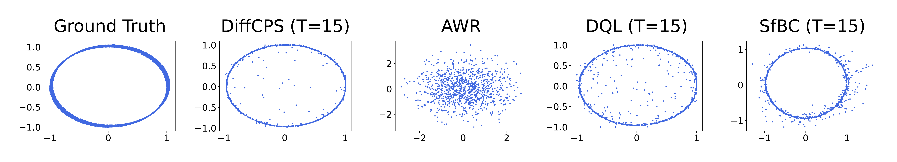
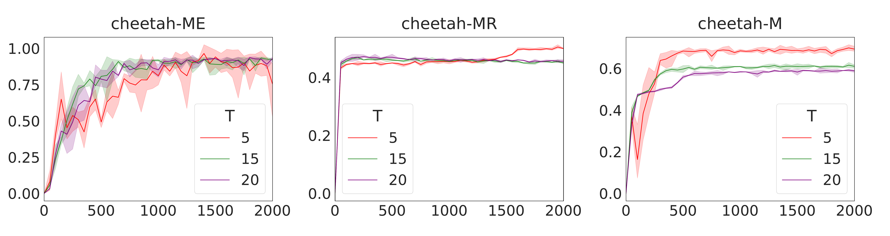
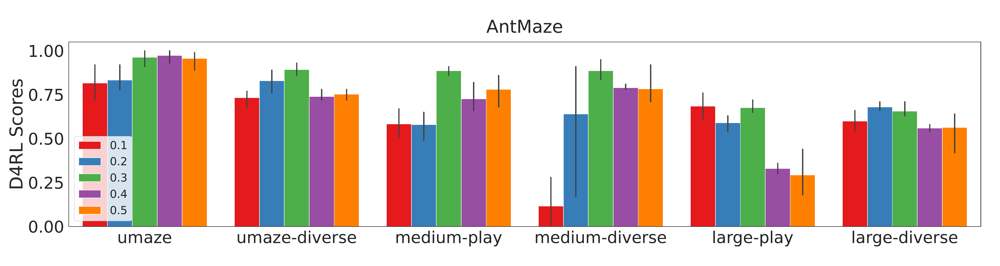
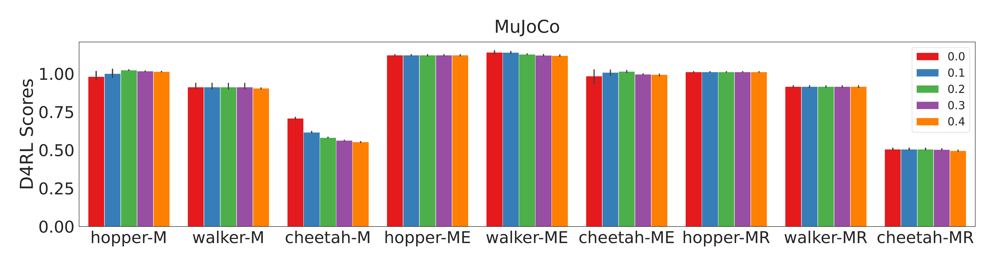
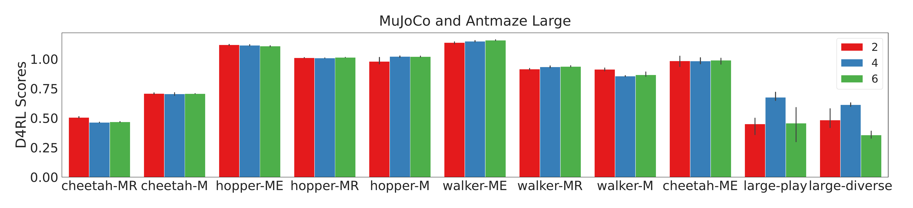
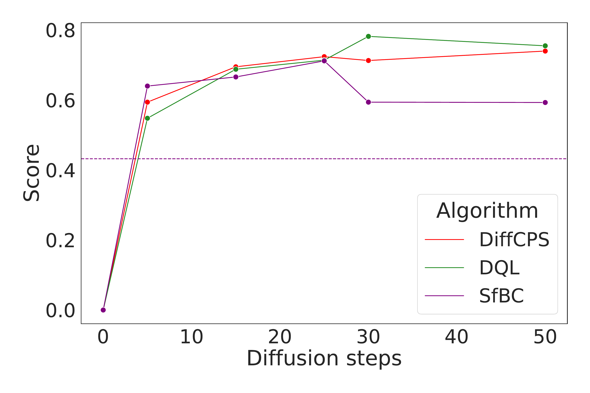
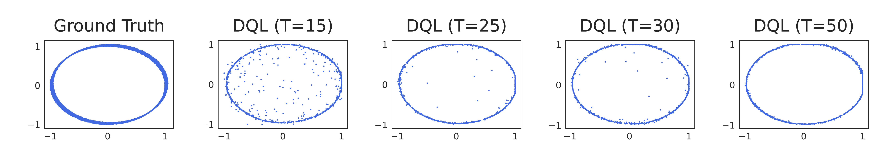
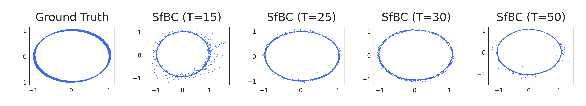
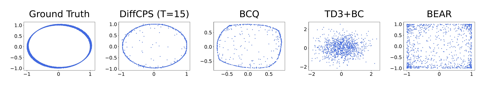

# DiffCPS: Diffusion Model based Constrained Policy Search for Offline Reinforcement Learning  DiffCPS: Diffusion Model based Constrained Policy Search for Offline Reinforcement Learning  

## Abstract

Constrained policy search (CPS) is a fundamental problem in offline reinforcement learning, which is generally solved by advantage weighted regression (AWR). However, previous methods may still encounter out-of-distribution actions due to the limited expressivity of Gaussian-based policies. On the other hand, directly applying the state-of-the-art models with distribution expression capabilities (i.e., diffusion models) in the AWR framework is insufficient since AWR requires exact policy probability densities, which is intractable in diffusion models. In this paper, we propose a novel approach called **Diffusion Model based Constrained Policy Search (DiffCPS)**, which tackles the diffusion-based constrained policy search without resorting to AWR. The theoretical analysis reveals our key insights by leveraging the action distribution of the diffusion model to eliminate the policy distribution constraint in the CPS and then utilizing the Evidence Lower Bound (ELBO) of diffusion-based policy to approximate the KL constraint. Consequently, DiffCPS admits the high expressivity of diffusion models while circumventing the cumbersome density calculation brought by AWR. Extensive experimental results based on the D4RL benchmark demonstrate the efficacy of our approach. We empirically show that DiffCPS achieves better or at least competitive performance compared to traditional AWR-based baselines as well as recent diffusion-based offline RL methods. The code is now available at <https://github.com/felix-thu/DiffCPS>.

# Introduction

Offline Reinforcement Learning (offline RL) aims to seek an optimal policy without environmental interactions . This is compelling because it has the potential to transform large-scale datasets into powerful decision-making tools and avoids expensive and dangerous online data collection, offering significant application prospects in fields such as healthcare  and autonomous driving . Notwithstanding its promise, the application of contemporary off-policy RL algorithms such as DDPG , TD3 , or SAC  to an offline context presents challenges due to distribution shift .

Previous methods to mitigate this question in model-free offline RL generally fall into three categories: 1) Value function-based approaches, which implement pessimistic value estimation by assigning low values to out-of-distribution actions ; 2) Perceiving offline RL as a sequence modeling issue with return guidance ; 3) Considering the offline RL problem as a constrained policy search, which regularizes the discrepancy between the learned policy and behavior policy .

Previous solutions  for the CPS problem primarily train a parameterized unimodal Gaussian policy through weighted regression. However, recent works  show such unimodal Gaussian models in weighted regression will impair the policy performance due to limited distributional expressivity. For example, if we fit a multi-modal distribution with a unimodal distribution like the unimodal Gaussian distribution, it will unavoidably result in covering the low-density area between peaks. Intuitively, we can choose a more expressive model to solve this problem. shows that VAEs  in BCQ  do not align well with the behavior dataset, which will introduce the biases in generated actions. To solve this problem, SfBC  uses a more powerful generative model, namely diffusion probabilistic models  to generate actions and select the action through the action evaluation model under the AWR framework. However, AWR requires an exact probability density of behavior policy, while the diffusion model’s probability density is intractable. Therefore, Monte Carlo sampling is used to approximate the probability density of behavior policy, which unavoidably introduces errors and increases the cost of inference. In Section <a href="#toy" data-reference-type="ref" data-reference="toy">3.1</a>, we empirically show that these issues can occur even on a simple bandit task.

To solve this problem, we present **Diffusion Model based Constrained Policy Search (DiffCPS)** which directly solves the constrained policy search problem with a diffusion-based policy. Thereby, we can solve the limited policy expressivity problem and avoid the sampling errors caused by directly using diffusion in AWR. Our proposed method consists of three key parts: 1) We demonstrate that if we use the diffusion model as our policy, we can eliminate the policy distribution constraint in the CPS through the action distribution of the diffusion model; 2) We transform the CPS problem to a convex optimization problem and solve it via Lagrange dual method. We also prove the equivalence between the Lagrange dual problem and the primal convex optimization problem; 3) We approximate the entropy calculation in the Lagrange dual problem with the ELBO of the diffusion-based policy to circumvent the intractable density calculation. Finally, we solve the Lagrange dual problem with gradient descent.

The main contributions of this paper are as follows: 1) We present DiffCPS, which tackles the diffusion-based constrained policy search without resorting to AWR. Thereby, DiffCPS solves the limited policy expressivity problem while avoiding the cumbersome density calculation brought by AWR. 2) We prove that the policy distribution constraint always holds for diffusion-based policy. 3) We prove that the policy constraint can be approximated through the ELBO of diffusion-based policy. 4) Our experimental results illustrate superior or competitive performance compared to existing offline RL methods in D4RL tasks. Even when compared to other diffusion-based methods, DiffCPS also achieves state-of-the-art performance in D4RL MuJoCo locomotion and AntMaze average score. These outcomes substantiate the effectiveness of our method.

# Preliminaries

**Notation:** In this paper, we use $`\mu_\theta({\bm{a}}\vert{\bm{s}})`$ or $`\mu`$ to denote the learned policy with parameter $`\theta`$ and $`\pi_b`$ to denote behavior policy that generated the offline data. We use superscripts $`i`$ to denote diffusion timestep and subscripts $`t`$ to denote RL trajectory timestep. For instance, $`a_t^i`$ denotes the $`t`$-$`\text{th}`$ action in $`i`$-$`\text{th}`$ diffusion timestep.

## Constrained Policy Search in Offline RL

Consider a Markov decision process (MDP): $`M = \{S, {\mathcal{A}}, P, R, \gamma, d_0\}`$, with state space $`S`$, action space $`{\mathcal{A}}`$, environment dynamics $`{\mathcal{P}}({\bm{s}}' \vert {\bm{s}}, {\bm{a}}): S \times  S \times {\mathcal{A}}\rightarrow [0,1]`$, reward function $`R: S \times {\mathcal{A}}\rightarrow {\mathbb{R}}`$, discount factor $`\gamma \in [0, 1)`$, and initial state distribution $`d_0`$. The action-value or Q-value of policy $`\mu`$ is defined as $`Q^\mu({\bm{s}}_t, {\bm{a}}_t) = \mathbb{E}_{{\bm{a}}_{t+1}, {\bm{a}}_{t+2}, ... \sim \mu}\sum_{j=0}^{\infty}\gamma^j r({\bm{s}}_{t+j}, {\bm{a}}_{t+j})`$. Our goal is to get a policy to maximize the cumulative discounted reward $`J(\theta) = \int_\mathcal{S} \rho^\mu({\bm{s}}) Q^\mu({\bm{s}}, {\bm{a}}) d{\bm{s}}`$, where $`\rho^\mu({\bm{s}})=\sum_{t=0}^\infty\gamma^t p_\mu({\bm{s}}_t ={\bm{s}})`$ is the discounted state visitation frequencies induced by the policy $`\mu`$ .

In offline setting , environmental interaction is not allowed, and a static dataset $`{\mathcal{D}}\triangleq ({\bm{s}}, {\bm{a}}, r, {\bm{s}}', \text{done})`$ is used to learn a policy. To avoid out-of-distribution actions, we need to restrict the learned policy $`\mu`$ to be not far away from the behavior policy $`\pi_b`$ by the KL divergence constraint. Prior works  formulate the above offline RL optimization problem as a constrained policy search and its standard form is as follows
``` math
\label{origin_cps}
    \begin{aligned}
        \mu^{*} = \mathop{\mathrm{arg\,max}}_\mu \ &J(\mu) = \mathop{\mathrm{arg\,max}}_\mu \int_\mathcal{S} \rho^\mu({\bm{s}}) \int_\mathcal{A}Q^\mu({\bm{s}}, {\bm{a}}) d{\bm{a}}d{\bm{s}}\\
         s.t.  \quad & D_{\mathrm{KL}}(\pi_b(\cdot\vert{\bm{s}})\|\mu(\cdot\vert{\bm{s}})) \leq {\mathbf{\epsilon}},\quad \forall {\bm{s}}\\      
         & \int_{\bm{a}}\mu({\bm{a}}\vert{\bm{s}})d{\bm{a}}=1,\quad \forall {\bm{s}},
\end{aligned}
```
Previous works  solved Equation <a href="#origin_cps" data-reference-type="ref" data-reference="origin_cps">[origin_cps]</a> through KKT conditions and get the optimal policy $`\pi^*`$:
``` math
\begin{aligned}
    \pi^*({\bm{a}}\vert{\bm{s}}) &= \frac{1}{Z({\bm{s}})} \ \pi_b({\bm{a}}\vert{\bm{s}}) \ \mathrm{exp}\left(\alpha Q_\phi({\bm{s}}, {\bm{a}}) \right),
\label{Eq:pi_optimal}
\end{aligned}
```
where $`Z({\bm{s}})`$ is the partition function. Intuitively we can use Equation <a href="#Eq:pi_optimal" data-reference-type="ref" data-reference="Eq:pi_optimal">[Eq:pi_optimal]</a> to optimize policy $`\pi`$. However, the behavior policy may be very diverse and hard to model. To avoid modeling the behavior policy, prior works  optimize $`\pi^{*}`$ through a parameterized policy $`\pi_\theta`$:
``` math
\begin{aligned}
    & \mathop{\mathrm{arg \ min}}_{\theta} \quad \mathbb{E}_{{\bm{s}}\sim \mathcal{D}^\mu} \left[ D_{\mathrm{KL}}\left(\pi^*(\cdot  | {\bm{s}}) \middle|\middle| \pi_\theta(\cdot  | {\bm{s}})\right) \right]\nonumber \\
    = & \mathop{\mathrm{arg \ max}}_{\theta} \quad \mathbb{E}_{({\bm{s}}, {\bm{a}}) \sim \mathcal{D}^\mu} \left[ \frac{1}{Z({\bm{s}})} \mathrm{log} \ \pi_\theta({\bm{a}}| {\bm{s}}) \ \mathrm{exp}\left(\alpha Q_\phi({\bm{s}}, {\bm{a}}) \right) \right].
    \label{Eq:wr}
\end{aligned}
```
Equation <a href="#Eq:wr" data-reference-type="ref" data-reference="Eq:wr">[Eq:wr]</a> is known as AWR, with $`\mathrm{exp}(\alpha Q_\phi({\bm{s}}, {\bm{a}}))`$ being the regression weights. However, AWR requires the exact probability density of policy, which restricts the use of generative models like diffusion models. In this paper, we directly utilize the diffusion-based policy to address Equation <a href="#origin_cps" data-reference-type="ref" data-reference="origin_cps">[origin_cps]</a>. Therefore, our method not only avoids the need for explicit probability densities but also solves the limited policy expressivity problem in AWR.

## Diffusion Probabilistic Model

Diffusion model  is a new type of generative model, which has achieved SOTA results in image generation, outperforming other generative models like GAN , VAE and Flow-based models . Diffusion models are composed of two processes: the forward diffusion process and the reverse process. In the forward diffusion process, we gradually add Gaussian noise to the data $`{\bm{x}}_0 \sim q({\bm{x}}_0)`$ in $`T`$ steps. The step sizes are controlled by a variance schedule $`\beta_i`$:
``` math
q({\bm{x}}_{1:T}  \,|\,  {\bm{x}}_0) :=  \textstyle \prod_{i=1}^T q({\bm{x}}_i  \,|\,  {\bm{x}}_{i-1}), \quad q({\bm{x}}_i  \,|\,  {\bm{x}}_{i-1}) := {\mathcal{N}}({\bm{x}}_i; \sqrt{1 - \beta_i} {\bm{x}}_{i-1}, \beta_i %
        {\bm{I}}).
```

In the reverse process, we can recreate the true sample $`{\bm{x}}_0`$ through $`p({\bm{x}}^{i-1}\vert{\bm{x}}^{i})`$:
``` math
p({\bm{x}}) = \int p({\bm{x}}^{0:T})d{\bm{x}}^{1:T}=\int{\mathcal{N}}({\bm{x}}^T; \mathbf{0},{\bm{I}})\prod_{i=1}^Tp({\bm{x}}^{i-1}\vert{\bm{x}}^{i})d{\bm{x}}^{1:T}.
    \label{reverse}
```
The training objective is to maximize the ELBO of $`\mathbb{E}_{{\bm{q}}_{x_0}}\log p({\bm{x}}_0)`$. Following DDPM , we use the simplified surrogate loss $`{\mathcal{L}}_d(\theta) = \mathbb{E}_{i \sim 1,T, {\mathbf{\epsilon}}\sim {\mathcal{N}}(\mathbf{0}, {\bm{I}}), {\bm{x}}_0 \sim q} || {\mathbf{\epsilon}}- {\mathbf{\epsilon}}_\theta({\bm{x}}_i, i) ||^2`$ to approximate the ELBO. After training, sampling from the diffusion model is equivalent to running the reverse process.

## Conditional Diffusion Probabilistic Model

There are two kinds of conditioning methods: classifier-guided  and classifier-free . The former requires training a classifier on noisy data $`{\bm{x}}_i`$ and using gradients $`\nabla_{\bm{x}}\log f_\phi({\bm{y}}\vert{\bm{x}}_i)`$ to guide the diffusion sample toward the conditioning information $`{\bm{y}}`$. The latter does not train an independent $`f_\phi`$ but combines a conditional noise model $`\epsilon_\theta({\bm{x}}_i, i,{\bm{s}})`$ and an unconditional model $`\epsilon_\theta({\bm{x}}_i, i)`$ for the noise. The perturbed noise $`w\epsilon_\theta({\bm{x}}_i, i)+(w+1)\epsilon_\theta({\bm{x}}_i,i,{\bm{s}})`$ is used to later generate samples. However shows this combination will degrade the policy performance in offline RL. Following  we solely employ a conditional noise model $`\epsilon_\theta({\bm{x}}_i,i,{\bm{s}})`$ to construct our noise model ($`w=0`$).

# Method

We propose Diffusion Model based Constrained Policy Search (DiffCPS) to address the limited expressivity problem in AWR. Below we first show that the limited policy expressivity in the AWR will degrade the policy performance through a bandit toy experiment. Next, we demonstrate that the sampling errors caused by directly using diffusion within the AWR framework will degrade the performance of the diffusion model. Then we derive our solution to solve this problem from the diffusion model perspective without resorting to AWR. (All proofs are given in Appendix <a href="#proof" data-reference-type="ref" data-reference="proof">7</a> )

## Toy Experiment

<figure id="fig:toy_exp">
<p><br />
</p>
<figcaption>Toy offline experiment on a simple bandit task. We test the performance of AWR and other diffusion-based offline RL algorithms (DQL <span class="citation" data-cites="wang2022b"></span> and SfBC <span class="citation" data-cites="chen2022"></span>). The first row displays the actions taken by the trained policy where <span class="math inline"><em>T</em></span> denotes diffusion steps. We note that the AWR fails to capture the multi-modal actions in the offline dataset due to the limited policy expressivity of unimodal Gaussian. The second row shows the effect of different diffusion steps <span class="math inline"><em>T</em></span>. </figcaption>
</figure>

Before showing our method, we first present that the limited policy expressivity in previous Advantage Weighted Regression (AWR)  methods may degrade the performance through a sample 2-D bandit toy experiment with real-valued actions. Our offline dataset is constructed by a unit circle with noise (The first panel of Figure <a href="#fig:toy_exp" data-reference-type="ref" data-reference="fig:toy_exp">1</a>). Data on the noisy circle have a positive reward of $`1`$. Note that this offline dataset exhibits strong multi-modality since there are many actions (points on the noisy circle) that can achieve the same reward of $`1`$ if a state is given. However, if we use unimodal Gaussian to represent the policy, although the points on the noisy circle can all receive the same reward of $`1`$, the actions taken by AWR will move closer to the center of the noisy circle (AWR in Figure <a href="#fig:toy_exp" data-reference-type="ref" data-reference="fig:toy_exp">1</a>), due to the incorrect unimodal assumption. Experiment results in Figure <a href="#fig:toy_exp" data-reference-type="ref" data-reference="fig:toy_exp">1</a> illustrate that AWR performs poorly in the bandit experiments compared to other diffusion-based methods. We also notice that compared to other diffusion-based methods, SfBC incorrectly models the dataset as a circle instead of a noisy circle when $`T=15`$. This is due to the sampling error introduced by incorporating diffusion into AWR.

Therefore, we conclude that policy expressivity is important in offline RL since most offline RL datasets are collected from multiple behavior policies or human experts, which exhibit strong multi-modality. To better model behavior policies, we need more expressive generative models to model the policy distribution, rather than using unimodal Gaussians. Furthermore, we also need to avoid the sampling errors caused by using diffusion in AWR, which is the motivation behind our algorithm.

## Diffusion Model Based Policy

Firstly, we present the form of constrained policy search:
``` math
\begin{aligned}
\label{obj}
        \mu^{*} = \mathop{\mathrm{arg\,max}}_\mu \ &J(\mu) = \mathop{\mathrm{arg\,max}}_\mu \int_\mathcal{S} \rho^\mu({\bm{s}}) \int_\mathcal{A}Q^\mu({\bm{s}}, {\bm{a}}) d{\bm{a}}d{\bm{s}}\\
        \label{kl}
         s.t.  \quad & D_{\mathrm{KL}}(\pi_b(\cdot\vert{\bm{s}})\|\mu(\cdot\vert{\bm{s}})) \leq {\mathbf{\epsilon}},\quad \forall {\bm{s}}\\      
         & \int_{\bm{a}}\mu({\bm{a}}\vert{\bm{s}})d{\bm{a}}=1,\quad \forall {\bm{s}},
         \label{den}
\end{aligned}
```
where $`\mu({\bm{a}}\vert{\bm{s}})`$ denotes our diffusion-based policy, $`\pi_b`$ denotes the behavior policy. Here we represent our policy $`\mu({\bm{a}}\vert{\bm{s}})`$ via the conditional diffusion model:
``` math
\mu({\bm{a}}\vert{\bm{s}}) = \int \mu({\bm{a}}^{0:T}\vert{\bm{s}})d{\bm{a}}^{1:T}=\int{\mathcal{N}}({\bm{a}}^T; \mathbf{0},{\bm{I}})\prod_{i=1}^T\mu({\bm{a}}^{i-1}\vert{\bm{a}}^{i},{\bm{s}})d{\bm{a}}^{1:T},
    \label{policy}
```
where the end sample of the reverse chain $`{\bm{a}}^0`$ is the action used for the policy’s output and $`\mu({\bm{a}}^{0:T})`$ is the joint distribution of all noisy samples. According to DDPM, we can approximate the reverse process $`\mu({\bm{a}}^{i-1}\vert{\bm{a}}^{i},{\bm{s}})`$ with a Gaussian distribution $`{\mathcal{N}}({\bm{a}}^{i-1}; {\bm{\mu}}_{\theta}({\bm{a}}^{i}, {\bm{s}}, i), {\bm{\Sigma}}_{\theta}({\bm{a}}^{i}, {\bm{s}}, i))`$. The training of the diffusion model needs a dataset $`{\mathcal{D}}\sim\mu({\bm{a}}\vert{\bm{s}})`$, which is intractable in practice. However, the KL constraint in Equation <a href="#kl" data-reference-type="ref" data-reference="kl">[kl]</a> allows us to train the $`\mu({\bm{a}}\vert{\bm{s}})`$ with $`{\mathcal{D}}\sim\pi_b({\bm{a}}\vert{\bm{s}})`$ because the difference between two policies is small. We also follow the DDPM to fix the covariance matrix and predict the mean with a conditional noise model $`{\mathbf{\epsilon}}_\theta({\bm{a}}^{i}, {\bm{s}}, i)`$:
``` math
\textstyle{\bm{\mu}}_{\theta}({\bm{a}}^{i}, {\bm{s}}, i) = \frac{1}{\sqrt{\alpha_i}} \big( {\bm{a}}^{i} - \frac{\beta_i}{\sqrt{1 - \bar{\alpha}_i}} {\mathbf{\epsilon}}_\theta({\bm{a}}^{i}, {\bm{s}}, i) \big).
```
During the reverse process, $`{\bm{a}}^T \sim {\mathcal{N}}(\mathbf{0}, {\bm{I}})`$ and then follow the reverse diffusion chain parameterized by $`\theta`$ as
``` math
\label{reverse_sampling}
    \textstyle {\mathcal{N}}{\bm{a}}^{i-1} \vert {\bm{a}}^i \sim {\mathcal{N}}a^{i-1};\frac{{\bm{a}}^i}{\sqrt{\alpha_i}} - \frac{\beta_i}{\sqrt{\alpha_i(1 - \bar{\alpha}_i)}} {\mathbf{\epsilon}}_\theta({\bm{a}}^{i}, {\bm{s}}, I), \beta_i ~~\text{for }i=T,\ldots,1.
```
The reverse sampling in Equation <a href="#reverse_sampling" data-reference-type="ref" data-reference="reverse_sampling">[reverse_sampling]</a> requires iteratively predicting $`{\mathbf{\epsilon}}`$ $`T`$ times. When $`T`$ is large, it will consume much time during the sampling process. To work with small $`T`$ ($`T=5`$ in our experiment), we follow the previous works  to define
``` math
\beta_i = 1 - \alpha_i = 1 - e^{-\beta_{\min}(\frac{1}{T}) - 0.5(\beta_{\max} - \beta_{\min})\frac{2i -1}{T^2}},
```
which is a noise schedule obtained under the variance preserving SDE of .

<div id="theorem1" class="theorem">

**Theorem 1**. *Let $`\mu_\theta({\bm{a}}\vert{\bm{s}})`$ be a diffusion-based policy and $`\pi_b`$ be the behavior policy. Then, we have*

1.  *There exists $`{\mathbf{\kappa}}_0\in{\mathcal{R}}`$ such that $`\mathbb{E}_{{\bm{s}}\sim d_{\pi_b}({\bm{s}})} D_{\mathrm{KL}}(\pi_b(\cdot\vert{\bm{s}})\|\mu(\cdot\vert{\bm{s}})) \leq {\mathbf{\epsilon}}`$ can be transformed to
    ``` math
    H(\pi_b(\cdot\vert{\bm{s}})\|\mu(\cdot\vert{\bm{s}})) \leq {\mathbf{\kappa}}_0, \quad \forall {\bm{s}},
    ```
    where $`H`$ is a convex function of $`\mu`$.*

2.  *$`\forall s`$, $`\int_{\bm{a}}\mu_\theta({\bm{a}}\vert{\bm{s}})d{\bm{a}}\equiv1`$.*

</div>

<div id="corollary1" class="corollary">

**Corollary 1**. *Let $`Q_\phi ({\bm{s}},{\bm{a}})`$ be the critic network, after sufficient training under unlimited model capacity and data samples. According to the Theorem <a href="#theorem1" data-reference-type="ref" data-reference="theorem1">1</a>, the primal problem (Equation <a href="#obj" data-reference-type="ref" data-reference="obj">[obj]</a>-Equation <a href="#den" data-reference-type="ref" data-reference="den">[den]</a>) can be transformed to a convex optimization problem with strong duality:
``` math
\begin{aligned}
        \mu^{*} = \mathop{\mathrm{arg\,max}}_\mu \ &J(\mu) = \mathop{\mathrm{arg\,max}}_\mu \int_\mathcal{S} \rho^\mu({\bm{s}}) \int_\mathcal{A}Q^\mu({\bm{s}}, {\bm{a}}) d{\bm{a}}d{\bm{s}}\\
         s.t. \quad &     H(\pi_b(\cdot\vert{\bm{s}})\|\mu(\cdot\vert{\bm{s}})) \leq {\mathbf{\kappa}}_0, \quad \forall {\bm{s}}.
    \end{aligned}
    \label{cps}
```*

</div>

## Diffusion Model based Constrained Policy Search

In this section, the duality is used to solve the Equation <a href="#cps" data-reference-type="ref" data-reference="cps">[cps]</a> and derive our method. The Lagrangian of Equation <a href="#cps" data-reference-type="ref" data-reference="cps">[cps]</a> is
``` math
{\mathcal{L}}(\mu,\lambda) = J(\mu)+\lambda({\mathbf{\kappa}}_0-H(\pi_b,\mu)).
```
The Lagrange dual problem associated with the Equation <a href="#cps" data-reference-type="ref" data-reference="cps">[cps]</a> is
``` math
\label{eq:minmax}
    \min_{\lambda\geq 0 }\max_\mu J(\mu)+\lambda({\mathbf{\kappa}}_0-H(\pi_b,\mu)).
```

<div id="theorem2" class="theorem">

**Theorem 2**. *The solution $`\mu`$ of Equation <a href="#eq:minmax" data-reference-type="ref" data-reference="eq:minmax">[eq:minmax]</a> is the optimal policy described in Equation <a href="#cps" data-reference-type="ref" data-reference="cps">[cps]</a>.*

</div>

According to Theorem <a href="#theorem2" data-reference-type="ref" data-reference="theorem2">2</a>, we can get the optimal policy by solving Equation <a href="#eq:minmax" data-reference-type="ref" data-reference="eq:minmax">[eq:minmax]</a>, where $`\lambda`$ is the dual variable. We can solve the optimal dual variable $`\lambda`$ as
``` math
\mathop{\mathrm{arg\,min}}_{\lambda\geq0}\lambda({\mathbf{\kappa}}_0-H(\pi_b,\mu^{*})),
    \label{eta}
```
where $`\mu^*`$ denotes:
``` math
\mathop{\mathrm{arg\,max}}_{\mu}\mathbb{E}_{{\bm{s}}\sim\rho^\mu({\bm{s}}),{\bm{a}}\sim\mu(\cdot\vert{\bm{s}})}Q^\mu({\bm{s}},{\bm{a}})-\lambda H(\pi_b,\mu).
    \label{mu}
```
In Equation <a href="#mu" data-reference-type="ref" data-reference="mu">[mu]</a>, we need to calculate the cross entropy $`H(\pi_b,\mu)`$, which is intractable in practice.

<div id="proposition1" class="proposition">

**Proposition 1**. *In the diffusion model, we can approximate the entropy with an MSE-like loss $`{\mathcal{L}}_c(\pi_b,\mu)`$ through ELBO:
``` math
H(\pi_b,\mu)\approx c+{\mathcal{L}}_c(\pi_b,\mu),
\label{constraint2}
```
where c is a constant.*

</div>

Let $`{\mathbf{\kappa}}={\mathbf{\kappa}}_0-c`$, according to Proposition <a href="#proposition1" data-reference-type="ref" data-reference="proposition1">1</a>, the Equation <a href="#mu" data-reference-type="ref" data-reference="mu">[mu]</a> and Equation <a href="#eta" data-reference-type="ref" data-reference="eta">[eta]</a> can be transformed to
``` math
\mathop{\mathrm{arg\,max}}_{\mu}\mathbb{E}_{{\bm{s}}\sim\rho^\mu({\bm{s}}),{\bm{a}}\sim\mu(\cdot\vert{\bm{s}})}Q^\mu({\bm{s}},{\bm{a}})-\lambda {\mathcal{L}}_c(\pi_b,\mu),
    \label{mu2}
```
``` math
\mathop{\mathrm{arg\,min}}_{\lambda\geq0}\lambda({\mathbf{\kappa}}-{\mathcal{L}}_c(\pi_b,\mu)).
    \label{eta2}
```
In practice, the $`Q^{\mu}({\bm{s}},{\bm{a}})`$ varies in different environments. To normalize $`Q^{\mu}({\bm{s}},{\bm{a}})`$, we follow  to divide it by the target Q-net’s value. We also clip the $`\lambda`$ to keep the constraint $`\lambda \geq 0`$ holding by $`\lambda_\text{clip}=\max(c,\lambda)`$, $`c\geq0`$. So actually $`\mu^*`$ is
``` math
\mathop{\mathrm{arg\,max}}_{\mu}\mathbb{E}_{{\bm{s}}\sim\rho^\mu({\bm{s}}),{\bm{a}}\sim\mu(\cdot\vert{\bm{s}})}\frac{Q^{\mu}({\bm{s}},{\bm{a}})}{Q_\text{target}^{\mu}({\bm{s}},{\bm{a}})}-\lambda_\text{clip}{\mathcal{L}}_c(\pi_b,\mu).
    \label{mu3}
```
Theoretically, we need to precisely solve the Equation <a href="#mu3" data-reference-type="ref" data-reference="mu3">[mu3]</a> and Equation <a href="#eta2" data-reference-type="ref" data-reference="eta2">[eta2]</a>, but in practice, we can resort to stochastic gradient descent to solve the equations. In this way, we can recursively optimize Equation <a href="#cps" data-reference-type="ref" data-reference="cps">[cps]</a> through Equation <a href="#mu3" data-reference-type="ref" data-reference="mu3">[mu3]</a> and Equation <a href="#eta2" data-reference-type="ref" data-reference="eta2">[eta2]</a>. The policy improvement described in Equation <a href="#mu3" data-reference-type="ref" data-reference="mu3">[mu3]</a> and the solution of Equation <a href="#eta2" data-reference-type="ref" data-reference="eta2">[eta2]</a> constitute the core of DiffCPS.

We also find that we can improve the performance of the policy by delaying the policy update . Finally, we summarize our method in Algorithm <a href="#alg:main" data-reference-type="ref" data-reference="alg:main">2</a>:

<figure id="alg:main">
<div class="algorithmic">
<p>ALGORITHM BLOCK (caption below)</p>
<p><span id="alg:main" data-label="alg:main"></span> Initialize policy network <span class="math inline"><em>μ</em><sub><em>θ</em></sub></span>, critic networks <span class="math inline"><em>Q</em><sub><em>ϕ</em><sub>1</sub></sub></span>, <span class="math inline"><em>Q</em><sub><em>ϕ</em><sub>2</sub></sub></span>, and target networks <span class="math inline"><em>μ</em><sub><em>θ</em><sup>′</sup></sub></span>, <span class="math inline"><em>Q</em><sub><em>ϕ</em><sub>1<sup>′</sup></sub></sub></span>, <span class="math inline"><em>Q</em><sub><em>ϕ</em><sub>2<sup>′</sup></sub></sub></span>, and policy evaluation interval <span class="math inline"><em>d</em></span>. Sample transition mini-batch <span class="math inline">ℬ = (<strong>s</strong><sub><em>t</em></sub>, <strong>a</strong><sub><em>t</em></sub>, <em>r</em><sub><em>t</em></sub>, <strong>s</strong><sub><em>t</em> + 1</sub>) ∼ 𝒟</span>. <em><strong># Critic updating</strong></em> Sample <span class="math inline"><strong>a</strong><sub><em>t</em> + 1</sub> ∼ <em>μ</em><sub><em>θ</em></sub>(⋅|<strong>s</strong><sub><em>t</em> + 1</sub>)</span> according to Equation <a href="#reverse_sampling" data-reference-type="ref" data-reference="reverse_sampling">[reverse_sampling]</a>. <span class="math inline"><em>y</em> = <em>r</em><sub><em>t</em></sub> + <em>γ</em>min<sub><em>i</em> = 1, 2</sub><em>Q</em><sub><em>ϕ</em><sub><em>i</em><sup>′</sup></sub></sub><strong>s</strong><sub><em>t</em> + 1</sub>, <strong>a</strong><sub><em>t</em> + 1</sub></span>. Update critic <span class="math inline"><em>ϕ</em><sub><em>i</em></sub></span> <span class="math inline">←</span> <span class="math inline">arg min<sub><em>ϕ</em><sub><em>i</em></sub></sub><em>N</em><sup>−1</sup>∑(<em>y</em> − <em>Q</em><sub><em>ϕ</em><sub><em>i</em></sub></sub>(<strong>s</strong><sub><em>t</em></sub>, <strong>a</strong><sub><em>t</em></sub>))<sup>2</sup></span> . Sample <span class="math inline"><strong>a</strong> ∼ <em>μ</em><sub><em>θ</em></sub>(⋅|<strong>s</strong>)</span> according to Equation <a href="#reverse_sampling" data-reference-type="ref" data-reference="reverse_sampling">[reverse_sampling]</a>. <em><strong># Policy updating</strong></em> Update policy <span class="math inline"><em>μ</em></span> through Equation <a href="#mu3" data-reference-type="ref" data-reference="mu3">[mu3]</a>. <em><strong># Lagrange multiplier <span class="math inline"><em>λ</em></span> updating</strong></em> Update Lagrange multiplier <span class="math inline"><em>λ</em></span> through Equation <a href="#eta2" data-reference-type="ref" data-reference="eta2">[eta2]</a>. <em><strong># Target Networks updating</strong></em> <span class="math inline"><em>θ</em><sup>′</sup> = <em>ρ</em><em>θ</em><sup>′</sup> + (1 − <em>ρ</em>)<em>θ</em></span>, <span class="math inline"><em>ϕ</em><sub><em>i</em><sup>′</sup></sub> = <em>ρ</em><em>ϕ</em><sub><em>i</em><sup>′</sup></sub> + (1 − <em>ρ</em>)<em>ϕ</em><sub><em>i</em></sub> for <em>i</em> = {1, 2}</span>.</p>
</div>
<figcaption>DiffCPS</figcaption>
</figure>

# Experiments

We evaluate our DiffCPS on the D4RL  benchmark in Section <a href="#d4rl" data-reference-type="ref" data-reference="d4rl">4.1</a>. Further, we conduct an ablation experiment to assess the contribution of different parts in DiffCPS in Section <a href="#ablation" data-reference-type="ref" data-reference="ablation">4.2</a>.

## Comparison to other Methods

<div id="tbl:rl_results">

<table>
<caption>The performance of DiffCPS and other SOTA baselines on D4RL tasks. The mean and standard deviation of DiffCPS are obtained by evaluating the trained policy on five different random seeds. We report the performance of baseline methods using the best results reported from their own paper. “-A" refers to any number of hyperparameters allowed. Results within <span class="math inline">3</span> percent of the maximum in every D4RL task and the best average result are highlighted in boldface.</caption>
<thead>
<tr>
<th style="text-align: center;"><strong>Dataset</strong></th>
<th style="text-align: center;"><strong>Environment</strong></th>
<th style="text-align: center;"><strong>CQL</strong></th>
<th style="text-align: center;"><strong>IDQL-A</strong></th>
<th style="text-align: center;"><strong>QGPO</strong></th>
<th style="text-align: center;"><strong>SfBC</strong></th>
<th style="text-align: center;"><strong>DD</strong></th>
<th style="text-align: center;"><strong>Diffuser</strong></th>
<th style="text-align: center;"><strong>Diffuison-QL</strong></th>
<th style="text-align: center;"><strong>IQL</strong></th>
<th style="text-align: center;"><strong>DiffCPS(ours)</strong></th>
</tr>
</thead>
<tbody>
<tr>
<td style="text-align: left;">Medium-Expert</td>
<td style="text-align: left;">HalfCheetah</td>
<td style="text-align: center;"><span class="math inline">62.4</span></td>
<td style="text-align: center;"><span class="math inline">$\bf{95.9}$</span></td>
<td style="text-align: center;"><span class="math inline">93.5</span></td>
<td style="text-align: center;"><span class="math inline">92.6</span></td>
<td style="text-align: center;"><span class="math inline">90.6</span></td>
<td style="text-align: center;"><span class="math inline">79.8</span></td>
<td style="text-align: center;"><span class="math inline">$\bf{96.8}$</span></td>
<td style="text-align: center;"><span class="math inline">86.7</span></td>
<td style="text-align: center;"><span class="math inline">$\bf{100.3\pm4.1}$</span></td>
</tr>
<tr>
<td style="text-align: left;">Medium-Expert</td>
<td style="text-align: left;">Hopper</td>
<td style="text-align: center;"><span class="math inline">98.7</span></td>
<td style="text-align: center;"><span class="math inline">108.6</span></td>
<td style="text-align: center;"><span class="math inline">108.0</span></td>
<td style="text-align: center;"><span class="math inline">108.6</span></td>
<td style="text-align: center;"><span class="math inline">$\bf{111.8}$</span></td>
<td style="text-align: center;"><span class="math inline">107.2</span></td>
<td style="text-align: center;"><span class="math inline">$\bf{111.1}$</span></td>
<td style="text-align: center;"><span class="math inline">91.5</span></td>
<td style="text-align: center;"><span class="math inline">$\bf{112.1\pm0.6}$</span></td>
</tr>
<tr>
<td style="text-align: left;">Medium-Expert</td>
<td style="text-align: left;">Walker2d</td>
<td style="text-align: center;"><span class="math inline">110.1</span></td>
<td style="text-align: center;"><span class="math inline">$\bf{112.7}$</span></td>
<td style="text-align: center;"><span class="math inline">$\bf{110.7}$</span></td>
<td style="text-align: center;"><span class="math inline">109.8</span></td>
<td style="text-align: center;"><span class="math inline">108.8</span></td>
<td style="text-align: center;"><span class="math inline">108.4</span></td>
<td style="text-align: center;"><span class="math inline">110.1</span></td>
<td style="text-align: center;"><span class="math inline">109.6</span></td>
<td style="text-align: center;"><span class="math inline">$\bf{113.1\pm1.8}$</span></td>
</tr>
<tr>
<td style="text-align: left;">Medium</td>
<td style="text-align: left;">HalfCheetah</td>
<td style="text-align: center;"><span class="math inline">44.4</span></td>
<td style="text-align: center;"><span class="math inline">51.0</span></td>
<td style="text-align: center;"><span class="math inline">$\bf{54.1}$</span></td>
<td style="text-align: center;"><span class="math inline">45.9</span></td>
<td style="text-align: center;"><span class="math inline">49.1</span></td>
<td style="text-align: center;"><span class="math inline">44.2</span></td>
<td style="text-align: center;"><span class="math inline">$\bf{51.1}$</span></td>
<td style="text-align: center;"><span class="math inline">47.4</span></td>
<td style="text-align: center;"><span class="math inline">$\bf{71.0\pm0.5}$</span></td>
</tr>
<tr>
<td style="text-align: left;">Medium</td>
<td style="text-align: left;">Hopper</td>
<td style="text-align: center;"><span class="math inline">58.0</span></td>
<td style="text-align: center;"><span class="math inline">65.4</span></td>
<td style="text-align: center;"><span class="math inline">$\bf{98.0}$</span></td>
<td style="text-align: center;"><span class="math inline">57.1</span></td>
<td style="text-align: center;"><span class="math inline">79.3</span></td>
<td style="text-align: center;"><span class="math inline">58.5</span></td>
<td style="text-align: center;"><span class="math inline">$\bf{90.5}$</span></td>
<td style="text-align: center;"><span class="math inline">66.3</span></td>
<td style="text-align: center;"><span class="math inline">$\bf{100.1\pm3.5}$</span></td>
</tr>
<tr>
<td style="text-align: left;">Medium</td>
<td style="text-align: left;">Walker2</td>
<td style="text-align: center;"><span class="math inline">79.2</span></td>
<td style="text-align: center;"><span class="math inline">82.5</span></td>
<td style="text-align: center;"><span class="math inline">$\bf{86.0}$</span></td>
<td style="text-align: center;"><span class="math inline">77.9</span></td>
<td style="text-align: center;"><span class="math inline">82.5</span></td>
<td style="text-align: center;"><span class="math inline">79.7</span></td>
<td style="text-align: center;"><span class="math inline">$\bf{87.0}$</span></td>
<td style="text-align: center;"><span class="math inline">78.3</span></td>
<td style="text-align: center;"><span class="math inline">$\bf{90.9\pm1.6}$</span></td>
</tr>
<tr>
<td style="text-align: left;">Medium-Replay</td>
<td style="text-align: left;">HalfCheetah</td>
<td style="text-align: center;"><span class="math inline">46.2</span></td>
<td style="text-align: center;"><span class="math inline">45.9</span></td>
<td style="text-align: center;"><span class="math inline">$\bf{47.6}$</span></td>
<td style="text-align: center;"><span class="math inline">37.1</span></td>
<td style="text-align: center;"><span class="math inline">39.3</span></td>
<td style="text-align: center;"><span class="math inline">42.2</span></td>
<td style="text-align: center;"><span class="math inline">$\bf{47.8}$</span></td>
<td style="text-align: center;"><span class="math inline">44.2</span></td>
<td style="text-align: center;"><span class="math inline">$\bf{50.5\pm0.6}$</span></td>
</tr>
<tr>
<td style="text-align: left;">Medium-Replay</td>
<td style="text-align: left;">Hopper</td>
<td style="text-align: center;"><span class="math inline">48.6</span></td>
<td style="text-align: center;"><span class="math inline">92.1</span></td>
<td style="text-align: center;"><span class="math inline">96.9</span></td>
<td style="text-align: center;"><span class="math inline">86.2</span></td>
<td style="text-align: center;"><span class="math inline">$\bf{100}$</span></td>
<td style="text-align: center;"><span class="math inline">96.8</span></td>
<td style="text-align: center;"><span class="math inline">$\bf{101.3}$</span></td>
<td style="text-align: center;"><span class="math inline">94.7</span></td>
<td style="text-align: center;"><span class="math inline">$\bf{101.1\pm0.2}$</span></td>
</tr>
<tr>
<td style="text-align: left;">Medium-Replay</td>
<td style="text-align: left;">Walker2d</td>
<td style="text-align: center;"><span class="math inline">26.7</span></td>
<td style="text-align: center;"><span class="math inline">$\bf{85.1}$</span></td>
<td style="text-align: center;"><span class="math inline">84.4</span></td>
<td style="text-align: center;"><span class="math inline">65.1</span></td>
<td style="text-align: center;"><span class="math inline">75.0</span></td>
<td style="text-align: center;"><span class="math inline">61.2</span></td>
<td style="text-align: center;"><span class="math inline">$\bf{95.5}$</span></td>
<td style="text-align: center;"><span class="math inline">73.9</span></td>
<td style="text-align: center;"><span class="math inline">$\bf{91.3\pm0.7}$</span></td>
</tr>
<tr>
<td colspan="2" style="text-align: center;"><strong>Average (Locomotion)</strong></td>
<td style="text-align: center;"><span class="math inline">63.9</span></td>
<td style="text-align: center;"><span class="math inline">82.1</span></td>
<td style="text-align: center;"><span class="math inline">86.6</span></td>
<td style="text-align: center;"><span class="math inline">75.6</span></td>
<td style="text-align: center;"><span class="math inline">81.8</span></td>
<td style="text-align: center;"><span class="math inline">75.3</span></td>
<td style="text-align: center;"><span class="math inline">87.9</span></td>
<td style="text-align: center;"><span class="math inline">76.9</span></td>
<td style="text-align: center;"><span class="math inline">$\bf{92.26}$</span></td>
</tr>
<tr>
<td style="text-align: left;">Default</td>
<td style="text-align: left;">AntMaze-umaze</td>
<td style="text-align: center;"><span class="math inline">74.0</span></td>
<td style="text-align: center;"><span class="math inline">$\bf{94.0}$</span></td>
<td style="text-align: center;"><span class="math inline">$\bf{96.4}$</span></td>
<td style="text-align: center;"><span class="math inline">92.0</span></td>
<td style="text-align: center;">-</td>
<td style="text-align: center;">-</td>
<td style="text-align: center;"><span class="math inline">93.4</span></td>
<td style="text-align: center;"><span class="math inline">87.5</span></td>
<td style="text-align: center;"><span class="math inline">$\bf{97.4\pm3.7}$</span></td>
</tr>
<tr>
<td style="text-align: left;">Diverse</td>
<td style="text-align: left;">AntMaze-umaze</td>
<td style="text-align: center;"><span class="math inline">$\bf{84.0}$</span></td>
<td style="text-align: center;"><span class="math inline">80.2</span></td>
<td style="text-align: center;"><span class="math inline">74.4</span></td>
<td style="text-align: center;"><span class="math inline">$\bf{85.3}$</span></td>
<td style="text-align: center;">-</td>
<td style="text-align: center;">-</td>
<td style="text-align: center;"><span class="math inline">66.2</span></td>
<td style="text-align: center;"><span class="math inline">62.2</span></td>
<td style="text-align: center;"><span class="math inline">$\bf{87.4\pm3.8}$</span></td>
</tr>
<tr>
<td style="text-align: left;">Play</td>
<td style="text-align: left;">AntMaze-medium</td>
<td style="text-align: center;"><span class="math inline">61.2</span></td>
<td style="text-align: center;"><span class="math inline">$\bf{84.5}$</span></td>
<td style="text-align: center;"><span class="math inline">$\bf{83.6}$</span></td>
<td style="text-align: center;"><span class="math inline">81.3</span></td>
<td style="text-align: center;">-</td>
<td style="text-align: center;">-</td>
<td style="text-align: center;"><span class="math inline">76.6</span></td>
<td style="text-align: center;"><span class="math inline">71.2</span></td>
<td style="text-align: center;"><span class="math inline">$\bf{88.2\pm2.2}$</span></td>
</tr>
<tr>
<td style="text-align: left;">Diverse</td>
<td style="text-align: left;">AntMaze-medium</td>
<td style="text-align: center;"><span class="math inline">53.7</span></td>
<td style="text-align: center;"><span class="math inline">$\bf{84.8}$</span></td>
<td style="text-align: center;"><span class="math inline">$\bf{83.8}$</span></td>
<td style="text-align: center;"><span class="math inline">82.0</span></td>
<td style="text-align: center;">-</td>
<td style="text-align: center;">-</td>
<td style="text-align: center;"><span class="math inline">78.6</span></td>
<td style="text-align: center;"><span class="math inline">70.0</span></td>
<td style="text-align: center;"><span class="math inline">$\bf{87.8\pm6.5}$</span></td>
</tr>
<tr>
<td style="text-align: left;">Play</td>
<td style="text-align: left;">AntMaze-large</td>
<td style="text-align: center;"><span class="math inline">15.8</span></td>
<td style="text-align: center;"><span class="math inline">$\bf{63.5}$</span></td>
<td style="text-align: center;"><span class="math inline">$\bf{66.6}$</span></td>
<td style="text-align: center;"><span class="math inline">59.3</span></td>
<td style="text-align: center;">-</td>
<td style="text-align: center;">-</td>
<td style="text-align: center;"><span class="math inline">46.4</span></td>
<td style="text-align: center;"><span class="math inline">39.6</span></td>
<td style="text-align: center;"><span class="math inline">$\bf{65.6\pm3.6}$</span></td>
</tr>
<tr>
<td style="text-align: left;">Diverse</td>
<td style="text-align: left;">AntMaze-large</td>
<td style="text-align: center;"><span class="math inline">14.9</span></td>
<td style="text-align: center;"><span class="math inline">$\bf{67.9}$</span></td>
<td style="text-align: center;"><span class="math inline">$\bf{64.8}$</span></td>
<td style="text-align: center;"><span class="math inline">45.5</span></td>
<td style="text-align: center;">-</td>
<td style="text-align: center;">-</td>
<td style="text-align: center;"><span class="math inline">57.3</span></td>
<td style="text-align: center;"><span class="math inline">47.5</span></td>
<td style="text-align: center;"><span class="math inline">$\bf{63.6\pm3.9}$</span></td>
</tr>
<tr>
<td colspan="2" style="text-align: center;"><strong>Average (AntMaze)</strong></td>
<td style="text-align: center;"><span class="math inline">50.6</span></td>
<td style="text-align: center;"><span class="math inline">79.1</span></td>
<td style="text-align: center;"><span class="math inline">78.3</span></td>
<td style="text-align: center;"><span class="math inline">74.2</span></td>
<td style="text-align: center;">-</td>
<td style="text-align: center;">-</td>
<td style="text-align: center;"><span class="math inline">69.8</span></td>
<td style="text-align: center;"><span class="math inline">63.0</span></td>
<td style="text-align: center;"><span class="math inline">$\bf{81.67}$</span></td>
</tr>
<tr>
<td colspan="2" style="text-align: center;"><strong><span># Diffusion steps</span></strong></td>
<td style="text-align: center;">-</td>
<td style="text-align: center;"><span class="math inline">5</span></td>
<td style="text-align: center;"><span class="math inline">15</span></td>
<td style="text-align: center;"><span class="math inline">15</span></td>
<td style="text-align: center;"><span class="math inline">100</span></td>
<td style="text-align: center;"><span class="math inline">100</span></td>
<td style="text-align: center;"><span class="math inline">5</span></td>
<td style="text-align: center;">-</td>
<td style="text-align: center;"><span class="math inline">5</span></td>
</tr>
</tbody>
</table>

</div>

In Table <a href="#tbl:rl_results" data-reference-type="ref" data-reference="tbl:rl_results">1</a>, we compare the performance of DiffCPS to other offline RL methods in D4RL  tasks. We only focus on the MuJoCo locomotion and AntMaze tasks due to the page limit. In traditional MuJoCo tasks, DiffCPS outperforms other methods as well as recent diffusion-based method  by large margins in most tasks, especially in the HalfCheetah medium. Note the medium datasets are collected by an online SAC  agent trained to approximately $`1/3`$ the performance of the expert. Hence, the medium datasets contain a lot of suboptimal trajectories, which makes the offline RL algorithms hard to learn.

Compared to the locomotion tasks, the AntMaze tasks are more challenging since the datasets consist of sparse rewards and suboptimal trajectories. Even so, DiffCPS also achieves competitive or SOTA results compared with other methods. In relatively simpler tasks like umaze, DiffCPS can achieve a $`100\pm 0\%`$ success rate on some seeds, which shows the powerful ability to learn from suboptimal trajectories of our method. In other AntMaze tasks, DiffCPS also shows competitive performance compared to other state-of-the-art diffusion-based approaches. Overall, DiffCPS outperforms the state-of-the-art algorithms, even the recent diffusion-based state-of-the-art algorithms by a very significant margin.

## Ablation Study

In this section, we analyze why DiffCPS outperforms the other methods quantitatively on D4RL tasks. We conduct an ablation study to investigate the impact of three parts in DiffCPS, $`i.e.`$ diffusion steps, the minimum value of Lagrange multiplier $`\lambda_{\text{clip}}`$, and policy evaluation interval.

**Diffusion Steps**. We show the effect of diffusion steps $`T`$, which is a vital hyperparameter in all diffusion-based methods. In SfBC the best $`T`$ is $`15`$, while $`T=5`$ is best for our DiffCPS. Table <a href="#table:ablation" data-reference-type="ref" data-reference="table:ablation">2</a> shows the average performance of different diffusion steps. Figure <a href="#ablation_T" data-reference-type="ref" data-reference="ablation_T">3</a> shows the training curve of selected D4RL tasks over different diffusion steps $`T`$.

<div id="table:ablation">

| **D4RL Tasks** | **DiffCPS (T=5)** | **DiffCPS (T=15)** | **DiffCPS (T=20)** | **SfBC (T=10)** | **SfBC (T=15)** | **SfBC (T=25)** |  |
|:---|:--:|:--:|:--:|:--:|:--:|:--:|:--:|
| **Locomotion** | $`\bf{92.0}`$ | $`87.5`$ | $`87.6`$ | $`72.9`$ | $`\bf{75.6}`$ | $`74.4`$ |  |
| **AntMaze** | $`\bf{80.0}`$ | $`60.7`$ | $`66.7`$ | $`65.7`$ | $`\bf{74.2}`$ | $`73.0`$ |  |

Ablation study of diffusion steps. We conduct an ablation study to investigate the impact of diffusion steps on different algorithms. We only show the average score due to the page limit. The results of DiffCPS are obtained from three random seeds, while the results of SfBC are derived from the original SfBC paper.

</div>

<figure id="ablation_T">

<figcaption>Ablation studies of diffusion steps <span class="math inline"><em>T</em></span> on selected Gym tasks (three random seeds). We observe that as <span class="math inline"><em>T</em></span> increases, the training stability improves, but the final performance drops.</figcaption>
</figure>

We also note that for the bandit experiment, large $`T`$ works better. However, for D4RL tasks, a large $`T`$ will lead to a performance drop. The reason is that compared to bandit tasks, D4RL datasets contain a significant amount of suboptimal trajectories. A larger $`T`$ implies stronger behavior cloning ability, which can indeed lead to policy overfitting to the suboptimal data, especially when combined with actor-critic methods. Poor policies result in error value estimates, and vice versa, creating a vicious cycle that leads to a drop in policy performance with a large $`T`$.

**The Minimum value of Lagrange multiplier $`\lambda_{\text{clip}}`$**. In our method, $`\lambda`$ serves as the coefficient for the policy constraint term, where a larger $`\lambda`$ implies a stronger policy constraint. Although we need to restrict the $`\lambda\geq0`$ according to the definition of Lagrange multiplier, we notice that we could get better results through clip $`\lambda\geq c`$ in AntMaze tasks, where $`c`$ is a positive number, see full $`\lambda`$ ablation results in Figure <a href="#fig:ablationeta" data-reference-type="ref" data-reference="fig:ablationeta">4</a> for details.

<figure id="fig:ablationeta">
<p><br />
</p>
<figcaption>Ablation studies of the <span class="math inline"><em>λ</em><sub>clip</sub></span> in AntMaze and MuJoCo tasks. We can observe that <span class="math inline"><em>λ</em><sub>clip</sub></span> has little impact on MuJoCo tasks but significantly influences AntMaze tasks, especially as the AntMaze datasets become larger. The reason is that the sparse rewards and suboptimal trajectories in the AntMaze datasets make the critic network prone to error estimation, leading to learning poor policy. Therefore, there is a need to enhance learning from the original dataset which means we should increase <span class="math inline"><em>λ</em></span> or enhance the KL constraint. We find that increasing <span class="math inline"><em>λ</em><sub>clip</sub></span> while maintaining a moderate KL constraint achieves the best results. All the results are obtained by evaluating three random seeds. </figcaption>
</figure>

**Policy evaluation interval**. We include the ablation of policy evaluation interval in Figure <a href="#fig:ablationfreq" data-reference-type="ref" data-reference="fig:ablationfreq">5</a>. We find that the policy delayed update  has significant impacts on AntMaze large tasks. However, for other tasks, it does not have much effect and even leads to a slight performance decline. The reason is that infrequent policy updates reduce the variance of value estimates, which is more effective in tasks where sparse rewards and suboptimal trajectories lead to significant errors in value function estimation like AntMaze large tasks.

In a nutshell, the ablation study shows that the combination of these three parts, along with DiffCPS, collectively leads to producing good performance.

<figure id="fig:ablationfreq">
<p><br />
</p>
<figcaption>Ablation studies of the policy evaluation interval in AntMaze and MuJoCo tasks. Delayed policy updates have a relatively minor impact on the MuJoCo locomotion tasks. However, for large-scale sparse reward datasets like AntMaze Large, choosing an appropriate update frequency can greatly increase the final optimal results. The MuJoCo task results are obtained with 2 million training steps (three random seeds), while AntMaze results are obtained with 1 million training steps (three random seeds). </figcaption>
</figure>

# Related Work

**Offline Reinforcement Learning**. Offline RL algorithms need to avoid extrapolation error. Prior works usually solve this problem through policy regularization , value pessimism about unseen actions , or implicit TD backups  to avoid the use of out-of-distribution actions. Another line of research solves the offline RL problem through weighted regression  from the perspective of CPS. Our DiffCPS derivation is related but features with a diffusion model form.

**Diffusion models in RL**. Our model introduces the diffusion model to RL. To that end, we review works that use the diffusion model in RL. Diffuser  uses the diffusion model to directly generate trajectory guided with gradient guidance or reward. DiffusionQL  uses the diffusion model as an actor and optimizes it through the TD3+BC-style objective with a coefficient $`\eta`$ to balance the two terms. AdaptDiffuser  uses a diffusion model to generate extra trajectories and a discriminator to select desired data to add to the training set to enhance the adaptability of the diffusion model. DD  uses a conditional diffusion model to generate trajectory and compose skills. Unlike Diffuser, DD diffuses only states and trains inverse dynamics to predict actions. QGPO  uses the energy function to guide the sampling process and proves that the proposed CEP training method can get an unbiased estimation of the gradient of the energy function under unlimited model capacity and data samples. IDQL  reinterpret IQL as an Actor-Critic method and extract the policy through sampling from a diffusion-parameterized behavior policy with weights computed from the IQL-style critic. DiffCPS is distinct from these methods because we derive it from CPS.

Closest to our work is the method that combines AWR and diffusion models. SfBC  uses the diffusion model to generate candidate actions and uses the regression weights to select the best action. Our method differs from it as we directly solve the limited policy expressivity problem through the diffusion-based policy without resorting to AWR. This makes DiffCPS simple to implement and tune hyperparameters. As we show in Table <a href="#tab:hyperparameter" data-reference-type="ref" data-reference="tab:hyperparameter">3</a> we can only tune one hyperparameter to get SOTA results in most tasks.

# Conclusion

In our work, we solve the limited expressivity problem in the weighted regression through the diffusion model. We first simplify the CPS problem with the action distribution of diffusion-based policy. Then we reformulate the CPS problem as a convex optimization problem and solve it by using the Lagrange dual method. Finally, we approximate the entropy with the ELBO of the diffusion model to circumvent the intractable density calculation and approximate solve the Lagrange dual problem by iteratively gradient descent. Experimental results on the D4RL benchmark illustrate the superiority of our method which outperforms previous SOTA algorithms in most tasks, and DiffCPS is easy to tune hyperparameters, which only needs to tune the constraint $`{\mathbf{\kappa}}`$ in most tasks. We hope that our work can inspire relative researchers to utilize powerful generative models, especially the diffusion model, for offline reinforcement learning and decision-making.

# References

<div class="thebibliography">

Anurag Ajay, Yilun Du, Abhi Gupta, Joshua B Tenenbaum, Tommi S Jaakkola, and Pulkit Agrawal Is conditional generative modeling all you need for decision making? In *The Eleventh International Conference on Learning Representations*, 2022. **Abstract:** Recent improvements in conditional generative modeling have made it possible to generate high-quality images from language descriptions alone. We investigate whether these methods can directly address the problem of sequential decision-making. We view decision-making not through the lens of reinforcement learning (RL), but rather through conditional generative modeling. To our surprise, we find that our formulation leads to policies that can outperform existing offline RL approaches across standard benchmarks. By modeling a policy as a return-conditional diffusion model, we illustrate how we may circumvent the need for dynamic programming and subsequently eliminate many of the complexities that come with traditional offline RL. We further demonstrate the advantages of modeling policies as conditional diffusion models by considering two other conditioning variables: constraints and skills. Conditioning on a single constraint or skill during training leads to behaviors at test-time that can satisfy several constraints together or demonstrate a composition of skills. Our results illustrate that conditional generative modeling is a powerful tool for decision-making. (@ajay2022)

Stephen P Boyd and Lieven Vandenberghe *Convex optimization* Cambridge university press, 2004. **Abstract:** Convex optimization problems arise frequently in many different fields. This book provides a comprehensive introduction to the subject, and shows in detail how such problems can be solved numerically with great efficiency. The book begins with the basic elements of convex sets and functions, and then describes various classes of convex optimization problems. Duality and approximation techniques are then covered, as are statistical estimation techniques. Various geometrical problems are then presented, and there is detailed discussion of unconstrained and constrained minimization problems, and interior-point methods. The focus of the book is on recognizing convex optimization problems and then finding the most appropriate technique for solving them. It contains many worked examples and homework exercises and will appeal to students, researchers and practitioners in fields such as engineering, computer science, mathematics, statistics, finance and economics. (@boyd2004convex)

Huayu Chen, Cheng Lu, Chengyang Ying, Hang Su, and Jun Zhu Offline reinforcement learning via high-fidelity generative behavior modeling In *The Eleventh International Conference on Learning Representations*, 2022. **Abstract:** In offline reinforcement learning, weighted regression is a common method to ensure the learned policy stays close to the behavior policy and to prevent selecting out-of-sample actions. In this work, we show that due to the limited distributional expressivity of policy models, previous methods might still select unseen actions during training, which deviates from their initial motivation. To address this problem, we adopt a generative approach by decoupling the learned policy into two parts: an expressive generative behavior model and an action evaluation model. The key insight is that such decoupling avoids learning an explicitly parameterized policy model with a closed-form expression. Directly learning the behavior policy allows us to leverage existing advances in generative modeling, such as diffusion-based methods, to model diverse behaviors. As for action evaluation, we combine our method with an in-sample planning technique to further avoid selecting out-of-sample actions and increase computational efficiency. Experimental results on D4RL datasets show that our proposed method achieves competitive or superior performance compared with state-of-the-art offline RL methods, especially in complex tasks such as AntMaze. We also empirically demonstrate that our method can successfully learn from a heterogeneous dataset containing multiple distinctive but similarly successful strategies, whereas previous unimodal policies fail. (@chen2022)

Lili Chen, Kevin Lu, Aravind Rajeswaran, Kimin Lee, Aditya Grover, Misha Laskin, Pieter Abbeel, Aravind Srinivas, and Igor Mordatch Decision transformer: Reinforcement learning via sequence modeling *Advances in neural information processing systems*, 34: 15084–15097, 2021. **Abstract:** We introduce a framework that abstracts Reinforcement Learning (RL) as a sequence modeling problem. This allows us to draw upon the simplicity and scalability of the Transformer architecture, and associated advances in language modeling such as GPT-x and BERT. In particular, we present Decision Transformer, an architecture that casts the problem of RL as conditional sequence modeling. Unlike prior approaches to RL that fit value functions or compute policy gradients, Decision Transformer simply outputs the optimal actions by leveraging a causally masked Transformer. By conditioning an autoregressive model on the desired return (reward), past states, and actions, our Decision Transformer model can generate future actions that achieve the desired return. Despite its simplicity, Decision Transformer matches or exceeds the performance of state-of-the-art model-free offline RL baselines on Atari, OpenAI Gym, and Key-to-Door tasks. (@chen2021)

Xinyue Chen, Zijian Zhou, Zheng Wang, Che Wang, Yanqiu Wu, and Keith Ross Bail: Best-action imitation learning for batch deep reinforcement learning *Advances in Neural Information Processing Systems*, 33: 18353–18363, 2020. **Abstract:** There has recently been a surge in research in batch Deep Reinforcement Learning (DRL), which aims for learning a high-performing policy from a given dataset without additional interactions with the environment. We propose a new algorithm, Best-Action Imitation Learning (BAIL), which strives for both simplicity and performance. BAIL learns a V function, uses the V function to select actions it believes to be high-performing, and then uses those actions to train a policy network using imitation learning. For the MuJoCo benchmark, we provide a comprehensive experimental study of BAIL, comparing its performance to four other batch Q-learning and imitation-learning schemes for a large variety of batch datasets. Our experiments show that BAIL’s performance is much higher than the other schemes, and is also computationally much faster than the batch Q-learning schemes. (@chen2020)

Prafulla Dhariwal and Alexander Nichol Diffusion models beat gans on image synthesis *Advances in neural information processing systems*, 34: 8780–8794, 2021. **Abstract:** We show that diffusion models can achieve image sample quality superior to the current state-of-the-art generative models. We achieve this on unconditional image synthesis by finding a better architecture through a series of ablations. For conditional image synthesis, we further improve sample quality with classifier guidance: a simple, compute-efficient method for trading off diversity for fidelity using gradients from a classifier. We achieve an FID of 2.97 on ImageNet 128$\\}times$128, 4.59 on ImageNet 256$\\}times$256, and 7.72 on ImageNet 512$\\}times$512, and we match BigGAN-deep even with as few as 25 forward passes per sample, all while maintaining better coverage of the distribution. Finally, we find that classifier guidance combines well with upsampling diffusion models, further improving FID to 3.94 on ImageNet 256$\\}times$256 and 3.85 on ImageNet 512$\\}times$512. We release our code at https://github.com/openai/guided-diffusion (@dhariwal2021)

Justin Fu, Aviral Kumar, Ofir Nachum, George Tucker, and Sergey Levine D4rl: Datasets for deep data-driven reinforcement learning *arXiv preprint arXiv:2004.07219*, 2020. **Abstract:** The offline reinforcement learning (RL) setting (also known as full batch RL), where a policy is learned from a static dataset, is compelling as progress enables RL methods to take advantage of large, previously-collected datasets, much like how the rise of large datasets has fueled results in supervised learning. However, existing online RL benchmarks are not tailored towards the offline setting and existing offline RL benchmarks are restricted to data generated by partially-trained agents, making progress in offline RL difficult to measure. In this work, we introduce benchmarks specifically designed for the offline setting, guided by key properties of datasets relevant to real-world applications of offline RL. With a focus on dataset collection, examples of such properties include: datasets generated via hand-designed controllers and human demonstrators, multitask datasets where an agent performs different tasks in the same environment, and datasets collected with mixtures of policies. By moving beyond simple benchmark tasks and data collected by partially-trained RL agents, we reveal important and unappreciated deficiencies of existing algorithms. To facilitate research, we have released our benchmark tasks and datasets with a comprehensive evaluation of existing algorithms, an evaluation protocol, and open-source examples. This serves as a common starting point for the community to identify shortcomings in existing offline RL methods and a collaborative route for progress in this emerging area. (@fu2020)

Scott Fujimoto and Shixiang Shane Gu A minimalist approach to offline reinforcement learning *Advances in neural information processing systems*, 34: 20132–20145, 2021. **Abstract:** Offline reinforcement learning (RL) defines the task of learning from a fixed batch of data. Due to errors in value estimation from out-of-distribution actions, most offline RL algorithms take the approach of constraining or regularizing the policy with the actions contained in the dataset. Built on pre-existing RL algorithms, modifications to make an RL algorithm work offline comes at the cost of additional complexity. Offline RL algorithms introduce new hyperparameters and often leverage secondary components such as generative models, while adjusting the underlying RL algorithm. In this paper we aim to make a deep RL algorithm work while making minimal changes. We find that we can match the performance of state-of-the-art offline RL algorithms by simply adding a behavior cloning term to the policy update of an online RL algorithm and normalizing the data. The resulting algorithm is a simple to implement and tune baseline, while more than halving the overall run time by removing the additional computational overhead of previous methods. (@fujimoto2021)

Scott Fujimoto, Herke Hoof, and David Meger Addressing function approximation error in actor-critic methods In *International Conference on Machine Learning*, pp. 1587–1596. PMLR, 2018. **Abstract:** In value-based reinforcement learning methods such as deep Q-learning, function approximation errors are known to lead to overestimated value estimates and suboptimal policies. We show that this problem persists in an actor-critic setting and propose novel mechanisms to minimize its effects on both the actor and the critic. Our algorithm builds on Double Q-learning, by taking the minimum value between a pair of critics to limit overestimation. We draw the connection between target networks and overestimation bias, and suggest delaying policy updates to reduce per-update error and further improve performance. We evaluate our method on the suite of OpenAI gym tasks, outperforming the state of the art in every environment tested. (@fujimoto2018)

Scott Fujimoto, David Meger, and Doina Precup Off-policy deep reinforcement learning without exploration In *International Conference on Machine Learning*, pp. 2052–2062. PMLR, 2019. **Abstract:** Many practical applications of reinforcement learning constrain agents to learn from a fixed batch of data which has already been gathered, without offering further possibility for data collection. In this paper, we demonstrate that due to errors introduced by extrapolation, standard off-policy deep reinforcement learning algorithms, such as DQN and DDPG, are incapable of learning with data uncorrelated to the distribution under the current policy, making them ineffective for this fixed batch setting. We introduce a novel class of off-policy algorithms, batch-constrained reinforcement learning, which restricts the action space in order to force the agent towards behaving close to on-policy with respect to a subset of the given data. We present the first continuous control deep reinforcement learning algorithm which can learn effectively from arbitrary, fixed batch data, and empirically demonstrate the quality of its behavior in several tasks. (@fujimoto2019)

Seyed Kamyar Seyed Ghasemipour, Dale Schuurmans, and Shixiang Shane Gu Emaq: Expected-max q-learning operator for simple yet effective offline and online rl *arXiv preprint arXiv:2007.11091*, 2020. **Abstract:** Off-policy reinforcement learning holds the promise of sample-efficient learning of decision-making policies by leveraging past experience. However, in the offline RL setting – where a fixed collection of interactions are provided and no further interactions are allowed – it has been shown that standard off-policy RL methods can significantly underperform. Recently proposed methods often aim to address this shortcoming by constraining learned policies to remain close to the given dataset of interactions. In this work, we closely investigate an important simplification of BCQ – a prior approach for offline RL – which removes a heuristic design choice and naturally restricts extracted policies to remain exactly within the support of a given behavior policy. Importantly, in contrast to their original theoretical considerations, we derive this simplified algorithm through the introduction of a novel backup operator, Expected-Max Q-Learning (EMaQ), which is more closely related to the resulting practical algorithm. Specifically, in addition to the distribution support, EMaQ explicitly considers the number of samples and the proposal distribution, allowing us to derive new sub-optimality bounds which can serve as a novel measure of complexity for offline RL problems. In the offline RL setting – the main focus of this work – EMaQ matches and outperforms prior state-of-the-art in the D4RL benchmarks. In the online RL setting, we demonstrate that EMaQ is competitive with Soft Actor Critic. The key contributions of our empirical findings are demonstrating the importance of careful generative model design for estimating behavior policies, and an intuitive notion of complexity for offline RL problems. With its simple interpretation and fewer moving parts, such as no explicit function approximator representing the policy, EMaQ serves as a strong yet easy to implement baseline for future work. (@ghasemipour2020emaq)

Ian Goodfellow, Jean Pouget-Abadie, Mehdi Mirza, Bing Xu, David Warde-Farley, Sherjil Ozair, Aaron Courville, and Yoshua Bengio Generative adversarial networks *Communications of the ACM*, 63 (11): 139–144, 2020. **Abstract:** Generative adversarial networks are a kind of artificial intelligence algorithm designed to solve the generative modeling problem. The goal of a generative model is to study a collection of training examples and learn the probability distribution that generated them. Generative Adversarial Networks (GANs) are then able to generate more examples from the estimated probability distribution. Generative models based on deep learning are common, but GANs are among the most successful generative models (especially in terms of their ability to generate realistic high-resolution images). GANs have been successfully applied to a wide variety of tasks (mostly in research settings) but continue to present unique challenges and research opportunities because they are based on game theory while most other approaches to generative modeling are based on optimization. (@goodfellow2020)

Tuomas Haarnoja, Aurick Zhou, Pieter Abbeel, and Sergey Levine Soft actor-critic: Off-policy maximum entropy deep reinforcement learning with a stochastic actor In *International Conference on Machine Learning*, pp. 1861–1870. PMLR, 2018. **Abstract:** Model-free deep reinforcement learning (RL) algorithms have been demonstrated on a range of challenging decision making and control tasks. However, these methods typically suffer from two major challenges: very high sample complexity and brittle convergence properties, which necessitate meticulous hyperparameter tuning. Both of these challenges severely limit the applicability of such methods to complex, real-world domains. In this paper, we propose soft actor-critic, an off-policy actor-critic deep RL algorithm based on the maximum entropy reinforcement learning framework. In this framework, the actor aims to maximize expected reward while also maximizing entropy. That is, to succeed at the task while acting as randomly as possible. Prior deep RL methods based on this framework have been formulated as Q-learning methods. By combining off-policy updates with a stable stochastic actor-critic formulation, our method achieves state-of-the-art performance on a range of continuous control benchmark tasks, outperforming prior on-policy and off-policy methods. Furthermore, we demonstrate that, in contrast to other off-policy algorithms, our approach is very stable, achieving very similar performance across different random seeds. (@haarnoja2018)

Tuomas Haarnoja, Aurick Zhou, Kristian Hartikainen, George Tucker, Sehoon Ha, Jie Tan, Vikash Kumar, Henry Zhu, Abhishek Gupta, and Pieter Abbeel Soft actor-critic algorithms and applications *arXiv preprint arXiv:1812.05905*, 2018. **Abstract:** Model-free deep reinforcement learning (RL) algorithms have been successfully applied to a range of challenging sequential decision making and control tasks. However, these methods typically suffer from two major challenges: high sample complexity and brittleness to hyperparameters. Both of these challenges limit the applicability of such methods to real-world domains. In this paper, we describe Soft Actor-Critic (SAC), our recently introduced off-policy actor-critic algorithm based on the maximum entropy RL framework. In this framework, the actor aims to simultaneously maximize expected return and entropy. That is, to succeed at the task while acting as randomly as possible. We extend SAC to incorporate a number of modifications that accelerate training and improve stability with respect to the hyperparameters, including a constrained formulation that automatically tunes the temperature hyperparameter. We systematically evaluate SAC on a range of benchmark tasks, as well as real-world challenging tasks such as locomotion for a quadrupedal robot and robotic manipulation with a dexterous hand. With these improvements, SAC achieves state-of-the-art performance, outperforming prior on-policy and off-policy methods in sample-efficiency and asymptotic performance. Furthermore, we demonstrate that, in contrast to other off-policy algorithms, our approach is very stable, achieving similar performance across different random seeds. These results suggest that SAC is a promising candidate for learning in real-world robotics tasks. (@haarnoja2018a)

Philippe Hansen-Estruch, Ilya Kostrikov, Michael Janner, Jakub Grudzien Kuba, and Sergey Levine Idql: Implicit q-learning as an actor-critic method with diffusion policies *arXiv preprint arXiv:2304.10573*, 2023. **Abstract:** Effective offline RL methods require properly handling out-of-distribution actions. Implicit Q-learning (IQL) addresses this by training a Q-function using only dataset actions through a modified Bellman backup. However, it is unclear which policy actually attains the values represented by this implicitly trained Q-function. In this paper, we reinterpret IQL as an actor-critic method by generalizing the critic objective and connecting it to a behavior-regularized implicit actor. This generalization shows how the induced actor balances reward maximization and divergence from the behavior policy, with the specific loss choice determining the nature of this tradeoff. Notably, this actor can exhibit complex and multimodal characteristics, suggesting issues with the conditional Gaussian actor fit with advantage weighted regression (AWR) used in prior methods. Instead, we propose using samples from a diffusion parameterized behavior policy and weights computed from the critic to then importance sampled our intended policy. We introduce Implicit Diffusion Q-learning (IDQL), combining our general IQL critic with the policy extraction method. IDQL maintains the ease of implementation of IQL while outperforming prior offline RL methods and demonstrating robustness to hyperparameters. Code is available at https://github.com/philippe-eecs/IDQL. (@hansen-estruch2023)

Jonathan Ho and Tim Salimans Classifier-free diffusion guidance In *NeurIPS 2021 Workshop on Deep Generative Models and Downstream Applications*, 2021. **Abstract:** Classifier guidance is a recently introduced method to trade off mode coverage and sample fidelity in conditional diffusion models post training, in the same spirit as low temperature sampling or truncation in other types of generative models. Classifier guidance combines the score estimate of a diffusion model with the gradient of an image classifier and thereby requires training an image classifier separate from the diffusion model. It also raises the question of whether guidance can be performed without a classifier. We show that guidance can be indeed performed by a pure generative model without such a classifier: in what we call classifier-free guidance, we jointly train a conditional and an unconditional diffusion model, and we combine the resulting conditional and unconditional score estimates to attain a trade-off between sample quality and diversity similar to that obtained using classifier guidance. (@ho2022)

Jonathan Ho, Ajay Jain, and Pieter Abbeel Denoising diffusion probabilistic models *Advances in neural information processing systems*, 33: 6840–6851, 2020. **Abstract:** We present high quality image synthesis results using diffusion probabilistic models, a class of latent variable models inspired by considerations from nonequilibrium thermodynamics. Our best results are obtained by training on a weighted variational bound designed according to a novel connection between diffusion probabilistic models and denoising score matching with Langevin dynamics, and our models naturally admit a progressive lossy decompression scheme that can be interpreted as a generalization of autoregressive decoding. On the unconditional CIFAR10 dataset, we obtain an Inception score of 9.46 and a state-of-the-art FID score of 3.17. On 256x256 LSUN, we obtain sample quality similar to ProgressiveGAN. Our implementation is available at https://github.com/hojonathanho/diffusion (@ho2020)

Michael Janner, Yilun Du, Joshua B. Tenenbaum, and Sergey Levine Planning with diffusion for flexible behavior synthesis *arXiv preprint arXiv:2205.09991*, 2022. **Abstract:** Model-based reinforcement learning methods often use learning only for the purpose of estimating an approximate dynamics model, offloading the rest of the decision-making work to classical trajectory optimizers. While conceptually simple, this combination has a number of empirical shortcomings, suggesting that learned models may not be well-suited to standard trajectory optimization. In this paper, we consider what it would look like to fold as much of the trajectory optimization pipeline as possible into the modeling problem, such that sampling from the model and planning with it become nearly identical. The core of our technical approach lies in a diffusion probabilistic model that plans by iteratively denoising trajectories. We show how classifier-guided sampling and image inpainting can be reinterpreted as coherent planning strategies, explore the unusual and useful properties of diffusion-based planning methods, and demonstrate the effectiveness of our framework in control settings that emphasize long-horizon decision-making and test-time flexibility. (@janner2022)

Diederik P Kingma and Jimmy Ba Adam: A method for stochastic optimization *arXiv preprint arXiv:1412.6980*, 2014. **Abstract:** We introduce Adam, an algorithm for first-order gradient-based optimization of stochastic objective functions, based on adaptive estimates of lower-order moments. The method is straightforward to implement, is computationally efficient, has little memory requirements, is invariant to diagonal rescaling of the gradients, and is well suited for problems that are large in terms of data and/or parameters. The method is also appropriate for non-stationary objectives and problems with very noisy and/or sparse gradients. The hyper-parameters have intuitive interpretations and typically require little tuning. Some connections to related algorithms, on which Adam was inspired, are discussed. We also analyze the theoretical convergence properties of the algorithm and provide a regret bound on the convergence rate that is comparable to the best known results under the online convex optimization framework. Empirical results demonstrate that Adam works well in practice and compares favorably to other stochastic optimization methods. Finally, we discuss AdaMax, a variant of Adam based on the infinity norm. (@kingma2014adam)

Diederik P Kingma and Max Welling Auto-encoding variational bayes *arXiv e-prints*, pp. arXiv–1312, 2013. **Abstract:** Abstract: How can we perform efficient inference and learning in directed probabilistic models, in the presence of continuous latent variables with intractable posterior distributions, and large datasets? We introduce a stochastic variational inference and learning algorithm that scales to large datasets and, under some mild differentiability conditions, even works in the intractable case. Our contributions is two-fold. First, we show that a reparameterization of the variational lower bound yields a lower bound estimator that can be straightforwardly optimized using standard stochastic gradient methods. Second, we show that for i.i.d. datasets with continuous latent variables per datapoint, posterior inference can be made especially efficient by fitting an approximate inference model (also called a recognition model) to the intractable posterior using the proposed lower bound estimator. Theoretical advantages are reflected in experimental results. (@kingma2013)

Ilya Kostrikov, Rob Fergus, Jonathan Tompson, and Ofir Nachum Offline reinforcement learning with fisher divergence critic regularization In *International Conference on Machine Learning*, pp. 5774–5783. PMLR, 2021. **Abstract:** Many modern approaches to offline Reinforce- ment Learning (RL) utilize behavior regulariza- tion, typically augmenting a model-free actor critic algorithm with a penalty measuring diver- gence of the policy from the offline data. In this work, we propose an alternative approach to en- couraging the learned policy to stay close to the data, namely parameterizing the critic as the log- behavior-policy, which generated the offline data, plus a state-action value offset term, which can be learned using a neural network. Behavior regu- larization then corresponds to an appropriate reg- ularizer on the offset term. We propose using a gradient penalty regularizer for the offset term and demonstrate its equivalence to Fisher diver- gence regularization, suggesting connections to the score matching and generative energy-based model literature. We thus term our resulting algo- rithm Fisher-BRC (Behavior Regularized Critic). On standard offline RL benchmarks, Fisher-BRC achieves both improved performance and faster convergence over existing state-of-the-art meth- ods.1 (@kostrikov2021offline)

Ilya Kostrikov, Ashvin Nair, and Sergey Levine Offline reinforcement learning with implicit q-learning In *International Conference on Learning Representations*, 2021. **Abstract:** Offline reinforcement learning requires reconciling two conflicting aims: learning a policy that improves over the behavior policy that collected the dataset, while at the same time minimizing the deviation from the behavior policy so as to avoid errors due to distributional shift. This trade-off is critical, because most current offline reinforcement learning methods need to query the value of unseen actions during training to improve the policy, and therefore need to either constrain these actions to be in-distribution, or else regularize their values. We propose an offline RL method that never needs to evaluate actions outside of the dataset, but still enables the learned policy to improve substantially over the best behavior in the data through generalization. The main insight in our work is that, instead of evaluating unseen actions from the latest policy, we can approximate the policy improvement step implicitly by treating the state value function as a random variable, with randomness determined by the action (while still integrating over the dynamics to avoid excessive optimism), and then taking a state conditional upper expectile of this random variable to estimate the value of the best actions in that state. This leverages the generalization capacity of the function approximator to estimate the value of the best available action at a given state without ever directly querying a Q-function with this unseen action. Our algorithm alternates between fitting this upper expectile value function and backing it up into a Q-function. Then, we extract the policy via advantage-weighted behavioral cloning. We dub our method implicit Q-learning (IQL). IQL demonstrates the state-of-the-art performance on D4RL, a standard benchmark for offline reinforcement learning. We also demonstrate that IQL achieves strong performance fine-tuning using online interaction after offline initialization. (@kostrikov2021)

Aviral Kumar, Justin Fu, Matthew Soh, George Tucker, and Sergey Levine Stabilizing off-policy q-learning via bootstrapping error reduction *Advances in Neural Information Processing Systems*, 32, 2019. **Abstract:** Off-policy reinforcement learning aims to leverage experience collected from prior policies for sample-efficient learning. However, in practice, commonly used off-policy approximate dynamic programming methods based on Q-learning and actor-critic methods are highly sensitive to the data distribution, and can make only limited progress without collecting additional on-policy data. As a step towards more robust off-policy algorithms, we study the setting where the off-policy experience is fixed and there is no further interaction with the environment. We identify bootstrapping error as a key source of instability in current methods. Bootstrapping error is due to bootstrapping from actions that lie outside of the training data distribution, and it accumulates via the Bellman backup operator. We theoretically analyze bootstrapping error, and demonstrate how carefully constraining action selection in the backup can mitigate it. Based on our analysis, we propose a practical algorithm, bootstrapping error accumulation reduction (BEAR). We demonstrate that BEAR is able to learn robustly from different off-policy distributions, including random and suboptimal demonstrations, on a range of continuous control tasks. (@kumar2019stabilizing)

Aviral Kumar, Aurick Zhou, George Tucker, and Sergey Levine Conservative q-learning for offline reinforcement learning *Advances in Neural Information Processing Systems*, 33: 1179–1191, 2020. **Abstract:** Effectively leveraging large, previously collected datasets in reinforcement learning (RL) is a key challenge for large-scale real-world applications. Offline RL algorithms promise to learn effective policies from previously-collected, static datasets without further interaction. However, in practice, offline RL presents a major challenge, and standard off-policy RL methods can fail due to overestimation of values induced by the distributional shift between the dataset and the learned policy, especially when training on complex and multi-modal data distributions. In this paper, we propose conservative Q-learning (CQL), which aims to address these limitations by learning a conservative Q-function such that the expected value of a policy under this Q-function lower-bounds its true value. We theoretically show that CQL produces a lower bound on the value of the current policy and that it can be incorporated into a policy learning procedure with theoretical improvement guarantees. In practice, CQL augments the standard Bellman error objective with a simple Q-value regularizer which is straightforward to implement on top of existing deep Q-learning and actor-critic implementations. On both discrete and continuous control domains, we show that CQL substantially outperforms existing offline RL methods, often learning policies that attain 2-5 times higher final return, especially when learning from complex and multi-modal data distributions. (@kumar2020)

Sergey Levine, Aviral Kumar, George Tucker, and Justin Fu Offline reinforcement learning: Tutorial, review, and perspectives on open problems *arXiv preprint arXiv:2005.01643*, 2020. **Abstract:** In this tutorial article, we aim to provide the reader with the conceptual tools needed to get started on research on offline reinforcement learning algorithms: reinforcement learning algorithms that utilize previously collected data, without additional online data collection. Offline reinforcement learning algorithms hold tremendous promise for making it possible to turn large datasets into powerful decision making engines. Effective offline reinforcement learning methods would be able to extract policies with the maximum possible utility out of the available data, thereby allowing automation of a wide range of decision-making domains, from healthcare and education to robotics. However, the limitations of current algorithms make this difficult. We will aim to provide the reader with an understanding of these challenges, particularly in the context of modern deep reinforcement learning methods, and describe some potential solutions that have been explored in recent work to mitigate these challenges, along with recent applications, and a discussion of perspectives on open problems in the field. (@levine2020)

Zhixuan Liang, Yao Mu, Mingyu Ding, Fei Ni, Masayoshi Tomizuka, and Ping Luo Adaptdiffuser: Diffusion models as adaptive self-evolving planners *arXiv preprint arXiv:2302.01877*, 2023. **Abstract:** Diffusion models have demonstrated their powerful generative capability in many tasks, with great potential to serve as a paradigm for offline reinforcement learning. However, the quality of the diffusion model is limited by the insufficient diversity of training data, which hinders the performance of planning and the generalizability to new tasks. This paper introduces AdaptDiffuser, an evolutionary planning method with diffusion that can self-evolve to improve the diffusion model hence a better planner, not only for seen tasks but can also adapt to unseen tasks. AdaptDiffuser enables the generation of rich synthetic expert data for goal-conditioned tasks using guidance from reward gradients. It then selects high-quality data via a discriminator to finetune the diffusion model, which improves the generalization ability to unseen tasks. Empirical experiments on two benchmark environments and two carefully designed unseen tasks in KUKA industrial robot arm and Maze2D environments demonstrate the effectiveness of AdaptDiffuser. For example, AdaptDiffuser not only outperforms the previous art Diffuser by 20.8% on Maze2D and 7.5% on MuJoCo locomotion, but also adapts better to new tasks, e.g., KUKA pick-and-place, by 27.9% without requiring additional expert data. More visualization results and demo videos could be found on our project page. (@liang2023)

Timothy P. Lillicrap, Jonathan J. Hunt, Alexander Pritzel, Nicolas Heess, Tom Erez, Yuval Tassa, David Silver, and Daan Wierstra Continuous control with deep reinforcement learning *arXiv preprint arXiv:1509.02971*, 2015. **Abstract:** We adapt the ideas underlying the success of Deep Q-Learning to the continuous action domain. We present an actor-critic, model-free algorithm based on the deterministic policy gradient that can operate over continuous action spaces. Using the same learning algorithm, network architecture and hyper-parameters, our algorithm robustly solves more than 20 simulated physics tasks, including classic problems such as cartpole swing-up, dexterous manipulation, legged locomotion and car driving. Our algorithm is able to find policies whose performance is competitive with those found by a planning algorithm with full access to the dynamics of the domain and its derivatives. We further demonstrate that for many of the tasks the algorithm can learn policies end-to-end: directly from raw pixel inputs. (@lillicrap2015)

Cheng Lu, Huayu Chen, Jianfei Chen, Hang Su, Chongxuan Li, and Jun Zhu Contrastive energy prediction for exact energy-guided diffusion sampling in offline reinforcement learning *arXiv preprint arXiv:2304.12824*, 2023. **Abstract:** Guided sampling is a vital approach for applying diffusion models in real-world tasks that embeds human-defined guidance during the sampling procedure. This paper considers a general setting where the guidance is defined by an (unnormalized) energy function. The main challenge for this setting is that the intermediate guidance during the diffusion sampling procedure, which is jointly defined by the sampling distribution and the energy function, is unknown and is hard to estimate. To address this challenge, we propose an exact formulation of the intermediate guidance as well as a novel training objective named contrastive energy prediction (CEP) to learn the exact guidance. Our method is guaranteed to converge to the exact guidance under unlimited model capacity and data samples, while previous methods can not. We demonstrate the effectiveness of our method by applying it to offline reinforcement learning (RL). Extensive experiments on D4RL benchmarks demonstrate that our method outperforms existing state-of-the-art algorithms. We also provide some examples of applying CEP for image synthesis to demonstrate the scalability of CEP on high-dimensional data. (@lu2023)

Xiaoteng Ma, Yiqin Yang, Hao Hu, Qihan Liu, Jun Yang, Chongjie Zhang, Qianchuan Zhao, and Bin Liang Offline reinforcement learning with value-based episodic memory *arXiv preprint arXiv:2110.09796*, 2021. **Abstract:** Offline reinforcement learning (RL) shows promise of applying RL to real-world problems by effectively utilizing previously collected data. Most existing offline RL algorithms use regularization or constraints to suppress extrapolation error for actions outside the dataset. In this paper, we adopt a different framework, which learns the V-function instead of the Q-function to naturally keep the learning procedure within the support of an offline dataset. To enable effective generalization while maintaining proper conservatism in offline learning, we propose Expectile V-Learning (EVL), which smoothly interpolates between the optimal value learning and behavior cloning. Further, we introduce implicit planning along offline trajectories to enhance learned V-values and accelerate convergence. Together, we present a new offline method called Value-based Episodic Memory (VEM). We provide theoretical analysis for the convergence properties of our proposed VEM method, and empirical results in the D4RL benchmark show that our method achieves superior performance in most tasks, particularly in sparse-reward tasks. (@ma2021offline)

Ashvin Nair, Abhishek Gupta, Murtaza Dalal, and Sergey Levine Awac: Accelerating online reinforcement learning with offline datasets *arXiv preprint arXiv:2006.09359*, 2020. **Abstract:** Reinforcement learning (RL) provides an appealing formalism for learning control policies from experience. However, the classic active formulation of RL necessitates a lengthy active exploration process for each behavior, making it difficult to apply in real-world settings such as robotic control. If we can instead allow RL algorithms to effectively use previously collected data to aid the online learning process, such applications could be made substantially more practical: the prior data would provide a starting point that mitigates challenges due to exploration and sample complexity, while the online training enables the agent to perfect the desired skill. Such prior data could either constitute expert demonstrations or sub-optimal prior data that illustrates potentially useful transitions. While a number of prior methods have either used optimal demonstrations to bootstrap RL, or have used sub-optimal data to train purely offline, it remains exceptionally difficult to train a policy with offline data and actually continue to improve it further with online RL. In this paper we analyze why this problem is so challenging, and propose an algorithm that combines sample efficient dynamic programming with maximum likelihood policy updates, providing a simple and effective framework that is able to leverage large amounts of offline data and then quickly perform online fine-tuning of RL policies. We show that our method, advantage weighted actor critic (AWAC), enables rapid learning of skills with a combination of prior demonstration data and online experience. We demonstrate these benefits on simulated and real-world robotics domains, including dexterous manipulation with a real multi-fingered hand, drawer opening with a robotic arm, and rotating a valve. Our results show that incorporating prior data can reduce the time required to learn a range of robotic skills to practical time-scales. (@nair2020)

Xinkun Nie, Emma Brunskill, and Stefan Wager Learning when-to-treat policies *Journal of the American Statistical Association*, 116 (533): 392–409, 2021. **Abstract:** Many applied decision-making problems have a dynamic component: The policymaker needs not only to choose whom to treat, but also when to start which treatment. For example, a medical doctor may choose between postponing treatment (watchful waiting) and prescribing one of several available treatments during the many visits from a patient. We develop an "advantage doubly robust" estimator for learning such dynamic treatment rules using observational data under the assumption of sequential ignorability. We prove welfare regret bounds that generalize results for doubly robust learning in the single-step setting, and show promising empirical performance in several different contexts. Our approach is practical for policy optimization, and does not need any structural (e.g., Markovian) assumptions. Supplementary materials for this article are available online. (@nie2021learning)

Tim Pearce, Tabish Rashid, Anssi Kanervisto, Dave Bignell, Mingfei Sun, Raluca Georgescu, Sergio Valcarcel Macua, Shan Zheng Tan, Ida Momennejad, Katja Hofmann, et al Imitating human behaviour with diffusion models *arXiv preprint arXiv:2301.10677*, 2023. **Abstract:** Diffusion models have emerged as powerful generative models in the text-to-image domain. This paper studies their application as observation-to-action models for imitating human behaviour in sequential environments. Human behaviour is stochastic and multimodal, with structured correlations between action dimensions. Meanwhile, standard modelling choices in behaviour cloning are limited in their expressiveness and may introduce bias into the cloned policy. We begin by pointing out the limitations of these choices. We then propose that diffusion models are an excellent fit for imitating human behaviour, since they learn an expressive distribution over the joint action space. We introduce several innovations to make diffusion models suitable for sequential environments; designing suitable architectures, investigating the role of guidance, and developing reliable sampling strategies. Experimentally, diffusion models closely match human demonstrations in a simulated robotic control task and a modern 3D gaming environment. (@pearce2023imitating)

Xue Bin Peng, Aviral Kumar, Grace Zhang, and Sergey Levine Advantage-weighted regression: Simple and scalable off-policy reinforcement learning *arXiv preprint arXiv:1910.00177*, 2019. **Abstract:** In this paper, we aim to develop a simple and scalable reinforcement learning algorithm that uses standard supervised learning methods as subroutines. Our goal is an algorithm that utilizes only simple and convergent maximum likelihood loss functions, while also being able to leverage off-policy data. Our proposed approach, which we refer to as advantage-weighted regression (AWR), consists of two standard supervised learning steps: one to regress onto target values for a value function, and another to regress onto weighted target actions for the policy. The method is simple and general, can accommodate continuous and discrete actions, and can be implemented in just a few lines of code on top of standard supervised learning methods. We provide a theoretical motivation for AWR and analyze its properties when incorporating off-policy data from experience replay. We evaluate AWR on a suite of standard OpenAI Gym benchmark tasks, and show that it achieves competitive performance compared to a number of well-established state-of-the-art RL algorithms. AWR is also able to acquire more effective policies than most off-policy algorithms when learning from purely static datasets with no additional environmental interactions. Furthermore, we demonstrate our algorithm on challenging continuous control tasks with highly complex simulated characters. (@peng2019)

Jan Peters, Katharina Mulling, and Yasemin Altun Relative entropy policy search In *Proceedings of the AAAI Conference on Artificial Intelligence*, volume 24, pp. 1607–1612, 2010. **Abstract:** Policy search is a successful approach to reinforcement learning. However, policy improvements often result in the loss of information. Hence, it has been marred by premature convergence and implausible solutions. As first suggested in the context of covariant policy gradients, many of these problems may be addressed by constraining the information loss. In this paper, we continue this path of reasoning and suggest the Relative Entropy Policy Search (REPS) method. The resulting method differs significantly from previous policy gradient approaches and yields an exact update step. It can be shown to work well on typical reinforcement learning benchmark problems. (@peters2010)

Danilo Rezende and Shakir Mohamed Variational inference with normalizing flows In *International Conference on Machine Learning*, pp. 1530–1538. PMLR, 2015. **Abstract:** The choice of approximate posterior distribution is one of the core problems in variational inference. Most applications of variational inference employ simple families of posterior approximations in order to allow for efficient inference, focusing on mean-field or other simple structured approximations. This restriction has a significant impact on the quality of inferences made using variational methods. We introduce a new approach for specifying flexible, arbitrarily complex and scalable approximate posterior distributions. Our approximations are distributions constructed through a normalizing flow, whereby a simple initial density is transformed into a more complex one by applying a sequence of invertible transformations until a desired level of complexity is attained. We use this view of normalizing flows to develop categories of finite and infinitesimal flows and provide a unified view of approaches for constructing rich posterior approximations. We demonstrate that the theoretical advantages of having posteriors that better match the true posterior, combined with the scalability of amortized variational approaches, provides a clear improvement in performance and applicability of variational inference. (@rezende2015)

Nicholas Rhinehart, Rowan McAllister, and Sergey Levine Deep imitative models for flexible inference, planning, and control *arXiv preprint arXiv:1810.06544*, 2018. **Abstract:** Imitation Learning (IL) is an appealing approach to learn desirable autonomous behavior. However, directing IL to achieve arbitrary goals is difficult. In contrast, planning-based algorithms use dynamics models and reward functions to achieve goals. Yet, reward functions that evoke desirable behavior are often difficult to specify. In this paper, we propose Imitative Models to combine the benefits of IL and goal-directed planning. Imitative Models are probabilistic predictive models of desirable behavior able to plan interpretable expert-like trajectories to achieve specified goals. We derive families of flexible goal objectives, including constrained goal regions, unconstrained goal sets, and energy-based goals. We show that our method can use these objectives to successfully direct behavior. Our method substantially outperforms six IL approaches and a planning-based approach in a dynamic simulated autonomous driving task, and is efficiently learned from expert demonstrations without online data collection. We also show our approach is robust to poorly specified goals, such as goals on the wrong side of the road. (@rhinehart2018deep)

Nur Muhammad Shafiullah, Zichen Cui, Ariuntuya Arty Altanzaya, and Lerrel Pinto Behavior transformers: Cloning $`k`$ modes with one stone *Advances in neural information processing systems*, 35: 22955–22968, 2022. **Abstract:** While behavior learning has made impressive progress in recent times, it lags behind computer vision and natural language processing due to its inability to leverage large, human-generated datasets. Human behaviors have wide variance, multiple modes, and human demonstrations typically do not come with reward labels. These properties limit the applicability of current methods in Offline RL and Behavioral Cloning to learn from large, pre-collected datasets. In this work, we present Behavior Transformer (BeT), a new technique to model unlabeled demonstration data with multiple modes. BeT retrofits standard transformer architectures with action discretization coupled with a multi-task action correction inspired by offset prediction in object detection. This allows us to leverage the multi-modal modeling ability of modern transformers to predict multi-modal continuous actions. We experimentally evaluate BeT on a variety of robotic manipulation and self-driving behavior datasets. We show that BeT significantly improves over prior state-of-the-art work on solving demonstrated tasks while capturing the major modes present in the pre-collected datasets. Finally, through an extensive ablation study, we analyze the importance of every crucial component in BeT. Videos of behavior generated by BeT are available at https://notmahi.github.io/bet (@shafiullah2022behavior)

Jascha Sohl-Dickstein, Eric Weiss, Niru Maheswaranathan, and Surya Ganguli Deep unsupervised learning using nonequilibrium thermodynamics In *International Conference on Machine Learning*, pp. 2256–2265. PMLR, 2015. **Abstract:** A central problem in machine learning involves modeling complex data-sets using highly flexible families of probability distributions in which learning, sampling, inference, and evaluation are still analytically or computationally tractable. Here, we develop an approach that simultaneously achieves both flexibility and tractability. The essential idea, inspired by non-equilibrium statistical physics, is to systematically and slowly destroy structure in a data distribution through an iterative forward diffusion process. We then learn a reverse diffusion process that restores structure in data, yielding a highly flexible and tractable generative model of the data. This approach allows us to rapidly learn, sample from, and evaluate probabilities in deep generative models with thousands of layers or time steps, as well as to compute conditional and posterior probabilities under the learned model. We additionally release an open source reference implementation of the algorithm. (@sohl-dickstein2015)

Yang Song and Stefano Ermon Generative modeling by estimating gradients of the data distribution *Advances in neural information processing systems*, 32, 2019. **Abstract:** We introduce a new generative model where samples are produced via Langevin dynamics using gradients of the data distribution estimated with score matching. Because gradients can be ill-defined and hard to estimate when the data resides on low-dimensional manifolds, we perturb the data with different levels of Gaussian noise, and jointly estimate the corresponding scores, i.e., the vector fields of gradients of the perturbed data distribution for all noise levels. For sampling, we propose an annealed Langevin dynamics where we use gradients corresponding to gradually decreasing noise levels as the sampling process gets closer to the data manifold. Our framework allows flexible model architectures, requires no sampling during training or the use of adversarial methods, and provides a learning objective that can be used for principled model comparisons. Our models produce samples comparable to GANs on MNIST, CelebA and CIFAR-10 datasets, achieving a new state-of-the-art inception score of 8.87 on CIFAR-10. Additionally, we demonstrate that our models learn effective representations via image inpainting experiments. (@song2019)

Yang Song, Jascha Sohl-Dickstein, Diederik P. Kingma, Abhishek Kumar, Stefano Ermon, and Ben Poole Score-based generative modeling through stochastic differential equations *arXiv preprint arXiv:2011.13456*, 2020. **Abstract:** Creating noise from data is easy; creating data from noise is generative modeling. We present a stochastic differential equation (SDE) that smoothly transforms a complex data distribution to a known prior distribution by slowly injecting noise, and a corresponding reverse-time SDE that transforms the prior distribution back into the data distribution by slowly removing the noise. Crucially, the reverse-time SDE depends only on the time-dependent gradient field (\\}aka, score) of the perturbed data distribution. By leveraging advances in score-based generative modeling, we can accurately estimate these scores with neural networks, and use numerical SDE solvers to generate samples. We show that this framework encapsulates previous approaches in score-based generative modeling and diffusion probabilistic modeling, allowing for new sampling procedures and new modeling capabilities. In particular, we introduce a predictor-corrector framework to correct errors in the evolution of the discretized reverse-time SDE. We also derive an equivalent neural ODE that samples from the same distribution as the SDE, but additionally enables exact likelihood computation, and improved sampling efficiency. In addition, we provide a new way to solve inverse problems with score-based models, as demonstrated with experiments on class-conditional generation, image inpainting, and colorization. Combined with multiple architectural improvements, we achieve record-breaking performance for unconditional image generation on CIFAR-10 with an Inception score of 9.89 and FID of 2.20, a competitive likelihood of 2.99 bits/dim, and demonstrate high fidelity generation of 1024 x 1024 images for the first time from a score-based generative model. (@song2020)

Richard S. Sutton and Andrew G. Barto *Reinforcement Learning: An Introduction* MIT press, 2018. **Abstract:** Reinforcement learning, one of the most active research areas in artificial intelligence, is a computational approach to learning whereby an agent tries to maximize the total amount of reward it receives when interacting with a complex, uncertain environment. In Reinforcement Learning, Richard Sutton and Andrew Barto provide a clear and simple account of the key ideas and algorithms of reinforcement learning. Their discussion ranges from the history of the field’s intellectual foundations to the most recent developments and applications. The only necessary mathematical background is familiarity with elementary concepts of probability. The book is divided into three parts. Part I defines the reinforcement learning problem in terms of Markov decision processes. Part II provides basic solution methods: dynamic programming, Monte Carlo methods, and temporal-difference learning. Part III presents a unified view of the solution methods and incorporates artificial neural networks, eligibility traces, and planning; the two final chapters present case studies and consider the future of reinforcement learning. (@sutton2018)

Huan-Hsin Tseng, Yi Luo, Sunan Cui, Jen-Tzung Chien, Randall K Ten Haken, and Issam El Naqa Deep reinforcement learning for automated radiation adaptation in lung cancer *Medical physics*, 44 (12): 6690–6705, 2017. **Abstract:** To investigate deep reinforcement learning (DRL) based on historical treatment plans for developing automated radiation adaptation protocols for nonsmall cell lung cancer (NSCLC) patients that aim to maximize tumor local control at reduced rates of radiation pneumonitis grade 2 (RP2).In a retrospective population of 114 NSCLC patients who received radiotherapy, a three-component neural networks framework was developed for deep reinforcement learning (DRL) of dose fractionation adaptation. Large-scale patient characteristics included clinical, genetic, and imaging radiomics features in addition to tumor and lung dosimetric variables. First, a generative adversarial network (GAN) was employed to learn patient population characteristics necessary for DRL training from a relatively limited sample size. Second, a radiotherapy artificial environment (RAE) was reconstructed by a deep neural network (DNN) utilizing both original and synthetic data (by GAN) to estimate the transition probabilities for adaptation of personalized radiotherapy patients’ treatment courses. Third, a deep Q-network (DQN) was applied to the RAE for choosing the optimal dose in a response-adapted treatment setting. This multicomponent reinforcement learning approach was benchmarked against real clinical decisions that were applied in an adaptive dose escalation clinical protocol. In which, 34 patients were treated based on avid PET signal in the tumor and constrained by a 17.2% normal tissue complication probability (NTCP) limit for RP2. The uncomplicated cure probability (P+) was used as a baseline reward function in the DRL.Taking our adaptive dose escalation protocol as a blueprint for the proposed DRL (GAN + RAE + DQN) architecture, we obtained an automated dose adaptation estimate for use at ∼2/3 of the way into the radiotherapy treatment course. By letting the DQN component freely control the estimated adaptive dose per fraction (ranging from 1-5 Gy), the DRL automatically favored dose escalation/de-escalation between 1.5 and 3.8 Gy, a range similar to that used in the clinical protocol. The same DQN yielded two patterns of dose escalation for the 34 test patients, but with different reward variants. First, using the baseline P+ reward function, individual adaptive fraction doses of the DQN had similar tendencies to the clinical data with an RMSE = 0.76 Gy; but adaptations suggested by the DQN were generally lower in magnitude (less aggressive). Second, by adjusting the P+ reward function with higher emphasis on mitigating local failure, better matching of doses between the DQN and the clinical protocol was achieved with an RMSE = 0.5 Gy. Moreover, the decisions selected by the DQN seemed to have better concordance with patients eventual outcomes. In comparison, the traditional temporal difference (TD) algorithm for reinforcement learning yielded an RMSE = 3.3 Gy due to numerical instabilities and lack of sufficient learning.We demonstrated that automated dose adaptation by DRL is a feasible and a promising approach for achieving similar results to those chosen by clinicians. The process may require customization of the reward function if individual cases were to be considered. However, development of this framework into a fully credible autonomous system for clinical decision support would require further validation on larger multi-institutional datasets. (@tseng2017deep)

Zhendong Wang, Jonathan J. Hunt, and Mingyuan Zhou Diffusion policies as an expressive policy class for offline reinforcement learning *arXiv preprint arXiv:2208.06193*, 2022. **Abstract:** Offline reinforcement learning (RL), which aims to learn an optimal policy using a previously collected static dataset, is an important paradigm of RL. Standard RL methods often perform poorly in this regime due to the function approximation errors on out-of-distribution actions. While a variety of regularization methods have been proposed to mitigate this issue, they are often constrained by policy classes with limited expressiveness that can lead to highly suboptimal solutions. In this paper, we propose representing the policy as a diffusion model, a recent class of highly-expressive deep generative models. We introduce Diffusion Q-learning (Diffusion-QL) that utilizes a conditional diffusion model to represent the policy. In our approach, we learn an action-value function and we add a term maximizing action-values into the training loss of the conditional diffusion model, which results in a loss that seeks optimal actions that are near the behavior policy. We show the expressiveness of the diffusion model-based policy, and the coupling of the behavior cloning and policy improvement under the diffusion model both contribute to the outstanding performance of Diffusion-QL. We illustrate the superiority of our method compared to prior works in a simple 2D bandit example with a multimodal behavior policy. We then show that our method can achieve state-of-the-art performance on the majority of the D4RL benchmark tasks. (@wang2022b)

Ziyu Wang, Alexander Novikov, Konrad Zolna, Josh S. Merel, Jost Tobias Springenberg, Scott E. Reed, Bobak Shahriari, Noah Siegel, Caglar Gulcehre, and Nicolas Heess Critic regularized regression *Advances in Neural Information Processing Systems*, 33: 7768–7778, 2020. **Abstract:** Offline reinforcement learning (RL), also known as batch RL, offers the prospect of policy optimization from large pre-recorded datasets without online environment interaction. It addresses challenges with regard to the cost of data collection and safety, both of which are particularly pertinent to real-world applications of RL. Unfortunately, most off-policy algorithms perform poorly when learning from a fixed dataset. In this paper, we propose a novel offline RL algorithm to learn policies from data using a form of critic-regularized regression (CRR). We find that CRR performs surprisingly well and scales to tasks with high-dimensional state and action spaces – outperforming several state-of-the-art offline RL algorithms by a significant margin on a wide range of benchmark tasks. (@wang2020)

Lilian Weng What are diffusion models? *lilianweng.github.io*, Jul 2021. URL <https://lilianweng.github.io/posts/2021-07-11-diffusion-models/>. **Abstract:** Abstract We used a diffusion model to examine the effects of response-bias manipulations on response time (RT) and accuracy data collected in two experiments involving a two-choice decision making task. We asked 18 subjects to respond “low” or “high” to the number of asterisks in a 10×10 grid, based on an experimenter-determined decision cutoff. In the model, evidence is accumulated until either a “low” or “high” decision criterion is reached, and this, in turn, initiates a response. We performed two experiments with four experimental conditions. In conditions 1 and 2, the decision cutoff between low and high judgments was fixed at 50. In condition 1, we manipulated the frequency with which low- and high-stimuli were presented. In condition 2, we used payoff structures that mimicked the frequency manipulation. We found that manipulating stimulus frequency resulted in a larger effect on RT and accuracy than did manipulating payoff structure. In the model, we found that manipulating stimulus frequency produced greater changes in the starting point of the evidence accumulation process than did manipulating payoff structure. In conditions 3 and 4, we set the decision cutoff at 40, 50, or 60 (Experiment 1) and at 45 or 55 (Experiment 2). In condition 3, there was an equal number of low- and high-stimuli, whereas in condition 4 there were unequal proportions of low- and high-stimuli. The model analyses showed that starting-point changes accounted for biases produced by changes in stimulus proportions, whereas evidence biases accounted for changes in the decision cutoff. (@weng2021diffusion)

Yifan Wu, George Tucker, and Ofir Nachum Behavior regularized offline reinforcement learning *arXiv preprint arXiv:1911.11361*, 2019. **Abstract:** In reinforcement learning (RL) research, it is common to assume access to direct online interactions with the environment. However in many real-world applications, access to the environment is limited to a fixed offline dataset of logged experience. In such settings, standard RL algorithms have been shown to diverge or otherwise yield poor performance. Accordingly, recent work has suggested a number of remedies to these issues. In this work, we introduce a general framework, behavior regularized actor critic (BRAC), to empirically evaluate recently proposed methods as well as a number of simple baselines across a variety of offline continuous control tasks. Surprisingly, we find that many of the technical complexities introduced in recent methods are unnecessary to achieve strong performance. Additional ablations provide insights into which design choices matter most in the offline RL setting. (@wu2019behavior)

Zhisheng Xiao, Karsten Kreis, and Arash Vahdat Tackling the generative learning trilemma with denoising diffusion gans *arXiv preprint arXiv:2112.07804*, 2021. **Abstract:** A wide variety of deep generative models has been developed in the past decade. Yet, these models often struggle with simultaneously addressing three key requirements including: high sample quality, mode coverage, and fast sampling. We call the challenge imposed by these requirements the generative learning trilemma, as the existing models often trade some of them for others. Particularly, denoising diffusion models have shown impressive sample quality and diversity, but their expensive sampling does not yet allow them to be applied in many real-world applications. In this paper, we argue that slow sampling in these models is fundamentally attributed to the Gaussian assumption in the denoising step which is justified only for small step sizes. To enable denoising with large steps, and hence, to reduce the total number of denoising steps, we propose to model the denoising distribution using a complex multimodal distribution. We introduce denoising diffusion generative adversarial networks (denoising diffusion GANs) that model each denoising step using a multimodal conditional GAN. Through extensive evaluations, we show that denoising diffusion GANs obtain sample quality and diversity competitive with original diffusion models while being 2000$\\}times$ faster on the CIFAR-10 dataset. Compared to traditional GANs, our model exhibits better mode coverage and sample diversity. To the best of our knowledge, denoising diffusion GAN is the first model that reduces sampling cost in diffusion models to an extent that allows them to be applied to real-world applications inexpensively. Project page and code can be found at https://nvlabs.github.io/denoising-diffusion-gan (@xiao2021)

Ekim Yurtsever, Jacob Lambert, Alexander Carballo, and Kazuya Takeda A survey of autonomous driving: Common practices and emerging technologies *IEEE access*, 8: 58443–58469, 2020. **Abstract:** Automated driving systems (ADSs) promise a safe, comfortable and efficient driving experience. However, fatalities involving vehicles equipped with ADSs are on the rise. The full potential of ADSs cannot be realized unless the robustness of state-of-the-art improved further. This paper discusses unsolved problems and surveys the technical aspect of automated driving. Studies regarding present challenges, high-level system architectures, emerging methodologies and core functions: localization, mapping, perception, planning, and human machine interface, were thoroughly reviewed. Furthermore, the state-of-the-art was implemented on our own platform and various algorithms were compared in a real-world driving setting. The paper concludes with an overview of available datasets and tools for ADS development. (@yurtsever2020survey)

</div>

# Proofs

We provide the proof of Theorem <a href="#theorem1" data-reference-type="ref" data-reference="theorem1">1</a>.

<div class="proof">

*Proof.* (1):
``` math
D_{\mathrm{KL}}(\pi_b(\cdot\vert{\bm{s}})\|\mu(\cdot\vert{\bm{s}}))=-H(\pi_b)+H(\pi_b,\mu),
```
where $`H(\pi_b)`$ is the entropy of $`\pi_b`$ is a constant and $`H(\pi_b,\mu)=-\mathbb{E}_{\pi_b}\log\mu`$ is the cross entropy. So the constrain in Equation <a href="#kl" data-reference-type="ref" data-reference="kl">[kl]</a> can be transformed to
``` math
H(\pi_b(\cdot\vert{\bm{s}})\|\mu(\cdot\vert{\bm{s}})) \leq {\mathbf{\kappa}}_0, \quad \forall {\bm{s}},
    \label{constraint1}
```
where $`{\mathbf{\kappa}}_0={\mathbf{\epsilon}}+\mathbb{E}_{{\bm{s}}\sim d_{\pi_b}({\bm{s}})} H(\pi_b)`$.

(2): According to the definition of the diffusion model in Equation <a href="#policy" data-reference-type="ref" data-reference="policy">[policy]</a>:
``` math
\begin{aligned}
        \int_{\bm{a}}\mu({\bm{a}}\vert{\bm{s}})d{\bm{a}}
        &=\int_{\bm{a}}\mu({\bm{a}}^0\vert{\bm{s}})d{\bm{a}}^0\\
        &= \int\int \mu({\bm{a}}^{0:T}\vert{\bm{s}})d{\bm{a}}^{1:T}d{\bm{a}}^0 \\
        &=\int \mu({\bm{a}}^{0:T})d{\bm{a}}^{0:T}\\
        &= 1.
    \end{aligned}
    \label{proof4}
```
Equation <a href="#proof4" data-reference-type="ref" data-reference="proof4">[proof4]</a> implies the constraint Equation <a href="#den" data-reference-type="ref" data-reference="den">[den]</a> always holds for the diffusion model, so we can omit this constraint. ◻

</div>

Next, we prove Corollary <a href="#corollary1" data-reference-type="ref" data-reference="corollary1">1</a>.

<div class="proof">

*Proof.* After sufficient training under unlimited model capacity and data samples, we take $`Q_\phi({\bm{s}},{\bm{a}})`$ as an unbiased approximation of $`Q^\mu({\bm{s}},{\bm{a}})`$, where
``` math
Q_\phi({\bm{s}},{\bm{a}})\approx Q^\mu({\bm{s}}, {\bm{a}}) = \mathbb{E}_{{\bm{a}}\sim \mu}\sum_{j=0}^{J}\gamma^j r({\bm{s}}_{j}, {\bm{a}}_{j}).
```
So the objective function:
``` math
\label{affine}
    \begin{aligned}
        J(\mu) &= \int_\mathcal{S} \rho^\mu({\bm{s}}) \int_\mathcal{A}Q^\mu({\bm{s}}, {\bm{a}}) d{\bm{a}}d{\bm{s}}\\
        & = \int_\mathcal{S} \rho^\mu({\bm{s}}) \int_\mathcal{A}\mathbb{E}_{{\bm{a}}\sim \mu}\sum_{j=0}^{J}\gamma^j r({\bm{s}}_{j}, {\bm{a}}_{j})d{\bm{a}}d{\bm{s}}\\
        &= \mathbb{E}_{\tau\sim\mu,p}\sum_{j=0}^Jr({\bm{s}}_j,{\bm{a}}_j),
    \end{aligned}
```
where $`\tau`$ denotes the trajectory generated by policy $`\mu({\bm{a}}\vert{\bm{s}})`$ and environment dynamics $`p({\bm{s}}'\vert{\bm{s}},{\bm{a}})`$. $`J(\mu)`$ is the affine function and cross-entropy constraint is a convex function of $`\mu`$, which shows the Equation <a href="#cps" data-reference-type="ref" data-reference="cps">[cps]</a> is a convex optimization problem. And we can find an appropriate $`{\mathbf{\kappa}}_0`$ to meet Slater’s conditions, for example, let $`{\mathbf{\kappa}}_0>H(\pi_b)`$. Then we can get $`\mu=\pi_b`$ is strictly feasible, which meets Slater’s conditions and strong duality for Equation <a href="#cps" data-reference-type="ref" data-reference="cps">[cps]</a> holds. ◻

</div>

Then we prove the Theorem <a href="#theorem2" data-reference-type="ref" data-reference="theorem2">2</a>.

<div class="proof">

*Proof.* For Equation <a href="#eq:minmax" data-reference-type="ref" data-reference="eq:minmax">[eq:minmax]</a>, if strong duality holds and a dual optimal solution $`\lambda^*`$ exists, then any primal optimal point of Equation <a href="#cps" data-reference-type="ref" data-reference="cps">[cps]</a> is also a maximizer of $`{\mathcal{L}}(\mu,\lambda^*)`$, this is obvious though the KKT conditions .

So if we can prove that the solution of the $`{\mathcal{L}}(\mu,\lambda^*)`$ is unique, we can compute the optimal policy of Equation <a href="#cps" data-reference-type="ref" data-reference="cps">[cps]</a> from a dual problem Equation <a href="#eq:minmax" data-reference-type="ref" data-reference="eq:minmax">[eq:minmax]</a>:
``` math
\begin{aligned}
    {\mathcal{L}}(\mu,\lambda^*) &= J(\mu)+\lambda^*({\mathbf{\kappa}}_0-H(\pi_b,\mu))\\
    &=\underbrace{\mathbb{E}_{\tau\sim\mu,p}\sum_{j=0}^Jr({\bm{s}}_j,{\bm{a}}_j)}_{\quad \text{Using Equation~\ref{affine}.}}+\lambda^*({\mathbf{\kappa}}_0-H(\pi_b,\mu)).\\
\end{aligned}
\label{lagrange}
```
According to Equation <a href="#affine" data-reference-type="ref" data-reference="affine">[affine]</a> $`J(\mu)`$ is an affine function, and negative cross-entropy is concave, this implies that $`{\mathcal{L}}(\mu,\lambda^*)`$ is a strictly concave function of $`\mu`$ with only a unique maximum value. ◻

</div>

Finally, we prove the Proposition <a href="#proposition1" data-reference-type="ref" data-reference="proposition1">1</a>.

<div class="proof">

*Proof.*
``` math
\begin{aligned}
H(\pi_b,\mu)=-\mathbb{E}_{\pi_b}[\log \mu]&=-\int \pi_b({\bm{a}}\vert{\bm{s}})d{\bm{a}}\log \int \pi_b({\bm{a}}^{1:T}\vert{\bm{a}},{\bm{s}})\frac{\mu({\bm{a}}^{0:T}\vert{\bm{s}})}{\pi_b({\bm{a}}^{1:T}\vert{\bm{a}},{\bm{s}})}d{\bm{a}}^{1:T}&\\
&\leq \underbrace{\int \pi_b({\bm{a}}^{0:T})\log [\frac{\pi_b({\bm{a}}^{1:T}\vert{\bm{a}},{\bm{s}})}{\mu({\bm{a}}^{0:T}\vert{\bm{s}})}]d{\bm{a}}^{0:T}}_{\quad \text{Jensen's inequality}}=K.& \\
\end{aligned}
\label{step1}
```
$`H(\pi_b,\mu)=K`$ is true if and only if $`\pi_b({\bm{a}}^{1:T}\vert{\bm{a}}^0,{\bm{s}})=\mu({\bm{a}}^{1:T}\vert{\bm{a}}^0,{\bm{s}})`$. By letting the KL divergence between $`\pi_b`$ and $`\mu`$ be small enough, we can approximate the $`H(\pi_b, \mu)`$ with $`K`$. Furthermore, we can use the variational lower bound $`K`$ to approximate the KL divergence :
``` math
\begin{aligned}
H(\pi_b,\mu)\approx K 
&= \mathbb{E}_{\pi_b({\bm{a}}^{0:T})} \Big[ \log\frac{\pi_b({\bm{a}}^{1:T}\vert{\bm{a}},{\bm{s}})}{\mu({\bm{a}}^{0:T}\vert{\bm{s}})} \Big]=\mathbb{E}_{\pi_b({\bm{a}}^{0:T})} \Big[ \log\frac{\pi_b({\bm{a}}^{1:T}\vert{\bm{a}}^0,{\bm{s}})}{\mu({\bm{a}}^{0:T}\vert{\bm{s}})} \Big] \\
&= \mathbb{E}_{\pi_{b}} \Big[ \log\frac{\prod_{t=1}^T \pi_b({\bm{a}}^t\vert{\bm{a}}^{t-1})}{ \mu({\bm{a}}^T) \prod_{t=1}^T \mu({\bm{a}}^{t-1} \vert{\bm{a}}^t) } \Big] \\
&= \mathbb{E}_{\pi_{b}} \Big[ -\log \mu({\bm{a}}^T) + \sum_{t=1}^T \log \frac{\pi_b({\bm{a}}^t\vert{\bm{a}}^{t-1})}{\mu({\bm{a}}^{t-1} \vert{\bm{a}}^t)} \Big] \\
&= \mathbb{E}_{\pi_{b}} \Big[ -\log \mu({\bm{a}}^T) + \sum_{t=2}^T \log \frac{\pi_b({\bm{a}}^t\vert{\bm{a}}^{t-1})}{\mu({\bm{a}}^{t-1} \vert{\bm{a}}^t)} + \log\frac{\pi_b({\bm{a}}^1 \vert {\bm{a}}^0)}{\mu({\bm{a}}^0 \vert {\bm{a}}^1)} \Big] \\
&= \mathbb{E}_{\pi_{b}} \Big[ -\log \mu({\bm{a}}^T) + \sum_{t=2}^T \log \Big( \frac{\pi_b({\bm{a}}^{t-1} \vert {\bm{a}}^t, {\bm{a}}^0)}{\mu({\bm{a}}^{t-1} \vert{\bm{a}}^t)}\cdot \frac{\pi_b({\bm{a}}^t \vert {\bm{a}}^0)}{\pi_b({\bm{a}}^{t-1}\vert{\bm{a}}^0)} \Big) + \log \frac{\pi_b({\bm{a}}^1 \vert {\bm{a}}^0)}{\mu({\bm{a}}^0 \vert {\bm{a}}^1)} \Big] \\
&= \mathbb{E}_{\pi_{b}} \Big[ -\log \mu({\bm{a}}^T) + \sum_{t=2}^T \log \frac{\pi_b({\bm{a}}^{t-1} \vert {\bm{a}}^t, {\bm{a}}^0)}{\mu({\bm{a}}^{t-1} \vert{\bm{a}}^t)} + \sum_{t=2}^T \log \frac{\pi_b({\bm{a}}^t \vert {\bm{a}}^0)}{\pi_b({\bm{a}}^{t-1} \vert {\bm{a}}^0)} + \log\frac{\pi_b({\bm{a}}^1 \vert {\bm{a}}^0)}{\mu({\bm{a}}^0 \vert {\bm{a}}^1)} \Big] \\
&= \mathbb{E}_{\pi_{b}} \Big[ -\log \mu({\bm{a}}^T) + \sum_{t=2}^T \log \frac{\pi_b({\bm{a}}^{t-1} \vert {\bm{a}}^t, {\bm{a}}^0)}{\mu({\bm{a}}^{t-1} \vert{\bm{a}}^t)} + \log\frac{\pi_b({\bm{a}}^T \vert {\bm{a}}^0)}{\pi_b({\bm{a}}^1 \vert {\bm{a}}^0)} + \log \frac{\pi_b({\bm{a}}^1 \vert {\bm{a}}^0)}{\mu({\bm{a}}^0 \vert {\bm{a}}^1)} \Big]\\
&= \mathbb{E}_{\pi_{b}} \Big[ \log\frac{\pi_b({\bm{a}}^T \vert {\bm{a}}^0)}{\mu({\bm{a}}^T)} + \sum_{t=2}^T \log \frac{\pi_b({\bm{a}}^{t-1} \vert {\bm{a}}^t, {\bm{a}}^0)}{\mu({\bm{a}}^{t-1} \vert{\bm{a}}^t)} - \log \mu({\bm{a}}^0 \vert {\bm{a}}^1) \Big] \\
&= \mathbb{E}_{\pi_{b}} [\underbrace{D_\text{KL}(\pi_b({\bm{a}}^T \vert {\bm{a}}^0) \parallel \mu({\bm{a}}^T))}_{L_T} + \sum_{t=2}^T \underbrace{D_\text{KL}(\pi_b({\bm{a}}^{t-1} \vert {\bm{a}}^t, {\bm{a}}^0) \parallel \mu({\bm{a}}^{t-1} \vert{\bm{a}}^t))}_{L_{t-1}} \underbrace{- \log \mu({\bm{a}}^0 \vert {\bm{a}}^1)}_{L_0} ].
\end{aligned}
\label{loss1}
```
Using Equation <a href="#loss1" data-reference-type="ref" data-reference="loss1">[loss1]</a>, we can approximate the entropy constraint in Equation <a href="#cps" data-reference-type="ref" data-reference="cps">[cps]</a>:
``` math
H(\pi_b,\mu)\approx K = L_T+\sum_{t=2}^TL_{t-1}+L_0.
    \label{approx}
```
Following DDPM  use the random sample to approximate the $`\sum_{t=2}^TL_{t-1}+L_0`$, we have
``` math
\begin{aligned}
&\sum_{t=2}^TL_{t-1}+L_0\approx{\mathcal{L}}_c(\pi_b,\mu)\\
&=\mathbb{E}_{i \sim 1:N, {\mathbf{\epsilon}}\sim {\mathcal{N}}(\mathbf{0}, {\bm{I}}), ({\bm{s}}, {\bm{a}}) \sim {\mathcal{D}}} || {\mathbf{\epsilon}}- {\mathbf{\epsilon}}_\theta(\sqrt{\bar{\alpha}_i} {\bm{a}}+ \sqrt{1 - \bar{\alpha}_i}{\mathbf{\epsilon}}, {\bm{s}}, i) ||^2.
\end{aligned}
\label{loss2}
```
Let $`L_T=c`$, combining Equation <a href="#approx" data-reference-type="ref" data-reference="approx">[approx]</a> and Equation <a href="#loss2" data-reference-type="ref" data-reference="loss2">[loss2]</a> we can get
``` math
H(\pi_b,\mu)\approx c+{\mathcal{L}}_c(\pi_b,\mu).
```
 ◻

</div>

# EXPERIMENTAL DETAILS

We follow the  to build our policy with an MLP-based conditional diffusion model. Following the DDPM, we recover the action from a residual network $`{\mathbf{\epsilon}}({\bm{a}}^i,{\bm{s}}, i)`$, and we model the $`{\mathbf{\epsilon}}_\theta`$ as a 3-layers MLPs with Mish activations. All the hidden units have been set to 256. We also follow the  to build two Q networks with the same MLP setting as our critic network. All the networks are optimized through Adam . We provide all the hyperparameters in Table <a href="#tab:hyperparameter" data-reference-type="ref" data-reference="tab:hyperparameter">3</a>.

We train for $`1000`$ epochs ($`2000`$ for Gym tasks). Each epoch consists of $`1000`$ gradient steps with batch size $`256`$. The training in MuJoCo locomotion is usually quite stable as shown in Figure <a href="#ablation_T" data-reference-type="ref" data-reference="ablation_T">3</a>. However, the training for AntMaze is relatively unstable due to its sparse reward setting and suboptimal trajectories in the offline datasets.

<div id="tab:hyperparameter">

| **Dataset** | **Environment** | **Learning Rate** | $`\bf{{\mathbf{\kappa}}}`$ | **Reward Tune** | **max Q backup** | **Policy evaluation interval** | $`\bf{\lambda_\text{clip}}`$ |
|:---|:---|:--:|:--:|:--:|:--:|:--:|:--:|
| Medium-Expert | HalfCheetah | 3e-4 | $`0.04`$ | None | False | $`2`$ | $`0`$ |
| Medium-Expert | Hopper | 3e-4 | $`0.03`$ | None | False | $`2`$ | $`0`$ |
| Medium-Expert | Walker2d | 3e-4 | $`0.04`$ | None | False | $`2`$ | $`0`$ |
| Medium | HalfCheetah | 3e-4 | $`0.06`$ | None | False | $`2`$ | $`0`$ |
| Medium | Hopper | 3e-4 | $`0.05`$ | None | False | $`2`$ | $`0`$ |
| Medium | Walker2 | 3e-4 | $`0.03`$ | None | False | $`2`$ | $`0`$ |
| Medium-Replay | HalfCheetah | 3e-4 | $`0.06`$ | None | False | $`2`$ | $`0`$ |
| Medium-Replay | Hopper | 3e-4 | $`0.03`$ | None | False | $`2`$ | $`0`$ |
| Medium-Replay | Walker2d | 3e-4 | $`0.03`$ | None | False | $`2`$ | $`0`$ |
| Default | AntMaze-umaze | 3e-4 | $`0.2`$ | CQL | False | $`2`$ | $`0.3`$ |
| Diverse | AntMaze-umaze | 3e-4 | $`0.09`$ | CQL | True | $`2`$ | $`0.3`$ |
| Play | AntMaze-medium | 1e-3 | $`0.3`$ | CQL | True | $`2`$ | $`0.3`$ |
| Diverse | AntMaze-medium | 3e-4 | $`0.2`$ | CQL | True | $`2`$ | $`0.3`$ |
| Play | AntMaze-large | 3e-4 | $`0.2`$ | CQL | True | $`4`$ | $`0.3`$ |
| Diverse | AntMaze-large | 3e-4 | $`0.2`$ | CQL | True | $`4`$ | $`0.3`$ |
|  |  |  |  |  |  |  |  |

Hyperparameter settings of all selected tasks. Reward Tune with CQL means that we use the reward tuning method in  . We also use max Q backup to improve performance in AntMaze tasks. In offline reinforcement learning, it’s common to fine-tune rewards for the AntMaze tasks. Additionally, we have observed that some other diffusion-based methods, such as SfBC, perform more reward engineering compared to our method. $`\lambda_\text{clip}`$ in our paper means that $`\lambda \geq \lambda_\text{clip}`$.

</div>

# More Toy experiments

In this chapter, we provide further detailed information about the toy experiments. The noisy circle is composed of a unit circle with added Gaussian noise $`{\mathcal{N}}(0,0.05)`$. The offline data $`{\mathcal{D}}= ({\bm{a}}_i)_{i=1}^{5000}`$ are collected from the noisy circle. We train all methods with 20,000 steps to ensure convergence. The network framework of SfBC remains consistent with the original SfBC paper. Both DQL and DiffCPS use the same MLP architecture. The code for DQL and SfBC is sourced from the official code provided by the authors, while the code for AWR is adopted from a PyTorch implementation available on GitHub.

<figure id="fig:toy_t">
<p><br />
</p>
<figcaption>Evaluation performance of DiffCPS and other baselines on toy bandit experiments. The dashed line represents the score of AWR. We also observe that as <span class="math inline"><em>T</em></span> increases, diffusion-based algorithms all experience a certain degree of performance decline, especially SfBC. The reason could be that as <span class="math inline"><em>T</em></span> increases, the increased model capacity leads to overfitting the data in the dataset. In the case of SfBC, the presence of sampling errors exacerbates this phenomenon.</figcaption>
</figure>

In Figure <a href="#fig:toy_ablation" data-reference-type="ref" data-reference="fig:toy_ablation">7</a>, we put the full results of diffusion-based methods and Figure <a href="#fig:toy_t" data-reference-type="ref" data-reference="fig:toy_t">6</a> displays the scores of diffusion-based algorithms under different diffusion steps, denoted as $`T`$. The score calculation involves a modified Jaccard Index, which computes how many actions fall into the offline dataset (the minimum distance is less than 1e-8). The dashed line represents the score of AWR.

<figure id="fig:toy_ablation">
<p><br />
<br />
</p>
<figcaption>Evaluation effect of different diffusion steps on diffusion-based algorithms. </figcaption>
</figure>

<figure id="fig:toy_ablation2">
<p><br />
</p>
<figcaption>Evaluation effect of prior offline methods. </figcaption>
</figure>

<figure id="fig:toy_ablation3">

<figcaption>Results of diffusion behavior clone. </figcaption>
</figure>

In Figure <a href="#fig:toy_ablation2" data-reference-type="ref" data-reference="fig:toy_ablation2">8</a>, we compare DiffCPS with prior offline RL methods, including the TD3+BC  with Gaussian policy, BCQ , and BEAR . Note that both BCQ and BEAR use the VAE to model behavior policy, and then get the policy by regularizing the cloned behavior policy. However, results in Figure <a href="#fig:toy_ablation2" data-reference-type="ref" data-reference="fig:toy_ablation2">8</a> show that VAE cannot exactly model the multi-modal data in offline datasets. TD3+BC with Gaussian policy also fails to model the optimal behavior due to the limited policy expressivity described in Section <a href="#toy" data-reference-type="ref" data-reference="toy">3.1</a>.

In Figure <a href="#fig:toy_ablation3" data-reference-type="ref" data-reference="fig:toy_ablation3">9</a>, we show the results of diffusion-based behavior clone. The results in Figure <a href="#fig:toy_ablation3" data-reference-type="ref" data-reference="fig:toy_ablation3">9</a> and Figure <a href="#fig:toy_ablation2" data-reference-type="ref" data-reference="fig:toy_ablation2">8</a> show that the diffusion model can model multi-modal distribution while other methods struggle to capture the multi-modal behavior policy.
