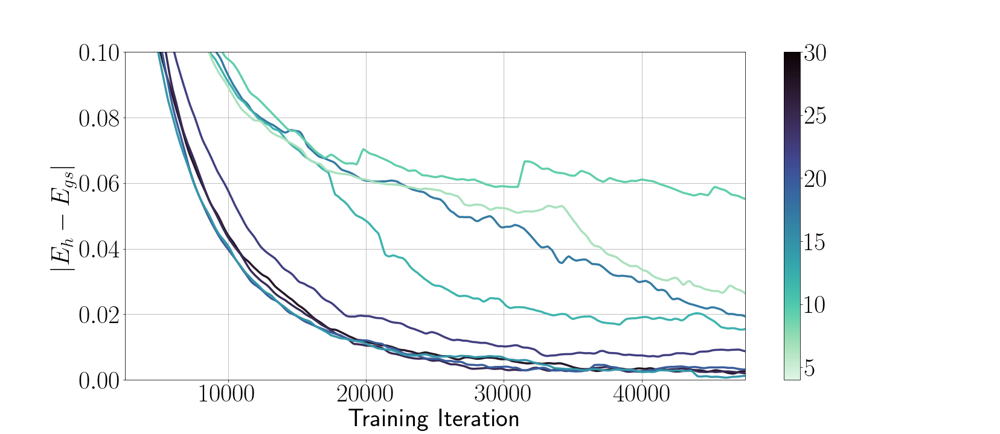

# Sorting Out Quantum Monte Carlo

## Abstract

Molecular modeling at the quantum level requires choosing a parameterization of the wavefunction that both respects the required particle symmetries, and is scalable to systems of many particles. For the simulation of fermions, valid parameterizations must be antisymmetric with respect to the exchange of particles. Typically, antisymmetry is enforced by leveraging the anti-symmetry of determinants with respect to the exchange of matrix rows, but this involves computing a full determinant each time the wavefunction is evaluated. Instead, we introduce a new antisymmetrization layer derived from sorting, the *sortlet*, which scales as $`O(N \log N)`$ with regards to the number of particles – in contrast to $`O(N^3)`$ for the determinant. We show numerically that applying this anti-symmeterization layer on top of an attention based neural-network backbone yields a flexible wavefunction parameterization capable of reaching chemical accuracy when approximating the ground state of first-row atoms and small molecules.

# Introduction

## Overview

Quantum Monte Carlo (QMC) methods are a class of algorithm that aim to model the wavefunction for a system of quantum particles, typically an atom or molecule. In its simplest form, Variational Quantum Monte Carlo (VQMC) is a QMC method that aims to estimate the lowest-energy state of a system via the variational principle. This is done by minimizing the Rayleigh quotient of the system’s Hamiltonian over a parametric family of wavefunctions – commonly referred to as the *wavefunction ansatz*. Variational principles from functional analysis yield that under mild assumptions, the minimizer approaches the true ground state wavefunction as the parametric family increases in expressiveness.

The first method resembling modern VQMC was proposed by London and Heilter in the late 1920s , where they attempted to calculate the ground state of the diatomic hydrogen molecule. Fermi and then later Kalos  converted the problem into a Monte Carlo Sampling one. The advent of the practical Slater determinant ansatz in the 1950s and the growth in available computational power since has allowed QMC algorithms to become one of the benchmark frameworks for deriving the properties of chemical systems *in silico*. Often, QMC is used to benchmark other non-sampling methods, such as Coupled Cluster methods and Density Functional Theory (DFT).

Advances in automatic differentiation complemented by empirical ML experience have recently produced new types of wavefunction ansatz, assembled around deep neural network backbones. Neural networks are particularly attractive in this setting, due to their favourable scalability as dimension increases. Electron configuration space, $`\mathbb{R}^{3N}`$, grows exponentially in the number of electrons $`N`$, rendering this ability critical. Hybrid methods, seeking to combine Slater determinants with neural orbitals or Jastrow factors, have recently shown promise on systems comprised of a large number of particles – even when relatively few Slater determinants are employed . Their performance is especially notable when contrasted against existing Hartree-Fock implementations with an equivalent number of determinants.

Despite these recent successes, there is a good reason to look beyond Slater determinants when designing ansatz – determinants are relatively computationally expensive. Evaluating a determinant-based ansatz scales $`O(N^3)`$ in the number of electrons, devolving to $`O(N^4)`$ when evaluating the local energy (due to the Laplacian). Estimating the energy is required at every step of nearly every QMC algorithm (variational or otherwise), so this quickly becomes a bottleneck if we look to scale QMC beyond small molecules to problems of practical interest, where $`N`$ could be on the order of thousands or even tens of thousands of electrons.

<figure>
<p><strong>The Sortlet Ansatz</strong></p>
<figcaption>Geometric illustration of the Sortlet ansatz construction given in <a href="#eq:sortlet" data-reference-type="ref+Label" data-reference="eq:sortlet">[eq:sortlet]</a>. Here <span class="math inline"><em>π</em><sub><em>α</em></sub></span> is the permutation that sorts the output of <span class="math inline"><em>α</em>(<em>r</em>)</span>.</figcaption>
</figure>

## Our Contribution

Seeking to reduce this complexity, we introduce a novel antisymmetrization operation, the *sortlet*, and apply it within the VQMC framework to model ground states of various atoms and molecules. Crucially, our operation enjoys an improved $`O(N\log N)`$ complexity, which comes from replacing the determinant with a cheaper alternative: sorting. Sorting is known to be universal for systems of 1d electrons , and has been alluded to previously as a method for designing ansatz (see Appendix B of and ). Our contribution is twofold – we show both that a natural extension of sorting for electrons in 3d space exists, as well as that this ansatz can achieve chemical accuracy, at least on small systems, when paired with a sufficiently flexible functional backbone such as a modern attention based neural network.

Prior work explored the usage of Vandermonde determinants which scale $`O(N^2)`$, but both were unable to achieve the high degree of accuracy required for applications in quantum chemistry. In <a href="#sec:comparison" data-reference-type="ref+Label" data-reference="sec:comparison">5.2</a> we present a topological obstruction to a single continuous Vandermonde determinant learning the exact ground state, based on the known geometry of the wavefunction’s nodal surface.

The construction of a universal, sub-cubic-time continuous representation of ground-state wavefunctions remains an open problem. However, we show that, like the vandermonde determinant, our sortlet can represent the ground state exactly if we allow discontinuous parameterizations. We also highlight a key benefit of the lower scaling complexity of the sortlet – allowing more terms in the wavefunction ansatz with the same (asymptotic) computational budget. Classical QMC techniques have relied on larger expansions to help mitigate topological inconsistencies between the parametric ansatz and the true ground state . In the context of VQMC, this might partially explain why our method is able to achieve higher accuracy than previous Vandermonde constructions .

Numerically, we demonstrate that combining our sortlet antisymmetrization layer with the PsiFormer attention backbone is sufficient to achieve chemical accuracy on a handful of atoms and small molecules, as well as reproduce the potential energy surface of $`H_4`$ rectangles as one bond length is scanned. While wavefunction ansatz built from alternatives to determinants have existed in the QMC literature for some time, to the best of our knowledge, this is the first work to demonstrate chemical accuracy with something other than a determinant – even if only on small molecular systems at the current stage. Flexibility of the attention neural network backbone of offers another partial explanation for why our ansatz has proven more accurate than other full determinant alternatives in the past. That said, at the current state our results are far from competitive with those of neural network ansatz with full determinants . In fairness to our approach, the results presented in that body of work are the outcome of a long series of incremental improvements – far beyond the scope of the initial proof-of-concept described in this paper. Our accuracy on small systems, we believe, is a evidence that the sortlet ansatz is a promising direction for further study, and that with similar investments in software engineering, our method could become competitive on more difficult benchmarks.

## Where did the determinants come from anyway?

Determinants appear in nearly all QMC ansatz as a simple mathematical way to satisfy the generalized Pauli Exclusion Principle: any valid wavefunction must be antisymmetric under exchange (transposition) of any two electrons with the same spin. Intuitively, this follows from the idea that quantum particles such as electrons are indistinguishable, so changing their order (which has no physical meaning) cannot change the state of the system. Explaining the appearance of the -1 factor is more involved – representing the fundamental difference between Fermions and Bosons (see ) – but for our purposes, we just assume any valid wavefunction for Fermions needs to respect the antisymmetry equation:
``` math
\label{eq:antisymmetry}
  \Psi(r^{\uparrow}_1, \cdots, r^{\uparrow}_M, r^{\downarrow}_1, \cdots, r^{\downarrow}_i, \cdots, r^\downarrow_j, \cdots) = - \Psi(r^{\uparrow}_1, \cdots, r^{\uparrow}_M, r^{\downarrow}_1, \cdots, r^{\downarrow}_j, \cdots, r^\downarrow_i, \cdots) \tag{AS}
```
Alternation of the determinant under the exchange of any two rows or columns has been conventionally employed to satisfy this property. Originally, the Slater determinants typically consisted of parameterizing a matrix function $`\Phi : \mathbb{R}^{3N} \longrightarrow \mathbb{R}^{N \times N}`$ via a collection of $`N`$ single electron orbitals $`\Phi_{ij} = \phi_i (r_j)`$, each of which was only a function of a single $`r_j`$. Upon interchanging the electron positions, the resulting matrix $`\Phi'_{ij}`$ is exactly $`\Phi_{ij}`$ with two rows swapped, flipping the sign of $`\Psi := \det [\Phi_{ij}]`$.

Though this approach is undeniably tidy, it suffers limited expressive power due to its inability to accurately model electronic correlation, which involves the interactions of all N-particles at a time rather than treating particles as mean-field orbitals. Common remedies include either the addition of parametric Jastrow factors which are multiplicative against the determinant, i.e $`\Psi = e^{J(r)}\det [\Phi_{ij}(r)]`$, or backflow transformations , which makes each orbital $`\phi_i (q_j)`$ dependent on all electron positions through so called pseudo-coordinates $`q_j = r_j + \varepsilon^i r_i`$. Modern neural network approaches such as FermiNet, PsiFormer or PauliNet can be seen as a more flexible generalization of backflow, since they opt to parameterize the matrix $`\Phi_{ij}`$ as the output of a deep neural network, but in a way that the $`\Phi_{ij}`$ depend symmetrically on all electron positions except for $`r_j`$, which is allowed non-symmetric influence. Filling out $`\Phi_{ij}`$ this way preserves the antisymmetry of the Slater determinant, and provides sufficient flexibility to capture electronic correlation. Large neural networks and powerful parallel accelerators have allowed this approach to scale to systems of around 40 electrons with state-of-the-art results .

# Variational Quantum Monte Carlo

The following is a brief summary of the core aspects VQMC, but it is by no means exhaustive. Those experienced with the framework will likely find it redundant, and those completely new will probably find it incomplete. For the latter group, we recommend either or , which provide much more exhaustive treatments of the relevant background.

## The Born-Oppenheimer Hamiltonian

While our wavefunction ansatz is general enough to describe any system of Fermions, in this paper we will focus on quantum chemical systems comprised of electrons. Similar to we will work in the Born-Oppenheimer approximation, where the molecular nuclei are treated as fixed, and the Hamiltonian governing the forces acting on the electrons is given by
``` math
\begin{aligned}
  \hspace{-10 pt} \hat H = -{\nabla^2 \over 2} + \left[ \sum_{i > j} {1 \over|r_i - r_j|} - \sum_{i,I} {Z_I \over |r_i - R_I|} + \sum_{I >J} {Z_I Z_J \over |R_I - R_J|} \right] \label{eq:QMC-hamil}  \hspace{5 pt} \boxed{\begin{array}{c}  r_i \text{: electron positions} \\ 
R_i \text{: nuclei positions} \\ 
Z_I \text{:  nuclear charges} 
  \end{array}}\tag{BO}
\end{aligned}
```
The terms inside the square brackets are often written simply as $`V(r)`$, since they represent the potential energy of the electrons. Analogously, $`-\nabla^2`$ is the kinetic energy operator, and interpreted as the squared momentum operator $`p = i \nabla`$, since $`\nabla^2 = \text{div}(\nabla) = i \nabla, i \nabla`$. The ground state $`\Psi_g`$ for a given system $`\hat H`$, is nothing more than the eigenfunction corresponding to the smallest eigenvalue $`E_1`$ of $`\hat H`$.

## The Variational Principle

The *variational* aspect of VQMC comes from the following proposition:

<div class="prop">

**Proposition 1**. *Variational Principle  
Let $`\Psi_1`$ be minimum eigenvector of the Hermitian operator $`\hat H`$, that is, the eigenfunction associated to the smallest eigenvalue $`E_1`$. Then
``` math
\Psi_1 = \underset{\Psi}{\mathrm{argmin}} { \Psi \vert \hat H \vert \Psi \over \Psi \vert \Psi } \label{eq:var} \tag{VAR}
```*

</div>

The term inside $`\text{argmin}`$ is often called the *Rayleigh quotient* and so denoted by $`R(\Psi)`$. Proving this proposition amounts to hardly more than a little bookkeeping, see <a href="#proof:var-prin" data-reference-type="ref+Label" data-reference="proof:var-prin">[proof:var-prin]</a> The variational principle comes in very handy, providing a straightforward technique to solve for the ground state $`\Psi_1`$ – simply minimize the Rayleigh $`R`$ quotient over all admissible $`\Psi`$. Practically, however, there are a few complications, which we’ll discuss next.

## The Local Energy and its Vanishing Variance

The variational energy $`E = R(\Psi_\theta)`$, for any parameteric configuration of $`\theta`$ can in principle be computed from the inner product in <a href="#eq:var" data-reference-type="eqref" data-reference="eq:var">[eq:var]</a>. Since we are limited to approximating the energy with a finite average in practice, this is suboptimal – the variance will be prohibitive, and we will need a tremendous number of samples to achieve a reasonable estimate. A much better approach is to instead define the local energy (at any point $`x \in \mathbb{R}^{3N}`$ )
``` math
E_\text{loc}(\Psi_\theta)(x) = {[\hat H  \Psi_\theta](x) \over \Psi_\theta(x)} \label{eq:local-eng}
```
it is easy to then see that
``` math
\mathbb{E}_{x \sim \Psi_\theta^2} [E_\text{loc}(x)]= E
```
where $`x \sim \Psi_\theta^2`$ is taken to mean that the $`x`$ are drawn from the normalized distribution, $`{\Psi_\theta^2 \over  \Psi_\theta | \Psi_\theta}`$. Reformulating the energy approximation in terms of $`E_\text{loc}`$ instead of the Rayleigh quotient has two immediate advantages

1.  Since we are sampling from $`\Psi_\theta^2`$, we avoid regions of low importance, significantly reducing the variance of our estimator.

2.  The local energy is invariant to rescaling by any constant, so normalizing the wavefunction $`\Psi_\theta`$ is unnecessary. Combined with the ability of MCMC to (asymptotically) draw samples from the un-normalized density $`\Psi_\theta^2`$, we can avoid estimating the partition constant altogether.

VQMC also benefits from a third seemingly magical property: as we update $`\theta`$ to minimize $`E`$, the variance *vanishes*. To see why, consider the following:

<div class="proposition">

**Proposition 1**. *Let $`\Psi_1`$ be the eigenfunction associated to the ground state energy $`E_1`$ (as before), then
``` math
E_{\text{loc}}(\Psi_1)(x) = E_1 \qquad  \forall x \in \mathbb{R}^{3N} \label{eq:e_loc_novar}
```
i.e the local energy is constant at optimality. Assuming that $`\Psi_\theta \longrightarrow \Psi_1`$ as we optimize $`\theta`$, the variance of <a href="#eq:local-eng" data-reference-type="eqref" data-reference="eq:local-eng">[eq:local-eng]</a> decreases, meaning our estimates of the energy and its gradients improve as $`\Psi`$ approaches the ground state.*

</div>

<div class="proof">

*Proof.* <a href="#eq:e_loc_novar" data-reference-type="ref+Label" data-reference="eq:e_loc_novar">[eq:e_loc_novar]</a> is a direct consequence of the variational principle; $`\Psi_1`$ is an eigenvector of $`\hat H`$, thus $`\hat H \Psi_1 = E_1 \Psi_1`$, which yields
``` math
E_\text{loc}(\Psi_1)(x) = {\hat H \Psi_1(x) \over \Psi_1(x)} = {E_1 \Psi_1(x) \over \Psi_1(x)} = E_1
```
 ◻

</div>

## Derivatives of the Energy Functional

Performing any sort of first order optimization over the parameters of our ansatz $`\Psi_\theta`$ to minimize its energy, denoted $`E(\theta)`$, will also require its gradients. Following the preceding section, we will estimate $`E(\theta)`$ via the following Monte-Carlo estimate
``` math
E(\theta) \approx \bar E(\theta) = \sum_{i=1}^N E_\text{loc}(\Psi_\theta)(x_i) \qquad x_i \sim \Psi^2_\theta \label{eq:mcmc_eng}
```
Any MCMC method (such as Random-Walk Metropolis Hastings for example) can be used to draw the $`x_i`$, which we will detail further in the next section. Approximating the energy via <a href="#eq:mcmc_eng" data-reference-type="eqref" data-reference="eq:mcmc_eng">[eq:mcmc_eng]</a>, while superior for the reasons laid out above, comes at the price of making the computation of its gradients more involved than naively applying automatic differentiation to each term in the finite sum. Differentiating $`{\partial E \over \partial \theta}`$ correctly requires also accounting for the influence of the parameters on the distribution $`\Psi_\theta^2`$ which the $`x_i`$ are drawn from. Like in many other  other works , we use the gradient estimator

``` math
\boxed{\nabla E (\theta) = 2 {1 \over n} \sum_{i=1}^n \left[ E_\text{loc}(x_i) \nabla \log \Psi_\theta (x_i) - 2 \left( {1 \over n} \sum_{i=1}^n \left[ E_\text{loc}(x_i)  \right] \right)\nabla \log \Psi_\theta (x_i) \right]}
    \label{eq:eng-grad}
```
where $`x_i \sim \Psi^2_\theta`$ are drawn using MHMC, but we offer a full derivation in <a href="#apx:grad-est" data-reference-type="ref+Label" data-reference="apx:grad-est">7.2</a>. Notably, this can be seen as an instance of the REINFORCE estimator widely used in reinforcement learning .

**Remark: Isn’t that estimate biased?  **
Mathematically, it is true that since we are reusing the same batch of $`x_i`$ to estimate both expectations in <a href="#eq:eng-grad" data-reference-type="eqref" data-reference="eq:eng-grad">[eq:eng-grad]</a> via <a href="#eq:eng-grad-finite" data-reference-type="eqref" data-reference="eq:eng-grad-finite">[eq:eng-grad-finite]</a>, there will be bias introduced – the covariance between the two portions of the second term will be non-zero. Vanishing variance of the energy, however, will save us again here, since we can upper bound the covariance using Cauchy-Schwarz as
``` math
\begin{gathered}
  X =  {1 \over n} \sum_{i=1}^n \left[ E_\text{loc}(x_i)\right]  \qquad Y = {1 \over n} \sum_{i=1}^n \left[\nabla \log \Psi_\theta (x_i)  \right] \qquad \text{cov}(X,Y) \leq \sqrt{ \text{Var}(X) \text{Var}(Y)}
\end{gathered}
```
and we know $`\text{Var}(X) \longrightarrow 0`$ as our estimate of the ground state improves. So for practical purposes, this correlation is negligible.

# The Sortlet Ansatz

## The Sortlet Ansatz

We are ready to define what we coin the *Sortlet Ansatz*. First, let’s define what we call a *sortlet*, denoted by $`\Psi_\alpha`$:
``` math
\Psi_\alpha(r) = \sigma(\pi_\alpha)\prod_{i=1}^N \left(\alpha_{i+1}(r) - \alpha_i(r)\right) \label{eq:sortlet}
```
where

- $`\alpha: \mathbb{R}^{ N \times 3} \longrightarrow\mathbb{R}^N`$, is assumed permutation equivariant, and reindexed such that $`\alpha_i  < \alpha_{i+1} : 1 \leq i \leq N - 1`$. **This is the parameterized, neural network backbone.**

- $`\pi_\alpha`$ is the permutation on $`N`$ letters which re-indexes (sorts) the tuple $`\alpha(r)`$

- $`\sigma(\pi_\alpha)`$ is the parity, equivalently number of transpositions in $`\pi_\alpha`$, mod 2.

Analogously to other VQMC ansatz, we will employ an expansion of sortlets to serve as our sortlet ansatz in VQMC. Specifically, our $`\Psi`$ is expanded as
``` math
\Psi = \exp [J_\beta] \sum_{i=1}^K \Psi_{\alpha_i}  e^{-\gamma_i  \sum_j |r_j|}\label{eq:fund-ans}
```
where just as in , (with $`\rho_i`$ returning the spin of electron $`i`$) the simple Jastrow factor that we decided to employ is:
``` math
J_\beta = \sum_{i < j, \rho_i = \rho_j} {-1 \over 4} {\beta_1 \over \beta_1^2 + |r_i - r_j|} + \sum_{i < j, \rho_i \neq \rho_j} {-1 \over 2} {\beta_2 \over \beta_2^2 + |r_i - r_j|}
```

As we will show in <a href="#sec:ansatz-properties" data-reference-type="ref+Label" data-reference="sec:ansatz-properties">3.2</a>, with discontinuous $`\alpha`$ we can exactly represent the ground state wavefunction with a single sortlet. Since the $`\alpha`$ we use in practice needs to be continuous for optimization, however, we generally want to make $`K`$ as large as possible to make optimization easier (see <a href="#fig:B-ablation" data-reference-type="ref+Label" data-reference="fig:B-ablation">2</a>).

#### Complexity:

The sortlet for a given $`\alpha`$ can be computed in time $`O(N \log N)`$. Taking $`K = O(N)`$ and with the assumption $`\alpha(r)`$ can be evaluated in time $`O(N^2)`$, we have that $`\Psi`$ can be evaluated in time $`O(N^2 \log N)`$, significantly faster than a determinant.

<figure id="fig:first-row">
<table>
<tbody>
<tr>
<td style="text-align: left;"></td>
<td style="text-align: left;"></td>
<td colspan="2" style="text-align: center;"><span class="math inline"><em>O</em>(<em>N</em><sup>2</sup>)</span> Ansatz</td>
<td colspan="2" style="text-align: center;"><span class="math inline"><em>O</em>(<em>N</em><sup>3</sup>)</span> Ansatz</td>
</tr>
<tr>
<td style="text-align: left;"></td>
<td style="text-align: center;"><table>
<tbody>
<tr>
<td style="text-align: center;">Exp.</td>
</tr>
<tr>
<td style="text-align: center;">Energy</td>
</tr>
</tbody>
</table></td>
<td style="text-align: center;"><table>
<tbody>
<tr>
<td style="text-align: center;">Sortlet</td>
</tr>
<tr>
<td style="text-align: center;">(Ours)</td>
</tr>
</tbody>
</table></td>
<td style="text-align: center;"><table>
<tbody>
<tr>
<td style="text-align: center;">Vandermonde</td>
</tr>
<tr>
<td style="text-align: center;"><span class="citation" data-cites="pang_on2_2022"></span></td>
</tr>
</tbody>
</table></td>
<td style="text-align: center;"><table>
<tbody>
<tr>
<td style="text-align: center;">Non-learned</td>
</tr>
<tr>
<td style="text-align: center;">QMC<span class="citation" data-cites="qmc_small_mol rios_qmc"></span></td>
</tr>
</tbody>
</table></td>
<td style="text-align: center;">FermiNet <span class="citation" data-cites="pfau_ab-initio_2020"></span></td>
</tr>
<tr>
<td style="text-align: left;">Li</td>
<td style="text-align: right;">-7.4780</td>
<td style="text-align: right;"><span> -7.477(8)</span></td>
<td style="text-align: right;"></td>
<td style="text-align: right;"><span> -7.4780</span></td>
<td style="text-align: right;"><span> -7.4779</span></td>
</tr>
<tr>
<td style="text-align: left;">LiH</td>
<td style="text-align: right;">-8.0705</td>
<td style="text-align: right;"></td>
<td style="text-align: right;"></td>
<td style="text-align: right;"></td>
<td style="text-align: right;"></td>
</tr>
<tr>
<td style="text-align: left;">Be</td>
<td style="text-align: right;">-14.6673</td>
<td style="text-align: right;"><span> -14.667(1)</span></td>
<td style="text-align: right;"></td>
<td style="text-align: right;"><span> -14.6671</span></td>
<td style="text-align: right;"><span> -14.6673</span></td>
</tr>
<tr>
<td style="text-align: left;">Li2</td>
<td style="text-align: right;">-14.9947</td>
<td style="text-align: right;"></td>
<td style="text-align: right;"></td>
<td style="text-align: right;"></td>
<td style="text-align: right;"></td>
</tr>
<tr>
<td style="text-align: left;">B</td>
<td style="text-align: right;">-24.6539</td>
<td style="text-align: right;"><span> -24.652(7)</span></td>
<td style="text-align: right;"></td>
<td style="text-align: right;"><span> -24.6533</span></td>
<td style="text-align: right;"><span> -24.6537</span></td>
</tr>
<tr>
<td style="text-align: left;">C</td>
<td style="text-align: right;">-37.8450</td>
<td style="text-align: right;"></td>
<td style="text-align: right;"></td>
<td style="text-align: right;"></td>
<td style="text-align: right;"></td>
</tr>
<tr>
<td style="text-align: left;">N</td>
<td style="text-align: right;">-54.5892</td>
<td style="text-align: right;"></td>
<td style="text-align: right;"></td>
<td style="text-align: right;"></td>
<td style="text-align: right;"></td>
</tr>
<tr>
<td style="text-align: left;">CH4</td>
<td style="text-align: right;">-</td>
<td style="text-align: right;">-40.20(1)</td>
<td style="text-align: right;">-</td>
<td style="text-align: right;">-40.4416</td>
<td style="text-align: right;">-40.5140</td>
</tr>
</tbody>
</table>
<figcaption>Results from applying the Sortlet ansatz to a selection of atoms and small molecules. Energy values are all given in Hartree (Ha) atomic units. Chemical accuracy is defined to be within 1.5 mHa of the experimental values, green denotes values within this tolerance, red outside. Uncertainty is included in the parenthesis around the last digit – see <a href="#apx:epx-details" data-reference-type="ref+Label" data-reference="apx:epx-details">8</a>. </figcaption>
</figure>

## Properties of the Sortlet Ansatz

<div class="proposition">

**Proposition 2**. *The Sortlet Ansatz satisfies the generalized Pauli exclusion principle – it is anti-symmetric to the exchange of electrons with the same spin.*

</div>

<div class="proof">

*Proof.* The product $`\prod_{i=1}^N [\alpha_{i+1} - \alpha_i]`$ is invariant by design since the terms are always sorted before taking the pairwise difference, negating any permutation. $`\sigma(\pi_\alpha)`$ flips sign upon each odd permutation, since $`\sigma`$ is multiplicative, and undoing the permutation then sorting the original array is equivalent to sorting the permutated array, i.e if $`\tau`$ is any transposition of two electrons with the same spin, $`\pi_{\alpha(r)} \tau^{-1}  = \pi_{\alpha(\tau r)}`$ and so
``` math
\sigma(\pi_{\alpha(\tau r)}) = \sigma(\pi_\alpha)\sigma(\tau^{-1}) = - \sigma(\pi_\alpha)
```
since any transposition has parity $`-1`$. ◻

</div>

Note that to avoid over-constraining the ansatz by also making it anti-symmetric to transposition of opposite spin electrons – something the true wavefunction is **not** required to satisfy – we use the same trick as in , attaching a spin $`\pm 1`$ term to each input electron coordinate $`r_i`$ as $`(r_i, \pm 1)`$, which breaks equivariance of the output $`\alpha (r)`$ for those pairs.

<div class="proposition">

**Proposition 3**. *Each $`\Psi_\alpha`$ is continuously once-differentiable on $`\mathbb{R}^{3N}`$, meaning $`{\partial \Psi_\alpha \over \partial r^i}`$ is continuous for all $`i`$.*

</div>

We defer the full proof to <a href="#apx:sortlet-smooth" data-reference-type="ref+Label" data-reference="apx:sortlet-smooth">7.3</a>.

# Numerical Experiments

## Evaluation on first row atoms and small molecules

<a href="#fig:first-row" data-reference-type="ref+Label" data-reference="fig:first-row">1</a> collects the results of running QMC with our Sortlet ansatz on the ground state for a small collection of first row atoms and small molecules. We see that up to and including Boron, we are able to recover the ground state experimental energy to chemical accuracy. For Carbon and beyond, while we no longer achieve chemical accuracy, our method still outperforms the previous $`O(N^2)`$ method of .

## Performance as a function of sortlets on Boron

In <a href="#fig:B-ablation" data-reference-type="ref+Label" data-reference="fig:B-ablation">2</a>, we show an ablation study comparing performance in terms of absolute difference to the empirical ground state values after $`50,000`$ optimization steps, against the number of sortlets on Boron. While all except one of the runs terminate at less than 20 mHa to the ground state, we see that those with $`K > 16`$ reach a slightly lower error on average, but achieve that value significantly faster than those with $`K < 16`$. Size of the network is kept constant for all runs (with the exception of the linear output layer), the only variable explored in this study is the number of terms $`K`$.

<figure id="fig:H4-geo">
<figure id="fig:B-ablation">

<figcaption><span id="fig:B-ablation" data-label="fig:B-ablation"></span> Comparing the number of Sortlets <span class="math inline"><em>K</em></span> (color) against the error to the empirical ground state energy.</figcaption>
</figure>
<figure id="fig:H4-geo">

<figcaption><span id="fig:H4-geo" data-label="fig:H4-geo"></span> Reproduction of <span class="math inline"><em>H</em><sub>4</sub></span> potential energy surface from the FermiNet paper. </figcaption>
</figure>
<figcaption>Boron Sortlet Ablation and <span class="math inline"><em>H</em><sub>4</sub></span> rectangle.</figcaption>
</figure>

## Reproduction of $`H_4`$ potential energy curve

In <a href="#fig:H4-geo" data-reference-type="ref+Label" data-reference="fig:H4-geo">4</a> we reproduced the $`H_4`$ experiment from , where the geometry of the $`H_4`$ rectangle was linearly adjusted by varying the bond length of the bottom two hydrogen atoms. In agreement with FermiNet, we were able to reproduce the curve showing a maximum at $`\Theta = 90 \deg`$, not a minimum like the benchmark Coupled Cluster calculations.

# Comparison with other Pairwise Constructions and Universality

In this section, we show a weak form of universality of the sortlet and that of the Vandermonde construction put forward in . We show that a slight modification of the argument from Theorem 2 in also yields universality for the sortlet, but similar to the argument in the Appendix of , requires discontinuous functions. Theoretical universality so remains an open question, but we finish by discussing the implications of the nodal structure on experimental results.

## Non-smooth universality

A nearly identical construction to Theorem 2 in recovers a similar type of universality for the sortlet:

<div class="proposition">

**Proposition 4**. *For a given ground state wavefunction $`\Psi_g`$, if we allow $`\alpha`$ to be discontinuous, setting
``` math
\alpha_j = \pi^{*}(r,j) \left( {\Psi^g \left[\pi^*(r)r \right] \over (N-1)} \right)^{1/N}
```
yields that $`\Psi_{\alpha} = \Psi_g`$. Here $`\pi^{*}(r)`$ is the permutation on $`N`$ letters that maps $`r \in \mathbb{R}^{3N}`$ back to the fundamental domain (see ), $`\pi^*(r,j) \in [1,N]`$ is the index the $`j`$th electron maps to.*

</div>

<div class="proof">

*Proof.* The proof is immediate from the definition of $`\Psi_\alpha`$ in <a href="#eq:sortlet" data-reference-type="ref+Label" data-reference="eq:sortlet">[eq:sortlet]</a>
``` math
\Psi_\alpha = \sigma(\pi^*) \prod_{i=1}^N [\alpha_{i+1} - \alpha_i] =  \sigma(\pi^*)  \left( \prod_{i=1}^{N-1} \left[ {|\Psi_g|\over (N-1)}  \right]^{1/n} \right)  (N-1) \left[ {|\Psi_g|\over (N-1)} \right]^{1/n} = \sigma(\pi^*) |\Psi_g|
```
 ◻

</div>

## Comparison with the Vandermonde Ansatz

In and later , a similar type of pairwise antisymmetric ansatz was proposed, which takes the form

``` math
\psi'_{\text{pair}}(r) = \prod_{i < j} \left[ \phi_B(r_i, \{r\}) - \phi_B(r_j, \{r\})\right] \label{eq:pairwise}
```
where the second argument to $`\phi_B`$ is denoted as such to indicate the function is invariant to permutations of the electron positions, except for $`r_i`$ (as our $`\alpha`$ has been assumed all along). This expression is also equivalent to a Vandermonde matrix determinant (see Equation 1 ), which is why we refer to it simply as the Vandermonde Ansatz. Pang et al claim to have proved this form is universal for ground states, but unfortunately a simple argument shows this is not quite accurate. Ground states for small atoms (Li, Be) have been proven to possess exactly two nodal domains – open sets $`\mathcal{N} \subseteq \mathbb{R}^{3N}`$ where the wavefunction is non-zero. So to represent them exactly, the ansatz must also have two nodal domains. Below we prove that for $`\psi'_\text{pair}`$ this is not the case – regardless of the parameterization of $`\phi_B`$, $`\psi'_\text{pair}`$ always has at least $`4`$ nodal domains.

<div id="prop:pang-counter" class="proposition">

**Proposition 5**. *$`\psi'_{\text{pair}}`$, as defined in <a href="#eq:pairwise" data-reference-type="eqref" data-reference="eq:pairwise">[eq:pairwise]</a> has $`N^\uparrow ! + N^\downarrow!`$, nodal domains, where $`N^{\uparrow \downarrow}`$ are the numbers of spin up /down electrons. Since the ground state is proven to have only 2 for Li, Be (see ) this implies one Vandermonde determinant is insufficient to accurately represent the ground state.*

</div>

<div class="proof">

*Proof.* Let $`r \in \mathbb{R}^{3N}`$ be an arbitrary configuration, and let $`\pi \in S(N^{\uparrow}) \cup S(N^\downarrow)`$ be a permutation on either the spin up or spin down electrons. We claim then that $`r`$ and $`\pi r`$ must always lie in separate nodal domains. To see this, let $`(i,j)`$ be any indices of two electrons with the same spin who are transposed by $`\pi`$. Note that the product comprising $`\psi'_\text{pair}`$ contains a pairwise term $`\left[\phi_B(r_i, \{r\}) - \phi_B(r_j, \{r\})\right]`$. Without loss of generality, asume $`\phi_B(r_i, \{r\}) > \phi_B(r_j, \{r\})`$. But for $`\hat r = \pi r`$ we must have
``` math
\left[ \phi_B(r_i, \{r\}) - \phi_B(r_j, \{r\}) \right]= -  \left[ \phi_B(\hat r_i, \{\hat r\}) - \phi_B(\hat r_j, \{\hat r\}) \right]
```
(because $`\hat r_i = r_j`$ and $`\hat r_j = r_i`$, and $`\phi_B`$ is otherwise invariant to $`\pi r`$). Applying the intermediate value theorem (since $`\phi_B`$ is assumed continuous), it then follows for any path
``` math
\gamma(t) : [0,1] \longrightarrow\mathbb{R}^{3N} \qquad \gamma(0) = r \qquad \gamma(1) = \hat r
```
connecting $`r, \hat r`$ must satisfy $`\left[ \phi_B(\gamma(t')_i, \{\gamma(t')\}) - \phi_B(\gamma(t')_j, \{\gamma(t')\}) \right] = 0`$ for some $`t' \in (0,1)`$. Again, since $`\psi'_\text{pair}= \prod_{i < j} \left[ \phi_B(r_i, \{r\}) - \phi_B(r_j, \{r\}) \right]`$, a zero in any term $`\phi_B(r_i, \{r\}) - \phi_B(r_j, \{r\})`$ zeros $`\Psi`$. Since $`\pi \in S(N^\uparrow) \cup S(N^\downarrow)`$ was arbitrary, this yields that there are exactly $`N^\uparrow! + N^\downarrow!`$ nodal domains. ◻

</div>

#### Remark:

Since $`\pi`$ was arbitrary, this also prohibits the sort of triple exchanges which in the exact ground state, connect same sign regions and collapse the number of nodal cells to 2 . Additionally, although Beryllium is the largest system for which the two nodal domain conjecture is proven, it’s frequently conjectured through the literature to be true universally, again see . We also remark it’s known that $`\pi^{*}`$ is not constant across nodal domains as claimed in – instead, regions were $`\pi^{*}`$ is constant are referred to as permutation domains (equivalently cells), and it is known that each nodal domain contains multiple permutation cells (see Figure 3 in ).

## Advantages of the Sortlet Ansatz against the Vandermonde Ansatz

To be clear, a single sortlet suffers from the same issue of too many nodal domains proven for the Vandermonde determinant in <a href="#prop:pang-counter" data-reference-type="ref+Label" data-reference="prop:pang-counter">5</a>. Nonetheless, a key advantage of the Sortlet is that, due to the $`O(N \log N)`$ scaling of each term, we can use an expansion with a linear number of sortlets, $`K=O(N)`$, while retaining log-quadratic complexity $`O( N^2 \log N)`$. To achieve the same scaling, a Vandermonde ansatz, would be limited to a logarithmic number of terms. What does this mean practically? Increasing the number of terms is known to be crucial in classical QMC methods, where thousands or even millions of terms can be employed to refine the energy . It is also known that for Hartree-Fock wavefunctions, increasing the number of terms is essential to reduce the number of nodal domains .

Learned neural QMC ansatz such as have mostly bucked this trend, opting to fix the number of terms to a relatively small constant ($`K \approx 16`$), but increase network size instead. While we are not able to match the flexibility of the determinant PsiFormer, which is likely universal with a constant number of determinants, as seen in <a href="#fig:B-ablation" data-reference-type="ref+Label" data-reference="fig:B-ablation">2</a>, mitigating the nodal inaccuracy of our sortlet by increasing $`K`$ does seem to increase the speed of convergence.

# Related Work

Neural Networks as representations for wavefunctions were applied to discrete quantum systems in and to continuous bosonic systems in . However, the first models considering fermionic continuous-space systems were DeepWF , Ferminet , and Paulinet . These approaches were further developed with the introduction of the Psiformer model and works that pushed the framework forward by fine-tuning the techniques and devising new specialized architectures and training procedures that improved the speed and energies significantly. Other directions tried to construct architectures that are easy to sample by leveraging normalizing flows, and meta-learning approaches where the wavefunction can be conditioned on the Hamiltonian to transfer to different systems .  
Sorting as a method of guaranteeing antisymmetry was recently proposed in , but limited to the setting where electron positions are restricted to one-dimension.

# References

<div class="thebibliography">

A. Acevedo, M. Curry, S. H. Joshi, B. Leroux, and N. Malaya Vandermonde Wave Function Ansatz for Improved Variational Monte Carlo In *2020 IEEE/ACM Fourth Workshop on Deep Learning on Supercomputers (DLS)*, pages 40–47, Atlanta, GA, USA, Nov. 2020. IEEE. ISBN 978-1-66542-245-1. . URL <https://ieeexplore.ieee.org/document/9297114/>. **Abstract:** Solutions to the Schrodinger equation can be used to predict the electronic structure of molecules and materials and therefore infer their complex physical and chemical properties. Variational Quantum Monte Carlo (VMC) is a technique that can be used to solve the weak form of the Schrodinger equation. Applying VMC to systems with N electrons involves evaluating the determinant of an N by N matrix. The evaluation of this determinant scales as O(N \<sup xmlns:mml="http://www.w3.org/1998/Math/MathML" xmlns:xlink="http://www.w3.org/1999/xlink"\>3\</sup\> ) and is the main computational cost in the VMC process. In this work, we investigate an alternative VMC technique based on the Vandermonde determinant. The Vandermonde determinant is a product of pairwise differences and so evaluating it scales as O(N \<sup xmlns:mml="http://www.w3.org/1998/Math/MathML" xmlns:xlink="http://www.w3.org/1999/xlink"\>2\</sup\> ). Therefore, this approach reduces the computational cost by a factor of N. The Vandermonde determinant was implemented in PyTorch and the performance was assessed in approximating the ground state energy of various quantum systems against existing techniques. The performance is evaluated in a variety of systems, starting with the one-dimensional particle in a box, and then considering more complicated atomic systems with multiple particles. The Vandermonde determinant was also implemented in PauliNet, a deep-learning architecture for VMC. The new method is shown to be computationally efficient, and results in a speed-up as large as 5X. In these cases, the new ansatz obtains a reasonable approximation for wavefunctions of atomic systems, but does not reach the accuracy of the Hartree-Fock method that relies on the Slater determinant. It is observed that while the use of neural networks in VMC can result in highly accurate solutions, further work is necessary to determine an appropriate balance between computational time and accuracy. (@acevedo_vandermonde_2020)

Y. S. Al-Hamdani, P. R. Nagy, A. Zen, D. Barton, M. Kállay, J. G. Brandenburg, and A. Tkatchenko Interactions between large molecules pose a puzzle for reference quantum mechanical methods *Nature Communications*, 24 June 2021. ISSN 2041-1723. . **Abstract:** Abstract Quantum-mechanical methods are used for understanding molecular interactions throughout the natural sciences. Quantum diffusion Monte Carlo (DMC) and coupled cluster with single, double, and perturbative triple excitations \[CCSD(T)\] are state-of-the-art trusted wavefunction methods that have been shown to yield accurate interaction energies for small organic molecules. These methods provide valuable reference information for widely-used semi-empirical and machine learning potentials, especially where experimental information is scarce. However, agreement for systems beyond small molecules is a crucial remaining milestone for cementing the benchmark accuracy of these methods. We show that CCSD(T) and DMC interaction energies are not consistent for a set of polarizable supramolecules. Whilst there is agreement for some of the complexes, in a few key systems disagreements of up to 8 kcal mol −1 remain. These findings thus indicate that more caution is required when aiming at reproducible non-covalent interactions between extended molecules. (@al-hamdani21)

A. Ammar, E. Giner, and A. Scemama Optimization of large determinant expansions in quantum monte carlo *Journal of Chemical Theory and Computation*, 18 (9): 5325–5336, 2022. . URL <https://doi.org/10.1021/acs.jctc.2c00556>. PMID: 35997484. **Abstract:** We present a new method for the optimization of large configuration interaction (CI) expansions in the quantum Monte Carlo (QMC) framework. The central idea here is to replace the nonorthogonal variational optimization of CI coefficients performed in usual QMC calculations by an orthogonal non-Hermitian optimization thanks to the so-called transcorrelated (TC) framework, the two methods yielding the same results in the limit of a complete basis set. By rewriting the TC equations as an effective self-consistent Hermitian problem, our approach requires the sampling of a single quantity per Slater determinant, leading to minimal memory requirements in the QMC code. Using analytical quantities obtained from both the TC framework and the usual CI-type calculations, we also propose improved estimators which reduce the statistical fluctuations of the sampled quantities by more than an order of magnitude. We demonstrate the efficiency of this method on wave functions containing 105-106 Slater determinants, using effective core potentials or all-electron calculations. In all the cases, a sub-milli-Hartree convergence is reached within only two or three iterations of optimization. (@transcorrelated_qmc)

F. Becca and S. Sorella *Quantum Monte Carlo Approaches for Correlated Systems* Cambridge University Press, 2017. . **Abstract:** Over the past several decades, computational approaches to studying strongly-interacting systems have become increasingly varied and sophisticated. This book provides a comprehensive introduction to state-of-the-art quantum Monte Carlo techniques relevant for applications in correlated systems. Providing a clear overview of variational wave functions, and featuring a detailed presentation of stochastic samplings including Markov chains and Langevin dynamics, which are developed into a discussion of Monte Carlo methods. The variational technique is described, from foundations to a detailed description of its algorithms. Further topics discussed include optimisation techniques, real-time dynamics and projection methods, including Green’s function, reptation and auxiliary-field Monte Carlo, from basic definitions to advanced algorithms for efficient codes, and the book concludes with recent developments on the continuum space. Quantum Monte Carlo Approaches for Correlated Systems provides an extensive reference for students and researchers working in condensed matter theory or those interested in advanced numerical methods for electronic simulation. (@becca_sorella_2017)

D. Bressanini Implications of the two nodal domains conjecture for ground state fermionic wave functions *Physical Review B*, 86 (11): 115120, Sept. 2012. ISSN 1098-0121, 1550-235X. . URL <https://link.aps.org/doi/10.1103/PhysRevB.86.115120>. **Abstract:** The nodes of many-body wave functions are mathematical objects important in many different fields of physics. They are at the heart of the quantum Monte Carlo methods but outside this field their properties are neither widely known nor studied. In recent years a conjecture, already proven to be true in several important cases, has been put forward related to the nodes of the fermionic ground state of a many-body system, namely that there is a single nodal hypersurface that divides configuration space into only two connected domains. While this is obviously relevant to the fixed node diffusion Monte Carlo method, its repercussions have ramifications in various fields of physics as diverse as density functional theory or Feynman and Cohen’s backflow wave function formulation. To illustrate this we explicitly show that, even if we knew the exact Kohn-Sham exchange correlation functional, there are systems for which we would obtain the exact ground state energy and density but a wave function quite different from the exact one. This paradox is only apparent since the Hohenberg-Kohn theorem relates the energy directly to the density and the wave function is not guaranteed to be close to the exact one. The aim of this paper is to stimulate the investigation of the properties of the nodes of many-body wave functions in different fields of physics. Furthermore, we explicitly show that this conjecture is related to the phenomenon of avoided nodal crossing but it is not necessarily caused by electron correlation, as sometimes has been suggested in the literature. We explicitly build a many-body uncorrelated example whose nodal structure shows the same phenomenon. (@bressanini_implications_2012)

G. Carleo and M. Troyer Solving the quantum many-body problem with artificial neural networks *Science*, 355 (6325): 602–606, 2017. **Abstract:** The challenge posed by the many-body problem in quantum physics originates from the difficulty of describing the non-trivial correlations encoded in the exponential complexity of the many-body wave function. Here we demonstrate that systematic machine learning of the wave function can reduce this complexity to a tractable computational form, for some notable cases of physical interest. We introduce a variational representation of quantum states based on artificial neural networks with variable number of hidden neurons. A reinforcement-learning scheme is then demonstrated, capable of either finding the ground-state or describing the unitary time evolution of complex interacting quantum systems. We show that this approach achieves very high accuracy in the description of equilibrium and dynamical properties of prototypical interacting spins models in both one and two dimensions, thus offering a new powerful tool to solve the quantum many-body problem. (@carleo2017solving)

D. M. Ceperley Fermion nodes *Journal of Statistical Physics*, 63 (5): 1237–1267, June 1991. ISSN 1572-9613. . URL <https://doi.org/10.1007/BF01030009>. **Abstract:** We study nodes of fermionic ground state wave functions. For two dimensions and higher we prove that spin-polarized, noninteracting fermions in a harmonic well have two nodal cells for arbitrary system size. The result extends to noninteracting or mean-field models in other geometries and to Hartree-Fock atomic states. Spin-unpolarized noninteracting states have multiple nodal cells; however, interactions and many-body correlations generally relax the multiple cells to the minimal number of two. With some conditions, this is proved for interacting two and higher dimensions harmonic fermion systems of arbitrary size using the Bardeen-Cooper-Schrieffer variational wave function. (@ceperley_fermion_1991)

K. Choo, G. Carleo, N. Regnault, and T. Neupert Symmetries and many-body excitations with neural-network quantum states *Physical review letters*, 121 (16): 167204, 2018. **Abstract:** Artificial neural networks have been recently introduced as a general ansatz to compactly represent many- body wave functions. In conjunction with Variational Monte Carlo, this ansatz has been applied to find Hamil- tonian ground states and their energies. Here we provide extensions of this method to study properties of ex- cited states, a central task in several many-body quantum calculations. First, we give a prescription that allows to target eigenstates of a (nonlocal) symmetry of the Hamiltonian. Second, we give an algorithm that allows to compute low-lying excited states without symmetries. We demonstrate our approach with both Restricted Boltzmann machines states and feedforward neural networks as variational wave-functions. Results are shown for the one-dimensional spin-1/2 Heisenberg model, and for the one-dimensional Bose-Hubbard model. When comparing to available exact results, we obtain good agreement for a large range of excited-states energies. Interestingly, we also find that deep networks typically outperform shallow architectures for high-energy states. (@choo2018symmetries)

S. Dushman Elements of the quantum theory. x. the hydrogen molecule. part i. heitler-london theory *Journal of Chemical Education*, 13 (6): 287, 1936. . URL <https://doi.org/10.1021/ed013p287>. **Abstract:** ADVERTISEMENT RETURN TO ISSUEPREVArticleNEXTElements of the quantum theory. X. The hydrogen molecule. Part I. Heitler-London theorySaul Dushman Cite this: J. Chem. Educ. 1936, 13, 6, 287Publication Date (Print):June 1, 1936Publication History Received3 August 2009Published online1 June 1936Published inissue 1 June 1936https://doi.org/10.1021/ed013p287RIGHTS & PERMISSIONSArticle Views530Altmetric-Citations3LEARN ABOUT THESE METRICSArticle Views are the COUNTER-compliant sum of full text article downloads since November 2008 (both PDF and HTML) across all institutions and individuals. These metrics are regularly updated to reflect usage leading up to the last few days.Citations are the number of other articles citing this article, calculated by Crossref and updated daily. Find more information about Crossref citation counts.The Altmetric Attention Score is a quantitative measure of the attention that a research article has received online. Clicking on the donut icon will load a page at altmetric.com with additional details about the score and the social media presence for the given article. Find more information on the Altmetric Attention Score and how the score is calculated. Share Add toView InAdd Full Text with ReferenceAdd Description ExportRISCitationCitation and abstractCitation and referencesMore Options Share onFacebookTwitterWechatLinked InReddit PDF (5 MB) Get e-Alerts Get e-Alerts (@saulhl_1936)

R. P. Feynman and M. Cohen Energy Spectrum of the Excitations in Liquid Helium *Physical Review*, 102 (5): 1189–1204, June 1956. ISSN 0031-899X. . URL <https://link.aps.org/doi/10.1103/PhysRev.102.1189>. **Abstract:** A wave function previously used to represent an excitation (phonon or roton) in liquid helium, inserted into a variational principle for the energy, gave an energy-momentum curve having the qualitative shape suggested by Landau; but the value computed for the minimum energy $\\}ensuremath{\\}Delta}$ of a roton was 19.1\\}ifmmode^\\}circ\\}else\\}textdegree\\}fi{}K, while thermodynamic data require $\\}ensuremath{\\}Delta}=9.6\\}ifmmode^\\}circ\\}else\\}textdegree\\}fi{}$K. A new wave function is proposed here. The new value computed for $\\}ensuremath{\\}Delta}$ is 11.5\\}ifmmode^\\}circ\\}else\\}textdegree\\}fi{}K. Qualitatively, the wave function suggests that the roton is a kind of quantum-mechanical analog of a microscopic vortex ring, of diameter about equal to the atomic spacing. A forward motion of single atoms through the center of the ring is accompanied by a dipole distribution of returning flow far from the ring.In the computation both the two-atom and three-atom correlation functions appear. The former is known from x-rays, while for the latter the Kirkwood approximation of a product of three two-atom correlation functions is used. A method is developed to estimate and correct for most of the error caused by this approximation, so that the residual uncertainty due to this source is negligible. (@feynman_energy_1956)

N. Gao and S. Günnemann Ab-initio potential energy surfaces by pairing gnns with neural wave functions *arXiv preprint arXiv:2110.05064*, 2021. **Abstract:** Solving the Schr\\}"odinger equation is key to many quantum mechanical properties. However, an analytical solution is only tractable for single-electron systems. Recently, neural networks succeeded at modeling wave functions of many-electron systems. Together with the variational Monte-Carlo (VMC) framework, this led to solutions on par with the best known classical methods. Still, these neural methods require tremendous amounts of computational resources as one has to train a separate model for each molecular geometry. In this work, we combine a Graph Neural Network (GNN) with a neural wave function to simultaneously solve the Schr\\}"odinger equation for multiple geometries via VMC. This enables us to model continuous subsets of the potential energy surface with a single training pass. Compared to existing state-of-the-art networks, our Potential Energy Surface Network PESNet speeds up training for multiple geometries by up to 40 times while matching or surpassing their accuracy. This may open the path to accurate and orders of magnitude cheaper quantum mechanical calculations. (@gao2021ab)

N. Gao and S. Günnemann Generalizing neural wave functions *arXiv preprint arXiv:2302.04168*, 2023. **Abstract:** Recent neural network-based wave functions have achieved state-of-the-art accuracies in modeling ab-initio ground-state potential energy surface. However, these networks can only solve different spatial arrangements of the same set of atoms. To overcome this limitation, we present Graph-learned orbital embeddings (Globe), a neural network-based reparametrization method that can adapt neural wave functions to different molecules. Globe learns representations of local electronic structures that generalize across molecules via spatial message passing by connecting molecular orbitals to covalent bonds. Further, we propose a size-consistent wave function Ansatz, the Molecular orbital network (Moon), tailored to jointly solve Schr\\}"odinger equations of different molecules. In our experiments, we find Moon converging in 4.5 times fewer steps to similar accuracy as previous methods or to lower energies given the same time. Further, our analysis shows that Moon’s energy estimate scales additively with increased system sizes, unlike previous work where we observe divergence. In both computational chemistry and machine learning, we are the first to demonstrate that a single wave function can solve the Schr\\}"odinger equation of molecules with different atoms jointly. (@gao2023generalizing)

L. Gerard, M. Scherbela, P. Marquetand, and P. Grohs Gold-standard solutions to the schrödinger equation using deep learning: How much physics do we need? *Advances in Neural Information Processing Systems*, 35: 10282–10294, 2022. **Abstract:** Finding accurate solutions to the Schr\\}"odinger equation is the key unsolved challenge of computational chemistry. Given its importance for the development of new chemical compounds, decades of research have been dedicated to this problem, but due to the large dimensionality even the best available methods do not yet reach the desired accuracy. Recently the combination of deep learning with Monte Carlo methods has emerged as a promising way to obtain highly accurate energies and moderate scaling of computational cost. In this paper we significantly contribute towards this goal by introducing a novel deep-learning architecture that achieves 40-70% lower energy error at 6x lower computational cost compared to previous approaches. Using our method we establish a new benchmark by calculating the most accurate variational ground state energies ever published for a number of different atoms and molecules. We systematically break down and measure our improvements, focusing in particular on the effect of increasing physical prior knowledge. We surprisingly find that increasing the prior knowledge given to the architecture can actually decrease accuracy. (@gerard2022gold)

L. Gerard, M. Scherbela, P. Marquetand, and P. Grohs Gold-standard solutions to the schrödinger equation using deep learning: How much physics do we need? 2022. **Abstract:** Finding accurate solutions to the Schr\\}"odinger equation is the key unsolved challenge of computational chemistry. Given its importance for the development of new chemical compounds, decades of research have been dedicated to this problem, but due to the large dimensionality even the best available methods do not yet reach the desired accuracy. Recently the combination of deep learning with Monte Carlo methods has emerged as a promising way to obtain highly accurate energies and moderate scaling of computational cost. In this paper we significantly contribute towards this goal by introducing a novel deep-learning architecture that achieves 40-70% lower energy error at 6x lower computational cost compared to previous approaches. Using our method we establish a new benchmark by calculating the most accurate variational ground state energies ever published for a number of different atoms and molecules. We systematically break down and measure our improvements, focusing in particular on the effect of increasing physical prior knowledge. We surprisingly find that increasing the prior knowledge given to the architecture can actually decrease accuracy. (@gerard2022goldstandard)

W. A. Glauser, W. R. Brown, W. A. Lester, D. Bressanini, B. L. Hammond, and M. L. Koszykowski Random‐walk approach to mapping nodal regions of *N* ‐body wave functions: Ground‐state Hartree–Fock wave functions for Li–C *The Journal of Chemical Physics*, 97 (12): 9200–9215, Dec. 1992. ISSN 0021-9606, 1089-7690. . URL <https://pubs.aip.org/aip/jcp/article/97/12/9200-9215/794560>. **Abstract:** Despite the widespread acceptance of the relevance of the nodes of one-body electronic wave functions (atomic or molecular orbitals) in determining chemical properties, relatively little is known about the corresponding nodes of many-body wave functions. As an alternative to mapping the nodal surfaces present in the ground states of many-electron systems, we have focused instead on the structural domains implied by these surfaces. In the spirit of Monte Carlo techniques, the nodal hypervolumes of a series of atomic N-body Hartree–Fock level electronic wave functions have been mapped using a random-walk simulation in 3N dimensional configuration space. The basic structural elements of the domain of atomic or molecular wave functions are identified as nodal regions (continuous volumes of the same sign) and permutational cells (identical building blocks). Our algorithm determines both the relationships among nodal regions or cells (topology) as well as the geometric properties within each structural domain. Our results indicate that ground-state Hartree–Fock wave functions generally consist of four equivalent nodal regions (two positive and two negative), each constructed from one or more permutational cells. We have developed an operational method to distinguish otherwise identical permutational cells. The limitations and most probable sources of error associated with this numerical method are discussed as are directions for future research. (@glauser_randomwalk_1992)

P. W. Glynn Likelihood ratio gradient estimation for stochastic systems *Commun. ACM*, 33 (10): 75–84, oct 1990. ISSN 0001-0782. . URL <https://doi.org/10.1145/84537.84552>. **Abstract:** Consider a computer system having a CPU that feeds jobs to two input/output (I/O) devices having different speeds. Let θ be the fraction of jobs routed to the first I/O device, so that 1 - θ is the fraction routed to the second. Suppose that α = α(θ) is the steady-sate amount of time that a job spends in the system. Given that θ is a decision variable, a designer might wish to minimize α(θ) over θ. Since α(·) is typically difficult to evaluate analytically, Monte Carlo optimization is an attractive methodology. By analogy with deterministic mathematical programming, efficient Monte Carlo gradient estimation is an important ingredient of simulation-based optimization algorithms. As a consequence, gradient estimation has recently attracted considerable attention in the simulation community. It is our goal, in this article, to describe one efficient method for estimating gradients in the Monte Carlo setting, namely the likelihood ratio method (also known as the efficient score method). This technique has been previously described (in less general settings than those developed in this article) in \[6, 16, 18, 21\]. An alternative gradient estimation procedure is infinitesimal perturbation analysis; see \[11, 12\] for an introduction. While it is typically more difficult to apply to a given application than the likelihood ratio technique of interest here, it often turns out to be statistically more accurate. In this article, we first describe two important problems which motivate our study of efficient gradient estimation algorithms. Next, we will present the likelihood ratio gradient estimator in a general setting in which the essential idea is most transparent. The section that follows then specializes the estimator to discrete-time stochastic processes. We derive likelihood-ratio-gradient estimators for both time-homogeneous and non-time homogeneous discrete-time Markov chains. Later, we discuss likelihood ratio gradient estimation in continuous time. As examples of our analysis, we present the gradient estimators for time-homogeneous continuous-time Markov chains; non-time homogeneous continuous-time Markov chains; semi-Markov processes; and generalized semi-Markov processes. (The analysis throughout these sections assumes the performance measure that defines α(θ) corresponds to a terminating simulation.) Finally, we conclude the article with a brief discussion of the basic issues that arise in extending the likelihood ratio gradient estimator to steady-state performance measures. (@glynn1990reinforce)

D. J. Griffiths and D. F. Schroeter *Introduction to Quantum Mechanics* Cambridge University Press, 3 edition, 2018. . **Abstract:** Changes and additions to the new edition of this classic textbook include a new chapter on symmetries, new problems and examples, improved explanations, more numerical problems to be worked on a computer, new applications to solid state physics, and consolidated treatment of time-dependent potentials. (@griffiths_schroeter_2018)

J. Han, L. Zhang, and E. Weinan Solving many-electron schrödinger equation using deep neural networks *Journal of Computational Physics*, 399: 108929, 2019. **Abstract:** Given access to accurate solutions of the many-electron Schr\\}"odinger equation, nearly all chemistry could be derived from first principles. Exact wavefunctions of interesting chemical systems are out of reach because they are NP-hard to compute in general, but approximations can be found using polynomially-scaling algorithms. The key challenge for many of these algorithms is the choice of wavefunction approximation, or Ansatz, which must trade off between efficiency and accuracy. Neural networks have shown impressive power as accurate practical function approximators and promise as a compact wavefunction Ansatz for spin systems, but problems in electronic structure require wavefunctions that obey Fermi-Dirac statistics. Here we introduce a novel deep learning architecture, the Fermionic Neural Network, as a powerful wavefunction Ansatz for many-electron systems. The Fermionic Neural Network is able to achieve accuracy beyond other variational quantum Monte Carlo Ans\\}"atze on a variety of atoms and small molecules. Using no data other than atomic positions and charges, we predict the dissociation curves of the nitrogen molecule and hydrogen chain, two challenging strongly-correlated systems, to significantly higher accuracy than the coupled cluster method, widely considered the most accurate scalable method for quantum chemistry at equilibrium geometry. This demonstrates that deep neural networks can improve the accuracy of variational quantum Monte Carlo to the point where it outperforms other ab-initio quantum chemistry methods, opening the possibility of accurate direct optimisation of wavefunctions for previously intractable molecules and solids. (@han2019solving)

J. Hermann, Z. Schätzle, and F. Noé Deep-neural-network solution of the electronic schrödinger equation *Nature Chemistry*, 12 (10): 891–897, 2020. **Abstract:** Multi-scale deep neural networks (MscaleDNNs) with downing-scaling mapping have demonstrated superiority over traditional DNNs in approximating target functions characterized by high frequency features. However, the performance of MscaleDNNs heavily depends on the parameters in the downing-scaling mapping, which limits their broader application. In this work, we establish a fitting error bound to explain why MscaleDNNs are advantageous for approximating high frequency functions. Building on this insight, we construct a hybrid feature embedding to enhance the accuracy and robustness of the downing-scaling mapping. To reduce the dependency of MscaleDNNs on parameters in the downing-scaling mapping, we propose frequency-adaptive MscaleDNNs, which adaptively adjust these parameters based on a posterior error estimate that captures the frequency information of the fitted functions. Numerical examples, including wave propagation and the propagation of a localized solution of the schr$\\}ddot{\\}text{o}}$dinger equation with a smooth potential near the semi-classical limit, are presented. These examples demonstrate that the frequency-adaptive MscaleDNNs improve accuracy by two to three orders of magnitude compared to standard MscaleDNNs. (@hermann2020deep)

M. Hutter On Representing (Anti)Symmetric Functions July 2020. URL <http://arxiv.org/abs/2007.15298>. arXiv:2007.15298 \[quant-ph\]. **Abstract:** Permutation-invariant, -equivariant, and -covariant functions and anti-symmetric functions are important in quantum physics, computer vision, and other disciplines. Applications often require most or all of the following properties: (a) a large class of such functions can be approximated, e.g. all continuous function, (b) only the (anti)symmetric functions can be represented, (c) a fast algorithm for computing the approximation, (d) the representation itself is continuous or differentiable, (e) the architecture is suitable for learning the function from data. (Anti)symmetric neural networks have recently been developed and applied with great success. A few theoretical approximation results have been proven, but many questions are still open, especially for particles in more than one dimension and the anti-symmetric case, which this work focusses on. More concretely, we derive natural polynomial approximations in the symmetric case, and approximations based on a single generalized Slater determinant in the anti-symmetric case. Unlike some previous super-exponential and discontinuous approximations, these seem a more promising basis for future tighter bounds. We provide a complete and explicit universality proof of the Equivariant MultiLayer Perceptron, which implies universality of symmetric MLPs and the FermiNet. (@hutter_representing_2020)

M. H. Kalos Monte carlo calculations of the ground state of three- and four-body nuclei *Phys. Rev.*, 128: 1791–1795, Nov 1962. . URL <https://link.aps.org/doi/10.1103/PhysRev.128.1791>. **Abstract:** By means of a suitable Green’s function, the Schr\\}"odinger equation for the few-body nuclear problem is written as an integral equation. In this equation, the binding energy of the ground state is assumed known and the strength of potential required to give this energy is an eigenvalue to be determined. A random walk can be devised whose collision density satisfies the same integral equation. The simulation of this random walk therefore permits an exact numerical solution by Monte Carlo methods. The calculation has been carried out with pairwise potentials of square, Gauss, and exponential shape. (@kalos62)

J. Kim, G. Pescia, B. Fore, J. Nys, G. Carleo, S. Gandolfi, M. Hjorth-Jensen, and A. Lovato Neural-network quantum states for ultra-cold fermi gases *arXiv preprint arXiv:2305.08831*, 2023. **Abstract:** Ultra-cold Fermi gases display diverse quantum mechanical properties, including the transition from a fermionic superfluid BCS state to a bosonic superfluid BEC state, which can be probed experimentally with high precision. However, the theoretical description of these properties is challenging due to the onset of strong pairing correlations and the non-perturbative nature of the interaction among the constituent particles. This work introduces a novel Pfaffian-Jastrow neural-network quantum state that includes backflow transformation based on message-passing architecture to efficiently encode pairing, and other quantum mechanical correlations. Our approach offers substantial improvements over comparable ans\\}"atze constructed within the Slater-Jastrow framework and outperforms state-of-the-art diffusion Monte Carlo methods, as indicated by our lower ground-state energies. We observe the emergence of strong pairing correlations through the opposite-spin pair distribution functions. Moreover, we demonstrate that transfer learning stabilizes and accelerates the training of the neural-network wave function, enabling the exploration of the BCS-BEC crossover region near unitarity. Our findings suggest that neural-network quantum states provide a promising strategy for studying ultra-cold Fermi gases. (@kim2023neural)

W. T. Lou, H. Sutterud, G. Cassella, W. Foulkes, J. Knolle, D. Pfau, and J. S. Spencer Neural wave functions for superfluids *arXiv preprint arXiv:2305.06989*, 2023. **Abstract:** Understanding superfluidity remains a major goal of condensed matter physics. Here we tackle this challenge utilizing the recently developed Fermionic neural network (FermiNet) wave function Ansatz \[D. Pfau et al., Phys. Rev. Res. 2, 033429 (2020).\] for variational Monte Carlo calculations. We study the unitary Fermi gas, a system with strong, short-range, two-body interactions known to possess a superfluid ground state but difficult to describe quantitatively. We demonstrate key limitations of the FermiNet Ansatz in studying the unitary Fermi gas and propose a simple modification based on the idea of an antisymmetric geminal power singlet (AGPs) wave function. The new AGPs FermiNet outperforms the original FermiNet significantly in paired systems, giving results which are more accurate than fixed-node diffusion Monte Carlo and are consistent with experiment. We prove mathematically that the new Ansatz, which only differs from the original Ansatz by the method of antisymmetrization, is a strict generalization of the original FermiNet architecture, despite the use of fewer parameters. Our approach shares several advantages with the original FermiNet: the use of a neural network removes the need for an underlying basis set; and the flexibility of the network yields extremely accurate results within a variational quantum Monte Carlo framework that provides access to unbiased estimates of arbitrary ground-state expectation values. We discuss how the method can be extended to study other superfluids. (@lou2023neural)

D. Luo and B. K. Clark Backflow Transformations via Neural Networks for Quantum Many-Body Wave-Functions *Physical Review Letters*, 122 (22): 226401, June 2019. ISSN 0031-9007, 1079-7114. . URL <http://arxiv.org/abs/1807.10770>. arXiv:1807.10770 \[cond-mat, physics:physics\]. **Abstract:** Obtaining an accurate ground state wave function is one of the great challenges in the quantum many-body problem. In this paper, we propose a new class of wave functions, neural network backflow (NNB). The backflow approach, pioneered originally by Feynman, adds correlation to a mean-field ground state by transforming the single-particle orbitals in a configuration-dependent way. NNB uses a feed-forward neural network to find the optimal transformation. NNB directly dresses a mean-field state, can be systematically improved and directly alters the sign structure of the wave-function. It generalizes the standard backflow which we show how to explicitly represent as a NNB. We benchmark the NNB on a Hubbard model at intermediate doping finding that it significantly decreases the relative error, restores the symmetry of both observables and single-particle orbitals, and decreases the double-occupancy density. Finally, we illustrate interesting patterns in the weights and bias of the optimized neural network. (@luo_backflow_2019)

R. M. Martin, L. Reining, and D. M. Ceperley *Interacting Electrons: Theory and Computational Approaches* Cambridge University Press, 2016. . **Abstract:** Recent progress in the theory and computation of electronic structure is bringing an unprecedented level of capability for research. Many-body methods are becoming essential tools vital for quantitative calculations and understanding materials phenomena in physics, chemistry, materials science and other fields. This book provides a unified exposition of the most-used tools: many-body perturbation theory, dynamical mean field theory and quantum Monte Carlo simulations. Each topic is introduced with a less technical overview for a broad readership, followed by in-depth descriptions and mathematical formulation. Practical guidelines, illustrations and exercises are chosen to enable readers to appreciate the complementary approaches, their relationships, and the advantages and disadvantages of each method. This book is designed for graduate students and researchers who want to use and understand these advanced computational tools, get a broad overview, and acquire a basis for participating in new developments. (@martin_reining_ceperley_2016)

L. Mitas Structure of fermion nodes and nodal cells *Phys. Rev. Lett.*, 96: 240402, Jun 2006. . URL <https://link.aps.org/doi/10.1103/PhysRevLett.96.240402>. **Abstract:** We study nodes of fermionic ground state wave functions. For two dimensions and higher we prove that spin-polarized, noninteracting fermions in a harmonic well have two nodal cells for arbitrary system size. The result extends to noninteracting or mean-field models in other geometries and to Hartree-Fock atomic states. Spin-unpolarized noninteracting states have multiple nodal cells; however, interactions and many-body correlations generally relax the multiple cells to the minimal number of two. With some conditions, this is proved for interacting two and higher dimensions harmonic fermion systems of arbitrary size using the Bardeen-Cooper-Schrieffer variational wave function. (@fermion_nodes_cells_mitas)

L. Mitas Fermion nodes and nodal cells of noninteracting and interacting fermions 2006. **Abstract:** A fermion node is subset of fermionic configurations for which a real wave function vanishes due to the antisymmetry and the node divides the configurations space into compact nodal cells (domains). We analyze the properties of fermion nodes of fermionic ground state wave functions for a number of systems. For several models we demonstrate that noninteracting spin-polarized fermions in dimension two and higher have closed-shell ground state wave functions with the minimal two nodal cells for any system size and we formulate a theorem which sumarizes this result. The models include periodic fermion gas, fermions on the surface of a sphere, fermions in a box. We prove the same property for atomic states with up to 3d half-filled shells. Under rather general assumptions we then derive that the same is true for unpolarized systems with arbitrarily weak interactions using Bardeen-Cooper-Schrieffer (BCS) variational wave function. We further show that pair correlations included in the BCS wave function enable singlet pairs of particles to wind around the periodic box without crossing the node pointing towards the relationship of nodes to transport and many-body phases such as superconductivity. Finally, we point out that the arguments extend also to fermionic temperature dependent/imaginary-time density matrices. The results reveal fundamental properties of fermion nodal structures and provide new insights for accurate constructions of wave functions and density matrices in quantum and path integral Monte Carlo methods. (@mitas2006fermion)

A. Nagy and V. Savona Variational quantum monte carlo method with a neural-network ansatz for open quantum systems *Physical review letters*, 122 (25): 250501, 2019. **Abstract:** The possibility to simulate the properties of many-body open quantum systems with a large number of degrees of freedom (d.o.f.) is the premise to the solution of several outstanding problems in quantum science and quantum information. The challenge posed by this task lies in the complexity of the density matrix increasing exponentially with the system size. Here, we develop a variational method to efficiently simulate the nonequilibrium steady state of Markovian open quantum systems based on variational Monte Carlo methods and on a neural network representation of the density matrix. Thanks to the stochastic reconfiguration scheme, the application of the variational principle is translated into the actual integration of the quantum master equation. We test the effectiveness of the method by modeling the two-dimensional dissipative XYZ spin model on a lattice. (@nagy2019variational)

K. Neklyudov, J. Nys, L. Thiede, J. Carrasquilla, Q. Liu, M. Welling, and A. Makhzani Wasserstein quantum monte carlo: A novel approach for solving the quantum many-body schr$`\backslash`$" odinger equation *arXiv preprint arXiv:2307.07050*, 2023. **Abstract:** Solving the quantum many-body Schr\\}"odinger equation is a fundamental and challenging problem in the fields of quantum physics, quantum chemistry, and material sciences. One of the common computational approaches to this problem is Quantum Variational Monte Carlo (QVMC), in which ground-state solutions are obtained by minimizing the energy of the system within a restricted family of parameterized wave functions. Deep learning methods partially address the limitations of traditional QVMC by representing a rich family of wave functions in terms of neural networks. However, the optimization objective in QVMC remains notoriously hard to minimize and requires second-order optimization methods such as natural gradient. In this paper, we first reformulate energy functional minimization in the space of Born distributions corresponding to particle-permutation (anti-)symmetric wave functions, rather than the space of wave functions. We then interpret QVMC as the Fisher-Rao gradient flow in this distributional space, followed by a projection step onto the variational manifold. This perspective provides us with a principled framework to derive new QMC algorithms, by endowing the distributional space with better metrics, and following the projected gradient flow induced by those metrics. More specifically, we propose "Wasserstein Quantum Monte Carlo" (WQMC), which uses the gradient flow induced by the Wasserstein metric, rather than Fisher-Rao metric, and corresponds to transporting the probability mass, rather than teleporting it. We demonstrate empirically that the dynamics of WQMC results in faster convergence to the ground state of molecular systems. (@neklyudov2023wasserstein)

Y. Nomura, A. S. Darmawan, Y. Yamaji, and M. Imada Restricted boltzmann machine learning for solving strongly correlated quantum systems *Physical Review B*, 96 (20): 205152, 2017. **Abstract:** We develop a machine learning method to construct accurate ground-state wave functions of strongly interacting and entangled quantum spin as well as fermionic models on lattices. A restricted Boltzmann machine algorithm in the form of an artificial neural network is combined with a conventional variational Monte Carlo method with pair product (geminal) wave functions and quantum number projections. The combination allows an application of the machine learning scheme to interacting fermionic systems. The combined method substantially improves the accuracy beyond that ever achieved by each method separately, in the Heisenberg as well as Hubbard models on square lattices, thus proving its power as a highly accurate quantum many-body solver. (@nomura2017restricted)

T. Pang, S. Yan, and M. Lin $O(N^2)$ Universal Antisymmetry in Fermionic Neural Networks June 2022. URL <http://arxiv.org/abs/2205.13205>. arXiv:2205.13205 \[physics, physics:quant-ph\]. **Abstract:** Fermionic neural network (FermiNet) is a recently proposed wavefunction Ansatz, which is used in variational Monte Carlo (VMC) methods to solve the many-electron Schr\\}"{o}dinger equation. FermiNet proposes permutation-equivariant architectures, on which a Slater determinant is applied to induce antisymmetry. FermiNet is proved to have universal approximation capability with a single determinant, namely, it suffices to represent any antisymmetric function given sufficient parameters. However, the asymptotic computational bottleneck comes from the Slater determinant, which scales with $O(N^3)$ for $N$ electrons. In this paper, we substitute the Slater determinant with a pairwise antisymmetry construction, which is easy to implement and can reduce the computational cost to $O(N^2)$. We formally prove that the pairwise construction built upon permutation-equivariant architectures can universally represent any antisymmetric function. Besides, this universality can be achieved via continuous approximators when we aim to represent ground-state wavefunctions. (@pang_on2_2022)

G. Pescia, J. Nys, J. Kim, A. Lovato, and G. Carleo Message-passing neural quantum states for the homogeneous electron gas *arXiv preprint arXiv:2305.07240*, 2023. **Abstract:** We introduce a message-passing-neural-network-based wave function Ansatz to simulate extended, strongly interacting fermions in continuous space. Symmetry constraints, such as continuous translation symmetries, can be readily embedded in the model. We demonstrate its accuracy by simulating the ground state of the homogeneous electron gas in three spatial dimensions at different densities and system sizes. With orders of magnitude fewer parameters than state-of-the-art neural-network wave functions, we demonstrate better or comparable ground-state energies. Reducing the parameter complexity allows scaling to $N=128$ electrons, previously inaccessible to neural-network wave functions in continuous space, enabling future work on finite-size extrapolations to the thermodynamic limit. We also show the Ansatz’s capability of quantitatively representing different phases of matter. (@pescia2023message)

N. C. H. Peter T. A. Galek and W. A. Lester Quantum monte carlo studies on small molecules *Molecular Physics*, 104 (19): 3069–3085, 2006. . URL <https://doi.org/10.1080/00268970600962071>. **Abstract:** Abstract The Variational Monte Carlo (VMC) and Fixed-Node Diffusion Monte Carlo (FNDMC) methods have been examined, through studies on small molecules. New programs have been written which implement the (by now) standard algorithms for VMC and FNDMC. We have employed and investigated throughout our studies the accuracy of the common Slater–Jastrow trial wave function. Firstly, we have studied a range of sizes of the Jastrow correlation function of the Boys–Handy form, obtained using our optimization program with analytical derivatives of the central moments in the local energy. Secondly, we have studied the effects of Slater-type orbitals (STOs) that display the exact cusp behaviour at nuclei. The orbitals make up the all important trial determinant, which determines the fixed nodal surface. We report all-electron calculations for the ground state energies of Li2, Be2, H2O, NH3, CH4 and H2CO, in all cases but one with accuracy in excess of 95%. Finally, we report an investigation of the ground state energies, dissociation energies and ionization potentials of NH and NH+. Recent focus paid in the literature to these species allow for an extensive comparison with other ab initio methods. We obtain accurate properties for the species and reveal a favourable tendency for fixed-node and other systematic errors to cancel. As a result of our accurate predictions, we are able to obtain a value for the heat of formation of NH, which agrees to within less than 1 kcal mol−1 to other ab initio techniques and 0.2 kcal mol−1 of the experimental value. Acknowledgements PTAG would like to convey his gratitude to Professor Garnet Kin-Lic Chan for his mentorship, insight, and programming expertise during the first part of this research. The study of NH was prompted by discussion with Professor P. Tosi, University of Trento during a visit by WAL in 2005. WAL was supported by the Director, Office of Basic Energy Sciences, Chemical Sciences Division of the US Department of Energy under Contract No. DE-AC03-76SF00098; PTAG also received support from the aforementioned source for a visit to Berkeley during the course of this research. (@qmc_small_mol)

D. Pfau, J. S. Spencer, A. G. d. G. Matthews, and W. M. C. Foulkes Ab-Initio Solution of the Many-Electron Schr\\"odinger Equation with Deep Neural Networks *Physical Review Research*, 2 (3): 033429, Sept. 2020. ISSN 2643-1564. . URL <http://arxiv.org/abs/1909.02487>. arXiv:1909.02487 \[physics\]. **Abstract:** Given access to accurate solutions of the many-electron Schr\\}"odinger equation, nearly all chemistry could be derived from first principles. Exact wavefunctions of interesting chemical systems are out of reach because they are NP-hard to compute in general, but approximations can be found using polynomially-scaling algorithms. The key challenge for many of these algorithms is the choice of wavefunction approximation, or Ansatz, which must trade off between efficiency and accuracy. Neural networks have shown impressive power as accurate practical function approximators and promise as a compact wavefunction Ansatz for spin systems, but problems in electronic structure require wavefunctions that obey Fermi-Dirac statistics. Here we introduce a novel deep learning architecture, the Fermionic Neural Network, as a powerful wavefunction Ansatz for many-electron systems. The Fermionic Neural Network is able to achieve accuracy beyond other variational quantum Monte Carlo Ans\\}"atze on a variety of atoms and small molecules. Using no data other than atomic positions and charges, we predict the dissociation curves of the nitrogen molecule and hydrogen chain, two challenging strongly-correlated systems, to significantly higher accuracy than the coupled cluster method, widely considered the most accurate scalable method for quantum chemistry at equilibrium geometry. This demonstrates that deep neural networks can improve the accuracy of variational quantum Monte Carlo to the point where it outperforms other ab-initio quantum chemistry methods, opening the possibility of accurate direct optimization of wavefunctions for previously intractable many-electron systems. (@pfau_ab-initio_2020)

H. Saito Method to solve quantum few-body problems with artificial neural networks *Journal of the Physical Society of Japan*, 87 (7): 074002, 2018. **Abstract:** A machine learning technique to obtain the ground states of quantum few-body systems using artificial neural networks is developed. Bosons in continuous space are considered and a neural network is optimized in such a way that when particle positions are input into the network, the ground-state wave function is output from the network. The method is applied to the Calogero-Sutherland model in one-dimensional space and Efimov bound states in three-dimensional space. (@saito2018method)

M. Scherbela, R. Reisenhofer, L. Gerard, P. Marquetand, and P. Grohs Solving the electronic schrödinger equation for multiple nuclear geometries with weight-sharing deep neural networks *Nature Computational Science*, 2 (5): 331–341, 2022. **Abstract:** The Schrödinger equation describes the quantum-mechanical behaviour of particles, making it the most fundamental equation in chemistry. A solution for a given molecule allows computation of any of its properties. Finding accurate solutions for many different molecules and geometries is thus crucial to the discovery of new materials such as drugs or catalysts. Despite its importance, the Schrödinger equation is notoriously difficult to solve even for single molecules, as established methods scale exponentially with the number of particles. Combining Monte Carlo techniques with unsupervised optimization of neural networks was recently discovered as a promising approach to overcome this curse of dimensionality, but the corresponding methods do not exploit synergies that arise when considering multiple geometries. Here we show that sharing the vast majority of weights across neural network models for different geometries substantially accelerates optimization. Furthermore, weight-sharing yields pretrained models that require only a small number of additional optimization steps to obtain high-accuracy solutions for new geometries. Weight-sharing is used to accelerate and to effectively pretrain neural network-based variational Monte Carlo methods when solving the electronic Schrödinger equation for multiple geometries. (@scherbela2022solving)

M. Scherbela, L. Gerard, and P. Grohs Towards a foundation model for neural network wavefunctions *arXiv preprint arXiv:2303.09949*, 2023. **Abstract:** Deep neural networks have become a highly accurate and powerful wavefunction ansatz in combination with variational Monte Carlo methods for solving the electronic Schr\\}"odinger equation. However, despite their success and favorable scaling, these methods are still computationally too costly for wide adoption. A significant obstacle is the requirement to optimize the wavefunction from scratch for each new system, thus requiring long optimization. In this work, we propose a novel neural network ansatz, which effectively maps uncorrelated, computationally cheap Hartree-Fock orbitals, to correlated, high-accuracy neural network orbitals. This ansatz is inherently capable of learning a single wavefunction across multiple compounds and geometries, as we demonstrate by successfully transferring a wavefunction model pre-trained on smaller fragments to larger compounds. Furthermore, we provide ample experimental evidence to support the idea that extensive pre-training of a such a generalized wavefunction model across different compounds and geometries could lead to a foundation wavefunction model. Such a model could yield high-accuracy ab-initio energies using only minimal computational effort for fine-tuning and evaluation of observables. (@scherbela2023towards)

Z. Schätzle, P. B. Szabó, M. Mezera, J. Hermann, and F. Noé *The Journal of Chemical Physics*, 159 (9): 094108, 09 2023. ISSN 0021-9606. . URL <https://doi.org/10.1063/5.0157512>. **Abstract:** Computing accurate yet efficient approximations to the solutions of the electronic Schrödinger equation has been a paramount challenge of computational chemistry for decades. Quantum Monte Carlo methods are a promising avenue of development as their core algorithm exhibits a number of favorable properties: it is highly parallel and scales favorably with the considered system size, with an accuracy that is limited only by the choice of the wave function Ansatz. The recently introduced machine-learned parametrizations of quantum Monte Carlo Ansätze rely on the efficiency of neural networks as universal function approximators to achieve state of the art accuracy on a variety of molecular systems. With interest in the field growing rapidly, there is a clear need for easy to use, modular, and extendable software libraries facilitating the development and adoption of this new class of methods. In this contribution, the DeepQMC program package is introduced, in an attempt to provide a common framework for future investigations by unifying many of the currently available deep-learning quantum Monte Carlo architectures. Furthermore, the manuscript provides a brief introduction to the methodology of variational quantum Monte Carlo in real space, highlights some technical challenges of optimizing neural network wave functions, and presents example black-box applications of the program package. We thereby intend to make this novel field accessible to a broader class of practitioners from both the quantum chemistry and the machine learning communities. (@deepqmc)

P. Seth, P. L. Ríos, and R. J. Needs *The Journal of Chemical Physics*, 134 (8): 084105, 02 2011. ISSN 0021-9606. . URL <https://doi.org/10.1063/1.3554625>. **Abstract:** Quantum Monte Carlo calculations of the first-row atoms Li-Ne and their singly-positively-charged ions are reported. Multi-determinant-Jastrow-backflow trial wave functions are used which recover more than 98% of the correlation energy at the Variational Monte Carlo (VMC) level and more than 99% of the correlation energy at the Diffusion Monte Carlo (DMC) level for both the atoms and ions. We obtain the first ionization potentials to chemical accuracy. We also report scalar relativistic corrections to the energies, mass-polarization terms, and one- and two-electron expectation values. (@rios_qmc)

L. Thiede, C. Sun, and A. Aspuru-Guzik Waveflow: Enforcing boundary conditions in smooth normalizing flows with application to fermionic wave functions 2023. **Abstract:** In this paper, we introduce four main novelties: First, we present a new way of handling the topology problem of normalizing flows. Second, we describe a technique to enforce certain classes of boundary conditions onto normalizing flows. Third, we introduce the I-Spline bijection, which, similar to previous work, leverages splines but, in contrast to those works, can be made arbitrarily often differentiable. And finally, we use these techniques to create Waveflow, an Ansatz for the one-space-dimensional multi-particle fermionic wave functions in real space based on normalizing flows, that can be efficiently trained with Variational Quantum Monte Carlo without the need for MCMC nor estimation of a normalization constant. To enforce the necessary anti-symmetry of fermionic wave functions, we train the normalizing flow only on the fundamental domain of the permutation group, which effectively reduces it to a boundary value problem. (@thiede2023waveflow)

I. von Glehn, J. S. Spencer, and D. Pfau A Self-Attention Ansatz for Ab-initio Quantum Chemistry, Apr 2023. URL <http://arxiv.org/abs/2211.13672>. arXiv:2211.13672 \[physics\]. **Abstract:** We present a novel neural network architecture using self-attention, the Wavefunction Transformer (Psiformer), which can be used as an approximation (or Ansatz) for solving the many-electron Schr\\}"odinger equation, the fundamental equation for quantum chemistry and material science. This equation can be solved from first principles, requiring no external training data. In recent years, deep neural networks like the FermiNet and PauliNet have been used to significantly improve the accuracy of these first-principle calculations, but they lack an attention-like mechanism for gating interactions between electrons. Here we show that the Psiformer can be used as a drop-in replacement for these other neural networks, often dramatically improving the accuracy of the calculations. On larger molecules especially, the ground state energy can be improved by dozens of kcal/mol, a qualitative leap over previous methods. This demonstrates that self-attention networks can learn complex quantum mechanical correlations between electrons, and are a promising route to reaching unprecedented accuracy in chemical calculations on larger systems. (@von_glehn_self-attention_2023)

I. von Glehn, J. S. Spencer, and D. Pfau A Self-Attention Ansatz for Ab-initio Quantum Chemistry, Apr 2023. URL <http://arxiv.org/abs/2211.13672>. arXiv:2211.13672 \[physics\]. **Abstract:** We present a novel neural network architecture using self-attention, the Wavefunction Transformer (Psiformer), which can be used as an approximation (or Ansatz) for solving the many-electron Schr\\}"odinger equation, the fundamental equation for quantum chemistry and material science. This equation can be solved from first principles, requiring no external training data. In recent years, deep neural networks like the FermiNet and PauliNet have been used to significantly improve the accuracy of these first-principle calculations, but they lack an attention-like mechanism for gating interactions between electrons. Here we show that the Psiformer can be used as a drop-in replacement for these other neural networks, often dramatically improving the accuracy of the calculations. On larger molecules especially, the ground state energy can be improved by dozens of kcal/mol, a qualitative leap over previous methods. This demonstrates that self-attention networks can learn complex quantum mechanical correlations between electrons, and are a promising route to reaching unprecedented accuracy in chemical calculations on larger systems. (@von_glehn_self-attention_2023-1)

H. Xie, L. Zhang, and L. Wang Ab-initio study of interacting fermions at finite temperature with neural canonical transformation *arXiv preprint arXiv:2105.08644*, 2021. **Abstract:** We present a variational density matrix approach to the thermal properties of interacting fermions in the continuum. The variational density matrix is parametrized by a permutation equivariant many-body unitary transformation together with a discrete probabilistic model. The unitary transformation is implemented as a quantum counterpart of neural canonical transformation, which incorporates correlation effects via a flow of fermion coordinates. As the first application, we study electrons in a two-dimensional quantum dot with an interaction-induced crossover from Fermi liquid to Wigner molecule. The present approach provides accurate results in the low-temperature regime, where conventional quantum Monte Carlo methods face severe difficulties due to the fermion sign problem. The approach is general and flexible for further extensions, thus holds the promise to deliver new physical results on strongly correlated fermions in the context of ultracold quantum gases, condensed matter, and warm dense matter physics. (@xie2021ab)

</div>

# Assorted Proofs

## Proof of the Variational Principle

<div class="proof">

*Proof.* <span id="proof:var-prin" label="proof:var-prin"></span> Since multiplying $`\Psi`$ by any complex constant $`c \in \mathbb{C}`$ leaves the value of $`R (\Psi)`$ unchanged, we can, without loss of generality, assume that $`\Psi \vert \Psi = 1`$. Taking the orthonormal basis $`\Psi_n`$ from the application of the spectral theorem to $`\hat H`$, we can expand
``` math
\Psi = \sum_{n=0}^\infty \alpha_n \Psi_n
```
but since $`\Psi_i \vert \Psi_j = \delta_{ij}`$ (1 if $`i = j`$, 0 otherwise), plugging this expansion into $`R`$ yields that
``` math
\begin{aligned}
    R(\Psi) &= R \left( \sum_{n=0}^\infty \alpha_n \Psi_n \right)\\ 
    &=  \sum_{n=0}^\infty \alpha_n \Psi_n \left\vert \hat H \right\vert \sum_{m=0}^\infty \alpha_m \Psi_m   \\ 
    &= \sum_{n=0}^\infty \sum_{m=0}^\infty \alpha_n \alpha_m^*   \Psi_n \left\vert \hat H \right\vert \Psi_m \\ 
    &= \sum_{n=0}^\infty \sum_{m=0}^\infty \alpha_n \alpha_m^* E_m \underbrace{  \Psi_n  | \Psi_m }_{\delta_{m n}} =\sum_{n=0}^\infty \alpha_n^2 E_n
  
\end{aligned}
```
Since we assumed $`\Psi | \Psi = 1`$, it must hold $`\sum_n \alpha_n^2 = 1`$. This yields that the minimum of $`R`$ is achieved precisely when
``` math
\alpha_0 = 1, \alpha_n = 0 : \forall n \geq 1
```
which implies $`\Psi = \Psi_0`$. ◻

</div>

## Derivation of the energy gradient

First, let’s rewrite the expectation of $`E_{\text{loc}}`$ in bra-ket notation
``` math
\mathbb{E}_{x \sim \Psi_\theta^2} [E_\text{loc}(x)]= {\Psi_\theta \vert E_\text{loc} \vert \Psi_\theta  \over \Psi_\theta \vert \Psi_\theta}
```
Differentiating by $`\theta`$ yields
``` math
{\partial \over \partial \theta} \left[ {\Psi_\theta \vert E_\text{loc} \vert \Psi_\theta  \over \Psi_\theta \vert \Psi_\theta} \right] = { \partial\Psi_\theta \vert E_\text{loc} \vert \Psi_\theta  \over \partial \theta}{1 \over \Psi_\theta \vert \Psi_\theta} + {\Psi_\theta \vert E_\text{loc} \vert \Psi_\theta } {\partial \over \partial \theta}{1 \over \Psi_\theta  \vert \Psi_\theta } \label{eq:eng-deriv1}
```

For the derivative in the first term, since $`\hat H`$ is Hermitian, we have:
``` math
\begin{aligned}
  { \partial\Psi_\theta \vert E_\text{loc} \vert \Psi_\theta  \over \partial \theta} &=  { \partial\Psi_\theta \vert \hat H \vert \Psi_\theta  \over \partial \theta} \\
  &=  2 \Psi_\theta \vert \hat H \vert {\partial \Psi_\theta  \over \partial \theta} = 2 \Psi_\theta \vert \hat H \vert {\partial \log \Psi_\theta  \over \partial \theta} \Psi_\theta\\
  &= 2 \Psi_\theta \vert \hat E_\text{loc} \vert {\partial \log\Psi_\theta  \over \partial \theta} \Psi_\theta 
\end{aligned}
```
As for the derivative in the second term, some manipulations yield:
``` math
\begin{aligned}
  {\partial \over \partial \theta}{1 \over \Psi_\theta  \vert \Psi_\theta } &= -{2 \over \Psi_\theta  \vert \Psi_\theta ^2} {\partial \Psi_\theta \over \partial \theta} | \Psi_\theta \\ 
  &= -{2 \over \Psi_\theta  \vert \Psi_\theta ^2} {\partial \log \Psi_\theta \over \partial \theta} \Psi_\theta \vert \Psi_\theta 
\end{aligned}
```
Substituting these expressions into <a href="#eq:eng-deriv1" data-reference-type="eqref" data-reference="eq:eng-deriv1">[eq:eng-deriv1]</a>, we find
``` math
\begin{aligned}
  {\partial \over \partial \theta} \left[ {\Psi_\theta \vert E_\text{loc} \vert \Psi_\theta  \over \Psi_\theta \vert \Psi_\theta} \right] &= { \partial\Psi_\theta \vert E_\text{loc} \vert \Psi_\theta  \over \partial \theta}{1 \over \Psi_\theta \vert \Psi_\theta} + {\Psi_\theta \vert E_\text{loc} \vert \Psi_\theta } {\partial \over \partial \theta}{1 \over \Psi_\theta  \vert \Psi_\theta } \\ 
  &=  \left[ 2 \Psi_\theta \vert \hat E_\text{loc} \vert {\partial \log\Psi_\theta  \over \partial \theta} \Psi_\theta  \right] {1 \over \Psi_\theta \vert \Psi_\theta}\\
  &- {\Psi_\theta \vert E_\text{loc} \vert \Psi_\theta } \left[ {2 \over \Psi_\theta  \vert \Psi_\theta ^2} {\partial \log \Psi_\theta \over \partial \theta} \Psi_\theta \vert \Psi_\theta \right]\\
  &=   2 { \Psi_\theta \vert \hat E_\text{loc} \vert {\partial \log\Psi_\theta  \over \partial \theta} \Psi_\theta  \over \Psi_\theta \vert \Psi_\theta}
  - 2 {\Psi_\theta \vert E_\text{loc} \vert \Psi_\theta \over  \Psi_\theta  \vert \Psi_\theta } {{\partial \log \Psi_\theta \over \partial \theta} \Psi_\theta \vert \Psi_\theta\over\Psi_\theta  \vert \Psi_\theta }
\end{aligned}
```
At first, this might not appear like much of an improvement. Recognizing, however, that every term here can be written as an expectation against $`\Psi_\theta^2`$, makes clear its usefulness

``` math
\boxed{
  \nabla E (\theta) = 2x \left[ E_\text{loc}(x) \nabla \log \Psi_\theta (x) - 2 \left( y \left[ E_\text{loc}(y) \right] \right)\nabla \log \Psi_\theta (x) \right]
  }\label{eq:eng-grad-ex}
```

In practice, we will estimate <a href="#eq:eng-grad" data-reference-type="eqref" data-reference="eq:eng-grad">[eq:eng-grad]</a> using a finite collection of samples drawn from the normalized density $`\frac{\Psi^2_\theta }{\Psi_\theta | \Psi_\theta}`$.
``` math
\nabla E (\theta) = 2 {1 \over n} \sum_{i=1}^n \left[ E_\text{loc}(x_i) \nabla \log \Psi_\theta (x_i) - 2 \left( {1 \over n} \sum_{i=1}^n \left[ E_\text{loc}(x_i)  \right] \right)\nabla \log \Psi_\theta (x_i) \right]
    \label{eq:eng-grad-finite}
```

Again, this can thankfully be achieved through standard MHMC techniques without having to estimate the normalization constant.

## Proof that the sortlet is once-differatiable

<div class="proof">

*Proof.* By assumption, $`\alpha`$ is itself assumed smooth ($`C^\infty`$), so since $`\sigma`$ is constant except for points in the set

``` math
D = \left\{ r \in \mathbb{R}^{3N} : \exists i \in \{0 .. N\} \text{ such that } \alpha_i(r) = \alpha_{i+1}(r) \right\}
```
$`\Psi_\alpha`$ is also smooth on $`\mathbb{R}^{3N} \backslash D`$. Now for $`r \in D`$, continuity of $`\Psi_\alpha`$ at $`r`$ is straightforward since $`\prod_{i=1}^N \left(\alpha_{i+1}(r) - \alpha_i(r)\right) = 0`$, which exactly cancels the discontinuity created by $`\sigma(r)`$. As for differentiability, we claim that the derivative is given by
``` math
{\partial \Psi_\alpha \over \partial r^i} (x) = \left({\partial \alpha_{i+1} \over \partial r^i} - {\partial \alpha_i \over \partial r^i} \right) \prod_{j=1, j\neq i}^{N} \left(\alpha_{j+1}(r) - \alpha_j(r)\right)
```
where $`k`$ satisfies $`\alpha_{k+1} - \alpha_k = 0`$. By smoothness, we know this expression is correct on $`\mathbb{R}^d \backslash D`$, so the claim is that it extends, as one might expect, to $`D`$ as well. To see this, let’s consider two cases:

1.  **$`k`$ is non-unique.** Then it’s easy to see that $`{\partial \Psi_\alpha \over \partial r^i} = 0`$, since the resulting sum from applying the product rule always has a zero in each term, canceling any discontinuity potentially resulting from $`\sigma(\pi_\alpha)`$. To put this more rigorously, the limit from any direction $`\lim_{r' \longrightarrow r} {\partial \Psi_\alpha \over \partial r^i}(r') = 0`$.

2.  **$`k`$ is unique**. Handling the case where $`k`$ is unique requires a little more delicate manipulation. Consider that locally, for any $`q \in B_\varepsilon(r)`$
    ``` math
    \begin{aligned}
          \psi_\alpha (q) &=  \sigma(\pi_\alpha) \left( \alpha_{k+1}(q) - \alpha_k(q) \right) \prod_{j=1, j\neq k}^{N} \left(\alpha_{j+1}(q) - \alpha_j(q) \right) \\
           & = \left( \hat \alpha_{k+1}(q) - \hat \alpha_k(q) \right) \prod_{j=1, j\neq k}^{N} \left(\alpha_{j+1}(q) - \alpha_j(q) \right)
        
    \end{aligned}
    ```
    where $`\hat \alpha_k`$ and $`\hat \alpha_{k+1}`$ are the same outputs of $`\alpha`$, evaluated locally, but ordered according to $`\pi_\alpha(r)`$. The exact $`\varepsilon> 0`$ can be computed by taking a minimum over all $`\epsilon_i`$ for $`i \neq k`$, defined to each satisfy
    ``` math
    (\alpha_{i+1}(y) - \alpha_i(y)) > 0 : \forall y \in B_{\varepsilon_i}(x)
    ```
    This means that locally, $`\Psi_\alpha`$ is smooth, since the sorted order of the other $`\alpha_j`$ does not change inside this neighbourhood.

 ◻

</div>

# Experimental Details

All results in <a href="#fig:B-ablation" data-reference-type="ref+Label" data-reference="fig:B-ablation">2</a>, <a href="#fig:H4-geo" data-reference-type="ref+Label" data-reference="fig:H4-geo">4</a> and <a href="#fig:first-row" data-reference-type="ref+Label" data-reference="fig:first-row">1</a> were produced by modifying the FermiNet codebase to use our sortlet instead of the determinant. For the values in <a href="#fig:H4-geo" data-reference-type="ref+Label" data-reference="fig:H4-geo">4</a> we optimized the wavefunction for 20,000 iterations, but for the others in <a href="#fig:first-row" data-reference-type="ref+Label" data-reference="fig:first-row">1</a>, we ran each for 100,000 iterations. For the smaller systems, $`Li, LiH, Be, H_4`$ we used a batch size of 512. For those with more electrons, $`B,C,N`$ we used between 2048 and 4096. We changed the initialization envelope parameters pursuant to , but we found that initializing to the suggested $`Z/\text{row}`$ value too unstable with our ansatz, so we used 2 instead for Boron and Carbon. All training runs were completed using 2 A6000 GPUs, and ran for approximately 12 hours on average. The energy values except for $`N, CH_4`$ in <a href="#fig:first-row" data-reference-type="ref+Label" data-reference="fig:first-row">1</a> were computed by averaging over 10,000 separate estimates, with 500 mcmc equilibriation steps in between. For $`N,CH4`$, due to time constraints, the values were estimated using the last 5000 iterations of training. In both cases, the $`3-\sigma`$ confidence interval reflected by the parenthesis $`(x)`$ around a digit where estimated using the Gaussian formula from the central limit theorem as $`3 \sigma = 3 {\hat \sigma \over \sqrt{n} }`$. Molecules below $`C`$ in <a href="#fig:first-row" data-reference-type="ref+Label" data-reference="fig:first-row">1</a> used $`K=16`$ determinants, but those above used $`K=32`$.
