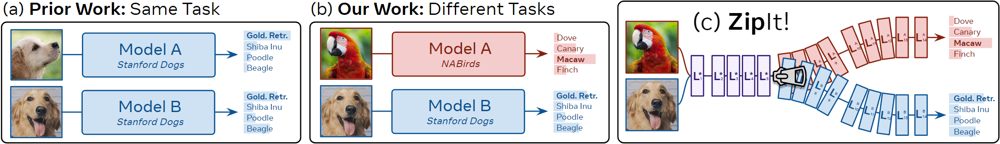
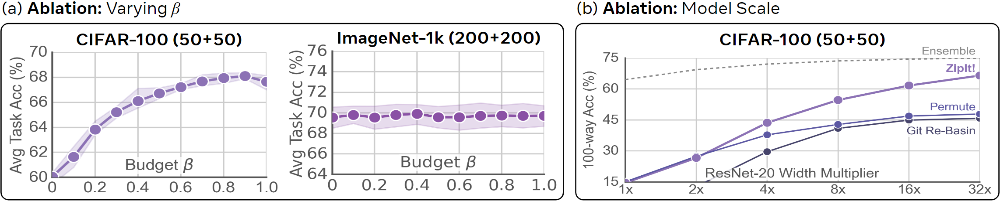

# ZipIt! Merging Models from Different Tasks *without Training*

## Abstract

Typical deep visual recognition models are capable of performing the one task they were trained on. In this paper, we tackle the extremely difficult problem of combining distinct models with different initializations, each solving a separate task, into one multi-task model **without any additional training**. Prior work in model merging permutes one model to the space of the other then averages them together. While this works for models trained on the same task, we find that this fails to account for the differences in models trained on disjoint tasks. Thus, we introduce “ZipIt!”, a general method for merging two arbitrary models of the same architecture that incorporates two simple strategies. First, in order to account for features that aren’t shared between models, we expand the model merging problem to allow for merging features *within* each model by defining a general “zip” operation. Second, we add support for *partially zipping* the models up until a specified layer, naturally creating a multi-head model. We find that these two changes combined account for 20-60% improvement over prior work, making it more feasible to merge models trained on disjoint tasks *without retraining*.

# Introduction

Ever since AlexNet popularized deep learning in computer vision, the field has thrived under the reign of massive models with an ever increasing number of parameters. Many vision problems once considered difficult or impossible are now benchmark tasks: classification with tens of thousands of classes , fast instance segmentation , realistic image generation , and more.

There are an abundance of independent, carefully tuned models out there for many tasks. However, if we want to expand an existing model’s capabilities, we run into many potential issues. If we try training the model on an additional task, we face catastrophic forgetting . If we evaluate the same model on different data without adaptation, we often find it doesn’t generalize to out of domain samples . We can try so called “intervention” strategies to mitigate these effects, but these often require further training which can be expensive . Instead, it would be nice if we could expand a model’s capacity to solve new tasks by simply “zipping” it with other models trained on those tasks *without additional training*.

<figure id="fig:concept_and_capabilities">

<figcaption> <span><strong>Setting and ZipIt!</strong></span> (a) Prior work merges differently initialized models from the <span style="color: modelbcolor"><strong>same</strong> dataset</span> with the <span style="color: modelbcolor"><strong>same</strong> label sets</span>: e.g., merging two models both trained to classify dog breeds. (b) Our setting expands this to merging models from <span style="color: modelacolor"><strong>different</strong> datasets</span> with <span style="color: modelacolor"><strong>different</strong> label sets</span>: e.g., merging a model that classifies dog breeds with one that classifies bird species. (c) <span><strong>ZipIt!</strong></span> merges these models <em>without retraining</em> by identifying shared features. </figcaption>
</figure>

Combining multiple models into one has recently started to gain traction in the vision community. Model Soups can add multiple models finetuned from the same pretrained initialization to improve accuracy and robustness. Git Re-Basin generalizes further to models trained on the same data but with different initializations, though with a significant accuracy drop. REPAIR improves on Git Re-Basin by adding new parameters and adjusting model batch norms where applicable. However, all of these methods only combine models trained on the same task. In this paper, we take this line of work to a logical extreme: merging differently initialized models trained on *completely separate* tasks (see Fig. <a href="#fig:concept_and_capabilities" data-reference-type="ref" data-reference="fig:concept_and_capabilities">1</a>[ab](#fig:concept_and_capabilities)). We show that this is an incredibly difficult problem for prior work and employ two simple strategies to make it feasible.

First, we note that prior work focuses on *permuting* one model to the other when merging them. This creates a 1-1 mapping between the two models, inherently assuming that most features *across* them are correlated. Since this isn’t necessarily the case for models trained on different tasks, we cannot rely on permutation alone. Instead, we generalize model merging to support “zipping” any combination of correlated features *within* and *across* each model. We find that on some tasks, this alone improves accuracy **by up to 20%** vs. permutation-based approaches. Moreover, we prove that merging within models can yield a better result in the theoretical setting of .

Second, existing methods merge *the entire network*. While this might work for extremely similar models trained in the same setting, the features of models trained on disjoint tasks become less correlated over the course of the network . To solve this, we introduce *partial zipping*, where we only “zip” up to a specified layer. Afterward, we feed the merged model’s outputs to the remaining unmerged layers of the original networks, creating a multi-head model. Depending on task difficulty, this can improve accuracy **by over 15%** while still keeping most layers merged.

Incorporating both of these strategies, we introduce ZipIt! (Fig. <a href="#fig:concept_and_capabilities" data-reference-type="ref" data-reference="fig:concept_and_capabilities">1</a>[c](#fig:concept_and_capabilities)), a general method for “zipping” any number of models trained on different tasks into a single multitask model *without retraining*. By deriving a general graph-based algorithm for merging and unmerging (Sec. <a href="#sec:approach" data-reference-type="ref" data-reference="sec:approach">4</a>), we can zip models of the same architecture together, merge features *within* each model, and partially zip them to create a multi-task model. We validate our approach by merging models trained on entirely disjoint sets of CIFAR and ImageNet categories, as well as merging several models trained on completely independent datasets into one, significantly outperforming prior work (Sec. <a href="#sec:results" data-reference-type="ref" data-reference="sec:results">5</a>). Finally, we ablate and analyze our method’s capabilities on these scenarios (Sec. <a href="#sec:ablations" data-reference-type="ref" data-reference="sec:ablations">6</a>).

# Related Work

Model merging combines the weights of two or more models into a one. Our work differs from prior work in that we adapt mode connectivity techniques to target models trained on disjoint tasks (Fig. <a href="#fig:concept_and_capabilities" data-reference-type="ref" data-reference="fig:concept_and_capabilities">1</a>).

**Merging Finetuned Models.** If two models are finetuned from the same pretrained checkpoint, they often lie in the same error basin . Several works  have exploited this property to average together the weights of a model at different stages of training. use an “exponential moving average” of training checkpoints as a teacher for self-supervised learning. Other works merge models initialized from the same pretrained base, but that were finetuned independently, either by simply averaging their weights , permuting one model to the other , combining meaningful weight regions , or maximizing an objective . Our setting differs, as we do not assume the same initialization.

**Merging Differently Initialized Models.** Merging models with different initializations is a much more challenging problem. Works in this space often rely on *mode connectivity* , attempting to interpolate between models along a low loss path (e.g., ). Most recent work follow the intuition, later formalized by , that models permuted to the same loss basin can be merged by averaging their weights. Most notably, Git Re-Basin permutes models by comparing the similarity between their weights. REPAIR improves the accuracy of Git Re-Basin by instead computing the correlation between their intermediate layer feature activations, and adding several batch norms to the network. find permutations using global rather than local optimization, though they don’t support skip connections. Some of these works (e.g., ) evaluate on on a setting where each model sees varying numbers of instances per class. And evaluates on a continual learning setting with disjoint categories, but their method requires training optimization. Similarly, merges models of different tasks, but requires jointly finetuning after each layer merge. As far as we are aware, we present the first *general method* to successfully merge models trained on disjoint tasks *without additional training*.

<figure id="fig:loss_basin">

<figcaption><span><strong>Task Loss Landscapes</strong></span> for models in Tab. <a href="#tab:cifar50+50" data-reference-type="ref" data-reference="tab:cifar50+50">[tab:cifar50+50]</a>. <span style="color: modelacolor">Model A</span> and <span style="color: modelbcolor">Model B</span> lie in low loss basins for their own tasks, but <em>not for the other task</em>. Thus, any interpolation between <span style="color: modelacolor">Model A</span> and a permuted <span style="color: modelbcolor">Model B</span> (e.g., Git Re-basin) lies outside the minima <em>for both tasks</em> and thus performs poorly. In contrast, ZipIt! improves the merge by finding a model that lies in a low loss basin for both. </figcaption>
</figure>

# Background and Motivation

Model merging stems from mode connectivity , where it is conjectured that models trained with SGD on the same dataset lying in the same *loss basin* (i.e., region or *mode* of low loss) can be combined into a single model that’s just as performant as the original models. If these models can be combined well by linearly interpolating their weights, they are said to be *linearly mode connected* (LMC) . Our work is similar to finding LMC, but across *different datasets with disjoint label sets* (i.e., separate tasks as in ).

Consider a model $`\mathcal{L}`$ as a collection of layers $`L_i \in \mathcal{L}`$, each of which may have some parameters (e.g., $`W_i, b_i`$ for a linear layer). If <span style="color: modelacolor">$`\mathcal{L}^A`$</span> and <span style="color: modelbcolor">$`\mathcal{L}^B`$</span> are finetuned from the same checkpoint, several works (e.g., ) find merging them is as easy as linearly interpolating their weights (i.e., they are LMC). E.g., if $`L_i`$ is a linear layer, the new weight matrix <span style="color: modelccolor">$`W_i^*`$</span> is simply
``` math
\label{eq:wavg}
    \textcolor{modelccolor}{W_i^*} = \gamma\textcolor{modelacolor}{W_i^A} + (1-\gamma)\textcolor{modelbcolor}{W_i^B}
```
with an interpolation constant $`\gamma\in[0,1]`$, usually set to $`\sfrac{1}{2}`$. However, if <span style="color: modelacolor">$`\mathcal{L}^A`$</span> and <span style="color: modelccolor">$`\mathcal{L}^B`$</span> were not finetuned from the same checkpoint, they often do not lie in the same mode and cannot be interpolated. Indeed, Eq. <a href="#eq:wavg" data-reference-type="ref" data-reference="eq:wavg">[eq:wavg]</a> typically results in random accuracy.

To fix this, conjecture that *large enough* models are likely LMC modulo permutation. This is because (1) many neural networks can be permuted internally without affecting their outputs and (2) permutation can move two models into the same basin, allowing much of the lost accuracy to be recovered. More concretely, let <span style="color: modelbcolor">$`P_i`$</span> be a permutation matrix that permutes outputs of layer <span style="color: modelbcolor">$`L_i^B`$</span> to the space of <span style="color: modelacolor">$`L_i^A`$</span>. Then for each layer, permutation works apply
``` math
\label{eq:rebasin}
    % \modelc{W_i^*} = \modela{\frac{1}{2} W_i^A} + \modelb{\frac{1}{2} P_i W_i^B P_{i-1}^T}
    \textcolor{modelccolor}{W_i^*} = \gamma\textcolor{modelacolor}{W_i^A} + (1-\gamma)\textcolor{modelbcolor}{ P_i W_i^B P_{i-1}^T}
```
Note that here we permute the output space of <span style="color: modelbcolor">$`W_i^B`$</span>, but we also need to permute its input space to undo the permutation from the previous layer (hence the use of <span style="color: modelbcolor">$`P_{i-1}^T`$</span>).

**Problems with Permutation.** Eq. <a href="#eq:rebasin" data-reference-type="ref" data-reference="eq:rebasin">[eq:rebasin]</a> relies on the likelihood of <span style="color: modelbcolor">model B</span> lying in the same basin as <span style="color: modelacolor">model A</span> after permutation being high. However, this is far less likely when the models are trained on different tasks, as each model optimizes for basins containing distinct task-specific information. In this case the optimal permutation of <span style="color: modelbcolor">model B</span> to <span style="color: modelacolor">model A</span> still lies in a strong basin on <span style="color: modelbcolor">task B</span> but *doesn’t* lie in a basin on <span style="color: modelacolor">task A</span>, as shown in Figure <a href="#fig:loss_basin" data-reference-type="ref" data-reference="fig:loss_basin">2</a>. This causes the interpolated model to perform worse than either the two original models. Thus, we explore alternative merging methods.

# ZipIt!

In this work, we treat model merging as combining the checkpoints (i.e., collection of weights) of multiple models into a single checkpoint that can perform all the tasks of its constituents. We do this by merging the layers of the models together. For instance, suppose $`L_i\in\mathcal{L}`$ is a linear layer with parameters $`W_i \in \mathbb{R}^{n_i\times m_i}, b_i \in \mathbb{R}^{n_i}`$ with input features $`x \in \mathbb{R}^{m_i}`$ and outputs features $`f_i \in \mathbb{R}^{n_i}`$:
``` math
\label{eq:linear_features}
    f_i = L_i(x) = W_i x + b_i
```
Our goal is to take $`\textcolor{modelacolor}{L_i^A} \in \textcolor{modelacolor}{\mathcal{L}^A}`$ from <span style="color: modelacolor">model A</span> and $`\textcolor{modelbcolor}{L_i^B} \in \textcolor{modelbcolor}{\mathcal{L}^B}`$ from <span style="color: modelbcolor">model B</span> and merge them into a layer <span style="color: modelccolor">$`L_i^*`$</span> that combines their feature spaces such that information from both <span style="color: modelacolor">$`f_i^A`$</span> and <span style="color: modelbcolor">$`f_i^B`$</span> is retained in <span style="color: modelccolor">$`f_i^*`$</span>. We accomplish this by merging each layer of one model with the corresponding layer in the other, both merging features in one *across* both layers or *within* the same layer. This is in contrast to permutation-based merging method, which only combine features *across* layers.

**Why should we merge *within*?** Features of models trained on different tasks may be dissimilar, as the models solve different problems. Forcibly combining these dissimilar features can yield merges that don’t perform well on either original task (Fig <a href="#fig:loss_basin" data-reference-type="ref" data-reference="fig:loss_basin">2</a>). Instead, those features may be more compatible with others within the same model, which would better retain performance when combined.

In fact, we can *prove* that methods which allow merges *within* each model (as well as across both) perform equal to or *better* than those which only merge across models (e.g., permutation-reliant approaches) in a limited but prevalent setting. Specifically, we obtain a tighter bound over Theorem 3.1 from when redundancy exists within a model and is leveraged. Both Theorem 3.1 and our Theorem [1](#ap:TheoremDef) (see Appendix <a href="#ap:Theorem" data-reference-type="ref" data-reference="ap:Theorem">14</a> for formalization and proof) bound the degree to which the loss of a merged two-layer model with $`d`$-input dimensions and $`h`$-intermediate dimensions increases compared to the losses of the original models. Theorem 3.1 bounds this increase to $`\Tilde{O}(h^{-\sfrac{1}{(2d+4)}})`$. However, if features within a model are *redundant*, then we reduce the bound to
``` math
\label{eq:mainpaper_barrier}
    \text{Loss Increase of Merged Model} \leq
        \begin{cases}
            \Tilde{O}\left(\left(\frac{h}{1-2\Gamma}\right)^{-\frac{1}{2d+4}}  \right) & \Gamma < 0.5 \\
            0 &\text{otherwise}
        \end{cases}
```
with $`\Gamma\in[0,1]`$ measuring what portion of features are redundant. This bound is $`\sqrt[2d+4]{1-2\Gamma} \leq 1`$ times that of Theorem 3.1 when $`\Gamma < 0.5`$ (equal only when $`\Gamma = 0`$) and *explicitly zero* when $`\Gamma \geq 0.5`$.

**How do we merge features?** In prior work, each of the merged features <span style="color: modelccolor">$`f_i^*`$</span> is the result of combining one feature from <span style="color: modelacolor">$`f_i^A`$</span> and one from <span style="color: modelbcolor">$`f_i^B`$</span>. However in our case, we can also merge features by combining two from just <span style="color: modelacolor">$`f_i^A`$</span> or two from just <span style="color: modelbcolor">$`f_i^B`$</span>. To account for this, we concatenate <span style="color: modelacolor">$`f_i^A`$</span> and <span style="color: modelbcolor">$`f_i^B`$</span> into a single feature vector: $`\textcolor{modelacolor}{f_i^A}\|\textcolor{modelbcolor}{f_i^B} \in \mathbb{R}^{2n_i}`$. Then, like prior work (e.g. ), we define feature similarity as the pairwise correlation between between neuron activations over a small set of images (without labels). However, unlike those works, we compute correlations between every activation in *the full concatenated space* $`\textcolor{modelacolor}{f_i^A}\|\textcolor{modelbcolor}{f_i^B}`$. Our approach thus measures the similarity of every feature $`\textcolor{modelacolor}{f_i^A}`$ and $`\textcolor{modelbcolor}{f_i^B}`$ to all features in both models, rather than solely between $`\textcolor{modelacolor}{f_i^A}`$ and $`\textcolor{modelbcolor}{f_i^B}`$.

Next, if two features are well correlated, we can average them without losing much information. Thus, we can construct <span style="color: modelccolor">$`f_i^*`$</span> by finding $`n_i`$ pairs of similar features in $`\textcolor{modelacolor}{f_i^A}\|\textcolor{modelbcolor}{f_i^B}`$ and averaging them together. By default, we do this greedily: i.e., iteratively match the features with the highest correlation without replacement; though we explore extensions to this in Sec. <a href="#sec:extensions" data-reference-type="ref" data-reference="sec:extensions">4.3</a> and test other methods in Tab. <a href="#tab:matching_alg" data-reference-type="ref" data-reference="tab:matching_alg">8</a>. Then we can use these matches to construct <span style="color: modelccolor">$`f_i^*`$</span>. Formally, we define a “merge matrix” $`\textcolor{modelccolor}{M_i} \in \mathbb{R}^{n_i\times2n_i}`$ s.t.
``` math
\textcolor{modelccolor}{f_i^*} = \textcolor{modelccolor}{M_i}\left(\textcolor{modelacolor}{f_i^A}\|\textcolor{modelbcolor}{f_i^B}\right)
```
$`\textcolor{modelccolor}{M_i}`$ averages the matched features, with each match corresponding to one output feature in $`\textcolor{modelccolor}{f_i^*}`$. For instance, if $`u`$th match is between indices $`s, t \in \{1, \ldots, 2n_i\}`$ of $`\textcolor{modelacolor}{f_i^A}\|\textcolor{modelbcolor}{f_i^B}`$, then the $`u`$th row of $`\textcolor{modelccolor}{M_i}`$ would be $`\sfrac{1}{2}`$ at columns $`s`$ and $`t`$ and 0 elsewhere. This results in $`\textcolor{modelccolor}{f_i^*}[u] = \frac{1}{2} (\textcolor{modelacolor}{f_i^A}\|\textcolor{modelbcolor}{f_i^B})[s] + \frac{1}{2} (\textcolor{modelacolor}{f_i^A}\|\textcolor{modelbcolor}{f_i^B})[t]`$. Thus, applying $`\textcolor{modelccolor}{M_i}`$ has the effect of interpolating with $`\gamma=\sfrac{1}{2}`$ but is more general (e.g., allows for merging more than 2 models at once, see Sec. <a href="#sec:extensions" data-reference-type="ref" data-reference="sec:extensions">4.3</a>).

**What about the next layer?** After merging features in one layer, we now have the problem that the next layers, $`\textcolor{modelacolor}{L_{i+1}^A}, \textcolor{modelbcolor}{L_{i+1}^B}`$, are incompatible with $`\textcolor{modelccolor}{f_i^*}`$. Instead, we need to *undo* the merge operation before passing the features to the next layer. Thus, we define an “unmerge” matrix $`\textcolor{modelccolor}{U_i} \in \mathbb{R}^{2n_i \times n_i}`$ s.t.
``` math
\textcolor{modelccolor}{U_i f_i^*} \approx \textcolor{modelacolor}{f_i^A}\|\textcolor{modelbcolor}{f_i^B}
```
$`\textcolor{modelccolor}{U_i}`$ is the pseudoinverse of $`M_i`$ and in the case of the matching from earlier is simply $`2\textcolor{modelccolor}{M_i}^T`$. Note that strict equality is unlikely here. Like in prior work, merging models is a lossy operation.

We split this unmerge matrix in half along its rows into $`\textcolor{modelacolor}{U_i^A}, \textcolor{modelbcolor}{U_i^B} \in \mathbb{R}^{n_i\times n_i}`$ that act individually to produce <span style="color: modelacolor">$`f_i^A`$</span> and <span style="color: modelbcolor">$`f_i^B`$</span>. With this, we can evaluate the next layers using the merged features:
``` math
\textcolor{modelacolor}{f_{i+1}^A} \approx \textcolor{modelacolor}{L_{i+1}^A}(\textcolor{modelacolor}{U_i^A} \textcolor{modelccolor}{f_i^*}) \qquad \textcolor{modelbcolor}{f_{i+1}^B} \approx \textcolor{modelbcolor}{L_{i+1}^B}(\textcolor{modelbcolor}{U_i^B} \textcolor{modelccolor}{f_i^*})
```

## The “Zip” Operation

We now have all the necessary pieces, and can derive a general operation to merge <span style="color: modelacolor">$`L_i^A`$</span> and <span style="color: modelbcolor">$`L_i^B`$</span> at an arbitrary point in the network (Fig. <a href="#fig:zip_op" data-reference-type="ref" data-reference="fig:zip_op">3</a>). First, we compute <span style="color: modelccolor">$`M_i`$</span> and <span style="color: modelccolor">$`U_i`$</span> by matching features between <span style="color: modelacolor">$`f_i^A`$</span> and <span style="color: modelbcolor">$`f_i^B`$</span>. We then pass <span style="color: modelccolor">$`U_i`$</span> to the next layer and receive <span style="color: modelccolor">$`U_{i-1}`$</span> from the previous layer. Using <span style="color: modelccolor">$`M_i`$</span> and <span style="color: modelccolor">$`U_{i-1}`$</span>, we “fuse” the merge and unmerge operations into the layer’s parameters. For a linear layer:
``` math
\label{eq:zip}
    % \modelc{W^*_i} = \gamma\modela{M_i^A W_i^A U^A_{i-1}} + (1-\gamma)\modelb{M_i^B W_i^B U^B_{i-1}}
    \textcolor{modelccolor}{W^*_i} = \textcolor{modelacolor}{M_i^A W_i^A U^A_{i-1}} + \textcolor{modelbcolor}{M_i^B W_i^B U^B_{i-1}}
```
where <span style="color: modelacolor">$`M_i^A`$</span> and <span style="color: modelbcolor">$`M_i^B`$</span> are <span style="color: modelccolor">$`M_i`$</span> split along its columns. <span style="color: modelccolor">$`b_i^*`$</span> has the same equation but without unmerging.

Note the similarity between Eq. <a href="#eq:zip" data-reference-type="ref" data-reference="eq:zip">[eq:zip]</a> and Eq. <a href="#eq:rebasin" data-reference-type="ref" data-reference="eq:rebasin">[eq:rebasin]</a>. This isn’t a coincidence: if we only allowed merging *across* models and not *within* models, our “zip” operation would be identical to Git Re-Basin’s permute-then-interpolate approach. Thus, Eq. <a href="#eq:zip" data-reference-type="ref" data-reference="eq:zip">[eq:zip]</a> can be thought of as a generalization of prior work.

<figure id="fig:zip_op">

<figcaption><span><strong>ZipIt!</strong></span> merges models layer-wise by exploiting redundancy in their features. (a) Output features <span style="color: modelacolor"><span class="math inline"><em>f</em><sup><em>A</em></sup></span></span> and <span style="color: modelbcolor"><span class="math inline"><em>f</em><sup><em>B</em></sup></span></span> from two disjoint layers are (b) paired with other features based on the similarity of their activations. (c) We produce a merge matrix <span style="color: modelccolor">M</span> to combine the pairs into a single shared output feature space, and a corresponding unmerge matrix <span style="color: modelccolor">U</span> that undoes this operation. (d) We then propagate <span style="color: modelccolor">U</span> up the network to align the next layer’s input space, and simultaneously receive the previous layer’s <span style="color: modelccolor">U</span> to align our input space. (e) We apply Eq. <a href="#eq:zip" data-reference-type="ref" data-reference="eq:zip">[eq:zip]</a> to “zip” the layers together using the <span style="color: modelccolor">M</span> for the output and <span style="color: modelccolor">U</span> for the input, producing a single layer (f). We then repeat (a) on the next layer. </figcaption>
</figure>

<figure id="fig:partial_zip">
<div class="minipage">

</div>
<div class="minipage">

</div>
<figcaption> <span><strong>Partial Zip.</strong></span> (a) If we stop zipping early and (b) apply the latest <span style="color: modelccolor">U</span> from the zip propagation to the inputs of the first unmerged layer in each model, (c) we get a multi-head model with a head for each task. </figcaption>
</figure>

## Zip Propagation

However, most modern neural networks are not simply collections of linear layers stacked on top of each other. In practice, we cannot combine merge and unmerge matrices into every layer of the network, as a local zip (Eq. <a href="#eq:zip" data-reference-type="ref" data-reference="eq:zip">[eq:zip]</a>) expects the layer to have a weight *matrix*—i.e., the layer has to have separate input and output spaces so that we can unmerge the input space and merge the output space. Other layers (e.g., BatchNorm, ReLU) don’t have such a weight matrix.

Thus, we “propogate” <span style="color: modelccolor">$`M_i`$</span> and <span style="color: modelccolor">$`U_i`$</span> *through* these layers. For instance, in Fig. <a href="#fig:zip_prop" data-reference-type="ref" data-reference="fig:zip_prop">[fig:zip_prop]</a>, we show a common stack of layers found in a typical ConvNet. Following , we compute <span style="color: modelccolor">$`M_i`$</span> and <span style="color: modelccolor">$`U_i`$</span> using the activations of the network (i.e., after each ReLU). We can’t fuse <span style="color: modelccolor">$`M_i`$</span> with the ReLU layer, as it doesn’t have any parameters. Similarly, we can merge the parameters of the preceding BatchNorm layer (i.e., in the same way as bias). But it doesn’t have a weight matrix, so we also can’t fuse <span style="color: modelccolor">$`M_i`$</span> into it. Only once we’ve reached the Conv layer can we fuse <span style="color: modelccolor">$`M_i`$</span> and <span style="color: modelccolor">$`U_i`$</span> into it using Eq. <a href="#eq:zip" data-reference-type="ref" data-reference="eq:zip">[eq:zip]</a> (in this case, treating each kernel element as independent).

Similar care needs to be taken with skip connections, as every layer that takes input from or outputs to a skip connection shares the same feature space. However, this too can be dealt with during propagation—we just need to propagate <span style="color: modelccolor">$`M_i`$</span> backward and <span style="color: modelccolor">$`U_i`$</span> forward to each layer connected by the same skip connection. In general, we can define propagation rules to handle many different types of network modules (see Appendix <a href="#ap:prop_rules" data-reference-type="ref" data-reference="ap:prop_rules">10</a>).

## Extensions

**Partial Zip.** <span id="sec:partial_zip" label="sec:partial_zip"></span> We don’t always want to zip every layer of the two networks, especially if their output spaces are incompatible, or if doing so would lose too much accuracy. Instead, we can perform a *partial zip*. That is, we zip most of the layers together, but leave the later ones *unzipped* (Fig. <a href="#fig:partial_zip" data-reference-type="ref" data-reference="fig:partial_zip">4</a>).

Implementing this operation is simple in our framework: zip as normal until the specified layer $`i`$, then the remaining unzipped layers will receive <span style="color: modelccolor">$`U_i`$</span> through zip propagation. If we apply <span style="color: modelacolor">$`U_i^A`$</span> to <span style="color: modelacolor">$`L_{i+1}^A`$</span> and <span style="color: modelbcolor">$`U_i^B`$</span> to <span style="color: modelbcolor">$`L_{i+1}^B`$</span>, the remaining unzipped layers will form “heads” that expect merged features as input. We can then ensemble the heads or choose one to evaluate at runtime.

**Repeated Matching ($`\alpha`$).** In some cases, we’d like to merge more than two models together. To do this, we allow “repeated matches”. That is, when two features are matched in our greedy algorithm, they are removed and replaced with the resulting merged feature. To ensure that one feature doesn’t get merged endlessly, we set the correlations of the new feature to be the minimum of the old features’ similarities weighted by $`\alpha \in (0,1]`$. We find a small value of $`\alpha`$ typically works best.

**Same-model Budget ($`\beta`$).** To demonstrate the effectiveness of same-model merges, we introduce a “budget” parameter $`\beta \in [0, 1]`$ that denotes what percent of total merged features can come from models merging within themselves, with each model receiving an equal portion of this budget. Note that a budget of 0 results in Eq. <a href="#eq:rebasin" data-reference-type="ref" data-reference="eq:rebasin">[eq:rebasin]</a>, as in that case no features can be merged within models.

# Results

There is no standard benchmark to evaluate merging approaches on models from distinct tasks, so we construct our own. We evaluate our approach in two different settings. (1) A versatile test-bed: disjoint category splits of the same dataset (i.e., *same dataset and different label sets*). (2) A very challenging setting: completely different datasets and tasks (i.e., *different datasets and label sets*).

**Experimental Details.** For each experiment where we sample multiple disjoint splits of categories, we hold one split out for hyperparameter search and report mean and standard deviation on the rest. For experiments with models trained on different datasets, we subsample the validation set into a validation and test set to use for the same purpose. To compute correlations, we use a portion of the training set for each dataset as in (see Appendix <a href="#ap:data_usage" data-reference-type="ref" data-reference="ap:data_usage">9</a>). For a fair comparison, we reset the batch norms for *all* methods (including the original models) using the training data (following the recommendation in ). For our method, ZipIt!$`_\text{n/m}`$ indicates that $`n`$ out of the $`m`$ layers in the network have been zipped (Sec. <a href="#sec:partial_zip" data-reference-type="ref" data-reference="sec:partial_zip">[sec:partial_zip]</a>). Note, all our models have *different initializations*.

**Evaluation.** For the setting with disjoint class splits of the same dataset, we evaluate performance in two ways: joint accuracy and per task accuracy. For joint accuracy, we evaluate each model over *all* classes in the combined dataset. For per task accuracy, we compute the accuracy of each task individually (i.e., supposing we had task labels at runtime) and then report the average. The former is similar to a continual learning setting where we want to augment the knowledge of the model, while the latter is akin to a multi-task setting where we know which task we’re using at test time. For the scenario where we merge models trained on different datasets, we use the per task accuracy metric, as the label spaces are not comparable.

**Baselines.** In addition to the default Weight Matching version of Git Re-Basin , we compare to two baselines: Weight Averaging (Eq. <a href="#eq:wavg" data-reference-type="ref" data-reference="eq:wavg">[eq:wavg]</a>) and Permute (Eq. <a href="#eq:rebasin" data-reference-type="ref" data-reference="eq:rebasin">[eq:rebasin]</a>) with $`\gamma = \sfrac{1}{2}`$ using our framework (i.e., we set <span style="color: modelccolor">$`M_i`$</span> and <span style="color: modelccolor">$`U_i`$</span> such that Eq. <a href="#eq:zip" data-reference-type="ref" data-reference="eq:zip">[eq:zip]</a> is equivalent). For Permute, we use linear sum assignment to find optimal permutations (following ). Note that our Permute is a *strong* baseline we create using our framework and is more accurate than Git Re-Basin in our settings. It’s also similar to REPAIR , but without adding extra parameters to the model. Finally, with perfect merging, the merged model’s outputs would be identical to the originals. Thus we include Ensemble as an upper bound (executing and concatenating the results of both models).

## CIFAR-10 and CIFAR-100

We train 5 pairs of ResNet-20 from scratch with different initializations on disjoint halves of the CIFAR-10 and CIFAR-100 classes . While ZipIt! supports “partial zipping” to merge models with different outputs (in this case, disjoint label sets), prior methods without retraining do not. To make a fair comparison, we train these CIFAR models with a CLIP-style loss using CLIP text encodings of the class names as targets. This way, both models output into the same CLIP-space regardless of the category. Note, this means the models are capable of some amount of zero-shot classification on the tasks they were not trained on.

**CIFAR-10 (5+5).** In Tab. <a href="#tab:cifar5+5" data-reference-type="ref" data-reference="tab:cifar5+5">[tab:cifar5+5]</a>, we merge models trained on disjoint 5 class subsets of CIFAR-10 using ResNet-20 with a $`4\times`$ width multiplier (denoted as ResNet-20$`\times`$<!-- -->4). In joint classification (i.e., 10-way), Git Re-Basin is unable to perform better than using either of the original models alone, while our Permute baseline performs slightly better. In stark contrast, our ZipIt! performs a staggering *32.9%* better than Git Re-Basin and *20.7%* better than our baseline. If allow the last stage of the network to remain unzipped (i.e., zip up to 13 layers), our method obtains 83.8%, which is only 3.6% behind an ensemble of <span style="color: modelacolor">model A</span> and <span style="color: modelbcolor">model B</span> (which is practically the upper bound for this setting). We also achieve similar results when merging VGG11 models in this setting (Appendix <a href="#ap:vgg" data-reference-type="ref" data-reference="ap:vgg">[ap:vgg]</a>).

**CIFAR-100 (50+50).** We find similar results on disjoint 50 class splits of CIFAR-100 in Tab. <a href="#tab:cifar50+50" data-reference-type="ref" data-reference="tab:cifar50+50">[tab:cifar50+50]</a>, this time using an $`8\times`$ width multiplier instead. Like with CIFAR-10, Git Re-Basin fails to outperform even the unmerged models themselves in joint classification (i.e., 100-way), and this time Permute is only 1.2% ahead. ZipIt! again *significantly* outperforms prior work with +14% accuracy over Git Re-Basin for all layers zipped, and a substantial +29.2% if zipping 13/20 layers. At this accuracy, ZipIt!$`_{13/20}`$ is again only 3.3% behind the ensemble for joint accuracy and 2.6% behind for average per task accuracy, landing itself in an entirely different performance tier compared to prior work.

<figure id="tab:imagenet200x5">
<table>
<tbody>
<tr>
<td style="text-align: left;"></td>
<td style="text-align: center;"></td>
<td colspan="4" style="text-align: center;">Accuracies (%)</td>
</tr>
<tr>
<td style="text-align: left;">Method</td>
<td style="text-align: center;">FLOPs (G)</td>
<td style="text-align: center;">Joint</td>
<td style="text-align: center;"><span style="color: modelacolor">Task A</span></td>
<td style="text-align: center;"><span style="color: modelbcolor">Task B</span></td>
<td style="text-align: center;">Avg</td>
</tr>
<tr>
<td style="text-align: left;"><span style="color: modelacolor">Model A</span></td>
<td style="text-align: center;"><span>4.11</span></td>
<td style="text-align: center;"><span>37.22.0</span></td>
<td style="text-align: center;"><span>74.34.0</span></td>
<td style="text-align: center;"><span>0.50.1</span></td>
<td style="text-align: center;"><span>37.42.0</span></td>
</tr>
<tr>
<td style="text-align: left;"><span style="color: modelbcolor">Model B</span></td>
<td style="text-align: center;"><span>4.11</span></td>
<td style="text-align: center;"><span>35.31.6</span></td>
<td style="text-align: center;"><span>0.50.1</span></td>
<td style="text-align: center;"><span>70.53.2</span></td>
<td style="text-align: center;"><span>35.51.6</span></td>
</tr>
<tr>
<td style="text-align: left;">W. Avg <span>(Eq. <a href="#eq:wavg" data-reference-type="ref" data-reference="eq:wavg">[eq:wavg]</a>)</span></td>
<td style="text-align: center;">4.11</td>
<td style="text-align: center;"><span>0.30.1</span></td>
<td style="text-align: center;"><span>0.60.1</span></td>
<td style="text-align: center;"><span>0.70.1</span></td>
<td style="text-align: center;"><span>0.60.1</span></td>
</tr>
<tr>
<td style="text-align: left;">Git Re-Basin<span class="math inline"><sup>‡</sup></span></td>
<td style="text-align: center;">4.11</td>
<td style="text-align: center;"><span>3.11.2</span></td>
<td style="text-align: center;"><span>5.32.6</span></td>
<td style="text-align: center;"><span>5.72.4</span></td>
<td style="text-align: center;"><span>5.51.7</span></td>
</tr>
<tr>
<td style="text-align: left;">Permute <span>(Eq. <a href="#eq:rebasin" data-reference-type="ref" data-reference="eq:rebasin">[eq:rebasin]</a>)</span></td>
<td style="text-align: center;">4.11</td>
<td style="text-align: center;"><strong>8.65.8</strong></td>
<td style="text-align: center;"><strong>10.14.4</strong></td>
<td style="text-align: center;"><strong>15.311.1</strong></td>
<td style="text-align: center;"><strong>12.77.7</strong></td>
</tr>
<tr>
<td style="text-align: left;"><span><strong>ZipIt!</strong></span><span class="math inline"><sub>50/50</sub></span></td>
<td style="text-align: center;">4.11</td>
<td style="text-align: center;"><strong>8.64.7</strong></td>
<td style="text-align: center;"><strong>12.45.9</strong></td>
<td style="text-align: center;"><strong>14.77.8</strong></td>
<td style="text-align: center;"><strong>13.56.6</strong></td>
</tr>
<tr>
<td style="text-align: left;">Ensemble</td>
<td style="text-align: center;">8.22</td>
<td style="text-align: center;">63.34.9</td>
<td style="text-align: center;">74.34.0</td>
<td style="text-align: center;">70.53.2</td>
<td style="text-align: center;">72.42.5</td>
</tr>
<tr>
<td style="text-align: left;"><span><strong>ZipIt!</strong></span><span class="math inline"><sub>22/50</sub></span></td>
<td style="text-align: center;">6.39</td>
<td style="text-align: center;"><span>55.84.1</span></td>
<td style="text-align: center;"><span>65.92.5</span></td>
<td style="text-align: center;"><span>64.13.0</span></td>
<td style="text-align: center;"><span>65.02.3</span></td>
</tr>
<tr>
<td style="text-align: left;"><span><strong>ZipIt!</strong></span><span class="math inline"><sub>10/50</sub></span></td>
<td style="text-align: center;">7.43</td>
<td style="text-align: center;"><strong>60.94.1</strong></td>
<td style="text-align: center;"><strong>70.73.0</strong></td>
<td style="text-align: center;"><strong>69.02.9</strong></td>
<td style="text-align: center;"><strong>69.91.9</strong></td>
</tr>
</tbody>
</table>
</figure>

## ImageNet-1k (200+200)

To test our method on the *much harder* setting of large-scale data, we train 5 differently initialized ResNet-50 models with cross entropy loss on disjoint 200 class subsets of ImageNet-1k . To compare to prior work that doesn’t support partial zipping, we initialize the models with capacity for all 1k classes, but only train each on their subset.

In Tab. <a href="#tab:imagenet200x5" data-reference-type="ref" data-reference="tab:imagenet200x5">5</a> we show results on exhaustively merging pairs from the 5 models. To compute joint (i.e., 400-way) accuracy, we softmax over each task’s classes individually (like in ), and take the argmax over the combined 400 class vector. On this extremely difficult task, Git Re-Basin only obtains 3.1% for joint accuracy (with random accuracy being 0.25%). Both the Permute baseline and ZipIt! with all layers zipped perform better, but with each at 8.6%, are still clearly lacking. Note that we find the same-model merging budget $`\beta`$ to not matter for this set of models (see Fig. <a href="#fig:variations" data-reference-type="ref" data-reference="fig:variations">7</a>), which suggests that there’s not a lot of redundant information *within* each model in this setting. Thus, ZipIt! chooses to merge mostly *across* models instead, performing similarly to the permute baseline. We find this same trend in CIFAR with smaller models (see Fig. <a href="#fig:variations" data-reference-type="ref" data-reference="fig:variations">7</a>), and may be an artifact of model capacity. The story changes when we increase the capacity of the merged model by partial zipping: ZipIt!$`_{10/50}`$ reaches close to upper bound ensemble accuracy *on this extremely difficult task*, while saving on FLOPs.

## Multi-Dataset Merging

We now take our model merging framework one step further by merging differently initialized models trained on *completely separate datasets and tasks*. We present two settings: merging multiple classification datasets and merging semantic segmentation with image classification.

<figure id="tab:cross_dataset_results">
<table>
<tbody>
<tr>
<td style="text-align: left;"></td>
<td style="text-align: center;"></td>
<td colspan="5" style="text-align: center;">Per-Task Accuracies (%)</td>
</tr>
<tr>
<td style="text-align: left;">Method</td>
<td style="text-align: center;">FLOPs (G)</td>
<td style="text-align: center;">SD</td>
<td style="text-align: center;">OP</td>
<td style="text-align: center;">CUB</td>
<td style="text-align: center;">NAB</td>
<td style="text-align: center;">Avg</td>
</tr>
<tr>
<td style="text-align: left;"></td>
<td style="text-align: center;"></td>
<td style="text-align: center;"></td>
<td style="text-align: center;"></td>
<td style="text-align: center;"></td>
<td style="text-align: center;"></td>
<td style="text-align: center;"></td>
</tr>
<tr>
<td style="text-align: left;">W. Avg <span>(Eq. <a href="#eq:wavg" data-reference-type="ref" data-reference="eq:wavg">[eq:wavg]</a>)</span></td>
<td style="text-align: center;">4.11</td>
<td style="text-align: center;"><span>12.9</span></td>
<td style="text-align: center;"><span>18.2</span></td>
<td style="text-align: center;"><span>13.9</span></td>
<td style="text-align: center;"><span>0.2</span></td>
<td style="text-align: center;"><span>11.3</span></td>
</tr>
<tr>
<td style="text-align: left;">Permute <span>(Eq. <a href="#eq:rebasin" data-reference-type="ref" data-reference="eq:rebasin">[eq:rebasin]</a>)</span></td>
<td style="text-align: center;">4.11</td>
<td style="text-align: center;">46.2</td>
<td style="text-align: center;">47.6</td>
<td style="text-align: center;">35.6</td>
<td style="text-align: center;"><strong>13.5</strong></td>
<td style="text-align: center;">35.7</td>
</tr>
<tr>
<td style="text-align: left;"><span><strong>ZipIt!</strong></span><span class="math inline"><sub>49/50</sub></span></td>
<td style="text-align: center;">4.11</td>
<td style="text-align: center;"><strong>46.9</strong></td>
<td style="text-align: center;"><strong>50.7</strong></td>
<td style="text-align: center;"><strong>38.0</strong></td>
<td style="text-align: center;">12.7</td>
<td style="text-align: center;"><strong>37.1</strong></td>
</tr>
<tr>
<td style="text-align: left;">Ensemble</td>
<td style="text-align: center;">8.22</td>
<td style="text-align: center;">72.7</td>
<td style="text-align: center;">81.1</td>
<td style="text-align: center;">71.0</td>
<td style="text-align: center;">77.2</td>
<td style="text-align: center;">75.5</td>
</tr>
<tr>
<td style="text-align: left;"><span><strong>ZipIt!</strong></span><span class="math inline"><sub>22/50</sub></span></td>
<td style="text-align: center;">6.39</td>
<td style="text-align: center;"><span>62.6</span></td>
<td style="text-align: center;"><span>71.2</span></td>
<td style="text-align: center;"><span>62.8</span></td>
<td style="text-align: center;"><span>53.0</span></td>
<td style="text-align: center;"><span>62.4</span></td>
</tr>
<tr>
<td style="text-align: left;"><span><strong>ZipIt!</strong></span><span class="math inline"><sub>10/50</sub></span></td>
<td style="text-align: center;">7.42</td>
<td style="text-align: center;"><strong>66.5</strong></td>
<td style="text-align: center;"><strong>75.8</strong></td>
<td style="text-align: center;"><strong>65.6</strong></td>
<td style="text-align: center;"><strong>66.8</strong></td>
<td style="text-align: center;"><strong>68.7</strong></td>
</tr>
<tr>
<td colspan="7" style="text-align: center;">Merging All 4</td>
</tr>
<tr>
<td style="text-align: left;">W. Avg <span>(Eq. <a href="#eq:wavg" data-reference-type="ref" data-reference="eq:wavg">[eq:wavg]</a>)</span></td>
<td style="text-align: center;"><span>4.12</span></td>
<td style="text-align: center;"><span>0.8</span></td>
<td style="text-align: center;"><span>3.0</span></td>
<td style="text-align: center;"><span>0.6</span></td>
<td style="text-align: center;"><span>0.3</span></td>
<td style="text-align: center;"><span>1.2</span></td>
</tr>
<tr>
<td style="text-align: left;">Permute <span>(Eq. <a href="#eq:rebasin" data-reference-type="ref" data-reference="eq:rebasin">[eq:rebasin]</a>)</span></td>
<td style="text-align: center;"><span>4.12</span></td>
<td style="text-align: center;"><span>15.7</span></td>
<td style="text-align: center;"><span>26.1</span></td>
<td style="text-align: center;"><strong>14.0</strong></td>
<td style="text-align: center;"><strong>5.3</strong></td>
<td style="text-align: center;"><span>15.3</span></td>
</tr>
<tr>
<td style="text-align: left;"><span><strong>ZipIt!</strong></span><span class="math inline"><sub>49/50</sub></span></td>
<td style="text-align: center;"><span>4.12</span></td>
<td style="text-align: center;"><strong>21.1</strong></td>
<td style="text-align: center;"><strong>33.3</strong></td>
<td style="text-align: center;"><span>8.6</span></td>
<td style="text-align: center;"><span>3.9</span></td>
<td style="text-align: center;"><strong>16.8</strong></td>
</tr>
<tr>
<td style="text-align: left;">Ensemble</td>
<td style="text-align: center;">16.4</td>
<td style="text-align: center;">72.7</td>
<td style="text-align: center;">81.2</td>
<td style="text-align: center;">71.0</td>
<td style="text-align: center;">77.2</td>
<td style="text-align: center;">75.5</td>
</tr>
<tr>
<td style="text-align: left;"><span><strong>ZipIt!</strong></span><span class="math inline"><sub>22/50</sub></span></td>
<td style="text-align: center;"><span>11.0</span></td>
<td style="text-align: center;"><span>50.2</span></td>
<td style="text-align: center;"><span>55.9</span></td>
<td style="text-align: center;"><span>44.0</span></td>
<td style="text-align: center;"><span>32.0</span></td>
<td style="text-align: center;"><span>45.5</span></td>
</tr>
<tr>
<td style="text-align: left;"><span><strong>ZipIt!</strong></span><span class="math inline"><sub>10/50</sub></span></td>
<td style="text-align: center;"><span>14.1</span></td>
<td style="text-align: center;"><strong>63.5</strong></td>
<td style="text-align: center;"><strong>70.8</strong></td>
<td style="text-align: center;"><strong>63.7</strong></td>
<td style="text-align: center;"><strong>63.1</strong></td>
<td style="text-align: center;"><strong>65.3</strong></td>
</tr>
</tbody>
</table>
</figure>

**Image Classification Datasets.** Merging ResNet-50 models trained on: Stanford Dogs , Oxford Pets , CUB200 , and NABirds . In Tab. <a href="#tab:cross_dataset_results" data-reference-type="ref" data-reference="tab:cross_dataset_results">6</a>, we show the average per task accuracy from exhaustively merging each pair and the much more difficult setting of merging all four at once. We report the accuracy of our baselines by applying them up until the last layer, but we can’t compare to prior work as they don’t support this setting. As in all our previous experiment we merge *without retraining*.

For pairs of models, ZipIt! slightly outperforms our permute baseline across all tasks and performs similarly when merging all 4 models at once. However, if we add capacity to the merged model through partial zipping, we perform up to 33% better on merging pairs and 50% better on merging all four models than the permute baseline. Partial zipping is a significant factor to obtain strong performance, especially with more than 2 models.

**Multiple Output Modalities.** In Appendix <a href="#appendix:semantic_segmentation" data-reference-type="ref" data-reference="appendix:semantic_segmentation">13</a>, we combine across modalities by merging the ResNet-50 backbone of a DeeplabV3 segmentation model with an ImageNet-1k classification model. The resulting combined model can perform both semantic segmentation and image classification. Even with half of layers merged, ZipIt! retains good performance on both tasks.

<figure id="fig:variations">

<figcaption><span><strong>Varying <span class="math inline"><em>β</em></span> and Model Scale.</strong></span> Left: We find when the model has enough capacity for the task, a high budget (Sec. <a href="#sec:partial_zip" data-reference-type="ref" data-reference="sec:partial_zip">[sec:partial_zip]</a>) improves performance. Right: ZipIt! makes effective use of extra model capacity to quickly reach the ensemble on CIFAR-100 (50+50) when we increase the width of ResNet-20 models. In contrast, our baselines only slightly benefit from the extra scale. </figcaption>
</figure>

# Analysis

**Merging *within* Models.** A critical piece of ZipIt! compared to prior work is the ability to merge *within* models, not just *across* models. In Sec. <a href="#sec:partial_zip" data-reference-type="ref" data-reference="sec:partial_zip">[sec:partial_zip]</a>, we introduce a budget parameter $`\beta`$ to limit the number of same-model merges, and here use CIFAR-100 (50+50) and ImageNet-1k (200+200) to illustrate its effectiveness (Fig. <a href="#fig:variations" data-reference-type="ref" data-reference="fig:variations">7</a>[a](#fig:variations)). On CIFAR, same-model merges are very important, with the optimal budget being above 0.8, meaning 80% of merges are allowed to be within the same model. This is not the case, however, on ImageNet, where the difficulty of the task means there likely are much fewer redundant features *within* each model.

**Model Scale.** In Fig. <a href="#fig:variations" data-reference-type="ref" data-reference="fig:variations">7</a>[b](#fig:variations), we test the effect of model scale directly by evaluating joint accuracy on our CIFAR-100 (50+50) setting with ResNet-20 models of increasing width. Here, we explicitly see that when the width of the models are too small for the task (e.g., $`<4\times`$), ZipIt! and the Permute baseline perform identically (though both much better than Git Re-Basin). However, when the scale increases, ZipIt! trends toward the ensemble upper bound of 75%, while both the Permute baseline and Git Re-Basin plateau at around 45%. This corroborates Eq. <a href="#eq:mainpaper_barrier" data-reference-type="ref" data-reference="eq:mainpaper_barrier">[eq:mainpaper_barrier]</a> and indicates our method uses the extra model capacity effectively, much better than prior work.

<figure id="tab:matching_alg">
<table>
<tbody>
<tr>
<td style="text-align: left;">Algorithm</td>
<td style="text-align: center;"><span style="color: modelacolor">A</span><span class="math inline">↔︎</span><span style="color: modelacolor">A</span>/<span style="color: modelbcolor">B</span><span class="math inline">↔︎</span><span style="color: modelbcolor">B</span>?</td>
<td style="text-align: center;">Acc</td>
<td style="text-align: center;">Time</td>
</tr>
<tr>
<td style="text-align: left;">Identity <span>(Eq. <a href="#eq:wavg" data-reference-type="ref" data-reference="eq:wavg">[eq:wavg]</a>)</span></td>
<td style="text-align: center;"></td>
<td style="text-align: center;"><span>43.03.1</span></td>
<td style="text-align: center;"><span>1.8ms</span></td>
</tr>
<tr>
<td style="text-align: left;">Permute <span>(Eq. <a href="#eq:rebasin" data-reference-type="ref" data-reference="eq:rebasin">[eq:rebasin]</a>)</span></td>
<td style="text-align: center;"></td>
<td style="text-align: center;"><span>58.41.3</span></td>
<td style="text-align: center;"><span>28ms</span></td>
</tr>
<tr>
<td style="text-align: left;">K-Means</td>
<td style="text-align: center;"></td>
<td style="text-align: center;"><span>29.15.5</span></td>
<td style="text-align: center;"><span>19sec</span></td>
</tr>
<tr>
<td colspan="4" style="text-align: center;">Zip <span>(Eq. <a href="#eq:zip" data-reference-type="ref" data-reference="eq:zip">[eq:zip]</a>)</span></td>
</tr>
<tr>
<td style="text-align: left;">Optimal Match</td>
<td style="text-align: center;"></td>
<td style="text-align: center;"><span><strong>79.61.7</strong></span></td>
<td style="text-align: center;"><span>11min</span></td>
</tr>
<tr>
<td style="text-align: left;">Greedy Match</td>
<td style="text-align: center;"></td>
<td style="text-align: center;"><span><strong>79.01.8</strong></span></td>
<td style="text-align: center;"><span>1.1sec</span></td>
</tr>
<tr>
<td style="text-align: left;">Greedy, <span class="math inline"><em>α</em></span>=0.1</td>
<td style="text-align: center;"></td>
<td style="text-align: center;"><strong>79.12.1</strong></td>
<td style="text-align: center;">1.2sec</td>
</tr>
</tbody>
</table>
</figure>

**Matching Algorithm.** In Tab. <a href="#tab:matching_alg" data-reference-type="ref" data-reference="tab:matching_alg">8</a>, we compare matching algorithms used to compute <span style="color: modelccolor">$`M_i`$</span> in Eq. <a href="#eq:zip" data-reference-type="ref" data-reference="eq:zip">[eq:zip]</a>. Using either the identity (weight averaging) or a permutation (as in prior work) underperforms on CIFAR-10 (5+5) joint 10-way classification. In contrast, we obtain up to 21.2% higher accuracy if we allow both permutations and *merging within models*. However, doing this optimally is difficult, as the standard linear sum assignment algorithm assumes bipartite matches. We could use a optimal graph-based solver (e.g., ) instead, but doing so is prohibitively slow (11 minutes to transform a ResNet-20$`\times`$<!-- -->4 model). Thus, we find matches greedily by repeatedly taking the most correlated pair of features without replacement. This performs almost as well, and is multiple orders of magnitude faster. If we allow repeated matches (Sec. <a href="#sec:partial_zip" data-reference-type="ref" data-reference="sec:partial_zip">[sec:partial_zip]</a>), we obtain a slightly better result. Like , we find that matching is better for merging features than clustering (K-Means).

<figure id="fig:data_usage">
<div class="minipage">

</div>
<div class="minipage">
<table>
<tbody>
<tr>
<td colspan="3" style="text-align: center;">Average Stage Correlations</td>
</tr>
<tr>
<td style="text-align: center;">Layer</td>
<td style="text-align: center;">Layer</td>
<td style="text-align: center;">Layer</td>
</tr>
<tr>
<td style="text-align: center;"><span>0.500.01</span></td>
<td style="text-align: center;"><span>0.370.00</span></td>
<td style="text-align: center;"><span>0.270.00</span></td>
</tr>
</tbody>
</table>
<p><span id="tab:partialzip_corrs" data-label="tab:partialzip_corrs"></span></p>
</div>
<div class="minipage">

</div>
<figcaption> <span><strong>Data Usage.</strong></span> How much data do we need to use to compute activations? We find that only a few hundred images are needed to obtain the best performance. Data augmentation is not always useful. </figcaption>
</figure>

# Conclusion

In this paper, we tackle the extremely difficult task of merging models trained on completely disjoint tasks *without additional training*. We find that prior work underperforms in this setting and posit that they neither fully (1) exploit model similarities nor (2) account for model dissimilarities. We introduce ZipIt!, a general framework for merging models that addresses these issues, and show it to significantly outperform prior work across several difficult settings, comprehensively analyzing each.

**Reproducibility Statement.** To ensure reproducibility, we will release code for our algorithm, experiments, and baselines. We also include algorithm details in Section <a href="#sec:approach" data-reference-type="ref" data-reference="sec:approach">4</a> and further in Appendix <a href="#ap:prop_rules" data-reference-type="ref" data-reference="ap:prop_rules">10</a>, experimental details in Section <a href="#sec:results" data-reference-type="ref" data-reference="sec:results">5</a> and Appendix <a href="#ap:data_usage" data-reference-type="ref" data-reference="ap:data_usage">9</a>, and a proof of our Theorem [1](#ap:TheoremDef) in Appendix <a href="#ap:Theorem" data-reference-type="ref" data-reference="ap:Theorem">14</a>.

**Acknowledgements.** This work was supported in part by funding from NSF CAREER \#2144194, ARL, Google, and NSF GRFP. All views and conclusions expressed in this work are those of the authors and not a reflection of these sources.

# References

<div class="thebibliography">

Hongjoon Ahn, Jihwan Kwak, Subin Lim, Hyeonsu Bang, Hyojun Kim, and Taesup Moon Ss-il: Separated softmax for incremental learning In *ICCV*, 2021. **Abstract:** We consider class incremental learning (CIL) problem, in which a learning agent continuously learns new classes from incrementally arriving training data batches and aims to predict well on all the classes learned so far. The main challenge of the problem is the catastrophic forgetting, and for the exemplar-memory based CIL methods, it is generally known that the forgetting is commonly caused by the classification score bias that is injected due to the data imbalance between the new classes and the old classes (in the exemplar-memory). While several methods have been proposed to correct such score bias by some additional post-processing, e.g., score re-scaling or balanced fine-tuning, no systematic analysis on the root cause of such bias has been done. To that end, we analyze that computing the softmax probabilities by combining the output scores for all old and new classes could be the main cause of the bias. Then, we propose a new method, dubbed as Separated Softmax for Incremental Learning (SS-IL), that consists of separated softmax (SS) output layer combined with task-wise knowledge distillation (TKD) to resolve such bias. Throughout our extensive experimental results on several large-scale CIL benchmark datasets, we show our SS-IL achieves strong state-of-the-art accuracy through attaining much more balanced prediction scores across old and new classes, without any additional post-processing. (@ahn2021ss)

Samuel K Ainsworth, Jonathan Hayase, and Siddhartha Srinivasa Git re-basin: Merging models modulo permutation symmetries *arXiv:2209.04836*, 2022. **Abstract:** The success of deep learning is due in large part to our ability to solve certain massive non-convex optimization problems with relative ease. Though non-convex optimization is NP-hard, simple algorithms – often variants of stochastic gradient descent – exhibit surprising effectiveness in fitting large neural networks in practice. We argue that neural network loss landscapes often contain (nearly) a single basin after accounting for all possible permutation symmetries of hidden units a la Entezari et al. 2021. We introduce three algorithms to permute the units of one model to bring them into alignment with a reference model in order to merge the two models in weight space. This transformation produces a functionally equivalent set of weights that lie in an approximately convex basin near the reference model. Experimentally, we demonstrate the single basin phenomenon across a variety of model architectures and datasets, including the first (to our knowledge) demonstration of zero-barrier linear mode connectivity between independently trained ResNet models on CIFAR-10. Additionally, we identify intriguing phenomena relating model width and training time to mode connectivity. Finally, we discuss shortcomings of the linear mode connectivity hypothesis, including a counterexample to the single basin theory. (@ainsworth2022git)

Stephen Ashmore and Michael Gashler A method for finding similarity between multi-layer perceptrons by forward bipartite alignment In *IJCNN*, 2015. **Abstract:** We present Forward Bipartite Alignment (FBA), a method that aligns the topological structures of two neural networks. Neural networks are considered to be a black box, because neural networks have a complex model surface determined by their weights that combine attributes non-linearly. Two networks that make similar predictions on training data may still generalize differently. FBA enables a diversity of applications, including visualization and canonicalization of neural networks, ensembles, and cross-over between unrelated neural networks in evolutionary optimization. We describe the FBA algorithm, and describe implementations for three applications: genetic algorithms, visualization, and ensembles. We demonstrate FBA’s usefulness by comparing a bag of neural networks to a bag of FBA-aligned neural networks. We also show that aligning, and then combining two neural networks has no appreciable loss in accuracy which means that Forward Bipartite Alignment aligns neural networks in a meaningful way. (@ashmore2015method)

Alexei Baevski, Wei-Ning Hsu, Qiantong Xu, Arun Babu, Jiatao Gu, and Michael Auli Data2vec: A general framework for self-supervised learning in speech, vision and language In *ICML*, 2022. **Abstract:** While the general idea of self-supervised learning is identical across modalities, the actual algorithms and objectives differ widely because they were developed with a single modality in mind. To get us closer to general self-supervised learning, we present data2vec, a framework that uses the same learning method for either speech, NLP or computer vision. The core idea is to predict latent representations of the full input data based on a masked view of the input in a self-distillation setup using a standard Transformer architecture. Instead of predicting modality-specific targets such as words, visual tokens or units of human speech which are local in nature, data2vec predicts contextualized latent representations that contain information from the entire input. Experiments on the major benchmarks of speech recognition, image classification, and natural language understanding demonstrate a new state of the art or competitive performance to predominant approaches. (@baevski2022data2vec)

Gilles Blanchard, Gyemin Lee, and Clayton Scott Generalizing from several related classification tasks to a new unlabeled sample In *NeurIPS*, 2011. **Abstract:** We consider the problem of assigning class labels to an unlabeled test data set, given several labeled training data sets drawn from similar distributions. This problem arises in several applications where data distributions fluctuate because of biological, technical, or other sources of variation. We develop a distribution-free, kernel-based approach to the problem. This approach involves identifying an appropriate reproducing kernel Hilbert space and optimizing a regularized empirical risk over the space. We present generalization error analysis, describe universal kernels, and establish universal consistency of the proposed methodology. Experimental results on flow cytometry data are presented. (@blanchard2011generalizing)

Daniel Bolya, Chong Zhou, Fanyi Xiao, and Yong Jae Lee Yolact: Real-time instance segmentation In *ICCV*, 2019. **Abstract:** We present a simple, fully-convolutional model for real-time instance segmentation that achieves 29.8 mAP on MS COCO at 33.5 fps evaluated on a single Titan Xp, which is significantly faster than any previous competitive approach. Moreover, we obtain this result after training on only one GPU. We accomplish this by breaking instance segmentation into two parallel subtasks: (1) generating a set of prototype masks and (2) predicting per-instance mask coefficients. Then we produce instance masks by linearly combining the prototypes with the mask coefficients. We find that because this process doesn’t depend on repooling, this approach produces very high-quality masks and exhibits temporal stability for free. Furthermore, we analyze the emergent behavior of our prototypes and show they learn to localize instances on their own in a translation variant manner, despite being fully-convolutional. Finally, we also propose Fast NMS, a drop-in 12 ms faster replacement for standard NMS that only has a marginal performance penalty. (@bolya2019yolact)

Daniel Bolya, Cheng-Yang Fu, Xiaoliang Dai, Peizhao Zhang, Christoph Feichtenhofer, and Judy Hoffman Token merging: Your vit but faster *ICLR*, 2023. **Abstract:** We introduce Token Merging (ToMe), a simple method to increase the throughput of existing ViT models without needing to train. ToMe gradually combines similar tokens in a transformer using a general and light-weight matching algorithm that is as fast as pruning while being more accurate. Off-the-shelf, ToMe can 2x the throughput of state-of-the-art ViT-L @ 512 and ViT-H @ 518 models on images and 2.2x the throughput of ViT-L on video with only a 0.2-0.3% accuracy drop in each case. ToMe can also easily be applied during training, improving in practice training speed up to 2x for MAE fine-tuning on video. Training with ToMe further minimizes accuracy drop, leading to 2x the throughput of ViT-B on audio for only a 0.4% mAP drop. Qualitatively, we find that ToMe merges object parts into one token, even over multiple frames of video. Overall, ToMe’s accuracy and speed are competitive with state-of-the-art on images, video, and audio. (@bolya2022token)

Zhaowei Cai, Avinash Ravichandran, Subhransu Maji, Charless Fowlkes, Zhuowen Tu, and Stefano Soatto Exponential moving average normalization for self-supervised and semi-supervised learning In *CVPR*, 2021. **Abstract:** We present a plug-in replacement for batch normalization (BN) called exponential moving average normalization (EMAN), which improves the performance of existing student-teacher based self- and semi-supervised learning techniques. Unlike the standard BN, where the statistics are computed within each batch, EMAN, used in the teacher, updates its statistics by exponential moving average from the BN statistics of the student. This design reduces the intrinsic cross-sample dependency of BN and enhances the generalization of the teacher. EMAN improves strong baselines for self-supervised learning by 4-6/1-2 points and semi-supervised learning by about 7/2 points, when 1%/10% supervised labels are available on ImageNet. These improvements are consistent across methods, network architectures, training duration, and datasets, demonstrating the general effectiveness of this technique. The code will be made available online. (@cai2021exponential)

Mathilde Caron, Hugo Touvron, Ishan Misra, Hervé Jégou, Julien Mairal, Piotr Bojanowski, and Armand Joulin Emerging properties in self-supervised vision transformers In *ICCV*, 2021. **Abstract:** In this paper, we question if self-supervised learning provides new properties to Vision Transformer (ViT) \[16\] that stand out compared to convolutional networks (convnets). Beyond the fact that adapting self-supervised methods to this architecture works particularly well, we make the following observations: first, self-supervised ViT features contain explicit information about the semantic segmentation of an image, which does not emerge as clearly with supervised ViTs, nor with convnets. Second, these features are also excellent k-NN classifiers, reaching 78.3% top-1 on ImageNet with a small ViT. Our study also underlines the importance of momentum encoder \[26\], multi-crop training \[9\], and the use of small patches with ViTs. We implement our findings into a simple self-supervised method, called DINO, which we interpret as a form of self-distillation with no labels. We show the synergy between DINO and ViTs by achieving 80.1% top-1 on ImageNet in linear evaluation with ViT-Base. (@caron2021emerging)

Liang-Chieh Chen, George Papandreou, Florian Schroff, and Hartwig Adam Rethinking atrous convolution for semantic image segmentation *arXiv preprint arXiv:1706.05587*, 2017. **Abstract:** In this work, we revisit atrous convolution, a powerful tool to explicitly adjust filter’s field-of-view as well as control the resolution of feature responses computed by Deep Convolutional Neural Networks, in the application of semantic image segmentation. To handle the problem of segmenting objects at multiple scales, we design modules which employ atrous convolution in cascade or in parallel to capture multi-scale context by adopting multiple atrous rates. Furthermore, we propose to augment our previously proposed Atrous Spatial Pyramid Pooling module, which probes convolutional features at multiple scales, with image-level features encoding global context and further boost performance. We also elaborate on implementation details and share our experience on training our system. The proposed ‘DeepLabv3’ system significantly improves over our previous DeepLab versions without DenseCRF post-processing and attains comparable performance with other state-of-art models on the PASCAL VOC 2012 semantic image segmentation benchmark. (@chen2017deeplabv3)

Leshem Choshen, Elad Venezian, Noam Slonim, and Yoav Katz Fusing finetuned models for better pretraining *arXiv:2204.03044*, 2022. **Abstract:** Pretrained models are the standard starting point for training. This approach consistently outperforms the use of a random initialization. However, pretraining is a costly endeavour that few can undertake. In this paper, we create better base models at hardly any cost, by fusing multiple existing fine tuned models into one. Specifically, we fuse by averaging the weights of these models. We show that the fused model results surpass the pretrained model ones. We also show that fusing is often better than intertraining. We find that fusing is less dependent on the target task. Furthermore, weight decay nullifies intertraining effects but not those of fusing. (@choshen2022fusing)

Matthias De Lange, Rahaf Aljundi, Marc Masana, Sarah Parisot, Xu Jia, Aleš Leonardis, Gregory Slabaugh, and Tinne Tuytelaars A continual learning survey: Defying forgetting in classification tasks *TPAMI*, 2021. **Abstract:** Artificial neural networks thrive in solving the classification problem for a particular rigid task, acquiring knowledge through generalized learning behaviour from a distinct training phase. The resulting network resembles a static entity of knowledge, with endeavours to extend this knowledge without targeting the original task resulting in a catastrophic forgetting. Continual learning shifts this paradigm towards networks that can continually accumulate knowledge over different tasks without the need to retrain from scratch. We focus on task incremental classification, where tasks arrive sequentially and are delineated by clear boundaries. Our main contributions concern: (1) a taxonomy and extensive overview of the state-of-the-art; (2) a novel framework to continually determine the stability-plasticity trade-off of the continual learner; (3) a comprehensive experimental comparison of 11 state-of-the-art continual learning methods; and (4) baselines. We empirically scrutinize method strengths and weaknesses on three benchmarks, considering Tiny Imagenet and large-scale unbalanced iNaturalist and a sequence of recognition datasets. We study the influence of model capacity, weight decay and dropout regularization, and the order in which the tasks are presented, and qualitatively compare methods in terms of required memory, computation time, and storage. (@de2021continual)

Mostafa Dehghani, Josip Djolonga, Basil Mustafa, Piotr Padlewski, Jonathan Heek, Justin Gilmer, Andreas Steiner, Mathilde Caron, Robert Geirhos, Ibrahim Alabdulmohsin, et al Scaling vision transformers to 22 billion parameters *arXiv:2302.05442*, 2023. **Abstract:** The scaling of Transformers has driven breakthrough capabilities for language models. At present, the largest large language models (LLMs) contain upwards of 100B parameters. Vision Transformers (ViT) have introduced the same architecture to image and video modelling, but these have not yet been successfully scaled to nearly the same degree; the largest dense ViT contains 4B parameters (Chen et al., 2022). We present a recipe for highly efficient and stable training of a 22B-parameter ViT (ViT-22B) and perform a wide variety of experiments on the resulting model. When evaluated on downstream tasks (often with a lightweight linear model on frozen features), ViT-22B demonstrates increasing performance with scale. We further observe other interesting benefits of scale, including an improved tradeoff between fairness and performance, state-of-the-art alignment to human visual perception in terms of shape/texture bias, and improved robustness. ViT-22B demonstrates the potential for "LLM-like" scaling in vision, and provides key steps towards getting there. (@dehghani2023scalingvit22b)

Jia Deng, Wei Dong, Richard Socher, Li-Jia Li, Kai Li, and Li Fei-Fei Imagenet: A large-scale hierarchical image database In *CVPR*, 2009. **Abstract:** The explosion of image data on the Internet has the potential to foster more sophisticated and robust models and algorithms to index, retrieve, organize and interact with images and multimedia data. But exactly how such data can be harnessed and organized remains a critical problem. We introduce here a new database called "ImageNet", a large-scale ontology of images built upon the backbone of the WordNet structure. ImageNet aims to populate the majority of the 80,000 synsets of WordNet with an average of 500–1000 clean and full resolution images. This will result in tens of millions of annotated images organized by the semantic hierarchy of WordNet. This paper offers a detailed analysis of ImageNet in its current state: 12 subtrees with 5247 synsets and 3.2 million images in total. We show that ImageNet is much larger in scale and diversity and much more accurate than the current image datasets. Constructing such a large-scale database is a challenging task. We describe the data collection scheme with Amazon Mechanical Turk. Lastly, we illustrate the usefulness of ImageNet through three simple applications in object recognition, image classification and automatic object clustering. We hope that the scale, accuracy, diversity and hierarchical structure of ImageNet can offer unparalleled opportunities to researchers in the computer vision community and beyond. (@deng2009imagenet)

Shachar Don-Yehiya, Elad Venezian, Colin Raffel, Noam Slonim, and Leshem Choshen olD fusion: Collaborative descent for distributed multitask finetuning Association for Computational Linguistics, 2023. **Abstract:** Pretraining has been shown to scale well with compute, data size and data diversity. Multitask learning trains on a mixture of supervised datasets and produces improved performance compared to self-supervised pretraining.Until now, massively multitask learning required simultaneous access to all datasets in the mixture and heavy compute resources that are only available to well-resourced teams. In this paper, we propose ColD Fusion, a method that provides the benefits of multitask learning but leverages distributed computation and requires limited communication and no sharing of data. Consequentially, ColD Fusion can create a synergistic loop, where finetuned models can be recycled to continually improve the pretrained model they are based on.We show that ColD Fusion yields comparable benefits to multitask training by producing a model that (a) attains strong performance on all of the datasets it was multitask trained on and (b) is a better starting point for finetuning on unseen datasets. We find ColD Fusion outperforms RoBERTa and even previous multitask models. Specifically, when training and testing on 35 diverse datasets, ColD Fusion-based model outperforms RoBERTa by 2.19 points on average without any changes to the architecture. (@donyehiya2023cold)

Alexey Dosovitskiy, Lucas Beyer, Alexander Kolesnikov, Dirk Weissenborn, Xiaohua Zhai, Thomas Unterthiner, Mostafa Dehghani, Matthias Minderer, Georg Heigold, Sylvain Gelly, et al An image is worth 16x16 words: Transformers for image recognition at scale *arXiv:2010.11929*, 2020. **Abstract:** While the Transformer architecture has become the de-facto standard for natural language processing tasks, its applications to computer vision remain limited. In vision, attention is either applied in conjunction with convolutional networks, or used to replace certain components of convolutional networks while keeping their overall structure in place. We show that this reliance on CNNs is not necessary and a pure transformer applied directly to sequences of image patches can perform very well on image classification tasks. When pre-trained on large amounts of data and transferred to multiple mid-sized or small image recognition benchmarks (ImageNet, CIFAR-100, VTAB, etc.), Vision Transformer (ViT) attains excellent results compared to state-of-the-art convolutional networks while requiring substantially fewer computational resources to train. (@dosovitskiy2020image)

Felix Draxler, Kambis Veschgini, Manfred Salmhofer, and Fred Hamprecht Essentially no barriers in neural network energy landscape In *ICML*, 2018. **Abstract:** Training neural networks involves finding minima of a high-dimensional non-convex loss function. Knowledge of the structure of this energy landscape is sparse. Relaxing from linear interpolations, we construct continuous paths between minima of recent neural network architectures on CIFAR10 and CIFAR100. Surprisingly, the paths are essentially flat in both the training and test landscapes. This implies that neural networks have enough capacity for structural changes, or that these changes are small between minima. Also, each minimum has at least one vanishing Hessian eigenvalue in addition to those resulting from trivial invariance. (@draxler2018essentially)

Rahim Entezari, Hanie Sedghi, Olga Saukh, and Behnam Neyshabur The role of permutation invariance in linear mode connectivity of neural networks *arXiv:2110.06296*, 2021. **Abstract:** In this paper, we conjecture that if the permutation invariance of neural networks is taken into account, SGD solutions will likely have no barrier in the linear interpolation between them. Although it is a bold conjecture, we show how extensive empirical attempts fall short of refuting it. We further provide a preliminary theoretical result to support our conjecture. Our conjecture has implications for lottery ticket hypothesis, distributed training, and ensemble methods. (@entezari2021role)

M. Everingham, L. Van Gool, C. K. I. Williams, J. Winn, and A. Zisserman The pascal visual object classes (voc) challenge *International Journal of Computer Vision*, 88 (2): 303–338, June 2010. **Abstract:** The Pascal Visual Object Classes (VOC) challenge is a benchmark in visual object category recognition and detection, providing the vision and machine learning communities with a standard dataset of images and annotation, and standard evaluation procedures. Organised annually from 2005 to present, the challenge and its associated dataset has become accepted as the benchmark for object detection. This paper describes the dataset and evaluation procedure. We review the state-of-the-art in evaluated methods for both classification and detection, analyse whether the methods are statistically different, what they are learning from the images (e.g. the object or its context), and what the methods find easy or confuse. The paper concludes with lessons learnt in the three year history of the challenge, and proposes directions for future improvement and extension. (@Everingham10pascalvoc)

Jonathan Frankle, Gintare Karolina Dziugaite, Daniel Roy, and Michael Carbin Linear mode connectivity and the lottery ticket hypothesis In *ICML*, 2020. **Abstract:** We study whether a neural network optimizes to the same, linearly connected minimum under different samples of SGD noise (e.g., random data order and augmentation). We find that standard vision models become stable to SGD noise in this way early in training. From then on, the outcome of optimization is determined to a linearly connected region. We use this technique to study iterative magnitude pruning (IMP), the procedure used by work on the lottery ticket hypothesis to identify subnetworks that could have trained in isolation to full accuracy. We find that these subnetworks only reach full accuracy when they are stable to SGD noise, which either occurs at initialization for small-scale settings (MNIST) or early in training for large-scale settings (ResNet-50 and Inception-v3 on ImageNet). (@frankle2020linear)

C Daniel Freeman and Joan Bruna Topology and geometry of half-rectified network optimization *arXiv:1611.01540*, 2016. **Abstract:** The loss surface of deep neural networks has recently attracted interest in the optimization and machine learning communities as a prime example of high-dimensional non-convex problem. Some insights were recently gained using spin glass models and mean-field approximations, but at the expense of strongly simplifying the nonlinear nature of the model. In this work, we do not make any such assumption and study conditions on the data distribution and model architecture that prevent the existence of bad local minima. Our theoretical work quantifies and formalizes two important \\}emph{folklore} facts: (i) the landscape of deep linear networks has a radically different topology from that of deep half-rectified ones, and (ii) that the energy landscape in the non-linear case is fundamentally controlled by the interplay between the smoothness of the data distribution and model over-parametrization. Our main theoretical contribution is to prove that half-rectified single layer networks are asymptotically connected, and we provide explicit bounds that reveal the aforementioned interplay. The conditioning of gradient descent is the next challenge we address. We study this question through the geometry of the level sets, and we introduce an algorithm to efficiently estimate the regularity of such sets on large-scale networks. Our empirical results show that these level sets remain connected throughout all the learning phase, suggesting a near convex behavior, but they become exponentially more curvy as the energy level decays, in accordance to what is observed in practice with very low curvature attractors. (@freeman2016topology)

Timur Garipov, Pavel Izmailov, Dmitrii Podoprikhin, Dmitry P Vetrov, and Andrew G Wilson Loss surfaces, mode connectivity, and fast ensembling of dnns *NeurIPS*, 2018. **Abstract:** The loss functions of deep neural networks are complex and their geometric properties are not well understood. We show that the optima of these complex loss functions are in fact connected by simple curves over which training and test accuracy are nearly constant. We introduce a training procedure to discover these high-accuracy pathways between modes. Inspired by this new geometric insight, we also propose a new ensembling method entitled Fast Geometric Ensembling (FGE). Using FGE we can train high-performing ensembles in the time required to train a single model. We achieve improved performance compared to the recent state-of-the-art Snapshot Ensembles, on CIFAR-10, CIFAR-100, and ImageNet. (@garipov2018loss)

Jort F Gemmeke, Daniel PW Ellis, Dylan Freedman, Aren Jansen, Wade Lawrence, R Channing Moore, Manoj Plakal, and Marvin Ritter Audio set: An ontology and human-labeled dataset for audio events In *ICASSP*, 2017. **Abstract:** Audio event recognition, the human-like ability to identify and relate sounds from audio, is a nascent problem in machine perception. Comparable problems such as object detection in images have reaped enormous benefits from comprehensive datasets - principally ImageNet. This paper describes the creation of Audio Set, a large-scale dataset of manually-annotated audio events that endeavors to bridge the gap in data availability between image and audio research. Using a carefully structured hierarchical ontology of 632 audio classes guided by the literature and manual curation, we collect data from human labelers to probe the presence of specific audio classes in 10 second segments of YouTube videos. Segments are proposed for labeling using searches based on metadata, context (e.g., links), and content analysis. The result is a dataset of unprecedented breadth and size that will, we hope, substantially stimulate the development of high-performance audio event recognizers. (@gemmeke2017audio)

Jean-Bastien Grill, Florian Strub, Florent Altché, Corentin Tallec, Pierre Richemond, Elena Buchatskaya, Carl Doersch, Bernardo Avila Pires, Zhaohan Guo, Mohammad Gheshlaghi Azar, et al Bootstrap your own latent-a new approach to self-supervised learning *NeurIPS*, 2020. **Abstract:** We introduce Bootstrap Your Own Latent (BYOL), a new approach to self-supervised image representation learning. BYOL relies on two neural networks, referred to as online and target networks, that interact and learn from each other. From an augmented view of an image, we train the online network to predict the target network representation of the same image under a different augmented view. At the same time, we update the target network with a slow-moving average of the online network. While state-of-the art methods rely on negative pairs, BYOL achieves a new state of the art without them. BYOL reaches $74.3\\}%$ top-1 classification accuracy on ImageNet using a linear evaluation with a ResNet-50 architecture and $79.6\\}%$ with a larger ResNet. We show that BYOL performs on par or better than the current state of the art on both transfer and semi-supervised benchmarks. Our implementation and pretrained models are given on GitHub. (@grill2020bootstrap)

Almog Gueta, Elad Venezian, Colin Raffel, Noam Slonim, Yoav Katz, and Leshem Choshen Knowledge is a region in weight space for fine-tuned language models *arXiv:2302.04863*, 2023. **Abstract:** Research on neural networks has focused on understanding a single model trained on a single dataset. However, relatively little is known about the relationships between different models, particularly those trained or tested on different datasets. We address this by studying how the weight space and the underlying loss landscape of different models are interconnected. Specifically, we demonstrate that finetuned models that were optimized for high performance, reside in well-defined regions in weight space, and vice versa – that any model that resides anywhere in those regions also exhibits high performance. Notably, we show that language models that have been finetuned on the same dataset form a tight cluster in the weight space, while models finetuned on different datasets from the same underlying task form a looser cluster. Moreover, traversing around the region between the models leads to new models that perform comparably or even better than models obtained via finetuning, even on tasks that the original models were not finetuned on. Our findings provide insight into the relationships between models, demonstrating that a model positioned between two similar models can acquire the knowledge of both. We leverage this and design a method for selecting a better model for efficient finetuning. Specifically, we show that starting from the center of the region is as effective, if not more, than using the pretrained model in 11 out of 12 datasets, resulting in an average accuracy improvement of 3.06. (@gueta2023knowledge)

Aric A. Hagberg, Daniel A. Schult, and Pieter J. Swart Exploring network structure, dynamics, and function using networkx In *Proceedings of the 7th Python in Science Conference*, 2008. **Abstract:** NetworkX is a Python language package for exploration and analysis of networks and network algorithms. The core package provides data structures for representing many types of networks, or graphs, including simple graphs, directed graphs, and graphs with parallel edges and self-loops. The nodes in NetworkX graphs can be any (hashable) Python object and edges can contain arbitrary data; this flexibility makes NetworkX ideal for representing networks found in many different scientific fields. In addition to the basic data structures many graph algorithms are implemented for calculating network properties and structure measures: shortest paths, betweenness centrality, clustering, and degree distribution and many more. NetworkX can read and write various graph formats for easy exchange with existing data, and provides generators for many classic graphs and popular graph models, such as the Erdos-Renyi, Small World, and Barabasi-Albert models. The ease-of-use and flexibility of the Python programming language together with connection to the SciPy tools make NetworkX a powerful tool for scientific computations. We discuss some of our recent work studying synchronization of coupled oscillators to demonstrate how NetworkX enables research in the field of computational networks. (@networkx)

Kaiming He, Xiangyu Zhang, Shaoqing Ren, and Jian Sun Deep residual learning for image recognition . **Abstract:** Deeper neural networks are more difficult to train. We present a residual learning framework to ease the training of networks that are substantially deeper than those used previously. We explicitly reformulate the layers as learning residual functions with reference to the layer inputs, instead of learning unreferenced functions. We provide comprehensive empirical evidence showing that these residual networks are easier to optimize, and can gain accuracy from considerably increased depth. On the ImageNet dataset we evaluate residual nets with a depth of up to 152 layers - 8× deeper than VGG nets \[40\] but still having lower complexity. An ensemble of these residual nets achieves 3.57% error on the ImageNet test set. This result won the 1st place on the ILSVRC 2015 classification task. We also present analysis on CIFAR-10 with 100 and 1000 layers. The depth of representations is of central importance for many visual recognition tasks. Solely due to our extremely deep representations, we obtain a 28% relative improvement on the COCO object detection dataset. Deep residual nets are foundations of our submissions to ILSVRC & COCO 2015 competitions1, where we also won the 1st places on the tasks of ImageNet detection, ImageNet localization, COCO detection, and COCO segmentation. (@he2015deep)

Kaiming He, Georgia Gkioxari, Piotr Dollár, and Ross Girshick Mask r-cnn In *ICCV*, 2017. **Abstract:** We present a conceptually simple, flexible, and general framework for object instance segmentation. Our approach efficiently detects objects in an image while simultaneously generating a high-quality segmentation mask for each instance. The method, called Mask R-CNN, extends Faster R-CNN by adding a branch for predicting an object mask in parallel with the existing branch for bounding box recognition. Mask R-CNN is simple to train and adds only a small overhead to Faster R-CNN, running at 5 fps. Moreover, Mask R-CNN is easy to generalize to other tasks, e.g., allowing us to estimate human poses in the same framework. We show top results in all three tracks of the COCO suite of challenges, including instance segmentation, bounding-box object detection, and person keypoint detection. Without tricks, Mask R-CNN outperforms all existing, single-model entries on every task, including the COCO 2016 challenge winners. We hope our simple and effective approach will serve as a solid baseline and help ease future research in instance-level recognition. Code will be made available. (@he2017mask)

Xiaoxi He, Zimu Zhou, and Lothar Thiele Multi-task zipping via layer-wise neuron sharing *NeurIPS*, 2018. **Abstract:** Future mobile devices are anticipated to perceive, understand and react to the world on their own by running multiple correlated deep neural networks on-device. Yet the complexity of these neural networks needs to be trimmed down both within-model and cross-model to fit in mobile storage and memory. Previous studies focus on squeezing the redundancy within a single neural network. In this work, we aim to reduce the redundancy across multiple models. We propose Multi-Task Zipping (MTZ), a framework to automatically merge correlated, pre-trained deep neural networks for cross-model compression. Central in MTZ is a layer-wise neuron sharing and incoming weight updating scheme that induces a minimal change in the error function. MTZ inherits information from each model and demands light retraining to re-boost the accuracy of individual tasks. Evaluations show that MTZ is able to fully merge the hidden layers of two VGG-16 networks with a 3.18% increase in the test error averaged on ImageNet and CelebA, or share 39.61% parameters between the two networks with &lt;0.5% increase in the test errors for both tasks. The number of iterations to retrain the combined network is at least 17.8 times lower than that of training a single VGG-16 network. Moreover, experiments show that MTZ is also able to effectively merge multiple residual networks. (@he2018multi)

Jonathan Ho, Ajay Jain, and Pieter Abbeel Denoising diffusion probabilistic models *NeurIPS*, 2020. **Abstract:** We present high quality image synthesis results using diffusion probabilistic models, a class of latent variable models inspired by considerations from nonequilibrium thermodynamics. Our best results are obtained by training on a weighted variational bound designed according to a novel connection between diffusion probabilistic models and denoising score matching with Langevin dynamics, and our models naturally admit a progressive lossy decompression scheme that can be interpreted as a generalization of autoregressive decoding. On the unconditional CIFAR10 dataset, we obtain an Inception score of 9.46 and a state-of-the-art FID score of 3.17. On 256x256 LSUN, we obtain sample quality similar to ProgressiveGAN. Our implementation is available at https://github.com/hojonathanho/diffusion (@ho2020denoising)

Gao Huang, Yixuan Li, Geoff Pleiss, Zhuang Liu, John E Hopcroft, and Kilian Q Weinberger Snapshot ensembles: Train 1, get m for free *arXiv:1704.00109*, 2017. **Abstract:** Ensembles of neural networks are known to be much more robust and accurate than individual networks. However, training multiple deep networks for model averaging is computationally expensive. In this paper, we propose a method to obtain the seemingly contradictory goal of ensembling multiple neural networks at no additional training cost. We achieve this goal by training a single neural network, converging to several local minima along its optimization path and saving the model parameters. To obtain repeated rapid convergence, we leverage recent work on cyclic learning rate schedules. The resulting technique, which we refer to as Snapshot Ensembling, is simple, yet surprisingly effective. We show in a series of experiments that our approach is compatible with diverse network architectures and learning tasks. It consistently yields lower error rates than state-of-the-art single models at no additional training cost, and compares favorably with traditional network ensembles. On CIFAR-10 and CIFAR-100 our DenseNet Snapshot Ensembles obtain error rates of 3.4% and 17.4% respectively. (@huang2017snapshot)

Gabriel Ilharco, Marco Tulio Ribeiro, Mitchell Wortsman, Suchin Gururangan, Ludwig Schmidt, Hannaneh Hajishirzi, and Ali Farhadi Editing models with task arithmetic *arXiv:2212.04089*, 2022. **Abstract:** Changing how pre-trained models behave – e.g., improving their performance on a downstream task or mitigating biases learned during pre-training – is a common practice when developing machine learning systems. In this work, we propose a new paradigm for steering the behavior of neural networks, centered around \\}textit{task vectors}. A task vector specifies a direction in the weight space of a pre-trained model, such that movement in that direction improves performance on the task. We build task vectors by subtracting the weights of a pre-trained model from the weights of the same model after fine-tuning on a task. We show that these task vectors can be modified and combined together through arithmetic operations such as negation and addition, and the behavior of the resulting model is steered accordingly. Negating a task vector decreases performance on the target task, with little change in model behavior on control tasks. Moreover, adding task vectors together can improve performance on multiple tasks at once. Finally, when tasks are linked by an analogy relationship of the form “A is to B as C is to D", combining task vectors from three of the tasks can improve performance on the fourth, even when no data from the fourth task is used for training. Overall, our experiments with several models, modalities and tasks show that task arithmetic is a simple, efficient and effective way of editing models. (@ilharco2022editing)

Gabriel Ilharco, Mitchell Wortsman, Samir Yitzhak Gadre, Shuran Song, Hannaneh Hajishirzi, Simon Kornblith, Ali Farhadi, and Ludwig Schmidt Patching open-vocabulary models by interpolating weights *NeurIPS*, 2022. **Abstract:** Open-vocabulary models like CLIP achieve high accuracy across many image classification tasks. However, there are still settings where their zero-shot performance is far from optimal. We study model patching, where the goal is to improve accuracy on specific tasks without degrading accuracy on tasks where performance is already adequate. Towards this goal, we introduce PAINT, a patching method that uses interpolations between the weights of a model before fine-tuning and the weights after fine-tuning on a task to be patched. On nine tasks where zero-shot CLIP performs poorly, PAINT increases accuracy by 15 to 60 percentage points while preserving accuracy on ImageNet within one percentage point of the zero-shot model. PAINT also allows a single model to be patched on multiple tasks and improves with model scale. Furthermore, we identify cases of broad transfer, where patching on one task increases accuracy on other tasks even when the tasks have disjoint classes. Finally, we investigate applications beyond common benchmarks such as counting or reducing the impact of typographic attacks on CLIP. Our findings demonstrate that it is possible to expand the set of tasks on which open-vocabulary models achieve high accuracy without re-training them from scratch. (@ilharco2022patching)

Pavel Izmailov, Dmitrii Podoprikhin, Timur Garipov, Dmitry Vetrov, and Andrew Gordon Wilson Averaging weights leads to wider optima and better generalization *UAI*, 2018. **Abstract:** Deep neural networks are typically trained by optimizing a loss function with an SGD variant, in conjunction with a decaying learning rate, until convergence. We show that simple averaging of multiple points along the trajectory of SGD, with a cyclical or constant learning rate, leads to better generalization than conventional training. We also show that this Stochastic Weight Averaging (SWA) procedure finds much flatter solutions than SGD, and approximates the recent Fast Geometric Ensembling (FGE) approach with a single model. Using SWA we achieve notable improvement in test accuracy over conventional SGD training on a range of state-of-the-art residual networks, PyramidNets, DenseNets, and Shake-Shake networks on CIFAR-10, CIFAR-100, and ImageNet. In short, SWA is extremely easy to implement, improves generalization, and has almost no computational overhead. (@izmailov2018averaging)

Keller Jordan, Hanie Sedghi, Olga Saukh, Rahim Entezari, and Behnam Neyshabur Repair: Renormalizing permuted activations for interpolation repair *arXiv:2211.08403*, 2022. **Abstract:** In this paper we look into the conjecture of Entezari et al. (2021) which states that if the permutation invariance of neural networks is taken into account, then there is likely no loss barrier to the linear interpolation between SGD solutions. First, we observe that neuron alignment methods alone are insufficient to establish low-barrier linear connectivity between SGD solutions due to a phenomenon we call variance collapse: interpolated deep networks suffer a collapse in the variance of their activations, causing poor performance. Next, we propose REPAIR (REnormalizing Permuted Activations for Interpolation Repair) which mitigates variance collapse by rescaling the preactivations of such interpolated networks. We explore the interaction between our method and the choice of normalization layer, network width, and depth, and demonstrate that using REPAIR on top of neuron alignment methods leads to 60%-100% relative barrier reduction across a wide variety of architecture families and tasks. In particular, we report a 74% barrier reduction for ResNet50 on ImageNet and 90% barrier reduction for ResNet18 on CIFAR10. (@jordan2022repair)

Tero Karras, Samuli Laine, and Timo Aila A style-based generator architecture for generative adversarial networks In *CVPR*, 2018. **Abstract:** We propose an alternative generator architecture for generative adversarial networks, borrowing from style transfer literature. The new architecture leads to an automatically learned, unsupervised separation of high-level attributes (e.g., pose and identity when trained on human faces) and stochastic variation in the generated images (e.g., freckles, hair), and it enables intuitive, scale-specific control of the synthesis. The new generator improves the state-of-the-art in terms of traditional distribution quality metrics, leads to demonstrably better interpolation properties, and also better disentangles the latent factors of variation. To quantify interpolation quality and disentanglement, we propose two new, automated methods that are applicable to any generator architecture. Finally, we introduce a new, highly varied and high-quality dataset of human faces. (@karras2018style)

Aditya Khosla, Nityananda Jayadevaprakash, Bangpeng Yao, and Fei-Fei Li Novel dataset for fine-grained image categorization: Stanford dogs In *CVPR Workshop on Fine-Grained Visual Categorization (FGVC)*, 2011. **Abstract:** We propose a novel data augmentation method named ’FenceMask’ that exhibits outstanding performance in various computer vision tasks. It is based on the ’simulation of object occlusion’ strategy, which aim to achieve the balance between object occlusion and information retention of the input data. By enhancing the sparsity and regularity of the occlusion block, our augmentation method overcome the difficulty of small object augmentation and notably improve performance over baselines. Sufficient experiments prove the performance of our method is better than other simulate object occlusion approaches. We tested it on CIFAR10, CIFAR100 and ImageNet datasets for Coarse-grained classification, COCO2017 and VisDrone datasets for detection, Oxford Flowers, Cornel Leaf and Stanford Dogs datasets for Fine-Grained Visual Categorization. Our method achieved significant performance improvement on Fine-Grained Visual Categorization task and VisDrone dataset. (@khosla2011stanforddogs)

James Kirkpatrick, Razvan Pascanu, Neil Rabinowitz, Joel Veness, Guillaume Desjardins, Andrei A Rusu, Kieran Milan, John Quan, Tiago Ramalho, Agnieszka Grabska-Barwinska, et al Overcoming catastrophic forgetting in neural networks *PNAS*, 2017. **Abstract:** The ability to learn tasks in a sequential fashion is crucial to the development of artificial intelligence. Until now neural networks have not been capable of this and it has been widely thought that catastrophic forgetting is an inevitable feature of connectionist models. We show that it is possible to overcome this limitation and train networks that can maintain expertise on tasks that they have not experienced for a long time. Our approach remembers old tasks by selectively slowing down learning on the weights important for those tasks. We demonstrate our approach is scalable and effective by solving a set of classification tasks based on a hand-written digit dataset and by learning several Atari 2600 games sequentially. (@kirkpatrick2017overcoming)

Simon Kornblith, Mohammad Norouzi, Honglak Lee, and Geoffrey Hinton Similarity of neural network representations revisited In *ICML*, 2019. **Abstract:** Recent work has sought to understand the behavior of neural networks by comparing representations between layers and between different trained models. We examine methods for comparing neural network representations based on canonical correlation analysis (CCA). We show that CCA belongs to a family of statistics for measuring multivariate similarity, but that neither CCA nor any other statistic that is invariant to invertible linear transformation can measure meaningful similarities between representations of higher dimension than the number of data points. We introduce a similarity index that measures the relationship between representational similarity matrices and does not suffer from this limitation. This similarity index is equivalent to centered kernel alignment (CKA) and is also closely connected to CCA. Unlike CCA, CKA can reliably identify correspondences between representations in networks trained from different initializations. (@kornblith2019similarity)

Alex Krizhevsky, Geoffrey Hinton, et al Learning multiple layers of features from tiny images . **Abstract:** In this work we describe how to train a multi-layer generative model of natural images. We use a dataset of millions of tiny colour images, described in the next section. This has been attempted by several groups but without success. The models on which we focus are RBMs (Restricted Boltzmann Machines) and DBNs (Deep Belief Networks). These models learn interesting-looking filters, which we show are more useful to a classifier than the raw pixels. We train the classifier on a labeled subset that we have collected and call the CIFAR-10 dataset. (@krizhevsky2009cifar)

Alex Krizhevsky, Ilya Sutskever, and Geoffrey E Hinton Imagenet classification with deep convolutional neural networks *Communications of the ACM*, 2017. **Abstract:** We trained a large, deep convolutional neural network to classify the 1.2 million high-resolution images in the ImageNet LSVRC-2010 contest into the 1000 different classes. On the test data, we achieved top-1 and top-5 error rates of 37.5% and 17.0% which is considerably better than the previous state-of-the-art. The neural network, which has 60 million parameters and 650,000 neurons, consists of five convolutional layers, some of which are followed by max-pooling layers, and three fully-connected layers with a final 1000-way softmax. To make training faster, we used non-saturating neurons and a very efficient GPU implementation of the convolution operation. To reduce overriding in the fully-connected layers we employed a recently-developed regularization method called dropout that proved to be very effective. We also entered a variant of this model in the ILSVRC-2012 competition and achieved a winning top-5 test error rate of 15.3%, compared to 26.2% achieved by the second-best entry. (@krizhevsky2017imagenet)

Yixuan Li, Jason Yosinski, Jeff Clune, Hod Lipson, and John Hopcroft *arXiv:1511.07543*, 2015. **Abstract:** Recent success in training deep neural networks have prompted active investigation into the features learned on their intermediate layers. Such research is difficult because it requires making sense of non-linear computations performed by millions of parameters, but valuable because it increases our ability to understand current models and create improved versions of them. In this paper we investigate the extent to which neural networks exhibit what we call convergent learning, which is when the representations learned by multiple nets converge to a set of features which are either individually similar between networks or where subsets of features span similar low-dimensional spaces. We propose a specific method of probing representations: training multiple networks and then comparing and contrasting their individual, learned representations at the level of neurons or groups of neurons. We begin research into this question using three techniques to approximately align different neural networks on a feature level: a bipartite matching approach that makes one-to-one assignments between neurons, a sparse prediction approach that finds one-to-many mappings, and a spectral clustering approach that finds many-to-many mappings. This initial investigation reveals a few previously unknown properties of neural networks, and we argue that future research into the question of convergent learning will yield many more. The insights described here include (1) that some features are learned reliably in multiple networks, yet other features are not consistently learned; (2) that units learn to span low-dimensional subspaces and, while these subspaces are common to multiple networks, the specific basis vectors learned are not; (3) that the representation codes show evidence of being a mix between a local code and slightly, but not fully, distributed codes across multiple units. (@li2016convergenticlr)

Zhizhong Li and Derek Hoiem Learning without forgetting *TPAMI*, 2017. **Abstract:** When building a unified vision system or gradually adding new apabilities to a system, the usual assumption is that training data for all tasks is always available. However, as the number of tasks grows, storing and retraining on such data becomes infeasible. A new problem arises where we add new capabilities to a Convolutional Neural Network (CNN), but the training data for its existing capabilities are unavailable. We propose our Learning without Forgetting method, which uses only new task data to train the network while preserving the original capabilities. Our method performs favorably compared to commonly used feature extraction and fine-tuning adaption techniques and performs similarly to multitask learning that uses original task data we assume unavailable. A more surprising observation is that Learning without Forgetting may be able to replace fine-tuning with similar old and new task datasets for improved new task performance. (@li2017learning)

Chang Liu, Chenfei Lou, Runzhong Wang, Alan Yuhan Xi, Li Shen, and Junchi Yan Deep neural network fusion via graph matching with applications to model ensemble and federated learning In *ICML*, 2022. (@liu2022deep)

Michael Matena and Colin Raffel Merging models with fisher-weighted averaging *arXiv:2111.09832*, 2021. **Abstract:** Averaging the parameters of models that have the same architecture and initialization can provide a means of combining their respective capabilities. In this paper, we take the perspective that this "merging" operation can be seen as choosing parameters that approximately maximize the joint likelihood of the posteriors of the models’ parameters. Computing a simple average of the models’ parameters therefore corresponds to making an isotropic Gaussian approximation to their posteriors. We develop an alternative merging procedure based on the Laplace approximation where we approximate each model’s posterior as a Gaussian distribution whose precision matrix corresponds to its Fisher information. We first show that our "Fisher merging" technique provides a performance boost in settings where simple parameter averaging is currently used – specifically, robust fine-tuning and model ensembling. Then, we compare merging to standard gradient-based transfer learning and demonstrate that merging enables a fundamentally different method for transferring capabilities across models. Specifically, we show that Fisher merging is competitive with gradient-based transfer learning approaches (while being significantly cheaper) in intermediate-task training and domain-adaptive pre-training. We also show that our merging procedure makes it possible to combine models in previously unexplored ways. We release our code to facilitate future research into methods for merging models. (@matena2021merging)

Brendan McMahan, Eider Moore, Daniel Ramage, Seth Hampson, and Blaise Aguera y Arcas Communication-efficient learning of deep networks from decentralized data In *Artificial intelligence and statistics*. PMLR, 2017. **Abstract:** Modern mobile devices have access to a wealth of data suitable for learning models, which in turn can greatly improve the user experience on the device. For example, language models can improve speech recognition and text entry, and image models can automatically select good photos. However, this rich data is often privacy sensitive, large in quantity, or both, which may preclude logging to the data center and training there using conventional approaches. We advocate an alternative that leaves the training data distributed on the mobile devices, and learns a shared model by aggregating locally-computed updates. We term this decentralized approach Federated Learning. We present a practical method for the federated learning of deep networks based on iterative model averaging, and conduct an extensive empirical evaluation, considering five different model architectures and four datasets. These experiments demonstrate the approach is robust to the unbalanced and non-IID data distributions that are a defining characteristic of this setting. Communication costs are the principal constraint, and we show a reduction in required communication rounds by 10-100x as compared to synchronized stochastic gradient descent. (@mcmahan2017communication)

Krikamol Muandet, David Balduzzi, and Bernhard Schölkopf Domain generalization via invariant feature representation In *ICML*, 2013. **Abstract:** This paper investigates domain generalization: How to take knowledge acquired from an arbitrary number of related domains and apply it to previously unseen domains? We propose Domain-Invariant Component Analysis (DICA), a kernel-based optimization algorithm that learns an invariant transformation by minimizing the dissimilarity across domains, whilst preserving the functional relationship between input and output variables. A learning-theoretic analysis shows that reducing dissimilarity improves the expected generalization ability of classifiers on new domains, motivating the proposed algorithm. Experimental results on synthetic and real-world datasets demonstrate that DICA successfully learns invariant features and improves classifier performance in practice. (@muandet2013domain)

Behnam Neyshabur, Hanie Sedghi, and Chiyuan Zhang What is being transferred in transfer learning? *NeurIPS*, 2020. **Abstract:** One desired capability for machines is the ability to transfer their knowledge of one domain to another where data is (usually) scarce. Despite ample adaptation of transfer learning in various deep learning applications, we yet do not understand what enables a successful transfer and which part of the network is responsible for that. In this paper, we provide new tools and analyses to address these fundamental questions. Through a series of analyses on transferring to block-shuffled images, we separate the effect of feature reuse from learning low-level statistics of data and show that some benefit of transfer learning comes from the latter. We present that when training from pre-trained weights, the model stays in the same basin in the loss landscape and different instances of such model are similar in feature space and close in parameter space. (@neyshabur2020being)

Omkar M. Parkhi, Andrea Vedaldi, Andrew Zisserman, and C. V. Jawahar Cats and dogs In *CVPR*, 2012. **Abstract:** We investigate the fine grained object categorization problem of determining the breed of animal from an image. To this end we introduce a new annotated dataset of pets covering 37 different breeds of cats and dogs. The visual problem is very challenging as these animals, particularly cats, are very deformable and there can be quite subtle differences between the breeds. We make a number of contributions: first, we introduce a model to classify a pet breed automatically from an image. The model combines shape, captured by a deformable part model detecting the pet face, and appearance, captured by a bag-of-words model that describes the pet fur. Fitting the model involves automatically segmenting the animal in the image. Second, we compare two classification approaches: a hierarchical one, in which a pet is first assigned to the cat or dog family and then to a breed, and a flat one, in which the breed is obtained directly. We also investigate a number of animal and image orientated spatial layouts. These models are very good: they beat all previously published results on the challenging ASIRRA test (cat vs dog discrimination). When applied to the task of discriminating the 37 different breeds of pets, the models obtain an average accuracy of about 59%, a very encouraging result considering the difficulty of the problem. (@parkhi2012oxfordpets)

Fidel A Guerrero Peña, Heitor Rapela Medeiros, Thomas Dubail, Masih Aminbeidokhti, Eric Granger, and Marco Pedersoli Re-basin via implicit sinkhorn differentiation *arXiv:2212.12042*, 2022. **Abstract:** The recent emergence of new algorithms for permuting models into functionally equivalent regions of the solution space has shed some light on the complexity of error surfaces, and some promising properties like mode connectivity. However, finding the right permutation is challenging, and current optimization techniques are not differentiable, which makes it difficult to integrate into a gradient-based optimization, and often leads to sub-optimal solutions. In this paper, we propose a Sinkhorn re-basin network with the ability to obtain the transportation plan that better suits a given objective. Unlike the current state-of-art, our method is differentiable and, therefore, easy to adapt to any task within the deep learning domain. Furthermore, we show the advantage of our re-basin method by proposing a new cost function that allows performing incremental learning by exploiting the linear mode connectivity property. The benefit of our method is compared against similar approaches from the literature, under several conditions for both optimal transport finding and linear mode connectivity. The effectiveness of our continual learning method based on re-basin is also shown for several common benchmark datasets, providing experimental results that are competitive with state-of-art results from the literature. (@pena2022re)

Alec Radford, Jong Wook Kim, Chris Hallacy, Aditya Ramesh, Gabriel Goh, Sandhini Agarwal, Girish Sastry, Amanda Askell, Pamela Mishkin, Jack Clark, et al Learning transferable visual models from natural language supervision In *ICML*, 2021. **Abstract:** State-of-the-art computer vision systems are trained to predict a fixed set of predetermined object categories. This restricted form of supervision limits their generality and usability since additional labeled data is needed to specify any other visual concept. Learning directly from raw text about images is a promising alternative which leverages a much broader source of supervision. We demonstrate that the simple pre-training task of predicting which caption goes with which image is an efficient and scalable way to learn SOTA image representations from scratch on a dataset of 400 million (image, text) pairs collected from the internet. After pre-training, natural language is used to reference learned visual concepts (or describe new ones) enabling zero-shot transfer of the model to downstream tasks. We study the performance of this approach by benchmarking on over 30 different existing computer vision datasets, spanning tasks such as OCR, action recognition in videos, geo-localization, and many types of fine-grained object classification. The model transfers non-trivially to most tasks and is often competitive with a fully supervised baseline without the need for any dataset specific training. For instance, we match the accuracy of the original ResNet-50 on ImageNet zero-shot without needing to use any of the 1.28 million training examples it was trained on. We release our code and pre-trained model weights at https://github.com/OpenAI/CLIP. (@radford2021learning)

Alexandre Ramé, Kartik Ahuja, Jianyu Zhang, Matthieu Cord, Léon Bottou, and David Lopez-Paz Recycling diverse models for out-of-distribution generalization *arXiv:2212.10445*, 2022. **Abstract:** Foundation models are redefining how AI systems are built. Practitioners now follow a standard procedure to build their machine learning solutions: from a pre-trained foundation model, they fine-tune the weights on the target task of interest. So, the Internet is swarmed by a handful of foundation models fine-tuned on many diverse tasks: these individual fine-tunings exist in isolation without benefiting from each other. In our opinion, this is a missed opportunity, as these specialized models contain rich and diverse features. In this paper, we thus propose model ratatouille, a new strategy to recycle the multiple fine-tunings of the same foundation model on diverse auxiliary tasks. Specifically, we repurpose these auxiliary weights as initializations for multiple parallel fine-tunings on the target task; then, we average all fine-tuned weights to obtain the final model. This recycling strategy aims at maximizing the diversity in weights by leveraging the diversity in auxiliary tasks. Empirically, it improves the state of the art on the reference DomainBed benchmark for out-of-distribution generalization. Looking forward, this work contributes to the emerging paradigm of updatable machine learning where, akin to open-source software development, the community collaborates to reliably update machine learning models. Our code is released: https://github.com/facebookresearch/ModelRatatouille. (@rame2022recycling)

Robin Rombach, Andreas Blattmann, Dominik Lorenz, Patrick Esser, and Björn Ommer High-resolution image synthesis with latent diffusion models In *CVPR*, 2022. **Abstract:** By decomposing the image formation process into a sequential application of denoising autoencoders, diffusion models (DMs) achieve state-of-the-art synthesis results on image data and beyond. Additionally, their formulation allows for a guiding mechanism to control the image generation process without retraining. However, since these models typically operate directly in pixel space, optimization of powerful DMs often consumes hundreds of GPU days and inference is expensive due to sequential evaluations. To enable DM training on limited computational resources while retaining their quality and flexibility, we apply them in the latent space of powerful pretrained autoencoders. In contrast to previous work, training diffusion models on such a representation allows for the first time to reach a near-optimal point between complexity reduction and detail preservation, greatly boosting visual fidelity. By introducing cross-attention layers into the model architecture, we turn diffusion models into powerful and flexible generators for general conditioning inputs such as text or bounding boxes and high-resolution synthesis becomes possible in a convolutional manner. Our latent diffusion models (LDMs) achieve new state of the art scores for image inpainting and class-conditional image synthesis and highly competitive performance on various tasks, including unconditional image generation, text-to-image synthesis, and super-resolution, while significantly reducing computational requirements compared to pixel-based DMs. (@rombach2022high)

Berfin Simsek, François Ged, Arthur Jacot, Francesco Spadaro, Clement Hongler, Wulfram Gerstner, and Johanni Brea Geometry of the loss landscape in overparameterized neural networks: Symmetries and invariances In *Proceedings of the 38th International Conference on Machine Learning*. PMLR, 2021. **Abstract:** We study how permutation symmetries in overparameterized multi-layer neural networks generate ‘symmetry-induced’ critical points. Assuming a network with $ L $ layers of minimal widths $ r_1^\*, \\}ldots, r\_{L-1}^\* $ reaches a zero-loss minimum at $ r_1^\*! \\}cdots r\_{L-1}^\*! $ isolated points that are permutations of one another, we show that adding one extra neuron to each layer is sufficient to connect all these previously discrete minima into a single manifold. For a two-layer overparameterized network of width $ r^\*+ h =: m $ we explicitly describe the manifold of global minima: it consists of $ T(r^\*, m) $ affine subspaces of dimension at least $ h $ that are connected to one another. For a network of width $m$, we identify the number $G(r,m)$ of affine subspaces containing only symmetry-induced critical points that are related to the critical points of a smaller network of width $r\<r^\*$. Via a combinatorial analysis, we derive closed-form formulas for $ T $ and $ G $ and show that the number of symmetry-induced critical subspaces dominates the number of affine subspaces forming the global minima manifold in the mildly overparameterized regime (small $ h $) and vice versa in the vastly overparameterized regime ($h \\}gg r^\*$). Our results provide new insights into the minimization of the non-convex loss function of overparameterized neural networks. (@simsek2021geometry)

Sidak Pal Singh and Martin Jaggi Model fusion via optimal transport *NeurIPS*, 2020. **Abstract:** Combining different models is a widely used paradigm in machine learning applications. While the most common approach is to form an ensemble of models and average their individual predictions, this approach is often rendered infeasible by given resource constraints in terms of memory and computation, which grow linearly with the number of models. We present a layer-wise model fusion algorithm for neural networks that utilizes optimal transport to (soft-) align neurons across the models before averaging their associated parameters. We show that this can successfully yield "one-shot" knowledge transfer (i.e, without requiring any retraining) between neural networks trained on heterogeneous non-i.i.d. data. In both i.i.d. and non-i.i.d. settings , we illustrate that our approach significantly outperforms vanilla averaging, as well as how it can serve as an efficient replacement for the ensemble with moderate fine-tuning, for standard convolutional networks (like VGG11), residual networks (like ResNet18), and multi-layer perceptrons on CIFAR10, CIFAR100, and MNIST. Finally, our approach also provides a principled way to combine the parameters of neural networks with different widths, and we explore its application for model compression. The code is available at the following link, https://github.com/sidak/otfusion. (@singh2020model)

Yi-Lin Sung, Linjie Li, Kevin Lin, Zhe Gan, Mohit Bansal, and Lijuan Wang An empirical study of multimodal model merging 2023. **Abstract:** Model merging (e.g., via interpolation or task arithmetic) fuses multiple models trained on different tasks to generate a multi-task solution. The technique has been proven successful in previous studies, where the models are trained on similar tasks and with the same initialization. In this paper, we expand on this concept to a multimodal setup by merging transformers trained on different modalities. Furthermore, we conduct our study for a novel goal where we can merge vision, language, and cross-modal transformers of a modality-specific architecture to create a parameter-efficient modality-agnostic architecture. Through comprehensive experiments, we systematically investigate the key factors impacting model performance after merging, including initialization, merging mechanisms, and model architectures. We also propose two metrics that assess the distance between weights to be merged and can serve as an indicator of the merging outcomes. Our analysis leads to an effective training recipe for matching the performance of the modality-agnostic baseline (i.e., pre-trained from scratch) via model merging. Our method also outperforms naive merging significantly on various tasks, with improvements of 3% on VQA, 7% on COCO retrieval, 25% on NLVR2, 14% on Flickr30k and 3% on ADE20k. (@sung2023empirical)

Antti Tarvainen and Harri Valpola Mean teachers are better role models: Weight-averaged consistency targets improve semi-supervised deep learning results *NeurIPS*, 2017. **Abstract:** The recently proposed Temporal Ensembling has achieved state-of-the-art results in several semi-supervised learning benchmarks. It maintains an exponential moving average of label predictions on each training example, and penalizes predictions that are inconsistent with this target. However, because the targets change only once per epoch, Temporal Ensembling becomes unwieldy when learning large datasets. To overcome this problem, we propose Mean Teacher, a method that averages model weights instead of label predictions. As an additional benefit, Mean Teacher improves test accuracy and enables training with fewer labels than Temporal Ensembling. Without changing the network architecture, Mean Teacher achieves an error rate of 4.35% on SVHN with 250 labels, outperforming Temporal Ensembling trained with 1000 labels. We also show that a good network architecture is crucial to performance. Combining Mean Teacher and Residual Networks, we improve the state of the art on CIFAR-10 with 4000 labels from 10.55% to 6.28%, and on ImageNet 2012 with 10% of the labels from 35.24% to 9.11%. (@tarvainen2017mean)

Norman Tatro, Pin-Yu Chen, Payel Das, Igor Melnyk, Prasanna Sattigeri, and Rongjie Lai Optimizing mode connectivity via neuron alignment *NeurIPS*, 2020. **Abstract:** The loss landscapes of deep neural networks are not well understood due to their high nonconvexity. Empirically, the local minima of these loss functions can be connected by a learned curve in model space, along which the loss remains nearly constant; a feature known as mode connectivity. Yet, current curve finding algorithms do not consider the influence of symmetry in the loss surface created by model weight permutations. We propose a more general framework to investigate the effect of symmetry on landscape connectivity by accounting for the weight permutations of the networks being connected. To approximate the optimal permutation, we introduce an inexpensive heuristic referred to as neuron alignment. Neuron alignment promotes similarity between the distribution of intermediate activations of models along the curve. We provide theoretical analysis establishing the benefit of alignment to mode connectivity based on this simple heuristic. We empirically verify that the permutation given by alignment is locally optimal via a proximal alternating minimization scheme. Empirically, optimizing the weight permutation is critical for efficiently learning a simple, planar, low-loss curve between networks that successfully generalizes. Our alignment method can significantly alleviate the recently identified robust loss barrier on the path connecting two adversarial robust models and find more robust and accurate models on the path. (@tatro2020optimizing)

Grant Van Horn, Steve Branson, Ryan Farrell, Scott Haber, Jessie Barry, Panos Ipeirotis, Pietro Perona, and Serge Belongie Building a bird recognition app and large scale dataset with citizen scientists: The fine print in fine-grained dataset collection In *CVPR*, 2015. **Abstract:** We introduce tools and methodologies to collect high quality, large scale fine-grained computer vision datasets using citizen scientists - crowd annotators who are passionate and knowledgeable about specific domains such as birds or airplanes. We worked with citizen scientists and domain experts to collect NABirds, a new high quality dataset containing 48,562 images of North American birds with 555 categories, part annotations and bounding boxes. We find that citizen scientists are significantly more accurate than Mechanical Turkers at zero cost. We worked with bird experts to measure the quality of popular datasets like CUB-200-2011 and ImageNet and found class label error rates of at least 4%. Nevertheless, we found that learning algorithms are surprisingly robust to annotation errors and this level of training data corruption can lead to an acceptably small increase in test error if the training set has sufficient size. At the same time, we found that an expert-curated high quality test set like NABirds is necessary to accurately measure the performance of fine-grained computer vision systems. We used NABirds to train a publicly available bird recognition service deployed on the web site of the Cornell Lab of Ornithology. (@van2015buildingNaBird)

Johannes Von Oswald, Seijin Kobayashi, Joao Sacramento, Alexander Meulemans, Christian Henning, and Benjamin F Grewe Neural networks with late-phase weights *arXiv:2007.12927*, 2020. **Abstract:** The largely successful method of training neural networks is to learn their weights using some variant of stochastic gradient descent (SGD). Here, we show that the solutions found by SGD can be further improved by ensembling a subset of the weights in late stages of learning. At the end of learning, we obtain back a single model by taking a spatial average in weight space. To avoid incurring increased computational costs, we investigate a family of low-dimensional late-phase weight models which interact multiplicatively with the remaining parameters. Our results show that augmenting standard models with late-phase weights improves generalization in established benchmarks such as CIFAR-10/100, ImageNet and enwik8. These findings are complemented with a theoretical analysis of a noisy quadratic problem which provides a simplified picture of the late phases of neural network learning. (@von2020neural)

Hongyi Wang, Mikhail Yurochkin, Yuekai Sun, Dimitris Papailiopoulos, and Yasaman Khazaeni Federated learning with matched averaging *arXiv:2002.06440*, 2020. **Abstract:** Federated learning allows edge devices to collaboratively learn a shared model while keeping the training data on device, decoupling the ability to do model training from the need to store the data in the cloud. We propose Federated matched averaging (FedMA) algorithm designed for federated learning of modern neural network architectures e.g. convolutional neural networks (CNNs) and LSTMs. FedMA constructs the shared global model in a layer-wise manner by matching and averaging hidden elements (i.e. channels for convolution layers; hidden states for LSTM; neurons for fully connected layers) with similar feature extraction signatures. Our experiments indicate that FedMA not only outperforms popular state-of-the-art federated learning algorithms on deep CNN and LSTM architectures trained on real world datasets, but also reduces the overall communication burden. (@wang2020federated)

Jindong Wang, Cuiling Lan, Chang Liu, Yidong Ouyang, Tao Qin, Wang Lu, Yiqiang Chen, Wenjun Zeng, and Philip Yu Generalizing to unseen domains: A survey on domain generalization *TKDE*, 2022. **Abstract:** Machine learning systems generally assume that the training and testing distributions are the same. To this end, a key requirement is to develop models that can generalize to unseen distributions. Domain generalization (DG), i.e., out-of-distribution generalization, has attracted increasing interests in recent years. Domain generalization deals with a challenging setting where one or several different but related domain(s) are given, and the goal is to learn a model that can generalize to an unseen test domain. Great progress has been made in the area of domain generalization for years. This paper presents the first review of recent advances in this area. First, we provide a formal definition of domain generalization and discuss several related fields. We then thoroughly review the theories related to domain generalization and carefully analyze the theory behind generalization. We categorize recent algorithms into three classes: data manipulation, representation learning, and learning strategy, and present several popular algorithms in detail for each category. Third, we introduce the commonly used datasets, applications, and our open-sourced codebase for fair evaluation. Finally, we summarize existing literature and present some potential research topics for the future. (@wang2022generalizing)

P. Welinder, S. Branson, T. Mita, C. Wah, F. Schroff, S. Belongie, and P. Perona Technical Report CNS-TR-2010-001, California Institute of Technology, 2010. **Abstract:** CUB-200-2011 is an extended version of CUB-200 \[7\], a challenging dataset of 200 bird species. The extended version roughly doubles the number of images per category and adds new part localization annotations. All images are annotated with bounding boxes, part locations, and at- tribute labels. Images and annotations were filtered by mul- tiple users of Mechanical Turk. We introduce benchmarks and baseline experiments for multi-class categorization and part localization. (@welinder2010cub200)

Mitchell Wortsman, Gabriel Ilharco, Samir Ya Gadre, Rebecca Roelofs, Raphael Gontijo-Lopes, Ari S Morcos, Hongseok Namkoong, Ali Farhadi, Yair Carmon, Simon Kornblith, et al Model soups: averaging weights of multiple fine-tuned models improves accuracy without increasing inference time In *ICML*, 2022. **Abstract:** The conventional recipe for maximizing model accuracy is to (1) train multiple models with various hyperparameters and (2) pick the individual model which performs best on a held-out validation set, discarding the remainder. In this paper, we revisit the second step of this procedure in the context of fine-tuning large pre-trained models, where fine-tuned models often appear to lie in a single low error basin. We show that averaging the weights of multiple models fine-tuned with different hyperparameter configurations often improves accuracy and robustness. Unlike a conventional ensemble, we may average many models without incurring any additional inference or memory costs – we call the results "model soups." When fine-tuning large pre-trained models such as CLIP, ALIGN, and a ViT-G pre-trained on JFT, our soup recipe provides significant improvements over the best model in a hyperparameter sweep on ImageNet. The resulting ViT-G model, which attains 90.94% top-1 accuracy on ImageNet, achieved a new state of the art. Furthermore, we show that the model soup approach extends to multiple image classification and natural language processing tasks, improves out-of-distribution performance, and improves zero-shot performance on new downstream tasks. Finally, we analytically relate the performance similarity of weight-averaging and logit-ensembling to flatness of the loss and confidence of the predictions, and validate this relation empirically. Code is available at https://github.com/mlfoundations/model-soups. (@wortsman2022model)

Mitchell Wortsman, Gabriel Ilharco, Jong Wook Kim, Mike Li, Simon Kornblith, Rebecca Roelofs, Raphael Gontijo Lopes, Hannaneh Hajishirzi, Ali Farhadi, Hongseok Namkoong, et al Robust fine-tuning of zero-shot models In *CVPR*, 2022. **Abstract:** Large pre-trained models such as CLIP or ALIGN offer consistent accuracy across a range of data distributions when performing zero-shot inference (i.e., without fine-tuning on a specific dataset). Although existing fine-tuning methods substantially improve accuracy on a given target distribution, they often reduce robustness to distribution shifts. We address this tension by introducing a simple and effective method for improving robustness while fine-tuning: ensembling the weights of the zero-shot and fine-tuned models (WiSE-FT). Compared to standard fine-tuning, WiSE-FT provides large accuracy improvements under distribution shift, while preserving high accuracy on the target distribution. On ImageNet and five derived distribution shifts, WiSE-FT improves accuracy under distribution shift by 4 to 6 percentage points (pp) over prior work while increasing ImageNet accuracy by 1.6 pp. WiSE-FT achieves similarly large robustness gains (2 to 23 pp) on a diverse set of six further distribution shifts, and accuracy gains of 0.8 to 3.3 pp compared to standard fine-tuning on commonly used transfer learning datasets. These improvements come at no additional computational cost during fine-tuning or inference. (@wortsman2022robust)

Prateek Yadav, Derek Tam, Leshem Choshen, Colin Raffel, and Mohit Bansal Resolving interference when merging models *arXiv:2306.01708*, 2023. **Abstract:** Transfer learning - i.e., further fine-tuning a pre-trained model on a downstream task - can confer significant advantages, including improved downstream performance, faster convergence, and better sample efficiency. These advantages have led to a proliferation of task-specific fine-tuned models, which typically can only perform a single task and do not benefit from one another. Recently, model merging techniques have emerged as a solution to combine multiple task-specific models into a single multitask model without performing additional training. However, existing merging methods often ignore the interference between parameters of different models, resulting in large performance drops when merging multiple models. In this paper, we demonstrate that prior merging techniques inadvertently lose valuable information due to two major sources of interference: (a) interference due to redundant parameter values and (b) disagreement on the sign of a given parameter’s values across models. To address this, we propose our method, TRIM, ELECT SIGN & MERGE (TIES-Merging), which introduces three novel steps when merging models: (1) resetting parameters that only changed a small amount during fine-tuning, (2) resolving sign conflicts, and (3) merging only the parameters that are in alignment with the final agreed-upon sign. We find that TIES-Merging outperforms several existing methods in diverse settings covering a range of modalities, domains, number of tasks, model sizes, architectures, and fine-tuning settings. We further analyze the impact of different types of interference on model parameters, and highlight the importance of resolving sign interference. Our code is available at https://github.com/prateeky2806/ties-merging (@yadav2023resolving)

Masanori Yamada, Tomoya Yamashita, Shin’ya Yamaguchi, and Daiki Chijiwa Revisiting permutation symmetry for merging models between different datasets 2023. **Abstract:** Model merging is a new approach to creating a new model by combining the weights of different trained models. Previous studies report that model merging works well for models trained on a single dataset with different random seeds, while model merging between different datasets is difficult. Merging knowledge from different datasets has practical significance, but it has not been well investigated. In this paper, we investigate the properties of merging models between different datasets. Through theoretical and empirical analyses, we find that the accuracy of the merged model decreases more significantly as the datasets diverge more and that the different loss landscapes for each dataset make model merging between different datasets difficult. We also show that merged models require datasets for merging in order to achieve a high accuracy. Furthermore, we show that condensed datasets created by dataset condensation can be used as substitutes for the original datasets when merging models. We conduct experiments for model merging between different datasets. When merging between MNIST and Fashion- MNIST models, the accuracy significantly improves by 28% using the dataset and 25% using the condensed dataset compared with not using the dataset. (@yamada2023revisiting)

Mikhail Yurochkin, Mayank Agarwal, Soumya Ghosh, Kristjan Greenewald, Nghia Hoang, and Yasaman Khazaeni Bayesian nonparametric federated learning of neural networks In *ICML*, 2019. **Abstract:** In federated learning problems, data is scattered across different servers and exchanging or pooling it is often impractical or prohibited. We develop a Bayesian nonparametric framework for federated learning with neural networks. Each data server is assumed to provide local neural network weights, which are modeled through our framework. We then develop an inference approach that allows us to synthesize a more expressive global network without additional supervision, data pooling and with as few as a single communication round. We then demonstrate the efficacy of our approach on federated learning problems simulated from two popular image classification datasets. (@yurochkin2019bayesian)

Xiaohua Zhai, Alexander Kolesnikov, Neil Houlsby, and Lucas Beyer Scaling vision transformers In *CVPR*, 2022. **Abstract:** The recently developed vision transformer (ViT) has achieved promising results on image classification compared to convolutional neural networks. Inspired by this, in this paper, we study how to learn multi-scale feature representations in transformer models for image classification. To this end, we propose a dual-branch transformer to com-bine image patches (i.e., tokens in a transformer) of different sizes to produce stronger image features. Our approach processes small-patch and large-patch tokens with two separate branches of different computational complexity and these tokens are then fused purely by attention multiple times to complement each other. Furthermore, to reduce computation, we develop a simple yet effective token fusion module based on cross attention, which uses a single token for each branch as a query to exchange information with other branches. Our proposed cross-attention only requires linear time for both computational and memory complexity instead of quadratic time otherwise. Extensive experiments demonstrate that our approach performs better than or on par with several concurrent works on vision transformer, in addition to efficient CNN models. For example, on the ImageNet1K dataset, with some architectural changes, our approach outperforms the recent DeiT by a large margin of 2% with a small to moderate increase in FLOPs and model parameters. Our source codes and models are available at https://github.com/IBM/CrossViT. (@zhai2022scaling)

Bolei Zhou, Hang Zhao, Xavier Puig, Sanja Fidler, Adela Barriuso, and Antonio Torralba Scene parsing through ade20k dataset In *CVPR*, 2017. **Abstract:** Scene parsing, or recognizing and segmenting objects and stuff in an image, is one of the key problems in computer vision. Despite the communitys efforts in data collection, there are still few image datasets covering a wide range of scenes and object categories with dense and detailed annotations for scene parsing. In this paper, we introduce and analyze the ADE20K dataset, spanning diverse annotations of scenes, objects, parts of objects, and in some cases even parts of parts. A scene parsing benchmark is built upon the ADE20K with 150 object and stuff classes included. Several segmentation baseline models are evaluated on the benchmark. A novel network design called Cascade Segmentation Module is proposed to parse a scene into stuff, objects, and object parts in a cascade and improve over the baselines. We further show that the trained scene parsing networks can lead to applications such as image content removal and scene synthesis \<sup xmlns:mml="http://www.w3.org/1998/Math/MathML" xmlns:xlink="http://www.w3.org/1999/xlink"\>1\</sup\> . (@zhou2017scene)

</div>

# Partial Zipping

In Fig. <a href="#fig:varying_partial_zip" data-reference-type="ref" data-reference="fig:varying_partial_zip">[fig:varying_partial_zip]</a> we plot the average per task accuracy by the number of layers zipped in ResNet-20$`\times`$<!-- -->8 for CIFAR-100 (50+50) and ResNet-50 for ImageNet-1k (200+200). Note that to avoid adding extra unmerge modules into the network, our stopping point while unzipping has to be the end of a stage.

In Table <a href="#tab:partialzip_corrs" data-reference-type="ref" data-reference="tab:partialzip_corrs">[tab:partialzip_corrs]</a>, we show the average neuron correlations at each partial-zipping stage between the layers of ResNet-20 ($`8\times`$) models trained on the CIFAR-100 (50+50) task. We collect results using the same models used in Table <a href="#tab:cifar50+50" data-reference-type="ref" data-reference="tab:cifar50+50">[tab:cifar50+50]</a>, and compute correlations as described in Section <a href="#sec:approach" data-reference-type="ref" data-reference="sec:approach">4</a>. Overall, we find the correlations between models consistently decreases through successive partial zipping locations. This corroborates the finding of that model layers become increasingly dissimilar with depth, as they encode more task-specific features. Coupling Table <a href="#tab:partialzip_corrs" data-reference-type="ref" data-reference="tab:partialzip_corrs">[tab:partialzip_corrs]</a> with Figure <a href="#fig:partial_zip_cifar100" data-reference-type="ref" data-reference="fig:partial_zip_cifar100">[fig:partial_zip_cifar100]</a>, we observe a direct correlation between layer-(dis)similarities and performance decrease. This illustrates the importance of layer similarity between two networks and strong performance.

# Data Usage

In our approach, we use a sample of the training set in order to compute activations and match features together. For the main paper, we used the full training set for CIFAR, 1% of the training set for ImageNet, and the number of images in the smallest training set for the Multi-Dataset classification experiment (so that we could use the same number of images from each dataset). In each case, we used the same data augmentations from training.

That begs the question: how much data do we actually need, and how necessary are data augmentations? Here we ablate the amount of data used for our CIFAR-100 (50+50) ResNet-20 ($`8\times`$ width) and ImageNet (200+200) Resnet-50 ( layers) experiments. In Fig. <a href="#fig:data_usage" data-reference-type="ref" data-reference="fig:data_usage">9</a>, we test how much data is actually necessary to obtain a good accuracy on CIFAR and ImageNet with or without data augmentation.

We ultimately find that the amount of data doesn’t actually matter that much. In the main paper, we use the entire training set for CIFAR-100 with a batch size of 500 (100 batches, or 50,000 images), but it seems like as little as 2 batches (100 images) produces the same result. Similarly on ImageNet, using 0.05% of the data (640 images) produces the same result as 5% (64,048 images).

In fact, the main consideration is whether or not to use data augmentation. For less diverse datasets like CIFAR-100, data augmentation seems essential (giving an almost 4% boost in average task accuracy), and well above the variance of results without augmentation. However, for ImageNet, which has much more diverse images, data augmentation actually hurts slightly on average—though the two are within variance. Note that despite this result, for consistency we use data augmentation in *all* experiments.

# Zip Propagation Details

In the main paper we described general rules for zip propagation—namely, propagate through layers until you reach a module with a weight matrix. Here, we describe rules more concretely for each layer type needed to define most convnets.

**Linear.** Apply <span style="color: modelccolor">$`M_i`$</span> and <span style="color: modelccolor">$`U_i`$</span>. Stop propagation.

**Conv.** Apply <span style="color: modelccolor">$`M_i`$</span> and <span style="color: modelccolor">$`U_i`$</span> to each kernel location (i.e., move the $`k\times k`$ kernel dimensions to the batch dimension). Stop propagation.

**BatchNorm.** Apply <span style="color: modelccolor">$`M_i`$</span> to all parameters (weight, bias, mean, variance), squaring it for the variance term. Continue propagation. As points out, we cannot compute the correct variance without knowing the covariance between the two models (which we don’t have access to). Thus, we reset batch norms after merging to evaluate the variance correctly.

**LayerNorm.** Apply <span style="color: modelccolor">$`M_i`$</span> to all parameters (weight, bias). Continue propagation. Since LayerNorm computes mean and standard deviation on the fly, we don’t need to do anything special.

**ReLU.** Nothing to merge. Continue propagation. Note that passing the merge matrix unchanged through the ReLU layers is an approximation, since we’re using a linear merge operation on nonlinear features. Addressing this issue could be an interesting topic for future work, as even the permute and add approach of prior work has this issue (ReLU is invariant to permutation, but certainly not adding).

**Avg / Max Pool.** Nothing to Merge. Continue propagation.

**Skip Connection.** Continue propagation through every input to the skip connection (using the same <span style="color: modelccolor">$`M_i`$</span> and <span style="color: modelccolor">$`U_i`$</span> for each).

# Cross Entropy on CIFAR

<figure id="tab:cifar_ce_results">
<table>
<tbody>
<tr>
<td style="text-align: left;"></td>
<td style="text-align: center;"></td>
<td colspan="4" style="text-align: center;">Accuracies (%)</td>
</tr>
<tr>
<td style="text-align: left;">Method</td>
<td style="text-align: center;">FLOPs (G)</td>
<td style="text-align: center;">Joint</td>
<td style="text-align: center;"><span style="color: modelacolor">Task A</span></td>
<td style="text-align: center;"><span style="color: modelbcolor">Task B</span></td>
<td style="text-align: center;">Avg</td>
</tr>
<tr>
<td style="text-align: left;"><span style="color: modelacolor">Model A</span></td>
<td style="text-align: center;"><span>10.88</span></td>
<td style="text-align: center;"><span>37.9</span></td>
<td style="text-align: center;"><span>74.15</span></td>
<td style="text-align: center;"><span>1.7</span></td>
<td style="text-align: center;"><span>36.4</span></td>
</tr>
<tr>
<td style="text-align: left;"><span style="color: modelbcolor">Model B</span></td>
<td style="text-align: center;"><span>10.88</span></td>
<td style="text-align: center;"><span>36.7</span></td>
<td style="text-align: center;"><span>2.2</span></td>
<td style="text-align: center;"><span>75.2</span></td>
<td style="text-align: center;"><span>38.7</span></td>
</tr>
<tr>
<td style="text-align: left;">W. Avg</td>
<td style="text-align: center;">10.88</td>
<td style="text-align: center;"><span>2.7</span></td>
<td style="text-align: center;"><span>5.0</span></td>
<td style="text-align: center;"><span>4.9</span></td>
<td style="text-align: center;"><span>4.9</span></td>
</tr>
<tr>
<td style="text-align: left;">Git Re-Basin<span class="math inline">‡</span></td>
<td style="text-align: center;">10.88</td>
<td style="text-align: center;"><span>3.1</span></td>
<td style="text-align: center;"><span>5.8</span></td>
<td style="text-align: center;"><span>5.3</span></td>
<td style="text-align: center;"><span>5.6</span></td>
</tr>
<tr>
<td style="text-align: left;">Permute</td>
<td style="text-align: center;">10.88</td>
<td style="text-align: center;"><span>20.0</span></td>
<td style="text-align: center;"><span>30.8</span></td>
<td style="text-align: center;"><span>32.8</span></td>
<td style="text-align: center;"><span>31.8</span></td>
</tr>
<tr>
<td style="text-align: left;"><span><strong>ZipIt!</strong></span><span class="math inline"><sub>20/20</sub></span></td>
<td style="text-align: center;">10.88</td>
<td style="text-align: center;"><strong>27.9</strong></td>
<td style="text-align: center;"><strong>40.1</strong></td>
<td style="text-align: center;"><strong>39.7</strong></td>
<td style="text-align: center;"><strong>39.9</strong></td>
</tr>
<tr>
<td style="text-align: left;">Ensemble</td>
<td style="text-align: center;">21.76</td>
<td style="text-align: center;">60.5</td>
<td style="text-align: center;">74.2</td>
<td style="text-align: center;">75.2</td>
<td style="text-align: center;">74.7</td>
</tr>
<tr>
<td style="text-align: left;"><span><strong>ZipIt!</strong></span><span class="math inline"><sub>13/20</sub></span></td>
<td style="text-align: center;"><span>14.52</span></td>
<td style="text-align: center;"><span>38.6</span></td>
<td style="text-align: center;"><span>51.8</span></td>
<td style="text-align: center;"><span>52.0</span></td>
<td style="text-align: center;"><span>51.9</span></td>
</tr>
<tr>
<td style="text-align: left;"><span><strong>ZipIt!</strong></span><span class="math inline"><sub>7/20</sub></span></td>
<td style="text-align: center;"><span>18.14</span></td>
<td style="text-align: center;"><strong>47.0</strong></td>
<td style="text-align: center;"><strong>60.6</strong></td>
<td style="text-align: center;"><strong>60.5</strong></td>
<td style="text-align: center;"><strong>60.6</strong></td>
</tr>
</tbody>
</table>
</figure>

In the main paper, we train our CIFAR models with a CLIP loss (using CLIP embeddings of class names as targets). This ensures that the output spaces of the two models are aligned, which is necessary to get good accuracy for prior work that merge the entire model together.

**ResNet.** In Tab. <a href="#tab:cifar_ce_results" data-reference-type="ref" data-reference="tab:cifar_ce_results">10</a>, we show results for CIFAR-100 (50+50) where we train with the normal one-hot targets (i.e., like we did for ImageNet), instead. Immediately, we see that accuracies of the merged models are much lower across the board, with no method able to outperform just using one of the original models when merging the entire network. In fact, Git Re-Basin does almost no better than weight averaging, which gets close to random accuracy. While ZipIt! without partial zipping also performs worse than the original models, it still greatly outperforms all prior work. And with partial zipping, ZipIt! is able to exceed the accuracy of the original models.

Thus, in the case of using cross-entropy loss, partial zipping is extremely important. Merging the entire model as in prior work fails, since the later layers of the model are incompatible with each other due to each model having a different output space. Partial zipping, on the other hand, can mitigate that issue.

<figure id="tab:cifar5_vgg11w1_results">
<table>
<tbody>
<tr>
<td style="text-align: left;"></td>
<td style="text-align: center;"></td>
<td colspan="4" style="text-align: center;">Accuracies (%)</td>
</tr>
<tr>
<td style="text-align: left;">Method</td>
<td style="text-align: center;">FLOPs (G)</td>
<td style="text-align: center;">Joint</td>
<td style="text-align: center;"><span style="color: modelacolor">Task A</span></td>
<td style="text-align: center;"><span style="color: modelbcolor">Task B</span></td>
<td style="text-align: center;">Avg</td>
</tr>
<tr>
<td style="text-align: left;"><span style="color: modelacolor">Model A</span></td>
<td style="text-align: center;"><span>0.15</span></td>
<td style="text-align: center;"><span>44.6</span></td>
<td style="text-align: center;"><span>89.2</span></td>
<td style="text-align: center;"><span>21.0</span></td>
<td style="text-align: center;"><span>55.1</span></td>
</tr>
<tr>
<td style="text-align: left;"><span style="color: modelbcolor">Model B</span></td>
<td style="text-align: center;"><span>0.15</span></td>
<td style="text-align: center;"><span>44.0</span></td>
<td style="text-align: center;"><span>23.1</span></td>
<td style="text-align: center;"><span>88.1</span></td>
<td style="text-align: center;"><span>55.6</span></td>
</tr>
<tr>
<td style="text-align: left;">W. Avg</td>
<td style="text-align: center;">0.15</td>
<td style="text-align: center;"><span>10.2</span></td>
<td style="text-align: center;"><span>20.8</span></td>
<td style="text-align: center;"><span>20.9</span></td>
<td style="text-align: center;"><span>20.9</span></td>
</tr>
<tr>
<td style="text-align: left;">Permute</td>
<td style="text-align: center;">0.15</td>
<td style="text-align: center;"><span>25.4</span></td>
<td style="text-align: center;"><span>47.2</span></td>
<td style="text-align: center;"><span>48.5</span></td>
<td style="text-align: center;"><span>47.8</span></td>
</tr>
<tr>
<td style="text-align: left;"><span><strong>ZipIt!</strong></span><span class="math inline"><sub>22/22</sub></span></td>
<td style="text-align: center;">0.15</td>
<td style="text-align: center;"><strong>33.2</strong></td>
<td style="text-align: center;"><strong>53.8</strong></td>
<td style="text-align: center;"><strong>59.9</strong></td>
<td style="text-align: center;"><strong>56.5</strong></td>
</tr>
<tr>
<td style="text-align: left;">Ensemble</td>
<td style="text-align: center;">0.30</td>
<td style="text-align: center;">66.6</td>
<td style="text-align: center;">89.2</td>
<td style="text-align: center;">88.1</td>
<td style="text-align: center;">88.6</td>
</tr>
<tr>
<td style="text-align: left;"><span><strong>ZipIt!</strong></span><span class="math inline"><sub>14/22</sub></span></td>
<td style="text-align: center;"><span>0.17</span></td>
<td style="text-align: center;"><span>35.2</span></td>
<td style="text-align: center;"><span>56.7</span></td>
<td style="text-align: center;"><span>60.2</span></td>
<td style="text-align: center;"><span>58.4</span></td>
</tr>
<tr>
<td style="text-align: left;"><span><strong>ZipIt!</strong></span><span class="math inline"><sub>7/22</sub></span></td>
<td style="text-align: center;"><span>0.27</span></td>
<td style="text-align: center;"><strong>44.5</strong></td>
<td style="text-align: center;"><strong>66.0</strong></td>
<td style="text-align: center;"><strong>65.1</strong></td>
<td style="text-align: center;"><strong>65.5</strong></td>
</tr>
</tbody>
</table>
</figure>

**VGG.**<span id="ap:vgg" label="ap:vgg"></span> In the main paper, we use ResNets for each experiment, since they are easy to train and produce strong results. However, in principle ZipIt! can work on any architecture. For completeness, in Tab. <a href="#tab:cifar5_vgg11w1_results" data-reference-type="ref" data-reference="tab:cifar5_vgg11w1_results">11</a>, we show results on the CIFAR-10 (5+5) setting with VGG11 ($`1\times`$ width). Note that this is a much smaller and weaker model than the ResNet-20s we use in the main paper, so its results on CIFAR-10 aren’t as strong. Furthermore, we conducted this experiment with a cross entropy loss, so merging the entire model performs worse than the original models.

Despite this, we observe a very similar trend to the ResNet-20 models in that ZipIt! outperforms all baselines and that partial zipping is important for reaching the accuracy of the original models (in this case, matching not exceeding). In fact, these results continue a more general trend in that ZipIt! greatly benefits from larger model scales, making effective use of the extra capacity. In this case, the scale of the model is quite small, so there is not as much room in the weights to store the potentially disjoint features of both models.

<figure id="tab:imagenet200x5width">
<table>
<tbody>
<tr>
<td style="text-align: left;"></td>
<td style="text-align: center;"></td>
<td colspan="4" style="text-align: center;">Accuracies (%)</td>
</tr>
<tr>
<td style="text-align: left;">Method</td>
<td style="text-align: center;">FLOPs (G)</td>
<td style="text-align: center;">Joint</td>
<td style="text-align: center;"><span style="color: modelacolor">Task A</span></td>
<td style="text-align: center;"><span style="color: modelbcolor">Task B</span></td>
<td style="text-align: center;">Avg</td>
</tr>
<tr>
<td style="text-align: left;"></td>
<td style="text-align: center;"></td>
<td style="text-align: center;"></td>
<td style="text-align: center;"></td>
<td style="text-align: center;"></td>
<td style="text-align: center;"></td>
</tr>
<tr>
<td style="text-align: left;">Ensemble</td>
<td style="text-align: center;">8.22</td>
<td style="text-align: center;">63.3</td>
<td style="text-align: center;">74.3</td>
<td style="text-align: center;">70.5</td>
<td style="text-align: center;">72.4</td>
</tr>
<tr>
<td style="text-align: left;"><span><strong>ZipIt!</strong></span><span class="math inline"><sub>50/50</sub></span></td>
<td style="text-align: center;">4.11</td>
<td style="text-align: center;"><span>8.6</span></td>
<td style="text-align: center;"><span>12.4</span></td>
<td style="text-align: center;"><span>14.7</span></td>
<td style="text-align: center;"><span>13.5</span></td>
</tr>
<tr>
<td style="text-align: left;"><span><strong>ZipIt!</strong></span><span class="math inline"><sub>37/50</sub></span></td>
<td style="text-align: center;">4.92</td>
<td style="text-align: center;"><span>33.1</span></td>
<td style="text-align: center;"><span>41.8</span></td>
<td style="text-align: center;"><span>42.3</span></td>
<td style="text-align: center;"><span>42.0</span></td>
</tr>
<tr>
<td style="text-align: left;"><span><strong>ZipIt!</strong></span><span class="math inline"><sub>22/50</sub></span></td>
<td style="text-align: center;">6.39</td>
<td style="text-align: center;"><span>55.8</span></td>
<td style="text-align: center;"><span>65.9</span></td>
<td style="text-align: center;"><span>64.1</span></td>
<td style="text-align: center;"><span>65.0</span></td>
</tr>
<tr>
<td style="text-align: left;"><span><strong>ZipIt!</strong></span><span class="math inline"><sub>10/50</sub></span></td>
<td style="text-align: center;">7.43</td>
<td style="text-align: center;"><span>60.9</span></td>
<td style="text-align: center;"><span>70.7</span></td>
<td style="text-align: center;"><span>69.0</span></td>
<td style="text-align: center;"><span>69.9</span></td>
</tr>
<tr>
<td colspan="6" style="text-align: center;"><span class="math inline">1.5×</span> Width</td>
</tr>
<tr>
<td style="text-align: left;">Ensemble</td>
<td style="text-align: center;">32.6</td>
<td style="text-align: center;">67.8</td>
<td style="text-align: center;">76.7</td>
<td style="text-align: center;">72.6</td>
<td style="text-align: center;">74.7</td>
</tr>
<tr>
<td style="text-align: left;"><span><strong>ZipIt!</strong></span><span class="math inline"><sub>50/50</sub></span></td>
<td style="text-align: center;">16.3</td>
<td style="text-align: center;"><span>9.7</span></td>
<td style="text-align: center;"><span>13.2</span></td>
<td style="text-align: center;"><span>16.0</span></td>
<td style="text-align: center;"><span>14.6</span></td>
</tr>
<tr>
<td style="text-align: left;"><span><strong>ZipIt!</strong></span><span class="math inline"><sub>37/50</sub></span></td>
<td style="text-align: center;">19.5</td>
<td style="text-align: center;"><span>49.0</span></td>
<td style="text-align: center;"><span>56.2</span></td>
<td style="text-align: center;"><span>56.7</span></td>
<td style="text-align: center;"><span>56.4</span></td>
</tr>
<tr>
<td style="text-align: left;"><span><strong>ZipIt!</strong></span><span class="math inline"><sub>22/50</sub></span></td>
<td style="text-align: center;">25.5</td>
<td style="text-align: center;"><span>64.1</span></td>
<td style="text-align: center;"><span>71.6</span></td>
<td style="text-align: center;"><span>70.4</span></td>
<td style="text-align: center;"><span>71.0</span></td>
</tr>
<tr>
<td style="text-align: left;"><span><strong>ZipIt!</strong></span><span class="math inline"><sub>10/50</sub></span></td>
<td style="text-align: center;">29.7</td>
<td style="text-align: center;"><span>66.8</span></td>
<td style="text-align: center;"><span>74.9</span></td>
<td style="text-align: center;"><span>72.1</span></td>
<td style="text-align: center;"><span>73.5</span></td>
</tr>
</tbody>
</table>
</figure>

# ImageNet with 1.5x Width

In the main paper, we show that ZipIt! scales very well with increased width of the model for the CIFAR-100 (50+50) setting. While CIFAR-100 is a challenging dataset on its own, the natural question is if that same trend occurs the much harder ImageNet-1k (200+200) setting.

In Tab. <a href="#tab:imagenet200x5width" data-reference-type="ref" data-reference="tab:imagenet200x5width">12</a>, we test this by comparing ZipIt! on the original $`1\times`$ width ResNet-50 in the main paper with a $`1.5\times`$ width one. In all cases, except for the fully zipped model (likely because of the Cross-Entropy loss), ZipIt! enjoys a large jump in performance from the extra width. For 37 layers, 33.1% joint accuracy becomes 49.0%. For 22 layers, 55.8% becomes 64.1%. And for 10 layers, 60.9% becomes 66.8%, now only 1% away from the ensemble. Thus, even in this much more challenging setting, ZipIt! is able to make full use of the extra model capacity.

# Merging models with different output modalities

<figure id="tab:voc_imagenet_results">
<table>
<tbody>
<tr>
<td style="text-align: left;"></td>
<td style="text-align: center;"><span>Accuracy (%)</span></td>
<td style="text-align: center;"><span>mIoU (%)</span></td>
</tr>
<tr>
<td style="text-align: left;">Method</td>
<td style="text-align: center;"><span style="color: modelacolor">ImageNet-1k</span></td>
<td style="text-align: center;"><span style="color: modelbcolor">Pascal VOC</span></td>
</tr>
<tr>
<td style="text-align: left;">W. Avg</td>
<td style="text-align: center;"><span>0.8</span></td>
<td style="text-align: center;"><span>3.3</span></td>
</tr>
<tr>
<td style="text-align: left;"><span><strong>ZipIt!</strong></span><span class="math inline"><sub>49/50</sub></span></td>
<td style="text-align: center;"><strong>23.1</strong></td>
<td style="text-align: center;"><strong>6.0</strong></td>
</tr>
<tr>
<td style="text-align: left;">Ensemble</td>
<td style="text-align: center;">77.8</td>
<td style="text-align: center;">76.8</td>
</tr>
<tr>
<td style="text-align: left;"><span><strong>ZipIt!</strong></span><span class="math inline"><sub>37/50</sub></span></td>
<td style="text-align: center;"><span>47.7</span></td>
<td style="text-align: center;"><span>35.0</span></td>
</tr>
<tr>
<td style="text-align: left;"><span><strong>ZipIt!</strong></span><span class="math inline"><sub>22/50</sub></span></td>
<td style="text-align: center;"><span>60.9</span></td>
<td style="text-align: center;"><span>64.4</span></td>
</tr>
<tr>
<td style="text-align: left;"><span><strong>ZipIt!</strong></span><span class="math inline"><sub>10/50</sub></span></td>
<td style="text-align: center;"><strong>64.9</strong></td>
<td style="text-align: center;"><strong>71.7</strong></td>
</tr>
</tbody>
</table>
</figure>

In this experiment we use ZipIt! to merge two models with different initializations trained on different tasks with *different* output modalities: semantic segmentation and image classification. Specifically, we merge the ResNet-50 backbone of a DeepLabV3 model finetuned on the Pascal VOC dataset, with a ResNet-50 model trained on ImageNet-1k. While the DeepLabV3 backbone was itself pre-trained on ImageNet-1k, it was further finetuned on Pascal VOC and does not share the initialization of our classification model. Table <a href="#tab:voc_imagenet_results" data-reference-type="ref" data-reference="tab:voc_imagenet_results">13</a> shows the results of combining the two ResNet-50 models with ZipIt! at various partial merging locations. We evaluate the performance of each merged by reporting its ImageNet-1k accuracy, and its Pascal VOC mIoU as is standard. Overall, we observe that ZipIt! is capable of merging nearly half the number of ResNet-50 layers between both models while still maintaining good performance on *both tasks*, all *without any training*.

# A Tighter Bound for Linear Mode Connectivity

In this section we demonstrate that merging models by supporting feature merges both *across* and *within* each, yields a tighter bound than Theorem 3.1 in in its limited setting. We first introduce necessary background from prior work, including Theorem 3.1 and a particular formalization for within-model merging borrowed from . Second, we introduce Theorem 1, which produces a tighter bound on Theorem 3.1 when merging within models is allowed, and prove its validity (Section <a href="#ap:TheoremDef" data-reference-type="ref" data-reference="ap:TheoremDef">14.2</a> & <a href="#ap:Theorem_proof" data-reference-type="ref" data-reference="ap:Theorem_proof">14.3</a>). Third, we provably extend Theorem 1 to a less restrictive setting, retaining its bounds (Section <a href="#ap:theorem1_extended" data-reference-type="ref" data-reference="ap:theorem1_extended">[ap:theorem1_extended]</a>).

## Background

We first introduce Theorem 3.1 from . Second, we formalize a restricted version of within-model merging necessary for our proof using the definitions from .

### Thoerem 3.1

**The Theorem.** Let $`f_{\{{\mathbf{v}},{\mathbf{W}}\}}(x)={\mathbf{v}}^T\sigma({\mathbf{W}}x)`$, $`f_{\{{\mathbf{v'}},{\mathbf{W'}}\}}(x)={\mathbf{v}}'^T\sigma({\mathbf{W}}' x)`$ be two fully-connected networks with $`h`$ hidden units where $`\sigma(\cdot)`$ is ReLU activation, $`{\mathbf{v}}\in\mathbb{R}^h`$ and $`{\mathbf{W}}\in\mathbb{R}^{h\times d}`$ are the parameters and $`x\in\mathbb{R}^d`$ is the input. If each element of $`{\mathbf{W}}`$ and $`{\mathbf{W'}}`$ is sampled uniformly from $`[-1/\sqrt{d},1/\sqrt{d}]`$ and each element of $`{\mathbf{v}}`$ and $`{\mathbf{v'}}`$ is sampled uniformly from $`[-1/\sqrt{h},1/\sqrt{h}]`$, then for any $`x\in\mathbb{R}^d`$ such that $`\norm{x}_2=\sqrt{d}`$, with probability $`1-\delta`$ over $`{\mathbf{W}},{\mathbf{W'}}, {\mathbf{v}}, {\mathbf{v'}}`$, there exist a permutation such that

``` math
|f_{\{\alpha{\mathbf{v}}+ (1-\alpha){\mathbf{v''}}, \alpha{\mathbf{W}}+(1-\alpha){\mathbf{W''}}\}}(x) - \alpha f_{\{{\mathbf{v}},{\mathbf{W}}\}}(x) - (1-\alpha)f_{\{{\mathbf{v'}},{\mathbf{W'}}\}}(x)| = \Tilde{O}(h^{-\frac{1}{2d+4}})\label{eq:perm_LMC}
```

where $`{\mathbf{v''}},{\mathbf{W''}}`$ are permuted version of $`{\mathbf{v'}},{\mathbf{W'}}`$, $`\alpha\in[0,1]`$ is an arbitrary interpolation constant, and the left-hand-side of the equality is the amount an interpolated model differs in output compared to the interpolation of the original models. show that minimizing this quantity is analogous to minimizing the barrier (as defined by ) in this setting. This is important because it states that achieving a zero output difference is equivalent to achieving zero-barrier, which implies that two models are linearly mode connected (LMC).

**Implications** Theorem 3.1 states that given any two two-layer models with different random initializations, there exists a permutation for one model such that applying the permutation makes it linearly mode connected to the second with high probability, given that the networks are *wide enough* (i.e. $`h`$ is large enough). In other words, it states that any two randomly initialized two-layer networks are LMC modulo permutation with high likelihood. use this result to conjecture that most well-trained neural networks with the same architecture and trained on the same task are also LMC modulo permutation with high likelihood.

Notably however, permutations only allow for merging *across* models. We will show how adding the ability to merge *within* models leads to a tighter bound than Theorem 3.1 with the same likelihood.

### A Restricted Formalization of Merging Within Models

**The Formalization.** Let $`\bm{\theta}_h=\{{\mathbf{v}},{\mathbf{W}}\}`$ represent a parameter-set such that $`f_{\{{\mathbf{v}},{\mathbf{W}}\}}=f_{\bm{\theta}_h}`$, and likewise let $`\bm{\theta'}_h=\{{\mathbf{v'}},{\mathbf{W'}}\}, \text{ s.t. }, f_{\{{\mathbf{v'}},{\mathbf{W'}}\}}=f_{\bm{\theta'}_h}`$. Given $`\bm{\theta}_h`$, let $`\Theta_h`$ denote the set of all parameter-sets with functional equivalence to $`\bm{\theta}_h`$. This means that $`\forall \theta\in\Theta_h\text{, and }\forall x\in\{x\in\mathbb{R}^d|\  \norm{x}_2=\sqrt{d}\}, f_{\bm{\theta}}(x)=f_{\bm{\bm{\theta}_h}}(x)`$. Similarly, let $`\Theta_h'`$ be the set of all parameter-sets with functional equivalence to $`\bm{\theta}_h'`$. Following $`\bm{\theta_h}`$, let $`\bm{\theta}_r`$ be an arbitrary parameter-set for $`f`$ which has $`r`$ hidden units instead. Assume $`\bm{\theta}_h`$ can be reduced to some $`\bm{\theta}_r, r\leq h`$ in a function-invariant manner using the definition of zero-type neurons from . This means that there are $`h-r`$ total combinations of (1) rows in $`{\mathbf{W}}`$ that are copies of one another whose corresponding $`{\mathbf{v}}`$ elements *sum to $`0`$*, and (2) some zero-elements in $`{\mathbf{v}}`$. Thus, following there exists a function-and-loss-preserving affine transformation that reduces $`\bm{\theta}_h`$ to $`\bm{\theta}_r`$. We denote this function as $`M_{h\rightarrow r}\in\mathbb{R}^{r\times h}`$, with $`M_{h\rightarrow r}(\bm{\theta}_h)=\bm{\theta}_r`$. Note that when $`r=h`$, $`M_{h\rightarrow r}`$ can simply be the identity transformation.

By definition, $`\bm{\theta}_h`$ lies in the expansion manifold of $`\bm{\theta}_r`$ . This means there is a similarly defined affine transformation $`U_{r\rightarrow h}\in\mathbb{R}^{h\times r}`$ that can expand $`\bm{\theta}_r`$ back to arbitrary $`\bm{\Tilde{\theta}_h}\in\Theta_h`$ lying on the expansion manifold. One simple way is to extend $`\bm{\theta}_r`$ to $`\bm{\Tilde{\theta}_h}`$ by filling the remaining $`h-r`$ $`{\mathbf{v}}`$ elements with $`0`$ and the $`h-r`$ $`{\mathbf{W}}`$ rows with arbitrary values. Because the associated $`{\mathbf{v}}`$ elements for each $`{\mathbf{W}}`$ row are zero, the values of each row don’t impact the function output. Note that because $`h\geq r`$, $`U_{r\rightarrow h}`$ can assign $`\bm{\theta}_r`$ into arbitrary new indices in $`\bm{\theta}_h`$. Thus, $`U_{r\rightarrow h}`$ act as both a *permutation and expansion* transformation. Let $`T=U\circ M=U_{r\rightarrow h}(M_{h\rightarrow r}(\bm{\theta}_h))`$ be the coupling of the reduction and expansion affine-transformations that produce new networks of width $`h`$ from $`\bm{\theta}_r`$. By definition, any $`T`$ is a permutation when $`M`$ is the identity and $`U`$ is the permutation matrix. For the remainder of this section, we assume that $`T`$ further contains a permutation (i.e. $`T=P\circ U\circ M`$ for some permutation matrix $`P\in\mathbb{R}^{h\times h}`$).

We will leverage the concept of zero-type neurons presented in to obtain a tighter bound on Theorem 3.1.

**A Note on Novelty.** While we borrow ideas from , our Theorem is a differs in theoretical application. First, restrict their attention to overall connectivity across points within expansion manifolds. This is important because our Theorem and proof do not require models to lie on the *same* expansion manifold to be linearly mode connected. Second, our models need not be reducible to the same $`r`$. That is, we allow for arbitrary reducibility between any two network parameter-sets. Our theorem also differs from Theorem 3.1 in in that we extend function-invariant transformations beyond the permutation matrix, and show that tighter bounds are achievable in the process. Furthermore, we show that uniformity assumptions may be relaxed while retaining the same bounds (Section <a href="#ap:theorem1_extended" data-reference-type="ref" data-reference="ap:theorem1_extended">[ap:theorem1_extended]</a>).

## A theoretical Result

We now introduce Theorem 1, an extension of Theoerem 3.1 that yields a strictly tighter bound when the transformations $`T`$ from Section <a href="#ap:reducible_def" data-reference-type="ref" data-reference="ap:reducible_def">14.1.2</a> are included and $`r < h`$, and exactly as tight when $`r=h`$. We leave the proof to the next section.

**Theorem 1.** Let $`f_{\{{\mathbf{v}},{\mathbf{W}}\}}(x)={\mathbf{v}}^T\sigma({\mathbf{W}}x)`$, $`f_{\{{\mathbf{v'}},{\mathbf{W'}}\}}(x)={\mathbf{v}}'^T\sigma({\mathbf{W}}' x)`$ be two fully-connected networks with $`h`$ hidden units where $`\sigma(\cdot)`$ is ReLU activation, $`{\mathbf{v}}\in\mathbb{R}^h`$ and $`{\mathbf{W}}\in\mathbb{R}^{h\times d}`$ are the parameters and $`x\in\mathbb{R}^d`$ is the input. If each element of $`{\mathbf{W}}`$ and $`{\mathbf{W'}}`$ is sampled uniformly from $`[-1/\sqrt{d},1/\sqrt{d}]`$ and each element of $`{\mathbf{v}}`$ and $`{\mathbf{v'}}`$ is sampled uniformly from $`[-1/\sqrt{h},1/\sqrt{h}]`$, then for any $`x\in\mathbb{R}^d`$ such that $`\norm{x}_2=\sqrt{d}`$, with probability $`1-\delta`$ over $`{\mathbf{W}},{\mathbf{W'}}, {\mathbf{v}}, {\mathbf{v'}}`$, there exist transformations $`T,T'`$ such that
``` math
\begin{aligned}
    &|f_{\{\alpha\Tilde{{\mathbf{v}}} + (1-\alpha)\Tilde{{\mathbf{v}}}', \alpha\Tilde{{\mathbf{W}}}+(1-\alpha)\Tilde{{\mathbf{W}}}'\}}(x) - \alpha f_{\{{\mathbf{v}},{\mathbf{W}}\}}(x) - (1-\alpha)f_{\{{\mathbf{v}}',{\mathbf{W}}'\}}(x)| \nonumber \\
    &\leq\begin{cases}
            \Tilde{O}\left(\left(\frac{h^2}{(r+r')-h}\right)^{-\frac{1}{2d+4}}\right) & \text{, }(r+r')-h > 0 \\
            0 &\text{, otherwise}
        \end{cases}\label{eq:T_LMC}
\end{aligned}
```
where $`\Tilde{{\mathbf{v}}},\Tilde{{\mathbf{W}}}`$ are transformed versions of $`{\mathbf{v}},{\mathbf{W}}`$ from $`T`$ and $`\Tilde{{\mathbf{v}}}',\Tilde{{\mathbf{W}}}'`$ are transformed versions of $`{\mathbf{v'}},{\mathbf{W'}}`$ from $`T'`$ respectively. $`0 < r, r' \leq h`$ are the hidden unit amounts each network can be reduced to via its respective $`M,M'`$ transformation before being expanded back to width $`h`$ via $`P\circ U,P'\circ U'`$, where $`P,P'`$ are permutation matrices.

**Implications.** Theorem 1 states that when redundancy exists and can be leveraged in a network, one can find a transformation that yields strictly lower barrier than with permutation with any $`h`$. Moreover, it approaches zero-barrier faster with increase in $`h`$ compared to permutations. Although it only explicitly holds for random initializations—like Theorem 3.1, this theoretical intuition is supported by our experimental observations. For instance it explains why algorithms like ZipIt! appear to converge to the ensemble exponentially faster than permutation methods in Figure <a href="#fig:variations" data-reference-type="ref" data-reference="fig:variations">7</a>[b](#fig:variations)). The ensemble achieves zero-barrier, and ZipIt! is faster to approach it than permutation counterparts because it can reduce models with minimal deduction in performance.

## Theorem 1 Proof

We now derive our proposed Theorem 1. Theorem 1 is very similar to Theorem 3.1— we just add the reducibility property from Section <a href="#ap:reducible_def" data-reference-type="ref" data-reference="ap:reducible_def">14.1.2</a>. Thus, our derivation is nearly identical to their Appendix D proof. We fully derive the novel components of Theorem 1 for clarity, while referring to Appendix D in for the remaining identical derivations to avoid redundancy.

Let $`\bm{\theta}_h=\{{\mathbf{v}},{\mathbf{W}}\}`$ and $`\bm{\theta}_h'=\{{\mathbf{v'}},{\mathbf{W'}}\}`$ respectively as defined in Section <a href="#ap:Theorem_background" data-reference-type="ref" data-reference="ap:Theorem_background">14.1</a>. Suppose each can be reduced to some $`\bm{\theta}_r,\bm{\theta}_r'`$ respectively with $`r\leq h`$, via an appropriate $`M_{h\rightarrow r}, M_{h\rightarrow r'}`$ transformation. Further, let $`U_{r\rightarrow h}, U_{r'\rightarrow h}`$ be as defined in Section <a href="#ap:Theorem_background" data-reference-type="ref" data-reference="ap:Theorem_background">14.1</a>, expanding $`M_{h\rightarrow r}(\bm{\theta}_h), M_{h\rightarrow r'}(\bm{\theta}_h)`$ back to width $`h`$ by filling in all $`h-r, h-r'`$ dimensions in $`{\mathbf{v}},{\mathbf{v'}}`$ with $`0`$ respectively and all $`h-r, h-r'`$ dimensions in $`{\mathbf{W}},{\mathbf{W'}}`$ with some specific values. Finally, let $`T,T'`$ be transformations defined in Section <a href="#ap:Theorem_background" data-reference-type="ref" data-reference="ap:Theorem_background">14.1</a> with $`T=P\circ U\circ M, T'=P'\circ U'\circ M'`$ respectively.

Let $`\Tilde{\bm{\theta}_h}=T(\bm{\theta}_h)`$, $`\Tilde{\bm{\theta}_h'}=T'(\bm{\theta}_h')`$ be the new parameter-sets obtained from $`T, T'`$ respectively, and let $`\Tilde{\bm{\theta}_h}=\{\Tilde{{\mathbf{v}}},\Tilde{{\mathbf{W}}}\}`$ and $`\Tilde{\bm{\theta}_h'}=\{\Tilde{{\mathbf{v'}}},\Tilde{{\mathbf{W'}}}\}`$. By definition, $`\Tilde{\bm{\theta}_h}\in\Theta_h`$, and $`\Tilde{\bm{\theta}_h'}\in\Theta_h'`$. From the definitions of $`T,T'`$, $`{\mathbf{W}}`$ has $`h-r`$ zero $`\Tilde{{\mathbf{v}}}`$ elements and $`{\mathbf{W'}}`$ has $`h-r'`$ zero-$`\Tilde{{\mathbf{v}}}'`$ elements. Now, let us suppose that the corresponding $`h-r`$ rows in $`\Tilde{{\mathbf{W}}}`$ are set to copy rows in $`\Tilde{{\mathbf{W'}}}`$, and similarly $`h-r'`$ rows in $`\Tilde{{\mathbf{W'}}}`$ rows are set to copy rows in $`\Tilde{{\mathbf{W}}}`$. Now, interpolating between any non-zero element and a zero-element is equivalent to simply scaling the non-zero element: $`z: \alpha 0 + (1-\alpha)z=(1-\alpha)z`$. Thus, so long as $`h\leq (h-r) + (h-r')`$, we can achieve *perfect* interpolation by placing $`h-r`$ elements from $`\Tilde{\bm{\theta}}_h'`$ into the zero-elements of $`\Tilde{\bm{\theta}}_h`$ and $`h-(h-r) \leq h-r'`$ elements from $`\Tilde{\bm{\theta}}_h`$ into the zero-elements of $`\Tilde{\bm{\theta}}_h'`$. This yields the zero-part of our piece-wise bound. However, the proof is more involved for the second case when $`h > (h-r) + (h-r') \rightarrow (r+r') - h > 0`$. We continue the proof for this case below.

First, note that we only need to worry about the $`(r+r') - h`$ rows in $`{\mathbf{W}},{\mathbf{W'}}`$ that cannot necessarily be matched with perfect interpolation as shown above. Let $`\mathbb{K}\text{ , and } \mathbb{K}'`$ be the set of these rows for each network respectively, where $`|\mathbb{K}|=|\mathbb{K}'|=(r+r')-h`$. These are the only rows within the two models that must still be considered. For any given $`\xi>0`$, we consider the set $`S_\xi = \{-1/\sqrt{d}+\xi, -1/\sqrt{d}+3\xi,\ldots,1/\sqrt{d}-\xi\}^d`$, a discretization of the $`\mathbb{R}^{d}`$ which has size $`(\frac{1}{\xi\sqrt{d}})^d`$[^2]. For any $`s\in S_\xi`$, let $`C_s(\Tilde{{\mathbf{W}}})`$ be the set of indices of rows in $`\mathbb{K}`$ of $`\Tilde{{\mathbf{W}}}`$ that are closest in Euclidean distance to $`s`$ than any other element in $`S_\xi`$:
``` math
\begin{aligned}
    C_s(\Tilde{{\mathbf{W}}}) &= \{i|\bm{w}_i\in\mathbb{K}, s=\text{arg min}_{s'\in S_\xi} \norm{\mathbf{w}_i - s'}_\infty\} \\
    C_s(\Tilde{{\mathbf{W}}}') &= \{i|\bm{w}_i\in\mathbb{K}', s=\text{arg min}_{s'\in S_\xi} \norm{\mathbf{w}_i - s'}_\infty\}
\end{aligned}
```
where for simplicity we assume that arg min returns a single element. These are the same definitions and assumptions as in .

Now for every $`s\in\mathcal{S}`$ consider a random 1-1 matching (permutation) of elements in $`C_s(\Tilde{{\mathbf{W}}})\text{ and }C_s(\Tilde{{\mathbf{W}}}')`$. Whenever $`|C_s(\Tilde{{\mathbf{W}}})|\neq |C_s(\Tilde{{\mathbf{W}}}')|`$, we will inevitably have unmatched indices because permutations only allow 1-1 mappings. Let $`I\text{, and }I'`$ denote the set of total unmatched indices from $`\mathbb{K}\text{, and }\mathbb{K}'`$ respectively. If $`|C_s(\Tilde{{\mathbf{W}}})| - |C_s(\Tilde{{\mathbf{W}}}')| \geq 0`$, we add these extra indices that are not matched to $`I`$ and otherwise we add them to $`I'`$. Because $`\mathbb{K}\text{ , and } \mathbb{K}'`$ are the same size, $`|I|=|I'|`$ after adding all unmatched indices across all $`C_s`$. Thus, by definition $`|I|=|I'|\leq (r+r')-h`$.

Pick an arbitrary $`s\in\mathcal{S}`$. Since each element of $`\mathbb{K}`$ and $`\mathbb{K}'`$ is sampled uniformly from $`[-1/\sqrt{d},1/\sqrt{d}]`$, for each row in the respective sets, the probability of being assigned to each $`s\in\mathcal{S}_\xi`$ is a multinomial distribution with equal probability for each $`s`$: $`\sfrac{1}{|\mathcal{S}_\xi|}`$. Pick an arbitrary $`s`$. $`|C_s(\Tilde{{\mathbf{W}}})|`$ is the sum over all indicator variables $`W_i^s=\mathbbm{1}\{w_i\in C_s(\Tilde{{\mathbf{W}}})\}`$, and the expected value of this sum, $`E|[C_s(\Tilde{{\mathbf{W}}})|] = \sfrac{[(r+r')-h]}{|\mathcal{S}_\xi|}`$ as there are $`(r+r')-h`$ total rows. Let $`(r+r')-h=n`$. Since each $`W_i^s`$ is between $`[0,1]`$, we can use Hoeffding’s Inequality to bound the size of $`C_s(\Tilde{{\mathbf{W}}})`$ with high probability
``` math
\begin{aligned}
    P(|S_n - E[S_n]| \geq t) \leq 2\exp\left(\frac{-2t^2}{n}\right) && (\text{Hoeffding's Inequality})\label{eq:hoeffding_cs} \\
    P(||C_s(\Tilde{{\mathbf{W}}})| - E[|C_s(\Tilde{{\mathbf{W}}})|]| \geq t) \leq 2\exp\left(\frac{-2t^2}{n}\right) && \because S_n = |C_s(\Tilde{{\mathbf{W}}})| \\
    P\left(||C_s(\Tilde{{\mathbf{W}}})| - \frac{(r+r')-h}{|\mathcal{S}_\xi|}| \geq t\right) \leq 2\exp\left(\frac{-2t^2}{n}\right) \\
    P\left(||C_s(\Tilde{{\mathbf{W}}})| - \frac{(r+r')-h}{|\mathcal{S}_\xi|}| \geq t\right) \leq 2\exp\left(\frac{-2t^2}{(r+r')-h}\right) && \because n=(r+r')-h\label{eq:cs_bound}
\end{aligned}
```

Let $`n=(r+r')-h`$. By taking a union bound over all elements of $`\mathbb{K}`$ and $`\mathbb{K}'`$, with probability $`1-\delta/3`$, the following holds for all choices of $`s`$:
``` math
\frac{n}{|S_\xi|} - \sqrt{\frac{n}{2}\log{(12|S_\xi|/\delta)}} \leq |C_s(\Tilde{{\mathbf{W}}})|, |C_s(\Tilde{{\mathbf{W}}}')| \leq \frac{n}{|S_\xi|} + \sqrt{\frac{n}{2}\log{(12|S_\xi|/\delta)}}\label{eq:c_bound}
```
Note this derivation almost exactly follows , except that we have $`n \leq h`$, yielding a tighter size-bound.

Using Eq. (<a href="#eq:c_bound" data-reference-type="ref" data-reference="eq:c_bound">[eq:c_bound]</a>), we can obtain a bound on the cardinality differences between $`C_s(\Tilde{{\mathbf{W}}})`$ and $`C_s(\Tilde{{\mathbf{W}}}')`$ by subtracting the minimum value of one from the maximum value of the other:
``` math
\begin{aligned}
    ||C_s(\Tilde{{\mathbf{W}}})| - |C_s(\Tilde{{\mathbf{W}}}')|| &\leq \sup(|C_s(\Tilde{{\mathbf{W}}})|) - \inf(|C_s(\Tilde{{\mathbf{W}}})|) \\
    ||C_s(\Tilde{{\mathbf{W}}})| - |C_s(\Tilde{{\mathbf{W}}}')|| &\leq \left(\frac{n}{|S_\xi|} + \sqrt{\frac{n}{2}\log(12|S_\xi|/\delta)}\right)\notag \\
    &- \left(\frac{n}{|S_\xi|} - \sqrt{\frac{n}{2}\log(12|S_\xi|/\delta)}\right) \\
    ||C_s(\Tilde{{\mathbf{W}}})| - |C_s(\Tilde{{\mathbf{W}}}')|| &\leq 2\sqrt{\frac{n}{2}\log(12|S_\xi|/\delta)}\label{eq:single_c_diff}
\end{aligned}
```

Using Eq. (<a href="#eq:single_c_diff" data-reference-type="ref" data-reference="eq:single_c_diff">[eq:single_c_diff]</a>) we can bound the size of $`I,I'`$ with probability $`1-\sfrac{\delta}{3}`$ as follows:
``` math
\begin{aligned}
    \sum_{s\in S_\xi} ||C_s(\Tilde{{\mathbf{W}}})| - |C_s(\Tilde{{\mathbf{W}}}')| &\leq \sum_{s\in S_\xi} 2\sqrt{\frac{n}{2}\log(12|S_\xi|/\delta)} \\
    \sum_{s\in S_\xi} ||C_s(\Tilde{{\mathbf{W}}})| - |C_s(\Tilde{{\mathbf{W}}}')| &\leq 2|S_\xi|\sqrt{\frac{n}{2}\log(12|S_\xi|/\delta)} \\
    |I| + |I'| = \sum_{s\in S_\xi} ||C_s(\Tilde{{\mathbf{W}}})| - |C_s(\Tilde{{\mathbf{W}}}')| &\leq 2|S_\xi|\sqrt{\frac{n}{2}\log(12|S_\xi|/\delta)} \\
    |I| = |I'| = \frac{1}{2} \sum_{s\in S_\xi} ||C_s(\Tilde{{\mathbf{W}}})| - |C_s(\Tilde{{\mathbf{W}}}')| &\leq |S_\xi|\sqrt{\frac{n}{2}\log(12|S_\xi|/\delta)} && \because |I|=|I'|\label{eq:I_bound}
\end{aligned}
```
Note, our Eq. (<a href="#eq:I_bound" data-reference-type="ref" data-reference="eq:I_bound">[eq:I_bound]</a>) equivalent to Eq. (6) in , but in terms of $`n`$ instead of $`h`$.

The remainder of our derivation exactly follows (and achieves identical bounds to) until directly after their substitution of $`\xi`$. To avoid writing an identical derivation, we refer readers to their derivation following Eq. (6) in their Appendix D until the substitution of $`\xi`$, and instead pick up immediately before the substitution of $`\xi`$:

Let $`\epsilon\geq 0`$ denote the value of $`|f_{\alpha\Tilde{{\mathbf{v}}} + (1-\alpha)\Tilde{{\mathbf{v}}}', \alpha{\mathbf{W}}+(1-\alpha)\Tilde{{\mathbf{W}}}'\}}(x) - \alpha f_{\{{\mathbf{v}},{\mathbf{W}}\}}(x) - (1-\alpha)f_{\{{\mathbf{v'}},{\mathbf{W'}}\}}(x)|`$. Following the derivation of , we bound $`\epsilon`$ as follows:
``` math
\begin{aligned}
    &\epsilon = |f_{\{\alpha\Tilde{{\mathbf{v}}} + (1-\alpha)\Tilde{{\mathbf{v}}}'\}, \{\alpha{\mathbf{W}}+(1-\alpha)\Tilde{{\mathbf{W}}}'\}}(x) - \alpha f_{\{{\mathbf{v}},{\mathbf{W}}\}}(x) - (1-\alpha)f_{\{{\mathbf{v'}},{\mathbf{W'}}\}}(x)|\notag \\
    &\leq \sqrt{2\log(12/\delta)\log(12h/\delta)\left(\frac{|I|}{h} + \xi^2 d\right)}
\end{aligned}
```
Setting $`\xi=\epsilon/\sqrt{4d\log(12/\delta)\log(12h/\delta)}`$ gives the following bound on $`h`$:
``` math
\begin{aligned}
    h&\leq \frac{4\log(12/\delta)\log(12h/\delta)|I|}{\epsilon^2} \\
    &\leq \frac{4\log(12/\delta)\log(12h/\delta)|S_\xi|\sqrt{ \frac{n}{2} \log(12|S_\xi|/\delta)}}{\epsilon^2}
\end{aligned}
```

Therefore, we have:
``` math
\begin{aligned}
    h^2&\leq \left(\frac{4\log(12/\delta)\log(12h/\delta)|S_\xi|\sqrt{ \frac{n}{2} \log(12|S_\xi|/\delta)}}{\epsilon^2}\right)^2 \\
    &\leq \left(\frac{4\log(12/\delta)\log(12h/\delta)|S_\xi|\sqrt{\log(12|S_\xi|/\delta)}}{\epsilon^2}\right)^2 \left(\frac{n}{2}\right) && \because |S_\xi)| = \left(\frac{1}{\xi\sqrt{d}}\right)^d \\
    &\leq \left(\frac{4\log(12/\delta)\log(12h/\delta)}{\epsilon^2}\right)^{d+2}(\log(12/\delta) + d\log(1/\epsilon))(n) \\
    \frac{h^2}{n} &\leq \left(\frac{4\log(12/\delta)\log(12h/\delta)}{\epsilon^2}\right)^{d+2}(\log(12/\delta) + d\log(1/\epsilon))\label{eq:end_of_proof}
\end{aligned}
```

Using the inequality in equation (<a href="#eq:end_of_proof" data-reference-type="ref" data-reference="eq:end_of_proof">[eq:end_of_proof]</a>), we have $`\epsilon = \Tilde{O}((\frac{h^2}{n})^{-\frac{1}{2d+4}})=\Tilde{O}((\frac{h^2}{r+r'-h})^{-\frac{1}{2d+4}})`$.

Thus, we obtain the following piece-wise bound over the barrier:
``` math
\begin{aligned}
    &|f_{\{\alpha\Tilde{{\mathbf{v}}} + (1-\alpha)\Tilde{{\mathbf{v}}}', \alpha\Tilde{{\mathbf{W}}}+(1-\alpha)\Tilde{{\mathbf{W}}}'\}}(x) - \alpha f_{\{\Tilde{{\mathbf{v}}},\Tilde{{\mathbf{W}}}\}}(x) - (1-\alpha)f_{\{\Tilde{{\mathbf{v}}}',\Tilde{{\mathbf{W}}}'\}}(x)| \nonumber \\
    &\leq\begin{cases}
            \Tilde{O}\left(\left(\frac{h^2}{(r+r')-h}\right)^{-\frac{1}{2d+4}}\right) & \text{, }(r+r')-h > 0 \\
            0 &\text{, otherwise}
        \end{cases}
\end{aligned}
```
$`\hfill\square`$

## Uniformity is not needed: An Extension of Theorem 1

Although Theorem 1 demonstrates a tighter bound compared to Theorem 3.1 is possible when merging within a model is allowed, its reliance on $`{\mathbf{W}},{\mathbf{v}},{\mathbf{W'}},{\mathbf{v'}}`$ being uniform random variables is unnecessary. Instead, we can assume that $`{\mathbf{W}},{\mathbf{W'}}`$ are sampled from an arbitrary probability distribution that is bounded on $`[-1/\sqrt{d}, 1/\sqrt{d}]`$. Similarly, assume that $`{\mathbf{v}},{\mathbf{v'}}`$ is sampled from an arbitrary probability distribution that is both centered and bounded on $`[-1/\sqrt{h}, 1/\sqrt{h}]`$. Note how for both $`{\mathbf{v}}\text{, and }{\mathbf{W}}`$ *any continuous probability distribution is valid*, so long as it satisfies the stated conditions. We formalize this as follows:

**Theorem 1.1.**<span id="ap:theorem1_extended" label="ap:theorem1_extended"></span> Let $`f_{{\mathbf{v}},{\mathbf{W}}}(x)={\mathbf{v}}^T\sigma({\mathbf{W}}x)`$, $`f_{{\mathbf{v'}},{\mathbf{W'}}}(x)={\mathbf{v}}'^T\sigma({\mathbf{W}}' x)`$ be two fully-connected networks with $`h`$ hidden units where $`\sigma(\cdot)`$ is ReLU activation, $`{\mathbf{v}}\in\mathbb{R}^h`$ and $`{\mathbf{W}}\in\mathbb{R}^{h\times d}`$ are the parameters and $`x\in\mathbb{R}^d`$ is the input. If each element of $`{\mathbf{W}}`$ and $`{\mathbf{W'}}`$ is sampled from an *continuous probability distribution that is bounded* on $`[-1/\sqrt{d},1/\sqrt{d}]`$, and each element of $`{\mathbf{v}}`$ and $`{\mathbf{v'}}`$ is sampled from an *continuous probability distribution that is centered and bounded* on $`[-1/\sqrt{h},1/\sqrt{h}]`$, then for any $`x\in\mathbb{R}^d`$ such that $`\norm{x}_2=\sqrt{d}`$, with probability $`1-\delta`$ over $`{\mathbf{W}},{\mathbf{W'}}, {\mathbf{v}}, {\mathbf{v'}}`$, there exist transformations $`T,T'`$ such that
``` math
\begin{aligned}
    &|f_{\{\alpha\Tilde{{\mathbf{v}}} + (1-\alpha)\Tilde{{\mathbf{v}}}', \alpha\Tilde{{\mathbf{W}}}+(1-\alpha)\Tilde{{\mathbf{W}}}'\}}(x) - \alpha f_{\{{\mathbf{v}},{\mathbf{W}}\}}(x) - (1-\alpha)f_{\{{\mathbf{v}}',{\mathbf{W}}'\}}(x)| \nonumber \\
    &\leq\begin{cases}
            \Tilde{O}\left(\left(\frac{h^2}{(r+r')-h}\right)^{-\frac{1}{2d+4}}\right) & \text{, }(r+r')-h > 0 \\
            0 &\text{, otherwise}
        \end{cases}\label{eq:T_LMC_Extended}
\end{aligned}
```
where $`\Tilde{{\mathbf{v}}},\Tilde{{\mathbf{W}}}`$ are transformed versions of $`{\mathbf{v}},{\mathbf{W}}`$ from $`T`$ and $`\Tilde{{\mathbf{v}}}',\Tilde{{\mathbf{W}}}'`$ are transformed versions of $`{\mathbf{v'}},{\mathbf{W'}}`$ from $`T'`$ respectively. $`0 < r, r' \leq h`$ are the hidden unit amounts each network can be reduced to via its respective $`M,M'`$ transformation before being expanded back to width $`h`$ via $`U,U'`$.

**Proof.** The proof for Theorem 1.1 is takes a very similar form to Theorem 1, with two differences. For what follows, we assume the same notation and definitions as in Section <a href="#ap:Theorem_proof" data-reference-type="ref" data-reference="ap:Theorem_proof">14.3</a> up to Eq. (<a href="#eq:hoeffding_cs" data-reference-type="ref" data-reference="eq:hoeffding_cs">[eq:hoeffding_cs]</a>), with one change: each element of $`\mathbb{K},\mathbb{K}'`$ need not be assigned to each $`s\in S_\xi`$ with equal probability.

Despite this change, for a given $`s\in S_\xi`$, we can use the Hoeffding’s Inequality to bound the size of $`C_s(\Tilde{{\mathbf{W}}})`$ with high probability:
``` math
\begin{aligned}
    P(|S_n - E[S_n]| \geq t) \leq 2\exp\left(\frac{-2t^2}{n}\right) \\
    P(||C_s(\Tilde{{\mathbf{W}}})| - E[|C_s(\Tilde{{\mathbf{W}}})|]| \geq t) \leq 2\exp\left(\frac{-2t^2}{n}\right) \\
\end{aligned}
```
Despite $`E[|C_s(\Tilde{{\mathbf{W}}})|]`$ no longer being equal for each $`s`$, we can take the union bound (1) over the rows of $`\Tilde{{\mathbf{W}}}, \Tilde{{\mathbf{W}}}'`$ and (2) for each $`s\in S_\xi`$ to obtain,
``` math
||C_s(\Tilde{{\mathbf{W}}})| - |C_s(\Tilde{{\mathbf{W}}}')|| \leq 2\sqrt{\frac{n}{2}\log(12|S_\xi|/\delta)}
```
with probability $`1-\sfrac{\delta}{3}`$. Thus, we achieve the same bound on the size of $`I,I'`$ as in Section <a href="#ap:Theorem_proof" data-reference-type="ref" data-reference="ap:Theorem_proof">14.3</a>.

The second difference is that $`\Tilde{{\mathbf{v}}}`$ is no longer sampled uniformly from $`[-1/\sqrt{h}, 1/\sqrt{h}]`$. However, this does not affect anything because we assume $`E[\Tilde{{\mathbf{v}}}]=0`$. Noting these changes, we can follow the derivation in Section <a href="#ap:Theorem_proof" data-reference-type="ref" data-reference="ap:Theorem_proof">14.3</a> and achieve the same bounds.

## Simplifying variables in Theorem 1

Theorem 1 can be simplified to match its introduction in Section <a href="#sec:approach" data-reference-type="ref" data-reference="sec:approach">4</a>. First, let $`\tau,\tau'`$ denote the proportions of features from $`h`$ that are reduced under the $`M,M'`$ transformation in each model. By definition, $`\tau,\tau'\in[0,1]`$. Then, we can define $`r\text{, and }r'`$ in terms of $`\tau,\tau'\text{, and }h`$:
``` math
r=h(1-\tau)\text{, and }r'=h(1-\tau')
```
This means $`(r+r')-h=h(1-\tau-\tau')\leq h(1-2\min(\tau,\tau'))`$. Let $`\Gamma=\min(\tau,\tau')`$, then we achieve $`h(1-2\Gamma)`$ in the denominator of our bound, which simplifies to what is written in Section <a href="#sec:approach" data-reference-type="ref" data-reference="sec:approach">4</a>.

# Experiments in Settings of Concurrent Works

Table <a href="#tab:cifar5_ce_results" data-reference-type="ref" data-reference="tab:cifar5_ce_results">14</a> shows the results of merging $`16\times`$ width ResNet20 models trained with cross-entropy loss on the CIAR5+5 task. This setting is equivalent to that of Table 2 from the concurrent work of , except for two important differences. First, add the REPAIR algorithm to each merging method, which significantly improves the performance of each merging algorithm by adding new parameters to the merged model.

<figure id="tab:cifar5_ce_results">
<table>
<tbody>
<tr>
<td style="text-align: left;"></td>
<td style="text-align: center;"></td>
<td colspan="4" style="text-align: center;">Accuracies (%)</td>
</tr>
<tr>
<td style="text-align: left;">Method</td>
<td style="text-align: center;">FLOPs (G)</td>
<td style="text-align: center;">Joint</td>
<td style="text-align: center;"><span style="color: modelacolor">Task A</span></td>
<td style="text-align: center;"><span style="color: modelbcolor">Task B</span></td>
<td style="text-align: center;">Avg</td>
</tr>
<tr>
<td style="text-align: left;"><span style="color: modelacolor">Model A</span></td>
<td style="text-align: center;"><span>10.88</span></td>
<td style="text-align: center;"><span>46.70.6</span></td>
<td style="text-align: center;"><span>94.40.8</span></td>
<td style="text-align: center;"><span>18.43.1</span></td>
<td style="text-align: center;"><span>56.41.7</span></td>
</tr>
<tr>
<td style="text-align: left;"><span style="color: modelbcolor">Model B</span></td>
<td style="text-align: center;"><span>10.88</span></td>
<td style="text-align: center;"><span>40.29.6</span></td>
<td style="text-align: center;"><span>22.36.9</span></td>
<td style="text-align: center;"><span>93.81.7</span></td>
<td style="text-align: center;"><span>58.02.9</span></td>
</tr>
<tr>
<td style="text-align: left;">W. Avg</td>
<td style="text-align: center;">10.88</td>
<td style="text-align: center;"><span>30.42.4</span></td>
<td style="text-align: center;"><span>46.213.4</span></td>
<td style="text-align: center;"><span>47.09.3</span></td>
<td style="text-align: center;"><span>46.63.9</span></td>
</tr>
<tr>
<td style="text-align: left;">Git Re-Basin<span class="math inline"> ‡</span></td>
<td style="text-align: center;">10.88</td>
<td style="text-align: center;"><span>27.30.5</span></td>
<td style="text-align: center;"><span>46.31.6</span></td>
<td style="text-align: center;"><span>46.39.3</span></td>
<td style="text-align: center;"><span>38.97.7</span></td>
</tr>
<tr>
<td style="text-align: left;">Permute</td>
<td style="text-align: center;">10.88</td>
<td style="text-align: center;"><span>45.45.3</span></td>
<td style="text-align: center;"><span>81.37.9</span></td>
<td style="text-align: center;"><span>79.510.0</span></td>
<td style="text-align: center;"><span>80.43.8</span></td>
</tr>
<tr>
<td style="text-align: left;"><span><strong>ZipIt!</strong></span><span class="math inline"><sub>20/20</sub></span></td>
<td style="text-align: center;">10.88</td>
<td style="text-align: center;"><strong>66.03.9</strong></td>
<td style="text-align: center;"><strong>88.00.9</strong></td>
<td style="text-align: center;"><strong>86.74.0</strong></td>
<td style="text-align: center;"><strong>87.42.0</strong></td>
</tr>
<tr>
<td style="text-align: left;">Ensemble</td>
<td style="text-align: center;">21.76</td>
<td style="text-align: center;">80.02.4</td>
<td style="text-align: center;">94.40.8</td>
<td style="text-align: center;">93.81.7</td>
<td style="text-align: center;">94.10.7</td>
</tr>
<tr>
<td style="text-align: left;"><span><strong>ZipIt!</strong></span><span class="math inline"><sub>19/20</sub></span></td>
<td style="text-align: center;">10.89</td>
<td style="text-align: center;"><span>72.02.5</span></td>
<td style="text-align: center;"><span>90.01.3</span></td>
<td style="text-align: center;"><span>88.23.2</span></td>
<td style="text-align: center;"><span>89.11.7</span></td>
</tr>
<tr>
<td style="text-align: left;"><span><strong>ZipIt!</strong></span><span class="math inline"><sub>13/20</sub></span></td>
<td style="text-align: center;"><span>14.52</span></td>
<td style="text-align: center;"><span>73.42.7</span></td>
<td style="text-align: center;"><span>91.50.9</span></td>
<td style="text-align: center;"><span>89.63.4</span></td>
<td style="text-align: center;"><span>90.51.6</span></td>
</tr>
<tr>
<td style="text-align: left;"><span><strong>ZipIt!</strong></span><span class="math inline"><sub>7/20</sub></span></td>
<td style="text-align: center;"><span>18.14</span></td>
<td style="text-align: center;"><strong>75.52.9</strong></td>
<td style="text-align: center;"><strong>92.71.0</strong></td>
<td style="text-align: center;"><strong>90.73.3</strong></td>
<td style="text-align: center;"><strong>91.71.5</strong></td>
</tr>
</tbody>
</table>
</figure>

Second, include merging methods that require training in their Table 2. In contrast, we report the performance of each merging method using its original capabilities (i.e., without REPAIR), and without any training (as it is outside our setting). Thus, all results shown in Table <a href="#tab:cifar5_ce_results" data-reference-type="ref" data-reference="tab:cifar5_ce_results">14</a> are a lower-bound to what is achievable either with REPAIR, or with training. To make Table <a href="#tab:cifar5_ce_results" data-reference-type="ref" data-reference="tab:cifar5_ce_results">14</a> as close to Table 2 in as possible, we report “Joint Acc” as the average of each method’s logits for the ensemble. To the best of our knowledge, “Joint Acc” is thus the same metric used by . Overall, we observe that ZipIt! fully-merged outperforms the nearest baseline by over 20% in “Joint Acc”, and zipping up to the classification layers (ZipIt!$`_{19/20}`$) *nearly matches* the ensemble “Task Avg.” accuracy without requiring *any training*. Interestingly, Git Re-Basin performs especially poorly in this setting, likely requiring REPAIR to achieve the performance reported in Table 2 by .

[^1]: Equal Contribution. Code: <https://github.com/gstoica27/ZipIt>.

[^2]: Like , we choose $`\xi`$ such that it is a factor of $`1/\sqrt{d}`$.
