# STUDY: Socially Aware Temporally Casual Decoder Recommender Systems.

## Abstract

With the overwhelming amount of data available both on and offline today, recommender systems have become much needed to help users find items tailored to their interests. When social network information exists there are methods that utilize this information to make better recommendations, however the methods are often clunky with complex architectures and training procedures. Furthermore many of the existing methods utilize graph neural networks which are notoriously difficult to train. To address this, we propose Socially-aware Temporally caUsal Decoder recommender sYstems (STUDY). STUDY does joint inference over groups of users who are adjacent in the social network graph using a single forward pass of a modified transformer decoder network. We test our method in a school-based educational content setting, using classroom structure to define social networks. Our method outperforms both social and sequential methods while maintaining the design simplicity of a single homogeneous network that models all interactions in the data. We also carry out ablation studies to understand the drivers of our performance gains and find that our model depends on leveraging a social network structure that effectively models the similarities in user behavior.

# Introduction

Recommender systems are one of the major applications of AI systems and they are an essential driver of many of our online experiences today. With applications ranging from e-commerce  and advertising platforms  to video platforms  we are relying on recommender systems to surface relevant and interesting content to individual users. In this work we focus on recommender systems deployed in the educational setting . In these settings systems can be targeted towards either teachers  or students  and in both cases the goal of these systems is to surface relevant and engaging educational material that is beneficial to the students’ learning.

A student-facing educational recommender system is built from data relevant to students interaction with the platform, which falls into the following categories :

- data about the students which is known as user data

- data about the content to be recommended which is known as item data

- and data about the context of the current session (e.g. time of day, session device, etc.) which is known as context data

Recommender systems are either batch recommender systems that operate on representations of previous interactions that don’t model time or relative order, such as collaborative filtering based methods  and Embarrassingly Shallow Autoenconders (EASE) ; or they can be sequential recommender  systems that operate on representations of historical user interaction as sequences .

One of the aspects of doing recommendations in the classroom setting is availability of a clearly-defined hierarchical social network grouping students into classrooms, year groups and schools. This makes the utilization of social recommendation systems  particularly attractive. Such social recommender systems leverage the relationships between users to make recommendations.

In this work we present Socially-aware Temporally casUal Decoder recommender sYstems (STUDY), a sequence-based recommender system for educational content that makes use of known student hierarchies to improve recommendations. Our method does joint inference over groups of students who are adjacent in the social network. Our method utilizes a single transformer decoder network to model both within-user and cross-user interactions. The current work is organized as follows: we provide a review of the related work in Section <a href="#sec:related" data-reference-type="ref" data-reference="sec:related">2</a>, our problem statement in Section <a href="#section:problem" data-reference-type="ref" data-reference="section:problem">3</a>, an overview of the data and algorithms we conducted our experiments on in Section <a href="#sec:methods" data-reference-type="ref" data-reference="sec:methods">4</a> and we present our experimental results in Section <a href="#section:results" data-reference-type="ref" data-reference="section:results">5</a>.

To sum up, in this paper we:

- Propose a novel architecture and data pipeline for doing socially-aware sequential recommendation.

- Compare our method against modern and classical recommendation baselines.

- Perform ablations and performance breakdowns to better understand our model.

<figure id="figure:main">
<figure>
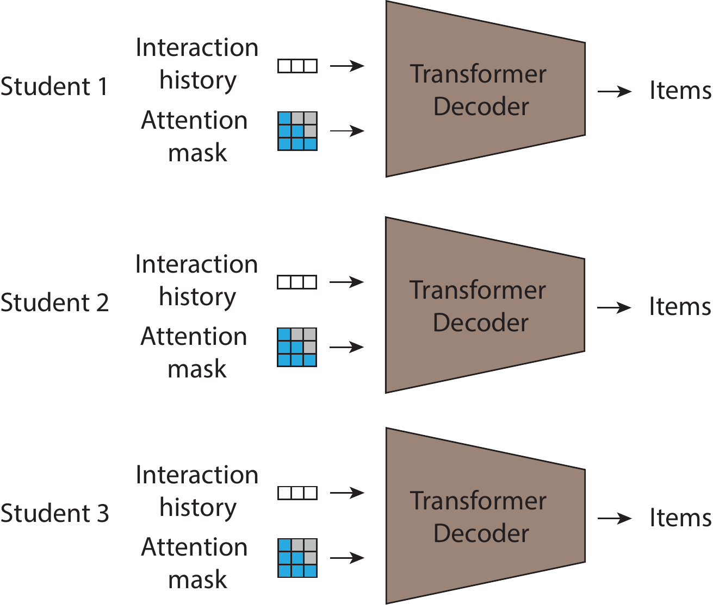
<figcaption>Processing students individually</figcaption>
</figure>
<figure>
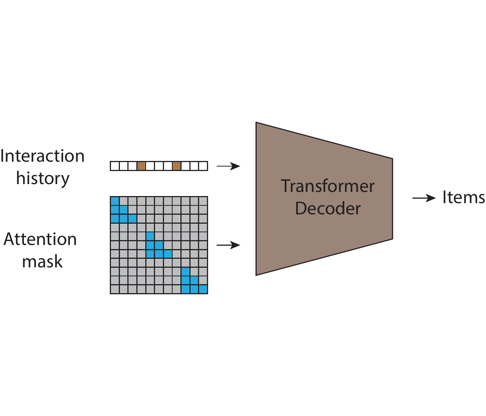
<figcaption>Equivalent reformulation of individual processing</figcaption>
</figure>
<figure>
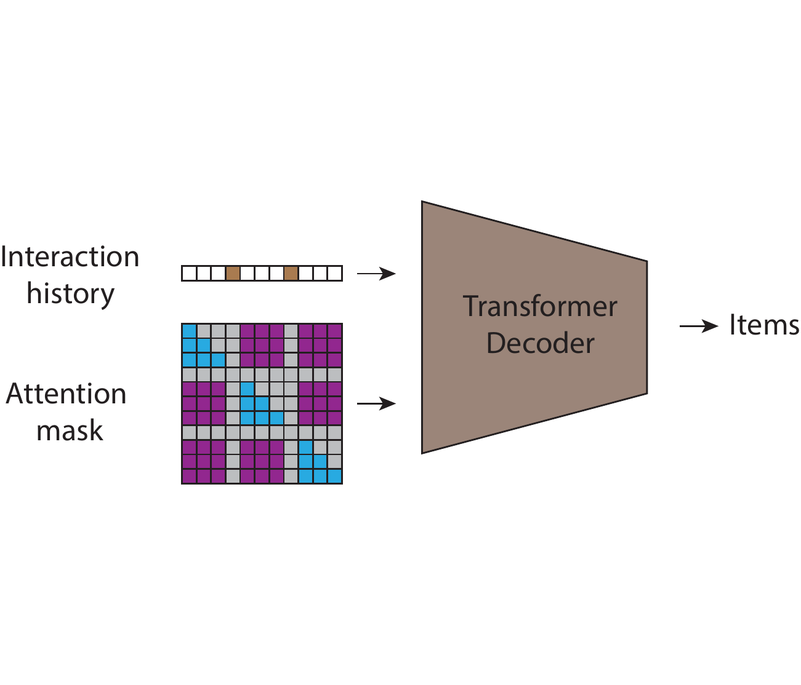
<figcaption>Processing students jointly</figcaption>
</figure>
<figure>
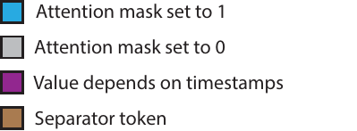
</figure>
<figcaption>In (a) we show a sequential autoregressive transformer with causal attention that processes each user individually, in (b) we show an equivalent joint forward pass that results in the same computation as (a), and finally in (c) we show that by introducing new nonzero values (shown in purple) to the attention mask we allow information to flow across users. We do this by allowing a prediction to condition on all interactions with an earlier timestamp, irrespective of whether the interaction came from the same user or not.</figcaption>
</figure>

# Related Work

## Click-through Rate Prediction

One of the popular approaches for recommender systems is click-through rate prediction , where we attempt to model the probability of a user clicking on a specific item presented to them. These probabilities are then used as a proxy for what we believe the users preferences are. Click-through Rate (CTR) models typically make predictions for a suggested next item for a user based on the user’s sequence of previous interactions, user data and context data. Model architectures used in this problem range from standard models like Transformers used in Behavior Sequence Transformers (BST)  and Convolutional Neural Networks used in  to more task specific architectures such as Wide & Deep models  and Field-Leveraged Embedding Networks (FLEN) . This approach is in contrast to other approaches such as neural collaborative filtering  and K-Nearest Neighbors (KNN) recommenders  where we do not attempt to explicitly model the likelihood of the user interacting with a specific item.

## Social-Aware Recommendation Systems

When we have social connectivity information for the users we are recommending to, there are many modeling approaches that leverage this information. Methods such as TrustMF  and Sorec  project user preference vectors into a latent space using matrix factorization approaches. The underlying assumption of these systems is homophily i.e. that users who are more socially connected are more likely to have similar preferences.

Deep-learning based methods have leveraged graph neural networks to learn over the social connectivity structure. Methods such as DiffNet  and KCGN  utilize graph convolutional neural networks whereas methods such as GraphRec  and Social Attentional Memory Networks (SAMN)  employ graph attention mechanisms. Other notable work includes Disentangled Graph Neural Networks (DGNN) which have the capability to model non-heterogeneous relationships and utilize a memory augmented graph network .

In this work we take a different approach to previous work which has used graph neural networks or other custom architectures with separate components to handle the cross-user interactions. We utilize a single transformer decoder with a specifically-designed attention mask to do joint inference over groups of users. With this approach we have a single consistent way to handle both within-user and cross-user interactions.

# Problem Statement

Given historical observational data of users interacting with items on a platform and the users’ social connectivity we want to make personalized recommendations of new items that are likely to be interesting.

# Methods

## Data

We developed our methodology on a dataset of historical interactions with an educational platform offered by our partner Learning Ally. The data offered was anonymized with each student, school and district being identified only by a unique randomly generated identification number. Furthermore all descriptive data of the students was only available as highly aggregated summaries. In the dataset we have historical records of interactions between students and educational items. For each interaction recorded we have a timestamp, an item ID and an anonymized student ID, an anonymized school ID and a grade level, which is enough metadata to make rough inference of which students are in the same classrooms. This data was collected over two consecutive school years containing over 5 million interactions per each school year totalling over 10 million interactions. These interactions come from a cohort of over 390,000 students. We use the data from the first school year as our training dataset and split the data from our second school year into a validation dataset and a test dataset. This split was done according to the temporal global splitting strategy . This was done to model the scenario of deployment as realistically as possible. To partition the data from the second school year into a test set and a validation set we split by student, following the user split strategy . This is because if a data split does not contain at least a full academic year then the distributions would not match due to seasonal trends in the data.

On the item side we have in the order of tens of thousands of items to recommend from. Overall this dataset is well suited to studying social recommendation algorithms due to the existence of implied social connections through known proximity and also due to the large amount of interaction data on record. Further details on the data can be found in Appendix <a href="#section:app:data" data-reference-type="ref" data-reference="section:app:data">[section:app:data]</a>

## Preprocessing

In order to get the training data representation, we express the items as tokens. The top $`v`$ most popular items get a unique and sequential integer as their token, while the rest of the items get assigned to an out-of-vocabulary token. The student interaction history will therefore become a list of such tokens associated with a time point.

The following additional processing steps are taken based on the model type used downstream:

- For transformer models: we split the student history into slices based on a context window of length $`c`$.

- For models that process students jointly: we split the sequence associated with each student into segments of length $`s`$, $`s`$ \< $`c`$, then compose sequences of length $`c`$ by joining segments from *multiple* students in the same classroom, taking care to use a separator token.

Additional information, including a diagram of our preprocessing steps, are presented in Appendix <a href="#section:app:preprocessing" data-reference-type="ref" data-reference="section:app:preprocessing">[section:app:preprocessing]</a>.

## Models

We implement **KNN** and **SAMN**[^1]  as baseline models, a transformer-based model that does inference for each student separately we name **Individual** as well as a transformer that operates over groups of students we name **STUDY**.

### Item-based KNN recommender

To implement our item-based KNN recommender  we first need to define our items and their corresponding features. To do this we iterate over every sequence in the training dataset and featurize each item by computing a feature vector from the $`h`$ interactions previously preceding it. Each item in the sequence is represented by a vector of size $`v + 1`$, one component for each entry in the vocabulary as well as an entry for the out-of-vocabulary token). The $`i^{th}`$ component of this vector is the number of times the $`i^{th}`$ item in the vocabulary was interacted with in the users previous $`h`$ interactions with the system. As $`h \ll n`$ these feature vectors are very sparse. To make recommendations at inference time, we compute a feature vector from the users $`h`$ most recent interactions from the users history. We then compute the cosine similarity between the user’s current feature vector and each entry in the training dataset. Finally we recommend the user the $`k`$ distinct items with highest cosine similarity to the user’s current feature vector. Due to sparsity most entries in the training dataset will have a cosine similarity of exactly zero with the user’s current feature vector. To utilize this fact to make an efficient implementation we precompute an inverse index  for the training data that can be used to retrieve only the feature vectors which have a nonzero value at a specific index. Utilizing this inverse index we only have to compute the cosine similarity for vectors that we know will have a nonzero similarity with our current feature. These are the vectors that have overlapping nonzero entries with the current context. Furthermore, we utilize a library that represents our vectors as sparse vectors, saving both memory and compute when doing arithmetic on these vectors.

### Individual

Following the click-through rate prediction  method of recommendation we take the next-click prediction approach to recommendation, hence we treat making recommendations as a causal sequence-modeling problem. In particular, we borrow a modeling framework from the language modeling literature  due to a similar problem setup. Concretely, given a set of students $`s_j \in S`$, and a set of historical item interactions $`\{i^k_j : \forall j | s_j \in S,  \forall k < \|s_j\|, k \in \mathbb{N} \}`$ then we want to learn a propensity function

<div class="center">

$`P({i^k_j }) = f(i^k_j |  i^{k'<k}_j ; \theta)`$

</div>

where the propensity of an item at point in time the likelihood the student will interact with that item. To this end we modeled $`f`$ as causal decoder-only transformer with a next-token prediction objective to maximize the following likelihood of our data $`D`$

<div class="center">

$`\mathbb{L}(D) = \sum_{s^i_j \in D} \log  f(s^i_j | s^i_{j'<j} ; \theta)`$

</div>

This is the formulation we used for the model referred to as **Individual**, since inference is carried out for each individual student separately.

### STUDY

We motivate our model by observing that for students with little previous interactions to go on, we can rely on data from other students whom we expect to have similar preferences to seed the model to make better predictions. Concretely, we concatenate the interaction sequences of multiple students who are within the same classroom. However when doing this we are no longer able to apply the causal sequence modeling approach to model this problem. This is because some item-interactions for students presented earlier in the sequence could have occurred at a later point in time relative to item-interactions for the students presented later in the sequence. Modeling the data represented in this format using causal sequence modeling would lead to anti-causal data leakage and the model would learn to make recommendations conditioned on information will not be available at inference time.

Hence we introduce temporally causal masking into our model, a change to our model’s forward pass which enables us to use a training process similar to causal sequence modeling while still respecting the causal relationships in our data as shown in Figure <a href="#figure:main" data-reference-type="ref" data-reference="figure:main">1</a>. Conceptually we concatenate the user vectors of students in the same classroom and allow predictions for a particular item to condition on all interactions that happened in the past, both within-user and cross-user. In more detail, if have a subset of users $`u^1, u^2, \cdots, u^n`$ who are all in the same classroom, with interaction sequences $`\boldsymbol{S^1}, \boldsymbol{S^2}, \cdots, \boldsymbol{S^n}`$, and with timestamp vectors $`\boldsymbol{T^1},\boldsymbol{T^2}, \cdots \boldsymbol{T^2}`$ where $`t^i_j`$ is the timestamp of the interaction described at $`s^i_j`$ - and each user vector $`\boldsymbol{S^n}`$ and timestamp vector $`\boldsymbol{T^n}`$ is terminated with a separator token - we define the concatenated classroom vectors generated by the procedure described in Section <a href="#section:preprocessing" data-reference-type="ref" data-reference="section:preprocessing">4.2</a> as

<div class="center">

$`\boldsymbol{\hat{S}} = \left( \boldsymbol{S^1} \boldsymbol{S^2} \cdots \boldsymbol{S^n} \right)`$

$`\boldsymbol{\hat{T}} = \left( \boldsymbol{T^1} \boldsymbol{T^2} \cdots \boldsymbol{T^n} \right)`$

</div>

And we define the matrix $`\boldsymbol{M}`$

<div class="center">

$`m_{i,j} = \mathbbm{1}_{\hat{t}_i < \hat{t}_j}`$

</div>

as the temporally causal mask matrix. This matrix is used as the mask in our attention operator instead of the usual causal mask used in decoder-only transformers. Hence our we redefine the attention operator in the decoder-only transformer as follows.

<div class="center">

$`\boldsymbol{A} = \mathrm{Softmax}(\frac{ \boldsymbol{Q K^T}}{\sqrt{d_k}}) \odot \boldsymbol{M}`$

$`\mathrm{Attention(\boldsymbol{Q}, \boldsymbol{K},  \boldsymbol{V})} =  \boldsymbol{A V}`$

</div>

where $`\boldsymbol{Q}`$ is the query matrix, $`\boldsymbol{K}`$ is the key matrix and $`\boldsymbol{V}`$ is the value matrix. With this modification we can use next-item prediction sequence modeling to train the model without anti-causal information leakage, utilizing a multihead generalization of this attention mechanism . We call the model defined by this procedure **STUDY**.

## Experiments

We present results from the Individual and STUDY models, the item-based KNN baseline as well as SAMN , a social baseline. We tune the hyperparameters learning rate on the validation set and report final results on the test set. We took the both the context length $`c`$ and the segment size $`s`$ for our transformer models to be 65, enough to the full history of most students in our dataset. Details about further hyperparameters and compute can be found in Appendix <a href="#section:app:experiment" data-reference-type="ref" data-reference="section:app:experiment">10</a>. We use the hits@n scores as our evaluation metric, with hits@n being the percentage of interactions where the actual item interacted with falls within the top $`n`$ recommendations from the model under evaluation. Since we observe that students tend to repeatedly interact with an item multiple times before completing it, we additionally evaluate our models on the subset of the dataset where the student is interacting with a different item to the item previously interacted with, referred to as *non-continuation* evaluation. We also evaluate on the subset of the dataset where the students are interacting with an item for the first time, referred to as *novel* evaluation. This motivated by the fact that we are interested in the power of our recommendation systems to engage students with new items in order to maximize time spent on the educational platform. Aggregate statistics are computed per student then averaged over students to prevent students with large numbers of interactions from dominating the reported statistics. We also examine the relevant performance of these models on different slices of data, looking at co-factors such as demographic characteristics and school performance. We present the results of this experiment in section <a href="#section:results" data-reference-type="ref" data-reference="section:results">5</a>.

## Ablation Experiments

**Force Mix**: In our model because we set segment size $`s`$ equal to context size $`c`$ we only do joint inference over groups of students when processing a student who does not have enough previous interactions to fill the transformer’s context. We experiment with shorter segment size $`s = 20 \ll c`$ as per the definitions in Section <a href="#section:preprocessing" data-reference-type="ref" data-reference="section:preprocessing">4.2</a>. Practically this leads the model always sharing its context between students in a classroom when possible, even for students who have enough history to fill the transformer context. We present results for this ablation in Section <a href="#section:ablation_results" data-reference-type="ref" data-reference="section:ablation_results">5.1</a>

**Classroom Grouping**: In STUDY we do joint inference over students in the same classroom. We ablate the importance of using this particular grouping. Concretely, we experiment with grouping students who are in the same district and school year as being in a single group. We also experiment with grouping all students in the dataset into a single group. This results in completely random groups of students being jointly processed together. We present results in Section <a href="#section:ablation_results" data-reference-type="ref" data-reference="section:ablation_results">5.1</a>.

**Data Tapering**:We compare the effect of using only a subset of the available data and compare the performance of STUDY and Individual. We compare the use of 25%, 50%, 75% and the entire dataset, with the aim of discerning the effect of using social information on the data efficiency of the system. We present results in Section <a href="#section:ablation_results" data-reference-type="ref" data-reference="section:ablation_results">5.1</a>.

<div class="table*">

<table>
<thead>
<tr>
<th style="text-align: center;">Evaluation Subset</th>
<th style="text-align: center;"><span class="math inline"><em>n</em></span></th>
<th style="text-align: center;">KNN(%)</th>
<th style="text-align: center;">SAMN(%)</th>
<th style="text-align: center;">Individual (%)</th>
<th style="text-align: center;">STUDY(%)</th>
</tr>
</thead>
<tbody>
<tr>
<td rowspan="5" style="text-align: center;"><table>
<tbody>
<tr>
<td style="text-align: center;">All</td>
</tr>
</tbody>
</table></td>
<td style="text-align: center;">1</td>
<td style="text-align: center;"><span class="math inline">16.67 ± 0.14</span></td>
<td style="text-align: center;"><span class="math inline">0.32 ± 0.02</span></td>
<td style="text-align: center;"><span class="math inline">28.06 ± 0.14</span></td>
<td style="text-align: center;"><span class="math inline">31.86 ± 0.14</span></td>
</tr>
<tr>
<td style="text-align: center;">3</td>
<td style="text-align: center;"><span class="math inline">31.97 ± 0.17</span></td>
<td style="text-align: center;"><span class="math inline">2.01 ± 0.05</span></td>
<td style="text-align: center;"><span class="math inline">35.74 ± 0.16</span></td>
<td style="text-align: center;"><span class="math inline">38.65 ± 0.14</span></td>
</tr>
<tr>
<td style="text-align: center;">5</td>
<td style="text-align: center;"><span class="math inline">37.16 ± 0.20</span></td>
<td style="text-align: center;"><span class="math inline">3.64 ± 0.09</span></td>
<td style="text-align: center;"><span class="math inline">38.63 ± 0.18</span></td>
<td style="text-align: center;"><span class="math inline">41.17 ± 0.18</span></td>
</tr>
<tr>
<td style="text-align: center;">10</td>
<td style="text-align: center;"><span class="math inline">43.17 ± 0.20</span></td>
<td style="text-align: center;"><span class="math inline">6.87 ± 0.10</span></td>
<td style="text-align: center;"><span class="math inline">42.56 ± 0.20</span></td>
<td style="text-align: center;"><span class="math inline">44.85 ± 0.18</span></td>
</tr>
<tr>
<td style="text-align: center;">20</td>
<td style="text-align: center;"><span class="math inline">48.02 ± 0.20</span></td>
<td style="text-align: center;"><span class="math inline">11.56 ± 0.15</span></td>
<td style="text-align: center;"><span class="math inline">46.70 ± 0.20</span></td>
<td style="text-align: center;"><span class="math inline">48.90 ± 0.18</span></td>
</tr>
<tr>
<td rowspan="5" style="text-align: center;"><table>
<tbody>
<tr>
<td style="text-align: center;">Non-continuation</td>
</tr>
</tbody>
</table></td>
<td style="text-align: center;">1</td>
<td style="text-align: center;"><span class="math inline">5.15 ± 0.08</span></td>
<td style="text-align: center;"><span class="math inline">0.33 ± 0.02</span></td>
<td style="text-align: center;"><span class="math inline">2.05 ± 0.04</span></td>
<td style="text-align: center;"><span class="math inline">3.75 ± 0.07</span></td>
</tr>
<tr>
<td style="text-align: center;">3</td>
<td style="text-align: center;"><span class="math inline">9.35 ± 0.08</span></td>
<td style="text-align: center;"><span class="math inline">1.95 ± 0.04</span></td>
<td style="text-align: center;"><span class="math inline">10.38 ± 0.11</span></td>
<td style="text-align: center;"><span class="math inline">13.76 ± 0.11</span></td>
</tr>
<tr>
<td style="text-align: center;">5</td>
<td style="text-align: center;"><span class="math inline">11.47 ± 0.13</span></td>
<td style="text-align: center;"><span class="math inline">3.56 ± 0.07</span></td>
<td style="text-align: center;"><span class="math inline">14.35 ± 0.10</span></td>
<td style="text-align: center;"><span class="math inline">17.66 ± 0.11</span></td>
</tr>
<tr>
<td style="text-align: center;">10</td>
<td style="text-align: center;"><span class="math inline">14.93 ± 0.10</span></td>
<td style="text-align: center;"><span class="math inline">6.68 ± 0.09</span></td>
<td style="text-align: center;"><span class="math inline">19.96 ± 0.13</span></td>
<td style="text-align: center;"><span class="math inline">23.05 ± 0.13</span></td>
</tr>
<tr>
<td style="text-align: center;">20</td>
<td style="text-align: center;"><span class="math inline">19.42 ± 0.15</span></td>
<td style="text-align: center;"><span class="math inline">11.29 ± 0.15</span></td>
<td style="text-align: center;"><span class="math inline">26.27 ± 0.14</span></td>
<td style="text-align: center;"><span class="math inline">29.50 ± 0.16</span></td>
</tr>
<tr>
<td rowspan="5" style="text-align: center;"><table>
<tbody>
<tr>
<td style="text-align: center;">Novel</td>
</tr>
</tbody>
</table></td>
<td style="text-align: center;">1</td>
<td style="text-align: center;"><span class="math inline">0.58 ± 0.03</span></td>
<td style="text-align: center;"><span class="math inline">0.32 ± 0.02</span></td>
<td style="text-align: center;"><span class="math inline">1.06 ± 0.04</span></td>
<td style="text-align: center;"><span class="math inline">1.86 ± 0.06</span></td>
</tr>
<tr>
<td style="text-align: center;">3</td>
<td style="text-align: center;"><span class="math inline">2.21 ± 0.06</span></td>
<td style="text-align: center;"><span class="math inline">1.87 ± 0.05</span></td>
<td style="text-align: center;"><span class="math inline">5.03 ± 0.09</span></td>
<td style="text-align: center;"><span class="math inline">6.60 ± 0.10</span></td>
</tr>
<tr>
<td style="text-align: center;">5</td>
<td style="text-align: center;"><span class="math inline">3.73 ± 0.05</span></td>
<td style="text-align: center;"><span class="math inline">3.45 ± 0.06</span></td>
<td style="text-align: center;"><span class="math inline">8.02 ± 0.12</span></td>
<td style="text-align: center;"><span class="math inline">9.77 ± 0.13</span></td>
</tr>
<tr>
<td style="text-align: center;">10</td>
<td style="text-align: center;"><span class="math inline">6.68 ± 0.08</span></td>
<td style="text-align: center;"><span class="math inline">6.47 ± 0.12</span></td>
<td style="text-align: center;"><span class="math inline">13.14 ± 0.12</span></td>
<td style="text-align: center;"><span class="math inline">15.06 ± 0.15</span></td>
</tr>
<tr>
<td style="text-align: center;">20</td>
<td style="text-align: center;"><span class="math inline">11.12 ± 0.10</span></td>
<td style="text-align: center;"><span class="math inline">10.99 ± 0.11</span></td>
<td style="text-align: center;"><span class="math inline">19.56 ± 0.14</span></td>
<td style="text-align: center;"><span class="math inline">22.01 ± 0.16</span></td>
</tr>
</tbody>
</table>

</div>

<figure id="fig:engagement">
<figure>
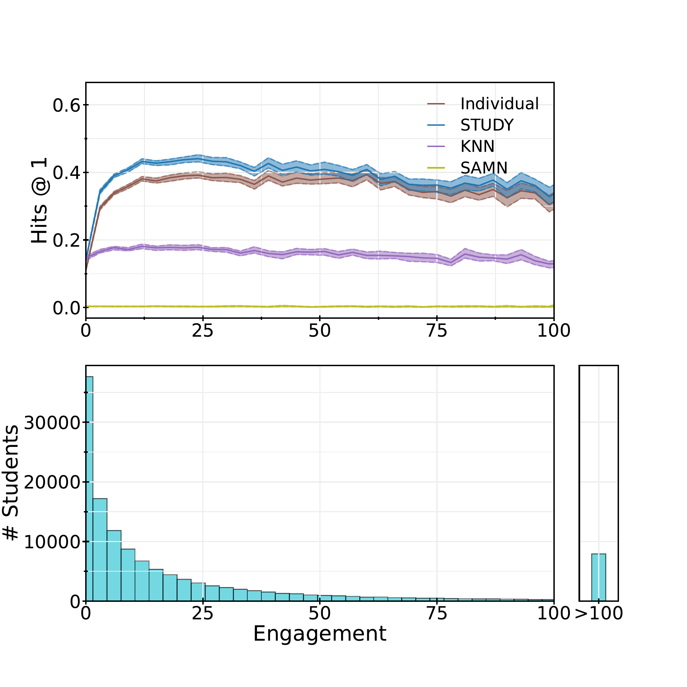
<figcaption aria-hidden="true"></figcaption>
</figure>
<figure>
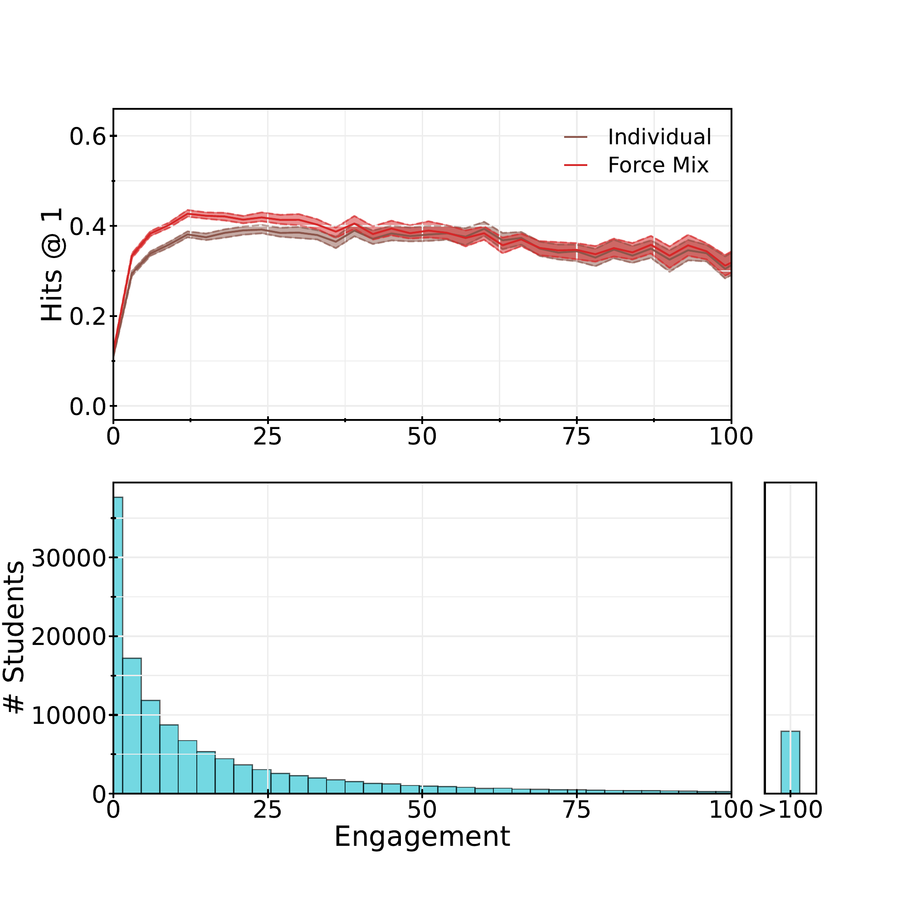
<figcaption aria-hidden="true"></figcaption>
</figure>
<figcaption>These figures show the performance of the presented models broken down by student engagement, accompanied by a histogram of student engagement in the lower chart. In (a) we present the four models KNN, SAMN, Individual and STUDY. We see the two transformer based approaches outperform KNN and SAMN. We also see that the STUDY model significantly outperforms the Individual model for students with low engagement up to 35 interactions. In (b) we present a comparison of the Individual against the Force Mix ablation. We see the Force Mix ablation only outperforms Individual on students with engagement of up to 17, with matched performance onwards. Uncertainties shown are <span class="math inline">95%</span> confidence intervals computed over 50 bootstraps.</figcaption>
</figure>

<figure id="fig:slices">
<figure>
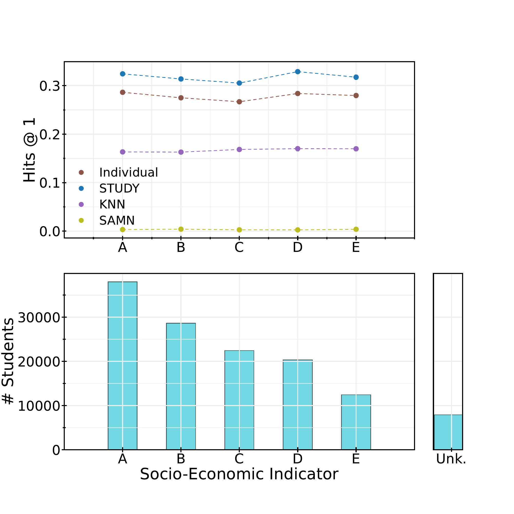
<figcaption aria-hidden="true"></figcaption>
</figure>
<figure>
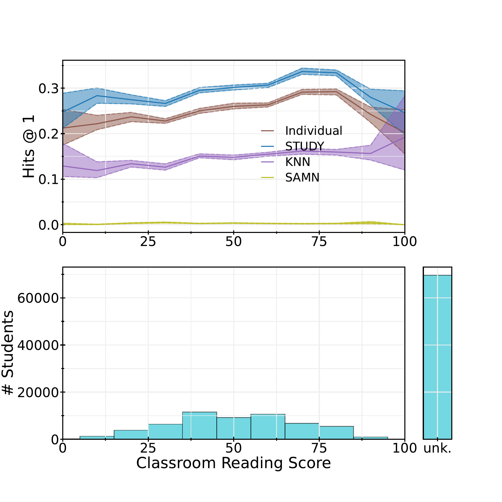
<figcaption aria-hidden="true"></figcaption>
</figure>
<figure>
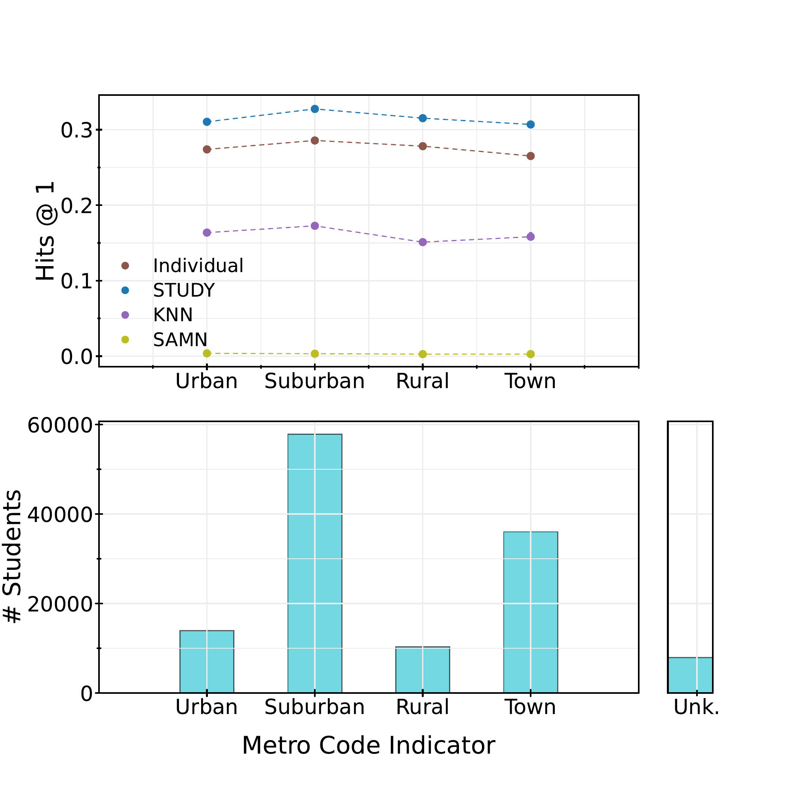
<figcaption aria-hidden="true"></figcaption>
</figure>
<figcaption>In this figure we show the slicing of our models performance by (a) socio-economic indicator, (b) by classroom reading score and (c) Metro code which describes schools as being Urban, Suburban, Rural or Town. We show histograms of the sliced variables in the lower figures. We see the relative order of performance Temporally Causal <span class="math inline">&gt;</span> Individual <span class="math inline">≫</span> KNN <span class="math inline">≫</span> SAMN is maintained across all slices. Uncertainties shown are <span class="math inline">95%</span> confidence intervals. In (a) and (c) uncertainties are shown as error bars but are very small.</figcaption>
</figure>

<figure id="fig:data_ablation">
<figure id="fig:classroom_ablation">
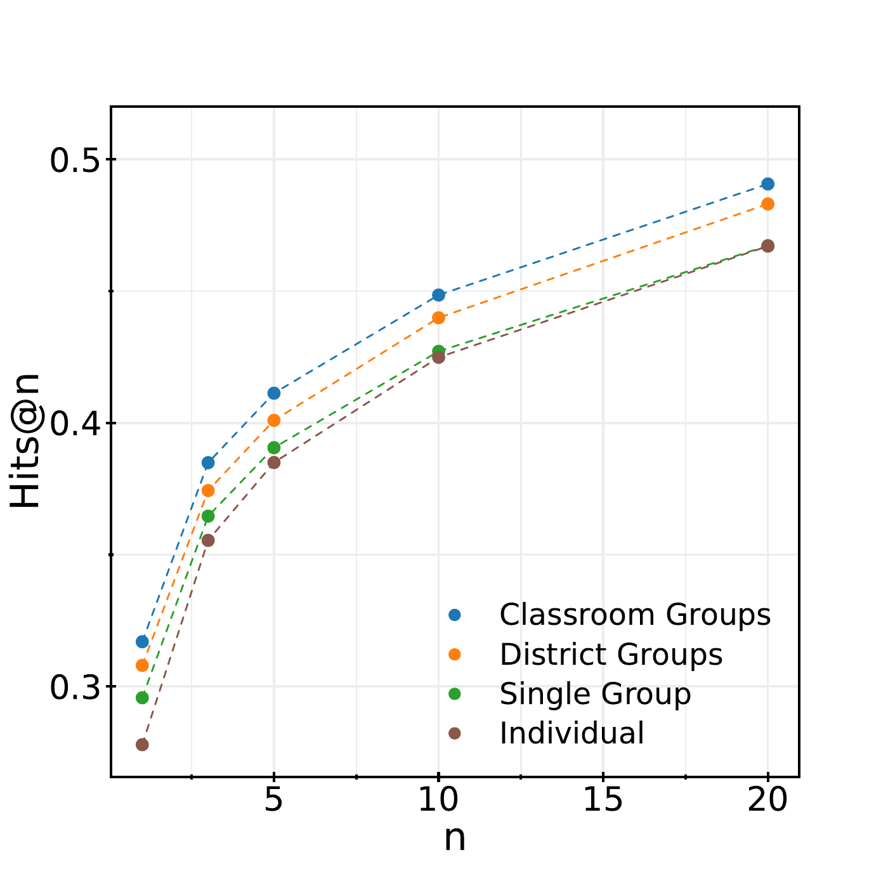
<figcaption aria-hidden="true"></figcaption>
</figure>
<figure id="fig:data_ablation">
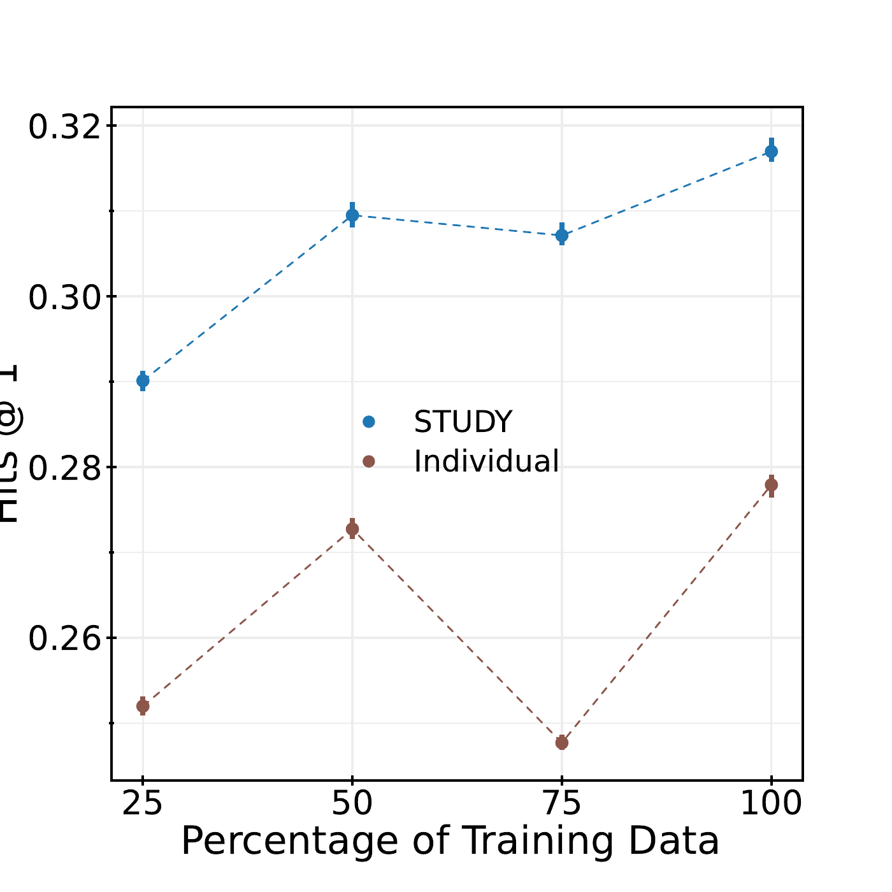
<figcaption aria-hidden="true"></figcaption>
</figure>
<figcaption>In Figure (a) we compare the results of grouping the students for STUDY by classroom, grouping by the intersection of district and school year, grouping randomly as well doing individual inference. We observe that grouping by classroom performs best, that grouping by district <span class="math inline">×</span> school year performs slightly worse, and that random grouping is on par with individual inference. In Figure (b) we show the effect of training with subsets of the training data of various sizes on Individual and STUDY. We see that STUDY outperforms Individual at all subset sizes. We also note the drop in performance when increasing the dataset size from 50% to 75% across both models. Uncertainties shown are <span class="math inline">95%</span> confidence intervals computed over 50 bootstraps and are obscured by datapoint markers when small. </figcaption>
</figure>

# Results and Analysis

Table <a href="#tab:main_results" data-reference-type="ref" data-reference="tab:main_results">[tab:main_results]</a> shows the performance of the models STUDY, Individual, KNN and SAMN on the test split and we observe both transformer models, Individual and STUDY largely outperform KNN and SAMN, with the STUDY model outperforming the Individual model. We see that the social model SAMN which is from the a collaborative filtering family of models, fails to pick up on the sequential patterns in the dataset, such as users revisiting the exact same item or similar items, this is exhibited by SAMN having similar performance in the evaluation subsets *all*, *non-continuation* and *novel*. The performance differences are most pronounced when evaluated on the entire test set as seen in the *all* section of the table, but also holds up when evaluated across the more difficult *non-continuation* and *novel* test subsets. Crucially, with the STUDY model outperforming the individual model we can see that leveraging the social hierarchy of our users to do joint predictions leads to improved recommendations.

In Figure <a href="#fig:slices" data-reference-type="ref" data-reference="fig:slices">3</a> we see the relative performance of the models under examination to be constant, with STUDY outperforming Individual which in turn outperforms KNN and SAMN trailed behind with almost 0 hits@1, we attribute this due to SAMN’s non-sequential nature. This ordering is fixed when slicing by demographic variables such as metro-code (which describes schools as being in urban, suburban, rural or town areas), school socio-economic indicators which indicate the level of wealth of the area the in the vicinity of a school. We also observe the same when slicing by academic variables such as classroom reading scores. In Figure <a href="#fig:engagement" data-reference-type="ref" data-reference="fig:engagement">2</a> we slice model performance by student engagement, which we measure by the number of interactions the student has on record. Here we see similar relative performance order for students with less than 35 or so total interactions, but for students with more engagement we see convergence between the performance of STUDY and Individual. This is discussed in more detail in Section <a href="#section:ablation_results" data-reference-type="ref" data-reference="section:ablation_results">5.1</a>.

## Ablations Results

**Force Mix**: In Figure <a href="#fig:engagement" data-reference-type="ref" data-reference="fig:engagement">2</a> we can compare the performance of the STUDY model to the individual model and we can observe it significantly outperforms the individual model on students with up to 35 previous interactions. Compared to the model from the Force Mix ablation only outperforms Individual on students who have up to about 17 interactions on the platform. Given that our segment length for the Force Mix model is 20, it is at students with 20 previous where Force Mix starts to forgo on available history for the student at hand in favor of conditioning on data from other peer students. From here we can conclude that conditioning on peer student history is beneficial if and only if it is additional to conditioning on all available history for a student, but not if it comes at the cost of conditioning on less history than available for the particular student.

**Classroom Grouping**: In Figure <a href="#fig:classroom_ablation" data-reference-type="ref" data-reference="fig:classroom_ablation">4</a> we can compare the performance of our model that uses classrooms to group students for joint inference compared to a model that uses intersection of district and school year to group students, to a model that uses a single group as well as to a model that does inference for each student individually. We can see that using classrooms for grouping results in the best performance, that using the intersection of district and school year for grouping performs slightly worse, and that putting all students in the same group performs similar to individual processing. From here we can conclude that using groups of users whom we expect to have correlated interests is necessary for the performance of our model and using poorly designed groups can harm model performance.

**Data Tapering**: In Figure <a href="#fig:data_ablation" data-reference-type="ref" data-reference="fig:data_ablation">6</a> we see that STUDY outperforms the Individual recommender across all data subsets used to train the models, confirming the benefit of adopting social recommender systems such as STUDY even when in a data-constrained environment. We also note that both models witness a performance drop when the amount of data used increases from 50% to 75%, suggesting that not all additional data is beneficial. We leave a deeper interpretation of this phenomenon to future work.

# Conclusion

In this method we present STUDY, a socially aware recommendation system that leverages cross-user information at inference time and we demonstrate its applicability on the practical problem of book recommendation for children inside a classroom. This is an important problem, as engagement with reading materials from an early age can have a positive impact on language acquisition, communication skills, social skills and literacy skills to name a few.

Our novel method uses attention masks that are causal with respect to interaction timestamps and is able to process both within-user and across user interactions using a single forward pass through a modified transformer decoder network. In doing so, we keep away from complex architectures and avoid the need for graph neural networks which are notoriously difficult to train. We further compare with a number of baselines, both sequential and non-sequential, and social and non-social. We show that our method outperforms both sequential and social methods, in a variety of scenarios as demonstrated through our ablation studies.

**Limitations**: Our evaluations were limited to offline evaluations on historical data, which although inline with much of the literature, these evaluations cannot account for the utility of recommended items that the user has never interacted with in the past, but would have actually enjoyed. Furthermore, our method is limited to structures where all the known relationships between users are homogeneous. In future work we wish to explore extending this method to social networks with richer heterogeneous relationships between users.

# Acknowledgements

We would like to acknowledge our partners Jeff Ho, Akshat Shah, Erin Walker, and Tyler Bastian at Learning Ally for partnering with us on data and graciously providing us with educational domain subject matter expertise. We would also like to acknowledge our colleagues at Google: Marc Repnyek, Aki Estrella, Fernando Diaz, Scott Sanner, Emily Salkey and Lev Proleev for the fruitful discussions, technical support and collaboration on this project.

# References

<div class="thebibliography">

Zhao Li, Shen Xin, Yuhang Jiao, Xuming Pan, Pengcheng Zou, Xianling Meng, Chengwei Yao, and Jiajun Bu Hierarchical bipartite graph neural networks: Towards large-scale e-commerce applications , pages 1677–1688, 2020. **Abstract:** The e-commerce appeals to a multitude of online shoppers by providing personalized experiences and becomes indispensable in our daily life. Accurately predicting user preference and making a recommendation of favorable items plays a crucial role in improving several key tasks such as Click Through Rate (CTR) and Conversion Rate (CVR) in order to increase commercial value. Some state-of-the-art collaborative filtering methods exploiting non-linear interactions on a user-item bipartite graph are able to learn better user and item representations with Graph Neural Networks (GNNs), which do not learn hierarchical representations of graphs because they are inherently flat. Hierarchical representation is reportedly favorable in making more personalized item recommendations in terms of behaviorally similar users in the same community and a context of topic-driven taxonomy. However, some advanced approaches, in this regard, are either only considering linear interactions, or adopting single-level community, or computationally expensive. To address these problems, we propose a novel method with Hierarchical bipartite Graph Neural Network (HiGNN) to handle large-scale e-commerce tasks. By stacking multiple GNN modules and using a deterministic clustering algorithm alternately, HiGNN is able to efficiently obtain hierarchical user and item embeddings simultaneously, and effectively predict user preferences on a larger scale. Extensive experiments on some real-world e-commerce datasets demonstrate that HiGNN achieves a significant improvement compared to several popular methods. Moreover, we deploy HiGNN in Taobao, one of the largest e-commerces with hundreds of million users and items, for a series of large-scale prediction tasks of item recommendations. The results also illustrate that HiGNN is arguably promising and scalable in real-world applications. (@Li2020HierarchicalBG)

Xiangyu Liu, Chuan Yu, Zhilin Zhang, Zhenzhe Zheng, Yu Rong, Hongtao Lv, Da Huo, Yiqing Wang, Dagui Chen, Jian Xu, Fan Wu, Guihai Chen, and Xiaoqiang Zhu Neural auction: End-to-end learning of auction mechanisms for e-commerce advertising 2021. **Abstract:** In e-commerce advertising, it is crucial to jointly consider various performance metrics, e.g., user experience, advertiser utility, and platform revenue. Traditional auction mechanisms, such as GSP and VCG auctions, can be suboptimal due to their fixed allocation rules to optimize a single performance metric (e.g., revenue or social welfare). Recently, data-driven auctions, learned directly from auction outcomes to optimize multiple performance metrics, have attracted increasing research interests. However, the procedure of auction mechanisms involves various discrete calculation operations, making it challenging to be compatible with continuous optimization pipelines in machine learning. In this paper, we design Deep Neural Auctions (DNAs) to enable end-to-end auction learning by proposing a differentiable model to relax the discrete sorting operation, a key component in auctions. We optimize the performance metrics by developing deep models to efficiently extract contexts from auctions, providing rich features for auction design. We further integrate the game theoretical conditions within the model design, to guarantee the stability of the auctions. DNAs have been successfully deployed in the e-commerce advertising system at Taobao. Experimental evaluation results on both large-scale data set as well as online A/B test demonstrated that DNAs significantly outperformed other mechanisms widely adopted in industry. (@liu2021neural)

Yashar Deldjoo, Markus Schedl, Paolo Cremonesi, and Gabriella Pasi Recommender systems leveraging multimedia content , 53(5), sep 2020. **Abstract:** Recommender systems have become a popular and effective means to manage the ever-increasing amount of multimedia content available today and to help users discover interesting new items. Today’s recommender systems suggest items of various media types, including audio, text, visual (images), and videos. In fact, scientific research related to the analysis of multimedia content has made possible effective content-based recommender systems capable of suggesting items based on an analysis of the features extracted from the item itself. The aim of this survey is to present a thorough review of the state-of-the-art of recommender systems that leverage multimedia content, by classifying the reviewed papers with respect to their media type, the techniques employed to extract and represent their content features, and the recommendation algorithm. Moreover, for each media type, we discuss various domains in which multimedia content plays a key role in human decision-making and is therefore considered in the recommendation process. Examples of the identified domains include fashion, tourism, food, media streaming, and e-commerce. (@Deldjoo2020)

Solmaz Abdi, Hassan Khosravi, Shazia Sadiq, and Dragan Gasevic Complementing educational recommender systems with open learner models In *Proceedings of the tenth international conference on learning analytics & knowledge*, pages 360–365, 2020. **Abstract:** Educational recommender systems (ERSs) aim to adaptively recommend a broad range of personalised resources and activities to students that will most meet their learning needs. Commonly, ERSs operate as a "black box" and give students no insight into the rationale of their choice. Recent contributions from the learning analytics and educational data mining communities have emphasised the importance of transparent, understandable and open learner models (OLMs) that provide insight and enhance learners’ understanding of interactions with learning environments. In this paper, we aim to investigate the impact of complementing ERSs with transparent and understandable OLMs that provide justification for their recommendations. We conduct a randomised control trial experiment using an ERS with two interfaces ("Non-Complemented Interface" and "Complemented Interface") to determine the effect of our approach on student engagement and their perception of the effectiveness of the ERS. Overall, our results suggest that complementing an ERS with an OLM can have a positive effect on student engagement and their perception about the effectiveness of the system despite potentially making the system harder to navigate. In some cases, complementing an ERS with an OLM has the negative consequence of decreasing engagement, understandability and sense of fairness. (@abdi2020complementing)

Mbarek Dhahri and Mohamed Koutheair Khribi A review of educational recommender systems for teachers , 2021. **Abstract:** Recommender Systems (RS) in e-learning has attracted several researchers aiming basically at scaffolding learners inlocating relevant learning resources that meet their learning needs and profiles. Whereas a number of review studies havebeen (@dhahri2021review)

Robert Bodily and Katrien Verbert Review of research on student-facing learning analytics dashboards and educational recommender systems , 10(4):405–418, 2017. **Abstract:** This article is a comprehensive literature review of student-facing learning analytics reporting systems that track learning analytics data and report it directly to students. This literature review builds on four previously conducted literature reviews in similar domains. Out of the 945 articles retrieved from databases and journals, 93 articles were included in the analysis. Articles were coded based on the following five categories: functionality, data sources, design analysis, student perceptions, and measured effects. Based on this review, we need research on learning analytics reporting systems that targets the design and development process of reporting systems, not only the final products. This design and development process includes needs analyses, visual design analyses, information selection justifications, and student perception surveys. In addition, experiments to determine the effect of these systems on student behavior, achievement, and skills are needed to add to the small existing body of evidence. Furthermore, experimental studies should include usability tests and methodologies to examine student use of these systems, as these factors may affect experimental findings. Finally, observational study methods, such as propensity score matching, should be used to increase student access to these systems but still rigorously measure experimental effects. (@bodily2017review)

Hui Fang, Danning Zhang, Yiheng Shu, and Guibing Guo Deep learning for sequential recommendation: Algorithms, influential factors, and evaluations , 39(1):1–42, 2020. **Abstract:** In the field of sequential recommendation, deep learning (DL)-based methods have received a lot of attention in the past few years and surpassed traditional models such as Markov chain-based and factorization-based ones. However, there is little systematic study on DL-based methods, especially regarding to how to design an effective DL model for sequential recommendation. In this view, this survey focuses on DL-based sequential recommender systems by taking the aforementioned issues into consideration. Specifically,we illustrate the concept of sequential recommendation, propose a categorization of existing algorithms in terms of three types of behavioral sequence, summarize the key factors affecting the performance of DL-based models, and conduct corresponding evaluations to demonstrate the effects of these factors. We conclude this survey by systematically outlining future directions and challenges in this field. (@fang2020deep)

Xiaoyuan Su and Taghi M Khoshgoftaar A survey of collaborative filtering techniques , 2009, 2009. **Abstract:** As one of the most successful approaches to building recommender systems, collaborative filtering ( CF ) uses the known preferences of a group of users to make recommendations or predictions of the unknown preferences for other users. In this paper, we first introduce CF tasks and their main challenges, such as data sparsity, scalability, synonymy, gray sheep, shilling attacks, privacy protection, etc., and their possible solutions. We then present three main categories of CF techniques: memory-based, model-based, and hybrid CF algorithms (that combine CF with other recommendation techniques), with examples for representative algorithms of each category, and analysis of their predictive performance and their ability to address the challenges. From basic techniques to the state-of-the-art, we attempt to present a comprehensive survey for CF techniques, which can be served as a roadmap for research and practice in this area. (@su2009survey)

Harald Steck Embarrassingly shallow autoencoders for sparse data In *The World Wide Web Conference*, pages 3251–3257, 2019. **Abstract:** Combining simple elements from the literature, we define a linear model that is geared toward sparse data, in particular implicit feedback data for recommender systems. We show that its training objective has a closed-form solution, and discuss the resulting conceptual insights. Surprisingly, this simple model achieves better ranking accuracy than various state-of-the-art collaborative-filtering approaches, including deep non-linear models, on most of the publicly available data-sets used in our experiments. (@steck2019embarrassingly)

Massimo Quadrana, Paolo Cremonesi, and Dietmar Jannach Sequence-aware recommender systems , 51(4):1–36, 2018. **Abstract:** Recommender systems are one of the most successful applications of data mining and machine-learning technology in practice. Academic research in the field is historically often based on the matrix completion problem formulation, where for each user-item-pair only one interaction (e.g., a rating) is considered. In many application domains, however, multiple user-item interactions of different types can be recorded over time. And, a number of recent works have shown that this information can be used to build richer individual user models and to discover additional behavioral patterns that can be leveraged in the recommendation process. In this work, we review existing works that consider information from such sequentially ordered user-item interaction logs in the recommendation process. Based on this review, we propose a categorization of the corresponding recommendation tasks and goals, summarize existing algorithmic solutions, discuss methodological approaches when benchmarking what we call sequence-aware recommender systems , and outline open challenges in the area. (@quadrana2018sequence)

Shoujin Wang, Longbing Cao, Yan Wang, Quan Z Sheng, Mehmet A Orgun, and Defu Lian A survey on session-based recommender systems , 54(7):1–38, 2021. **Abstract:** Recommender systems (RSs) have been playing an increasingly important role for informed consumption, services, and decision-making in the overloaded information era and digitized economy. In recent years, session-based recommender systems (SBRSs) have emerged as a new paradigm of RSs. Different from other RSs such as content-based RSs and collaborative filtering-based RSs that usually model long-term yet static user preferences, SBRSs aim to capture short-term but dynamic user preferences to provide more timely and accurate recommendations sensitive to the evolution of their session contexts. Although SBRSs have been intensively studied, neither unified problem statements for SBRSs nor in-depth elaboration of SBRS characteristics and challenges are available. It is also unclear to what extent SBRS challenges have been addressed and what the overall research landscape of SBRSs is. This comprehensive review of SBRSs addresses the above aspects by exploring in depth the SBRS entities (e.g., sessions), behaviours (e.g., users’ clicks on items), and their properties (e.g., session length). We propose a general problem statement of SBRSs, summarize the diversified data characteristics and challenges of SBRSs, and define a taxonomy to categorize the representative SBRS research. Finally, we discuss new research opportunities in this exciting and vibrant area. (@wang2021survey)

Lianghao Xia, Yizhen Shao, Chao Huang, Yong Xu, Huance Xu, and Jian Pei Disentangled graph social recommendation , 2023. **Abstract:** Social recommender systems have drawn a lot of attention in many online web services, because of the incorporation of social information between users in improving recommendation results. Despite the significant progress made by existing solutions, we argue that current methods fall short in two limitations: (1) Existing social-aware recommendation models only consider collaborative similarity between items, how to incorporate item-wise semantic relatedness is less explored in current recommendation paradigms. (2) Current social recommender systems neglect the entanglement of the latent factors over heterogeneous relations (e.g., social connections, user-item interactions). Learning the disentangled representations with relation heterogeneity poses great challenge for social recommendation. In this work, we design a Disentangled Graph Neural Network (DGNN) with the integration of latent memory units, which empowers DGNN to maintain factorized representations for heterogeneous types of user and item connections. Additionally, we devise new memory-augmented message propagation and aggregation schemes under the graph neural architecture, allowing us to recursively distill semantic relatedness into the representations of users and items in a fully automatic manner. Extensive experiments on three benchmark datasets verify the effectiveness of our model by achieving great improvement over state-of-the-art recommendation techniques. The source code is publicly available at: https://github.com/HKUDS/DGNN. (@xia2023disentangled)

Weinan Zhang, Jiarui Qin, Wei Guo, Ruiming Tang, and Xiuqiang He Deep learning for click-through rate estimation , 2021. **Abstract:** Click-through rate (CTR) estimation plays as a core function module in various personalized online services, including online advertising, recommender systems, and web search etc. From 2015, the success of deep learning started to benefit CTR estimation performance and now deep CTR models have been widely applied in many industrial platforms. In this survey, we provide a comprehensive review of deep learning models for CTR estimation tasks. First, we take a review of the transfer from shallow to deep CTR models and explain why going deep is a necessary trend of development. Second, we concentrate on explicit feature interaction learning modules of deep CTR models. Then, as an important perspective on large platforms with abundant user histories, deep behavior models are discussed. Moreover, the recently emerged automated methods for deep CTR architecture design are presented. Finally, we summarize the survey and discuss the future prospects of this field. (@zhang2021deep)

Qiwei Chen, Huan Zhao, Wei Li, Pipei Huang, and Wenwu Ou Behavior sequence transformer for e-commerce recommendation in alibaba In *Proceedings of the 1st International Workshop on Deep Learning Practice for High-Dimensional Sparse Data*, pages 1–4, 2019. **Abstract:** Deep learning based methods have been widely used in industrial recommendation systems (RSs). Previous works adopt an Embedding&MLP paradigm: raw features are embedded into low-dimensional vectors, which are then fed on to MLP for final recommendations. However, most of these works just concatenate different features, ignoring the sequential nature of users’ behaviors. In this paper, we propose to use the powerful Transformer model to capture the sequential signals underlying users’ behavior sequences for recommendation in Alibaba. Experimental results demonstrate the superiority of the proposed model, which is then deployed online at Taobao and obtain significant improvements in online Click-Through-Rate (CTR) comparing to two baselines. (@chen2019behavior)

Qiang Liu, Feng Yu, Shu Wu, and Liang Wang A convolutional click prediction model In *Proceedings of the 24th ACM international on conference on information and knowledge management*, pages 1743–1746, 2015. **Abstract:** The explosion in online advertisement urges to better estimate the click prediction of ads. For click prediction on single ad impression, we have access to pairwise relevance among elements in an impression, but not to global interaction among key features of elements. Moreover, the existing method on sequential click prediction treats propagation unchangeable for different time intervals. In this work, we propose a novel model, Convolutional Click Prediction Model (CCPM), based on convolution neural network. CCPM can extract local-global key features from an input instance with varied elements, which can be implemented for not only single ad impression but also sequential ad impression. Experiment results on two public large-scale datasets indicate that CCPM is effective on click prediction. (@liu2015convolutional)

Heng-Tze Cheng, Levent Koc, Jeremiah Harmsen, Tal Shaked, Tushar Chandra, Hrishi Aradhye, Glen Anderson, Greg Corrado, Wei Chai, Mustafa Ispir, et al Wide & deep learning for recommender systems In *Proceedings of the 1st workshop on deep learning for recommender systems*, pages 7–10, 2016. **Abstract:** Generalized linear models with nonlinear feature transformations are widely used for large-scale regression and classification problems with sparse inputs. Memorization of feature interactions through a wide set of cross-product feature transformations are effective and interpretable, while generalization requires more feature engineering effort. With less feature engineering, deep neural networks can generalize better to unseen feature combinations through low-dimensional dense embeddings learned for the sparse features. However, deep neural networks with embeddings can over-generalize and recommend less relevant items when the user-item interactions are sparse and high-rank. In this paper, we present Wide & Deep learning—jointly trained wide linear models and deep neural networks—to combine the benefits of memorization and generalization for recommender systems. We productionized and evaluated the system on Google Play, a commercial mobile app store with over one billion active users and over one million apps. Online experiment results show that Wide & Deep significantly increased app acquisitions compared with wide-only and deep-only models. We have also open-sourced our implementation in TensorFlow. (@cheng2016wide)

Wenqiang Chen, Lizhang Zhan, Yuanlong Ci, Minghua Yang, Chen Lin, and Dugang Liu Flen: leveraging field for scalable ctr prediction , 2019. **Abstract:** Click-Through Rate (CTR) prediction has been an indispensable component for many industrial applications, such as recommendation systems and online advertising. CTR prediction systems are usually based on multi-field categorical features, i.e., every feature is categorical and belongs to one and only one field. Modeling feature conjunctions is crucial for CTR prediction accuracy. However, it requires a massive number of parameters to explicitly model all feature conjunctions, which is not scalable for real-world production systems. In this paper, we describe a novel Field-Leveraged Embedding Network (FLEN) which has been deployed in the commercial recommender system in Meitu and serves the main traffic. FLEN devises a field-wise bi-interaction pooling technique. By suitably exploiting field information, the field-wise bi-interaction pooling captures both inter-field and intra-field feature conjunctions with a small number of model parameters and an acceptable time complexity for industrial applications. We show that a variety of state-of-the-art CTR models can be expressed under this technique. Furthermore, we develop Dicefactor: a dropout technique to prevent independent latent features from co-adapting. Extensive experiments, including offline evaluations and online A/B testing on real production systems, demonstrate the effectiveness and efficiency of FLEN against the state-of-the-arts. Notably, FLEN has obtained 5.19% improvement on CTR with 1/6 of memory usage and computation time, compared to last version (i.e. NFM). (@chen2019flen)

Ting Bai, Ji-Rong Wen, Jun Zhang, and Wayne Xin Zhao A neural collaborative filtering model with interaction-based neighborhood In *Proceedings of the 2017 ACM on Conference on Information and Knowledge Management*, pages 1979–1982, 2017. **Abstract:** Recently, deep neural networks have been widely applied to recommender systems. A representative work is to utilize deep learning for modeling complex user-item interactions. However, similar to traditional latent factor models by factorizing user-item interactions, they tend to be ineffective to capture localized information. Localized information, such as neighborhood, is important to recommender systems in complementing the user-item interaction data. Based on this consideration, we propose a novel Neighborhood-based Neural Collaborative Filtering model (NNCF). To the best of our knowledge, it is the first time that the neighborhood information is integrated into the neural collaborative filtering methods. Extensive experiments on three real-world datasets demonstrate the effectiveness of our model for the implicit recommendation task. (@bai2017neural)

V Subramaniyaswamy and R Logesh Adaptive knn based recommender system through mining of user preferences , 97:2229–2247, 2017. **Abstract:** With the development of information technologies and the constant growth of digital content, the issue of providing highquality personalized recommendations is becoming an important aspect of modern information systems. The development and implementation of recommender systems that can effectively adapt suggestions to individual user preferences is a key area of research in data mining. Recently, more and more attention has been paid to algorithms that provide more accurate data segmentation to improve the quality of recommendations. In particular, clustering methods allow grouping users based on similar behavioral characteristics, which positively affects the accuracy of the recommendations provided and contributes to their relevance. In the course of this study, modern approaches to the use of clustering methods in the context of creating recommender systems are considered. Considerable attention is paid to the principles of adapting recommendations based on the analysis of user behavior and preferences, as well as the possibilities of improving the accuracy of forecasts through the use of data grouping. Segmentation approaches that allow creating consistent and accurate forecasts for different categories of users, taking into account their unique features and preferences, are considered. The prospects of using different data processing strategies and techniques to improve the quality of recommendations are analyzed. The results of the study emphasize the importance of choosing an appropriate data analysis method to ensure the relevance of the content received by users. It has been determined that effective clustering can significantly improve not only the accuracy of recommendations but also the overall user experience, as it helps to identify hidden patterns in behavior and preferences, which in turn contributes to a deeper understanding of user needs and increases the likelihood of their satisfaction with the service. Thus, this study has significant potential for the development and improvement of recommender systems in various fields. (@subramaniyaswamy2017adaptive)

Bo Yang, Yu Lei, Jiming Liu, and Wenjie Li Social collaborative filtering by trust , 39(8):1633–1647, 2016. **Abstract:** Recommender systems are used to accurately and actively provide users with potentially interesting information or services. Collaborative filtering is a widely adopted approach to recommendation, but sparse data and cold-start users are often barriers to providing high quality recommendations. To address such issues, we propose a novel method that works to improve the performance of collaborative filtering recommendations by integrating sparse rating data given by users and sparse social trust network among these same users. This is a model-based method that adopts matrix factorization technique that maps users into low-dimensional latent feature spaces in terms of their trust relationship, and aims to more accurately reflect the users reciprocal influence on the formation of their own opinions and to learn better preferential patterns of users for high-quality recommendations. We use four large-scale datasets to show that the proposed method performs much better, especially for cold start users, than state-of-the-art recommendation algorithms for social collaborative filtering based on trust. (@yang2016social)

Hao Ma, Haixuan Yang, Michael R Lyu, and Irwin King Sorec: social recommendation using probabilistic matrix factorization In *Proceedings of the 17th ACM conference on Information and knowledge management*, pages 931–940, 2008. **Abstract:** Data sparsity, scalability and prediction quality have been recognized as the three most crucial challenges that every collaborative filtering algorithm or recommender system confronts. Many existing approaches to recommender systems can neither handle very large datasets nor easily deal with users who have made very few ratings or even none at all. Moreover, traditional recommender systems assume that all the users are independent and identically distributed; this assumption ignores the social interactions or connections among users. In view of the exponential growth of information generated by online social networks, social network analysis is becoming important for many Web applications. Following the intuition that a person’s social network will affect personal behaviors on the Web, this paper proposes a factor analysis approach based on probabilistic matrix factorization to solve the data sparsity and poor prediction accuracy problems by employing both users’ social network information and rating records. The complexity analysis indicates that our approach can be applied to very large datasets since it scales linearly with the number of observations, while the experimental results shows that our method performs much better than the state-of-the-art approaches, especially in the circumstance that users have made few or no ratings. (@ma2008sorec)

Le Wu, Peijie Sun, Yanjie Fu, Richang Hong, Xiting Wang, and Meng Wang A neural influence diffusion model for social recommendation In *Proceedings of the 42nd international ACM SIGIR conference on research and development in information retrieval*, pages 235–244, 2019. **Abstract:** Precise user and item embedding learning is the key to building a successful recommender system. Traditionally, Collaborative Filtering (CF) provides a way to learn user and item embeddings from the user-item interaction history. However, the performance is limited due to the sparseness of user behavior data. With the emergence of online social networks, social recommender systems have been proposed to utilize each user’s local neighbors’ preferences to alleviate the data sparsity for better user embedding modeling. We argue that, for each user of a social platform, her potential embedding is influenced by her trusted users, with these trusted users are influenced by the trusted users’ social connections. As social influence recursively propagates and diffuses in the social network, each user’s interests change in the recursive process. Nevertheless, the current social recommendation models simply developed static models by leveraging the local neighbors of each user without simulating the recursive diffusion in the global social network, leading to suboptimal recommendation performance. In this paper, we propose a deep influence propagation model to stimulate how users are influenced by the recursive social diffusion process for social recommendation. For each user, the diffusion process starts with an initial embedding that fuses the related features and a free user latent vector that captures the latent behavior preference. The key idea of our proposed model is that we design a layer-wise influence propagation structure to model how users’ latent embeddings evolve as the social diffusion process continues. We further show that our proposed model is general and could be applied when the user~(item) attributes or the social network structure is not available. Finally, extensive experimental results on two real-world datasets clearly show the effectiveness of our proposed model, with more than 13% performance improvements over the best baselines for top-10 recommendation on the two datasets. (@wu2019neural)

Chao Huang, Huance Xu, Yong Xu, Peng Dai, Lianghao Xia, Mengyin Lu, Liefeng Bo, Hao Xing, Xiaoping Lai, and Yanfang Ye Knowledge-aware coupled graph neural network for social recommendation In *Proceedings of the AAAI conference on artificial intelligence*, volume 35, pages 4115–4122, 2021. **Abstract:** Social recommendation task aims to predict users’ preferences over items with the incorporation of social connections among users, so as to alleviate the sparse issue of collaborative filtering. While many recent efforts show the effectiveness of neural network-based social recommender systems, several important challenges have not been well addressed yet: (i) The majority of models only consider users’ social connections, while ignoring the inter-dependent knowledge across items; (ii) Most of existing solutions are designed for singular type of user-item interactions, making them infeasible to capture the interaction heterogeneity; (iii) The dynamic nature of user-item interactions has been less explored in many social-aware recommendation techniques. To tackle the above challenges, this work proposes a Knowledge-aware Coupled Graph Neural Network (KCGN) that jointly injects the inter-dependent knowledge across items and users into the recommendation framework. KCGN enables the high-order user- and item-wise relation encoding by exploiting the mutual information for global graph structure awareness. Additionally, we further augment KCGN with the capability of capturing dynamic multi-typed user-item interactive patterns. Experimental studies on real-world datasets show the effectiveness of our method against many strong baselines in a variety of settings. Source codes are available at: https://github.com/xhcdream/KCGN. (@huang2021knowledge)

Wenqi Fan, Yao Ma, Qing Li, Yuan He, Eric Zhao, Jiliang Tang, and Dawei Yin Graph neural networks for social recommendation In *The world wide web conference*, pages 417–426, 2019. **Abstract:** In recent years, Graph Neural Networks (GNNs), which can naturally integrate node information and topological structure, have been demonstrated to be powerful in learning on graph data. These advantages of GNNs provide great potential to advance social recommendation since data in social recommender systems can be represented as user-user social graph and user-item graph; and learning latent factors of users and items is the key. However, building social recommender systems based on GNNs faces challenges. For example, the user-item graph encodes both interactions and their associated opinions; social relations have heterogeneous strengths; users involve in two graphs (e.g., the user-user social graph and the user-item graph). To address the three aforementioned challenges simultaneously, in this paper, we present a novel graph neural network framework (GraphRec) for social recommendations. In particular, we provide a principled approach to jointly capture interactions and opinions in the user-item graph and propose the framework GraphRec, which coherently models two graphs and heterogeneous strengths. Extensive experiments on two real-world datasets demonstrate the effectiveness of the proposed framework GraphRec. (@fan2019graph)

Chong Chen, Min Zhang, Yiqun Liu, and Shaoping Ma Social attentional memory network: Modeling aspect-and friend-level differences in recommendation In *Proceedings of the twelfth ACM international conference on web search and data mining*, pages 177–185, 2019. **Abstract:** Social connections are known to be helpful for modeling users’ potential preferences and improving the performance of recommender systems. However, in social-aware recommendations, there are two issues which influence the inference of users’ preferences, and haven’t been well-studied in most existing methods: First, the preferences of a user may only partially match that of his friends in certain aspects, especially when considering a user with diverse interests. Second, for an individual, the influence strength of his friends might be different, as not all friends are equally helpful for modeling his preferences in the system. To address the above issues, in this paper, we propose a novel Social Attentional Memory Network (SAMN) for social-aware recommendation. Specifically, we first design an attention-based memory module to learn user-friend relation vectors, which can capture the varying aspect attentions that a user share with his different friends. Then we build a friend-level attention component to adaptively select informative friends for user modeling. The two components are fused together to mutually enhance each other and lead to a finer extended model. Experimental results on three publicly available datasets show that the proposed SAMN model consistently and significantly outperforms the state-of-the-art recommendation methods. Furthermore, qualitative studies have been made to explore what the proposed attention-based memory module and friend-level attention have learnt, which provide insights into the model’s learning process. (@chen2019social)

Zaiqiao Meng, Richard McCreadie, Craig Macdonald, and Iadh Ounis Exploring data splitting strategies for the evaluation of recommendation models In *Proceedings of the 14th ACM Conference on Recommender Systems*, RecSys ’20, page 681–686, New York, NY, USA, 2020. Association for Computing Machinery. **Abstract:** Effective methodologies for evaluating recommender systems are critical, so that different systems can be compared in a sound manner. A commonly overlooked aspect of evaluating recommender systems is the selection of the data splitting strategy. In this paper, we both show that there is no standard splitting strategy and that the selection of splitting strategy can have a strong impact on the ranking of recommender systems during evaluation. In particular, we perform experiments comparing three common data splitting strategies, examining their impact over seven state-of-the-art recommendation models on two datasets. Our results demonstrate that the splitting strategy employed is an important confounding variable that can markedly alter the ranking of recommender systems, making much of the currently published literature non-comparable, even when the same datasets and metrics are used. (@meng2020split)

Mojdeh Bahadorpour, Behzad Soleimani Neysiani, and Mohammad Nadimi Shahraki Determining optimal number of neighbors in item-based knn collaborative filtering algorithm for learning preferences of new users , 9(3):163–167, 2017. **Abstract:** Although the collaborative filtering (CF) is one of the efficient techniques to develop recommender systems, it suffers from a well-known problem called cold start which is a challenge to know the new user preferences. Ask To Rate technique is a simple way to solve this problem. In this technique, some items are shown to the new user, and ask her/him to rate them. Usually, Ask To Rate technique selects the items using kNN algorithm. However, determining k or number of the new user’s neighbors in this algorithm is critical, because it affects the accuracy of recommender system. In this paper, a CF based recommender system is improved by Ask To Rate technique to solve cold start problem. Consequently, k or number of the new user’s neighbors is determined by an experimental evaluation. The experimental results on MovieLens dataset show that the highest accuracy of recommendations can be seen when the number of neighbors is set by a low value e.g. 10-15 neighbors. (@bahadorpour2017determining)

Jijie Wang, Lei Lin, Ting Huang, Jingjing Wang, and Zengyou He Efficient k-nearest neighbor join algorithms for high dimensional sparse data , 2010. **Abstract:** The K-Nearest Neighbor (KNN) join is an expensive but important operation in many data mining algorithms. Several recent applications need to perform KNN join for high dimensional sparse data. Unfortunately, all existing KNN join algorithms are designed for low dimensional data. To fulfill this void, we investigate the KNN join problem for high dimensional sparse data. In this paper, we propose three KNN join algorithms: a brute force (BF) algorithm, an inverted index-based(IIB) algorithm and an improved inverted index-based(IIIB) algorithm. Extensive experiments on both synthetic and real-world datasets were conducted to demonstrate the effectiveness of our algorithms for high dimensional sparse data. (@wang2010efficient)

Xinfei Wang A survey of online advertising click-through rate prediction models In *2020 IEEE International Conference on Information Technology, Big Data and Artificial Intelligence (ICIBA)*, volume 1, pages 516–521. IEEE, 2020. **Abstract:** In recent years, online advertising sales have been the main economic sources of Internet companies such as Google, Facebook, Snap, Pinterest, and Baidu. Advertising click-through rate measures the ratio of users who click an advertisement to the total users who view the advertisement. The click-through rate is very important for Internet companies’ online advertisements quality. The click-through rate of online advertising is related to many factors, including gender, age, type of advertisement, and the timely and effective prediction of the click-through rate of online advertising as well as advertisement text. In recent years, the click-through rate of online advertising has become one of the hot areas of research in industry and academia. Advertising prediction models are generally divided into two categories: shallow learning models and deep learning models. This paper surveys Click-Through Rate (CTR) prediction models, discusses the problems in the current advertising click rate prediction models, and points out future research trends. (@wang2020survey)

Alec Radford, Karthik Narasimhan, Tim Salimans, Ilya Sutskever, et al Improving language understanding by generative pre-training . **Abstract:** This paper presents a new Unified pre-trained Language Model (UniLM) that can be fine-tuned for both natural language understanding and generation tasks. The model is pre-trained using three types of language modeling tasks: unidirectional, bidirectional, and sequence-to-sequence prediction. The unified modeling is achieved by employing a shared Transformer network and utilizing specific self-attention masks to control what context the prediction conditions on. UniLM compares favorably with BERT on the GLUE benchmark, and the SQuAD 2.0 and CoQA question answering tasks. Moreover, UniLM achieves new state-of-the-art results on five natural language generation datasets, including improving the CNN/DailyMail abstractive summarization ROUGE-L to 40.51 (2.04 absolute improvement), the Gigaword abstractive summarization ROUGE-L to 35.75 (0.86 absolute improvement), the CoQA generative question answering F1 score to 82.5 (37.1 absolute improvement), the SQuAD question generation BLEU-4 to 22.12 (3.75 absolute improvement), and the DSTC7 document-grounded dialog response generation NIST-4 to 2.67 (human performance is 2.65). The code and pre-trained models are available at this https URL. (@radford2018improving)

Ashish Vaswani, Noam Shazeer, Niki Parmar, Jakob Uszkoreit, Llion Jones, Aidan N Gomez, Łukasz Kaiser, and Illia Polosukhin Attention is all you need , 30, 2017. **Abstract:** The dominant sequence transduction models are based on complex recurrent or convolutional neural networks in an encoder-decoder configuration. The best performing models also connect the encoder and decoder through an attention mechanism. We propose a new simple network architecture, the Transformer, based solely on attention mechanisms, dispensing with recurrence and convolutions entirely. Experiments on two machine translation tasks show these models to be superior in quality while being more parallelizable and requiring significantly less time to train. Our model achieves 28.4 BLEU on the WMT 2014 English-to-German translation task, improving over the existing best results, including ensembles by over 2 BLEU. On the WMT 2014 English-to-French translation task, our model establishes a new single-model state-of-the-art BLEU score of 41.8 after training for 3.5 days on eight GPUs, a small fraction of the training costs of the best models from the literature. We show that the Transformer generalizes well to other tasks by applying it successfully to English constituency parsing both with large and limited training data. (@vaswani2017attention)

</div>

# Appendix

# Data

Here we provide some descriptive statistics about the data this research was conducted on. The data was collected over two school years by our data partner Learning Ally. To protect the privacy of individuals and entities all personally identifiable information was removed from the dataset by Learning Ally before we had access to the data. Furthermore much of the available metadata was redacted or had its granularity reduced so individuals and entities cannot be identified. All identification numbers in the dataset supplied were randomly generated and are not traceable back to individual students by us. Table <a href="#table:data_overview" data-reference-type="ref" data-reference="table:data_overview">5</a> shows descriptive statistics about the platform interactions recorded as well as metadata describing the students under observation.

<span id="section:app:data" label="section:app:data"></span>

<div class="subtable">

0.5

<div id="table:data_overview">

| **Grade Level** | **Number of Students** |
|:----------------|-----------------------:|
| Grade 1         |                   1726 |
| Grade 2         |                   6386 |
| Grade 3         |                  16668 |
| Grade 4         |                  28762 |
| Grade 5         |                  41070 |
| Grade 6         |                  49805 |
| Grade 7         |                  59836 |
| Grade 8         |                  57413 |
| Grade 9         |                  51217 |
| Grade 10        |                  31611 |
| Grade 11        |                  18353 |
| Grade 12        |                  14717 |
| Other           |                 137671 |

This table shows some descriptive statistics relating to the students in the dataset as well as the amount data logged for each student

</div>

<div id="table:data_overview">

| **Wealth Indicator** | **Number of Students** |
|:---------------------|-----------------------:|
| A                    |                 120281 |
| B                    |                  91325 |
| C                    |                  74855 |
| D                    |                  61685 |
| E                    |                  39083 |
| Unknown              |                  12108 |

This table shows some descriptive statistics relating to the students in the dataset as well as the amount data logged for each student

</div>

</div>

<div class="subtable">

0.5

<div id="table:data_overview">

| **Percentile** | **Time Spent on Platform** |
|:---------------|---------------------------:|
| 5$`^{th}`$     |                         3m |
| 25$`^{th}`$    |                        35m |
| 50$`^{th}`$    |                     2h 35m |
| 75$`^{th}`$    |                     8h 12m |
| 95$`^{th}`$    |                    33h 33m |

This table shows some descriptive statistics relating to the students in the dataset as well as the amount data logged for each student

</div>

<div id="table:data_overview">

| **Percentile** | **Time Spent on Platform** |
|:---------------|---------------------------:|
| 5$`^{th}`$     |                         2m |
| 25$`^{inth}`$  |                        29m |
| 50$`^{th}`$    |                     2h 14m |
| 75$`^{th}`$    |                     7h 34m |
| 95$`^{th}`$    |                    35h 25m |

This table shows some descriptive statistics relating to the students in the dataset as well as the amount data logged for each student

</div>

<div id="table:data_overview">

| **Percentile** | **Interaction Count** |
|:--------------:|:---------------------:|
|   $`5^{th}`$   |           1           |
|  $`25^{th}`$   |           3           |
|  $`50^{th}`$   |          10           |
|  $`75^{th}`$   |          29           |
|  $`95^{th}`$   |          105          |

This table shows some descriptive statistics relating to the students in the dataset as well as the amount data logged for each student

</div>

</div>

<div id="table:data_split">

|  |  | **Train** | **Validation** | **Test** |
|:---|---:|---:|---:|---:|
| Number of Interactions |  | $`5{,}179{,}466`$ | $`2{,}752{,}671`$ | $`2{,}747{,}699`$ |
| Number of Students |  | $`237{,}253`$ | $`126{,}049`$ | $`126{,}050`$ |
| Number of Classrooms |  | $`40{,}522`$ | $`30{,}243`$ | $`30{,}400`$ |
| Number of Districts |  | $`2{,}510`$ | $`2{,}378`$ | $`2{,}387`$ |

This table provides descriptive statistics with regards to the number of interactions we have on record for each student. Students, classrooms and districts whose interactions appear in the training set might also have interactions collected at a later date that appear in the validation and test splits as the data split was partially temporal and not purely user based

</div>

  
  

To generate train, validation and test splits the following procedure was followed. The data from the first school year was taken as our training dataset and we split the data from the second school year into a validation and test datasets. This first split was done according to the temporal global splitting strategy . This was done to model the scenario of deployment as realistically as possible. To partition the data from the second school year into a test set and a validation set we split by student, with all interactions recorded for a particular student collected in the second school year are either all the testing dataset or all the validation dataset. This second split followed the user split strategy  because if a data split does not contain at least a full academic year then the distributions would not match due to seasonal trends in the data. Table <a href="#table:data_split" data-reference-type="ref" data-reference="table:data_split">6</a> shows some key statistics for the data splits

# Preprocessing

We apply the following preprocessing steps to our data before using it to train our models. First, we represent the items under recommendation with tokens. The tokens are sequential integers for the $`v`$ most popular items. We take the vocabulary size $`v`$ to be 2000. We then assign all the remainder of the items to a single unique token used to represent out-of-vocabulary items.

<span id="section:app:preprocessing" label="section:app:preprocessing"></span>

<figure id="fig:preprocessing">
<figure>
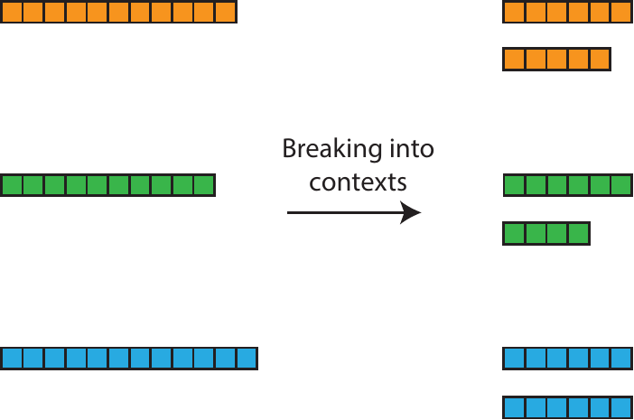
<figcaption>For <em>Individual</em> sequences relating to different students are split into contexts of length <span class="math inline"><em>c</em></span>. Each context is fed into the transformer as a separate datapoint.</figcaption>
</figure>
<figure>
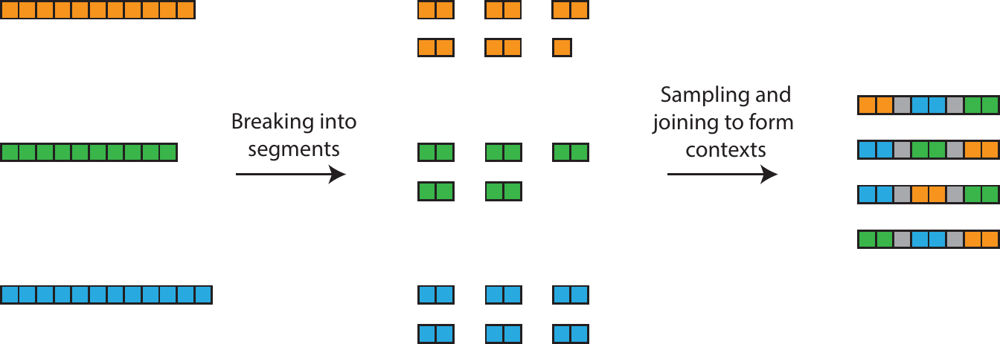
<figcaption>For <em>STUDY</em> we split sequences relating to students into segments of length <span class="math inline"><em>s</em></span>, <span class="math inline"><em>s</em> ≤ <em>c</em></span>. We then sample multiple chunks from different students in the same classroom. The sampled segments are then concatenated with separator tokens (shown in gray) in between them to form datapoints of at most length <span class="math inline"><em>c</em></span>. </figcaption>
</figure>
<figcaption>This figure details the preprocessing pipelines used for the two transformer models, with the pipeline for <em>Individual</em> shown in (a) and the pipeline for <em>STUDY</em> shown in (b)</figcaption>
</figure>

Additional preprocessing is applied for Individual and STUDY. For the Individual model we set a context window length $`c`$ and split students with interaction histories longer than $`c`$ items into separate data-points of at most length $`c`$. We took context length $`c=65`$ for the transformer models. This is necessary as although the vast majority of sequences in each data split (over 92%) are under 65 entries in length, there exists a long tail of sequences with very long length.

For STUDY slightly different processing is required. We first split the sequence associated with each student into *segments* of at most length $`s`$, $`s\leq c`$. Then we compose data-points of at most length $`c`$ by concatenating together multiple *segments* from multiple students in the same classroom separated with separator tokens. To compose a single data-point we sample multiple segments from students in the same classroom, while satisfying the constraints that overall length of each data-point is at most $`c`$ and that we do not sample more than one segment from a single student. In our final model we took $`s=c=65`$ Figure <a href="#fig:preprocessing" data-reference-type="ref" data-reference="fig:preprocessing">7</a> shows a diagram explaining these procedures.

# Experimental Details

In the following section we detail the choices of hyperparameters and the computational resources needed. For the KNN recommender we took K to be equal to 2. There were no further hyperparameters for the KNN recommender. The KNN recommender system had no training requirements, only preprocessing and inference, which we were able to run on the entire test split on a single machine with no GPU or TPU accelerators within a few hours. For STUDY, Individual and SAMN we used the Adam Optimizer with the following learning rate schedule
``` math
\alpha (s) = \begin{cases}
        \alpha_p  * s / W & 0 < s \leq W \\
        \frac{\alpha_p}{\sqrt{s - W}} & s > W
   \end{cases}
```

<div class="subtable">

0.5

<div id="table:hyperparams">

| **Individual**                  |                          |
|:--------------------------------|-------------------------:|
| Peak Learning Rate $`\alpha_p`$ |                   0.1024 |
| Warm up steps $`W`$             |                     1000 |
| Total steps                     |                     3500 |
| Batch Size                      |                  131,072 |
| Number of TPUs                  |                       32 |
| Run time                        | $`\sim`$<!-- -->12 hours |

This table shows hyperparameter values as well as computation resources for STUDY, Individual and SAMN.

</div>

<div id="table:hyperparams">

| **STUDY**                       |                          |
|:--------------------------------|-------------------------:|
| Peak Learning Rate $`\alpha_p`$ |                   0.1024 |
| Warm up steps $`W`$             |                     1000 |
| Total steps                     |                     3500 |
| Batch Size                      |                  131,072 |
| Number of TPUs                  |                       32 |
| Run time                        | $`\sim`$<!-- -->12 hours |

This table shows hyperparameter values as well as computation resources for STUDY, Individual and SAMN.

</div>

</div>

<div class="subtable">

0.5

<div id="table:hyperparams">

| **SAMN**                        |                         |
|:--------------------------------|------------------------:|
| Peak Learning Rate $`\alpha_p`$ |                  0.0128 |
| Warm up steps $`W`$             |                     350 |
| Total steps                     |                    3500 |
| Batch Size                      |                 524,288 |
| Number of TPUs                  |                      32 |
| Run time                        | $`\sim`$<!-- -->3 hours |

This table shows hyperparameter values as well as computation resources for STUDY, Individual and SAMN.

</div>

</div>

where $`\alpha(s)`$ is the learning rate at $`s^{th}`$ step, $`\alpha_p`$ is the peak learning rate and $`W`$ is the number of warm up steps. The $`\alpha_p`$ and batch size were tuned for each model individually. We used Google Cloud TPUs with the number of TPUs used shown along with the hyperparameter values in Table <a href="#table:hyperparams" data-reference-type="ref" data-reference="table:hyperparams">9</a> We note that we were able to obtain good results with our models using smaller batch sizes but opted for larger batch sizes for faster development iteration speed.

[^1]: We used the author’s repository <https://github.com/chenchongthu/SAMN> as a guideline. We found a discrepancy between this code and the method described in the paper, but it didn’t affect final performance.
