# Contrastive Difference Predictive Coding

## Abstract

Predicting and reasoning about the future lie at the heart of many time-series questions. For example, goal-conditioned reinforcement learning can be viewed as learning representations to predict which states are likely to be visited in the future. While prior methods have used contrastive predictive coding to model time series data, learning representations that encode long-term dependencies usually requires large amounts of data. In this paper, we introduce a temporal difference version of contrastive predictive coding that stitches together pieces of different time series data to decrease the amount of data required to learn predictions of future events. We apply this representation learning method to derive an off-policy algorithm for goal-conditioned RL. Experiments demonstrate that, compared with prior RL methods, ours achieves 2× median improvement in success rates and can better cope with stochastic environments. In tabular settings, we show that our method is about 20× more sample efficient than the successor representation and 1500× more sample efficient than the standard (Monte Carlo) version of contrastive predictive coding.

**Code**: <https://github.com/chongyi-zheng/td_infonce>  
**Website**: <https://chongyi-zheng.github.io/td_infonce>

# Introduction

R0.5

<embed src="figures/td_infonce.pdf" />

Learning representations is important for modeling high-dimensional time series data. Many applications of time-series modeling require representations that not only contain information about the contents of a particular observation, but also about how one observation relates to others that co-occur in time. Acquiring representations that encode temporal information is challenging, especially when attempting to capture long-term temporal dynamics: the frequency of long-term events may decrease with the time scale, meaning that learning longer-horizon dependencies requires larger quantities of data.

In this paper, we study contrastive representation learning on time series data – positive examples co-occur nearby in time, so the distances between learned representations should encode the likelihood of transiting from one representation to another. Building on prior work that uses the InfoNCE  loss to learn representations of time-series data effectively, we will aim to build a temporal difference version of this loss. Doing so allows us to optimize this objective with fewer samples, enables us to stitch together pieces of different time series data, and enables us to perform counterfactual reasoning – we should be able to estimate which representations we would have learned, if we had collected data in a different way. After a careful derivation, our resulting method can be interpreted as a non-parametric form of the successor representation , as shown in Fig. <a href="#fig:method" data-reference-type="ref" data-reference="fig:method">[fig:method]</a>.

The main contribution of this paper is a temporal difference estimator for InfoNCE. We then apply this estimator to develop a new algorithm for goal-conditioned RL. Experiments on both state-based and image-based benchmarks show that our algorithm outperforms prior methods, especially on the most challenging tasks. Additional experiments demonstrate that our method can handle stochasticity in the environment more effectively than prior methods. We also demonstrate that our algorithm can be effectively applied in the offline setting. Additional tabular experiments demonstrate that TD InfoNCE is up to 1500× more sample efficient than the standard Monte Carlo version of the loss and that it can effectively stitch together pieces of data.

# Related Work

This paper will study the problem of self-supervised RL, building upon prior methods on goal-condition RL, contrastive representation learning, and methods for predicting future state visitations. Our analysis will draw a connection between these prior methods, a connection which will ultimately result in a new algorithm for goal-conditioned RL. We discuss connections with unsupervised skill learning and mutual information in Appendix <a href="#appendix:mi" data-reference-type="ref" data-reference="appendix:mi">7</a>.

#### Goal-conditioned reinforcement learning.

Prior work has proposed many frameworks for learning goal-conditioned policies, including conditional supervised learning , actor-critic methods , semi-parametric planning , and distance metric learning . These methods have demonstrated impressive results on a range of tasks, including real-world robotic tasks . While some methods require manually-specified reward functions or distance functions, our work builds upon a self-supervised interpretation of goal-conditioned RL that casts this problem as predicting which states are likely to be visited in the future .

#### Contrastive representation learning.

Contrastive learning methods have become a key tool for learning representations in computer vision and NLP . These methods assign similar representations to positive examples and dissimilar representations to negative examples or outdated embeddings . The two main contrastive losses are based on binary classification (“NCE”) ranking loss (“InfoNCE”) . Modern contrastive learning methods typically employ the ranking-based objective to learn representations of images , text  and sequential data . Prior works have also provided theoretical analysis for these methods from the perspective of mutual information maximization , noise contrastive estimation , and the geometry of the learned representations . In the realm of RL, prior works have demonstrated that contrastive methods can provide effective reward functions and auxiliary learning objectives , and can also be used to formulate the goal-reaching problem in an entirely self-supervised manner . Our method will extend these results by building a temporal difference version of the “ranking”-based contrastive loss; this loss will enable us to use data from one policy to estimate which states a different policy will visit.

#### Temporal difference learning and successor representation.

Another line of work studies using temporal difference learning to predict states visited in the future, building upon successor representations and successor features . While learning successor representation using temporal difference bears a similarity to the typical Q-Learning algorithm  in the tabular setting, directly estimating this quantity is difficult with continuous states and actions . To lift this limitation, we will follow prior work  in predicting the successor representation indirectly: rather than learning a representation whose coordinates correspond to visitation probabilities, we will learn state representations such that their inner product corresponds to a visitation probability. Unlike prior methods, we will show how the common InfoNCE objective can be estimated in a temporal difference fashion, opening the door to off-policy reasoning and enabling our method to reuse historical data to improve data efficiency.

# Method

We start by introducing notation and prior approaches to the contrastive representation learning and the goal-conditioned RL problems. We then propose a new self-supervised actor-critic algorithm that we will use in our analysis.

## Preliminaries

We first review prior work in contrastive representation learning and goal-conditioned RL. Our method will use ideas from both.

#### Contrastive representation via InfoNCE.

Contrastive representation learning aims to learn a representation space, pushing representations of positive examples together and pushing representations of negative examples away. InfoNCE (also known as contrastive predictive coding)  is a widely used contrastive loss, which builds upon noise contrastive estimation (NCE) . Given the distribution of data *p*𝒳(*x*), *p*𝒴(*y*) over data *x* ∈ 𝒳, *y* ∈ 𝒴 and the conditional distribution of positive pairs *p*𝒴 ∣ 𝒳(*y*\|*x*) over 𝒳 × 𝒴, we sample *x* ∼ *p*𝒳(*x*), *y*(1) ∼ *p*𝒴 ∣ 𝒳(*y* ∣ *x*), and {*y*(2), ⋯, *y*(*N*)} ∼ *p*𝒴(*y*). The InfoNCE loss is defined as
$$\\begin{aligned}
    \\mathcal{L}\_{\\text{InfoNCE}}(f) \\triangleq  \\mathbb{E}\_{\\substack{x \\sim p\_{{\\mathcal{X}}}(x), y^{(1)} \\sim p\_{{\\mathcal{Y}}\\mid {\\mathcal{X}}}(y \\mid x) \\\\ y^{(2:N)} \\sim p\_{{\\mathcal{Y}}}(y)}} \\left\[ \\log \\frac{e^{f(x, y^{(1)})}}{ \\sum\_{i = 1}^N e^{f(x, y^{(i)})} } \\right\],
    \\label{eq:infonce}\\end{aligned}$$
where *f* : 𝒳 × 𝒴 ↦ ℝ is a parametric function. Following prior work , we choose to parameterize *f*(⋅, ⋅ ) via the inner product of representations of data *f*(*x*, *y*) = *ϕ*(*x*)⊤*ψ*(*y*), where *ϕ*( ⋅ ) and *ψ*( ⋅ ) map data to ℓ2 normalized vectors of dimension *d*. We will call *f* the *critic function* and *ϕ* and *ψ* the *contrastive representations*. The Bayes-optimal critic for the InfoNCE loss satisfies 
$$\\begin{aligned}
    \\exp \\left(f^{\\star}(x, y) \\right) = \\frac{p(y \\mid x)}{p(y) c(x)},\\end{aligned}$$
where *c*( ⋅ ) is an arbitrary function. We can estimate this arbitrary function using the optimal critic *f*⋆ by sampling multiple negative pairs from the data distribution:
$$\\begin{aligned}
    \\mathbb{E}\_{p(y)}\\left\[\\exp \\left( f^{\\star}(x, y) \\right) \\right\] = \\int \\cancel{p(y)} \\frac{p(y \\mid x)}{\\cancel{p(y)}c(x)} dy = \\frac{1}{c(x)} \\underbrace{\\int p(y \\mid x) dy}\_{ = 1} = \\frac{1}{c(x)}.
    \\label{eq:arbitrary-func-est}\\end{aligned}$$

#### Reinforcement learning and goal-conditioned RL.

We will consider a Markov decision process defined by states *s* ∈ 𝒮, actions *a* ∈ 𝒜, rewards *r* : 𝒮 × 𝒜 × 𝒮 ↦ ℝ. Using *Δ*( ⋅ ) denotes the probability simplex, we define an initial state distribution *p*0 : 𝒮 ↦ *Δ*(𝒮), discount factor *γ* ∈ (0, 1\], and dynamics *p* : 𝒮 × 𝒜 ↦ *Δ*(𝒮). Given a policy *π* : 𝒮 ↦ *Δ*(𝒜), we will use *p**t**π*(*s**t*+ ∣ *s*, *a*) to denote the probability density of reaching state *s**t*+ after exactly *t* steps, starting at state *s* and action *a* and then following the policy *π*(*a* ∣ *s*). We can then define the discounted state occupancy measure  starting from state *s* and action *a* as
$$\\begin{aligned}
    p^{\\pi}(s\_{t+} \\mid s, a) \\triangleq (1 - \\gamma) \\sum\_{t = 1}^{\\infty} \\gamma^{t - 1} p\_t^{\\pi}(s\_{t+} \\mid s, a).
    \\label{eq:discounted-state-occupancy-measure}\\end{aligned}$$
Prior work  have shown that this discounted state occupancy measure follows a recursive relationship between the density at the current time step and the future time steps:
$$\\begin{aligned}
    p^{\\pi}(s\_{t+} \\mid s, a) = (1 - \\gamma) p(s' = s\_{t+} \\mid s, a) + \\gamma \\mathbb{E}\_{\\substack{s' \\sim p(s' \\mid s, a) \\\\ a' \\sim \\pi(a' \\mid s')}} \\left\[ p^{\\pi}(s\_{t+} \\mid s', a') \\right\].
    \\label{eq:discounted-state-occupancy-measure-recurrence}\\end{aligned}$$
For goal-conditioned RL, we define goals *g* ∈ 𝒮 in the same space as states and consider a goal-conditioned policy *π*(*a* ∣ *s*, *g*) and the corresponding goal-conditioned discounted state occupancy measure *p**π*(*s**t*+ ∣ *s*, *a*, *g*). For evaluation, we will sample goals from a distribution *p**g* : 𝒮 ↦ *Δ*(𝒮). Following prior work , we define the objective of the goal-reaching policy as maximizing the probability of reaching desired goals under its discounted state occupancy measure while commanding the same goals:
$$\\begin{aligned}
    \\max\_{\\pi(\\cdot \\mid \\cdot, \\cdot)} \\mathbb{E}\_{p\_g(g),  p\_0(s), \\pi(a \\mid s, g)} \\left\[ p^{\\pi}(s\_{t+} = g \\mid s, a, g) \\right\].
    \\label{eq:policy-obj}\\end{aligned}$$
In tabular settings, this objective is the same as maximizing expected returns using a sparse reward function *r*(*s*, *a*, *s*′, *g*) = (1 − *γ*)*δ*(*s*′ = *g*) . Below, we review two strategies for estimating the discounted state occupancy measure. Our proposed method (Sec. <a href="#subsec:td-infonce" data-reference-type="ref" data-reference="subsec:td-infonce">3.2</a>) will combine the strengths of these methods while lifting their respective limitations.

#### Contrastive RL and C-Learning.

Our focus will be on using contrastive representation learning to build a new goal-conditioned RL algorithm, following a template set in prior work . These *contrastive RL* methods are closely related to the successor representation : they aim to learn representations whose inner products correspond to the likelihoods of reaching future states. Like the successor representation, representations from these contrastive RL methods can then be used to represent the Q function for any reward function . Prior work  has shown how both NCE and the InfoNCE losses can be used to derive Monte Carlo algorithms for estimating the discounted state occupancy measure. We review the Monte Carlo InfoNCE loss below. Given a policy *π*(*a* ∣ *s*), consider learning contrastive representations for a state and action pair *x* = (*s*, *a*) and a potential future state *y* = *s**t*+. We define the data distribution to be the joint distribution of state-action pairs *p*𝒳(*x*) = *p*(*s*, *a*) and the marginal distribution of future states *p*𝒴(*y*) = *p*(*s**t*+), representing either the distribution of a replay buffer (online) or the distribution of a dataset (offline). The conditional distribution of positive pairs is set to the discounted state occupancy measure for policy *π*, *p*𝒴 ∣ 𝒳(*y* ∣ *x*) = *p**π*(*s**t*+ ∣ *s*, *a*), resulting in a Monte Carlo (MC) estimator
$$\\begin{aligned}
    \\mathcal{L}\_{\\text{MC InfoNCE}}(f) = \\mathbb{E}\_{\\substack{(s, a) \\sim p(s, a), s\_{t+}^{(1)} \\sim p^{\\pi}(s\_{t+} \\mid s, a) \\\\ s\_{t+}^{(2:N)} \\sim p(s\_{t+})}} \\left\[ \\log \\frac{e^{f(s, a, s\_{t+}^{(1)})}}{ \\sum\_{i = 1}^N e^{f(s, a, s\_{t+}^{(i)})} } \\right\]
    \\label{eq:mc-infonce}\\end{aligned}$$
and an optimal critic function satisfying
$$\\begin{aligned}
    \\exp(f^{\\star}(s, a, s\_{t+})) = \\frac{p^{\\pi}(s\_{t+} \\mid s, a)}{p(s\_{t+}) c(s, a)}.
    \\label{eq:opt-critic}\\end{aligned}$$
This loss estimates the discounted state occupancy measure in a Monte Carlo manner. Computing this estimator usually requires sampling future states from the discounted state occupancy measure of the policy *π*, i.e., on-policy data. While, in theory, Monte Carlo estimator can be used in an off-policy manner by applying importance weights to correct actions, this estimator usually suffers from high variance and is potentially sample inefficient than temporal difference methods .

In the same way that temporal difference (TD) algorithms tend to be more sample efficient than Monte Carlo algorithms for reward maximization , we expect that TD contrastive methods are more sample efficient at estimating probability ratios than their Monte Carlo counterparts. Given that the InfoNCE tends to outperform the NCE objective in other machine learning disciplines, we conjecture that our TD InfoNCE objective will outperform the TD NCE objective  (see experiments in Appendix. <a href="#appendix:td-infonce-vs-c-learning" data-reference-type="ref" data-reference="appendix:td-infonce-vs-c-learning">10.3</a>).

## Temporal Difference InfoNCE

In this section, we derive a new loss for estimating the discounted state occupancy measure for a fixed policy. This loss will be a temporal difference variant of the InfoNCE loss. We will use **temporal difference InfoNCE (TD InfoNCE)** to refer to our loss function.

In the off-policy setting, we aim to estimate the discounted state occupancy measure of the policy *π* given a dataset of transitions 𝒟 = {(*s*,*a*,*s*′)*i*}*i* = 1*D* collected by another behavioral policy *β*(*a* ∣ *s*). This setting is challenging because we do not obtain samples from the discounted state occupancy measure of the target policy *π*. Addressing this challenge involves two steps: *(i)* expanding the MC estimator (Eq. <a href="#eq:mc-infonce" data-reference-type="ref" data-reference="eq:mc-infonce">[eq:mc-infonce]</a>) via the recursive relationship of the discounted state occupancy measure (Eq. <a href="#eq:discounted-state-occupancy-measure-recurrence" data-reference-type="ref" data-reference="eq:discounted-state-occupancy-measure-recurrence">[eq:discounted-state-occupancy-measure-recurrence]</a>), and *(ii)* estimating the expectation over the discounted state occupancy measure via importance sampling. We first use the identity from Eq. <a href="#eq:discounted-state-occupancy-measure-recurrence" data-reference-type="ref" data-reference="eq:discounted-state-occupancy-measure-recurrence">[eq:discounted-state-occupancy-measure-recurrence]</a> to express the MC InfoNCE loss as the sum of a next-state term and a future-state term:
$$\\begin{aligned}
     &\\mathbb{E}\_{\\substack{ (s, a) \\sim p(s, a) \\\\ s\_{t+}^{(2:N)} \\sim p(s\_{t+}) }} \\Bigg\[ (1 - \\gamma) \\underbrace{ \\mathbb{E}\_{s\_{t+}^{(1)} \\sim p(s' \\mid s, a)} \\left\[ \\log \\frac{ e^{ f(s, a, s\_{t+}^{(1)}) } }{\\sum\_{i = 1}^N e^{ f(s, a, s\_{t+}^{(i)}) }} \\right\]}\_{ \\mathcal{L}\_1(f) }  \\nonumber \\\\
    & \\hspace{6.5em} + \\gamma \\underbrace{ \\mathbb{E}\_{ \\substack{s' \\sim p(s' \\mid s, a), a' \\sim \\pi(a' \\mid s') \\\\ s\_{t+}^{(1)} \\sim p^{\\pi}(s\_{t+} \\mid s', a')}} \\left\[ \\log \\frac{ e^{ f(s, a, s\_{t+}^{(1)}) } }{\\sum\_{i = 1}^N e^{ f(s, a, s\_{t+}^{(i)}) }} \\right\] }\_{\\mathcal{L}\_2(f)} \\Bigg\].\\end{aligned}$$
While this estimate is similar to a TD target for Q-Learning , the second term requires sampling from the discounted state occupancy measure of policy *π*. To avoid this sampling, we next replace the expectation over *p**π*(*s**t*+ ∣ *s*′, *a*′) in ℒ2(*f*) by an importance weight,
$$\\begin{aligned}
    {\\mathcal{L}}\_2(f) &= \\mathbb{E}\_{ \\substack{s' \\sim p(s' \\mid s, a), a' \\sim \\pi(a' \\mid s') \\\\ s\_{t+}^{(1)} \\sim p(s\_{t+})}} \\left\[ \\frac{ p^{\\pi}(s\_{t+}^{(1)} \\mid s', a') }{p(s\_{t+}^{(1)})} \\log \\frac{ e^{ f(s, a, s\_{t+}^{(1)}) } }{\\sum\_{i = 1}^N e^{ f(s, a, s\_{t+}^{(i)}) }} \\right\].\\end{aligned}$$
If we could estimate the importance weight, then we could easily estimate this term by sampling from *p*(*s**t*+). We will estimate this importance weight by rearranging the expression for the optimal critic (Eq. <a href="#eq:opt-critic" data-reference-type="ref" data-reference="eq:opt-critic">[eq:opt-critic]</a>) and substituting our estimate for the normalizing constant *c*(*s*, *a*) (Eq. <a href="#eq:arbitrary-func-est" data-reference-type="ref" data-reference="eq:arbitrary-func-est">[eq:arbitrary-func-est]</a>):
$$\\begin{aligned}
    \\frac{ p^{\\pi}(s\_{t+}^{(1)} \\mid s, a) }{p(s\_{t+}^{(1)})} &=  c(s, a) \\cdot \\exp \\left(f^\\star(s, a, s\_{t+}^{(1)}) \\right) = \\frac{e^{f^{\\star}(s, a, s\_{t+}^{(1)})} }{\\mathbb{E}\_{p(s\_{t+})}\\left\[e^{f^{\\star}(s, a, s\_{t+})}\\right\]}.\\end{aligned}$$
We will use *w*(*s*, *a*, *s**t*+(1 : *N*)) to denote our estimate of this, using *f* in place of *f*⋆ and using a finite-sample estimate of the expectation in the denominator:
$$\\begin{aligned}
    w(s, a, s\_{t+}^{(1:N)}) \\triangleq \\frac{e^{f(s, a, s\_{t+}^{(1)}) }}{ \\frac{1}{N}\\sum\_{i = 1}^N e^{ f(s, a, s\_{t+}^{(i)}) } }
    \\label{eq:importance-weight}\\end{aligned}$$
This weight accounts for the effect of the discounted state occupancy measure of the target policy. Additionally, it corresponds to the categorical classifier that InfoNCE produces (without constant *N*). Taken together, we can now substitute the importance weight in ℒ2(*f*) with our estimate in Eq. <a href="#eq:importance-weight" data-reference-type="ref" data-reference="eq:importance-weight">[eq:importance-weight]</a>, yielding a temporal difference (TD) InfoNCE estimator
$$\\begin{aligned}
    \\mathcal{L}\_{\\text{TD InfoNCE}}(f) &\\triangleq \\mathbb{E}\_{\\substack{ (s, a) \\sim p(s, a) \\\\ s\_{t+}^{(2:N)} \\sim p(s\_{t+}) }} \\left\[ (1 - \\gamma) \\mathbb{E}\_{s\_{t+}^{(1)} \\sim p(s' \\mid s, a)} \\left\[ \\log \\frac{ e^{ f(s, a, s\_{t+}^{(1)}) } }{\\sum\_{i = 1}^N e^{ f(s, a, s\_{t+}^{(i)}) }} \\right\] \\right. \\nonumber \\\\
    & \\hspace{3em} \\left. + \\gamma \\mathbb{E}\_{ \\substack{s' \\sim p(s' \\mid s, a) \\\\ a' \\sim \\pi(a' \\mid s') \\\\ s\_{t+}^{(1)} \\sim p(s\_{t+}) }} \\left\[ \\lfloor w(s', a', s\_{t+}^{(1:N)}) \\rfloor\_{\\text{sg}} \\log \\frac{ e^{ f(s, a, s\_{t+}^{(1)}) } }{\\sum\_{i = 1}^N e^{ f(s, a, s\_{t+}^{(i)}) }} \\right\] \\right\],
    \\label{eq:td-infonce}\\end{aligned}$$
where ⌊ ⋅ ⌋sg indicates the gradient of the importance weight should not affect the gradient of the entire objective. As shown in Fig. <a href="#fig:method" data-reference-type="ref" data-reference="fig:method">[fig:method]</a>, we can interpret the first term as pulling together the representations of the current state-action pair *ϕ*(*s*, *a*) and the next state *ψ*(*s*′); the second term pulls the representations at the current step *ϕ*(*s*, *a*) similar to the (weighted) predictions from the future state *ψ*(*s**t*+). Importantly, the TD InfoNCE estimator is equivalent to the MC InfoNCE estimator for the optimal critic function: ℒTD InfoNCE(*f*⋆) = ℒMC InfoNCE(*f*⋆).

#### Convergence and connections.

In Appendix <a href="#appendix:theoretical-analysis" data-reference-type="ref" data-reference="appendix:theoretical-analysis">6</a>, we prove that optimizing a variant of the TD InfoNCE objective is equivalent to perform one step policy evaluation with a new Bellman operator; thus, repeatedly optimizing this objective yields the correct discounted state occupancy measure. This analysis considers the tabular setting and assumes that the denominators of the softmax functions and *w* in Eq. <a href="#eq:td-infonce" data-reference-type="ref" data-reference="eq:td-infonce">[eq:td-infonce]</a> are computed using an exact expectation. We discuss the differences between TD InfoNCE and C-learning  (a temporal difference estimator of the NCE objective) in Appendix <a href="#appendix:td-infonce-vs-c-learning" data-reference-type="ref" data-reference="appendix:td-infonce-vs-c-learning">10.3</a>. Appendix <a href="#appendix:sr" data-reference-type="ref" data-reference="appendix:sr">8</a> discusses how TD InfoNCE corresponds to a nonparametric variant of the successor representation.

## Goal-conditioned Policy Learning

The TD InfoNCE method provides a way for estimating the discounted state occupancy measure. This section shows how this estimator can be used to derive a new algorithm for goal-conditioned RL. This algorithm will alternate between *(1)* estimating the occupancy measure using the TD InfoNCE objective and *(2)* optimizing the policy to maximize the likelihood of the desired goal under the estimated occupancy measure. Pseudo-code is shown in Algorithm <a href="#alg:td-infonce" data-reference-type="ref" data-reference="alg:td-infonce">[alg:td-infonce]</a>, and additional details are in Appendix <a href="#appendix:implementation" data-reference-type="ref" data-reference="appendix:implementation">9.1</a>, and code is available online. [1]

contrastive representations *ϕ**θ* and *ψ**θ*, target representations *ϕ**θ̄* and *ψ**θ̄*, and goal-conditioned policy *π**ω*. Sample {(*s**t*(*i*), *a**t*(*i*), *s**t* + 1(*i*), *g*(*i*), *s**t*+(*i*))}*i* = 1*N* ∼ replay buffer / dataset, *a*(*i*) ∼ *π*(*a* ∣ *s**t*(*i*), *g*(*i*)). Compute *F*next, *F*future, *F*goal using *ϕ**θ* and *ψ**θ*. Compute *F̄**w* using *ϕ**θ̄* and *ψ**θ̄*. $W \\leftarrow N \\cdot \\texttt{stop\\\_grad} \\left(\\textsc{SoftMax}(\\bar{F}\_{w}) \\right)$ ℒ(*θ*) ← (1 − *γ*)𝒞ℰ(logits = *F*next, labels = *I**N*) + *γ*𝒞ℰ(logits = *F*future, labels = *W*) ℒ(*ω*) ← 𝒞ℰ(logits = *F*goal, labels = *I**N*) Update *θ*, *ω* by taking gradients of ℒ(*θ*), ℒ(*ω*). Update *θ̄* using an exponential moving average. *ϕ**θ*, *ψ**θ*, and *π**ω*.

While our TD InfoNCE loss in Sec. <a href="#subsec:td-infonce" data-reference-type="ref" data-reference="subsec:td-infonce">3.2</a> estimates the discounted state occupancy measure for policy *π*(*a* ∣ *s*), we can extend it to the goal-conditioned setting by replacing *π*(*a* ∣ *s*) with *π*(*a* ∣ *s*, *g*) and *f*(*s*, *a*, *s**t*+) with *f*(*s*, *a*, *g*, *s**t*+), resulting in a goal-conditioned TD InfoNCE estimator. This goal-conditioned TD InfoNCE objective estimates the discounted state occupancy measure of *any* future state for a goal-conditioned policy commanding *any* goal. Recalling that the discounted state occupancy measure corresponds to the Q function , the policy objective is to select actions that maximize the likelihood of the commanded goal:
$$\\begin{aligned}
    &\\mathbb{E}\_{\\substack{p\_g(g),  p\_0(s) \\\\ \\pi(a\_0 \\mid s, g)}} \\left\[ \\log p^{\\pi}(s\_{t+} = g \\mid s, a, g) \\right\] = \\mathbb{E}\_{\\substack{ g \\sim p\_g(g), s \\sim p\_0(s) \\\\ a\_0 \\sim \\pi(a \\mid s, g), s\_{t+}^{(1:N)} \\sim p(s\_{t+}) }} \\left\[ \\log \\frac{e^{f^{\\star}(s, a, g, s\_{t+} = g )}}{ \\sum\_{i = 1}^N e^{ f^{\\star}(s, a, g, s\_{t+}^{(i)}) } } \\right\].
    \\label{eq:actor-loss}\\end{aligned}$$
In practice, we optimize both the critic function and the policy for one gradient step iteratively, using our estimated *f* in place of *f*⋆.

# Experiments

Our experiments start with comparing goal-conditioned TD InfoNCE to prior goal-conditioned RL approaches on both online and offline goal-conditioned RL (GCRL) benchmarks. We then analyze the properties of the critic function and the policy learned by this method. Visualizing the representations learned by TD InfoNCE reveals that linear interpolation corresponds to a form of planning. Appendix <a href="#appendix:td-infonce-vs-c-learning" data-reference-type="ref" data-reference="appendix:td-infonce-vs-c-learning">10.3</a> ablates the difference between TD InfoNCE and a prior temporal difference method based on NCE. All experiments show means and standard deviations over five random seeds.

## Comparing to Prior Goal-conditioned RL methods

We compare TD InfoNCE to four baselines on an online GCRL benchmark  containing four manipulation tasks for the Fetch robot. The observations and goals of those tasks can be either a state of the robot and objects or a 64 × 64 RGB image. We will evaluate using both versions. The first baseline, Quasimetric Reinforcement Learning (QRL) , is a state-of-the-art approach that uses quasimetric models to learn the optimal goal-conditioned value functions and the corresponding policies. The second baseline is contrastive RL , which estimates the discounted state occupancy measure using ℒMC InfoNCE (Eq. <a href="#eq:mc-infonce" data-reference-type="ref" data-reference="eq:mc-infonce">[eq:mc-infonce]</a>). Our third baseline is a variant of contrastive RL  using binary NCE loss. We call this method contrastive RL (NCE). The fourth baseline is the goal-conditioned behavioral cloning (GCBC) . We also include a comparison with an off-the-shelf actor-critic algorithm augmented with hindsight relabeling  to learn a goal-conditioned policy (DDPG + HER).

<figure>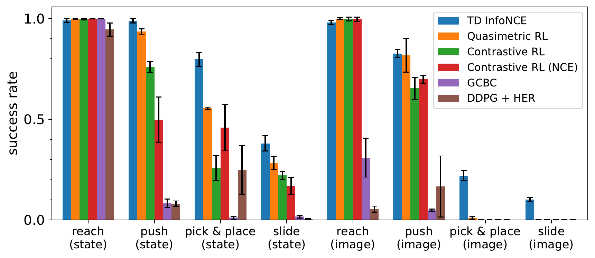<figcaption aria-hidden="true">Fetch robotics benchmark from </figcaption></figure>

<figure>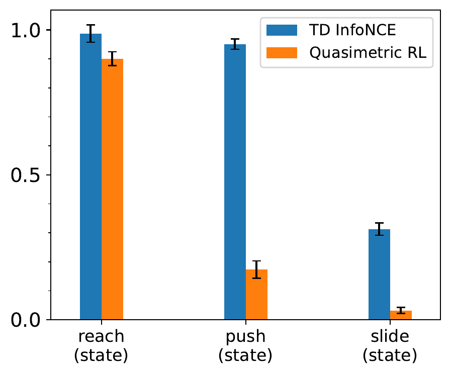<figcaption aria-hidden="true">Stochastic tasks.</figcaption></figure>

We report results in Fig. <a href="#fig:online-eval-bar" data-reference-type="ref" data-reference="fig:online-eval-bar">1</a>, and defer the full learning curves to Appendix Fig. <a href="#fig:online-eval" data-reference-type="ref" data-reference="fig:online-eval">[fig:online-eval]</a>. These results show that TD InfoNCE matches or outperforms other baselines on all tasks, both for state and image observations. On those more challenging tasks (`pick & place (state / image)` and `slide (state / image)`), TD InfoNCE achieves a 2× median improvement relative to the strongest baseline (Appendix Fig. <a href="#fig:online-eval" data-reference-type="ref" data-reference="fig:online-eval">[fig:online-eval]</a>). On the most challenging tasks, image-based `pick & place` and `slide`, TD InfoNCE is the only method achieving non-negligible success rates. For those tasks where the success rate fails to separate different methods significantly (e.g., `slide (state)` and `push (image)`), we include comparisons using minimum distances of the gripper or the object to the goal over an episode in Appendix Fig. <a href="#fig:online-eval-dist" data-reference-type="ref" data-reference="fig:online-eval-dist">[fig:online-eval-dist]</a>. We speculate this observation is because TD InfoNCE estimates the discounted state occupancy measure more accurately, a hypothesis we will investigate in Sec. <a href="#subsec:critic-pred-acc" data-reference-type="ref" data-reference="subsec:critic-pred-acc">4.3</a>.

Among those baselines, QRL is the strongest one. Unlike TD InfoNCE, the derivation of QRL assumes the dynamics are deterministic. This difference motivates us to study whether TD InfoNCE continues achieving high success rates in environments with stochastic noise. To study this, we compare TD InfoNCE to QRL on a variant of the Fetch benchmark where observations are corrupted with probability 0.1. As shown in Fig. <a href="#fig:online-eval-stochastic-bar" data-reference-type="ref" data-reference="fig:online-eval-stochastic-bar">2</a>, TD InfoNCE maintains high success rates while the performance of QRL decreases significantly, suggesting that TD InfoNCE can better cope with stochasticity in the environment.

## Evaluation on Offline Goal Reaching

|                   |   TD InfoNCE   |      QRL       | Contrastive RL | GCBC |  DT  |   IQL    | TD3 + BC |
|:-----------------:|:--------------:|:--------------:|:--------------:|:----:|:----:|:--------:|:--------:|
|     umaze-v2      |   84.9 ± 1.2   |   76.8 ± 2.3   |   79.8 ± 1.6   | 65.4 | 65.6 | **87.5** |   78.6   |
| umaze-diverse-v2  | **91.7 ± 1.3** |   80.1 ± 1.3   |   77.6 ± 2.8   | 60.9 | 51.2 |   62.2   |   71.4   |
|  medium-play-v2   | **86.8 ± 1.7** |   76.5 ± 2.1   |   72.6 ± 2.9   | 58.1 | 1.0  |   71.2   |   10.6   |
| medium-diverse-v2 | **82.0 ± 3.4** |   73.4 ± 1.9   |   71.5 ± 1.3   | 67.3 | 0.6  |   70.0   |   3.0    |
|   large-play-v2   |   47.0 ± 2.5   | **52.9 ± 2.8** |   48.6 ± 4.4   | 32.4 | 0.0  |   39.6   |   0.2    |
| large-diverse-v2  | **55.6 ± 3.6** |   51.5 ± 3.8   | **54.1 ± 5.5** | 36.9 | 0.2  |   47.5   |   0.0    |

Evaluation on offline D4RL AntMaze benchmarks.

We next study whether the good performance of TD InfoNCE transfers to the setting without any interaction with the environment (i.e., offline RL). We evaluate on AntMaze tasks from the D4RL benchmark . The results in Table <a href="#tab:offline-eval" data-reference-type="ref" data-reference="tab:offline-eval">1</a> show that TD InfoNCE outperforms most baselines on most tasks. See Appendix <a href="#appendix:offline-details" data-reference-type="ref" data-reference="appendix:offline-details">9.3</a> for details.

## Accuracy of the estimated discounted state occupancy measure

<embed src="figures/critic_analysis/p_future_est_errs_v2.pdf" />

This section tests the hypothesis that our TD InfoNCE loss will be more accurate and sample efficient than alternative Monte Carlo methods (namely, contrastive RL ) in predicting the discounted state occupancy measure. We will use the tabular setting so that we can get a ground truth estimate. We compare TD InfoNCE to three baselines. Successor representations  can also be learned in a TD manner, though can be challenging to apply beyond tabular settings. C-learning is similar to TD InfoNCE in that it uses a temporal difference method to optimize a contrastive loss, but differs in using a binary cross entropy loss instead of a softmax cross entropy loss. Contrastive RL is the MC counterpart of TD InfoNCE. We design a 5 × 5 gridworld with 125 states and 5 actions (up, down, left, right, and no-op) and collect 100K transitions using a uniform random policy, $\\mu(a \\mid s) = \\textsc{Unif}({\\mathcal{A}})$. We evaluate each method by measuring the absolute error between the predicted probability *p̂* and the ground truth probability *p**μ*, averaging over all pairs of (*s*, *a*, *s**t*+):
$$\\begin{aligned}
    \\frac{1}{ \\lvert {\\mathcal{S}}\\rvert \\lvert {\\mathcal{A}}\\rvert \\lvert {\\mathcal{S}}\\rvert} \\sum\_{s, a, s\_{t+}} \\abs{ \\hat{p}(s\_{t+} \\mid s, a) - p^{\\mu}(s\_{t+} \\mid s, a)}.\\end{aligned}$$
For the three TD methods, we compute the TD target in a SARSA manner . For those methods estimating a probability ratio, we convert the prediction to a probability by multiplying by the empirical state marginal. Results in Fig. <a href="#fig:discounted-state-occupancy-measure-est-errs" data-reference-type="ref" data-reference="fig:discounted-state-occupancy-measure-est-errs">[fig:discounted-state-occupancy-measure-est-errs]</a> show that TD methods achieve lower errors than the Monte Carlo method, while TD InfoNCE converges faster than C-Learning. Appendix <a href="#appendix:critic-pred-acc-full" data-reference-type="ref" data-reference="appendix:critic-pred-acc-full">10.2</a> discusses why all methods plateau above zero.

Our next experiments studies sample efficiency. We hypothesize that the softmax in the TD InfoNCE loss may provide more learning signal than alternative methods, allowing it to achieve lower error on a fixed budget of data. To test this hypothesis, we run experiments with dataset sizes from 1K to 10M on the same gridworld, comparing TD InfoNCE to the same set of baselines. We report results in Fig. <a href="#fig:discounted-state-occupancy-measure-est-errs" data-reference-type="ref" data-reference="fig:discounted-state-occupancy-measure-est-errs">[fig:discounted-state-occupancy-measure-est-errs]</a> with errors showing one standard deviation after training for 50K gradient steps for each approach. These results suggest that methods based on temporal difference learning predict more accurately than Monte Carlo method when provided with the same amount of data. Compared with its Monte Carlo counterpart, TD InfoNCE is 1500× more sample efficient (6.5 × 103 vs 107 transitions). Compared with the only other TD method applicable in continuous settings (C-learning), TD InfoNCE can achieve a comparable loss with 130× less data (7.7 × 104 vs 107 transitions). Even compared with the strongest baseline (successor representations), which makes assumptions (tabular MDPs) that our method avoids, TD InfoNCE can achieve a comparable error rate with almost 20× fewer samples (5.2 × 105 vs 107 transitions).

## Does TD InfoNCE enable off-policy reasoning?

<figure>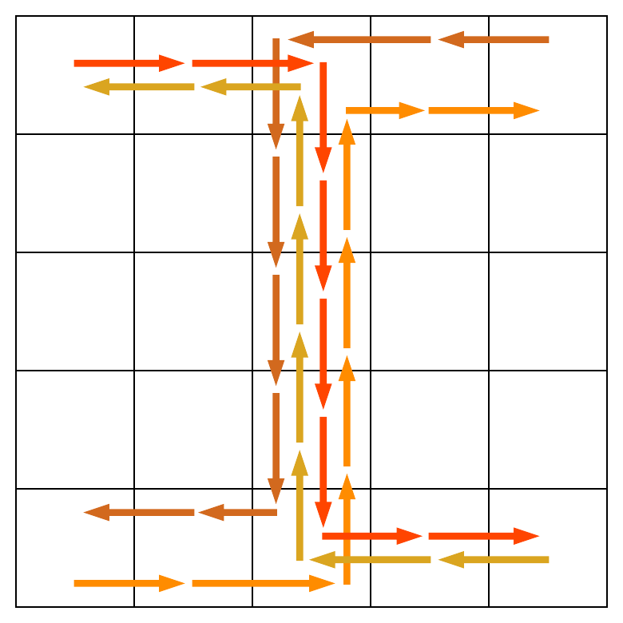<figcaption aria-hidden="true">Dataset</figcaption></figure>

<figure>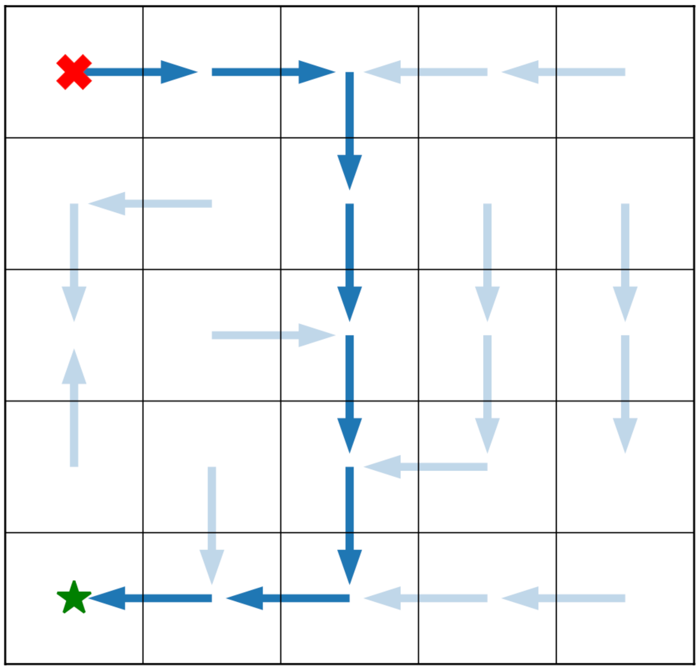<figcaption aria-hidden="true">TD InfoNCE</figcaption></figure>

<figure>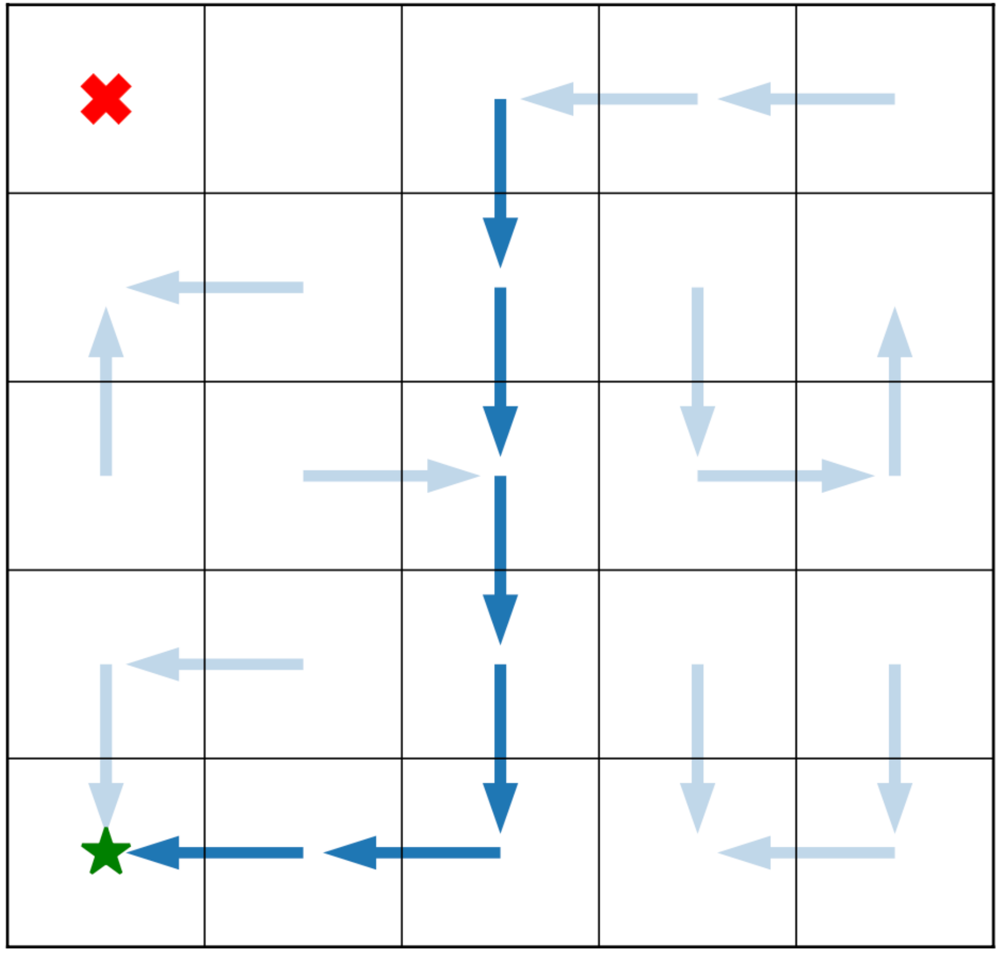<figcaption aria-hidden="true">Contrastive RL</figcaption></figure>

<figure>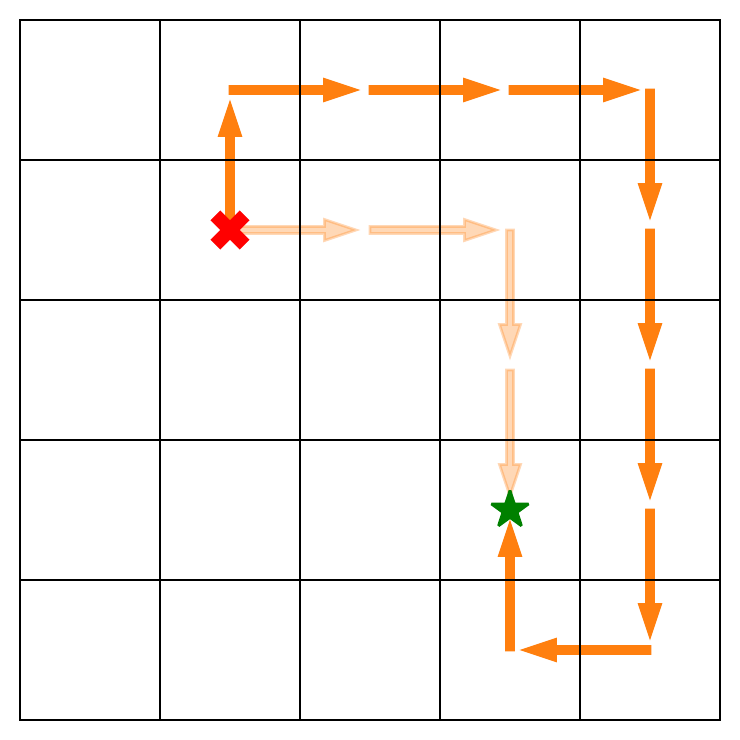<figcaption aria-hidden="true">Dataset</figcaption></figure>

<figure>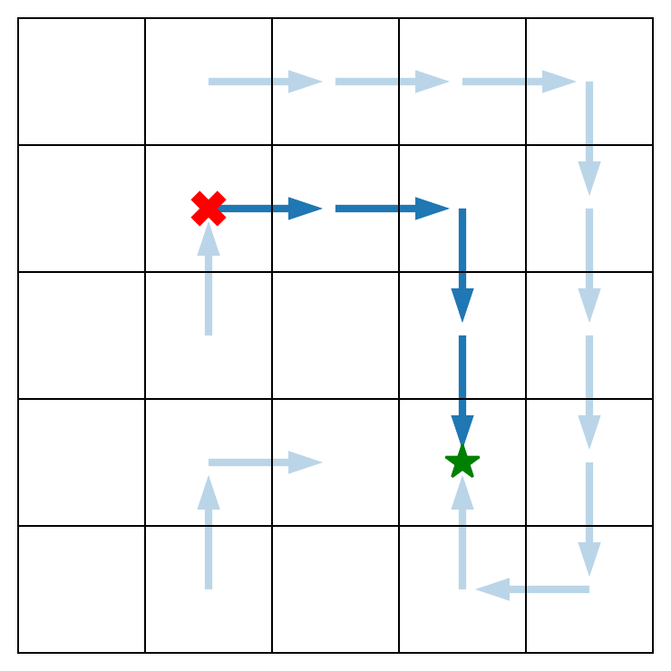<figcaption aria-hidden="true">TD InfoNCE</figcaption></figure>

<figure>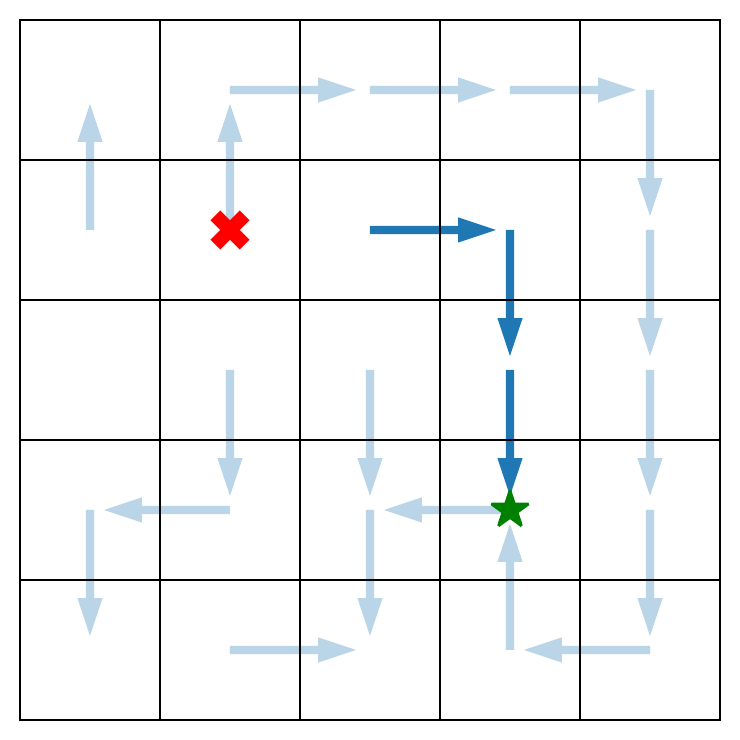<figcaption aria-hidden="true">Contrastive RL</figcaption></figure>

The explicit temporal difference update (Eq. <a href="#eq:td-infonce" data-reference-type="ref" data-reference="eq:td-infonce">[eq:td-infonce]</a>) in TD InfoNCE is similar to the standard Bellman backup, motivating us to study whether the resulting goal-conditioned policy is capable of performing dynamic programming with offline data. To answer these questions, we conduct two experiments on the same gridworld environment as in Sec. <a href="#subsec:critic-pred-acc" data-reference-type="ref" data-reference="subsec:critic-pred-acc">4.3</a>, comparing TD InfoNCE to contrastive RL (i.e., Monte Carlo InfoNCE). Fig. <a href="#fig:stitching-property" data-reference-type="ref" data-reference="fig:stitching-property">[fig:stitching-property]</a> shows that TD InfoNCE successfully stitches together pieces of different trajectories to find a route between unseen (state, goal) pairs. Fig. <a href="#fig:searching-shotcut" data-reference-type="ref" data-reference="fig:searching-shotcut">[fig:searching-shotcut]</a> shows that TD InfoNCE can perform off-policy reasoning, finding a path that is shorter than the average path demonstrated in the dataset. See Appendix <a href="#appendix:off-policy" data-reference-type="ref" data-reference="appendix:off-policy">9.4</a> for details.

# Conclusion

This paper introduced a temporal difference estimator for the InfoNCE loss. Our goal-conditioned RL algorithm based on this estimator outperforms prior methods in both online and offline settings, and is capable of handling stochasticity in the environment dynamics. While we focused on a specific type of RL problem (goal-conditioned RL), in principle the TD InfoNCE estimator can be used to drive policy evaluation for arbitrary reward functions. One area for future work is to determine how it compares to prior off-policy evaluation techniques.

While we focused on evaluating the TD InfoNCE estimator on control tasks, it is worth noting that the MC InfoNCE objective has been previously applied to NLP, audio, video settings; one intriguing and important question is whether the benefits of TD learning seen on these control tasks translate into better representations in these other domains.

#### Limitations.

One limitation of TD InfoNCE is complexity: compared with its Monte Carlo counterpart, ours is more complex and requires more hyperparameters. It is worth noting that even TD InfoNCE struggles to solve the most challenging control tasks with image observations. On the theoretical front, our convergence proof uses a slightly modified version of our loss (replacing a sum with an expectation), which would be good to resolve in future work.

#### Acknowledgements

We thank Ravi Tej and Wenzhe Li for discussions about this work, and anonymous reviewers for providing feedback on early versions of this work. We thank Tongzhou Wang for providing performance of baselines in online GCRL experiments and thank Raj Ghugare for sharing code of environment implementation. We thank Vivek Myers for finding issues in the code. BE is supported by the Fannie and John Hertz Foundation.

97 urlstyle

Alekh Agarwal, Nan Jiang, Sham M Kakade, and Wen Sun. Reinforcement learning: Theory and algorithms. *CS Dept., UW Seattle, Seattle, WA, USA, Tech. Rep*, 32, 2019.

Marcin Andrychowicz, Filip Wolski, Alex Ray, Jonas Schneider, Rachel Fong, Peter Welinder, Bob McGrew, Josh Tobin, OpenAI Pieter Abbeel, and Wojciech Zaremba. Hindsight experience replay. *Advances in neural information processing systems*, 30, 2017.

Sanjeev Arora, Hrishikesh Khandeparkar, Mikhail Khodak, Orestis Plevrakis, and Nikunj Saunshi. A theoretical analysis of contrastive unsupervised representation learning. In *36th International Conference on Machine Learning, ICML 2019*, pp. 9904–9923. International Machine Learning Society (IMLS), 2019.

André Barreto, Will Dabney, Rémi Munos, Jonathan J Hunt, Tom Schaul, Hado P van Hasselt, and David Silver. Successor features for transfer in reinforcement learning. *Advances in neural information processing systems*, 30, 2017.

André Barreto, Diana Borsa, Shaobo Hou, Gheorghe Comanici, Eser Aygün, Philippe Hamel, Daniel Toyama, Shibl Mourad, David Silver, Doina Precup, et al. The option keyboard: Combining skills in reinforcement learning. *Advances in Neural Information Processing Systems*, 32, 2019.

Dimitri P Bertsekas and John N Tsitsiklis. Neuro-dynamic programming: an overview. In *Proceedings of 1995 34th IEEE conference on decision and control*, volume 1, pp. 560–564. IEEE, 1995.

Léonard Blier, Corentin Tallec, and Yann Ollivier. Learning successor states and goal-dependent values: A mathematical viewpoint. *arXiv preprint arXiv:2101.07123*, 2021.

James Bradbury, Roy Frostig, Peter Hawkins, Matthew James Johnson, Chris Leary, Dougal Maclaurin, George Necula, Adam Paszke, Jake VanderPlas, Skye Wanderman-Milne, et al. Jax: composable transformations of python+ numpy programs. .

Vı́ctor Campos, Alexander Trott, Caiming Xiong, Richard Socher, Xavier Giró-i Nieto, and Jordi Torres. Explore, discover and learn: Unsupervised discovery of state-covering skills. In *International Conference on Machine Learning*, pp. 1317–1327. PMLR, 2020.

Elliot Chane-Sane, Cordelia Schmid, and Ivan Laptev. Goal-conditioned reinforcement learning with imagined subgoals. In *International Conference on Machine Learning*, pp. 1430–1440. PMLR, 2021.

Lili Chen, Kevin Lu, Aravind Rajeswaran, Kimin Lee, Aditya Grover, Misha Laskin, Pieter Abbeel, Aravind Srinivas, and Igor Mordatch. Decision transformer: Reinforcement learning via sequence modeling. *Advances in neural information processing systems*, 34: 15084–15097, 2021.

Ting Chen, Simon Kornblith, Mohammad Norouzi, and Geoffrey Hinton. A simple framework for contrastive learning of visual representations. In *International conference on machine learning*, pp. 1597–1607. PMLR, 2020.

Jongwook Choi, Archit Sharma, Honglak Lee, Sergey Levine, and Shixiang Shane Gu. Variational empowerment as representation learning for goal-conditioned reinforcement learning. In *International Conference on Machine Learning*, pp. 1953–1963. PMLR, 2021.

Sumit Chopra, Raia Hadsell, and Yann LeCun. Learning a similarity metric discriminatively, with application to face verification. In *2005 IEEE computer society conference on computer vision and pattern recognition (CVPR’05)*, volume 1, pp. 539–546. IEEE, 2005.

Peter Dayan. Improving generalization for temporal difference learning: The successor representation. *Neural computation*, 5 (4): 613–624, 1993.

Yiming Ding, Carlos Florensa, Pieter Abbeel, and Mariano Phielipp. Goal-conditioned imitation learning. *Advances in neural information processing systems*, 32, 2019.

A Dubi and YS Horowitz. The interpretation of conditional monte carlo as a form of importance sampling. *SIAM Journal on Applied Mathematics*, 36 (1): 115–122, 1979.

Ishan Durugkar, Mauricio Tec, Scott Niekum, and Peter Stone. Adversarial intrinsic motivation for reinforcement learning. *Advances in Neural Information Processing Systems*, 34: 8622–8636, 2021.

Scott Emmons, Benjamin Eysenbach, Ilya Kostrikov, and Sergey Levine. Rvs: What is essential for offline rl via supervised learning? In *International Conference on Learning Representations*, 2021.

Damien Ernst, Pierre Geurts, and Louis Wehenkel. Tree-based batch mode reinforcement learning. *Journal of Machine Learning Research*, 6, 2005.

Benjamin Eysenbach, Abhishek Gupta, Julian Ibarz, and Sergey Levine. Diversity is all you need: Learning skills without a reward function. *arXiv preprint arXiv:1802.06070*, 2018.

Benjamin Eysenbach, Ruslan Salakhutdinov, and Sergey Levine. Search on the replay buffer: Bridging planning and reinforcement learning. *Advances in Neural Information Processing Systems*, 32, 2019.

Benjamin Eysenbach, Ruslan Salakhutdinov, and Sergey Levine. C-learning: Learning to achieve goals via recursive classification. *arXiv preprint arXiv:2011.08909*, 2020.

Benjamin Eysenbach, Tianjun Zhang, Sergey Levine, and Russ R Salakhutdinov. Contrastive learning as goal-conditioned reinforcement learning. *Advances in Neural Information Processing Systems*, 35: 35603–35620, 2022.

Kuan Fang, Patrick Yin, Ashvin Nair, and Sergey Levine. Planning to practice: Efficient online fine-tuning by composing goals in latent space. In *2022 IEEE/RSJ International Conference on Intelligent Robots and Systems (IROS)*, pp. 4076–4083. IEEE, 2022.

Kuan Fang, Patrick Yin, Ashvin Nair, Homer Rich Walke, Gengchen Yan, and Sergey Levine. Generalization with lossy affordances: Leveraging broad offline data for learning visuomotor tasks. In *Conference on Robot Learning*, pp. 106–117. PMLR, 2023.

Justin Fu, Aviral Kumar, Matthew Soh, and Sergey Levine. Diagnosing bottlenecks in deep q-learning algorithms. In *International Conference on Machine Learning*, pp. 2021–2030. PMLR, 2019.

Justin Fu, Aviral Kumar, Ofir Nachum, George Tucker, and Sergey Levine. D4rl: Datasets for deep data-driven reinforcement learning. *arXiv preprint arXiv:2004.07219*, 2020.

Scott Fujimoto and Shixiang Shane Gu. A minimalist approach to offline reinforcement learning. *Advances in neural information processing systems*, 34: 20132–20145, 2021.

Tianyu Gao, Xingcheng Yao, and Danqi Chen. Simcse: Simple contrastive learning of sentence embeddings. In *2021 Conference on Empirical Methods in Natural Language Processing, EMNLP 2021*, pp. 6894–6910. Association for Computational Linguistics (ACL), 2021.

Samuel J Gershman. The successor representation: its computational logic and neural substrates. *Journal of Neuroscience*, 38 (33): 7193–7200, 2018.

Dibya Ghosh, Abhishek Gupta, Ashwin Reddy, Justin Fu, Coline Manon Devin, Benjamin Eysenbach, and Sergey Levine. Learning to reach goals via iterated supervised learning. In *International Conference on Learning Representations*, 2020.

Michael B Giles. Multilevel monte carlo methods. *Acta numerica*, 24: 259–328, 2015.

Karol Gregor, Danilo Jimenez Rezende, and Daan Wierstra. Variational intrinsic control. *arXiv preprint arXiv:1611.07507*, 2016.

Jean-Bastien Grill, Florian Strub, Florent Altché, Corentin Tallec, Pierre Richemond, Elena Buchatskaya, Carl Doersch, Bernardo Avila Pires, Zhaohan Guo, Mohammad Gheshlaghi Azar, et al. Bootstrap your own latent-a new approach to self-supervised learning. *Advances in neural information processing systems*, 33: 21271–21284, 2020.

Abhishek Gupta, Vikash Kumar, Corey Lynch, Sergey Levine, and Karol Hausman. Relay policy learning: Solving long-horizon tasks via imitation and reinforcement learning. In *Conference on Robot Learning*, pp. 1025–1037. PMLR, 2020.

Michael Gutmann and Aapo Hyvärinen. Noise-contrastive estimation: A new estimation principle for unnormalized statistical models. In *Proceedings of the thirteenth international conference on artificial intelligence and statistics*, pp. 297–304. JMLR Workshop and Conference Proceedings, 2010.

JM Hammersley. Conditional monte carlo. *Journal of the ACM (JACM)*, 3 (2): 73–76, 1956.

Philippe Hansen-Estruch, Amy Zhang, Ashvin Nair, Patrick Yin, and Sergey Levine. Bisimulation makes analogies in goal-conditioned reinforcement learning. In *International Conference on Machine Learning*, pp. 8407–8426. PMLR, 2022.

Kaiming He, Xinlei Chen, Saining Xie, Yanghao Li, Piotr Dollár, and Ross Girshick. Masked autoencoders are scalable vision learners. In *Proceedings of the IEEE/CVF conference on computer vision and pattern recognition*, pp. 16000–16009, 2022.

Olivier Henaff. Data-efficient image recognition with contrastive predictive coding. In *International conference on machine learning*, pp. 4182–4192. PMLR, 2020.

Jonathan Ho and Stefano Ermon. Generative adversarial imitation learning. *Advances in neural information processing systems*, 29, 2016.

Michael Janner, Igor Mordatch, and Sergey Levine. gamma-models: Generative temporal difference learning for infinite-horizon prediction. *Advances in Neural Information Processing Systems*, 33: 1724–1735, 2020.

Chao Jia, Yinfei Yang, Ye Xia, Yi-Ting Chen, Zarana Parekh, Hieu Pham, Quoc Le, Yun-Hsuan Sung, Zhen Li, and Tom Duerig. Scaling up visual and vision-language representation learning with noisy text supervision. In *International conference on machine learning*, pp. 4904–4916. PMLR, 2021.

Rafal Jozefowicz, Oriol Vinyals, Mike Schuster, Noam Shazeer, and Yonghui Wu. Exploring the limits of language modeling. *arXiv preprint arXiv:1602.02410*, 2016.

Ilya Kostrikov, Ashvin Nair, and Sergey Levine. Offline reinforcement learning with implicit q-learning. In *International Conference on Learning Representations*, 2021.

Aviral Kumar, Justin Fu, Matthew Soh, George Tucker, and Sergey Levine. Stabilizing off-policy q-learning via bootstrapping error reduction. *Advances in Neural Information Processing Systems*, 32, 2019.

Aviral Kumar, Aurick Zhou, George Tucker, and Sergey Levine. Conservative q-learning for offline reinforcement learning. *Advances in Neural Information Processing Systems*, 33: 1179–1191, 2020.

Michael Laskin, Aravind Srinivas, and Pieter Abbeel. Curl: Contrastive unsupervised representations for reinforcement learning. In *International Conference on Machine Learning*, pp. 5639–5650. PMLR, 2020a.

Misha Laskin, Kimin Lee, Adam Stooke, Lerrel Pinto, Pieter Abbeel, and Aravind Srinivas. Reinforcement learning with augmented data. *Advances in neural information processing systems*, 33: 19884–19895, 2020b.

Andrew Levy, George Konidaris, Robert Platt, and Kate Saenko. Learning multi-level hierarchies with hindsight. In *International Conference on Learning Representations*, 2018.

Ralph Linsker. Self-organization in a perceptual network. *Computer*, 21 (3): 105–117, 1988.

Lajanugen Logeswaran and Honglak Lee. An efficient framework for learning sentence representations. *arXiv preprint arXiv:1803.02893*, 2018.

Corey Lynch, Mohi Khansari, Ted Xiao, Vikash Kumar, Jonathan Tompson, Sergey Levine, and Pierre Sermanet. Learning latent plans from play. In *Conference on robot learning*, pp. 1113–1132. PMLR, 2020.

Yecheng Jason Ma, Shagun Sodhani, Dinesh Jayaraman, Osbert Bastani, Vikash Kumar, and Amy Zhang. Vip: Towards universal visual reward and representation via value-implicit pre-training. In *The Eleventh International Conference on Learning Representations*, 2022.

Zhuang Ma and Michael Collins. Noise contrastive estimation and negative sampling for conditional models: Consistency and statistical efficiency. *arXiv preprint arXiv:1809.01812*, 2018.

Bogdan Mazoure, Benjamin Eysenbach, Ofir Nachum, and Jonathan Tompson. Contrastive value learning: Implicit models for simple offline rl. *arXiv preprint arXiv:2211.02100*, 2022.

Volodymyr Mnih, Koray Kavukcuoglu, David Silver, Andrei A Rusu, Joel Veness, Marc G Bellemare, Alex Graves, Martin Riedmiller, Andreas K Fidjeland, Georg Ostrovski, et al. Human-level control through deep reinforcement learning. *nature*, 518 (7540): 529–533, 2015.

Ofir Nachum, Shixiang Shane Gu, Honglak Lee, and Sergey Levine. Data-efficient hierarchical reinforcement learning. *Advances in neural information processing systems*, 31, 2018.

Ashvin Nair, Shikhar Bahl, Alexander Khazatsky, Vitchyr Pong, Glen Berseth, and Sergey Levine. Contextual imagined goals for self-supervised robotic learning. In *Conference on Robot Learning*, pp. 530–539. PMLR, 2020a.

Ashvin V Nair, Vitchyr Pong, Murtaza Dalal, Shikhar Bahl, Steven Lin, and Sergey Levine. Visual reinforcement learning with imagined goals. *Advances in neural information processing systems*, 31, 2018.

Suraj Nair and Chelsea Finn. Hierarchical foresight: Self-supervised learning of long-horizon tasks via visual subgoal generation. In *International Conference on Learning Representations*, 2019.

Suraj Nair, Silvio Savarese, and Chelsea Finn. Goal-aware prediction: Learning to model what matters. In *International Conference on Machine Learning*, pp. 7207–7219. PMLR, 2020b.

Suraj Nair, Aravind Rajeswaran, Vikash Kumar, Chelsea Finn, and Abhinav Gupta. R3m: A universal visual representation for robot manipulation. *arXiv preprint arXiv:2203.12601*, 2022.

Junhyuk Oh, Yijie Guo, Satinder Singh, and Honglak Lee. Self-imitation learning. In *International Conference on Machine Learning*, pp. 3878–3887. PMLR, 2018.

Hyun Oh Song, Yu Xiang, Stefanie Jegelka, and Silvio Savarese. Deep metric learning via lifted structured feature embedding. In *Proceedings of the IEEE conference on computer vision and pattern recognition*, pp. 4004–4012, 2016.

Aaron van den Oord, Yazhe Li, and Oriol Vinyals. Representation learning with contrastive predictive coding. *arXiv preprint arXiv:1807.03748*, 2018.

Karl Pertsch, Oleh Rybkin, Frederik Ebert, Shenghao Zhou, Dinesh Jayaraman, Chelsea Finn, and Sergey Levine. Long-horizon visual planning with goal-conditioned hierarchical predictors. *Advances in Neural Information Processing Systems*, 33: 17321–17333, 2020.

Matthias Plappert, Marcin Andrychowicz, Alex Ray, Bob McGrew, Bowen Baker, Glenn Powell, Jonas Schneider, Josh Tobin, Maciek Chociej, Peter Welinder, et al. Multi-goal reinforcement learning: Challenging robotics environments and request for research. *arXiv preprint arXiv:1802.09464*, 2018.

Ben Poole, Sherjil Ozair, Aaron Van Den Oord, Alex Alemi, and George Tucker. On variational bounds of mutual information. In *International Conference on Machine Learning*, pp. 5171–5180. PMLR, 2019.

Doina Precup, Richard S Sutton, and Satinder P Singh. Eligibility traces for off-policy policy evaluation. In *Proceedings of the Seventeenth International Conference on Machine Learning*, pp. 759–766, 2000.

Doina Precup, Richard S Sutton, and Sanjoy Dasgupta. Off-policy temporal difference learning with function approximation. In *Proceedings of the Eighteenth International Conference on Machine Learning*, pp. 417–424, 2001.

Alec Radford, Jong Wook Kim, Chris Hallacy, Aditya Ramesh, Gabriel Goh, Sandhini Agarwal, Girish Sastry, Amanda Askell, Pamela Mishkin, Jack Clark, et al. Learning transferable visual models from natural language supervision. In *International conference on machine learning*, pp. 8748–8763. PMLR, 2021.

Tom Rainforth, Rob Cornish, Hongseok Yang, Andrew Warrington, and Frank Wood. On nesting monte carlo estimators. In *International Conference on Machine Learning*, pp. 4267–4276. PMLR, 2018.

Martin Riedmiller, Roland Hafner, Thomas Lampe, Michael Neunert, Jonas Degrave, Tom Wiele, Vlad Mnih, Nicolas Heess, and Jost Tobias Springenberg. Learning by playing solving sparse reward tasks from scratch. In *International conference on machine learning*, pp. 4344–4353. PMLR, 2018.

Tim GJ Rudner, Vitchyr Pong, Rowan McAllister, Yarin Gal, and Sergey Levine. Outcome-driven reinforcement learning via variational inference. *Advances in Neural Information Processing Systems*, 34: 13045–13058, 2021.

Tom Schaul, Daniel Horgan, Karol Gregor, and David Silver. Universal value function approximators. In *International conference on machine learning*, pp. 1312–1320. PMLR, 2015.

Florian Schroff, Dmitry Kalenichenko, and James Philbin. Facenet: A unified embedding for face recognition and clustering. In *Proceedings of the IEEE conference on computer vision and pattern recognition*, pp. 815–823, 2015.

Pierre Sermanet, Corey Lynch, Yevgen Chebotar, Jasmine Hsu, Eric Jang, Stefan Schaal, Sergey Levine, and Google Brain. Time-contrastive networks: Self-supervised learning from video. In *2018 IEEE international conference on robotics and automation (ICRA)*, pp. 1134–1141. IEEE, 2018.

Dhruv Shah, Benjamin Eysenbach, Nicholas Rhinehart, and Sergey Levine. Rapid exploration for open-world navigation with latent goal models. In *Conference on Robot Learning*, pp. 674–684. PMLR, 2022.

Kihyuk Sohn. Improved deep metric learning with multi-class n-pair loss objective. *Advances in neural information processing systems*, 29, 2016.

Rupesh Kumar Srivastava, Pranav Shyam, Filipe Mutz, Wojciech Jaśkowski, and Jürgen Schmidhuber. Training agents using upside-down reinforcement learning. *arXiv preprint arXiv:1912.02877*, 2019.

Hao Sun, Zhizhong Li, Xiaotong Liu, Bolei Zhou, and Dahua Lin. Policy continuation with hindsight inverse dynamics. *Advances in Neural Information Processing Systems*, 32, 2019.

Richard S Sutton and Andrew G Barto. *Reinforcement learning: An introduction*. MIT press, 2018.

Stephen Tian, Suraj Nair, Frederik Ebert, Sudeep Dasari, Benjamin Eysenbach, Chelsea Finn, and Sergey Levine. Model-based visual planning with self-supervised functional distances. In *International Conference on Learning Representations*, 2020a.

Yonglong Tian, Dilip Krishnan, and Phillip Isola. Contrastive multiview coding. In *Computer Vision–ECCV 2020: 16th European Conference, Glasgow, UK, August 23–28, 2020, Proceedings, Part XI 16*, pp. 776–794. Springer, 2020b.

Ahmed Touati and Yann Ollivier. Learning one representation to optimize all rewards. *Advances in Neural Information Processing Systems*, 34: 13–23, 2021.

Yao-Hung Hubert Tsai, Han Zhao, Makoto Yamada, Louis-Philippe Morency, and Russ R Salakhutdinov. Neural methods for point-wise dependency estimation. *Advances in Neural Information Processing Systems*, 33: 62–72, 2020.

Michael Tschannen, Josip Djolonga, Paul K Rubenstein, Sylvain Gelly, and Mario Lucic. On mutual information maximization for representation learning. *arXiv preprint arXiv:1907.13625*, 2019.

Tongzhou Wang and Phillip Isola. Understanding contrastive representation learning through alignment and uniformity on the hypersphere. In *International Conference on Machine Learning*, pp. 9929–9939. PMLR, 2020.

Tongzhou Wang, Antonio Torralba, Phillip Isola, and Amy Zhang. Optimal goal-reaching reinforcement learning via quasimetric learning. In Andreas Krause, Emma Brunskill, Kyunghyun Cho, Barbara Engelhardt, Sivan Sabato, and Jonathan Scarlett (eds.), *Proceedings of the 40th International Conference on Machine Learning*, volume 202 of *Proceedings of Machine Learning Research*, pp. 36411–36430. PMLR, 23–29 Jul 2023. URL `https://proceedings.mlr.press/v202/wang23al.html`.

David Warde-Farley, Tom Van de Wiele, Tejas Kulkarni, Catalin Ionescu, Steven Hansen, and Volodymyr Mnih. Unsupervised control through non-parametric discriminative rewards. *arXiv preprint arXiv:1811.11359*, 2018.

Christopher JCH Watkins and Peter Dayan. Q-learning. *Machine learning*, 8: 279–292, 1992.

Kilian Q Weinberger and Lawrence K Saul. Distance metric learning for large margin nearest neighbor classification. *Journal of machine learning research*, 10 (2), 2009.

Zhirong Wu, Yuanjun Xiong, Stella X Yu, and Dahua Lin. Unsupervised feature learning via non-parametric instance discrimination. In *Proceedings of the IEEE conference on computer vision and pattern recognition*, pp. 3733–3742, 2018.

Shangtong Zhang, Bo Liu, and Shimon Whiteson. Gradientdice: Rethinking generalized offline estimation of stationary values. In *International Conference on Machine Learning*, pp. 11194–11203. PMLR, 2020.

Chongyi Zheng, Benjamin Eysenbach, Homer Walke, Patrick Yin, Kuan Fang, Ruslan Salakhutdinov, and Sergey Levine. Stabilizing contrastive rl: Techniques for offline goal reaching. *arXiv preprint arXiv:2306.03346*, 2023.

# References

Alekh Agarwal, Nan Jiang, Sham M Kakade, and Wen Sun Reinforcement learning: Theory and algorithms *CS Dept., UW Seattle, Seattle, WA, USA, Tech. Rep*, 32, 2019. **Abstract:** Recent years have witnessed significant advances in reinforcement learning (RL), which has registered tremendous success in solving various sequential decision-making problems in machine learning. Most of the successful RL applications, e.g., the games of Go and Poker, robotics, and autonomous driving, involve the participation of more than one single agent, which naturally fall into the realm of multi-agent RL (MARL), a domain with a relatively long history, and has recently re-emerged due to advances in single-agent RL techniques. Though empirically successful, theoretical foundations for MARL are relatively lacking in the literature. In this chapter, we provide a selective overview of MARL, with focus on algorithms backed by theoretical analysis. More specifically, we review the theoretical results of MARL algorithms mainly within two representative frameworks, Markov/stochastic games and extensive-form games, in accordance with the types of tasks they address, i.e., fully cooperative, fully competitive, and a mix of the two. We also introduce several significant but challenging applications of these algorithms. Orthogonal to the existing reviews on MARL, we highlight several new angles and taxonomies of MARL theory, including learning in extensive-form games, decentralized MARL with networked agents, MARL in the mean-field regime, (non-)convergence of policy-based methods for learning in games, etc. Some of the new angles extrapolate from our own research endeavors and interests. Our overall goal with this chapter is, beyond providing an assessment of the current state of the field on the mark, to identify fruitful future research directions on theoretical studies of MARL. We expect this chapter to serve as continuing stimulus for researchers interested in working on this exciting while challenging topic. (@agarwal2019reinforcement)

Marcin Andrychowicz, Filip Wolski, Alex Ray, Jonas Schneider, Rachel Fong, Peter Welinder, Bob McGrew, Josh Tobin, OpenAI Pieter Abbeel, and Wojciech Zaremba Hindsight experience replay *Advances in neural information processing systems*, 30, 2017. **Abstract:** Dealing with sparse rewards is one of the biggest challenges in Reinforcement Learning (RL). We present a novel technique called Hindsight Experience Replay which allows sample-efficient learning from rewards which are sparse and binary and therefore avoid the need for complicated reward engineering. It can be combined with an arbitrary off-policy RL algorithm and may be seen as a form of implicit curriculum. We demonstrate our approach on the task of manipulating objects with a robotic arm. In particular, we run experiments on three different tasks: pushing, sliding, and pick-and-place, in each case using only binary rewards indicating whether or not the task is completed. Our ablation studies show that Hindsight Experience Replay is a crucial ingredient which makes training possible in these challenging environments. We show that our policies trained on a physics simulation can be deployed on a physical robot and successfully complete the task. (@andrychowicz2017hindsight)

Sanjeev Arora, Hrishikesh Khandeparkar, Mikhail Khodak, Orestis Plevrakis, and Nikunj Saunshi A theoretical analysis of contrastive unsupervised representation learning In *36th International Conference on Machine Learning, ICML 2019*, pp. 9904–9923. International Machine Learning Society (IMLS), 2019. **Abstract:** Recent empirical works have successfully used unlabeled data to learn feature representations that are broadly useful in downstream classification tasks. Several of these methods are reminiscent of the well-known word2vec embedding algorithm: leveraging availability of pairs of semantically "similar" data points and "negative samples," the learner forces the inner product of representations of similar pairs with each other to be higher on average than with negative samples. The current paper uses the term contrastive learning for such algorithms and presents a theoretical framework for analyzing them by introducing latent classes and hypothesizing that semantically similar points are sampled from the same latent class. This framework allows us to show provable guarantees on the performance of the learned representations on the average classification task that is comprised of a subset of the same set of latent classes. Our generalization bound also shows that learned representations can reduce (labeled) sample complexity on downstream tasks. We conduct controlled experiments in both the text and image domains to support the theory. (@arora2019theoretical)

André Barreto, Will Dabney, Rémi Munos, Jonathan J Hunt, Tom Schaul, Hado P van Hasselt, and David Silver Successor features for transfer in reinforcement learning *Advances in neural information processing systems*, 30, 2017. **Abstract:** Transfer in reinforcement learning refers to the notion that generalization should occur not only within a task but also across tasks. We propose a transfer framework for the scenario where the reward function changes between tasks but the environment’s dynamics remain the same. Our approach rests on two key ideas: successor features, a value function representation that decouples the dynamics of the environment from the rewards, and generalized policy improvement, a generalization of dynamic programming’s policy improvement operation that considers a set of policies rather than a single one. Put together, the two ideas lead to an approach that integrates seamlessly within the reinforcement learning framework and allows the free exchange of information across tasks. The proposed method also provides performance guarantees for the transferred policy even before any learning has taken place. We derive two theorems that set our approach in firm theoretical ground and present experiments that show that it successfully promotes transfer in practice, significantly outperforming alternative methods in a sequence of navigation tasks and in the control of a simulated robotic arm. (@barreto2017successor)

André Barreto, Diana Borsa, Shaobo Hou, Gheorghe Comanici, Eser Aygün, Philippe Hamel, Daniel Toyama, Shibl Mourad, David Silver, Doina Precup, et al The option keyboard: Combining skills in reinforcement learning *Advances in Neural Information Processing Systems*, 32, 2019. **Abstract:** The ability to combine known skills to create new ones may be crucial in the solution of complex reinforcement learning problems that unfold over extended periods. We argue that a robust way of combining skills is to define and manipulate them in the space of pseudo-rewards (or cumulants). Based on this premise, we propose a framework for combining skills using the formalism of options. We show that every deterministic option can be unambiguously represented as a cumulant defined in an extended domain. Building on this insight and on previous results on transfer learning, we show how to approximate options whose cumulants are linear combinations of the cumulants of known options. This means that, once we have learned options associated with a set of cumulants, we can instantaneously synthesise options induced by any linear combination of them, without any learning involved. We describe how this framework provides a hierarchical interface to the environment whose abstract actions correspond to combinations of basic skills. We demonstrate the practical benefits of our approach in a resource management problem and a navigation task involving a quadrupedal simulated robot. (@barreto2019option)

Dimitri P Bertsekas and John N Tsitsiklis Neuro-dynamic programming: an overview In *Proceedings of 1995 34th IEEE conference on decision and control*, volume 1, pp. 560–564. IEEE, 1995. **Abstract:** We discuss a relatively new class of dynamic programming methods for control and sequential decision making under uncertainty. These methods have the potential of dealing with problems that for a long time were thought to be intractable due to either a large state space or the lack of an accurate model. The methods discussed combine ideas from the fields of neural networks, artificial intelligence, cognitive science, simulation, and approximation theory. We delineate the major conceptual issues, survey a number of recent developments, describe some computational experience, and address a number of open questions. (@bertsekas1995neuro)

Léonard Blier, Corentin Tallec, and Yann Ollivier Learning successor states and goal-dependent values: A mathematical viewpoint *arXiv preprint arXiv:2101.07123*, 2021. **Abstract:** In reinforcement learning, temporal difference-based algorithms can be sample-inefficient: for instance, with sparse rewards, no learning occurs until a reward is observed. This can be remedied by learning richer objects, such as a model of the environment, or successor states. Successor states model the expected future state occupancy from any given state for a given policy and are related to goal-dependent value functions, which learn how to reach arbitrary states. We formally derive the temporal difference algorithm for successor state and goal-dependent value function learning, either for discrete or for continuous environments with function approximation. Especially, we provide finite-variance estimators even in continuous environments, where the reward for exactly reaching a goal state becomes infinitely sparse. Successor states satisfy more than just the Bellman equation: a backward Bellman operator and a Bellman-Newton (BN) operator encode path compositionality in the environment. The BN operator is akin to second-order gradient descent methods and provides the true update of the value function when acquiring more observations, with explicit tabular bounds. In the tabular case and with infinitesimal learning rates, mixing the usual and backward Bellman operators provably improves eigenvalues for asymptotic convergence, and the asymptotic convergence of the BN operator is provably better than TD, with a rate independent from the environment. However, the BN method is more complex and less robust to sampling noise. Finally, a forward-backward (FB) finite-rank parameterization of successor states enjoys reduced variance and improved samplability, provides a direct model of the value function, has fully understood fixed points corresponding to long-range dependencies, approximates the BN method, and provides two canonical representations of states as a byproduct. (@blier2021learning)

James Bradbury, Roy Frostig, Peter Hawkins, Matthew James Johnson, Chris Leary, Dougal Maclaurin, George Necula, Adam Paszke, Jake VanderPlas, Skye Wanderman-Milne, et al Jax: composable transformations of python+ numpy programs . **Abstract:** NumPyro is a lightweight library that provides an alternate NumPy backend to the Pyro probabilistic programming language with the same modeling interface, language primitives and effect handling abstractions. Effect handlers allow Pyro’s modeling API to be extended to NumPyro despite its being built atop a fundamentally different JAX-based functional backend. In this work, we demonstrate the power of composing Pyro’s effect handlers with the program transformations that enable hardware acceleration, automatic differentiation, and vectorization in JAX. In particular, NumPyro provides an iterative formulation of the No-U-Turn Sampler (NUTS) that can be end-to-end JIT compiled, yielding an implementation that is much faster than existing alternatives in both the small and large dataset regimes. (@bradbury2018jax)

Vı́ctor Campos, Alexander Trott, Caiming Xiong, Richard Socher, Xavier Giró-i Nieto, and Jordi Torres Explore, discover and learn: Unsupervised discovery of state-covering skills In *International Conference on Machine Learning*, pp. 1317–1327. PMLR, 2020. **Abstract:** This work was partially supported by the Spanish Ministry of Science and Innovation and the European Regional Development Fund under contracts TEC2016-75976-R and TIN2015-65316-P, by the BSC-CNS Severo Ochoa program SEV-2015-0493, and by Generalitat de Catalunya under contracts 2017-SGR-1414 and 2017-DI-011. Victor Campos was supported by Obra Social “la Caixa” through La Caixa-Severo Ochoa International Doctoral Fellowship program. (@campos2020explore)

Elliot Chane-Sane, Cordelia Schmid, and Ivan Laptev Goal-conditioned reinforcement learning with imagined subgoals In *International Conference on Machine Learning*, pp. 1430–1440. PMLR, 2021. **Abstract:** Goal-conditioned reinforcement learning endows an agent with a large variety of skills, but it often struggles to solve tasks that require more temporally extended reasoning. In this work, we propose to incorporate imagined subgoals into policy learning to facilitate learning of complex tasks. Imagined subgoals are predicted by a separate high-level policy, which is trained simultaneously with the policy and its critic. This high-level policy predicts intermediate states halfway to the goal using the value function as a reachability metric. We don’t require the policy to reach these subgoals explicitly. Instead, we use them to define a prior policy, and incorporate this prior into a KL-constrained policy iteration scheme to speed up and regularize learning. Imagined subgoals are used during policy learning, but not during test time, where we only apply the learned policy. We evaluate our approach on complex robotic navigation and manipulation tasks and show that it outperforms existing methods by a large margin. (@chane2021goal)

Lili Chen, Kevin Lu, Aravind Rajeswaran, Kimin Lee, Aditya Grover, Misha Laskin, Pieter Abbeel, Aravind Srinivas, and Igor Mordatch Decision transformer: Reinforcement learning via sequence modeling *Advances in neural information processing systems*, 34: 15084–15097, 2021. **Abstract:** We introduce a framework that abstracts Reinforcement Learning (RL) as a sequence modeling problem. This allows us to draw upon the simplicity and scalability of the Transformer architecture, and associated advances in language modeling such as GPT-x and BERT. In particular, we present Decision Transformer, an architecture that casts the problem of RL as conditional sequence modeling. Unlike prior approaches to RL that fit value functions or compute policy gradients, Decision Transformer simply outputs the optimal actions by leveraging a causally masked Transformer. By conditioning an autoregressive model on the desired return (reward), past states, and actions, our Decision Transformer model can generate future actions that achieve the desired return. Despite its simplicity, Decision Transformer matches or exceeds the performance of state-of-the-art model-free offline RL baselines on Atari, OpenAI Gym, and Key-to-Door tasks. (@chen2021decision)

Ting Chen, Simon Kornblith, Mohammad Norouzi, and Geoffrey Hinton A simple framework for contrastive learning of visual representations In *International conference on machine learning*, pp. 1597–1607. PMLR, 2020. **Abstract:** This paper presents SimCLR: a simple framework for contrastive learning of visual representations. We simplify recently proposed contrastive self-supervised learning algorithms without requiring specialized architectures or a memory bank. In order to understand what enables the contrastive prediction tasks to learn useful representations, we systematically study the major components of our framework. We show that (1) composition of data augmentations plays a critical role in defining effective predictive tasks, (2) introducing a learnable nonlinear transformation between the representation and the contrastive loss substantially improves the quality of the learned representations, and (3) contrastive learning benefits from larger batch sizes and more training steps compared to supervised learning. By combining these findings, we are able to considerably outperform previous methods for self-supervised and semi-supervised learning on ImageNet. A linear classifier trained on self-supervised representations learned by SimCLR achieves 76.5% top-1 accuracy, which is a 7% relative improvement over previous state-of-the-art, matching the performance of a supervised ResNet-50. When fine-tuned on only 1% of the labels, we achieve 85.8% top-5 accuracy, outperforming AlexNet with 100X fewer labels. (@chen2020simple)

Jongwook Choi, Archit Sharma, Honglak Lee, Sergey Levine, and Shixiang Shane Gu Variational empowerment as representation learning for goal-conditioned reinforcement learning In *International Conference on Machine Learning*, pp. 1953–1963. PMLR, 2021. **Abstract:** Learning to reach goal states and learning diverse skills through mutual information (MI) maximiza- tion have been proposed as principled frameworks for self-supervised reinforcement learning, allow- ing agents to acquire broadly applicable multi- task policies with minimal reward engineering. Starting from a simple observation that the stan- dard goal-conditioned RL (GCRL) is encapsu- lated by the optimization objective of variational empowerment, we discuss how GCRL and MI- based RL can be generalized into a single family of methods, which we name variational GCRL (VGCRL) , interpreting variational MI maximiza- tion, or variational empowerment, as representa- tion learning methods that acquire functionally- aware state representations for goal reaching. This novel perspective allows us to: (1) derive simple but unexplored variants of GCRL to study how adding small representation capacity can already expand its capabilities; (2) investigate how dis- criminator function capacity and smoothness de- termine the quality of discovered skills, or latent goals, through modifying latent dimensionality and applying spectral normalization; (3) adapt techniques such as hindsight experience replay (HER) from GCRL to MI-based RL; and lastly, (4) propose a novel evaluation metric, named la- tent goal reaching (LGR), for comparing empow- erment algorithms with different choices of latent dimensionality and discriminator parameteriza- tion. Through principled mathematical deriva- tions and careful experimental studies, our work lays a novel foundation from which to evaluate, analyze, and develop representation learning tech- niques in goal-based RL. †Work done while an intern at Google. 1University of Michigan2Stanford University3LG AI Research 4Google Research5University of California, Berkeley. Correspon- dence to: Jongwook Choi &lt;jwook@umich.edu&gt;, Shixiang Shane Gu &lt;shanegu@google.com&gt;. Proceedings of the 38thInternational Conference on Machine Learning , PMLR 139, 2021. Copyright 2021 by the author(s).1 Introduction Reinforcement learning (RL) provides a general framework for discovering optimal behaviors for sequential decision- making. Combined with powerful function approximators like neural networks, RL can be used to learn to play com- puter games from raw pixels ( Mnih et al. ,2013 ) and acquire complex sensorimotor skills with real-world robots ( Gu et al. ,2017a ;Kalashnikov et al. ,2018 ;Haarnoja et al. , 2018 ). Neural networks show best performance, gener- (@choi2021variational)

Sumit Chopra, Raia Hadsell, and Yann LeCun Learning a similarity metric discriminatively, with application to face verification In *2005 IEEE computer society conference on computer vision and pattern recognition (CVPR’05)*, volume 1, pp. 539–546. IEEE, 2005. **Abstract:** We present a method for training a similarity metric from data. The method can be used for recognition or verification applications where the number of categories is very large and not known during training, and where the number of training samples for a single category is very small. The idea is to learn a function that maps input patterns into a target space such that the L/sub 1/ norm in the target space approximates the "semantic" distance in the input space. The method is applied to a face verification task. The learning process minimizes a discriminative loss function that drives the similarity metric to be small for pairs of faces from the same person, and large for pairs from different persons. The mapping from raw to the target space is a convolutional network whose architecture is designed for robustness to geometric distortions. The system is tested on the Purdue/AR face database which has a very high degree of variability in the pose, lighting, expression, position, and artificial occlusions such as dark glasses and obscuring scarves. (@chopra2005learning)

Peter Dayan Improving generalization for temporal difference learning: The successor representation *Neural computation*, 5 (4): 613–624, 1993. **Abstract:** Estimation of returns over time, the focus of temporal difference (TD) algorithms, imposes particular constraints on good function approximators or representations. Appropriate generalization between states is determined by how similar their successors are, and representations should follow suit. This paper shows how TD machinery can be used to learn such representations, and illustrates, using a navigation task, the appropriately distributed nature of the result. (@dayan1993improving)

Yiming Ding, Carlos Florensa, Pieter Abbeel, and Mariano Phielipp Goal-conditioned imitation learning *Advances in neural information processing systems*, 32, 2019. **Abstract:** Designing rewards for Reinforcement Learning (RL) is challenging because it needs to convey the desired task, be efficient to optimize, and be easy to compute. The latter is particularly problematic when applying RL to robotics, where detecting whether the desired configuration is reached might require considerable supervision and instrumentation. Furthermore, we are often interested in being able to reach a wide range of configurations, hence setting up a different reward every time might be unpractical. Methods like Hindsight Experience Replay (HER) have recently shown promise to learn policies able to reach many goals, without the need of a reward. Unfortunately, without tricks like resetting to points along the trajectory, HER might require many samples to discover how to reach certain areas of the state-space. In this work we investigate different approaches to incorporate demonstrations to drastically speed up the convergence to a policy able to reach any goal, also surpassing the performance of an agent trained with other Imitation Learning algorithms. Furthermore, we show our method can also be used when the available expert trajectories do not contain the actions, which can leverage kinesthetic or third person demonstration. The code is available at https://sites.google.com/view/goalconditioned-il/. (@ding2019goal)

A Dubi and YS Horowitz The interpretation of conditional monte carlo as a form of importance sampling *SIAM Journal on Applied Mathematics*, 36 (1): 115–122, 1979. **Abstract:** Conditional Monte Carlo has been recognized as a potentially useful method in various Monte Carlo applications. It seems, however, that the method has not gained widespread popularity, presumably due to the complexity involved in the formulation and operation of the technique. We present herein what we believe to be an original and simplified approach to conditional Monte Carlo interpreting it as a modified form of importance sampling. This provides a straightforward framework by which any conditional sampling problem can be handled. The benefits are demonstrated by applying our approach to two problems; one of a general statistical nature and the other concerning the neutron transport equation. (@dubi1979interpretation)

Ishan Durugkar, Mauricio Tec, Scott Niekum, and Peter Stone Adversarial intrinsic motivation for reinforcement learning *Advances in Neural Information Processing Systems*, 34: 8622–8636, 2021. **Abstract:** Learning with an objective to minimize the mismatch with a reference distribution has been shown to be useful for generative modeling and imitation learning. In this paper, we investigate whether one such objective, the Wasserstein-1 distance between a policy’s state visitation distribution and a target distribution, can be utilized effectively for reinforcement learning (RL) tasks. Specifically, this paper focuses on goal-conditioned reinforcement learning where the idealized (unachievable) target distribution has full measure at the goal. This paper introduces a quasimetric specific to Markov Decision Processes (MDPs) and uses this quasimetric to estimate the above Wasserstein-1 distance. It further shows that the policy that minimizes this Wasserstein-1 distance is the policy that reaches the goal in as few steps as possible. Our approach, termed Adversarial Intrinsic Motivation (AIM), estimates this Wasserstein-1 distance through its dual objective and uses it to compute a supplemental reward function. Our experiments show that this reward function changes smoothly with respect to transitions in the MDP and directs the agent’s exploration to find the goal efficiently. Additionally, we combine AIM with Hindsight Experience Replay (HER) and show that the resulting algorithm accelerates learning significantly on several simulated robotics tasks when compared to other rewards that encourage exploration or accelerate learning. (@durugkar2021adversarial)

Scott Emmons, Benjamin Eysenbach, Ilya Kostrikov, and Sergey Levine Rvs: What is essential for offline rl via supervised learning? In *International Conference on Learning Representations*, 2021. **Abstract:** Recent work has shown that supervised learning alone, without temporal difference (TD) learning, can be remarkably effective for offline RL. When does this hold true, and which algorithmic components are necessary? Through extensive experiments, we boil supervised learning for offline RL down to its essential elements. In every environment suite we consider, simply maximizing likelihood with a two-layer feedforward MLP is competitive with state-of-the-art results of substantially more complex methods based on TD learning or sequence modeling with Transformers. Carefully choosing model capacity (e.g., via regularization or architecture) and choosing which information to condition on (e.g., goals or rewards) are critical for performance. These insights serve as a field guide for practitioners doing Reinforcement Learning via Supervised Learning (which we coin "RvS learning"). They also probe the limits of existing RvS methods, which are comparatively weak on random data, and suggest a number of open problems. (@emmons2021rvs)

Damien Ernst, Pierre Geurts, and Louis Wehenkel Tree-based batch mode reinforcement learning *Journal of Machine Learning Research*, 6, 2005. **Abstract:** Reinforcement learning aims to determine an optimal control policy from interaction with a system or from observations gathered from a system. In batch mode, it can be achieved by approximating the so-called Q-function based on a set of four-tuples (xt, ut , rt, xt+1) where xt denotes the system state at time t, ut the control action taken, rt the instantaneous reward obtained and xt+1 the successor state of the system, and by determining the control policy from this Q-function. The Q-function approximation may be obtained from the limit of a sequence of (batch mode) supervised learning problems. Within this framework we describe the use of several classical tree-based supervised learning methods (CART, Kd-tree, tree bagging) and two newly proposed ensemble algorithms, namely extremely and totally randomized trees. We study their performances on several examples and find that the ensemble methods based on regression trees perform well in extracting relevant information about the optimal control policy from sets of four-tuples. In particular, the totally randomized trees give good results while ensuring the convergence of the sequence, whereas by relaxing the convergence constraint even better accuracy results are provided by the extremely randomized trees. (@ernst2005tree)

Benjamin Eysenbach, Abhishek Gupta, Julian Ibarz, and Sergey Levine Diversity is all you need: Learning skills without a reward function *arXiv preprint arXiv:1802.06070*, 2018. **Abstract:** Intelligent creatures can explore their environments and learn useful skills without supervision. In this paper, we propose DIAYN (’Diversity is All You Need’), a method for learning useful skills without a reward function. Our proposed method learns skills by maximizing an information theoretic objective using a maximum entropy policy. On a variety of simulated robotic tasks, we show that this simple objective results in the unsupervised emergence of diverse skills, such as walking and jumping. In a number of reinforcement learning benchmark environments, our method is able to learn a skill that solves the benchmark task despite never receiving the true task reward. We show how pretrained skills can provide a good parameter initialization for downstream tasks, and can be composed hierarchically to solve complex, sparse reward tasks. Our results suggest that unsupervised discovery of skills can serve as an effective pretraining mechanism for overcoming challenges of exploration and data efficiency in reinforcement learning. (@eysenbach2018diversity)

Benjamin Eysenbach, Ruslan Salakhutdinov, and Sergey Levine Search on the replay buffer: Bridging planning and reinforcement learning *Advances in Neural Information Processing Systems*, 32, 2019. **Abstract:** The history of learning for control has been an exciting back and forth between two broad classes of algorithms: planning and reinforcement learning. Planning algorithms effectively reason over long horizons, but assume access to a local policy and distance metric over collision-free paths. Reinforcement learning excels at learning policies and relative values of states, but fails to plan over long horizons. Despite the successes of each method on various tasks, long horizon, sparse reward tasks with high-dimensional observations remain exceedingly challenging for both planning and reinforcement learning algorithms. Frustratingly, these sorts of tasks are potentially the most useful, as they are simple to design (a human only need to provide an example goal state) and avoid injecting bias through reward shaping. We introduce a general-purpose control algorithm that combines the strengths of planning and reinforcement learning to effectively solve these tasks. Our main idea is to decompose the task of reaching a distant goal state into a sequence of easier tasks, each of which corresponds to reaching a particular subgoal. We use goal-conditioned RL to learn a policy to reach each waypoint and to learn a distance metric for search. Using graph search over our replay buffer, we can automatically generate this sequence of subgoals, even in image-based environments. Our algorithm, search on the replay buffer (SoRB), enables agents to solve sparse reward tasks over hundreds of steps, and generalizes substantially better than standard RL algorithms. (@eysenbach2019search)

Benjamin Eysenbach, Ruslan Salakhutdinov, and Sergey Levine C-learning: Learning to achieve goals via recursive classification *arXiv preprint arXiv:2011.08909*, 2020. **Abstract:** We study the problem of predicting and controlling the future state distribution of an autonomous agent. This problem, which can be viewed as a reframing of goal-conditioned reinforcement learning (RL), is centered around learning a conditional probability density function over future states. Instead of directly estimating this density function, we indirectly estimate this density function by training a classifier to predict whether an observation comes from the future. Via Bayes’ rule, predictions from our classifier can be transformed into predictions over future states. Importantly, an off-policy variant of our algorithm allows us to predict the future state distribution of a new policy, without collecting new experience. This variant allows us to optimize functionals of a policy’s future state distribution, such as the density of reaching a particular goal state. While conceptually similar to Q-learning, our work lays a principled foundation for goal-conditioned RL as density estimation, providing justification for goal-conditioned methods used in prior work. This foundation makes hypotheses about Q-learning, including the optimal goal-sampling ratio, which we confirm experimentally. Moreover, our proposed method is competitive with prior goal-conditioned RL methods. (@eysenbach2020c)

Benjamin Eysenbach, Tianjun Zhang, Sergey Levine, and Russ R Salakhutdinov Contrastive learning as goal-conditioned reinforcement learning *Advances in Neural Information Processing Systems*, 35: 35603–35620, 2022. **Abstract:** In reinforcement learning (RL), it is easier to solve a task if given a good representation. While deep RL should automatically acquire such good representations, prior work often finds that learning representations in an end-to-end fashion is unstable and instead equip RL algorithms with additional representation learning parts (e.g., auxiliary losses, data augmentation). How can we design RL algorithms that directly acquire good representations? In this paper, instead of adding representation learning parts to an existing RL algorithm, we show (contrastive) representation learning methods can be cast as RL algorithms in their own right. To do this, we build upon prior work and apply contrastive representation learning to action-labeled trajectories, in such a way that the (inner product of) learned representations exactly corresponds to a goal-conditioned value function. We use this idea to reinterpret a prior RL method as performing contrastive learning, and then use the idea to propose a much simpler method that achieves similar performance. Across a range of goal-conditioned RL tasks, we demonstrate that contrastive RL methods achieve higher success rates than prior non-contrastive methods, including in the offline RL setting. We also show that contrastive RL outperforms prior methods on image-based tasks, without using data augmentation or auxiliary objectives. (@eysenbach2022contrastive)

Kuan Fang, Patrick Yin, Ashvin Nair, and Sergey Levine Planning to practice: Efficient online fine-tuning by composing goals in latent space In *2022 IEEE/RSJ International Conference on Intelligent Robots and Systems (IROS)*, pp. 4076–4083. IEEE, 2022. **Abstract:** General-purpose robots require diverse repertoires of behaviors to complete challenging tasks in real-world unstructured environments. To address this issue, goal-conditioned reinforcement learning aims to acquire policies that can reach configurable goals for a wide range of tasks on command. However, such goal-conditioned policies are notoriously difficult and time-consuming to train from scratch. In this paper, we propose Planning to Practice (PTP), a method that makes it practical to train goal-conditioned policies for long-horizon tasks that require multiple distinct types of interactions to solve. Our approach is based on two key ideas. First, we decompose the goal-reaching problem hierarchically, with a high-level planner that sets intermediate subgoals using conditional subgoal generators in the latent space for a low-level model-free policy. Second, we propose a hybrid approach which first pre-trains both the conditional subgoal generator and the policy on previously collected data through offline reinforcement learning, and then fine-tunes the policy via online exploration. This fine-tuning process is itself facilitated by the planned subgoals, which breaks down the original target task into short-horizon goal-reaching tasks that are significantly easier to learn. We conduct experiments in both the simulation and real world, in which the policy is pre-trained on demonstrations of short primitive behaviors and fine-tuned for temporally extended tasks that are unseen in the offline data. Our experimental results show that PTP can generate feasible sequences of subgoals that enable the policy to efficiently solve the target tasks. &lt;sup xmlns:mml="http://www.w3.org/1998/Math/MathML" xmlns:xlink="http://www.w3.org/1999/xlink"&gt;1&lt;/sup&gt; &lt;sup xmlns:mml="http://www.w3.org/1998/Math/MathML" xmlns:xlink="http://www.w3.org/1999/xlink"&gt;1&lt;/sup&gt; Supplementary video: sites.google.com/view/planning-to-practice (@fang2022planning)

Kuan Fang, Patrick Yin, Ashvin Nair, Homer Rich Walke, Gengchen Yan, and Sergey Levine Generalization with lossy affordances: Leveraging broad offline data for learning visuomotor tasks In *Conference on Robot Learning*, pp. 106–117. PMLR, 2023. **Abstract:** The utilization of broad datasets has proven to be crucial for generalization for a wide range of fields. However, how to effectively make use of diverse multi-task data for novel downstream tasks still remains a grand challenge in robotics. To tackle this challenge, we introduce a framework that acquires goal-conditioned policies for unseen temporally extended tasks via offline reinforcement learning on broad data, in combination with online fine-tuning guided by subgoals in learned lossy representation space. When faced with a novel task goal, the framework uses an affordance model to plan a sequence of lossy representations as subgoals that decomposes the original task into easier problems. Learned from the broad data, the lossy representation emphasizes task-relevant information about states and goals while abstracting away redundant contexts that hinder generalization. It thus enables subgoal planning for unseen tasks, provides a compact input to the policy, and facilitates reward shaping during fine-tuning. We show that our framework can be pre-trained on large-scale datasets of robot experiences from prior work and efficiently fine-tuned for novel tasks, entirely from visual inputs without any manual reward engineering. (@fang2023generalization)

Justin Fu, Aviral Kumar, Matthew Soh, and Sergey Levine Diagnosing bottlenecks in deep q-learning algorithms In *International Conference on Machine Learning*, pp. 2021–2030. PMLR, 2019. **Abstract:** Q-learning methods represent a commonly used class of algorithms in reinforcement learning: they are generally efficient and simple, and can be combined readily with function approximators for deep reinforcement learning (RL). However, the behavior of Q-learning methods with function approximation is poorly understood, both theoretically and empirically. In this work, we aim to experimentally investigate potential issues in Q-learning, by means of a unit testing framework where we can utilize oracles to disentangle sources of error. Specifically, we investigate questions related to function approximation, sampling error and nonstationarity, and where available, verify if trends found in oracle settings hold true with modern deep RL methods. We find that large neural network architectures have many benefits with regards to learning stability; offer several practical compensations for overfitting; and develop a novel sampling method based on explicitly compensating for function approximation error that yields fair improvement on high-dimensional continuous control domains. (@fu2019diagnosing)

Justin Fu, Aviral Kumar, Ofir Nachum, George Tucker, and Sergey Levine D4rl: Datasets for deep data-driven reinforcement learning *arXiv preprint arXiv:2004.07219*, 2020. **Abstract:** The offline reinforcement learning (RL) setting (also known as full batch RL), where a policy is learned from a static dataset, is compelling as progress enables RL methods to take advantage of large, previously-collected datasets, much like how the rise of large datasets has fueled results in supervised learning. However, existing online RL benchmarks are not tailored towards the offline setting and existing offline RL benchmarks are restricted to data generated by partially-trained agents, making progress in offline RL difficult to measure. In this work, we introduce benchmarks specifically designed for the offline setting, guided by key properties of datasets relevant to real-world applications of offline RL. With a focus on dataset collection, examples of such properties include: datasets generated via hand-designed controllers and human demonstrators, multitask datasets where an agent performs different tasks in the same environment, and datasets collected with mixtures of policies. By moving beyond simple benchmark tasks and data collected by partially-trained RL agents, we reveal important and unappreciated deficiencies of existing algorithms. To facilitate research, we have released our benchmark tasks and datasets with a comprehensive evaluation of existing algorithms, an evaluation protocol, and open-source examples. This serves as a common starting point for the community to identify shortcomings in existing offline RL methods and a collaborative route for progress in this emerging area. (@fu2020d4rl)

Scott Fujimoto and Shixiang Shane Gu A minimalist approach to offline reinforcement learning *Advances in neural information processing systems*, 34: 20132–20145, 2021. **Abstract:** Offline reinforcement learning (RL) defines the task of learning from a fixed batch of data. Due to errors in value estimation from out-of-distribution actions, most offline RL algorithms take the approach of constraining or regularizing the policy with the actions contained in the dataset. Built on pre-existing RL algorithms, modifications to make an RL algorithm work offline comes at the cost of additional complexity. Offline RL algorithms introduce new hyperparameters and often leverage secondary components such as generative models, while adjusting the underlying RL algorithm. In this paper we aim to make a deep RL algorithm work while making minimal changes. We find that we can match the performance of state-of-the-art offline RL algorithms by simply adding a behavior cloning term to the policy update of an online RL algorithm and normalizing the data. The resulting algorithm is a simple to implement and tune baseline, while more than halving the overall run time by removing the additional computational overhead of previous methods. (@fujimoto2021minimalist)

Tianyu Gao, Xingcheng Yao, and Danqi Chen Simcse: Simple contrastive learning of sentence embeddings In *2021 Conference on Empirical Methods in Natural Language Processing, EMNLP 2021*, pp. 6894–6910. Association for Computational Linguistics (ACL), 2021. **Abstract:** This paper presents SimCSE, a simple contrastive learning framework that greatly advances the state-of-the-art sentence embeddings. We first describe an unsupervised approach, which takes an input sentence and predicts itself in a contrastive objective, with only standard dropout used as noise. This simple method works surprisingly well, performing on par with previous supervised counterparts. We find that dropout acts as minimal data augmentation and removing it leads to a representation collapse. Then, we propose a supervised approach, which incorporates annotated pairs from natural language inference datasets into our contrastive learning framework, by using “entailment” pairs as positives and “contradiction” pairs as hard negatives. We evaluate SimCSE on standard semantic textual similarity (STS) tasks, and our unsupervised and supervised models using BERT base achieve an average of 76.3% and 81.6% Spearman’s correlation respectively, a 4.2% and 2.2% improvement compared to previous best results. We also show—both theoretically and empirically—that contrastive learning objective regularizes pre-trained embeddings’ anisotropic space to be more uniform, and it better aligns positive pairs when supervised signals are available. (@gao2021simcse)

Samuel J Gershman The successor representation: its computational logic and neural substrates *Journal of Neuroscience*, 38 (33): 7193–7200, 2018. **Abstract:** Reinforcement learning is the process by which an agent learns to predict long-term future reward. We now understand a great deal about the brain9s reinforcement learning algorithms, but we know considerably less about the representations of states and actions over which these algorithms operate. A useful starting point is asking what kinds of representations we would want the brain to have, given the constraints on its computational architecture. Following this logic leads to the idea of the successor representation, which encodes states of the environment in terms of their predictive relationships with other states. Recent behavioral and neural studies have provided evidence for the successor representation, and computational studies have explored ways to extend the original idea. This paper reviews progress on these fronts, organizing them within a broader framework for understanding how the brain negotiates tradeoffs between efficiency and flexibility for reinforcement learning. (@gershman2018successor)

Dibya Ghosh, Abhishek Gupta, Ashwin Reddy, Justin Fu, Coline Manon Devin, Benjamin Eysenbach, and Sergey Levine Learning to reach goals via iterated supervised learning In *International Conference on Learning Representations*, 2020. **Abstract:** Current reinforcement learning (RL) algorithms can be brittle and difficult to use, especially when learning goal-reaching behaviors from sparse rewards. Although supervised imitation learning provides a simple and stable alternative, it requires access to demonstrations from a human supervisor. In this paper, we study RL algorithms that use imitation learning to acquire goal reaching policies from scratch, without the need for expert demonstrations or a value function. In lieu of demonstrations, we leverage the property that any trajectory is a successful demonstration for reaching the final state in that same trajectory. We propose a simple algorithm in which an agent continually relabels and imitates the trajectories it generates to progressively learn goal-reaching behaviors from scratch. Each iteration, the agent collects new trajectories using the latest policy, and maximizes the likelihood of the actions along these trajectories under the goal that was actually reached, so as to improve the policy. We formally show that this iterated supervised learning procedure optimizes a bound on the RL objective, derive performance bounds of the learned policy, and empirically demonstrate improved goal-reaching performance and robustness over current RL algorithms in several benchmark tasks. (@ghosh2020learning)

Michael B Giles Multilevel monte carlo methods *Acta numerica*, 24: 259–328, 2015. **Abstract:** Monte Carlo methods are a very general and useful approach for the estimation of expectations arising from stochastic simulation. However, they can be computationally expensive, particularly when the cost of generating individual stochastic samples is very high, as in the case of stochastic PDEs. Multilevel Monte Carlo is a recently developed approach which greatly reduces the computational cost by performing most simulations with low accuracy at a correspondingly low cost, with relatively few simulations being performed at high accuracy and a high cost. In this article, we review the ideas behind the multilevel Monte Carlo method, and various recent generalizations and extensions, and discuss a number of applications which illustrate the flexibility and generality of the approach and the challenges in developing more efficient implementations with a faster rate of convergence of the multilevel correction variance. (@giles2015multilevel)

Karol Gregor, Danilo Jimenez Rezende, and Daan Wierstra Variational intrinsic control *arXiv preprint arXiv:1611.07507*, 2016. **Abstract:** In this paper we introduce a new unsupervised reinforcement learning method for discovering the set of intrinsic options available to an agent. This set is learned by maximizing the number of different states an agent can reliably reach, as measured by the mutual information between the set of options and option termination states. To this end, we instantiate two policy gradient based algorithms, one that creates an explicit embedding space of options and one that represents options implicitly. The algorithms also provide an explicit measure of empowerment in a given state that can be used by an empowerment maximizing agent. The algorithm scales well with function approximation and we demonstrate the applicability of the algorithm on a range of tasks. (@gregor2016variational)

Jean-Bastien Grill, Florian Strub, Florent Altché, Corentin Tallec, Pierre Richemond, Elena Buchatskaya, Carl Doersch, Bernardo Avila Pires, Zhaohan Guo, Mohammad Gheshlaghi Azar, et al Bootstrap your own latent-a new approach to self-supervised learning *Advances in neural information processing systems*, 33: 21271–21284, 2020. **Abstract:** We introduce Bootstrap Your Own Latent (BYOL), a new approach to self-supervised image representation learning. BYOL relies on two neural networks, referred to as online and target networks, that interact and learn from each other. From an augmented view of an image, we train the online network to predict the target network representation of the same image under a different augmented view. At the same time, we update the target network with a slow-moving average of the online network. While state-of-the art methods rely on negative pairs, BYOL achieves a new state of the art without them. BYOL reaches $74.3{}%$ top-1 classification accuracy on ImageNet using a linear evaluation with a ResNet-50 architecture and $79.6{}%$ with a larger ResNet. We show that BYOL performs on par or better than the current state of the art on both transfer and semi-supervised benchmarks. Our implementation and pretrained models are given on GitHub. (@grill2020bootstrap)

Abhishek Gupta, Vikash Kumar, Corey Lynch, Sergey Levine, and Karol Hausman Relay policy learning: Solving long-horizon tasks via imitation and reinforcement learning In *Conference on Robot Learning*, pp. 1025–1037. PMLR, 2020. **Abstract:** We present relay policy learning, a method for imitation and reinforcement learning that can solve multi-stage, long-horizon robotic tasks. This general and universally-applicable, two-phase approach consists of an imitation learning stage that produces goal-conditioned hierarchical policies, and a reinforcement learning phase that finetunes these policies for task performance. Our method, while not necessarily perfect at imitation learning, is very amenable to further improvement via environment interaction, allowing it to scale to challenging long-horizon tasks. We simplify the long-horizon policy learning problem by using a novel data-relabeling algorithm for learning goal-conditioned hierarchical policies, where the low-level only acts for a fixed number of steps, regardless of the goal achieved. While we rely on demonstration data to bootstrap policy learning, we do not assume access to demonstrations of every specific tasks that is being solved, and instead leverage unstructured and unsegmented demonstrations of semantically meaningful behaviors that are not only less burdensome to provide, but also can greatly facilitate further improvement using reinforcement learning. We demonstrate the effectiveness of our method on a number of multi-stage, long-horizon manipulation tasks in a challenging kitchen simulation environment. Videos are available at https://relay-policy-learning.github.io/ (@gupta2020relay)

Michael Gutmann and Aapo Hyvärinen Noise-contrastive estimation: A new estimation principle for unnormalized statistical models In *Proceedings of the thirteenth international conference on artificial intelligence and statistics*, pp. 297–304. JMLR Workshop and Conference Proceedings, 2010. **Abstract:** We present a new estimation principle for parameterized statistical models. The idea is to perform nonlinear logistic regression to discriminate between the observed data and some artificially generated noise, using the model log-density function in the regression nonlinearity. We show that this leads to a consistent (convergent) estimator of the parameters, and analyze the asymptotic variance. In particular, the method is shown to directly work for unnormalized models, i.e. models where the density function does not integrate to one. The normalization constant can be estimated just like any other parameter. For a tractable ICA model, we compare the method with other estimation methods that can be used to learn unnormalized models, including score matching, contrastive divergence, and maximum-likelihood where the normalization constant is estimated with importance sampling. Simulations show that noise-contrastive estimation offers the best trade-off between computational and statistical efficiency. The method is then applied to the modeling of natural images: We show that the method can successfully estimate a large-scale two-layer model and a Markov random field. (@gutmann2010noise)

JM Hammersley Conditional monte carlo *Journal of the ACM (JACM)*, 3 (2): 73–76, 1956. **Abstract:** Conditional Monte Carlo: Gradient Estimation and Optimization Applications deals with various gradient estimation techniques of perturbation analysis based on the use of conditional expectation. The primary setting is discrete-event stochastic simulation. This book presents applications to queueing and inventory, and to other diverse areas such as financial derivatives, pricing and statistical quality control. To researchers already in the area, this book offers a unified perspective and adequately summarizes the state of the art. To researchers new to the area, this book offers a more systematic and accessible means of understanding the techniques without having to scour through the immense literature and learn a new set of notation with each paper. To practitioners, this book provides a number of diverse application areas that makes the intuition accessible without having to fully commit to understanding all the theoretical niceties. In sum, the objectives of this monograph are two-fold: to bring together many of the interesting developments in perturbation analysis based on conditioning under a more unified framework, and to illustrate the diversity of applications to which these techniques can be applied. Conditional Monte Carlo: Gradient Estimation and Optimization Applications is suitable as a secondary text for graduate level courses on stochastic simulations, and as a reference for researchers and practitioners in industry. (@hammersley1956conditional)

Philippe Hansen-Estruch, Amy Zhang, Ashvin Nair, Patrick Yin, and Sergey Levine Bisimulation makes analogies in goal-conditioned reinforcement learning In *International Conference on Machine Learning*, pp. 8407–8426. PMLR, 2022. **Abstract:** Building generalizable goal-conditioned agents from rich observations is a key to reinforcement learning (RL) solving real world problems. Traditionally in goal-conditioned RL, an agent is provided with the exact goal they intend to reach. However, it is often not realistic to know the configuration of the goal before performing a task. A more scalable framework would allow us to provide the agent with an example of an analogous task, and have the agent then infer what the goal should be for its current state. We propose a new form of state abstraction called goal-conditioned bisimulation that captures functional equivariance, allowing for the reuse of skills to achieve new goals. We learn this representation using a metric form of this abstraction, and show its ability to generalize to new goals in simulation manipulation tasks. Further, we prove that this learned representation is sufficient not only for goal conditioned tasks, but is amenable to any downstream task described by a state-only reward function. Videos can be found at https://sites.google.com/view/gc-bisimulation. (@hansen2022bisimulation)

Kaiming He, Xinlei Chen, Saining Xie, Yanghao Li, Piotr Dollár, and Ross Girshick Masked autoencoders are scalable vision learners In *Proceedings of the IEEE/CVF conference on computer vision and pattern recognition*, pp. 16000–16009, 2022. **Abstract:** This paper shows that masked autoencoders (MAE) are scalable self-supervised learners for computer vision. Our MAE approach is simple: we mask random patches of the input image and reconstruct the missing pixels. It is based on two core designs. First, we develop an asymmetric encoder-decoder architecture, with an encoder that operates only on the visible subset of patches (without mask tokens), along with a lightweight decoder that reconstructs the original image from the latent representation and mask tokens. Second, we find that masking a high proportion of the input image, e.g., 75%, yields a nontrivial and meaningful self-supervisory task. Coupling these two designs enables us to train large models efficiently and effectively: we accelerate training (by 3× or more) and improve accuracy. Our scalable approach allows for learning high-capacity models that generalize well: e.g., a vanilla ViT-Huge model achieves the best accuracy (87.8%) among methods that use only ImageNet-1K data. Transfer performance in downstream tasks outperforms supervised pretraining and shows promising scaling behavior. (@he2022masked)

Olivier Henaff Data-efficient image recognition with contrastive predictive coding In *International conference on machine learning*, pp. 4182–4192. PMLR, 2020. **Abstract:** Human observers can learn to recognize new categories of images from a handful of examples, yet doing so with artificial ones remains an open challenge. We hypothesize that data-efficient recognition is enabled by representations which make the variability in natural signals more predictable. We therefore revisit and improve Contrastive Predictive Coding, an unsupervised objective for learning such representations. This new implementation produces features which support state-of-the-art linear classification accuracy on the ImageNet dataset. When used as input for non-linear classification with deep neural networks, this representation allows us to use 2-5x less labels than classifiers trained directly on image pixels. Finally, this unsupervised representation substantially improves transfer learning to object detection on the PASCAL VOC dataset, surpassing fully supervised pre-trained ImageNet classifiers. (@henaff2020data)

Jonathan Ho and Stefano Ermon Generative adversarial imitation learning *Advances in neural information processing systems*, 29, 2016. **Abstract:** Consider learning a policy from example expert behavior, without interaction with the expert or access to reinforcement signal. One approach is to recover the expert’s cost function with inverse reinforcement learning, then extract a policy from that cost function with reinforcement learning. This approach is indirect and can be slow. We propose a new general framework for directly extracting a policy from data, as if it were obtained by reinforcement learning following inverse reinforcement learning. We show that a certain instantiation of our framework draws an analogy between imitation learning and generative adversarial networks, from which we derive a model-free imitation learning algorithm that obtains significant performance gains over existing model-free methods in imitating complex behaviors in large, high-dimensional environments. (@ho2016generative)

Michael Janner, Igor Mordatch, and Sergey Levine gamma-models: Generative temporal difference learning for infinite-horizon prediction *Advances in Neural Information Processing Systems*, 33: 1724–1735, 2020. **Abstract:** We introduce the ${}gamma$-model, a predictive model of environment dynamics with an infinite probabilistic horizon. Replacing standard single-step models with ${}gamma$-models leads to generalizations of the procedures central to model-based control, including the model rollout and model-based value estimation. The ${}gamma$-model, trained with a generative reinterpretation of temporal difference learning, is a natural continuous analogue of the successor representation and a hybrid between model-free and model-based mechanisms. Like a value function, it contains information about the long-term future; like a standard predictive model, it is independent of task reward. We instantiate the ${}gamma$-model as both a generative adversarial network and normalizing flow, discuss how its training reflects an inescapable tradeoff between training-time and testing-time compounding errors, and empirically investigate its utility for prediction and control. (@janner2020gamma)

Chao Jia, Yinfei Yang, Ye Xia, Yi-Ting Chen, Zarana Parekh, Hieu Pham, Quoc Le, Yun-Hsuan Sung, Zhen Li, and Tom Duerig Scaling up visual and vision-language representation learning with noisy text supervision In *International conference on machine learning*, pp. 4904–4916. PMLR, 2021. **Abstract:** Pre-trained representations are becoming crucial for many NLP and perception tasks. While representation learning in NLP has transitioned to training on raw text without human annotations, visual and vision-language representations still rely heavily on curated training datasets that are expensive or require expert knowledge. For vision applications, representations are mostly learned using datasets with explicit class labels such as ImageNet or OpenImages. For vision-language, popular datasets like Conceptual Captions, MSCOCO, or CLIP all involve a non-trivial data collection (and cleaning) process. This costly curation process limits the size of datasets and hence hinders the scaling of trained models. In this paper, we leverage a noisy dataset of over one billion image alt-text pairs, obtained without expensive filtering or post-processing steps in the Conceptual Captions dataset. A simple dual-encoder architecture learns to align visual and language representations of the image and text pairs using a contrastive loss. We show that the scale of our corpus can make up for its noise and leads to state-of-the-art representations even with such a simple learning scheme. Our visual representation achieves strong performance when transferred to classification tasks such as ImageNet and VTAB. The aligned visual and language representations enables zero-shot image classification and also set new state-of-the-art results on Flickr30K and MSCOCO image-text retrieval benchmarks, even when compared with more sophisticated cross-attention models. The representations also enable cross-modality search with complex text and text + image queries. (@jia2021scaling)

Rafal Jozefowicz, Oriol Vinyals, Mike Schuster, Noam Shazeer, and Yonghui Wu Exploring the limits of language modeling *arXiv preprint arXiv:1602.02410*, 2016. **Abstract:** In this work we explore recent advances in Recurrent Neural Networks for large scale Language Modeling, a task central to language understanding. We extend current models to deal with two key challenges present in this task: corpora and vocabulary sizes, and complex, long term structure of language. We perform an exhaustive study on techniques such as character Convolutional Neural Networks or Long-Short Term Memory, on the One Billion Word Benchmark. Our best single model significantly improves state-of-the-art perplexity from 51.3 down to 30.0 (whilst reducing the number of parameters by a factor of 20), while an ensemble of models sets a new record by improving perplexity from 41.0 down to 23.7. We also release these models for the NLP and ML community to study and improve upon. (@jozefowicz2016exploring)

Ilya Kostrikov, Ashvin Nair, and Sergey Levine Offline reinforcement learning with implicit q-learning In *International Conference on Learning Representations*, 2021. **Abstract:** Offline reinforcement learning requires reconciling two conflicting aims: learning a policy that improves over the behavior policy that collected the dataset, while at the same time minimizing the deviation from the behavior policy so as to avoid errors due to distributional shift. This trade-off is critical, because most current offline reinforcement learning methods need to query the value of unseen actions during training to improve the policy, and therefore need to either constrain these actions to be in-distribution, or else regularize their values. We propose an offline RL method that never needs to evaluate actions outside of the dataset, but still enables the learned policy to improve substantially over the best behavior in the data through generalization. The main insight in our work is that, instead of evaluating unseen actions from the latest policy, we can approximate the policy improvement step implicitly by treating the state value function as a random variable, with randomness determined by the action (while still integrating over the dynamics to avoid excessive optimism), and then taking a state conditional upper expectile of this random variable to estimate the value of the best actions in that state. This leverages the generalization capacity of the function approximator to estimate the value of the best available action at a given state without ever directly querying a Q-function with this unseen action. Our algorithm alternates between fitting this upper expectile value function and backing it up into a Q-function. Then, we extract the policy via advantage-weighted behavioral cloning. We dub our method implicit Q-learning (IQL). IQL demonstrates the state-of-the-art performance on D4RL, a standard benchmark for offline reinforcement learning. We also demonstrate that IQL achieves strong performance fine-tuning using online interaction after offline initialization. (@kostrikov2021offline)

Aviral Kumar, Justin Fu, Matthew Soh, George Tucker, and Sergey Levine Stabilizing off-policy q-learning via bootstrapping error reduction *Advances in Neural Information Processing Systems*, 32, 2019. **Abstract:** Off-policy reinforcement learning aims to leverage experience collected from prior policies for sample-efficient learning. However, in practice, commonly used off-policy approximate dynamic programming methods based on Q-learning and actor-critic methods are highly sensitive to the data distribution, and can make only limited progress without collecting additional on-policy data. As a step towards more robust off-policy algorithms, we study the setting where the off-policy experience is fixed and there is no further interaction with the environment. We identify bootstrapping error as a key source of instability in current methods. Bootstrapping error is due to bootstrapping from actions that lie outside of the training data distribution, and it accumulates via the Bellman backup operator. We theoretically analyze bootstrapping error, and demonstrate how carefully constraining action selection in the backup can mitigate it. Based on our analysis, we propose a practical algorithm, bootstrapping error accumulation reduction (BEAR). We demonstrate that BEAR is able to learn robustly from different off-policy distributions, including random and suboptimal demonstrations, on a range of continuous control tasks. (@kumar2019stabilizing)

Aviral Kumar, Aurick Zhou, George Tucker, and Sergey Levine Conservative q-learning for offline reinforcement learning *Advances in Neural Information Processing Systems*, 33: 1179–1191, 2020. **Abstract:** Effectively leveraging large, previously collected datasets in reinforcement learning (RL) is a key challenge for large-scale real-world applications. Offline RL algorithms promise to learn effective policies from previously-collected, static datasets without further interaction. However, in practice, offline RL presents a major challenge, and standard off-policy RL methods can fail due to overestimation of values induced by the distributional shift between the dataset and the learned policy, especially when training on complex and multi-modal data distributions. In this paper, we propose conservative Q-learning (CQL), which aims to address these limitations by learning a conservative Q-function such that the expected value of a policy under this Q-function lower-bounds its true value. We theoretically show that CQL produces a lower bound on the value of the current policy and that it can be incorporated into a policy learning procedure with theoretical improvement guarantees. In practice, CQL augments the standard Bellman error objective with a simple Q-value regularizer which is straightforward to implement on top of existing deep Q-learning and actor-critic implementations. On both discrete and continuous control domains, we show that CQL substantially outperforms existing offline RL methods, often learning policies that attain 2-5 times higher final return, especially when learning from complex and multi-modal data distributions. (@kumar2020conservative)

Michael Laskin, Aravind Srinivas, and Pieter Abbeel Curl: Contrastive unsupervised representations for reinforcement learning In *International Conference on Machine Learning*, pp. 5639–5650. PMLR, 2020a. **Abstract:** We present CURL: Contrastive Unsupervised Representations for Reinforcement Learning. CURL extracts high-level features from raw pixels using contrastive learning and performs off-policy control on top of the extracted features. CURL outperforms prior pixel-based methods, both model-based and model-free, on complex tasks in the DeepMind Control Suite and Atari Games showing 1.9x and 1.2x performance gains at the 100K environment and interaction steps benchmarks respectively. On the DeepMind Control Suite, CURL is the first image-based algorithm to nearly match the sample-efficiency of methods that use state-based features. Our code is open-sourced and available at https://github.com/MishaLaskin/curl. (@laskin2020curl)

Misha Laskin, Kimin Lee, Adam Stooke, Lerrel Pinto, Pieter Abbeel, and Aravind Srinivas Reinforcement learning with augmented data *Advances in neural information processing systems*, 33: 19884–19895, 2020b. **Abstract:** Learning from visual observations is a fundamental yet challenging problem in Reinforcement Learning (RL). Although algorithmic advances combined with convolutional neural networks have proved to be a recipe for success, current methods are still lacking on two fronts: (a) data-efficiency of learning and (b) generalization to new environments. To this end, we present Reinforcement Learning with Augmented Data (RAD), a simple plug-and-play module that can enhance most RL algorithms. We perform the first extensive study of general data augmentations for RL on both pixel-based and state-based inputs, and introduce two new data augmentations - random translate and random amplitude scale. We show that augmentations such as random translate, crop, color jitter, patch cutout, random convolutions, and amplitude scale can enable simple RL algorithms to outperform complex state-of-the-art methods across common benchmarks. RAD sets a new state-of-the-art in terms of data-efficiency and final performance on the DeepMind Control Suite benchmark for pixel-based control as well as OpenAI Gym benchmark for state-based control. We further demonstrate that RAD significantly improves test-time generalization over existing methods on several OpenAI ProcGen benchmarks. Our RAD module and training code are available at https://www.github.com/MishaLaskin/rad. (@laskin2020reinforcement)

Andrew Levy, George Konidaris, Robert Platt, and Kate Saenko Learning multi-level hierarchies with hindsight In *International Conference on Learning Representations*, 2018. **Abstract:** Hierarchical agents have the potential to solve sequential decision making tasks with greater sample efficiency than their non-hierarchical counterparts because hierarchical agents can break down tasks into sets of subtasks that only require short sequences of decisions. In order to realize this potential of faster learning, hierarchical agents need to be able to learn their multiple levels of policies in parallel so these simpler subproblems can be solved simultaneously. Yet, learning multiple levels of policies in parallel is hard because it is inherently unstable: changes in a policy at one level of the hierarchy may cause changes in the transition and reward functions at higher levels in the hierarchy, making it difficult to jointly learn multiple levels of policies. In this paper, we introduce a new Hierarchical Reinforcement Learning (HRL) framework, Hierarchical Actor-Critic (HAC), that can overcome the instability issues that arise when agents try to jointly learn multiple levels of policies. The main idea behind HAC is to train each level of the hierarchy independently of the lower levels by training each level as if the lower level policies are already optimal. We demonstrate experimentally in both grid world and simulated robotics domains that our approach can significantly accelerate learning relative to other non-hierarchical and hierarchical methods. Indeed, our framework is the first to successfully learn 3-level hierarchies in parallel in tasks with continuous state and action spaces. (@levy2018learning)

Ralph Linsker Self-organization in a perceptual network *Computer*, 21 (3): 105–117, 1988. **Abstract:** The emergence of a feature-analyzing function from the development rules of simple, multilayered networks is explored. It is shown that even a single developing cell of a layered network exhibits a remarkable set of optimization properties that are closely related to issues in statistics, theoretical physics, adaptive signal processing, the formation of knowledge representation in artificial intelligence, and information theory. The network studied is based on the visual system. These results are used to infer an information-theoretic principle that can be applied to the network as a whole, rather than a single cell. The organizing principle proposed is that the network connections develop in such a way as to maximize the amount of information that is preserved when signals are transformed at each processing stage, subject to certain constraints. The operation of this principle is illustrated for some simple cases.&lt; &lt;ETX xmlns:mml="http://www.w3.org/1998/Math/MathML" xmlns:xlink="http://www.w3.org/1999/xlink"&gt;&gt;&lt;/ETX&gt; (@linsker1988self)

Lajanugen Logeswaran and Honglak Lee An efficient framework for learning sentence representations *arXiv preprint arXiv:1803.02893*, 2018. **Abstract:** In this work we propose a simple and efficient framework for learning sentence representations from unlabelled data. Drawing inspiration from the distributional hypothesis and recent work on learning sentence representations, we reformulate the problem of predicting the context in which a sentence appears as a classification problem. Given a sentence and its context, a classifier distinguishes context sentences from other contrastive sentences based on their vector representations. This allows us to efficiently learn different types of encoding functions, and we show that the model learns high-quality sentence representations. We demonstrate that our sentence representations outperform state-of-the-art unsupervised and supervised representation learning methods on several downstream NLP tasks that involve understanding sentence semantics while achieving an order of magnitude speedup in training time. (@logeswaran2018efficient)

Corey Lynch, Mohi Khansari, Ted Xiao, Vikash Kumar, Jonathan Tompson, Sergey Levine, and Pierre Sermanet Learning latent plans from play In *Conference on robot learning*, pp. 1113–1132. PMLR, 2020. **Abstract:** Acquiring a diverse repertoire of general-purpose skills remains an open challenge for robotics. In this work, we propose self-supervising control on top of human teleoperated play data as a way to scale up skill learning. Play has two properties that make it attractive compared to conventional task demonstrations. Play is cheap, as it can be collected in large quantities quickly without task segmenting, labeling, or resetting to an initial state. Play is naturally rich, covering  4x more interaction space than task demonstrations for the same amount of collection time. To learn control from play, we introduce Play-LMP, a self-supervised method that learns to organize play behaviors in a latent space, then reuse them at test time to achieve specific goals. Combining self-supervised control with a diverse play dataset shifts the focus of skill learning from a narrow and discrete set of tasks to the full continuum of behaviors available in an environment. We find that this combination generalizes well empirically—after self-supervising on unlabeled play, our method substantially outperforms individual expert-trained policies on 18 difficult user-specified visual manipulation tasks in a simulated robotic tabletop environment. We additionally find that play-supervised models, unlike their expert-trained counterparts, are more robust to perturbations and exhibit retrying-till-success behaviors. Finally, we find that our agent organizes its latent plan space around functional tasks, despite never being trained with task labels. Videos, code and data are available at learning-from-play.github.io (@lynch2020learning)

Yecheng Jason Ma, Shagun Sodhani, Dinesh Jayaraman, Osbert Bastani, Vikash Kumar, and Amy Zhang Vip: Towards universal visual reward and representation via value-implicit pre-training In *The Eleventh International Conference on Learning Representations*, 2022. **Abstract:** Reward and representation learning are two long-standing challenges for learning an expanding set of robot manipulation skills from sensory observations. Given the inherent cost and scarcity of in-domain, task-specific robot data, learning from large, diverse, offline human videos has emerged as a promising path towards acquiring a generally useful visual representation for control; however, how these human videos can be used for general-purpose reward learning remains an open question. We introduce ${}textbf{V}$alue-${}textbf{I}$mplicit ${}textbf{P}$re-training (VIP), a self-supervised pre-trained visual representation capable of generating dense and smooth reward functions for unseen robotic tasks. VIP casts representation learning from human videos as an offline goal-conditioned reinforcement learning problem and derives a self-supervised dual goal-conditioned value-function objective that does not depend on actions, enabling pre-training on unlabeled human videos. Theoretically, VIP can be understood as a novel implicit time contrastive objective that generates a temporally smooth embedding, enabling the value function to be implicitly defined via the embedding distance, which can then be used to construct the reward for any goal-image specified downstream task. Trained on large-scale Ego4D human videos and without any fine-tuning on in-domain, task-specific data, VIP’s frozen representation can provide dense visual reward for an extensive set of simulated and ${}textbf{real-robot}$ tasks, enabling diverse reward-based visual control methods and significantly outperforming all prior pre-trained representations. Notably, VIP can enable simple, ${}textbf{few-shot}$ offline RL on a suite of real-world robot tasks with as few as 20 trajectories. (@ma2022vip)

Zhuang Ma and Michael Collins Noise contrastive estimation and negative sampling for conditional models: Consistency and statistical efficiency *arXiv preprint arXiv:1809.01812*, 2018. **Abstract:** Noise Contrastive Estimation (NCE) is a powerful parameter estimation method for log-linear models, which avoids calculation of the partition function or its derivatives at each training step, a computationally demanding step in many cases. It is closely related to negative sampling methods, now widely used in NLP. This paper considers NCE-based estimation of conditional models. Conditional models are frequently encountered in practice; however there has not been a rigorous theoretical analysis of NCE in this setting, and we will argue there are subtle but important questions when generalizing NCE to the conditional case. In particular, we analyze two variants of NCE for conditional models: one based on a classification objective, the other based on a ranking objective. We show that the ranking-based variant of NCE gives consistent parameter estimates under weaker assumptions than the classification-based method; we analyze the statistical efficiency of the ranking-based and classification-based variants of NCE; finally we describe experiments on synthetic data and language modeling showing the effectiveness and trade-offs of both methods. (@ma2018noise)

Bogdan Mazoure, Benjamin Eysenbach, Ofir Nachum, and Jonathan Tompson Contrastive value learning: Implicit models for simple offline rl *arXiv preprint arXiv:2211.02100*, 2022. **Abstract:** Model-based reinforcement learning (RL) methods are appealing in the offline setting because they allow an agent to reason about the consequences of actions without interacting with the environment. Prior methods learn a 1-step dynamics model, which predicts the next state given the current state and action. These models do not immediately tell the agent which actions to take, but must be integrated into a larger RL framework. Can we model the environment dynamics in a different way, such that the learned model does directly indicate the value of each action? In this paper, we propose Contrastive Value Learning (CVL), which learns an implicit, multi-step model of the environment dynamics. This model can be learned without access to reward functions, but nonetheless can be used to directly estimate the value of each action, without requiring any TD learning. Because this model represents the multi-step transitions implicitly, it avoids having to predict high-dimensional observations and thus scales to high-dimensional tasks. Our experiments demonstrate that CVL outperforms prior offline RL methods on complex continuous control benchmarks. (@mazoure2022contrastive)

Volodymyr Mnih, Koray Kavukcuoglu, David Silver, Andrei A Rusu, Joel Veness, Marc G Bellemare, Alex Graves, Martin Riedmiller, Andreas K Fidjeland, Georg Ostrovski, et al Human-level control through deep reinforcement learning *nature*, 518 (7540): 529–533, 2015. **Abstract:** The theory of reinforcement learning provides a normative account 1 , deeply rooted in psychological 2 and neuroscientific 3 perspectives on animal behaviour, of how agents may optimize their control of an environment. To use reinforcement learning successfully in situations approaching real-world complexity, however, agents are confronted with a difficult task: they must derive efficient representations of the environment from high-dimensional sensory inputs, and use these to generalize past experience to new situations. Remarkably, humans and other animals seem to solve this problem through a harmonious combination of reinforcement learning and hierarchical sensory processing systems 4 , 5 , the former evidenced by a wealth of neural data revealing notable parallels between the phasic signals emitted by dopaminergic neurons and temporal difference reinforcement learning algorithms 3 . While reinforcement learning agents have achieved some successes in a variety of domains 6 , 7 , 8 , their applicability has previously been limited to domains in which useful features can be handcrafted, or to domains with fully observed, low-dimensional state spaces. Here we use recent advances in training deep neural networks 9 , 10 , 11 to develop a novel artificial agent, termed a deep Q-network, that can learn successful policies directly from high-dimensional sensory inputs using end-to-end reinforcement learning. We tested this agent on the challenging domain of classic Atari 2600 games 12 . We demonstrate that the deep Q-network agent, receiving only the pixels and the game score as inputs, was able to surpass the performance of all previous algorithms and achieve a level comparable to that of a professional human games tester across a set of 49 games, using the same algorithm, network architecture and hyperparameters. This work bridges the divide between high-dimensional sensory inputs and actions, resulting in the first artificial agent that is capable of learning to excel at a diverse array of challenging tasks. (@mnih2015human)

Ofir Nachum, Shixiang Shane Gu, Honglak Lee, and Sergey Levine Data-efficient hierarchical reinforcement learning *Advances in neural information processing systems*, 31, 2018. **Abstract:** Hierarchical reinforcement learning (HRL) is a promising approach to extend traditional reinforcement learning (RL) methods to solve more complex tasks. Yet, the majority of current HRL methods require careful task-specific design and on-policy training, making them difficult to apply in real-world scenarios. In this paper, we study how we can develop HRL algorithms that are general, in that they do not make onerous additional assumptions beyond standard RL algorithms, and efficient, in the sense that they can be used with modest numbers of interaction samples, making them suitable for real-world problems such as robotic control. For generality, we develop a scheme where lower-level controllers are supervised with goals that are learned and proposed automatically by the higher-level controllers. To address efficiency, we propose to use off-policy experience for both higher and lower-level training. This poses a considerable challenge, since changes to the lower-level behaviors change the action space for the higher-level policy, and we introduce an off-policy correction to remedy this challenge. This allows us to take advantage of recent advances in off-policy model-free RL to learn both higher- and lower-level policies using substantially fewer environment interactions than on-policy algorithms. We term the resulting HRL agent HIRO and find that it is generally applicable and highly sample-efficient. Our experiments show that HIRO can be used to learn highly complex behaviors for simulated robots, such as pushing objects and utilizing them to reach target locations, learning from only a few million samples, equivalent to a few days of real-time interaction. In comparisons with a number of prior HRL methods, we find that our approach substantially outperforms previous state-of-the-art techniques. (@nachum2018data)

Ashvin Nair, Shikhar Bahl, Alexander Khazatsky, Vitchyr Pong, Glen Berseth, and Sergey Levine Contextual imagined goals for self-supervised robotic learning In *Conference on Robot Learning*, pp. 530–539. PMLR, 2020a. **Abstract:** While reinforcement learning provides an appealing formalism for learning individual skills, a general-purpose robotic system must be able to master an extensive repertoire of behaviors. Instead of learning a large collection of skills individually, can we instead enable a robot to propose and practice its own behaviors automatically, learning about the affordances and behaviors that it can perform in its environment, such that it can then repurpose this knowledge once a new task is commanded by the user? In this paper, we study this question in the context of self-supervised goal-conditioned reinforcement learning. A central challenge in this learning regime is the problem of goal setting: in order to practice useful skills, the robot must be able to autonomously set goals that are feasible but diverse. When the robot’s environment and available objects vary, as they do in most open-world settings, the robot must propose to itself only those goals that it can accomplish in its present setting with the objects that are at hand. Previous work only studies self-supervised goal-conditioned RL in a single-environment setting, where goal proposals come from the robot’s past experience or a generative model are sufficient. In more diverse settings, this frequently leads to impossible goals and, as we show experimentally, prevents effective learning. We propose a conditional goal-setting model that aims to propose goals that are feasible from the robot’s current state. We demonstrate that this enables self-supervised goal-conditioned off-policy learning with raw image observations in the real world, enabling a robot to manipulate a variety of objects and generalize to new objects that were not seen during training. (@nair2020contextual)

Ashvin V Nair, Vitchyr Pong, Murtaza Dalal, Shikhar Bahl, Steven Lin, and Sergey Levine Visual reinforcement learning with imagined goals *Advances in neural information processing systems*, 31, 2018. **Abstract:** For an autonomous agent to fulfill a wide range of user-specified goals at test time, it must be able to learn broadly applicable and general-purpose skill repertoires. Furthermore, to provide the requisite level of generality, these skills must handle raw sensory input such as images. In this paper, we propose an algorithm that acquires such general-purpose skills by combining unsupervised representation learning and reinforcement learning of goal-conditioned policies. Since the particular goals that might be required at test-time are not known in advance, the agent performs a self-supervised practice phase where it imagines goals and attempts to achieve them. We learn a visual representation with three distinct purposes: sampling goals for self-supervised practice, providing a structured transformation of raw sensory inputs, and computing a reward signal for goal reaching. We also propose a retroactive goal relabeling scheme to further improve the sample-efficiency of our method. Our off-policy algorithm is efficient enough to learn policies that operate on raw image observations and goals in a real-world physical system, and substantially outperforms prior techniques. (@nair2018visual)

Suraj Nair and Chelsea Finn Hierarchical foresight: Self-supervised learning of long-horizon tasks via visual subgoal generation In *International Conference on Learning Representations*, 2019. **Abstract:** Video prediction models combined with planning algorithms have shown promise in enabling robots to learn to perform many vision-based tasks through only self-supervision, reaching novel goals in cluttered scenes with unseen objects. However, due to the compounding uncertainty in long horizon video prediction and poor scalability of sampling-based planning optimizers, one significant limitation of these approaches is the ability to plan over long horizons to reach distant goals. To that end, we propose a framework for subgoal generation and planning, hierarchical visual foresight (HVF), which generates subgoal images conditioned on a goal image, and uses them for planning. The subgoal images are directly optimized to decompose the task into easy to plan segments, and as a result, we observe that the method naturally identifies semantically meaningful states as subgoals. Across three out of four simulated vision-based manipulation tasks, we find that our method achieves nearly a 200% performance improvement over planning without subgoals and model-free RL approaches. Further, our experiments illustrate that our approach extends to real, cluttered visual scenes. (@nair2019hierarchical)

Suraj Nair, Silvio Savarese, and Chelsea Finn Goal-aware prediction: Learning to model what matters In *International Conference on Machine Learning*, pp. 7207–7219. PMLR, 2020b. **Abstract:** Learned dynamics models combined with both planning and policy learning algorithms have shown promise in enabling artificial agents to learn to perform many diverse tasks with limited supervision. However, one of the fundamental challenges in using a learned forward dynamics model is the mismatch between the objective of the learned model (future state reconstruction), and that of the downstream planner or policy (completing a specified task). This issue is exacerbated by vision-based control tasks in diverse real-world environments, where the complexity of the real world dwarfs model capacity. In this paper, we propose to direct prediction towards task relevant information, enabling the model to be aware of the current task and encouraging it to only model relevant quantities of the state space, resulting in a learning objective that more closely matches the downstream task. Further, we do so in an entirely self-supervised manner, without the need for a reward function or image labels. We find that our method more effectively models the relevant parts of the scene conditioned on the goal, and as a result outperforms standard task-agnostic dynamics models and model-free reinforcement learning. (@nair2020goal)

Suraj Nair, Aravind Rajeswaran, Vikash Kumar, Chelsea Finn, and Abhinav Gupta R3m: A universal visual representation for robot manipulation *arXiv preprint arXiv:2203.12601*, 2022. **Abstract:** We study how visual representations pre-trained on diverse human video data can enable data-efficient learning of downstream robotic manipulation tasks. Concretely, we pre-train a visual representation using the Ego4D human video dataset using a combination of time-contrastive learning, video-language alignment, and an L1 penalty to encourage sparse and compact representations. The resulting representation, R3M, can be used as a frozen perception module for downstream policy learning. Across a suite of 12 simulated robot manipulation tasks, we find that R3M improves task success by over 20% compared to training from scratch and by over 10% compared to state-of-the-art visual representations like CLIP and MoCo. Furthermore, R3M enables a Franka Emika Panda arm to learn a range of manipulation tasks in a real, cluttered apartment given just 20 demonstrations. Code and pre-trained models are available at https://tinyurl.com/robotr3m. (@nair2022r3m)

Junhyuk Oh, Yijie Guo, Satinder Singh, and Honglak Lee Self-imitation learning In *International Conference on Machine Learning*, pp. 3878–3887. PMLR, 2018. **Abstract:** This paper proposes Self-Imitation Learning (SIL), a simple off-policy actor-critic algorithm that learns to reproduce the agent’s past good decisions. This algorithm is designed to verify our hypothesis that exploiting past good experiences can indirectly drive deep exploration. Our empirical results show that SIL significantly improves advantage actor-critic (A2C) on several hard exploration Atari games and is competitive to the state-of-the-art count-based exploration methods. We also show that SIL improves proximal policy optimization (PPO) on MuJoCo tasks. (@oh2018self)

Hyun Oh Song, Yu Xiang, Stefanie Jegelka, and Silvio Savarese Deep metric learning via lifted structured feature embedding In *Proceedings of the IEEE conference on computer vision and pattern recognition*, pp. 4004–4012, 2016. **Abstract:** Learning the distance metric between pairs of examples is of great importance for learning and visual recognition. With the remarkable success from the state of the art convolutional neural networks, recent works \[1, 31\] have shown promising results on discriminatively training the networks to learn semantic feature embeddings where similar examples are mapped close to each other and dissimilar examples are mapped farther apart. In this paper, we describe an algorithm for taking full advantage of the training batches in the neural network training by lifting the vector of pairwise distances within the batch to the matrix of pairwise distances. This step enables the algorithm to learn the state of the art feature embedding by optimizing a novel structured prediction objective on the lifted problem. Additionally, we collected Stanford Online Products dataset: 120k images of 23k classes of online products for metric learning. Our experiments on the CUB-200-2011 \[37\], CARS196 \[19\], and Stanford Online Products datasets demonstrate significant improvement over existing deep feature embedding methods on all experimented embedding sizes with the GoogLeNet \[33\] network. The source code and the dataset are available at: https://github.com/rksltnl/ Deep-Metric-Learning-CVPR16. (@oh2016deep)

Aaron van den Oord, Yazhe Li, and Oriol Vinyals Representation learning with contrastive predictive coding *arXiv preprint arXiv:1807.03748*, 2018. **Abstract:** While supervised learning has enabled great progress in many applications, unsupervised learning has not seen such widespread adoption, and remains an important and challenging endeavor for artificial intelligence. In this work, we propose a universal unsupervised learning approach to extract useful representations from high-dimensional data, which we call Contrastive Predictive Coding. The key insight of our model is to learn such representations by predicting the future in latent space by using powerful autoregressive models. We use a probabilistic contrastive loss which induces the latent space to capture information that is maximally useful to predict future samples. It also makes the model tractable by using negative sampling. While most prior work has focused on evaluating representations for a particular modality, we demonstrate that our approach is able to learn useful representations achieving strong performance on four distinct domains: speech, images, text and reinforcement learning in 3D environments. (@oord2018representation)

Karl Pertsch, Oleh Rybkin, Frederik Ebert, Shenghao Zhou, Dinesh Jayaraman, Chelsea Finn, and Sergey Levine Long-horizon visual planning with goal-conditioned hierarchical predictors *Advances in Neural Information Processing Systems*, 33: 17321–17333, 2020. **Abstract:** The ability to predict and plan into the future is fundamental for agents acting in the world. To reach a faraway goal, we predict trajectories at multiple timescales, first devising a coarse plan towards the goal and then gradually filling in details. In contrast, current learning approaches for visual prediction and planning fail on long-horizon tasks as they generate predictions (1) without considering goal information, and (2) at the finest temporal resolution, one step at a time. In this work we propose a framework for visual prediction and planning that is able to overcome both of these limitations. First, we formulate the problem of predicting towards a goal and propose the corresponding class of latent space goal-conditioned predictors (GCPs). GCPs significantly improve planning efficiency by constraining the search space to only those trajectories that reach the goal. Further, we show how GCPs can be naturally formulated as hierarchical models that, given two observations, predict an observation between them, and by recursively subdividing each part of the trajectory generate complete sequences. This divide-and-conquer strategy is effective at long-term prediction, and enables us to design an effective hierarchical planning algorithm that optimizes trajectories in a coarse-to-fine manner. We show that by using both goal-conditioning and hierarchical prediction, GCPs enable us to solve visual planning tasks with much longer horizon than previously possible. (@pertsch2020long)

Matthias Plappert, Marcin Andrychowicz, Alex Ray, Bob McGrew, Bowen Baker, Glenn Powell, Jonas Schneider, Josh Tobin, Maciek Chociej, Peter Welinder, et al Multi-goal reinforcement learning: Challenging robotics environments and request for research *arXiv preprint arXiv:1802.09464*, 2018. **Abstract:** The purpose of this technical report is two-fold. First of all, it introduces a suite of challenging continuous control tasks (integrated with OpenAI Gym) based on currently existing robotics hardware. The tasks include pushing, sliding and pick & place with a Fetch robotic arm as well as in-hand object manipulation with a Shadow Dexterous Hand. All tasks have sparse binary rewards and follow a Multi-Goal Reinforcement Learning (RL) framework in which an agent is told what to do using an additional input. The second part of the paper presents a set of concrete research ideas for improving RL algorithms, most of which are related to Multi-Goal RL and Hindsight Experience Replay. (@plappert2018multi)

Ben Poole, Sherjil Ozair, Aaron Van Den Oord, Alex Alemi, and George Tucker On variational bounds of mutual information In *International Conference on Machine Learning*, pp. 5171–5180. PMLR, 2019. **Abstract:** Estimating and optimizing Mutual Information (MI) is core to many problems in machine learning; however, bounding MI in high dimensions is challenging. To establish tractable and scalable objectives, recent work has turned to variational bounds parameterized by neural networks, but the relationships and tradeoffs between these bounds remains unclear. In this work, we unify these recent developments in a single framework. We find that the existing variational lower bounds degrade when the MI is large, exhibiting either high bias or high variance. To address this problem, we introduce a continuum of lower bounds that encompasses previous bounds and flexibly trades off bias and variance. On high-dimensional, controlled problems, we empirically characterize the bias and variance of the bounds and their gradients and demonstrate the effectiveness of our new bounds for estimation and representation learning. (@poole2019variational)

Doina Precup, Richard S Sutton, and Satinder P Singh Eligibility traces for off-policy policy evaluation In *Proceedings of the Seventeenth International Conference on Machine Learning*, pp. 759–766, 2000. **Abstract:** Eligibility traces have been shown to speed reinforcement learning, to make it more robust to hidden states, and to provide a link between Monte Carlo and temporal-difference methods. Here we generalize eligibility traces to off-policy learning, in which one learns about a policy different from the policy that generates the data. Off-policy methods can greatly multiply learning, as many policies can be learned about from the same data stream, and have been identified as particularly useful for learning about subgoals and temporally extended macro-actions. In this paper we consider the off-policy version of the policy evaluation problem, for which only one eligibility trace algorithm is known, a Monte Carlo method. We analyze and compare this and four new eligibility trace algorithms, emphasizing their relationships to the classical statistical technique known as importance sampling. Our main results are 1) to establish the consistency and bias properties of the new methods and 2) to empirically rank the new methods, showing improvement over one-step and Monte Carlo methods. Our results are restricted to model-free, table-lookup methods and to offline updating (at the end of each episode) although several of the algorithms could be applied more generally. (@precup2000eligibility)

Doina Precup, Richard S Sutton, and Sanjoy Dasgupta Off-policy temporal difference learning with function approximation In *Proceedings of the Eighteenth International Conference on Machine Learning*, pp. 417–424, 2001. **Abstract:** We introduce the first algorithm for off-policy temporal-difference learning that is stable with linear function approximation. Off-policy learning is of interest because it forms the basis for popular reinforcement learning methods such as Q-learning, which has been known to diverge with linear function approximation, and because it is critical to the practical utility of multi-scale, multi-goal, learning frameworks such as options, HAMs, and MAXQ. Our new algorithm combines TD(λ) over state–action pairs with importance sampling ideas from our previous work. We prove that, given training under any -soft policy, the algorithm converges w.p.1 to a close approximation (as in Tsitsiklis and Van Roy, 1997; Tadic, 2001) to the action-value function for an arbitrary target policy. Variations of the algorithm designed to reduce variance introduce additional bias but are also guaranteed convergent. We also illustrate our method empirically on a small policy evaluation problem. Our current results are limited to episodic tasks with episodes of bounded length. 1Although Q-learning remains the most popular of all reinforcement learning algorithms, it has been known since about 1996 that it is unsound with linear function approximation (see Gordon, 1995; Bertsekas and Tsitsiklis, 1996). The most telling counterexample, due to Baird (1995) is a seven-state Markov decision process with linearly independent feature vectors, for which an exact solution exists, yet This is a re-typeset version of an article published in the Proceedings of the 18th International Conference on Machine Learning (2001). It differs from the original in line and page breaks, is crisper for electronic viewing, and has this funny footnote, but otherwise it is identical to the published article. for which the approximate values found by Q-learning diverge to infinity. This problem prompted the development of residual gradient methods (Baird, 1995), which are stable but much slower than Q-learning, and fitted value iteration (Gordon, 1995, 1999), which is also stable but limited to restricted, weaker-than-linear function approximators. Of course, Q-learning has been used with linear function approximation since its invention (Watkins, 1989), often with good results, but the soundness of this approach is no longer an open question. There exist non-pathological Markov decision processes for which it diverges; it is absolutely unsound in this sense. A sensible response is to turn to some of the other reinforcement learning methods, such as Sarsa, that are also efficient and for which soundness remains a possibility. An important distinction here is between methods that must follow the policy they are learning about, called on-policy methods, and those that can learn from behavior generated by a different policy, called off-policy methods. Q-learning is an off-policy method in that it learns the optimal policy even when actions are selected according to a more exploratory or even random policy. Q-learning requires only that all actions be tried in all states, whereas on-policy methods like Sarsa require that they be selected with specific probabilities. Although the off-policy capability of Q-learning is appealing, it is also the source of at least part of its instability problems. For example, in one version of Baird’s counterexample, the TD(λ) algorithm, which underlies both Qlearning and Sarsa, is applied with linear function approximation to learn the action-value function Q for a given policy π. Operating in an on-policy mode, updating state– action pairs according to the same distribution they would be experienced under π, this method is stable and convergent near the best possible solution (Tsitsiklis and Van Roy, 1997; Tadic, 2001). However, if state-action pairs are updated according to a different distribution, say that generated by following the greedy policy, then the estimated values again diverge to infinity. This and related counterexamples suggest that at least some of the reason for the instability of Q-learning is that it is an off-policy method; they also make it clear that this part of the problem can be studied in a purely policy-evaluation context. Despite these problems, there remains substantial reason for interest in off-policy learning methods. Several researchers have argued for an ambitious extension of reinforcement learning ideas into modular, multi-scale, and hierarchical architectures (Sutton, Precup & Singh, 1999; Parr, 1998; Parr & Russell, 1998; Dietterich, 2000). These architectures rely on off-policy learning to learn about multiple subgoals and multiple ways of behaving from the singular stream of experience. For these approaches to be feasible, some efficient way of combining off-policy learning and function approximation must be found. Because the problems with current off-policy methods become apparent in a policy evaluation setting, it is there that we focus in this paper. In previous work we considered multi-step off-policy policy evaluation in the tabular case. In this paper we introduce the first off-policy policy evaluation method consistent with linear function approximation. Our mathematical development focuses on the episodic case, and in fact on a single episode. Given a starting state and action, we show that the expected offpolicy update under our algorithm is the same as the expected on-policy update under conventional TD(λ). This, together with some variance conditions, allows us to prove convergence and bounds on the error in the asymptotic approximation identical to those obtained by Tsitsiklis and Van Roy (1997; Bertsekas and Tsitsiklis, 1996). 1. Notation and Main Result We consider the standard episodic reinforcement learning framework (see, e.g., Sutton & Barto, 1998) in which a learning agent interacts with a Markov decision process (MDP). Our notation focuses on a single episode of T time steps, s0, a0, r1, s1, a1, r2, . . . , rT , sT , with states st ∈ S, actions at ∈ A, and rewards rt ∈ &lt;. We take the initial state and action, s0 and a0, to be given arbitrarily. Given a state and action, st and at, the next reward, rt+1, is a random variable with mean rt st and the next state, st+1, is chosen with probabilities pt stst+1 . The final state is a special terminal state that may not occur on any preceding time step. Given a state, st, 0 &lt; t &lt; T , the action at is selected according to probability π(st, at) or b(st, at) depending on whether policy π or policy b is in force. We always use π to denote the target policy, the policy that we are learning about. In the on-policy case, π is also used to generate the actions of the episode. In the off-policy case, the actions are instead generated by b, which we call the behavior policy. In either case, we seek an approximation to the action-value function Q : S ×A 7→ &lt; for the target policy π: Q(s, a) = Eπ { rt+1 + · · ·+ γrT \| st = s, at = a } , where 0 ≤ γ ≤ 1 is a discount-rate parameter. We consider approximations that are linear in a set of feature vectors {φsa}, s ∈ S, a ∈ A: Q(s, a) ≈ θφsa = n ∑ (@precup2001off)

Alec Radford, Jong Wook Kim, Chris Hallacy, Aditya Ramesh, Gabriel Goh, Sandhini Agarwal, Girish Sastry, Amanda Askell, Pamela Mishkin, Jack Clark, et al Learning transferable visual models from natural language supervision In *International conference on machine learning*, pp. 8748–8763. PMLR, 2021. **Abstract:** State-of-the-art computer vision systems are trained to predict a fixed set of predetermined object categories. This restricted form of supervision limits their generality and usability since additional labeled data is needed to specify any other visual concept. Learning directly from raw text about images is a promising alternative which leverages a much broader source of supervision. We demonstrate that the simple pre-training task of predicting which caption goes with which image is an efficient and scalable way to learn SOTA image representations from scratch on a dataset of 400 million (image, text) pairs collected from the internet. After pre-training, natural language is used to reference learned visual concepts (or describe new ones) enabling zero-shot transfer of the model to downstream tasks. We study the performance of this approach by benchmarking on over 30 different existing computer vision datasets, spanning tasks such as OCR, action recognition in videos, geo-localization, and many types of fine-grained object classification. The model transfers non-trivially to most tasks and is often competitive with a fully supervised baseline without the need for any dataset specific training. For instance, we match the accuracy of the original ResNet-50 on ImageNet zero-shot without needing to use any of the 1.28 million training examples it was trained on. We release our code and pre-trained model weights at https://github.com/OpenAI/CLIP. (@radford2021learning)

Tom Rainforth, Rob Cornish, Hongseok Yang, Andrew Warrington, and Frank Wood On nesting monte carlo estimators In *International Conference on Machine Learning*, pp. 4267–4276. PMLR, 2018. **Abstract:** Many problems in machine learning and statistics involve nested expectations and thus do not permit conventional Monte Carlo (MC) estimation. For such problems, one must nest estimators, such that terms in an outer estimator themselves involve calculation of a separate, nested, estimation. We investigate the statistical implications of nesting MC estimators, including cases of multiple levels of nesting, and establish the conditions under which they converge. We derive corresponding rates of convergence and provide empirical evidence that these rates are observed in practice. We further establish a number of pitfalls that can arise from naive nesting of MC estimators, provide guidelines about how these can be avoided, and lay out novel methods for reformulating certain classes of nested expectation problems into single expectations, leading to improved convergence rates. We demonstrate the applicability of our work by using our results to develop a new estimator for discrete Bayesian experimental design problems and derive error bounds for a class of variational objectives. (@rainforth2018nesting)

Martin Riedmiller, Roland Hafner, Thomas Lampe, Michael Neunert, Jonas Degrave, Tom Wiele, Vlad Mnih, Nicolas Heess, and Jost Tobias Springenberg Learning by playing solving sparse reward tasks from scratch In *International conference on machine learning*, pp. 4344–4353. PMLR, 2018. **Abstract:** We propose Scheduled Auxiliary Control (SAC-X), a new learning paradigm in the context of Reinforcement Learning (RL). SAC-X enables learning of complex behaviors - from scratch - in the presence of multiple sparse reward signals. To this end, the agent is equipped with a set of general auxiliary tasks, that it attempts to learn simultaneously via off-policy RL. The key idea behind our method is that active (learned) scheduling and execution of auxiliary policies allows the agent to efficiently explore its environment - enabling it to excel at sparse reward RL. Our experiments in several challenging robotic manipulation settings demonstrate the power of our approach. (@riedmiller2018learning)

Tim GJ Rudner, Vitchyr Pong, Rowan McAllister, Yarin Gal, and Sergey Levine Outcome-driven reinforcement learning via variational inference *Advances in Neural Information Processing Systems*, 34: 13045–13058, 2021. **Abstract:** While reinforcement learning algorithms provide automated acquisition of optimal policies, practical application of such methods requires a number of design decisions, such as manually designing reward functions that not only define the task, but also provide sufficient shaping to accomplish it. In this paper, we discuss a new perspective on reinforcement learning, recasting it as the problem of inferring actions that achieve desired outcomes, rather than a problem of maximizing rewards. To solve the resulting outcome-directed inference problem, we establish a novel variational inference formulation that allows us to derive a well-shaped reward function which can be learned directly from environment interactions. From the corresponding variational objective, we also derive a new probabilistic Bellman backup operator reminiscent of the standard Bellman backup operator and use it to develop an off-policy algorithm to solve goal-directed tasks. We empirically demonstrate that this method eliminates the need to design reward functions and leads to effective goal-directed behaviors. (@rudner2021outcome)

Tom Schaul, Daniel Horgan, Karol Gregor, and David Silver Universal value function approximators In *International conference on machine learning*, pp. 1312–1320. PMLR, 2015. **Abstract:** Value functions are a core component of reinforcement learning systems. The main idea is to to construct a single function approximator V (s; θ) that estimates the long-term reward from any state s, using parameters θ. In this paper we introduce universal value function approximators (UVFAs) V (s, g; θ) that generalise not just over states s but also over goals g. We develop an efficient technique for supervised learning of UVFAs, by factoring observed values into separate embedding vectors for state and goal, and then learning a mapping from s and g to these factored embedding vectors. We show how this technique may be incorporated into a reinforcement learning algorithm that updates the UVFA solely from observed rewards. Finally, we demonstrate that a UVFA can successfully generalise to previously unseen goals. (@schaul2015universal)

Florian Schroff, Dmitry Kalenichenko, and James Philbin Facenet: A unified embedding for face recognition and clustering In *Proceedings of the IEEE conference on computer vision and pattern recognition*, pp. 815–823, 2015. **Abstract:** Despite significant recent advances in the field of face recognition \[10, 14, 15, 17\], implementing face verification and recognition efficiently at scale presents serious challenges to current approaches. In this paper we present a system, called FaceNet, that directly learns a mapping from face images to a compact Euclidean space where distances directly correspond to a measure offace similarity. Once this space has been produced, tasks such as face recognition, verification and clustering can be easily implemented using standard techniques with FaceNet embeddings asfeature vectors. Our method uses a deep convolutional network trained to directly optimize the embedding itself, rather than an intermediate bottleneck layer as in previous deep learning approaches. To train, we use triplets of roughly aligned matching / non-matching face patches generated using a novel online triplet mining method. The benefit of our approach is much greater representational efficiency: we achieve state-of-the-artface recognition performance using only 128-bytes perface. On the widely used Labeled Faces in the Wild (LFW) dataset, our system achieves a new record accuracy of 99.63%. On YouTube Faces DB it achieves 95.12%. Our system cuts the error rate in comparison to the best published result \[15\] by 30% on both datasets. (@schroff2015facenet)

Pierre Sermanet, Corey Lynch, Yevgen Chebotar, Jasmine Hsu, Eric Jang, Stefan Schaal, Sergey Levine, and Google Brain Time-contrastive networks: Self-supervised learning from video In *2018 IEEE international conference on robotics and automation (ICRA)*, pp. 1134–1141. IEEE, 2018. **Abstract:** We propose a self-supervised approach for learning representations and robotic behaviors entirely from unlabeled videos recorded from multiple viewpoints, and study how this representation can be used in two robotic imitation settings: imitating object interactions from videos of humans, and imitating human poses. Imitation of human behavior requires a viewpoint-invariant representation that captures the relationships between end-effectors (hands or robot grippers) and the environment, object attributes, and body pose. We train our representations using a triplet loss, where multiple simultaneous viewpoints of the same observation are attracted in the embedding space, while being repelled from temporal neighbors which are often visually similar but functionally different. This signal causes our model to discover attributes that do not change across viewpoint, but do change across time, while ignoring nuisance variables such as occlusions, motion blur, lighting and background. We demonstrate that this representation can be used by a robot to directly mimic human poses without an explicit correspondence, and that it can be used as a reward function within a reinforcement learning algorithm. While representations are learned from an unlabeled collection of task-related videos, robot behaviors such as pouring are learned by watching a single 3rd-person demonstration by a human. Reward functions obtained by following the human demonstrations under the learned representation enable efficient reinforcement learning that is practical for real-world robotic systems. Video results, open-source code and dataset are available at sermanet.github.io/imitate. (@sermanet2018time)

Dhruv Shah, Benjamin Eysenbach, Nicholas Rhinehart, and Sergey Levine Rapid exploration for open-world navigation with latent goal models In *Conference on Robot Learning*, pp. 674–684. PMLR, 2022. **Abstract:** We describe a robotic learning system for autonomous exploration and navigation in diverse, open-world environments. At the core of our method is a learned latent variable model of distances and actions, along with a non-parametric topological memory of images. We use an information bottleneck to regularize the learned policy, giving us (i) a compact visual representation of goals, (ii) improved generalization capabilities, and (iii) a mechanism for sampling feasible goals for exploration. Trained on a large offline dataset of prior experience, the model acquires a representation of visual goals that is robust to task-irrelevant distractors. We demonstrate our method on a mobile ground robot in open-world exploration scenarios. Given an image of a goal that is up to 80 meters away, our method leverages its representation to explore and discover the goal in under 20 minutes, even amidst previously-unseen obstacles and weather conditions. Please check out the project website for videos of our experiments and information about the real-world dataset used at https://sites.google.com/view/recon-robot. (@shah2022rapid)

Kihyuk Sohn Improved deep metric learning with multi-class n-pair loss objective *Advances in neural information processing systems*, 29, 2016. **Abstract:** Deep metric learning has gained much popularity in recent years, following the success of deep learning. However, existing frameworks of deep metric learning based on contrastive loss and triplet loss often suffer from slow convergence, partially because they employ only one negative example while not interacting with the other negative classes in each update. In this paper, we propose to address this problem with a new metric learning objective called multi-class N-pair loss. The proposed objective function firstly generalizes triplet loss by allowing joint comparison among more than one negative examples - more specifically, N-1 negative examples - and secondly reduces the computational burden of evaluating deep embedding vectors via an efficient batch construction strategy using only N pairs of examples, instead of (N+1) x N. We demonstrate the superiority of our proposed loss to the triplet loss as well as other competing loss functions for a variety of tasks on several visual recognition benchmark, including fine-grained object recognition and verification, image clustering and retrieval, and face verification and identification. (@sohn2016improved)

Rupesh Kumar Srivastava, Pranav Shyam, Filipe Mutz, Wojciech Jaśkowski, and Jürgen Schmidhuber Training agents using upside-down reinforcement learning *arXiv preprint arXiv:1912.02877*, 2019. **Abstract:** We develop Upside-Down Reinforcement Learning (UDRL), a method for learning to act using only supervised learning techniques. Unlike traditional algorithms, UDRL does not use reward prediction or search for an optimal policy. Instead, it trains agents to follow commands such as "obtain so much total reward in so much time." Many of its general principles are outlined in a companion report; the goal of this paper is to develop a practical learning algorithm and show that this conceptually simple perspective on agent training can produce a range of rewarding behaviors for multiple episodic environments. Experiments show that on some tasks UDRL’s performance can be surprisingly competitive with, and even exceed that of some traditional baseline algorithms developed over decades of research. Based on these results, we suggest that alternative approaches to expected reward maximization have an important role to play in training useful autonomous agents. (@srivastava2019training)

Hao Sun, Zhizhong Li, Xiaotong Liu, Bolei Zhou, and Dahua Lin Policy continuation with hindsight inverse dynamics *Advances in Neural Information Processing Systems*, 32, 2019. **Abstract:** Solving goal-oriented tasks is an important but challenging problem in reinforcement learning (RL). For such tasks, the rewards are often sparse, making it difficult to learn a policy effectively. To tackle this difficulty, we propose a new approach called Policy Continuation with Hindsight Inverse Dynamics (PCHID). This approach learns from Hindsight Inverse Dynamics based on Hindsight Experience Replay, enabling the learning process in a self-imitated manner and thus can be trained with supervised learning. This work also extends it to multi-step settings with Policy Continuation. The proposed method is general, which can work in isolation or be combined with other on-policy and off-policy algorithms. On two multi-goal tasks GridWorld and FetchReach, PCHID significantly improves the sample efficiency as well as the final performance. (@sun2019policy)

Richard S Sutton and Andrew G Barto *Reinforcement learning: An introduction* MIT press, 2018. **Abstract:** Reinforcement learning, one of the most active research areas in artificial intelligence, is a computational approach to learning whereby an agent tries to maximize the total amount of reward it receives when interacting with a complex, uncertain environment. In Reinforcement Learning, Richard Sutton and Andrew Barto provide a clear and simple account of the key ideas and algorithms of reinforcement learning. Their discussion ranges from the history of the field’s intellectual foundations to the most recent developments and applications. The only necessary mathematical background is familiarity with elementary concepts of probability. The book is divided into three parts. Part I defines the reinforcement learning problem in terms of Markov decision processes. Part II provides basic solution methods: dynamic programming, Monte Carlo methods, and temporal-difference learning. Part III presents a unified view of the solution methods and incorporates artificial neural networks, eligibility traces, and planning; the two final chapters present case studies and consider the future of reinforcement learning. (@sutton2018reinforcement)

Stephen Tian, Suraj Nair, Frederik Ebert, Sudeep Dasari, Benjamin Eysenbach, Chelsea Finn, and Sergey Levine Model-based visual planning with self-supervised functional distances In *International Conference on Learning Representations*, 2020a. **Abstract:** A generalist robot must be able to complete a variety of tasks in its environment. One appealing way to specify each task is in terms of a goal observation. However, learning goal-reaching policies with reinforcement learning remains a challenging problem, particularly when hand-engineered reward functions are not available. Learned dynamics models are a promising approach for learning about the environment without rewards or task-directed data, but planning to reach goals with such a model requires a notion of functional similarity between observations and goal states. We present a self-supervised method for model-based visual goal reaching, which uses both a visual dynamics model as well as a dynamical distance function learned using model-free reinforcement learning. Our approach learns entirely using offline, unlabeled data, making it practical to scale to large and diverse datasets. In our experiments, we find that our method can successfully learn models that perform a variety of tasks at test-time, moving objects amid distractors with a simulated robotic arm and even learning to open and close a drawer using a real-world robot. In comparisons, we find that this approach substantially outperforms both model-free and model-based prior methods. Videos and visualizations are available here: http://sites.google.com/berkeley.edu/mbold. (@tian2020model)

Yonglong Tian, Dilip Krishnan, and Phillip Isola Contrastive multiview coding In *Computer Vision–ECCV 2020: 16th European Conference, Glasgow, UK, August 23–28, 2020, Proceedings, Part XI 16*, pp. 776–794. Springer, 2020b. **Abstract:** Humans view the world through many sensory channels, e.g., the long-wavelength light channel, viewed by the left eye, or the high-frequency vibrations channel, heard by the right ear. Each view is noisy and incomplete, but important factors, such as physics, geometry, and semantics, tend to be shared between all views (e.g., a “dog” can be seen, heard, and felt). We investigate the classic hypothesis that a powerful representation is one that models view-invariant factors. We study this hypothesis under the framework of multiview contrastive learning, where we learn a representation that aims to maximize mutual information between different views of the same scene but is otherwise compact. Our approach scales to any number of views, and is view-agnostic. We analyze key properties of the approach that make it work, finding that the contrastive loss outperforms a popular alternative based on cross-view prediction, and that the more views we learn from, the better the resulting representation captures underlying scene semantics. Code is available at: http://github.com/HobbitLong/CMC/ . (@tian2020contrastive)

Ahmed Touati and Yann Ollivier Learning one representation to optimize all rewards *Advances in Neural Information Processing Systems*, 34: 13–23, 2021. **Abstract:** We introduce the forward-backward (FB) representation of the dynamics of a reward-free Markov decision process. It provides explicit near-optimal policies for any reward specified a posteriori. During an unsupervised phase, we use reward-free interactions with the environment to learn two representations via off-the-shelf deep learning methods and temporal difference (TD) learning. In the test phase, a reward representation is estimated either from observations or an explicit reward description (e.g., a target state). The optimal policy for that reward is directly obtained from these representations, with no planning. We assume access to an exploration scheme or replay buffer for the first phase. The corresponding unsupervised loss is well-principled: if training is perfect, the policies obtained are provably optimal for any reward function. With imperfect training, the sub-optimality is proportional to the unsupervised approximation error. The FB representation learns long-range relationships between states and actions, via a predictive occupancy map, without having to synthesize states as in model-based approaches. This is a step towards learning controllable agents in arbitrary black-box stochastic environments. This approach compares well to goal-oriented RL algorithms on discrete and continuous mazes, pixel-based MsPacman, and the FetchReach virtual robot arm. We also illustrate how the agent can immediately adapt to new tasks beyond goal-oriented RL. (@touati2021learning)

Yao-Hung Hubert Tsai, Han Zhao, Makoto Yamada, Louis-Philippe Morency, and Russ R Salakhutdinov Neural methods for point-wise dependency estimation *Advances in Neural Information Processing Systems*, 33: 62–72, 2020. **Abstract:** Since its inception, the neural estimation of mutual information (MI) has demonstrated the empirical success of modeling expected dependency between high-dimensional random variables. However, MI is an aggregate statistic and cannot be used to measure point-wise dependency between different events. In this work, instead of estimating the expected dependency, we focus on estimating point-wise dependency (PD), which quantitatively measures how likely two outcomes co-occur. We show that we can naturally obtain PD when we are optimizing MI neural variational bounds. However, optimizing these bounds is challenging due to its large variance in practice. To address this issue, we develop two methods (free of optimizing MI variational bounds): Probabilistic Classifier and Density-Ratio Fitting. We demonstrate the effectiveness of our approaches in 1) MI estimation, 2) self-supervised representation learning, and 3) cross-modal retrieval task. (@tsai2020neural)

Michael Tschannen, Josip Djolonga, Paul K Rubenstein, Sylvain Gelly, and Mario Lucic On mutual information maximization for representation learning *arXiv preprint arXiv:1907.13625*, 2019. **Abstract:** Many recent methods for unsupervised or self-supervised representation learning train feature extractors by maximizing an estimate of the mutual information (MI) between different views of the data. This comes with several immediate problems: For example, MI is notoriously hard to estimate, and using it as an objective for representation learning may lead to highly entangled representations due to its invariance under arbitrary invertible transformations. Nevertheless, these methods have been repeatedly shown to excel in practice. In this paper we argue, and provide empirical evidence, that the success of these methods cannot be attributed to the properties of MI alone, and that they strongly depend on the inductive bias in both the choice of feature extractor architectures and the parametrization of the employed MI estimators. Finally, we establish a connection to deep metric learning and argue that this interpretation may be a plausible explanation for the success of the recently introduced methods. (@tschannen2019mutual)

Tongzhou Wang and Phillip Isola Understanding contrastive representation learning through alignment and uniformity on the hypersphere In *International Conference on Machine Learning*, pp. 9929–9939. PMLR, 2020. **Abstract:** Contrastive representation learning has been outstandingly successful in practice. In this work, we identify two key properties related to the contrastive loss: (1) alignment (closeness) of features from positive pairs, and (2) uniformity of the induced distribution of the (normalized) features on the hypersphere. We prove that, asymptotically, the contrastive loss optimizes these properties, and analyze their positive effects on downstream tasks. Empirically, we introduce an optimizable metric to quantify each property. Extensive experiments on standard vision and language datasets confirm the strong agreement between both metrics and downstream task performance. Remarkably, directly optimizing for these two metrics leads to representations with comparable or better performance at downstream tasks than contrastive learning. Project Page: https://tongzhouwang.info/hypersphere Code: https://github.com/SsnL/align\_uniform , https://github.com/SsnL/moco\_align\_uniform (@wang2020understanding)

Tongzhou Wang, Antonio Torralba, Phillip Isola, and Amy Zhang Optimal goal-reaching reinforcement learning via quasimetric learning In Andreas Krause, Emma Brunskill, Kyunghyun Cho, Barbara Engelhardt, Sivan Sabato, and Jonathan Scarlett (eds.), *Proceedings of the 40th International Conference on Machine Learning*, volume 202 of *Proceedings of Machine Learning Research*, pp. 36411–36430. PMLR, 23–29 Jul 2023. URL `https://proceedings.mlr.press/v202/wang23al.html`. **Abstract:** In goal-reaching reinforcement learning (RL), the optimal value function has a particular geometry, called quasimetric structure. This paper introduces Quasimetric Reinforcement Learning (QRL), a new RL method that utilizes quasimetric models to learn optimal value functions. Distinct from prior approaches, the QRL objective is specifically designed for quasimetrics, and provides strong theoretical recovery guarantees. Empirically, we conduct thorough analyses on a discretized MountainCar environment, identifying properties of QRL and its advantages over alternatives. On offline and online goal-reaching benchmarks, QRL also demonstrates improved sample efficiency and performance, across both state-based and image-based observations. (@pmlr-v202-wang23al)

David Warde-Farley, Tom Van de Wiele, Tejas Kulkarni, Catalin Ionescu, Steven Hansen, and Volodymyr Mnih Unsupervised control through non-parametric discriminative rewards *arXiv preprint arXiv:1811.11359*, 2018. **Abstract:** Learning to control an environment without hand-crafted rewards or expert data remains challenging and is at the frontier of reinforcement learning research. We present an unsupervised learning algorithm to train agents to achieve perceptually-specified goals using only a stream of observations and actions. Our agent simultaneously learns a goal-conditioned policy and a goal achievement reward function that measures how similar a state is to the goal state. This dual optimization leads to a co-operative game, giving rise to a learned reward function that reflects similarity in controllable aspects of the environment instead of distance in the space of observations. We demonstrate the efficacy of our agent to learn, in an unsupervised manner, to reach a diverse set of goals on three domains – Atari, the DeepMind Control Suite and DeepMind Lab. (@warde2018unsupervised)

Christopher JCH Watkins and Peter Dayan Q-learning *Machine learning*, 8: 279–292, 1992. **Abstract:** Q -learning (Watkins, 1989) is a simple way for agents to learn how to act optimally in controlled Markovian domains. It amounts to an incremental method for dynamic programming which imposes limited computational demands. It works by successively improving its evaluations of the quality of particular actions at particular states. This paper presents and proves in detail a convergence theorem for Q -learning based on that outlined in Watkins (1989). We show that Q -learning converges to the optimum action-values with probability 1 so long as all actions are repeatedly sampled in all states and the action-values are represented discretely. We also sketch extensions to the cases of non-discounted, but absorbing, Markov environments, and where many Q values can be changed each iteration, rather than just one. (@watkins1992q)

Kilian Q Weinberger and Lawrence K Saul Distance metric learning for large margin nearest neighbor classification *Journal of machine learning research*, 10 (2), 2009. **Abstract:** The accuracy of k-nearest neighbor (kNN) classification depends significantly on the metric used to compute distances between different examples. In this paper, we show how to learn a Mahalanobis distance metric for kNN classification from labeled examples. The Mahalanobis metric can equivalently be viewed as a global linear transformation of the input space that precedes kNN classification using Euclidean distances. In our approach, the metric is trained with the goal that the k-nearest neighbors always belong to the same class while examples from different classes are separated by a large margin. As in support vector machines (SVMs), the margin criterion leads to a convex optimization based on the hinge loss. Unlike learning in SVMs, however, our approach requires no modification or extension for problems in multiway (as opposed to binary) classification. In our framework, the Mahalanobis distance metric is obtained as the solution to a semidefinite program. On several data sets of varying size and difficulty, we find that metrics trained in this way lead to significant improvements in kNN classification. Sometimes these results can be further improved by clustering the training examples and learning an individual metric within each cluster. We show how to learn and combine these local metrics in a globally integrated manner. (@weinberger2009distance)

Zhirong Wu, Yuanjun Xiong, Stella X Yu, and Dahua Lin Unsupervised feature learning via non-parametric instance discrimination In *Proceedings of the IEEE conference on computer vision and pattern recognition*, pp. 3733–3742, 2018. **Abstract:** Neural net classifiers trained on data with annotated class labels can also capture apparent visual similarity among categories without being directed to do so. We study whether this observation can be extended beyond the conventional domain of supervised learning: Can we learn a good feature representation that captures apparent similarity among instances, instead of classes, by merely asking the feature to be discriminative of individual instances? We formulate this intuition as a non-parametric classification problem at the instance-level, and use noise-contrastive estimation to tackle the computational challenges imposed by the large number of instance classes. Our experimental results demonstrate that, under unsupervised learning settings, our method surpasses the state-of-the-art on ImageNet classification by a large margin. Our method is also remarkable for consistently improving test performance with more training data and better network architectures. By fine-tuning the learned feature, we further obtain competitive results for semi-supervised learning and object detection tasks. Our non-parametric model is highly compact: With 128 features per image, our method requires only 600MB storage for a million images, enabling fast nearest neighbour retrieval at the run time. (@wu2018unsupervised)

Shangtong Zhang, Bo Liu, and Shimon Whiteson Gradientdice: Rethinking generalized offline estimation of stationary values In *International Conference on Machine Learning*, pp. 11194–11203. PMLR, 2020. **Abstract:** We present GradientDICE for estimating the density ratio between the state distribution of the target policy and the sampling distribution in off-policy reinforcement learning. GradientDICE fixes several problems of GenDICE (Zhang et al., 2020), the state-of-the-art for estimating such density ratios. Namely, the optimization problem in GenDICE is not a convex-concave saddle-point problem once nonlinearity in optimization variable parameterization is introduced to ensure positivity, so any primal-dual algorithm is not guaranteed to converge or find the desired solution. However, such nonlinearity is essential to ensure the consistency of GenDICE even with a tabular representation. This is a fundamental contradiction, resulting from GenDICE’s original formulation of the optimization problem. In GradientDICE, we optimize a different objective from GenDICE by using the Perron-Frobenius theorem and eliminating GenDICE’s use of divergence. Consequently, nonlinearity in parameterization is not necessary for GradientDICE, which is provably convergent under linear function approximation. (@zhang2020gradientdice)

Chongyi Zheng, Benjamin Eysenbach, Homer Walke, Patrick Yin, Kuan Fang, Ruslan Salakhutdinov, and Sergey Levine Stabilizing contrastive rl: Techniques for offline goal reaching *arXiv preprint arXiv:2306.03346*, 2023. **Abstract:** Robotic systems that rely primarily on self-supervised learning have the potential to decrease the amount of human annotation and engineering effort required to learn control strategies. In the same way that prior robotic systems have leveraged self-supervised techniques from computer vision (CV) and natural language processing (NLP), our work builds on prior work showing that the reinforcement learning (RL) itself can be cast as a self-supervised problem: learning to reach any goal without human-specified rewards or labels. Despite the seeming appeal, little (if any) prior work has demonstrated how self-supervised RL methods can be practically deployed on robotic systems. By first studying a challenging simulated version of this task, we discover design decisions about architectures and hyperparameters that increase the success rate by $2 {}times$. These findings lay the groundwork for our main result: we demonstrate that a self-supervised RL algorithm based on contrastive learning can solve real-world, image-based robotic manipulation tasks, with tasks being specified by a single goal image provided after training. (@zheng2023stabilizing)

# Theoretical Analysis

Our convergence proof will focus on the tabular setting with known *p*(*s*′ ∣ *s*, *a*) and *p*(*s**t*+), and follows the fitted Q-iteration strategy : at each iteration, an optimization problem will be solved exactly to yield the next estimate of the discounted state occupancy measure. One key step in the proof is to employ a preserved invariant; we will define the classifier derived from the TD InfoNCE objective (Eq. <a href="#eq:td-infonce" data-reference-type="ref" data-reference="eq:td-infonce">[eq:td-infonce]</a>) and show that this classifier always represents a valid probability distribution (over future states). We then construct a variant of the TD InfoNCE objective using this classifier and prove that optimizing this objective is exactly equivalent to perform policy evaluation, resulting in the convergence to the discounted state occupancy measure.

#### Definition of the classifier.

We start by defining the classifier derived from the TD InfoNCE as
$$\\begin{aligned}
    C(s, a, s\_{t+}) \\triangleq \\frac{p(s\_{t+}) e^{f(s, a, s\_{t+})}}{ \\mathbb{E}\_{p(s\_{t+}')}\\left\[ e^{f(s, a, s\_{t+}')} \\right\]} = \\frac{p(s\_{t+}) e^{f(s, a, s\_{t+})}}{ \\sum\_{s\_{t+}' \\in {\\mathcal{S}}} p(s\_{t+}) e^{f(s, a, s\_{t+}')}},
    \\label{eq:classifier}\\end{aligned}$$
suggesting that *C*(*s*, *a*,  ⋅ ) is a valid distribution over future states: *C*(*s*, *a*,  ⋅ ) ∈ *Δ*(𝒮).

#### A variant of TD InfoNCE.

Our definition of the classifier (Eq. <a href="#eq:classifier" data-reference-type="ref" data-reference="eq:classifier">[eq:classifier]</a>) allows us to rewrite the importance weight *w*(*s*, *a*, *s**t*+) and softmax functions in ℒTD InfoNCE (Eq. <a href="#eq:td-infonce" data-reference-type="ref" data-reference="eq:td-infonce">[eq:td-infonce]</a>) as Monte Carlo estimates of the classifier using samples of *s**t*+(1 : *N*),
$$\\begin{aligned}
    w(s, a, s\_{t+}^{(1:N)}) &= \\frac{e^{f(s, a, s\_{t+}^{(1)})}}{ \\frac{1}{N} \\sum\_{i = 1}^N e^{f(s, a, s\_{t+}^{(i)})}} \\approx \\frac{C(s, a, s\_{t+})}{p(s\_{t+})}.\\end{aligned}$$
Thus, we construct a variant of the TD InfoNCE objective using *C*:
$$\\begin{aligned}
    \\bar{{\\mathcal{L}}}\_{\\text{TD InfoNCE}}(C) &\\triangleq \\mathbb{E}\_{p(s, a)} \\left\[ (1 - \\gamma) \\mathbb{E}\_{p(s' = s\_{t+} \\mid s, a)} \\left\[\\log C(s, a, s\_{t+}) \\right\] \\right. \\nonumber \\\\ 
    &\\hspace{4.5em} \\left. + \\gamma \\mathbb{E}\_{\\substack{p(s' \\mid s, a), \\pi(a' \\mid s') \\\\ p(s\_{t+}) } } \\left\[ \\frac{\\lfloor C(s', a', s\_{t+}) \\rfloor\_{\\text{sg}}}{p(s\_{t+})} \\log C(s, a, s\_{t+}) \\right\] \\right\].\\end{aligned}$$
This objective is similar to ℒTD InfoNCE, but differs in that *(a)* softmax functions are replaced by *C*(*s*, *a*, *s**t*+) up to constant $\\frac{1}{N \\cdot p(s\_{t+})}$ and *(b)* *w*(*s*′, *a*′, *s**t*+(1 : *N*)) is replaced by $\\frac{C(s', a', s\_{t+})}{p(s\_{t+})}$. Formally, ℒTD InfoNCE(*C*) is a nested Monte Carlo estimator of $\\bar{{\\mathcal{L}}}\_{\\text{TD InfoNCE}}$  and we leave the analysis of the gap between them as future works. We now find the solution of $\\bar{{\\mathcal{L}}}\_{\\text{TD InfoNCE}}(C)$ analytically by rewriting it using the cross entropy and ignore the stop gradient operator to reduce clutter: $\\bar{{\\mathcal{L}}}\_{\\text{TD InfoNCE}}(C) =$
$$\\begin{aligned}
    &\\mathbb{E}\_{p(s, a)} \\left\[ (1 - \\gamma) \\mathbb{E}\_{p(s' = s\_{t+} \\mid s, a)} \\left\[\\log C(s, a, s\_{t+}) \\right\] + \\gamma \\mathbb{E}\_{\\substack{p(s' \\mid s, a), \\pi(a' \\mid s', g) \\\\ C(s', a', s\_{t+}) } } \\left\[ \\log C(s, a, s\_{t+}) \\right\] \\right\] \\nonumber \\\\
    &= -\\mathbb{E}\_{p(s, a)} \\left\[ (1 - \\gamma) \\mathcal{CE}\\left(p(s' = \\cdot \\mid s, a), C(s, a, \\cdot) \\right) \\right. \\nonumber \\\\
    & \\hspace{5em} \\left. + \\gamma \\mathcal{CE}\\left(\\mathbb{E}\_{p(s' \\mid s, a), \\pi(a' \\mid s')} \\left\[ C(s', a', \\cdot) \\right\], C(s, a, \\cdot) \\right) \\right\] \\nonumber \\\\
    &= -\\mathbb{E}\_{p(s, a)} \\left\[ \\mathcal{CE}\\left((1 - \\gamma) p(s' = \\cdot \\mid s, a) + \\gamma \\mathbb{E}\_{p(s' \\mid s, a), \\pi(a' \\mid s')} \\left\[ C(s', a', \\cdot) \\right\], C(s, a, \\cdot) \\right) \\right\],
    \\label{eq:td-infonce-expectation-ce}\\end{aligned}$$
where the cross entropy for *p*, *q* ∈ *Δ*(𝒳) is defined as
$$\\begin{aligned}
    \\mathcal{CE}(p(\\cdot), q(\\cdot)) = - \\mathbb{E}\_{p(x)}\[\\log q(x)\] = - \\sum\_{x \\in {\\mathcal{X}}} p(x) \\log q(x),\\end{aligned}$$
with the minimizer *q*⋆ = arg min*q* ∈ *Δ*(𝒳)𝒞ℰ(*p*( ⋅ ), *q*( ⋅ )) = *p*. Note that *p*(*s*′ =  ⋅  ∣ *s*, *a*) ∈ *Δ*(𝒮) and 𝔼*p*(*s*′ ∣ *s*, *a*)*π*(*a*′ ∣ *s*′)\[*C*(*s*′, *a*′,  ⋅ )\] ∈ *Δ*(𝒮) in Eq. <a href="#eq:td-infonce-expectation-ce" data-reference-type="ref" data-reference="eq:td-infonce-expectation-ce">[eq:td-infonce-expectation-ce]</a> indicate that their convex combination is also a distribution in *Δ*(𝒮). This objective suggests a update for the classifier given any (*s*, *a*, *s**t*+):
$$\\begin{aligned}
    C(s, a, s\_{t+}) \\gets (1 - \\gamma) p(s' = s\_{t+} \\mid s, a) + \\gamma \\mathbb{E}\_{p(s' \\mid s, a) \\pi(a' \\mid s')}\[C(s', a', s\_{t+})\],
    \\label{eq:td-infonce-update}\\end{aligned}$$
which bears a resemblance to the standard Bellman equation.

#### InfoNCE Bellman operator.

We define the InfoNCE Bellman operator for any function *Q*(*s*, *a*, *s**t*+) : 𝒮 × 𝒜 × 𝒮 ↦ ℝ with policy *π*(*a* ∣ *s*) as
$$\\begin{aligned}
    {\\mathcal{T}}\_{\\text{InfoNCE}} Q(s, a, s\_{t+}) \\triangleq (1 - \\gamma) p(s' = s\_{t+} \\mid s, a) + \\gamma \\mathbb{E}\_{p(s' \\mid s, a) \\pi(a' \\mid s')}\[Q(s', a', s\_{t+})\],\\end{aligned}$$
and write the update of the classifier as *C*(*s*, *a*, *s**t*+) ← 𝒯InfoNCE*C*(*s*, *a*, *s**t*+). Like the standard Bellman operator, this InfoNCE Bellman operator is a *γ*-contraction. Unlike the standard Bellman operator, 𝒯InfoNCE replaces the reward function with the discounted probability of the future state being the next state (1 − *γ*)*p*(*s*′ = *s**t*+ ∣ *s*, *a*) and applies to a function depending on a state-action pair and a future state (*s*, *a*, *s**t*+).

#### Proof of convergence.

Using the same proof of convergence for policy evaluation with the standard Bellman equation , we conclude that repeatedly applying 𝒯InfoNCE to *C* results in convergence to a unique *C*⋆ regardless of initialization,
$$\\begin{aligned}
    C^{\\star}(s, a, s\_{t+}) = (1 - \\gamma) p(s' = s\_{t+} \\mid s, a) + \\gamma \\mathbb{E}\_{p(s' \\mid s, a) \\pi(a' \\mid s')}\[C^{\\star}(s', a', s\_{t+})\].\\end{aligned}$$
Since *C*⋆(*s*, *a*, *s**t*+) and *p**π*(*s**t*+ ∣ *s*, *a*) satisfy the same identity (Eq. <a href="#eq:discounted-state-occupancy-measure-recurrence" data-reference-type="ref" data-reference="eq:discounted-state-occupancy-measure-recurrence">[eq:discounted-state-occupancy-measure-recurrence]</a>), we have *C*⋆(*s*, *a*, *s**t*+) = *p**π*(*s**t*+ ∣ *s*, *a*), i.e., the classifier of the TD InfoNCE estimator converges to the discounted state occupancy measure. To recover *f*⋆ from *C*⋆, we note that *f*⋆ satisfies
$$\\begin{aligned}
    f^{\\star}(s, a, s\_{t+}) &= \\log C^{\\star}(s, a, s\_{t+}) - \\log p(s\_{t+}) + \\log \\mathbb{E}\_{p(s\_{t+}')}\[\\exp(f^{\\star}(s, a, s\_{t+}'))\] \\\\
    &= \\log p^{\\pi}(s\_{t+} \\mid s, a) - \\log p(s\_{t+}) + \\log \\mathbb{E}\_{p(s\_{t+}')}\[\\exp(f^{\\star}(s, a, s\_{t+}'))\]\\end{aligned}$$
by definition. Since the (expected) softmax function is invariant to translation, we can write *f*⋆(*s*, *a*, *s**t*+) = log *p**π*(*s**t*+ ∣ *s*, *a*) − log *p*(*s**t*+) − log *c*(*s*, *a*), where *c*(*s*, *a*) is an arbitrary function that does not depend on *s**t*+ [2]. Thus, we conclude that TD InfoNCE objective converges to the same solution as that of MC InfoNCE (Eq. <a href="#eq:opt-critic" data-reference-type="ref" data-reference="eq:opt-critic">[eq:opt-critic]</a>), i.e. $\\bar{{\\mathcal{L}}}\_{\\text{TD InfoNCE}}(f^{\\star}) = {\\mathcal{L}}\_{\\text{MC InfoNCE}}(f^{\\star})$.

It is worth noting that the same proof applies to the goal-conditioned TD InfoNCE objective. After finding an exact estimate of the discounted state occupancy measure of a goal-conditioned policy *π*(*a* ∣ *s*, *g*), maximizing the policy objective (Eq. <a href="#eq:actor-loss" data-reference-type="ref" data-reference="eq:actor-loss">[eq:actor-loss]</a>) is equivalent to doing policy improvement. We can apply the same proof as in the Lemma 5 of  to conclude that *π*(*a* ∣ *s*, *g*) converges to the optimal goal-conditioned policy *π*⋆(*a* ∣ *s*, *g*).

# Connection with mutual information and skill learning.

The theoretical analysis in Appendix <a href="#appendix:theoretical-analysis" data-reference-type="ref" data-reference="appendix:theoretical-analysis">6</a> has shown that the TD InfoNCE estimator has the same effect as the MC InfoNCE estimator. As the (MC) InfoNCE objective corresponds to a lower bound on mutual information , we can interpret our goal-conditioned RL method as having both the actor and the critic jointly optimize a lower bound on mutual information. This perspective highlights the close connection between unsupervised skill learning algorithms , and goal-conditioned RL, a connection previously noted in . Seen as an unsupervised skill learning algorithm, goal-conditioned RL lifts one of the primary limitations of prior methods: it can be unclear which skill will produce which behavior. In contrast, goal-conditioned RL methods learn skills that are defined as optimizing the likelihood of reaching particular goal states.

# Connection with Successor Representations

In settings with tabular states, the successor representation  is a canonical method for estimating the discounted state occupancy measure (Eq. <a href="#eq:discounted-state-occupancy-measure" data-reference-type="ref" data-reference="eq:discounted-state-occupancy-measure">[eq:discounted-state-occupancy-measure]</a>). The successor representation has strong ties to cognitive science  and has been used to accelerate modern RL methods .

Successor representation *M**π* : 𝒮 × 𝒜 ↦ *Δ*(𝒮) is a long-horizon, policy dependent model that estimates the discounted state occupancy measure for every *s* ∈ 𝒮 via the recursive relationship (Eq. <a href="#eq:discounted-state-occupancy-measure-recurrence" data-reference-type="ref" data-reference="eq:discounted-state-occupancy-measure-recurrence">[eq:discounted-state-occupancy-measure-recurrence]</a>). Given a policy *π*(*a* ∣ *s*), the successor representation satisfies
$$\\begin{aligned}
    M^{\\pi}(s, a) \\gets (1 - \\gamma) \\textsc{OneHot}\_{\|\\mathcal{S}\|}(s') + \\gamma M^{\\pi}(s', a'),
    \\label{eq:sr}\\end{aligned}$$
where *s*′ ∼ *p*(*s*′ ∣ *s*, *a*) and *a*′ ∼ *π*(*a*′ ∣ *s*′). Comparing this update to the TD InfoNCE update shown in Fig. <a href="#fig:method" data-reference-type="ref" data-reference="fig:method">[fig:method]</a> and Eq. <a href="#eq:td-infonce-update" data-reference-type="ref" data-reference="eq:td-infonce-update">[eq:td-infonce-update]</a>, we see that this successor representation update is a special case of TD InfoNCE where *(a)* every state is used instead of randomly-sampling the states, and *(b)* the probabilities are encoded directed in a matrix *M*, rather than encoding the probabilities as the inner product between two learned vectors.

This connection is useful because it highlights how and why the learned representations can be used to solve fully-general reinforcement learning tasks. In the same way that the successor representation can be used to express the value function of a reward (*M**π*(*s*, *a*)⊤*r*( ⋅ )), the representations learned by TD InfoNCE can be used to recover value functions:
$$\\begin{aligned}
    \\hat{Q}^\\pi(s, a) &= r(s, a) + \\frac{\\gamma}{1 - \\gamma} \\mathbb{E}\_{s\_{t+}^{(1:N)} \\sim p(s\_{t+}), a\_{t+} \\sim \\pi(a \\mid s\_{t+}^{(1)})} \\left\[ \\frac{e^{f(s, a, s\_{t+}^{(1)})}}{ \\frac{1}{N} \\sum\_{i=1}^N e^{f(s, a, s\_{t+}^{(i)})}} r(s\_{t+}^{(1)}, a\_{t+}) \\right\]\\end{aligned}$$
See  for details on this construction.

# Experimental Details

## The Complete Algorithm for Goal-Conditioned RL

The complete algorithm of TD InfoNCE alters between estimating the discounted state occupancy measure of the current goal-conditioned policy via contrastive learning (Eq. <a href="#eq:td-infonce" data-reference-type="ref" data-reference="eq:td-infonce">[eq:td-infonce]</a>) and updating the policy using the actor loss (Eq. <a href="#eq:actor-loss" data-reference-type="ref" data-reference="eq:actor-loss">[eq:actor-loss]</a>), while collecting more data. Given a batch of *N* transitions of {(*s**t*(*i*), *a**t*(*i*), *s**t* + 1(*i*), *g*(*i*), *s**t*+(*i*))}*i* = 1*N* sampled from *p*(*s**t*, *a**t*, *g*), *p*(*s**t* + 1 ∣ *s**t*, *a**t*), and *p*(*s**t*+), we can first compute the critic function for different combinations of goal-conditioned state-action pairs and future states by computing their contrastive representations *ϕ*(*s**t*, *a**t*, *g*), *ψ*(*s**t*+), and *ψ*(*s**t*+), and then construct two critic matrices *F*next, *F*future ∈ ℝ*N* × *N* using those representations:
$$\\begin{aligned}
    F\_{\\text{next}}\[i, j\] = \\phi(s\_t^{(i)}, a\_t^{(i)}, g^{(i)})^{\\top} \\psi(s\_{t + 1}^{(j)}), F\_{\\text{future}}\[i, j\] = \\phi(s\_t^{(i)}, a\_t^{(i)}, g^{(i)})^{\\top} \\psi(s\_{t+}^{(j)})\\end{aligned}$$
Note that the inner product parameterization of the critic function *f*(*s**t*, *a**t*, *g*, *s**t*+) = *ϕ*(*s**t*, *a**t*, *g*)⊤*ψ*(*s**t*+) helps compute these matrices efficiently. Using these critic matrices, we rewrite the TD InfoNCE estimate as a sum of two cross entropy losses. The first cross entropy loss involves predicting which of the *N* next states *s**t* + 1(1 : *N*) is the correct next state for the corresponding goal-conditioned state and action pair:
$$\\begin{aligned}
    (1 - \\gamma) \\mathcal{CE}(\\text{logits} = F\_{\\text{next}}, \\text{labels} = I\_N),\\end{aligned}$$
where $\\mathcal{CE}(\\text{logits} = F\_{\\text{next}}, \\text{labels} = I\_N) = -\\sum\_{i = 1}^N \\sum\_{j = 1}^N I\_N\[i, j\] \\cdot \\log \\textsc{SoftMax}(F\_{\\text{next}})\[i, j\]$, $\\textsc{SoftMax}(\\cdot)$ denotes row-wise softmax normalization, and *I**N* is a *N* dimensional identity matrix. For the second cross entropy term, we first sample a batch of *N* actions from the target policy at the *next* time step, *a**t* + 1(1 : *N*) ∼ *π*(*a**t* + 1 ∣ *s**t* + 1, *g*), and then estimate the importance weight matrix *W* ∈ ℝ*N* × *N* that serves as labels as
$$\\begin{aligned}
    F\_w\[i, j\] = \\phi(s\_{t + 1}^{(i)}, a\_{t + 1}^{(i)}, g^{(i)})^{\\top} \\psi(s\_{t+}^{(j)}), W = N \\cdot \\textsc{SoftMax}(F\_{w}).\\end{aligned}$$
Thus, the second cross entropy loss takes as inputs the critic *F*future and the importance weight *W*:
$$\\begin{aligned}
    \\gamma \\mathcal{CE}(\\text{logits} = F\_{\\text{future}}, \\text{labels} = W).
    \\label{eq:ce-negative}\\end{aligned}$$
Regarding the policy objective (Eq. <a href="#eq:actor-loss" data-reference-type="ref" data-reference="eq:actor-loss">[eq:actor-loss]</a>), it can also be rewritten as the cross entropy between a critic matrix *F*goal with *F*goal\[*i*, *j*\] = *ϕ*(*s**t*(*i*), *a*(*i*), *g*(*i*))⊤*ψ*(*g*(*j*)), where *a*(*i*) ∼ *π*(*a* ∣ *s**t*(*i*), *g*(*i*)), and the identity matrix *I**N*:
$$\\begin{aligned}
    \\mathcal{CE}(\\text{logits} = F\_{\\text{goal}}, \\text{labels} = I\_N)\\end{aligned}$$
In practice, we use neural networks with parameters *θ* = {*θ**ϕ*, *θ**ψ*} to parameterize (normalized) contrastive representations *ϕ* and *ψ* and use a neural network with parameters *ω* to parameterize the goal-conditioned policy *π* and optimize them using gradient descent.

## Online Goal-conditioned RL Experiments

<figure>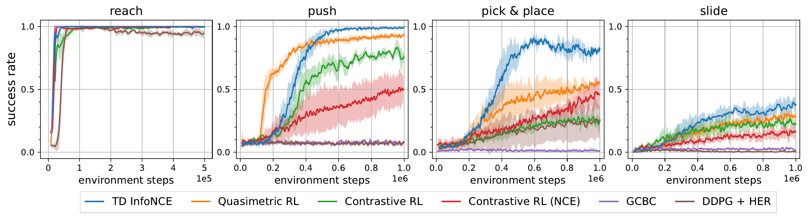<figcaption aria-hidden="true">State-based tasks</figcaption></figure>

<figure>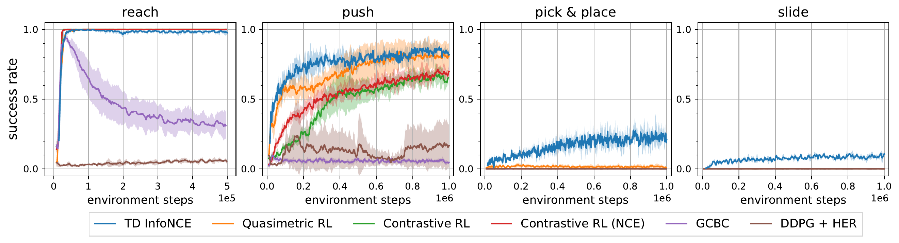<figcaption aria-hidden="true">Image-based tasks</figcaption></figure>

<embed src="figures/learning_curves/online_distance_bar.pdf" />

We report complete success rates for online GCRL experiments in Fig. <a href="#fig:online-eval" data-reference-type="ref" data-reference="fig:online-eval">[fig:online-eval]</a>, showing the mean success rate and standard deviation (shaded regions) across five random seeds. TD InfoNCE outperforms or achieves similar performance on all tasks, compared with other baselines. For those tasks where the success rate fails to separate different methods significantly (e.g., `slide (state)` and `push (image)`), we include comparisons using minimum distances of the gripper or the object to the goal over an episode in Fig. <a href="#fig:online-eval-dist" data-reference-type="ref" data-reference="fig:online-eval-dist">[fig:online-eval-dist]</a>, selecting the strongest baselines QRL and contrastive RL. Note that a lower minimum distance indicates a better performance. These results suggest that TD InfoNCE is able to emerge a goal-conditioned policy by estimating the discounted state occupancy measure, serving as a competitive goal-conditioned RL algorithm.

## Offline Goal-conditioned RL Experiments

Similar to prior works , we adopt an additional goal-conditioned behavioral cloning regularization to prevent the policy from sampling out-of-distribution actions  during policy optimization (Eq.<a href="#eq:policy-obj" data-reference-type="ref" data-reference="eq:policy-obj">[eq:policy-obj]</a>):
$$\\begin{aligned}
    \\mathop{\\mathrm{arg\\,max}}\_{\\pi(\\cdot \\mid \\cdot, \\cdot)} \\mathbb{E}\_{\\substack{ (s, a\_{\\text{orig}}, g) \\sim p(s, a\_{\\text{orig}}, g) \\\\ a \\sim \\pi(a \\mid s, g), s\_{t+}^{(1:N)} \\sim p(s\_{t+}) }} \\left\[ (1 - \\lambda) \\cdot \\log \\frac{e^{f(s, a, g, s\_{t+} = g )}}{ \\sum\_{i = 1}^N e^{ f(s, a, g, s\_{t+}^{(i)}) } } + \\lambda \\cdot \\\|a - a\_{\\text{orig}}\\\|\_2^2 \\right\],\\end{aligned}$$
where *λ* is the coefficient for regularization. Note that we use a supervised loss based on the mean squared error instead of the maximum likelihood estimate of *a*orig under policy *π* used in prior works. We compare TD InfoNCE to the state-of-the-art QRL  and its Monte Carlo counterpart (contrastive RL ). We also compare to the pure goal-conditioned behavioral cloning implemented in  as well as a recent baseline that predicts optimal actions via sequence modeling using a transformer (DT ). Our last two baselines are offline actor-critic methods trained via TD learning: TD3 + BC  and IQL , not involving goal-conditioned relabeling. We use the result for baselines except QRL from .

As shown in Table <a href="#tab:offline-eval" data-reference-type="ref" data-reference="tab:offline-eval">1</a>, TD InfoNCE matches or outperforms all baselines on 5 / 6 tasks. On tasks (`medium-play-v2` and `medium-diverse-v2`), TD InfoNCE achieves a  + 13% improvement over contrastive RL, showing the advantage of temporal difference learning over the Monte Carlo approach with a fixed dataset. We conjecture that this benefit comes from the dynamic programming property of the TD method and will investigate this property further in later experiments (Sec. <a href="#subsec:off-policy-reasoning" data-reference-type="ref" data-reference="subsec:off-policy-reasoning">4.4</a>). Additionally, TD InfoNCE performs 1.4× better than GCBC and retains a 3.8× higher scores than DT on average, where these baselines use (autoregressive) supervised losses instead of TD learning. These results suggest that TD InfoNCE is also a competitive goal-conditioned RL algorithm in the offline setting.

## Off-Policy Reasoning Experiments

<embed src="./figures/stitching_dataset.png" /> Dataset

<embed src="figures/policy_analysis/stitching.pdf" />

#### Stitching trajectories.

The first set of experiments investigate whether TD InfoNCE successfully stitches pieces of trajectories in a dataset to find complete paths between (start, goal) pairs unseen together in the dataset. We collect a dataset with size 20K consisting of "Z" style trajectories moving in diagonal and off-diagonal directions (Fig. <a href="#fig:stitching-property-more" data-reference-type="ref" data-reference="fig:stitching-property-more">[fig:stitching-property-more]</a>), while evaluating the learned policy on reaching goals on the same edge as starting states after training both methods for 50K gradient steps. Figure <a href="#fig:stitching-property-more" data-reference-type="ref" data-reference="fig:stitching-property-more">[fig:stitching-property-more]</a> shows that TD InfoNCE succeeds in stitching parts of trajectory in the dataset, moving along "C" style paths towards goals, while contrastive RL fails to do so. These results justify our hypothesis that TD InfoNCE performs dynamic programming and contrastive RL instead naively follows the behavior defined by the data.

<embed src="figures/policy_analysis/shortcut_searching_full.pdf" />

#### Searching for shortcuts.

Our second set of experiments aim to compare the performance of TD InfoNCE against contrastive RL on searching shortcuts in skewed datasets. To study this, we collect different datasets of size 20K with trajectories conditioned on the same pair of initial state and goal, with 95% of the time along a long path and 5% of the time along a short path. Using these skewed datasets, we again train both methods for 50K gradient steps and then evaluate the policy performance on reaching the same goal starting from the same state. We show the goal-conditioned policies learned by the two approaches in Fig. <a href="#fig:searching-shortcut-more" data-reference-type="ref" data-reference="fig:searching-shortcut-more">[fig:searching-shortcut-more]</a>. The observation that TD InfoNCE learns to take shortcuts even though those data are rarely seen, while contrastive RL follows the long paths dominating the entire dataset, demonstrates the advantage of temporal difference learning over its Monte Carlo counterpart in improving data efficiency.

## Implementations and Hyperparameters

We implement TD InfoNCE, contrastive RL, and C-Learning using JAX  building upon the official codebase of contrastive RL[3]. For baselines QRL, GCBC, and DDPG + HER, we use implementation provided by the author of QRL[4]. We summarize hyperparameters for TD InfoNCE in Table <a href="#tab:hparams" data-reference-type="ref" data-reference="tab:hparams">2</a>. Whenever possible, we used the same hyperparameters as contrastive RL . Since TD InfoNCE computes the loss with *N*2 negative examples, we increase the capacity of the goal-conditioned state-action encoder and the future state encoder to 4 layers MLP with 512 units in each layer applying ReLU activations. For fair comparisons, we also increased the neural network capacity in baselines to the same number and used a fixed batch size 256 for all methods. Appendix <a href="#appendix:hyperparam-ablation" data-reference-type="ref" data-reference="appendix:hyperparam-ablation">10.1</a> includes ablations studying the effect of differet hyperparamters in Table <a href="#tab:hparams" data-reference-type="ref" data-reference="tab:hparams">2</a>. For offline RL experiments, we make some changes to hyperparameters (Table <a href="#tab:hparams-offline" data-reference-type="ref" data-reference="tab:hparams-offline">3</a>).

| Hyperparameters                                          |        Values         |
|:---------------------------------------------------------|:---------------------:|
| actor learning rate                                      | 5 × 10 − 5 |
| critic learning rate                                     | 3 × 10 − 4 |
| using ℓ2 normalized representations           |          yes          |
| hidden layers sizes (for both actor and representations) | (512, 512, 512, 512)  |
| contrastive representation dimensions                    |          16           |

Hyperparameters for TD InfoNCE.

| Hyperparameters                                                            |                     Values                      |
|:---------------------------------------------------------------------------|:-----------------------------------------------:|
| batch size (on `large-` tasks)                                             |                   256 → 1024                    |
| hidden layers sizes (for both actor and representations on `large-` tasks) | (512, 512, 512, 512) → (1024, 1024, 1024, 1024) |
| behavioral cloning regularizer coefficient *λ*                             |                       0.1                       |
| goals for actor loss                                                       |          random states → future states          |

Changes to hyperparameters for offline RL experiments. (Table <a href="#tab:offline-eval" data-reference-type="ref" data-reference="tab:offline-eval">1</a>)

# Additional Experiments

## Hyperparameter Ablations

<figure>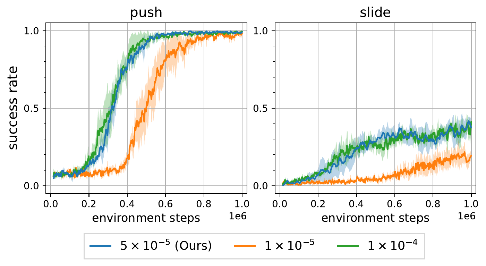<figcaption aria-hidden="true">Actor learning rate</figcaption></figure>

<figure>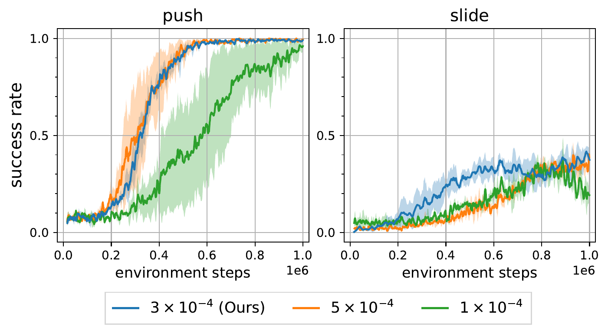<figcaption aria-hidden="true">Critic learning rate</figcaption></figure>

<figure>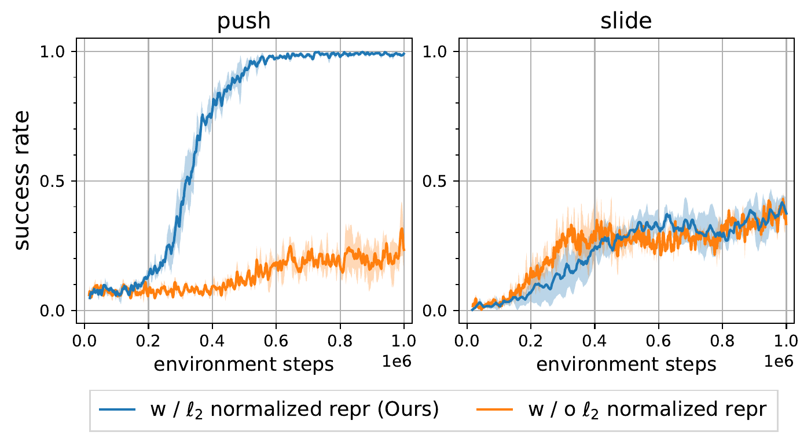<figcaption aria-hidden="true">Representation normalization</figcaption></figure>

<figure>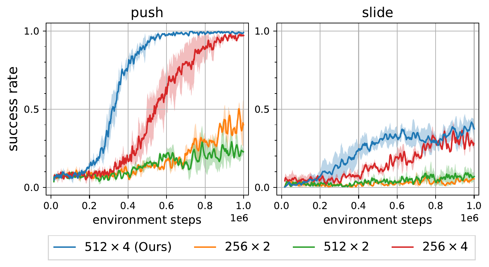<figcaption aria-hidden="true">MLP hidden layer size</figcaption></figure>

<figure>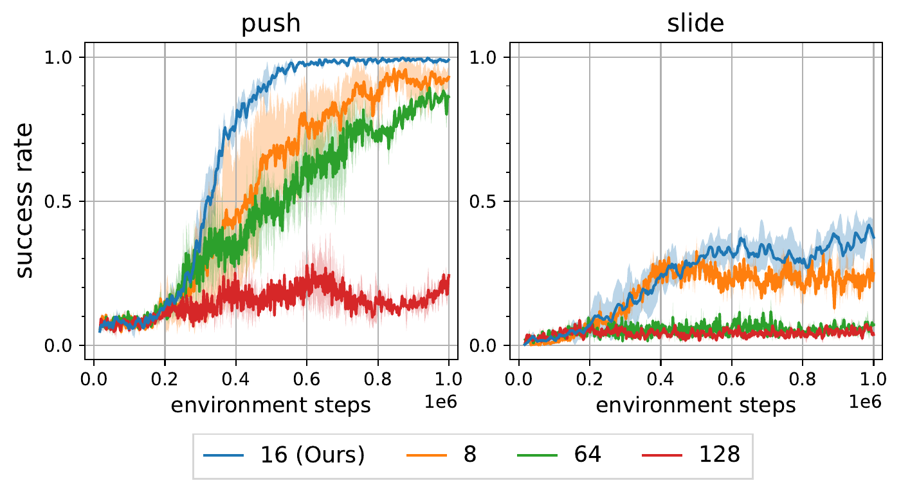<figcaption aria-hidden="true">Representation dimension</figcaption></figure>

<figure>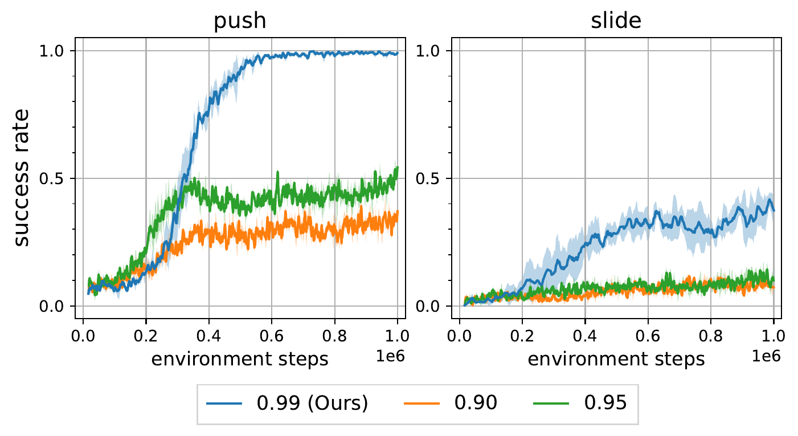<figcaption aria-hidden="true">Discount factor <em>γ</em></figcaption></figure>

We conduct ablation experiments to study the effect of different hyperparameters in Table <a href="#tab:hparams" data-reference-type="ref" data-reference="tab:hparams">2</a>, aiming to find the best hyperparameters for TD InfoNCE. For each hyperparameter, we selected a set of different values and conducted experiments on `push (state)` and `slide (state)`, one easy task and one challenging task, for five random seeds. We report mean and standard deviation of success rates in Fig. <a href="#fig:hyperparam-ablation" data-reference-type="ref" data-reference="fig:hyperparam-ablation">[fig:hyperparam-ablation]</a>. These results suggest that while some values of the hyperparameter have similar effects, e.g. actor learning rate  = 5 × 10 − 5 vs 1 × 10 − 4, our choice of combination is optimal for TD InfoNCE.

## Predicting the discounted state occupancy measure

Our experiments estimating the discounted state occupancy measure in the tabular setting (Sec. <a href="#subsec:critic-pred-acc" data-reference-type="ref" data-reference="subsec:critic-pred-acc">4.3</a>) observed a small “irreducible” error. To test the correctness of our implementation, we applied the successor representation with a known model (Fig. <a href="#fig:discounted-state-occupancy-measure-est-errs-full" data-reference-type="ref" data-reference="fig:discounted-state-occupancy-measure-est-errs-full">[fig:discounted-state-occupancy-measure-est-errs-full]</a>), finding that its error does go to zero. This gives us confidence that our implementation of the successor representation baseline is correct, and suggests that the error observed in Fig. <a href="#fig:discounted-state-occupancy-measure-est-errs" data-reference-type="ref" data-reference="fig:discounted-state-occupancy-measure-est-errs">[fig:discounted-state-occupancy-measure-est-errs]</a> arises from sampling the transitions (rather than having a known model).

<embed src="figures/critic_analysis/p_future_est_errs_vs_gradient_steps_full.pdf" />

<embed src="figures/ablations/td_infonce_vs_c_learning.pdf" />

## Understanding the Differences between TD InfoNCE and C-Learning

While conceptually similar, our method is a temporal difference estimator building upon InfoNCE whereas C-learning instead bases on the NCE objective . There are mainly three distinctions between TD InfoNCE and C-Learning: *(a)* C-Learning uses a binary cross entropy loss, while TD InfoNCE uses a categorical cross entropy loss. *(b)* C-Learning uses importance weights of the form exp (*f*(*s*, *a*, *g*)); if these weights are self-normalized , they corresponds to the softmax importance weights in our objectives (Eq. <a href="#eq:importance-weight" data-reference-type="ref" data-reference="eq:importance-weight">[eq:importance-weight]</a>). *(c)* For the same batch of *N* transitions, TD InfoNCE updates representations of *N*2 negative examples (Eq. <a href="#eq:ce-negative" data-reference-type="ref" data-reference="eq:ce-negative">[eq:ce-negative]</a>), while C-Learning only involves *N* negative examples. We ablate these decisions in Fig. <a href="#fig:td-infonce-vs-c-learning" data-reference-type="ref" data-reference="fig:td-infonce-vs-c-learning">[fig:td-infonce-vs-c-learning]</a>, finding that differences (b) and (c) have little effect. Thus, we attribute the better performance of TD InfoNCE to its use of the categorical cross entropy loss.

## Representation Interpolation

<figure>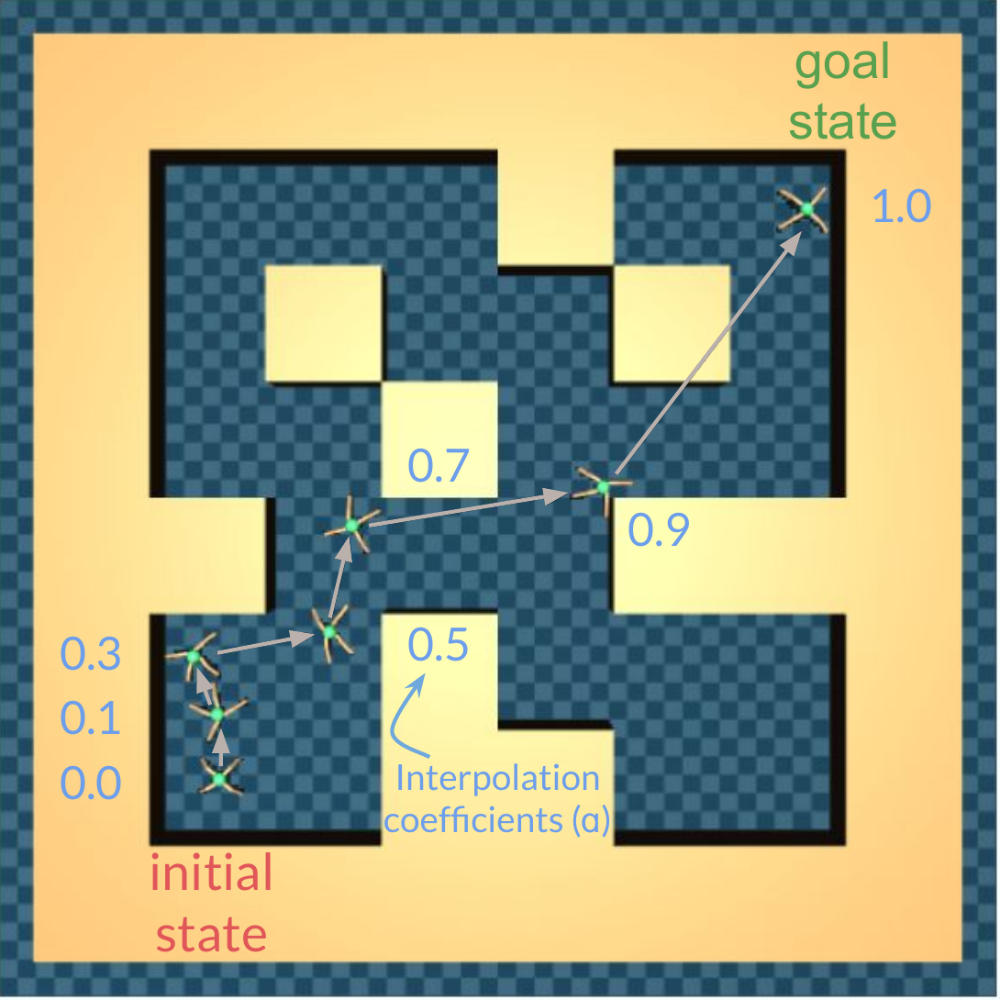<figcaption aria-hidden="true">Parametric interpolation</figcaption></figure>

<figure>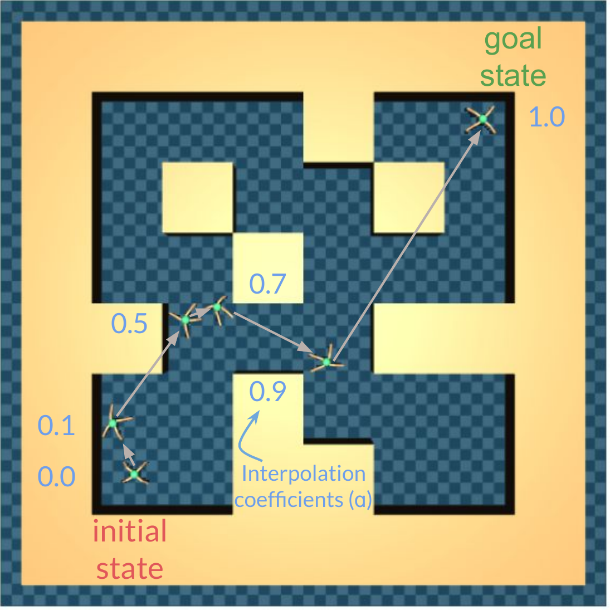<figcaption aria-hidden="true">Non-parametric interpolation</figcaption></figure>

Prior works have shown that representations learned by self-supervised learning incorporate structure of the data , motivating us to study whether the representations acquired by TD InfoNCE contain task-specific information. To answer this question, we visualize representations learned by TD InfoNCE via interpolating in the latent space following prior work . We choose to interpolate representations learned on the offline AntMaze `medium-play-v2` task and compare a parametric interpolation method against a non-parametric variant. Importantly, the states and goals of this task are 29 dimensions and we visualize them in 2D from a top-down view.

#### Parametric interpolation.

Given a pair of start state and goal (*s*0, *g*), we compute the normalized representations *ϕ*(*s*0, *a*no-op, *g*) and *ϕ*(*g*, *a*no-op, *g*), where *a*no-op is an action taking no operation. Applying spherical linear interpolation to both of them results in blended representations,
$$\\begin{aligned}
    \\frac{\\sin (1 - \\alpha) \\eta}{\\sin \\eta} \\phi(s\_0, a\_{\\text{no-op}}, g) + \\frac{\\sin \\alpha \\eta}{\\sin \\eta} \\phi(g, a\_{\\text{no-op}}, a),\\end{aligned}$$
where *α* ∈ \[0, 1\] is the interpolation coefficient and *η* is the angle subtended by the arc between *ϕ*(*s*0, *a*no-op, *g*) and *ϕ*(*g*, *a*no-op, *g*). These interpolated representations can be used to find the spherical nearest neighbors in a set of representations of validation states {*ϕ*(*s*val, *a*no-op, *g*)} and we call this method parametric interpolation.

#### Non-parametric interpolation.

We can also sample another set of random states and using their representations {*ϕ*(*s*rand(*i*), *a*no-op, *g*)}*i* = 1*S* as anchors to construct a softmax feature for a state *s*, feat(*s*; *g*, {*s*rand}):
$$\\begin{aligned}
    \\textsc{SoftMax} \\left( \\left\[ \\phi(s, a\_{\\text{no-op}}, g)^{\\top} \\phi(s\_{\\text{rand}}^{(1)}, a\_{\\text{no-op}}, g), \\cdots, \\phi(s, a\_{\\text{no-op}}, g)^{\\top} \\phi(s\_{\\text{rand}}^{(S)}, a\_{\\text{no-op}}, g) \\right\] \\right).\\end{aligned}$$
We compute the softmax features for representations of start and goal states and then construct the linear interpolated features,
$$\\begin{aligned}
    \\alpha \\text{feat}(s\_0; g, \\{s\_{\\text{rand}}\\}) + (1 - \\alpha) \\text{feat}(g; g, \\{s\_{\\text{rand}}\\}).\\end{aligned}$$
Those softmax features of interpolated representations are used to find the ℓ2 nearest neighbors in a softmax feature validation set. We call this method non-parametric interpolation.

Results in Fig. <a href="#fig:latent-interp" data-reference-type="ref" data-reference="fig:latent-interp">[fig:latent-interp]</a> suggest that when interpolating the representations using both methods, the intermediate representations correspond to sequences of states that the optimal policy should visit when reaching desired goals. Therefore, we conjecture that TD InfoNCE encodes causality in its representations while the policy learns to arrange them in a temporally correct order.

[1] <https://github.com/chongyi-zheng/td_infonce>

[2] Technically, *f*⋆ should be a set of functions satisfying $\\left\\{ f: \\frac{e^{f(s, a, s\_{t+})}}{\\mathbb{E}\_{p(s\_{t+}')}\\left\[e^{f(s, a, s\_{t+}')} \\right\]} = \\frac{C^{\\star}(s, a, s\_{t+})}{p(s\_{t+})} \\right\\}.$

[3] <https://github.com/google-research/google-research/tree/master/contrastive_rl>

[4] <https://github.com/quasimetric-learning/quasimetric-rl>
