## Abstract

Leveraging massive knowledge from <span acronym-label="llm" acronym-form="singular+short">llm</span>, recent machine learning models show notable successes in general-purpose task solving in diverse domains such as computer vision and robotics. However, several significant challenges remain: (i) most of these models rely on 2D images yet exhibit a limited capacity for 3D input; (ii) these models rarely explore the tasks inherently defined in 3D world, *e.g*.., 3D grounding, embodied reasoning and acting. We argue these limitations significantly hinder current models from performing real-world tasks and approaching general intelligence. To this end, we introduce <span class="smallcaps">LEO</span>, an embodied multi-modal generalist agent that excels in perceiving, grounding, reasoning, planning, and acting in the 3D world. <span class="smallcaps">LEO</span> is trained with a unified task interface, model architecture, and objective in two stages: (i) 3D vision-language (VL) alignment and (ii) 3D <span acronym-label="vla" acronym-form="singular+short">vla</span> instruction tuning. We collect large-scale datasets comprising diverse object-level and scene-level tasks, which require considerable understanding of and interaction with the 3D world. Moreover, we meticulously design an LLM-assisted pipeline to produce high-quality 3D VL data. Through extensive experiments, we demonstrate <span class="smallcaps">LEO</span>’s remarkable proficiency across a wide spectrum of tasks, including 3D captioning, question answering, embodied reasoning, navigation and manipulation. Our ablative studies and scaling analyses further provide valuable insights for developing future embodied generalist agents. Code and data are available on [project page](https://embodied-generalist.github.io/).

# Introduction

Building one generalist model that can handle comprehensive tasks like humans has been a long-existing pursuit in artificial intelligence and neuroscience . Recent advances in <span acronym-label="llm" acronym-form="singular+short">llm</span>  and “foundation models”  emerge as a promising paradigm in building such generalist models in natural language processing , computer vision , and robotics . The keys to the success of this paradigm lie in large-scale internet-level datasets from numerous tasks and domains, as well as scalable Transformer architectures  that can absorb generalizable and task-agnostic knowledge from the data. Nonetheless, existing generalist models primarily thrive within 2D domains, lacking comprehension of the 3D physical environment that envelops human-level intelligence. This limitation stands as an obstacle that prevents current models from solving real-world tasks and approaching general intelligence. Therefore, we ask a fundamental question: *how to equip the generalist agent with a comprehensive understanding of and the ability to interact with the real 3D world*?

<figure id="fig:leo">

<figcaption><strong>The proposed embodied generalist agent <span class="smallcaps">LEO</span></strong>. It takes egocentric 2D images, 3D point clouds, and texts as input and formulates comprehensive 3D tasks as autoregressive sequence prediction. By instruction-tuning <span class="smallcaps">LEO</span>, it extends the capability of <span data-acronym-label="llm" data-acronym-form="singular+short">llm</span> to multi-modal vision-language-action tasks with a unified model.</figcaption>
</figure>

The development of such generalist agents encounters three primary challenges: the lack of suitable datasets, unified models, and effective learning strategies. Despite substantial progress in scaling up image-text models  and the curation of corresponding datasets , advancement in 3D scene-level understanding has significantly lagged behind. This is largely attributed to the limited scale and manual labeling of 3D datasets , given the higher cost associated with collecting 3D data compared to 2D data. Furthermore, large-scale unified pretraining and efficient finetuning are under-explored by previous 3D VL models, which are often designed with strong priors . Notably, recent works utilize multi-modal Transformer together with synthetic data to enhance the model’s capability in grounded 3D scene understanding. Nevertheless, they fall short in embodied tasks, *e.g*.., acting within 3D environments. Additionally, there are significant yet rarely explored problems, *e.g*.., the potential of <span acronym-label="vla" acronym-form="singular+short">vla</span> learning and efficient adaptation of <span acronym-label="llm" acronym-form="singular+short">llm</span> for 3D tasks.

In this work, we introduce the generalist agent <span class="smallcaps">LEO</span>, which is generically embodied, multi-modal, and general-purpose. It can take egocentric 2D images, 3D point clouds, and texts as task input and handle comprehensive tasks within the 3D environment. As shown in  
effig:leo, *<span class="smallcaps">LEO</span> exhibits the capability of perceiving, grounding, reasoning, planning, and acting with a unified task interface, model architecture, and objective.* <span class="smallcaps">LEO</span> perceives through an egocentric 2D image encoder for the embodied view and an object-centric 3D point cloud encoder for the third-person global view. Such perception modules can be flexibly adapted to various embodied environments and enhance 3D reasoning. The encoded visual tokens are interleaved with text tokens to form a unified multi-modal task sequence, which further serves as the input to a decoder-only LLM. Equipped with a vocabulary containing both text and action tokens, the LLM can generate responses to various tasks simultaneously. Consequently, all the tasks are formulated as sequence prediction, thereby accommodating a unified training objective.

Following prior experiences , we adopt a two-stage learning scheme, *i.e*.., 3D VL alignment and 3D <span acronym-label="vla" acronym-form="singular+short">vla</span> instruction tuning. We accordingly collect large-scale comprehensive datasets <span class="smallcaps">LEO</span>-align and <span class="smallcaps">LEO</span>-instruct, which comprise diverse object-level and scene-level tasks. Notably, we meticulously design an LLM-assisted pipeline to generate high-quality 3D VL data, wherein we propose to prompt <span acronym-label="llm" acronym-form="singular+short">llm</span> with scene graphs and <span acronym-label="ocot" acronym-form="singular+short">ocot</span> method. To further enhance quality control, we devise a series of refinement procedures via regular expression matching and scene graph retrieval. We demonstrate our approach largely enriches the data scale and diversity, meanwhile mitigating hallucination in LLM-generated data.

We quantitatively evaluate and ablate <span class="smallcaps">LEO</span> on diverse 3D tasks, including 3D captioning , 3D question answering , situated question answering , embodied navigation , and robotic manipulation . The results indicate (i) through task-agnostic instruction tuning with a unified model, <span class="smallcaps">LEO</span> achieves state-of-the-art performances on most tasks, particularly surpassing previous task-specific models; (ii) <span class="smallcaps">LEO</span> shows proficiency in scene-grounded dialogue and planning, capable of generating flexible and coherent responses; (iii) <span class="smallcaps">LEO</span> achieves comparable performances to state-of-the-art task-specific models on navigation and manipulation tasks, and exhibits remarkable generalization ability; (iv) <span class="smallcaps">LEO</span>’s strong performances stem from both data and model aspects, including the alignment stage, data diversity, generalist-style instruction tuning, and object-centric representation; (v) <span class="smallcaps">LEO</span> manifests the scaling law that echoes prior findings . We also present qualitative results to illustrate <span class="smallcaps">LEO</span>’s versatility and proficiency in grounded 3D scene understanding.

In summary, our main contributions are as follows: (i) we propose <span class="smallcaps">LEO</span>, the first embodied generalist agent capable of following human instructions to perceive, ground, reason, plan, and act in the 3D world; (ii) we propose a simple yet effective framework that connects object-centric 3D representation and LLM to efficiently bridge the gap between vision, language, and embodied action; (iii) we collect large-scale comprehensive datasets for our two-stage generalist training scheme, and particularly propose an LLM-assisted pipeline for the generation of high-quality 3D VL data; (iv) we conduct extensive experiments to demonstrate <span class="smallcaps">LEO</span>’s proficiency across various tasks, and present in-depth analyses to reveal valuable insights; (v) we release the data, code, and model weights to endow the future research in embodied generalist agents.

# Model

The leading design principles of <span class="smallcaps">LEO</span> are two-fold: 1) It should handle the multi-modal input of egocentric 2D, global 3D, and textual instruction, and the output of textual response as well as embodied action commands in a unified architecture; 2) It should leverage pre-trained large language models (LLMs) as a powerful prior for the downstream tasks. We therefore convert all data of different modalities into a sequence of tokens, illustrated below:
``` math
\label{equ:data}
\begin{split}
    &\underbrace{\text{\texttt{You are...}}}_{\text{system message}}~\underbrace{s_{\text{2D}}^{(1)},..., s_{\text{2D}}^{(M)}}_{\substack{\text{2D image tokens}\\ \text{(optional)}}}\underbrace{s_{\text{3D}}^{(1)},..., s_{\text{3D}}^{(N)}}_{\substack{\text{object-centric}\\\text{3D tokens}}},\\
    &\underbrace{\text{\texttt{USER:... ASSISTANT:}}}_{\text{instruction}}~\underbrace{s_{\text{res}}^{(1)},...s_{\text{res}}^{(T)}}_{\text{response}}.
\end{split}
```
With this representation, we formulate the learning of <span class="smallcaps">LEO</span> as GPT-style autoregressive language modeling  given the *prefix* (from *system message* to *instruction*), *i.e*.. prefix language modeling . Therefore, a pretrained LLM can be used to process such sequences. Next, we will detail the tokenization of multi-modal data, model architecture, training loss, and inference settings. An overview of our model can be found in  
effig:leo.

## Tokenization

We follow prior practices in 2D VLM  and 3D VLM  to tokenize the multi-modal data in <span class="smallcaps">LEO</span>. We use SentencePiece tokenizer  to encode text with 32k subwords; 2D image tokens for egocentric 2D images; and object-centric 3D tokens extracted over Mask3D-based  object proposals for 3D point cloud inputs. For embodied action commands, continuous actions (*e.g*.. in manipulation) are discretized (details in  
efsec:action_tokenization) to join the discrete actions (*e.g*.. navigation) and form a unified discrete action space. We follow  to map these discrete actions to the least used tokens in SentencePiece. After tokenization, all tokens are ordered into the format in (<a href="#equ:data" data-reference-type="ref" data-reference="equ:data">[equ:data]</a>).

<span id="tab:data_stat" label="tab:data_stat"></span>**Datasets statistics**. We illustrate key statistics of datasets for 3D VL alignment (<span class="smallcaps">LEO</span>-align) and 3D VLA instruction tuning (<span class="smallcaps">LEO</span>-instruct). *res.* (response) denotes tokens to be predicted, while *prefix* denotes those in the context.

<div id="tab:data_quality_statistics">

<table>
<tbody>
<tr>
<td style="text-align: center;">Dataset</td>
<td style="text-align: center;">Task</td>
<td style="text-align: center;">2D input</td>
<td style="text-align: center;">3D assets</td>
<td style="text-align: center;">#data</td>
<td style="text-align: center;"></td>
<td style="text-align: center;"></td>
</tr>
<tr>
<td style="text-align: center;">(<em>res.</em>)</td>
<td style="text-align: center;"></td>
<td style="text-align: center;"></td>
<td style="text-align: center;"></td>
<td style="text-align: center;"></td>
<td style="text-align: center;"></td>
<td style="text-align: center;"></td>
</tr>
<tr>
<td style="text-align: center;">(<em>prefix</em>+<em>res.</em>)</td>
<td style="text-align: center;"></td>
<td style="text-align: center;"></td>
<td style="text-align: center;"></td>
<td style="text-align: center;"></td>
<td style="text-align: center;"></td>
<td style="text-align: center;"></td>
</tr>
<tr>
<td rowspan="3" style="text-align: center;"><span class="smallcaps">LEO</span>-align</td>
<td style="text-align: center;">object captioning</td>
<td style="text-align: center;"></td>
<td style="text-align: center;">Objaverse</td>
<td style="text-align: center;">660K</td>
<td style="text-align: center;">10M</td>
<td style="text-align: center;">27M</td>
</tr>
<tr>
<td style="text-align: center;">object referring</td>
<td style="text-align: center;"></td>
<td style="text-align: center;">ScanNet + 3RScan</td>
<td style="text-align: center;">354K</td>
<td style="text-align: center;">15M</td>
<td style="text-align: center;">39M</td>
</tr>
<tr>
<td style="text-align: center;">scene captioning</td>
<td style="text-align: center;"></td>
<td style="text-align: center;">3RScan</td>
<td style="text-align: center;">20K</td>
<td style="text-align: center;">3.3M</td>
<td style="text-align: center;">4.4M</td>
</tr>
<tr>
<td rowspan="6" style="text-align: center;"><span class="smallcaps">LEO</span>-instruct</td>
<td style="text-align: center;">3D captioning</td>
<td style="text-align: center;"></td>
<td style="text-align: center;">ScanNet</td>
<td style="text-align: center;">37K</td>
<td style="text-align: center;">821K</td>
<td style="text-align: center;">3M</td>
</tr>
<tr>
<td style="text-align: center;">3D QA</td>
<td style="text-align: center;"></td>
<td style="text-align: center;">ScanNet + 3RScan</td>
<td style="text-align: center;">83K</td>
<td style="text-align: center;">177K</td>
<td style="text-align: center;">4M</td>
</tr>
<tr>
<td style="text-align: center;">3D dialogue</td>
<td style="text-align: center;"></td>
<td style="text-align: center;">3RScan</td>
<td style="text-align: center;">11K</td>
<td style="text-align: center;">1.1M</td>
<td style="text-align: center;">8.3M</td>
</tr>
<tr>
<td style="text-align: center;">task planning</td>
<td style="text-align: center;"></td>
<td style="text-align: center;">3RScan</td>
<td style="text-align: center;">14K</td>
<td style="text-align: center;">1.9M</td>
<td style="text-align: center;">2.7M</td>
</tr>
<tr>
<td style="text-align: center;">navigation</td>
<td style="text-align: center;"></td>
<td style="text-align: center;">MP3D</td>
<td style="text-align: center;">60K</td>
<td style="text-align: center;">11.4M</td>
<td style="text-align: center;">272M</td>
</tr>
<tr>
<td style="text-align: center;">manipulation</td>
<td style="text-align: center;"></td>
<td style="text-align: center;">CLIPort</td>
<td style="text-align: center;">300K</td>
<td style="text-align: center;">7.2M</td>
<td style="text-align: center;">734M</td>
</tr>
</tbody>
</table>

</div>

Answer accuracy of LLM-generated data on three types of questions.<span id="tab:data_quality_comparison" label="tab:data_quality_comparison"></span>

<div id="tab:data_quality_statistics">

|               | Counting | Existence | Non-existence |
|:--------------|:--------:|:---------:|:-------------:|
| 3D-LLM        |   56.5   |   96.8    |     40.0      |
| Ours          |   57.4   |   91.3    |     27.4      |
| \+ O-CoT      |   78.0   |   93.4    |     30.5      |
| \+ refinement |  100.0   |   100.0   |     100.0     |

</div>

The amount of examined data in  
eftab:data_quality_comparison. 3D-LLM data is much less since we can only access a subset.<span id="tab:data_quality_statistics" label="tab:data_quality_statistics"></span>

<div id="tab:data_quality_statistics">

|        | Counting | Existence | Non-existence |
|:-------|:--------:|:---------:|:-------------:|
| 3D-LLM |   434    |    95     |      10       |
| Ours   |   2666   |   6766    |     3314      |

</div>

## Token Embedding & LLM

We apply several token embedding functions to process the tokens in the sequence before sending them to the LLM. The LLM will then align these tokens of different modalities, and produce the response. Most of the responses are text and can be decoded directly. For responses that include embodied actions, we will map the reserved SentencePiece text tokens back to action commands.

0ex -1em Text & 2D token embedding. For text tokens (including embodied actions that have been mapped to the reserved text tokens), an embedding look-up table is used to map them into vectors. While the egocentric 2D image is encoded by a pretrained OpenCLIP ConvNext  for obtaining image token embeddings. We apply MLP adapters to match the dimensions of all token embeddings.

0ex -1em Object-centric 3D token embedding. Each 3D object token (*i.e*.., the point cloud of a 3D object) is first encoded by a pretrained point cloud encoder (*e.g*.., PointNet++ ). We then adopt the Spatial Transformer introduced in  to further process the point cloud embedding of all objects into object-centric 3D token embeddings. In a nutshell, Spatial Transformer biases the standard attention score with relative position and size for capturing 3D relations between objects. Due to space limit, the readers are referred to  and  
efsec:supp_embedding for more details.

0ex -1em Pretrained LLM. We choose Vicuna-7B  to process the token sequence. In order to tackle the challenging alignment and grounding problem of multi-modal tokens (2D, 3D, text, embodied action) while preserving the LLM pretrained knowledge, we employ LoRA  to introduce additional tunable parameters to the frozen pretrained LLM.

## Training & Inference

We formulate the learning objective of <span class="smallcaps">LEO</span> following  in a prefix language modeling fashion. For a batch $`\mathcal{B}`$ of token sequence $`s`$, we optimize <span class="smallcaps">LEO</span> via:
``` math
\begin{aligned}
   \mathcal{L}(\theta, \mathcal{B}) = -\sum^{|\mathcal{B}|}_{b=1}\sum^{T}_{t=1}\log p_{\theta}(s_{\text{res}}^{(b,t)}|s_{\text{res}}^{(b,<t)},s_{\text{prefix}}^{(b)}), 
\end{aligned}
```
where $`s_\text{prefix}`$ denotes the prefix tokens (from *system message* to *instruction*) in (<a href="#equ:data" data-reference-type="ref" data-reference="equ:data">[equ:data]</a>). During training, we freeze the pretrained 3D point cloud encoder and the LLM and finetune the 2D image encoder, the Spatial Transformer, and the LoRA parameters. In total, <span class="smallcaps">LEO</span> has ~7B parameters and ~142M of them will be tuned. During inference, we use beam search to generate textual responses. For tasks that require action commands, we map the textual outputs to action commands as discussed in  
efsec:model_tokenization. More details on the model and training can be found in  
efapp:model.

# Datasets

Since <span class="smallcaps">LEO</span> is a generalist agent that receives multi-modal inputs and follows instructions, we adopt the two-stage training proposed by and split the data into two sets: (i) <span class="smallcaps">LEO</span>-align (  
efsec:data:align) that focuses on **3D <span acronym-label="vl" acronym-form="singular+short">vl</span> alignment** to bridge the gap between 3D scene representation and natural language; and (ii) <span class="smallcaps">LEO</span>-instruct (  
efsec:sft) that targets at **3D VLA instruction tuning** to endow <span class="smallcaps">LEO</span> with various capabilities. The statistics and examples of these datasets can be found in  
eftab:data_stat and  
efsec:supp_leo_ds_examples, respectively. Due to the data scarcity, we adopt LLMs to facilitate the data generation process and outline the details in  
efsec:data:generation.

## <span class="smallcaps">LEO</span>-align: 3D Vision-Language Alignment

In <span class="smallcaps">LEO</span>-align, we focus on 3D <span acronym-label="vl" acronym-form="singular+short">vl</span> alignment. Similar to BLIP-2 , we train <span class="smallcaps">LEO</span> to generate captions given various 3D inputs. Specifically, we collect three types of 3D captioning data: 1) **object-level captions**, where we align 3D individual objects with their descriptions ; 2) **object-in-the-scene captions**, where the goal is to generate the referring expressions of objects in a 3D scene context ; and 3) **scene-level captions**, which focuses on depicting global 3D scene using natural language. Due to the space limit, we defer details including data source and components to  
efapp:dataset:leo_align.

<figure id="fig:data_framework">
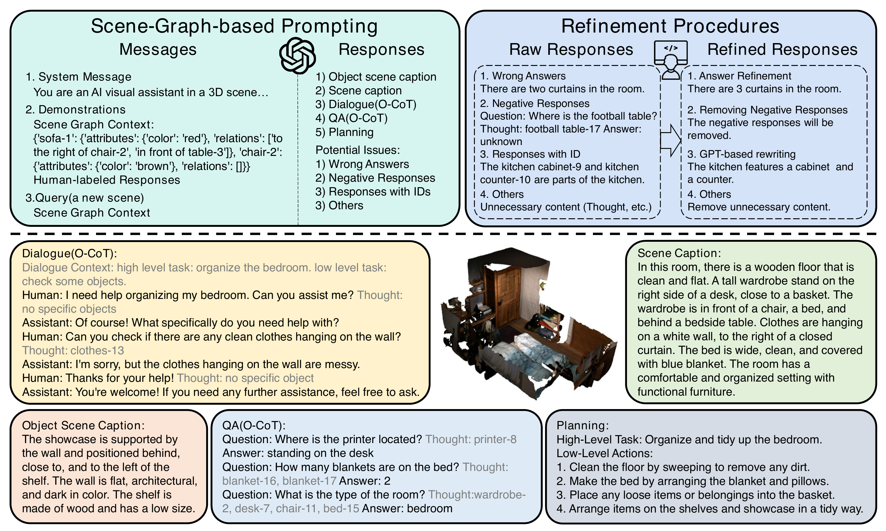
<figcaption><strong>Our proposed LLM-assisted 3D-language data generation pipeline and data examples.</strong>. (Top-left) Messages with 3D scene graphs, including object attributes and relations in a phrasal form, used for providing scene context when prompting LLM. (Top-right) The human-defined refinement procedures were conducted over raw LLM responses to improve data quality. (Bottom) Examples of LLM-assisted generation in <span class="smallcaps">LEO</span>-align and <span class="smallcaps">LEO</span>-instruct. <span style="color: gray">Thoughts, colored in gray, will be removed after refinements</span>.</figcaption>
</figure>

## <span class="smallcaps">LEO</span>-instruct: Instruction Following in 3D world

In <span class="smallcaps">LEO</span>-instruct, <span class="smallcaps">LEO</span> will be tuned to follow instructions and accomplish various 3D <span acronym-label="vla" acronym-form="singular+short">vla</span> tasks. We curate a comprehensive set of tasks that covers a broad spectrum from grounded scene understanding and reasoning , to dialogue, planning, and embodied acting . Specifically, we introduce 1) **3D captioning and question answering** – given 3D scene input, the agent needs to generate a natural language response to describe the scene or answer questions; 2) **3D dialogue and task planning**, where the agent is expected to generate flexible and coherent responses to complex instructions with respect to the given 3D scene, and 3) **navigation and manipulation**, which require the agent to accomplish a variety of embodied acting tasks in the 3D scene. We defer details to  
efapp:dataset:leo_instruct.

## LLM-assisted 3D-language Data Generation

As mentioned above, at the core of producing a large proportion of <span class="smallcaps">LEO</span>-align and <span class="smallcaps">LEO</span>-instruct is the assistance of LLMs. We now detail the key techniques of prompting LLMs (*i.e*.., ChatGPT) to generate 3D-text paired data. An overview can be found in  
effig:data_framework.

0ex -1em Scene-graph-based prompting. Our data generation pipeline starts with 3D scene graphs from 3DSSG , which provide scene contexts for prompting. Compared to counterparts that utilize object boxes , it offers both rich object attributes and accurate spatial relation information among objects, allowing <span acronym-label="llm" acronym-form="singular+short">llm</span> to generate data with high-quality 3D details (comparisons in  
efsec:scene graph prompting and bbox prompting). Next, we manually design some examples as seed tasks , including scene and object captioning, QA, dialogue, and planning, and ask LLM to produce more tasks as well as the responses. Details for designing the seed tasks can be found in   
efapp:dataset:seed_task.

0ex -1em Object-centric CoT. To further combat the **hallucination** of <span acronym-label="llm" acronym-form="singular+short">llm</span>  in open-ended generation as in our pipeline, we propose the object-centric chain of thought (<span acronym-label="ocot" acronym-form="singular+short">ocot</span>) prompting that requires the LLM to explicitly provide the label and ID of object candidates as <span style="color: gray">thoughts</span> during text generation. We also utilize subgraph sampling to further enhance the diversity of 3D scene graphs (see details in  
efapp:subgraph_sampling). We provide examples of <span acronym-label="ocot" acronym-form="singular+short">ocot</span> in   
effig:data_framework.

0ex -1em Refinement procedures. Upon the scene graph and O-CoT prompting, we introduce refinement as an additional safeguard to the quality and reliability of our generated data. Specifically, we send raw LLM responses to several human-defined filters based on the 3D scene graphs: negative responses (*e.g*.., lacking the necessary information to answer) will be removed; unnatural narratives will be rewritten, *etc*... Further, we detect text that involves logical reasoning (*e.g*.., counting) or hallucination, and manually fix the wrong responses according to the ground truth provided by scene graphs. We provide illustrative examples in  
effig:data_framework and  
efapp:dataset:refine:examples, and quantitative analysis on the impact of data refinement procedures in  
efsec:impact_data_refinement.

0ex -1em Assess the quality of generated data. In addition to data examples, we propose to assess the quality of generated data quantitatively. We focus on the LLM-produced question-answer pairs about objects (questions starting with *How many/Is there* and ending with *in the room/bedroom/kitchen/living room/bathroom*). We first divide these pairs into three categories: *counting*, *existence*, and *non-existence*, which examines the number of certain objects/whether an object exists/whether an object does not exist in the scene, respectively. We manually check if the answers in these pairs are correct, and report the overall accuracy. Results in  
eftab:data_quality_comparison demonstrate that our proposed scene-graph-based prompting, O-CoT prompting and refinement bring consistent improvement to data quality and the complete data generation pipeline outperforms a recent counterpart (3D-LLM). We also demonstrate how we help address the **grammatical errors** compared to counterparts in  
efapp:additional_data_comparison. Finally, we provide the data distribution in  
efapp:dataset statistics to illustrate the **diversity** of our generated data.

**Quantitative comparison with state-of-the-art models on 3D VL understanding and embodied reasoning tasks**. “C” stands for “CIDEr”, “B-4” for “BLEU-4”, “M” for “METEOR”, “R” for “ROUGE”, “Sim” for sentence similarity, and “EM@1” for top-1 exact match. The n-gram metrics for Scan2Cap are governed by IoU@0.5. $`^\dagger`$ indicates answering questions via prompting GPT-3 with the generated scene caption. <span style="color: gray">Gray</span> indicates evaluation results with refined exact-match protocol.

<div id="tab:test_result_act_objnav">

<table>
<thead>
<tr>
<th style="text-align: left;"></th>
<th colspan="5" style="text-align: center;">Scan2Cap (val)</th>
<th colspan="5" style="text-align: center;">ScanQA (val)</th>
<th style="text-align: center;">SQA3D (test)</th>
</tr>
</thead>
<tbody>
<tr>
<td style="text-align: left;"><span>2-6</span> (lr)<span>7-11</span> (lr)<span>12-12</span></td>
<td style="text-align: center;">C</td>
<td style="text-align: center;">B-4</td>
<td style="text-align: center;">M</td>
<td style="text-align: center;">R</td>
<td style="text-align: center;">Sim</td>
<td style="text-align: center;">C</td>
<td style="text-align: center;">B-4</td>
<td style="text-align: center;">M</td>
<td style="text-align: center;">R</td>
<td style="text-align: center;">EM@1</td>
<td style="text-align: center;">EM@1</td>
</tr>
<tr>
<td style="text-align: left;"><strong><em>Task-specific models</em></strong></td>
<td style="text-align: center;"></td>
<td style="text-align: center;"></td>
<td style="text-align: center;"></td>
<td style="text-align: center;"></td>
<td style="text-align: center;"></td>
<td style="text-align: center;"></td>
<td style="text-align: center;"></td>
<td style="text-align: center;"></td>
<td style="text-align: center;"></td>
<td style="text-align: center;"></td>
<td style="text-align: center;"></td>
</tr>
<tr>
<td style="text-align: left;">Scan2Cap</td>
<td style="text-align: center;">35.2</td>
<td style="text-align: center;">22.4</td>
<td style="text-align: center;">21.4</td>
<td style="text-align: center;">43.5</td>
<td style="text-align: center;">-</td>
<td style="text-align: center;">-</td>
<td style="text-align: center;">-</td>
<td style="text-align: center;">-</td>
<td style="text-align: center;">-</td>
<td style="text-align: center;">-</td>
<td style="text-align: center;">41.0<span class="math inline"><sup>†</sup></span></td>
</tr>
<tr>
<td style="text-align: left;">3DJCG</td>
<td style="text-align: center;">47.7</td>
<td style="text-align: center;">31.5</td>
<td style="text-align: center;">24.3</td>
<td style="text-align: center;">51.8</td>
<td style="text-align: center;">-</td>
<td style="text-align: center;">-</td>
<td style="text-align: center;">-</td>
<td style="text-align: center;">-</td>
<td style="text-align: center;">-</td>
<td style="text-align: center;">-</td>
<td style="text-align: center;">-</td>
</tr>
<tr>
<td style="text-align: left;">Vote2Cap-DETR</td>
<td style="text-align: center;">61.8</td>
<td style="text-align: center;">34.5</td>
<td style="text-align: center;">26.2</td>
<td style="text-align: center;">54.4</td>
<td style="text-align: center;">-</td>
<td style="text-align: center;">-</td>
<td style="text-align: center;">-</td>
<td style="text-align: center;">-</td>
<td style="text-align: center;">-</td>
<td style="text-align: center;">-</td>
<td style="text-align: center;">-</td>
</tr>
<tr>
<td style="text-align: left;">ScanRefer+MCAN</td>
<td style="text-align: center;">-</td>
<td style="text-align: center;">-</td>
<td style="text-align: center;">-</td>
<td style="text-align: center;">-</td>
<td style="text-align: center;">-</td>
<td style="text-align: center;">55.4</td>
<td style="text-align: center;">7.9</td>
<td style="text-align: center;">11.5</td>
<td style="text-align: center;">30.0</td>
<td style="text-align: center;">18.6</td>
<td style="text-align: center;">-</td>
</tr>
<tr>
<td style="text-align: left;">ClipBERT</td>
<td style="text-align: center;">-</td>
<td style="text-align: center;">-</td>
<td style="text-align: center;">-</td>
<td style="text-align: center;">-</td>
<td style="text-align: center;">-</td>
<td style="text-align: center;">-</td>
<td style="text-align: center;">-</td>
<td style="text-align: center;">-</td>
<td style="text-align: center;">-</td>
<td style="text-align: center;">-</td>
<td style="text-align: center;">43.3</td>
</tr>
<tr>
<td style="text-align: left;">ScanQA</td>
<td style="text-align: center;">-</td>
<td style="text-align: center;">-</td>
<td style="text-align: center;">-</td>
<td style="text-align: center;">-</td>
<td style="text-align: center;">-</td>
<td style="text-align: center;">64.9</td>
<td style="text-align: center;">10.1</td>
<td style="text-align: center;">13.1</td>
<td style="text-align: center;">33.3</td>
<td style="text-align: center;">21.1</td>
<td style="text-align: center;">47.2</td>
</tr>
<tr>
<td style="text-align: left;"><em><strong>Task-specific fine-tuned</strong></em></td>
<td style="text-align: center;"></td>
<td style="text-align: center;"></td>
<td style="text-align: center;"></td>
<td style="text-align: center;"></td>
<td style="text-align: center;"></td>
<td style="text-align: center;"></td>
<td style="text-align: center;"></td>
<td style="text-align: center;"></td>
<td style="text-align: center;"></td>
<td style="text-align: center;"></td>
<td style="text-align: center;"></td>
</tr>
<tr>
<td style="text-align: left;">3D-VisTA</td>
<td style="text-align: center;">66.9</td>
<td style="text-align: center;">34.0</td>
<td style="text-align: center;">27.1</td>
<td style="text-align: center;">54.3</td>
<td style="text-align: center;">53.8</td>
<td style="text-align: center;">69.6</td>
<td style="text-align: center;">10.4</td>
<td style="text-align: center;">13.9</td>
<td style="text-align: center;">35.7</td>
<td style="text-align: center;">22.4</td>
<td style="text-align: center;">48.5</td>
</tr>
<tr>
<td style="text-align: left;">3D-LLM (FlanT5)</td>
<td style="text-align: center;">-</td>
<td style="text-align: center;">-</td>
<td style="text-align: center;">-</td>
<td style="text-align: center;">-</td>
<td style="text-align: center;">-</td>
<td style="text-align: center;">69.4</td>
<td style="text-align: center;">12.0</td>
<td style="text-align: center;">14.5</td>
<td style="text-align: center;">35.7</td>
<td style="text-align: center;">20.5</td>
<td style="text-align: center;">-</td>
</tr>
<tr>
<td style="text-align: left;"><span class="smallcaps">LEO</span></td>
<td style="text-align: center;"><strong>72.4</strong></td>
<td style="text-align: center;"><strong>38.2</strong></td>
<td style="text-align: center;"><strong>27.9</strong></td>
<td style="text-align: center;"><strong>58.1</strong></td>
<td style="text-align: center;"><strong>55.3</strong></td>
<td style="text-align: center;"><strong>101.4</strong></td>
<td style="text-align: center;"><strong>13.2</strong></td>
<td style="text-align: center;"><strong>20.0</strong></td>
<td style="text-align: center;"><strong>49.2</strong></td>
<td style="text-align: center;"><strong>24.5 <span style="color: gray">(47.6)</span></strong></td>
<td style="text-align: center;"><strong>50.0 <span style="color: gray">(52.4)</span></strong></td>
</tr>
</tbody>
</table>

</div>

<span id="tab:vl_results" label="tab:vl_results"></span>

<span id="tab:test_result_act_cliport" label="tab:test_result_act_cliport"></span> **Results on robot manipulation**. indicates in-domain tasks. marks OOD tasks with novel colors or objects.

<div class="tabular">

llllccccccccccccccc & & &  
(lr)5-8(lr)9-12(lr)13-16 & & & & & &  

& & & & & &  
& & & & & &  
& & & & & &  

& & & & & &  

</div>

<span id="tab:test_result_act_objnav" label="tab:test_result_act_objnav"></span>**Results on object navigation.** $`^\dagger`$ indicates zero-shot evaluation.

<div id="tab:test_result_act_objnav">

<table>
<thead>
<tr>
<th colspan="2" style="text-align: center;"></th>
<th colspan="2" style="text-align: center;"><span>MP3D-val</span></th>
<th style="text-align: center;"></th>
<th colspan="2" style="text-align: center;"><span>HM3D-val</span></th>
</tr>
</thead>
<tbody>
<tr>
<td style="text-align: left;"><span>3-4</span>(lr)<span>6-7</span></td>
<td style="text-align: center;"><span>Success<span class="math inline">( ↑ )</span></span></td>
<td style="text-align: center;"><span>SPL<span class="math inline">( ↑ )</span></span></td>
<td style="text-align: center;"></td>
<td style="text-align: center;"><span>Success<span class="math inline">( ↑ )</span></span></td>
<td style="text-align: center;"><span>SPL<span class="math inline">( ↑ )</span></span></td>
<td style="text-align: center;"></td>
</tr>
<tr>
<td colspan="2" style="text-align: center;">Habitat-web (shortest)</td>
<td style="text-align: center;">4.4</td>
<td style="text-align: center;">2.2</td>
<td style="text-align: center;"></td>
<td style="text-align: center;">-</td>
<td style="text-align: center;">-</td>
</tr>
<tr>
<td colspan="2" style="text-align: center;">Habitat-web (demo)</td>
<td style="text-align: center;"><strong>35.4</strong></td>
<td style="text-align: center;">10.2</td>
<td style="text-align: center;"></td>
<td style="text-align: center;">-</td>
<td style="text-align: center;">-</td>
</tr>
<tr>
<td colspan="2" style="text-align: center;">ZSON</td>
<td style="text-align: center;">15.3<span class="math inline"><sup>†</sup></span></td>
<td style="text-align: center;">4.8<span class="math inline"><sup>†</sup></span></td>
<td style="text-align: center;"></td>
<td style="text-align: center;"><strong>25.5</strong></td>
<td style="text-align: center;">12.6</td>
</tr>
<tr>
<td colspan="2" style="text-align: center;"><span class="smallcaps">LEO</span></td>
<td style="text-align: center;">23.1</td>
<td style="text-align: center;"><strong>15.2</strong></td>
<td style="text-align: center;"></td>
<td style="text-align: center;">23.1<span class="math inline"><sup>†</sup></span></td>
<td style="text-align: center;"><strong>19.1</strong><span class="math inline"><sup>†</sup></span></td>
</tr>
</tbody>
</table>

</div>

# Capabilities and Analyses

We demonstrate <span class="smallcaps">LEO</span>’s capabilities by a comprehensive evaluation on the full spectrum of embodied 3D tasks encompassing perceiving, grounding, reasoning, planning, and acting. In  
efsec:exp_3dvl, we present quantitative comparisons between <span class="smallcaps">LEO</span> and state-of-the-art models on various 3D VL tasks, underscoring <span class="smallcaps">LEO</span>’s proficiency in 3D VL understanding and reasoning. In  
efsec:exp_dialog, we highlight <span class="smallcaps">LEO</span>’s strength in scene-grounded dialogue and task planning. In  
efsec:exp_eai, we extend <span class="smallcaps">LEO</span> to embodied acting tasks wherein <span class="smallcaps">LEO</span> exhibits remarkable versatility. In  
efsec:ablation, we conduct ablative studies to reveal more insights into <span class="smallcaps">LEO</span>, including data and model aspects. In  
efsec:exp_scaling, we probe the scaling effect and manifest the potential for further development.

## 3D Vision-Language Understanding and Reasoning

0ex -1em Overview. Understanding and reasoning about object attributes, object relations, and other facets of 3D scenes from an agent’s egocentric perspective is a fundamental capability of an embodied generalist agent in the 3D world. We investigate *how well can <span class="smallcaps">LEO</span> perform 3D VL understanding and embodied reasoning tasks, especially when being compared against task-specific models and existing generalist agents*. Specifically, we consider three renowned 3D tasks: 3D captioning on Scan2Cap , 3D QA on ScanQA , and 3D embodied reasoning on SQA3D . Our evaluation metrics include conventional scores (*e.g*.., CIDEr, BLEU, METEOR, ROUGE) and other metrics adapted for open-ended generation, *e.g*.., sentence similarity and refined exact-match accuracy (see details in  
efsec:supp_eval_qa). Following 3D-VisTA , **we use object proposals from Mask3D  instead of ground-truth object segments for evaluation.**

0ex -1em Baselines. For quantitative comparisons, we include both task-specific approaches and generalist models: 1) state-of-the-art specialists in 3D dense captioning ; 2) state-of-the-art specialists in 3D QA ; 3) task-specific fine-tuned generalist models like 3D-VisTA and 3D-LLM . To the best of our knowledge, *<span class="smallcaps">LEO</span> is the first model that, in stark contrast to prior models, can directly handle the aforementioned 3D VL tasks in a unified architecture without task-specific fine-tuning*. This lends greater credence to <span class="smallcaps">LEO</span>’s comparative superiority.

0ex -1em Results & analysis. As shown in  
eftab:vl_results, <span class="smallcaps">LEO</span> surpasses both state-of-the-art single-task and task-specific fine-tuned models significantly on 3D dense captioning and 3D QA tasks. In contrast to the specialist models that utilize task-specific heads, our LLM-based approach not only affords the flexibility of generating open-ended responses but also exhibits excellent quantitative results. On the other hand, considering the complicated feature aggregation in 3D-LLM, we believe that object-centric 3D representation is a simple yet effective option to connect 3D scenes with LLM while harnessing the inherent knowledge of LLM.

## Scene-grounded Dialogue and Planning

0ex -1em Overview. Upon the 3D VL understanding and reasoning, we anticipate <span class="smallcaps">LEO</span> to support more sophisticated interaction with humans, *e.g*.., responding to complex multi-round user instructions in the 3D world. To verify these capabilities, we conduct qualitative studies on 3D dialogue and planning tasks, with unseen scenarios from the held-out test sets of <span class="smallcaps">LEO</span>-instruct. We defer the quantitative results of dialogue and planning to our ablation study in  
efsec:ablation. Quantitative comparison with other approaches is infeasible given the absence of comparable benchmarks.

0ex -1em Results & analysis. As shown in  
effig:qualitative, <span class="smallcaps">LEO</span> is capable of generating high-quality responses, which encompass two features: **1) Precisely grounded to the 3D scenes.** The task plan proposed by <span class="smallcaps">LEO</span> involves concrete objects related to the 3D scene, as well as plausible actions regarding these objects. **2) Rich informative spatial relations.** The entities in <span class="smallcaps">LEO</span>’s responses often accompany detailed depictions. Such information helps identify specific objects in complex 3D scenes and affords considerable assistance to humans.

Quantitative results of <span class="smallcaps">LEO</span> trained with different data configurations. *w/o Align*: without alignment stage. *ScanNet*: tuned on ScanNet scenes only. *w/o Act*: tuned without embodied acting tasks. We report the exact match metrics for QA tasks and sentence similarity for others. <u>Underlined figures</u> indicate zero-shot results on novel scenes (3RScan).

<div id="tab:data_balance">

<table>
<thead>
<tr>
<th style="text-align: left;"></th>
<th colspan="3" style="text-align: center;">ScanNet</th>
<th colspan="3" style="text-align: center;">3RScan</th>
</tr>
</thead>
<tbody>
<tr>
<td style="text-align: left;"><span>2-4</span> (lr)<span>5-7</span></td>
<td style="text-align: center;">Scan2Cap</td>
<td style="text-align: center;">ScanQA</td>
<td style="text-align: center;">SQA3D</td>
<td style="text-align: center;">3RQA</td>
<td style="text-align: center;">3RDialog</td>
<td style="text-align: center;">3RPlan</td>
</tr>
<tr>
<td style="text-align: left;"><em>w/o Align</em></td>
<td style="text-align: center;">62.8</td>
<td style="text-align: center;">22.7 <span style="color: gray">(45.0)</span></td>
<td style="text-align: center;"><strong>50.9 <span style="color: gray">(53.2)</span></strong></td>
<td style="text-align: center;">49.7 <span style="color: gray">(53.7)</span></td>
<td style="text-align: center;">73.0</td>
<td style="text-align: center;">80.3</td>
</tr>
<tr>
<td style="text-align: left;"><em>ScanNet</em></td>
<td style="text-align: center;">64.0</td>
<td style="text-align: center;">24.4 <strong><span style="color: gray">(49.2)</span></strong></td>
<td style="text-align: center;">46.8 <span style="color: gray">(49.5)</span></td>
<td style="text-align: center;"><u>35.8 <span style="color: gray">(50.0)</span></u></td>
<td style="text-align: center;"><u>25.5</u></td>
<td style="text-align: center;"><u>23.4</u></td>
</tr>
<tr>
<td style="text-align: left;"><em>w/o Act</em></td>
<td style="text-align: center;"><strong>65.4</strong></td>
<td style="text-align: center;">24.3 <span style="color: gray">(48.5)</span></td>
<td style="text-align: center;">50.0 <span style="color: gray">(52.5)</span></td>
<td style="text-align: center;"><strong>51.9 <span style="color: gray">(57.4)</span></strong></td>
<td style="text-align: center;"><strong>73.3</strong></td>
<td style="text-align: center;"><strong>81.1</strong></td>
</tr>
<tr>
<td style="text-align: left;"><em>VLA</em></td>
<td style="text-align: center;">65.3</td>
<td style="text-align: center;"><strong>25.0</strong> <span style="color: gray">(48.9)</span></td>
<td style="text-align: center;">46.2 <span style="color: gray">(48.3)</span></td>
<td style="text-align: center;">51.3 <span style="color: gray">(55.8)</span></td>
<td style="text-align: center;">72.3</td>
<td style="text-align: center;">77.2</td>
</tr>
</tbody>
</table>

</div>

<span id="tab:data_ablation" label="tab:data_ablation"></span>

TrueSkill scores with human preference. *Dialg*: dialogue and planning data.<span id="tab:response_trueskill" label="tab:response_trueskill"></span>

<div id="tab:data_balance">

|  | Answerable | Unanswerable | NLP |
|:---|:--:|:--:|:--:|
| *w/o Dialg* | 24.4$`\pm`$<!-- -->1.3 | 23.1$`\pm`$<!-- -->1.4 | 23.4$`\pm`$<!-- -->1.4 |
| *w/ Dialg* | **25.6**$`\pm`$**1.3** | **26.8**$`\pm`$**1.4** | **26.6**$`\pm`$**1.4** |

</div>

Answer accuracy (EM) on object-existence questions. *Aug*: augmented data.<span id="tab:data_balance" label="tab:data_balance"></span>

<div id="tab:data_balance">

<table>
<thead>
<tr>
<th style="text-align: left;"></th>
<th colspan="3" style="text-align: center;">3RScan</th>
<th colspan="3" style="text-align: center;">ScanNet (0-shot)</th>
<th style="text-align: center;"></th>
<th style="text-align: center;"></th>
</tr>
</thead>
<tbody>
<tr>
<td style="text-align: left;"><span>2-4</span> (lr)<span>5-7</span></td>
<td style="text-align: center;">Yes</td>
<td style="text-align: center;">No</td>
<td style="text-align: center;">Overall</td>
<td style="text-align: center;">Yes</td>
<td style="text-align: center;">No</td>
<td style="text-align: center;">Overall</td>
<td style="text-align: center;"></td>
<td style="text-align: center;"></td>
</tr>
<tr>
<td style="text-align: left;"><em>w/o Aug</em></td>
<td style="text-align: center;"><strong>1.00</strong></td>
<td style="text-align: center;">0.01</td>
<td style="text-align: center;">0.34</td>
<td style="text-align: center;"><strong>0.98</strong></td>
<td style="text-align: center;">0.16</td>
<td style="text-align: center;">0.43</td>
<td style="text-align: center;"></td>
<td style="text-align: center;"></td>
</tr>
<tr>
<td style="text-align: left;"><em>w/ Aug</em></td>
<td style="text-align: center;">0.72</td>
<td style="text-align: center;"><strong>0.91</strong></td>
<td style="text-align: center;"><strong>0.85</strong></td>
<td style="text-align: center;">0.88</td>
<td style="text-align: center;"><strong>0.81</strong></td>
<td style="text-align: center;"><strong>0.83</strong></td>
<td style="text-align: center;"></td>
<td style="text-align: center;"></td>
</tr>
</tbody>
</table>

</div>

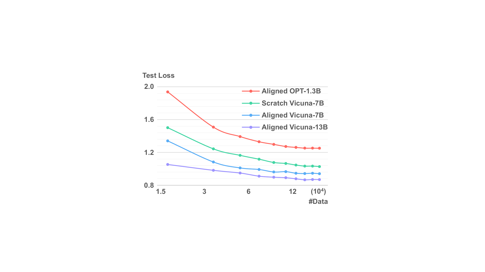

## Embodied Action in 3D World

0ex -1em Overview. To probe <span class="smallcaps">LEO</span>’s capacity of bridging vision-language-acting in the 3D world, we select two canonical embodied AI tasks: embodied navigation (`ObjNav`) on AI Habitat  and robotic manipulation on CLIPort . Specifically, for CLIPort robotic manipulation, we evaluate <span class="smallcaps">LEO</span> on the three tasks listed in   
eftab:test_result_act_cliport including their unseen counterparts, and report the success scores. For `ObjNav`, we evaluate <span class="smallcaps">LEO</span> on the original MP3D `ObjNav` validation split. Additionally, we test generalization to the validation split of the newly introduced HM3D `ObjNav` task . We report the success rate and SPL metrics following . We consider both Habitat-web (fully supervised) and ZSON (zero-shot) as baselines.

0ex -1em Results & analysis. We present the results of CLIPort manipulation and object navigation in   
eftab:test_result_act_cliport,tab:test_result_act_objnav. Our findings are as follows: 1) In robotic manipulation, <span class="smallcaps">LEO</span> is comparable to state-of-the-art performances and even better on some challenging tasks. In particular, <span class="smallcaps">LEO</span> directly produces motor commands without inductive bias (*e.g*.., heatmap) that benefit previous methods, showcasing <span class="smallcaps">LEO</span>’s considerable capacity for learning embodied actions. 2) In `ObjNav`, <span class="smallcaps">LEO</span> achieves a success rate that is comparable to the baselines and has a better SPL on MP3D-val, suggesting that <span class="smallcaps">LEO</span> can leverage the object-centric 3D scene input (potentially offering a coarse global map) and take a shorter path to the target. Furthermore, results on HM3D-val confirm <span class="smallcaps">LEO</span>’s zero-shot generalization to novel scenes. Notably, all baselines are equipped with recurrent modules while <span class="smallcaps">LEO</span> only incorporates truncated past actions, which could account for a lower success rate (see discussion in  
efsec:supp_eai_split). 3) Overall, the two-stage learning scheme endows <span class="smallcaps">LEO</span> with semantic-level generalization (novel objects, *etc*..) in both manipulation and navigation tasks. We demonstrate the efficacy of tackling embodied acting tasks with a general framework from 3D VL.

0ex -1em Additional results. We further investigate the perception modules, data regime, and generalization to unseen objects in `ObjNav` task. See the results in  
efsec:result_objnav_additional.

## More Insights into <span class="smallcaps">LEO</span>

0ex -1em Overview. In this section, we aim to offer deeper insights into <span class="smallcaps">LEO</span>’s characteristics, mainly from the data perspective (model perspective is deferred to  
efsec:model_ablation). Specifically, we evaluate <span class="smallcaps">LEO</span> when trained with different data configurations, including exact match, sentence similarity, and human rating. We regard <span class="smallcaps">LEO</span> instruction-tuned without embodied acting tasks (*w/o Act*) as the default setting. Following , we use ground-truth object segments in these analyses. We present additional analyses on data in  
efsec:data_comparison and model in  
efsec:model_comparison.

0ex -1em Alignment stage. In contrast to complete two-stage training (*w/o Act*), we direct instruction-tune a model without alignment stage (*w/o Align*). The results in  
eftab:data_ablation show the consistent impact of alignment. In particular, the benefit of alignment is significant on Scan2Cap since it concerns detailed scene understanding and captioning, which is a primary focus of alignment training.

0ex -1em Specialist *vs*.. generalist. We train a specialist on ScanNet scenes (*ScanNet*). As shown in  
eftab:data_ablation, *ScanNet* performs slightly worse than *w/o Act* even on ScanNet tasks, and particularly struggles at generalization across scenes (3RQA) and tasks (3RDialog and 3RPlan). This demonstrates the advantage of generalist-style instruction tuning with broad coverage of scenes and tasks.

0ex -1em VL *vs*.. VLA. We compare *w/o Act* and *VLA*, which differ in whether embodied acting tasks are included for training. The results in  
eftab:data_ablation show that incorporating embodied acting tasks could lead to performance drops on 3D VL tasks. This may stem from 1) the gap between language generation and embodied action prediction, and 2) the imbalanced data scale of embodied acting tasks. In contrast to the finding that VL data benefits embodied acting tasks in VLA co-training , our observation implies that embodied acting tasks may harm VL capabilities in turn. How to continually bridge the gap between VL and embodied acting tasks is an important direction for further exploration.

0ex -1em Dialogue and planning data. In contrast to the default model (*w/ Dialg* in  
eftab:response_trueskill), we train <span class="smallcaps">LEO</span> without dialogue and planning data (*w/o Dialg*). We design an evaluation set with three types of questions (Answerable, Unanswerable, and NLP) and evaluate with TrueSkill  according to human preference (see details in  
efsec:dialog_planning). The results in  
eftab:response_trueskill confirm more hallucinations (less preferred by users on “Unanswerable”) and worse NLP skills for *w/o Dialg*. This is probably because 1) the diverse conversations in our dialogue data can help cultivate flexible responses to complex instructions, and 2) our planning data can offer scene-grounded commonsense knowledge and also encourage detailed coherent text.

0ex -1em Data balancing. We find imbalanced data could induce hallucination in <span class="smallcaps">LEO</span>, *e.g*.., it tends to respond with “Yes” when asked “Is there something in this room?”. To address this, we augment the 3RScanQA data with more negative samples where non-existent objects are queried. We also design an evaluation set with different types (Yes and No) of object-existence questions (see details in  
efsec:data_balancing). Results in  
eftab:data_balance demonstrate that we can effectively mitigate the hallucination problem by balancing the tuning data. Moreover, the benefit of augmenting 3RScan data can transfer to ScanNet scenes in a zero-shot manner.

## Scaling Law Analysis

0ex -1em Settings. We study the scaling effect  of data and model in <span class="smallcaps">LEO</span> by tracking the instruction-tuning loss on the test set with the growth of data scale. In addition to the default Vicuna-7B, we incorporate two LLMs at different scales: OPT-1.3B and Vicuna-13B . For Vicuna-7B, we also probe the influence of alignment (Scratch *vs*.. Aligned).

0ex -1em Results & analysis. From the test loss curves in  
effig:scaling_law, we have the following findings: **1) The instruction tuning of <span class="smallcaps">LEO</span> conforms to the scaling law** . We observe that all curves decrease log-linearly with the data scale. **2) Scaling up LLM leads to consistent improvements.** Aligned Vicuna-7B shows significantly lower losses than Aligned OPT-1.3B. In contrast, despite the consistent improvements, the gap between Aligned Vicuna-7B and Vicuna-13B appears less significant, suggesting potential saturation if we continue to scale up the LLM. This indicates the scalability of <span class="smallcaps">LEO</span> and the necessity of scaling up data to match the model capacity. **3) Alignment leads to consistent improvements.** Aligned Vicuna-7B shows consistently lower losses than Scratch Vicuna-7B, which corresponds to the inferior performances of *w/o Align* in  
eftab:data_ablation.

# Related Work

0ex -1em Generalist agents. The AI community has witnessed the rising generalist models in both vision  and language  domains. A generalist agent requires additional embodiment knowledge to interact with the environment and complete embodied acting tasks. Existing efforts towards generalist agents include: grounded reasoning and task planning in the real world , skill generalization in open-world environment , general robotic manipulation , and unified vision-language-action (VLA) models such as Gato , PaLM-E , EmbodiedGPT , and RT-2 . <span class="smallcaps">LEO</span> belongs to the <span acronym-label="vla" acronym-form="singular+short">vla</span> model, however, its goal is to build a generalist agent that can understand the real 3D world beyond 2D images, which is absent in existing works.

0ex -1em Multi-modal instruction tuning. Pre-trained LLMs demonstrated practical for solving vision-language tasks . Meanwhile, the instruction-tuning paradigm exhibited strong zero-shot generalization in NLP tasks . The two streams merged into instruction-tuned LVLMs . Despite the burst, these models are confined to 2D visual modalities, *e.g*.., image or video. Concurrent works  extend to 3D vision tasks, but these models either lack the acting capability or unified efficient architecture.

0ex -1em Grounded 3D scene understanding. One key obstacle to building <span class="smallcaps">LEO</span> is grounding the 3D world with natural languages. There exist diverse methods of grounded scene understanding, *e.g*.., spatial relation modeling and fine-grained open-scene understanding . However, due to data scarcity, how to utilize <span acronym-label="llm" acronym-form="singular+short">llm</span> to ground the 3D scene is rarely explored. Recently, 3D-LLM leverages multi-view images and Chat-3D  uses object-centric point clouds to enable the <span acronym-label="llm" acronym-form="singular+short">llm</span> with 3D grounding. In this work, we devise both 2D and 3D encoders for grounding various visual representations and employ LoRA  to efficiently fine-tune the <span acronym-label="llm" acronym-form="singular+short">llm</span>.

0ex -1em 3D data prompting from LLMs. LLMs exhibit extraordinary capabilities of text generation and serve as a source for collecting diverse instruction-following data . However, the lack of access to visual modalities makes it troublesome to collect visual instruction-tuning data. To address this issue, existing methods provide bounding boxes  and add dense captions  as image descriptions or directly use off-the-shelf <span acronym-label="lvlm" acronym-form="singular+short">lvlm</span>  to help collect such data. Unlike concurrent attempts  in collecting 3D instruction-tuning data, our approach features a scene-graph-based prompting and refinement method to prompt and correct the data.

# Conclusions

The proposed agent <span class="smallcaps">LEO</span> extends the current generalist ability of <span acronym-label="llm" acronym-form="singular+short">llm</span> from text towards the 3D world and embodied tasks. It is a crucial initial step towards building embodied generalist agents. Nonetheless, there are also limitations, *e.g*.., generalization to novel scenes, and a notable gap between VL learning and embodied action control. In light of this work, we identify several promising directions that hold the potential for substantial advancement: (1) enhancing the 3D <span acronym-label="vl" acronym-form="singular+short">vl</span> understanding capability by leveraging larger-scale VL data from richer 3D domains; (2) continually bridging the gap between 3D <span acronym-label="vl" acronym-form="singular+short">vl</span> and embodied action, as our experiments reveal the efficacy of their joint learning; (3) investigating the issues of safety and alignment in the context of embodied generalist agents, particularly given that our scaling law analysis suggests significant enhancements through scaling on data and model.

# Impact Statement

This work introduces LEO, an embodied multi-modal generalist agent designed to extend machine learning capabilities into the 3D realm, marking a significant advance in the field. The potential societal implications of LEO are manifold, touching on robotics, AR/VR, assistive technologies, and environmental planning. Ethically, it underscores the importance of responsible AI development, emphasizing safety, privacy, and fairness in automated decision-making. As LEO ventures into new territories of human-machine interaction, it prompts a re-evaluation of ethical frameworks to ensure that advancement contributes positively to society. While the immediate societal consequences of our work align with the goals of advancing machine learning, we acknowledge the necessity of ongoing ethical consideration as applications of LEO evolve.

# Acknowledgements

This work is supported in part by the National Science and Technology Major Project (2022ZD0114900).

# References

<div class="thebibliography">

Achlioptas, P., Abdelreheem, A., Xia, F., Elhoseiny, M., and Guibas, L Referit3d: Neural listeners for fine-grained 3d object identification in real-world scenes In *European Conference on Computer Vision (ECCV)*, 2020. **Abstract:** In this work we study the problem of using referential language to identify common objects in real-world 3D scenes. We focus on a challenging setup where the referred object belongs to a fine-grained object class and the underlying scene contains multiple object instances of that class. Due to the scarcity and unsuitability of existent 3D-oriented linguistic resources for this task, we first develop two large-scale and complementary visio-linguistic datasets: i) Sr3D , which contains 83.5 K template-based utterances leveraging spatial relations among fine-grained object classes to localize a referred object in a scene, and ii) Nr3D which contains 41.5K natural, free-form , utterances collected by deploying a 2-player object reference game in 3D scenes. Using utterances of either datasets, human listeners can recognize the referred object with high (\>86%, 92% resp.) accuracy. By tapping on this data, we develop novel neural listeners that can comprehend object-centric natural language and identify the referred object directly in a 3D scene. Our key technical contribution is designing an approach for combining linguistic and geometric information (in the form of 3D point clouds) and creating multi-modal (3D) neural listeners . We also show that architectures which promote object-to-object communication via graph neural networks outperform less context-aware alternatives, and that fine-grained object classification is a bottleneck for language-assisted 3D object identification. (@achlioptas2020referit3d)

Ahn, M., Brohan, A., Brown, N., Chebotar, Y., Cortes, O., David, B., Finn, C., Fu, C., Gopalakrishnan, K., Hausman, K., et al Do as i can, not as i say: Grounding language in robotic affordances *arXiv preprint arXiv:2204.01691*, 2022. **Abstract:** Large language models can encode a wealth of semantic knowledge about the world. Such knowledge could be extremely useful to robots aiming to act upon high-level, temporally extended instructions expressed in natural language. However, a significant weakness of language models is that they lack real-world experience, which makes it difficult to leverage them for decision making within a given embodiment. For example, asking a language model to describe how to clean a spill might result in a reasonable narrative, but it may not be applicable to a particular agent, such as a robot, that needs to perform this task in a particular environment. We propose to provide real-world grounding by means of pretrained skills, which are used to constrain the model to propose natural language actions that are both feasible and contextually appropriate. The robot can act as the language model’s "hands and eyes," while the language model supplies high-level semantic knowledge about the task. We show how low-level skills can be combined with large language models so that the language model provides high-level knowledge about the procedures for performing complex and temporally-extended instructions, while value functions associated with these skills provide the grounding necessary to connect this knowledge to a particular physical environment. We evaluate our method on a number of real-world robotic tasks, where we show the need for real-world grounding and that this approach is capable of completing long-horizon, abstract, natural language instructions on a mobile manipulator. The project’s website and the video can be found at https://say-can.github.io/. (@ahn2022can)

Alayrac, J.-B., Donahue, J., Luc, P., Miech, A., Barr, I., Hasson, Y., Lenc, K., Mensch, A., Millican, K., Reynolds, M., et al Flamingo: a visual language model for few-shot learning *Advances in Neural Information Processing Systems (NeurIPS)*, 2022. **Abstract:** Building models that can be rapidly adapted to novel tasks using only a handful of annotated examples is an open challenge for multimodal machine learning research. We introduce Flamingo, a family of Visual Language Models (VLM) with this ability. We propose key architectural innovations to: (i) bridge powerful pretrained vision-only and language-only models, (ii) handle sequences of arbitrarily interleaved visual and textual data, and (iii) seamlessly ingest images or videos as inputs. Thanks to their flexibility, Flamingo models can be trained on large-scale multimodal web corpora containing arbitrarily interleaved text and images, which is key to endow them with in-context few-shot learning capabilities. We perform a thorough evaluation of our models, exploring and measuring their ability to rapidly adapt to a variety of image and video tasks. These include open-ended tasks such as visual question-answering, where the model is prompted with a question which it has to answer; captioning tasks, which evaluate the ability to describe a scene or an event; and close-ended tasks such as multiple-choice visual question-answering. For tasks lying anywhere on this spectrum, a single Flamingo model can achieve a new state of the art with few-shot learning, simply by prompting the model with task-specific examples. On numerous benchmarks, Flamingo outperforms models fine-tuned on thousands of times more task-specific data. (@alayrac2022flamingo)

Antol, S., Agrawal, A., Lu, J., Mitchell, M., Batra, D., Zitnick, C. L., and Parikh, D Vqa: Visual question answering In *International Conference on Computer Vision (ICCV)*, 2015. **Abstract:** We propose the task of free-form and open-ended Visual Question Answering (VQA). Given an image and a natural language question about the image, the task is to provide an accurate natural language answer. Mirroring real-world scenarios, such as helping the visually impaired, both the questions and answers are open-ended. Visual questions selectively target different areas of an image, including background details and underlying context. As a result, a system that succeeds at VQA typically needs a more detailed understanding of the image and complex reasoning than a system producing generic image captions. Moreover, VQA is amenable to automatic evaluation, since many open-ended answers contain only a few words or a closed set of answers that can be provided in a multiple-choice format. We provide a dataset containing ~0.25M images, ~0.76M questions, and ~10M answers (www.visualqa.org), and discuss the information it provides. Numerous baselines for VQA are provided and compared with human performance. (@antol2015vqa)

Azuma, D., Miyanishi, T., Kurita, S., and Kawanabe, M Scanqa: 3d question answering for spatial scene understanding In *Conference on Computer Vision and Pattern Recognition (CVPR)*, 2022. **Abstract:** We propose a new 3D spatial understanding task for 3D question answering (3D-QA). In the 3D-QA task, models receive visual information from the entire 3D scene of a rich RGB-D indoor scan and answer given textual questions about the 3D scene. Unlike the 2D-question answering of visual question answering, the conventional 2D-QA models suffer from problems with spatial understanding of object alignment and directions and fail in object localization from the textual questions in 3D-QA. We propose a baseline model for 3D-QA, called the ScanQA \<sup xmlns:mml="http://www.w3.org/1998/Math/MathML" xmlns:xlink="http://www.w3.org/1999/xlink"\>1\</sup\> \<sup xmlns:mml="http://www.w3.org/1998/Math/MathML" xmlns:xlink="http://www.w3.org/1999/xlink"\>1\</sup\> https://github.com/ATR-DBI/ScanQA, which learns a fused descriptor from 3D object proposals and encoded sentence embeddings. This learned descriptor correlates language expressions with the underlying geometric features of the 3D scan and facilitates the regression of 3D bounding boxes to determine the described objects in textual questions. We collected human-edited question-answer pairs with free-form answers grounded in 3D objects in each 3D scene. Our new ScanQA dataset contains over 41k question-answer pairs from 800 indoor scenes obtained from the ScanNet dataset. To the best of our knowledge, ScanQA is the first large-scale effort to perform object-grounded question answering in 3D environments. (@azuma2022scanqa)

Bang, Y., Cahyawijaya, S., Lee, N., Dai, W., Su, D., Wilie, B., Lovenia, H., Ji, Z., Yu, T., Chung, W., et al A multitask, multilingual, multimodal evaluation of chatgpt on reasoning, hallucination, and interactivity *arXiv preprint arXiv:2302.04023*, 2023. **Abstract:** This paper proposes a framework for quantitatively evaluating interactive LLMs such as ChatGPT using publicly available data sets. We carry out an extensive technical evaluation of ChatGPT using 23 data sets covering 8 different common NLP application tasks. We evaluate the multitask, multilingual and multi-modal aspects of ChatGPT based on these data sets and a newly designed multimodal dataset. We find that ChatGPT outperforms LLMs with zero-shot learning on most tasks and even outperforms fine-tuned models on some tasks. We find that it is better at understanding non-Latin script languages than generating them. It is able to generate multimodal content from textual prompts, via an intermediate code generation step. Moreover, we find that ChatGPT is 63.41% accurate on average in 10 different reasoning categories under logical reasoning, non-textual reasoning, and commonsense reasoning, hence making it an unreliable reasoner. It is, for example, better at deductive than inductive reasoning. ChatGPT suffers from hallucination problems like other LLMs and it generates more extrinsic hallucinations from its parametric memory as it does not have access to an external knowledge base. Finally, the interactive feature of ChatGPT enables human collaboration with the underlying LLM to improve its performance, i.e, 8% ROUGE-1 on summarization and 2% ChrF++ on machine translation, in a multi-turn "prompt engineering" fashion. We also release codebase for evaluation set extraction. (@bang2023hallucination)

Bommasani, R., Hudson, D. A., Adeli, E., Altman, R., Arora, S., von Arx, S., Bernstein, M. S., Bohg, J., Bosselut, A., Brunskill, E., et al On the opportunities and risks of foundation models *arXiv preprint arXiv:2108.07258*, 2021. **Abstract:** AI is undergoing a paradigm shift with the rise of models (e.g., BERT, DALL-E, GPT-3) that are trained on broad data at scale and are adaptable to a wide range of downstream tasks. We call these models foundation models to underscore their critically central yet incomplete character. This report provides a thorough account of the opportunities and risks of foundation models, ranging from their capabilities (e.g., language, vision, robotics, reasoning, human interaction) and technical principles(e.g., model architectures, training procedures, data, systems, security, evaluation, theory) to their applications (e.g., law, healthcare, education) and societal impact (e.g., inequity, misuse, economic and environmental impact, legal and ethical considerations). Though foundation models are based on standard deep learning and transfer learning, their scale results in new emergent capabilities,and their effectiveness across so many tasks incentivizes homogenization. Homogenization provides powerful leverage but demands caution, as the defects of the foundation model are inherited by all the adapted models downstream. Despite the impending widespread deployment of foundation models, we currently lack a clear understanding of how they work, when they fail, and what they are even capable of due to their emergent properties. To tackle these questions, we believe much of the critical research on foundation models will require deep interdisciplinary collaboration commensurate with their fundamentally sociotechnical nature. (@bommasani2021opportunities)

Brohan, A., Brown, N., Carbajal, J., Chebotar, Y., Dabis, J., Finn, C., Gopalakrishnan, K., Hausman, K., Herzog, A., Hsu, J., et al Rt-1: Robotics transformer for real-world control at scale *arXiv preprint arXiv:2212.06817*, 2022. **Abstract:** By transferring knowledge from large, diverse, task-agnostic datasets, modern machine learning models can solve specific downstream tasks either zero-shot or with small task-specific datasets to a high level of performance. While this capability has been demonstrated in other fields such as computer vision, natural language processing or speech recognition, it remains to be shown in robotics, where the generalization capabilities of the models are particularly critical due to the difficulty of collecting real-world robotic data. We argue that one of the keys to the success of such general robotic models lies with open-ended task-agnostic training, combined with high-capacity architectures that can absorb all of the diverse, robotic data. In this paper, we present a model class, dubbed Robotics Transformer, that exhibits promising scalable model properties. We verify our conclusions in a study of different model classes and their ability to generalize as a function of the data size, model size, and data diversity based on a large-scale data collection on real robots performing real-world tasks. The project’s website and videos can be found at robotics-transformer1.github.io (@brohan2022rt)

Brohan, A., Brown, N., Carbajal, J., Chebotar, Y., Chen, X., Choromanski, K., Ding, T., Driess, D., Dubey, A., Finn, C., et al Rt-2: Vision-language-action models transfer web knowledge to robotic control *arXiv preprint arXiv:2307.15818*, 2023. **Abstract:** We study how vision-language models trained on Internet-scale data can be incorporated directly into end-to-end robotic control to boost generalization and enable emergent semantic reasoning. Our goal is to enable a single end-to-end trained model to both learn to map robot observations to actions and enjoy the benefits of large-scale pretraining on language and vision-language data from the web. To this end, we propose to co-fine-tune state-of-the-art vision-language models on both robotic trajectory data and Internet-scale vision-language tasks, such as visual question answering. In contrast to other approaches, we propose a simple, general recipe to achieve this goal: in order to fit both natural language responses and robotic actions into the same format, we express the actions as text tokens and incorporate them directly into the training set of the model in the same way as natural language tokens. We refer to such category of models as vision-language-action models (VLA) and instantiate an example of such a model, which we call RT-2. Our extensive evaluation (6k evaluation trials) shows that our approach leads to performant robotic policies and enables RT-2 to obtain a range of emergent capabilities from Internet-scale training. This includes significantly improved generalization to novel objects, the ability to interpret commands not present in the robot training data (such as placing an object onto a particular number or icon), and the ability to perform rudimentary reasoning in response to user commands (such as picking up the smallest or largest object, or the one closest to another object). We further show that incorporating chain of thought reasoning allows RT-2 to perform multi-stage semantic reasoning, for example figuring out which object to pick up for use as an improvised hammer (a rock), or which type of drink is best suited for someone who is tired (an energy drink). (@brohan2023rt)

Brown, T., Mann, B., Ryder, N., Subbiah, M., Kaplan, J. D., Dhariwal, P., Neelakantan, A., Shyam, P., Sastry, G., Askell, A., et al Language models are few-shot learners In *Advances in Neural Information Processing Systems (NeurIPS)*, 2020. **Abstract:** Recent work has demonstrated substantial gains on many NLP tasks and benchmarks by pre-training on a large corpus of text followed by fine-tuning on a specific task. While typically task-agnostic in architecture, this method still requires task-specific fine-tuning datasets of thousands or tens of thousands of examples. By contrast, humans can generally perform a new language task from only a few examples or from simple instructions - something which current NLP systems still largely struggle to do. Here we show that scaling up language models greatly improves task-agnostic, few-shot performance, sometimes even reaching competitiveness with prior state-of-the-art fine-tuning approaches. Specifically, we train GPT-3, an autoregressive language model with 175 billion parameters, 10x more than any previous non-sparse language model, and test its performance in the few-shot setting. For all tasks, GPT-3 is applied without any gradient updates or fine-tuning, with tasks and few-shot demonstrations specified purely via text interaction with the model. GPT-3 achieves strong performance on many NLP datasets, including translation, question-answering, and cloze tasks, as well as several tasks that require on-the-fly reasoning or domain adaptation, such as unscrambling words, using a novel word in a sentence, or performing 3-digit arithmetic. At the same time, we also identify some datasets where GPT-3’s few-shot learning still struggles, as well as some datasets where GPT-3 faces methodological issues related to training on large web corpora. Finally, we find that GPT-3 can generate samples of news articles which human evaluators have difficulty distinguishing from articles written by humans. We discuss broader societal impacts of this finding and of GPT-3 in general. (@brown2020language)

Cai, D., Zhao, L., Zhang, J., Sheng, L., and Xu, D 3djcg: A unified framework for joint dense captioning and visual grounding on 3d point clouds In *Conference on Computer Vision and Pattern Recognition (CVPR)*, 2022. **Abstract:** Observing that the 3D captioning task and the 3D grounding task contain both shared and complementary information in nature, in this work, we propose a unified framework to jointly solve these two distinct but closely related tasks in a synergistic fashion, which consists of both shared task-agnostic modules and lightweight task-specific modules. On one hand, the shared task-agnostic modules aim to learn precise locations of objects, fine-grained attribute features to characterize different objects, and complex relations between objects, which benefit both captioning and visual grounding. On the other hand, by casting each of the two tasks as the proxy task of another one, the lightweight task-specific modules solve the captioning task and the grounding task respectively. Extensive experiments and ablation study on three 3D vision and language datasets demonstrate that our joint training frame-work achieves significant performance gains for each individual task and finally improves the state-of-the-art performance for both captioning and grounding tasks. (@cai20223djcg)

Cai, S., Wang, Z., Ma, X., Liu, A., and Liang, Y Open-world multi-task control through goal-aware representation learning and adaptive horizon prediction In *Proceedings of the IEEE/CVF Conference on Computer Vision and Pattern Recognition*, pp. 13734–13744, 2023. **Abstract:** We study the problem of learning goal-conditioned policies in Minecraft, a popular, widely accessible yet challenging open-ended environment for developing human-level multi-task agents. We first identify two main challenges of learning such policies: 1) the indistinguishability of tasks from the state distribution, due to the vast scene diversity, and 2) the non-stationary nature of environment dynamics caused by partial observability. To tackle the first challenge, we propose Goal-Sensitive Backbone (GSB) for the policy to encourage the emergence of goal-relevant visual state representations. To tackle the second challenge, the policy is further fueled by an adaptive horizon prediction module that helps alleviate the learning uncertainty brought by the non-stationary dynamics. Experiments on 20 Minecraft tasks show that our method significantly outperforms the best baseline so far; in many of them, we double the performance. Our ablation and exploratory studies then explain how our approach beat the counterparts and also unveil the surprising bonus of zero-shot generalization to new scenes (biomes). We hope our agent could help shed some light on learning goal-conditioned, multi-task agents in challenging, open-ended environments like Minecraft. The code is released at https://github.com/CraftJarvis/MC-Controller. (@cai2023open)

Cai, S., Zhang, B., Wang, Z., Ma, X., Liu, A., and Liang, Y Groot: Learning to follow instructions by watching gameplay videos *arXiv preprint arXiv:2310.08235*, 2023. **Abstract:** We study the problem of building a controller that can follow open-ended instructions in open-world environments. We propose to follow reference videos as instructions, which offer expressive goal specifications while eliminating the need for expensive text-gameplay annotations. A new learning framework is derived to allow learning such instruction-following controllers from gameplay videos while producing a video instruction encoder that induces a structured goal space. We implement our agent GROOT in a simple yet effective encoder-decoder architecture based on causal transformers. We evaluate GROOT against open-world counterparts and human players on a proposed Minecraft SkillForge benchmark. The Elo ratings clearly show that GROOT is closing the human-machine gap as well as exhibiting a 70% winning rate over the best generalist agent baseline. Qualitative analysis of the induced goal space further demonstrates some interesting emergent properties, including the goal composition and complex gameplay behavior synthesis. The project page is available at https://craftjarvis-groot.github.io. (@cai2023groot)

Chen, D. Z., Chang, A. X., and Nießner, M Scanrefer: 3d object localization in rgb-d scans using natural language In *European Conference on Computer Vision (ECCV)*, 2020. **Abstract:** We introduce the task of 3D object localization in RGB-D scans using natural language descriptions. As input, we assume a point cloud of a scanned 3D scene along with a free-form description of a specified target object. To address this task, we propose ScanRefer , learning a fused descriptor from 3D object proposals and encoded sentence embeddings. This fused descriptor correlates language expressions with geometric features, enabling regression of the 3D bounding box of a target object. We also introduce the ScanRefer dataset, containing $$51,583$$ 51 , 583 descriptions of $$11,046$$ 11 , 046 objects from $$800$$ 800 ScanNet \[ 8 \] scenes. ScanRefer is the first large-scale effort to perform object localization via natural language expression directly in 3D (Code: https://daveredrum.github.io/ScanRefer/ ). (@chen2020scanrefer)

Chen, S., Guhur, P.-L., Tapaswi, M., Schmid, C., and Laptev, I Language conditioned spatial relation reasoning for 3d object grounding *Advances in Neural Information Processing Systems (NeurIPS)*, 2022. **Abstract:** Localizing objects in 3D scenes based on natural language requires understanding and reasoning about spatial relations. In particular, it is often crucial to distinguish similar objects referred by the text, such as "the left most chair" and "a chair next to the window". In this work we propose a language-conditioned transformer model for grounding 3D objects and their spatial relations. To this end, we design a spatial self-attention layer that accounts for relative distances and orientations between objects in input 3D point clouds. Training such a layer with visual and language inputs enables to disambiguate spatial relations and to localize objects referred by the text. To facilitate the cross-modal learning of relations, we further propose a teacher-student approach where the teacher model is first trained using ground-truth object labels, and then helps to train a student model using point cloud inputs. We perform ablation studies showing advantages of our approach. We also demonstrate our model to significantly outperform the state of the art on the challenging Nr3D, Sr3D and ScanRefer 3D object grounding datasets. (@chen2022language)

Chen, S., Zhu, H., Chen, X., Lei, Y., Yu, G., and Chen, T End-to-end 3d dense captioning with vote2cap-detr In *Conference on Computer Vision and Pattern Recognition (CVPR)*, 2023. **Abstract:** 3D dense captioning aims to generate multiple captions localized with their associated object regions. Existing methods follow a sophisticated "detect-then-describe" pipeline equipped with numerous hand-crafted components. However, these hand-crafted components would yield sub-optimal performance given cluttered object spatial and class distributions among different scenes. In this paper, we propose a simple-yet-effective transformer framework Vote2Cap-DETR based on recent popular DEtection TRansformer (DETR). Compared with prior arts, our framework has several appealing advantages: 1) Without resorting to numerous hand-crafted components, our method is based on a full transformer encoder-decoder architecture with a learnable vote query driven object decoder, and a caption decoder that produces the dense captions in a set-prediction manner. 2) In contrast to the two-stage scheme, our method can perform detection and captioning in one-stage. 3) Without bells and whistles, extensive experiments on two commonly used datasets, ScanRefer and Nr3D, demonstrate that our Vote2Cap-DETR surpasses current state-of-the-arts by 11.13% and 7.11% in CIDEr@0.5IoU, respectively. Codes will be released soon. (@chen2023end)

Chen, S., Chen, X., Zhang, C., Li, M., Yu, G., Fei, H., Zhu, H., Fan, J., and Chen, T Ll3da: Visual interactive instruction tuning for omni-3d understanding, reasoning, and planning In *Conference on Computer Vision and Pattern Recognition (CVPR)*, 2024. **Abstract:** Recent progress in Large Multimodal Models (LMM) has opened up great possibilities for various applications in the field of human-machine interactions. However, developing LMMs that can comprehend, reason, and plan in complex and diverse 3D environments remains a challenging topic, especially considering the demand for understanding permutation-invariant point cloud representations of the 3D scene. Existing works seek help from multi-view images by projecting 2D features to 3D space, which inevitably leads to huge computational overhead and performance degradation. In this paper, we present LL3DA, a Large Language 3D Assistant that takes point cloud as the direct input and responds to both text instructions and visual interactions. The additional visual interaction enables LMMs to better comprehend human interactions with the 3D environment and further remove the ambiguities within plain texts. Experiments show that LL3DA achieves remarkable results and surpasses various 3D vision-language models on both 3D Dense Captioning and 3D Question Answering. (@chen2024ll3da)

Chen, Z., Gholami, A., Nießner, M., and Chang, A. X Scan2cap: Context-aware dense captioning in rgb-d scans In *Conference on Computer Vision and Pattern Recognition (CVPR)*, 2021. **Abstract:** We introduce the task of dense captioning in 3D scans from commodity RGB-D sensors. As input, we assume a point cloud of a 3D scene; the expected output is the bounding boxes along with the descriptions for the underlying objects. To address the 3D object detection and description problems, we propose Scan2Cap, an end-to-end trained method, to detect objects in the input scene and describe them in natural language. We use an attention mechanism that generates descriptive tokens while referring to the related components in the local context. To reflect object relations (i.e. relative spatial relations) in the generated captions, we use a message passing graph module to facilitate learning object relation features. Our method can effectively localize and describe 3D objects in scenes from the ScanRefer dataset, outperforming 2D baseline methods by a significant margin (27.61% CiDEr@0.5IoU improvement). (@chen2021scan2cap)

Chiang, W.-L., Li, Z., Lin, Z., Sheng, Y., Wu, Z., Zhang, H., Zheng, L., Zhuang, S., Zhuang, Y., Gonzalez, J. E., Stoica, I., and Xing, E. P Vicuna: An open-source chatbot impressing gpt-4 with 90%\* chatgpt quality 2023. URL <https://lmsys.org/blog/2023-03-30-vicuna/>. **Abstract:** \<p\>We introduce Vicuna-13B, an open-source chatbot trained by fine-tuning LLaMA on user-shared conversations collected from ShareGPT. Preliminary evaluation ... (@vicuna2023)

Chung, H. W., Hou, L., Longpre, S., Zoph, B., Tay, Y., Fedus, W., Li, E., Wang, X., Dehghani, M., Brahma, S., et al Scaling instruction-finetuned language models *arXiv preprint arXiv:2210.11416*, 2022. **Abstract:** Finetuning language models on a collection of datasets phrased as instructions has been shown to improve model performance and generalization to unseen tasks. In this paper we explore instruction finetuning with a particular focus on (1) scaling the number of tasks, (2) scaling the model size, and (3) finetuning on chain-of-thought data. We find that instruction finetuning with the above aspects dramatically improves performance on a variety of model classes (PaLM, T5, U-PaLM), prompting setups (zero-shot, few-shot, CoT), and evaluation benchmarks (MMLU, BBH, TyDiQA, MGSM, open-ended generation). For instance, Flan-PaLM 540B instruction-finetuned on 1.8K tasks outperforms PALM 540B by a large margin (+9.4% on average). Flan-PaLM 540B achieves state-of-the-art performance on several benchmarks, such as 75.2% on five-shot MMLU. We also publicly release Flan-T5 checkpoints, which achieve strong few-shot performance even compared to much larger models, such as PaLM 62B. Overall, instruction finetuning is a general method for improving the performance and usability of pretrained language models. (@chung2022scaling)

Dai, A., Chang, A. X., Savva, M., Halber, M., Funkhouser, T., and Nießner, M Scannet: Richly-annotated 3d reconstructions of indoor scenes In *Conference on Computer Vision and Pattern Recognition (CVPR)*, 2017. **Abstract:** A key requirement for leveraging supervised deep learning methods is the availability of large, labeled datasets. Unfortunately, in the context of RGB-D scene understanding, very little data is available - current datasets cover a small range of scene views and have limited semantic annotations. To address this issue, we introduce ScanNet, an RGB-D video dataset containing 2.5M views in 1513 scenes annotated with 3D camera poses, surface reconstructions, and semantic segmentations. To collect this data, we designed an easy-to-use and scalable RGB-D capture system that includes automated surface reconstruction and crowd-sourced semantic annotation.We show that using this data helps achieve state-of-the-art performance on several 3D scene understanding tasks, including 3D object classification, semantic voxel labeling, and CAD model retrieval. (@dai2017scannet)

Dai, W., Li, J., Li, D., Tiong, A. M. H., Zhao, J., Wang, W., Li, B., Fung, P., and Hoi, S Instructblip: Towards general-purpose vision-language models with instruction tuning *arXiv preprint arXiv:2305.06500*, 2023. **Abstract:** Large-scale pre-training and instruction tuning have been successful at creating general-purpose language models with broad competence. However, building general-purpose vision-language models is challenging due to the rich input distributions and task diversity resulting from the additional visual input. Although vision-language pretraining has been widely studied, vision-language instruction tuning remains under-explored. In this paper, we conduct a systematic and comprehensive study on vision-language instruction tuning based on the pretrained BLIP-2 models. We gather 26 publicly available datasets, covering a wide variety of tasks and capabilities, and transform them into instruction tuning format. Additionally, we introduce an instruction-aware Query Transformer, which extracts informative features tailored to the given instruction. Trained on 13 held-in datasets, InstructBLIP attains state-of-the-art zero-shot performance across all 13 held-out datasets, substantially outperforming BLIP-2 and larger Flamingo models. Our models also lead to state-of-the-art performance when finetuned on individual downstream tasks (e.g., 90.7% accuracy on ScienceQA questions with image contexts). Furthermore, we qualitatively demonstrate the advantages of InstructBLIP over concurrent multimodal models. All InstructBLIP models are open-sourced at https://github.com/salesforce/LAVIS/tree/main/projects/instructblip. (@dai2023instructblip)

Deitke, M., Schwenk, D., Salvador, J., Weihs, L., Michel, O., VanderBilt, E., Schmidt, L., Ehsani, K., Kembhavi, A., and Farhadi, A Objaverse: A universe of annotated 3d objects In *Conference on Computer Vision and Pattern Recognition (CVPR)*, 2023. **Abstract:** Massive data corpora like WebText, Wikipedia, Conceptual Captions, WebImageText, and LAION have propelled recent dramatic progress in AI. Large neural models trained on such datasets produce impressive results and top many of today’s benchmarks. A notable omisslion within this family of large-scale datasets is 3D data. Despite considerable interest and potential applications in 3D vision, datasets of high-fidelity 3D models continue to be mid-sized with limited diversity of object categories. Addressing this gap, we present Objaverse 1.0, a large dataset of objects with 800K + (and growing) 3D models with descriptive captions, tags, and animations. Objaverse improves upon present day 3D repositories in terms of scale, number of categories, and in the visual diversity of instances within a category. We demonstrate the large potential of Objaverse via four diverse applications: training generative 3D models, improving tail category segmentation on the LVIS benchmark, training open-vocabulary object-navigation models for Embodied AI, and creating a new benchmark for robustness analysis of vision models. Objaverse can open new directions for research and enable new applications across the field of AI. (@deitke2023objaverse)

Driess, D., Xia, F., Sajjadi, M. S., Lynch, C., Chowdhery, A., Ichter, B., Wahid, A., Tompson, J., Vuong, Q., Yu, T., et al Palm-e: An embodied multimodal language model In *International Conference on Machine Learning (ICML)*, 2023. **Abstract:** Large language models excel at a wide range of complex tasks. However, enabling general inference in the real world, e.g., for robotics problems, raises the challenge of grounding. We propose embodied language models to directly incorporate real-world continuous sensor modalities into language models and thereby establish the link between words and percepts. Input to our embodied language model are multi-modal sentences that interleave visual, continuous state estimation, and textual input encodings. We train these encodings end-to-end, in conjunction with a pre-trained large language model, for multiple embodied tasks including sequential robotic manipulation planning, visual question answering, and captioning. Our evaluations show that PaLM-E, a single large embodied multimodal model, can address a variety of embodied reasoning tasks, from a variety of observation modalities, on multiple embodiments, and further, exhibits positive transfer: the model benefits from diverse joint training across internet-scale language, vision, and visual-language domains. Our largest model, PaLM-E-562B with 562B parameters, in addition to being trained on robotics tasks, is a visual-language generalist with state-of-the-art performance on OK-VQA, and retains generalist language capabilities with increasing scale. (@driess2023palm)

Fan, L., Wang, G., Jiang, Y., Mandlekar, A., Yang, Y., Zhu, H., Tang, A., Huang, D.-A., Zhu, Y., and Anandkumar, A Minedojo: Building open-ended embodied agents with internet-scale knowledge *Advances in Neural Information Processing Systems (NeurIPS)*, 2022. **Abstract:** Autonomous agents have made great strides in specialist domains like Atari games and Go. However, they typically learn tabula rasa in isolated environments with limited and manually conceived objectives, thus failing to generalize across a wide spectrum of tasks and capabilities. Inspired by how humans continually learn and adapt in the open world, we advocate a trinity of ingredients for building generalist agents: 1) an environment that supports a multitude of tasks and goals, 2) a large-scale database of multimodal knowledge, and 3) a flexible and scalable agent architecture. We introduce MineDojo, a new framework built on the popular Minecraft game that features a simulation suite with thousands of diverse open-ended tasks and an internet-scale knowledge base with Minecraft videos, tutorials, wiki pages, and forum discussions. Using MineDojo’s data, we propose a novel agent learning algorithm that leverages large pre-trained video-language models as a learned reward function. Our agent is able to solve a variety of open-ended tasks specified in free-form language without any manually designed dense shaping reward. We open-source the simulation suite, knowledge bases, algorithm implementation, and pretrained models (https://minedojo.org) to promote research towards the goal of generally capable embodied agents. (@fan2022minedojo)

Gao, P., Han, J., Zhang, R., Lin, Z., Geng, S., Zhou, A., Zhang, W., Lu, P., He, C., Yue, X., et al Llama-adapter v2: Parameter-efficient visual instruction model *arXiv preprint arXiv:2304.15010*, 2023. **Abstract:** How to efficiently transform large language models (LLMs) into instruction followers is recently a popular research direction, while training LLM for multi-modal reasoning remains less explored. Although the recent LLaMA-Adapter demonstrates the potential to handle visual inputs with LLMs, it still cannot generalize well to open-ended visual instructions and lags behind GPT-4. In this paper, we present LLaMA-Adapter V2, a parameter-efficient visual instruction model. Specifically, we first augment LLaMA-Adapter by unlocking more learnable parameters (e.g., norm, bias and scale), which distribute the instruction-following ability across the entire LLaMA model besides adapters. Secondly, we propose an early fusion strategy to feed visual tokens only into the early LLM layers, contributing to better visual knowledge incorporation. Thirdly, a joint training paradigm of image-text pairs and instruction-following data is introduced by optimizing disjoint groups of learnable parameters. This strategy effectively alleviates the interference between the two tasks of image-text alignment and instruction following and achieves strong multi-modal reasoning with only a small-scale image-text and instruction dataset. During inference, we incorporate additional expert models (e.g. captioning/OCR systems) into LLaMA-Adapter to further enhance its image understanding capability without incurring training costs. Compared to the original LLaMA-Adapter, our LLaMA-Adapter V2 can perform open-ended multi-modal instructions by merely introducing 14M parameters over LLaMA. The newly designed framework also exhibits stronger language-only instruction-following capabilities and even excels in chat interactions. Our code and models are available at https://github.com/ZrrSkywalker/LLaMA-Adapter. (@gao2023llama)

Gong, R., Huang, J., Zhao, Y., Geng, H., Gao, X., Wu, Q., Ai, W., Zhou, Z., Terzopoulos, D., Zhu, S.-C., et al Arnold: A benchmark for language-grounded task learning with continuous states in realistic 3d scenes In *International Conference on Computer Vision (ICCV)*, 2023. **Abstract:** Understanding the continuous states of objects is essential for task learning and planning in the real world. However, most existing task learning benchmarks assume discrete (e.g., binary) object goal states, which poses challenges for the learning of complex tasks and transferring learned policy from simulated environments to the real world. Furthermore, state discretization limits a robot’s ability to follow human instructions based on the grounding of actions and states. To tackle these challenges, we present ARNOLD, a benchmark that evaluates language-grounded task learning with continuous states in realistic 3D scenes. ARNOLD is comprised of 8 language-conditioned tasks that involve understanding object states and learning policies for continuous goals. To promote language-instructed learning, we provide expert demonstrations with template-generated language descriptions. We assess task performance by utilizing the latest language-conditioned policy learning models. Our results indicate that current models for language-conditioned manipulations continue to experience significant challenges in novel goal-state generalizations, scene generalizations, and object generalizations. These findings highlight the need to develop new algorithms that address this gap and underscore the potential for further research in this area. Project website: https://arnold-benchmark.github.io. (@gong2023arnold)

Gong, R., Huang, Q., Ma, X., Vo, H., Durante, Z., Noda, Y., Zheng, Z., Zhu, S.-C., Terzopoulos, D., Fei-Fei, L., et al Mindagent: Emergent gaming interaction *arXiv preprint arXiv:2309.09971*, 2023. **Abstract:** Large Language Models (LLMs) have the capacity of performing complex scheduling in a multi-agent system and can coordinate these agents into completing sophisticated tasks that require extensive collaboration. However, despite the introduction of numerous gaming frameworks, the community has insufficient benchmarks towards building general multi-agents collaboration infrastructure that encompass both LLM and human-NPCs collaborations. In this work, we propose a novel infrastructure - MindAgent - to evaluate planning and coordination emergent capabilities for gaming interaction. In particular, our infrastructure leverages existing gaming framework, to i) require understanding of the coordinator for a multi-agent system, ii) collaborate with human players via un-finetuned proper instructions, and iii) establish an in-context learning on few-shot prompt with feedback. Furthermore, we introduce CUISINEWORLD, a new gaming scenario and related benchmark that dispatch a multi-agent collaboration efficiency and supervise multiple agents playing the game simultaneously. We conduct comprehensive evaluations with new auto-metric CoS for calculating the collaboration efficiency. Finally, our infrastructure can be deployed into real-world gaming scenarios in a customized VR version of CUISINEWORLD and adapted in existing broader Minecraft gaming domain. We hope our findings on LLMs and the new infrastructure for general-purpose scheduling and coordination can help shed light on how such skills can be obtained by learning from large language corpora. (@jxma_llm_vla_vlm_mas_multiagent_2023)

Gong, T., Lyu, C., Zhang, S., Wang, Y., Zheng, M., Zhao, Q., Liu, K., Zhang, W., Luo, P., and Chen, K Multimodal-gpt: A vision and language model for dialogue with humans *arXiv preprint arXiv:2305.04790*, 2023. **Abstract:** We present a vision and language model named MultiModal-GPT to conduct multi-round dialogue with humans. MultiModal-GPT can follow various instructions from humans, such as generating a detailed caption, counting the number of interested objects, and answering general questions from users. MultiModal-GPT is parameter-efficiently fine-tuned from OpenFlamingo, with Low-rank Adapter (LoRA) added both in the cross-attention part and the self-attention part of the language model. We first construct instruction templates with vision and language data for multi-modality instruction tuning to make the model understand and follow human instructions. We find the quality of training data is vital for the dialogue performance, where few data containing short answers can lead the model to respond shortly to any instructions. To further enhance the ability to chat with humans of the MultiModal-GPT, we utilize language-only instruction-following data to train the MultiModal-GPT jointly. The joint training of language-only and visual-language instructions with the \\}emph{same} instruction template effectively improves dialogue performance. Various demos show the ability of continuous dialogue of MultiModal-GPT with humans. Code, dataset, and demo are at https://github.com/open-mmlab/Multimodal-GPT (@gong2023multimodal)

Graepel, T., Minka, T., and Herbrich, R. T A bayesian skill rating system *Advances in Neural Information Processing Systems*, 19: 569–576, 2007. **Abstract:** We present a new Bayesian skill rating system which can be viewed as a generalisation of the Elo system used in Chess. The new system tracks the uncertainty about player skills, explicitly models draws, can deal with any number of competing entities and can infer individual skills from team results. Inference is performed by approximate message passing on a factor graph representation of the model. We present experimental evidence on the increased accuracy and convergence speed of the system compared to Elo and report on our experience with the new rating system running in a large-scale commercial online gaming service under the name of TrueSkill. (@graepel2007bayesian)

Guo, J., Li, J., Li, D., Tiong, A. M. H., Li, B., Tao, D., and Hoi, S. C From images to textual prompts: Zero-shot vqa with frozen large language models In *Conference on Computer Vision and Pattern Recognition (CVPR)*, 2023. **Abstract:** Large language models (LLMs) have demonstrated excellent zero-shot generalization to new language tasks. However, effective utilization of LLMs for zero-shot visual question-answering (VQA) remains challenging, primarily due to the modality disconnection and task disconnection between LLM and VQA task. End-to-end training on vision and language data may bridge the disconnections, but is inflexible and computationally expensive. To address this issue, we propose \\}emph{Img2Prompt}, a plug-and-play module that provides the prompts that can bridge the aforementioned modality and task disconnections, so that LLMs can perform zero-shot VQA tasks without end-to-end training. In order to provide such prompts, we further employ LLM-agnostic models to provide prompts that can describe image content and self-constructed question-answer pairs, which can effectively guide LLM to perform zero-shot VQA tasks. Img2Prompt offers the following benefits: 1) It can flexibly work with various LLMs to perform VQA. 2)~Without the needing of end-to-end training, it significantly reduces the cost of deploying LLM for zero-shot VQA tasks. 3) It achieves comparable or better performance than methods relying on end-to-end training. For example, we outperform Flamingo \\}cite{Deepmind:Flamingo2022} by 5.6\\}% on VQAv2. On the challenging A-OKVQA dataset, our method even outperforms few-shot methods by as much as 20\\}%. (@guo2023images)

Hong, Y., Zhen, H., Chen, P., Zheng, S., Du, Y., Chen, Z., and Gan, C 3d-llm: Injecting the 3d world into large language models *arXiv preprint arXiv:2307.12981*, 2023. **Abstract:** Large language models (LLMs) and Vision-Language Models (VLMs) have been proven to excel at multiple tasks, such as commonsense reasoning. Powerful as these models can be, they are not grounded in the 3D physical world, which involves richer concepts such as spatial relationships, affordances, physics, layout, and so on. In this work, we propose to inject the 3D world into large language models and introduce a whole new family of 3D-LLMs. Specifically, 3D-LLMs can take 3D point clouds and their features as input and perform a diverse set of 3D-related tasks, including captioning, dense captioning, 3D question answering, task decomposition, 3D grounding, 3D-assisted dialog, navigation, and so on. Using three types of prompting mechanisms that we design, we are able to collect over 300k 3D-language data covering these tasks. To efficiently train 3D-LLMs, we first utilize a 3D feature extractor that obtains 3D features from rendered multi- view images. Then, we use 2D VLMs as our backbones to train our 3D-LLMs. By introducing a 3D localization mechanism, 3D-LLMs can better capture 3D spatial information. Experiments on ScanQA show that our model outperforms state-of-the-art baselines by a large margin (e.g., the BLEU-1 score surpasses state-of-the-art score by 9%). Furthermore, experiments on our held-in datasets for 3D captioning, task composition, and 3D-assisted dialogue show that our model outperforms 2D VLMs. Qualitative examples also show that our model could perform more tasks beyond the scope of existing LLMs and VLMs. Project Page: : https://vis-www.cs.umass.edu/3dllm/. (@hong20233d)

Hu, E. J., Shen, Y., Wallis, P., Allen-Zhu, Z., Li, Y., Wang, S., Wang, L., and Chen, W Lora: Low-rank adaptation of large language models In *International Conference on Learning Representations (ICLR)*, 2022. **Abstract:** An important paradigm of natural language processing consists of large-scale pre-training on general domain data and adaptation to particular tasks or domains. As we pre-train larger models, full fine-tuning, which retrains all model parameters, becomes less feasible. Using GPT-3 175B as an example – deploying independent instances of fine-tuned models, each with 175B parameters, is prohibitively expensive. We propose Low-Rank Adaptation, or LoRA, which freezes the pre-trained model weights and injects trainable rank decomposition matrices into each layer of the Transformer architecture, greatly reducing the number of trainable parameters for downstream tasks. Compared to GPT-3 175B fine-tuned with Adam, LoRA can reduce the number of trainable parameters by 10,000 times and the GPU memory requirement by 3 times. LoRA performs on-par or better than fine-tuning in model quality on RoBERTa, DeBERTa, GPT-2, and GPT-3, despite having fewer trainable parameters, a higher training throughput, and, unlike adapters, no additional inference latency. We also provide an empirical investigation into rank-deficiency in language model adaptation, which sheds light on the efficacy of LoRA. We release a package that facilitates the integration of LoRA with PyTorch models and provide our implementations and model checkpoints for RoBERTa, DeBERTa, and GPT-2 at https://github.com/microsoft/LoRA. (@hu2022lora)

Huang, J., Zhu, W. Y., Jia, B., Wang, Z., Ma, X., Li, Q., and Huang, S Perceive, ground, reason, and act: A benchmark for general-purpose visual representation *arXiv preprint arXiv:2211.15402*, 2022. **Abstract:** Current computer vision models, unlike the human visual system, cannot yet achieve general-purpose visual understanding. Existing efforts to create a general vision model are limited in the scope of assessed tasks and offer no overarching framework to perform them holistically. We present a new comprehensive benchmark, General-purpose Visual Understanding Evaluation (G-VUE), covering the full spectrum of visual cognitive abilities with four functional domains $\\}unicode{x2014}$ Perceive, Ground, Reason, and Act. The four domains are embodied in 11 carefully curated tasks, from 3D reconstruction to visual reasoning and manipulation. Along with the benchmark, we provide a general encoder-decoder framework to allow for the evaluation of arbitrary visual representation on all 11 tasks. We evaluate various pre-trained visual representations with our framework and observe that (1) Transformer-based visual backbone generally outperforms CNN-based backbone on G-VUE, (2) visual representations from vision-language pre-training are superior to those with vision-only pre-training across visual tasks. With G-VUE, we provide a holistic evaluation standard to motivate research toward building general-purpose visual systems via obtaining more general-purpose visual representations. (@huang2022perceive)

Huang, W., Xia, F., Xiao, T., Chan, H., Liang, J., Florence, P., Zeng, A., Tompson, J., Mordatch, I., Chebotar, Y., et al Inner monologue: Embodied reasoning through planning with language models In *Conference on Robot Learning (CoRL)*, 2022. **Abstract:** Recent works have shown how the reasoning capabilities of Large Language Models (LLMs) can be applied to domains beyond natural language processing, such as planning and interaction for robots. These embodied problems require an agent to understand many semantic aspects of the world: the repertoire of skills available, how these skills influence the world, and how changes to the world map back to the language. LLMs planning in embodied environments need to consider not just what skills to do, but also how and when to do them - answers that change over time in response to the agent’s own choices. In this work, we investigate to what extent LLMs used in such embodied contexts can reason over sources of feedback provided through natural language, without any additional training. We propose that by leveraging environment feedback, LLMs are able to form an inner monologue that allows them to more richly process and plan in robotic control scenarios. We investigate a variety of sources of feedback, such as success detection, scene description, and human interaction. We find that closed-loop language feedback significantly improves high-level instruction completion on three domains, including simulated and real table top rearrangement tasks and long-horizon mobile manipulation tasks in a kitchen environment in the real world. (@huang2022inner)

Jiang, Y., Gupta, A., Zhang, Z., Wang, G., Dou, Y., Chen, Y., Fei-Fei, L., Anandkumar, A., Zhu, Y., and Fan, L Vima: General robot manipulation with multimodal prompts In *International Conference on Machine Learning (ICML)*, 2023. **Abstract:** Prompt-based learning has emerged as a successful paradigm in natural language processing, where a single general-purpose language model can be instructed to perform any task specified by input prompts. Yet task specification in robotics comes in various forms, such as imitating one-shot demonstrations, following language instructions, and reaching visual goals. They are often considered different tasks and tackled by specialized models. We show that a wide spectrum of robot manipulation tasks can be expressed with multimodal prompts, interleaving textual and visual tokens. Accordingly, we develop a new simulation benchmark that consists of thousands of procedurally-generated tabletop tasks with multimodal prompts, 600K+ expert trajectories for imitation learning, and a four-level evaluation protocol for systematic generalization. We design a transformer-based robot agent, VIMA, that processes these prompts and outputs motor actions autoregressively. VIMA features a recipe that achieves strong model scalability and data efficiency. It outperforms alternative designs in the hardest zero-shot generalization setting by up to $2.9\\}times$ task success rate given the same training data. With $10\\}times$ less training data, VIMA still performs $2.7\\}times$ better than the best competing variant. Code and video demos are available at https://vimalabs.github.io/ (@jiang2023vima)

Kaplan, J., McCandlish, S., Henighan, T., Brown, T. B., Chess, B., Child, R., Gray, S., Radford, A., Wu, J., and Amodei, D Scaling laws for neural language models *arXiv preprint arXiv:2001.08361*, 2020. **Abstract:** We study empirical scaling laws for language model performance on the cross-entropy loss. The loss scales as a power-law with model size, dataset size, and the amount of compute used for training, with some trends spanning more than seven orders of magnitude. Other architectural details such as network width or depth have minimal effects within a wide range. Simple equations govern the dependence of overfitting on model/dataset size and the dependence of training speed on model size. These relationships allow us to determine the optimal allocation of a fixed compute budget. Larger models are significantly more sample-efficient, such that optimally compute-efficient training involves training very large models on a relatively modest amount of data and stopping significantly before convergence. (@kaplan2020scaling)

Kerr, J., Kim, C. M., Goldberg, K., Kanazawa, A., and Tancik, M Lerf: Language embedded radiance fields In *International Conference on Computer Vision (ICCV)*, 2023. **Abstract:** Humans describe the physical world using natural language to refer to specific 3D locations based on a vast range of properties: visual appearance, semantics, abstract associations, or actionable affordances. In this work we propose Language Embedded Radiance Fields (LERFs), a method for grounding language embeddings from off-the-shelf models like CLIP into NeRF, which enable these types of open-ended language queries in 3D. LERF learns a dense, multi-scale language field inside NeRF by volume rendering CLIP embeddings along training rays, supervising these embeddings across training views to provide multi-view consistency and smooth the underlying language field. After optimization, LERF can extract 3D relevancy maps for a broad range of language prompts interactively in real-time, which has potential use cases in robotics, understanding vision-language models, and interacting with 3D scenes. LERF enables pixel-aligned, zero-shot queries on the distilled 3D CLIP embeddings without relying on region proposals or masks, supporting long-tail open-vocabulary queries hierarchically across the volume. See the project website at: https://lerf.io. (@kerr2023lerf)

Kirillov, A., Mintun, E., Ravi, N., Mao, H., Rolland, C., Gustafson, L., Xiao, T., Whitehead, S., Berg, A. C., Lo, W.-Y., et al Segment anything *arXiv preprint arXiv:2304.02643*, 2023. **Abstract:** We introduce the Segment Anything (SA) project: a new task, model, and dataset for image segmentation. Using our efficient model in a data collection loop, we built the largest segmentation dataset to date (by far), with over 1 billion masks on 11M licensed and privacy respecting images. The model is designed and trained to be promptable, so it can transfer zero-shot to new image distributions and tasks. We evaluate its capabilities on numerous tasks and find that its zero-shot performance is impressive – often competitive with or even superior to prior fully supervised results. We are releasing the Segment Anything Model (SAM) and corresponding dataset (SA-1B) of 1B masks and 11M images at https://segment-anything.com to foster research into foundation models for computer vision. (@kirillov2023segment)

Kudo, T. and Richardson, J Sentencepiece: A simple and language independent subword tokenizer and detokenizer for neural text processing *arXiv preprint arXiv:1808.06226*, 2018. **Abstract:** This paper describes SentencePiece, a language-independent subword tokenizer and detokenizer designed for Neural-based text processing, including Neural Machine Translation. It provides open-source C++ and Python implementations for subword units. While existing subword segmentation tools assume that the input is pre-tokenized into word sequences, SentencePiece can train subword models directly from raw sentences, which allows us to make a purely end-to-end and language independent system. We perform a validation experiment of NMT on English-Japanese machine translation, and find that it is possible to achieve comparable accuracy to direct subword training from raw sentences. We also compare the performance of subword training and segmentation with various configurations. SentencePiece is available under the Apache 2 license at https://github.com/google/sentencepiece. (@kudo2018sentencepiece)

Lake, B. M., Salakhutdinov, R., and Tenenbaum, J. B Human-level concept learning through probabilistic program induction *Science*, 2015. **Abstract:** Handwritten characters drawn by a model Not only do children learn effortlessly, they do so quickly and with a remarkable ability to use what they have learned as the raw material for creating new stuff. Lake et al. describe a computational model that learns in a similar fashion and does so better than current deep learning algorithms. The model classifies, parses, and recreates handwritten characters, and can generate new letters of the alphabet that look “right” as judged by Turing-like tests of the model’s output in comparison to what real humans produce. Science , this issue p. 1332 (@lake2015human)

Lake, B. M., Ullman, T. D., Tenenbaum, J. B., and Gershman, S. J Building machines that learn and think like people *Behavioral and Brain Sciences*, 2017. **Abstract:** Recent progress in artificial intelligence has renewed interest in building systems that learn and think like people. Many advances have come from using deep neural networks trained end-to-end in tasks such as object recognition, video games, and board games, achieving performance that equals or even beats that of humans in some respects. Despite their biological inspiration and performance achievements, these systems differ from human intelligence in crucial ways. We review progress in cognitive science suggesting that truly human-like learning and thinking machines will have to reach beyond current engineering trends in both what they learn and how they learn it. Specifically, we argue that these machines should (1) build causal models of the world that support explanation and understanding, rather than merely solving pattern recognition problems; (2) ground learning in intuitive theories of physics and psychology to support and enrich the knowledge that is learned; and (3) harness compositionality and learning-to-learn to rapidly acquire and generalize knowledge to new tasks and situations. We suggest concrete challenges and promising routes toward these goals that can combine the strengths of recent neural network advances with more structured cognitive models. (@lake2017building)

Li, B., Zhang, Y., Chen, L., Wang, J., Pu, F., Yang, J., Li, C., and Liu, Z Mimic-it: Multi-modal in-context instruction tuning *arXiv preprint arXiv:2306.05425*, 2023. **Abstract:** High-quality instructions and responses are essential for the zero-shot performance of large language models on interactive natural language tasks. For interactive vision-language tasks involving intricate visual scenes, a large quantity of diverse and creative instruction-response pairs should be imperative to tune vision-language models (VLMs). Nevertheless, the current availability of vision-language instruction-response pairs in terms of quantity, diversity, and creativity remains limited, posing challenges to the generalization of interactive VLMs. Here we present MultI-Modal In-Context Instruction Tuning (MIMIC-IT), a dataset comprising 2.8 million multimodal instruction-response pairs, with 2.2 million unique instructions derived from images and videos. Each pair is accompanied by multi-modal in-context information, forming conversational contexts aimed at empowering VLMs in perception, reasoning, and planning. The instruction-response collection process, dubbed as Syphus, is scaled using an automatic annotation pipeline that combines human expertise with GPT’s capabilities. Using the MIMIC-IT dataset, we train a large VLM named Otter. Based on extensive evaluations conducted on vision-language benchmarks, it has been observed that Otter demonstrates remarkable proficiency in multi-modal perception, reasoning, and in-context learning. Human evaluation reveals it effectively aligns with the user’s intentions. We release the MIMIC-IT dataset, instruction-response collection pipeline, benchmarks, and the Otter model. (@li2023mimic)

Li, B., Zhang, Y., Chen, L., Wang, J., Yang, J., and Liu, Z Otter: A multi-modal model with in-context instruction tuning *arXiv preprint arXiv:2305.03726*, 2023. **Abstract:** Large language models (LLMs) have demonstrated significant universal capabilities as few/zero-shot learners in various tasks due to their pre-training on vast amounts of text data, as exemplified by GPT-3, which boosted to InstrctGPT and ChatGPT, effectively following natural language instructions to accomplish real-world tasks. In this paper, we propose to introduce instruction tuning into multi-modal models, motivated by the Flamingo model’s upstream interleaved format pretraining dataset. We adopt a similar approach to construct our MultI-Modal In-Context Instruction Tuning (MIMIC-IT) dataset. We then introduce Otter, a multi-modal model based on OpenFlamingo (open-sourced version of DeepMind’s Flamingo), trained on MIMIC-IT and showcasing improved instruction-following ability and in-context learning. We also optimize OpenFlamingo’s implementation for researchers, democratizing the required training resources from 1$\\}times$ A100 GPU to 4$\\}times$ RTX-3090 GPUs, and integrate both OpenFlamingo and Otter into Huggingface Transformers for more researchers to incorporate the models into their customized training and inference pipelines. (@li2023otter)

Li, C., Gan, Z., Yang, Z., Yang, J., Li, L., Wang, L., and Gao, J Multimodal foundation models: From specialists to general-purpose assistants 2023. **Abstract:** This monograph presents a comprehensive survey of the taxonomy and evolution of multimodal foundation models that demonstrate vision and vision-language capabilities, focusing on the transition from specialist models to general-purpose assistants. The focus encompasses five core topics, categorized into two classes; (i) a survey of well-established research areas: multimodal foundation models pre-trained for specific purposes, including two topics – methods of learning vision backbones for visual understanding and text-to-image generation; (ii) recent advances in exploratory, open research areas: multimodal foundation models that aim to play the role of general-purpose assistants, including three topics – unified vision models inspired by large language models (LLMs), end-to-end training of multimodal LLMs, and chaining multimodal tools with LLMs. The target audience of the monograph is researchers, graduate students, and professionals in computer vision and vision-language multimodal communities who are eager to learn the basics and recent advances in multimodal foundation models. (@li2023multimodal)

Li, J., Li, D., Savarese, S., and Hoi, S Blip-2: Bootstrapping language-image pre-training with frozen image encoders and large language models *arXiv preprint arXiv:2301.12597*, 2023. **Abstract:** The cost of vision-and-language pre-training has become increasingly prohibitive due to end-to-end training of large-scale models. This paper proposes BLIP-2, a generic and efficient pre-training strategy that bootstraps vision-language pre-training from off-the-shelf frozen pre-trained image encoders and frozen large language models. BLIP-2 bridges the modality gap with a lightweight Querying Transformer, which is pre-trained in two stages. The first stage bootstraps vision-language representation learning from a frozen image encoder. The second stage bootstraps vision-to-language generative learning from a frozen language model. BLIP-2 achieves state-of-the-art performance on various vision-language tasks, despite having significantly fewer trainable parameters than existing methods. For example, our model outperforms Flamingo80B by 8.7% on zero-shot VQAv2 with 54x fewer trainable parameters. We also demonstrate the model’s emerging capabilities of zero-shot image-to-text generation that can follow natural language instructions. (@li2023blip)

Liu, F., Lin, K., Li, L., Wang, J., Yacoob, Y., and Wang, L Aligning large multi-modal model with robust instruction tuning *arXiv preprint arXiv:2306.14565*, 2023. **Abstract:** Despite the promising progress in multi-modal tasks, current large multi-modal models (LMMs) are prone to hallucinating inconsistent descriptions with respect to the associated image and human instructions. This paper addresses this issue by introducing the first large and diverse visual instruction tuning dataset, named Large-scale Robust Visual (LRV)-Instruction. Our dataset comprises 400k visual instructions generated by GPT4, covering 16 vision-and-language tasks with open-ended instructions and answers. Unlike existing studies that primarily focus on positive instruction samples, we design LRV-Instruction to include both positive and negative instructions for more robust visual instruction tuning. Our negative instructions are designed at three semantic levels: (i) Nonexistent Object Manipulation, (ii) Existent Object Manipulation and (iii) Knowledge Manipulation. To efficiently measure the hallucination generated by LMMs, we propose GPT4-Assisted Visual Instruction Evaluation (GAVIE), a stable approach to evaluate visual instruction tuning like human experts. GAVIE does not require human-annotated groundtruth answers and can adapt to diverse instruction formats. We conduct comprehensive experiments to investigate the hallucination of LMMs. Our results demonstrate existing LMMs exhibit significant hallucinations when presented with our negative instructions, particularly Existent Object and Knowledge Manipulation instructions. Moreover, we successfully mitigate hallucination by finetuning MiniGPT4 and mPLUG-Owl on LRV-Instruction while improving performance on several public datasets compared to state-of-the-art methods. Additionally, we observed that a balanced ratio of positive and negative instances in the training data leads to a more robust model. Code and data are available at https://github.com/FuxiaoLiu/LRV-Instruction. (@liu2023aligning)

Liu, H., Li, C., Wu, Q., and Lee, Y. J Visual instruction tuning *arXiv preprint arXiv:2304.08485*, 2023. **Abstract:** Instruction tuning large language models (LLMs) using machine-generated instruction-following data has improved zero-shot capabilities on new tasks, but the idea is less explored in the multimodal field. In this paper, we present the first attempt to use language-only GPT-4 to generate multimodal language-image instruction-following data. By instruction tuning on such generated data, we introduce LLaVA: Large Language and Vision Assistant, an end-to-end trained large multimodal model that connects a vision encoder and LLM for general-purpose visual and language understanding.Our early experiments show that LLaVA demonstrates impressive multimodel chat abilities, sometimes exhibiting the behaviors of multimodal GPT-4 on unseen images/instructions, and yields a 85.1% relative score compared with GPT-4 on a synthetic multimodal instruction-following dataset. When fine-tuned on Science QA, the synergy of LLaVA and GPT-4 achieves a new state-of-the-art accuracy of 92.53%. We make GPT-4 generated visual instruction tuning data, our model and code base publicly available. (@liu2023visual)

Liu, Z., Mao, H., Wu, C.-Y., Feichtenhofer, C., Darrell, T., and Xie, S A convnet for the 2020s In *Conference on Computer Vision and Pattern Recognition (CVPR)*, 2022. **Abstract:** The "Roaring 20s" of visual recognition began with the introduction of Vision Transformers (ViTs), which quickly superseded ConvNets as the state-of-the-art image classification model. A vanilla ViT, on the other hand, faces difficulties when applied to general computer vision tasks such as object detection and semantic segmentation. It is the hierarchical Transformers (e.g., Swin Transformers) that reintroduced several ConvNet priors, making Transformers practically viable as a generic vision backbone and demonstrating remarkable performance on a wide variety of vision tasks. However, the effectiveness of such hybrid approaches is still largely credited to the intrinsic superiority of Transformers, rather than the inherent inductive biases of convolutions. In this work, we reexamine the design spaces and test the limits of what a pure ConvNet can achieve. We gradually "modernize" a standard ResNet toward the design of a vision Transformer, and discover several key components that contribute to the performance difference along the way. The outcome of this exploration is a family of pure ConvNet models dubbed ConvNeXt. Constructed entirely from standard ConvNet modules, ConvNeXts compete favorably with Transformers in terms of accuracy and scalability, achieving 87.8% ImageNet top-1 accuracy and outperforming Swin Transformers on COCO detection and ADE20K segmentation, while maintaining the simplicity and efficiency of standard ConvNets. (@liu2022convnet)

Lu, J., Clark, C., Zellers, R., Mottaghi, R., and Kembhavi, A Unified-io: A unified model for vision, language, and multi-modal tasks In *International Conference on Learning Representations (ICLR)*, 2023. **Abstract:** We propose Unified-IO, a model that performs a large variety of AI tasks spanning classical computer vision tasks, including pose estimation, object detection, depth estimation and image generation, vision-and-language tasks such as region captioning and referring expression, to natural language processing tasks such as question answering and paraphrasing. Developing a single unified model for such a large variety of tasks poses unique challenges due to the heterogeneous inputs and outputs pertaining to each task, including RGB images, per-pixel maps, binary masks, bounding boxes, and language. We achieve this unification by homogenizing every supported input and output into a sequence of discrete vocabulary tokens. This common representation across all tasks allows us to train a single transformer-based architecture, jointly on over 90 diverse datasets in the vision and language fields. Unified-IO is the first model capable of performing all 7 tasks on the GRIT benchmark and produces strong results across 16 diverse benchmarks like NYUv2-Depth, ImageNet, VQA2.0, OK-VQA, Swig, VizWizGround, BoolQ, and SciTail, with no task-specific fine-tuning. Code and demos for Unified-IO are available at: https://unified-io.allenai.org. (@lu2023unified)

Luo, T., Rockwell, C., Lee, H., and Johnson, J Scalable 3d captioning with pretrained models *arXiv preprint arXiv:2306.07279*, 2023. **Abstract:** We introduce Cap3D, an automatic approach for generating descriptive text for 3D objects. This approach utilizes pretrained models from image captioning, image-text alignment, and LLM to consolidate captions from multiple views of a 3D asset, completely side-stepping the time-consuming and costly process of manual annotation. We apply Cap3D to the recently introduced large-scale 3D dataset, Objaverse, resulting in 660k 3D-text pairs. Our evaluation, conducted using 41k human annotations from the same dataset, demonstrates that Cap3D surpasses human-authored descriptions in terms of quality, cost, and speed. Through effective prompt engineering, Cap3D rivals human performance in generating geometric descriptions on 17k collected annotations from the ABO dataset. Finally, we finetune Text-to-3D models on Cap3D and human captions, and show Cap3D outperforms; and benchmark the SOTA including Point-E, Shape-E, and DreamFusion. (@luo2023scalable)

Ma, X., Yong, S., Zheng, Z., Li, Q., Liang, Y., Zhu, S.-C., and Huang, S Sqa3d: Situated question answering in 3d scenes In *International Conference on Learning Representations (ICLR)*, 2023. **Abstract:** We propose a new task to benchmark scene understanding of embodied agents: Situated Question Answering in 3D Scenes (SQA3D). Given a scene context (e.g., 3D scan), SQA3D requires the tested agent to first understand its situation (position, orientation, etc.) in the 3D scene as described by text, then reason about its surrounding environment and answer a question under that situation. Based upon 650 scenes from ScanNet, we provide a dataset centered around 6.8k unique situations, along with 20.4k descriptions and 33.4k diverse reasoning questions for these situations. These questions examine a wide spectrum of reasoning capabilities for an intelligent agent, ranging from spatial relation comprehension to commonsense understanding, navigation, and multi-hop reasoning. SQA3D imposes a significant challenge to current multi-modal especially 3D reasoning models. We evaluate various state-of-the-art approaches and find that the best one only achieves an overall score of 47.20%, while amateur human participants can reach 90.06%. We believe SQA3D could facilitate future embodied AI research with stronger situation understanding and reasoning capability. (@ma2023sqa3d)

Majumdar, A., Aggarwal, G., Devnani, B., Hoffman, J., and Batra, D Zson: Zero-shot object-goal navigation using multimodal goal embeddings *Advances in Neural Information Processing Systems (NeurIPS)*, 2022. **Abstract:** We present a scalable approach for learning open-world object-goal navigation (ObjectNav) – the task of asking a virtual robot (agent) to find any instance of an object in an unexplored environment (e.g., "find a sink"). Our approach is entirely zero-shot – i.e., it does not require ObjectNav rewards or demonstrations of any kind. Instead, we train on the image-goal navigation (ImageNav) task, in which agents find the location where a picture (i.e., goal image) was captured. Specifically, we encode goal images into a multimodal, semantic embedding space to enable training semantic-goal navigation (SemanticNav) agents at scale in unannotated 3D environments (e.g., HM3D). After training, SemanticNav agents can be instructed to find objects described in free-form natural language (e.g., "sink", "bathroom sink", etc.) by projecting language goals into the same multimodal, semantic embedding space. As a result, our approach enables open-world ObjectNav. We extensively evaluate our agents on three ObjectNav datasets (Gibson, HM3D, and MP3D) and observe absolute improvements in success of 4.2% - 20.0% over existing zero-shot methods. For reference, these gains are similar or better than the 5% improvement in success between the Habitat 2020 and 2021 ObjectNav challenge winners. In an open-world setting, we discover that our agents can generalize to compound instructions with a room explicitly mentioned (e.g., "Find a kitchen sink") and when the target room can be inferred (e.g., "Find a sink and a stove"). (@majumdar2022zson)

Mountcastle, V. B An organizing principle for cerebral function: the unit module and the distributed system *The neurosciences. Fourth study program*, 1979. (@mountcastle1979organizing)

Mu, Y., Zhang, Q., Hu, M., Wang, W., Ding, M., Jin, J., Wang, B., Dai, J., Qiao, Y., and Luo, P Embodiedgpt: Vision-language pre-training via embodied chain of thought *arXiv preprint arXiv:2305.15021*, 2023. **Abstract:** Embodied AI is a crucial frontier in robotics, capable of planning and executing action sequences for robots to accomplish long-horizon tasks in physical environments. In this work, we introduce EmbodiedGPT, an end-to-end multi-modal foundation model for embodied AI, empowering embodied agents with multi-modal understanding and execution capabilities. To achieve this, we have made the following efforts: (i) We craft a large-scale embodied planning dataset, termed EgoCOT. The dataset consists of carefully selected videos from the Ego4D dataset, along with corresponding high-quality language instructions. Specifically, we generate a sequence of sub-goals with the "Chain of Thoughts" mode for effective embodied planning. (ii) We introduce an efficient training approach to EmbodiedGPT for high-quality plan generation, by adapting a 7B large language model (LLM) to the EgoCOT dataset via prefix tuning. (iii) We introduce a paradigm for extracting task-related features from LLM-generated planning queries to form a closed loop between high-level planning and low-level control. Extensive experiments show the effectiveness of EmbodiedGPT on embodied tasks, including embodied planning, embodied control, visual captioning, and visual question answering. Notably, EmbodiedGPT significantly enhances the success rate of the embodied control task by extracting more effective features. It has achieved a remarkable 1.6 times increase in success rate on the Franka Kitchen benchmark and a 1.3 times increase on the Meta-World benchmark, compared to the BLIP-2 baseline fine-tuned with the Ego4D dataset. (@mu2023embodiedgpt)

OpenAI Chatgpt <https://openai.com/blog/chatgpt/>, 2022. **Abstract:** ChatGPT, a general-purpose conversation chatbot released on November 30, 2022, by OpenAI, is expected to impact every aspect of society. However, the potential impacts of this NLP tool on education remain unknown. Such impact can be enormous as the capacity of ChatGPT may drive changes to educational learning goals, learning activities, and assessment and evaluation practices. This study was conducted by piloting ChatGPT to write an academic paper, titled Artificial Intelligence for Education (see Appendix A). The piloting result suggests that ChatGPT is able to help researchers write a paper that is coherent, (partially) accurate, informative, and systematic. The writing is extremely efficient (2-3 hours) and involves very limited professional knowledge from the author. Drawing upon the user experience, I reflect on the potential impacts of ChatGPT, as well as similar AI tools, on education. The paper concludes by suggesting adjusting learning goals—students should be able to use AI tools to conduct subject-domain tasks and education should focus on improving students’ creativity and critical thinking rather than general skills. To accomplish the learning goals, researchers should design AI-involved learning tasks to engage students in solving real-world problems. ChatGPT also raises concerns that students may outsource assessment tasks. This paper concludes that new formats of assessments are needed to focus on creativity and critical thinking that AI cannot substitute. (@openai2022chatgpt)

OpenAI Gpt-4 technical report *arXiv preprint arXiv:2303.08774*, 2023. **Abstract:** We report the development of GPT-4, a large-scale, multimodal model which can accept image and text inputs and produce text outputs. While less capable than humans in many real-world scenarios, GPT-4 exhibits human-level performance on various professional and academic benchmarks, including passing a simulated bar exam with a score around the top 10% of test takers. GPT-4 is a Transformer-based model pre-trained to predict the next token in a document. The post-training alignment process results in improved performance on measures of factuality and adherence to desired behavior. A core component of this project was developing infrastructure and optimization methods that behave predictably across a wide range of scales. This allowed us to accurately predict some aspects of GPT-4’s performance based on models trained with no more than 1/1,000th the compute of GPT-4. (@openai2023gpt4)

Ouyang, L., Wu, J., Jiang, X., Almeida, D., Wainwright, C., Mishkin, P., Zhang, C., Agarwal, S., Slama, K., Ray, A., et al Training language models to follow instructions with human feedback *Advances in Neural Information Processing Systems (NeurIPS)*, 2022. **Abstract:** Making language models bigger does not inherently make them better at following a user’s intent. For example, large language models can generate outputs that are untruthful, toxic, or simply not helpful to the user. In other words, these models are not aligned with their users. In this paper, we show an avenue for aligning language models with user intent on a wide range of tasks by fine-tuning with human feedback. Starting with a set of labeler-written prompts and prompts submitted through the OpenAI API, we collect a dataset of labeler demonstrations of the desired model behavior, which we use to fine-tune GPT-3 using supervised learning. We then collect a dataset of rankings of model outputs, which we use to further fine-tune this supervised model using reinforcement learning from human feedback. We call the resulting models InstructGPT. In human evaluations on our prompt distribution, outputs from the 1.3B parameter InstructGPT model are preferred to outputs from the 175B GPT-3, despite having 100x fewer parameters. Moreover, InstructGPT models show improvements in truthfulness and reductions in toxic output generation while having minimal performance regressions on public NLP datasets. Even though InstructGPT still makes simple mistakes, our results show that fine-tuning with human feedback is a promising direction for aligning language models with human intent. (@ouyang2022training)

Peng, B., Li, C., He, P., Galley, M., and Gao, J Instruction tuning with gpt-4 *arXiv preprint arXiv:2304.03277*, 2023. **Abstract:** Prior work has shown that finetuning large language models (LLMs) using machine-generated instruction-following data enables such models to achieve remarkable zero-shot capabilities on new tasks, and no human-written instructions are needed. In this paper, we present the first attempt to use GPT-4 to generate instruction-following data for LLM finetuning. Our early experiments on instruction-tuned LLaMA models show that the 52K English and Chinese instruction-following data generated by GPT-4 leads to superior zero-shot performance on new tasks to the instruction-following data generated by previous state-of-the-art models. We also collect feedback and comparison data from GPT-4 to enable a comprehensive evaluation and reward model training. We make our data generated using GPT-4 as well as our codebase publicly available. (@peng2023instruction)

Peng, S., Genova, K., Jiang, C., Tagliasacchi, A., Pollefeys, M., Funkhouser, T., et al Openscene: 3d scene understanding with open vocabularies In *Conference on Computer Vision and Pattern Recognition (CVPR)*, 2023. **Abstract:** Traditional 3D scene understanding approaches rely on labeled 3D datasets to train a model for a single task with supervision. We propose OpenScene, an alternative approach where a model predicts dense features for 3D scene points that are co-embedded with text and image pixels in CLIP feature space. This zero-shot approach enables task-agnostic training and open-vocabulary queries. For example, to perform SOTA zero-shot 3D semantic segmentation it first infers CLIP features for every 3D point and later classifies them based on similarities to embeddings of arbitrary class labels. More interestingly, it enables a suite of open-vocabulary scene understanding applications that have never been done before. For example, it allows a user to enter an arbitrary text query and then see a heat map indicating which parts of a scene match. Our approach is effective at identifying objects, materials, affordances, activities, and room types in complex 3D scenes, all using a single model trained without any labeled 3D data. (@peng2023openscene)

Qi, C. R., Yi, L., Su, H., and Guibas, L. J Pointnet++: Deep hierarchical feature learning on point sets in a metric space *Advances in Neural Information Processing Systems (NeurIPS)*, 2017. **Abstract:** Few prior works study deep learning on point sets. PointNet by Qi et al. is a pioneer in this direction. However, by design PointNet does not capture local structures induced by the metric space points live in, limiting its ability to recognize fine-grained patterns and generalizability to complex scenes. In this work, we introduce a hierarchical neural network that applies PointNet recursively on a nested partitioning of the input point set. By exploiting metric space distances, our network is able to learn local features with increasing contextual scales. With further observation that point sets are usually sampled with varying densities, which results in greatly decreased performance for networks trained on uniform densities, we propose novel set learning layers to adaptively combine features from multiple scales. Experiments show that our network called PointNet++ is able to learn deep point set features efficiently and robustly. In particular, results significantly better than state-of-the-art have been obtained on challenging benchmarks of 3D point clouds. (@qi2017pointnet++)

Radford, A., Kim, J. W., Hallacy, C., Ramesh, A., Goh, G., Agarwal, S., Sastry, G., Askell, A., Mishkin, P., Clark, J., et al Learning transferable visual models from natural language supervision In *International Conference on Machine Learning (ICML)*, 2021. **Abstract:** State-of-the-art computer vision systems are trained to predict a fixed set of predetermined object categories. This restricted form of supervision limits their generality and usability since additional labeled data is needed to specify any other visual concept. Learning directly from raw text about images is a promising alternative which leverages a much broader source of supervision. We demonstrate that the simple pre-training task of predicting which caption goes with which image is an efficient and scalable way to learn SOTA image representations from scratch on a dataset of 400 million (image, text) pairs collected from the internet. After pre-training, natural language is used to reference learned visual concepts (or describe new ones) enabling zero-shot transfer of the model to downstream tasks. We study the performance of this approach by benchmarking on over 30 different existing computer vision datasets, spanning tasks such as OCR, action recognition in videos, geo-localization, and many types of fine-grained object classification. The model transfers non-trivially to most tasks and is often competitive with a fully supervised baseline without the need for any dataset specific training. For instance, we match the accuracy of the original ResNet-50 on ImageNet zero-shot without needing to use any of the 1.28 million training examples it was trained on. We release our code and pre-trained model weights at https://github.com/OpenAI/CLIP. (@radford2021learning)

Raffel, C., Shazeer, N., Roberts, A., Lee, K., Narang, S., Matena, M., Zhou, Y., Li, W., and Liu, P. J Exploring the limits of transfer learning with a unified text-to-text transformer *Journal of Machine Learning Research (JMLR)*, 2020. **Abstract:** Transfer learning, where a model is first pre-trained on a data-rich task before being fine-tuned on a downstream task, has emerged as a powerful technique in natural language processing (NLP). The effectiveness of transfer learning has given rise to a diversity of approaches, methodology, and practice. In this paper, we explore the landscape of transfer learning techniques for NLP by introducing a unified framework that converts all text-based language problems into a text-to-text format. Our systematic study compares pre-training objectives, architectures, unlabeled data sets, transfer approaches, and other factors on dozens of language understanding tasks. By combining the insights from our exploration with scale and our new “Colossal Clean Crawled Corpus”, we achieve state-of-the-art results on many benchmarks covering summarization, question answering, text classification, and more. To facilitate future work on transfer learning for NLP, we release our data set, pre-trained models, and code. (@raffel2020exploring)

Ramakrishnan, S. K., Gokaslan, A., Wijmans, E., Maksymets, O., Clegg, A., Turner, J., Undersander, E., Galuba, W., Westbury, A., Chang, A. X., et al Habitat-matterport 3d dataset (hm3d): 1000 large-scale 3d environments for embodied ai. *arXiv preprint arXiv:2109.08238*, 2021. **Abstract:** We present the Habitat-Matterport 3D (HM3D) dataset. HM3D is a large-scale dataset of 1,000 building-scale 3D reconstructions from a diverse set of real-world locations. Each scene in the dataset consists of a textured 3D mesh reconstruction of interiors such as multi-floor residences, stores, and other private indoor spaces. HM3D surpasses existing datasets available for academic research in terms of physical scale, completeness of the reconstruction, and visual fidelity. HM3D contains 112.5k m^2 of navigable space, which is 1.4 - 3.7x larger than other building-scale datasets such as MP3D and Gibson. When compared to existing photorealistic 3D datasets such as Replica, MP3D, Gibson, and ScanNet, images rendered from HM3D have 20 - 85% higher visual fidelity w.r.t. counterpart images captured with real cameras, and HM3D meshes have 34 - 91% fewer artifacts due to incomplete surface reconstruction. The increased scale, fidelity, and diversity of HM3D directly impacts the performance of embodied AI agents trained using it. In fact, we find that HM3D is ‘pareto optimal’ in the following sense – agents trained to perform PointGoal navigation on HM3D achieve the highest performance regardless of whether they are evaluated on HM3D, Gibson, or MP3D. No similar claim can be made about training on other datasets. HM3D-trained PointNav agents achieve 100% performance on Gibson-test dataset, suggesting that it might be time to retire that episode dataset. (@ramakrishnan2021habitat)

Ramrakhya, R., Undersander, E., Batra, D., and Das, A Habitat-web: Learning embodied object-search strategies from human demonstrations at scale In *Conference on Computer Vision and Pattern Recognition (CVPR)*, 2022. **Abstract:** We present a large-scale study of imitating human demonstrations on tasks that require a virtual robot to search for objects in new environments - (1) ObjectGoal Navigation (e.g. ’find & go to a chair’) and (2) Pick&place (e.g. ’find mug, pick mug, find counter, place mug on counter’). First, we develop a virtual teleoperation data-collection infrastructure - connecting Habitat simulator running in a web browser to Amazon Mechanical Turk, allowing remote users to teleoperate virtual robots, safely and at scale. We collect 80k demonstrations for OBJECTNAV and 12k demonstrations for PICK&PLACE, which is an order of magnitude larger than existing human demonstration datasets in simulation or on real robots. Our virtual teleoperation data contains 29.3M actions, and is equivalent to 22.6k hours of real-world teleoperation time, and illustrates rich, diverse strategies for solving the tasks. Second, we use this data to answer the question - how does large-scale imitation learning (IL) (which has not been hitherto possible) compare to reinforcement learning (RL) (which is the status quo)? On OBJECTNAV, we find that IL (with no bells or whistles) using 70k human demonstrations outperforms RL using 240k agent-gathered trajectories. This effectively establishes an ’exchange rate’ - a single human demonstration appears to be worth ~4 agent-gathered ones. More importantly, we find the IL-trained agent learns efficient object-search behavior from humans - it peeks into rooms, checks corners for small objects, turns in place to get a panoramic view - none of these are exhibited as prominently by the RL agent, and to induce these behaviors via contemporary RL techniques would require tedious reward engineering. Finally, accuracy vs. training data size plots show promising scaling behavior, suggesting that simply collecting more demonstrations is likely to advance the state of art further. On PICK&PLACE, the comparison is starker - IL agents achieve ~18% success on episodes with new object-receptacle locations when trained with 9.5k human demonstrations, while RL agents fail to get beyond 0%. Overall, our work provides compelling evidence for investing in large-scale imitation learning. (@ramrakhya2022habitat)

Reed, S., Zolna, K., Parisotto, E., Colmenarejo, S. G., Novikov, A., Barth-Maron, G., Gimenez, M., Sulsky, Y., Kay, J., Springenberg, J. T., et al A generalist agent *Transactions on Machine Learning Research (TMLR)*, 2022. **Abstract:** Theoretical developments are helping us to comprehend the basic parameters governing the dynamics of the interactions between generalist predators and their many pest and nonpest prey. In practice, however, inter- and intraspecific interactions between generalist predators, and between the predators and their prey, within multispecies systems under the influence of rapidly changing biotic and abiotic variables are difficult to predict. We discuss trade-offs between the relative merits of specialists and generalists that allow both to be effective, and often complementary, under different circumstances. A review of manipulative field studies showed that in approximately 75% of cases, generalist predators, whether single species or species assemblages, reduced pest numbers significantly. Techniques for manipulating predator numbers to enhance pest control at different scales are discussed. We now need to find ways of disentangling the factors influencing positive and negative interactions within natural enemy communities in order to optimize beneficial synergies leading to pest control. (@reed2022generalist)

Reimers, N. and Gurevych, I Sentence-bert: Sentence embeddings using siamese bert-networks In *Annual Conference on Empirical Methods in Natural Language Processing (EMNLP)*, 2019. **Abstract:** Nils Reimers, Iryna Gurevych. Proceedings of the 2019 Conference on Empirical Methods in Natural Language Processing and the 9th International Joint Conference on Natural Language Processing (EMNLP-IJCNLP). 2019. (@reimers2019sentence)

Sanh, V., Webson, A., Raffel, C., Bach, S., Sutawika, L., Alyafeai, Z., Chaffin, A., Stiegler, A., Raja, A., Dey, M., et al Multitask prompted training enables zero-shot task generalization In *International Conference on Learning Representations (ICLR)*, 2022. **Abstract:** Large language models have recently been shown to attain reasonable zero-shot generalization on a diverse set of tasks (Brown et al., 2020). It has been hypothesized that this is a consequence of implicit multitask learning in language models’ pretraining (Radford et al., 2019). Can zero-shot generalization instead be directly induced by explicit multitask learning? To test this question at scale, we develop a system for easily mapping any natural language tasks into a human-readable prompted form. We convert a large set of supervised datasets, each with multiple prompts with diverse wording. These prompted datasets allow for benchmarking the ability of a model to perform completely held-out tasks. We fine-tune a pretrained encoder-decoder model (Raffel et al., 2020; Lester et al., 2021) on this multitask mixture covering a wide variety of tasks. The model attains strong zero-shot performance on several standard datasets, often outperforming models up to 16x its size. Further, our approach attains strong performance on a subset of tasks from the BIG-bench benchmark, outperforming models up to 6x its size. All trained models are available at https://github.com/bigscience-workshop/t-zero and all prompts are available at https://github.com/bigscience-workshop/promptsource. (@sanh2022multitask)

Savva, M., Kadian, A., Maksymets, O., Zhao, Y., Wijmans, E., Jain, B., Straub, J., Liu, J., Koltun, V., Malik, J., et al Habitat: A platform for embodied ai research In *International Conference on Computer Vision (ICCV)*, 2019. **Abstract:** We present Habitat, a platform for research in embodied artificial intelligence (AI). Habitat enables training embodied agents (virtual robots) in highly efficient photorealistic 3D simulation. Specifically, Habitat consists of: (i) Habitat-Sim: a flexible, high-performance 3D simulator with configurable agents, sensors, and generic 3D dataset handling. Habitat-Sim is fast - when rendering a scene from Matterport3D, it achieves several thousand frames per second (fps) running single-threaded, and can reach over 10,000 fps multi-process on a single GPU. (ii) Habitat-API: a modular high-level library for end-toend development of embodied AI algorithms - defining tasks (e.g. navigation, instruction following, question answering), configuring, training, and benchmarking embodied agents. These large-scale engineering contributions enable us to answer scientific questions requiring experiments that were till now impracticable or ‘merely’ impractical. Specifically, in the context of point-goal navigation: (1) we revisit the comparison between learning and SLAM approaches from two recent works \[19, 16\] and find evidence for the opposite conclusion - that learning outperforms SLAM if scaled to an order of magnitude more experience than previous investigations, and (2) we conduct the first cross-dataset generalization experiments {train, test} × {Matterport3D, Gibson} for multiple sensors {blind, RGB, RGBD, D} and find that only agents with depth (D) sensors generalize across datasets. We hope that our open-source platform and these findings will advance research in embodied AI. (@savva2019habitat)

Schmidhuber, J One big net for everything *arXiv preprint arXiv:1802.08864*, 2018. **Abstract:** I apply recent work on "learning to think" (2015) and on PowerPlay (2011) to the incremental training of an increasingly general problem solver, continually learning to solve new tasks without forgetting previous skills. The problem solver is a single recurrent neural network (or similar general purpose computer) called ONE. ONE is unusual in the sense that it is trained in various ways, e.g., by black box optimization / reinforcement learning / artificial evolution as well as supervised / unsupervised learning. For example, ONE may learn through neuroevolution to control a robot through environment-changing actions, and learn through unsupervised gradient descent to predict future inputs and vector-valued reward signals as suggested in 1990. User-given tasks can be defined through extra goal-defining input patterns, also proposed in 1990. Suppose ONE has already learned many skills. Now a copy of ONE can be re-trained to learn a new skill, e.g., through neuroevolution without a teacher. Here it may profit from re-using previously learned subroutines, but it may also forget previous skills. Then ONE is retrained in PowerPlay style (2011) on stored input/output traces of (a) ONE’s copy executing the new skill and (b) previous instances of ONE whose skills are still considered worth memorizing. Simultaneously, ONE is retrained on old traces (even those of unsuccessful trials) to become a better predictor, without additional expensive interaction with the enviroment. More and more control and prediction skills are thus collapsed into ONE, like in the chunker-automatizer system of the neural history compressor (1991). This forces ONE to relate partially analogous skills (with shared algorithmic information) to each other, creating common subroutines in form of shared subnetworks of ONE, to greatly speed up subsequent learning of additional, novel but algorithmically related skills. (@schmidhuber2018one)

Schuhmann, C., Beaumont, R., Vencu, R., Gordon, C., Wightman, R., Cherti, M., Coombes, T., Katta, A., Mullis, C., Wortsman, M., et al Laion-5b: An open large-scale dataset for training next generation image-text models *Advances in Neural Information Processing Systems (NeurIPS)*, 2022. **Abstract:** Groundbreaking language-vision architectures like CLIP and DALL-E proved the utility of training on large amounts of noisy image-text data, without relying on expensive accurate labels used in standard vision unimodal supervised learning. The resulting models showed capabilities of strong text-guided image generation and transfer to downstream tasks, while performing remarkably at zero-shot classification with noteworthy out-of-distribution robustness. Since then, large-scale language-vision models like ALIGN, BASIC, GLIDE, Flamingo and Imagen made further improvements. Studying the training and capabilities of such models requires datasets containing billions of image-text pairs. Until now, no datasets of this size have been made openly available for the broader research community. To address this problem and democratize research on large-scale multi-modal models, we present LAION-5B - a dataset consisting of 5.85 billion CLIP-filtered image-text pairs, of which 2.32B contain English language. We show successful replication and fine-tuning of foundational models like CLIP, GLIDE and Stable Diffusion using the dataset, and discuss further experiments enabled with an openly available dataset of this scale. Additionally we provide several nearest neighbor indices, an improved web-interface for dataset exploration and subset generation, and detection scores for watermark, NSFW, and toxic content detection. Announcement page https://laion.ai/laion-5b-a-new-era-of-open-large-scale-multi-modal-datasets/ (@schuhmann2022laion)

Schult, J., Engelmann, F., Hermans, A., Litany, O., Tang, S., and Leibe, B Mask3d for 3d semantic instance segmentation *arXiv preprint arXiv:2210.03105*, 2022. **Abstract:** Modern 3D semantic instance segmentation approaches predominantly rely on specialized voting mechanisms followed by carefully designed geometric clustering techniques. Building on the successes of recent Transformer-based methods for object detection and image segmentation, we propose the first Transformer-based approach for 3D semantic instance segmentation. We show that we can leverage generic Transformer building blocks to directly predict instance masks from 3D point clouds. In our model called Mask3D each object instance is represented as an instance query. Using Transformer decoders, the instance queries are learned by iteratively attending to point cloud features at multiple scales. Combined with point features, the instance queries directly yield all instance masks in parallel. Mask3D has several advantages over current state-of-the-art approaches, since it neither relies on (1) voting schemes which require hand-selected geometric properties (such as centers) nor (2) geometric grouping mechanisms requiring manually-tuned hyper-parameters (e.g. radii) and (3) enables a loss that directly optimizes instance masks. Mask3D sets a new state-of-the-art on ScanNet test (+6.2 mAP), S3DIS 6-fold (+10.1 mAP), STPLS3D (+11.2 mAP) and ScanNet200 test (+12.4 mAP). (@schult2022mask3d)

Shridhar, M., Manuelli, L., and Fox, D Cliport: What and where pathways for robotic manipulation In *Conference on Robot Learning (CoRL)*, 2021. **Abstract:** How can we imbue robots with the ability to manipulate objects precisely but also to reason about them in terms of abstract concepts? Recent works in manipulation have shown that end-to-end networks can learn dexterous skills that require precise spatial reasoning, but these methods often fail to generalize to new goals or quickly learn transferable concepts across tasks. In parallel, there has been great progress in learning generalizable semantic representations for vision and language by training on large-scale internet data, however these representations lack the spatial understanding necessary for fine-grained manipulation. To this end, we propose a framework that combines the best of both worlds: a two-stream architecture with semantic and spatial pathways for vision-based manipulation. Specifically, we present CLIPort, a language-conditioned imitation-learning agent that combines the broad semantic understanding (what) of CLIP \[1\] with the spatial precision (where) of Transporter \[2\]. Our end-to-end framework is capable of solving a variety of language-specified tabletop tasks from packing unseen objects to folding cloths, all without any explicit representations of object poses, instance segmentations, memory, symbolic states, or syntactic structures. Experiments in simulated and real-world settings show that our approach is data efficient in few-shot settings and generalizes effectively to seen and unseen semantic concepts. We even learn one multi-task policy for 10 simulated and 9 real-world tasks that is better or comparable to single-task policies. (@cliport)

Suglia, A., Gao, Q., Thomason, J., Thattai, G., and Sukhatme, G Embodied bert: A transformer model for embodied, language-guided visual task completion *arXiv preprint arXiv:2108.04927*, 2021. **Abstract:** Language-guided robots performing home and office tasks must navigate in and interact with the world. Grounding language instructions against visual observations and actions to take in an environment is an open challenge. We present Embodied BERT (EmBERT), a transformer-based model which can attend to high-dimensional, multi-modal inputs across long temporal horizons for language-conditioned task completion. Additionally, we bridge the gap between successful object-centric navigation models used for non-interactive agents and the language-guided visual task completion benchmark, ALFRED, by introducing object navigation targets for EmBERT training. We achieve competitive performance on the ALFRED benchmark, and EmBERT marks the first transformer-based model to successfully handle the long-horizon, dense, multi-modal histories of ALFRED, and the first ALFRED model to utilize object-centric navigation targets. (@suglia2021embodied)

Taori, R., Gulrajani, I., Zhang, T., Dubois, Y., Li, X., Guestrin, C., Liang, P., and Hashimoto, T. B Stanford alpaca: An instruction-following llama model <https://github.com/tatsu-lab/stanford_alpaca>, 2023. **Abstract:** Automatic fact-checking plays a crucial role in combating the spread of misinformation. Large Language Models (LLMs) and Instruction-Following variants, such as InstructGPT and Alpaca, have shown remarkable performance in various natural language processing tasks. However, their knowledge may not always be up-to-date or sufficient, potentially leading to inaccuracies in fact-checking. To address this limitation, we propose combining the power of instruction-following language models with external evidence retrieval to enhance fact-checking performance. Our approach involves leveraging search engines to retrieve relevant evidence for a given input claim. This external evidence serves as valuable supplementary information to augment the knowledge of the pretrained language model. Then, we instruct-tune an open-sourced language model, called LLaMA, using this evidence, enabling it to predict the veracity of the input claim more accurately. To evaluate our method, we conducted experiments on two widely used fact-checking datasets: RAWFC and LIAR. The results demonstrate that our approach achieves state-of-the-art performance in fact-checking tasks. By integrating external evidence, we bridge the gap between the model’s knowledge and the most up-to-date and sufficient context available, leading to improved fact-checking outcomes. Our findings have implications for combating misinformation and promoting the dissemination of accurate information on online platforms. Our released materials are accessible at: https://thcheung.github.io/factllama. (@alpaca)

Tsimpoukelli, M., Menick, J. L., Cabi, S., Eslami, S., Vinyals, O., and Hill, F Multimodal few-shot learning with frozen language models *Advances in Neural Information Processing Systems (NeurIPS)*, 2021. **Abstract:** When trained at sufficient scale, auto-regressive language models exhibit the notable ability to learn a new language task after being prompted with just a few examples. Here, we present a simple, yet effective, approach for transferring this few-shot learning ability to a multimodal setting (vision and language). Using aligned image and caption data, we train a vision encoder to represent each image as a sequence of continuous embeddings, such that a pre-trained, frozen language model prompted with this prefix generates the appropriate caption. The resulting system is a multimodal few-shot learner, with the surprising ability to learn a variety of new tasks when conditioned on examples, represented as a sequence of multiple interleaved image and text embeddings. We demonstrate that it can rapidly learn words for new objects and novel visual categories, do visual question-answering with only a handful of examples, and make use of outside knowledge, by measuring a single model on a variety of established and new benchmarks. (@tsimpoukelli2021multimodal)

Vaswani, A., Shazeer, N., Parmar, N., Uszkoreit, J., Jones, L., Gomez, A. N., Kaiser, Ł., and Polosukhin, I Attention is all you need *Advances in Neural Information Processing Systems (NeurIPS)*, 2017. **Abstract:** The dominant sequence transduction models are based on complex recurrent or convolutional neural networks in an encoder-decoder configuration. The best performing models also connect the encoder and decoder through an attention mechanism. We propose a new simple network architecture, the Transformer, based solely on attention mechanisms, dispensing with recurrence and convolutions entirely. Experiments on two machine translation tasks show these models to be superior in quality while being more parallelizable and requiring significantly less time to train. Our model achieves 28.4 BLEU on the WMT 2014 English-to-German translation task, improving over the existing best results, including ensembles by over 2 BLEU. On the WMT 2014 English-to-French translation task, our model establishes a new single-model state-of-the-art BLEU score of 41.8 after training for 3.5 days on eight GPUs, a small fraction of the training costs of the best models from the literature. We show that the Transformer generalizes well to other tasks by applying it successfully to English constituency parsing both with large and limited training data. (@vaswani2017attention)

Wald, J., Avetisyan, A., Navab, N., Tombari, F., and Nießner, M Rio: 3d object instance re-localization in changing indoor environments In *International Conference on Computer Vision (ICCV)*, 2019. **Abstract:** In this work, we introduce the task of 3D object instance re-localization (RIO): given one or multiple objects in an RGB-D scan, we want to estimate their corresponding 6DoF poses in another 3D scan of the same environment taken at a later point in time. We consider RIO a particularly important task in 3D vision since it enables a wide range of practical applications, including AI-assistants or robots that are asked to find a specific object in a 3D scene. To address this problem, we first introduce 3RScan, a novel dataset and benchmark, which features 1482 RGB-D scans of 478 environments across multiple time steps. Each scene includes several objects whose positions change over time, together with ground truth annotations of object instances and their respective 6DoF mappings among re-scans. Automatically finding 6DoF object poses leads to a particular challenging feature matching task due to varying partial observations and changes in the surrounding context. To this end, we introduce a new data-driven approach that efficiently finds matching features using a fully-convolutional 3D correspondence network operating on multiple spatial scales. Combined with a 6DoF pose optimization, our method outperforms state-of-the-art baselines on our newly-established benchmark, achieving an accuracy of 30.58%. (@wald2019rio)

Wang, G., Xie, Y., Jiang, Y., Mandlekar, A., Xiao, C., Zhu, Y., Fan, L., and Anandkumar, A Voyager: An open-ended embodied agent with large language models *arXiv preprint arXiv:2305.16291*, 2023. **Abstract:** We introduce Voyager, the first LLM-powered embodied lifelong learning agent in Minecraft that continuously explores the world, acquires diverse skills, and makes novel discoveries without human intervention. Voyager consists of three key components: 1) an automatic curriculum that maximizes exploration, 2) an ever-growing skill library of executable code for storing and retrieving complex behaviors, and 3) a new iterative prompting mechanism that incorporates environment feedback, execution errors, and self-verification for program improvement. Voyager interacts with GPT-4 via blackbox queries, which bypasses the need for model parameter fine-tuning. The skills developed by Voyager are temporally extended, interpretable, and compositional, which compounds the agent’s abilities rapidly and alleviates catastrophic forgetting. Empirically, Voyager shows strong in-context lifelong learning capability and exhibits exceptional proficiency in playing Minecraft. It obtains 3.3x more unique items, travels 2.3x longer distances, and unlocks key tech tree milestones up to 15.3x faster than prior SOTA. Voyager is able to utilize the learned skill library in a new Minecraft world to solve novel tasks from scratch, while other techniques struggle to generalize. We open-source our full codebase and prompts at https://voyager.minedojo.org/. (@wang2023voyager)

Wang, X., Wang, W., Cao, Y., Shen, C., and Huang, T Images speak in images: A generalist painter for in-context visual learning In *Conference on Computer Vision and Pattern Recognition (CVPR)*, 2023. **Abstract:** In-context learning, as a new paradigm in NLP, allows the model to rapidly adapt to various tasks with only a handful of prompts and examples. But in computer vision, the difficulties for in-context learning lie in that tasks vary significantly in the output representations, thus it is unclear how to define the general-purpose task prompts that the vision model can understand and transfer to out-of-domain tasks. In this work, we present Painter, a generalist model which addresses these obstacles with an "image"-centric solution, that is, to redefine the output of core vision tasks as images, and specify task prompts as also images. With this idea, our training process is extremely simple, which performs standard masked image modeling on the stitch of input and output image pairs. This makes the model capable of performing tasks conditioned on visible image patches. Thus, during inference, we can adopt a pair of input and output images from the same task as the input condition, to indicate which task to perform. Without bells and whistles, our generalist Painter can achieve competitive performance compared to well-established task-specific models, on seven representative vision tasks ranging from high-level visual understanding to low-level image processing. In addition, Painter significantly outperforms recent generalist models on several challenging tasks. (@wang2023images)

Wang, Y., Kordi, Y., Mishra, S., Liu, A., Smith, N. A., Khashabi, D., and Hajishirzi, H Self-instruct: Aligning language model with self generated instructions In *Annual Meeting of the Association for Computational Linguistics (ACL)*, 2023. **Abstract:** Yizhong Wang, Yeganeh Kordi, Swaroop Mishra, Alisa Liu, Noah A. Smith, Daniel Khashabi, Hannaneh Hajishirzi. Proceedings of the 61st Annual Meeting of the Association for Computational Linguistics (Volume 1: Long Papers). 2023. (@wang2023self)

Wang, Z., Cai, S., Liu, A., Ma, X., and Liang, Y Describe, explain, plan and select: Interactive planning with large language models enables open-world multi-task agents *arXiv preprint arXiv:2302.01560*, 2023. **Abstract:** We investigate the challenge of task planning for multi-task embodied agents in open-world environments. Two main difficulties are identified: 1) executing plans in an open-world environment (e.g., Minecraft) necessitates accurate and multi-step reasoning due to the long-term nature of tasks, and 2) as vanilla planners do not consider how easy the current agent can achieve a given sub-task when ordering parallel sub-goals within a complicated plan, the resulting plan could be inefficient or even infeasible. To this end, we propose "$\\}underline{D}$escribe, $\\}underline{E}$xplain, $\\}underline{P}$lan and $\\}underline{S}$elect" ($\\}textbf{DEPS}$), an interactive planning approach based on Large Language Models (LLMs). DEPS facilitates better error correction on initial LLM-generated $\\}textit{plan}$ by integrating $\\}textit{description}$ of the plan execution process and providing self-$\\}textit{explanation}$ of feedback when encountering failures during the extended planning phases. Furthermore, it includes a goal $\\}textit{selector}$, which is a trainable module that ranks parallel candidate sub-goals based on the estimated steps of completion, consequently refining the initial plan. Our experiments mark the milestone of the first zero-shot multi-task agent that can robustly accomplish 70+ Minecraft tasks and nearly double the overall performances. Further testing reveals our method’s general effectiveness in popularly adopted non-open-ended domains as well (i.e., ALFWorld and tabletop manipulation). The ablation and exploratory studies detail how our design beats the counterparts and provide a promising update on the $\\}texttt{ObtainDiamond}$ grand challenge with our approach. The code is released at https://github.com/CraftJarvis/MC-Planner. (@wang2023describe)

Wang, Z., Huang, H., Zhao, Y., Zhang, Z., and Zhao, Z Chat-3d: Data-efficiently tuning large language model for universal dialogue of 3d scenes *arXiv preprint arXiv:2308.08769*, 2023. **Abstract:** 3D scene understanding has gained significant attention due to its wide range of applications. However, existing methods for 3D scene understanding are limited to specific downstream tasks, which hinders their practicality in real-world applications. This paper presents Chat-3D, which combines the 3D visual perceptual ability of pre-trained 3D representations and the impressive reasoning and conversation capabilities of advanced LLMs to achieve the first universal dialogue systems for 3D scenes. Specifically, we align 3D representations into the feature space of LLMs, thus enabling LLMs to perceive the 3D world. Given the scarcity of 3D scene-text data, we propose a three-stage training strategy to efficiently utilize the available data for better alignment. To enhance the reasoning ability and develop a user-friendly interaction scheme, we further construct a high-quality object-centric 3D instruction dataset and design an associated object-centric prompt. Our experiments show that Chat-3D achieves an impressive ability to comprehend diverse instructions for 3D scenes, engage in intricate spatial reasoning, and incorporate external knowledge into its responses. Chat-3D achieves a 75.6% relative score compared with GPT-4 on the constructed instruction dataset. (@wang2023chat)

Wei, J., Bosma, M., Zhao, V., Guu, K., Yu, A. W., Lester, B., Du, N., Dai, A. M., and Le, Q. V Finetuned language models are zero-shot learners In *International Conference on Learning Representations (ICLR)*, 2022. **Abstract:** This paper explores a simple method for improving the zero-shot learning abilities of language models. We show that instruction tuning – finetuning language models on a collection of tasks described via instructions – substantially improves zero-shot performance on unseen tasks. We take a 137B parameter pretrained language model and instruction-tune it on over 60 NLP tasks verbalized via natural language instruction templates. We evaluate this instruction-tuned model, which we call FLAN, on unseen task types. FLAN substantially improves the performance of its unmodified counterpart and surpasses zero-shot 175B GPT-3 on 20 of 25 tasks that we evaluate. FLAN even outperforms few-shot GPT-3 by a large margin on ANLI, RTE, BoolQ, AI2-ARC, OpenbookQA, and StoryCloze. Ablation studies reveal that number of finetuning datasets, model scale, and natural language instructions are key to the success of instruction tuning. (@wei2022finetuned)

Wu, S.-C., Wald, J., Tateno, K., Navab, N., and Tombari, F Scenegraphfusion: Incremental 3d scene graph prediction from rgb-d sequences In *Conference on Computer Vision and Pattern Recognition (CVPR)*, 2021. **Abstract:** Scene graphs are a compact and explicit representation successfully used in a variety of 2D scene understanding tasks. This work proposes a method to incrementally build up semantic scene graphs from a 3D environment given a sequence of RGB-D frames. To this end, we aggregate PointNet features from primitive scene components by means of a graph neural network. We also propose a novel attention mechanism well suited for partial and missing graph data present in such an incremental reconstruction scenario. Although our proposed method is designed to run on submaps of the scene, we show it also transfers to entire 3D scenes. Experiments show that our approach outperforms 3D scene graph prediction methods by a large margin and its accuracy is on par with other 3D semantic and panoptic segmentation methods while running at 35Hz. (@wu2021scenegraphfusion)

Xu, R., Wang, X., Wang, T., Chen, Y., Pang, J., and Lin, D Pointllm: Empowering large language models to understand point clouds *arXiv preprint arXiv:2308.16911*, 2023. **Abstract:** The unprecedented advancements in Large Language Models (LLMs) have shown a profound impact on natural language processing but are yet to fully embrace the realm of 3D understanding. This paper introduces PointLLM, a preliminary effort to fill this gap, enabling LLMs to understand point clouds and offering a new avenue beyond 2D visual data. PointLLM understands colored object point clouds with human instructions and generates contextually appropriate responses, illustrating its grasp of point clouds and common sense. Specifically, it leverages a point cloud encoder with a powerful LLM to effectively fuse geometric, appearance, and linguistic information. We collect a novel dataset comprising 660K simple and 70K complex point-text instruction pairs to enable a two-stage training strategy: aligning latent spaces and subsequently instruction-tuning the unified model. To rigorously evaluate the perceptual and generalization capabilities of PointLLM, we establish two benchmarks: Generative 3D Object Classification and 3D Object Captioning, assessed through three different methods, including human evaluation, GPT-4/ChatGPT evaluation, and traditional metrics. Experimental results reveal PointLLM’s superior performance over existing 2D and 3D baselines, with a notable achievement in human-evaluated object captioning tasks where it surpasses human annotators in over 50% of the samples. Codes, datasets, and benchmarks are available at https://github.com/OpenRobotLab/PointLLM . (@xu2023pointllm)

Ye, Q., Xu, H., Xu, G., Ye, J., Yan, M., Zhou, Y., Wang, J., Hu, A., Shi, P., Shi, Y., et al mplug-owl: Modularization empowers large language models with multimodality *arXiv preprint arXiv:2304.14178*, 2023. **Abstract:** Large language models (LLMs) have demonstrated impressive zero-shot abilities on a variety of open-ended tasks, while recent research has also explored the use of LLMs for multi-modal generation. In this study, we introduce mPLUG-Owl, a novel training paradigm that equips LLMs with multi-modal abilities through modularized learning of foundation LLM, a visual knowledge module, and a visual abstractor module. This approach can support multiple modalities and facilitate diverse unimodal and multimodal abilities through modality collaboration. The training paradigm of mPLUG-Owl involves a two-stage method for aligning image and text, which learns visual knowledge with the assistance of LLM while maintaining and even improving the generation abilities of LLM. In the first stage, the visual knowledge module and abstractor module are trained with a frozen LLM module to align the image and text. In the second stage, language-only and multi-modal supervised datasets are used to jointly fine-tune a low-rank adaption (LoRA) module on LLM and the abstractor module by freezing the visual knowledge module. We carefully build a visually-related instruction evaluation set OwlEval. Experimental results show that our model outperforms existing multi-modal models, demonstrating mPLUG-Owl’s impressive instruction and visual understanding ability, multi-turn conversation ability, and knowledge reasoning ability. Besides, we observe some unexpected and exciting abilities such as multi-image correlation and scene text understanding, which makes it possible to leverage it for harder real scenarios, such as vision-only document comprehension. Our code, pre-trained model, instruction-tuned models, and evaluation set are available at https://github.com/X-PLUG/mPLUG-Owl. The online demo is available at https://www.modelscope.cn/studios/damo/mPLUG-Owl. (@ye2023mplug)

Yin, Z., Wang, J., Cao, J., Shi, Z., Liu, D., Li, M., Sheng, L., Bai, L., Huang, X., Wang, Z., et al Lamm: Language-assisted multi-modal instruction-tuning dataset, framework, and benchmark *arXiv preprint arXiv:2306.06687*, 2023. **Abstract:** Large language models have emerged as a promising approach towards achieving general-purpose AI agents. The thriving open-source LLM community has greatly accelerated the development of agents that support human-machine dialogue interaction through natural language processing. However, human interaction with the world extends beyond only text as a modality, and other modalities such as vision are also crucial. Recent works on multi-modal large language models, such as GPT-4V and Bard, have demonstrated their effectiveness in handling visual modalities. However, the transparency of these works is limited and insufficient to support academic research. To the best of our knowledge, we present one of the very first open-source endeavors in the field, LAMM, encompassing a Language-Assisted Multi-Modal instruction tuning dataset, framework, and benchmark. Our aim is to establish LAMM as a growing ecosystem for training and evaluating MLLMs, with a specific focus on facilitating AI agents capable of bridging the gap between ideas and execution, thereby enabling seamless human-AI interaction. Our main contribution is three-fold: 1) We present a comprehensive dataset and benchmark, which cover a wide range of vision tasks for 2D and 3D vision. Extensive experiments validate the effectiveness of our dataset and benchmark. 2) We outline the detailed methodology of constructing multi-modal instruction tuning datasets and benchmarks for MLLMs, enabling rapid scaling and extension of MLLM research to diverse domains, tasks, and modalities. 3) We provide a primary but potential MLLM training framework optimized for modality extension. We also provide baseline models, comprehensive experimental observations, and analysis to accelerate future research. Our baseline model is trained within 24 A100 GPU hours, framework supports training with V100 and RTX3090 is available thanks to the open-source society. (@yin2023lamm)

Yu, X., Tang, L., Rao, Y., Huang, T., Zhou, J., and Lu, J Point-bert: Pre-training 3d point cloud transformers with masked point modeling In *Conference on Computer Vision and Pattern Recognition (CVPR)*, 2022. **Abstract:** We present Point-BERT, a new paradigm for learning Transformers to generalize the concept of BERT \[8\] to 3D point cloud. Inspired by BERT, we devise a Masked Point Modeling (MPM) task to pre-train point cloud Transformers. Specifically, we first divide a point cloud into several local point patches, and a point cloud Tokenizer with a discrete Variational AutoEncoder (dVAE) is designed to generate discrete point tokens containing meaningful local information. Then, we randomly mask out some patches of input point clouds and feed them into the backbone Transformers. The pre-training objective is to recover the original point tokens at the masked locations under the supervision of point tokens obtained by the Tokenizer. Extensive experiments demonstrate that the proposed BERT-style pre-training strategy significantly improves the performance of standard point cloud Transformers. Equipped with our pre-training strategy, we show that a pure Transformer architecture attains 93.8% accuracy on ModelNet40 and 83.1% accuracy on the hardest setting of ScanObjectNN, surpassing carefully designed point cloud models with much fewer hand-made designs. We also demonstrate that the representations learned by Point-BERT transfer well to new tasks and domains, where our models largely advance the state-of-the-art of few-shot point cloud classification task. The code and pre-trained models are available at https://github.com/lulutang0608/Point-BERT. (@yu2022point)

Zhang, S., Roller, S., Goyal, N., Artetxe, M., Chen, M., Chen, S., Dewan, C., Diab, M., Li, X., Lin, X. V., et al Opt: Open pre-trained transformer language models *arXiv preprint arXiv:2205.01068*, 2022. **Abstract:** Large language models, which are often trained for hundreds of thousands of compute days, have shown remarkable capabilities for zero- and few-shot learning. Given their computational cost, these models are difficult to replicate without significant capital. For the few that are available through APIs, no access is granted to the full model weights, making them difficult to study. We present Open Pre-trained Transformers (OPT), a suite of decoder-only pre-trained transformers ranging from 125M to 175B parameters, which we aim to fully and responsibly share with interested researchers. We show that OPT-175B is comparable to GPT-3, while requiring only 1/7th the carbon footprint to develop. We are also releasing our logbook detailing the infrastructure challenges we faced, along with code for experimenting with all of the released models. (@zhang2022opt)

Zhao, H., Cai, Z., Si, S., Ma, X., An, K., Chen, L., Liu, Z., Wang, S., Han, W., and Chang, B Mmicl: Empowering vision-language model with multi-modal in-context learning *arXiv preprint arXiv:2309.07915*, 2023. **Abstract:** Since the resurgence of deep learning, vision-language models (VLMs) enhanced by large language models (LLMs) have grown exponentially in popularity. However, while LLMs can utilize extensive background knowledge and task information with in-context learning, most VLMs still struggle with understanding complex multi-modal prompts with multiple images, making VLMs less effective in downstream vision-language tasks. In this paper, we address the limitation above by 1) introducing vision-language Model with Multi-Modal In-Context Learning(MMICL), a new approach to allow the VLM to deal with multi-modal inputs efficiently; 2) proposing a novel context scheme to augment the in-context learning ability of the VLM; 3) constructing the Multi-modal In-Context Learning (MIC) dataset, designed to enhance the VLM’s ability to understand complex multi-modal prompts. Our experiments confirm that MMICL achieves new state-of-the-art zero-shot performance on a wide range of general vision-language tasks, especially for complex benchmarks, including MME and MMBench. Our analysis demonstrates that MMICL effectively tackles the challenge of complex multi-modal prompt understanding and emerges the impressive ICL ability. Furthermore, we observe that MMICL successfully alleviates language bias in VLMs, a common issue for VLMs that often leads to hallucination when faced with extensive textual context. Our code, dataset, dataset tool, and model are available at https://github.com/PKUnlp-icler/MIC (@jxma_vlm_multimodal_2023)

Zhao, L., Cai, D., Sheng, L., and Xu, D 3dvg-transformer: Relation modeling for visual grounding on point clouds In *International Conference on Computer Vision (ICCV)*, 2021. **Abstract:** Visual grounding on 3D point clouds is an emerging vision and language task that benefits various applications in understanding the 3D visual world. By formulating this task as a grounding-by-detection problem, lots of recent works focus on how to exploit more powerful detectors and comprehensive language features, but (1) how to model complex relations for generating context-aware object proposals and (2) how to leverage proposal relations to distinguish the true target object from similar proposals are not fully studied yet. Inspired by the well-known transformer architecture, we propose a relation-aware visual grounding method on 3D point clouds, named as 3DVG-Transformer, to fully utilize the contextual clues for relation-enhanced proposal generation and cross-modal proposal disambiguation, which are enabled by a newly designed coordinate-guided contextual aggregation (CCA) module in the object proposal generation stage, and a multiplex attention (MA) module in the cross-modal feature fusion stage. We validate that our 3DVG-Transformer outperforms the state-of-the-art methods by a large margin, on two point cloud-based visual grounding datasets, ScanRefer and Nr3D/Sr3D from ReferIt3D, especially for complex scenarios containing multiple objects of the same category. (@zhao20213dvg)

Zhu, D., Chen, J., Haydarov, K., Shen, X., Zhang, W., and Elhoseiny, M Chatgpt asks, blip-2 answers: Automatic questioning towards enriched visual descriptions *arXiv preprint arXiv:2303.06594*, 2023. **Abstract:** Asking insightful questions is crucial for acquiring knowledge and expanding our understanding of the world. However, the importance of questioning has been largely overlooked in AI research, where models have been primarily developed to answer questions. With the recent advancements of large language models (LLMs) like ChatGPT, we discover their capability to ask high-quality questions when provided with a suitable prompt. This discovery presents a new opportunity to develop an automatic questioning system. In this paper, we introduce ChatCaptioner, a novel automatic-questioning method deployed in image captioning. Here, ChatGPT is prompted to ask a series of informative questions about images to BLIP-2, a strong vision question-answering model. By keeping acquiring new visual information from BLIP-2’s answers, ChatCaptioner is able to generate more enriched image descriptions. We conduct human-subject evaluations on common image caption datasets such as COCO, Conceptual Caption, and WikiArt, and compare ChatCaptioner with BLIP-2 as well as ground truth. Our results demonstrate that ChatCaptioner’s captions are significantly more informative, receiving three times as many votes from human evaluators for providing the most image information. Besides, ChatCaptioner identifies 53% more objects within the image than BLIP-2 alone measured by WordNet synset matching. Code is available at https://github.com/Vision-CAIR/ChatCaptioner (@zhu2023chatgpt)

Zhu, D., Chen, J., Shen, X., Li, X., and Elhoseiny, M Minigpt-4: Enhancing vision-language understanding with advanced large language models *arXiv preprint arXiv:2304.10592*, 2023. **Abstract:** The recent GPT-4 has demonstrated extraordinary multi-modal abilities, such as directly generating websites from handwritten text and identifying humorous elements within images. These features are rarely observed in previous vision-language models. However, the technical details behind GPT-4 continue to remain undisclosed. We believe that the enhanced multi-modal generation capabilities of GPT-4 stem from the utilization of sophisticated large language models (LLM). To examine this phenomenon, we present MiniGPT-4, which aligns a frozen visual encoder with a frozen advanced LLM, Vicuna, using one projection layer. Our work, for the first time, uncovers that properly aligning the visual features with an advanced large language model can possess numerous advanced multi-modal abilities demonstrated by GPT-4, such as detailed image description generation and website creation from hand-drawn drafts. Furthermore, we also observe other emerging capabilities in MiniGPT-4, including writing stories and poems inspired by given images, teaching users how to cook based on food photos, and so on. In our experiment, we found that the model trained on short image caption pairs could produce unnatural language outputs (e.g., repetition and fragmentation). To address this problem, we curate a detailed image description dataset in the second stage to finetune the model, which consequently improves the model’s generation reliability and overall usability. Our code, pre-trained model, and collected dataset are available at https://minigpt-4.github.io/. (@zhu2023minigpt)

Zhu, Y., Gao, T., Fan, L., Huang, S., Edmonds, M., Liu, H., Gao, F., Zhang, C., Qi, S., Wu, Y. N., et al Dark, beyond deep: A paradigm shift to cognitive ai with humanlike common sense *Engineering*, 2020. **Abstract:** Recent progress in deep learning is essentially based on a "big data for small tasks" paradigm, under which massive amounts of data are used to train a classifier for a single narrow task. In this paper, we call for a shift that flips this paradigm upside down. Specifically, we propose a "small data for big tasks" paradigm, wherein a single artificial intelligence (AI) system is challenged to develop "common sense," enabling it to solve a wide range of tasks with little training data. We illustrate the potential power of this new paradigm by reviewing models of common sense that synthesize recent breakthroughs in both machine and human vision. We identify functionality, physics, intent, causality, and utility (FPICU) as the five core domains of cognitive AI with humanlike common sense. When taken as a unified concept, FPICU is concerned with the questions of "why" and "how," beyond the dominant "what" and "where" framework for understanding vision. They are invisible in terms of pixels but nevertheless drive the creation, maintenance, and development of visual scenes. We therefore coin them the "dark matter" of vision. Just as our universe cannot be understood by merely studying observable matter, we argue that vision cannot be understood without studying FPICU. We demonstrate the power of this perspective to develop cognitive AI systems with humanlike common sense by showing how to observe and apply FPICU with little training data to solve a wide range of challenging tasks, including tool use, planning, utility inference, and social learning. In summary, we argue that the next generation of AI must embrace "dark" humanlike common sense for solving novel tasks. (@zhu2020dark)

Zhu, Z., Ma, X., Chen, Y., Deng, Z., Huang, S., and Li, Q 3d-vista: Pre-trained transformer for 3d vision and text alignment In *International Conference on Computer Vision (ICCV)*, 2023. **Abstract:** 3D vision-language grounding (3D-VL) is an emerging field that aims to connect the 3D physical world with natural language, which is crucial for achieving embodied intelligence. Current 3D-VL models rely heavily on sophisticated modules, auxiliary losses, and optimization tricks, which calls for a simple and unified model. In this paper, we propose 3D-VisTA, a pre-trained Transformer for 3D Vision and Text Alignment that can be easily adapted to various downstream tasks. 3D-VisTA simply utilizes self-attention layers for both single-modal modeling and multi-modal fusion without any sophisticated task-specific design. To further enhance its performance on 3D-VL tasks, we construct ScanScribe, the first large-scale 3D scene-text pairs dataset for 3D-VL pre-training. ScanScribe contains 2,995 RGB-D scans for 1,185 unique indoor scenes originating from ScanNet and 3R-Scan datasets, along with paired 278K scene descriptions generated from existing 3D-VL tasks, templates, and GPT-3. 3D-VisTA is pre-trained on ScanScribe via masked language/object modeling and scene-text matching. It achieves state-of-the-art results on various 3D-VL tasks, ranging from visual grounding and dense captioning to question answering and situated reasoning. Moreover, 3D-VisTA demonstrates superior data efficiency, obtaining strong performance even with limited annotations during downstream task fine-tuning. (@zhu20233d)

</div>

# Qualitative Results

<figure id="fig:qualitative">
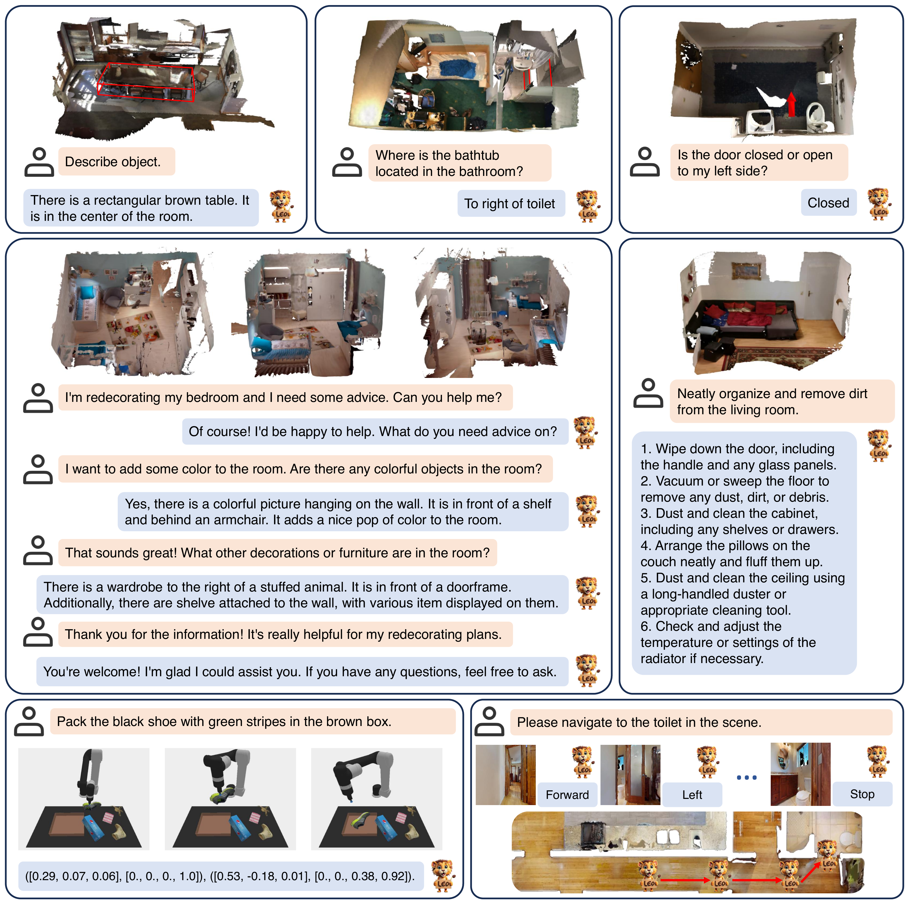
<figcaption><span id="fig:qualitative" data-label="fig:qualitative"></span> <strong>Qualitative results of interacting with <span class="smallcaps">LEO</span></strong> on unseen scenarios from a held-out test set of <span class="smallcaps">LEO</span>-instruct. <span class="smallcaps">LEO</span>’s responses and actions can be grounded in novel scenes.</figcaption>
</figure>

# Data

## More Details on LEO-align

0ex -1em Object-level caption. To facilitate object-level grounding of detailed object attributes, we leverage Cap3D , which contains language descriptions for objects in Objaverse . Given a single 3D object as input, <span class="smallcaps">LEO</span> will be asked to predict its caption.

0ex -1em Object-in-the-scene caption. For a better understanding of how an object can be related to others (spatial relations, *etc*..) when situated in a 3D scene, we collect referring expressions of objects in scenes from existing datasets, including ScanScribe  and ReferIt3D . Further, we generate additional object-referring expressions on 3RScan  scenes by prompting <span acronym-label="llm" acronym-form="singular+short">llm</span> (details in  
efapp:dataset:prompt). During alignment, <span class="smallcaps">LEO</span> needs to predict these referring expressions given the object-centric 3D input of the scene and the referred object.

0ex -1em Scene-level caption. Finally, we encourage <span class="smallcaps">LEO</span> to capture scene-level descriptions of a 3D scene. These scene-level captions focus on global information depicting key objects in the scene as well as their attributes and functionalities, relations among multiple objects, and room types and styles. We leverage scene graph annotations  and prompt <span acronym-label="llm" acronym-form="singular+short">llm</span> to produce a total of ~20K captions. To further increase caption diversity, we propose a subgraph sampling strategy to prevent LLMs from always attending to certain notable facets of the scene (details in  
efapp:subgraph_sampling). Similar to previous settings, <span class="smallcaps">LEO</span> needs to predict these captions given the corresponding 3D input.

## More Details on LEO-instruct

Below, we provide a comprehensive illustration of the data preparation process for these tasks and an overview of generated data in   
effig:data_framework. We list the corresponding instructions in  
efsec:supp_leo_ds_examples.

0ex -1em 3D captioning. The task is to produce a generic caption given 3D input. We adopt the Scan2Cap dataset , which is based on the ScanNet  3D scenes and covers various levels (object-level and scene-level) and aspects (attributes, relations, *etc*..) of scene details.

0ex -1em 3D question answering. The 3D-QA task is an extension of VQA  to 3D scenes with a focus on 3D knowledge, ranging from spatial relations to functionalities of objects. For this task, we first aggregate two existing 3D-QA datasets: ScanQA  and SQA3D . To further generate questions concerning rich 3D knowledge, we prompt LLMs to generate ~35K QA pairs on 3RScanQA with our quality refinement techniques discussed in   
efsec:data:generation.

0ex -1em 3D dialogue. The goal of this task is to support natural conversations between <span class="smallcaps">LEO</span> and users about a given 3D scene. This task necessitates coherence and continuity across multiple rounds of conversational interactions. We build such dialogues on 3RScan scenes by prompting LLMs with a variant of the Chain-of-Thought prompting method discussed in   
efsec:data:generation to facilitate diverse dialogues about relevant and accurate details about the 3D scene. In total, ~11K dialogues are collected.

0ex -1em Scene-aware task planning. In this task, <span class="smallcaps">LEO</span> is required to decompose high-level tasks into step-by-step low-level plans given 3D scenes. We expect <span class="smallcaps">LEO</span> to generate feasible plans based on the current 3D scene and ground its inherent common sense knowledge about procedures to the scene configurations, including, objects, their attributes, relations, and functional characteristics, *etc*... By prompting LLMs, we end up collecting ~14K task-plan pairs on 3RScan scenes.

0ex -1em Embodied navigation. We follow imitation learning setting in Habitat-web  for the embodied navigation task. We choose `ObjNav`, where <span class="smallcaps">LEO</span> needs to map navigation instructions (*e.g*..“find bed”), object-centric 3D input, and an egocentric 2D input into discrete habitat motor commands. For simplicity, we use shortest path navigation trials rather than human demonstrations for learning as they are less noisy and therefore easier to learn when provided with the 3D scene. In total, we generate ~60K navigation episodes out of the MP3D `ObjNav` training scenes  for this task.

0ex -1em Robotic manipulation. We employ a subset of the manipulation tasks introduced in CLIPort . The input of this task includes instructions, egocentric 2D observations, and object-centric 3D information. As discussed in   
efsec:model_tokenization, we discretize the continuous action space of CLIPort into bins to unify the action decoding of navigation and manipulation (more details in   
efsec:action_tokenization). We generate 100K demonstrations for each selected manipulation task.

## Design of Seed Tasks for LLM-assisted 3D Data Generation

0ex -1em Object Scene Caption & Scene Caption. To align the 3D scene/object with language, we prompt ChatGPT to curate these two types of caption data. Object Scene Caption includes the spatial relationships of the object with some adjacent objects in the scene. Scene Caption is the comprehensive description for the whole 3D scene, including some key objects and their spatial relationships.

0ex -1em QA & Dialogue. For QA, we design several question-answer pairs given a scene graph. A diverse set of questions are asked about the 3D scene, including the object attributes, object counting, object existence, spatial relationships between the objects, object types, object affordance, room type and so on. For dialogue, we design a conversation between the assistant and a person asking questions about this scene. The answers are in a tone as if the assistant is understanding the scene and helping the person. Different from single-round QA, dialogue has some high-level tasks such as ’searching for specific objects’ that require multi-round conversations.

0ex -1em Planning. To include a deeper understanding of the global 3D scene information, we prompt ChatGPT to generate a high-level task and 5-10 action steps(interaction between the assistant and the objects in the scene) to finish the task.

## Prompts for LLM-assisted 3D Data Generation

In  
efrangefig:prompt:dialoguefig:prompt:object_caption, we show the prompts for five types of LLM-assisted 3D-language data generation. We provide few-shot examples as the context. In each example, the “content” contains a scene graph, and the “response” refers to a human-labeled response. The query is a new scene graph, based on which ChatGPT generates responses.

<figure id="fig:prompt:dialogue">
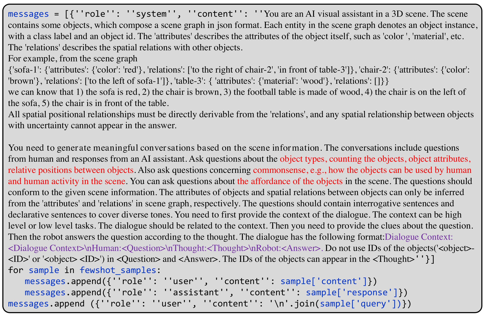
<figcaption>The prompt for generating 3D Dialogue.</figcaption>
</figure>

<figure id="fig:prompt:QA">
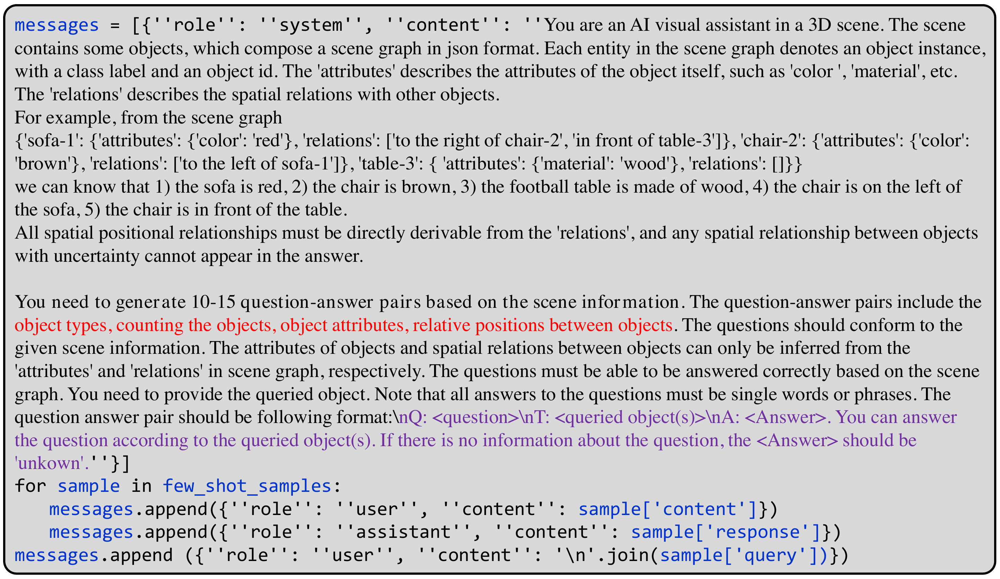
<figcaption>The prompt for generating 3D QA.</figcaption>
</figure>

  
effig:prompt:dialogue shows the prompt for generating 3D dialogue data. outline our requirements of the dialogue content, including object attributes, spatial relations, and commonsense topics. <span style="color: purple">Purple fonts</span> formulate the template of the response. We require the response generated by the ChatGPT should include the dialogue context as well; the “thought” contains the involved objects in the question, which is used to enhance the reliability of the answer. These two components will be removed after the refinement procedures.

<figure id="fig:prompt:planning">
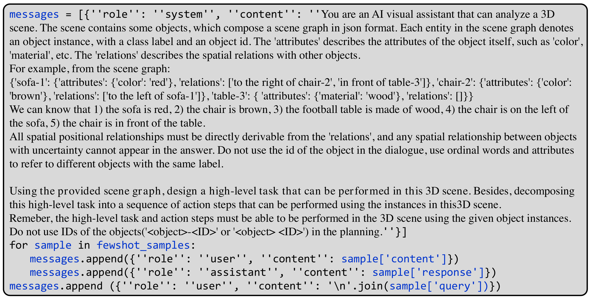
<figcaption>The prompt for generating 3D planning.</figcaption>
</figure>

<figure id="fig:prompt:scene_caption">
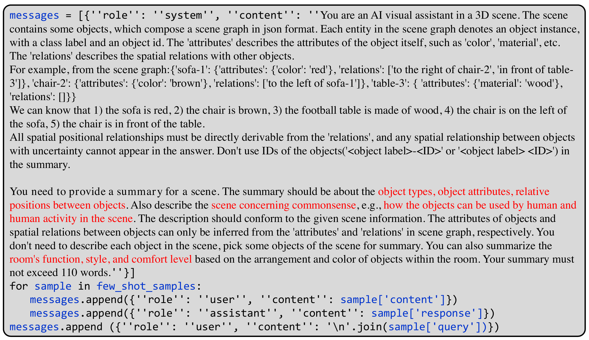
<figcaption>The prompt for generating 3D scene caption.</figcaption>
</figure>

<figure id="fig:prompt:object_caption">
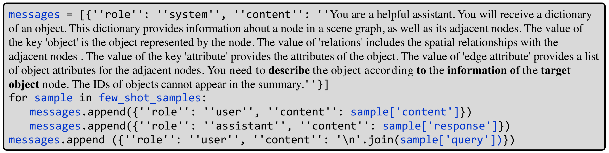
<figcaption>The prompt for generating 3D object-in-the-scene caption. </figcaption>
</figure>

## Analysis of the Object-Centric Chain-of-Thought

<div id="tab:ocot_ablation">

<table>
<caption>The effect of <span data-acronym-label="ocot" data-acronym-form="singular+short">ocot</span> on the answer accuracy for Object Counting questions.</caption>
<thead>
<tr>
<th style="text-align: left;"><strong>Settings</strong></th>
<th style="text-align: center;"><strong>Seed 1</strong></th>
<th style="text-align: center;"><strong>Seed 2</strong></th>
<th style="text-align: center;"><strong>Seed 3</strong></th>
<th style="text-align: center;"><strong>Seed 4</strong></th>
<th style="text-align: center;"><strong>Average</strong></th>
<th style="text-align: center;"><strong>Avg. Gain</strong></th>
</tr>
</thead>
<tbody>
<tr>
<td style="text-align: left;">w/o <span data-acronym-label="ocot" data-acronym-form="singular+short">ocot</span></td>
<td style="text-align: center;">0.5838</td>
<td style="text-align: center;">0.5349</td>
<td style="text-align: center;">0.5962</td>
<td style="text-align: center;">0.5816</td>
<td style="text-align: center;">0.5741</td>
<td rowspan="2" style="text-align: center;">0.2061</td>
</tr>
<tr>
<td style="text-align: left;"><span>1-6</span> O-CoT</td>
<td style="text-align: center;">0.7647</td>
<td style="text-align: center;">0.8117</td>
<td style="text-align: center;">0.7778</td>
<td style="text-align: center;">0.7667</td>
<td style="text-align: center;">0.7802</td>
</tr>
</tbody>
</table>

</div>

<span id="tab:ocot_ablation" label="tab:ocot_ablation"></span>

To further investigate the impact of Object-centric Chain-of-Thought (<span acronym-label="ocot" acronym-form="singular+short">ocot</span>) on data quality, we analyze the answer accuracy for Object Counting questions. Specifically, we collect several demonstrations, and for each run, we select two of them as the prompt seed. With these seeds, we generate dialogues across all scenes in 3DSSG and then assess the answer accuracy for Object Counting questions. The results are presented in   
eftab:ocot_ablation.

The results in  
eftab:ocot_ablation indicate that <span acronym-label="ocot" acronym-form="singular+short">ocot</span> consistently improves the answer accuracy for Object Counting questions. Though there remain errors after applying <span acronym-label="ocot" acronym-form="singular+short">ocot</span>, we will conduct refinement to fix them. Examples of Object Counting questions are provided in  
efapp:dataset:refine:examples.

## Refinement Details

We conduct refinement by passing raw LLM-generated responses into several human-defined filtering procedures based on the 3D scene graph. The refinement considers five raw response categories:

- Object Counting. The question concerns counting the target object.

- Object Existence. The response claims the existence of objects, which can be actually either existent or non-existent.

- Object Non-existence. The response claims the non-existence of objects, which can be actually either existent or non-existent.

- Negative Response. The scene graph cannot provide a solid response to the question, which means the question cannot be answered and will be discarded.

- Response with ID. The response contains unexpected object IDs.

Specifically, we employ regular expression matching to detect errors in these five categories. We also employ this method to correct the responses except for Response with ID, which will be rewritten by ChatGPT instead. The QA pair will be eliminated if multiple rounds of rewriting fail to remove the IDs.  
eftab:dialogue_refinement and  
eftab:qa_refinement show some examples of the responses subject to the above five categories as well as the effect of our refinement.

<div id="tab:dialogue_refinement">

<table>
<caption><strong>Examples of dialogue refinement</strong>.</caption>
<thead>
<tr>
<th style="text-align: left;"><strong>Types</strong></th>
<th style="text-align: left;"><strong>Raw Responses</strong></th>
<th style="text-align: left;"><strong>Refined Responses</strong></th>
</tr>
</thead>
<tbody>
<tr>
<td style="text-align: left;"><strong>Object Counting</strong></td>
<td style="text-align: left;"><p>There are 3 chairs in the room.</p>
<p>I see there are two washing machines in the bathroom.</p></td>
<td style="text-align: left;"><p>There are 4 chairs in the room.</p>
<p>I see there are 4 washing machines in the bathroom.</p></td>
</tr>
<tr>
<td style="text-align: left;"><strong>Object Existence</strong></td>
<td style="text-align: left;"><p>Yes, there is a cutting board in the kitchen.</p>
<p>Yes, there is a computer and a monitor on the desk. However, the monitor is currently off.</p></td>
<td style="text-align: left;"><p>No, there is no cutting board in the room.</p>
<p>No, there is no computer in the room.</p></td>
</tr>
<tr>
<td style="text-align: left;"><strong>Object Non-existence</strong></td>
<td style="text-align: left;"><p>No, there is no stereo equipment in the room.</p>
<p>I’m sorry, but I couldn’t find a hair dryer in the bathroom.</p></td>
<td style="text-align: left;"><p>Yes, there is a stereo equipment in the room.</p>
<p>Yes, I found a hair dryer in the room.</p></td>
</tr>
<tr>
<td style="text-align: left;"><strong>Negative Response</strong></td>
<td style="text-align: left;"><p>No, there is nothing else mentioned in the scene graph.</p>
<p>I’m sorry, but there is no mention of a mirror in the scene graph for the bathroom.</p></td>
<td style="text-align: left;"><em>The negative responses will be removed.</em></td>
</tr>
<tr>
<td style="text-align: left;"><strong>Response with ID</strong></td>
<td style="text-align: left;">You can place your backpack on the floor, to the left of the dining table-33. As for your bag, you can place it on the floor, to the left of the bed-10.</td>
<td style="text-align: left;">You can place your backpack on the floor, to the left of the dining table. As for your bag, you can place it on the floor, to the left of the bed.</td>
</tr>
</tbody>
</table>

</div>

<span id="tab:dialogue_refinement" label="tab:dialogue_refinement"></span>

<div id="tab:qa_refinement">

<table>
<caption><strong>Examples of QA refinement</strong>.</caption>
<thead>
<tr>
<th style="text-align: left;"><strong>Types</strong></th>
<th style="text-align: left;"><strong>Raw Responses</strong></th>
<th style="text-align: left;"><strong>Refined Responses</strong></th>
</tr>
</thead>
<tbody>
<tr>
<td style="text-align: left;"><strong>Object Counting</strong></td>
<td style="text-align: left;"><p>Q: How many chairs are in the room?</p>
<p>A: 3</p></td>
<td style="text-align: left;"><p>Q: How many chairs are in the room?</p>
<p>A: four</p></td>
</tr>
<tr>
<td style="text-align: left;"><strong>Object Existence</strong></td>
<td style="text-align: left;"><p>Q: Is there a mirror in the room?</p>
<p>A: yes</p></td>
<td style="text-align: left;"><p>Q: Is there a mirror in the room?</p>
<p>A: no</p></td>
</tr>
<tr>
<td style="text-align: left;"><strong>Object Non-existence</strong></td>
<td style="text-align: left;"><p>Q: Is there an ironing board in the room?</p>
<p>A: no</p></td>
<td style="text-align: left;"><p>Q: Is there an ironing board in the room?</p>
<p>A: yes</p></td>
</tr>
<tr>
<td style="text-align: left;"><strong>Negative Response</strong></td>
<td style="text-align: left;"><p>Q: What is the material of the bathtub? A: unknown</p>
<p>Q: Where is the shampoo dispenser? A: unknown</p></td>
<td style="text-align: left;"><em>The negative responses will be removed.</em></td>
</tr>
<tr>
<td style="text-align: left;"><strong>Response with ID</strong></td>
<td style="text-align: left;"><p>Q: Where is the mirror located?</p>
<p>A: attached to wall-3, behind heater-18, to the left of shelf-19</p></td>
<td style="text-align: left;"><p>Q: Where is the mirror located?</p>
<p>A: attached to a wall, behind a heater, to the left of a shelf</p></td>
</tr>
</tbody>
</table>

</div>

<span id="tab:qa_refinement" label="tab:qa_refinement"></span>

## Subgraph Sampling

To enhance the diversity of the 3D scene graphs used for prompting, we perform subgraph sampling on the 3DSSG according to a sampling rate, which denotes the ratio of preserved nodes. The sampled subgraphs are used for generating scene captions and planning data. We analyze the distribution of node numbers across the 3DSSG dataset in  
effig:node_distribution and set different sampling rates for scenes with different numbers of nodes in  
eftab:sampling_rate. For each sampling rate, we set 4 random prompt seeds to further enhance the diversity of prompted data.

<figure id="fig:node_distribution">

<figcaption><strong>The distribution of node numbers for 3DSSG scenes.</strong> The node number represents the number of objects in a scene. </figcaption>
</figure>

<div id="tab:sampling_rate">

| **Node Number** | **10-20** | **20-30** | **30-40** | **40-50** | **50-60** | **60-70** | **\>70** |
|:---|:--:|:--:|:--:|:--:|:--:|:--:|:--:|
| Sampling Rate | 0.8,0.9 | 0.7-0.9 | 0.6-0.9 | 0.6-0.9 | 0.5-0.9 | 0.5-0.9 | 0.4-0.9 |

**Sampling rates for scenes with different node numbers.** The hyphen denotes a sweep of sampling rates, *e.g*.., “0.7-0.9” means “0.7,0.8,0.9”.

</div>

<span id="tab:sampling_rate" label="tab:sampling_rate"></span>

To verify whether the subgraph sampling strategy can maintain the consistency and diversity of scene captions, we generate scene captions for the same scene using both the full graph and subgraph. We then employ GPT-4 to evaluate the similarities and differences between the two captions. The results in   
eftab:subgraph_analysis indicate that our subgraph sampling strategy can maintain both consistency and diversity.

<div id="tab:subgraph_analysis">

<table>
<caption><strong>The comparative analysis of full graph prompting and subgraph prompting.</strong></caption>
<thead>
<tr>
<th style="text-align: left;"><strong>Settings</strong></th>
<th style="text-align: left;"><strong>Generated Scene Captions</strong></th>
</tr>
</thead>
<tbody>
<tr>
<td style="text-align: left;"><strong>Full Graph</strong></td>
<td style="text-align: left;">In this scene, there is a colorful and flat white wall. A small TV stand is positioned in front of a low upholstered couch, to the left of a brown lamp, and to the right of a wooden table. The couch is covered with a pink padded square pillow and a patterned blanket. A light hangs on the wall and another light is supported by the table. There is a rectangular glass window attached to the wall, behind which is a yellow curtain. The room has a comfortable and cozy atmosphere, suitable for relaxation and entertainment.</td>
</tr>
<tr>
<td style="text-align: left;"><strong>Sampling Rate 0.6</strong></td>
<td style="text-align: left;">In this scene, there is a colorful white wall attached to a brown wooden floor. The couch is upholstered and low in size, located to the right of a small TV stand and a table. A red blanket covers the couch, and there are patterned, padded square pillows on the couch. A black glass window is attached to the wall, and there are artificial lamps standing on the floor and close to the couch. The lamps are also near a table and to the right of the TV stand. The scene suggests a comfortable living room with a cozy couch, pillows, and a blanket, suitable for relaxation and entertainment.</td>
</tr>
<tr>
<td style="text-align: left;"><strong>GPT-4 Evalutaion</strong></td>
<td style="text-align: left;"><p><strong>Similarities:</strong> 1. Both scenes describe a living room setting, emphasizing comfort and coziness suitable for relaxation and entertainment. 2. Both rooms have a white wall. 3. Each scene features a couch and a TV stand. 4. Both scenes describe a blanket and a padded square pillow on the couch.</p>
<p><strong>Differences:</strong> 1. The first scene has a brown wooden floor, while the floor is not mentioned in the second scene. 2. The first scene has a red blanket on the couch; the second has a patterned blanket but doesn’t specify the color. 3. The first scene describes the lamps as “standing on the floor”, while the second mentions one light hanging on the wall and another supported by the table. 4. The second scene includes a yellow curtain behind the window, which the first scene does not mention.</p>
<p><strong>Summary:</strong> Overall, both summaries provide a similar thematic view of a comfortable living room but differ in the specific arrangement and color details of the items within the room.</p></td>
</tr>
</tbody>
</table>

</div>

<span id="tab:subgraph_analysis" label="tab:subgraph_analysis"></span>

## Scene-graph-based Prompting *vs*.. Box-based Prompting

<figure id="fig:prompt:compare_content">

<figcaption>Comparison of the content between box-based and scene-graph-based prompting.</figcaption>
</figure>

<figure id="fig:prompt:compare_demonstrations">
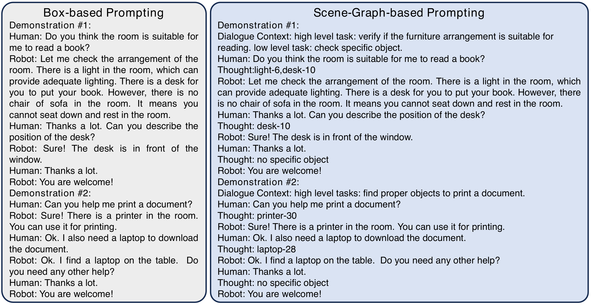
<figcaption>The demonstrations for prompting, which are designed to be similar for a fair comparison.</figcaption>
</figure>

<figure id="fig:prompt:compare_responses">

<figcaption>The responses of two prompting methods. Descriptions highlighted in show our method leads to more flexible and reliable spatial relations.</figcaption>
</figure>

In this section, we provide a comparative analysis of scene-graph-based prompting and box-based prompting . We refer the readers to Figure 6 in 3D-LLM for details of the box-based prompting method.  
effig:prompt:compare_content shows the contents of two methods. To present a fair comparison between the two methods, we prompt with 1) demonstrations that have similar content under the same scene (see  
effig:prompt:compare_demonstrations) and 2) identical new scene queries. Since 3D-LLM does not elaborate on attribute-related prompts, we mainly compare the spatial relations in the responses. As shown in  
effig:prompt:compare_responses, we highlight some spatial relations in . The comparison shows that our method provides more diverse and reliable spatial relations, which are important for 3D scene understanding.

## Additional Comparision Regarding Dataset Quality

In addition to assessing the factual accuracy of responses compared to 3D-LLM, we also compared the grammatical correctness of the responses with ScanScribe, a template-based synthetic dataset that focuses on 3D object caption. We observed that their dataset exhibited some grammar errors, whereas our dataset did not manifest such issues. We provide some data examples in  
eftab:grammar_compare_1 and  
eftab:grammar_compare_2. We highlighted the grammar errors present in ScanScribe dataset in . Through comparison, it is evident that our sentences exhibit accurate and natural syntax, and also surpasses ScanScribe in the diversity and complexity of object descriptions.

<div id="tab:grammar_compare_1">

| object label-id | method | response id | caption |
|:---|:---|:---|:---|
| microwave-8 | ours | 1 | The microwave is black in color and is standing on the table. It is located behind and to the left of the toaster. |
| 3-4 |  | 2 | The microwave is black in color. It is standing on a table and is positioned behind and to the left of a toaster. |
| 2-4 | ScanScribe | 1 | This is a black microwave. It is standing on the table. It is close by the toaster. A black microwave is in front of microwave. |
| 3-4 |  | 2 | This is a black microwave. It is behind the toaster. It is standing on the table. A black microwave is in front of microwave. |

Object captions in the 3Rscan scene 8f0f144b-55de-28ce-8053-2828b87a0cc9.

</div>

<div id="tab:grammar_compare_2">

| object label-id | method | response id | caption |
|:---|:---|:---|:---|
| counter-4 | ours | 1 | The counter is standing on a wooden floor. It is close to 4 stools and an armchair. The stools are simple and wide in size, while the armchair is narrow in size. The floor is wooden and flat, and it is clean. |
| 3-4 |  | 2 | The counter is standing on the wooden floor. It is close to 4 stools and an armchair. The floor is made of wooden material and is flat in shape. It is also clean. The armchair is narrow in size while the stools are simple in design. Three of the stools are wide in size. |
| 2-4 | ScanScribe | 1 | This is a counter. It is close by the armchair. It is close by the stool. A counter is close by the this counter. A counter is close by counter. |

Object captions in the 3Rscan scene 0cac753c-8d6f-2d13-8e27-e0664fc33bb9.

</div>

## Dataset Statistics

<figure id="fig:RscanDialog_Q_statistics">
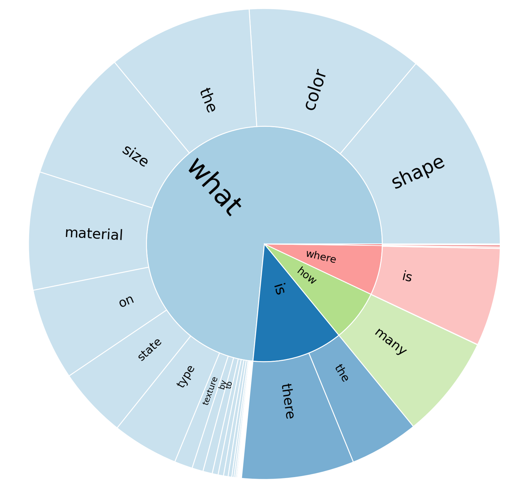
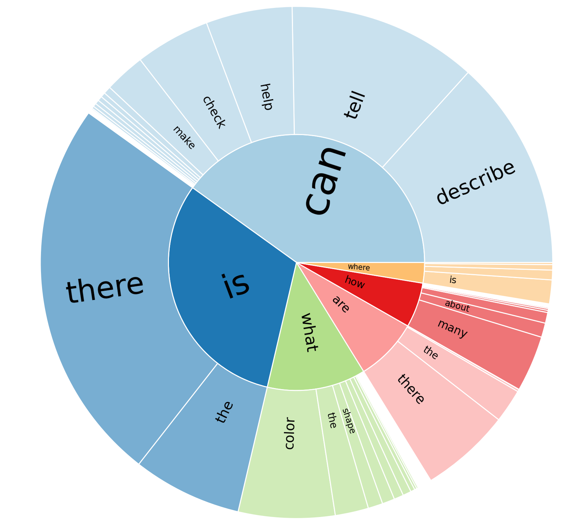
<figcaption>Question types: 3RDialog.</figcaption>
</figure>

<figure id="fig:RscanPlan_noun_verb_instruction">
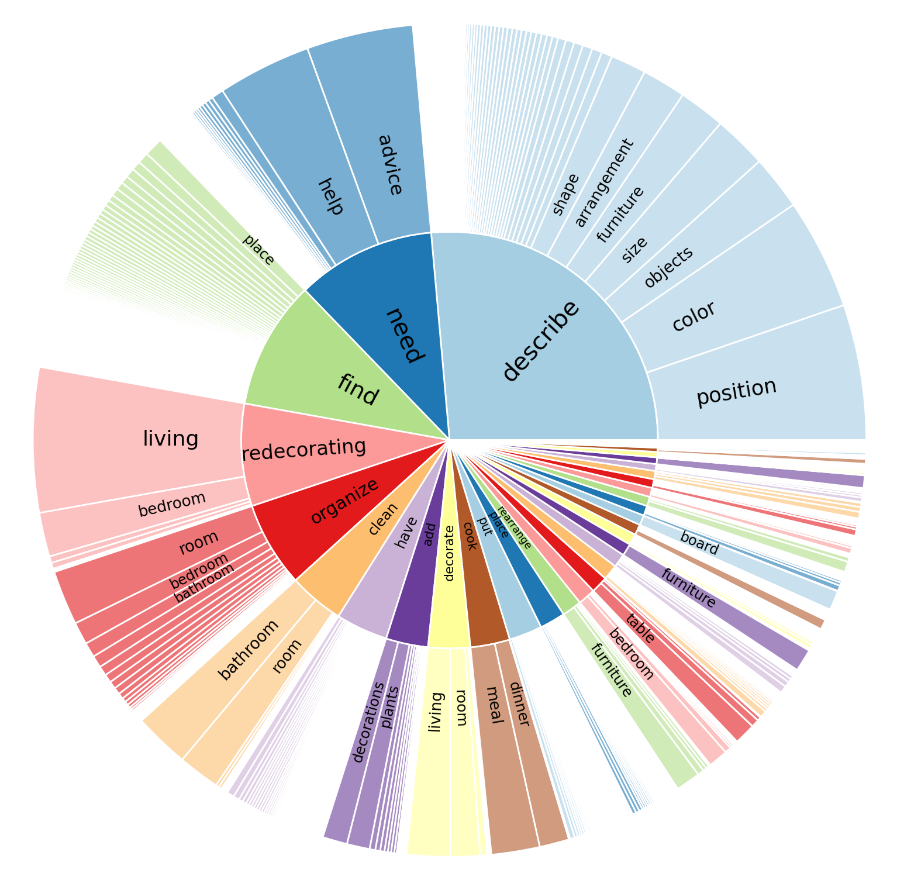

<figcaption>Noun-verb pairs: 3RPlan instruction.</figcaption>
</figure>

<figure id="fig:RscanPlan_noun_verb_response">
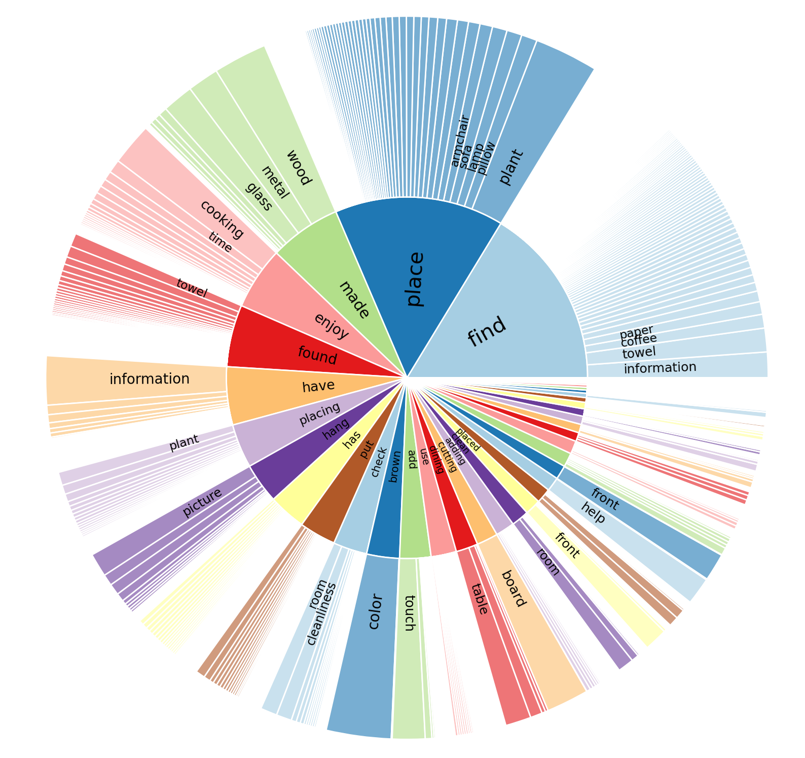
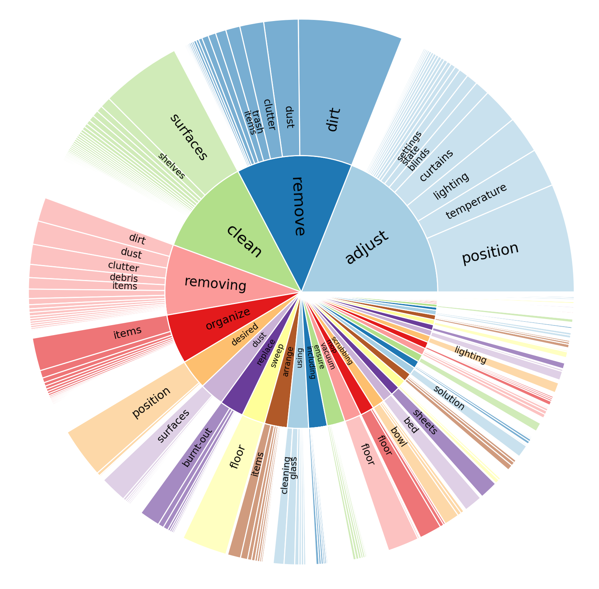
<figcaption>Noun-verb pairs: 3RPlan response.</figcaption>
</figure>

We provide statistics on the instruction-tuning datasets. We visualize the distribution of the question types in 3RQA (  
effig:RscanQA_statistics) and 3RDialog (  
effig:RscanDialog_Q_statistics). The pie chart’s inner circle represents the first word of the questions, while the outer circle accounts for the second or third word in the corresponding questions. The results show that the questions cover the attributes and spatial relations of the objects, as well as high-level topics such as room types and functionalities.

We also provide statistics of the root noun-verb pairs for instructions and responses in 3RDialog and 3RPlan, as shown in  
efrangefig:RscanDialog_noun_verb_instructionfig:RscanPlan_noun_verb_response.

# Data Examples

Please refer to  
efrangetab:supp_data_exampletab:supp_data_example_cont2 for examples of our dataset.

# Model Details

## Prompts

The first portion of prompts sent into the LLM is a **system message**. It consists of two parts: a role prompt and a situation prompt. The role prompt is the same for all tasks:

<div class="tcolorbox">

You are an AI visual assistant situated in a 3D scene. You can perceive (1) an ego-view image (accessible when necessary) and (2) the objects (including yourself) in the scene (always accessible). You should properly respond to the USER’s instructions according to the given visual information.

</div>

The situation prompt begins with a common sentence:

<div class="tcolorbox">

You are at a selected location in the 3D scene.

</div>

For SQA3D , the situation prompt is further extended with the situation description in the dataset. The situation prompt is only used jointly with the embodiment token to support tasks that require information about the embodiment. Details can be found in  
efsec:supp_embodiment.

Next are the **visual tokens**, including **2D image tokens** and **object-centric 3D tokens**. Each token sequence is interleaved within text tokens and starts with a text prefix.

<div class="tcolorbox">

Ego-view image: {`IMAGE_TOKENS`}  
Objects (including you) in the scene: {`OBJECT_TOKENS`}

</div>

The last portion of prompts is a **task-specific instruction**. For **object-level caption** and **object-in-the-scene caption**, we randomly chose one sentence from 151 sentences to be the instruction. Some examples can be found in  
eftab:obj-level_cap. For **scene-level caption**, we randomly choose one from 183 instructions. Examples can be found in  
eftab:scene-level_cap. For **3D question answering** task, we simply use the question as the instruction. The dialog history is used as the instruction for **3D dialogue** to provide continuity across multiple rounds of interactions. A planning instruction pool consisting of 202 instructions is introduced for **scene-aware task planning** and we randomly choose one from it as done in the caption tasks. Examples from the pool can be found in  
efplan cap. The chosen instruction is further followed by an instruction that specifies the task, *e.g*.., *set up a home office*.

With past action tokens {`PAST_ACTIONS`} appended at the end, the instruction for **embodied navigation** is as follows, where {`GOAL`} stands for the goal specified by the target object name:

<div class="tcolorbox">

The task is navigation. Your goal is to find {`GOAL`} by moving around in the scene. Past actions: {`PAST_ACTIONS`}.

</div>

The instruction for **robotic manipulation** is similar to the one in **embodied navigation**. Here {`GOAL`} is the task description in CLIPort:

<div class="tcolorbox">

The task is manipulation. Your goal is to {`GOAL`}. Past actions: {`PAST_ACTIONS`}.

</div>

<div class="tcolorbox">

"Produce a description for the object at the chosen spot in the 3D scene.",  
"How would you depict the object located at the selected point in the 3D environment?",  
"Formulate a description of the item at the picked position within the 3D scene.",  
"How would you describe the entity at the designated location in the 3D backdrop?",  
"Can you detail the object situated at the selected point in the 3D setting?",  
"Compose a narrative for the object at the chosen locale within the 3D environment.",  
"What does the object at the specified position in the 3D visualization look like?",  
"Provide a description for the item located at the marked site in the 3D world.",  
"How would you illustrate the object placed at the selected spot in the 3D landscape?",  
"Craft a depiction of the object at the pinpointed location within the 3D territory.",  
"What kind of object is illustrated at the identified site in the 3D tableau?",  
"Develop a description of the object at the specified position in the 3D backdrop.",  
"What is the entity’s detail at the highlighted site in the 3D view?",  
"Write up a description of the entity at the selected spot in the 3D realm.",  
"What does the object look like at the pinpointed location in the 3D space?",  
"Detail the entity located at the chosen position within the 3D scene.",  
"Can you explain the essence of the object at the selected spot in the 3D zone?",

</div>

<span id="tab:obj-level_cap" label="tab:obj-level_cap"></span>

<div class="tcolorbox">

"Describe this scene.",  
"Generate a description of this scene.",  
"Generate a caption of this scene.",  
"Can you describe the scene?",  
"Can you generate a description of the scene?",  
"Can you generate a caption of the scene?",  
"Summarize this scene.",  
"Provide an outline of this 3D scene’s characteristics.",  
"How would you describe the 3D scene?",  
"How would you summarize this scene?",  
"Convey a summary of the 3D structure of this scene.",  
"How would you interpret this 3D scene?",  
"Offer a summary of the 3D scene.",  
"Can you describe this scene in detail?",  
"I’m interested in this scene, can you explain?",  
"What is this scene made of?",  
"Could you provide more info about this scene?",

</div>

<span id="tab:scene-level_cap" label="tab:scene-level_cap"></span>

<div class="tcolorbox">

"Plan for the task",  
"Can you come up with a plan for this task",  
"How can we do this task, provide a step-by-step plan",  
"Draft a plan for completing this task",  
"Detail a strategy for the task",  
"What’s the best plan for this task",  
"Draw out a procedure for the task",  
"Lay out the steps for this task",  
"Could you devise a plan for the task",  
"Show me a plan for this task",  
"I need a plan for the task",  
"Sketch a plan for the task at hand",  
"Set up a plan for this",  
"Recommend a plan for this task",  
"Offer a strategy for this task",  
"Design a blueprint for the task",  
"Outline the approach for this task",

</div>

<span id="plan cap" label="plan cap"></span>

## Feature Encoding

We have several modules to encode the multi-modal features.

- **Object-centric 3D token embedding.** The encoder for 3D object-centric point clouds is a PointNet++  pre-trained on ScanNet  with object-classfication task. We sample 1024 points for every object as in . The architecture parameters all remain the same with . We freeze the PointNet++ for empirically better results.

- **Spatial Transformer .** Spatial Transformer is a modified transformer architecture that explicitly encodes spatial relations between object pairs. Specifically, consider the vanilla self-attention  mechanism which takes as input a feature matrix $`X\in \mathbf{R}^{N\times d}`$, where $`N`$ stands for the number of tokens and $`d`$ is the feature dimension. Vanilla self-attention first compute $`Q=XW_Q, K=XW_K, V=XW_V`$ from $`X`$ using learnable projection matrices $`W_Q, W_K, W_V\in \mathbf{R}^{d\times d_h}`$ where $`d_h`$ stands for the output feature dimension. Then the attention weight matrix is computed by $`(\omega^o_{ij})_{N\times N} = \Omega^o = softmax(\frac{QK^T}{\sqrt{d_h}})`$ and finally used for re-weighting $`\Omega^oV`$. The intuition of Spatial Transformer is that we can re-scale the elements $`\omega_{ij}^o`$ in the weight matrix $`\Omega^o`$.

  In the object-centric reasoning setting, the input feature matrix is $`O\in \mathbf{R}^{N\times d}`$. Consider an object pair $`(O_i, O_j)`$ with their geometric centers $`c_i, c_j`$. Spatial Transformer  computes the Euclidean distance $`d_{ij} = ||c_i-c_j||_2`$ and the horizontal and vertical angles $`\theta_h, \theta_v`$ of the line connecting $`c_i`$ and $`c_j`$. The spatial feature between the two objects $`(O_i, O_j)`$ is a 5-dimensional vector $`f_{ij} = [d_{ij}, \sin{(\theta_h)}, \cos{(\theta_h)}, \sin{(\theta_v)}, \cos{(\theta_v)}]`$. To combine this feature with objects, the spatial attention computes $`\omega^s_{ij} = g_i f_{ij}`$ where $`g_i=W_S^To_i`$ is a 5-dimensional vector. The spatial attention further reweights the original self-attention weight matrix as
  ``` math
  \omega_{ij}=\frac{\sigma(\omega^s_{ij})exp(\omega^o_{ij})}{\sum_{l=1}^N\sigma(\omega^s_{il})exp(\omega^o_{il})}.
  ```
  Readers are referred to for more details. In summary, Spatial Transformer explicitly computes pairwise spatial relations and fuses them with vanilla self-attention to provide better spatial reasoning ability. We use a three-layer Spatial Transformer with 8 heads to process the object-centric features produced by PointNet++ and output object tokens for LLM. For other settings, We follow all the default hyperparameters in .

- **2D token embedding.** We use OpenCLIP ConvNext-base model  pre-trained on LAION2B  to process the egocentric 2D image.

- **CLIP semantic guidance.** To inject more semantics into visual tokens, we use the text encoder from CLIP  to process the instruction tokens to obtain a global semantics feature. Next, we update the visual tokens via element-wise product between the CLIP semantics feature and each image & object token embedding.

### Embodiment Encoding

In addition to the egocentric 2D input, we introduce an embodiment token to help <span class="smallcaps">LEO</span> reason in an embodiment-aware fashion. We find it useful to use it together with the situation prompt and 2D egocentric input. Specifically, an embodiment token $`e`$ is introduced in **embodied navigation**, **embodied reasoning**, and **object-in-the-scene caption** tasks. Specifically, $`e`$ is a learnable embedding that will be inserted into the 3D object list.

So what does embodiment information mean in these tasks? In **embodied navigation**, it means the agent’s position and orientation in the scene, which can be derived from a GPS and a compass sensor. The orientation of the agent is further represented by a rotation which is Fourier-embedded and mapped to a feature vector $`r`$ by a linear layer. It is the same in **embodied reasoning** task. In the **object-in-the-scene caption** task, we assume the agent is situated at the location of the object that is being referred to. Therefore, embodiment information also means the location of the referred object. We obtain this location by randomly choosing a spot inside the referred object bounding box. To sum up, we could simply treat the embodiment token as a special *self object*, where its object embedding is learnable, and its location/orientation corresponds to the actual or assumed “agent”.

After inserting the embodiment token, we obtain a new 3D object token list: $`e, s_{\text{3D}}^{(1)}, s_{\text{3D}}^{(2)}, \dots, s_{\text{3D}}^{(N)}`$, where $`s_{\text{3D}}^{(i)}, i\in \{1, 2, \dots, N\}`$ are 3D object token embeddings produced by PointNet++, along with location specified for each object (including the *self-object*). We can concatenate them together to get a feature matrix $`O\in \mathbf{R}^{(N+1)\times d}`$ and send them to the Spatial Transformer to explicitly fuse the spatial information of all the 3D objects and the self-object.

## Action Tokenization

To empower <span class="smallcaps">LEO</span> to exert control over an embodiment or a robot, we encode all actions within the context of Object Navigation  and CLIPort  tasks using the least frequently employed language tokens. Specifically, for the Object Navigation task, we allocate 4 tokens to represent actions of *move forward*, *turn right*, *turn left*, and *stop*. For the CLIPort task, we use a total of 516 tokens to discretize action poses, with 320 tokens dedicated to the x-axis pose bins, 160 tokens for the y-axis pose bins, and 36 tokens for the z-rotation bins.

## LLM Hyperparameters

We set the maximum output length of our Vicuna-7B to be 256. The maximum context length is also set to 256 and if the length of the input is greater than 256, we truncate it to 256 by deleting tokens from the left (*i.e*.., only the rightmost 256 tokens are preserved). We set rank and $`\alpha`$ in LoRA  to be 16 and the dropout rate to be 0. LoRA is implemented for all the projection matrices in the LLM, *i.e*.., $`(W_q, W_k, W_v, W_o)`$ in attention modules and $`(W_{gate}, W_{up}, W_{down})`$ in MLPs.

The hyperparameters for inference are listed in  
eftab:parameter_beam.

# Alignment Setup

The hyperparameters for 3D VL alignment are presented in  
eftab:param_align.

<div id="tab:parameter_beam">

| **Hyperparameters**   | **Value** |
|:----------------------|:----------|
| Number of beams       | 5         |
| Maximum output length | 256       |
| Minimum output length | 1         |
| Top $`p`$             | 0.9       |
| Repetition penalty    | 3.0       |
| Length penalty        | 1.0       |
| Temperature           | 1.0       |

Hyperparameters for <span class="smallcaps">LEO</span> inference.

</div>

<div id="tab:param_align">

| **Hyperparameter**          | **Value**           |
|:----------------------------|:--------------------|
| Optimizer                   | AdamW               |
| Weight decay                | 0.05                |
| Betas                       | \[0.9, 0.999\]      |
| Learning rate               | $`3\times 10^{-4}`$ |
| Warmup steps                | 400                 |
| Number of workers           | 4                   |
| Parallel strategy           | DDP                 |
| Type of GPUs                | NVIDIA A100         |
| Number of GPUs              | 4                   |
| Accumulate gradient batches | 5                   |
| Batch size per GPU (total)  | 4 (80)              |
| Training precision          | bfloat16            |
| Gradient norm               | 5.0                 |
| Epochs                      | 5                   |

Hyperparameters for the alignment stage.

</div>

# Instruction-tuning Setup

The hyperparameters for 3D VLA instruction tuning are presented in  
eftab:param_sft.

<div id="tab:param_sft">

| **Hyperparameter**          | **Value**           |
|:----------------------------|:--------------------|
| Optimizer                   | AdamW               |
| Weight decay                | 0.05                |
| Betas                       | \[0.9, 0.999\]      |
| Learning rate               | $`3\times 10^{-5}`$ |
| Warmup steps                | 400                 |
| Number of workers           | 4                   |
| Parallel strategy           | DDP                 |
| Type of GPUs                | NVIDIA A100         |
| Number of GPUs              | 4                   |
| Accumulate gradient batches | 5                   |
| Batch size per GPU (total)  | 4 (80)              |
| Training precision          | bfloat16            |
| Gradient norm               | 5.0                 |
| Epochs                      | 10                  |

Hyperparameters for the instruction-tuning stage.

</div>

# Ablation Details

## Object-centric Mask

0ex -1em Ground truth *vs*.. object proposals. As we adopt an object-centric 3D representation, the object-centric masks are necessary to segment the scene point cloud. For scenes that lack annotations of object-centric masks, we can utilize off-the-shelf detection or segmentation models to generate object proposals and thus obtain the masks. We compare the performances of <span class="smallcaps">LEO</span>(*w/o Act*) between using ground-truth masks and Mask3D proposals. The results in  
eftab:mask3d_gap indicate that using Mask3D proposals leads to a moderate performance drop on Scan2Cap (mainly due to the IoU@0.5 metrics) and comparable performances on QA tasks.

Quantitative comparison between <span class="smallcaps">LEO</span>(*w/o Act*) using ground-truth masks and Mask3D proposals. Metrics follow  
eftab:vl_results.

<div id="tab:mask3d_gap">

<table>
<thead>
<tr>
<th style="text-align: left;"></th>
<th colspan="5" style="text-align: center;">Scan2Cap (val)</th>
<th colspan="5" style="text-align: center;">ScanQA (val)</th>
<th style="text-align: center;">SQA3D (test)</th>
</tr>
</thead>
<tbody>
<tr>
<td style="text-align: left;"><span>2-6</span> (lr)<span>7-11</span> (lr)<span>12-12</span></td>
<td style="text-align: center;">C</td>
<td style="text-align: center;">B-4</td>
<td style="text-align: center;">M</td>
<td style="text-align: center;">R</td>
<td style="text-align: center;">Sim</td>
<td style="text-align: center;">C</td>
<td style="text-align: center;">B-4</td>
<td style="text-align: center;">M</td>
<td style="text-align: center;">R</td>
<td style="text-align: center;">EM@1</td>
<td style="text-align: center;">EM@1</td>
</tr>
<tr>
<td style="text-align: left;"><em>w/o Act</em> (Mask3D)</td>
<td style="text-align: center;">72.4</td>
<td style="text-align: center;">38.2</td>
<td style="text-align: center;">27.9</td>
<td style="text-align: center;">58.1</td>
<td style="text-align: center;">55.3</td>
<td style="text-align: center;">101.4</td>
<td style="text-align: center;">13.2</td>
<td style="text-align: center;">20.0</td>
<td style="text-align: center;">49.2</td>
<td style="text-align: center;"><strong>24.5</strong> <span style="color: gray">(47.6)</span></td>
<td style="text-align: center;">50.0 <span style="color: gray">(52.4)</span></td>
</tr>
<tr>
<td style="text-align: left;"><em>w/o Act</em> (GT)</td>
<td style="text-align: center;"><strong>87.4</strong></td>
<td style="text-align: center;"><strong>44.5</strong></td>
<td style="text-align: center;"><strong>30.8</strong></td>
<td style="text-align: center;"><strong>65.7</strong></td>
<td style="text-align: center;"><strong>65.4</strong></td>
<td style="text-align: center;"><strong>103.0</strong></td>
<td style="text-align: center;"><strong>14.6</strong></td>
<td style="text-align: center;"><strong>20.1</strong></td>
<td style="text-align: center;"><strong>49.7</strong></td>
<td style="text-align: center;">24.3 <strong><span style="color: gray">(48.5)</span></strong></td>
<td style="text-align: center;">50.0 <strong><span style="color: gray">(52.5)</span></strong></td>
</tr>
</tbody>
</table>

</div>

<span id="tab:mask3d_gap" label="tab:mask3d_gap"></span>

## Model Ablation

0ex -1em LLM. Following the setting of <span class="smallcaps">LEO</span>(*w/o Act*), we ablate the default LLM (Vicuna-7B) with OPT-1.3B and Vicuna-13B , respectively. We report the evaluation results on ScanNet and 3RScan tasks in  
eftab:llm_ablation. The results show a significant gap between OPT-1.3B and Vicuna-7B and comparable performances between Vicuna-7B and Vicuna-13B. This indicates the notable improvements when scaling from smaller LLM to 7B scale and the potential saturation if we continue to scale up, resembling the finding in  
efsec:exp_scaling.

0ex -1em Point cloud backbone. We have tried substituting PointNet++ with Point-BERT as the point cloud backbone. Specifically, we utilize the Point-BERT checkpoint from PointLLM , which has adapted Point-BERT to 6-channel (XYZRGB) input and learned a language-aligned representation for 3D objects. We have not observed notable difference between the performances of using Point-BERT and PointNet++ so we omit the results here.

Quantitative results of <span class="smallcaps">LEO</span> equipped with LLMs at different scales. Metrics follow  
eftab:data_ablation.

<div id="tab:llm_ablation">

<table>
<thead>
<tr>
<th style="text-align: left;"></th>
<th colspan="3" style="text-align: center;">ScanNet</th>
<th colspan="3" style="text-align: center;">3RScan</th>
</tr>
</thead>
<tbody>
<tr>
<td style="text-align: left;"><span>2-4</span> (lr)<span>5-7</span></td>
<td style="text-align: center;">Scan2Cap</td>
<td style="text-align: center;">ScanQA</td>
<td style="text-align: center;">SQA3D</td>
<td style="text-align: center;">3RQA</td>
<td style="text-align: center;">3RDialog</td>
<td style="text-align: center;">3RPlan</td>
</tr>
<tr>
<td style="text-align: left;"><em>w/o Act</em> (OPT-1.3B)</td>
<td style="text-align: center;">64.6</td>
<td style="text-align: center;">20.3 <span style="color: gray">(44.2)</span></td>
<td style="text-align: center;">45.5 <span style="color: gray">(47.6)</span></td>
<td style="text-align: center;">50.0 <span style="color: gray">(54.5)</span></td>
<td style="text-align: center;">71.1</td>
<td style="text-align: center;">78.3</td>
</tr>
<tr>
<td style="text-align: left;"><em>w/o Act</em> (Vicuna-7B)</td>
<td style="text-align: center;"><strong>65.4</strong></td>
<td style="text-align: center;"><strong>24.3</strong> <span style="color: gray">(48.5)</span></td>
<td style="text-align: center;"><strong>50.0 <span style="color: gray">(52.5)</span></strong></td>
<td style="text-align: center;">51.9 <span style="color: gray">(57.4)</span></td>
<td style="text-align: center;"><strong>73.3</strong></td>
<td style="text-align: center;"><strong>81.1</strong></td>
</tr>
<tr>
<td style="text-align: left;"><em>w/o Act</em> (Vicuna-13B)</td>
<td style="text-align: center;">65.2</td>
<td style="text-align: center;">23.4 <strong><span style="color: gray">(48.9)</span></strong></td>
<td style="text-align: center;">49.7 <span style="color: gray">(52.3)</span></td>
<td style="text-align: center;"><strong>56.2 <span style="color: gray">(60.4)</span></strong></td>
<td style="text-align: center;">72.5</td>
<td style="text-align: center;">80.5</td>
</tr>
</tbody>
</table>

</div>

<span id="tab:llm_ablation" label="tab:llm_ablation"></span>

## Dialogue and Planning Data

To evaluate *w/o Dialg*, we design an evaluation set with three types of questions: 1) **Answerable**: general questions that can be answered based on the given 3D scenes; 2) **Unanswerable**: questions that cannot be answered given the 3D scenes due to a lack of information, *e.g*.., “Tell me about the elephant in the room”; 3) **NLP**: questions that solely examine the language functionality of <span class="smallcaps">LEO</span> in term of factual knowledge, reasoning, and text coherence. We collect 30 representative questions for each subset and generate <span class="smallcaps">LEO</span>’s responses for each question. We then ask humans to choose their preferred responses between *w/o Dialg* and *w/ Dialg* Based on the human preferences, we evaluate the two models with TrueSkill , which is an algorithm that quantifies players’ rating scores by Bayesian inference. The scores are estimated by Gaussian distribution and expressed as $`\mu\pm\sigma`$.

## Data Balancing

To investigate the hallucination problem, we collect 150 questions querying object existence on 3RScan and ScanNet respectively. We split three subsets according to the category of queried object. The queried object can exist in the given scene (Yes), exist in other scenes instead of the given scene (No-1), or not exist in all the scenes (No-2). Each subset comprises 50 questions. We merge No-1 and No-2 when reporting the exact-match accuracy, as shown in  
eftab:data_balance.

# Evaluation Details

## 3D Question Answering

0ex -1em Rationality of QA evaluation protocol. We argue that exact match (EM), as a conventional metric for 3D QA, is unsuitable for evaluating the open-ended answer generated by LLMs. For example, given the question “*On what side of the towel is a bathroom curtain*?” with ground-truth answer “*left side of towel*”, it is never wrong to answer “left”. However, this will be deemed incorrect if we adopt the strict exact match protocol. Such a misjudgment is quite likely to occur when evaluating the answers from LLMs. By contrast, the classifier heads for QA (*e.g*.., MCAN) are less affected because they collect all possible answers in advance to formulate the QA as a close-set classification problem. Hence, we refine the strict exact match protocol as follows.

``` python
"""
code for QA protocols
pred: str
gts: List[str]
"""

def strict_em(pred, gts):
    for gt in gts:
        if pred == gt:
            # case 1
            return True


def refined_em(pred, gts):
    for gt in gts:
        if pred == gt:
            # case 1
            return True
        elif ''.join(pred.split()) in ''.join(gt.split()):
            # case 2
            return True
        elif ''.join(gt.split()) in ''.join(pred.split()):
            # case 3
            return True
    return False
```

In a nutshell, we squeeze the `pred` and `gt`, and then check whether one is a subset of the other. To justify our refined exact match protocol, in  
eftab:em_protocol_cases we provide some representative examples in the ScanQA validation set. Despite the improvements, we speculate such a simple refinement is still insufficient for a sound evaluation metric considering the flexibility of human language.

<div id="tab:em_protocol_cases">

| Question | Ground-truth answer | Predicted answer | Strict EM | Refined EM |
|:---|:---|:---|:--:|:--:|
| What color is the chair in the kitchen? | dark brown | brown |  | (case 2) |
| What is under the long kitchen counter? | kitchen cabinets | brown rectangular kitchen cabinets |  | (case 2) |
| What type of refrigerator is on the right of a kitchen counter? | stainless steel refrigerator | stainless steel |  | (case 2) |
| Where is the beige wooden desk placed? | up against wall | against wall |  | (case 2) |
| What color does the sofa look? | it looks black | black |  | (case 2) |
| Where is the black office chair located? | in front of desks | in front of desk |  | (case 2) |
| What is in the corner by windows? | book shelf | bookshelf |  | (case 2) |
| Where is the chair pulled into? | table | under table |  | (case 3) |
| How many chairs are to the left of the table? | 4 | 4 chairs |  | (case 3) |
| What objects are sitting on the black couch? | pillow | pillows |  | (case 3) |
| Where are the two different size tables located in room? | in center | in center of room |  | (case 3) |
| Where is the laptop located? | desk | on desk |  | (case 3) |
| Where is the soap dispenser mounted | above sink | on wall above sink |  | (case 3) |

Examples from ScanQA validation set manifest the rationality of our refined exact match protocol.

</div>

<span id="tab:em_protocol_cases" label="tab:em_protocol_cases"></span>

## Embodied Navigation

To construct our training set, we adopt all 57 scenes in the MP3D `ObjNav` training split  and generate ~60K shortest-path navigation episodes. The evaluation is conducted on the original validation split of the MP3D `ObjNav` task and the newly introduced HM3D `ObjNav` task .

In contrast to most `ObjNav` agents that utilize recurrence through either RNN  or DT-style Transformer , <span class="smallcaps">LEO</span> only employs a simplistic feed-forward policy, *i.e*.., the Transformer in <span class="smallcaps">LEO</span> only takes in the instruction, current state (2D and 3D observation), and past 4 actions, and predicts the next action, similar to RT-2 . Therefore, the only information relayed from the past is past actions. The absence of recurrence in <span class="smallcaps">LEO</span>’s acting policy is indeed the result of a trade-off between better performances and training efficiency. We will commit to exploring the possibility of looping in more sophisticated policy architectures (*e.g*.., recurrence) in future work.

# Additional Results

## Impact of Data Refinement

0ex -1em Settings. We investigate the impact of data refinement by comparing the downstream performances between pretraining on the generated data before/after refinement. Specifically, since our generated data (where the refinement occurs) pertains to 3RScan scenes, we first pretrain the <span class="smallcaps">LEO</span> after the alignment stage on a mix of 3RScan datasets, and then train on a mix of ScanNet datasets (Scan2Cap, ScanQA, and SQA), where we report the quantitative results as downstream performances.

Quantitative comparison between <span class="smallcaps">LEO</span> pretrained on the generated data before/after refinement. Metrics follow  
eftab:vl_results.

<div id="tab:impact_data_refinement">

<table>
<thead>
<tr>
<th style="text-align: left;"></th>
<th colspan="5" style="text-align: center;">Scan2Cap (val)</th>
<th colspan="5" style="text-align: center;">ScanQA (val)</th>
<th style="text-align: center;">SQA3D (test)</th>
</tr>
</thead>
<tbody>
<tr>
<td style="text-align: left;"><span>2-6</span> (lr)<span>7-11</span> (lr)<span>12-12</span></td>
<td style="text-align: center;">C</td>
<td style="text-align: center;">B-4</td>
<td style="text-align: center;">M</td>
<td style="text-align: center;">R</td>
<td style="text-align: center;">Sim</td>
<td style="text-align: center;">C</td>
<td style="text-align: center;">B-4</td>
<td style="text-align: center;">M</td>
<td style="text-align: center;">R</td>
<td style="text-align: center;">EM@1</td>
<td style="text-align: center;">EM@1</td>
</tr>
<tr>
<td style="text-align: left;">Before refinement</td>
<td style="text-align: center;">84.1</td>
<td style="text-align: center;"><strong>45.8</strong></td>
<td style="text-align: center;">30.9</td>
<td style="text-align: center;">66.1</td>
<td style="text-align: center;">65.3</td>
<td style="text-align: center;">99.4</td>
<td style="text-align: center;">12.6</td>
<td style="text-align: center;">19.4</td>
<td style="text-align: center;">48.6</td>
<td style="text-align: center;">24.5 <span style="color: gray">(49.1)</span></td>
<td style="text-align: center;">48.2 <span style="color: gray">(50.5)</span></td>
</tr>
<tr>
<td style="text-align: left;">After refinement</td>
<td style="text-align: center;"><strong>87.1</strong></td>
<td style="text-align: center;">45.2</td>
<td style="text-align: center;"><strong>31.1</strong></td>
<td style="text-align: center;">66.1</td>
<td style="text-align: center;"><strong>65.7</strong></td>
<td style="text-align: center;"><strong>105.7</strong></td>
<td style="text-align: center;"><strong>14.9</strong></td>
<td style="text-align: center;"><strong>20.5</strong></td>
<td style="text-align: center;"><strong>50.7</strong></td>
<td style="text-align: center;"><strong>24.7 <span style="color: gray">(49.8)</span></strong></td>
<td style="text-align: center;"><strong>52.4 <span style="color: gray">(55.0)</span></strong></td>
</tr>
</tbody>
</table>

</div>

<span id="tab:impact_data_refinement" label="tab:impact_data_refinement"></span>

The results in  
eftab:impact_data_refinement demonstrate that data refinement elicits consistent improvements. In particular, data refinement primarily benefits reasoning (QA) tasks, probably because the refinement operation mainly concerns QA and dialogue data.

## Data Comparison

0ex -1em Settings. We collect the training data of LL3DA to train <span class="smallcaps">LEO</span> and compare the quantitative results with <span class="smallcaps">LEO</span> trained with our original data to showcase the impact of training data. We report the performances on Scan2Cap and ScanQA, where their data overlaps ours.

Quantitative comparison between <span class="smallcaps">LEO</span> trained on the LL3DA data and our data. Metrics follow  
eftab:vl_results.

<div id="tab:data_comparison">

<table>
<thead>
<tr>
<th style="text-align: left;"></th>
<th colspan="5" style="text-align: center;">Scan2Cap (val)</th>
<th colspan="5" style="text-align: center;">ScanQA (val)</th>
</tr>
</thead>
<tbody>
<tr>
<td style="text-align: left;"><span>2-6</span> (lr)<span>7-11</span></td>
<td style="text-align: center;">C</td>
<td style="text-align: center;">B-4</td>
<td style="text-align: center;">M</td>
<td style="text-align: center;">R</td>
<td style="text-align: center;">Sim</td>
<td style="text-align: center;">C</td>
<td style="text-align: center;">B-4</td>
<td style="text-align: center;">M</td>
<td style="text-align: center;">R</td>
<td style="text-align: center;">EM@1</td>
</tr>
<tr>
<td style="text-align: left;">LL3DA data</td>
<td style="text-align: center;">73.9</td>
<td style="text-align: center;">43.5</td>
<td style="text-align: center;">30.2</td>
<td style="text-align: center;">65.0</td>
<td style="text-align: center;">63.4</td>
<td style="text-align: center;">99.7</td>
<td style="text-align: center;"><strong>14.8</strong></td>
<td style="text-align: center;">19.7</td>
<td style="text-align: center;">47.8</td>
<td style="text-align: center;">22.9 <span style="color: gray">(46.4)</span></td>
</tr>
<tr>
<td style="text-align: left;">Our data</td>
<td style="text-align: center;"><strong>86.4</strong></td>
<td style="text-align: center;"><strong>44.4</strong></td>
<td style="text-align: center;"><strong>30.9</strong></td>
<td style="text-align: center;"><strong>65.8</strong></td>
<td style="text-align: center;"><strong>65.6</strong></td>
<td style="text-align: center;"><strong>104.9</strong></td>
<td style="text-align: center;">13.8</td>
<td style="text-align: center;"><strong>20.4</strong></td>
<td style="text-align: center;"><strong>50.3</strong></td>
<td style="text-align: center;"><strong>24.5 <span style="color: gray">(49.2)</span></strong></td>
</tr>
</tbody>
</table>

</div>

<span id="tab:data_comparison" label="tab:data_comparison"></span>

The results in  
eftab:data_comparison exhibit a consistent performance gap between training on LL3DA data and our original data, underscoring the advantage of our collected training data.

## Model Comparison

0ex -1em Settings. <span class="smallcaps">LEO</span> adopts an object-centric 3D representation to encode 3D scenes, which is a novel approach compared with recent works. For example, 3D-LLM leverages 2D foundation models to obtain dense semantic features and lift them to 3D space, and LL3DA adopts scene-level encoding. They both use learnable queries to extract 3D features. Here we investigate the influence of model design with the same training data. For a fair comparison, we use Mask3D object proposals instead of ground-truth masks for the evaluation results of <span class="smallcaps">LEO</span>.

0ex -1em LL3DA *vs*..<span class="smallcaps">LEO</span>. We train <span class="smallcaps">LEO</span> on the LL3DA training data and compare the performances with LL3DA generalist results (without task-specific fine-tuning). From the results in  
eftab:ll3da_leo, we highlight two takeaways: 1) with the same training data, <span class="smallcaps">LEO</span> outperforms LL3DA on most metrics; 2) the gap between LL3DA and <span class="smallcaps">LEO</span> is significant on ScanQA, which indicates a major advantage of object-centric 3D representation lies in handling the reasoning task.

Quantitative comparison between LL3DA and <span class="smallcaps">LEO</span> when both trained on LL3DA data. Metrics follow  
eftab:vl_results.

<div id="tab:ll3da_leo">

<table>
<thead>
<tr>
<th style="text-align: left;"></th>
<th colspan="4" style="text-align: center;">Scan2Cap (val)</th>
<th colspan="4" style="text-align: center;">Nr3D (val)</th>
<th colspan="4" style="text-align: center;">ScanQA (val)</th>
</tr>
</thead>
<tbody>
<tr>
<td style="text-align: left;"><span>2-5</span> (lr)<span>6-9</span> (lr)<span>10-13</span></td>
<td style="text-align: center;">C</td>
<td style="text-align: center;">B-4</td>
<td style="text-align: center;">M</td>
<td style="text-align: center;">R</td>
<td style="text-align: center;">C</td>
<td style="text-align: center;">B-4</td>
<td style="text-align: center;">M</td>
<td style="text-align: center;">R</td>
<td style="text-align: center;">C</td>
<td style="text-align: center;">B-4</td>
<td style="text-align: center;">M</td>
<td style="text-align: center;">R</td>
</tr>
<tr>
<td style="text-align: left;">LL3DA</td>
<td style="text-align: center;">63.0</td>
<td style="text-align: center;">36.0</td>
<td style="text-align: center;">25.7</td>
<td style="text-align: center;">54.7</td>
<td style="text-align: center;"><strong>23.9</strong></td>
<td style="text-align: center;"><strong>13.4</strong></td>
<td style="text-align: center;">22.3</td>
<td style="text-align: center;">45.8</td>
<td style="text-align: center;">75.7</td>
<td style="text-align: center;">13.3</td>
<td style="text-align: center;">15.4</td>
<td style="text-align: center;">37.0</td>
</tr>
<tr>
<td style="text-align: left;"><span class="smallcaps">LEO</span></td>
<td style="text-align: center;"><strong>64.9</strong></td>
<td style="text-align: center;"><strong>37.2</strong></td>
<td style="text-align: center;"><strong>27.4</strong></td>
<td style="text-align: center;"><strong>57.5</strong></td>
<td style="text-align: center;">22.1</td>
<td style="text-align: center;">10.9</td>
<td style="text-align: center;"><strong>22.9</strong></td>
<td style="text-align: center;"><strong>46.3</strong></td>
<td style="text-align: center;"><strong>99.2</strong></td>
<td style="text-align: center;"><strong>14.9</strong></td>
<td style="text-align: center;"><strong>19.4</strong></td>
<td style="text-align: center;"><strong>47.3</strong></td>
</tr>
</tbody>
</table>

</div>

<span id="tab:ll3da_leo" label="tab:ll3da_leo"></span>

0ex -1em 3D-LLM *vs*..<span class="smallcaps">LEO</span>. As LL3DA collects a subset (ScanNet part) of 3D-LLM training data, we leverage this subset to pretrain <span class="smallcaps">LEO</span> and compare the downstream performances with 3D-LLM. In contrast to the task-specific fine-tuning results of 3D-LLM, we report <span class="smallcaps">LEO</span>’s evaluation results after instruction tuning without task-specific fine-tuning. The results in  
eftab:3dllm_leo show that <span class="smallcaps">LEO</span> consistently outperforms 3D-LLM when adopting the same training data. Notably, the magnitude of this subset is much smaller than their original training data, which further underscores the efficiency of our model.

Quantitative comparison between 3D-LLM and <span class="smallcaps">LEO</span> when both trained on 3D-LLM data. Metrics follow  
eftab:vl_results.

<div id="tab:3dllm_leo">

<table>
<thead>
<tr>
<th style="text-align: left;"></th>
<th colspan="5" style="text-align: center;">ScanQA (val)</th>
<th style="text-align: center;">SQA3D (test)</th>
</tr>
</thead>
<tbody>
<tr>
<td style="text-align: left;"><span>2-6</span> (lr)<span>7-7</span></td>
<td style="text-align: center;">C</td>
<td style="text-align: center;">B-4</td>
<td style="text-align: center;">M</td>
<td style="text-align: center;">R</td>
<td style="text-align: center;">EM@1</td>
<td style="text-align: center;">EM@1</td>
</tr>
<tr>
<td style="text-align: left;">3D-LLM</td>
<td style="text-align: center;">74.5</td>
<td style="text-align: center;">12.9</td>
<td style="text-align: center;">15.1</td>
<td style="text-align: center;">37.5</td>
<td style="text-align: center;">21.2</td>
<td style="text-align: center;">49.8</td>
</tr>
<tr>
<td style="text-align: left;"><span class="smallcaps">LEO</span></td>
<td style="text-align: center;"><strong>97.4</strong></td>
<td style="text-align: center;"><strong>14.6</strong></td>
<td style="text-align: center;"><strong>19.1</strong></td>
<td style="text-align: center;"><strong>46.8</strong></td>
<td style="text-align: center;"><strong>23.2 <span style="color: gray">(45.4)</span></strong></td>
<td style="text-align: center;"><strong>50.6 <span style="color: gray">(52.9)</span></strong></td>
</tr>
</tbody>
</table>

</div>

<span id="tab:3dllm_leo" label="tab:3dllm_leo"></span>

## Embodied Acting

**Quantitative results of `ObjNav`.** We provide additional results of <span class="smallcaps">LEO</span> 1) generalizing to unseen objects on MP3D (below is a list of the objects used during training () and for OOD evaluation ()), 2) learning with 70K human demonstrations provided by Habitat-web  instead of shortest path, and 3) learning without one modality (full vs. w/o 3D vs. w/o 2D). Evaluation results are shown in  
eftab:result_objnav_ood_human. Note that the baseline Habitat-web is unable to generalize to novel objects as it uses categorical embedding rather than natural language to represent object goals.

<div class="tcolorbox">

\# `Objects ()`  
`‘‘gym_equipment’’, ‘‘tv_monitor’’, ‘‘picture’’, ‘‘counter’’, ‘‘chair’’, ‘‘cabinet’’, ‘‘table’’, ‘‘stool’’, ‘‘plant’’, ‘‘towel’’, ‘‘sofa’’, ‘‘cushion’’, ‘‘sink’’, ‘‘fireplace’’, ‘‘toilet’’, ‘‘seating’’, ‘‘chest_of_drawers’’, ‘‘bed’’, ‘‘shower’’, ‘‘bathtub’’, ‘‘clothes’’`  
  
\# `Objects ()`  
`‘‘shelf’’, ‘‘pillow’’, ‘‘lamp’’, ‘‘box’’, ‘‘desk’’, ‘‘refrigerator’’, ‘‘vase’’, ‘‘armchair’’`

</div>

<div id="tab:result_objnav_ood_human">

<table>
<caption><strong>Results on object navigation with OOD objects and human demonstrations.</strong> Note that the baseline Habitat-web is unable to generalize to MP3D- as it uses categorical embedding rather than natural language to represent object goals.</caption>
<thead>
<tr>
<th colspan="2" style="text-align: center;"></th>
<th colspan="2" style="text-align: center;">MP3D-</th>
<th style="text-align: center;"></th>
<th colspan="2" style="text-align: center;">MP3D-</th>
</tr>
</thead>
<tbody>
<tr>
<td style="text-align: left;"><span>3-4</span>(lr)<span>6-7</span></td>
<td style="text-align: left;"><span>Success<span class="math inline">( ↑ )</span></span></td>
<td style="text-align: center;"><span>SPL<span class="math inline">( ↑ )</span></span></td>
<td style="text-align: center;"></td>
<td style="text-align: center;"><span>Success<span class="math inline">( ↑ )</span></span></td>
<td style="text-align: center;"><span>SPL<span class="math inline">( ↑ )</span></span></td>
<td style="text-align: center;"></td>
</tr>
<tr>
<td colspan="2" style="text-align: left;">Habitat-web (shortest)</td>
<td style="text-align: center;">4.4</td>
<td style="text-align: center;">2.2</td>
<td style="text-align: center;"></td>
<td style="text-align: center;">-</td>
<td style="text-align: center;">-</td>
</tr>
<tr>
<td colspan="2" style="text-align: left;">Habitat-web (70k demo)</td>
<td style="text-align: center;"><strong>35.4</strong></td>
<td style="text-align: center;">10.2</td>
<td style="text-align: center;"></td>
<td style="text-align: center;">-</td>
<td style="text-align: center;">-</td>
</tr>
<tr>
<td colspan="2" style="text-align: left;"><span class="smallcaps">LEO</span>(shortest, w/o 2D)</td>
<td style="text-align: center;">7.8</td>
<td style="text-align: center;">4.6</td>
<td style="text-align: center;"></td>
<td style="text-align: center;">-</td>
<td style="text-align: center;">-</td>
</tr>
<tr>
<td colspan="2" style="text-align: left;"><span class="smallcaps">LEO</span>(shortest, w/o 3D)</td>
<td style="text-align: center;">8.6</td>
<td style="text-align: center;">6.8</td>
<td style="text-align: center;"></td>
<td style="text-align: center;">-</td>
<td style="text-align: center;">-</td>
</tr>
<tr>
<td colspan="2" style="text-align: left;"><span class="smallcaps">LEO</span>(shortest)</td>
<td style="text-align: center;">23.1</td>
<td style="text-align: center;"><strong>15.2</strong></td>
<td style="text-align: center;"></td>
<td style="text-align: center;"><strong>11.1</strong></td>
<td style="text-align: center;"><strong>9.6</strong></td>
</tr>
<tr>
<td colspan="2" style="text-align: left;"><span class="smallcaps">LEO</span>(70k demo)</td>
<td style="text-align: center;">7.1</td>
<td style="text-align: center;">5.3</td>
<td style="text-align: center;"></td>
<td style="text-align: center;">8.9</td>
<td style="text-align: center;">8.6</td>
</tr>
</tbody>
</table>

</div>

<span id="tab:result_objnav_ood_human" label="tab:result_objnav_ood_human"></span>

The results show that <span class="smallcaps">LEO</span> can generalize to novel objects. On the other hand, human demonstrations include more explorations, compared with shortest-path data. Therefore, it will be much harder for agents without a recurrent module (*e.g*.., <span class="smallcaps">LEO</span>) to learn from human demonstrations (see  
efsec:supp_eai_split), leading to significantly weaker performances. Finally, more modalities (2D + 3D) are indeed crucial to the success of mastering object navigation skills.

**Qualitative results**.  We provide more qualitative results of robotic manipulation and embodied navigation in the supplementary video.

## Scan2Cap

We provide additional qualitative results on Scan2Cap validation set in  
eftab:Scan2Cap_add. The results show that <span class="smallcaps">LEO</span> can correctly refer to the queried object and provide accurate descriptions, including spatial relationships with other objects. However, <span class="smallcaps">LEO</span>’s responses are confined to simple formats that lack diversity. How to unlock more flexible responses while maintaining accuracy can be a direction for future research.

<div id="tab:Scan2Cap_add">

| Scene | Instruction | Response | Ground Truth |
|:--:|:---|:---|:---|
| 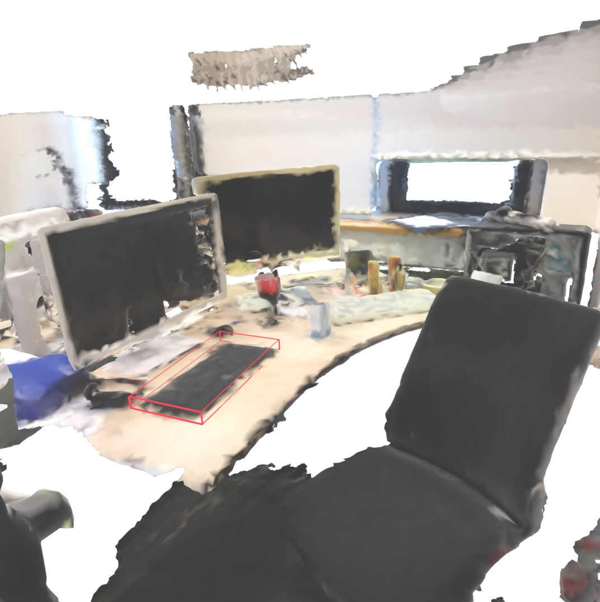 | Develop a description of the object at the specified position in the 3D backdrop. | This is a black keyboard. It is in front of two monitors. | The keyboard sits atop the workstation desk. It is located in front of the left-side monitor. |
| 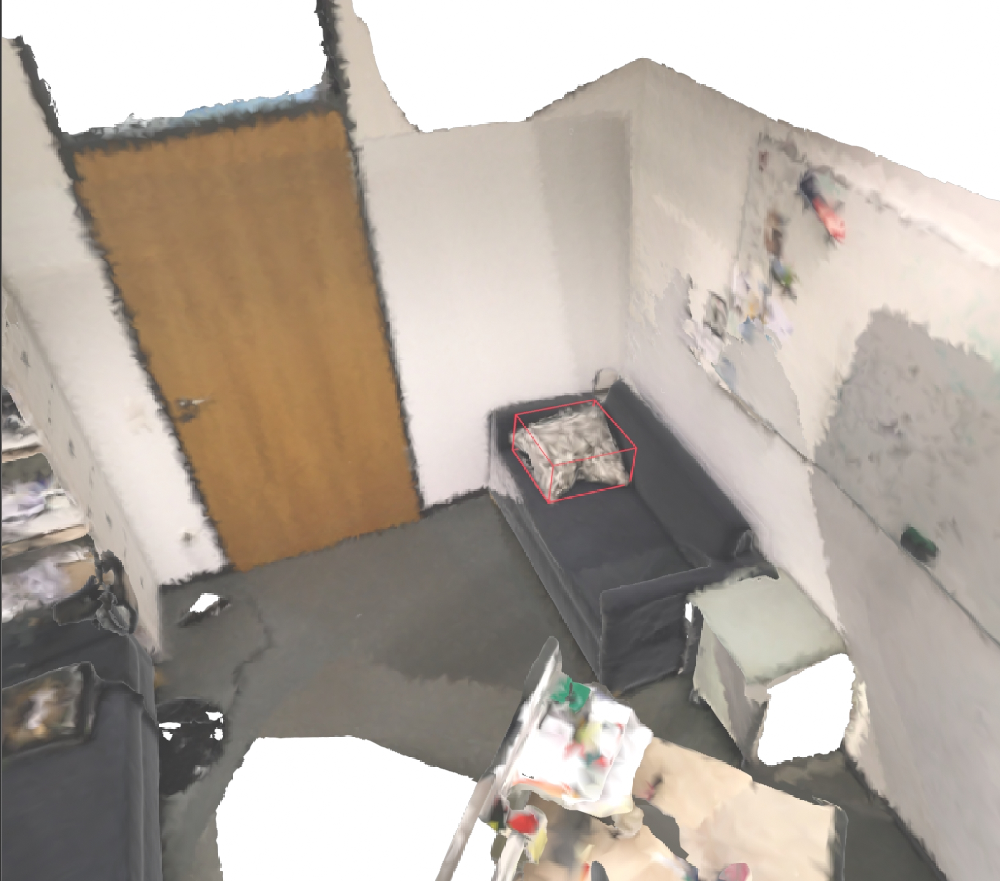 | Focus on the object at the given 3D location and describe it. | This is a white pillow. It is on the couch. | It is a small pillow located on the couch. You can notice it directly on your left when walking through the door into the room. |
| 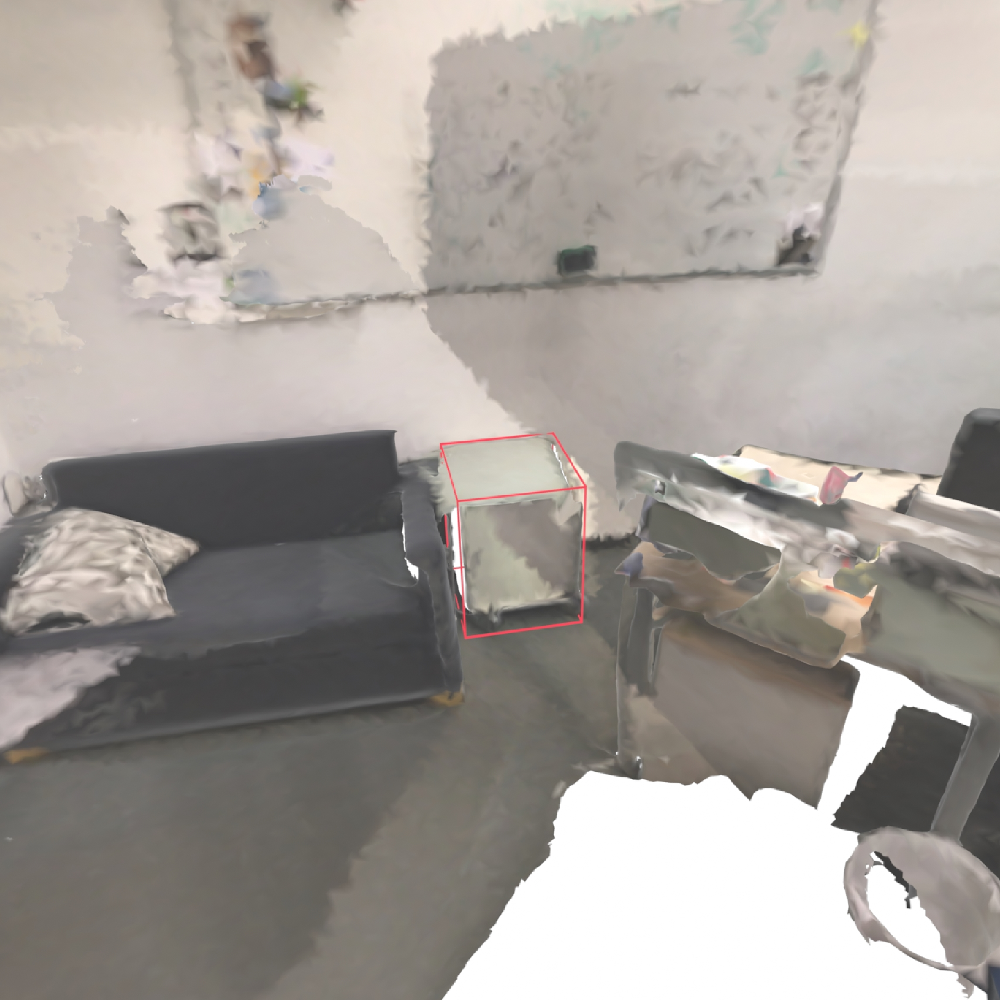 | Provide a clearer description of the object at that specific 3D spot. | This is a white cabinet. It is to the right of a couch. | This is a white ottoman. It is located to the right of the black couch. |
|  | What does the object at the specified position in the 3D visualization look like? | There is a rectangular brown door. It is next to a couch. | There is a door in the middle of the northern wall next to a metal cabinet. The door is shaped like a brown rectangle and as a dark yellow colored doorknob. |

**Additional qualitative results on Scan2Cap validation set**.

</div>

<span id="tab:Scan2Cap_add" label="tab:Scan2Cap_add"></span>

## ScanQA

We provide additional qualitative results on ScanQA validation set in  
eftab:ScanQA_add and categorize the responses into several types:

- *Wrong*. The response is inaccurate and deemed wrong.

- *Wrong but reasonable*. The response is deemed wrong but is reasonable to some extent, probably due to ambiguities in the scene. Consider the second case in  
  eftab:ScanQA_add. There are many objects such as a coat rack, a coat, and a mini fridge-shaped cabinet on the right side of the organizer. Though <span class="smallcaps">LEO</span>’s response “mini fridge” does not match the ground truth “coat rack”, it is consistent with the 3D scene layout.

- *Wrong but accurate*. The response is accurate according to the scene but is deemed wrong due to imperfect ground truth annotations.

- *Correct*. The response is accurate and deemed correct.

- *Correct and more accurate*. The response is more accurate than the ground truth annotations.

<div id="tab:ScanQA_add">

| Scene | Question | Response | Ground Truth | Response Type |
|:--:|:---|:---|:---|:---|
| 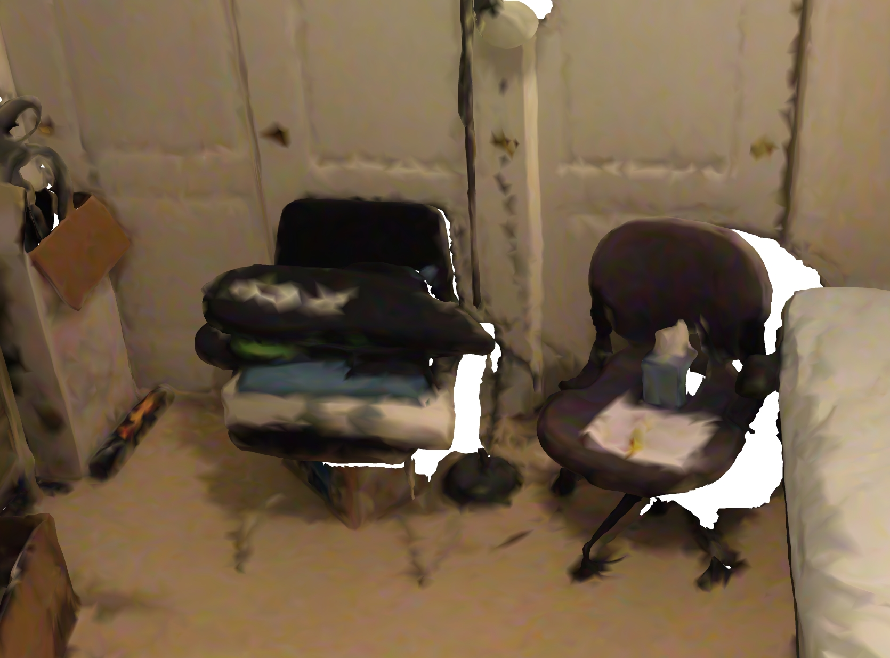 | What is placed on the black chair out of the three chairs present in the room? | pillow | tan jacket, guitar box like object | *Wrong* |
| 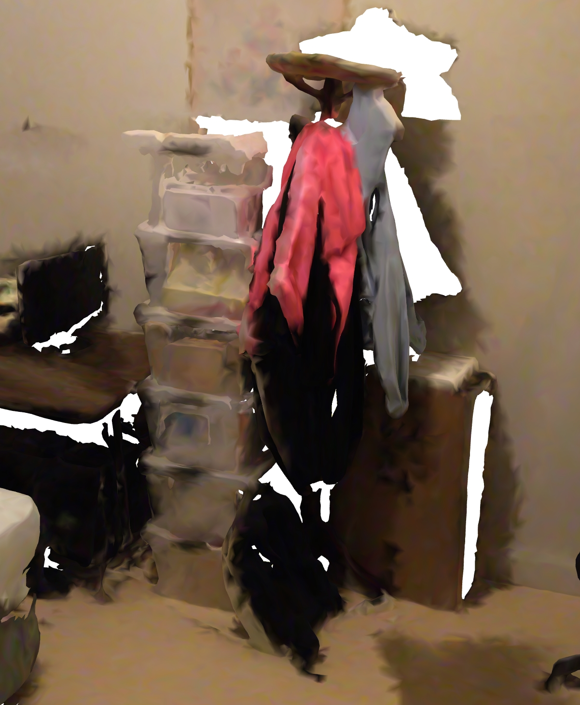 | What is next to the organizer shelf? | mini fridge | coat rack | *Wrong but reasonable* |
| 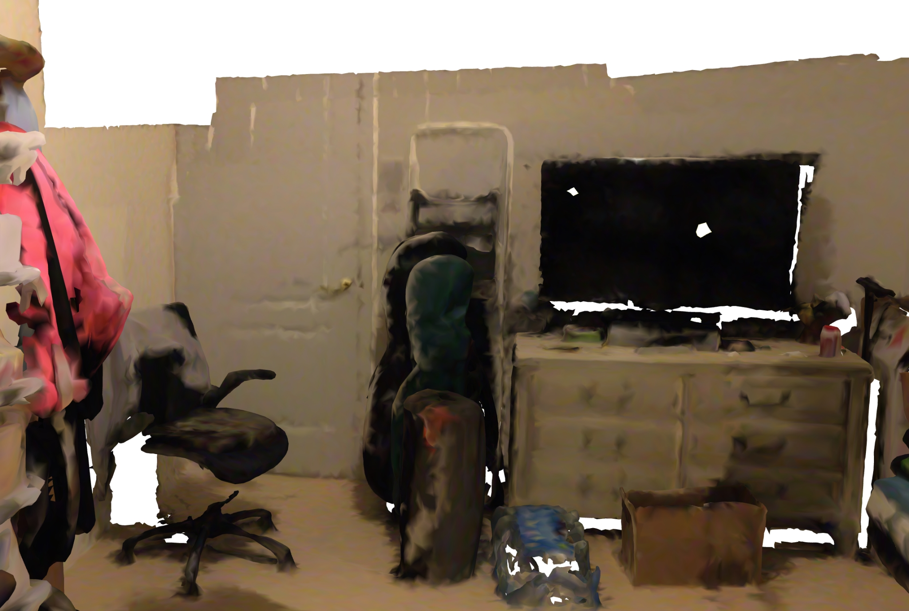 | Where is the dresser located? | to right of door | underneath television next to black guitar case and green guitar case, under tv set next to guitar cases | *Wrong but accurate* |
|  | What kind of desk is the electric piano on? | wooden desk | wooden desk | *Correct* |
|  | How many monitor sits on top of the desk? | 2 | 2 | *Correct* |
|  | What is on the left side of the brown desk? | black computer monitor | monitor / computer monitor | *Correct and more accurate* |

**Additional qualitative results on ScanQA validation set**.

</div>

<span id="tab:ScanQA_add" label="tab:ScanQA_add"></span>

## SQA3D

We provide additional qualitative results on SQA3D test set in  
eftab:sqa_add and follow the aforementioned response types. The embodied reasoning in SQA3D requires the understanding of not only the scene but also the situation of embodiment. In  
eftab:sqa_add, answering “What am I sitting at?” necessitates that <span class="smallcaps">LEO</span> accurately identifies the objects at its current location. And the response to “How many beds are in front of me?” indicates that <span class="smallcaps">LEO</span> can reason based on the understanding of its orientation.

<div id="tab:sqa_add">

| Scene | Question | Response | Ground Truth | Response Type |
|:--:|:---|:---|:---|:---|
| 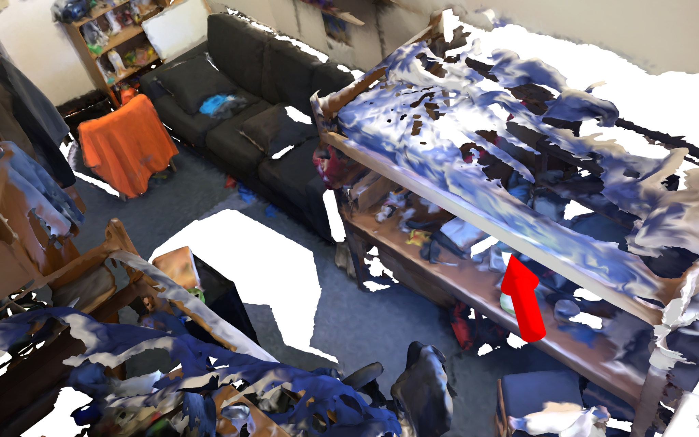 | What is the only orange object on my left side? | backpack | jacket | *Wrong* |
| 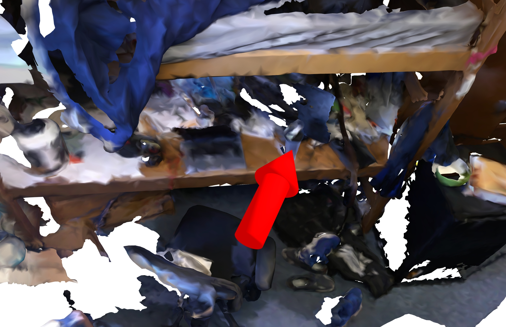 | Is there anything on the desk? | yes | laptop | *Wrong but accurate* |
|  | What type of bed is the one on the right? | loft bed | loft bed | *Correct* |
|  | What am I sitting at? | desk | desk | *Correct* |
| 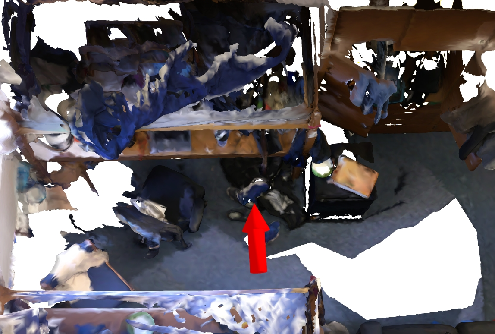 | How many beds are in front of me? | one | one | *Correct* |

**Additional qualitative results on SQA3D test set**.

</div>

<span id="tab:sqa_add" label="tab:sqa_add"></span>

<div id="tab:supp_data_example">

| Dataset & Task | 2D & 3D input | Instruction | Response |
|:--:|:--:|:---|:---|
|  |  |  |  |
| object captioning |  | USER: Explain the object at the pinpointed location in the 3D setting. ASSISTANT: | a yellow metal cage with a fence around it. |
|  |  |  |  |
| object referring |  | USER: Give me a snapshot of the object at the chosen 3D location. ASSISTANT: | find the office chair that is near the copier |
|  |  |  |  |
| scene captioning |  | USER: Relay a brief summary of this scene’s elements. ASSISTANT: | In this scene, there is a gray flat picture hanging on the wall, standing in front of a windowsill. There is also a rectangular white padded pillow lying on the bed, close to a big rectangular white padded pillow. The room has a white architectural wall and a flat overhead ceiling. The bed is tidy and white, located in front of a narrow tall commode. The curtains are hanging on the wall. The room has a calm and comfortable atmosphere, suitable for relaxation and sleep. |

**Examples from our datasets**. We provide the tasks, 2D images (optional), 3D point clouds, and instructions as the input of <span class="smallcaps">LEO</span>, as well as the expected responses of <span class="smallcaps">LEO</span>.

</div>

<span id="tab:supp_data_example" label="tab:supp_data_example"></span>

<div id="tab:supp_data_example_cont">

<table>
<caption><strong>Examples from our datasets</strong>. Continued.</caption>
<tbody>
<tr>
<td style="text-align: center;"></td>
<td style="text-align: center;"></td>
<td style="text-align: left;"></td>
<td style="text-align: left;"></td>
</tr>
<tr>
<td style="text-align: center;">3D captioning</td>
<td style="text-align: center;"></td>
<td style="text-align: left;">USER: What does the object at the specified position in the 3D visualization look like? ASSISTANT:</td>
<td style="text-align: left;">there is a door in the middle of the northern wall next to a metal cabinet. the door is shaped like a brown rectangle and as a dark yellow colored doorknob.</td>
</tr>
<tr>
<td style="text-align: center;"></td>
<td style="text-align: center;"></td>
<td style="text-align: left;"></td>
<td style="text-align: left;"></td>
</tr>
<tr>
<td style="text-align: center;">3D QA</td>
<td style="text-align: center;"></td>
<td style="text-align: left;">USER: What is in the right corner of room by curtains? ASSISTANT:</td>
<td style="text-align: left;">brown cabinet with tv sitting in it</td>
</tr>
<tr>
<td style="text-align: center;"></td>
<td style="text-align: center;"></td>
<td style="text-align: left;"></td>
<td style="text-align: left;"></td>
</tr>
<tr>
<td style="text-align: center;">3D dialogue</td>
<td style="text-align: center;"></td>
<td style="text-align: left;"><p>USER: I’m redecorating my living room. Can you give me some suggestions on how to arrange the furniture?</p>
<p>ASSISTANT: Of course! I’d be happy to help. What furniture do you have in your living room?</p>
<p>USER: I have a sofa, a table, a chair, and a couch table. ASSISTANT:</p></td>
<td style="text-align: left;">Great! Here’s a suggestion: you can place the sofa against the wall, with the table in front of it. The chair can be placed to the right of the table, and the couch table can be placed to the right of the chair. This arrangement creates a cozy seating area.</td>
</tr>
<tr>
<td style="text-align: center;"></td>
<td style="text-align: center;"></td>
<td style="text-align: left;"></td>
<td style="text-align: left;"></td>
</tr>
<tr>
<td style="text-align: center;">task planning</td>
<td style="text-align: center;"></td>
<td style="text-align: left;">USER: Develop a plan for this: Arrange and embellish the family room. ASSISTANT:</td>
<td style="text-align: left;"><p>1. Arrange and fluff the cushions and pillows on the armchair.</p>
<p>2. Place decorations, such as figurines or vases, on the cabinet or shelf.</p>
<p>3. Place hygiene products, such as wipes or lotions, on the commode.</p>
<p>4. Turn on the lights and adjust their brightness if needed.</p>
<p>5. Arrange diapers in a designated storage area.</p>
<p>6. Place a blanket or pillow on the armchair for added comfort.</p>
<p>7. Adjust the festoon or other decorative elements if desired.</p></td>
</tr>
</tbody>
</table>

</div>

<span id="tab:supp_data_example_cont" label="tab:supp_data_example_cont"></span>

<div id="tab:supp_data_example_cont2">

|  |  |  |  |
|:--:|:--:|:---|:---|
|  |  |  |  |
| embodied navigation |  |  |  |
|  | USER: The task is navigation. Your goal is to find counter by moving around in the scene. Past actions: \<31999\> \<31999\> \<31999\> \<31999\>. ASSISTANT: | \<31996\> |  |
|  |  |  |  |
| robotic manipulation |  |  |  |
|  | USER: The task is manipulation. Your goal is to put the blue blocks in a green bowl. Past actions: \<31991\> \<31671\> \<31511\> \<31991\> \<31671\> \<31511\> \<31991\> \<31671\> \<31511\> \<31991\> \<31671\> \<31511\> \<31991\> \<31671\> \<31511\> \<31991\> \<31671\> \<31511\> \<31991\> \<31671\> \<31511\> \<31991\> \<31671\> \<31511\>. ASSISTANT: | \<31748\> \<31644\> \<31511\> \<31736\> \<31595\> \<31500\> |  |

**Examples from our datasets**. Continued.

</div>

<span id="tab:supp_data_example_cont2" label="tab:supp_data_example_cont2"></span>
