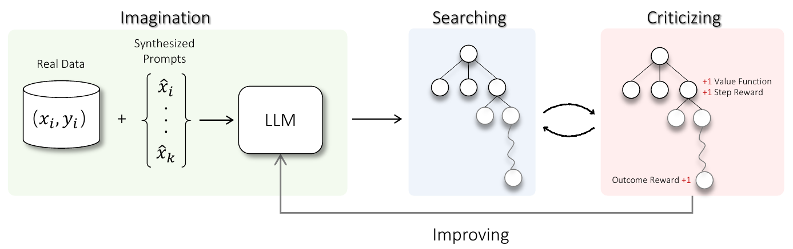
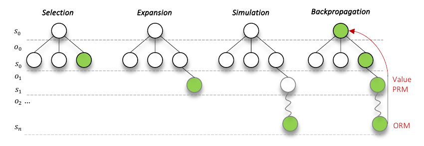

# Toward Self-Improvement of LLMs via Imagination, Searching, and Criticizing

## Abstract

Despite the impressive capabilities of Large Language Models (LLMs) on various tasks, they still struggle with scenarios that involves complex reasoning and planning. Self-correction and self-learning emerge as viable solutions, employing strategies that allow LLMs to refine their outputs and learn from self-assessed rewards. Yet, the efficacy of LLMs in self-refining its response, particularly in complex reasoning and planning task, remains dubious. In this paper, we introduce AlphaLLM for the self-improvements of LLMs, which integrates Monte Carlo Tree Search (MCTS) with LLMs to establish a self-improving loop, thereby enhancing the capabilities of LLMs without additional annotations. Drawing inspiration from the success of AlphaGo, AlphaLLM addresses the unique challenges of combining MCTS with LLM for self-improvement, including data scarcity, the vastness search spaces of language tasks, and the subjective nature of feedback in language tasks. AlphaLLM is comprised of prompt synthesis component, an efficient MCTS approach tailored for language tasks, and a trio of critic models for precise feedback. Our experimental results in mathematical reasoning tasks demonstrate that AlphaLLM significantly enhances the performance of LLMs without additional annotations, showing the potential for self-improvement in LLMs. The code is available at <https://github.com/YeTianJHU/AlphaLLM>.

# Introduction

LLMs, trained on trillions of tokens with billions of parameters have shown unparalleled capabilities in a wide range of natural language processing tasks . Nevertheless, they continue to face challenges in scenarios requiring complex reasoning and strategic planning  . While advanced prompting approaches such as Chain, Tree, Graph-of-Thought , it remains essential to fine-tune LLMs using a substantial volume of high-quality, supervised data to fundamentally improve the model performance . This methodology is inherently limited by the scope and quality of data that humans can provide.

Considering these challenges, the concept of self-correction and self-learning have been proposed as promising solutions . Within these framework, LLMs typically operate by employing two main strategies: 1) they continuously refine their responses based on the feedback of their past responses, and 2) they extensively sample responses then learn from preferences judged by itself as reward models with PPO or DPO . However, it remains a matter of ongoing research whether LLMs can effectively critique their own outputs to either enhance response quality or apply a scalar reward to indicate the quality of responses, especially in contexts demanding intricate planning and reasoning . On the other hand, advanced search algorithms such as MCTS, combined with reinforcement learning, have enabled models to learn from self-play and achieve human parity or even surpass human performance in complex tasks such as the game of Go . This naturally raises a question: is it viable to leverage the strengths of MCTS alongside LLMs to inaugurate a novel paradigm of self-improving? More precisely, could the assimilation of MCTS empower LLMs to more effectively explore better responses, guided by strategic signals, and subsequently optimize these responses to enhance overall performance?

To answer this question, we begin with a systematic examination of AlphaGo, identifying three critical aspects for its success: (  ) The large volume of data, including self-play data. (  ) The use of tree search, which facilitates the exploration of potential moves through statistical sampling of the large search space. (  ) Accurate and unambiguous environment feedback; the direct and accurate feedback (win or loss) provided by the game of Go offers a clear and unequivocal learning signal . The integration of MCTS with LLMs for self-improvement has several challenges: (  ) Limited Data: High-quality annotated data for LLMs is generally scarce. Furthermore, how to construct of synthetic data for LLMs training, similar to AlphaGo’s self-play data, remains unclear. (  ) Search Efficiency: The vast number of potential token combinations in natural language tasks results in an exponentially large search space, posing a significant challenge to the efficiency of MCTS . (  ) Imperfect Feedback: In contrast to the clear win/loss feedback in Go, feedback in natural language tasks is often subjective and nuanced, without a straightforward measure of success.

<figure><figcaption aria-hidden="true">Imagination-Searching-Criticizing self-improvement loop: Imagination component synthesizes prompts as new learning examples, with MCTS searching better trajectories guided by signals from critics for policy improving.</figcaption></figure>

In this paper, we introduce AlphaLLM, an imagination-searching-criticizing framework designed for the self-improvement of LLMs . AlphaLLM consists of three key components, as illustrated in Figure <a href="#fig:framework" data-reference-type="ref" data-reference="fig:framework">1</a>. First, an imagination component is designed to synthesize prompts, alleviating the issues of data scarcity. Second, we propose *η*Mcts tailored for efficient searching in language tasks. Particularly, it has been show that planning at multiple levels of temporal abstraction is critical for RL problems with a long horizon and large action space . As such, we propose formulating the text generation process as options over a Markov Decision Process (MDP) problem, where each option represents the generation of a collection of tokens for a specific subtask, similar to the concept of chains in chain-of-thought prompting. This formulation improves search efficiency by substantially reducing the search depth. Additionally, we propose the use of state merge and adaptive branching factors to further enhance search efficiency by balancing the trade-off between search width and depth. Lastly, since accurate feedback is crucial to the success of MCTS, we introduce a trio of critic models to guide *η*Mcts, including a value function for estimating expected rewards, a process reward model for assessing node correctness, and an outcome reward model for evaluating the overall trajectory. For complex tasks with which LLMs struggle assessing such as arithmetic computation and code execution, to ensure the accuracy of feedback, we augment the critics with the capacity to make dynamic decisions on which tools to use, when to use them, and how to use them effectively. After *η*Mcts stage, we collect the trajectory with the largest reward from the critic models as the training examples to improve LLMs.

The experimental results on mathematical reasoning tasks demonstrate that AlphaLLM can efficiently search for better responses and use them to improve LLMs’ performance, forming an effective self-improving loop. Notably, based on Llama-2-70b and WizardMath-70B-V1.0, AlphaLLM can improve its performance from 57.8 to 92.0 on GSM8K and from 20.7 to 51.0 on MATH, performing comparably to GPT-4.

# Related Work

#### Search with LLM

Effective search strategy has been shown crucial for tasks that involve complex reasoning and planning, such as go and math reasoning . For math reasoning tasks, various search methods have been studied. One direction of research designed beam search with dynamic pruning, where beam items of low quality are pruned. Another line of work maintains a tree or a graph that represents the current progress of solving the input question where potential branches are iteratively expanded. Both our approach and are based on the MCTS algorithm, while one main difference is how to define a search step: fix a search step to be either a token or a sentence, while our approach is more flexible on deciding steps. We have also carefully designed the MCTS process, incorporating multiple critique signals to guide the search more effectively and introducing adaptive search parameters for improved state exploration. As the result, our approach achieves much better performances.

#### LLM Self-improving

Being a key to the success of scalable oversight , self-improving for LLM aims to align the LLM to human preference and values mainly using the supervision from the knowledge inside the LLM . One crucial part of self-improving is how to obtain reliable signal of critique to distinguish between good responses from the LLM and bad ones. Initial work first asks the LLM to generate input queries of diverse tasks and the corresponding outputs. They then rely on hand-crafted heuristic rules to filter out redundant or low-quality data pairs (e.g. the query is too long or too short). Since it is non-trivial to compose effective heuristic rule, later work proposes a few general principles or judging criteria and ask the LLM itself to evaluate the quality its responses based on these guidance, hoping that LLMs can automatically designate these principles into each data point to better guide data filtering. However, this requires LLMs to have strong abilities to apply these principles for each specific case and make correct judgements. Different from previous work, we propose to leverage the supervision from MCTS for LLM self-improvement: taking the outputs of MCTS to continue train the LLM. This is because the outputs from MCTS are usually in much better quality then standard nucleus sampling, and the large gap ensure that the LLM can self improve.

# Preliminaries

## Problem Formulation

In this paper, we consider a LLM characterized by probability *p**θ* and denoted as policy *π**θ*. It takes a sequence **x** = \[*x*1, ⋯, *x**n*\] as input, which is typically referred as prompt, to generate the response **y** = \[*y*1, ⋯, *y**m*\]. In the context of LLMs, each *x**i* and *y**i* represents a token from a pre-defined vocabulary. The policy *π**θ* operates in an autoregressive manner, where each token is generated sequentially, relying solely on the context provided by the previously generated tokens. The policy therefore constitutes a Markov process in which the conditional probability distribution *p**θ*(**y**\|**x**) can be decomposed and expressed with the chain rule as $p\_\\theta({\\bm{y}}\|{\\bm{x}}) = \\prod\_{i=1}^{m} p\_{\\theta}(y\_i\|{\\bm{x}}, {\\bm{y}}\_{&lt;i})$.

With this property, the text generation task can be formulated as an Markov Decision Process (MDP) problem consisting of (𝒮, 𝒜, *T*, *R*, *γ*)  in which, **s***t* ∈ 𝒮 represents the context information of current trajectory, *i.e.,* current status of the generation process, *e.g.,* a partial response to a prompt; *a**t* ∈ 𝒜 denotes a single action or sampled token from the vocabulary, leading to a transition to a new state **s***t* + 1, by concatenating **s***t* and *a**t*; *r**t* = *R*(**s***t*, *a**t*) manifest the evaluation of the generation to the prompt, reflecting the desirability or preferences of each state-action pair.

This MDP framework sets the stage for applying Reinforcement Learning (RL) methods to optimize the policy *π***θ** aiming to maximize the expected cumulative reward *R*. Base on these setups, we describe the self-improving problem. Given a LLM *π***θ** and an initial dataset 𝒟0, which consists of *N* expert-generated prompt-response pairs {(**x***i*0, **y***i*0) ∣ *i* ∈ \[*N*\]}, the goal of self-improving is to iteratively refine *π**θ* to maximize the reward. The refinement process includes learning from synthesized prompts and corresponding responses. These responses are obtained using an advanced search algorithm that navigates the space of possible responses to maximize the expected reward. The detailed process is described in Algorithm <a href="#algo:self_improving" data-reference-type="ref" data-reference="algo:self_improving">[algo:self_improving]</a> in Appendix. The primary challenges in forming an effective self-improving loop lie in synthesizing suitable prompts, efficiently searching over a vast action space, and obtaining precise feedback, which will be discussed in §<a href="#sec:method" data-reference-type="ref" data-reference="sec:method">4</a>.

## Monte Carlo Tree Search

MCTS is a sampling-based search algorithm for policy optimization in decision-making problems. It would iteratively build a search tree, by repeating four phases: selection, expansion, evaluation, and backpropagation. In the selection phase, it would recursively select the children from the root node by Upper Confidence Bound (UCB)  , $UCB(i)=w\_i+C\*\\sqrt{2\*\\ln{\\frac{N\_i}{n\_i}}}$, where *n**i* and *N**i* are the visit counts for the node *i* and its parent respectively, *C* represents a hyperparameter balancing exploration and exploitation, and the *w**i* is the average value of all descendant nodes of *i*.

# AlphaLLM

## Overview

The architecture of AlphaLLM is depicted in Figure <a href="#fig:framework" data-reference-type="ref" data-reference="fig:framework">1</a>, comprising three key components. Firstly, the imagination component is tasked with synthesizing prompts as learning examples. Secondly, an efficient search component, named *η*Mcts, is proposed to search high-quality trajectories for optimizing the policy. Lastly, the search process is guided by critics specifically designed to provide reliable signals.

## Data Synthesizing

Let 𝒟0 = {(**x***i*, **y***i*) ∣ *i* ∈ \[*N*\]} denote the initial dataset consisting of *N* expert-generated prompt-response pairs. The data synthesizing process aims to expand this dataset by generating a set of synthesized prompts 𝒟1 = {(**x***i*1, ⋯) ∣ *i* ∈ \[*N*\]}. The generation of each synthesized prompt **x***i*1 can be mathematically described as a transformation *g* applied to one or more examples from 𝒟0, **x***i*1 = *g*(**x***i*10, ⋯, **x***i**m*0, *π*0) where **x***i*10, ⋯, **x***i**m*0 are selected examples from 𝒟0. The transformation function *g* controls the synthesis process, which can be a learnable function, manually defined heuristic rules, a strong LLM or the policy model itself *π*0 equipped with data synthesis instructions. The data synthesizing process aims to enrich the diversity and complexity presented for the training of the policy model. Among various strategies, such as Self-instruct , Evol-instruct , we opt for a method akin to that described in .

## *η*Mcts

<figure><figcaption aria-hidden="true">An overview of the four operations of <em>η</em>Mcts. A node is selected, expanded, simulated with fast rollout policy until a terminal node is reached, then the signals from value function, <code>PRM</code> and <code>ORM</code> are backpropagated.</figcaption></figure>

### Option-level MCTS

| `Search Node`  |                                                                              `Example`                                                                               |    `Termination`     |
|:--------------:|:--------------------------------------------------------------------------------------------------------------------------------------------------------------------:|:--------------------:|
|  Token-level   |            *y*0 → *y*1 → *y*2 → *y*3 → *y*5 → *y*6 → *y*7 → *y*8             |        token         |
| Sentence-level |   *y*0*y*1*y*2  → *y*4*y*5*y*6  → *y*7*y*8*y*9*y*10    |       new line       |
|  Option-level  | *y*0  → *y*1*y*2  → *y*4*y*5*y*6 *y*7*y*8*y*9  → *y*10 | termination function |

Comparative illustration of token-level, sentence-level, and option-level MCTS search nodes. *y* denotes a token sampled from the policy model. The arrow → represents the transition from one search node to the subsequent node within the search process.

When applying MCTS to LLMs, it is natural to perform token-level search, where each token is considered as an action . However, the substantial vocabulary size typical of LLMs presents a significant challenge *i.e.,* conducting a deep search in such a vast space becomes increasingly complex as the search space expands exponentially. To mitigate this, some efforts proposed a sentence-level search, treating each sentence or step as a search node . While this method reduces the search space, it might compromise the flexibility and effectiveness of applying MCTS to LLMs, which is particularly true for tasks where subtle variations in token can dramatically impact the outcome, or where a more comprehensive search beyond a sentence is necessary.

Inspired by , we use the term option as a search node and propose option-level MCTS where each option represents a sequence of tokens, which can range from multiple tokens to several sentences. A comparisons of different levels search is listed in Table <a href="#tab:option" data-reference-type="ref" data-reference="tab:option">1</a>. Mathematically, an option *o* = ⟨ℐ, *π*, *β*⟩, where ℐ ⊆ 𝒮 is a set of initial states for the option; *π* : 𝒮 × 𝒜 → \[0, 1\] is a policy to generate actions, which in our case is a LLM; and *β* : 𝒮+ → \[0, 1\] is the termination function. Starting from a state *s**t*, we can choose all the options for which *s**t* ∈ ℐ. Once an option is chosen, the policy *π* will generate actions for several steps until the option terminates according to the termination function *β*. The option-level MCTS consists of stages including selection, expansion, simulation, and backpropagation. The option-level formulation offers more flexibility compared to the sentence-level, as a new line can be treated as a special case of the termination function, as demonstrated in Table <a href="#tab:option" data-reference-type="ref" data-reference="tab:option">1</a>. Additional detailed steps of the option-level MCTS can be found in Appendix <a href="#app:option_level_mcts" data-reference-type="ref" data-reference="app:option_level_mcts">7.2</a>.

### Importance-Based Adaptive Branching

In previous works related to option/sentence level tree search  , it was a common practice to assume that each node in the tree has the same predefined width, *i.e.*, branching factor. This assumption was due to the fact that unlike token-level MCTS with a limited action space, the sample space at the option-level is exceedingly large, with an unlimited number of token combinations. As a result, it was necessary to set a predefined maximum width for each node. However, this predefined branching factor is hard to set, as an improper choice can lead to a search tree that is either too shallow or too thin, resulting in an inefficient exploration of the search space.

To quantify the error induced by the branching factor limit, we defined the branching error *E**ϕ*(*t*). For a node *t* with a branching factor of *m**t*, it aims to use the *m**t* child options **o***t**i* ∼ 𝒟*t**c**h**i**l**d**r**e**n* (where *i* ∈ {1, …, *m**t*}) to represent all possible options. Consequently, for a legal option **o***t**j* ∼ *π*(**s***t*) from the option space, we can calculate the minimal value difference between it and the *m**t* existing options, which captures the error associated with representing other possible options using the *m**t* available options. It can be formulated as *E**ϕ*(*t*) =  \[min**o***t**i*\|*v**ϕ**π*(\[**s***t*, **o***t**j*\]) − *v**ϕ**π*(\[**s***t*, **o***t**i*\])\|\], where *v**ϕ**π* is the value function which will be detailed in §<a href="#sec:critic" data-reference-type="ref" data-reference="sec:critic">4.4</a>. Here we define the importance of node **s***t* as *I*(**s***t*) = max**o***t**i*\|*v**ϕ**π*(\[**s***t*, **o***t**i*\]) − *v**ϕ**π*(**s***t*)\|. For simplicity, we assume that the value of the children nodes are uniformly distributed (a detailed analysis of the Gaussian distribution can be found in Appendix <a href="#app:node_importance_gaussian" data-reference-type="ref" data-reference="app:node_importance_gaussian">7.4</a>). Under this assumption, we show in Appendix <a href="#app:node_importance_uniform" data-reference-type="ref" data-reference="app:node_importance_uniform">7.3</a> that $E\_{\\phi}(t) \\le \\frac{I({\\bm{s}}\_t)}{m\_t-1}.$ While *E**ϕ* is less than some *ϵ*, we aim to use a smaller total number of nodes for efficiency.

**Theorem 1**. *The optimal branching factor *m**t* in a tree search is set such that *m**t* − 1 is proportional to the node importance *I*(**s***t*), under the condition $\\frac{I({\\bm{s}}\_t)}{m\_t-1} \\le \\epsilon$.*

A similar concept has also been proposed in  . Intuitively, *I*(**s***t*) captures the maximum value deviation from the current state. When this value is small, there is no need to explore further on this node, as there will not be a significant difference by rolling out on this node. Conversely, if the value is large, it is worth trying different children. We set the number of children allowed for a node *n*(**s***t*) (after extracting 1) to be linear with this importance, using a factor *α*. In practice, to avoid extreme cases of large variance of *I*(**s***t*) in the early stage, we bound the number of children by depth-dependent constants *c*`m``i``n`(*t*) and *c*`m``a``x`(*t*), *n*(**s***t*) = max (*c*`m``i``n`(*t*),min(⌊*α**I*(**s***t*)⌋+1,*c*`m``a``x`(*t*))).

### State Merge

With *n*(**s***t*) determined, another issue is that options under the same node may be very similar, leading to many unnecessary sub-trees. Since we cannot directly control the **o***t* ∼ *π*(**s***t*), one strategy to mitigate this issue is to utilize the concept of move groups, as discussed in  . By merging similar nodes into the same group, we can increase the diversity among groups, thereby covering a larger problem space with limited search rollouts and making the search process more efficient.

Here, we adapt the definition of node predicate *p**v**M* from   and   to represent whether two nodes are extremely similar. In practice, each time we generate a new option from the policy, we use heuristic functions as *p**v**M* to check its similarity with all existing groups. The heuristic function can either be a faster rule-based measurement (e.g., edit distance) or a model-based method (e.g., prompting a language model). Based on this, we decide whether to merge this option with a previous one or create a new group.

### Fast Rollout with Specialized LM

The simulation operation which employs a rollout policy to project future trajectories from a given state, is crucial for an effective MCTS. This process significantly improves the efficiency of exploration and exploitation, and enhances the accuracy of reward estimation[2]. Estimations made at the end of trajectories tend to have lower bias but higher variance; thus, simulating multiple possible trajectories yields low-bias, low-variance estimates, enabling a more informed and effective search process. Ideally, *π**θ* would serve as the rollout policy, yet its computational demands render it impractical for the rapid simulations required by MCTS. To address this challenge, we propose the use of a smaller, specialized LM as the fast rollout policy *π*`f``a``s``t`. Given a state **s***t*, the fast rollout policy *π*`f``a``s``t` efficiently continues generation until it reaches a termination condition, denoted as *π*`f``a``s``t`(**s***t*).

## Critic

In AlphaLLM, we design three types of critic models to guide the search process.

#### Value Function

The value function, denoted as *v**π*(**s**), represents the expected return starting from state **s** and following policy *π* thereafter, given by *v**π*(**s**) = 𝔼*τ* ∼ *π*\[*R*(*τ*)\|*s*0 = **s**\] where *R*(*τ*) represents the discounted return of trajectory *τ*. To train a parameterized value function *v**ϕ**π*(**s**), given the prompts 𝒟 = {(**x***i*, ⋯) ∣ *i* ∈ \[*N*\]}, for each prompt **x***i*, we generate multiple trajectories **τ***i**j* = {**x***i*, **o***i*1*j*, **o***i*2*j*, ⋯, **o***i**T**j*} by following policy *π* for *J* times. A final reward *r**i**j* is assigned to indicate whether **τ***i**j* aligns with **y***i*—for example, rewarding trajectories that contain correct answers in mathematical tasks or closely follow instructions as ground truth. We then construct a dataset 𝒟`v``a``l``u``e` = {(**s***i**t**j*, *v**i**t**j*) ∣ *i* ∈ \[*N*\], *t* ∈ \[*T*\], *j* ∈ \[*J*\]} where **s***i**t**j* = \[**x***i* ⋅ **o** &lt; *i**t**j*\] and *v**i**t**j* = *r**i**j*. The value function *v**ϕ**π* is optimized by minimizing the mean squared error: ℒ*ϕ* =  − 𝔼(**s**, *v*) ∼ 𝒟`v``a``l``u``e`(*v**ϕ**π*(**s**) − *v*)2. Similar to  , *v**ϕ**π* is a LLM with an MLP layer on top to output a scalar on each token, using the scalar prediction at the last token of each state as the value.

#### PRM

The value function often struggles with credit assignment problem  and its learning could be inefficient due to delayed and sparse rewards . Therefore, we propose to incorporate `PRM` that introduces process supervision  for direct option assessment. `PRM` generates intrinsic rewards  to encourage explorations of advantageous options, effectively mitigating issues of reward sparsity by providing immediate, action-specific rewards. Given a state **s***t* and an option **o***t* at time *t*, the `PRM` aims to predict the immediate reward *r**t*`PRM` that results from taking option **o***t* in state **s***t*. Formally, the `PRM` is a function *R*(**s***t*, **o***t*) → *r**t*`P``R``M`. While `PRM` ideally requires quality labels for each state  , due to the high cost and time involved in obtaining these, MC estimation with prefix sampling  is used as a proxy, which aligns with the objective of the value function. Instead of adding a MLP layer on top of the policy model for outputting a scalar reward , we formulate `PRM` as a text generation task to best leverage LLM’s intrinsic knowledge for assessing the quality of an option. We adapt the dataset constructed for the value function as 𝒟`P``R``M` = {(**s***i**t*, **o***t*, *r**t*`P``R``M`)\|*i* ∈ \[*N*\], *t* ∈ \[*T*\]} where *r**t*`P``R``M` is the textual description of the reward, *e.g.,* an option can be regarded as good if *v**i**t* is larger than certain threshold. To train `PRM`, we initialize it from the policy model *π* and use the following prompt templates and typical language model loss. The prompt template is shown in Appendix <a href="#app:prompt" data-reference-type="ref" data-reference="app:prompt">7.5</a>.

#### ORM

In additional to the value function and `PRM`, `ORM` is also used to guide MCTS. `ORM` is designed to evaluate options sequences in their entirety, assessing the extent to which the complete trajectory aligns with the desired end goal . The outcome evaluation complements value function and `PRM` by offering a comprehensive assessment of trajectories. Crucially, `ORM` plays a vital role in the simulation stage of MCTS by providing more accurate signals on the terminal state, which in turn facilitates a more balance between exploration and exploitation strategies. `ORM` is formulated as a text generation task, similar to `PRM`. We leverage the same dataset for the value function training and construct 𝒟`O``R``M` = {(**x***i*, **o**1 : *T**i*, *r**i*`O``R``M`)\|*i* ∈ \[*N*\]}, where each instance includes a initial state or prompt **x***i*, a sequence of actions or options **o**1 : *T**i* taken from that state, and a textual reward *r**i*`O``R``M` indicating the sequence’s success or quality. Similarly, `ORM` is initialized from the policy model *π* and the following prompt templates and language model loss are used for training. The prompt template is shown in Appendix <a href="#app:prompt" data-reference-type="ref" data-reference="app:prompt">7.5</a>.  
The final score evaluation of a state **s** is a weighted sum of the value function, `PRM`, and `ORM`: *s*(**s**) = *β*value ⋅ *v**ϕ**π*(**s**) + *β*PRM ⋅ `PRM`(**s**) + *β*ORM ⋅ 𝔼*τ* ∼ *π*`f``a``s``t`(**s**)\[`ORM`(*τ*)\], where *τ* ∼ *π*`f``a``s``t`(**s**) represents trajectories starting from **s** under *π*`f``a``s``t`, and *β*value, *β*PRM, *β*ORM are hyperparameters. In practice, we found that the value function model has better precision and calibration, while `PRM` has superior recall (Appendix <a href="#app:critic_performance" data-reference-type="ref" data-reference="app:critic_performance">7.10</a>). Although `ORM` with fast rollouts provides low-bias, low-variance estimates, it still inherits some bias from *π*`f``a``s``t`. Thus, combining these critics yields a stronger evaluation signal.

## Policy Self-Improvement

The policy improvement an iterative process with each iteration containing two main steps: *data generation* and *policy finetuning*.

#### Data generation

In this step, we assume to have the current policy *π**θ**k* and synthetic prompts 𝒟*k* = {**x**1*k*, …} at the *k*-th round, where each **x**1*k* represents a question. We obtain the corresponding training data 𝒟*k* for policy *π**θ**k* by firstly performing *η*Mcts on 𝒟*k* (§<a href="#sec:mcts" data-reference-type="ref" data-reference="sec:mcts">4.3</a>) and then sampling a trajectory **y***i**k* from the corresponding tree for each question **x***i**k*. Here we choose the trajectory that yield the highest critic score on the leaf node for each input question. Next, we filter out instances where the corresponding trajectory is substandard forming 𝒟*k* = {(**x***i**k*, **y***i**k*) \| *f*(**x***i**k*, **y***i**k*) &gt; *γ*} where *f* represents a function for quality scoring, and *γ* indicates a threshold. There can be several ways to implement the function, and here we simply use the `ORM` (§<a href="#sec:critic" data-reference-type="ref" data-reference="sec:critic">4.4</a>).

#### Policy finetuning

With the obtained training data 𝒟*k*, we organize the data into the prompt templates shown in Appendix <a href="#app:prompt" data-reference-type="ref" data-reference="app:prompt">7.5</a>. Then the policy *π**θ**k* is finetuned using target-loss: ℒ*θ**k* = 𝔼(**x***i**k*, **y***i**k*) ∼ 𝒟*k*\[log *π**θ**k*(**y***i**k*\|**x***i**k*)\], resulting in an updated policy *π**θ**k* + 1. We leave other training methods, such as DPO or PPO in future work.

# Experiments

## Experiment Setups

AlphaLLM is generally applicable to a wide spectrum tasks. As an early exploration, in this paper, we conduct experiments on mathematical reasoning problems where the learning signals are clear to define *i.e.,* , final answer is correct or wrong. We choose to evaluate on two widely used datasets GSM8K  and MATH . For GSM8K, we utilize the whole test set while for MATH, due to computation constraints, we utilize a subset following the same procedure of . We evaluate the performance of predicting answers correctly for policy models. In addition, we calculate the average rollouts, represented by the number of nodes in the tree, as a measure of computational efficiency. We compare the performance of AlphaLLM with a suite of proprietary model, including OpenAI’s GPT-4 and GPT-3.5, Anthropic’s Claude-2, as well as Google’s PaLM-2 and the gemini model family. To ensure a fair and consistent evaluation, we employ CoT as our primary prompting method. Additionally, we conduct comparisons with strong open-source models, including Llama-2-70b  and WizardMath-70B-V1.0 .

We select Llama-2-70b as the policy model for the GSM8K dataset and WizardMath-70B-V1.0 for the MATH dataset. To construct the training dataset for the value function, `PRM` and `ORM`, we generate 50 trajectories for each prompt and construct the training target following Section <a href="#sec:critic" data-reference-type="ref" data-reference="sec:critic">4.4</a>. Both `PRM` and `ORM` are initialized using the weights from the policy model, while the value function uses a smaller Llama-2-13b model, as we observed no performance gains from increasing the value function model size. In the design of `ORM`, tool usage is not incorporated for GSM8K. However, for MATH, we enhance `ORM` by incorporating tools like python sympy to assess the quality of a trajectory, in a manner similar to that described by . The training employ a learning rate of 1e-6 and are trained for one epoch. For the fast rollout policy model, we opt for the Abel-002-7B model  for both the GSM8K and MATH tasks for its high efficiency and superior performance. For the MCTS parameters, they are configured at different scales, as shown in Appendix <a href="#app:implementation" data-reference-type="ref" data-reference="app:implementation">7.6</a>. We set *β*value, *β*PRM, and *β*ORM all to 1.0.

For policy self-improving (§<a href="#sec:self_improve" data-reference-type="ref" data-reference="sec:self_improve">4.5</a>), we train the policy model up to 3 epochs, setting batch size to 128, learning rate to 5 × 10 − 6 and minimal learning rate to 1 × 10 − 6. Linear warm-up and decay is used with warm-up percent to be 10%. We perform early stopping based on a devset held out from the training instances. For GSM8K experiments, we perform two rounds of self-improving, synthesizing 6.4k and 7.9k prompts respectively to obtain the corresponding MCTS outputs for training. For MATH experiments, we only perform one round of self-improving due to limited computation resources, and 5.9k prompts are synthesized.

The termination function for options can be either be learned or rule-based. In practice, for the GSM8K dataset, the termination condition occurs at the end of each line. This is based on the typical structure of this dataset, where each line represents a distinct step or point. For the MATH dataset, due to its complexity and the base model’s tendency to generate many `nn` line breaks with some less meaningful content between them, termination occurs at the end of a line if a formula pattern is detected. During inference, if `nn` is encountered, we perform a rule-based check for formula patterns. It terminates if a pattern is found or continues generating until the next `nn`.

## Results

| Model                                   |               `Decoding`               | `#Annotation` | `RN` | `FA` | `SYN` | `GSM8K` | `MATH` |
|:----------------------------------------|:--------------------------------------:|:-------------:|:----:|:----:|:-----:|:-------:|:------:|
| GPT-3.5                                 |                Sampling                |      \-       |  \-  |  \-  |  \-   |  80.8   |  35.5  |
| GPT-4                                   |                Sampling                |      \-       |  \-  |  \-  |  \-   |  92.0   |  42.5  |
| GPT-4 (PAL)                             |                Sampling                |      \-       |  \-  |  \-  |  \-   |  94.2   |  51.8  |
| Gemini 1.0 Pro                          |                Sampling                |      \-       |  \-  |  \-  |  \-   |  77.9   |  32.6  |
| Gemini 1.0 Ultra                        |                Sampling                |      \-       |  \-  |  \-  |  \-   |  88.9   |  53.2  |
| Gemini 1.5 Pro                          |                Sampling                |      \-       |  \-  |  \-  |  \-   |  92.5   |  58.5  |
| Claude-2                                |                Sampling                |      \-       |  \-  |  \-  |  \-   |  85.2   |  32.5  |
| PaLM-2 540B                             |                Sampling                |      \-       |  \-  |  \-  |  \-   |  80.7   |  34.3  |
| Llama-2-70b                             |                 Greedy                 |       0       |  ×   |  ×   |   ×   |  57.8   |   \-   |
| Llama-2-70b SFT                         |                 Greedy                 |     7.5k      |  ✓   |  ✓   |   ×   |  69.3   |   \-   |
| WizardMath-70B-V1.0                     |                 Greedy                 |      96k      |  ✓   |  ✓   |   ×   |   \-    |  20.7  |
| AlphaLLM |                 Greedy                 |   7.5k/7.5k   |  ×   |  ✓   |   ✓   |  73.7   |  23.6  |
| AlphaLLM | *η*Mcts |   7.5k/7.5k   |  ×   |  ✓   |   ×   |  88.9   |  48.7  |
| AlphaLLM | *η*Mcts |   7.5k/7.5k   |  ×   |  ✓   |   ✓   |  92.0   |  51.0  |

Comparison results of AlphaLLM on the GSM8K and MATH datasets. `#Annotation` indicates the quantity of labeled data employed for fine-tuning policy or training critic models. The annotation used for training are noted as `RN` for rationales and `FA` for final answers. `SYN` means models trained on synthetic prompts, where trajectories were generated using *η*Mcts.

Table <a href="#table:main_results" data-reference-type="ref" data-reference="table:main_results">2</a> lists the performance comparisons of various methods on the GSM8K and MATH datasets. Our findings reveal that AlphaLLM, based on Llama-2-70B and WizardMath-70B-V1.0, utilizes only final answer annotations and continues to improve through training on responses from *η*Mcts. This comparison underscores the efficacy and broad applicability of our imagination-searching-criticizing self-improving framework. Moreover, when our model is augmented with *η*Mcts decoding strategy, its performance markedly improves, achieving scores of 88.9 and 48.7 on the GSM8K and MATH datasets, respectively. Following two iterations of self-improvement using synthetic prompts, AlphaLLM demonstrates performance comparable to that of GPT-4. This suggests a viable approach to improving LLMs’ capabilities in complex problem-solving tasks in a self-improving fashion, leveraging a minimal amount of labeled data. We also analyze the performance of various search methods in Appendix <a href="#app:search_comparison" data-reference-type="ref" data-reference="app:search_comparison">7.8</a>.

## Ablation Study

|                                        |             |             |            |             |            |
|:---------------------------------------|:-----------:|:-----------:|:----------:|:-----------:|:----------:|
| Method                                 | \#Responses |    GSM8K    |            |    MATH     |            |
|                                        |             | `#Rollouts` | `Accuracy` | `#Rollouts` | `Accuracy` |
| Greedy                                 |      1      |     4.6     |    57.8    |     9.9     |    20.7    |
| Self-consistency                       |     10      |     46      |    67.4    |     99      |    22.5    |
|                                        |     30      |     137     |    74.2    |     299     |    27.3    |
|                                        |     50      |     229     |    75.4    |     499     |    28.8    |
| Re-ranking                             |     10      |     46      |    80.8    |     99      |    34.1    |
|                                        |     30      |     137     |    86.3    |     299     |    39.0    |
|                                        |     50      |     229     |    87.7    |     499     |    42.0    |
| *η*Mcts |     \-      |     55      |    87.0    |     223     |    45.4    |
|                                        |     \-      |     230     |    88.9    |     341     |    48.7    |

Comparative results of various searching method on GSM8K and MATH.

<figure><figcaption aria-hidden="true">Ablation study on the GSM8K test set of various enhancements to the proposed efficient MCTS, including <code>PRM</code>, fastrollout with <code>ORM</code>, state merging, and increasing the number of rollouts.</figcaption></figure>

| `AB` | `PRM` | `FR`-`ORM` | `SM` | `LG-#Rollout` | Acc  |
|:----:|:-----:|:----------:|:----:|:-------------:|:----:|
|  ×   |   ×   |     ×      |  ×   |       ×       | 79.5 |
|  ✓   |   ×   |     ×      |  ×   |       ×       | 84.9 |
|  ✓   |   ✓   |     ×      |  ×   |       ×       | 85.9 |
|  ✓   |   ✓   |     ✓      |  ×   |       ×       | 86.5 |
|  ✓   |   ✓   |     ✓      |  ✓   |       ×       | 87.0 |
|  ✓   |   ✓   |     ✓      |  ✓   |       ✓       | 88.9 |

**(a)**: Ablation studies on the GSM8K test set of various components of *η*Mcts, including adaptive branching, `PRM`, fast-rollout with `ORM`, state merge, and large number of rollouts. **(b)**: Ablation studies of the impacts of tool-augmented `ORM` and option-level formulation on MATH.

| `TA`-`ORM` | `Option` | `Acc` | `#Rollout` |
|:----------:|:--------:|:-----:|:----------:|
|     ×      |    ×     | 38.8  |    201     |
|     ✓      |    ×     | 44.1  |    198     |
|     ✓      |    ✓     | 45.4  |    148     |

**(a)**: Ablation studies on the GSM8K test set of various components of *η*Mcts, including adaptive branching, `PRM`, fast-rollout with `ORM`, state merge, and large number of rollouts. **(b)**: Ablation studies of the impacts of tool-augmented `ORM` and option-level formulation on MATH.

We assess the effectiveness of each component in AlphaLLM and report the results on GSM8K in Table <a href="#table:ablation" data-reference-type="ref" data-reference="table:ablation">5</a>(a). Vanilla MCTS, configured with only the value function and a fixed number of children per node, achieves an accuracy of 79.5%. This serves as a reference point for evaluating the incremental benefits introduced by each additional component. The use of adaptive branching increae the accuracy to 84.9%. The addition of `PRM` improves the accuracy modestly to 85.9%, showing the effectivenss of process supervision for searching. A more significant improvement is observed with the introduction of `ORM` with fast rollout, which boosts the accuracy to 86.5%. Integrating state merging results in a further increase in accuracy, reaching 87.0%. Finally the combined of increasing the number of rollouts with the other components yields the best performance on this task.

Table <a href="#table:ablation" data-reference-type="ref" data-reference="table:ablation">5</a>(b) presents the ablation study of option formulation and the tool-augmented critic on the MATH dataset. Our proposed *η*Mcts achieves an accuracy of 45.4 with 148 rollouts. When options are excluded, reverting to essentially sentence-level MCTS, the performance decreases to 44.1 with a noticeable increase in the number of rollouts to 198. This demonstrates that option formulation introduces enhanced flexibility to MCTS, enabling better performance with fewer search efforts. Furthermore, the most significant decrease in performance is observed when only intrinsic knowledge is utilized for `ORM`, which drops to an accuracy of 38.8. This suggests that the absence of an external tool critically impedes the `ORM`’s capability to effectively assess challenging math problems.

<figure><figcaption aria-hidden="true">Empirical analysis on GSM8K of different self-improving data collection methods and number of iterations. Models are evaluated with greedy decoding, <em>η</em>Mcts with small #rollout and large #rollout. </figcaption></figure>

Figure <a href="#fig:self_improving_ablations" data-reference-type="ref" data-reference="fig:self_improving_ablations">4</a> depicts a comparative results on GSM8K of two rounds of self-improving trained on trajectories collected using reranking and *η*Mcts. We report the performance of greedy decoding, *η*Mcts with a relatively small number of rollouts (50-60), and *η*Mcts with a larger number of rollouts (200-300) for each model. We observe that 1) Models trained on the trajectories from reranking or *η*Mcts outperform the initial policy by a significant margin. In addition, the performance can be iteratively improved with training suggesting that self-improving has the potential to achieve continual performance gain. 2) While both reranking and *η*Mcts can generate high-quality trajectories for self-improving , *η*Mcts is performant with high efficiency and better accuracy. Models trained on trajectories generated by it not only exceed the performance of those trained on reranked trajectories but also, when decoded with *η*Mcts, demonstrate on par performance with GPT-4, revealing that AlphaLLM is an effective self-improving framework.

| `Method` |                   | `Threshold` | `Acc` |
|:--------:|:------------------|:-----------:|:-----:|
|          | Edit distance     |     20      | 86.8  |
|          | Edit distance     |     50      | 87.0  |
|          | Cosine Similarity |     0.7     | 86.3  |
|          | Model-based       |     N/A     | 86.7  |

**(a)**: Ablation studies on the choice of heuristic/model-based functions in state merge on GSM8K with base Llama2-70b. The model used in the model-based state merge is Llama-2-70b-chat. **(b)**: Ablation studies of the number of rollout trajectories in fast-rollout estimation on GSM8K with base Llama2-70b.

| `#Trajetory` |     | `Acc` |
|:------------:|:----|:-----:|
|              | 1   | 85.9  |
|              | 4   | 86.5  |
|              | 8   | 86.7  |

**(a)**: Ablation studies on the choice of heuristic/model-based functions in state merge on GSM8K with base Llama2-70b. The model used in the model-based state merge is Llama-2-70b-chat. **(b)**: Ablation studies of the number of rollout trajectories in fast-rollout estimation on GSM8K with base Llama2-70b.

We further analyze the impact of different hyperparameters and design choices for each component. Table <a href="#table:ablation_sm" data-reference-type="ref" data-reference="table:ablation_sm">7</a>(a) shows that varying heuristic functions (with hyperparameters) for state merge has limited impact on performance. Table <a href="#table:ablation_sm" data-reference-type="ref" data-reference="table:ablation_sm">7</a>(b) shows that, as the number of fast-rollouts increases, there is a corresponding improvement in performance. This is due to the reduction in the variance of the estimates. We used *n* = 4 in our experiments for better trade-off between performance and efficiency. Additional ablations on the choice of fast-rollout models, are provided in Appendix <a href="#app:add_ablations" data-reference-type="ref" data-reference="app:add_ablations">7.7</a>.

Despite the promising results demonstrated by AlphaLLM in this study, there are several limitations that requires further exploration. (  ) Our current implementation employs relatively simple methods for generating synthetic prompts. Future iterations of AlphaLLM should explore advanced techniques, such as Self-Instruct, to create both diverse and model capability-awared prompts. (  ) Although AlphaLLM demonstrates improvements over base models, its performance in greedy sampling is substantially inferior to that observed when decoded with *η*Mcts. This indicates that the full potential of MCTS for self-improvement in LLMs has not yet been fully realized. Two potential factors contributing to this issue have been identified: a) the self-improvement loop may not be leveraging sufficient data; and b) the base model may be limited in its capacity for rapid learning. Addressing these concerns could lead to more significant improvemens. (  ) In our existing framework, the critic models remain static. We will explore mechanisms to continually update critic models to adapt to new policy models. This will help ensure the discriminator-generator gap and improve the overall training dynamics. (  ) The evaluation of AlphaLLM has been limited to mathematical reasoning tasks. To verify the generalizability and broader applicability of the framework, future research will need to extend its application to other domains.

# Conclusion

In this paper, we introduce AlphaLLM, an imagination-searching-criticizing framework designed for the self-improvement of LLMs without the necessity of additional annotations. At the heart of it is the integration of MCTS with LLMs. To tackle the inherent challenges associated with this integration, including data scarcity, the vastness of search spaces, and the subjective nature of feedback in language tasks, we introduce a data synthesizer for strategic prompt synthesis, an optimized MCTS tailored for efficient search in language tasks, and a trio of critic models to provide precise feedback. Our experimental findings on mathematical reasoning tasks reveal that AlphaLLM significantly boosts the performance of LLMs without requiring extra data annotations. Moreover, when decoded with *η*Mcts, AlphaLLM performs comparably to GPT-4, highlighting the potential for self-improvement in LLMs.

# References

David Abel, Dilip Arumugam, Lucas Lehnert, and Michael Littman State abstractions for lifelong reinforcement learning In *International Conference on Machine Learning*, pp. 10–19. PMLR, 2018. **Abstract:** In lifelong reinforcement learning, agents must effectively transfer knowledge across tasks while simultaneously addressing exploration, credit as- signment, and generalization. State abstraction can help overcome these hurdles by compressing the representation used by an agent, thereby re- ducing the computational and statistical burdens of learning. To this end, we here develop theory to compute and use state abstractions in lifelong reinforcement learning. We introduce two new classes of abstractions: (1) transitive state abstrac- tions, whose optimal form can be computed effi- ciently, and (2) PAC state abstractions, which are guaranteed to hold with respect to a distribution of tasks. We show that the joint family of transi- tive PAC abstractions can be acquired efficiently, preserve near optimal-behavior, and experimen- tally reduce sample complexity in simple domains, thereby yielding a family of desirable abstractions for use in lifelong reinforcement learning. Along with these positive results, we show that there are pathological cases where state abstractions can negatively impact performance. (@abel2018state)

Peter Auer, Nicolo Cesa-Bianchi, and Paul Fischer Finite-time analysis of the multiarmed bandit problem *Machine learning*, 47: 235–256, 2002. **Abstract:** In the article \[1\], we can get a tighter upper bound of expected regret in Theorem 1 and 4, there are also some critical incorrect statements in the proof of Theorem 2, we modified the incorrect statements in this comment and a correction version of Theorem 2 is also presented. (@auer2002finite)

Yuntao Bai, Saurav Kadavath, Sandipan Kundu, Amanda Askell, Jackson Kernion, Andy Jones, Anna Chen, Anna Goldie, Azalia Mirhoseini, Cameron McKinnon, et al Constitutional ai: Harmlessness from ai feedback *arXiv preprint arXiv:2212.08073*, 2022. **Abstract:** As AI systems become more capable, we would like to enlist their help to supervise other AIs. We experiment with methods for training a harmless AI assistant through self-improvement, without any human labels identifying harmful outputs. The only human oversight is provided through a list of rules or principles, and so we refer to the method as ’Constitutional AI’. The process involves both a supervised learning and a reinforcement learning phase. In the supervised phase we sample from an initial model, then generate self-critiques and revisions, and then finetune the original model on revised responses. In the RL phase, we sample from the finetuned model, use a model to evaluate which of the two samples is better, and then train a preference model from this dataset of AI preferences. We then train with RL using the preference model as the reward signal, i.e. we use ’RL from AI Feedback’ (RLAIF). As a result we are able to train a harmless but non-evasive AI assistant that engages with harmful queries by explaining its objections to them. Both the SL and RL methods can leverage chain-of-thought style reasoning to improve the human-judged performance and transparency of AI decision making. These methods make it possible to control AI behavior more precisely and with far fewer human labels. (@bai2022constitutional)

Maciej Besta, Nils Blach, Ales Kubicek, Robert Gerstenberger, Michal Podstawski, Lukas Gianinazzi, Joanna Gajda, Tomasz Lehmann, Hubert Niewiadomski, Piotr Nyczyk, et al Graph of thoughts: Solving elaborate problems with large language models In *Proceedings of the AAAI Conference on Artificial Intelligence*, pp. 17682–17690, 2024. **Abstract:** We introduce Graph of Thoughts (GoT): a framework that advances prompting capabilities in large language models (LLMs) beyond those offered by paradigms such as Chain-of-Thought or Tree of Thoughts (ToT). The key idea and primary advantage of GoT is the ability to model the information generated by an LLM as an arbitrary graph, where units of information ("LLM thoughts") are vertices, and edges correspond to dependencies between these vertices. This approach enables combining arbitrary LLM thoughts into synergistic outcomes, distilling the essence of whole networks of thoughts, or enhancing thoughts using feedback loops. We illustrate that GoT offers advantages over state of the art on different tasks, for example increasing the quality of sorting by 62% over ToT, while simultaneously reducing costs by &gt;31%. We ensure that GoT is extensible with new thought transformations and thus can be used to spearhead new prompting schemes. This work brings the LLM reasoning closer to human thinking or brain mechanisms such as recurrence, both of which form complex networks (@besta2024graph)

Samuel R Bowman, Jeeyoon Hyun, Ethan Perez, Edwin Chen, Craig Pettit, Scott Heiner, Kamilė Lukošiūtė, Amanda Askell, Andy Jones, Anna Chen, et al Measuring progress on scalable oversight for large language models *arXiv preprint arXiv:2211.03540*, 2022. **Abstract:** Developing safe and useful general-purpose AI systems will require us to make progress on scalable oversight: the problem of supervising systems that potentially outperform us on most skills relevant to the task at hand. Empirical work on this problem is not straightforward, since we do not yet have systems that broadly exceed our abilities. This paper discusses one of the major ways we think about this problem, with a focus on ways it can be studied empirically. We first present an experimental design centered on tasks for which human specialists succeed but unaided humans and current general AI systems fail. We then present a proof-of-concept experiment meant to demonstrate a key feature of this experimental design and show its viability with two question-answering tasks: MMLU and time-limited QuALITY. On these tasks, we find that human participants who interact with an unreliable large-language-model dialog assistant through chat – a trivial baseline strategy for scalable oversight – substantially outperform both the model alone and their own unaided performance. These results are an encouraging sign that scalable oversight will be tractable to study with present models and bolster recent findings that large language models can productively assist humans with difficult tasks. (@bowman2022measuring)

Zixiang Chen, Yihe Deng, Huizhuo Yuan, Kaixuan Ji, and Quanquan Gu Self-play fine-tuning converts weak language models to strong language models *arXiv preprint arXiv:2401.01335*, 2024. **Abstract:** Harnessing the power of human-annotated data through Supervised Fine-Tuning (SFT) is pivotal for advancing Large Language Models (LLMs). In this paper, we delve into the prospect of growing a strong LLM out of a weak one without the need for acquiring additional human-annotated data. We propose a new fine-tuning method called Self-Play fIne-tuNing (SPIN), which starts from a supervised fine-tuned model. At the heart of SPIN lies a self-play mechanism, where the LLM refines its capability by playing against instances of itself. More specifically, the LLM generates its own training data from its previous iterations, refining its policy by discerning these self-generated responses from those obtained from human-annotated data. Our method progressively elevates the LLM from a nascent model to a formidable one, unlocking the full potential of human-annotated demonstration data for SFT. Theoretically, we prove that the global optimum to the training objective function of our method is achieved only when the LLM policy aligns with the target data distribution. Empirically, we evaluate our method on several benchmark datasets including the HuggingFace Open LLM Leaderboard, MT-Bench, and datasets from Big-Bench. Our results show that SPIN can significantly improve the LLM’s performance across a variety of benchmarks and even outperform models trained through direct preference optimization (DPO) supplemented with extra GPT-4 preference data. This sheds light on the promise of self-play, enabling the achievement of human-level performance in LLMs without the need for expert opponents. Codes are available at https://github.com/uclaml/SPIN. (@chen2024self)

Nuttapong Chentanez, Andrew Barto, and Satinder Singh Intrinsically motivated reinforcement learning *Advances in neural information processing systems*, 17, 2004. **Abstract:** Psychologists call behavior intrinsically motivated when it is engaged in for its own sake rather than as a step toward solving a specific problem of clear practical value. But what we learn during intrinsically motivated behavior is essential for our development as competent autonomous entities able to efficiently solve a wide range of practical problems as they arise. In this paper we present initial results from a computational study of intrinsically motivated reinforcement learning aimed at allowing artificial agents to construct and extend hierarchies of reusable skills that are needed for competent autonomy. (@chentanez2004intrinsically)

Ethan Chern, Haoyang Zou, Xuefeng Li, Jiewen Hu, Kehua Feng, Junlong Li, and Pengfei Liu Generative ai for math: Abel <https://github.com/GAIR-NLP/abel>, 2023. **Abstract:** 📝 Abel is created as a tribute to Niels Henrik Abel for his groundbreaking work in algebra and analysis, at which our model is relatively better as well. There is still a long way for us to go, though 🏃‍♂️🏃‍♀️🏁🏃‍♂️🏃‍♀️. We show that: - without tools - without continuing pretraining - without reward model - without RLHF - ONLY using SFT We have established a new state-of-the-art performance across open-source LLMs (that do not use external tools) on the GSM8k ( 83.62 ) and MATH ( 28.26 ) benchmarks. Specifically: - the performance on GSM8K, at 83.62 , surpasses top-tier models, such as PaLM-1, Minerva (Google), Claude-instant (Anthropic), ChatGPT (OpenAI), with only a 1-percentage-point lag behind Google’s latest model, PaLM-2-Flan. - achieving an accuracy rate of 28.26% on highly challenging mathematical competition problems (compared to GPT4’s 42.5%), it maintains a significant lead over other open-source models, surpassing the previous best open-source model by 5.46%. - the 7B and 13B models have achieved a historic milestone in open-source model performance in both GSM8K and MATH. - GAIRMath-Abel secures 3 positions in the Top 10 rankings and stands as the only university-led project in the list (others are either star startups or big tech companies). - Using our approach, we not only achieved excellent results on GSM8K and MATH, but when given a new dataset ( TALSCQ-EN ), we quickly attained state-of-the-art (SOTA) performance without too much effort, surpassing the commercial multi-billion-dollar model MathGPT and GPT4. We demonstrate that: - the capabilities of SFT are significantly underestimated , and researchers should approach SFT with due reverence and caution - exceptional mathematical problem-solving capability can be achieved solely through SFT , which elicits more imaginative possibilities in future exploration in this direction. (@abel)

Hyung Won Chung, Le Hou, Shayne Longpre, Barret Zoph, Yi Tay, William Fedus, Yunxuan Li, Xuezhi Wang, Mostafa Dehghani, Siddhartha Brahma, et al Scaling instruction-finetuned language models *arXiv preprint arXiv:2210.11416*, 2022. **Abstract:** Finetuning language models on a collection of datasets phrased as instructions has been shown to improve model performance and generalization to unseen tasks. In this paper we explore instruction finetuning with a particular focus on (1) scaling the number of tasks, (2) scaling the model size, and (3) finetuning on chain-of-thought data. We find that instruction finetuning with the above aspects dramatically improves performance on a variety of model classes (PaLM, T5, U-PaLM), prompting setups (zero-shot, few-shot, CoT), and evaluation benchmarks (MMLU, BBH, TyDiQA, MGSM, open-ended generation). For instance, Flan-PaLM 540B instruction-finetuned on 1.8K tasks outperforms PALM 540B by a large margin (+9.4% on average). Flan-PaLM 540B achieves state-of-the-art performance on several benchmarks, such as 75.2% on five-shot MMLU. We also publicly release Flan-T5 checkpoints, which achieve strong few-shot performance even compared to much larger models, such as PaLM 62B. Overall, instruction finetuning is a general method for improving the performance and usability of pretrained language models. (@chung2022scaling)

Jeffery Allen Clouse *On integrating apprentice learning and reinforcement learning* University of Massachusetts Amherst, 1996. **Abstract:** Apprentice learning and reinforcement learning are methods that have each been developed in order to endow computerized agents with the capacity to learn to perform multiple-step tasks, such as problem-solving tasks and control tasks. To achieve this end, each method takes differing approaches, with disparate assumptions, objectives, and algorithms. In apprentice learning, the autonomous agent tries to mimic a training agent’s problem-solving behavior, learning based on examples of the trainer’s action choices. In an attempt to learn to perform its task optimally, the learner in reinforcement learning changes its behavior based on scalar feedback about the consequences of its own actions. We demonstrate that a careful integration of the two learning methods can produce a more powerful method than either one alone. An argument based on the characteristics of the individuals maintains that a hybrid will be an improvement because of the complimentary strengths of its constituents. Although existing hybrids of apprentice learning and reinforcement learning perform better than their individual components, those hybrids have left many questions unanswered. We consider the following questions in this dissertation. How do the learner and trainer interact during training? How does the learner assimilate the trainer’s expertise? How does the proficiency of the trainer affect the learner’s ability to perform the task? And, when during training should the learner acquire information from the trainer? In our quest for answers, we develop the A scSK FOR H scELP integrated approach, and use it in our empirical study. With the new integrated approach, the learning agent is significantly faster at learning to perform optimally than learners employing either apprentice learning alone or reinforcement learning alone. The study indicates further that the learner can learn to perform optimally even when its trainer cannot; thus, the learner can outperform its trainer. Two strategies for determining when to acquire the trainer’s aid show that simple approaches work well. The results of the study demonstrate that the A scSK FOR H scELP approach is effective for integrating apprentice learning and reinforcement learning, and support the conclusion that an integrated approach can be better than its individual components. (@clouse1996integrating)

Karl Cobbe, Vineet Kosaraju, Mohammad Bavarian, Mark Chen, Heewoo Jun, Lukasz Kaiser, Matthias Plappert, Jerry Tworek, Jacob Hilton, Reiichiro Nakano, et al Training verifiers to solve math word problems *arXiv preprint arXiv:2110.14168*, 2021. **Abstract:** State-of-the-art language models can match human performance on many tasks, but they still struggle to robustly perform multi-step mathematical reasoning. To diagnose the failures of current models and support research, we introduce GSM8K, a dataset of 8.5K high quality linguistically diverse grade school math word problems. We find that even the largest transformer models fail to achieve high test performance, despite the conceptual simplicity of this problem distribution. To increase performance, we propose training verifiers to judge the correctness of model completions. At test time, we generate many candidate solutions and select the one ranked highest by the verifier. We demonstrate that verification significantly improves performance on GSM8K, and we provide strong empirical evidence that verification scales more effectively with increased data than a finetuning baseline. (@gsm8k)

Maarten De Waard, Diederik M Roijers, and Sander CJ Bakkes Monte carlo tree search with options for general video game playing In *2016 IEEE Conference on Computational Intelligence and Games (CIG)*, pp. 1–8. IEEE, 2016. **Abstract:** General video game playing is a challenging research area in which the goal is to find one algorithm that can play many games successfully. "Monte Carlo Tree Search" (MCTS) is a popular algorithm that has often been used for this purpose. It incrementally builds a search tree based on observed states after applying actions. However, the MCTS algorithm always plans over actions and does not incorporate any higher level planning, as one would expect from a human player. Furthermore, although many games have similar game dynamics, often no prior knowledge is available to general video game playing algorithms. In this paper, we introduce a new algorithm called "Option Monte Carlo Tree Search" (O-MCTS). It offers general video game knowledge and high level planning in the form of "options", which are action sequences aimed at achieving a specific subgoal. Additionally, we introduce "Option Learning MCTS" (OL-MCTS), which applies a progressive widening technique to the expected returns of options in order to focus exploration on fruitful parts of the search tree. Our new algorithms are compared to MCTS on a diverse set of twenty-eight games from the general video game AI competition. Our results indicate that by using MCTS’s efficient tree searching technique on options, O-MCTS outperforms MCTS on most of the games, especially those in which a certain subgoal has to be reached before the game can be won. Lastly, we show that OL-MCTS improves its performance on specific games by learning expected values for options and moving a bias to higher valued options. (@de2016monte)

Ruomeng Ding, Chaoyun Zhang, Lu Wang, Yong Xu, Minghua Ma, Wei Zhang, Si Qin, Saravan Rajmohan, Qingwei Lin, and Dongmei Zhang Everything of thoughts: Defying the law of penrose triangle for thought generation *arXiv preprint arXiv:2311.04254*, 2023. **Abstract:** Recent advancements in Large Language Models (LLMs) have revolutionized decision-making by breaking down complex problems into more manageable language sequences referred to as "thoughts". An effective thought design should consider three key perspectives: performance, efficiency, and flexibility. However, existing thought can at most exhibit two of these attributes. To address these limitations, we introduce a novel thought prompting approach called "Everything of Thoughts" (XoT) to defy the law of "Penrose triangle of existing thought paradigms. XoT leverages pretrained reinforcement learning and Monte Carlo Tree Search (MCTS) to incorporate external domain knowledge into thoughts, thereby enhancing LLMs’ capabilities and enabling them to generalize to unseen problems efficiently. Through the utilization of the MCTS-LLM collaborative thought revision framework, this approach autonomously produces high-quality comprehensive cognitive mappings with minimal LLM interactions. Additionally, XoT empowers LLMs to engage in unconstrained thinking, allowing for flexible cognitive mappings for problems with multiple solutions. We evaluate XoT on several challenging multi-solution problem-solving tasks, including Game of 24, 8-Puzzle, and Pocket Cube. Our results demonstrate that XoT significantly outperforms existing approaches. Notably, XoT can yield multiple solutions with just one LLM call, showcasing its remarkable proficiency in addressing complex problems across diverse domains. (@ding2023everything)

Xidong Feng, Ziyu Wan, Muning Wen, Ying Wen, Weinan Zhang, and Jun Wang Alphazero-like tree-search can guide large language model decoding and training *arXiv preprint arXiv:2309.17179*, 2023. **Abstract:** Recent works like Tree-of-Thought (ToT) and Reasoning via Planning (RAP) aim to augment the reasoning capabilities of LLMs by using tree-search algorithms to guide multi-step reasoning. These methods rely on prompting a pre-trained model to serve as a value function and focus on problems with low search depth. As a result, these methods will not work in domains where the pre-trained LLM does not have enough knowledge to serve as an effective value function or in domains that require long-horizon planning. To address these limitations, we present an AlphaZero-like tree-search learning framework for LLMs (termed TS-LLM), systematically illustrating how tree-search with a learned value function can guide LLM decoding. TS-LLM distinguishes itself in two key ways. (1) Leveraging a learned value function and AlphaZero-like algorithms, our approach can be generally adaptable to a wide range of tasks, language models of any size, and tasks of varying search depths. (2) Our approach can guide LLMs during both inference and training, iteratively improving the LLM. Empirical results across reasoning, planning, alignment, and decision-making tasks show that TS-LLM outperforms existing approaches and can handle trees with a depth of 64. (@feng2023alphazero)

Yangqing Fu, Ming Sun, Buqing Nie, and Yue Gao Accelerating monte carlo tree search with probability tree state abstraction *Advances in Neural Information Processing Systems*, 36, 2024. **Abstract:** Monte Carlo Tree Search (MCTS) algorithms such as AlphaGo and MuZero have achieved superhuman performance in many challenging tasks. However, the computational complexity of MCTS-based algorithms is influenced by the size of the search space. To address this issue, we propose a novel probability tree state abstraction (PTSA) algorithm to improve the search efficiency of MCTS. A general tree state abstraction with path transitivity is defined. In addition, the probability tree state abstraction is proposed for fewer mistakes during the aggregation step. Furthermore, the theoretical guarantees of the transitivity and aggregation error bound are justified. To evaluate the effectiveness of the PTSA algorithm, we integrate it with state-of-the-art MCTS-based algorithms, such as Sampled MuZero and Gumbel MuZero. Experimental results on different tasks demonstrate that our method can accelerate the training process of state-of-the-art algorithms with 10%-45% search space reduction. (@fu2024accelerating)

Zhibin Gou, Zhihong Shao, Yeyun Gong, Yujiu Yang, Minlie Huang, Nan Duan, Weizhu Chen, et al Tora: A tool-integrated reasoning agent for mathematical problem solving *arXiv preprint arXiv:2309.17452*, 2023. **Abstract:** Large language models have made significant progress in various language tasks, yet they still struggle with complex mathematics. In this paper, we propose ToRA a series of Tool-integrated Reasoning Agents designed to solve challenging mathematical problems by seamlessly integrating natural language reasoning with the utilization of external tools (e.g., computation libraries and symbolic solvers), thereby amalgamating the analytical prowess of language and the computational efficiency of tools. To train ToRA, we curate interactive tool-use trajectories on mathematical datasets, apply imitation learning on the annotations, and propose output space shaping to further refine models’ reasoning behavior. As a result, ToRA models significantly outperform open-source models on 10 mathematical reasoning datasets across all scales with 13%-19% absolute improvements on average. Notably, ToRA-7B reaches 44.6% on the competition-level dataset MATH, surpassing the best open-source model WizardMath-70B by 22% absolute. ToRA-Code-34B is also the first open-source model that achieves an accuracy exceeding 50% on MATH, which significantly outperforms GPT-4’s CoT result, and is competitive with GPT-4 solving problems with programs. Additionally, we conduct a comprehensive analysis of the benefits and remaining challenges of tool interaction for mathematical reasoning, providing valuable insights for future research. (@gou2023tora)

Hongyi Guo, Yuanshun Yao, Wei Shen, Jiaheng Wei, Xiaoying Zhang, Zhaoran Wang, and Yang Liu Human-instruction-free llm self-alignment with limited samples *arXiv preprint arXiv:2401.06785*, 2024. **Abstract:** Aligning large language models (LLMs) with human values is a vital task for LLM practitioners. Current alignment techniques have several limitations: (1) requiring a large amount of annotated data; (2) demanding heavy human involvement; (3) lacking a systematic mechanism to continuously improve. In this work, we study aligning LLMs to a new domain with limited samples (e.g. &lt; 100). We propose an algorithm that can self-align LLMs iteratively without active human involvement. Unlike existing works, our algorithm relies on neither human-crafted instructions nor labeled rewards, significantly reducing human involvement. In addition, our algorithm can self-improve the alignment continuously. The key idea is to first retrieve high-quality samples related to the target domain and use them as In-context Learning examples to generate more samples. Then we use the self-generated samples to finetune the LLM iteratively. We show that our method can unlock the LLMs’ self-generalization ability to perform alignment with near-zero human supervision. We test our algorithm on three benchmarks in safety, truthfulness, and instruction-following, and show good performance in alignment, domain adaptability, and scalability. (@guo2024human)

Shibo Hao, Yi Gu, Haodi Ma, Joshua Hong, Zhen Wang, Daisy Wang, and Zhiting Hu Reasoning with language model is planning with world model In *Proceedings of the 2023 Conference on Empirical Methods in Natural Language Processing*, pp. 8154–8173, 2023. **Abstract:** Large language models (LLMs) have shown remarkable reasoning capabilities, particularly with Chain-of-Thought-style prompts. However, LLMs can still struggle with problems that are easy for humans, such as generating action plans for executing tasks or performing complex math or logical reasoning. This is due to LLMs’ absence of an internal world model for predicting world states (e.g., environment status, variable values) and simulating long-term action outcomes of actions. This prevents LLMs from performing deliberate planning akin to human brains, which involves exploring alternative reasoning paths, anticipating future states and rewards, and iteratively refining existing reasoning steps. To overcome the limitations, we propose a new LLM reasoning framework, Reasoning via Planning (RAP). RAP repurposes the LLM as both a world model and a reasoning agent, and incorporates a principled planning algorithm (based on Monte Carlo Tree Search) for strategic exploration in the vast reasoning space. During reasoning, the LLM (as agent) incrementally builds a reasoning tree under the guidance of the LLM (as world model) and task-specific rewards, properly balancing exploration v.s. exploitation to achieve a high-reward reasoning path efficiently. We apply RAP to a variety of challenging reasoning problems, such as plan generation, math reasoning, and logical inference. Empirical results demonstrate the superiority of RAP over various strong baselines, including CoT and least-to-most prompting with self-consistency, e.g., RAP on LLaMA-33B surpasses CoT on GPT-4 with 33% relative improvement in plan generation. (@hao2023reasoning)

Dan Hendrycks, Collin Burns, Saurav Kadavath, Akul Arora, Steven Basart, Eric Tang, Dawn Song, and Jacob Steinhardt Measuring mathematical problem solving with the math dataset 2021. **Abstract:** Many intellectual endeavors require mathematical problem solving, but this skill remains beyond the capabilities of computers. To measure this ability in machine learning models, we introduce MATH, a new dataset of 12,500 challenging competition mathematics problems. Each problem in MATH has a full step-by-step solution which can be used to teach models to generate answer derivations and explanations. To facilitate future research and increase accuracy on MATH, we also contribute a large auxiliary pretraining dataset which helps teach models the fundamentals of mathematics. Even though we are able to increase accuracy on MATH, our results show that accuracy remains relatively low, even with enormous Transformer models. Moreover, we find that simply increasing budgets and model parameter counts will be impractical for achieving strong mathematical reasoning if scaling trends continue. While scaling Transformers is automatically solving most other text-based tasks, scaling is not currently solving MATH. To have more traction on mathematical problem solving we will likely need new algorithmic advancements from the broader research community. (@math)

Ruixin Hong, Hongming Zhang, Xinyu Pang, Dong Yu, and Changshui Zhang A closer look at the self-verification abilities of large language models in logical reasoning *arXiv preprint arXiv:2311.07954*, 2023. **Abstract:** Logical reasoning has been an ongoing pursuit in the field of AI. Despite significant advancements made by large language models (LLMs), they still struggle with complex logical reasoning problems. To enhance reasoning performance, one promising direction is scalable oversight, which requires LLMs to identify their own errors and then improve by themselves. Various self-verification methods have been proposed in pursuit of this goal. Nevertheless, whether existing models understand their own errors well is still under investigation. In this paper, we take a closer look at the self-verification abilities of LLMs in the context of logical reasoning, focusing on their ability to identify logical fallacies accurately. We introduce a dataset, FALLACIES, containing 232 types of reasoning fallacies categorized in a hierarchical taxonomy. By conducting exhaustive experiments on FALLACIES, we obtain comprehensive and detailed analyses of a series of models on their verification abilities. Our main findings suggest that existing LLMs could struggle to identify fallacious reasoning steps accurately and may fall short of guaranteeing the validity of self-verification methods. Drawing from these observations, we offer suggestions for future research and practical applications of self-verification methods. (@hong2023closer)

Jie Huang, Xinyun Chen, Swaroop Mishra, Huaixiu Steven Zheng, Adams Wei Yu, Xinying Song, and Denny Zhou Large language models cannot self-correct reasoning yet *arXiv preprint arXiv:2310.01798*, 2023. **Abstract:** Large Language Models (LLMs) have emerged as a groundbreaking technology with their unparalleled text generation capabilities across various applications. Nevertheless, concerns persist regarding the accuracy and appropriateness of their generated content. A contemporary methodology, self-correction, has been proposed as a remedy to these issues. Building upon this premise, this paper critically examines the role and efficacy of self-correction within LLMs, shedding light on its true potential and limitations. Central to our investigation is the notion of intrinsic self-correction, whereby an LLM attempts to correct its initial responses based solely on its inherent capabilities, without the crutch of external feedback. In the context of reasoning, our research indicates that LLMs struggle to self-correct their responses without external feedback, and at times, their performance even degrades after self-correction. Drawing from these insights, we offer suggestions for future research and practical applications in this field. (@huang2023large)

Aitor Lewkowycz, Anders Andreassen, David Dohan, Ethan Dyer, Henryk Michalewski, Vinay Ramasesh, Ambrose Slone, Cem Anil, Imanol Schlag, Theo Gutman-Solo, et al Solving quantitative reasoning problems with language models *Advances in Neural Information Processing Systems*, 35: 3843–3857, 2022. **Abstract:** Language models have achieved remarkable performance on a wide range of tasks that require natural language understanding. Nevertheless, state-of-the-art models have generally struggled with tasks that require quantitative reasoning, such as solving mathematics, science, and engineering problems at the college level. To help close this gap, we introduce Minerva, a large language model pretrained on general natural language data and further trained on technical content. The model achieves state-of-the-art performance on technical benchmarks without the use of external tools. We also evaluate our model on over two hundred undergraduate-level problems in physics, biology, chemistry, economics, and other sciences that require quantitative reasoning, and find that the model can correctly answer nearly a third of them. (@lewkowycz2022solving)

Xian Li, Ping Yu, Chunting Zhou, Timo Schick, Luke Zettlemoyer, Omer Levy, Jason Weston, and Mike Lewis Self-alignment with instruction backtranslation *arXiv preprint arXiv:2308.06259*, 2023. **Abstract:** We present a scalable method to build a high quality instruction following language model by automatically labelling human-written text with corresponding instructions. Our approach, named instruction backtranslation, starts with a language model finetuned on a small amount of seed data, and a given web corpus. The seed model is used to construct training examples by generating instruction prompts for web documents (self-augmentation), and then selecting high quality examples from among these candidates (self-curation). This data is then used to finetune a stronger model. Finetuning LLaMa on two iterations of our approach yields a model that outperforms all other LLaMa-based models on the Alpaca leaderboard not relying on distillation data, demonstrating highly effective self-alignment. (@li2023self)

Hunter Lightman, Vineet Kosaraju, Yura Burda, Harri Edwards, Bowen Baker, Teddy Lee, Jan Leike, John Schulman, Ilya Sutskever, and Karl Cobbe Let’s verify step by step *arXiv preprint arXiv:2305.20050*, 2023. **Abstract:** In recent years, large language models have greatly improved in their ability to perform complex multi-step reasoning. However, even state-of-the-art models still regularly produce logical mistakes. To train more reliable models, we can turn either to outcome supervision, which provides feedback for a final result, or process supervision, which provides feedback for each intermediate reasoning step. Given the importance of training reliable models, and given the high cost of human feedback, it is important to carefully compare the both methods. Recent work has already begun this comparison, but many questions still remain. We conduct our own investigation, finding that process supervision significantly outperforms outcome supervision for training models to solve problems from the challenging MATH dataset. Our process-supervised model solves 78% of problems from a representative subset of the MATH test set. Additionally, we show that active learning significantly improves the efficacy of process supervision. To support related research, we also release PRM800K, the complete dataset of 800,000 step-level human feedback labels used to train our best reward model. (@lightman2023let)

Jiacheng Liu, Andrew Cohen, Ramakanth Pasunuru, Yejin Choi, Hannaneh Hajishirzi, and Asli Celikyilmaz Making ppo even better: Value-guided monte-carlo tree search decoding *arXiv preprint arXiv:2309.15028*, 2023. **Abstract:** Inference-time search algorithms such as Monte-Carlo Tree Search (MCTS) may seem unnecessary when generating natural language text based on state-of-the-art reinforcement learning such as Proximal Policy Optimization (PPO). In this paper, we demonstrate that it is possible to get extra mileage out of PPO by integrating MCTS on top. The key idea is not to throw out the value network, a byproduct of PPO training for evaluating partial output sequences, when decoding text out of the policy network. More concretely, we present a novel value-guided decoding algorithm called PPO-MCTS, which can integrate the value network from PPO to work closely with the policy network during inference-time generation. Compared to prior approaches based on MCTS for controlled text generation, the key strength of our approach is to reduce the fundamental mismatch of the scoring mechanisms of the partial outputs between training and test. Evaluation on four text generation tasks demonstrate that PPO-MCTS greatly improves the preferability of generated text compared to the standard practice of using only the PPO policy. Our results demonstrate the promise of search algorithms even on top of the aligned language models from PPO, and the under-explored benefit of the value network. (@liu2023making)

Jieyi Long Large language model guided tree-of-thought *arXiv preprint arXiv:2305.08291*, 2023. **Abstract:** In this paper, we introduce the Tree-of-Thought (ToT) framework, a novel approach aimed at improving the problem-solving capabilities of auto-regressive large language models (LLMs). The ToT technique is inspired by the human mind’s approach for solving complex reasoning tasks through trial and error. In this process, the human mind explores the solution space through a tree-like thought process, allowing for backtracking when necessary. To implement ToT as a software system, we augment an LLM with additional modules including a prompter agent, a checker module, a memory module, and a ToT controller. In order to solve a given problem, these modules engage in a multi-round conversation with the LLM. The memory module records the conversation and state history of the problem solving process, which allows the system to backtrack to the previous steps of the thought-process and explore other directions from there. To verify the effectiveness of the proposed technique, we implemented a ToT-based solver for the Sudoku Puzzle. Experimental results show that the ToT framework can significantly increase the success rate of Sudoku puzzle solving. Our implementation of the ToT-based Sudoku solver is available on GitHub: {}url{https://github.com/jieyilong/tree-of-thought-puzzle-solver}. (@long2023large)

Jelena Luketina, Nantas Nardelli, Gregory Farquhar, Jakob N. Foerster, Jacob Andreas, Edward Grefenstette, Shimon Whiteson, and Tim Rocktäschel A survey of reinforcement learning informed by natural language *ArXiv*, abs/1906.03926, 2019. URL <https://api.semanticscholar.org/CorpusID:182952502>. **Abstract:** To be successful in real-world tasks, Reinforcement Learning (RL) needs to exploit the compositional, relational, and hierarchical structure of the world, and learn to transfer it to the task at hand. Recent advances in representation learning for language make it possible to build models that acquire world knowledge from text corpora and integrate this knowledge into downstream decision making problems. We thus argue that the time is right to investigate a tight integration of natural language understanding into RL in particular. We survey the state of the field, including work on instruction following, text games, and learning from textual domain knowledge. Finally, we call for the development of new environments as well as further investigation into the potential uses of recent Natural Language Processing (NLP) techniques for such tasks. (@Luketina2019ASO)

Haipeng Luo, Qingfeng Sun, Can Xu, Pu Zhao, Jianguang Lou, Chongyang Tao, Xiubo Geng, Qingwei Lin, Shifeng Chen, and Dongmei Zhang Wizardmath: Empowering mathematical reasoning for large language models via reinforced evol-instruct *arXiv preprint arXiv:2308.09583*, 2023. **Abstract:** Large language models (LLMs), such as GPT-4, have shown remarkable performance in natural language processing (NLP) tasks, including challenging mathematical reasoning. However, most existing open-source models are only pre-trained on large-scale internet data and without math-related optimization. In this paper, we present WizardMath, which enhances the mathematical CoT reasoning abilities of LLMs without using external python tools, by applying our proposed Reinforcement Learning from Evol-Instruct Feedback (RLEIF) method to the domain of math. Through extensive experiments on two mathematical reasoning benchmarks, namely GSM8k and MATH, we reveal the extraordinary capabilities of our model. Remarkably, WizardMath-Mistral 7B surpasses top-tier open-source LLMs by a substantial margin with higher data efficiency. Furthermore, WizardMath 70B even outperforms GPT-3.5-Turbo, Claude 2, Gemini Pro and GPT-4-early-version. Additionally, our preliminary exploration highlights the pivotal role of instruction evolution and process supervision in achieving exceptional math performance. For more details refer to https://github.com/nlpxucan/WizardLM (@wizardmath)

Aman Madaan, Niket Tandon, Prakhar Gupta, Skyler Hallinan, Luyu Gao, Sarah Wiegreffe, Uri Alon, Nouha Dziri, Shrimai Prabhumoye, Yiming Yang, et al Self-refine: Iterative refinement with self-feedback *Advances in Neural Information Processing Systems*, 36, 2024. **Abstract:** Like humans, large language models (LLMs) do not always generate the best output on their first try. Motivated by how humans refine their written text, we introduce Self-Refine, an approach for improving initial outputs from LLMs through iterative feedback and refinement. The main idea is to generate an initial output using an LLMs; then, the same LLMs provides feedback for its output and uses it to refine itself, iteratively. Self-Refine does not require any supervised training data, additional training, or reinforcement learning, and instead uses a single LLM as the generator, refiner, and feedback provider. We evaluate Self-Refine across 7 diverse tasks, ranging from dialog response generation to mathematical reasoning, using state-of-the-art (GPT-3.5, ChatGPT, and GPT-4) LLMs. Across all evaluated tasks, outputs generated with Self-Refine are preferred by humans and automatic metrics over those generated with the same LLM using conventional one-step generation, improving by  20% absolute on average in task performance. Our work demonstrates that even state-of-the-art LLMs like GPT-4 can be further improved at test time using our simple, standalone approach. (@madaan2024self)

Maxwell Nye, Anders Johan Andreassen, Guy Gur-Ari, Henryk Michalewski, Jacob Austin, David Bieber, David Dohan, Aitor Lewkowycz, Maarten Bosma, David Luan, et al Show your work: Scratchpads for intermediate computation with language models *arXiv preprint arXiv:2112.00114*, 2021. **Abstract:** Large pre-trained language models perform remarkably well on tasks that can be done "in one pass", such as generating realistic text or synthesizing computer programs. However, they struggle with tasks that require unbounded multi-step computation, such as adding integers or executing programs. Surprisingly, we find that these same models are able to perform complex multi-step computations – even in the few-shot regime – when asked to perform the operation "step by step", showing the results of intermediate computations. In particular, we train transformers to perform multi-step computations by asking them to emit intermediate computation steps into a "scratchpad". On a series of increasingly complex tasks ranging from long addition to the execution of arbitrary programs, we show that scratchpads dramatically improve the ability of language models to perform multi-step computations. (@nye2021show)

R OpenAI Gpt-4 technical report *arXiv*, pp. 2303–08774, 2023. **Abstract:** We report the development of GPT-4, a large-scale, multimodal model which can accept image and text inputs and produce text outputs. While less capable than humans in many real-world scenarios, GPT-4 exhibits human-level performance on various professional and academic benchmarks, including passing a simulated bar exam with a score around the top 10% of test takers. GPT-4 is a Transformer-based model pre-trained to predict the next token in a document. The post-training alignment process results in improved performance on measures of factuality and adherence to desired behavior. A core component of this project was developing infrastructure and optimization methods that behave predictably across a wide range of scales. This allowed us to accurately predict some aspects of GPT-4’s performance based on models trained with no more than 1/1,000th the compute of GPT-4. (@openai2023gpt)

Long Ouyang, Jeffrey Wu, Xu Jiang, Diogo Almeida, Carroll Wainwright, Pamela Mishkin, Chong Zhang, Sandhini Agarwal, Katarina Slama, Alex Ray, et al Training language models to follow instructions with human feedback *Advances in Neural Information Processing Systems*, 35: 27730–27744, 2022. **Abstract:** Making language models bigger does not inherently make them better at following a user’s intent. For example, large language models can generate outputs that are untruthful, toxic, or simply not helpful to the user. In other words, these models are not aligned with their users. In this paper, we show an avenue for aligning language models with user intent on a wide range of tasks by fine-tuning with human feedback. Starting with a set of labeler-written prompts and prompts submitted through the OpenAI API, we collect a dataset of labeler demonstrations of the desired model behavior, which we use to fine-tune GPT-3 using supervised learning. We then collect a dataset of rankings of model outputs, which we use to further fine-tune this supervised model using reinforcement learning from human feedback. We call the resulting models InstructGPT. In human evaluations on our prompt distribution, outputs from the 1.3B parameter InstructGPT model are preferred to outputs from the 175B GPT-3, despite having 100x fewer parameters. Moreover, InstructGPT models show improvements in truthfulness and reductions in toxic output generation while having minimal performance regressions on public NLP datasets. Even though InstructGPT still makes simple mistakes, our results show that fine-tuning with human feedback is a promising direction for aligning language models with human intent. (@ouyang2022training)

Baolin Peng, Xiujun Li, Lihong Li, Jianfeng Gao, Asli Celikyilmaz, Sungjin Lee, and Kam-Fai Wong Composite task-completion dialogue policy learning via hierarchical deep reinforcement learning In *Proceedings of the 2017 Conference on Empirical Methods in Natural Language Processing*. Association for Computational Linguistics, 2017. **Abstract:** The majority of NLG evaluation relies on automatic metrics, such as BLEU . In this paper, we motivate the need for novel, system- and data-independent automatic evaluation methods: We investigate a wide range of metrics, including state-of-the-art word-based and novel grammar-based ones, and demonstrate that they only weakly reflect human judgements of system outputs as generated by data-driven, end-to-end NLG. We also show that metric performance is data- and system-specific. Nevertheless, our results also suggest that automatic metrics perform reliably at system-level and can support system development by finding cases where a system performs poorly. (@peng2017composite)

Rafael Rafailov, Archit Sharma, Eric Mitchell, Stefano Ermon, Christopher D Manning, and Chelsea Finn Direct preference optimization: Your language model is secretly a reward model *arXiv preprint arXiv:2305.18290*, 2023. **Abstract:** While large-scale unsupervised language models (LMs) learn broad world knowledge and some reasoning skills, achieving precise control of their behavior is difficult due to the completely unsupervised nature of their training. Existing methods for gaining such steerability collect human labels of the relative quality of model generations and fine-tune the unsupervised LM to align with these preferences, often with reinforcement learning from human feedback (RLHF). However, RLHF is a complex and often unstable procedure, first fitting a reward model that reflects the human preferences, and then fine-tuning the large unsupervised LM using reinforcement learning to maximize this estimated reward without drifting too far from the original model. In this paper we introduce a new parameterization of the reward model in RLHF that enables extraction of the corresponding optimal policy in closed form, allowing us to solve the standard RLHF problem with only a simple classification loss. The resulting algorithm, which we call Direct Preference Optimization (DPO), is stable, performant, and computationally lightweight, eliminating the need for sampling from the LM during fine-tuning or performing significant hyperparameter tuning. Our experiments show that DPO can fine-tune LMs to align with human preferences as well as or better than existing methods. Notably, fine-tuning with DPO exceeds PPO-based RLHF in ability to control sentiment of generations, and matches or improves response quality in summarization and single-turn dialogue while being substantially simpler to implement and train. (@rafailov2023direct)

Rajkumar Ramamurthy, Prithviraj Ammanabrolu, Kianté Brantley, Jack Hessel, Rafet Sifa, Christian Bauckhage, Hannaneh Hajishirzi, and Yejin Choi Is reinforcement learning (not) for natural language processing?: Benchmarks, baselines, and building blocks for natural language policy optimization *ArXiv*, abs/2210.01241, 2022. URL <https://api.semanticscholar.org/CorpusID:252693405>. **Abstract:** We tackle the problem of aligning pre-trained large language models (LMs) with human preferences. If we view text generation as a sequential decision-making problem, reinforcement learning (RL) appears to be a natural conceptual framework. However, using RL for LM-based generation faces empirical challenges, including training instability due to the combinatorial action space, as well as a lack of open-source libraries and benchmarks customized for LM alignment. Thus, a question rises in the research community: is RL a practical paradigm for NLP? To help answer this, we first introduce an open-source modular library, RL4LMs (Reinforcement Learning for Language Models), for optimizing language generators with RL. The library consists of on-policy RL algorithms that can be used to train any encoder or encoder-decoder LM in the HuggingFace library (Wolf et al. 2020) with an arbitrary reward function. Next, we present the GRUE (General Reinforced-language Understanding Evaluation) benchmark, a set of 6 language generation tasks which are supervised not by target strings, but by reward functions which capture automated measures of human preference. GRUE is the first leaderboard-style evaluation of RL algorithms for NLP tasks. Finally, we introduce an easy-to-use, performant RL algorithm, NLPO (Natural Language Policy Optimization) that learns to effectively reduce the combinatorial action space in language generation. We show 1) that RL techniques are generally better than supervised methods at aligning LMs to human preferences; and 2) that NLPO exhibits greater stability and performance than previous policy gradient methods (e.g., PPO (Schulman et al. 2017)), based on both automatic and human evaluations. (@Ramamurthy2022IsRL)

William Saunders, Catherine Yeh, Jeff Wu, Steven Bills, Long Ouyang, Jonathan Ward, and Jan Leike Self-critiquing models for assisting human evaluators *arXiv preprint arXiv:2206.05802*, 2022. **Abstract:** We fine-tune large language models to write natural language critiques (natural language critical comments) using behavioral cloning. On a topic-based summarization task, critiques written by our models help humans find flaws in summaries that they would have otherwise missed. Our models help find naturally occurring flaws in both model and human written summaries, and intentional flaws in summaries written by humans to be deliberately misleading. We study scaling properties of critiquing with both topic-based summarization and synthetic tasks. Larger models write more helpful critiques, and on most tasks, are better at self-critiquing, despite having harder-to-critique outputs. Larger models can also integrate their own self-critiques as feedback, refining their own summaries into better ones. Finally, we motivate and introduce a framework for comparing critiquing ability to generation and discrimination ability. Our measurements suggest that even large models may still have relevant knowledge they cannot or do not articulate as critiques. These results are a proof of concept for using AI-assisted human feedback to scale the supervision of machine learning systems to tasks that are difficult for humans to evaluate directly. We release our training datasets, as well as samples from our critique assistance experiments. (@saunders2022self)

John Schulman, Filip Wolski, Prafulla Dhariwal, Alec Radford, and Oleg Klimov Proximal policy optimization algorithms *arXiv preprint arXiv:1707.06347*, 2017. **Abstract:** We propose a new family of policy gradient methods for reinforcement learning, which alternate between sampling data through interaction with the environment, and optimizing a "surrogate" objective function using stochastic gradient ascent. Whereas standard policy gradient methods perform one gradient update per data sample, we propose a novel objective function that enables multiple epochs of minibatch updates. The new methods, which we call proximal policy optimization (PPO), have some of the benefits of trust region policy optimization (TRPO), but they are much simpler to implement, more general, and have better sample complexity (empirically). Our experiments test PPO on a collection of benchmark tasks, including simulated robotic locomotion and Atari game playing, and we show that PPO outperforms other online policy gradient methods, and overall strikes a favorable balance between sample complexity, simplicity, and wall-time. (@schulman2017proximal)

David Silver, Aja Huang, Chris J Maddison, Arthur Guez, Laurent Sifre, George Van Den Driessche, Julian Schrittwieser, Ioannis Antonoglou, Veda Panneershelvam, Marc Lanctot, et al Mastering the game of go with deep neural networks and tree search *nature*, 529 (7587): 484–489, 2016. **Abstract:** The game of Go has long been viewed as the most challenging of classic games for artificial intelligence owing to its enormous search space and the difficulty of evaluating board positions and moves. Here we introduce a new approach to computer Go that uses ‘value networks’ to evaluate board positions and ‘policy networks’ to select moves. These deep neural networks are trained by a novel combination of supervised learning from human expert games, and reinforcement learning from games of self-play. Without any lookahead search, the neural networks play Go at the level of state-of-the-art Monte Carlo tree search programs that simulate thousands of random games of self-play. We also introduce a new search algorithm that combines Monte Carlo simulation with value and policy networks. Using this search algorithm, our program AlphaGo achieved a 99.8% winning rate against other Go programs, and defeated the human European Go champion by 5 games to 0. This is the first time that a computer program has defeated a human professional player in the full-sized game of Go, a feat previously thought to be at least a decade away. (@silver2016mastering)

David Silver, Thomas Hubert, Julian Schrittwieser, Ioannis Antonoglou, Matthew Lai, Arthur Guez, Marc Lanctot, Laurent Sifre, Dharshan Kumaran, Thore Graepel, et al Mastering chess and shogi by self-play with a general reinforcement learning algorithm *arXiv preprint arXiv:1712.01815*, 2017. **Abstract:** The game of chess is the most widely-studied domain in the history of artificial intelligence. The strongest programs are based on a combination of sophisticated search techniques, domain-specific adaptations, and handcrafted evaluation functions that have been refined by human experts over several decades. In contrast, the AlphaGo Zero program recently achieved superhuman performance in the game of Go, by tabula rasa reinforcement learning from games of self-play. In this paper, we generalise this approach into a single AlphaZero algorithm that can achieve, tabula rasa, superhuman performance in many challenging domains. Starting from random play, and given no domain knowledge except the game rules, AlphaZero achieved within 24 hours a superhuman level of play in the games of chess and shogi (Japanese chess) as well as Go, and convincingly defeated a world-champion program in each case. (@silver2017mastering)

Kaya Stechly, Karthik Valmeekam, and Subbarao Kambhampati On the self-verification limitations of large language models on reasoning and planning tasks *arXiv preprint arXiv:2402.08115*, 2024. **Abstract:** There has been considerable divergence of opinion on the reasoning abilities of Large Language Models (LLMs). While the initial optimism that reasoning might emerge automatically with scale has been tempered thanks to a slew of counterexamples–ranging from multiplication to simple planning–there persists a wide spread belief that LLMs can self-critique and improve their own solutions in an iterative fashion. This belief seemingly rests on the assumption that verification of correctness should be easier than generation–a rather classical argument from computational complexity–which should be irrelevant to LLMs to the extent that what they are doing is approximate retrieval. In this paper, we set out to systematically investigate the effectiveness of iterative prompting in the context of reasoning and planning. We present a principled empirical study of the performance of GPT-4 in three domains: Game of 24, Graph Coloring, and STRIPS planning. We experiment both with the model critiquing its own answers and with an external correct reasoner verifying proposed solutions. In each case, we analyze whether the content of criticisms actually affects bottom line performance, and whether we can ablate elements of the augmented system without losing performance. We observe significant performance collapse with self-critique and significant performance gains with sound external verification. We also note that merely re-prompting with a sound verifier maintains most of the benefits of more involved setups. (@stechly2024self)

Zhiqing Sun, Yikang Shen, Qinhong Zhou, Hongxin Zhang, Zhenfang Chen, David Cox, Yiming Yang, and Chuang Gan Principle-driven self-alignment of language models from scratch with minimal human supervision *arXiv preprint arXiv:2305.03047*, 2023. **Abstract:** Recent AI-assistant agents, such as ChatGPT, predominantly rely on supervised fine-tuning (SFT) with human annotations and reinforcement learning from human feedback (RLHF) to align the output of large language models (LLMs) with human intentions, ensuring they are helpful, ethical, and reliable. However, this dependence can significantly constrain the true potential of AI-assistant agents due to the high cost of obtaining human supervision and the related issues on quality, reliability, diversity, self-consistency, and undesirable biases. To address these challenges, we propose a novel approach called SELF-ALIGN, which combines principle-driven reasoning and the generative power of LLMs for the self-alignment of AI agents with minimal human supervision. Our approach encompasses four stages: first, we use an LLM to generate synthetic prompts, and a topic-guided method to augment the prompt diversity; second, we use a small set of human-written principles for AI models to follow, and guide the LLM through in-context learning from demonstrations (of principles application) to produce helpful, ethical, and reliable responses to user’s queries; third, we fine-tune the original LLM with the high-quality self-aligned responses so that the resulting model can generate desirable responses for each query directly without the principle set and the demonstrations anymore; and finally, we offer a refinement step to address the issues of overly-brief or indirect responses. Applying SELF-ALIGN to the LLaMA-65b base language model, we develop an AI assistant named Dromedary. With fewer than 300 lines of human annotations (including &lt; 200 seed prompts, 16 generic principles, and 5 exemplars for in-context learning). Dromedary significantly surpasses the performance of several state-of-the-art AI systems, including Text-Davinci-003 and Alpaca, on benchmark datasets with various settings. (@sun2023principle)

Richard S Sutton and Andrew G Barto *Reinforcement learning: An introduction* MIT press, 2018. **Abstract:** Reinforcement learning, one of the most active research areas in artificial intelligence, is a computational approach to learning whereby an agent tries to maximize the total amount of reward it receives when interacting with a complex, uncertain environment. In Reinforcement Learning, Richard Sutton and Andrew Barto provide a clear and simple account of the key ideas and algorithms of reinforcement learning. Their discussion ranges from the history of the field’s intellectual foundations to the most recent developments and applications. The only necessary mathematical background is familiarity with elementary concepts of probability. The book is divided into three parts. Part I defines the reinforcement learning problem in terms of Markov decision processes. Part II provides basic solution methods: dynamic programming, Monte Carlo methods, and temporal-difference learning. Part III presents a unified view of the solution methods and incorporates artificial neural networks, eligibility traces, and planning; the two final chapters present case studies and consider the future of reinforcement learning. (@sutton2018reinforcement)

Richard S. Sutton, Doina Precup, and Satinder Singh Between mdps and semi-mdps: A framework for temporal abstraction in reinforcement learning *Artificial Intelligence*, 112 (1): 181–211, 1999. ISSN 0004-3702. . URL <https://www.sciencedirect.com/science/article/pii/S0004370299000521>. **Abstract:** Learning, planning, and representing knowledge at multiple levels of temporal abstraction are key, longstanding challenges for AI. In this paper we consider how these challenges can be addressed within the mathematical framework of reinforcement learning and Markov decision processes (MDPs). We extend the usual notion of action in this framework to include options—closed-loop policies for taking action over a period of time. Examples of options include picking up an object, going to lunch, and traveling to a distant city, as well as primitive actions such as muscle twitches and joint torques. Overall, we show that options enable temporally abstract knowledge and action to be included in the reinforcement learning framework in a natural and general way. In particular, we show that options may be used interchangeably with primitive actions in planning methods such as dynamic programming and in learning methods such as Q-learning. Formally, a set of options defined over an MDP constitutes a semi-Markov decision process (SMDP), and the theory of SMDPs provides the foundation for the theory of options. However, the most interesting issues concern the interplay between the underlying MDP and the SMDP and are thus beyond SMDP theory. We present results for three such cases: (1) we show that the results of planning with options can be used during execution to interrupt options and thereby perform even better than planned, (2) we introduce new intra-option methods that are able to learn about an option from fragments of its execution, and (3) we propose a notion of subgoal that can be used to improve the options themselves. All of these results have precursors in the existing literature; the contribution of this paper is to establish them in a simpler and more general setting with fewer changes to the existing reinforcement learning framework. In particular, we show that these results can be obtained without committing to (or ruling out) any particular approach to state abstraction, hierarchy, function approximation, or the macro-utility problem. (@option\_mcts)

Richard S Sutton, Doina Precup, and Satinder Singh Between mdps and semi-mdps: A framework for temporal abstraction in reinforcement learning *Artificial intelligence*, 112 (1-2): 181–211, 1999. **Abstract:** Learning, planning, and representing knowledge at multiple levels of temporal abstraction are key, longstanding challenges for AI. In this paper we consider how these challenges can be addressed within the mathematical framework of reinforcement learning and Markov decision processes (MDPs). We extend the usual notion of action in this framework to include options—closed-loop policies for taking action over a period of time. Examples of options include picking up an object, going to lunch, and traveling to a distant city, as well as primitive actions such as muscle twitches and joint torques. Overall, we show that options enable temporally abstract knowledge and action to be included in the reinforcement learning framework in a natural and general way. In particular, we show that options may be used interchangeably with primitive actions in planning methods such as dynamic programming and in learning methods such as Q-learning. Formally, a set of options defined over an MDP constitutes a semi-Markov decision process (SMDP), and the theory of SMDPs provides the foundation for the theory of options. However, the most interesting issues concern the interplay between the underlying MDP and the SMDP and are thus beyond SMDP theory. We present results for three such cases: (1) we show that the results of planning with options can be used during execution to interrupt options and thereby perform even better than planned, (2) we introduce new intra-option methods that are able to learn about an option from fragments of its execution, and (3) we propose a notion of subgoal that can be used to improve the options themselves. All of these results have precursors in the existing literature; the contribution of this paper is to establish them in a simpler and more general setting with fewer changes to the existing reinforcement learning framework. In particular, we show that these results can be obtained without committing to (or ruling out) any particular approach to state abstraction, hierarchy, function approximation, or the macro-utility problem. (@sutton1999between)

Richard Stuart Sutton *Temporal credit assignment in reinforcement learning* University of Massachusetts Amherst, 1984. **Abstract:** Recent advances in deep reinforcement learning algorithms have shown great potential and success for solving many challenging real-world problems, including Go game and robotic applications. Usually, these algorithms need a carefully designed reward function to guide training in each time step. However, in real world, it is non-trivial to design such a reward function, and the only signal available is usually obtained at the end of a trajectory, also known as the episodic reward or return. In this work, we introduce a new algorithm for temporal credit assignment, which learns to decompose the episodic return back to each time-step in the trajectory using deep neural networks. With this learned reward signal, the learning efficiency can be substantially improved for episodic reinforcement learning. In particular, we find that expressive language models such as the Transformer can be adopted for learning the importance and the dependency of states in the trajectory, therefore providing high-quality and interpretable learned reward signals. We have performed extensive experiments on a set of MuJoCo continuous locomotive control tasks with only episodic returns and demonstrated the effectiveness of our algorithm. (@sutton1984temporal)

Matthew E Taylor, Nicholas Carboni, Anestis Fachantidis, Ioannis Vlahavas, and Lisa Torrey Reinforcement learning agents providing advice in complex video games *Connection Science*, 26 (1): 45–63, 2014. **Abstract:** This article introduces a teacher–student framework for reinforcement learning, synthesising and extending material that appeared in conference proceedings \[Torrey, L., & Taylor, M. E. (2013)\]. Teaching on a budget: Agents advising agents in reinforcement learning. {Proceedings of the international conference on autonomous agents and multiagent systems}\] and in a non-archival workshop paper \[Carboni, N., &Taylor, M. E. (2013, May)\]. Preliminary results for 1 vs. 1 tactics in StarCraft. {Proceedings of the adaptive and learning agents workshop (at AAMAS-13)}\]. In this framework, a teacher agent instructs a student agent by suggesting actions the student should take as it learns. However, the teacher may only give such advice a limited number of times. We present several novel algorithms that teachers can use to budget their advice effectively, and we evaluate them in two complex video games: StarCraft and Pac-Man. Our results show that the same amount of advice, given at different moments, can have different effects on student learning, and that teachers can significantly affect student learning even when students use different learning methods and state representations. (@taylor2014reinforcement)

Gemini Team, Rohan Anil, Sebastian Borgeaud, Yonghui Wu, Jean-Baptiste Alayrac, Jiahui Yu, Radu Soricut, Johan Schalkwyk, Andrew M Dai, Anja Hauth, et al Gemini: a family of highly capable multimodal models *arXiv preprint arXiv:2312.11805*, 2023. **Abstract:** This report introduces a new family of multimodal models, Gemini, that exhibit remarkable capabilities across image, audio, video, and text understanding. The Gemini family consists of Ultra, Pro, and Nano sizes, suitable for applications ranging from complex reasoning tasks to on-device memory-constrained use-cases. Evaluation on a broad range of benchmarks shows that our most-capable Gemini Ultra model advances the state of the art in 30 of 32 of these benchmarks - notably being the first model to achieve human-expert performance on the well-studied exam benchmark MMLU, and improving the state of the art in every one of the 20 multimodal benchmarks we examined. We believe that the new capabilities of the Gemini family in cross-modal reasoning and language understanding will enable a wide variety of use cases. We discuss our approach toward post-training and deploying Gemini models responsibly to users through services including Gemini, Gemini Advanced, Google AI Studio, and Cloud Vertex AI. (@team2023gemini)

Hugo Touvron, Louis Martin, Kevin Stone, Peter Albert, Amjad Almahairi, Yasmine Babaei, Nikolay Bashlykov, Soumya Batra, Prajjwal Bhargava, Shruti Bhosale, et al Llama 2: Open foundation and fine-tuned chat models *arXiv preprint arXiv:2307.09288*, 2023. **Abstract:** In this work, we develop and release Llama 2, a collection of pretrained and fine-tuned large language models (LLMs) ranging in scale from 7 billion to 70 billion parameters. Our fine-tuned LLMs, called Llama 2-Chat, are optimized for dialogue use cases. Our models outperform open-source chat models on most benchmarks we tested, and based on our human evaluations for helpfulness and safety, may be a suitable substitute for closed-source models. We provide a detailed description of our approach to fine-tuning and safety improvements of Llama 2-Chat in order to enable the community to build on our work and contribute to the responsible development of LLMs. (@llama2)

Hugo Touvron, Louis Martin, Kevin Stone, Peter Albert, Amjad Almahairi, Yasmine Babaei, Nikolay Bashlykov, Soumya Batra, Prajjwal Bhargava, Shruti Bhosale, et al Llama 2: Open foundation and fine-tuned chat models *arXiv preprint arXiv:2307.09288*, 2023. **Abstract:** In this work, we develop and release Llama 2, a collection of pretrained and fine-tuned large language models (LLMs) ranging in scale from 7 billion to 70 billion parameters. Our fine-tuned LLMs, called Llama 2-Chat, are optimized for dialogue use cases. Our models outperform open-source chat models on most benchmarks we tested, and based on our human evaluations for helpfulness and safety, may be a suitable substitute for closed-source models. We provide a detailed description of our approach to fine-tuning and safety improvements of Llama 2-Chat in order to enable the community to build on our work and contribute to the responsible development of LLMs. (@touvron2023llama)

Jonathan Uesato, Nate Kushman, Ramana Kumar, Francis Song, Noah Siegel, Lisa Wang, Antonia Creswell, Geoffrey Irving, and Irina Higgins Solving math word problems with process-and outcome-based feedback *arXiv preprint arXiv:2211.14275*, 2022. **Abstract:** Recent work has shown that asking language models to generate reasoning steps improves performance on many reasoning tasks. When moving beyond prompting, this raises the question of how we should supervise such models: outcome-based approaches which supervise the final result, or process-based approaches which supervise the reasoning process itself? Differences between these approaches might naturally be expected not just in final-answer errors but also in reasoning errors, which can be difficult to detect and are problematic in many real-world domains such as education. We run the first comprehensive comparison between process- and outcome-based approaches trained on a natural language task, GSM8K. We find that pure outcome-based supervision produces similar final-answer error rates with less label supervision. However, for correct reasoning steps we find it necessary to use process-based supervision or supervision from learned reward models that emulate process-based feedback. In total, we improve the previous best results from 16.8% ${}to$ 12.7% final-answer error and 14.0% ${}to$ 3.4% reasoning error among final-answer-correct solutions. (@uesato2022solving)

Karthik Valmeekam, Alberto Olmo, Sarath Sreedharan, and Subbarao Kambhampati Large language models still can’t plan (a benchmark for llms on planning and reasoning about change) *arXiv preprint arXiv:2206.10498*, 2022. **Abstract:** Generating plans of action, and reasoning about change have long been considered a core competence of intelligent agents. It is thus no surprise that evaluating the planning and reasoning capabilities of large language models (LLMs) has become a hot topic of research. Most claims about LLM planning capabilities are however based on common sense tasks-where it becomes hard to tell whether LLMs are planning or merely retrieving from their vast world knowledge. There is a strong need for systematic and extensible planning benchmarks with sufficient diversity to evaluate whether LLMs have innate planning capabilities. Motivated by this, we propose PlanBench, an extensible benchmark suite based on the kinds of domains used in the automated planning community, especially in the International Planning Competition, to test the capabilities of LLMs in planning or reasoning about actions and change. PlanBench provides sufficient diversity in both the task domains and the specific planning capabilities. Our studies also show that on many critical capabilities-including plan generation-LLM performance falls quite short, even with the SOTA models. PlanBench can thus function as a useful marker of progress of LLMs in planning and reasoning. (@valmeekam2022large)

Gabriel Van Eyck and Martin Müller Revisiting move groups in monte-carlo tree search In *Advances in Computer Games: 13th International Conference, ACG 2011, Tilburg, The Netherlands, November 20-22, 2011, Revised Selected Papers 13*, pp. 13–23. Springer, 2012. **Abstract:** The UCT (Upper Confidence Bounds applied to Trees) algorithm has allowed for significant improvements in a number of games, most notably the game of Go. Move groups is a modification that greatly reduces the branching factor at the cost of increased search depth and as such may be used to enhance the performance of UCT. From the results of the experiments, we arrive at the general structure of good move groups and the parameters to use for enhancing the playing strength. (@van2012revisiting)

Peiyi Wang, Lei Li, Zhihong Shao, RX Xu, Damai Dai, Yifei Li, Deli Chen, Y Wu, and Zhifang Sui Math-shepherd: Verify and reinforce llms step-by-step without human annotations *CoRR, abs/2312.08935*, 2023. **Abstract:** In this paper, we present an innovative process-oriented math process reward model called Math-shepherd, which assigns a reward score to each step of math problem solutions. The training of Math-shepherd is achieved using automatically constructed process-wise supervision data, breaking the bottleneck of heavy reliance on manual annotation in existing work. We explore the effectiveness of Math-shepherd in two scenarios: 1) Verification : Math-shepherd is utilized for reranking multiple outputs generated by Large Language Models (LLMs); 2) Reinforcement Learning (RL) : Math-shepherd is employed to reinforce LLMs.With Math-shepherd, a series of open-source LLMs demonstrates exceptional performance. For instance, process RL with Math-shepherd significantly enhances Mistral-7B (77.9% → 84.1% on GSM8K and 28.6% → 33.0% on MATH).The accuracy can be further improved to 89.1% and 43.5% on two benchmarks with verification of Math-shepherd.We believe that automatic process supervision holds significant potential for the future evolution of LLMs. (@wang2023math)

Yizhong Wang, Yeganeh Kordi, Swaroop Mishra, Alisa Liu, Noah A Smith, Daniel Khashabi, and Hannaneh Hajishirzi Self-instruct: Aligning language model with self generated instructions *arXiv preprint arXiv:2212.10560*, 2022. **Abstract:** Large "instruction-tuned" language models (i.e., finetuned to respond to instructions) have demonstrated a remarkable ability to generalize zero-shot to new tasks. Nevertheless, they depend heavily on human-written instruction data that is often limited in quantity, diversity, and creativity, therefore hindering the generality of the tuned model. We introduce Self-Instruct, a framework for improving the instruction-following capabilities of pretrained language models by bootstrapping off their own generations. Our pipeline generates instructions, input, and output samples from a language model, then filters invalid or similar ones before using them to finetune the original model. Applying our method to the vanilla GPT3, we demonstrate a 33% absolute improvement over the original model on Super-NaturalInstructions, on par with the performance of InstructGPT-001, which was trained with private user data and human annotations. For further evaluation, we curate a set of expert-written instructions for novel tasks, and show through human evaluation that tuning GPT3 with Self-Instruct outperforms using existing public instruction datasets by a large margin, leaving only a 5% absolute gap behind InstructGPT-001. Self-Instruct provides an almost annotation-free method for aligning pre-trained language models with instructions, and we release our large synthetic dataset to facilitate future studies on instruction tuning. Our code and data are available at https://github.com/yizhongw/self-instruct. (@wang2022self)

Jason Wei, Xuezhi Wang, Dale Schuurmans, Maarten Bosma, Fei Xia, Ed Chi, Quoc V Le, Denny Zhou, et al Chain-of-thought prompting elicits reasoning in large language models *Advances in neural information processing systems*, 35: 24824–24837, 2022. **Abstract:** We explore how generating a chain of thought – a series of intermediate reasoning steps – significantly improves the ability of large language models to perform complex reasoning. In particular, we show how such reasoning abilities emerge naturally in sufficiently large language models via a simple method called chain of thought prompting, where a few chain of thought demonstrations are provided as exemplars in prompting. Experiments on three large language models show that chain of thought prompting improves performance on a range of arithmetic, commonsense, and symbolic reasoning tasks. The empirical gains can be striking. For instance, prompting a 540B-parameter language model with just eight chain of thought exemplars achieves state of the art accuracy on the GSM8K benchmark of math word problems, surpassing even finetuned GPT-3 with a verifier. (@wei2022chain)

Yuxi Xie, Kenji Kawaguchi, Yiran Zhao, James Xu Zhao, Min-Yen Kan, Junxian He, and Michael Xie Self-evaluation guided beam search for reasoning *Advances in Neural Information Processing Systems*, 36, 2024. **Abstract:** Breaking down a problem into intermediate steps has demonstrated impressive performance in Large Language Model (LLM) reasoning. However, the growth of the reasoning chain introduces uncertainty and error accumulation, making it challenging to elicit accurate final results. To tackle this challenge of uncertainty in multi-step reasoning, we introduce a stepwise self-evaluation mechanism to guide and calibrate the reasoning process of LLMs. We propose a decoding algorithm integrating the self-evaluation guidance via stochastic beam search. The self-evaluation guidance serves as a better-calibrated automatic criterion, facilitating an efficient search in the reasoning space and resulting in superior prediction quality. Stochastic beam search balances exploitation and exploration of the search space with temperature-controlled randomness. Our approach surpasses the corresponding Codex-backboned baselines in few-shot accuracy by $6.34{}%$, $9.56{}%$, and $5.46{}%$ on the GSM8K, AQuA, and StrategyQA benchmarks, respectively. Experiment results with Llama-2 on arithmetic reasoning demonstrate the efficiency of our method in outperforming the baseline methods with comparable computational budgets. Further analysis in multi-step reasoning finds our self-evaluation guidance pinpoints logic failures and leads to higher consistency and robustness. Our code is publicly available at https://guideddecoding.github.io/. (@xie2024self)

Can Xu, Qingfeng Sun, Kai Zheng, Xiubo Geng, Pu Zhao, Jiazhan Feng, Chongyang Tao, and Daxin Jiang Wizardlm: Empowering large language models to follow complex instructions *arXiv preprint arXiv:2304.12244*, 2023. **Abstract:** Training large language models (LLMs) with open-domain instruction following data brings colossal success. However, manually creating such instruction data is very time-consuming and labor-intensive. Moreover, humans may struggle to produce high-complexity instructions. In this paper, we show an avenue for creating large amounts of instruction data with varying levels of complexity using LLM instead of humans. Starting with an initial set of instructions, we use our proposed Evol-Instruct to rewrite them step by step into more complex instructions. Then, we mix all generated instruction data to fine-tune LLaMA. We call the resulting model WizardLM. Human evaluations on a complexity-balanced test bed and Vicuna’s testset show that instructions from Evol-Instruct are superior to human-created ones. By analyzing the human evaluation results of the high complexity part, we demonstrate that outputs from our WizardLM are preferred to outputs from OpenAI ChatGPT. In GPT-4 automatic evaluation, WizardLM achieves more than 90{}% capacity of ChatGPT on 17 out of 29 skills. Even though WizardLM still lags behind ChatGPT in some aspects, our findings suggest that fine-tuning with AI-evolved instructions is a promising direction for enhancing LLMs. Our code and data are public at https://github.com/nlpxucan/WizardLM (@xu2023wizardlm)

Shunyu Yao, Dian Yu, Jeffrey Zhao, Izhak Shafran, Tom Griffiths, Yuan Cao, and Karthik Narasimhan Tree of thoughts: Deliberate problem solving with large language models *Advances in Neural Information Processing Systems*, 36, 2024. **Abstract:** Language models are increasingly being deployed for general problem solving across a wide range of tasks, but are still confined to token-level, left-to-right decision-making processes during inference. This means they can fall short in tasks that require exploration, strategic lookahead, or where initial decisions play a pivotal role. To surmount these challenges, we introduce a new framework for language model inference, Tree of Thoughts (ToT), which generalizes over the popular Chain of Thought approach to prompting language models, and enables exploration over coherent units of text (thoughts) that serve as intermediate steps toward problem solving. ToT allows LMs to perform deliberate decision making by considering multiple different reasoning paths and self-evaluating choices to decide the next course of action, as well as looking ahead or backtracking when necessary to make global choices. Our experiments show that ToT significantly enhances language models’ problem-solving abilities on three novel tasks requiring non-trivial planning or search: Game of 24, Creative Writing, and Mini Crosswords. For instance, in Game of 24, while GPT-4 with chain-of-thought prompting only solved 4% of tasks, our method achieved a success rate of 74%. Code repo with all prompts: https://github.com/princeton-nlp/tree-of-thought-llm. (@yao2024tree)

Longhui Yu, Weisen Jiang, Han Shi, Jincheng Yu, Zhengying Liu, Yu Zhang, James T Kwok, Zhenguo Li, Adrian Weller, and Weiyang Liu Metamath: Bootstrap your own mathematical questions for large language models *arXiv preprint arXiv:2309.12284*, 2023. **Abstract:** Large language models (LLMs) have pushed the limits of natural language understanding and exhibited excellent problem-solving ability. Despite the great success, most existing open-source LLMs (e.g., LLaMA-2) are still far away from satisfactory for solving mathematical problem due to the complex reasoning procedures. To bridge this gap, we propose MetaMath, a fine-tuned language model that specializes in mathematical reasoning. Specifically, we start by bootstrapping mathematical questions by rewriting the question from multiple perspectives without extra knowledge, which results in a new dataset called MetaMathQA. Then we fine-tune the LLaMA-2 models on MetaMathQA. Experimental results on two popular benchmarks (i.e., GSM8K and MATH) for mathematical reasoning demonstrate that MetaMath outperforms a suite of open-source LLMs by a significant margin. Our MetaMath-7B model achieves 66.4% on GSM8K and 19.4% on MATH, exceeding the state-of-the-art models of the same size by 11.5% and 8.7%. Particularly, MetaMath-70B achieves an accuracy of 82.3% on GSM8K, slightly better than GPT-3.5-Turbo. We release all the MetaMathQA dataset, the MetaMath models with different model sizes and the training code for public use. (@yu2023metamath)

Lifan Yuan, Ganqu Cui, Hanbin Wang, Ning Ding, Xingyao Wang, Jia Deng, Boji Shan, Huimin Chen, Ruobing Xie, Yankai Lin, et al Advancing llm reasoning generalists with preference trees *arXiv preprint arXiv:2404.02078*, 2024. **Abstract:** We introduce Eurus, a suite of large language models (LLMs) optimized for reasoning. Finetuned from Mistral-7B and CodeLlama-70B, Eurus models achieve state-of-the-art results among open-source models on a diverse set of benchmarks covering mathematics, code generation, and logical reasoning problems. Notably, Eurus-70B beats GPT-3.5 Turbo in reasoning through a comprehensive benchmarking across 12 tests covering five tasks, and achieves a 33.3% pass@1 accuracy on LeetCode and 32.6% on TheoremQA, two challenging benchmarks, substantially outperforming existing open-source models by margins more than 13.3%. The strong performance of Eurus can be primarily attributed to UltraInteract, our newly-curated large-scale, high-quality alignment dataset specifically designed for complex reasoning tasks. UltraInteract can be used in both supervised fine-tuning and preference learning. For each instruction, it includes a preference tree consisting of (1) reasoning chains with diverse planning strategies in a unified format, (2) multi-turn interaction trajectories with the environment and the critique, and (3) pairwise data to facilitate preference learning. UltraInteract allows us to conduct an in-depth exploration of preference learning for reasoning tasks. Our investigation reveals that some well-established preference learning algorithms may be less suitable for reasoning tasks compared to their effectiveness in general conversations. Inspired by this, we derive a novel reward modeling objective which, together with UltraInteract, leads to a strong reward model. (@yuan2024advancing)

Weizhe Yuan, Richard Yuanzhe Pang, Kyunghyun Cho, Sainbayar Sukhbaatar, Jing Xu, and Jason Weston Self-rewarding language models *arXiv preprint arXiv:2401.10020*, 2024. **Abstract:** We posit that to achieve superhuman agents, future models require superhuman feedback in order to provide an adequate training signal. Current approaches commonly train reward models from human preferences, which may then be bottlenecked by human performance level, and secondly these separate frozen reward models cannot then learn to improve during LLM training. In this work, we study Self-Rewarding Language Models, where the language model itself is used via LLM-as-a-Judge prompting to provide its own rewards during training. We show that during Iterative DPO training that not only does instruction following ability improve, but also the ability to provide high-quality rewards to itself. Fine-tuning Llama 2 70B on three iterations of our approach yields a model that outperforms many existing systems on the AlpacaEval 2.0 leaderboard, including Claude 2, Gemini Pro, and GPT-4 0613. While there is much left still to explore, this work opens the door to the possibility of models that can continually improve in both axes. (@yuan2024self)

Eric Zelikman, Yuhuai Wu, Jesse Mu, and Noah Goodman Star: Bootstrapping reasoning with reasoning *Advances in Neural Information Processing Systems*, 35: 15476–15488, 2022. **Abstract:** Generating step-by-step "chain-of-thought" rationales improves language model performance on complex reasoning tasks like mathematics or commonsense question-answering. However, inducing language model rationale generation currently requires either constructing massive rationale datasets or sacrificing accuracy by using only few-shot inference. We propose a technique to iteratively leverage a small number of rationale examples and a large dataset without rationales, to bootstrap the ability to perform successively more complex reasoning. This technique, the "Self-Taught Reasoner" (STaR), relies on a simple loop: generate rationales to answer many questions, prompted with a few rationale examples; if the generated answers are wrong, try again to generate a rationale given the correct answer; fine-tune on all the rationales that ultimately yielded correct answers; repeat. We show that STaR significantly improves performance on multiple datasets compared to a model fine-tuned to directly predict final answers, and performs comparably to fine-tuning a 30${}times$ larger state-of-the-art language model on CommensenseQA. Thus, STaR lets a model improve itself by learning from its own generated reasoning. (@zelikman2022star)

Eric Zelikman, Georges Harik, Yijia Shao, Varuna Jayasiri, Nick Haber, and Noah D Goodman Quiet-star: Language models can teach themselves to think before speaking *arXiv preprint arXiv:2403.09629*, 2024. **Abstract:** When writing and talking, people sometimes pause to think. Although reasoning-focused works have often framed reasoning as a method of answering questions or completing agentic tasks, reasoning is implicit in almost all written text. For example, this applies to the steps not stated between the lines of a proof or to the theory of mind underlying a conversation. In the Self-Taught Reasoner (STaR, Zelikman et al. 2022), useful thinking is learned by inferring rationales from few-shot examples in question-answering and learning from those that lead to a correct answer. This is a highly constrained setting – ideally, a language model could instead learn to infer unstated rationales in arbitrary text. We present Quiet-STaR, a generalization of STaR in which LMs learn to generate rationales at each token to explain future text, improving their predictions. We address key challenges, including 1) the computational cost of generating continuations, 2) the fact that the LM does not initially know how to generate or use internal thoughts, and 3) the need to predict beyond individual next tokens. To resolve these, we propose a tokenwise parallel sampling algorithm, using learnable tokens indicating a thought’s start and end, and an extended teacher-forcing technique. Encouragingly, generated rationales disproportionately help model difficult-to-predict tokens and improve the LM’s ability to directly answer difficult questions. In particular, after continued pretraining of an LM on a corpus of internet text with Quiet-STaR, we find zero-shot improvements on GSM8K (5.9%${}rightarrow$10.9%) and CommonsenseQA (36.3%${}rightarrow$47.2%) and observe a perplexity improvement of difficult tokens in natural text. Crucially, these improvements require no fine-tuning on these tasks. Quiet-STaR marks a step towards LMs that can learn to reason in a more general and scalable way. (@zelikman2024quiet)

Tinghui Zhu, Kai Zhang, Jian Xie, and Yu Su Deductive beam search: Decoding deducible rationale for chain-of-thought reasoning *arXiv preprint arXiv:2401.17686*, 2024. **Abstract:** Recent advancements have significantly augmented the reasoning capabilities of Large Language Models (LLMs) through various methodologies, especially chain-of-thought (CoT) reasoning. However, previous methods fail to address reasoning errors in intermediate steps, leading to accumulative errors. In this paper, we propose Deductive Beam Search (DBS), which seamlessly integrates CoT and deductive reasoning with step-wise beam search for LLMs. Our approach deploys a verifier, verifying the deducibility of a reasoning step and its premises, thus alleviating the error accumulation. Furthermore, we introduce a scalable and labor-free data construction method to amplify our model’s verification capabilities. Extensive experiments demonstrate that our approach significantly enhances the base performance of LLMs of various scales (7B, 13B, 70B, and ChatGPT) across 8 reasoning datasets from 3 diverse reasoning genres, including arithmetic, commonsense, and symbolic. Moreover, our analysis proves DBS’s capability of detecting diverse and subtle reasoning errors and robustness on different model scales. (@zhu2024deductive)

# Appendix

## Imagination, Searching, Criticizing and Learning Loop

**Input** Initial dataset 𝒟0 = {(**x***i*0, **y***i*0) ∣ *i* ∈ \[*N*\]}, policy model *π**θ*0, reward model *R*, number of self-improving training loop *K*

**Output** *θ**k*

\[algo:self\_improving\]

The algorithm is shown in Algorithm <a href="#algo:self_improving" data-reference-type="ref" data-reference="algo:self_improving">[algo:self_improving]</a>.

## Option-level MCTS

As illustrated in Figure <a href="#fig:emcts" data-reference-type="ref" data-reference="fig:emcts">2</a>, option-level MCTS consists of the following operations:

-   **Selection** Starting from the root node, we iteratively select the child node based on Equation <a href="#eqs:ucb" data-reference-type="ref" data-reference="eqs:ucb">[eqs:ucb]</a>.

-   **Expansion** Once an expandable leaf node is selected, a new node is generated by starting with the previous state of the parent node as the initial option state. The option is then sampled using the policy *π*, and its completion is determined by the termination function *β*.

-   **Simulation** The scaled reward of the newly expanded node, as well as some simulated future trajectories are evaluated using the feedback functions, which is discussed in §<a href="#sec:critic" data-reference-type="ref" data-reference="sec:critic">4.4</a>.

-   **Backpropagation** The average value of the newly generated node and all its ancestors is updated using the scaled reward from the evaluation step. Meanwhile, the visit counts for these nodes are also increased by one.

## Importance-Based Adaptive Branching Under Uniform Distribution

Let *V* = {*v**ϕ**π*(**s***t*, **o***t*1), *v**ϕ**π*(**s***t*, **o***t*2), ..., *v**ϕ**π*(**s***t*, **o***t**m**t*)} be a set of *m**t* values that are uniformly distributed. If the maximum and minimum values from *V* are *v*max and *v*min, the average gap between two consecutive values is given by $\\frac{v\_{\\max} - v\_{\\min}}{m\_t - 1}$. The upper bound of expected minimum distances from a new value *v*new to any value from *V* is achieved when *v*new is consistently positioned at the midpoint between two consecutive values, and it is given by $\\frac{v\_{\\max} - v\_{\\min}}{2(m\_t - 1)}$.

Since *v*max − *v*min = 2*I*(**s***t*) for a uniform distribution, we can conclude that $E\_\\phi(t) \\le \\frac{I({\\bm{s}}\_t)}{m\_t - 1}$.

**Theorem 2**. *The optimal branching factor *m**t* in a tree search is set such that *m**t* − 1 is proportional to the node importance *I*(**s***t*), under the condition $\\frac{I({\\bm{s}}\_t)}{m\_t-1} \\le \\epsilon$.*

*Proof.* We can have the optimization problem as:
$$\\begin{aligned}
\\text{minimize:} & \\sum m\_t \\\\
\\text{subject to:} & \\frac{I({\\bm{s}}\_t)}{m\_t-1} \\le \\epsilon\\end{aligned}$$

Introduce the Lagrange multiplier *λ**t* for each constraint:

*L*(*m**t*, *λ**t*) = ∑*m**t* + ∑*λ**t*(*ϵ*(*m**t*−1)−*I*(**s***t*))

Now, let’s find the gradient of the Lagrangian with respect to *m**t* and *λ**t* and set them to zero:

$$\\begin{aligned}
\\nabla\_{m\_t} L &= 1 + \\epsilon \\lambda\_t = 0 \\\\
\\nabla\_{\\lambda\_t} L &= \\epsilon (m\_t-1) - I({\\bm{s}}\_t) = 0\\end{aligned}$$

From the first equation, we get:

$$\\lambda\_t = -\\frac{1}{\\epsilon}$$

Substitute this value of *λ**t* into the second equation:

*ϵ*(*m**t* − 1) − *I*(**s***t*) = 0

Solving for *m**t*, we get:

$$m\_t = \\frac{I({\\bm{s}}\_t)}{\\epsilon} + 1$$

Thus, *m**t* − 1 is proportional to the node importance *I*(**s***t*). ◻

## Importance-Based Adaptive Branching Under Gaussian Distribution

If we assume that *v**ϕ**π*(\[**s***t*, **o***t**j*\]) and *v**ϕ**π*(\[**s***t*, **o***t**i*\]) are independent and identically distributed Gaussian random variables:
*v**ϕ**π*(\[**s***t*, **o***t**j*\]), *v**ϕ**π*(\[**s***t*, **o***t**i*\]) ∼ 𝒩(*μ*, *σ*2)
The difference *D**i**j* = *v**ϕ**π*(\[**s***t*, **o***t**j*\]) − *v**ϕ**π*(\[**s***t*, **o***t**i*\]) will follow a normal distribution with:
*D**i**j* ∼ 𝒩(0, 2*σ*2)
To find the expected minimum absolute difference between *v**ϕ**π*(\[**s***t*, **o***t**j*\]) and the closest *v**ϕ**π*(\[**s***t*, **o***t**i*\]), we need to consider the distribution of the minimum of *m**t* Gaussian differences.

The expected minimum value of *m**t* absolute differences can be approximated using properties of order statistics for Gaussian distributions.

For a set of *m**t* independent normal random variables with variance 2*σ*2, the expected minimum absolute difference, 𝔼\[min*i*\|*D**i**j*\|\], can be approximated by:
$$E\_{\\phi}(t) \\approx \\frac{\\sigma \\sqrt{2}}{\\sqrt{m\_t}}$$
This approximation arises from the fact that the expected minimum value of the absolute deviations of normally distributed random variables scales with the inverse of the square root of the number of samples.

Then, assume the range of the *m**t* samples are *R**m* = *m**a**x*(*v**ϕ**π*(\[**s***t*, **o***t**i*\]) − *m**i**n*(*v**ϕ**π*(\[**s***t*, **o***t**i*\]), the the expected range 𝔼\[*R**m*\] of *m**t* samples from a normal distribution can be approximated using properties of extreme values of Gaussian distributions. The range *R**m* can be approximated as:
*R**m* ≈ *σ*(*z*0.9995 − *z*0.0005)
where *z**p* is the p-th percentile of the standard normal distribution. It can converge to
$$R\_m \\approx \\sigma \\sqrt{2 \\ln(m\_t)} \\left( 2 - \\frac{\\ln(\\ln(m\_t))}{4 \\ln(m\_t)} \\right)$$
For simplicity, we can approximate the range using the primary term, which captures the dominant behavior:
$$R\_m \\approx \\sigma \\sqrt{2 \\ln(m\_t)}$$
Then we have
$$E\_{\\phi}(t) \\approx \\frac{\\sqrt{2}}{{\\sqrt{m\_t}}}\\frac{R\_m}{\\sqrt{2 \\ln(m\_t)}}$$
Knowing that for all distributions,
$$I({\\bm{s}}\_t) \\ge \\frac{R\_m}{2}$$
We have
$$E\_{\\phi}(t) \\le \\frac{I(s\_t)}{\\sqrt{m\_t\\ln(m\_t)}}$$
Then to find the optimal *m**t*, the optimization problem is
$$\\begin{aligned}
\\text{minimize:} & \\sum m\_t \\\\
\\text{subject to:} & \\frac{I(s\_t)}{\\sqrt{m\_t\\ln(m\_t)}} \\leq \\epsilon\\end{aligned}$$

To solve this optimization problem, we can first rewrite the constraint in terms of *m**t*.
$$m\_t\\ln(m\_t) \\geq \\frac{I^2(s\_t)}{\\epsilon^2}$$

Now, let’s define a new function *g*(*m**t*) = *m**t*ln (*m**t*). We want to find the minimum *m**t* such that $g(m\_t) \\geq \\frac{I^2(s\_t)}{\\epsilon^2}$. To do this, we can find the derivative of *g*(*m**t*) and set it to zero to find the critical points.

$$g'(m\_t) = \\frac{d}{dm\_t}(m\_t\\ln(m\_t)) = \\ln(m\_t) + 1$$

Setting the derivative to zero:

ln (*m**t*) =  − 1

*m**t* = *e* − 1

However, this critical point corresponds to a minimum of the function *g*(*m**t*), and we are interested in the minimum *m**t* that satisfies the constraint $g(m\_t) \\geq \\frac{I^2(s\_t)}{\\epsilon^2}$. Since the function *g*(*m**t*) is increasing for *m**t* &gt; *e* − 1, we can find the minimum *m**t* by setting $g(m\_t) = \\frac{I^2(s\_t)}{\\epsilon^2}$ and solving for *m**t*:

$$m\_t\\ln(m\_t) = \\frac{I^2(s\_t)}{\\epsilon^2}$$
This can not be solved directly, but we can still observe that there is a positive correlation between *m**t* and *I*(**s***t*).

## Prompt Templates

### PRM

\#\#\#You are given a math problem, followed by a step-by-step reasoning process. Your task is to read the problem carefully, understand the solving steps, and check the correctness of the last reasoning step. Output ’True’ if the last step is correct, and ’False’ otherwise.nn\#\#\# Staten{`state`}nn\#\#\#Actionn{`option`}nn\#\#\#Assessmentn{`textual reward`}

### ORM

\#\#\#Assess a solution including final answer to a given math problem by following below steps.n- Evaluate the method used for solving the problem.n- Review each calculation step for accuracy. Check for computational errors, incorrect formula applications, or arithmetic mistakes.n- The solution should use all the information provided in the question.n- Examine the final answer for correctness, considering the calculations and method used.n.nn\#\#\# Promptn{`prompt`}nn\#\#\#Trajectoryn{`trajectory`}nn\#\#\#Assessmentn{`textual reward`}

### Policy Finetuning

For MATH experiments that take a WizardMath V1.0 70B as the policy, we adopt their proposed system prompt for self-improving. For GSM8K experiments taking Llama2 70B pretrain as the policy, we use the following system prompt.

A chat between a curious user and an artificial intelligence assistant.n The assistant gives helpful, detailed, and polite answers to the user’s questions.n User: **x***i*n Assistant: **y***i*

## MCTS Details

We set the MCTS parameters in Table <a href="#tab:search_param" data-reference-type="ref" data-reference="tab:search_param">8</a>.

|                                         |     |         |         |         |         |
|:----------------------------------------|:---:|:-------:|:-------:|:-------:|:-------:|
| Method                                  |     |  GSM8K  |         |  MATH   |         |
|                                         |     | `Small` | `Large` | `Small` | `Large` |
| *c*                                     |     |   1.0   |   1.5   |   1.0   |   1.0   |
| *α*                                     |     |   1.0   |   1.0   |   1.0   |   1.0   |
| *c*max(0)                    |     |   60    |   60    |   60    |   60    |
| *c*max(*t*) where *t* &gt; 0 |     |   10    |   10    |   10    |   10    |
| *c*min(0)                    |     |   10    |   40    |   10    |   20    |
| *c*min(*t*) where *t* &gt; 0 |     |    2    |    2    |    3    |    3    |

Parameters for MCTS. The Small/Large means small \#rollout and small \#rollout

## Additional Ablations

#### Fast-rollout model

Using Llama-2-70b instead of Abel-7B-002 improves performance by reducing bias from a smaller model, but Abel-002-7B is faster with similar computational resources due to higher concurrency and quicker processing. The details can be found in Table <a href="#table:ablation_fr" data-reference-type="ref" data-reference="table:ablation_fr">9</a>.

| Model       | Acc (%) | Speed (s) |
|:------------|:-------:|:---------:|
| Abel-002-7B |  87.0   |   16.8    |
| Llama-2-70B |  87.3   |   38.1    |

Ablation study over different fast-rollout models on GSM8K.

## Search Comparison

Table <a href="#table:search_comparison" data-reference-type="ref" data-reference="table:search_comparison">3</a> presents the performance of various methods applied to different number of responses, from 10 to 50. Our analysis confirms several key findings: 1) Reranking utilizing `ORM` consistently outperforms self-consistency techniques, indicating that `ORM` is capable of generating meaningful signals for searching. 2) *η*Mcts demonstrates superior performance while requiring significantly fewer rollouts. For instance, on the MATH dataset, *η*Mcts achieves better results with only half the number of rollouts compared to reranking. Additionally, we evaluated the performance of BFS on the GSM8K only, where it requires 87.9 rollouts to achieve a score of 80.6. These results suggest that our design of an efficient MCTS in AlphaLLM can serve as an effective policy improvement operation, enabling the search for high-quality trajectories with reduced computational cost.

## Rollout Example

Consider the following GSM-like question:

Question: Sandy’s monthly phone bill expense is equal to ten times her age now. In two years, Sandy will be three times as old as Kim. If Kim is currently x years old, calculate Sandy’s monthly phone bill expense.nIf we know the answer to the above question is 340, what is the value of the unknown variable x?n

A node in the second layer could have the following content:

Answer: We know that Sandy’s monthly phone bill is 10 times her age. In two years, Sandy will be 3 times as old as Kim. The sum of Sandy’s age now and 2 years is 3 times the sum of Kim’s age now and two years.nSandy’s age now is 340/10 = &lt;&lt;340/10=34&gt;&gt;34. In two years, Sandy’s age will be 34 + 2 = &lt;&lt;34+2=36&gt;&gt;36.n

The parent of this node has the content:

Answer: We know that Sandy’s monthly phone bill is 10 times her age. In two years, Sandy will be 3 times as old as Kim. The sum of Sandy’s age now and 2 years is 3 times the sum of Kim’s age now and two years.n

And one of its fast-rollout paths could be:

The sum of Sandy’s age now and 2 years is 36. The sum of Kim’s age now and two years is x + 2.n36 = 3(x + 2)n6 = 3x + 6n3x = 30nx = 10n \#\#\#\# 10

## Critic Performance

We evaluated the performance of the value function and `PRM` on the GSM8K test set. Table <a href="#table:ablation_critic" data-reference-type="ref" data-reference="table:ablation_critic">10</a> presents a comparison of these models in terms of precision, recall, and Expected Calibration Error (ECE). Results indicate that the value function achieves higher precision and better calibration, while `PRM` demonstrates a superior recall.

| Model          | Precision | Recall |  ECE  |
|:---------------|:---------:|:------:|:-----:|
| Value Function |   0.82    |  0.79  | 0.032 |
| `PRM`          |   0.62    |  0.90  | 0.375 |

Performance comparison of the Value Function model and `PRM` on the GSM8K test set.

## Compute Resources

Our experiments were conducted using NVIDIA A100 40GB GPUs. Serving models based on Llama-2-70B or WizardMath-70B required 4 GPUs, while serving Llama-2-7B and Abel-002-7B was possible on a single GPU. Training the 70B models required 64 GPUs.

## Limitations and Future Work

# NeurIPS Paper Checklist

1.  **Claims**

2.  Question: Do the main claims made in the abstract and introduction accurately reflect the paper’s contributions and scope?

3.  Answer: \[Yes\] \#

4.  Justification: Yes the claims are accurately made.

5.  Guidelines:

    -   The answer NA means that the abstract and introduction do not include the claims made in the paper.

    -   The abstract and/or introduction should clearly state the claims made, including the contributions made in the paper and important assumptions and limitations. A No or NA answer to this question will not be perceived well by the reviewers.

    -   The claims made should match theoretical and experimental results, and reflect how much the results can be expected to generalize to other settings.

    -   It is fine to include aspirational goals as motivation as long as it is clear that these goals are not attained by the paper.

6.  **Limitations**

7.  Question: Does the paper discuss the limitations of the work performed by the authors?

8.  Answer: \[Yes\] \#

9.  Justification: Yes we discussed the limitations in Appendix.

10. Guidelines:

    -   The answer NA means that the paper has no limitation while the answer No means that the paper has limitations, but those are not discussed in the paper.

    -   The authors are encouraged to create a separate "Limitations" section in their paper.

    -   The paper should point out any strong assumptions and how robust the results are to violations of these assumptions (e.g., independence assumptions, noiseless settings, model well-specification, asymptotic approximations only holding locally). The authors should reflect on how these assumptions might be violated in practice and what the implications would be.

    -   The authors should reflect on the scope of the claims made, e.g., if the approach was only tested on a few datasets or with a few runs. In general, empirical results often depend on implicit assumptions, which should be articulated.

    -   The authors should reflect on the factors that influence the performance of the approach. For example, a facial recognition algorithm may perform poorly when image resolution is low or images are taken in low lighting. Or a speech-to-text system might not be used reliably to provide closed captions for online lectures because it fails to handle technical jargon.

    -   The authors should discuss the computational efficiency of the proposed algorithms and how they scale with dataset size.

    -   If applicable, the authors should discuss possible limitations of their approach to address problems of privacy and fairness.

    -   While the authors might fear that complete honesty about limitations might be used by reviewers as grounds for rejection, a worse outcome might be that reviewers discover limitations that aren’t acknowledged in the paper. The authors should use their best judgment and recognize that individual actions in favor of transparency play an important role in developing norms that preserve the integrity of the community. Reviewers will be specifically instructed to not penalize honesty concerning limitations.

11. **Theory Assumptions and Proofs**

12. Question: For each theoretical result, does the paper provide the full set of assumptions and a complete (and correct) proof?

13. Answer: \[Yes\] \#

14. Justification: We provide the assumptions and proofs for the Theorem 4.1. and other theoretical results.

15. Guidelines:

    -   The answer NA means that the paper does not include theoretical results.

    -   All the theorems, formulas, and proofs in the paper should be numbered and cross-referenced.

    -   All assumptions should be clearly stated or referenced in the statement of any theorems.

    -   The proofs can either appear in the main paper or the supplemental material, but if they appear in the supplemental material, the authors are encouraged to provide a short proof sketch to provide intuition.

    -   Inversely, any informal proof provided in the core of the paper should be complemented by formal proofs provided in appendix or supplemental material.

    -   Theorems and Lemmas that the proof relies upon should be properly referenced.

16. **Experimental Result Reproducibility**

17. Question: Does the paper fully disclose all the information needed to reproduce the main experimental results of the paper to the extent that it affects the main claims and/or conclusions of the paper (regardless of whether the code and data are provided or not)?

18. Answer: \[Yes\] \#

19. Justification: We provided the hyoerparameters to reproduce the results.

20. Guidelines:

    -   The answer NA means that the paper does not include experiments.

    -   If the paper includes experiments, a No answer to this question will not be perceived well by the reviewers: Making the paper reproducible is important, regardless of whether the code and data are provided or not.

    -   If the contribution is a dataset and/or model, the authors should describe the steps taken to make their results reproducible or verifiable.

    -   Depending on the contribution, reproducibility can be accomplished in various ways. For example, if the contribution is a novel architecture, describing the architecture fully might suffice, or if the contribution is a specific model and empirical evaluation, it may be necessary to either make it possible for others to replicate the model with the same dataset, or provide access to the model. In general. releasing code and data is often one good way to accomplish this, but reproducibility can also be provided via detailed instructions for how to replicate the results, access to a hosted model (e.g., in the case of a large language model), releasing of a model checkpoint, or other means that are appropriate to the research performed.

    -   While NeurIPS does not require releasing code, the conference does require all submissions to provide some reasonable avenue for reproducibility, which may depend on the nature of the contribution. For example

        1.  If the contribution is primarily a new algorithm, the paper should make it clear how to reproduce that algorithm.

        2.  If the contribution is primarily a new model architecture, the paper should describe the architecture clearly and fully.

        3.  If the contribution is a new model (e.g., a large language model), then there should either be a way to access this model for reproducing the results or a way to reproduce the model (e.g., with an open-source dataset or instructions for how to construct the dataset).

        4.  We recognize that reproducibility may be tricky in some cases, in which case authors are welcome to describe the particular way they provide for reproducibility. In the case of closed-source models, it may be that access to the model is limited in some way (e.g., to registered users), but it should be possible for other researchers to have some path to reproducing or verifying the results.

21. **Open access to data and code**

22. Question: Does the paper provide open access to the data and code, with sufficient instructions to faithfully reproduce the main experimental results, as described in supplemental material?

23. Answer: \[Yes\] \#

24. Justification: The code is available at https://github.com/YeTianJHU/AlphaLLM.

25. Guidelines:

    -   The answer NA means that paper does not include experiments requiring code.

    -   Please see the NeurIPS code and data submission guidelines (<https://nips.cc/public/guides/CodeSubmissionPolicy>) for more details.

    -   While we encourage the release of code and data, we understand that this might not be possible, so “No” is an acceptable answer. Papers cannot be rejected simply for not including code, unless this is central to the contribution (e.g., for a new open-source benchmark).

    -   The instructions should contain the exact command and environment needed to run to reproduce the results. See the NeurIPS code and data submission guidelines (<https://nips.cc/public/guides/CodeSubmissionPolicy>) for more details.

    -   The authors should provide instructions on data access and preparation, including how to access the raw data, preprocessed data, intermediate data, and generated data, etc.

    -   The authors should provide scripts to reproduce all experimental results for the new proposed method and baselines. If only a subset of experiments are reproducible, they should state which ones are omitted from the script and why.

    -   At submission time, to preserve anonymity, the authors should release anonymized versions (if applicable).

    -   Providing as much information as possible in supplemental material (appended to the paper) is recommended, but including URLs to data and code is permitted.

26. **Experimental Setting/Details**

27. Question: Does the paper specify all the training and test details (e.g., data splits, hyperparameters, how they were chosen, type of optimizer, etc.) necessary to understand the results?

28. Answer: \[Yes\] \#

29. Justification: Yes training and test details are mentioned.

30. Guidelines:

    -   The answer NA means that the paper does not include experiments.

    -   The experimental setting should be presented in the core of the paper to a level of detail that is necessary to appreciate the results and make sense of them.

    -   The full details can be provided either with the code, in appendix, or as supplemental material.

31. **Experiment Statistical Significance**

32. Question: Does the paper report error bars suitably and correctly defined or other appropriate information about the statistical significance of the experiments?

33. Answer: \[No\] \#

34. Justification: Error bars are not included in our experiment results due to the high computational cost.

35. Guidelines:

    -   The answer NA means that the paper does not include experiments.

    -   The authors should answer "Yes" if the results are accompanied by error bars, confidence intervals, or statistical significance tests, at least for the experiments that support the main claims of the paper.

    -   The factors of variability that the error bars are capturing should be clearly stated (for example, train/test split, initialization, random drawing of some parameter, or overall run with given experimental conditions).

    -   The method for calculating the error bars should be explained (closed form formula, call to a library function, bootstrap, etc.)

    -   The assumptions made should be given (e.g., Normally distributed errors).

    -   It should be clear whether the error bar is the standard deviation or the standard error of the mean.

    -   It is OK to report 1-sigma error bars, but one should state it. The authors should preferably report a 2-sigma error bar than state that they have a 96% CI, if the hypothesis of Normality of errors is not verified.

    -   For asymmetric distributions, the authors should be careful not to show in tables or figures symmetric error bars that would yield results that are out of range (e.g. negative error rates).

    -   If error bars are reported in tables or plots, The authors should explain in the text how they were calculated and reference the corresponding figures or tables in the text.

36. **Experiments Compute Resources**

37. Question: For each experiment, does the paper provide sufficient information on the computer resources (type of compute workers, memory, time of execution) needed to reproduce the experiments?

38. Answer: \[Yes\] \#

39. Justification: We provide the information of the compute resources we used in the Appendix.

40. Guidelines:

    -   The answer NA means that the paper does not include experiments.

    -   The paper should indicate the type of compute workers CPU or GPU, internal cluster, or cloud provider, including relevant memory and storage.

    -   The paper should provide the amount of compute required for each of the individual experimental runs as well as estimate the total compute.

    -   The paper should disclose whether the full research project required more compute than the experiments reported in the paper (e.g., preliminary or failed experiments that didn’t make it into the paper).

41. **Code Of Ethics**

42. Question: Does the research conducted in the paper conform, in every respect, with the NeurIPS Code of Ethics <https://neurips.cc/public/EthicsGuidelines>?

43. Answer: \[Yes\] \#

44. Justification: Yes the research conform NeurIPS Code of Ethics.

45. Guidelines:

    -   The answer NA means that the authors have not reviewed the NeurIPS Code of Ethics.

    -   If the authors answer No, they should explain the special circumstances that require a deviation from the Code of Ethics.

    -   The authors should make sure to preserve anonymity (e.g., if there is a special consideration due to laws or regulations in their jurisdiction).

46. **Broader Impacts**

47. Question: Does the paper discuss both potential positive societal impacts and negative societal impacts of the work performed?

48. Answer: \[NA\] \#

49. Justification: This work primarily focuses on foundational research in algorithm improvement and, as such, does not have a direct societal impact.

50. Guidelines:

    -   The answer NA means that there is no societal impact of the work performed.

    -   If the authors answer NA or No, they should explain why their work has no societal impact or why the paper does not address societal impact.

    -   Examples of negative societal impacts include potential malicious or unintended uses (e.g., disinformation, generating fake profiles, surveillance), fairness considerations (e.g., deployment of technologies that could make decisions that unfairly impact specific groups), privacy considerations, and security considerations.

    -   The conference expects that many papers will be foundational research and not tied to particular applications, let alone deployments. However, if there is a direct path to any negative applications, the authors should point it out. For example, it is legitimate to point out that an improvement in the quality of generative models could be used to generate deepfakes for disinformation. On the other hand, it is not needed to point out that a generic algorithm for optimizing neural networks could enable people to train models that generate Deepfakes faster.

    -   The authors should consider possible harms that could arise when the technology is being used as intended and functioning correctly, harms that could arise when the technology is being used as intended but gives incorrect results, and harms following from (intentional or unintentional) misuse of the technology.

    -   If there are negative societal impacts, the authors could also discuss possible mitigation strategies (e.g., gated release of models, providing defenses in addition to attacks, mechanisms for monitoring misuse, mechanisms to monitor how a system learns from feedback over time, improving the efficiency and accessibility of ML).

51. **Safeguards**

52. Question: Does the paper describe safeguards that have been put in place for responsible release of data or models that have a high risk for misuse (e.g., pretrained language models, image generators, or scraped datasets)?

53. Answer: \[NA\] \#

54. Justification: The paper has no such risks.

55. Guidelines:

    -   The answer NA means that the paper poses no such risks.

    -   Released models that have a high risk for misuse or dual-use should be released with necessary safeguards to allow for controlled use of the model, for example by requiring that users adhere to usage guidelines or restrictions to access the model or implementing safety filters.

    -   Datasets that have been scraped from the Internet could pose safety risks. The authors should describe how they avoided releasing unsafe images.

    -   We recognize that providing effective safeguards is challenging, and many papers do not require this, but we encourage authors to take this into account and make a best faith effort.

56. **Licenses for existing assets**

57. Question: Are the creators or original owners of assets (e.g., code, data, models), used in the paper, properly credited and are the license and terms of use explicitly mentioned and properly respected?

58. Answer: \[Yes\] \#

59. Justification: The datasets and models used in this paper are properly cited.

60. Guidelines:

    -   The answer NA means that the paper does not use existing assets.

    -   The authors should cite the original paper that produced the code package or dataset.

    -   The authors should state which version of the asset is used and, if possible, include a URL.

    -   The name of the license (e.g., CC-BY 4.0) should be included for each asset.

    -   For scraped data from a particular source (e.g., website), the copyright and terms of service of that source should be provided.

    -   If assets are released, the license, copyright information, and terms of use in the package should be provided. For popular datasets, [paperswithcode.com/datasets](paperswithcode.com/datasets) has curated licenses for some datasets. Their licensing guide can help determine the license of a dataset.

    -   For existing datasets that are re-packaged, both the original license and the license of the derived asset (if it has changed) should be provided.

    -   If this information is not available online, the authors are encouraged to reach out to the asset’s creators.

61. **New Assets**

62. Question: Are new assets introduced in the paper well documented and is the documentation provided alongside the assets?

63. Answer: \[NA\] \#

64. Justification: We didn’t release new assets.

65. Guidelines:

    -   The answer NA means that the paper does not release new assets.

    -   Researchers should communicate the details of the dataset/code/model as part of their submissions via structured templates. This includes details about training, license, limitations, etc.

    -   The paper should discuss whether and how consent was obtained from people whose asset is used.

    -   At submission time, remember to anonymize your assets (if applicable). You can either create an anonymized URL or include an anonymized zip file.

66. **Crowdsourcing and Research with Human Subjects**

67. Question: For crowdsourcing experiments and research with human subjects, does the paper include the full text of instructions given to participants and screenshots, if applicable, as well as details about compensation (if any)?

68. Answer: \[NA\] \#

69. Justification: This paper does not involve crowdsourcing nor research with human subjects.

70. Guidelines:

    -   The answer NA means that the paper does not involve crowdsourcing nor research with human subjects.

    -   Including this information in the supplemental material is fine, but if the main contribution of the paper involves human subjects, then as much detail as possible should be included in the main paper.

    -   According to the NeurIPS Code of Ethics, workers involved in data collection, curation, or other labor should be paid at least the minimum wage in the country of the data collector.

71. **Institutional Review Board (IRB) Approvals or Equivalent for Research with Human Subjects**

72. Question: Does the paper describe potential risks incurred by study participants, whether such risks were disclosed to the subjects, and whether Institutional Review Board (IRB) approvals (or an equivalent approval/review based on the requirements of your country or institution) were obtained?

73. Answer: \[NA\] \#

74. Justification: This paper does not involve crowdsourcing nor research with human subjects.

75. Guidelines:

    -   The answer NA means that the paper does not involve crowdsourcing nor research with human subjects.

    -   Depending on the country in which research is conducted, IRB approval (or equivalent) may be required for any human subjects research. If you obtained IRB approval, you should clearly state this in the paper.

    -   We recognize that the procedures for this may vary significantly between institutions and locations, and we expect authors to adhere to the NeurIPS Code of Ethics and the guidelines for their institution.

    -   For initial submissions, do not include any information that would break anonymity (if applicable), such as the institution conducting the review.

[1] Equal Contribution; Corresponding Author

[2] Typically, the closer the simulation is to the termination state, the more accurate the reward estimation becomes.
