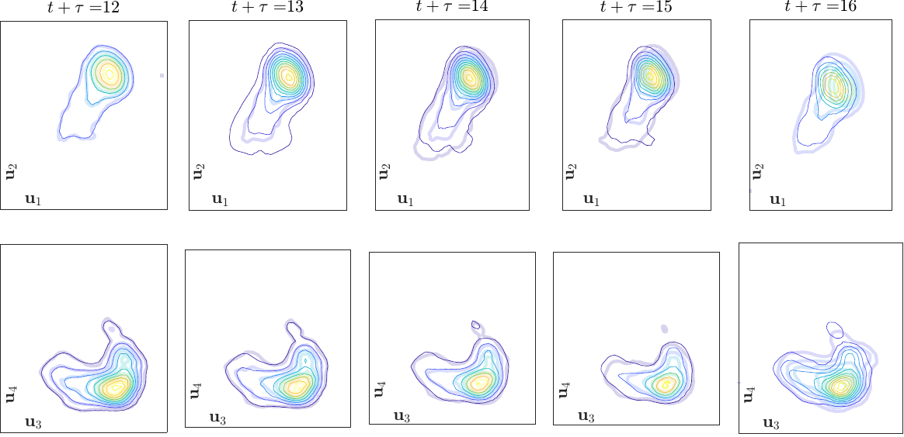
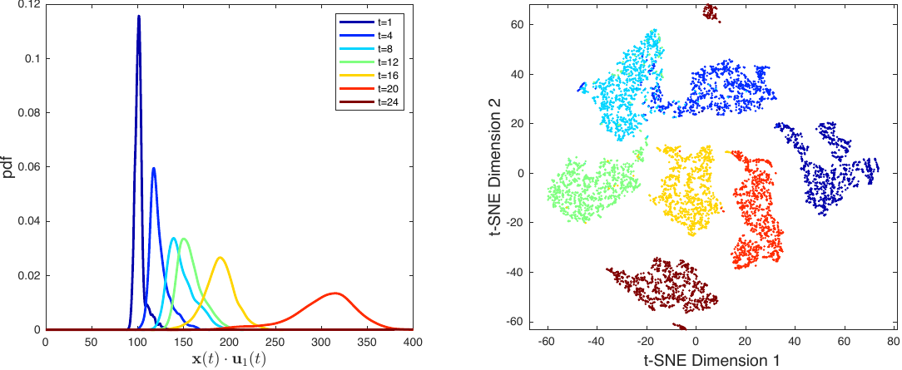
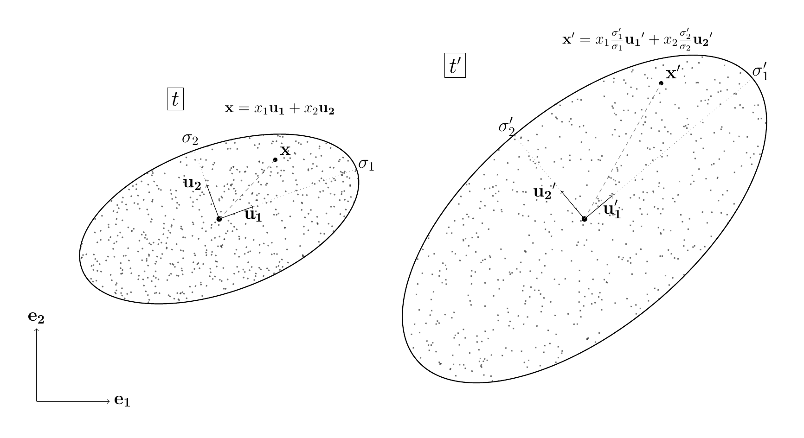
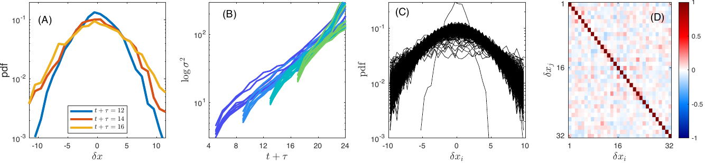
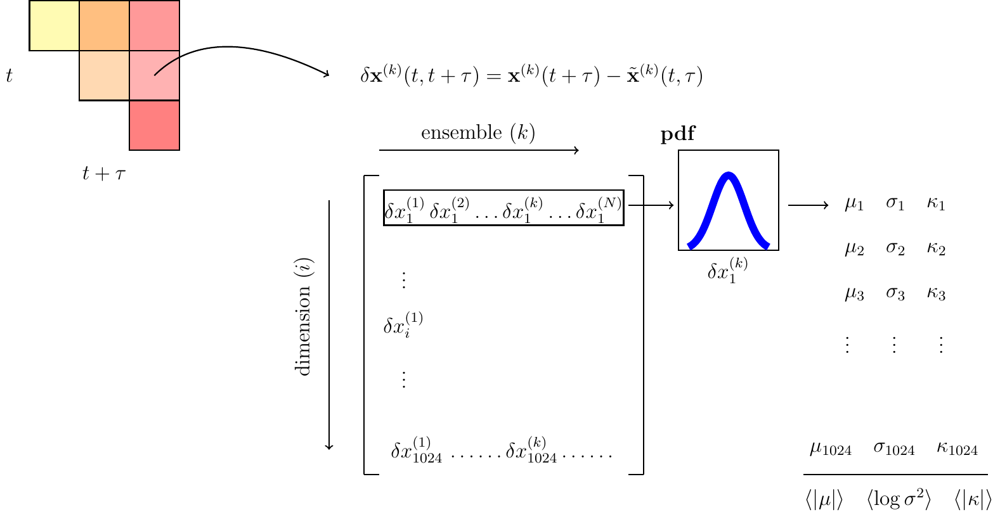

# Lines of Thought in Large Language Models

## Abstract

Large Language Models achieve next-token prediction by transporting a vectorized piece of text (prompt) across an accompanying embedding space under the action of successive transformer layers. The resulting high-dimensional trajectories realize different contextualization, or ‘thinking’, steps, and fully determine the output probability distribution. We aim to characterize the statistical properties of ensembles of these ‘*lines of thought*.’ We observe that independent trajectories cluster along a low-dimensional, non-Euclidean manifold, and that their path can be well approximated by a stochastic equation with few parameters extracted from data. We find it remarkable that the vast complexity of such large models can be reduced to a much simpler form, and we reflect on implications.

maketitle thanks aketitle

# Introduction

How does a large language model (LLM) think? In other words, how does it abstract the prompt *“Once upon a time, a facetious”* to suggest adding, e.g., “*transformer*”, and, by repeating the operation, continue on to generate a respectable fairy tale *à la* Perrault? What we know is by design. A piece of text is mapped into a set of high-dimensional vectors, which are then transported across their embedding (latent) space through successive transformer layers , each allegedly distilling different syntactic, semantic, informational, contextual aspects of the input . The final position is then projected onto an embedded vocabulary to create a probability distribution about what the next word should be. Why these vectors land where they do eludes human comprehension due to the concomitant astronomical numbers of arithmetic operations which, taken individually, do nothing, but collectively confer the emergent ability of language.

Our inability to understand the inner workings of LLMs is problematic and, perhaps, worrisome. While LLMs are useful to write college essays or assist with filing tax returns, they are also often capricious, disobedient, and hallucinatory . That’s because, unlike traditional ‘if-then’ algorithms, instructions have been only loosely, abstractly, encoded in the structure of the LLM through machine learning, that is, without human intervention.

In return, language models, trained primarily on textual data to generate language, have demonstrated curious abilities in many other domains (in-context learning), such as extrapolating time series , writing music , or playing chess . Such emergent, but unpredicted, capabilities lead to questions about what other abilities LLMs may possess. For these reasons, current research is attempting to break down internal processes to make LLMs more *interpretable*.[^1] Recent studies have notably revealed some aspects of the self-attention mechanism , patterns of neuron activation , signatures of ‘world models’[^2] , geometrical relationships between concepts , or proposed mathematical models of transformers .

This work introduces an alternative approach inspired by physics, treating an LLM as a complex dynamical system. We investigate which large-scale, ensemble properties can be inferred experimentally without concern for the ‘microscopic’ details.[^3] Specifically, we are interested in the trajectories, or ‘lines of thought’ (LoT), that embedded tokens realize in the latent space when passing through successive transformer layers . By splitting a large input text into $`N`$-token sequences, we study LoT *ensemble* properties to shed light on the internal, average processes that characterize transformer transport.

We find that, even though transformer layers perform $`10^6 - 10^9`$ individual computations, the resulting trajectories can be described with far fewer parameters. In particular, we first identify a low-dimensional manifold that explains most of LoT transport (see  
effig:lot-3D). Then, we demonstrate that trajectories can be well approximated by an average linear transformation, whose parameters are extracted from ensemble properties, along with a random component with well characterized statistics. Eventually, this allows us to describe trajectories as a kind of diffusive process, with a linear drift and a modified stochastic component.

#### Main contributions.

1.  We provide a framework to discover low-dimensional structures in an LLM’s latent space.

2.  We find that token trajectories cluster on a non-Euclidean, low-dimensional manifold.

3.  We introduce a stochastic model to describe trajectory ensembles with few parameters.

<figure id="fig:lot-3D">
<div class="center">
<div class="overpic">
<p><span>fig/fig01v04.png</span> (0, 45)<span><span style="background-color: white"><strong>(a)</strong></span></span> (50, 45)<span><span style="background-color: white"><strong>(b)</strong></span></span></p>
</div>
</div>
<figcaption> <strong>(a)</strong> Lines of thought (blue to red) for an ensemble of 1000 pseudo-sentences of 50 tokens each, projected along the first 3 singular vectors after the last layer (<span class="math inline"><em>t</em> = 24</span>). They appear to form a tight bundle, with limited variability around a common average path. <strong>(b)</strong> Representation of the low-dimensional, ribbon-shaped manifold in <span class="math inline">𝒮</span> (projected along 3 Cartesian coordinates). Positions are plotted for <span class="math inline"><em>t</em> = 12</span> (green) to <span class="math inline"><em>t</em> = 24</span> (yellow). </figcaption>
</figure>

# Methods

This section describes our algorithm for generating and analyzing an ensemble of tokens trajectories in the latent space of LLMs.

#### Language models.

We rely primarily on the 355M-parameter (‘medium’) version of the GPT-2 model . It presents the core architecture of ancestral (circa 2019) LLMs: transformer-based, decoder-only.[^4] It consists of $`N_L`$ = 24 transformer layers[^5] operating in a latent space $`\mathcal{S}`$ of dimension $`D = 1024`$. The vocabulary $`\mathcal{V}`$ contains $`N_\mathcal{V} = 50257`$ tokens. A layer normalization  is applied to the last latent space position before projection onto $`\mathcal{V}`$ to form the logits. (This final normalization is not included in our trajectories.) We later extend our analysis to the Llama 2 7B , Mistral 7B v0.1 , and small Llama 3.2 models (1B and 3B) .

#### Input ensembles.

We study statistical properties of trajectory ensembles obtained by passing a set of input prompts through GPT-2. We generate inputs by tokenizing  a large text and then chopping it into ‘pseudo-sentences’, i.e., chunks of a fixed number of tokens $`N_k`$ (see  
efalg:trajectories). Unless otherwise noted, $`N_k = 50`$. These *non-overlapping* chunks are consistent in terms of token cardinality, and possess the structure of language, but have various meanings and endings (see  
efapp:pseudosentences). The main corpus in this study comes from Henry David Thoreau’s *Walden*, obtained from the Gutenberg Project .[^6] We typically use a set of $`N_s \simeq 3000 \text{--} 14000`$ pseudo-sentences.

#### Trajectory collection.

We form trajectories by collecting the successive vector outputs, within the latent space, after each transformer layer (`hidden_states`). For conciseness, we identify layer number with a notional ‘time’, $`t`$. Even though all embedded tokens of a prompt voyage across the latent space, only the vector corresponding to the last token is eventually projected onto $`\mathcal{V}`$ to form the logits. Hence, here, we only consider the trajectory of this last (or ‘pilot’) token. The trajectory $`{\bm{M}}_k`$ of sentence $`k`$’s pilot is the sequence of $`24`$ successive time positions $`\{ {\bm{x}}_k (1), {\bm{x}}_k(2), \ldots, {\bm{x}}_k(24) \}`$, concatenated as a column matrix (Algorithm <a href="#alg:trajectories" data-reference-type="ref" data-reference="alg:trajectories">[alg:trajectories]</a>).

<div class="algorithm">

<div class="algorithmic">

ALGORITHM BLOCK (caption below)

<span id="alg:trajectories" label="alg:trajectories"></span> **Input:** Large text: $`\text{``It was the best of times, it was the worst of times, it was the age \ldots"}`$ Tokenize text into token sequence: $`[1027, 374, 263, 1267, 287, 1662, 12, \ldots]`$ Split token sequence into $`n`$-token pseudo-sentences:
``` math
s_1 = [1027, 374, 263], \quad s_2 = [1267, 287, 1662], \quad \ldots
```
Semantic embedding:
``` math
{\bm{E}}_S = [{\bm{v}}(1027), {\bm{v}}(374), {\bm{v}}(263)] \quad \text{for } s_1
```
$`{\bm{E}}(0) = {\bm{E}}_S + {\bm{E}}_P`$ $`{\bm{E}}(t+1) = \text{TransformerLayer}_t ({\bm{E}}(t))`$ $`{\bm{x}}(t+1) = {\bm{E}}(t+1)[:, \text{end}]`$ $`{\bm{M}}[:, t+1] = {\bm{x}}(t+1)`$ **Output:** Final embeddings $`x(t+1)`$ for all pseudo-sentences

</div>

</div>

#### Latent space bases.

The latent space is spanned by a Cartesian basis, i.e., the orthogonal set of one-hot (unit) vectors $`\mathcal{E} = \{ {\bm{e}}_i \}_{i = 1 \dots D}`$.[^7] Additionally, we will often refer to the bases $`\mathcal{U}(t) = \{ {\bm{u}}_i^{(t)} \}_{i = 1 \dots D}`$ formed by the left-singular vectors of the singular value decomposition (SVD) of the $`D\times N_\mathrm{s}`$ matrix after layer $`t`$: $`{\bm{M}}= {\bm{U}}\mathbf{\Sigma} {\bm{V}}^{\top}`$, with $`{\bm{M}}_{:, k}(t) = {\bm{x}}_k(t)`$. Vectors $`{\bm{u}}_i`$ are organized according to their corresponding singular values, $`\sigma_i`$, in descending order. Note that because trajectory clusters evolve over time there are 24 distinct bases.

# Results

We present and characterize results pertaining to ensembles of trajectories as they travel within the latent space $`\mathcal{S}`$.

## Lines of thought cluster along similar pathways

We first observe in  
effig:lot-3Da that pilot trajectories tend to cluster together, instead of producing an isotropic and homogeneous filling of $`\mathcal{S}`$. Indeed, LoTs for different, *independent* pseudo-sentences follow a common path (forming *bundles*), despite individual variability. Specifically, there exist directions with significant displacement relative to the spread (mean over standard deviation). In addition, positions at different times form distinct clusters, as shown in  
effig:clustering.

Properly visualizing these trajectories is difficult, due to the high dimensionality of $`\mathcal{S}`$. Because the Cartesian axes, $`{\bm{e}}_i`$, are unlikely to align with trajectories meaningful directions, we seek relevant alternative bases, informed by the data. After each layer $`t`$, we perform the singular value decomposition of the matrix formed by concatenating the $`{\bm{x}}_k(t)`$ to obtain a basis $`\mathcal{U}(t)`$ aligned with the data’s intrinsic directions. In the following, we leverage these time-dependent singular vectors and values to investigate ensemble dynamics and low-dimensional structures.

## Lines of thought follow a low-dimensional manifold

The fast decay of the singular value magnitudes seen in  
effig:sv-klb suggests that LoTs may be described by a lower-dimensional subspace. But how many dimensions are relevant? Singular values relate to ensemble variance along their corresponding directions. Since the embedding space is high-dimensional, however, the curse of dimensionality looms, hence the significance of Euclidean distances crumbles. To circumvent this limitation, we consider a more practical metric: how close to the original output distribution on the vocabulary does a reduction in dimensionality get us?

To investigate this question, we express token positions $`{\bm{x}}(t)`$ in the singular vector basis $`\mathcal{U}(t)`$:
``` math
{\bm{x}}(t) = \sum_{i=1}^K a_{i}^{(t)} {\bm{u}}_i^{(t)},
```
where the $`{\bm{u}}_i^{(t)}`$’s are organized by descending order of their corresponding singular values. By default $`K = D`$, and the true output distribution $`{\bm{p}}^\mathcal{V}`$ is obtained. Now, we examine what happens when, instead of passing the full basis set, we truncate it, *after each layer*, to keep only the first $`K < D`$ principal components. We compare the resulting output distribution, $`\mathbf{p}^\mathcal{V}_K`$ to the true distribution $`\mathbf{p}^\mathcal{V}`$ using KL divergence $`D_{\mathrm{KL}}( \mathbf{p}^\mathcal{V}_K \Vert \mathbf{p}^\mathcal{V} )`$. In  
effig:sv-klc, we see that most of the true distribution is recovered when keeping only about $`K_0 = 256`$, or $`25\%`$, of the principal components. In other words, for the purpose of next-token prediction, LoTs are quasi-256-dimensional.

If these principal directions remained constant at each layer, this would imply that $`75\%`$ of the latent space could be discarded with no consequence. This seems unrealistic. In fact, the principal directions rotate slightly over time, as displayed in  
effig:sv-kla. Eventually, between $`t=1`$ and $`t=24`$, the full Cartesian basis $`\mathcal{E}`$ is necessary to express the first singular directions. Thus, we conclude that **lines of thoughts evolve on a low-dimensional curved manifold** of about 256 dimensions, that is contained within the full latent space (  
effig:lot-3Db).

<figure id="fig:sv-kl">
<div class="center">
<div class="overpic">
<p><span>fig/fig02v03.pdf</span> (0, 33)<span><span style="background-color: white"><strong>(a)</strong></span></span> (33, 33)<span><span style="background-color: white"><strong>(b)</strong></span></span> (70, 33)<span><span style="background-color: white"><strong>(c)</strong></span></span></p>
</div>
</div>
<figcaption> <strong>(a)</strong> Angle between the first 4 singular vectors at <span class="math inline">(<em>t</em><sub>1</sub>, <em>t</em><sub>2</sub>)</span>, <span class="math inline">arccos (<strong>u</strong><sub><em>i</em></sub><sup>(<em>t</em><sub>1</sub>)</sup> ⋅ <strong>u</strong><sub><em>i</em></sub><sup>(<em>t</em><sub>2</sub>)</sup>)</span>, for <span class="math inline"><em>i</em> = {1, 2, 3, 4}</span> (top-left, top-right, bottom-left, bottom-right, respectively). <strong>(b)</strong> Singular values for <span class="math inline"><em>t</em> = 1, …, 24</span> (blue to red). Clusters stretch more and more after each layer. The leading singular values, <span class="math inline"><em>σ</em><sub>1</sub>(<em>t</em>)</span>, have been omitted for clarity. <strong>(c)</strong> Average (over all trajectories) KL divergence between reduced dimensionality trajectories output and true output distributions, as the dimensionality <span class="math inline"><em>K</em></span> is increased. The red dashes line shows the average KL divergence between unrelated distributions (baseline for dissimilar distributions). </figcaption>
</figure>

## Linear approximation of trajectories

Examination of the singular vectors and values at each time step indicates that LoT bundles rotate and stretch smoothly after passing through each layer (  
effig:sv-kl). This suggests that token trajectories could be *approximated* by the linear transformations described by the ensemble, and extrapolated accordingly, from an initial time $`t`$ to a later time $`t+\tau`$. Evidently, it is improbable that a transformer layer could be replaced by a mere linear transformation. We rather hypothesize that, in addition to this deterministic average path, a token’s location after layer $`t+\tau`$ will depart from its linear approximation from $`t`$ by an unknown component $`{\bm{w}}(t,\tau)`$.[^8] We propose the following model:
``` math
\label{eq:langevin-discrete}
    {\bm{x}}(t + \tau) = {\bm{R}}(t+\tau) \mathbf{\Lambda}(t,\tau) {\bm{R}}(t)^{\top} {\bm{x}}(t) + {\bm{w}}(t,\tau),
```
where $`{\bm{x}}(t)`$ is the pilot token’s position *in the Cartesian basis*, and $`{\bm{R}}, \mathbf{\Lambda}`$ are rotation (orthonormal) and stretch (diagonal) matrices, respectively.  
efeq:langevin-discrete formalizes the idea that, to approximate $`{\bm{x}}(t+\tau)`$, given $`{\bm{x}}(t)`$, we first project $`{\bm{x}}`$ in the ensemble intrinsic basis at $`t`$ ($`{\bm{R}}^{\top} {\bm{x}}`$), then stretch the coordinates by the amount given by $`\mathbf{\Lambda}`$, and finally rotate according to how much the singular directions have rotated between $`t`$ and $`t+\tau`$, $`{\bm{R}}(t+\tau)`$ (see also  
effig:extrapolation-schematic in  
efapp:supp-figures). Consequently, we can express these matrices as a function of the set of singular vectors ($`{\bm{U}}`$) and values ($`\mathbf{\Sigma}`$):
``` math
{\bm{R}}(t) = {\bm{U}}(t), 
    \quad 
    \mathbf{\Lambda}(t,\tau) = \text{diag}(\sigma_i(t+\tau)/\sigma_i(t)) = \mathbf{\Sigma}(t+\tau) \mathbf{\Sigma}^{-1}(t).
```
  
effig:extrapolation shows the close agreement, at the ensemble level, between the true and extrapolated positions. This is merely a linear approximation as it is similar to assuming that LoT clusters deform like an elastic solid, where each point maintains the same vicinity. The actual coordinates ought to include an additional random component $`{\mathbf{w}}(t,\tau)`$, which *a priori* depends on both $`t`$ and $`\tau`$.

<figure id="fig:extrapolation">
<div class="center">

</div>
<figcaption> Extrapolated token positions <span class="math inline">$\Tilde{{\bm{x}}}^{(k)}$</span> (blue) from <span class="math inline"><em>t</em> = {12, 14, 16, 18}</span> to <span class="math inline"><em>t</em> + <em>τ</em> = {<em>t</em> + 1, …, 21}</span>, compared to their true positions <span class="math inline"><strong>x</strong><sup>(<em>k</em>)</sup></span> (gray), projected in the <span class="math inline">(<strong>u</strong><sub>2</sub><sup>(<em>t</em>)</sup>, <strong>u</strong><sub>3</sub><sup>(<em>t</em>)</sup>)</span> planes. </figcaption>
</figure>

Is it possible to express $`{\bm{w}}`$ in probabilistic terms? We consider the empirical residuals
``` math
\delta {\bm{x}}(t,\tau) = {\bm{x}}(t+\tau) - \Tilde{{\bm{x}}}(t,\tau)
```
between true positions $`{\bm{x}}`$ and linear approximations $`\Tilde{{\bm{x}}}(t,\tau) = {\bm{U}}(t+\tau) \mathbf{\Lambda}(t,\tau) {\bm{U}}(t)^{\top} {\bm{x}}(t)`$. We investigate the distributions and correlations of $`\delta {\bm{x}}(t,\tau)`$ across layer combinations $`(t,t+\tau)`$.

From the data,  
effig:delta shows that, for all $`(t,t+\tau) \in \{ 1, \dots, 23 \} \times \{ t+1, \dots, 24 \}`$, the ensemble of $`\delta {\bm{x}}(t,\tau)`$ has the following characteristics: 1) it is Gaussian, 2) with zero mean, 3) and variance scaling as $`\exp(t+\tau)`$. In addition,  
effig:noise-details shows that the distribution is isotropic, with no evidence of spatial cross-correlations . Hence, we propose:
``` math
\label{eq:noise}
    {\textnormal{w}}_i (t,\tau) \sim \mathcal{N}(0, \alpha e^{\lambda (t+\tau)}),
```
i.e., each coordinate $`{\textnormal{w}}_i`$ of $`{\mathbf{w}}`$ is a Gaussian random variable with mean zero and variance $`\alpha e^{\lambda(t+\tau)}`$. Linear fitting of the logarithm of the variance yields $`\alpha \simeq 0.64`$ and $`\lambda \simeq 0.18`$. Even though this formulation ignores some variability across times and dimensions, it is a useful minimal modelling form to describe the ensemble dynamics with as few parameters as possible.

## Langevin dynamics for continuous time trajectories

Just like the true positions $`{\bm{x}}(t)`$, matrices $`{\bm{R}}`$ and $`\mathbf{\Lambda}`$ are known (empirically) only for integers values of $`t`$.[^9] Can we extend  
efeq:langevin-discrete to a continuous time parameter $`t \in [1,24]`$? Indeed, it is possible to *interpolate* $`{\bm{R}}`$ and $`\mathbf{\Lambda}`$ between their known values . Specifically, $`{\bm{R}}(t)`$ remains orthogonal and rotates from its endpoints; singular values can be interpolated by a spline function.

In return, this allows us to interpolate trajectories between transformer layers.[^10] Thus, we extend  
efeq:langevin-discrete to a continuous time variable $`t`$, and write in infinitesimal terms:
``` math
\label{eq:langevin}
d{\bm{x}}(t) = \left[ \dot{{\bm{R}}}(t){\bm{R}}(t)^{\top} + {\bm{R}}(t) \dot{{\bm{S}}}(t) {\bm{R}}(t)^{\top} \right] {\bm{x}}(t)\,dt + \sqrt{\alpha \lambda \exp(\lambda t)}\, d{\mathbf{w}}(t),
```
where $`\dot{{\bm{S}}} = \text{diag}\left(\dot{\sigma_i}/\sigma_i\right)`$ and $`d{\mathbf{w}}(t)`$ is a differential of a Wiener process . We defer the mathematical derivation to  
efapp:lengevin-derivation. This equation artificially extends LoTs to continuous paths across $`\mathcal{S}`$. It provides a stochastic approximation to any token’s trajectory, at all times $`t`$.

<figure id="fig:delta">
<div class="center">
<div class="overpic">
<p><span>fig/fig_gpt2_noise_v02.pdf</span> (-1, 34.5)<span><span style="background-color: white"><strong>(a)</strong></span></span> (33, 34.5)<span><span style="background-color: white"><strong>(b)</strong></span></span> (67, 34.5)<span><span style="background-color: white"><strong>(c)</strong></span></span></p>
</div>
</div>
<figcaption> Statistics of <span class="math inline"><em>δ</em><strong>x</strong>(<em>t</em>, <em>τ</em>)</span>: mean <span class="math inline"><em>μ</em></span>, variance <span class="math inline"><em>σ</em><sup>2</sup></span>, excess kurtosis <span class="math inline"><em>κ</em></span>. Brackets <span class="math inline">⟨…⟩</span> denote average over directions <span class="math inline"><strong>e</strong><sub><em>i</em></sub></span> (see<br />
ef<span>fig:noise-schematic</span> for details). <strong>(a)</strong> For all <span class="math inline">(<em>t</em>, <em>t</em> + <em>τ</em>)</span>, <span class="math inline"><em>μ</em> ≃ 0</span> (that is, <span class="math inline"><em>μ</em>/<em>σ</em> ≪ 1</span>). <strong>(b)</strong> <span class="math inline">log (<em>σ</em><sup>2</sup>)</span> increases linearly in time, only depends on <span class="math inline"><em>t</em> + <em>τ</em></span>. <strong>(c)</strong> The <em>excess</em> kurtosis (kurtosis minus 3) remains close to 0, indicating Gaussianity (except in early layers). </figcaption>
</figure>

## Fokker-Planck formulation

  
efeq:langevin is a stochastic differential equation (SDE) describing individual trajectories with a random component. Since the noise distribution is well characterized (see  
efeq:noise), we can write an equivalent formulation for the *deterministic* evolution of the probability density $`P({\bm{x}},t)`$ of tokens $`{\bm{x}}`$ over time . The Fokker-Planck equation[^11] associated to  
efeq:langevin reads:
``` math
\label{eq:fokker-planck}
    \frac{\partial P({\bm{x}}, t)}{\partial t} = -\nabla_{{\bm{x}}} \cdot \left[ \left( \dot{{\bm{R}}} {\bm{R}}^{\top} + {\bm{R}}\dot{{\bm{S}}} {\bm{R}}^{\top}  \right) {\bm{x}}P({\bm{x}}, t) \right] + \frac{1}{2} \alpha \lambda e^{\lambda t} \, \nabla_{{\bm{x}}}^2 P({\bm{x}}, t).
```

This equation captures trajectory ensemble dynamics in a much simpler form, and with far fewer parameters, than the computation actually performed by the transformer stack on the fully embedded prompt. The price paid for this simplification is a probabilistic, rather than deterministic, path for LoTs. We now test our model and assess the extent and limitations of our results.

# Testing and validation

## Simulations of the stochastic model

We test our continuous-time model described above. Due to the high dimensionality of the space, numerical integration of the Fokker-Planck equation,  
efeq:fokker-planck, is computationally prohibitive. Instead, we simulate an ensemble of trajectories based on the Langevin formulation,  
efeq:langevin. The technical details are provided in  
efapp:simulations.

<figure id="fig:simulations">
<div class="center">

</div>
<figcaption> Simulated distributions for <span class="math inline"><em>t</em> = 12</span>, <span class="math inline"><em>t</em> + <em>τ</em> = {12, 13, 14, 15, 16}</span>, projected on the <span class="math inline">(<strong>u</strong><sub>1</sub>, <strong>u</strong><sub>2</sub>)</span> plane (top row) and the <span class="math inline">(<strong>u</strong><sub>3</sub>, <strong>u</strong><sub>4</sub>)</span> plane (bottom row). Distributions have been approximated from ensemble trajectories, 10 trajectories for each initial point. Background lines indicate true distributions, thin lines on top indicate simulations. </figcaption>
</figure>

The results presented in  
effig:simulations show that the simulated ensembles closely reproduce the ground truth of true trajectory distributions. We must note that  
efeq:langevin,eq:fokker-planck are not path-independent; therefore, their solution depend on the value of $`{\bm{R}}(t)`$, $`{\bm{S}}(t)`$ at all time $`t`$. Since there is no ‘true’ value for the matrices in-between layers, the output of numerical integration naturally depends on the interpolation scheme. Hence, discrepancies are to be expected.

## Null testing

We now examine trajectory patterns for **non-language inputs** and **untrained models**.

### Gibberish

We generate non-language (‘gibberish’) pseudo-sentences by assembling $`N`$-token sequences of random tokens in the vocabulary, and pass them as input to GPT-2. The resulting trajectories also cluster around a path similar to that of language. However, the two ensembles, language and gibberish, are linearly separable at all layers (see  
effig:null-testing in  
efapp:null-testing), indicating that they travel on two distinct, yet adjacent, manifolds.

### Untrained & ablated models

We compare previous observations with the null baseline of an untrained model.

First, we collect trajectories of the *Walden* ensemble passing through a reinitialized version of GPT-2 (the weights have been reset to a random seed). We observe that while LoTs get transported away from their starting point, the trajectories follow straight, quasi-parallel paths, maintaining their vicinity (see  
effig:null-testing). Furthermore, the model of  
efeq:langevin-discrete,eq:noise does not hold;  
effig:gpt2-untrained-noise shows that the variance of $`\delta {\bm{x}}`$ does not follow the $`\exp(t+\tau)`$ scaling, and the distributions are far from Gaussian.

Next, we consider an ablated model, where only layers $`13`$ to $`24`$ have been reinitialized. When reaching the untrained layers, the trajectories stop and merely diffuse about their $`t=12`$ location (  
effig:null-testing).

In conclusion, upon training, the weights evolve to constitute a specific type of transport in the latent space.

## Results with other models

We repeat the same approach with a set of larger and more recent LLMs. We collect the trajectories of the *Walden* ensemble in their respective latent spaces.

#### Llama 2 7B.

We first investigate the Llama 2 7B model .[^12] Remarkably, the pattern of GPT-2 repeats. Token positions at $`t+\tau`$ can be extrapolated from $`t`$ by rotation and stretch using the singular vectors and values of the ensemble. The residuals are distributed as those of GPT-2, with $`{\textnormal{w}}_i(t,\tau) \sim \mathcal{N}(0,\alpha e^{\lambda (t+\tau)})`$, see  
effig:llama2-noise. The values for the parameters $`\alpha`$ and $`\lambda`$, however, differ from those of GPT-2 (here, $`\alpha \simeq -5.4, \lambda \simeq 0.27`$).

#### Mistral 7B.

Trajectories across the Mistral 7B (v0.1) model [^13] also follow the same pattern (  
effig:mistral-noise). We note, however, that  
efeq:fokker-planck only holds up until layer 31. It seems as though the last layer is misaligned with the rest of the trajectories, as linear extrapolation produces an error that is much larger than expected.

#### Llama 3.2.

The last layer anomaly is also apparent for Llama 3.2 1B[^14], both in the mean and variance of $`\delta{\bm{x}}(t,16)`$ (see  
effig:llama3.2-1B-noise). However, the rest of the trajectories follows  
efeq:langevin-discrete. The same pattern is observed for Llama 3.2 3B[^15] in  
effig:llama3.2-3B-noise.

It is noteworthy that these three recent models feature the same anomaly at the last layer. The reason is not immediately evident, and perhaps worth investigating further. In addition, we remark that all models also show deviations from predicted statistics across the very first layers (top-left corners). We conjecture that these anomalies might be an effect of re-alignment or fine-tuning, as the first and last layers are the most exposed to perturbations which might not propagate deep into the stack.

# Conclusion

#### Summary.

This work began with the prospect of visualizing token trajectories in their embedding space $`\mathcal{S}`$. The space is not only high-dimensional, but also isotropic: all coordinates are *a priori* equivalent.[^16] Hence, we sought directions and subspaces of particular significance in shaping token trajectories[^17], some kind of ‘eigenvectors’ of the transformer stack.

Instead of spreading chaotically, lines of thought travel along a low-dimensional manifold. We used this pathway to extrapolate token trajectories from a known position at $`t`$ to a later time, based on the geometry of the ensemble. Individual trajectories deviate from this average path by a random amount *with well-defined statistics*. Consequently, we could interpolate token dynamics to a continuous time in the form of a stochastic differential equation,  
efeq:langevin. The same ensemble behavior holds for various transformer-based pre-trained LLMs, but collapses for untrained (reinitialized) ones.

This approach aims to extract important features of language model internal computation. Unlike much of prior research on interpretability, it is agnostic to the syntactic and semantic aspects of inputs and outputs. We also proposed geometrical interpretations of ensemble properties which avoid relying on euclidean metrics, as they become meaningless in high-dimensional spaces.

#### Limitations.

This method is limited to open-source models, as it requires extracting hidden states; fine-tuned, heavily re-aligned models might exhibit different patterns. In addition, it would be compelling to connect the latent space with the space of output distributions, for example by investigating the relative arrangement of final positions with respect to embedded vocabulary. However, this is complicated by the last layer normalization which typically precedes projection onto the vocabulary. This normalization has computational benefits, but its mathematical handling is cumbersome: it is highly non-linear as it involves the mean and standard deviation of the input vector.

#### Implications.

Just like molecules in a gas or birds in a flock, the complex system formed by billions of artificial neurons in interaction exhibits some simple, macroscopic properties. It can be described by ensemble statistics with a well defined random component. Previously, had also uncovered specific dynamical features, notably *token alignment*, in transformer stacks of a wide variety of trained models.

That’s not to say that reduced complexity representations are necessarily useful in practice. Individual trajectory variability persists, and is essential to accurately predict next tokens and continue textual inputs. Thus, it is not immediately apparent to us whether the low-dimensionality structures identified could lead to avenues for compressing or ablating transformers, although it might.

Yet, patterns are explanatory. Our concern here has been primarily to discover some of the mechanisms implicitly encoded in the weights of trained language models. Further investigations could extend this methodology to more thoroughly identify and characterize the dynamics of tokens.

### Acknowledgments

This work was supported by the SciAI Center, and funded by the Office of Naval Research (ONR), under Grant Numbers N00014-23-1-2729 and N00014-23-1-2716.

# References

<div class="thebibliography">

P.-A. Absil, R. Mahony, and R. Sepulchre *Optimization Algorithms on Matrix Manifolds* Princeton University Press, Princeton, NJ, 2008. ISBN 978-0-691-13298-3. **Abstract:** Many problems in the sciences and engineering can be rephrased as optimization problems on matrix search spaces endowed with a so-called manifold structure. This book shows how to exploit the special structure of such problems to develop efficient numerical algorithms. It places careful emphasis on both the numerical formulation of the algorithm and its differential geometric abstraction–illustrating how good algorithms draw equally from the insights of differential geometry, optimization, and numerical analysis. Two more theoretical chapters provide readers with the background in differential geometry necessary to algorithmic development. In the other chapters, several well-known optimization methods such as steepest descent and conjugate gradients are generalized to abstract manifolds. The book provides a generic development of each of these methods, building upon the material of the geometric chapters. It then guides readers through the calculations that turn these geometrically formulated methods into concrete numerical algorithms. The state-of-the-art algorithms given as examples are competitive with the best existing algorithms for a selection of eigenspace problems in numerical linear algebra. Optimization Algorithms on Matrix Manifolds offers techniques with broad applications in linear algebra, signal processing, data mining, computer vision, and statistical analysis. It can serve as a graduate-level textbook and will be of interest to applied mathematicians, engineers, and computer scientists. (@AbsMahSep2008)

Murdock Aubry, Haoming Meng, Anton Sugolov, and Vardan Papyan *arXiv preprint arXiv:2407.07810*, 2024. **Abstract:** Large Language Models (LLMs) have made significant strides in natural language processing, and a precise understanding of the internal mechanisms driving their success is essential. In this work, we analyze the trajectories of token embeddings as they pass through transformer blocks, linearizing the system along these trajectories through their Jacobian matrices. By examining the relationships between these block Jacobians, we uncover the phenomenon of \\}textbf{transformer block coupling} in a multitude of LLMs, characterized by the coupling of their top singular vectors across tokens and depth. Our findings reveal that coupling \\}textit{positively correlates} with model performance, and that this relationship is stronger than with other hyperparameters such as parameter count, model depth, and embedding dimension. We further investigate how these properties emerge during training, observing a progressive development of coupling, increased linearity, and layer-wise exponential growth in token trajectories. Additionally, experiments with Vision Transformers (ViTs) corroborate the emergence of coupling and its relationship with generalization, reinforcing our findings in LLMs. Collectively, these insights offer a novel perspective on token interactions in transformers, opening new directions for studying their mechanisms as well as improving training and generalization. (@aubry2024transformeralignmentlargelanguage)

Jimmy Lei Ba, Jamie Ryan Kiros, and Geoffrey E. Hinton Layer normalization *arXiv preprint arXiv:1607.06450*, 2016. **Abstract:** Training state-of-the-art, deep neural networks is computationally expensive. One way to reduce the training time is to normalize the activities of the neurons. A recently introduced technique called batch normalization uses the distribution of the summed input to a neuron over a mini-batch of training cases to compute a mean and variance which are then used to normalize the summed input to that neuron on each training case. This significantly reduces the training time in feed-forward neural networks. However, the effect of batch normalization is dependent on the mini-batch size and it is not obvious how to apply it to recurrent neural networks. In this paper, we transpose batch normalization into layer normalization by computing the mean and variance used for normalization from all of the summed inputs to the neurons in a layer on a single training case. Like batch normalization, we also give each neuron its own adaptive bias and gain which are applied after the normalization but before the non-linearity. Unlike batch normalization, layer normalization performs exactly the same computation at training and test times. It is also straightforward to apply to recurrent neural networks by computing the normalization statistics separately at each time step. Layer normalization is very effective at stabilizing the hidden state dynamics in recurrent networks. Empirically, we show that layer normalization can substantially reduce the training time compared with previously published techniques. (@ba2016layernormalization)

Trenton Bricken, Adly Templeton, Joshua Batson, Brian Chen, Adam Jermyn, Tom Conerly, Nick Turner, Cem Anil, Carson Denison, Amanda Askell, Robert Lasenby, Yifan Wu, Shauna Kravec, Nicholas Schiefer, Tim Maxwell, Nicholas Joseph, Zac Hatfield-Dodds, Alex Tamkin, Karina Nguyen, Brayden McLean, Josiah E Burke, Tristan Hume, Shan Carter, Tom Henighan, and Christopher Olah Towards monosemanticity: Decomposing language models with dictionary learning *Transformer Circuits Thread*, 2023. <https://transformer-circuits.pub/2023/monosemantic-features/index.html>. **Abstract:** Understanding the internal computations of large language models (LLMs) is crucial for aligning them with human values and preventing undesirable behaviors like toxic content generation. However, mechanistic interpretability is hindered by polysemanticity – where individual neurons respond to multiple, unrelated concepts. While Sparse Autoencoders (SAEs) have attempted to disentangle these features through sparse dictionary learning, they have compromised LLM performance due to reliance on post-hoc reconstruction loss. To address this issue, we introduce Mixture of Monosemantic Experts for Transformers (Monet) architecture, which incorporates sparse dictionary learning directly into end-to-end Mixture-of-Experts pretraining. Our novel expert decomposition method enables scaling the expert count to 262,144 per layer while total parameters scale proportionally to the square root of the number of experts. Our analyses demonstrate mutual exclusivity of knowledge across experts and showcase the parametric knowledge encapsulated within individual experts. Moreover, Monet allows knowledge manipulation over domains, languages, and toxicity mitigation without degrading general performance. Our pursuit of transparent LLMs highlights the potential of scaling expert counts to enhance mechanistic interpretability and directly resect the internal knowledge to fundamentally adjust model behavior. The source code and pretrained checkpoints are available at https://github.com/dmis-lab/Monet. (@bricken2023monosemanticity)

Borjan Geshkovski, Cyril Letrouit, Yury Polyanskiy, and Philippe Rigollet The emergence of clusters in self-attention dynamics In *Advances in Neural Information Processing Systems*, volume 36, 2024. **Abstract:** Viewing Transformers as interacting particle systems, we describe the geometry of learned representations when the weights are not time dependent. We show that particles, representing tokens, tend to cluster toward particular limiting objects as time tends to infinity. Cluster locations are determined by the initial tokens, confirming context-awareness of representations learned by Transformers. Using techniques from dynamical systems and partial differential equations, we show that the type of limiting object that emerges depends on the spectrum of the value matrix. Additionally, in the one-dimensional case we prove that the self-attention matrix converges to a low-rank Boolean matrix. The combination of these results mathematically confirms the empirical observation made by Vaswani et al. \[VSP’17\] that leaders appear in a sequence of tokens when processed by Transformers. (@geshkovski2024emergenceclustersselfattentiondynamics)

Nate Gruver, Marc Finzi, Shikai Qiu, and Andrew G Wilson Large language models are zero-shot time series forecasters In *Advances in Neural Information Processing Systems*, volume 36, 2024. **Abstract:** By encoding time series as a string of numerical digits, we can frame time series forecasting as next-token prediction in text. Developing this approach, we find that large language models (LLMs) such as GPT-3 and LLaMA-2 can surprisingly zero-shot extrapolate time series at a level comparable to or exceeding the performance of purpose-built time series models trained on the downstream tasks. To facilitate this performance, we propose procedures for effectively tokenizing time series data and converting discrete distributions over tokens into highly flexible densities over continuous values. We argue the success of LLMs for time series stems from their ability to naturally represent multimodal distributions, in conjunction with biases for simplicity, and repetition, which align with the salient features in many time series, such as repeated seasonal trends. We also show how LLMs can naturally handle missing data without imputation through non-numerical text, accommodate textual side information, and answer questions to help explain predictions. While we find that increasing model size generally improves performance on time series, we show GPT-4 can perform worse than GPT-3 because of how it tokenizes numbers, and poor uncertainty calibration, which is likely the result of alignment interventions such as RLHF. (@gruver2024largelanguagemodelszeroshot)

Wes Gurnee and Max Tegmark Language models represent space and time *arXiv preprint arXiv:2310.02207*, 2023. **Abstract:** The capabilities of large language models (LLMs) have sparked debate over whether such systems just learn an enormous collection of superficial statistics or a set of more coherent and grounded representations that reflect the real world. We find evidence for the latter by analyzing the learned representations of three spatial datasets (world, US, NYC places) and three temporal datasets (historical figures, artworks, news headlines) in the Llama-2 family of models. We discover that LLMs learn linear representations of space and time across multiple scales. These representations are robust to prompting variations and unified across different entity types (e.g. cities and landmarks). In addition, we identify individual "space neurons" and "time neurons" that reliably encode spatial and temporal coordinates. While further investigation is needed, our results suggest modern LLMs learn rich spatiotemporal representations of the real world and possess basic ingredients of a world model. (@gurnee2024languagemodelsrepresentspace)

Albert Q Jiang, Alexandre Sablayrolles, Arthur Mensch, Chris Bamford, Devendra Singh Chaplot, Diego de las Casas, Florian Bressand, Gianna Lengyel, Guillaume Lample, Lucile Saulnier, et al *arXiv preprint arXiv:2310.06825*, 2023. **Abstract:** We introduce Mistral 7B v0.1, a 7-billion-parameter language model engineered for superior performance and efficiency. Mistral 7B outperforms Llama 2 13B across all evaluated benchmarks, and Llama 1 34B in reasoning, mathematics, and code generation. Our model leverages grouped-query attention (GQA) for faster inference, coupled with sliding window attention (SWA) to effectively handle sequences of arbitrary length with a reduced inference cost. We also provide a model fine-tuned to follow instructions, Mistral 7B – Instruct, that surpasses the Llama 2 13B – Chat model both on human and automated benchmarks. Our models are released under the Apache 2.0 license. (@jiang2023mistral7b)

Yibo Jiang, Goutham Rajendran, Pradeep Ravikumar, Bryon Aragam, and Victor Veitch On the origins of linear representations in large language models *arXiv preprint arXiv:2403.03867*, 2024. **Abstract:** Recent works have argued that high-level semantic concepts are encoded "linearly" in the representation space of large language models. In this work, we study the origins of such linear representations. To that end, we introduce a simple latent variable model to abstract and formalize the concept dynamics of the next token prediction. We use this formalism to show that the next token prediction objective (softmax with cross-entropy) and the implicit bias of gradient descent together promote the linear representation of concepts. Experiments show that linear representations emerge when learning from data matching the latent variable model, confirming that this simple structure already suffices to yield linear representations. We additionally confirm some predictions of the theory using the LLaMA-2 large language model, giving evidence that the simplified model yields generalizable insights. (@jiang2024originslinearrepresentationslarge)

Toni JB Liu, Nicolas Boullé, Raphaël Sarfati, and Christopher J Earls *arXiv preprint arXiv:2402.00795*, 2024. **Abstract:** Pretrained large language models (LLMs) are surprisingly effective at performing zero-shot tasks, including time-series forecasting. However, understanding the mechanisms behind such capabilities remains highly challenging due to the complexity of the models. We study LLMs’ ability to extrapolate the behavior of dynamical systems whose evolution is governed by principles of physical interest. Our results show that LLaMA 2, a language model trained primarily on texts, achieves accurate predictions of dynamical system time series without fine-tuning or prompt engineering. Moreover, the accuracy of the learned physical rules increases with the length of the input context window, revealing an in-context version of neural scaling law. Along the way, we present a flexible and efficient algorithm for extracting probability density functions of multi-digit numbers directly from LLMs. (@liu2024llmslearngoverningprinciples)

A. A. Markov An example of statistical investigation of the text eugene onegin concerning the connection of samples in chains *Science in Context*, 19 (4): 591–600, 2006. . (@Markov_2006)

Samuel Marks and Max Tegmark *arXiv preprint arXiv:2310.06824*, 2023. **Abstract:** Large Language Models (LLMs) have impressive capabilities, but are prone to outputting falsehoods. Recent work has developed techniques for inferring whether a LLM is telling the truth by training probes on the LLM’s internal activations. However, this line of work is controversial, with some authors pointing out failures of these probes to generalize in basic ways, among other conceptual issues. In this work, we use high-quality datasets of simple true/false statements to study in detail the structure of LLM representations of truth, drawing on three lines of evidence: 1. Visualizations of LLM true/false statement representations, which reveal clear linear structure. 2. Transfer experiments in which probes trained on one dataset generalize to different datasets. 3. Causal evidence obtained by surgically intervening in a LLM’s forward pass, causing it to treat false statements as true and vice versa. Overall, we present evidence that at sufficient scale, LLMs linearly represent the truth or falsehood of factual statements. We also show that simple difference-in-mean probes generalize as well as other probing techniques while identifying directions which are more causally implicated in model outputs. (@marks2024geometrytruthemergentlinear)

MetaAI Llama 3.2 model card <https://github.com/meta-llama/llama-models/blob/main/models/llama3_2/MODEL_CARD.md>, 2024. Accessed: 2024-09-25. **Abstract:** Language models (LMs) are no longer restricted to ML community, and instruction-tuned LMs have led to a rise in autonomous AI agents. As the accessibility of LMs grows, it is imperative that an understanding of their capabilities, intended usage, and development cycle also improves. Model cards are a popular practice for documenting detailed information about an ML model. To automate model card generation, we introduce a dataset of 500 question-answer pairs for 25 ML models that cover crucial aspects of the model, such as its training configurations, datasets, biases, architecture details, and training resources. We employ annotators to extract the answers from the original paper. Further, we explore the capabilities of LMs in generating model cards by answering questions. Our initial experiments with ChatGPT-3.5, LLaMa, and Galactica showcase a significant gap in the understanding of research papers by these aforementioned LMs as well as generating factual textual responses. We posit that our dataset can be used to train models to automate the generation of model cards from paper text and reduce human effort in the model card curation process. The complete dataset is available on https://osf.io/hqt7p/?view_only=3b9114e3904c4443bcd9f5c270158d37 (@meta2024llama3_2)

Grigorios A Pavliotis *Stochastic processes and applications*, volume 60 Springer, 2014. **Abstract:** This volume contains the contributions to a conference that is among the most important meetings in financial mathematics. Serving as a bridge between probabilists in Japan (called the Ito School and known for its highly sophisticated mathematics) and mathematical finance and financial engineering, the conference elicits the very highest quality papers in the field of financial mathematics. (@pavliotis2014stochastic)

Harshwardhan Praveen, Nicolas Boullé, and Christopher Earls Principled interpolation of green’s functions learned from data *Comput. Methods Appl. Mech. Eng.*, 409: 115971, 2023. **Abstract:** Recent advances in diffusion models have demonstrated their remarkable ability to capture complex image distributions, but the geometric properties of the learned data manifold remain poorly understood. We address this gap by introducing a score-based Riemannian metric that leverages the Stein score function from diffusion models to characterize the intrinsic geometry of the data manifold without requiring explicit parameterization. Our approach defines a metric tensor in the ambient space that stretches distances perpendicular to the manifold while preserving them along tangential directions, effectively creating a geometry where geodesics naturally follow the manifold’s contours. We develop efficient algorithms for computing these geodesics and demonstrate their utility for both interpolation between data points and extrapolation beyond the observed data distribution. Through experiments on synthetic data with known geometry, Rotated MNIST, and complex natural images via Stable Diffusion, we show that our score-based geodesics capture meaningful transformations that respect the underlying data distribution. Our method consistently outperforms baseline approaches on perceptual metrics (LPIPS) and distribution-level metrics (FID, KID), producing smoother, more realistic image transitions. These results reveal the implicit geometric structure learned by diffusion models and provide a principled way to navigate the manifold of natural images through the lens of Riemannian geometry. (@PRAVEEN2023115971)

Project Gutenberg <https://www.gutenberg.org/about/>, 2024. Accessed: 2024-09-07. **Abstract:** Project Gutenberg is lauded as one of the earliest digitisation initiatives, a mythology that Michael Hart, its founder perpetuated through to his death in 2011. In this Element, the author re-examines the extant historical evidence to challenge some of Hart’s bolder claims and resituates the significance of Project Gutenberg in relation to broader trends in online document delivery and digitisation in the latter half of the twentieth century, especially in the World Wide Web’s first decade (the 1990s). Through this re-appraisal, the author instead suggests that Hart’s Project is significant as an example of what Millicent Weber has termed a “digital publishing collective” whereby a group of volunteers engage in producing content and that process is as meaningful as the final product. (@gutenberg_project)

Alec Radford, Jeffrey Wu, Rewon Child, David Luan, Dario Amodei, Ilya Sutskever, et al Language models are unsupervised multitask learners *OpenAI blog*, 1 (8): 9, 2019. **Abstract:** While large language models (LLMs) have revolutionized natural language processing with their task-agnostic capabilities, visual generation tasks such as image translation, style transfer, and character customization still rely heavily on supervised, task-specific datasets. In this work, we introduce Group Diffusion Transformers (GDTs), a novel framework that unifies diverse visual generation tasks by redefining them as a group generation problem. In this approach, a set of related images is generated simultaneously, optionally conditioned on a subset of the group. GDTs build upon diffusion transformers with minimal architectural modifications by concatenating self-attention tokens across images. This allows the model to implicitly capture cross-image relationships (e.g., identities, styles, layouts, surroundings, and color schemes) through caption-based correlations. Our design enables scalable, unsupervised, and task-agnostic pretraining using extensive collections of image groups sourced from multimodal internet articles, image galleries, and video frames. We evaluate GDTs on a comprehensive benchmark featuring over 200 instructions across 30 distinct visual generation tasks, including picture book creation, font design, style transfer, sketching, colorization, drawing sequence generation, and character customization. Our models achieve competitive zero-shot performance without any additional fine-tuning or gradient updates. Furthermore, ablation studies confirm the effectiveness of key components such as data scaling, group size, and model design. These results demonstrate the potential of GDTs as scalable, general-purpose visual generation systems. (@radford2019language)

Anian Ruoss, Grégoire Delétang, Sourabh Medapati, Jordi Grau-Moya, Li Kevin Wenliang, Elliot Catt, John Reid, and Tim Genewein Grandmaster-level chess without search . URL <https://arxiv.org/abs/2402.04494>. **Abstract:** This paper uses chess, a landmark planning problem in AI, to assess transformers’ performance on a planning task where memorization is futile $\\}unicode{x2013}$ even at a large scale. To this end, we release ChessBench, a large-scale benchmark dataset of 10 million chess games with legal move and value annotations (15 billion data points) provided by Stockfish 16, the state-of-the-art chess engine. We train transformers with up to 270 million parameters on ChessBench via supervised learning and perform extensive ablations to assess the impact of dataset size, model size, architecture type, and different prediction targets (state-values, action-values, and behavioral cloning). Our largest models learn to predict action-values for novel boards quite accurately, implying highly non-trivial generalization. Despite performing no explicit search, our resulting chess policy solves challenging chess puzzles and achieves a surprisingly strong Lichess blitz Elo of 2895 against humans (grandmaster level). We also compare to Leela Chess Zero and AlphaZero (trained without supervision via self-play) with and without search. We show that, although a remarkably good approximation of Stockfish’s search-based algorithm can be distilled into large-scale transformers via supervised learning, perfect distillation is still beyond reach, thus making ChessBench well-suited for future research. (@ruoss2024grandmasterlevelchesssearch)

Mrinank Sharma, Meg Tong, Tomasz Korbak, David Duvenaud, Amanda Askell, Samuel R. Bowman, Newton Cheng, Esin Durmus, Zac Hatfield-Dodds, Scott R. Johnston, Shauna Kravec, Timothy Maxwell, Sam McCandlish, Kamal Ndousse, Oliver Rausch, Nicholas Schiefer, Da Yan, Miranda Zhang, and Ethan Perez Towards understanding sycophancy in language models . URL <https://arxiv.org/abs/2310.13548>. **Abstract:** Human feedback is commonly utilized to finetune AI assistants. But human feedback may also encourage model responses that match user beliefs over truthful ones, a behaviour known as sycophancy. We investigate the prevalence of sycophancy in models whose finetuning procedure made use of human feedback, and the potential role of human preference judgments in such behavior. We first demonstrate that five state-of-the-art AI assistants consistently exhibit sycophancy across four varied free-form text-generation tasks. To understand if human preferences drive this broadly observed behavior, we analyze existing human preference data. We find that when a response matches a user’s views, it is more likely to be preferred. Moreover, both humans and preference models (PMs) prefer convincingly-written sycophantic responses over correct ones a non-negligible fraction of the time. Optimizing model outputs against PMs also sometimes sacrifices truthfulness in favor of sycophancy. Overall, our results indicate that sycophancy is a general behavior of state-of-the-art AI assistants, likely driven in part by human preference judgments favoring sycophantic responses. (@sharma2023understandingsycophancylanguagemodels)

Jiajun Song and Yiqiao Zhong Uncovering hidden geometry in transformers via disentangling position and context 2024. URL <https://arxiv.org/abs/2310.04861>. **Abstract:** Transformers are widely used to extract semantic meanings from input tokens, yet they usually operate as black-box models. In this paper, we present a simple yet informative decomposition of hidden states (or embeddings) of trained transformers into interpretable components. For any layer, embedding vectors of input sequence samples are represented by a tensor $\\}boldsymbol{h} \\}in \\}mathbb{R}^{C \\}times T \\}times d}$. Given embedding vector $\\}boldsymbol{h}\_{c,t} \\}in \\}mathbb{R}^d$ at sequence position $t \\}le T$ in a sequence (or context) $c \\}le C$, extracting the mean effects yields the decomposition \\}\[ \\}boldsymbol{h}\_{c,t} = \\}boldsymbol{\\}mu} + \\}mathbf{pos}\_t + \\}mathbf{ctx}\_c + \\}mathbf{resid}\_{c,t} \\}\] where $\\}boldsymbol{\\}mu}$ is the global mean vector, $\\}mathbf{pos}\_t$ and $\\}mathbf{ctx}\_c$ are the mean vectors across contexts and across positions respectively, and $\\}mathbf{resid}\_{c,t}$ is the residual vector. For popular transformer architectures and diverse text datasets, empirically we find pervasive mathematical structure: (1) $(\\}mathbf{pos}\_t)\_{t}$ forms a low-dimensional, continuous, and often spiral shape across layers, (2) $(\\}mathbf{ctx}\_c)\_c$ shows clear cluster structure that falls into context topics, and (3) $(\\}mathbf{pos}\_t)\_{t}$ and $(\\}mathbf{ctx}\_c)\_c$ are mutually nearly orthogonal. We argue that smoothness is pervasive and beneficial to transformers trained on languages, and our decomposition leads to improved model interpretability. (@song2024uncoveringhiddengeometrytransformers)

Adly Templeton, Tom Conerly, Jonathan Marcus, Jack Lindsey, Trenton Bricken, Brian Chen, Adam Pearce, Craig Citro, Emmanuel Ameisen, Andy Jones, Hoagy Cunningham, Nicholas L Turner, Callum McDougall, Monte MacDiarmid, C. Daniel Freeman, Theodore R. Sumers, Edward Rees, Joshua Batson, Adam Jermyn, Shan Carter, Chris Olah, and Tom Henighan Scaling monosemanticity: Extracting interpretable features from claude 3 sonnet *Transformer Circuits Thread*, 2024. URL <https://transformer-circuits.pub/2024/scaling-monosemanticity/index.html>. (@templeton2024scaling)

Hugo Touvron, Louis Martin, Kevin Stone, Peter Albert, Amjad Almahairi, Yasmine Babaei, Nikolay Bashlykov, Soumya Batra, Prajjwal Bhargava, Shruti Bhosale, et al Llama 2: Open foundation and fine-tuned chat models *arXiv preprint arXiv:2307.09288*, 2023. **Abstract:** In this work, we develop and release Llama 2, a collection of pretrained and fine-tuned large language models (LLMs) ranging in scale from 7 billion to 70 billion parameters. Our fine-tuned LLMs, called Llama 2-Chat, are optimized for dialogue use cases. Our models outperform open-source chat models on most benchmarks we tested, and based on our human evaluations for helpfulness and safety, may be a suitable substitute for closed-source models. We provide a detailed description of our approach to fine-tuning and safety improvements of Llama 2-Chat in order to enable the community to build on our work and contribute to the responsible development of LLMs. (@touvron2023llama2openfoundation)

Lucrezia Valeriani, Diego Doimo, Francesca Cuturello, Alessandro Laio, Alessio Ansuini, and Alberto Cazzaniga The geometry of hidden representations of large transformer models 2023. URL <https://arxiv.org/abs/2302.00294>. **Abstract:** Large transformers are powerful architectures used for self-supervised data analysis across various data types, including protein sequences, images, and text. In these models, the semantic structure of the dataset emerges from a sequence of transformations between one representation and the next. We characterize the geometric and statistical properties of these representations and how they change as we move through the layers. By analyzing the intrinsic dimension (ID) and neighbor composition, we find that the representations evolve similarly in transformers trained on protein language tasks and image reconstruction tasks. In the first layers, the data manifold expands, becoming high-dimensional, and then contracts significantly in the intermediate layers. In the last part of the model, the ID remains approximately constant or forms a second shallow peak. We show that the semantic information of the dataset is better expressed at the end of the first peak, and this phenomenon can be observed across many models trained on diverse datasets. Based on our findings, we point out an explicit strategy to identify, without supervision, the layers that maximize semantic content: representations at intermediate layers corresponding to a relative minimum of the ID profile are more suitable for downstream learning tasks. (@valeriani2023geometryhiddenrepresentationslarge)

Laurens van der Maaten and Geoffrey Hinton Visualizing data using t-sne *Journal of Machine Learning Research*, 9 (86): 2579–2605, 2008. URL <http://jmlr.org/papers/v9/vandermaaten08a.html>. (@JMLR:v9:vandermaaten08a)

Ashish Vaswani, Noam Shazeer, Niki Parmar, Jakob Uszkoreit, Llion Jones, Aidan N Gomez, Ł ukasz Kaiser, and Illia Polosukhin In *Advances in Neural Information Processing Systems*, volume 30, 2017. **Abstract:** The dominant sequence transduction models are based on complex recurrent or convolutional neural networks in an encoder-decoder configuration. The best performing models also connect the encoder and decoder through an attention mechanism. We propose a new simple network architecture, the Transformer, based solely on attention mechanisms, dispensing with recurrence and convolutions entirely. Experiments on two machine translation tasks show these models to be superior in quality while being more parallelizable and requiring significantly less time to train. Our model achieves 28.4 BLEU on the WMT 2014 English-to-German translation task, improving over the existing best results, including ensembles by over 2 BLEU. On the WMT 2014 English-to-French translation task, our model establishes a new single-model state-of-the-art BLEU score of 41.8 after training for 3.5 days on eight GPUs, a small fraction of the training costs of the best models from the literature. We show that the Transformer generalizes well to other tasks by applying it successfully to English constituency parsing both with large and limited training data. (@vaswani2023attentionneed)

Jesse Vig Visualizing attention in transformer-based language representation models 2019. URL <https://arxiv.org/abs/1904.02679>. **Abstract:** We present an open-source tool for visualizing multi-head self-attention in Transformer-based language representation models. The tool extends earlier work by visualizing attention at three levels of granularity: the attention-head level, the model level, and the neuron level. We describe how each of these views can help to interpret the model, and we demonstrate the tool on the BERT model and the OpenAI GPT-2 model. We also present three use cases for analyzing GPT-2: detecting model bias, identifying recurring patterns, and linking neurons to model behavior. (@vig2019visualizingattentiontransformerbasedlanguage)

Thomas Wolf, Lysandre Debut, Victor Sanh, Julien Chaumond, Clement Delangue, Anthony Moi, Pierric Cistac, Tim Rault, Rémi Louf, Morgan Funtowicz, Joe Davison, Sam Shleifer, Patrick von Platen, Clara Ma, Yacine Jernite, Julien Plu, Canwen Xu, Teven Le Scao, Sylvain Gugger, Mariama Drame, Quentin Lhoest, and Alexander M. Rush Huggingface’s transformers: State-of-the-art natural language processing . URL <https://arxiv.org/abs/1910.03771>. **Abstract:** Recent progress in natural language processing has been driven by advances in both model architecture and model pretraining. Transformer architectures have facilitated building higher-capacity models and pretraining has made it possible to effectively utilize this capacity for a wide variety of tasks. \\}textit{Transformers} is an open-source library with the goal of opening up these advances to the wider machine learning community. The library consists of carefully engineered state-of-the art Transformer architectures under a unified API. Backing this library is a curated collection of pretrained models made by and available for the community. \\}textit{Transformers} is designed to be extensible by researchers, simple for practitioners, and fast and robust in industrial deployments. The library is available at \\}url{https://github.com/huggingface/transformers}. (@wolf2020huggingfacestransformersstateoftheartnatural)

Yue Zhang, Yafu Li, Leyang Cui, Deng Cai, Lemao Liu, Tingchen Fu, Xinting Huang, Enbo Zhao, Yu Zhang, Yulong Chen, Longyue Wang, Anh Tuan Luu, Wei Bi, Freda Shi, and Shuming Shi Siren’s song in the ai ocean: A survey on hallucination in large language models 2023. URL <https://arxiv.org/abs/2309.01219>. **Abstract:** While large language models (LLMs) have demonstrated remarkable capabilities across a range of downstream tasks, a significant concern revolves around their propensity to exhibit hallucinations: LLMs occasionally generate content that diverges from the user input, contradicts previously generated context, or misaligns with established world knowledge. This phenomenon poses a substantial challenge to the reliability of LLMs in real-world scenarios. In this paper, we survey recent efforts on the detection, explanation, and mitigation of hallucination, with an emphasis on the unique challenges posed by LLMs. We present taxonomies of the LLM hallucination phenomena and evaluation benchmarks, analyze existing approaches aiming at mitigating LLM hallucination, and discuss potential directions for future research. (@zhang2023sirenssongaiocean)

Ziya Zhou, Yuhang Wu, Zhiyue Wu, Xinyue Zhang, Ruibin Yuan, Yinghao Ma, Lu Wang, Emmanouil Benetos, Wei Xue, and Yike Guo Can llms "reason" in music? an evaluation of llms’ capability of music understanding and generation . URL <https://arxiv.org/abs/2407.21531>. **Abstract:** Symbolic Music, akin to language, can be encoded in discrete symbols. Recent research has extended the application of large language models (LLMs) such as GPT-4 and Llama2 to the symbolic music domain including understanding and generation. Yet scant research explores the details of how these LLMs perform on advanced music understanding and conditioned generation, especially from the multi-step reasoning perspective, which is a critical aspect in the conditioned, editable, and interactive human-computer co-creation process. This study conducts a thorough investigation of LLMs’ capability and limitations in symbolic music processing. We identify that current LLMs exhibit poor performance in song-level multi-step music reasoning, and typically fail to leverage learned music knowledge when addressing complex musical tasks. An analysis of LLMs’ responses highlights distinctly their pros and cons. Our findings suggest achieving advanced musical capability is not intrinsically obtained by LLMs, and future research should focus more on bridging the gap between music knowledge and reasoning, to improve the co-creation experience for musicians. (@zhou2024llmsreasonmusicevaluation)

</div>

**Appendix**

# Additional methods and derivations

## Pseudo-sentences

Random sample of 10-token pseudo-sentences (non-consecutive) extracted from *Walden*. Similar chunks, but of 50 tokens, were passed through GPT2 to form trajectories.

    | not been made by my townsmen concerning my mode
    | to pardon me if I undertake to answer some of
    | writer, first or last, a simple and sincere
    | would fain say something, not so much concerning
    | Brahmins sitting exposed to four fires and looking
    | more incredible and astonishing than the scenes which I daily
    | and farming tools; for these are more easily acquired
    |. How many a poor immortal soul have I met
    | into the soil for compost. By a seeming fate
    | as Raleigh rhymes it in his sonorous way
    |il, are too clumsy and tremble too much
    | the bloom on fruits, can be preserved only by

## Langevin equation derivation

Starting from
``` math
{\bm{x}}(t+\tau) = {\bm{R}}(t+\tau) \mathbf{\Lambda}(t, \tau) {\bm{R}}(t) {\bm{x}}(t) + {\bm{w}}(t, \tau),
```
with $`\Lambda(t,\tau) = \mathbf{\Sigma}(t+\tau) \mathbf{\Sigma}^{-1}(t)`$, and assuming now that $`t, \tau`$ are variables in $`\mathbb{R}`$, as $`\tau`$ goes to 0 we can approximate:

``` math
{\bm{R}}(t+\tau) \approx {\bm{R}}(t) + \tau \dot{{\bm{R}}}(t)
```
and
``` math
\mathbf{\Sigma}(t + \tau) \approx \mathbf{\Sigma}(t) + \tau \dot{\mathbf{\Sigma}(t)},
```
leading to:
``` math
\mathbf{\Lambda}(t, \tau) \approx \left( \mathbf{\Sigma}(t) + \tau \dot{\mathbf{\Sigma}}(t) \right) \mathbf{\Sigma}^{-1}(t) = {\bm{I}}+ \tau \mathbf{\Sigma}^{-1}(t) \dot{\mathbf{\Sigma}}(t).
```

Hence:
``` math
\begin{aligned}
     {\bm{R}}(t+\tau) \mathbf{\Lambda}(t, \tau) {\bm{R}}(t)^{\top} &\approx 
     \left( {\bm{R}}(t) + \tau \dot{{\bm{R}}}(t) \right) \left( {\bm{I}}+ \tau \dot{\mathbf{\Sigma}}(t) \mathbf{\Sigma}^{-1}(t) \right) {\bm{R}}(t)^{\top} \\
     &\approx {\bm{I}}+ \tau \left( \dot{{\bm{R}}}(t) {\bm{R}}(t)^{\top} + {\bm{R}}(t) \dot{{\bm{S}}}(t) {\bm{R}}(t)^{\top} \right),
\end{aligned}
```
given that $`{\bm{R}}{\bm{R}}^{\top} = {\bm{I}}`$ and with $`{\bm{S}}(t) = \text{diag}\left(\ln{\sigma_i(t)}\right)`$ and thus $`\dot{{\bm{S}}}(t) = \text{diag}(\dot{\sigma}_i/\sigma_i)`$.

The variance of the noise term is given by:
``` math
\text{var} = \alpha \exp(\lambda(t+\tau)) \approx \alpha \exp(\lambda t) (1 + \lambda \tau).
```

The increment of variance over time $`\tau`$ is:
``` math
\delta[\text{var}] = \alpha \lambda \exp(\lambda t) \tau.
```
This means the noise term can be expressed as:
``` math
{\bm{w}}(t, \tau) = \sqrt{\alpha \lambda \exp(\lambda t) \tau} \cdot \vec{\eta},
```
where $`\vec{\eta}`$ is a vector of standard Gaussian random variables.

Putting everything together:
``` math
{\bm{x}}(t + \tau) - {\bm{x}}(t) = \tau \left( \dot{{\bm{R}}}(t) {\bm{R}}(t)^{\top} + {\bm{R}}(t) \dot{{\bm{S}}}(t) {\bm{R}}(t)^{\top} \right) {\bm{x}}(t) + \sqrt{\alpha \lambda \exp(\lambda t) \tau} \, \mathbf{\eta} (t).
```
And finally:
``` math
d{\bm{x}}(t) = \left( \dot{{\bm{R}}}(t) {\bm{R}}(t)^{\top} + {\bm{R}}(t) \dot{{\bm{S}}}(t) {\bm{R}}(t)^{\top} \right) {\bm{x}}(t) dt + \sqrt{\alpha \lambda \exp(\lambda t)} \, d{\bm{w}}(t),
```
with $`d{\bm{w}}(t)`$ a Wiener process.

## Numerical integration

Numerical integration of   
efeq:langevin requires to interpolate the singular vectors and values, and their derivatives, at non-integer times.

Interpolation of (scalar) singular values is straightforward. We use a polynomial interpolation scheme for each value, and compute the corresponding polynomial derivative. This yields $`\dot{\sigma_i}(t)/\sigma_i(t)`$ for every coordinate $`i`$ at any time $`t \in [1, 24]`$, and hence $`\dot{{\bm{S}}}(t)`$.

Interpolating sets of orthogonal vectors presents significant challenges. A rigorous approach involves performing the interpolation within the compact Stiefel manifold, followed by a reprojection onto the horizontal space . However, this method is computationally expensive and can introduce discontinuities, which are problematic for numerical integration. To address these issues, we used an approximation based on the matrix logarithm, which simplifies the process while maintaining an acceptable level of accuracy. To interpolate between $`{\bm{U}}_1`$ and $`{\bm{U}}_2`$ at $`t_1, t_2`$, we compute the relative rotation matrix $`{\bm{R}}= {\bm{U}}_1^{\top} {\bm{U}}_2`$ and interpolate using
``` math
{\bm{U}}(t) = {\bm{U}}_1 \exp_\mathrm{M}(\alpha \ln_\mathrm{M}{{\bm{R}}}).
```
where $`\alpha = (t-t_1)/(t_2-t_1)`$ and with $`\ln_\mathrm{M}, \exp_\mathrm{M}`$ denoting the matrix logarithm and exponential, respectively.[^18] This also yields the derivative $`\dot{{\bm{U}}}(t) = \left[ {\bm{U}}\ln_M{{\bm{R}}} \right] /(t_2 - t_1)`$. Indeed:
``` math
\dot{{\bm{U}}} = {\bm{U}}_1 \cdot \frac{d}{dt} \exp \left( \alpha(t) \ln{{\bm{R}}} \right)
    = {\bm{U}}_1 \dot{\alpha} \ln{{\bm{R}}} \exp{\alpha(t) \ln{{\bm{R}}}}
    = \dot{\alpha} {\bm{U}}\ln{{\bm{R}}}.
```

# Supplementary figures and schematics

## Trajectory clustering

In  
effig:clustering, we show evidence of trajectory clustering in the latent space. In particular, all pilot tokens get transported away from the origin (or their starting point) by a comparable amount, resulting in narrow distributions along the first singular direction. Another signature of clustering is the fact that token positions at different times form distinct clusters, as showed by low-dimensional t-SNE representation .

<figure id="fig:clustering">
<div class="center">

</div>
<figcaption> (Left) Distributions along the first singular vector at different times. (Right) Low-dimensional (t-SNE) visualization of the clustering of tokens, notably across different times. Same color legend. </figcaption>
</figure>

## Trajectory extrapolation

In  
effig:extrapolation-schematic, we provide a schematic to explain the reasoning behind  
efeq:langevin-discrete. *If* the cluster rotated and stretched like a solid, the position of a point $`{\bm{x}}'`$ at $`t'`$ could be inferred *exactly* from it position $`{\bm{x}}`$ at $`t`$, using the formula outlined. However, unsurprisingly, the token ensemble does not maintain its topology and the points move around the clusters, requiring the stochastic term $`{\mathbf{w}}`$ injected in  
efeq:langevin-discrete.

<figure id="fig:extrapolation-schematic">
<div class="center">

</div>
<figcaption> Extrapolation between <span class="math inline"><em>t</em></span> and <span class="math inline"><em>t</em><sup>′</sup></span>. The extrapolated location <span class="math inline"><strong>x</strong><sup>′</sup></span> corresponds to the rotated and stretched position of <span class="math inline"><strong>x</strong></span>. Given that <span class="math inline"><em>u⃗</em> = <strong>R</strong><em>e⃗</em></span>, <span class="math inline"><em>u⃗</em><sup>′</sup> = <strong>R</strong><sup>′</sup><em>e⃗</em></span> and <span class="math inline"><strong>R</strong><sup>−1</sup> = <strong>R</strong><sup>⊤</sup></span>, we have <span class="math inline"><em>e⃗</em> = <strong>R</strong><sup>⊤</sup><em>u⃗</em> = <strong>R</strong><sup>′</sup><sup>⊤</sup><em>u⃗</em><sup>′</sup></span> and thus <span class="math inline"><em>u⃗</em><sup>′</sup> = <strong>R</strong><sup>′</sup><strong>R</strong><sup>⊤</sup><em>u⃗</em></span>. </figcaption>
</figure>

## Noise statistics

  
effig:noise-details provides additional details pertaining to the distribution of residuals $`\delta_x`$. Since they are many dimensions and time points, it gives only representative snapshots. It intends to substantiate the results that:

- the $`\delta {\bm{x}}`$ are Gaussian (  
  effig:noise-detailsA);

- the variance is exponential in $`(t+\tau)`$, with no dependency on $`t`$ (  
  effig:noise-detailsB);

- all components $`\delta x_i`$ of $`\delta {\bm{x}}`$ have the same distribution (  
  effig:noise-detailsC), i.e., isotropy;

- there are no spatial cross-correlations, i.e. $`\langle \delta x_i \delta x_j \rangle = \delta_{ij}`$ (Dirac function) (  
  effig:noise-detailsD).

<figure id="fig:noise-details">
<div class="center">

</div>
<figcaption> Statistics of <span class="math inline"><em>δ</em><strong>x</strong></span>. (A) Empirical PDF of <span class="math inline"><em>δ</em><em>x</em><sub>42</sub>(10, <em>t</em> + <em>τ</em>)</span>, with <span class="math inline"><em>t</em> + <em>τ</em> = 12, 14, 16</span>. The curves appear Gaussian. (B) Variance of <span class="math inline"><em>δ</em><em>x</em><sub><em>i</em></sub></span> for <span class="math inline"><em>i</em> = 1…8</span>, for <span class="math inline"><em>t</em> = 4, 8, 12, 16</span> and <span class="math inline"><em>t</em> + <em>τ</em> &gt; <em>t</em></span>. (C) Empirical PDF of <span class="math inline"><em>δ</em><em>x</em><sub><em>i</em></sub>(12, 14)</span> for <span class="math inline"><em>i</em> = 1…1024</span>. The curves are similar for almost all coordinates. (D) Cross correlations of <span class="math inline"><em>δ</em><em>x</em><sub><em>i</em></sub></span> and <span class="math inline"><em>δ</em><em>x</em><sub><em>j</em></sub></span>. </figcaption>
</figure>

## Details on noise aggregated statistics ( effig:delta)

  
effig:noise-schematic explains how the noise plots such as   
effig:delta are created. We use ensemble averages $`\langle \dots \rangle`$ of the *absolute values* for $`|\mu_i|, |\kappa_i|`$ since we are interested in the average *distances* from 0.

<figure id="fig:noise-schematic">
<div class="center">

</div>
<figcaption> Schematic to explain the noise figures such as<br />
ef<span>fig:delta</span>. Each square represents a summary statistics. Specifically, the square at <span class="math inline">(<em>t</em>, <em>t</em> + <em>τ</em>)</span> represents the distribution of <span class="math inline">{<em>δ</em><strong>x</strong><sup>(<em>k</em>)</sup>(<em>t</em>, <em>t</em> + <em>τ</em>)}<sub><em>k</em></sub></span>, with <span class="math inline"><em>k</em></span> indexing individual tokens. The <span class="math inline"><em>δ</em><strong>x</strong></span> along each coordinate <span class="math inline"><em>i</em></span> form a distribution, from which one can extract the corresponding <span class="math inline"><em>μ</em><sub><em>i</em></sub>, <em>σ</em><sub><em>i</em></sub>, <em>κ</em><sub><em>i</em></sub></span> (mean, variance, kurtosis). These 1D moments are then averaged along all coordinates <span class="math inline"><em>i</em></span> (<span class="math inline">⟨<em>μ</em><sub><em>i</em></sub>⟩<sub><em>i</em></sub></span>, etc.), forming the value displayed in the square. </figcaption>
</figure>

## Null testing

  
effig:null-testing shows the trajectories of language vs gibberish, as well as the linear separability of the two ensemble. It also shows trajectories for an untrained GPT-2 shell, and a model with only the last 12 layers reinitialized.

<figure id="fig:null-testing">
<div class="center">

</div>
<figcaption> (Top-left) Trajectories of non-language (red) vs language (black), plotted in the same axes (10-token pseudo-sentences). (Top-right) Accuracy of linear separability between language and non-language for each layer. Obtained by training a Perceptron (train/test: 0.7/0.3; 14000 trajectories). (Bottom-left) Trajectories in the untrained GPT-2 model. They are transported in straight lines. (Bottom-right) Trajectories in the mixed model. After being transported by trained layers 1-12, the trajectories stop. Layers 13-24 with random weights do not transport tokens any further. </figcaption>
</figure>

## Results with other models

<figure id="fig:gpt2-untrained-noise">
<div class="center">
<div class="overpic">
<p><span>fig/figS_gpt2u_noise_v01.pdf</span> (-1, 34.5)<span><span style="background-color: white"><strong>(a)</strong></span></span> (33, 34.5)<span><span style="background-color: white"><strong>(b)</strong></span></span> (67, 34.5)<span><span style="background-color: white"><strong>(c)</strong></span></span></p>
</div>
</div>
<figcaption> <span class="smallcaps">GPT-2 untrained</span>. The averaged excess kurtoses <span class="math inline">⟨|<em>κ</em>|⟩</span> fall in the 11.5 range, indicating strong non-gaussianity. The variance does not scale solely with <span class="math inline"><em>t</em> + <em>τ</em></span>. </figcaption>
</figure>

<figure id="fig:llama2-noise">
<div class="center">
<div class="overpic">
<p><span>fig/figS_llama27B_noise_v01.pdf</span> (-1, 34.5)<span><span style="background-color: white"><strong>(a)</strong></span></span> (33, 34.5)<span><span style="background-color: white"><strong>(b)</strong></span></span> (67, 34.5)<span><span style="background-color: white"><strong>(c)</strong></span></span></p>
</div>
</div>
<figcaption> <span class="smallcaps">Llama 2 7B</span>: noise statistics, <span class="math inline">$\delta{\bm{x}}(t,t+\tau) = {\bm{x}}(t+\tau) - \Tilde{{\bm{x}}}(t,\tau)$</span>, averaged <span class="math inline">⟨⋯⟩</span> over all Cartesian dimensions, for 1000 trajectories (50-token chunks). <strong>(a)</strong> Mean over standard deviation. <strong>(b)</strong> Logarithm of variance. <strong>(c)</strong>  Excess kurtosis (0 means Gaussian). </figcaption>
</figure>

<figure id="fig:mistral-noise">
<div class="center">
<div class="overpic">
<p><span>fig/figS_mistral_noise_v01.pdf</span> (-1, 34.5)<span><span style="background-color: white"><strong>(a)</strong></span></span> (33, 34.5)<span><span style="background-color: white"><strong>(b)</strong></span></span> (67, 34.5)<span><span style="background-color: white"><strong>(c)</strong></span></span></p>
</div>
</div>
<figcaption> <span class="smallcaps">Mistral 7B v0.1</span>. The last layer (32) appears to have an anomalously large variance. </figcaption>
</figure>

<figure id="fig:llama3.2-1B-noise">
<div class="center">
<div class="overpic">
<p><span>fig/figS_llama321B_noise_v01.pdf</span> (-1, 34.5)<span><span style="background-color: white"><strong>(a)</strong></span></span> (33, 34.5)<span><span style="background-color: white"><strong>(b)</strong></span></span> (67, 34.5)<span><span style="background-color: white"><strong>(c)</strong></span></span></p>
</div>
</div>
<figcaption> <span class="smallcaps">Llama 3.2 1B</span>. This small model all present an out-of-distribution last layer. </figcaption>
</figure>

<figure id="fig:llama3.2-3B-noise">
<div class="center">
<div class="overpic">
<p><span>fig/figS_llama323B_noise_v01.pdf</span> (-1, 34.5)<span><span style="background-color: white"><strong>(a)</strong></span></span> (33, 34.5)<span><span style="background-color: white"><strong>(b)</strong></span></span> (67, 34.5)<span><span style="background-color: white"><strong>(c)</strong></span></span></p>
</div>
</div>
<figcaption> <span class="smallcaps">Llama 3.2 3B</span>. The last layer anomaly is also present. </figcaption>
</figure>

[^1]: And, eventually, more reliable and predictable.

[^2]: World models refers to evidence of (abstract) internal representations which allow LLMs an apparent understanding of patterns, relationships, and other complex concepts.

[^3]: Such as: semantic or syntactic relationships, architecture specificities, etc.

[^4]: Compared to current state-of-the-art models, GPT-2 medium is rather unsophisticated. Nevertheless, it works. It produces cogent text that addresses the input prompt. Hence, we consider the model already contains the essence of modern LLMs and leverage its agility and transparency for scientific insight.

[^5]: (LayerNorm +) Self-attention then (LayerNorm +) Feed-forward, with skip connections around both.

[^6]: The idea of using a literary piece to probe statistics of language was investigated by Markov back in 1913 .

[^7]: With a 1 in $`i^\mathrm{th}`$ position, 0 elsewhere.

[^8]: We emphasize that trajectories are completely deterministic; the uncertainty (or stochasticity) introduced here accounts only for the loss of information of considering the token without its prompt.

[^9]: That is, after each layer.

[^10]: These interpolated positions do not hold any interpretive value, but may be insightful for mathematical purposes.

[^11]: Also known as Kolmogorov forward equation.

[^12]: Decoder-only, 32 layers, 4096 dimensions; released July 2023 by Meta AI.

[^13]: Decoder-only, 32 layers, 4096 dimensions; released September 2023 by Mistral AI.

[^14]: Decoder-only, 16 layers, 2048 dimensions; released September 2024 by Meta AI.

[^15]: Decoder-only, 28 layers, 3072 dimensions; released September 2024 by Meta AI.

[^16]: Unlike other types of datasets where different dimensions might have well-defined meaning, for example: temperature, pressure, wind speed, etc.

[^17]: And hence defining next-token distribution outputs

[^18]: $`\exp_\mathrm{M} ({\bm{A}}) = \sum {\bm{A}}^k/k!`$ and $`\ln_M`$ is the inverse function: $`\ln_\mathrm{M} \left[ \exp_\mathrm{M} ({\bm{A}})\right] = {\bm{I}}`$.
