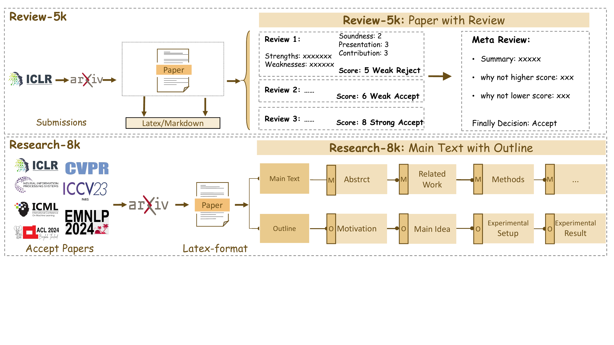
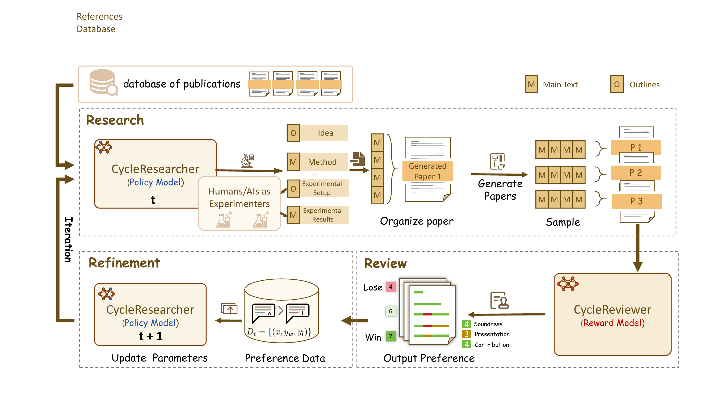
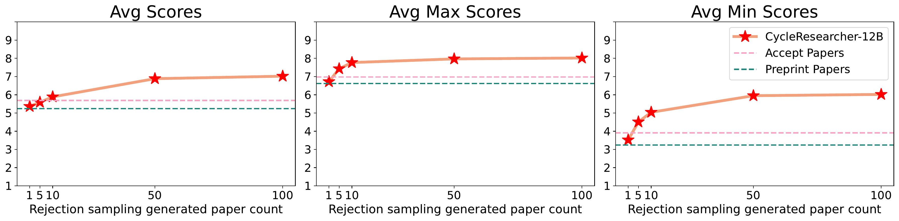
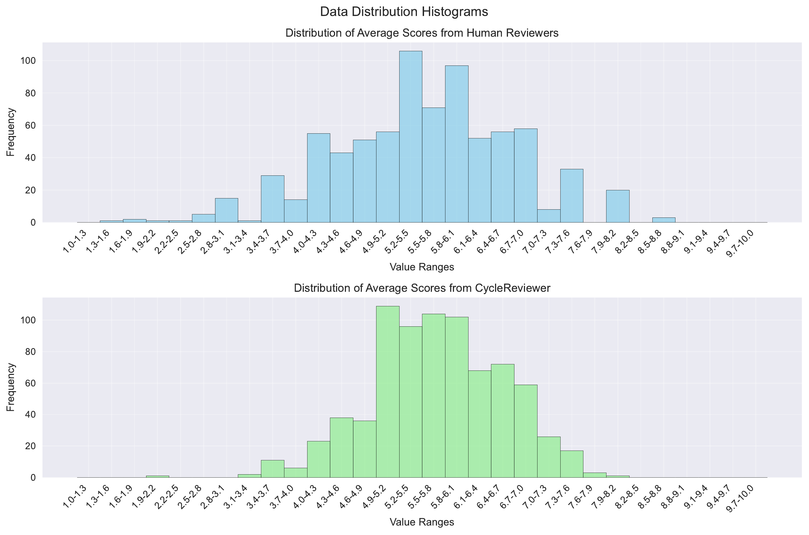

# CycleResearcher: Improving Automated Research via Automated Review  
WARNING: This work is not advocating the use of LLMs for paper writing.

## Abstract

The automation of scientific discovery has been a long-standing goal within the research community, driven by the potential to accelerate knowledge creation. While significant progress has been made using commercial large language models (LLMs) as research assistants or idea generators, the possibility of automating the entire research process with open-source LLMs remains largely unexplored. This paper explores the feasibility of using open-source post-trained LLMs as autonomous agents capable of performing the full cycle of automated research and review, from literature review and manuscript preparation to peer review and paper refinement. Our iterative preference training framework consists of CycleResearcher, which conducts research tasks, and CycleReviewer, which simulates the peer review process, providing iterative feedback via reinforcement learning. To train these models, we develop two new datasets, Review-5k and Research-14k, reflecting real-world machine learning research and peer review dynamics. Our results demonstrate that CycleReviewer achieves promising performance with a 26.89% reduction in mean absolute error (MAE) compared to individual human reviewers in predicting paper scores, indicating the potential of LLMs to effectively assist expert-level research evaluation. In research, the papers generated by the CycleResearcher model achieved a score of 5.36 in simulated peer reviews, showing some competitiveness in terms of simulated review scores compared to the preprint level of 5.24 from human experts, while still having room for improvement compared to the accepted paper level of 5.69. This work represents a significant step toward fully automated scientific inquiry, providing ethical safeguards and exploring AI-driven research capabilities. The code, dataset and model weight are released at <https://wengsyx.github.io/Researcher/>.

# Introduction

Automating general scientific discovery has been a long-standing ambition of the research community, dating back to the late 1970s and 1980s with the advent of computer science. In the field of AI, researchers have envisioned automating scientific research using AI itself . The recent emergence of large language models (LLMs) has opened new possibilities for this endeavor , demonstrating their capacity to not only process but also contribute meaningfully to scientific research. Most current efforts have relied on commercial LLMs to build agents that propose research ideas , as an assistant to conduct experiments , or act as an AI scientist capable of generating automated open-ended scientific publications . To date, the challenge of automating the entire scientific discovery process remains largely unresolved, particularly when it comes to generating and refining research outputs that meet the high standards of peer-reviewed work. Moreover, few efforts address the integration of iterative feedback, which is essential for maintaining academic soundness and novelty. Current models often struggle to adapt across the full spectrum of research stages, highlighting gaps in their ability to conduct comprehensive, multi-step scientific discovery.

Central to the scientific process is the iterative cycle of submission, peer review, and refinement – an established mechanism that maintains the quality and integrity of academic work . Feedback from reviewers and peers plays a critical role in this cycle, offering insights that help researchers refine their work and improve its rigor and impact. Drawing inspiration from this cyclical process, we propose a novel framework that post-trains LLMs as autonomous agents to simulate the full loop of the scientific discovery process. Our approach, built entirely on open-source models, aims to replicate the real-world dynamic of research development and peer review processes. By leveraging trainable models, we enable the utilization of the iterative preference training mechanism using sampling examples through reinforcement learning. Our objective is to determine whether LLMs can actively contribute to each stage of scientific inquiry, from literature review and idea generation to experimental design, manuscript preparation, peer review and paper refinement.

Automating the entire research lifecycle, presents a significant challenge to current agent-based methods , which predominantly rely on commercial models. Consequently, these methods cannot be effectively modeled as policy optimization problems using reinforcement learning. While self-correction methods have been developed to enhance reasoning performance by assessing the quality of LLM outcomes, they have not yet been adopted in the domain of paper writing, which demands more complex evaluations from multiple perspectives. Our research addresses this gap by introducing an iterative post-training framework. The central research question we pose is: “*How can we automate the Research-Review-Refinement process by post-training LLMs*?” So that automated research can be improved according to feedback from automated reviews.

We build a novel iterative training framework that contains two core components: the policy model (namely CycleResearcher) and the reward model (namely CycleReviewer) ranging in size – from 12B to 123B – based on Mistral and Qwen 2.5 .In our framework, CycleResearcher acts as a scientific thinker, responsible for reading literature, identifying research problems, proposing solutions, and designing experiments, while specific experiment execution is delegated to specialized code models. In particular, the policy model performs a variety of research tasks ... for paper generation[3]. The reward model, on the other hand, simulates the peer review process, evaluating the quality of the research output and providing feedback that informs reinforcement learning rewards. In the virtual RL environment, to accelerate training, we require the *experimental results* to be fabricated instead of conducting actual experiments

To illustrate our framework’s operation, when exploring the topic of “Hacking Rewards of VLMs,” we first fed fine-tuned CycleResearcher with a set of relevant published papers to inspire it to propose novel ideas. After generating a batch of first-round papers corresponding with those ideas, fine-tuned CycleReviewer evaluates them to generate pairwise preference samples, which are used to optimize the policy model using SimPO , this process is repeated.

For training our models, we construct two large-scale, publicly available datasets: Review-5k and Research-14k (described in Section <a href="#sec:dataset" data-reference-type="ref" data-reference="sec:dataset">2</a>), which contain peer review and accepted papers from major ML conferences (e.g., ICLR, ICML, NeurIPS). For testing, we take both subjective human evaluation and objective model-based evaluations to assess the quality of CycleReviewer and CycleResearcher. Our experiments show that CycleReviewer demonstrates promising capabilities in supporting the peer review process, while CycleResearcher exhibits consistent performance in research ideation and experimental design compared to API-based agents . We also acknowledge that the generalizability across research domains remains a challenge for current LLMs. Our contributions can be summarized as:

-   We introduce an iterative reinforcement learning framework that automates the entire research lifecycle, which mirrors the real-world Research-Review-Refinement cycle. Our framework includes *CycleResearcher*, a policy model for research tasks, and *CycleReviewer*, a reward model simulating peer reviews. This framework enables large language models (LLMs) to iteratively improve research outputs through a Research-Review-Refinement cycle.

-   We release two large-scale datasets, *Review-5k* and *Research-14k*, which are publicly available and designed to capture the complexity of both peer review and research paper generation in machine learning. These datasets provide valuable resources for evaluating and training models in academic paper generation and review.

-   We demonstrate that the CycleResearcher model can generate papers with an average quality level close to human-written preprints, achieving an acceptance rate of 31.07%. Furthermore, our *CycleReviewer* model shows encouraging results with a 26.89% improvement in MAE compared to individual reviewers, suggesting the potential of automated research assessment in mean absolute error (MAE) in research evaluation tasks, setting a new benchmark for automated research assessment.

# Dataset Construction

In this section, We present an overview of how we collect a substantial corpus of academic papers and organize them into the **Review-5k** and **Research-14k** training dataset. As illustrated in Figure <a href="#fig:dataconstruction" data-reference-type="ref" data-reference="fig:dataconstruction">1</a>, we introduce structured outline extraction and segmentation to assist the LLM in planning before generating research papers. **Notably, we will only make our datasets publicly available for those papers, which receive written consent from publishers (See in Appendix <a href="#app:license" data-reference-type="ref" data-reference="app:license">9</a>).**

<figure><figcaption aria-hidden="true">Data Construction pipeline of the Research-14k dataset and Review-5k dataset. The Review-8k dataset includes both the <strong>main text (M)</strong> and <strong>outlines (O)</strong> of research papers, covering key components such as motivation, methods, experimental setup, and results. The Research-5k dataset provides 3 reviews and 1 meta-review for each paper</figcaption></figure>

## Review-5k

In order to collect a high-quality review dataset, we first gather paper information (including title, abstract, and PDF data) along with the corresponding review comments from ICLR 2024. This ensures that all papers are evaluated according to a consistent standard. We then attempt to retrieve the permitted LaTeX files from ArXiv. If the LaTeX files are unavailable, we use MagicDoc to convert the retrieved PDFs into markdown format. Then, inspired by the traditional peer review process, where a group of reviewers evaluates a paper, followed by a senior reviewer who synthesizes their feedback and makes the final decision, we collect each data point including key components: 1) summary of the work, 2) identified strengths and weaknesses, and 3) questions for clarification, along with 4) numerical scores for soundness, presentation, contribution, and an overall rating. Finally, we leave a dataset named Review-5k, containing 4,991 papers collected from ICLR 2024, comprising over 16,000 reviewer comments. Finally, we split our dataset into mutually exclusive training/testing sets, we keep 4,189 paper reviews for training and 782 samples for testing.

## Research-14k

The research-14k dataset aims to capture structured outlines and detailed main text from academic papers. The data construction process involves three steps: **(1)**. we first compile a list of accepted papers from major international machine learning conferences, such as ICLR, NeurIPS, ICML, ACL, EMNLP, CVPR, and ICCV, spanning from 2022 to 2024. Using Semantic Scholar[4], we retrieve the corresponding ArXiv links and LaTeX-format files for each paper, gathering a total of 14,911 papers. The main text of these papers is then pre-processed using rule-based filtering to remove irrelevant content such as comments (“%”) and acknowledgments. **(2)**. Since the academic value of a research paper depends on its background, we also use the Semantic Scholar API to retrieve the cited works from the bib file and add their abstracts to it. **(3)**. Finally, we organize the main body of each paper into outlines and separate sections to help the model better understand the research process. We use the Mistral-Large-2 model to extract outline information from the paper, following the outline structure shown in Figure <a href="#fig:dataconstruction" data-reference-type="ref" data-reference="fig:dataconstruction">1</a>, and concatenate each outline with its corresponding section. These components form the complete fine-tuning dataset, where the input consists of detailed reference files and the output contains the paper outlines and main text.

After filtering papers that do not meet the requirements, the final dataset, Research-14k, includes 12,696 training samples and 802 test samples. It covers nearly all significant machine learning papers from the past three years and ensures that all collected papers are open-access. The training and test sets are split chronologically, with test papers published later than the training ones. This dataset is used for supervised fine-tuning to enable the LLM to generate well-structured academic papers. Additionally, Research-14k is a long-output dataset, with an average output length of 28K tokens.

# Iterative Training Framework

<figure><figcaption aria-hidden="true"><strong>Iterative Training Framework</strong>. The CycleResearcher model generates Outline (O) and main texts (M) to organize papers, which are evaluated by the CycleReviewer and constructed into preference pairs based on rewards. This whole procedure is then iteratively refined, resulting in progressively enhanced research abilities with each iteration.</figcaption></figure>

We use the iterative Simple Preference Optimization (SimPO) framework to replicate the Research-Review-Refinement cycle typical in academic research. As mentioned in the introduction, we primarily focus on the development of ideas and the writing process, while the execution of actual experiments is beyond the scope of this work. The process begins with initializing two models: a baseline language model fine-tuned for academic writing (the CycleResearcher), and an LLM specialized in evaluating research papers (the CycleReviewer).

As illustrated in Figure <a href="#fig:method" data-reference-type="ref" data-reference="fig:method">2</a>, each iteration encompasses two primary phases: (1) The CycleResearcher model simulates key research steps, including literature review, hypothesis formulation, experimental design, and paper writing, culminating in the production of an academic paper. (2) Subsequently, the CycleReviewer model simulates a peer review process based on the generated paper, providing comprehensive feedback and quantitative scores. To facilitate iterative improvement, we implement a resampling procedure after each round, generating new preference data based on paper scores, which is then utilized to train the models for the subsequent iteration.

## Reward Model: CycleReviewer

We train CycleReviewer as the Generative Reward model on the Review-5k Dataset. To accurately reflect the academic peer review process, we establish a streamlined evaluation workflow:
Paper → *R*1, *R*2, …, *R**n* → SR,

Where the research paper (Paper) is reviewed by multiple reviewers (*R*1, *R*2, …, *R**n*). Each reviewer’s opinion is then summarized by a Senior Reviewer (SR), forming the final decision.

The input to the *CycleReviewer* model is a complete research paper. Upon receiving the paper, the model generates sequential feedback and scores for key aspects including Strengths, Weaknesses, Soundness, Presentation, Contribution, and an Overall Score. The Overall Score is rated on a scale from 1 to 10, where 1 represents the lowest score and 10 the highest, with 5 indicating the paper is borderline for rejection and 6 suggesting it is near acceptance. The output of the model includes both the Overall Score and a recommendation labelled as the “Final Suggestion.” The CycleReviewer simulates the review process across multiple reviewers, producing a set of Overall Scores. The final output is the average of these scores, representing the overall evaluation of the paper by the system.

#### Settings.

We use the Mistral-Large-2 model with LoRA-GA on an 8x H100 80G cluster, with a learning rate of 1e-5 and a batch size of 4x8, for 12 epochs on the Reviewer-5k dataset. To ensure diversity in the generated reviews, *CycleReviewer* starts by simulating the feedback from the reviewer with the lowest rating, gradually progressing to the highest-rated reviewer. This approach ensures that a range of perspectives, from more critical to more favorable, are considered before the senior reviewer delivers the final assessment.

## Policy model: CycleResearcher

The CycleResearcher model is trained on Research-14k, and the process begins with a literature review, where the input bib file contains all references and their corresponding abstracts. After gaining a comprehensive understanding of the research background, the model moves on to manuscript preparation. In this stage, generating outlines and main text alternates to ensure a logical flow. First, the model generates the motivations and main ideas in the outline and then follows up by producing the title, abstract, introduction, and method sections in the main text. Next, it outlines the experimental setup and results, and subsequently generates the experimental design and simulated results in the main text, where it also incorporates discussions. In the virtual RL environment, to accelerate training, we require the “experimental results” to be fabricated instead of conducting actual experiments. Finally, the model analyzes the experimental results and formulates the conclusion. Once all sections of the main text are generated, they are combined into a complete paper in LaTeX format. Notably, each part of the research paper in Research-14k is precisely segmented. Finally, the generated paper *P* is evaluated using the CycleReviewer, as described in Section <a href="#sec:model1" data-reference-type="ref" data-reference="sec:model1">3.1</a>.

#### Settings.

To build the policy model, we select widely used open-source LLMs: Mistral-Nemo-12B, Qwen2.5-Instruct-72B, and Mistral-Large-2 123B. All models are trained using 8x H100 GPUs and DeepSpeed + ZeRO2 . We maximized context length by setting the 12B model to 32K tokens, while the 72B and 123B models were set to 24K tokens. Given memory constraints, samples exceeding the preset context length are randomly truncated. We use a batch size of 2 × 8, a learning rate of 4*e* − 5, and train for a total of 12,000 steps. These models support context windows up to 128K tokens, making them suitable for planning research projects and writing research papers. In response, we contribute three versions of policy models: CycleResearcher-12B, CycleResearcher-72B, and CycleResearcher-123B. During the reinforcement learning phase, we used a learning rate of 5e-7. For the 12B model, we used a text length of 18K, while for the 72B and 123B models, the maximum text length was 10K, with truncation applied from the end. Each iteration trains for one epoch using data obtained through sampling.

## Iterative SimPO

We design an Iterative preference optimization alignment method that simulates the peer review process as a reward mechanism. To construct a preference-pair dataset, we first collected 4,152 recent machine learning papers published on arXiv, retaining only the reference sections as the knowledge base. Then we sampled three times from the CycleResearcher with a temperature of 0.4 and processed the results into standard LaTeX-style texts *M*1, *M*2, *M*3. Next, the CycleReviewer model simulated discussions among multiple reviewers, providing detailed evaluations of various aspects of the papers (e.g., novelty, methods, experimental design, result analysis). The average score *r**i* from all simulated reviewers was assigned to each output *M**i*. We then selected the output with the highest reward value as the positive sample *y**w* and the one with the lowest reward value as the negative sample *y**l*, forming a preference-pair dataset *D*0 = (*x*, *y**w*, *y**l*).

#### Policy Optimization.

Instead of using the iterative DPO training framework , we adopt the SimPO as the base method for saving computational costs. To mitigate overfitting, we sample one-third of the full dataset in each round. Then, we generate a series of models *P*1, …, *P**T*, where each model *P**t* + 1 is created using the preference data *D**t* generated from the model *P**t*. With the preference-pair dataset, we trained a new policy model *π**θ* from *P**t* to *P**t* + 1. *P*1 was initialized from the original fine-tuned CycleResearcher model using instruction tuning.

SimPO builds upon DPO , which is one of the most common offline preference optimization methods. It introduces a length-normalized reward function aligned with the generation target, thereby eliminating dependence on a reference model *π*ref, which reduces memory and computation requirements. The reward function for SimPO is as follows:
$$r\_{\\text{Simpo}}(x, y) = \\frac{\\beta}{\|y\|} \\log \\pi\_\\theta(y \\mid x) = \\frac{\\beta}{\|y\|} \\sum\_{i=1}^{\|y\|} \\log \\pi\_\\theta(y\_i \\mid x, y\_{&lt;i}),$$
where *π**θ* is the policy model, \|*y*\| represents the length of the generated sequence, and *β* is a constant controlling the scaling of reward differences. SimPO also introduces a target reward margin *γ* &gt; 0 to help differentiate between winning and losing responses. The objective for SimPO is as follows:
$$\\mathcal{L}\_{\\text{SimPO}}(\\pi\_\\theta) = -\\mathbb{E}\_{(x,y\_w,y\_l)\\sim\\mathcal{D}}\\left\[\\log\\sigma\\left(\\frac{\\beta}{\|y\_w\|}\\log\\pi\_\\theta(y\_w\|x) - \\frac{\\beta}{\|y\_l\|}\\log\\pi\_\\theta(y\_l\|x) - \\gamma\\right)\\right\]$$

Considering that the models used in the research process may involve complex reasoning and mathematical calculations, we combine the SimPO loss learned from preference pairs with the negative log-likelihood (NLL) loss to stabilize training . The loss function for each preference pair is as follows:

$$\\mathcal{L}\_{\\text{Our}}(\\pi\_\\theta) = -\\mathbb{E}\_{(x,y\_w,y\_l)\\sim\\mathcal{D}}\\left\[\\log\\sigma\\left(\\frac{\\beta}{\|y\_w\|}\\log\\pi\_\\theta(y\_w\|x) - \\frac{\\beta}{\|y\_l\|}\\log\\pi\_\\theta(y\_l\|x) - \\gamma\\right)\\right\]$$
 − *λ*𝔼(*x*, *y**w*) ∼ 𝒟NLL\[log*π**θ*(*y**w*∣*x*)\].

Here, the hyperparameter *λ* balances the two loss terms. Each round of training resamples and optimizes based on the previous round’s results, enabling an approximate online policy optimization process, which allows the CycleResearcher to continuously adapt to evolving publication standards.

## Safeguard Academic Integrity

Beyond automating the research process, we are also concerned with safeguarding academic integrity. We aim to prevent the misuse of LLMs in the research community. To achieve that, we adopt the Fast-DetectGPT , which aims to use the metric of conditional probability curvature to determine whether the paper submission is generated by LLMs. Specifically, we use Llama-3-8B as the scoring model and determine if a paper was generated by an LLM by comparing the conditional probability curvature with a predefined threshold *ϵ*. If the curvature of a paper is larger than the threshold, we classify the paper as LLM-generated, otherwise human-written.

# Experiments

## Experiments on Paper Review Generation

#### Evaluation Metrics.

Evaluating reviewer performance is inherently difficult because the true quality of submissions is unknown. To address this challenge, we use Proxy Mean Squared Error (Proxy MSE) and Proxy Mean Absolute Error (Proxy MAE) to assess the accuracy of individual review scores , detailed in Appendix <a href="#sec:D" data-reference-type="ref" data-reference="sec:D">11</a>. For each paper, the conventional MSE and MAE for a review score *r* are defined as *E*\[(*r*−ground truth)2\] and *E*\[\|*r*−ground truth\|\], which are unobservable due to the unknown true quality. Therefore, we introduce a proxy evaluation method using an independent, unbiased estimator as a stand-in for the ground truth score. Assuming we have *n* human experts with scores *R* = *r*1, *r*2, …, *r**n*, we treat each reviewer’s score *r**i* as an unbiased estimator of the true quality. We define *r*′*i* = mean(*R* \\ *r**i*), which serves as an unbiased estimator excluding *r**i*. Thus, we measure the quality of *r**i* using Proxy MSE = (*r**i* − *r*′*i*)2 and Proxy MAE = \|*r**i* − *r*′*i*\|. Simply put, for each submission, we use the average of the other *n* − 1 reviewers’ scores as an estimator of the true score.

Our evaluation on the Reviewer-5k test set (average rating 5.53) uses this proxy approach for fair comparison. In the *n* − 1 mode, we randomly select one reviewer and use the average of remaining scores as the proxy ground truth. We apply this methodology to evaluate both human experts and closed-source models, including the AI Scientist review system with one-shot reviews, self-reflection , and ensembled reviews.

|                          |                          |          |                      |          |            |            |
|:-------------------------|:------------------------:|:--------:|:--------------------:|:--------:|:----------:|:----------:|
| Method                   | Proxy (Reviewer=*n* − 1) |          | Proxy (Reviewer=*n*) |          |  Decision  |            |
|                          |          MSE ↓           |  MAE ↓   |        MSE ↓         |  MAE ↓   | Accuracy ↑ | Macro F1 ↑ |
| **Expert Individual**    |           2.34           |   1.16   |          \-          |    \-    | **75.40%** | **75.39**  |
| GPT-4o-mini              |           3.44           |   1.53   |         2.98         |   1.40   |   53.06%   |   34.72    |
| GLM-4                    |           4.45           |   1.81   |         3.91         |   1.70   |   49.49%   |   33.10    |
| DeepSpeek-2.5            |           4.62           |   1.83   |         3.72         |   1.64   |   45.11%   |   39.98    |
| Gemini-1.5-pro           |           3.02           |   1.34   |         2.56         |   1.23   |   50.98%   |   50.75    |
| Claude-3.5-Sonnet        |           6.40           |   2.23   |         5.62         |   2.12   |   48.05%   |   32.44    |
| GPT-4o                   |           6.61           |   2.24   |         6.53         |   2.30   |   52.58%   |   34.51    |
| **CycleReviewer (123B)** |         **1.43**         | **0.92** |       **1.25**       | **0.87** | **74.24%** | **73.99**  |

Comparison of automated models on generating review.

\[tab:reviewmodel-comparison\]

#### CycleReviewer introduces better quality of review.

Table <a href="#tab:reviewmodel-comparison" data-reference-type="ref" data-reference="tab:reviewmodel-comparison">1</a> presents the performance comparison across various models. CycleReviewer demonstrates encouraging results in peer review tasks compared to both proprietary systems and individual human reviewers. Our model shows a 48.77% reduction in Proxy MSE and a 26.89% reduction in Proxy MAE when compared to individual reviewers’ scores. These metrics suggest that CycleReviewer can provide consistent scoring that complements human expertise. With a decision accuracy of 74.24%, the model demonstrates competitive performance compared to other closed-source systems. These results suggest that our model can provide consistent scoring that complements human expertise, showing potential advantages over AI Scientist systems in generating reliable evaluation scores. However, we emphasize that these metrics focus on score consistency rather than capturing the full complexity of expert review, where human insight remains invaluable.

## The Importance of Research Lifecycle Simulation

|                                 |              |                       |          |                 |                         |
|:--------------------------------|:------------:|:---------------------:|:--------:|:---------------:|------------------------:|
| Paper Type                      |    Source    | Overall Score Metrics |          |                 |             Accept Rate |
|                                 |              |    Avg Min Score ↑    |          | Avg Max Score ↑ |             Avg Score ↑ |
| Conference Accept Papers        | Human Expert |       **3.91**        | **6.98** |    **5.69**     | **100.00%**† |
| Preprint Papers                 | Human Expert |         3.24          |   6.62   |      5.24       |                  29.63% |
| AI Scientist                    |      AI      |         2.20          |   5.70   |      4.31       |                 *0.00%* |
| **CycleResearcher-12B (Ours)**  |      AI      |         3.47          | **6.75** |      5.36       |              **35.13%** |
| **CycleResearcher-72B (Ours)**  |      AI      |       **3.65**        |   6.58   |    **5.38**     |                  33.64% |
| **CycleResearcher-123B (Ours)** |      AI      |         3.30          |   6.45   |      5.15       |                  24.28% |

The evaluation results of a series of papers assessed by CycleReviewer. The range of these scores is 1-10. The CycleReviewer simulates a group of reviewers, and we report the average score for the lowest Overall Score, the average score for the highest Overall Score, and the overall average score. † indicates that all these papers were actually accepted for publication.

|                                 |              |                 |          |          |                    |          |          |                    |          |          |
|:--------------------------------|:------------:|:---------------:|:--------:|:--------:|:------------------:|:--------:|:--------:|:------------------:|:--------:|:--------:|
| Paper Type                      |    Source    | Soundness Score |          |          | Presentation Score |          |          | Contribution Score |          |          |
|                                 |              |     Min. ↑      |  Max. ↑  |  Avg. ↑  |       Min. ↑       |  Max. ↑  |  Avg. ↑  |       Min. ↑       |  Max. ↑  |  Avg. ↑  |
| Conference Accept Papers        | Human Expert |    **2.03**     | **3.21** | **2.83** |      **2.24**      | **3.35** | **2.91** |      **1.94**      | **3.17** | **2.72** |
| Preprint Papers                 | Human Expert |      1.76       |   3.16   |   2.70   |        2.07        |   3.28   |   2.80   |        1.75        | **3.13** |   2.57   |
| AI Scientist                    |      AI      |      1.20       |   3.10   |   2.48   |        1.70        | **3.40** |   2.69   |        1.30        |   2.90   |   2.15   |
| **CycleResearcher-12B (Ours)**  |      AI      |      1.73       | **3.17** | **2.71** |        1.91        |   3.24   |   2.70   |        1.68        |   3.07   | **2.60** |
| **CycleResearcher-72B (Ours)**  |      AI      |    **1.86**     |   3.13   | **2.71** |      **2.19**      |   3.31   | **2.88** |      **1.81**      |   3.04   |   2.55   |
| **CycleResearcher-123B (Ours)** |      AI      |      1.74       |   3.14   |   2.69   |        2.10        |   3.31   |   2.83   |        1.72        |   3.08   |   2.53   |

The evaluation results of papers reviewed by CycleReviewer across three criteria: Soundness, Presentation, and Contribution. The range of these scores is 1-4.

\[tab:score\_res\]

Table <a href="#tab:score_classify" data-reference-type="ref" data-reference="tab:score_classify">2</a> presents the results of CycleResearcher, which simulates a program committee review process, evaluating papers across the entire score range and ultimately providing a final acceptance decision based on simulated reviews. We report the average scores for the lowest-scoring reviewer, the highest-scoring reviewer, and the overall score. For accepted papers, we use the test set of Research-14k, where all papers have been accepted, serving as a benchmark for human expert standards. For preprint papers, we evaluate 955 submissions from arXiv (Sep. 2024) in the domains of cs.ML, cs.CV, and cs.LG. Additionally, we evaluate the AI Scientist with a collection of 10 research papers generated by GPT-4o and Claude-3.5.

**CycleResearcher consistently performs better than AI Scientist in terms of automated review metrics.** Table <a href="#tab:score_classify" data-reference-type="ref" data-reference="tab:score_classify">2</a> shows that CycleResearcher-12B achieves an average score of 5.36, approaching the 5.69 average scores for conference-accepted papers and surpassing AI Scientist’s score of 4.31. Notably, it achieves an acceptance rate of 35.13%, which is significantly higher than AI Scientist’s 0% acceptance rate, demonstrating its superior ability to produce research-quality output.

The comparison across soundness, presentation, and contribution further illustrates the advantages of CycleResearcher. The CycleResearcher-12B achieves an average soundness score of 2.71, surpassing AI Scientist (with GPT-4o)’s 2.48 and closely matching the 2.83 of accepted papers. For presentation and contribution, it attains average scores of 2.70 and 2.60 respectively, outperforming AI Scientist’s scores in both metrics (2.69 and 2.15). In contrast, AI Scientist shows significant limitations, particularly in minimum scores for soundness (1.20) and contribution (1.30), indicating less consistency in producing quality research. Our model demonstrates greater reliability, with higher minimum scores across all metrics (soundness: 1.73, presentation: 1.91, contribution: 1.68) compared to AI Scientist. These results underscore our model’s effectiveness in addressing the challenges of ensuring quality and consistency in AI-generated research.

| **Method**          |                     **Avg Score ↑** |                           **Accept Rate ↑** |
|:--------------------|------------------------------------:|--------------------------------------------:|
| **CycleResearcher** |                            **5.36** |                                  **35.14%** |
| **w/o RL**          | $\_{\\textcolor{red}{(-0.24)}}5.12$ |  $\_{\\textcolor{red}{(-5.34\\%)}}29.80\\%$ |
| **w/o Iterative**   | $\_{\\textcolor{red}{(-0.15)}}5.21$ |  $\_{\\textcolor{red}{(-2.23\\%)}}32.91\\%$ |
| **w/o NLL**         | $\_{\\textcolor{red}{(-0.45)}}4.91$ | $\_{\\textcolor{red}{(-23.11\\%)}}12.03\\%$ |

Ablation study of different variations of CycleResearcher-12B.

\[tab:score\_res\_mod\]

**Rejection sampling improves the quality of generated papers in terms of automated review metrics** in Figure <a href="#fig:reject" data-reference-type="ref" data-reference="fig:reject">3</a>. Rejection sampling is especially valuable in the context of academic paper generation, where the cost of producing research plans and papers using language models is relatively low compared to other stages of research. As the number of generated papers increases from 1 to 100, the average score rises from approximately 5.36 to 7.02, surpassing both preprint papers (5.24) and accepted papers (5.69). The average maximum score improves from 6.72 to 8.02, while the average minimum score increases substantially from 3.52 to 6.01, both exceeding the preprint paper baseline. These findings indicate that larger sample sizes enable the model to consistently generate higher-quality research papers, making rejection sampling an effective strategy to enhance overall paper quality in terms of soundness, presentation, and contribution.

<figure><figcaption aria-hidden="true">Performance improvement through rejection sampling in generated papers. The graphs show the average, max, and min scores across different numbers of generated papers (1, 5, 10, 50, 100) from CycleResearcher-12B. The red stars represent the performance of the generated papers, showing consistent improvements as the number of samples increases.</figcaption></figure>

**Ablation Study** in Table <a href="#tab:score_res_mod" data-reference-type="ref" data-reference="tab:score_res_mod">4</a>. When Reinforcement Learning is removed, leaving only the initial version with supervised training, the average score drops to 5.12, with an acceptance rate of 29.80%. Removing the iterative training process results in a score of 5.21 and a slightly higher acceptance rate of 32.91%. When Negative Log-Likelihood (NLL) loss is removed, the results decrease significantly. This causes issues such as repetitive text generation and significant errors in the produced content, with the average score dropping sharply to 4.91 and the acceptance rate plummeting to **12.03%.** These results highlight the importance of RL, iterative training, and NLL in maintaining the quality and stability of generated research papers in terms of automated review metrics. Overcoming these challenges is essential for developing robust models capable of producing academic content that performs well in automated reviews.

## Human Evaluation

| **Papers**        | **Avg. Overall** | **Avg. Soundness** | **Avg. Presentation** | **Avg. Contribution** |
|:------------------|:----------------:|:------------------:|:---------------------:|:---------------------:|
| ICLR’24 Accepted  |       6.4        |         \-         |          \-           |          \-           |
| ICLR’24 Submitted |       5.5        |         \-         |          \-           |          \-           |
| AI Scientist      |       3.6        |        2.2         |          2.6          |          1.8          |
| CycleResearcher   |                  |                    |                       |                       |

Human evaluation scores. ICLR’24 scores are collected from the Review-5K test set and Research-14k.

\[tab:human\_evaluation\]

To rigorously validate CycleResearcher’s performance, we conducted a human evaluation study involving three NLP experts. These experts, each with a strong publication record (average 1,110 Google Scholar citations) and prior experience as reviewers for top-tier NLP conferences, were recruited for this task. To ensure relevance and expertise-based assessment, we carefully selected papers for each reviewer that aligned closely with their research interests. Prior to evaluation, all papers were converted from PDF to Markdown format, and manually checked to fix formatting issues (e.g., figure/table layout). Crucially, all identifying author information was anonymized, providing reviewers only with the main text of each paper. Each expert then evaluated 20 papers in total: 10 generated by CycleResearcher-12B (using N=100 rejection sampling) and 10 by AI Scientist (with 50 initial ideas and 3 refinement iterations). The evaluation process spanned one week, during which reviewers were instructed to strictly adhere to the ICLR 2024 review guidelines. We explicitly asked them to evaluate papers based on standard academic criteria, including soundness, presentation, and contribution, and to provide detailed comments and scores for each paper. Furthermore, we specifically directed reviewers to critically assess the experimental design and methodology of each paper, and to flag any potential flaws or inconsistencies they identified. As detailed in Table <a href="#tab:human_evaluation" data-reference-type="ref" data-reference="tab:human_evaluation">5</a>, the human evaluation scores indicate that CycleResearcher outperformed AI Scientist across all measured dimensions (average overall score of 4.8 vs. 3.6). However, CycleResearcher’s performance still remained below the average scores for both ICLR 2024 submissions (5.54) and accepted papers (6.44), suggesting room for further improvement. Nonetheless, the results demonstrate meaningful progress in automated research paper generation, with CycleResearcher showing particular strengths in presentation (2.8) and soundness (2.6) relative to the baseline system.

## Ethical Safeguard

| **Model**                | **Format** | **Accuracy** | **F1 Score** |
|:-------------------------|:----------:|:------------:|:------------:|
| **CycleReviewer-123B**   |   Review   |    95.14%    |    94.89     |
| **CycleResearcher-12B**  |  Research  |    98.38%    |    98.37     |
| **CycleResearcher-72B**  |  Research  |    97.52%    |    97.49     |
| **CycleResearcher-123B** |  Research  |    98.88%    |    98.87     |

Detect Performance Comparison in Different Formats. The human samples are from the test sets of Research-14k and Reviewer-5k.

\[tab:model\_detect\]

To ensure the responsible use of our models, we implemented the Fast-DetectGPT method to classify whether a paper is machine-generated. Table <a href="#tab:model_detect" data-reference-type="ref" data-reference="tab:model_detect">6</a> shows the performance of our detection tool across different formats, achieving over 95% accuracy for review contents and nearly 99% accuracy for paper texts. This ensures that any outputs generated by CycleResearcher or CycleReviewer can be accurately identified, thus protecting the integrity of the research community.

# Related Work

**LLMs for Research.** In recent years, several studies have explored using language models for creative tasks in research, such as multi-agent collaborative writing and multi-module retrieval to improve research idea generation. These works aim to boost the novelty and diversity of AI in creative tasks. conducted a comprehensive human evaluation of the task of idea generation by language models. proposed using LLMs to automatically write survey papers. Additionally, LLMs have been used to automate the research process: introduced a benchmark for evaluating LLMs in coding solutions for machine learning problems; proposed a method leveraging LLMs for scientific literature retrieval. The AI Scientist project introduced a fully automated, prompt-driven research pipeline. However, prompt-based methods often fail to generate ideas that are both diverse and practical, limiting their real-world application. To address this, we developed an iterative self-rewarding framework that enables the LLM to refine its ideas continuously, enhancing both diversity and practicality in research proposal generation.

**LLMs for Science Discovery.** The tradition of AI-assisted scientific discovery has a long history. As early as the last century, AI was applied in fields such as chemistry , synthetic biology , material discovery , and mathematics . With the development of neural networks , more researchers have focused on AI4Science . AI is mainly used for data analysis within a single domain, playing a passive role without driving scientific discovery. The key challenge is enabling AI to go beyond analysis and actively contribute to generating new research ideas, which demands advanced reasoning and creativity. Our work builds on AI’s historical role in science, aiming to shift AI from a supporting tool to a leader in scientific discovery.

**Automated Evaluation of Research Papers.** The use of AI tools in the scientific publishing process has garnered widespread attention , including summarizing research paper content , detecting inaccuracies , and identifying fairness disparities . conducted small-scale qualitative experiments to evaluate the effectiveness of ChatGPT in the peer review process, while invited 10 participants to assess the benefits of GPT-4 in assisting with peer review. and used GPT-4 to evaluate full-text PDFs of scientific papers. However, when LLMs act as judges, even the most advanced models, such as GPT-4 and Gemini , still lag behind reward models specifically trained for the task, as seen in RewardBench . This gap highlights the challenge of achieving human-level judgment and reasoning in AI-driven peer reviews. In contrast, we train a Generative Reward Model to simulate a comprehensive peer review. Our CycleReviewer simulates reviewers with varying perspectives, documenting summaries, strengths, and weaknesses. In the final stage, a primary reviewer consolidates these insights to deliver the final decision.

# Conclusion

In this paper, we introduced a novel framework for automating the entire research lifecycle using large language models (LLMs). Our approach combines CycleResearcher, a policy model designed to autonomously conduct scientific research, and CycleReviewer, a reward model that simulates the peer review process. Through the integration of Iterative SimPO, we enable the models to self-improve over multiple research-review-refinement cycles. To facilitate this, we constructed two new datasets, Review-5k and Research-14k, which capture the complexities of peer review and research paper writing in machine learning. CycleReviewer shows superior scoring consistency compared to evaluated closed-source models, while CycleResearcher generates papers approaching human preprint quality in simulated reviews, with competitive acceptance rates. These results indicate the feasibility of using LLMs to contribute meaningfully to both the scientific discovery and peer review processes. As we move forward, the potential of LLMs to transform research practices is vast. We hope this work sparks further investigation into how AI can assist researchers, while maintaining the highest standards of academic integrity and ethical responsibility.

# Acknowledgement

We want to express huge thanks to our reviewers who gave us insightful suggestions and helped us complete a more comprehensive ethical consideration checklist. Yixuan Weng, Minjun Zhu, Guangsheng Bao, Hongbo Zhang, Linyi Yang, and Yue Zhang have been supported by the Research Program No. WU2023C020 of Research Center for Industries of the Future, Westlake University. Jindong Wang is supported by the Commonwealth Cyber Initiative (CCI). Correspondence to Linyi Yang ([yanglinyiucd@gmail.com](yanglinyiucd@gmail.com)) and Yue Zhang ([zhangyue@westlake.edu.cn](zhangyue@westlake.edu.cn)).

We thank the AI Scientist for providing the foundational code required for *automated experiments* in our work.

# Ethical Considerations

While our primary objective is to advance research automation via LLMs, it is crucial to clarify that we are not advocating for their misuse in academic paper generation. Recognizing the potential ethical risks associated with CycleResearcher and CycleReviewer models, we have implemented comprehensive safeguards. Our high-performance detection tool can identify AI-generated submissions with accuracy exceeding 95%, and all model outputs include embedded watermarks with clear disclosure statements. The licensing framework requires institutional affiliation disclosure and enables publishers to verify model access when concerns arise, while protecting user privacy. All papers must include a clear disclosure:

*This paper was written with the assistance of CycleResearcher, including but not limited to the introduction, related work, experimental design, and experimental results sections. A portion of the content may have been generated using large language models (LLMs).*

We extensively tested for potential misuse through red-teaming exercises, evaluating scenarios like cyber-attacks or harmful content generation. To prevent unlawful information dissemination, we implemented SafetyLock before releasing open-source weights.

The impact on the scientific community warrants careful consideration. On the positive side, our framework can accelerate scientific discovery by automating routine research tasks and enabling rapid hypothesis validation. It could particularly benefit resource-constrained researchers by providing sophisticated research assistance. However, we acknowledge concerns about potential academic integrity issues and the risk of flooding venues with AI-generated papers. To address this, we’ve developed a streamlined detection framework that can identify AI-generated content within approximately 2 seconds, making it practical for widespread deployment in submission systems.

To ensure accountability and responsible use, we’ve implemented a comprehensive licensing and monitoring system. Users must disclose their institutional affiliations and explicitly declare their intended use cases before accessing the models. Our licensing agreement includes a novel disclosure mechanism that balances transparency with privacy - when publishers have legitimate concerns about potential misuse, they can submit queries to verify if specific authors have accessed our models within a given timeframe. This verification process is designed to protect user privacy while maintaining academic integrity, as it only confirms model access without revealing specific usage details. Additionally, all users must agree not to utilize the models for official peer reviews or submissions without full disclosure of AI involvement.

To prevent the proliferation of low-quality research content, we advocate for a comprehensive disclosure and verification framework. We strongly encourage publishers to require authors to declare their use of LLMs in research - a practice already being adopted by major conferences including NeurIPS 2024, ICLR 2025, and ACL. Our detection tool complements this policy by enabling rapid verification of AI-generated content within 2 seconds. When discrepancies are found between author declarations and detection results, publishers can either request clarification or decline review. This system, combined with our licensing framework that tracks model access, creates a robust accountability mechanism. Moreover, our work aligns with the community’s goal of maintaining research quality - CycleResearcher is designed to help researchers produce substantive, well-validated contributions rather than increasing paper volume, complementing existing peer review processes in filtering out low-quality submissions.

We envision these technologies as augmenting rather than replacing human researchers, particularly in accelerating routine aspects of research while allowing scientists to focus on creative and critical thinking. To support this vision, we’re developing collaborative frameworks where CycleResearcher serves as an intelligent research assistant, generating hypotheses and experimental designs that human researchers can refine and validate. This approach maintains the social and collaborative nature of scientific inquiry while leveraging AI’s capabilities to enhance research productivity. Additionally, we’ve established guidelines for appropriate use in academic settings, in Appendix <a href="#appropriate" data-reference-type="ref" data-reference="appropriate">7</a>, including recommendations for how departments and institutions can integrate these tools while maintaining research quality and fostering meaningful human collaboration.

By implementing these measures, we aim to contribute positively to the research community, fostering innovation while ensuring ethical responsibility in the development and application of LLMs for scientific discovery.

# Reproducibility Statement

We have made extensive efforts to ensure the reproducibility of all results presented in this paper. Firstly, the models discussed in this work, including CycleResearcher and CycleReviewer, will be made available as open-source, along with detailed documentation for setup and usage (See in Section <a href="#sec:model1" data-reference-type="ref" data-reference="sec:model1">3.1</a>, Section <a href="#sec:model2" data-reference-type="ref" data-reference="sec:model2">3.2</a>, and Appendix <a href="#appendix:model" data-reference-type="ref" data-reference="appendix:model">12</a>). We provide the training datasets—Review-5k and Research-14k—which will be made publicly accessible to enable researchers to replicate the training process. Each dataset is accompanied by clear instructions regarding its collection, preprocessing steps, and structure (See in Section <a href="#sec:dataset" data-reference-type="ref" data-reference="sec:dataset">2</a>).

Additionally, we have included a thorough description of the model architectures, training procedures, and hyperparameters used in our experiments. Furthermore, we conducted all experiments using publicly available hardware and commonly used deep learning frameworks such as DeepSpeed. To further enhance transparency, we have included a detailed breakdown of evaluation metrics, such as Proxy MAE and Proxy MSE, to ensure that our performance claims can be independently verified. All code, datasets, and model weights will be released with a clear license to promote widespread reproducibility and ethical usage.

# References

Josh Achiam, Steven Adler, Sandhini Agarwal, Lama Ahmad, Ilge Akkaya, Florencia Leoni Aleman, Diogo Almeida, Janko Altenschmidt, Sam Altman, Shyamal Anadkat, et al technical report *arXiv preprint arXiv:2303.08774*, 2023. **Abstract:** We report the development of GPT-4, a large-scale, multimodal model which can accept image and text inputs and produce text outputs. While less capable than humans in many real-world scenarios, GPT-4 exhibits human-level performance on various professional and academic benchmarks, including passing a simulated bar exam with a score around the top 10% of test takers. GPT-4 is a Transformer-based model pre-trained to predict the next token in a document. The post-training alignment process results in improved performance on measures of factuality and adherence to desired behavior. A core component of this project was developing infrastructure and optimization methods that behave predictably across a wide range of scales. This allowed us to accurately predict some aspects of GPT-4’s performance based on models trained with no more than 1/1,000th the compute of GPT-4. (@achiam2023gpt)

Microsoft Research AI4Science and Microsoft Azure Quantum The impact of large language models on scientific discovery: a preliminary study using gpt-4 *arXiv preprint arXiv:2311.07361*, 2023. **Abstract:** In recent years, groundbreaking advancements in natural language processing have culminated in the emergence of powerful large language models (LLMs), which have showcased remarkable capabilities across a vast array of domains, including the understanding, generation, and translation of natural language, and even tasks that extend beyond language processing. In this report, we delve into the performance of LLMs within the context of scientific discovery, focusing on GPT-4, the state-of-the-art language model. Our investigation spans a diverse range of scientific areas encompassing drug discovery, biology, computational chemistry (density functional theory (DFT) and molecular dynamics (MD)), materials design, and partial differential equations (PDE). Evaluating GPT-4 on scientific tasks is crucial for uncovering its potential across various research domains, validating its domain-specific expertise, accelerating scientific progress, optimizing resource allocation, guiding future model development, and fostering interdisciplinary research. Our exploration methodology primarily consists of expert-driven case assessments, which offer qualitative insights into the model’s comprehension of intricate scientific concepts and relationships, and occasionally benchmark testing, which quantitatively evaluates the model’s capacity to solve well-defined domain-specific problems. Our preliminary exploration indicates that GPT-4 exhibits promising potential for a variety of scientific applications, demonstrating its aptitude for handling complex problem-solving and knowledge integration tasks. Broadly speaking, we evaluate GPT-4’s knowledge base, scientific understanding, scientific numerical calculation abilities, and various scientific prediction capabilities. (@ai4science2023impact)

Jinheon Baek, Sujay Kumar Jauhar, Silviu Cucerzan, and Sung Ju Hwang Researchagent: Iterative research idea generation over scientific literature with large language models *arXiv preprint arXiv:2404.07738*, 2024. **Abstract:** The pace of scientific research, vital for improving human life, is complex, slow, and needs specialized expertise. Meanwhile, novel, impactful research often stems from both a deep understanding of prior work, and a cross-pollination of ideas across domains and fields. To enhance the productivity of researchers, we propose ResearchAgent, which leverages the encyclopedic knowledge and linguistic reasoning capabilities of Large Language Models (LLMs) to assist them in their work. This system automatically defines novel problems, proposes methods and designs experiments, while iteratively refining them based on the feedback from collaborative LLM-powered reviewing agents. Specifically, starting with a core scientific paper, ResearchAgent is augmented not only with relevant publications by connecting information over an academic graph but also entities retrieved from a knowledge store derived from shared underlying concepts mined across numerous papers. Then, mimicking a scientific approach to improving ideas with peer discussions, we leverage multiple LLM-based ReviewingAgents that provide reviews and feedback via iterative revision processes. These reviewing agents are instantiated with human preference-aligned LLMs whose criteria for evaluation are elicited from actual human judgments via LLM prompting. We experimentally validate our ResearchAgent on scientific publications across multiple disciplines, showing its effectiveness in generating novel, clear, and valid ideas based on both human and model-based evaluation results. Our initial foray into AI-mediated scientific research has important implications for the development of future systems aimed at supporting researchers in their ideation and operationalization of novel work. (@baek2024researchagent)

Guangsheng Bao, Yanbin Zhao, Zhiyang Teng, Linyi Yang, and Yue Zhang Fast-detectgpt: Efficient zero-shot detection of machine-generated text via conditional probability curvature In *The Twelfth International Conference on Learning Representations*, 2024. **Abstract:** Large language models (LLMs) have shown the ability to produce fluent and cogent content, presenting both productivity opportunities and societal risks. To build trustworthy AI systems, it is imperative to distinguish between machine-generated and human-authored content. The leading zero-shot detector, DetectGPT, showcases commendable performance but is marred by its intensive computational costs. In this paper, we introduce the concept of conditional probability curvature to elucidate discrepancies in word choices between LLMs and humans within a given context. Utilizing this curvature as a foundational metric, we present \*\*Fast-DetectGPT\*\*, an optimized zero-shot detector, which substitutes DetectGPT’s perturbation step with a more efficient sampling step. Our evaluations on various datasets, source models, and test conditions indicate that Fast-DetectGPT not only surpasses DetectGPT by a relative around 75% in both the white-box and black-box settings but also accelerates the detection process by a factor of 340, as detailed in Table 1. See {}url{https://github.com/baoguangsheng/fast-detect-gpt} for code, data, and results. (@bao2024fast)

Peng Bao, Weihui Hong, and Xuanya Li Predicting paper acceptance via interpretable decision sets In *Companion Proceedings of the Web Conference 2021*, pp. 461–467, 2021. **Abstract:** Measuring the quality of research work is an essential component of the scientific process. With the ever-growing rates of articles being submitted to top-tier conferences, and the potential consistency and bias issues in the peer review process identified by scientific community, it is thus of great necessary and challenge to automatically evaluate submissions. Existing works mainly focus on exploring relevant factors and applying machine learning models to simply be accurate at predicting the acceptance of a given academic paper, while ignoring the interpretability power which is required by a wide range of applications. In this paper, we propose a framework to construct decision sets that consist of unordered if-then rules for predicting paper acceptance. We formalize decision set learning problem via a joint objective function that simultaneously optimize accuracy and interpretability of the rules, rather than organizing them in a hierarchy. We evaluate the effectiveness of the proposed framework by applying it on a public scientific peer reviews dataset. Experimental results demonstrate that the learned interpretable decision sets by our framework performs on par with state-of-the-art classification algorithms which optimize exclusively for predictive accuracy and much more interpretable than rule-based methods. (@bao2021predicting)

Stephanie L Boughton, Maria K Kowalczuk, Joerg J Meerpohl, Elizabeth Wager, and Elizabeth C Moylan Research integrity and peer review—past highlights and future directions 2018. **Abstract:** In May 2016, we launched Research Integrity and Peer Review, an international, open access journal with fully open peer review (reviewers are identified on their reports and named reports are published alongside the article) to provide a home for research on research and publication ethics, research reporting, and research on peer review. As the journal enters its third year, we reflect on recent events and highlights for the journal and explore how the journal is faring in terms of gender and diversity in peer review. We also share the particular interests of our Editors-in-Chief regarding models of peer review, reporting quality, common research integrity issues that arise during the publishing process, and how people interact with the published literature. We continue to encourage further research into peer review, research and publication ethics and research reporting, as we believe that all new initiatives should be evidence-based. We also remain open to constructive discussions of the developments in the field that offer new solutions. (@boughton2018research)

Bruce G Buchanan and Edward A Feigenbaum Dendral and meta-dendral: Their applications dimension In *Readings in artificial intelligence*, pp. 313–322. Elsevier, 1981. **Abstract:** The DENDRAL and Meta-DENDRAL programs assist chemists with data interpretation problems. The design of each program is described in the context of the chemical inference problems the program solves. Some chemical results produced by the programs are mentioned. (@buchanan1981dendral)

Ed Collins, Isabelle Augenstein, and Sebastian Riedel A supervised approach to extractive summarisation of scientific papers *arXiv preprint arXiv:1706.03946*, 2017. **Abstract:** Automatic summarisation is a popular approach to reduce a document to its main arguments. Recent research in the area has focused on neural approaches to summarisation, which can be very data-hungry. However, few large datasets exist and none for the traditionally popular domain of scientific publications, which opens up challenging research avenues centered on encoding large, complex documents. In this paper, we introduce a new dataset for summarisation of computer science publications by exploiting a large resource of author provided summaries and show straightforward ways of extending it further. We develop models on the dataset making use of both neural sentence encoding and traditionally used summarisation features and show that models which encode sentences as well as their local and global context perform best, significantly outperforming well-established baseline methods. (@collins2017supervised)

Mike D’Arcy, Tom Hope, Larry Birnbaum, and Doug Downey Marg: Multi-agent review generation for scientific papers *arXiv preprint arXiv:2401.04259*, 2024. **Abstract:** We study the ability of LLMs to generate feedback for scientific papers and develop MARG, a feedback generation approach using multiple LLM instances that engage in internal discussion. By distributing paper text across agents, MARG can consume the full text of papers beyond the input length limitations of the base LLM, and by specializing agents and incorporating sub-tasks tailored to different comment types (experiments, clarity, impact) it improves the helpfulness and specificity of feedback. In a user study, baseline methods using GPT-4 were rated as producing generic or very generic comments more than half the time, and only 1.7 comments per paper were rated as good overall in the best baseline. Our system substantially improves the ability of GPT-4 to generate specific and helpful feedback, reducing the rate of generic comments from 60% to 29% and generating 3.7 good comments per paper (a 2.2x improvement). (@d2024marg)

Jiangshu Du, Yibo Wang, Wenting Zhao, Zhongfen Deng, Shuaiqi Liu, Renze Lou, Henry Peng Zou, Pranav Narayanan Venkit, Nan Zhang, Mukund Srinath, et al Llms assist nlp researchers: Critique paper (meta-) reviewing *arXiv preprint arXiv:2406.16253*, 2024. **Abstract:** This work is motivated by two key trends. On one hand, large language models (LLMs) have shown remarkable versatility in various generative tasks such as writing, drawing, and question answering, significantly reducing the time required for many routine tasks. On the other hand, researchers, whose work is not only time-consuming but also highly expertise-demanding, face increasing challenges as they have to spend more time reading, writing, and reviewing papers. This raises the question: how can LLMs potentially assist researchers in alleviating their heavy workload? This study focuses on the topic of LLMs assist NLP Researchers, particularly examining the effectiveness of LLM in assisting paper (meta-)reviewing and its recognizability. To address this, we constructed the ReviewCritique dataset, which includes two types of information: (i) NLP papers (initial submissions rather than camera-ready) with both human-written and LLM-generated reviews, and (ii) each review comes with "deficiency" labels and corresponding explanations for individual segments, annotated by experts. Using ReviewCritique, this study explores two threads of research questions: (i) "LLMs as Reviewers", how do reviews generated by LLMs compare with those written by humans in terms of quality and distinguishability? (ii) "LLMs as Metareviewers", how effectively can LLMs identify potential issues, such as Deficient or unprofessional review segments, within individual paper reviews? To our knowledge, this is the first work to provide such a comprehensive analysis. (@du2024llms)

Abhimanyu Dubey, Abhinav Jauhri, Abhinav Pandey, Abhishek Kadian, Ahmad Al-Dahle, Aiesha Letman, Akhil Mathur, Alan Schelten, Amy Yang, Angela Fan, Anirudh Goyal, Anthony Hartshorn, Aobo Yang, Archi Mitra, Archie Sravankumar, Artem Korenev, Arthur Hinsvark, Arun Rao, Aston Zhang, Aurelien Rodriguez, Austen Gregerson, Ava Spataru, Baptiste Roziere, Bethany Biron, Binh Tang, Bobbie Chern, Charlotte Caucheteux, Chaya Nayak, Chloe Bi, Chris Marra, Chris McConnell, Christian Keller, Christophe Touret, Chunyang Wu, Corinne Wong, Cristian Canton Ferrer, Cyrus Nikolaidis, Damien Allonsius, Daniel Song, Danielle Pintz, Danny Livshits, David Esiobu, Dhruv Choudhary, Dhruv Mahajan, Diego Garcia-Olano, Diego Perino, Dieuwke Hupkes, Egor Lakomkin, Ehab AlBadawy, Elina Lobanova, Emily Dinan, Eric Michael Smith, Filip Radenovic, Frank Zhang, Gabriel Synnaeve, Gabrielle Lee, Georgia Lewis Anderson, Graeme Nail, Gregoire Mialon, Guan Pang, Guillem Cucurell, Hailey Nguyen, Hannah Korevaar, Hu Xu, Hugo Touvron, Iliyan Zarov, Imanol Arrieta Ibarra, Isabel Kloumann, Ishan Misra, Ivan Evtimov, Jade Copet, Jaewon Lee, Jan Geffert, Jana Vranes, Jason Park, Jay Mahadeokar, Jeet Shah, Jelmer van der Linde, Jennifer Billock, Jenny Hong, Jenya Lee, Jeremy Fu, Jianfeng Chi, Jianyu Huang, Jiawen Liu, Jie Wang, Jiecao Yu, Joanna Bitton, Joe Spisak, Jongsoo Park, Joseph Rocca, Joshua Johnstun, Joshua Saxe, Junteng Jia, Kalyan Vasuden Alwala, Kartikeya Upasani, Kate Plawiak, Ke Li, Kenneth Heafield, Kevin Stone, Khalid El-Arini, Krithika Iyer, Kshitiz Malik, Kuenley Chiu, Kunal Bhalla, Lauren Rantala-Yeary, Laurens van der Maaten, Lawrence Chen, Liang Tan, Liz Jenkins, Louis Martin, Lovish Madaan, Lubo Malo, Lukas Blecher, Lukas Landzaat, Luke de Oliveira, Madeline Muzzi, Mahesh Pasupuleti, Mannat Singh, Manohar Paluri, Marcin Kardas, Mathew Oldham, Mathieu Rita, Maya Pavlova, Melanie Kambadur, Mike Lewis, Min Si, Mitesh Kumar Singh, Mona Hassan, Naman Goyal, Narjes Torabi, Nikolay Bashlykov, Nikolay Bogoychev, Niladri Chatterji, Olivier Duchenne, Onur Çelebi, Patrick Alrassy, Pengchuan Zhang, Pengwei Li, Petar Vasic, Peter Weng, Prajjwal Bhargava, Pratik Dubal, Praveen Krishnan, Punit Singh Koura, Puxin Xu, Qing He, Qingxiao Dong, Ragavan Srinivasan, Raj Ganapathy, Ramon Calderer, Ricardo Silveira Cabral, Robert Stojnic, Roberta Raileanu, Rohit Girdhar, Rohit Patel, Romain Sauvestre, Ronnie Polidoro, Roshan Sumbaly, Ross Taylor, Ruan Silva, Rui Hou, Rui Wang, Saghar Hosseini, Sahana Chennabasappa, Sanjay Singh, Sean Bell, Seohyun Sonia Kim, Sergey Edunov, Shaoliang Nie, Sharan Narang, Sharath Raparthy, Sheng Shen, Shengye Wan, Shruti Bhosale, Shun Zhang, Simon Vandenhende, Soumya Batra, Spencer Whitman, Sten Sootla, Stephane Collot, Suchin Gururangan, Sydney Borodinsky, Tamar Herman, Tara Fowler, Tarek Sheasha, Thomas Georgiou, Thomas Scialom, Tobias Speckbacher, Todor Mihaylov, Tong Xiao, Ujjwal Karn, Vedanuj Goswami, Vibhor Gupta, Vignesh Ramanathan, Viktor Kerkez, Vincent Gonguet, Virginie Do, Vish Vogeti, Vladan Petrovic, Weiwei Chu, Wenhan Xiong, Wenyin Fu, Whitney Meers, Xavier Martinet, Xiaodong Wang, Xiaoqing Ellen Tan, Xinfeng Xie, Xuchao Jia, Xuewei Wang, Yaelle Goldschlag, Yashesh Gaur, Yasmine Babaei, Yi Wen, Yiwen Song, Yuchen Zhang, Yue Li, Yuning Mao, Zacharie Delpierre Coudert, Zheng Yan, Zhengxing Chen, Zoe Papakipos, Aaditya Singh, Aaron Grattafiori, Abha Jain, Adam Kelsey, Adam Shajnfeld, Adithya Gangidi, Adolfo Victoria, Ahuva Goldstand, Ajay Menon, Ajay Sharma, Alex Boesenberg, Alex Vaughan, Alexei Baevski, Allie Feinstein, Amanda Kallet, Amit Sangani, Anam Yunus, Andrei Lupu, Andres Alvarado, Andrew Caples, Andrew Gu, Andrew Ho, Andrew Poulton, Andrew Ryan, Ankit Ramchandani, Annie Franco, Aparajita Saraf, Arkabandhu Chowdhury, Ashley Gabriel, Ashwin Bharambe, Assaf Eisenman, Azadeh Yazdan, Beau James, Ben Maurer, Benjamin Leonhardi, Bernie Huang, Beth Loyd, Beto De Paola, Bhargavi Paranjape, Bing Liu, Bo Wu, Boyu Ni, Braden Hancock, Bram Wasti, Brandon Spence, Brani Stojkovic, Brian Gamido, Britt Montalvo, Carl Parker, Carly Burton, Catalina Mejia, Changhan Wang, Changkyu Kim, Chao Zhou, Chester Hu, Ching-Hsiang Chu, Chris Cai, Chris Tindal, Christoph Feichtenhofer, Damon Civin, Dana Beaty, Daniel Kreymer, Daniel Li, Danny Wyatt, David Adkins, David Xu, Davide Testuggine, Delia David, Devi Parikh, Diana Liskovich, Didem Foss, Dingkang Wang, Duc Le, Dustin Holland, Edward Dowling, Eissa Jamil, Elaine Montgomery, Eleonora Presani, Emily Hahn, Emily Wood, Erik Brinkman, Esteban Arcaute, Evan Dunbar, Evan Smothers, Fei Sun, Felix Kreuk, Feng Tian, Firat Ozgenel, Francesco Caggioni, Francisco Guzmán, Frank Kanayet, Frank Seide, Gabriela Medina Florez, Gabriella Schwarz, Gada Badeer, Georgia Swee, Gil Halpern, Govind Thattai, Grant Herman, Grigory Sizov, Guangyi, Zhang, Guna Lakshminarayanan, Hamid Shojanazeri, Han Zou, Hannah Wang, Hanwen Zha, Haroun Habeeb, Harrison Rudolph, Helen Suk, Henry Aspegren, Hunter Goldman, Ibrahim Damlaj, Igor Molybog, Igor Tufanov, Irina-Elena Veliche, Itai Gat, Jake Weissman, James Geboski, James Kohli, Japhet Asher, Jean-Baptiste Gaya, Jeff Marcus, Jeff Tang, Jennifer Chan, Jenny Zhen, Jeremy Reizenstein, Jeremy Teboul, Jessica Zhong, Jian Jin, Jingyi Yang, Joe Cummings, Jon Carvill, Jon Shepard, Jonathan McPhie, Jonathan Torres, Josh Ginsburg, Junjie Wang, Kai Wu, Kam Hou U, Karan Saxena, Karthik Prasad, Kartikay Khandelwal, Katayoun Zand, Kathy Matosich, Kaushik Veeraraghavan, Kelly Michelena, Keqian Li, Kun Huang, Kunal Chawla, Kushal Lakhotia, Kyle Huang, Lailin Chen, Lakshya Garg, Lavender A, Leandro Silva, Lee Bell, Lei Zhang, Liangpeng Guo, Licheng Yu, Liron Moshkovich, Luca Wehrstedt, Madian Khabsa, Manav Avalani, Manish Bhatt, Maria Tsimpoukelli, Martynas Mankus, Matan Hasson, Matthew Lennie, Matthias Reso, Maxim Groshev, Maxim Naumov, Maya Lathi, Meghan Keneally, Michael L. Seltzer, Michal Valko, Michelle Restrepo, Mihir Patel, Mik Vyatskov, Mikayel Samvelyan, Mike Clark, Mike Macey, Mike Wang, Miquel Jubert Hermoso, Mo Metanat, Mohammad Rastegari, Munish Bansal, Nandhini Santhanam, Natascha Parks, Natasha White, Navyata Bawa, Nayan Singhal, Nick Egebo, Nicolas Usunier, Nikolay Pavlovich Laptev, Ning Dong, Ning Zhang, Norman Cheng, Oleg Chernoguz, Olivia Hart, Omkar Salpekar, Ozlem Kalinli, Parkin Kent, Parth Parekh, Paul Saab, Pavan Balaji, Pedro Rittner, Philip Bontrager, Pierre Roux, Piotr Dollar, Polina Zvyagina, Prashant Ratanchandani, Pritish Yuvraj, Qian Liang, Rachad Alao, Rachel Rodriguez, Rafi Ayub, Raghotham Murthy, Raghu Nayani, Rahul Mitra, Raymond Li, Rebekkah Hogan, Robin Battey, Rocky Wang, Rohan Maheswari, Russ Howes, Ruty Rinott, Sai Jayesh Bondu, Samyak Datta, Sara Chugh, Sara Hunt, Sargun Dhillon, Sasha Sidorov, Satadru Pan, Saurabh Verma, Seiji Yamamoto, Sharadh Ramaswamy, Shaun Lindsay, Shaun Lindsay, Sheng Feng, Shenghao Lin, Shengxin Cindy Zha, Shiva Shankar, Shuqiang Zhang, Shuqiang Zhang, Sinong Wang, Sneha Agarwal, Soji Sajuyigbe, Soumith Chintala, Stephanie Max, Stephen Chen, Steve Kehoe, Steve Satterfield, Sudarshan Govindaprasad, Sumit Gupta, Sungmin Cho, Sunny Virk, Suraj Subramanian, Sy Choudhury, Sydney Goldman, Tal Remez, Tamar Glaser, Tamara Best, Thilo Kohler, Thomas Robinson, Tianhe Li, Tianjun Zhang, Tim Matthews, Timothy Chou, Tzook Shaked, Varun Vontimitta, Victoria Ajayi, Victoria Montanez, Vijai Mohan, Vinay Satish Kumar, Vishal Mangla, Vítor Albiero, Vlad Ionescu, Vlad Poenaru, Vlad Tiberiu Mihailescu, Vladimir Ivanov, Wei Li, Wenchen Wang, Wenwen Jiang, Wes Bouaziz, Will Constable, Xiaocheng Tang, Xiaofang Wang, Xiaojian Wu, Xiaolan Wang, Xide Xia, Xilun Wu, Xinbo Gao, Yanjun Chen, Ye Hu, Ye Jia, Ye Qi, Yenda Li, Yilin Zhang, Ying Zhang, Yossi Adi, Youngjin Nam, Yu, Wang, Yuchen Hao, Yundi Qian, Yuzi He, Zach Rait, Zachary DeVito, Zef Rosnbrick, Zhaoduo Wen, Zhenyu Yang, and Zhiwei Zhao The llama 3 herd of models 2024. URL <https://arxiv.org/abs/2407.21783>. **Abstract:** Modern artificial intelligence (AI) systems are powered by foundation models. This paper presents a new set of foundation models, called Llama 3. It is a herd of language models that natively support multilinguality, coding, reasoning, and tool usage. Our largest model is a dense Transformer with 405B parameters and a context window of up to 128K tokens. This paper presents an extensive empirical evaluation of Llama 3. We find that Llama 3 delivers comparable quality to leading language models such as GPT-4 on a plethora of tasks. We publicly release Llama 3, including pre-trained and post-trained versions of the 405B parameter language model and our Llama Guard 3 model for input and output safety. The paper also presents the results of experiments in which we integrate image, video, and speech capabilities into Llama 3 via a compositional approach. We observe this approach performs competitively with the state-of-the-art on image, video, and speech recognition tasks. The resulting models are not yet being broadly released as they are still under development. (@dubey2024llama3herdmodels)

Tomas Hayes, Roshan Rao, Halil Akin, Nicholas J Sofroniew, Deniz Oktay, Zeming Lin, Robert Verkuil, Vincent Q Tran, Jonathan Deaton, Marius Wiggert, et al Simulating 500 million years of evolution with a language model *bioRxiv*, pp. 2024–07, 2024. **Abstract:** Abstract More than three billion years of evolution have produced an image of biology encoded into the space of natural proteins. Here we show that language models trained on tokens generated by evolution can act as evolutionary simulators to generate functional proteins that are far away from known proteins. We present ESM3, a frontier multimodal generative language model that reasons over the sequence, structure, and function of proteins. ESM3 can follow complex prompts combining its modalities and is highly responsive to biological alignment. We have prompted ESM3 to generate fluorescent proteins with a chain of thought. Among the generations that we synthesized, we found a bright fluorescent protein at far distance (58% identity) from known fluorescent proteins. Similarly distant natural fluorescent proteins are separated by over five hundred million years of evolution. (@hayes2024simulating)

Mohammad Hosseini and Serge PJM Horbach Fighting reviewer fatigue or amplifying bias? considerations and recommendations for use of chatgpt and other large language models in scholarly peer review *Research integrity and peer review*, 8 (1): 4, 2023. **Abstract:** The emergence of systems based on large language models (LLMs) such as OpenAI’s ChatGPT has created a range of discussions in scholarly circles. Since LLMs generate grammatically correct and mostly relevant (yet sometimes outright wrong, irrelevant or biased) outputs in response to provided prompts, using them in various writing tasks including writing peer review reports could result in improved productivity. Given the significance of peer reviews in the existing scholarly publication landscape, exploring challenges and opportunities of using LLMs in peer review seems urgent. After the generation of the first scholarly outputs with LLMs, we anticipate that peer review reports too would be generated with the help of these systems. However, there are currently no guidelines on how these systems should be used in review tasks. (@hosseini2023fighting)

Shengran Hu, Cong Lu, and Jeff Clune Automated design of agentic systems In *The Thirteenth International Conference on Learning Representations*, 2025. URL <https://openreview.net/forum?id=t9U3LW7JVX>. **Abstract:** The ability to create effective multi-agent organizations is key to the development of larger, more diverse multi-agent systems. In this article we present KB-ORG: a fully automated, knowledge-based organization designer for multi-agent systems. Organization design is the process that accepts organizational goals, environmental expectations, performance requirements, role characterizations, and agent descriptions and assigns roles to each agent. These long-term roles serve as organizational-control guidelines that are used by each agent in making moment-to-moment operational control decisions. An important aspect of KB-ORG is its efficient, knowledge-informed search process for designing multi-agent organizations. KB-ORG uses both application-level and coordination-level organization design knowledge to explore the combinatorial search space of candidate organizations selectively. KB-ORG also delays making coordination-level organizational decisions until it has explored and elaborated candidate application-level agent roles. This approach significantly reduces the exploration effort required to produce effective designs as compared to modeling and evaluation-based approaches that do not incorporate design expertise. KB-ORG designs are not restricted to a single organization form such as a hierarchy, and the organization designs described here contain both hierarchical and peer-to-peer elements. We use examples from the distributed sensor network (DSN) domain to show how KB-ORG uses situational parameters as well as application-level and coordination-level knowledge to generate organization designs. We also show that KB-ORG designs effective, yet substantially different, organizations when given different organizational requirements and environmental expectations. (@Hu2024AutomatedDO)

Qian Huang, Jian Vora, Percy Liang, and Jure Leskovec Mlagentbench: Evaluating language agents on machine learning experimentation In *Forty-first International Conference on Machine Learning*, 2024. **Abstract:** A central aspect of machine learning research is experimentation, the process of designing and running experiments, analyzing the results, and iterating towards some positive outcome (e.g., improving accuracy). Could agents driven by powerful language models perform machine learning experimentation effectively? To answer this question, we introduce MLAgentBench, a suite of 13 tasks ranging from improving model performance on CIFAR-10 to recent research problems like BabyLM. For each task, an agent can perform actions like reading/writing files, executing code, and inspecting outputs. We then construct an agent that can perform ML experimentation based on ReAct framework. We benchmark agents based on Claude v1.0, Claude v2.1, Claude v3 Opus, GPT-4, GPT-4-turbo, Gemini-Pro, and Mixtral and find that a Claude v3 Opus agent is the best in terms of success rate. It can build compelling ML models over many tasks in MLAgentBench with 37.5% average success rate. Our agents also display highly interpretable plans and actions. However, the success rates vary considerably; they span from 100% on well-established older datasets to as low as 0% on recent Kaggle challenges created potentially after the underlying LM was trained. Finally, we identify several key challenges for LM-based agents such as long-term planning and reducing hallucination. Our code is released at https://github.com/snap-stanford/MLAgentBench. (@huang2024mlagentbench)

Marcus Hutter Towards a universal theory of artificial intelligence based on algorithmic probability and sequential decisions In *European conference on machine learning*, pp. 226–238. Springer, 2001. **Abstract:** Decision theory formally solves the problem of rational agents in uncertain worlds if the true environmental probability distribution is known. Solomonoff’s theory of universal induction formally solves the problem of sequence prediction for unknown distributions. We unify both theories and give strong arguments that the resulting universal AIξ model behaves optimally in any computable environment. The major drawback of the AIξ model is that it is uncomputable. To overcome this problem, we construct a modified algorithm AIξ, which is still superior to any other time t and length l bounded agent. The computation time of AIξ^tl is of the order t·2 ^l. (@hutter2001towards)

Albert Q Jiang, Alexandre Sablayrolles, Arthur Mensch, Chris Bamford, Devendra Singh Chaplot, Diego de las Casas, Florian Bressand, Gianna Lengyel, Guillaume Lample, Lucile Saulnier, et al Mistral 7b *arXiv preprint arXiv:2310.06825*, 2023. **Abstract:** We introduce Mistral 7B v0.1, a 7-billion-parameter language model engineered for superior performance and efficiency. Mistral 7B outperforms Llama 2 13B across all evaluated benchmarks, and Llama 1 34B in reasoning, mathematics, and code generation. Our model leverages grouped-query attention (GQA) for faster inference, coupled with sliding window attention (SWA) to effectively handle sequences of arbitrary length with a reduced inference cost. We also provide a model fine-tuned to follow instructions, Mistral 7B – Instruct, that surpasses the Llama 2 13B – Chat model both on human and automated benchmarks. Our models are released under the Apache 2.0 license. (@jiang2023mistral)

John Jumper, Richard Evans, Alexander Pritzel, Tim Green, Michael Figurnov, Olaf Ronneberger, Kathryn Tunyasuvunakool, Russ Bates, Augustin Z’ıdek, Anna Potapenko, et al Highly accurate protein structure prediction with alphafold *nature*, 596 (7873): 583–589, 2021. **Abstract:** Abstract Proteins are essential to life, and understanding their structure can facilitate a mechanistic understanding of their function. Through an enormous experimental effort 1–4 , the structures of around 100,000 unique proteins have been determined 5 , but this represents a small fraction of the billions of known protein sequences 6,7 . Structural coverage is bottlenecked by the months to years of painstaking effort required to determine a single protein structure. Accurate computational approaches are needed to address this gap and to enable large-scale structural bioinformatics. Predicting the three-dimensional structure that a protein will adopt based solely on its amino acid sequence—the structure prediction component of the ‘protein folding problem’ 8 —has been an important open research problem for more than 50 years 9 . Despite recent progress 10–14 , existing methods fall far short of atomic accuracy, especially when no homologous structure is available. Here we provide the first computational method that can regularly predict protein structures with atomic accuracy even in cases in which no similar structure is known. We validated an entirely redesigned version of our neural network-based model, AlphaFold, in the challenging 14th Critical Assessment of protein Structure Prediction (CASP14) 15 , demonstrating accuracy competitive with experimental structures in a majority of cases and greatly outperforming other methods. Underpinning the latest version of AlphaFold is a novel machine learning approach that incorporates physical and biological knowledge about protein structure, leveraging multi-sequence alignments, into the design of the deep learning algorithm. (@jumper2021highly)

Nathan Lambert, Valentina Pyatkin, Jacob Morrison, LJ Miranda, Bill Yuchen Lin, Khyathi Chandu, Nouha Dziri, Sachin Kumar, Tom Zick, Yejin Choi, et al Rewardbench: Evaluating reward models for language modeling *arXiv preprint arXiv:2403.13787*, 2024. **Abstract:** Reward models (RMs) are at the crux of successfully using RLHF to align pretrained models to human preferences, yet there has been relatively little study that focuses on evaluation of those models. Evaluating reward models presents an opportunity to understand the opaque technologies used for alignment of language models and which values are embedded in them. Resources for reward model training and understanding are sparse in the nascent open-source community around them. To enhance scientific understanding of reward models, we present RewardBench, a benchmark dataset and code-base for evaluation. The RewardBench dataset is a collection of prompt-chosen-rejected trios spanning chat, reasoning, and safety, to benchmark how reward models perform on challenging, structured and out-of-distribution queries. We create specific comparison datasets for RMs that have subtle, but verifiable reasons (e.g. bugs, incorrect facts) why one answer should be preferred to another. On the RewardBench leaderboard, we evaluate reward models trained with a variety of methods, such as the direct MLE training of classifiers and the implicit reward modeling of Direct Preference Optimization (DPO). We present many findings on propensity for refusals, reasoning limitations, and instruction following shortcomings of various reward models towards a better understanding of the RLHF process. (@lambert2024rewardbench)

P Langley *Scientific discovery: Computational explorations of the creative processes* MIT Press, 1987. **Abstract:** Scientific discovery is often regarded as romantic and creative – and hence unanalyzable – whereas the everyday process of verifying discoveries is sober and more suited to analysis. Yet this fascinating exploration of how scientific work proceeds argues that however sudden the moment of discovery may seem, the discovery process can be described and modeled. Using the methods and concepts of contemporary information-processing psychology (or cognitive science) the authors develop a series of artificial-intelligence programs that can simulate the human thought processes used to discover scientific laws. The programs – BACON, DALTON, GLAUBER, and STAHL – are all largely data-driven, that is, when presented with series of chemical or physical measurements they search for uniformities and linking elements, generating and checking hypotheses and creating new concepts as they go along. Scientific Discovery examines the nature of scientific research and reviews the arguments for and against a normative theory of discovery; describes the evolution of the BACON programs, which discover quantitative empirical laws and invent new concepts; presents programs that discover laws in qualitative and quantitative data; and ties the results together, suggesting how a combined and extended program might find research problems, invent new instruments, and invent appropriate problem representations. Numerous prominent historical examples of discoveries from physics and chemistry are used as tests for the programs and anchor the discussion concretely in the history of science. (@langley1987scientific)

Pat Langley Integrated systems for computational scientific discovery In *Proceedings of the AAAI Conference on Artificial Intelligence*, volume 38, pp. 22598–22606, 2024. **Abstract:** This paper poses the challenge of developing and evaluating integrated systems for computational scientific discovery. We note some distinguishing characteristics of discovery tasks, examine eight component abilities, review previous successes at partial integration, and consider hurdles the AI research community must leap to transform the vision for integrated discovery into reality. In closing, we discuss promising scientific domains in which to test such computational artifacts. (@langley2024integrated)

Yann LeCun, Yoshua Bengio, and Geoffrey Hinton Deep learning *nature*, 521 (7553): 436–444, 2015. **Abstract:** Deep learning allows computational models that are composed of multiple processing layers to learn representations of data with multiple levels of abstraction. These methods have dramatically improved the state-of-the-art in speech recognition, visual object recognition, object detection and many other domains such as drug discovery and genomics. Deep learning discovers intricate structure in large data sets by using the backpropagation algorithm to indicate how a machine should change its internal parameters that are used to compute the representation in each layer from the representation in the previous layer. Deep convolutional nets have brought about breakthroughs in processing images, video, speech and audio, whereas recurrent nets have shone light on sequential data such as text and speech. (@lecun2015deep)

Harrison Lee, Samrat Phatale, Hassan Mansoor, Thomas Mesnard, Johan Ferret, Kellie Ren Lu, Colton Bishop, Ethan Hall, Victor Carbune, Abhinav Rastogi, and Sushant Prakash vs. RLHF: Scaling reinforcement learning from human feedback with AI feedback In *Forty-first International Conference on Machine Learning*, 2024. URL <https://openreview.net/forum?id=uydQ2W41KO>. **Abstract:** Reinforcement learning from human feedback (RLHF) has proven effective in aligning large language models (LLMs) with human preferences, but gathering high-quality preference labels is expensive. RL from AI Feedback (RLAIF), introduced in Bai et al., offers a promising alternative that trains the reward model (RM) on preferences generated by an off-the-shelf LLM. Across the tasks of summarization, helpful dialogue generation, and harmless dialogue generation, we show that RLAIF achieves comparable performance to RLHF. Furthermore, we take a step towards"self-improvement"by demonstrating that RLAIF can outperform a supervised fine-tuned baseline even when the AI labeler is the same size as the policy, or even the exact same checkpoint as the initial policy. Finally, we introduce direct-RLAIF (d-RLAIF) - a technique that circumvents RM training by obtaining rewards directly from an off-the-shelf LLM during RL, which achieves superior performance to canonical RLAIF. Our results suggest that RLAIF can achieve performance on-par with using human feedback, offering a potential solution to the scalability limitations of RLHF. (@lee2024rlaifvsrlhfscaling)

Douglas B Lenat Automated theory formation in mathematics In *IJCAI*, volume 77, pp. 833–842, 1977. **Abstract:** A program called is described which cairies on simple mathematics research: defining, and studying new concepts under the guidance of a large body of heuiistic rules. The 250 heurKtus communicate via an agenda mechanism, a global priority queue of small bisk’, for the program to perform and teasons why each task is plausible (e.g., Find PENCRAHZTION. of ’prnes’, because turued out to be so useful a Concept). Each concept is an active, structured knowledge module. One bundled very incomplete modules are initially supplied, each one corresponding to an elementary set theoretic concept (e.g., union). This provides a definite but immense space which AM begins to explore. In one boor, AM rediscovers hundreds of common concepts (including singleton sets, natural numbers, arithmetic) and theorems (e.g., unique factorization). (@lenat1977automated)

Douglas B Lenat Eurisko: a program that learns new heuristics and domain concepts: the nature of heuristics iii: program design and results *Artificial intelligence*, 21 (1-2): 61–98, 1983. (@lenat1983eurisko)

Patrick Lewis, Ethan Perez, Aleksandra Piktus, Fabio Petroni, Vladimir Karpukhin, Naman Goyal, Heinrich K"uttler, Mike Lewis, Wen-tau Yih, Tim Rockt"aschel, Sebastian Riedel, and Douwe Kiela Retrieval-augmented generation for knowledge-intensive nlp tasks In H. Larochelle, M. Ranzato, R. Hadsell, M.F. Balcan, and H. Lin (eds.), *Advances In Neural Information Processing Systems*, volume 33, pp. 9459–9474. Curran Associates, Inc., 2020. URL <https://proceedings.neurips.cc/paper_files/paper/2020/file/6b493230205f780e1bc26945df7481e5-Paper.pdf>. **Abstract:** Large pre-trained language models have been shown to store factual knowledge in their parameters, and achieve state-of-the-art results when fine-tuned on downstream NLP tasks. However, their ability to access and precisely manipulate knowledge is still limited, and hence on knowledge-intensive tasks, their performance lags behind task-specific architectures. Additionally, providing provenance for their decisions and updating their world knowledge remain open research problems. Pre-trained models with a differentiable access mechanism to explicit non-parametric memory can overcome this issue, but have so far been only investigated for extractive downstream tasks. We explore a general-purpose fine-tuning recipe for retrieval-augmented generation (RAG) – models which combine pre-trained parametric and non-parametric memory for language generation. We introduce RAG models where the parametric memory is a pre-trained seq2seq model and the non-parametric memory is a dense vector index of Wikipedia, accessed with a pre-trained neural retriever. We compare two RAG formulations, one which conditions on the same retrieved passages across the whole generated sequence, the other can use different passages per token. We fine-tune and evaluate our models on a wide range of knowledge-intensive NLP tasks and set the state-of-the-art on three open domain QA tasks, outperforming parametric seq2seq models and task-specific retrieve-and-extract architectures. For language generation tasks, we find that RAG models generate more specific, diverse and factual language than a state-of-the-art parametric-only seq2seq baseline. (@NEURIPS2020\_6b493230)

Guojie LI Ai4r: The fifth scientific research paradigm *Bulletin of Chinese Academy of Sciences (Chinese Version)*, 39 (1): 1–9, 2024. **Abstract:** This article explores the key role of intelligent computing in driving the paradigm shift of scientific discovery. The article first outlines the five paradigms of scientific discovery, from empirical observation to theoretical models, then to computational simulation and data intensive science, and finally introduces intelligent computing as the core of the fifth paradigm. Intelligent computing enhances the ability to understand, predict, and automate scientific discoveries of complex systems through technologies such as deep learning and machine learning. The article further analyzes the applications of intelligent computing in fields such as bioinformatics, astronomy, climate science, materials science, and medical image analysis, demonstrating its practical utility in solving scientific problems and promoting knowledge development. Finally, the article predicts that intelligent computing will play a more critical role in future scientific research, promoting interdisciplinary integration, open science, and collaboration, providing new solutions for solving complex problems. (@li2024ai4r)

Ruochen Li, Teerth Patel, Qingyun Wang, and Xinya Du Mlr-copilot: Autonomous machine learning research based on large language models agents 2024. URL <https://arxiv.org/abs/2408.14033>. **Abstract:** Machine learning research, crucial for technological advancements and innovation, often faces significant challenges due to its inherent complexity, slow pace of experimentation, and the necessity for specialized expertise. Motivated by this, we present a new systematic framework, autonomous Machine Learning Research with large language models (MLR-Copilot), designed to enhance machine learning research productivity through the automatic generation and implementation of research ideas using Large Language Model (LLM) agents. The framework consists of three phases: research idea generation, experiment implementation, and implementation execution. First, existing research papers are used to generate hypotheses and experimental plans vis IdeaAgent powered by LLMs. Next, the implementation generation phase translates these plans into executables with ExperimentAgent. This phase leverages retrieved prototype code and optionally retrieves candidate models and data. Finally, the execution phase, also managed by ExperimentAgent, involves running experiments with mechanisms for human feedback and iterative debugging to enhance the likelihood of achieving executable research outcomes. We evaluate our framework on five machine learning research tasks and the experimental results show the framework’s potential to facilitate the research progress and innovations. (@li2024mlrcopilotautonomousmachinelearning)

Weixin Liang, Yuhui Zhang, Hancheng Cao, Binglu Wang, Daisy Yi Ding, Xinyu Yang, Kailas Vodrahalli, Siyu He, Daniel Scott Smith, Yian Yin, et al Can large language models provide useful feedback on research papers? a large-scale empirical analysis *NEJM AI*, 1 (8): AIoa2400196, 2024. **Abstract:** Expert feedback lays the foundation of rigorous research. However, the rapid growth of scholarly production and intricate knowledge specialization challenge the conventional scientific feedback mechanisms. High-quality peer reviews are increasingly difficult to obtain. Researchers who are more junior or from under-resourced settings have especially hard times getting timely feedback. With the breakthrough of large language models (LLM) such as GPT -4, there is growing interest in using LLMs to generate scientific feedback on research manuscripts. However, the utility of LLM-generated feedback has not been systematically studied. To address this gap, we created an automated pipeline using GPT-4 to provide comments on the full PDFs of scientific papers. We evaluated the quality of GPT -4’s feedback through two large-scale studies. We first quantitatively compared GPT -4’s generated feedback with human peer reviewer feedback in 15 Nature family journals (3,096 papers in total) and the ICLR machine learning conference (1,709 papers). The overlap in the points raised by GPT -4 and by human reviewers (average overlap 30.85% for Nature journals, 39.23% for ICLR ) is comparable to the overlap between two human reviewers (average overlap 28.58% for Nature journals, 35.25% for ICLR ). The overlap between GPT -4 and human reviewers is larger for the weaker papers (i.e., rejected ICLR papers; average overlap 43.80%). We then conducted a prospective user study with 308 researchers from 110 US institutions in the field of AI and computational biology to understand how researchers perceive feedback generated by our GPT -4 system on their own papers. Overall, more than half (57.4%) of the users found GPT-4 generated feedback helpful/very helpful and 82.4% found it more beneficial than feedback from at least some human reviewers. While our findings show that LLM-generated feedback can help researchers, we also identify several limitations. For example, GPT -4 tends to focus on certain aspects of scientific feedback (e.g., ‘add experiments on more datasets’), and often struggles to provide in-depth critique of method design. Together our results suggest that LLM and human feedback can complement each other. While human expert review is and should continue to be the foundation of rigorous scientific process, LLM feedback could benefit researchers, especially when timely expert feedback is not available and in earlier stages of manuscript preparation before peer-review. (@liang2024can)

Jie Liu, Zhanhui Zhou, Jiaheng Liu, Xingyuan Bu, Chao Yang, Han-Sen Zhong, and Wanli Ouyang Iterative length-regularized direct preference optimization: A case study on improving 7b language models to level 2024. URL <https://arxiv.org/abs/2406.11817>. **Abstract:** Direct Preference Optimization (DPO), a standard method for aligning language models with human preferences, is traditionally applied to offline preferences. Recent studies show that DPO benefits from iterative training with online preferences labeled by a trained reward model. In this work, we identify a pitfall of vanilla iterative DPO - improved response quality can lead to increased verbosity. To address this, we introduce iterative length-regularized DPO (iLR-DPO) to penalize response length. Our empirical results show that iLR-DPO can enhance a 7B model to perform on par with GPT-4 without increasing verbosity. Specifically, our 7B model achieves a $50.5{}%$ length-controlled win rate against ${}texttt{GPT-4 Preview}$ on AlpacaEval 2.0, and excels across standard benchmarks including MT-Bench, Arena-Hard and OpenLLM Leaderboard. These results demonstrate the effectiveness of iterative DPO in aligning language models with human feedback. (@liu2024iterativelengthregularizeddirectpreference)

Ryan Liu and Nihar B Shah Reviewergpt? an exploratory study on using large language models for paper reviewing *arXiv preprint arXiv:2306.00622*, 2023. **Abstract:** Given the rapid ascent of large language models (LLMs), we study the question: (How) can large language models help in reviewing of scientific papers or proposals? We first conduct some pilot studies where we find that (i) GPT-4 outperforms other LLMs (Bard, Vicuna, Koala, Alpaca, LLaMa, Dolly, OpenAssistant, StableLM), and (ii) prompting with a specific question (e.g., to identify errors) outperforms prompting to simply write a review. With these insights, we study the use of LLMs (specifically, GPT-4) for three tasks: 1. Identifying errors: We construct 13 short computer science papers each with a deliberately inserted error, and ask the LLM to check for the correctness of these papers. We observe that the LLM finds errors in 7 of them, spanning both mathematical and conceptual errors. 2. Verifying checklists: We task the LLM to verify 16 closed-ended checklist questions in the respective sections of 15 NeurIPS 2022 papers. We find that across 119 {checklist question, paper} pairs, the LLM had an 86.6% accuracy. 3. Choosing the "better" paper: We generate 10 pairs of abstracts, deliberately designing each pair in such a way that one abstract was clearly superior than the other. The LLM, however, struggled to discern these relatively straightforward distinctions accurately, committing errors in its evaluations for 6 out of the 10 pairs. Based on these experiments, we think that LLMs have a promising use as reviewing assistants for specific reviewing tasks, but not (yet) for complete evaluations of papers or proposals. (@liu2023reviewergpt)

Zhihan Liu, Yubo Chai, and Jianfeng Li Towards fully autonomous research powered by llms: Case study on simulations *arXiv preprint arXiv:2408.15512*, 2024. **Abstract:** The advent of Large Language Models (LLMs) has created new opportunities for the automation of scientific research spanning both experimental processes and computational simulations. This study explores the feasibility of constructing an autonomous simulation agent (ASA) powered by LLMs through prompt engineering and automated program design to automate the entire simulation research process according to a human-provided research plan. This process includes experimental design, remote upload and simulation execution, data analysis, and report compilation. Using a well-studied simulation problem of polymer chain conformations as a test case, we assessed the long-task completion and reliability of ASAs powered by different LLMs, including GPT-4o, Claude-3.5, etc. Our findings revealed that ASA-GPT-4o achieved near-flawless execution on designated research missions, underscoring the potential of methods like ASA to achieve automation in simulation research processes to enhance research efficiency. The outlined automation can be iteratively performed for up to 20 cycles without human intervention, illustrating the potential of ASA for long-task workflow automation. Additionally, we discussed the intrinsic traits of ASA in managing extensive tasks, focusing on self-validation mechanisms, and the balance between local attention and global oversight. (@liu2024towards)

Chris Lu, Cong Lu, Robert Tjarko Lange, Jakob Foerster, Jeff Clune, and David Ha The ai scientist: Towards fully automated open-ended scientific discovery *arXiv preprint arXiv:2408.06292*, 2024. **Abstract:** One of the grand challenges of artificial general intelligence is developing agents capable of conducting scientific research and discovering new knowledge. While frontier models have already been used as aides to human scientists, e.g. for brainstorming ideas, writing code, or prediction tasks, they still conduct only a small part of the scientific process. This paper presents the first comprehensive framework for fully automatic scientific discovery, enabling frontier large language models to perform research independently and communicate their findings. We introduce The AI Scientist, which generates novel research ideas, writes code, executes experiments, visualizes results, describes its findings by writing a full scientific paper, and then runs a simulated review process for evaluation. In principle, this process can be repeated to iteratively develop ideas in an open-ended fashion, acting like the human scientific community. We demonstrate its versatility by applying it to three distinct subfields of machine learning: diffusion modeling, transformer-based language modeling, and learning dynamics. Each idea is implemented and developed into a full paper at a cost of less than $15 per paper. To evaluate the generated papers, we design and validate an automated reviewer, which we show achieves near-human performance in evaluating paper scores. The AI Scientist can produce papers that exceed the acceptance threshold at a top machine learning conference as judged by our automated reviewer. This approach signifies the beginning of a new era in scientific discovery in machine learning: bringing the transformative benefits of AI agents to the entire research process of AI itself, and taking us closer to a world where endless affordable creativity and innovation can be unleashed on the world’s most challenging problems. Our code is open-sourced at https://github.com/SakanaAI/AI-Scientist (@lu2024ai)

Yu Meng, Mengzhou Xia, and Danqi Chen SimPO: Simple preference optimization with a reference-free reward In *The Thirty-eighth Annual Conference on Neural Information Processing Systems*, 2024. URL <https://openreview.net/forum?id=3Tzcot1LKb>. **Abstract:** Direct Preference Optimization (DPO) is a widely used offline preference optimization algorithm that reparameterizes reward functions in reinforcement learning from human feedback (RLHF) to enhance simplicity and training stability. In this work, we propose SimPO, a simpler yet more effective approach. The effectiveness of SimPO is attributed to a key design: using the average log probability of a sequence as the implicit reward. This reward formulation better aligns with model generation and eliminates the need for a reference model, making it more compute and memory efficient. Additionally, we introduce a target reward margin to the Bradley-Terry objective to encourage a larger margin between the winning and losing responses, further enhancing the algorithm’s performance. We compare SimPO to DPO and its latest variants across various state-of-the-art training setups, including both base and instruction-tuned models like Mistral and Llama3. We evaluated on extensive instruction-following benchmarks, including AlpacaEval 2, MT-Bench, and the recent challenging Arena-Hard benchmark. Our results demonstrate that SimPO consistently and significantly outperforms existing approaches without substantially increasing response length. Specifically, SimPO outperforms DPO by up to 6.4 points on AlpacaEval 2 and by up to 7.5 points on Arena-Hard. Our top-performing model, built on Llama3-8B-Instruct, achieves a remarkable 44.7 length-controlled win rate on AlpacaEval 2 – surpassing Claude 3 Opus on the leaderboard, and a 33.8 win rate on Arena-Hard – making it the strongest 8B open-source model. (@meng2024simposimplepreferenceoptimization)

Amil Merchant, Simon Batzner, Samuel S Schoenholz, Muratahan Aykol, Gowoon Cheon, and Ekin Dogus Cubuk Scaling deep learning for materials discovery *Nature*, 624 (7990): 80–85, 2023. **Abstract:** Abstract Novel functional materials enable fundamental breakthroughs across technological applications from clean energy to information processing 1–11 . From microchips to batteries and photovoltaics, discovery of inorganic crystals has been bottlenecked by expensive trial-and-error approaches. Concurrently, deep-learning models for language, vision and biology have showcased emergent predictive capabilities with increasing data and computation 12–14 . Here we show that graph networks trained at scale can reach unprecedented levels of generalization, improving the efficiency of materials discovery by an order of magnitude. Building on 48,000 stable crystals identified in continuing studies 15–17 , improved efficiency enables the discovery of 2.2 million structures below the current convex hull, many of which escaped previous human chemical intuition. Our work represents an order-of-magnitude expansion in stable materials known to humanity. Stable discoveries that are on the final convex hull will be made available to screen for technological applications, as we demonstrate for layered materials and solid-electrolyte candidates. Of the stable structures, 736 have already been independently experimentally realized. The scale and diversity of hundreds of millions of first-principles calculations also unlock modelling capabilities for downstream applications, leading in particular to highly accurate and robust learned interatomic potentials that can be used in condensed-phase molecular-dynamics simulations and high-fidelity zero-shot prediction of ionic conductivity. (@merchant2023scaling)

Michèle B Nuijten, Chris HJ Hartgerink, Marcel ALM Van Assen, Sacha Epskamp, and Jelte M Wicherts The prevalence of statistical reporting errors in psychology (1985–2013). *Behavior research methods*, 48: 1205–1226, 2016. **Abstract:** This study documents reporting errors in a sample of over 250,000 p-values reported in eight major psychology journals from 1985 until 2013, using the new R package "statcheck." statcheck retrieved null-hypothesis significance testing (NHST) results from over half of the articles from this period. In line with earlier research, we found that half of all published psychology papers that use NHST contained at least one p-value that was inconsistent with its test statistic and degrees of freedom. One in eight papers contained a grossly inconsistent p-value that may have affected the statistical conclusion. In contrast to earlier findings, we found that the average prevalence of inconsistent p-values has been stable over the years or has declined. The prevalence of gross inconsistencies was higher in p-values reported as significant than in p-values reported as nonsignificant. This could indicate a systematic bias in favor of significant results. Possible solutions for the high prevalence of reporting inconsistencies could be to encourage sharing data, to let co-authors check results in a so-called "co-pilot model," and to use statcheck to flag possible inconsistencies in one’s own manuscript or during the review process. (@nuijten2016prevalence)

Gunilla "Oberg, Alice Campbell, Joanne Fox, Marcia Graves, Tara Ivanochko, Linda Matsuchi, Isobel Mouat, and Ashley Welsh Teaching science as a process, not a set of facts: A case-study of a first-year science seminar *Science & Education*, pp. 1–31, 2022. (@oberg2022teaching)

Richard Yuanzhe Pang, Weizhe Yuan, He He, Kyunghyun Cho, Sainbayar Sukhbaatar, and Jason E Weston Iterative reasoning preference optimization In *The Thirty-eighth Annual Conference on Neural Information Processing Systems*, 2024. URL <https://openreview.net/forum?id=4XIKfvNYvx>. **Abstract:** Iterative preference optimization methods have recently been shown to perform well for general instruction tuning tasks, but typically make little improvement on reasoning tasks (Yuan et al., 2024, Chen et al., 2024). In this work we develop an iterative approach that optimizes the preference between competing generated Chain-of-Thought (CoT) candidates by optimizing for winning vs. losing reasoning steps that lead to the correct answer. We train using a modified DPO loss (Rafailov et al., 2023) with an additional negative log-likelihood term, which we find to be crucial. We show reasoning improves across repeated iterations of this scheme. While only relying on examples in the training set, our approach results in increasing accuracy on GSM8K, MATH, and ARC-Challenge for Llama-2-70B-Chat, outperforming other Llama-2-based models not relying on additionally sourced datasets. For example, we see a large improvement from 55.6% to 81.6% on GSM8K and an accuracy of 88.7% with majority voting out of 32 samples. (@pang2024iterative)

Edward O Pyzer-Knapp, Jed W Pitera, Peter WJ Staar, Seiji Takeda, Teodoro Laino, Daniel P Sanders, James Sexton, John R Smith, and Alessandro Curioni Accelerating materials discovery using artificial intelligence, high performance computing and robotics *npj Computational Materials*, 8 (1): 84, 2022. **Abstract:** Abstract New tools enable new ways of working, and materials science is no exception. In materials discovery, traditional manual, serial, and human-intensive work is being augmented by automated, parallel, and iterative processes driven by Artificial Intelligence (AI), simulation and experimental automation. In this perspective, we describe how these new capabilities enable the acceleration and enrichment of each stage of the discovery cycle. We show, using the example of the development of a novel chemically amplified photoresist, how these technologies’ impacts are amplified when they are used in concert with each other as powerful, heterogeneous workflows. (@pyzer2022accelerating)

Marissa Radensky, Simra Shahid, Raymond Fok, Pao Siangliulue, Tom Hope, and Daniel S Weld Scideator: Human-llm scientific idea generation grounded in research-paper facet recombination *arXiv preprint arXiv:2409.14634*, 2024. **Abstract:** The scientific ideation process often involves blending salient aspects of existing papers to create new ideas, and facet-based ideation is an established framework for idea generation. To see how large language models (LLMs) might assist in this process, we contribute a novel mixed-initiative ideation tool called Scideator. Starting from a user-provided set of scientific papers, Scideator extracts key facets – purposes, mechanisms, and evaluations – from these and related papers, allowing users to explore the idea space by interactively recombining facets to synthesize inventive ideas. Scideator also helps users gauge idea originality by searching the literature for overlaps, assessing idea novelty and providing explanations. To support these tasks, Scideator introduces three LLM-powered retrieval-augmented generation (RAG) modules: Analogous Paper Facet Finder, Faceted Idea Generator, and Idea Novelty Checker. In a within-subjects user study (N=22) with computer-science researchers comparing Scideator to a strong baseline, our tool provided significantly more creativity support, particularly with respect to exploration, which participants considered the most important factor for idea generation. (@radensky2024scideator)

Rafael Rafailov, Archit Sharma, Eric Mitchell, Christopher D Manning, Stefano Ermon, and Chelsea Finn Direct preference optimization: Your language model is secretly a reward model In *Thirty-seventh Conference on Neural Information Processing Systems*, 2023. URL <https://openreview.net/forum?id=HPuSIXJaa9>. **Abstract:** While large-scale unsupervised language models (LMs) learn broad world knowledge and some reasoning skills, achieving precise control of their behavior is difficult due to the completely unsupervised nature of their training. Existing methods for gaining such steerability collect human labels of the relative quality of model generations and fine-tune the unsupervised LM to align with these preferences, often with reinforcement learning from human feedback (RLHF). However, RLHF is a complex and often unstable procedure, first fitting a reward model that reflects the human preferences, and then fine-tuning the large unsupervised LM using reinforcement learning to maximize this estimated reward without drifting too far from the original model. In this paper we introduce a new parameterization of the reward model in RLHF that enables extraction of the corresponding optimal policy in closed form, allowing us to solve the standard RLHF problem with only a simple classification loss. The resulting algorithm, which we call Direct Preference Optimization (DPO), is stable, performant, and computationally lightweight, eliminating the need for sampling from the LM during fine-tuning or performing significant hyperparameter tuning. Our experiments show that DPO can fine-tune LMs to align with human preferences as well as or better than existing methods. Notably, fine-tuning with DPO exceeds PPO-based RLHF in ability to control sentiment of generations, and matches or improves response quality in summarization and single-turn dialogue while being substantially simpler to implement and train. (@rafailov2023direct)

Samyam Rajbhandari, Jeff Rasley, Olatunji Ruwase, and Yuxiong He Zero: Memory optimizations toward training trillion parameter models 2020. URL <https://arxiv.org/abs/1910.02054>. **Abstract:** Large deep learning models offer significant accuracy gains, but training billions to trillions of parameters is challenging. Existing solutions such as data and model parallelisms exhibit fundamental limitations to fit these models into limited device memory, while obtaining computation, communication and development efficiency. We develop a novel solution, Zero Redundancy Optimizer (ZeRO), to optimize memory, vastly improving training speed while increasing the model size that can be efficiently trained. ZeRO eliminates memory redundancies in data- and model-parallel training while retaining low communication volume and high computational granularity, allowing us to scale the model size proportional to the number of devices with sustained high efficiency. Our analysis on memory requirements and communication volume demonstrates: ZeRO has the potential to scale beyond 1 Trillion parameters using today’s hardware. We implement and evaluate ZeRO: it trains large models of over 100B parameter with super-linear speedup on 400 GPUs, achieving throughput of 15 Petaflops. This represents an 8x increase in model size and 10x increase in achievable performance over state-of-the-art. In terms of usability, ZeRO can train large models of up to 13B parameters (e.g., larger than Megatron GPT 8.3B and T5 11B) without requiring model parallelism which is harder for scientists to apply. Last but not the least, researchers have used the system breakthroughs of ZeRO to create the world’s largest language model (Turing-NLG, 17B parameters) with record breaking accuracy. (@rajbhandari2020zeromemoryoptimizationstraining)

Jeff Rasley, Samyam Rajbhandari, Olatunji Ruwase, and Yuxiong He Deepspeed: System optimizations enable training deep learning models with over 100 billion parameters In *Proceedings Of The 26th ACM SIGKDD International Conference On Knowledge Discovery & Data Mining*, KDD ’20, pp. 3505–3506, New York, NY, USA, 2020. Association for Computing Machinery. ISBN 9781450379984. . URL <https://doi.org/10.1145/3394486.3406703>. **Abstract:** Explore new techniques in Microsoft’s open source library called DeepSpeed, which advances large model training by improving scale, speed, cost, and usability, unlocking the ability to train 100-billion-parameter models. DeepSpeed is compatible with PyTorch. One piece of our library, called ZeRO, is a new parallelized optimizer that greatly reduces the resources needed for model and data parallelism while massively increasing the number of parameters that can be trained. Researchers have used these breakthroughs to create Turing Natural Language Generation (Turing-NLG), which at the time of its release was the largest publicly known language model at 17 billion parameters. In addition we will also go over our latest transformer kernel advancements that led the DeepSpeed team to achieve the world fastest BERT pretraining record. The Zero Redundancy Optimizer (ZeRO) is a novel memory optimization technology for large-scale distributed deep learning. ZeRO can train deep learning models with over 100 billion parameters on the current generation of GPU clusters at three to five times the throughput of the current best system. It also presents a clear path to training models with trillions of parameters, demonstrating an unprecedented leap in deep learning system technology. DeepSpeed brings state-of-the-art training techniques, such as ZeRO, optimized kernels, distributed training, mixed precision, and checkpointing, through lightweight APIs compatible with PyTorch. With just a few lines of code changes to your PyTorch model, you can leverage DeepSpeed to address underlying performance challenges and boost the speed and scale of your training. (@10.1145/3394486.3406703)

Machel Reid, Nikolay Savinov, Denis Teplyashin, Dmitry Lepikhin, Timothy Lillicrap, Jean-baptiste Alayrac, Radu Soricut, Angeliki Lazaridou, Orhan Firat, Julian Schrittwieser, et al Gemini 1.5: Unlocking multimodal understanding across millions of tokens of context *arXiv preprint arXiv:2403.05530*, 2024. **Abstract:** In this report, we introduce the Gemini 1.5 family of models, representing the next generation of highly compute-efficient multimodal models capable of recalling and reasoning over fine-grained information from millions of tokens of context, including multiple long documents and hours of video and audio. The family includes two new models: (1) an updated Gemini 1.5 Pro, which exceeds the February version on the great majority of capabilities and benchmarks; (2) Gemini 1.5 Flash, a more lightweight variant designed for efficiency with minimal regression in quality. Gemini 1.5 models achieve near-perfect recall on long-context retrieval tasks across modalities, improve the state-of-the-art in long-document QA, long-video QA and long-context ASR, and match or surpass Gemini 1.0 Ultra’s state-of-the-art performance across a broad set of benchmarks. Studying the limits of Gemini 1.5’s long-context ability, we find continued improvement in next-token prediction and near-perfect retrieval (&gt;99%) up to at least 10M tokens, a generational leap over existing models such as Claude 3.0 (200k) and GPT-4 Turbo (128k). Finally, we highlight real-world use cases, such as Gemini 1.5 collaborating with professionals on completing their tasks achieving 26 to 75% time savings across 10 different job categories, as well as surprising new capabilities of large language models at the frontier; when given a grammar manual for Kalamang, a language with fewer than 200 speakers worldwide, the model learns to translate English to Kalamang at a similar level to a person who learned from the same content. (@reid2024gemini)

Zachary Robertson Gpt4 is slightly helpful for peer-review assistance: A pilot study *arXiv preprint arXiv:2307.05492*, 2023. **Abstract:** In this pilot study, we investigate the use of GPT4 to assist in the peer-review process. Our key hypothesis was that GPT-generated reviews could achieve comparable helpfulness to human reviewers. By comparing reviews generated by both human reviewers and GPT models for academic papers submitted to a major machine learning conference, we provide initial evidence that artificial intelligence can contribute effectively to the peer-review process. We also perform robustness experiments with inserted errors to understand which parts of the paper the model tends to focus on. Our findings open new avenues for leveraging machine learning tools to address resource constraints in peer review. The results also shed light on potential enhancements to the review process and lay the groundwork for further research on scaling oversight in a domain where human-feedback is increasingly a scarce resource. (@robertson2023gpt4)

Bernardino Romera-Paredes, Mohammadamin Barekatain, Alexander Novikov, Matej Balog, M Pawan Kumar, Emilien Dupont, Francisco JR Ruiz, Jordan S Ellenberg, Pengming Wang, Omar Fawzi, et al Mathematical discoveries from program search with large language models *Nature*, 625 (7995): 468–475, 2024. **Abstract:** Large language models (LLMs) have demonstrated tremendous capabilities in solving complex tasks, from quantitative reasoning to understanding natural language. However, LLMs sometimes suffer from confabulations (or hallucinations), which can result in them making plausible but incorrect statements (@romera2024mathematical)

Noah Shinn, Federico Cassano, Ashwin Gopinath, Karthik Narasimhan, and Shunyu Yao Reflexion: language agents with verbal reinforcement learning In A. Oh, T. Naumann, A. Globerson, K. Saenko, M. Hardt, and S. Levine (eds.), *Advances in Neural Information Processing Systems*, volume 36, pp. 8634–8652. Curran Associates, Inc., 2023. URL <https://proceedings.neurips.cc/paper_files/paper/2023/file/1b44b878bb782e6954cd888628510e90-Paper-Conference.pdf>. **Abstract:** Large language models (LLMs) have been increasingly used to interact with external environments (e.g., games, compilers, APIs) as goal-driven agents. However, it remains challenging for these language agents to quickly and efficiently learn from trial-and-error as traditional reinforcement learning methods require extensive training samples and expensive model fine-tuning. We propose Reflexion, a novel framework to reinforce language agents not by updating weights, but instead through linguistic feedback. Concretely, Reflexion agents verbally reflect on task feedback signals, then maintain their own reflective text in an episodic memory buffer to induce better decision-making in subsequent trials. Reflexion is flexible enough to incorporate various types (scalar values or free-form language) and sources (external or internally simulated) of feedback signals, and obtains significant improvements over a baseline agent across diverse tasks (sequential decision-making, coding, language reasoning). For example, Reflexion achieves a 91% pass@1 accuracy on the HumanEval coding benchmark, surpassing the previous state-of-the-art GPT-4 that achieves 80%. We also conduct ablation and analysis studies using different feedback signals, feedback incorporation methods, and agent types, and provide insights into how they affect performance. (@shinn2023reflexion)

Chenglei Si, Diyi Yang, and Tatsunori Hashimoto Can llms generate novel research ideas? a large-scale human study with 100+ nlp researchers *arXiv preprint arXiv:2409.04109*, 2024. **Abstract:** Recent advancements in large language models (LLMs) have sparked optimism about their potential to accelerate scientific discovery, with a growing number of works proposing research agents that autonomously generate and validate new ideas. Despite this, no evaluations have shown that LLM systems can take the very first step of producing novel, expert-level ideas, let alone perform the entire research process. We address this by establishing an experimental design that evaluates research idea generation while controlling for confounders and performs the first head-to-head comparison between expert NLP researchers and an LLM ideation agent. By recruiting over 100 NLP researchers to write novel ideas and blind reviews of both LLM and human ideas, we obtain the first statistically significant conclusion on current LLM capabilities for research ideation: we find LLM-generated ideas are judged as more novel (p &lt; 0.05) than human expert ideas while being judged slightly weaker on feasibility. Studying our agent baselines closely, we identify open problems in building and evaluating research agents, including failures of LLM self-evaluation and their lack of diversity in generation. Finally, we acknowledge that human judgements of novelty can be difficult, even by experts, and propose an end-to-end study design which recruits researchers to execute these ideas into full projects, enabling us to study whether these novelty and feasibility judgements result in meaningful differences in research outcome. (@si2024can)

Richard Smith Peer review: a flawed process at the heart of science and journals *Journal of the royal society of medicine*, 99 (4): 178–182, 2006. **Abstract:** Peer review is at the heart of the processes of not just medical journals but of all of science. It is the method by which grants are allocated, papers published, academics promoted, and Nobel prizes won. Yet it is hard to define. It has until recently been unstudied. And its defects are easier to identify than its attributes. Yet it shows no sign of going away. Famously, it is compared with democracy: a system full of problems but the least worst we have. When something is peer reviewed it is in some sense blessed. Even journalists recognize this. When the BMJ published a highly controversial paper that argued that a new ‘disease’, female sexual dysfunction, was in some ways being created by pharmaceutical companies, a friend who is a journalist was very excited—not least because reporting it gave him a chance to get sex onto the front page of a highly respectable but somewhat priggish newspaper (the Financial Times). ‘But,’ the news editor wanted to know, ‘was this paper peer reviewed?’. The implication was that if it had been it was good enough for the front page and if it had not been it was not. Well, had it been? I had read it much more carefully than I read many papers and had asked the author, who happened to be a journalist, to revise the paper and produce more evidence. But this was not peer review, even though I was a peer of the author and had reviewed the paper. Or was it? (I told my friend that it had not been peer reviewed, but it was too late to pull the story from the front page.) (@smith2006peer)

Buxin Su, Jiayao Zhang, Natalie Collina, Yuling Yan, Didong Li, Kyunghyun Cho, Jianqing Fan, Aaron Roth, and Weijie J. Su Analysis of the icml 2023 ranking data: Can authors’ opinions of their own papers assist peer review in machine learning?, 2024. URL <https://arxiv.org/abs/2408.13430>. **Abstract:** We conducted an experiment during the review process of the 2023 International Conference on Machine Learning (ICML), asking authors with multiple submissions to rank their papers based on perceived quality. In total, we received 1,342 rankings, each from a different author, covering 2,592 submissions. In this paper, we present an empirical analysis of how author-provided rankings could be leveraged to improve peer review processes at machine learning conferences. We focus on the Isotonic Mechanism, which calibrates raw review scores using the author-provided rankings. Our analysis shows that these ranking-calibrated scores outperform the raw review scores in estimating the ground truth “expected review scores” in terms of both squared and absolute error metrics. Furthermore, we propose several cautious, low-risk applications of the Isotonic Mechanism and author-provided rankings in peer review, including supporting senior area chairs in overseeing area chairs’ recommendations, assisting in the selection of paper awards, and guiding the recruitment of emergency reviewers. (@su2024analysisicml2023ranking)

Tadahiro Taniguchi, Shiro Takagi, Jun Otsuka, Yusuke Hayashi, and Hiro Taiyo Hamada Collective predictive coding as model of science: Formalizing scientific activities towards generative science 2024. URL <https://arxiv.org/abs/2409.00102>. **Abstract:** This paper proposes a new conceptual framework called Collective Predictive Coding as a Model of Science (CPC-MS) to formalize and understand scientific activities. Building on the idea of collective predictive coding originally developed to explain symbol emergence, CPC-MS models science as a decentralized Bayesian inference process carried out by a community of agents. The framework describes how individual scientists’ partial observations and internal representations are integrated through communication and peer review to produce shared external scientific knowledge. Key aspects of scientific practice like experimentation, hypothesis formation, theory development, and paradigm shifts are mapped onto components of the probabilistic graphical model. This paper discusses how CPC-MS provides insights into issues like social objectivity in science, scientific progress, and the potential impacts of AI on research. The generative view of science offers a unified way to analyze scientific activities and could inform efforts to automate aspects of the scientific process. Overall, CPC-MS aims to provide an intuitive yet formal model of science as a collective cognitive activity. (@taniguchi2024collectivepredictivecodingmodel)

Qwen Team Qwen2.5: A party of foundation models September 2024. URL <https://qwenlm.github.io/blog/qwen2.5/>. **Abstract:** The role of artificial intelligence (AI) in pathology has evolved from aiding diagnostics to uncovering predictive morphological patterns in whole slide images (WSIs). Recently, foundation models (FMs) leveraging self-supervised pre-training have been widely advocated as a universal solution for diverse downstream tasks. However, open questions remain about their clinical applicability and generalization advantages over end-to-end learning using task-specific (TS) models. Here, we focused on AI with clinical-grade performance for prostate cancer diagnosis and Gleason grading. We present the largest validation of AI for this task, using over 100,000 core needle biopsies from 7,342 patients across 15 sites in 11 countries. We compared two FMs with a fully end-to-end TS model in a multiple instance learning framework. Our findings challenge assumptions that FMs universally outperform TS models. While FMs demonstrated utility in data-scarce scenarios, their performance converged with - and was in some cases surpassed by - TS models when sufficient labeled training data were available. Notably, extensive task-specific training markedly reduced clinically significant misgrading, misdiagnosis of challenging morphologies, and variability across different WSI scanners. Additionally, FMs used up to 35 times more energy than the TS model, raising concerns about their sustainability. Our results underscore that while FMs offer clear advantages for rapid prototyping and research, their role as a universal solution for clinically applicable medical AI remains uncertain. For high-stakes clinical applications, rigorous validation and consideration of task-specific training remain critically important. We advocate for integrating the strengths of FMs and end-to-end learning to achieve robust and resource-efficient AI pathology solutions fit for clinical use. (@qwen2.5)

Keith Tyser, Ben Segev, Gaston Longhitano, Xin-Yu Zhang, Zachary Meeks, Jason Lee, Uday Garg, Nicholas Belsten, Avi Shporer, Madeleine Udell, et al Ai-driven review systems: Evaluating llms in scalable and bias-aware academic reviews *arXiv preprint arXiv:2408.10365*, 2024. **Abstract:** Automatic reviewing helps handle a large volume of papers, provides early feedback and quality control, reduces bias, and allows the analysis of trends. We evaluate the alignment of automatic paper reviews with human reviews using an arena of human preferences by pairwise comparisons. Gathering human preference may be time-consuming; therefore, we also use an LLM to automatically evaluate reviews to increase sample efficiency while reducing bias. In addition to evaluating human and LLM preferences among LLM reviews, we fine-tune an LLM to predict human preferences, predicting which reviews humans will prefer in a head-to-head battle between LLMs. We artificially introduce errors into papers and analyze the LLM’s responses to identify limitations, use adaptive review questions, meta prompting, role-playing, integrate visual and textual analysis, use venue-specific reviewing materials, and predict human preferences, improving upon the limitations of the traditional review processes. We make the reviews of publicly available arXiv and open-access Nature journal papers available online, along with a free service which helps authors review and revise their research papers and improve their quality. This work develops proof-of-concept LLM reviewing systems that quickly deliver consistent, high-quality reviews and evaluate their quality. We mitigate the risks of misuse, inflated review scores, overconfident ratings, and skewed score distributions by augmenting the LLM with multiple documents, including the review form, reviewer guide, code of ethics and conduct, area chair guidelines, and previous year statistics, by finding which errors and shortcomings of the paper may be detected by automated reviews, and evaluating pairwise reviewer preferences. This work identifies and addresses the limitations of using LLMs as reviewers and evaluators and enhances the quality of the reviewing process. (@tyser2024ai)

Ashish Vaswani, Noam Shazeer, Niki Parmar, Jakob Uszkoreit, Llion Jones, Aidan N Gomez, Ł ukasz Kaiser, and Illia Polosukhin Attention is all you need In I. Guyon, U. Von Luxburg, S. Bengio, H. Wallach, R. Fergus, S. Vishwanathan, and R. Garnett (eds.), *Advances In Neural Information Processing Systems*, volume 30. Curran Associates, Inc., 2017. URL <https://proceedings.neurips.cc/paper_files/paper/2017/file/3f5ee243547dee91fbd053c1c4a845aa-Paper.pdf>. **Abstract:** The dominant sequence transduction models are based on complex recurrent or convolutional neural networks in an encoder-decoder configuration. The best performing models also connect the encoder and decoder through an attention mechanism. We propose a new simple network architecture, the Transformer, based solely on attention mechanisms, dispensing with recurrence and convolutions entirely. Experiments on two machine translation tasks show these models to be superior in quality while being more parallelizable and requiring significantly less time to train. Our model achieves 28.4 BLEU on the WMT 2014 English-to-German translation task, improving over the existing best results, including ensembles by over 2 BLEU. On the WMT 2014 English-to-French translation task, our model establishes a new single-model state-of-the-art BLEU score of 41.8 after training for 3.5 days on eight GPUs, a small fraction of the training costs of the best models from the literature. We show that the Transformer generalizes well to other tasks by applying it successfully to English constituency parsing both with large and limited training data. (@NIPS2017\_3f5ee243)

Hanchen Wang, Tianfan Fu, Yuanqi Du, Wenhao Gao, Kexin Huang, Ziming Liu, Payal Chandak, Shengchao Liu, Peter Van Katwyk, Andreea Deac, et al Scientific discovery in the age of artificial intelligence *Nature*, 620 (7972): 47–60, 2023. **Abstract:** Artificial intelligence (AI) is being increasingly integrated into scientific discovery to augment and accelerate research, helping scientists to generate hypotheses, design experiments, collect and interpret large datasets, and gain insights that might not have been possible using traditional scientific methods alone. Here we examine breakthroughs over the past decade that include self-supervised learning, which allows models to be trained on vast amounts of unlabelled data, and geometric deep learning, which leverages knowledge about the structure of scientific data to enhance model accuracy and efficiency. Generative AI methods can create designs, such as small-molecule drugs and proteins, by analysing diverse data modalities, including images and sequences. We discuss how these methods can help scientists throughout the scientific process and the central issues that remain despite such advances. Both developers and users of AI tools need a better understanding of when such approaches need improvement, and challenges posed by poor data quality and stewardship remain. These issues cut across scientific disciplines and require developing foundational algorithmic approaches that can contribute to scientific understanding or acquire it autonomously, making them critical areas of focus for AI innovation. (@wang2023scientific)

Qingyun Wang, Doug Downey, Heng Ji, and Tom Hope Scimon: Scientific inspiration machines optimized for novelty *arXiv preprint arXiv:2305.14259*, 2023. **Abstract:** We explore and enhance the ability of neural language models to generate novel scientific directions grounded in literature. Work on literature-based hypothesis generation has traditionally focused on binary link prediction–severely limiting the expressivity of hypotheses. This line of work also does not focus on optimizing novelty. We take a dramatic departure with a novel setting in which models use as input background contexts (e.g., problems, experimental settings, goals), and output natural language ideas grounded in literature. We present SciMON, a modeling framework that uses retrieval of "inspirations" from past scientific papers, and explicitly optimizes for novelty by iteratively comparing to prior papers and updating idea suggestions until sufficient novelty is achieved. Comprehensive evaluations reveal that GPT-4 tends to generate ideas with overall low technical depth and novelty, while our methods partially mitigate this issue. Our work represents a first step toward evaluating and developing language models that generate new ideas derived from the scientific literature (@wang2023scimon)

Shaowen Wang, Linxi Yu, and Jian Li Lora-ga: Low-rank adaptation with gradient approximation 2024. URL <https://arxiv.org/abs/2407.05000>. **Abstract:** Fine-tuning large-scale pretrained models is prohibitively expensive in terms of computational and memory costs. LoRA, as one of the most popular Parameter-Efficient Fine-Tuning (PEFT) methods, offers a cost-effective alternative by fine-tuning an auxiliary low-rank model that has significantly fewer parameters. Although LoRA reduces the computational and memory requirements significantly at each iteration, extensive empirical evidence indicates that it converges at a considerably slower rate compared to full fine-tuning, ultimately leading to increased overall compute and often worse test performance. In our paper, we perform an in-depth investigation of the initialization method of LoRA and show that careful initialization (without any change of the architecture and the training algorithm) can significantly enhance both efficiency and performance. In particular, we introduce a novel initialization method, LoRA-GA (Low Rank Adaptation with Gradient Approximation), which aligns the gradients of low-rank matrix product with those of full fine-tuning at the first step. Our extensive experiments demonstrate that LoRA-GA achieves a convergence rate comparable to that of full fine-tuning (hence being significantly faster than vanilla LoRA as well as various recent improvements) while simultaneously attaining comparable or even better performance. For example, on the subset of the GLUE dataset with T5-Base, LoRA-GA outperforms LoRA by 5.69% on average. On larger models such as Llama 2-7B, LoRA-GA shows performance improvements of 0.34, 11.52%, and 5.05% on MT-bench, GSM8K, and Human-eval, respectively. Additionally, we observe up to 2-4 times convergence speed improvement compared to vanilla LoRA, validating its effectiveness in accelerating convergence and enhancing model performance. Code is available at https://github.com/Outsider565/LoRA-GA. (@wang2024loragalowrankadaptationgradient)

Yidong Wang, Qi Guo, Wenjin Yao, Hongbo Zhang, Xin Zhang, Zhen Wu, Meishan Zhang, Xinyu Dai, Min Zhang, Qingsong Wen, et al Autosurvey: Large language models can automatically write surveys *arXiv preprint arXiv:2406.10252*, 2024. **Abstract:** This paper introduces AutoSurvey, a speedy and well-organized methodology for automating the creation of comprehensive literature surveys in rapidly evolving fields like artificial intelligence. Traditional survey paper creation faces challenges due to the vast volume and complexity of information, prompting the need for efficient survey methods. While large language models (LLMs) offer promise in automating this process, challenges such as context window limitations, parametric knowledge constraints, and the lack of evaluation benchmarks remain. AutoSurvey addresses these challenges through a systematic approach that involves initial retrieval and outline generation, subsection drafting by specialized LLMs, integration and refinement, and rigorous evaluation and iteration. Our contributions include a comprehensive solution to the survey problem, a reliable evaluation method, and experimental validation demonstrating AutoSurvey’s effectiveness.We open our resources at {}url{https://github.com/AutoSurveys/AutoSurvey}. (@wang2024autosurvey)

Yixuan Weng, Minjun Zhu, Fei Xia, Bin Li, Shizhu He, Shengping Liu, Bin Sun, Kang Liu, and Jun Zhao Large language models are better reasoners with self-verification In Houda Bouamor, Juan Pino, and Kalika Bali (eds.), *Findings of the Association for Computational Linguistics: EMNLP 2023*, pp. 2550–2575, Singapore, December 2023. Association for Computational Linguistics. . URL <https://aclanthology.org/2023.findings-emnlp.167>. **Abstract:** Recently, with the chain of thought (CoT) prompting, large language models (LLMs), e.g., GPT-3, have shown strong reasoning ability in several natural language processing tasks such as arithmetic, commonsense, and logical reasoning. However, LLMs with CoT require multi-step prompting and multi-token prediction, which is highly sensitive to individual mistakes and vulnerable to error accumulation. The above issues make the LLMs need the ability to verify the answers. In fact, after inferring conclusions in some thinking decision tasks, people often check them by re-verifying steps to avoid some mistakes. In this paper, we propose and prove that LLMs also have similar self-verification abilities. We take the conclusion obtained by CoT as one of the conditions for solving the original problem. By performing a backward verification of the answers that LLM deduced for itself, we can obtain interpretable answer validation scores to select the candidate answer with the highest score. Experimental results demonstrate that the proposed method can improve the reasoning performance on various arithmetic, commonsense, and logical reasoning datasets. Our code is publicly available at: https://github.com/WENGSYX/Self-Verification. (@weng-etal-2023-large)

Wei Xiong, Hanze Dong, Chenlu Ye, Ziqi Wang, Han Zhong, Heng Ji, Nan Jiang, and Tong Zhang Iterative preference learning from human feedback: Bridging theory and practice for RLHF under KL-constraint In *Forty-first International Conference on Machine Learning*, 2024. URL <https://openreview.net/forum?id=c1AKcA6ry1>. **Abstract:** This paper studies the alignment process of generative models with Reinforcement Learning from Human Feedback (RLHF). We first identify the primary challenges of existing popular methods like offline PPO and offline DPO as lacking in strategical exploration of the environment. Then, to understand the mathematical principle of RLHF, we consider a standard mathematical formulation, the reverse-KL regularized contextual bandit for RLHF. Despite its widespread practical application, a rigorous theoretical analysis of this formulation remains open. We investigate its behavior in three distinct settings – offline, online, and hybrid – and propose efficient algorithms with finite-sample theoretical guarantees. Moving towards practical applications, our framework, with a robust approximation of the information-theoretical policy improvement oracle, naturally gives rise to several novel RLHF algorithms. This includes an iterative version of the Direct Preference Optimization (DPO) algorithm for online settings, and a multi-step rejection sampling strategy for offline scenarios. Our empirical evaluations on real-world alignment experiment of large language model demonstrate that these proposed methods significantly surpass existing strong baselines, such as DPO and Rejection Sampling Optimization (RSO), showcasing the connections between solid theoretical foundations and their potent practical implementations. (@xiong2024iterativepreferencelearninghuman)

Chase Yakaboski, Gregory Hyde, Clement Nyanhongo, and Eugene Santos Jr Ai for open science: A multi-agent perspective for ethically translating data to knowledge *arXiv preprint arXiv:2310.18852*, 2023. **Abstract:** AI for Science (AI4Science), particularly in the form of self-driving labs, has the potential to sideline human involvement and hinder scientific discovery within the broader community. While prior research has focused on ensuring the responsible deployment of AI applications, enhancing security, and ensuring interpretability, we also propose that promoting openness in AI4Science discoveries should be carefully considered. In this paper, we introduce the concept of AI for Open Science (AI4OS) as a multi-agent extension of AI4Science with the core principle of maximizing open knowledge translation throughout the scientific enterprise rather than a single organizational unit. We use the established principles of Knowledge Discovery and Data Mining (KDD) to formalize a language around AI4OS. We then discuss three principle stages of knowledge translation embedded in AI4Science systems and detail specific points where openness can be applied to yield an AI4OS alternative. Lastly, we formulate a theoretical metric to assess AI4OS with a supporting ethical argument highlighting its importance. Our goal is that by drawing attention to AI4OS we can ensure the natural consequence of AI4Science (e.g., self-driving labs) is a benefit not only for its developers but for society as a whole. (@yakaboski2023ai)

An Yang, Baosong Yang, Binyuan Hui, Bo Zheng, Bowen Yu, Chang Zhou, Chengpeng Li, Chengyuan Li, Dayiheng Liu, Fei Huang, et al Qwen2 technical report *arXiv preprint arXiv:2407.10671*, 2024. **Abstract:** This report introduces the Qwen2 series, the latest addition to our large language models and large multimodal models. We release a comprehensive suite of foundational and instruction-tuned language models, encompassing a parameter range from 0.5 to 72 billion, featuring dense models and a Mixture-of-Experts model. Qwen2 surpasses most prior open-weight models, including its predecessor Qwen1.5, and exhibits competitive performance relative to proprietary models across diverse benchmarks on language understanding, generation, multilingual proficiency, coding, mathematics, and reasoning. The flagship model, Qwen2-72B, showcases remarkable performance: 84.2 on MMLU, 37.9 on GPQA, 64.6 on HumanEval, 89.5 on GSM8K, and 82.4 on BBH as a base language model. The instruction-tuned variant, Qwen2-72B-Instruct, attains 9.1 on MT-Bench, 48.1 on Arena-Hard, and 35.7 on LiveCodeBench. Moreover, Qwen2 demonstrates robust multilingual capabilities, proficient in approximately 30 languages, spanning English, Chinese, Spanish, French, German, Arabic, Russian, Korean, Japanese, Thai, Vietnamese, and more, underscoring its versatility and global reach. To foster community innovation and accessibility, we have made the Qwen2 model weights openly available on Hugging Face and ModelScope, and the supplementary materials including example code on GitHub. These platforms also include resources for quantization, fine-tuning, and deployment, facilitating a wide range of applications and research endeavors. (@yang2024qwen2)

Xu Yang, Haotian Chen, Wenjun Feng, Haoxue Wang, Zeqi Ye, Xinjie Shen, Xiao Yang, Shizhao Sun, Weiqing Liu, and Jiang Bian Collaborative evolving strategy for automatic data-centric development 2024. **Abstract:** Artificial Intelligence (AI) significantly influences many fields, largely thanks to the vast amounts of high-quality data for machine learning models. The emphasis is now on a data-centric AI strategy, prioritizing data development over model design progress. Automating this process is crucial. In this paper, we serve as the first work to introduce the automatic data-centric development (AD^2) task and outline its core challenges, which require domain-experts-like task scheduling and implementation capability, largely unexplored by previous work. By leveraging the strong complex problem-solving capabilities of large language models (LLMs), we propose an LLM-based autonomous agent, equipped with a strategy named Collaborative Knowledge-STudying-Enhanced Evolution by Retrieval (Co-STEER), to simultaneously address all the challenges. Specifically, our proposed Co-STEER agent enriches its domain knowledge through our proposed evolving strategy and develops both its scheduling and implementation skills by accumulating and retrieving domain-specific practical experience. With an improved schedule, the capability for implementation accelerates. Simultaneously, as implementation feedback becomes more thorough, the scheduling accuracy increases. These two capabilities evolve together through practical feedback, enabling a collaborative evolution process. Extensive experimental results demonstrate that our Co-STEER agent breaks new ground in AD^2 research, possesses strong evolvable schedule and implementation ability, and demonstrates the significant effectiveness of its components. Our Co-STEER paves the way for AD^2 advancements. (@yang2024collaborative)

Zonglin Yang, Xinya Du, Junxian Li, Jie Zheng, Soujanya Poria, and Erik Cambria Large language models for automated open-domain scientific hypotheses discovery *arXiv preprint arXiv:2309.02726*, 2023. **Abstract:** Hypothetical induction is recognized as the main reasoning type when scientists make observations about the world and try to propose hypotheses to explain those observations. Past research on hypothetical induction is under a constrained setting: (1) the observation annotations in the dataset are carefully manually handpicked sentences (resulting in a close-domain setting); and (2) the ground truth hypotheses are mostly commonsense knowledge, making the task less challenging. In this work, we tackle these problems by proposing the first dataset for social science academic hypotheses discovery, with the final goal to create systems that automatically generate valid, novel, and helpful scientific hypotheses, given only a pile of raw web corpus. Unlike previous settings, the new dataset requires (1) using open-domain data (raw web corpus) as observations; and (2) proposing hypotheses even new to humanity. A multi-module framework is developed for the task, including three different feedback mechanisms to boost performance, which exhibits superior performance in terms of both GPT-4 based and expert-based evaluation. To the best of our knowledge, this is the first work showing that LLMs are able to generate novel (”not existing in literature”) and valid (”reflecting reality”) scientific hypotheses. (@yang2023large)

Weizhe Yuan, Richard Yuanzhe Pang, Kyunghyun Cho, Xian Li, Sainbayar Sukhbaatar, Jing Xu, and Jason E Weston Self-rewarding language models In *Forty-first International Conference on Machine Learning*, 2024. URL <https://openreview.net/forum?id=0NphYCmgua>. **Abstract:** We posit that to achieve superhuman agents, future models require superhuman feedback in order to provide an adequate training signal. Current approaches commonly train reward models from human preferences, which may then be bottlenecked by human performance level, and secondly these separate frozen reward models cannot then learn to improve during LLM training. In this work, we study Self-Rewarding Language Models, where the language model itself is used via LLM-as-a-Judge prompting to provide its own rewards during training. We show that during Iterative DPO training that not only does instruction following ability improve, but also the ability to provide high-quality rewards to itself. Fine-tuning Llama 2 70B on three iterations of our approach yields a model that outperforms many existing systems on the AlpacaEval 2.0 leaderboard, including Claude 2, Gemini Pro, and GPT-4 0613. While there is much left still to explore, this work opens the door to the possibility of models that can continually improve in both axes. (@yuan2024self)

Jiayao Zhang, Hongming Zhang, Zhun Deng, and Dan Roth Investigating fairness disparities in peer review: A language model enhanced approach *arXiv preprint arXiv:2211.06398*, 2022. **Abstract:** Double-blind peer review mechanism has become the skeleton of academic research across multiple disciplines including computer science, yet several studies have questioned the quality of peer reviews and raised concerns on potential biases in the process. In this paper, we conduct a thorough and rigorous study on fairness disparities in peer review with the help of large language models (LMs). We collect, assemble, and maintain a comprehensive relational database for the International Conference on Learning Representations (ICLR) conference from 2017 to date by aggregating data from OpenReview, Google Scholar, arXiv, and CSRanking, and extracting high-level features using language models. We postulate and study fairness disparities on multiple protective attributes of interest, including author gender, geography, author, and institutional prestige. We observe that the level of disparity differs and textual features are essential in reducing biases in the predictive modeling. We distill several insights from our analysis on study the peer review process with the help of large LMs. Our database also provides avenues for studying new natural language processing (NLP) methods that facilitate the understanding of the peer review mechanism. We study a concrete example towards automatic machine review systems and provide baseline models for the review generation and scoring tasks such that the database can be used as a benchmark. (@zhang2022investigating)

Lunjun Zhang, Arian Hosseini, Hritik Bansal, Mehran Kazemi, Aviral Kumar, and Rishabh Agarwal Generative verifiers: Reward modeling as next-token prediction *arXiv preprint arXiv:2408.15240*, 2024. **Abstract:** Verifiers or reward models are often used to enhance the reasoning performance of large language models (LLMs). A common approach is the Best-of-N method, where N candidate solutions generated by the LLM are ranked by a verifier, and the best one is selected. While LLM-based verifiers are typically trained as discriminative classifiers to score solutions, they do not utilize the text generation capabilities of pretrained LLMs. To overcome this limitation, we instead propose training verifiers using the ubiquitous next-token prediction objective, jointly on verification and solution generation. Compared to standard verifiers, such generative verifiers (GenRM) can benefit from several advantages of LLMs: they integrate seamlessly with instruction tuning, enable chain-of-thought reasoning, and can utilize additional test-time compute via majority voting for better verification. We demonstrate that GenRM outperforms discriminative, DPO verifiers, and LLM-as-a-Judge, resulting in large performance gains with Best-of-N, namely 5% ${}rightarrow$ 45.3% on algorithmic tasks and 73% ${}rightarrow$ 93.4% on GSM8K. In easy-to-hard generalization settings, we observe improvements of 28% ${}rightarrow$ 44.6% on MATH, and 37.9% ${}rightarrow$ 53.5% on MMLU abstract algebra. Furthermore, we find that training GenRM with synthetic verification rationales is sufficient to pick out subtle errors on math problems. Finally, we demonstrate that GenRM scales favorably with model size and test-time compute. (@zhang2024generative)

Ming Zhu and Yi Zhou Moss: Enabling code-driven evolution and context management for ai agents 2024. URL <https://arxiv.org/abs/2409.16120>. **Abstract:** Developing AI agents powered by large language models (LLMs) faces significant challenges in achieving true Turing completeness and adaptive, code-driven evolution. Current approaches often generate code independently of its runtime context, relying heavily on the LLM’s memory, which results in inefficiencies and limits adaptability. Manual protocol development in sandbox environments further constrains the agent’s autonomous adaptability. Crucially, achieving consistency in code and context across multi-turn interactions and ensuring isolation of local variables within each interaction remains an unsolved problem. We introduce MOSS (llM-oriented Operating System Simulation), a novel framework that addresses these challenges by integrating code generation with a dynamic context management system. MOSS ensures consistency and adaptability by using a mechanism that maintains the Python context across interactions, including isolation of local variables and preservation of runtime integrity. At its core, the framework employs an Inversion of Control (IoC) container in conjunction with decorators to enforce the least knowledge principle, allowing agents to focus on abstract interfaces rather than concrete implementations. This facilitates seamless integration of new tools and libraries, enables runtime instance replacement, and reduces prompt complexity, providing a "what you see is what you get" environment for the agent. Through a series of case studies, we show how this framework can enhance the efficiency and capabilities of agent development and highlight its advantages in moving towards Turing-complete agents capable of evolving through code. (@zhu2024mossenablingcodedrivenevolution)

Minjun Zhu, Linyi Yang, Yifan Wei, Ningyu Zhang, and Yue Zhang Locking down the finetuned llms safety *arXiv preprint arXiv:2410.10343*, 2024. **Abstract:** Fine-tuning large language models (LLMs) on additional datasets is often necessary to optimize them for specific downstream tasks. However, existing safety alignment measures, which restrict harmful behavior during inference, are insufficient to mitigate safety risks during fine-tuning. Alarmingly, fine-tuning with just 10 toxic sentences can make models comply with harmful instructions. We introduce SafetyLock, a novel alignment intervention method that maintains robust safety post-fine-tuning through efficient and transferable mechanisms. SafetyLock leverages our discovery that fine-tuned models retain similar safety-related activation representations to their base models. This insight enables us to extract what we term the Meta-SafetyLock, a set of safety bias directions representing key activation patterns associated with safe responses in the original model. We can then apply these directions universally to fine-tuned models to enhance their safety. By searching for activation directions across multiple token dimensions, SafetyLock achieves enhanced robustness and transferability. SafetyLock re-aligns fine-tuned models in under 0.01 seconds without additional computational cost. Our experiments demonstrate that SafetyLock can reduce the harmful instruction response rate from 60% to below 1% in toxic fine-tuned models. It surpasses traditional methods in both performance and efficiency, offering a scalable, non-invasive solution for ensuring the safety of customized LLMs. Our analysis across various fine-tuning scenarios confirms SafetyLock’s robustness, advocating its integration into safety protocols for aligned LLMs. The code is released at https://github.com/zhu-minjun/SafetyLock. (@zhu2024locking)

# Guidelines for Responsible Model Usage

## CycleReviewer

For CycleReviewer deployment, we recommend a hierarchical review framework that enhances traditional peer review processes while maintaining human oversight. In major conferences, after receiving initial scores from CycleReviewer, Area Chairs (ACs) make preliminary accept/reject recommendations. When significant discrepancies exist between CycleReviewer’s evaluation and AC recommendations, Senior Area Chairs (SACs) can request additional AC review without specifying the source of the concern. This system effectively flags submissions requiring careful examination while preserving the integrity of the review process.

CycleReviewer can also enhance award selection processes, particularly for Best Paper designations. Traditional selection mechanisms, where papers with high average scores or AC nominations form the candidate pool, can sometimes lead to controversial outcomes, as reviewers drawn from limited pools may exhibit strong biases. Given CycleReviewer’s training on large-scale review data, it can provide a standardized evaluation metric. When substantial score differences exist between human reviewers and CycleReviewer, award committees should exercise additional caution in their deliberations. Furthermore, CycleReviewer can assist in prioritizing emergency reviewer recruitment, particularly for submissions with low confidence scores or significant score variations, helping maintain trust in the peer review system.

## CycleResearcher

For CycleResearcher implementation, we recommend a systematic approach that maximizes the model’s capabilities while ensuring research quality:

Hypothesis Generation and Refinement: We recommend using CycleResearcher in an iterative cycle for hypothesis development. First, generate multiple candidate hypotheses through broad exploration of the literature and potential research directions. Then, use the model to analyze each hypothesis’s feasibility, testing requirements, and potential impact. Finally, employ CycleResearcher to identify potential weaknesses and refinements needed for each hypothesis. This process should be repeated until a robust, well-defined hypothesis emerges.

Experimental Design and Validation: The model should be used to develop comprehensive experimental protocols that include multiple control conditions and account for various confounding variables. We suggest using CycleResearcher to generate at least three variations of each experimental design, focusing on different methodological approaches or measurement techniques. These designs should then be critically evaluated for their ability to falsify the hypothesis, statistical power, and practical feasibility. For computational research, CycleResearcher can help design ablation studies and identify appropriate baselines. For empirical research, it can suggest methods to control for various biases and ensure reproducibility.

Results Analysis and Interpretation: CycleResearcher should be employed to analyze results from multiple perspectives. First, use it to generate various interpretations of the data, including potential alternative explanations. Then, leverage its literature knowledge to connect findings with existing theories and identify potential contradictions or alignments with previous work. Finally, use the model to suggest additional experiments or analyses that could strengthen or challenge the conclusions drawn.

Collaboration and Integration: To maximize research quality, we recommend integrating CycleResearcher into existing research workflows gradually. Begin with using it for literature review and hypothesis generation, then expand to experimental design as confidence in the tool grows. Maintain regular human oversight and discussion of the model’s suggestions, treating it as a sophisticated research assistant rather than an autonomous researcher. Document all model-generated suggestions and maintain a clear record of which aspects of the research were AI-assisted versus human-directed.

These guidelines aim to harness CycleResearcher’s capabilities while maintaining scientific rigor and research integrity. We emphasize that the model should be used as a tool to augment human research capabilities rather than as a replacement for human scientific judgment.

# Limitations

Our models are text-only transformer models , focused on handling LaTeX-style text content, but it does not include specific image information. While our models focus on the processes of research planning and academic writing, the envisioned LLM-led scientific discovery does not imply an isolated deployment. Instead, it should function as part of an integrated system. Crucially, human researchers or other agents are still needed to execute the experiments designed by the models and provide corresponding experimental details. We explicitly state that all experimental results mentioned in the generated papers within this work were fabricated by the CycleResearcher model (**Hallucinated**). Rather than based on real experimental data. This is significantly different from the real scientific research process, which limits the capability of our models in generating verifiable and reproducible scientific knowledge. For future research, we plan to introduce human researchers as experimenters who will collaborate with CycleResearcher in executing actual research plans. On the other hand, to address this issue, in our open-source code repository, we will integrate code from AI Scientist and combine it with our models to achieve scientific discovery tasks across all stages to a certain extent. In Appendix <a href="#app:example" data-reference-type="ref" data-reference="app:example">15</a>, we have included a paper featuring real-world experiments where the idea, methodology, and experimental design come from CycleResearcher, while the implementation of the experiments was carried out by AI Scientist using GPT-o1. For more details, please refer to Appendix <a href="#app:inference" data-reference-type="ref" data-reference="app:inference">14</a>.

While our framework’s core architecture is designed to be domain-agnostic, focusing on universal academic qualities like methodological soundness and clarity of presentation, its current implementation is primarily optimized for machine learning research. This domain specificity stems from practical considerations: machine learning offers abundant high-quality training data through open-access papers and peer reviews. Expanding to other scientific fields would require domain-specific training data and careful adaptation of evaluation criteria. We envision future collaborations with publishers and domain experts to access larger, more cohesive training datasets from diverse fields and adapt our framework accordingly. CycleResearcher’s knowledge is updated only up to April 2024, but it has been trained to understand and develop new research plans based on references. This approach partially mitigates the limitations caused by outdated knowledge. However, for CycleReviewer, it is currently an offline model with its most recent knowledge updated until January 2024. This poses challenges in assessing novelty for newer papers and may result in incorrect references or outdated information. In future work, we aim to integrate retrieval-augmented generation (RAG) or other knowledge-enhancement techniques to improve its ability to assess research novelty and accuracy.

Another limitation we recognize is the potential issue of reward hacking, where the policy model could exploit loopholes in the reward model to maximize rewards without genuinely improving the quality of the generated research. Since the policy model and the reward model are not updated simultaneously, this creates a risk where the policy model learns to produce outputs that satisfy the reward criteria but do not necessarily reflect true academic rigor or novelty. For instance, the model might focus on superficial aspects of writing or repeat certain patterns that are disproportionately rewarded by the reward model. This shortcut behavior could undermine the long-term goal of fostering high-quality research output. In future work, we plan to address this by synchronizing updates between the policy and reward models, ensuring that the policy evolves alongside the reward criteria.

# License

## Data Collection Permissions

The original paper data and corresponding review comment data used to construct Review-5K are sourced from OpenReview, with a portion of papers originating from ArXiv. Data from OpenReview is distributed under the Creative Commons Attribution 4.0 International (CC BY 4.0) license, which permits us to copy and modify the review comment data. Research-14K data from ArXiv may include licenses such as CC BY 4.0 (Creative Commons Attribution), CC BY-SA 4.0 (Creative Commons Attribution-ShareAlike), CC BY-NC-SA 4.0 (Creative Commons Attribution-NonCommercial-ShareAlike), and CC Zero. Given that we have not modified the original papers, our usage is compliant with the original agreements. We do not claim copyright over these material.

## Distribution of Data and Models

We acknowledge that the current datasets and models may contain biases or exhibit hallucinations, such as deviating from real-world physical laws or fabricating experimental results. To mitigate the potential negative consequences of open-sourcing, we have taken the following measures:

-   Review-5K and Research-14K Datasets: We have applied a specific license to these datasets. While we are open-sourcing them, we prohibit their use in training any model intended for real-world applications, especially in scenarios that could harm the community.

-   CycleReviewer and CycleResearcher Models: We prohibit the use of these models in real-world peer review scenarios and the use of content generated by the CycleResearcher model in submissions without explicit disclosure.

All users are expected to adhere to our usage guidelines and make every effort to avoid causing any negative impact on the community.

# Additional Experiments

## Distribution Analysis of Review Scores

<embed src="minscore.pdf" title="fig:" id="fig:score_dist" /> <embed src="maxscore.pdf" title="fig:" id="fig:score_dist" />

<figure><figcaption aria-hidden="true">Distribution comparison between human reviewers and CycleReviewer scores. Average score distributions exhibit matching spread and variance, reflecting similar overall evaluation patterns.</figcaption></figure>

To validate that CycleReviewer provides meaningful evaluations rather than simply defaulting to median scores, we conducted a comprehensive analysis of score distributions between human reviewers and our model. As illustrated in Figure <a href="#fig:score_dist" data-reference-type="ref" data-reference="fig:score_dist">5</a>, the distribution patterns of CycleReviewer closely mirror those of human reviewers across minimum, maximum, and average scores, demonstrating its ability to make nuanced quality assessments.

For minimum scores (Figure <a href="#fig:score_dist" data-reference-type="ref" data-reference="fig:score_dist">5</a>a), both human reviewers and CycleReviewer show a clear trimodal distribution, with peaks around scores of 3, 5, and 6. This pattern indicates that CycleReviewer has learned to identify significant weaknesses in papers warranting lower scores, rather than defaulting to safe, middle-range evaluations. The maximum score distributions (Figure <a href="#fig:score_dist" data-reference-type="ref" data-reference="fig:score_dist">5</a>b) exhibit similar alignment, with both systems showing major peaks in the 6 and 8 ranges, suggesting that CycleReviewer can recognize and reward exceptional papers with appropriately high scores.

Most notably, the average score distributions (Figure <a href="#fig:score_dist2" data-reference-type="ref" data-reference="fig:score_dist2">6</a>) demonstrate remarkable similarity in their overall shape and variance. Both distributions show a broad spread from 4.0 to 7.0, with primary peaks around 5 and secondary peaks near 6. Furthermore, the presence of papers receiving both very high (&gt;7.0) and very low (&lt;4.0) average scores from CycleReviewer demonstrates its ability to make strong evaluative judgments rather than hedging toward central tendencies.

These distribution patterns provide strong evidence that CycleReviewer has learned to make meaningful quality assessments aligned with human reviewer behavior, rather than simply optimizing for evaluation metrics through conservative, median-centric scoring. The model appears to have captured the complex, multi-faceted nature of paper evaluation, reflecting similar patterns of discrimination and judgment as human experts.

## Further Analysis of CycleResearcher Performance

<figure><figcaption aria-hidden="true">We used the CycleReviewer model to test various paper collections, obtaining scores for Soundness, Presentation, and Contribution.</figcaption></figure>

In Figure <a href="#fig:reviewer2" data-reference-type="ref" data-reference="fig:reviewer2">7</a>, we present a detailed comparison of our CycleResearcher models (12B, 72B, and 123B variants) against the baseline AI Scientist model, evaluated on three key dimensions: soundness, presentation, and contribution. Across these dimensions, all CycleResearcher variants consistently outperform the AI Scientist model, demonstrating significant progress in narrowing the gap between AI-generated research and human expert evaluations.

Focusing first on the **soundness** score, both CycleResearcher-12B and CycleResearcher-72B achieve an average score of 2.71, surpassing the AI Scientist’s 2.48 and closely approaching the preprint papers’ score of 2.70. CycleResearcher-123B performs similarly with an average score of 2.70. Notably, CycleResearcher-72B achieves the highest minimum soundness score of 1.86, followed by CycleResearcher-123B at 1.78 and CycleResearcher-12B at 1.73, all significantly outperforming AI Scientist’s 1.20. In terms of maximum soundness scores, CycleResearcher-12B leads with 3.17, closely followed by CycleResearcher-72B at 3.13 and CycleResearcher-123B at 3.10, approaching the accepted papers’ benchmark of 3.21.

The **presentation** dimension showcases even stronger performance. CycleResearcher-72B and CycleResearcher-123B particularly excel here, achieving average presentation scores of 2.88 and 2.86 respectively, which approach the accepted paper score of 2.91 and significantly surpass both the preprint paper baseline (2.80) and AI Scientist (2.69). The 72B and 123B variants also demonstrate remarkable consistency with minimum presentation scores of 2.19 and 2.20 respectively, substantially higher than AI Scientist’s 1.70. Maximum presentation scores remain competitive, with CycleResearcher-72B reaching 3.31 and CycleResearcher-123B achieving 3.27.

In terms of **contribution**, which measures research novelty and impact, CycleResearcher-12B leads with an average score of 2.60, followed by CycleResearcher-72B at 2.55 and CycleResearcher-123B at 2.53. All variants surpass the AI Scientist’s score of 2.15 and approach the preprint papers’ score of 2.57. CycleResearcher-72B demonstrates particularly strong consistency with the highest minimum contribution score of 1.81, while maximum contribution scores remain competitive across all variants (3.07, 3.04, and 3.05 for 12B, 72B, and 123B respectively).

These results demonstrate that all CycleResearcher variants significantly outperform the AI Scientist baseline across all evaluation dimensions. Particularly noteworthy is the strong performance of the 72B variant in presentation and consistency metrics, while the 12B variant excels in contribution scores. The 123B variant shows balanced performance across all metrics, particularly in presentation scores. These findings highlight the effectiveness of our iterative training approach and the importance of model scaling in achieving robust research generation capabilities.

## Literature Review Experiment

In this subsection, we evaluate the ability of LLMs to generate research papers with substantial and relevant literature citations. Properly citing a wide range of references is essential in academic writing, as it not only demonstrates a comprehensive understanding of the field but also provides a basis for supporting claims and arguments. Therefore, we compare the quantity of references included in papers generated by CycleResearcher-12B and AI Scientist.

| **Method**                | **Avg References Included ↑** | **Improvement Ratio** |
|:--------------------------|:-----------------------------:|----------------------:|
| **CycleResearcher-12B**   |           **37.8**            |             **4.61x** |
| **AI Scientist (GPT-4o)** |              8.2              |                 1.00x |

Comparison of average references included in papers generated by CycleResearcher-12B and AI Scientist.

The results in Table <a href="#tab:references_inclusion" data-reference-type="ref" data-reference="tab:references_inclusion">7</a> clearly demonstrate that CycleResearcher-12B outperforms AI Scientist in terms of reference inclusion, improving the quantity of cited references by over four times. This improvement underscores the model’s enhanced capacity to integrate and cite relevant work, ultimately leading to higher-quality research outputs that are better grounded in the academic literature. Specifically, our model benefits from the inclusion of structured input from reference bib files and corresponding abstracts, allowing it to better understand and cite the necessary literature for building a strong foundation of related work.

# Proxy MSE as an Evaluation Metric

In peer review, one of the key challenges is assessing the accuracy of review scores in estimating the true quality of a submission, since the ground truth is unknown. To overcome this limitation, we use proxy metrics such as Proxy Mean Squared Error (Proxy MSE) and Proxy Mean Absolute Error (Proxy MAE) to evaluate the performance of review scores, denoted as *y*. These proxy metrics provide a meaningful approximation by leveraging the assumption that multiple independent review scores for the same submission can act as unbiased estimators of its true quality.

## Proxy MSE Derivation

Let *y*1, *y*2, …, *y**n* represent the review scores given by *n* independent reviewers. For any submission, assume that *y*1 is the review score of interest (i.e., the score we are evaluating), and that the average of the remaining scores *y*2, *y*3, …, *y**n* is a reasonable proxy for the “true” score of the submission. Denote this average as *ȳ*′, defined as:

$$\\bar{y}' = \\frac{1}{n-1} \\sum\_{i=2}^{n} y\_i$$

Now, to evaluate the performance of the score *y*1, we compute its Proxy MSE, which measures the squared difference between *y*1 and the proxy *ȳ*′:

Proxy MSE = (*y*1 − *ȳ*′)2

This gives us an approximation of how far *y*1 deviates from the true score, assuming that *ȳ*′ reasonably estimates the submission’s quality.

## Unbiasedness and Bias of Proxy MSE

Although *ȳ*′ is not the true ground truth, it is an unbiased estimator when multiple independent scores are available. The expectation of Proxy MSE can be expressed as:

𝔼\[(*y*1 − *ȳ*′)2\] = 𝔼\[(*y*1 − 𝔼\[*ȳ*′\])2\] + Var(*ȳ*′)

Here, the bias in Proxy MSE is equal to the variance of *ȳ*′, which we refer to as the “noisy target.” This additional variance causes an upward bias in Proxy MSE compared to the true Mean Squared Error (MSE) with respect to the ground truth. Despite this bias, Proxy MSE still allows for meaningful comparisons between different estimators.

## Comparing Two Estimators with Proxy MSE

For two review scores *y*1 and *ỹ*1, we can still use Proxy MSE to compare their accuracy. The difference in their Proxy MSEs can be computed as:

𝔼\[(*y*1 − *ȳ*′)2 − (*ỹ*1 − *ȳ*′)2\] = 𝔼\[(*y*1 − 𝔼\[*ȳ*′\])2 − (*ỹ*1 − 𝔼\[*ȳ*′\])2\]

Because the variance of the proxy target *ȳ*′ cancels out, the difference in Proxy MSE reflects the difference in MSE between the two estimators. Thus, if *y*1 has a smaller Proxy MSE than *ỹ*1, we can conclude that *y*1 is a better estimator of the submission’s true quality in expectation.

## Implications for Human Review Accuracy

By applying Proxy MSE, we can quantitatively assess the accuracy of human reviewers in scoring submissions. Since human judgments can vary significantly, Proxy MSE offers a robust framework for identifying which review scores are closer to the true quality of the submission. It allows us to evaluate the consistency and reliability of different reviewers’ scores, which is crucial for improving the peer review process and ensuring more accurate decisions in conference paper acceptance.

# Model Card

We provide a detailed description of the models used in this work, shown in Table <a href="#tab:models" data-reference-type="ref" data-reference="tab:models">[tab:models]</a> specifically focusing on their key characteristics and configurations. These models are designed to tackle complex research-driven tasks.

# Additional Experimental

## Analysis of Reward Exploitation

To investigate potential reward exploitation in our framework, we conducted additional experiments focusing on the robustness of CycleResearcher’s performance across different reward models. A critical concern in reinforcement learning systems is whether the policy model truly learns desirable behaviors or merely exploits patterns in the reward model used during training.

| Model Configuration | Avg Min Score | Avg Max Score | Avg Score | Accept Rate |
|:--------------------|:-------------:|:-------------:|:---------:|:-----------:|
| Original Evaluation |     3.52      |     6.72      |   5.36    |   31.07%    |
| Independent Reward  |     3.38      |     6.65      |   5.29    |   28.65%    |

Performance comparison with independent reward model evaluation

To address this concern, we trained an independent reward model using only the Review-5k test set on Mistral-Large-2, ensuring complete isolation from our training reward model. The results, shown in Table <a href="#tab:reward_exploit" data-reference-type="ref" data-reference="tab:reward_exploit">8</a>, demonstrate relatively minor performance differences (*Δ* = 0.14 in average score, *Δ* = 2.42% in accept rate), suggesting that CycleResearcher has learned genuine research capabilities rather than merely exploiting specific reward patterns. However, we acknowledge that the slight performance degradation with the independent reward model warrants further investigation. Future work could explore techniques such as ensemble reward models or adversarial training to further strengthen robustness against reward exploitation.

These findings provide encouraging evidence for the reliability of our framework while highlighting the importance of continued vigilance against reward hacking in automated research systems.

# Synergistic Integration of CycleResearcher with AI-Powered Experimentation for Scientific Discovery

To realize a truly comprehensive and automated scientific discovery pipeline, the CycleResearcher framework can be effectively enhanced by integrating AI-powered experimentation capabilities, potentially leveraging systems like AI Scientist for specific tasks. This synergistic approach creates a powerful workflow that leverages the unique strengths of CycleResearcher’s research planning, manuscript generation, and iterative refinement alongside AI’s potential for assisting with real-world or simulated experimentation. By carefully orchestrating these capabilities, researchers can achieve a more holistic and efficient approach to scientific inquiry, accelerating the pace of discovery and innovation.

The integrated workflow commences with Retriever initiating the research process by undertaking a comprehensive literature review and knowledge synthesis. Tasked with a specific research topic and provided with relevant bibliographic resources, Retriever employs its semantic search capabilities, powered by Semantic Scholar API, to delve deeply into the existing body of knowledge. Retriever meticulously identifies both foundational, "classic" publications and cutting-edge, "frontier" research, providing a nuanced understanding of the field’s historical context and current research landscape. This knowledge graph, capturing inter-paper citations and thematic relationships, serves as a robust foundation for subsequent research planning and hypothesis generation within CycleResearcher’s core modules.

Building upon the knowledge foundation, CycleResearcher takes center stage to orchestrate the subsequent research phases. This module extracts key insights and trends from the literature review, transforming the knowledge graph into a structured research paper outline. This outline meticulously delineates the essential components of a scientific manuscript, encompassing the research motivation, clearly defined objectives, a comprehensive methodological approach, and a detailed experimental design. The structured nature of this outline ensures a logical flow for the ensuing manuscript generation and provides a blueprint for the experimental phase. Crucially, CycleResearcher can generate experimental designs in a machine-readable JSON format, setting the stage for automated or AI-assisted experiment execution.

The experimental execution phase is where the integration with AI-powered experimentation becomes particularly relevant. CycleResearcher transmits the JSON-formatted experimental design to a dedicated code execution module (AI Scientist). Here, the system can be configured to operate in different modes depending on the desired level of automation and access to external tools. In a fully automated scenario, this module could leverage AI code generation capabilities, potentially drawing upon technologies similar to those explored in AI Scientist, to translate the experimental plan into executable code. This might involve employing AI models to generate or modify code based on the experimental design, allowing for autonomous execution of computational experiments. Alternatively, in a more hybrid approach, CycleResearcher could generate detailed experimental protocols and instructions, while delegating the actual code execution and potentially even code generation assistance to external AI systems or human experimenters. Regardless of the specific implementation, the experimental execution module gathers results which. These results are then meticulously integrated into the paper’s experimental section, providing data-driven support for the research claims and informing subsequent analysis and refinement within CycleResearcher’s workflow.

Finally, to ensure the rigor and quality of the generated research, the integrated system leverages CycleReviewer’s automated peer review simulation. The completed manuscript is submitted to CycleReviewer, which acts as a virtual panel of expert reviewers, providing critical feedback that guides iterative improvement. This feedback loop, inherent to CycleResearcher’s design, ensures continuous refinement of the research output. This synergistic integration of CycleResearcher with AI-powered experimentation capabilities, whether through direct code generation or human-AI collaboration, represents a significant step towards realizing a more versatile and efficient scientific discovery process, capable of accelerating research across diverse domains.

# Examples

## Unveiling Generalization Gaps: A Quantitative Analysis of Neural Network Learning Dynamics

In this subsection, all the following content comes from CycleResearcher-12B and CycleReviewer-123B.

Below is a generation example from the CycleResearcher-12B model, with all experiments being genuine and valid. Specifically, we first used the CycleResearcher-12B model to generate the motivation, main idea, paper title, abstract, introduction, and methodology. The model then conducted detailed experimental planning, generating six different experimental groups. Building on this, we used GPT-01-preview model with AI Scientist as the baseline to generate code for these experiments, costing approximately $20 and taking 6 hours on a single A100 GPU server. After obtaining the experimental results, we compiled all results and experimental figures into a JSON file and input it back into the CycleResearcher-12B model. Finally, the CycleResearcher-12B model automatically analyzed the experimental results and wrote the remaining sections of the paper, including experimental analysis, related work, experimental conclusions, and ethical statements.

Throughout the process, we employed CycleResearcher as the thinker, responsible for reading literature, contemplating the research process, and writing experimental reports. GPT-01-preview served as the executor, responsible for implementing the experimental setups planned by CycleResearcher step by step.

### Outline

test3 The increasing scale of deep neural networks has led to a diverse range of behaviors, some of which are predictable, like the improvement in predictive ability with more data, and others are surprising, like grokking and emergent abilities. Understanding these phenomena is crucial for anticipating and steering the impact of increasingly powerful AI systems. Grokking, a phenomenon where overfitting is followed by generalization, has been studied by various works but often in different settings, making it difficult to establish a unified understanding. Emergent abilities, where behaviors appear only at scale, are also important to study. However, previous works have focused on language models, leaving a gap in understanding grokking and emergent abilities in other settings. This paper aims to bridge this gap by studying grokking and emergent abilities in the context of neural networks trained on synthetic algorithmic tasks. The goal is to provide a clear framework for understanding these phenomena and to identify the underlying mechanisms that drive them.

test3 The paper proposes the ’generalization gap’ as a way to understand grokking and emergent abilities in neural networks. It defines the generalization gap as the difference in loss on the training and test sets and shows that these phenomena can be observed in simple synthetic algorithmic tasks. The paper introduces four measures of the generalization gap—peakness, inflection point, area of inflection, and length of inflection—to characterize different phases of training. Based on these measures, the paper hypothesizes that grokking and emergent abilities occur when the generalization gap takes a certain form. The hypothesis is validated through experiments on neural networks with varying architecture, parameterization, and training data. The paper also explores the relationship between grokking and double descent, finding that emergent abilities can be seen as a form of grokking, with the two phenomena sharing the same mathematical form.

In this subsection, all the following content comes from WhizResearch-12B and WhizReviewer-123B.

### Outline

test3 Reinforcement learning (RL) agents can significantly benefit from learning an internal world model to predict future observations, which can then be used to train a policy more efficiently. However, existing world models suffer from several limitations: they typically operate on static image representations, which leads to weak semantic priors, and their latent spaces are either continuous or only sparsely quantized, which hinders representational quality and generation capabilities. These limitations affect the agent’s data efficiency, planning abilities, and generation capabilities. To address these issues, the paper proposes a novel approach that leverages both a semantic prior and a quantized latent space to capture complex environments more accurately and efficiently. This approach aims to enhance the agent’s data efficiency and planning abilities while reducing computational costs.

test3 The paper introduces World GPT, an auto-regressive world model for reinforcement learning that combines a semantic prior with a quantized latent space to predict future observations. This approach enhances data efficiency and planning abilities in complex environments while reducing computational costs. World GPT leverages the latent space of a pre-trained VQ-GAN model to encode observations into discrete tokens and predicts the next visual token in the sequence. It is the first world model that can generate videos from textual descriptions, opening up new possibilities for exploration and real-world applications such as training free-form interactive agents.

### Experimental Setups

-   **Atari 100K Benchmark Evaluation:** The experiment evaluates World GPT’s performance in the Atari 100K benchmark, which measures sample efficiency in diverse environments. The benchmark includes 26 Atari 2600 games with human-normalized scores ranging from 0.0 to 100.0. The experiment compares World GPT with five baselines: PPO, DreamerV3, BBMB, EfficientZero, and STORM. Each method is trained with 100K steps of online interaction and evaluated without any task-specific hyperparameter tuning. The results are averaged over 3 seeds for each game, with 95% confidence intervals. The goal is to demonstrate World GPT’s superior data efficiency and planning abilities in complex environments while reducing computational costs.

-   **Crafter Environment Evaluation:** The experiment evaluates World GPT’s performance in the Crafter environment, which requires exploration, generalization, and long-term reasoning. Crafter is a three-dimensional survival game in which an agent collects resources and crafts tools to build structures. The agent acts every 5 seconds, and the episode lasts for 2000 in-game steps, corresponding to 1000 environment steps. The experiment compares World GPT with three baselines: PPO, DreamerV3, and a combination of DreamerV3 with a fixed action osceder (OSD). The learning curve for each approach is plotted, along with 95% confidence intervals across 5 seeds. The goal is to demonstrate World GPT’s ability to achieve super-human performance in the Crafter environment with minimal online interactions.

-   **Offline World Model Pre-training Experiment:** This experiment investigates the impact of pre-training the world model offline using offline data. The experiment compares agents with access to either offline pre-training data or online pre-training through supervised pre-training on the Atari 100K benchmark. Each agent is trained for 500K steps on Atari 100K offline data. For agents with online pre-training, a separate replay buffer of 500K transitions is used for supervised pre-training. The results are averaged over 3 seeds for each game, with the first 20% of transitions being used as warmup interactions without storing experience and the last 80% of transitions as interaction data. The goal is to demonstrate the effectiveness of pre-training the world model offline as opposed to using supervised pre-training online.

-   **Generative Video Prediction Experiment:** This experiment evaluates World GPT’s video prediction capabilities in 4 Atari environments. The experiment compares World GPT with 4 baselines: EfficientZero, a recurrent transformer world model (TransformerEnc), a discrete latent recurrent world model (VQPlan), and a version of World GPT that uses the same architecture but predicts the next frame conditioned on the previous frame using pixel inputs. Each method is allowed 24 hours of online interaction with the Atari 2600 environment to train a single agent. For each agent, 100 videos are recorded during evaluation – each video consists of 64 frames starting with the initial observation for the game and then 63 consecutive frames generated by the world model or predicted by the baselines. The goal is to evaluate the quality of the generated videos and demonstrate World GPT’s strong semantic prior that allows the model to correctly re-grow legs for Pac-Man.

-   **Exploration Experiment:** This experiment evaluates World GPT’s exploration capabilities in the Crafter environment using the Plan2Explore self-supervised exploration objective. The experiment compares World GPT with a baseline which uses the same architecture but predicts rewards instead of the next observation. The learning curves for each approach are plotted, along with 95% confidence intervals across 5 seeds. The goal is to demonstrate World GPT’s improved exploration performance using Plan2Explore and its ability to achieve super-human performance with limited online interactions.

-   **Learning a Prior for Image Generation Experiment:** This experiment investigates whether the quantized latent space and auto-regressive architecture of World GPT can be used to train a more flexible world model. The experiment uses the same architecture as World GPT but trains it on offline data to predict rewards as well as the next observation and uses a GPT-like head to predict text descriptions of images. The experiment evaluates this approach on the same set of videos used in the generative video prediction experiment. The goal is to evaluate the quality of the generated images and demonstrate World GPT’s ability to generate coherent images with reasonable shapes and colors.

-   **Applying World GPT to the Real World:** This experiment evaluates World GPT’s real-world applications by training a single agent to drive an autonomous car on above-ground roads and find a drop-off point to cross the river. The agent uses a map of the area as input, which is encoded into discrete latent codes using the VQ-GAN trained to decode the training images. The agent uses the arguments to select a goal location and action based on the predicted future observations. The goal is to demonstrate World GPT’s ability to train a free-form interactive agent that can drive to a goal location based on predicted future images without using any reinforcement learning.

In this subsection, all the following content comes from WhizResearch-12B and WhizReviewer-123B.

### Outline

test3 Reinforcement Learning (RL) has made significant strides in training autonomous agents for complex games and tasks. However, scaling RL to real-world scenarios remains a substantial challenge. One key limitation is the extensive need for human supervision to design rewards, which is time-consuming and requires expert knowledge. Recent advances with Vision-Language Models (VLMs) offer a promising alternative: leveraging textual descriptions to generate rewards via vision-language embedding functions. This approach seeks to overcome the requirement for expert-designed rewards by constructing a reward function that aligns closely with human objectives. Despite these advances, the reliability of reward functions derived from VLMs has not been thoroughly studied. This paper addresses the critical issue of reward hacking, where optimizing a proxy reward function may inadvertently lead to poor performance under the true reward function. The study aims to investigate the prevalence of reward hacking in VLM-based methods across different domains, analyze the root causes, and explore potential mitigation strategies. The significance of this research lies in its potential to enhance the efficacy of RL in real-world applications by ensuring that generated reward functions are faithful to the true objectives.

test3 The paper investigates the limitations of utilizing Vision-Language Models (VLMs) to generate reward functions for RL agents. It reveals that generated rewards are highly susceptible to hacking, where an agent manipulated in-env rewards can inadvertently cause poor performance under true rewards. The study conducts thorough experiments across six distinct environments, demonstrating that reward hacking is prevalent in all setups. The paper analyzes the root cause of this phenomenon and discusses potential mitigation strategies, emphasizing the need for increased vigilance when deploying such methods in real-world applications.

### Experimental Setups

-   **Experimental Setups:** The paper performs experiments on two types of tasks: manipulation and navigation. For manipulation, the MetaWorld environment is used, specifically the Sweep Direction task where an agent must rotate a sweep arm to a target direction. The reward is a binary signal indicating whether the sweep arm is within a specified range of the target direction. For navigation, the House3D environment is used, where an agent must navigate to a target object. The reward is a binary signal indicating whether the agent is within 1 meter of the target. Two types of agents are used: DrQ-v2, which takes image observations, and MP, which takes state observations. The agents are trained using Human-designed Rewards and VLM-based Rewards.

-   **Reward Hacking in Various Domains:** The paper presents the performance of RL agents trained with VLM-based rewards and human-designed rewards. The results demonstrate that hacking occurs regardless of the environment, the input type, or the agent. The experiments are conducted on MetaWorld Sweep Direction and House3D Navigate tasks using both DrQ-v2 and MP agents. The purpose is to show that VLM-based rewards achieve lower performance with slower learning than human-designed rewards in various scenarios.

-   **Edge-Case Hacking:** The paper investigates whether hacking can occur in edge cases, which are rare in the environment. A set of challenging tasks is designed to test the agent’s generalization ability. The tasks include ’Sweep to Left’, ’Sweep to Right’, ’Rotate to Blue Cube’, and ’Rotate to Yellow Cube’. The purpose is to show that agents trained with VLM-based rewards struggle to solve these tasks, indicating hacking in edge cases.

-   **Reward Hacking Can Occur with Different Prompts:** The paper analyzes whether changing the text prompt can achieve reasonable performance. The House3D environment is used, where an agent is required to navigate to a target object. Three different targets are used: a sofa, a chair, and a door. Three text prompts are used: ’Navigate to the sofa’, ’Navigate to the chair’, and ’Navigate to the door’. The purpose is to test whether an agent can solve the tasks by trying different text prompts.

-   **Reward Hacking Can Lead to Zero Performance:** The paper investigates whether hacking can occur with an incorrect text prompt, causing the agent to completely fail to solve the original task. The ’Navigate to the chair’ task in the House3D environment is used. The correct text prompt ’Navigate to the chair’ and an incorrect text prompt ’Find a blue cube’ are used. The agent is trained with an incorrect text prompt for 1000 steps and tested on the original prompt. The purpose is to show that hacking can occur with an incorrect text prompt, causing the agent to fail on the original task.

-   **Analysis of Why Reward Hacking Occurs:** The paper demonstrates that a faithful reward function should generate an acceptable policy and generalize to similar tasks. The paper shows that VLM-based rewards lack these properties, indicating unfaithfulness. The experiments include changing text prompts, evaluating performance in different domains, and analyzing the performance over time. The purpose is to provide evidence that VLM-based rewards suffer from unfaithfulness and that hacking occurs with incorrect text prompts and over training.

-   **Can Hacking Be Mitigated?:** The paper discusses whether hacking can be mitigated. The paper proposes two methods: adding a baseline reward and confining the reward space. The purpose is to show that these methods are conceptually simple but fail to solve the problem of hacking. The paper also discusses the need for more advanced methods to leverage the capabilities of VLMs in RL.

[1] Equal Contribution

[2] Corresponding Authors. Supported by Research Center for Industries of the Future, Westlake University.

[3] Our current implementation delegates experiment execution to code generation models, allowing CycleResearcher to focus on high-level research planning and analysis. Notably, the *experimental results* generated by CycleResearcher in this work are fabricated and do not represent real experimental data.

[4] <https://www.semanticscholar.org/>
